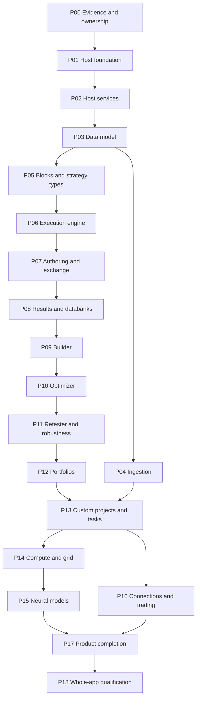

# SQX full-application reimplementation roadmap

Version: 1. Status: APPROVED ROADMAP. Planning document; not implementation authority.
Access date: 2026-10-06. Inventory execution: 2026-10-06T11:52:36.903148+00:00.
Repository audit HEAD: `a15014d17cf37f26ac538f75712a0b527e886274`.
Review: owner-approved for documentation publication on 2026-10-06;
proposed features, requirements and Python architecture remain unregistered.

## Charter

- Goal: an end-to-end phased route from the retained frontend to an independently
  qualified application covering all installed donor JARs and identified non-JAR
  product surfaces.
- Scope / object / subject: SQX-to-HaruQuantAI behavioral reimplementation /
  complete host, workspace and plugin capability graph / installed libraries,
  plugin archives, class/function declarations and supporting resources.
- Type: descriptive planning. Existing structural inventory is useful; most
  numerical, persistence, workflow and external-service behavior is unverified.
- Questions: where does each JAR belong; what proposed feature does it represent;
  which classes/functions seed its functional requirements; what Python owner
  would implement them; what evidence must pass before the feature is functional?
- This roadmap authorizes no feature registration, source implementation,
  dependency installation, database mutation, live trading or Git operation.

## Canonical sources and interpretation

1. Official intended-role sources, accessed 2026-10-06:
   [SQX public API](https://strategyquant.com/sqxapi/),
   [SQX extension introduction](https://strategyquant.com/doc/programming-for-sq/introduction-2/),
   [SQX logging and DebugConsole](https://strategyquant.com/doc/programming-for-sq/logging-and-debugcolsole/),
   [SLF4J manual](https://www.slf4j.org/manual.html), and
   [Logback architecture](https://logback.qos.ch/manual/architecture.html).
   These explain roles; they do not independently establish exact behavior of the
   installed build. Modern library manuals do not select target dependency versions.
2. Exact installed artifacts: `SQX_REFERENCE_ROOT/internal/libs/*.jar`,
   `SQX_REFERENCE_ROOT/internal/plugins/*/*.jar`,
   `SQX_REFERENCE_ROOT/j64/lib/jrt-fs.jar`, launcher strings, configuration,
   resource-only plugin directories and supporting web/resources.
   Inspection: read-only ZIP entry enumeration, SHA-256, class/member declarations
   with `javap -p`; earlier targeted `javap -c -p` reference inspection for host
   logging/discovery/web/jobs. No donor executable was launched for this roadmap.
3. Target authority: `HARUQUANTAI_ROOT/AGENTS.md`, canonical plan/walkthrough and
   Python module templates, `pyproject.toml`, `scripts/ci_check.py`,
   `ui/README.md`, host/workspace/plugin READMEs, and `docs/sqx`.
   Only the selected repository establishes its current ownership and status.

All repository paths in this document are relative to `HARUQUANTAI_ROOT`.
Every donor locator is relative to `SQX_REFERENCE_ROOT`; machine-specific
absolute paths are forbidden in saved evidence. Do not interpret a relative
donor locator as an executable instruction.

## Findings ledger

These are conversation/planning findings, not allocated SQX144 evidence records.
The authoritative ledger/schema have not been located; this document does not
replace them or allocate IDs.

| Finding | Classification / confidence | Evidence and limit |
| --- | --- | --- |
| F-ARCHIVE-INVENTORY | observed / high | ZIP entries and fingerprints for 261 JARs: 84 libraries, 176 plugin archives and one JVM runtime JAR; exact artifact fingerprints appear below. File presence does not establish runtime activation. |
| F-STRUCTURAL-REFERENCE | observed / high | `docs/sqx` has 183 archive references and 1,821 inventoried class entries; matching artifact hashes and declarations were independently checked during the preceding audit. This is structural, not algorithmic or runtime parity. |
| F-HOST-INFRASTRUCTURE | observed / high | `SQPluginManager` calls SLF4J and JSPF APIs; `AbstractUIWebServer` references Jetty and `MainApp/AppSettings`; `JobEngine` references fixed-thread-pool submission. Bytecode references do not establish complete lifecycle semantics. |
| F-COMMON-CORE-GAP | inferred / medium | Both launcher binaries contain `SQLib.jar`, startup and embedded-loader references, but no standalone SQLib archive or `com.strategyquant.lib` implementation classes were found in the 261 JAR inventory. Packaging/location is unresolved. |
| F-RESOURCE-ONLY-CONTRIBUTIONS | observed / high | 17 immediate plugin directories contain no JAR. Some contain registration/UI resources; two have no immediate files. Their responsibilities/activation require inspection. |
| F-TARGET-AUTHORITY-GAP | observed / high | `docs/PROJECT.md`, `docs/ARCHITECTURE.md` and authoritative reimplementation ledger/schema were not found at the referenced repository locations; UI READMEs refer to some missing documents. Restore/ratify authority before implementation. |
| F-PHASE-AND-PYTHON-MAPPING | normative / unverified | Phase order, proposed feature/FR IDs, Python paths, replacement dispositions and acceptance criteria below are target proposals, not donor behavior or registered implementation status. |
| F-FULL-FUNCTIONALITY | unverified / unverified | No donor-vs-target runtime/numerical/provider/desktop qualification was executed for this roadmap. A complete archive allocation is not a full-function or parity result. |

## Scope filter

Keep all 261 installed JARs in the feature allocation, including deferred grid,
neural, connection, business and tooling support. Add non-JAR contributions and
external dependencies needed for full application journeys. Do not infer that an
installed, legacy or empty archive is active or mandatory. Inventory completeness
is bounded to this installation snapshot; embedded payloads remain open.

## Object filter

The requested feature vocabulary is donor-aligned: a JAR is a proposed feature
unit; its observed classes and functions seed functional requirements. Python
ownership can split a large JAR across domain packages, while one target service
can satisfy several donor features. Shared infrastructure remains host-owned;
domain plugins own their algorithms and wire documents. Third-party/JVM internals
are covered by equivalent capabilities and adapters, not by automatically rewriting
every dependency class.

## Feature and functional-requirement model

- Each installed JAR has one unique proposed `FEAT-<OWNER>-<JAR-SLUG>` ID in
  the allocation tables. These are 261 traceability proposals, not additions to
  an owning README registry. Existing approved names take precedence when a
  future owner resolves duplication or adopts an alias.
- Each class-level `FR-*` describes its observable capability/contract.
  Function-level `FR-*` describes a separately testable operation of that class.
  Exact donor symbols remain references; FR labels are descriptive kebab-case,
  never arbitrary numbered requirements.
- The FR seed appendix gives an actually inspected representative class and up
  to two declared functions for each archive with available declarations.
  **It is a seed inventory, not all classes/functions.** Before implementing a
  feature, enumerate all relevant retained classes/functions and independently
  testable behavior, including defaults, inputs, outputs, state, errors and
  logging. The canonical JAR documents retain broader inventories/declarations
  where available.
- Declaration presence is observed; a proposed requirement mapping is normative;
  function behavior remains unverified until separately inspected/validated.
  Do not infer an algorithm from a class/function name or signature.
- Overloads/synthetic bridges/anonymous classes remain in structural traceability.
  Merge them into one FR only if they implement the same observable requirement;
  retain separate FRs where behavior is independently testable.
- A JAR with zero classes has a resource/registration-derived candidate FR.
  Do not invent a backend class to match the archive.
- A private helper may support an FR without being a public product capability.
  A getter does not prove how its value is produced.
- Preserve useful donor class/function boundaries and semantics, including inputs,
  outputs and failure behavior. Translating Java syntax alone does not preserve
  overflow, rounding, dates, RNG, concurrency, reflection or serialization.
- Donor informs; specification owns. Preserve clean-room evidence values:
  `contains_proprietary_source: false`,
  `contains_sensitive_data: false`, `contains_personal_data: false`,
  `paraphrased_behavior_only: true`. Store no method bodies or decompiled source
  in repository evidence. Independent Python adaptation follows the approved
  behavior specification and uses established Python libraries where appropriate.

## Delivery graph and phase index

This is proposed ordering, not elapsed-time estimates or implementation status.
A phase can contain several approved delivery cohorts. Primary JAR phase means
where responsibility is first resolved/implemented; shared classes can be sliced
earlier or consumed later without moving historical evidence.

| Phase | Description | Depends on | Primary JAR features |
| --- | --- | --- | ---: |
| P00 | Evidence, scope and ownership baseline | none | 1 |
| P01 | Host bootstrap, logging, configuration and diagnostics | P00 | 17 |
| P02 | Host discovery, transport, jobs, resource services and persistence | P01 | 26 |
| P03 | Data Manager: datasets, instruments, sessions and custom data | P02 | 11 |
| P04 | File ingestion, provider downloads and exchange data | P03 | 21 |
| P05 | Strategy vocabulary, indicator/block catalog and numerical primitives | P03 | 4 |
| P06 | Execution engine, accounting, trading options and stock picking | P02,P03,P05 | 4 |
| P07 | AlgoWizard, CodeEditor, custom resources and platform code generation | P02,P05,P06 | 16 |
| P08 | Databanks, results, chart projections, analysis and exports | P02,P06,P07 | 35 |
| P09 | Builder: generation, genetic search, improvement and ranking | P05,P06,P07,P08 | 12 |
| P10 | Optimizer: parameter search, sequential modes, walk-forward and matrix | P06,P08,P09 | 10 |
| P11 | Retester, robustness checks, Monte Carlo and What-If | P06,P08,P10 | 17 |
| P12 | Portfolio Composer, Portfolio Master and automatic portfolios | P08,P09,P10,P11 | 11 |
| P13 | Custom projects, Task Manager, conditions and task actions | P02,P04,P07,P08,P09,P10,P11,P12 | 44 |
| P14 | Grid Control, Grid Test and compute execution | P02,P06,P09,P10,P11,P13 | 11 |
| P15 | Neural Network Trainer and model resource lifecycle | P03,P05,P06,P08,P14 | 2 |
| P16 | Connections, terminal integration and explicitly authorized trading | P02,P03,P04,P06,P08,P13 | 5 |
| P17 | Product shells, business, help, MCP and desktop/distribution completion | P01,P02,P07,P08,P13,P14,P15,P16 | 14 |
| P18 | Whole-app integration and independently verified release | P00–P17 | 0 |

The graph shows the principal delivery path; the dependency column is authoritative
for this proposal. Useful vertical slices can ship earlier: P04 Data Manager
ingestion; P06 one-strategy execution; P08 persisted results; P09 genuine generation.
None is labelled the whole application.

## Common completion contract for every feature

1. Ratify the owning domain README `FEAT-*`, descriptive `FR-*` and applicable
   `DEC-*` IDs through the normal plan gate; README owns status.
2. Read both authoritative ledger and schema before any behavioral ledger edit.
   Allocate atomic evidence records with logical locators, narrow inspection
   locations/methods, fingerprints/access date, classification, limits, ownership,
   source commit/review state, and concrete validation expected observations.
3. Build a donor-symbol-to-FR-to-Python-symbol trace. Define typed signatures and
   exact input/output/state/failure policy; separate target decisions from facts.
4. Implement only approved paths; preserve public domain contracts rather than
   sharing domain internals. Install no unapproved new dependency.
5. Emit explicit requirement-associated success/error/cancellation events without
   sensitive data. Verify log delivery; silent execution is not acceptable.
6. Use isolated stores/resources and focused tests with explicit paths and
   `--no-cov`. Match approved donor fixtures/tolerances and verify negative cases.
7. Wire existing frontend flows to their owning typed client; remove mock success
   for the qualified capability and leave unavailable capabilities visibly honest.
8. Record actual commands/results, execution timestamps, differences and residual
   risks in the canonical walkthrough. Mark validation passed only with actual
   observations/artifacts/timestamp; do not infer a pass from declarations.
9. Preserve conflicting/historical evidence through linked superseding records.
   Feature delivery requires owner review; Git authority remains separate.

## Phased feature delivery

### P00 — Evidence, scope and ownership baseline

Dependencies: none. Primary donor JAR features: 1.

Freeze logical-root inventories; restore or locate canonical product/architecture and ledger/schema authority through an approved plan. Establish the donor version, activated products and capabilities, test datasets, UI journeys, and a class/function trace map before adapting behavior.

Donor JARs: `jrt-fs.jar`.

Proposed Python owners/files:

- `app/host/README.md`
- `app/workspace/<Domain>/README.md`
- `app/plugins/<Family>/<Plugin>/README.md`
- `tests/reference/{manifest,fixtures}.py`

Feature/FR scope: use the assigned `FEAT-*` IDs in the complete JAR allocation;
expand their observed class/function FR seeds before execution. Cross-cutting
requirements cover typed ownership, lifecycle, logging, version compatibility,
failure behavior and evidence verification under the common completion contract.

Outputs: Jar fingerprints; workspace/feature ownership; donor behavior specifications; versioned fixtures; explicit unresolved cases.

Exit evidence: Every archive and resource-only contribution has a disposition; missing common-core packaging and active/inactive registrations are recorded. Owner ratifies the release matrix, numerical tolerances and initial feature registrations; no inferred behavior is marked verified.

### P01 — Host bootstrap, logging, configuration and diagnostics

Dependencies: P00. Primary donor JAR features: 17.

Build process startup/shutdown, deterministic configuration precedence, host-owned logging sinks/redaction, resource paths, diagnostic health and debug-log projections. Investigate MainApp/AppSettings/startup symbols and unresolved SQLib packaging. Preserve useful donor lifecycle boundaries without translating Java runtime internals.

Donor JARs: `commons-beanutils.jar`, `commons-codec.jar`, `commons-collections.jar`, `commons-io-icm.jar`, `commons-io.jar`, `commons-lang3.jar`, `commons-logging.jar`, `guava.jar`, `jna-platform.jar`, `jna.jar`, `jProcesses.jar`, `logback-classic.jar`, `logback-core.jar`, `oshi-core.jar`, `PSUtils.jar`, `slf4j-api.jar`, `AppDebugConsole.jar`.

Proposed Python owners/files:

- `app/main.py`
- `app/host/{bootstrap,lifecycle,settings,paths,health}.py`
- `app/host/logging/{setup,sinks,redaction}.py`
- `app/host/platform/{processes,diagnostics}.py`
- `app/workspace/DebugConsole/{routes,contracts}.py`

Feature/FR scope: use the assigned `FEAT-*` IDs in the complete JAR allocation;
expand their observed class/function FR seeds before execution. Cross-cutting
requirements cover typed ownership, lifecycle, logging, version compatibility,
failure behavior and evidence verification under the common completion contract.

Outputs: Observable boot/readiness/error states, sanitized logs and diagnostics, settings validation, clean shutdown.

Exit evidence: A fresh process can boot and stop; invalid configuration fails visibly; redaction and sink failures have tested outcomes. The DebugConsole UI consumes real logs through a typed host projection rather than fixtures.

### P02 — Host discovery, transport, jobs, resource services and persistence

Dependencies: P01. Primary donor JAR features: 26.

Ratify typed capability discovery and contributions, compatibility checks, mount/unmount semantics, session authority, HTTP/event envelopes, cancellation/backpressure, document validation and host-owned storage. Reuse existing declared FastAPI/Pydantic/Uvicorn packages where they meet the approved contract. Database drivers are donor evidence, not an approved choice of target store.

Donor JARs: `caffeine-2.8.5.jar`, `conscrypt-openjdk-uber.jar`, `fastutil.jar`, `fst.jar`, `geronimo-json.jar`, `h2.jar`, `jackson-annotations.jar`, `jackson-core.jar`, `jackson-databind.jar`, `jdom.jar`, `jetty-all-uber.jar`, `jetty-alpn-conscrypt-server.jar`, `jetty-alpn-java-server.jar`, `jetty-alpn-server.jar`, `json-schema-validator.jar`, `json.jar`, `jspf.core.jar`, `lzma.jar`, `objenesis.jar`, `reactive-streams.jar`, `reactor-core.jar`, `SQJobsLib.jar`, `sqlite-jdbc.jar`, `SQPluginLib.jar`, `SQWebGUILib.jar`, `zip4j.jar`.

Proposed Python owners/files:

- `app/host/discovery/{contracts,registry,loader}.py`
- `app/host/transport/{server,routes,session,events}.py`
- `app/host/jobs/{contracts,scheduler,events}.py`
- `app/host/documents/{json_codec,xml_codec,validation}.py`
- `app/host/persistence/{store,transactions,retention}.py`
- `app/host/resources/{archives,cache,limits}.py`

Feature/FR scope: use the assigned `FEAT-*` IDs in the complete JAR allocation;
expand their observed class/function FR seeds before execution. Cross-cutting
requirements cover typed ownership, lifecycle, logging, version compatibility,
failure behavior and evidence verification under the common completion contract.

Outputs: Ready catalog, typed requests/responses/errors, job IDs/events, resource handles and isolated persistence transactions.

Exit evidence: UI login/readiness/settings operate against real backend state. Missing optional capabilities disable only dependent operations; unmount and shutdown release jobs/resources; unauthorized calls fail closed. Stores survive restart in isolated fixtures; no live-store migration occurs without a distinct approved plan.

### P03 — Data Manager: datasets, instruments, sessions and custom data

Dependencies: P02. Primary donor JAR features: 11.

Implement market-data definitions, instruments/brokers, symbol metadata, calendars/sessions, custom bar types, baskets, custom data, readers/writers and dataset lifecycle. Inspect price/time units, time zones, gaps, precision, retention and metadata before selecting representations.

Donor JARs: `joda-time.jar`, `SQDataLib.jar`, `AppDataManager.jar`, `DataManagerBasket.jar`, `DataManagerBroker.jar`, `DataManagerCustomData.jar`, `DataManagerData.jar`, `DataManagerHome.jar`, `DataManagerInstruments.jar`, `DataManagerSessions.jar`, `SettingsData.jar`.

Non-JAR donor contributions: `DataManagerActions`, `DataManagerHelp`.

Proposed Python owners/files:

- `app/workspace/DataManager/{workspace,routes,contracts}.py`
- `app/plugins/data/{models,bars,sessions,selection,storage}.py`
- `app/workspace/DataManager/DataManagerData/{service,routes,contracts}.py`
- `app/workspace/DataManager/DataManagerInstruments/{service,routes,contracts}.py`
- `app/workspace/DataManager/DataManagerSessions/{service,routes,contracts}.py`

Feature/FR scope: use the assigned `FEAT-*` IDs in the complete JAR allocation;
expand their observed class/function FR seeds before execution. Cross-cutting
requirements cover typed ownership, lifecycle, logging, version compatibility,
failure behavior and evidence verification under the common completion contract.

Outputs: Durable dataset and instrument IDs, validated time series, session definitions, custom-bar metadata and data-selection documents.

Exit evidence: Create/edit/import/delete isolated datasets through the UI and reload them. Validate DST/session boundaries, duplicate/out-of-order records, rounding, insufficient data and cancellation. Destructive dataset operations have explicit authority and retain unaffected data.

### P04 — File ingestion, provider downloads and exchange data

Dependencies: P03. Primary donor JAR features: 21.

Implement donor-owned file parsing, provider catalogs, symbol mapping, pagination/rate policies, downloads, update jobs, normalization and import logs. All named providers remain on the roadmap; outdated APIs or vendor data licensing are recorded as availability gaps instead of being silently omitted.

Donor JARs: `httpasyncclient.jar`, `httpclient-cache.jar`, `httpclient.jar`, `httpcore-nio.jar`, `httpcore.jar`, `CryptoExchangeBinance.jar`, `CryptoExchangeBinanceCoinM.jar`, `CryptoExchangeBinanceUsdtM.jar`, `CryptoExchangeBitfinex.jar`, `CryptoExchangeCoinbasePro.jar`, `CryptoExchangePoloniex.jar`, `DataSourceCrypto.jar`, `DataSourceDarwinex.jar`, `DataSourceDukascopy.jar`, `DataSourceFiles.jar`, `DataSourceMt5Api.jar`, `DataSourceSQEquityData.jar`, `DataSourceSQFuturesData.jar`, `DataSourceTD.jar`, `DataSourceYahoo.jar`, `ServletYahoo.jar`.

Non-JAR donor contributions: `DataManagerLog`.

Proposed Python owners/files:

- `app/host/integrations/{http,retry,rate_limit}.py`
- `app/plugins/data_source/FileImport/{service,routes,parser,normalization}.py`
- `app/plugins/data_source/Dukascopy/{service,client,normalization}.py`
- `app/plugins/data_source/Darwinex/{service,client,normalization}.py`
- `app/plugins/data_source/MetaTrader/{service,client,normalization}.py`
- `app/plugins/data_source/SQData/{service,client,normalization}.py`
- `app/plugins/data_source/Crypto/<Exchange>/{client,normalization}.py`

Feature/FR scope: use the assigned `FEAT-*` IDs in the complete JAR allocation;
expand their observed class/function FR seeds before execution. Cross-cutting
requirements cover typed ownership, lifecycle, logging, version compatibility,
failure behavior and evidence verification under the common completion contract.

Outputs: Normalized imports/downloads, resumable or explicitly restartable jobs, provenance and actionable provider errors.

Exit evidence: All donor provider registrations have tested supported or unavailable states. File-format fixtures and provider sandboxes verify input/output mappings, partial failures, retries and cancellation. An unreachable provider is not counted as functional parity.

### P05 — Strategy vocabulary, indicator/block catalog and numerical primitives

Dependencies: P03. Primary donor JAR features: 4.

Inspect every Snippets family and indicator implementation needed by the build/authoring/runtime catalog. Capture exact consumed class/function signatures, parameter defaults, warm-up, units, missing values and indicator formulas as behavior specifications. Preserve donor concepts and function semantics while using independently adapted typed Python implementations and established numerical dependencies.

Donor JARs: `Snippets.jar`, `ta-lib.jar`, `ServletConstants.jar`, `SettingsBlocks.jar`.

Proposed Python owners/files:

- `app/plugins/indicators/{catalog,base,validation,contracts}.py`
- `app/plugins/indicators/impl/<Indicator>.py`
- `app/plugins/strategy/{nodes,parameters,types,validation}.py`
- `app/plugins/expressions/{operators,functions,evaluator}.py`

Feature/FR scope: use the assigned `FEAT-*` IDs in the complete JAR allocation;
expand their observed class/function FR seeds before execution. Cross-cutting
requirements cover typed ownership, lifecycle, logging, version compatibility,
failure behavior and evidence verification under the common completion contract.

Outputs: Versioned executable block catalog, strategy node/port types, parameter schemas and primitive functions.

Exit evidence: Every enabled catalog entry has a donor-symbol trace and fixture for defaults, warm-up, boundary values and invalid input. The UI fetches authoritative schemas; no duplicate frontend numerical policy survives. Unknown resource versions remain lossless but non-executable.

### P06 — Execution engine, accounting, trading options and stock picking

Dependencies: P02,P03,P05. Primary donor JAR features: 4.

Implement deterministic strategy evaluation, data alignment, order/fill rules, sizing, commissions/slippage, account state, advanced management, stock-selection execution and base metrics. Inspect bar/tick event order, same-bar precedence, rounding, pyramiding, session effects and error behavior before asserting equivalence.

Donor JARs: `SQTradingLib.jar`, `SettingsAdvancedTM.jar`, `SettingsMoneyManagement.jar`, `SettingsOptions.jar`.

Proposed Python owners/files:

- `app/plugins/simulator/{engine,clock,orders,fills,accounting,management,sizing,contracts}.py`
- `app/plugins/strategy/{compiler,runtime}.py`
- `app/plugins/stock_picking/{engine,selection}.py`
- `app/plugins/statistics/{metrics,samples}.py`

Feature/FR scope: use the assigned `FEAT-*` IDs in the complete JAR allocation;
expand their observed class/function FR seeds before execution. Cross-cutting
requirements cover typed ownership, lifecycle, logging, version compatibility,
failure behavior and evidence verification under the common completion contract.

Outputs: Immutable run configuration, trade/order ledger, equity/account series, result artifacts and traceable execution failures.

Exit evidence: Differential donor fixtures compare event traces, trades and PnL under ratified tolerances; adversarial same-bar/session/gap cases are covered. One real strategy can run on one real fixture dataset through the UI. No live trading is enabled.

### P07 — AlgoWizard, CodeEditor, custom resources and platform code generation

Dependencies: P02,P05,P06. Primary donor JAR features: 16.

Connect authoring drafts to executable validated strategies, indicator qualification, custom resources, strategy import/export and target-language generation. Inspect native SQ3/SQ4 formats and templates, authoring lowering rules and resource compilation errors. Java bytecode compilation is a donor mechanism; the Python extension mechanism requires a ratified trust/execution contract.

Donor JARs: `freemarker.jar`, `javassist.jar`, `SQWizardBusiness.jar`, `AppCodeEditor.jar`, `AppWizard.jar`, `CodeEditorImportExport.jar`, `CodeEditorIndicatorTester.jar`, `LoaderSQ3.jar`, `LoaderSQ4.jar`, `ResultsSourceCode.jar`, `SaverSQ3.jar`, `ServletAlgoWizard.jar`, `ServletCodeEditor.jar`, `ServletIndicatorTester.jar`, `ServletStrategy.jar`, `ServletWizard.jar`.

Non-JAR donor contributions: `ProjectResources`.

Proposed Python owners/files:

- `app/workspace/AlgoWizard/{workspace,service,routes,contracts}.py`
- `app/workspace/CodeEditor/{workspace,service,routes,resources}.py`
- `app/plugins/strategy/{archive,codec,repository}.py`
- `app/plugins/code_generation/{templates,emitters,validation}.py`
- `app/plugins/extensions/{loader,qualification}.py`

Feature/FR scope: use the assigned `FEAT-*` IDs in the complete JAR allocation;
expand their observed class/function FR seeds before execution. Cross-cutting
requirements cover typed ownership, lifecycle, logging, version compatibility,
failure behavior and evidence verification under the common completion contract.

Outputs: Saved executable strategy revisions, resource catalogs, supported exchange formats and generated platform code.

Exit evidence: Author-save-reload-run round trips preserve semantics. Indicator tests execute genuine fixtures; malformed/custom-resource failures are visible. Each promised output target passes syntax/compilation qualification in its supported toolchain; unsupported targets remain explicit gaps.

### P08 — Databanks, results, chart projections, analysis and exports

Dependencies: P02,P06,P07. Primary donor JAR features: 35.

Replace databank/result fixtures with authoritative stores and projections: views/actions/rename, filtering/correlation, trade lists, equity/benchmark/drawdown/volatility/volume, stockpicker reports, exploration, plugin results and artifact exports. Metric definitions come from verified Snippets/trading functions, not chart labels.

Donor JARs: `commons-imaging.jar`, `image4j.jar`, `java-image-scaling-0.8.6.jar`, `pd4ml.jar`, `pngj.jar`, `poi-ooxml-schemas.jar`, `poi-ooxml.jar`, `poi.jar`, `xmlbeans.jar`, `AppResults.jar`, `DatabankFilterByCorrelation.jar`, `DatabankRename.jar`, `EquityChartBenchmark.jar`, `EquityChartDailyChart.jar`, `EquityChartDrawdown.jar`, `EquityChartVolatility.jar`, `EquityChartVolume.jar`, `ResultsChart.jar`, `ResultsDatabankActions.jar`, `ResultsDatabankViews.jar`, `ResultsEquityChart.jar`, `ResultsExplore.jar`, `ResultsOverview.jar`, `ResultsPlugins.jar`, `ResultsSPOverview.jar`, `ResultsStockpicker.jar`, `ResultsStrategyConfig.jar`, `ResultsTradeAnalysis.jar`, `ResultsTradeList.jar`, `ResultsTradelistViews.jar`, `SaverHTML.jar`, `SaverPDF.jar`, `SaverStrategyTrades.jar`, `ServletDatabankViews.jar`, `ServletRenameTool.jar`.

Non-JAR donor contributions: `CustomDatabankActions`, `CustomResultsPluginActions`, `ProjectDatabanks`, `ProjectResults`, `ResultsReport`.

Proposed Python owners/files:

- `app/plugins/databank/{repository,views,actions,contracts}.py`
- `app/plugins/results/{service,series,trade_analysis,contracts}.py`
- `app/plugins/export/{html,pdf,spreadsheet,images,trades}.py`
- `app/workspace/Results/{workspace,routes,contracts}.py`
- `app/workspace/Chart/{workspace,routes,contracts}.py`

Feature/FR scope: use the assigned `FEAT-*` IDs in the complete JAR allocation;
expand their observed class/function FR seeds before execution. Cross-cutting
requirements cover typed ownership, lifecycle, logging, version compatibility,
failure behavior and evidence verification under the common completion contract.

Outputs: Durable databanks/results, real charts/tables, versioned result views and downloadable artifacts.

Exit evidence: A completed P06 run populates tables/charts and survives restart. Filters/actions use authoritative values, exports reconcile with stored results, and deletion/rename/history have isolated tests. Results needed by later optimization/portfolio phases are reusable contracts rather than fake fixtures.

### P09 — Builder: generation, genetic search, improvement and ranking

Dependencies: P05,P06,P07,P08. Primary donor JAR features: 12.

Implement build generation, genetic options, selected block/resource constraints, fitness/ranking/filtering, improve-existing-strategy mode, islands/evolution and real progress/best-result feeds. Adopt donor function boundaries where evidence supports them; verify random seeds, stopping rules, duplicate handling, generation constraints and fitness definitions.

Donor JARs: `commons-math3-3.6.1.jar`, `uncommons-maths.jar`, `watchmaker-framework.jar`, `AppBuilder.jar`, `DashboardResults.jar`, `EnginePanel.jar`, `FitnessMethodStrategyResult.jar`, `ServletBuilder.jar`, `SettingsPartsToImprove.jar`, `SettingsRankings.jar`, `SettingsWhatToBuild.jar`, `TaskBuild.jar`.

Non-JAR donor contributions: `DashboardPanel`, `SettingsGeneticOptions`.

Proposed Python owners/files:

- `app/workspace/Builder/{workspace,service,settings,progress,fitness,contracts}.py`
- `app/plugins/generation/{randomness,genetics,search,improvement}.py`
- `app/plugins/ranking/{fitness,filters}.py`

Feature/FR scope: use the assigned `FEAT-*` IDs in the complete JAR allocation;
expand their observed class/function FR seeds before execution. Cross-cutting
requirements cover typed ownership, lifecycle, logging, version compatibility,
failure behavior and evidence verification under the common completion contract.

Outputs: Generated executable strategies, build run states/statistics, best results and persisted configurations.

Exit evidence: Start/pause/resume/stop operate on real jobs and retain ownership. Fixed-seed bounded experiments are reproducible; constraints and stopping rules have fixtures. UI chart/ranking values reconcile with stored generation and simulator evidence.

### P10 — Optimizer: parameter search, sequential modes, walk-forward and matrix

Dependencies: P06,P08,P09. Primary donor JAR features: 10.

Implement simple/sequential search, parameter range derivation, optimization profiles, walk-forward partitions/matrices and WF fitness. Verify objective selection, search order, parameter application, sample boundaries, leakage prevention, tie-breaking and repeated-run behavior.

Donor JARs: `AppOptimizer.jar`, `FitnessMethodWFResult.jar`, `ProjectOptimizer.jar`, `ResultsOptimizationProfile.jar`, `ResultsProfileChart.jar`, `ResultsSequentialOptimization.jar`, `ResultsSysParamPermutation.jar`, `ResultsWalkForward.jar`, `SettingsOptimization.jar`, `TaskOptimize.jar`.

Proposed Python owners/files:

- `app/workspace/Optimizer/{workspace,service,routes,contracts}.py`
- `app/plugins/optimization/{ranges,search,sequential,walk_forward,matrix,profiles}.py`

Feature/FR scope: use the assigned `FEAT-*` IDs in the complete JAR allocation;
expand their observed class/function FR seeds before execution. Cross-cutting
requirements cover typed ownership, lifecycle, logging, version compatibility,
failure behavior and evidence verification under the common completion contract.

Outputs: Optimization plans/results, best parameter sets, fold/matrix artifacts and profile projections.

Exit evidence: Small exhaustive donor fixtures verify candidate counts/objectives/selected parameters; walk-forward folds and OOS application are independently reproducible. Applying parameters creates a legitimate strategy revision and refreshes the associated results.

### P11 — Retester, robustness checks, Monte Carlo and What-If

Dependencies: P06,P08,P10. Primary donor JAR features: 17.

Implement base/automatic retest, higher-precision/additional-market checks, Monte Carlo trade manipulation/retest, What-If, optimization/system-parameter permutation, sequential/WF/matrix cross checks and robustness result assembly. Separate each check's selection/configuration from its numerical execution and reporting.

Donor JARs: `AppRetester.jar`, `CrossCheckMonteCarloManipulation.jar`, `CrossCheckMonteCarloRetest.jar`, `CrossCheckOptProfileSysParamPermutation.jar`, `CrossCheckRetestOnAdditionalMarkets.jar`, `CrossCheckRetestWithHigherPrecision.jar`, `CrossCheckSequentialOptimization.jar`, `CrossCheckWalkForwardMatrix.jar`, `CrossCheckWalkForwardOptimization.jar`, `CrossCheckWhatIf.jar`, `ProjectRetester.jar`, `ResultsRobustnessTests.jar`, `SettingsAutoRetestData.jar`, `SettingsCrossChecks.jar`, `SettingsWhatToRetest.jar`, `TaskAutomaticRetest.jar`, `TaskRetest.jar`.

Non-JAR donor contributions: `SettingsAutomaticRetest`.

Proposed Python owners/files:

- `app/workspace/Retester/{workspace,service,routes,contracts}.py`
- `app/plugins/cross_checks/{catalog,runner,contracts}.py`
- `app/plugins/cross_checks/<Check>/{check,settings}.py`
- `app/plugins/robustness/{monte_carlo,what_if,aggregation}.py`

Feature/FR scope: use the assigned `FEAT-*` IDs in the complete JAR allocation;
expand their observed class/function FR seeds before execution. Cross-cutting
requirements cover typed ownership, lifecycle, logging, version compatibility,
failure behavior and evidence verification under the common completion contract.

Outputs: Real retest/cross-check runs, distributions, pass/fail criteria and detailed reproducible results.

Exit evidence: Every donor check registration is accounted for, with deterministic seeds and verified acceptance rules. UI per-check dialogs drive real configuration; failed/unsupported checks remain visible. Results distinguish IS/OOS and run provenance without leaking future data.

### P12 — Portfolio Composer, Portfolio Master and automatic portfolios

Dependencies: P08,P09,P10,P11. Primary donor JAR features: 11.

Implement portfolio merging/normalization, selection/search, strategy correlation, portfolio fitness, automatic portfolio building, creation tasks and portfolio-specific logs/charts. Validate exposure/netting/account assumptions and timestamp alignment instead of assuming a sum of scalar strategy metrics.

Donor JARs: `AppPortfolioComposer.jar`, `AppPortfolioMaster.jar`, `FitnessMethodExistingPortfolio.jar`, `PortfolioComposer.jar`, `ResultsPortfolioComposerChart.jar`, `ResultsPortfolioComposerLog.jar`, `ResultsPortfolioCorrelation.jar`, `SettingsAutomaticPortfolioBuilder.jar`, `SettingsCreatePortfolio.jar`, `TaskAutomaticPortfolioBuilder.jar`, `TaskCreatePortfolio.jar`.

Proposed Python owners/files:

- `app/workspace/PortfolioComposer/{workspace,service,routes,contracts}.py`
- `app/workspace/PortfolioMaster/{workspace,service,routes,contracts}.py`
- `app/plugins/portfolio/{composition,search,correlation,fitness,contracts}.py`

Feature/FR scope: use the assigned `FEAT-*` IDs in the complete JAR allocation;
expand their observed class/function FR seeds before execution. Cross-cutting
requirements cover typed ownership, lifecycle, logging, version compatibility,
failure behavior and evidence verification under the common completion contract.

Outputs: Durable portfolios, compositional trade/equity ledgers, search outputs and portfolio result projections.

Exit evidence: Known small portfolio fixtures reconcile constituent and combined trades/exposures/metrics. Search constraints/fitness reproduce bounded donor cases; save/reload/run/export operate end to end through both portfolio workspaces.

### P13 — Custom projects, Task Manager, conditions and task actions

Dependencies: P02,P04,P07,P08,P09,P10,P11,P12. Primary donor JAR features: 44.

Implement persisted task/project workflows, conditions/loops/transitions, task copying/configuration, filtering, mass config, file load/save/delete, databank clearing/stats, resource updates, custom analysis, notifications, external scripts and waits. Earlier workspaces may consume basic task documents; this phase completes orchestration and action coverage.

Donor JARs: `activation.jar`, `commons-email.jar`, `commons-exec.jar`, `javax-mail.jar`, `AppTaskManager.jar`, `ProjectConditionCyclesCount.jar`, `ProjectConditionDuration.jar`, `ProjectConditionGoToActivated.jar`, `ProjectConditionGoToEvaluated.jar`, `ProjectConditionResultsCount.jar`, `ProjectConditionRunTime.jar`, `ServletProject.jar`, `ServletProjectOld.jar`, `SettingsApplyMassConfig.jar`, `SettingsCallExternalScript.jar`, `SettingsClearDatabanks.jar`, `SettingsCustomAnalysis.jar`, `SettingsDatabanks.jar`, `SettingsDeleteFile.jar`, `SettingsFiltering.jar`, `SettingsGoToTask.jar`, `SettingsLoadFromFiles.jar`, `SettingsLogDatabankStats.jar`, `SettingsNotes.jar`, `SettingsNotification.jar`, `SettingsSaveToFiles.jar`, `SettingsStopAndStart.jar`, `SettingsUpdateData.jar`, `SettingsWaitFor.jar`, `TaskApplyMassConfig.jar`, `TaskCallExternalScript.jar`, `TaskClearDatabanks.jar`, `TaskCustomAnalysis.jar`, `TaskDeleteFile.jar`, `TaskFiltering.jar`, `TaskGoToTask.jar`, `TaskLoadFromFiles.jar`, `TaskLogDatabankStats.jar`, `TaskManagerProjects.jar`, `TaskNotification.jar`, `TaskSaveToFiles.jar`, `TaskStopAndStart.jar`, `TaskUpdateData.jar`, `TaskWaitFor.jar`.

Non-JAR donor contributions: `ProjectSettings`, `SettingsPanel`, `TaskManagerTasks`.

Proposed Python owners/files:

- `app/workspace/CustomProjects/{workspace,service,routes,contracts}.py`
- `app/plugins/project/ProjectWorkbench/{contracts,repository,scheduler}.py`
- `app/plugins/project/{conditions,transitions,resources}.py`
- `app/plugins/tasks/<Task>/{task,settings,contracts}.py`
- `app/plugins/tasks/{notifications,external_process}.py`

Feature/FR scope: use the assigned `FEAT-*` IDs in the complete JAR allocation;
expand their observed class/function FR seeds before execution. Cross-cutting
requirements cover typed ownership, lifecycle, logging, version compatibility,
failure behavior and evidence verification under the common completion contract.

Outputs: Persisted executable workflow graph, owned task runs/resources, conditions and authorized action results.

Exit evidence: A bounded pipeline imports data, builds, retests, filters, creates a portfolio and exports actual artifacts. Recovery/restart/loop/cancel/error states are verified; external-script and destructive actions require their specific authority and use isolated stores/files in tests.

### P14 — Grid Control, Grid Test and compute execution

Dependencies: P02,P06,P09,P10,P11,P13. Primary donor JAR features: 11.

Implement the required compute abstraction, worker registration/health, queueing, task serialization, result reconciliation, messaging, remote discovery and Grid Test benchmarks. Inspect which SQGridLib2 functionality earlier phases actually consume; provide minimal local execution earlier without claiming distributed parity.

Donor JARs: `affinity.jar`, `artemis-commons.jar`, `artemis-core-client.jar`, `artemis-jms-client.jar`, `artemis-selector.jar`, `geronimo-jms.jar`, `jspf.remote.jar`, `SQGridLib2.jar`, `AppGridControl.jar`, `AppGridTest.jar`, `ServletGridControl.jar`.

Proposed Python owners/files:

- `app/workspace/GridControl/{workspace,routes,contracts}.py`
- `app/workspace/GridTest/{workspace,benchmarks,contracts}.py`
- `app/plugins/compute/{workers,protocol,queue,placement,reconciliation}.py`

Feature/FR scope: use the assigned `FEAT-*` IDs in the complete JAR allocation;
expand their observed class/function FR seeds before execution. Cross-cutting
requirements cover typed ownership, lifecycle, logging, version compatibility,
failure behavior and evidence verification under the common completion contract.

Outputs: Owned worker pool, bounded job protocol, diagnostics and validated compute results.

Exit evidence: The same fixed-seed workload reconciles between local and supported worker configurations. Worker loss/timeouts/duplicate delivery/cancellation are tested; benchmark outputs identify actual workload/hardware. Queue failure does not corrupt result stores.

### P15 — Neural Network Trainer and model resource lifecycle

Dependencies: P03,P05,P06,P08,P14. Primary donor JAR features: 2.

Inspect actual trainer/model artifacts and discover any donor implementation outside the visible one-class task and two-class App archives. Implement model dataset/feature construction, validation, training jobs, artifacts and inference only once algorithm/schema evidence is sufficient; do not invent an unobserved model family.

Donor JARs: `AppNeuralNetwork.jar`, `TaskNeuralNetworkTrainer.jar`.

Proposed Python owners/files:

- `app/workspace/NeuralNetwork/{workspace,datasets,training,models,routes,contracts}.py`
- `app/plugins/models/{repository,inference,validation}.py`

Feature/FR scope: use the assigned `FEAT-*` IDs in the complete JAR allocation;
expand their observed class/function FR seeds before execution. Cross-cutting
requirements cover typed ownership, lifecycle, logging, version compatibility,
failure behavior and evidence verification under the common completion contract.

Outputs: Versioned model resources, genuine training/evaluation outputs and executable model references.

Exit evidence: Trainer algorithm and artifact format are evidenced or explicitly blocked. Seeded bounded training avoids leakage and supports cancellation/reload; model inference is independently validated and exposed to consuming strategy workflows.

### P16 — Connections, terminal integration and explicitly authorized trading

Dependencies: P02,P03,P04,P06,P08,P13. Primary donor JAR features: 5.

Complete live/test connection semantics, MT4/terminal bridges, market/order events and any independently evidenced exchange execution capabilities. Historical-data adapters remain distinct from order authority. Discover no-JAR Trading/MTAnalyzer implementation and product activation before promising exact donor workflows.

Donor JARs: `ConnectionLiveTest.jar`, `ConnectionMT4.jar`, `ConnectionTest.jar`, `DataManagerConnections.jar`, `ServletConnection.jar`.

Proposed Python owners/files:

- `app/plugins/connections/<Connection>/{service,protocol,events,contracts}.py`
- `app/workspace/Trading/{workspace,service,routes,contracts}.py`
- `app/workspace/MTAnalyzer/{workspace,service,routes,contracts}.py`
- `app/plugins/execution/{orders,reconciliation,authority}.py`

Feature/FR scope: use the assigned `FEAT-*` IDs in the complete JAR allocation;
expand their observed class/function FR seeds before execution. Cross-cutting
requirements cover typed ownership, lifecycle, logging, version compatibility,
failure behavior and evidence verification under the common completion contract.

Outputs: Verified test/paper connections and terminal/account/event projections; live effects only after a distinct owner gate.

Exit evidence: Fake/sandbox peers verify handshake, order state, duplicate/out-of-order events, reconnect and reconciliation. Separate approval is required for live trading and other irreversible effects. Provider/terminal access gaps block the corresponding full-function claim.

### P17 — Product shells, business, help, MCP and desktop/distribution completion

Dependencies: P01,P02,P07,P08,P13,P14,P15,P16. Primary donor JAR features: 14.

Complete product/workspace composition, Home/Help/About, Business/QDM surfaces, payment/license-state UX, optional MCP, desktop lifecycle, update/distribution and platform-specific UI behavior. Track referenced but absent updater libraries and service dependencies. Target licensing/distribution policy is an owner decision; reproducing a UI does not reproduce vendor entitlement/payment services.

Donor JARs: `jfx_2.4.9_sq.jar`, `mcp-core.jar`, `mcp-json-jackson2.jar`, `swingx.jar`, `weblaf.jar`, `AppHelp.jar`, `AppHome.jar`, `AppPaymentDialog.jar`, `AppQuantDataManager.jar`, `AppSQXBusiness.jar`, `AppSQXHome.jar`, `AppStrategyQuant.jar`, `HomeAbout.jar`, `ServletMCP.jar`.

Non-JAR donor contributions: `SkinDark`, `SkinLight`.

Proposed Python owners/files:

- `app/workspace/Home/{workspace,help,about,routes}.py`
- `app/workspace/Business/{workspace,service,contracts}.py`
- `app/host/desktop/{bridge,lifecycle}.py`
- `app/plugins/mcp/{server,tools,contracts}.py`
- `app/host/distribution/{packaging,updates}.py`

Feature/FR scope: use the assigned `FEAT-*` IDs in the complete JAR allocation;
expand their observed class/function FR seeds before execution. Cross-cutting
requirements cover typed ownership, lifecycle, logging, version compatibility,
failure behavior and evidence verification under the common completion contract.

Outputs: Complete navigable product catalog, honest capability/entitlement states, qualified MCP tools and installed application lifecycle.

Exit evidence: Every observed workspace/registration has a verified enabled/unavailable/retired disposition. Real backend services replace retained mock confirmations. Packaging/start/restart/update paths are tested in isolated installations; external business services remain explicit blockers where access is absent.

### P18 — Whole-app integration and independently verified release

Dependencies: P00–P17. Primary donor JAR features: 0.

Run the ratified workflow/parity matrix across workspaces, libraries, resource-only plugins and non-JAR resources. Reconcile contracts, data formats, numerical behavior, failure/recovery, desktop actions, optional capabilities and removal behavior. Close all accepted release-scope gaps before claiming full functionality.

No new primary JAR allocation. This phase consumes evidence/capabilities from the earlier phases.

Proposed Python owners/files:

- `tests/integration/<Domain>/*.py`
- `tests/reference/<Capability>/*.py`
- `ui/tests/e2e/<Workflow>.spec.ts`
- `scripts/ci_check.py`
- `docs/dev/sqx-parity-release-matrix.md`

Feature/FR scope: use the assigned `FEAT-*` IDs in the complete JAR allocation;
expand their observed class/function FR seeds before execution. Cross-cutting
requirements cover typed ownership, lifecycle, logging, version compatibility,
failure behavior and evidence verification under the common completion contract.

Outputs: Reproducible release candidate, completed qualification evidence, owner-reviewed walkthroughs and capability-specific parity statements.

Exit evidence: No promised workflow is fixture-driven; differential cases and failure tests pass under explicit versions/tolerances; retained Python source reaches the prescribed branch-aware coverage. Unverified/unavailable behavior is not relabeled as passing. Commits/publication require owner authority.

## Shared libraries across phases: avoid false all-or-nothing dependencies

| JAR feature | Primary phase | Required slices / later consumers |
| --- | --- | --- |
| `FEAT-SHARED-SQ-TRADING-LIB` | P06 | Extract evidenced task/strategy/result interfaces needed in P02/P05/P07/P08 and later build/optimization/portfolio/project work; simulator algorithms remain simulator-owned. JobEngine's ISQTask dependency does not put trading knowledge into the host. |
| `FEAT-SHARED-SNIPPETS` | P05 | Block/indicator vocabulary P05; sizing/exits/trading options P06; columns/stats/trade analysis P08; fitness P09/P12; Monte Carlo/What-If P11; custom analysis/task functions P13. Enumerate all 23 observed Snippets package families before closing this feature. |
| `FEAT-DATA-SQ-DATA-LIB` | P03 | Dataset/bar/instrument/session contracts support ingestion, execution, authoring, search, portfolios and connections. |
| `FEAT-COMPUTE-SQ-GRID-LIB2` | P14 | Investigate local-compute interfaces needed by earlier execution/search cohorts; complete distributed grid/message behavior in P14. An approved local scheduler is not a claim of SQGrid parity. |
| `FEAT-AUTHORING-SQ-WIZARD-BUSINESS` | P07 | Resource/indicator loading and authoring support; determine actual consumers rather than deriving ownership from the library name. |
| Logging / document / HTTP / storage dependencies | P01–P04 | Host exposes typed capabilities; plugins consume them. A library's presence does not approve every service it could support. |

For each consumed slice retain one exclusive target owner and a source-symbol
trace. Shared donor packaging is not permission for sibling plugins to import each
other's internals.

## Proposed target decisions to ratify before implementation

These decision names are proposals, not registered `DEC-*` records.

| Proposed decision | Required outcome |
| --- | --- |
| `DEC-SQX-JAR-FEATURE-TRACEABILITY` | JAR-derived feature identity and class/function-derived FR traceability, including classless/runtime/replaced dependencies and aliases to existing features. |
| `DEC-HOST-CAPABILITY-OWNERSHIP` | Host-owned shared services; workspace/plugin-owned public contracts and algorithms; removal/resource ownership. |
| `DEC-HOST-PERSISTENCE-OWNERSHIP` | Approved stores/schema/migrations/transactions/retention and target document/version policy; no ad-hoc SQL. |
| `DEC-SIMULATOR-NUMERICAL-POLICY` | Price/volume/date/RNG/precision/event-order/tolerance policy and independently reproducible reference fixtures. |
| `DEC-SQX-EXTERNAL-CAPABILITY-SCOPE` | Provider/service availability, legacy registrations, terminals, business/licensing/MCP and honest unsupported states. |
| `DEC-TRADING-LIVE-AUTHORITY` | Separate authority for live trading and other irreversible external effects; disabled by default. |

## Existing target feature truth to preserve

The following IDs were found in the indicated owning READMEs; this roadmap does
not promote their frontend status to backend functionality.

| Existing feature IDs | Owning README | Related roadmap phases |
| --- | --- | --- |
| `FEAT-UI-TRANSPORT`, `FEAT-UI-WORKSPACE_INVENTORY` | `ui/app/host/README.md` | P01,P02,P17 |
| `FEAT-UI-BUILDER_PROGRESS_TAB`, `FEAT-UI-BUILDER_FULLSETTINGS_TAB`, `FEAT-UI-BUILDER_RESULTS_TAB` | `ui/app/workspace/Builder/README.md` | P05,P06,P08,P09 |
| `FEAT-UI-RETESTER_WORKSPACE` | `ui/app/workspace/Retester/README.md` | P11 |
| `FEAT-UI-OPTIMIZER_WORKSPACE` | `ui/app/workspace/Optimizer/README.md` | P10 |
| `FEAT-UI-PORTFOLIO_COMPOSER_WORKSPACE` | `ui/app/workspace/PortfolioComposer/README.md` | P12 |
| `FEAT-UI-PORTFOLIO_MASTER_WORKSPACE` | `ui/app/workspace/PortfolioMaster/README.md` | P12 |
| `FEAT-UI-ALGOWIZARD_SHELL`, `FEAT-UI-ALGOWIZARD_EDITORS`, `FEAT-UI-ALGOWIZARD_SETTINGS`, `FEAT-UI-ALGOWIZARD_MOCK_FLOWS`, `FEAT-UI-ALGOWIZARD_VERIFICATION` | `ui/app/workspace/AlgoWizard/README.md` | P05–P07 |
| `FEAT-UI-PROJECT_WORKBENCH` | `ui/app/plugins/project/ProjectWorkbench/README.md` | P08–P13 |
| `FEAT-UI-DATABANK_BUILDER`; `FR-UI-DATABANK-source-mapping`, `FR-UI-DATABANK-workflow-preservation`, `FR-UI-DATABANK-clean-room`; `DEC-UI-DATABANK-STRUCTURAL-OWNERSHIP`, `DEC-UI-DATABANK-VIEWS-STRUCTURAL-OWNERSHIP` | `ui/app/plugins/databank/README.md` | P08 |

No owning backend registry was verified for the proposed JAR-derived IDs.
Do not allocate the historical `FEAT-DATASET-MANAGEMENT` mapping from the broken
DataManagerData reference without resolving its missing owner. Registry files and
project architecture need separate approved restoration/registration work.

## Complete donor-JAR-to-feature allocation

All 261 installed archives appear exactly once. Tables establish inspected archive
identity and proposed allocation; roles/files/feature IDs are normative. Relative
artifact paths are rooted at `SQX_REFERENCE_ROOT`; fingerprints are SHA-256 of
the exact archive bytes. Access date for every row: 2026-10-06. ZIP entry counts
include nested/synthetic and third-party classes; counts do not measure relevant
functionality or code proportion.

Proposed target paths are relative to `HARUQUANTAI_ROOT` and are **not**
ALLOWED_WRITE_PATHS for this documentation task. Braces show proposed file names
within one owner; globs are planning placeholders. A source-derived feature may
be satisfied by reuse/adaptation of approved Python libraries rather than by
cloning every implementation class. Zero-class archives require resource-level
inspection before any backend file is created.

### Libraries (84)

| Donor artifact | Proposed feature | Phase | Class entries | Proposed Python owner/files | Existing structural reference | SHA-256 |
| --- | --- | --- | ---: | --- | --- | --- |
| `internal/libs/activation.jar` | `FEAT-PROJECT-ACTIVATION` | P13 | 38 | `app/plugins/tasks/{notifications,external_process}.py` | Not documented in docs/sqx | `31c68a8743f42ac43b439a382e9b4c9116ba392dbb2d30bdebfb3529c23c753a` |
| `internal/libs/affinity.jar` | `FEAT-COMPUTE-AFFINITY` | P14 | 52 | `app/plugins/compute/{workers,protocol,queue,placement}.py` | Not documented in docs/sqx | `66d40c208001d33b0223a528b661a962be424b69b089b42581548b2bbcb71b49` |
| `internal/libs/artemis-commons.jar` | `FEAT-COMPUTE-ARTEMIS-COMMONS` | P14 | 153 | `app/plugins/compute/{workers,protocol,queue,placement}.py` | Not documented in docs/sqx | `9134161c80f5972dece8f7c933075ee33cf557a42e2d24bed7f9f2d1cc249a00` |
| `internal/libs/artemis-core-client.jar` | `FEAT-COMPUTE-ARTEMIS-CORE-CLIENT` | P14 | 359 | `app/plugins/compute/{workers,protocol,queue,placement}.py` | Not documented in docs/sqx | `14d38e4e405f3b597dfa23a82544664140dcd67e86bbc174e2b7d1c59770087f` |
| `internal/libs/artemis-jms-client.jar` | `FEAT-COMPUTE-ARTEMIS-JMS-CLIENT` | P14 | 92 | `app/plugins/compute/{workers,protocol,queue,placement}.py` | Not documented in docs/sqx | `4222e99981a27e0d096b3f27433b0e4149a01c45fc0ddd8251aa0f7ed5c21bec` |
| `internal/libs/artemis-selector.jar` | `FEAT-COMPUTE-ARTEMIS-SELECTOR` | P14 | 56 | `app/plugins/compute/{workers,protocol,queue,placement}.py` | Not documented in docs/sqx | `e078da2c298014b047e963c5ae88cb885ba9092deb141e55e8fefb2b25edca17` |
| `internal/libs/caffeine-2.8.5.jar` | `FEAT-HOST-CAFFEINE-2-8-5` | P02 | 690 | `app/host/resources/{cache,limits}.py` | Not documented in docs/sqx | `814b15a9bf598e0fa854dd70ba9f6e03a413a97979de0c3f49317295e4352bc8` |
| `internal/libs/commons-beanutils.jar` | `FEAT-HOST-COMMONS-BEANUTILS` | P01 | 137 | `app/host/resources/{files,encoding}.py` | Not documented in docs/sqx | `23729e3a2677ed5fb164ec999ba3fcdde3f8460e5ed086b6a43d8b5d46998d42` |
| `internal/libs/commons-codec.jar` | `FEAT-HOST-COMMONS-CODEC` | P01 | 85 | `app/host/resources/{files,encoding}.py` | Not documented in docs/sqx | `ad19d2601c3abf0b946b5c3a4113e226a8c1e3305e395b90013b78dd94a723ce` |
| `internal/libs/commons-collections.jar` | `FEAT-HOST-COMMONS-COLLECTIONS` | P01 | 458 | `app/host/resources/{files,encoding}.py` | Not documented in docs/sqx | `87363a4c94eaabeefd8b930cb059f66b64c9f7d632862f23de3012da7660047b` |
| `internal/libs/commons-email.jar` | `FEAT-PROJECT-COMMONS-EMAIL` | P13 | 21 | `app/plugins/tasks/{notifications,external_process}.py` | Not documented in docs/sqx | `ee8479906abb2c355a46a0a9845cfa1803bcc3c520a34baea4a6cf4e1f0f0cc1` |
| `internal/libs/commons-exec.jar` | `FEAT-PROJECT-COMMONS-EXEC` | P13 | 37 | `app/plugins/tasks/{notifications,external_process}.py` | Not documented in docs/sqx | `cb49812dc1bfb0ea4f20f398bcae1a88c6406e213e67f7524fb10d4f8ad9347b` |
| `internal/libs/commons-imaging.jar` | `FEAT-RESULTS-COMMONS-IMAGING` | P08 | 412 | `app/plugins/export/{html,pdf,spreadsheet,images}.py` | Not documented in docs/sqx | `0a2b0b98142e6624ae9c6dae6f84478127aa7fd8278353baa4d09c8543eca31a` |
| `internal/libs/commons-io-icm.jar` | `FEAT-HOST-COMMONS-IO-ICM` | P01 | 110 | `app/host/resources/{files,encoding}.py` | Not documented in docs/sqx | `cc6a41dc3eaacc9e440a6bd0d2890b20d36b4ee408fe2d67122f328bb6e01581` |
| `internal/libs/commons-io.jar` | `FEAT-HOST-COMMONS-IO` | P01 | 110 | `app/host/resources/{files,encoding}.py` | Not documented in docs/sqx | `cc6a41dc3eaacc9e440a6bd0d2890b20d36b4ee408fe2d67122f328bb6e01581` |
| `internal/libs/commons-lang3.jar` | `FEAT-HOST-COMMONS-LANG3` | P01 | 260 | `app/host/resources/{files,encoding}.py` | Not documented in docs/sqx | `8ac96fc686512d777fca85e144f196cd7cfe0c0aec23127229497d1a38ff651c` |
| `internal/libs/commons-logging.jar` | `FEAT-HOST-COMMONS-LOGGING` | P01 | 28 | `app/host/logging/{setup,sinks,redaction}.py` | Not documented in docs/sqx | `70903f6fc82e9908c8da9f20443f61d90f0870a312642991fe8462a0b9391784` |
| `internal/libs/commons-math3-3.6.1.jar` | `FEAT-BUILDER-COMMONS-MATH3-3-6-1` | P09 | 1301 | `app/plugins/generation/{randomness,genetics,search}.py` | Not documented in docs/sqx | `1e56d7b058d28b65abd256b8458e3885b674c1d588fa43cd7d1cbb9c7ef2b308` |
| `internal/libs/conscrypt-openjdk-uber.jar` | `FEAT-HOST-CONSCRYPT-OPENJDK-UBER` | P02 | 306 | `app/host/transport/{server,routes,session,events}.py` | Not documented in docs/sqx | `7ff18e73fe4ae752735db191108b23d90f52cc792bf3bdc5a1b774c01c809f64` |
| `internal/libs/fastutil.jar` | `FEAT-HOST-FASTUTIL` | P02 | 10777 | `app/host/resources/{cache,limits}.py` | Not documented in docs/sqx | `77249efd4f23d039515bcc0bfc973cf65ee560da0a26a9db7fa2532e11deb4e7` |
| `internal/libs/freemarker.jar` | `FEAT-AUTHORING-FREEMARKER` | P07 | 1124 | `app/workspace/AlgoWizard/{service,contracts}.py; app/plugins/code_generation/{templates,emitters}.py` | Not documented in docs/sqx | `de92d103d3a86c2287307218ff50dc1c941de283f7b9e1fb23e93fc7220838bf` |
| `internal/libs/fst.jar` | `FEAT-HOST-FST` | P02 | 220 | `app/host/persistence/{store,transactions,retention}.py; app/host/resources/archives.py` | Not documented in docs/sqx | `ba57fdc0673ec3726921e5f113d906587d7f7000ba3981dfb79cc082929af3c1` |
| `internal/libs/geronimo-jms.jar` | `FEAT-COMPUTE-GERONIMO-JMS` | P14 | 81 | `app/plugins/compute/{workers,protocol,queue,placement}.py` | Not documented in docs/sqx | `62a109edef3de718b0cb600bf040b4be5e32c683a57ee16f9f8a89537bf5da51` |
| `internal/libs/geronimo-json.jar` | `FEAT-HOST-GERONIMO-JSON` | P02 | 29 | `app/host/documents/{json_codec,xml_codec,validation}.py` | Not documented in docs/sqx | `9ad66832295ebfb21e168f29e9411924e13e233ee2ddc61b9a9b09a3f18dc183` |
| `internal/libs/guava.jar` | `FEAT-HOST-GUAVA` | P01 | 1951 | `app/host/resources/{files,encoding}.py` | Not documented in docs/sqx | `a0e9cabad665bc20bcd2b01f108e5fc03f756e13aea80abaadb9f407033bea2c` |
| `internal/libs/h2.jar` | `FEAT-HOST-H2` | P02 | 499 | `app/host/persistence/{store,transactions,retention}.py; app/host/resources/archives.py` | Not documented in docs/sqx | `7c3e3b93ffaf617393126870be7f8e1708bbe8e05b931c51c638a8cb03f79a36` |
| `internal/libs/httpasyncclient.jar` | `FEAT-DATA-SOURCE-HTTPASYNCCLIENT` | P04 | 86 | `app/host/integrations/{http,retry,rate_limit}.py` | Not documented in docs/sqx | `50e981a8e567a16ebdad104605b156540a863459fa127b8ba647f310dfc83ef8` |
| `internal/libs/httpclient-cache.jar` | `FEAT-DATA-SOURCE-HTTPCLIENT-CACHE` | P04 | 83 | `app/host/integrations/{http,retry,rate_limit}.py` | Not documented in docs/sqx | `66cefdee7475985256af680bf3ae7cd5d7d42e8fdeb939a6277922e1bdeed43a` |
| `internal/libs/httpclient.jar` | `FEAT-DATA-SOURCE-HTTPCLIENT` | P04 | 470 | `app/host/integrations/{http,retry,rate_limit}.py` | Not documented in docs/sqx | `6fe9026a566c6a5001608cf3fc32196641f6c1e5e1986d1037ccdbd5f31ef743` |
| `internal/libs/httpcore-nio.jar` | `FEAT-DATA-SOURCE-HTTPCORE-NIO` | P04 | 242 | `app/host/integrations/{http,retry,rate_limit}.py` | Not documented in docs/sqx | `71fcfbe869002c48563cc5979fc734571c8d0d167ccce42970c932f337981f19` |
| `internal/libs/httpcore.jar` | `FEAT-DATA-SOURCE-HTTPCORE` | P04 | 253 | `app/host/integrations/{http,retry,rate_limit}.py` | Not documented in docs/sqx | `e06e89d40943245fcfa39ec537cdbfce3762aecde8f9c597780d2b00c2b43424` |
| `internal/libs/image4j.jar` | `FEAT-RESULTS-IMAGE4J` | P08 | 25 | `app/plugins/export/{html,pdf,spreadsheet,images}.py` | Not documented in docs/sqx | `93b02ca70ae019d327846489dd3534e7dfbf7595b719441af3a3dfbbce4b04e3` |
| `internal/libs/jackson-annotations.jar` | `FEAT-HOST-JACKSON-ANNOTATIONS` | P02 | 74 | `app/host/documents/{json_codec,xml_codec,validation}.py` | Not documented in docs/sqx | `959a2ffb2d591436f51f183c6a521fc89347912f711bf0cae008cdf045d95319` |
| `internal/libs/jackson-core.jar` | `FEAT-HOST-JACKSON-CORE` | P02 | 221 | `app/host/documents/{json_codec,xml_codec,validation}.py` | Not documented in docs/sqx | `ffab4d957daa2796cf24cb66d0b78a7090f1bcbe17c3a4578f09affaaf137089` |
| `internal/libs/jackson-databind.jar` | `FEAT-HOST-JACKSON-DATABIND` | P02 | 809 | `app/host/documents/{json_codec,xml_codec,validation}.py` | Not documented in docs/sqx | `34bbeb4526fff4f8565b12106bf85a6afcbae858966d489b54214ac46b2e26e8` |
| `internal/libs/java-image-scaling-0.8.6.jar` | `FEAT-RESULTS-JAVA-IMAGE-SCALING-0-8-6` | P08 | 31 | `app/plugins/export/{html,pdf,spreadsheet,images}.py` | Not documented in docs/sqx | `fabd02916eed5cd1cd5881d94970ea3c74e140b4c21acc6b640ddf3ed1472b95` |
| `internal/libs/javassist.jar` | `FEAT-AUTHORING-JAVASSIST` | P07 | 402 | `app/workspace/AlgoWizard/{service,contracts}.py; app/plugins/code_generation/{templates,emitters}.py` | Not documented in docs/sqx | `59531c00f3e3aa1ff48b3a8cf4ead47d203ab0e2fd9e0ad401f764e05947e252` |
| `internal/libs/javax-mail.jar` | `FEAT-PROJECT-JAVAX-MAIL` | P13 | 340 | `app/plugins/tasks/{notifications,external_process}.py` | Not documented in docs/sqx | `45b515e7104944c09e45b9c7bb1ce5dff640486374852dd2b2e80cc3752dfa11` |
| `internal/libs/jdom.jar` | `FEAT-HOST-JDOM` | P02 | 195 | `app/host/documents/{json_codec,xml_codec,validation}.py` | Not documented in docs/sqx | `1345f11ba606d15603d6740551a8c21947c0215640770ec67271fe78bea97cf5` |
| `internal/libs/jetty-all-uber.jar` | `FEAT-HOST-JETTY-ALL-UBER` | P02 | 1703 | `app/host/transport/{server,routes,session,events}.py` | Not documented in docs/sqx | `7ce8b3a1ed9852b9d7b16ba10a9db9a4fb42151845fd3fa3f9f45ac2ee416a98` |
| `internal/libs/jetty-alpn-conscrypt-server.jar` | `FEAT-HOST-JETTY-ALPN-CONSCRYPT-SERVER` | P02 | 3 | `app/host/transport/{server,routes,session,events}.py` | Not documented in docs/sqx | `62d26efc17624827dc228fdaa4a13e5eb30df299a78293c247cfebe9e324a889` |
| `internal/libs/jetty-alpn-java-server.jar` | `FEAT-HOST-JETTY-ALPN-JAVA-SERVER` | P02 | 3 | `app/host/transport/{server,routes,session,events}.py` | Not documented in docs/sqx | `3965c15329624b4b761f1af10121b0c5f57da7bbefe4a722d8f956fa1736ce82` |
| `internal/libs/jetty-alpn-server.jar` | `FEAT-HOST-JETTY-ALPN-SERVER` | P02 | 2 | `app/host/transport/{server,routes,session,events}.py` | Not documented in docs/sqx | `a60f7cfcdc365a2b6c2f01ccc8d3122f5ff6ee6fd3e8331979ac0da71d9204ab` |
| `internal/libs/jfx_2.4.9_sq.jar` | `FEAT-PRODUCT-JFX-2-4-9-SQ` | P17 | 261 | `app/host/desktop/{bridge,lifecycle}.py; ui/app/host/*` | Not documented in docs/sqx | `b05ca416555206d0dc5282431cd690c088d6481cf07c1d4a24ec91737bd8b2d5` |
| `internal/libs/jna-platform.jar` | `FEAT-HOST-JNA-PLATFORM` | P01 | 1282 | `app/host/platform/{processes,diagnostics}.py` | Not documented in docs/sqx | `474d7b88f6e97009b6ec1d98c3024dd95c23187c65dabfbc35331bcac3d173dd` |
| `internal/libs/jna.jar` | `FEAT-HOST-JNA` | P01 | 125 | `app/host/platform/{processes,diagnostics}.py` | Not documented in docs/sqx | `66d4f819a062a51a1d5627bffc23fac55d1677f0e0a1feba144aabdd670a64bb` |
| `internal/libs/joda-time.jar` | `FEAT-DATA-JODA-TIME` | P03 | 232 | `app/plugins/data/{models,bars,sessions,storage}.py` | Not documented in docs/sqx | `602fd8006641f8b3afd589acbd9c9b356712bdcf0f9323557ec8648cd234983b` |
| `internal/libs/jProcesses.jar` | `FEAT-HOST-J-PROCESSES` | P01 | 12 | `app/host/platform/{processes,diagnostics}.py` | Not documented in docs/sqx | `57f61d01102f0e88e87c4a3cae6ccea3e5b390a38aeb3abd2ed20b06f25466ea` |
| `internal/libs/json-schema-validator.jar` | `FEAT-HOST-JSON-SCHEMA-VALIDATOR` | P02 | 313 | `app/host/documents/{json_codec,xml_codec,validation}.py` | Not documented in docs/sqx | `ee940241043ae01801df5954bc3744bf723c449ff0da719f97e1b9a6889739d7` |
| `internal/libs/json.jar` | `FEAT-HOST-JSON` | P02 | 18 | `app/host/documents/{json_codec,xml_codec,validation}.py` | Not documented in docs/sqx | `38c21b9c3d6d24919cd15d027d20afab0a019ac9205f7ed9083b32bdd42a2353` |
| `internal/libs/jspf.core.jar` | `FEAT-HOST-JSPF-CORE` | P02 | 295 | `app/host/discovery/{contracts,registry,loader}.py` | Not documented in docs/sqx | `94f287909bc8fb0970819f165cf091b08f1787053c9875824b6deb9a12ea0185` |
| `internal/libs/jspf.remote.jar` | `FEAT-COMPUTE-JSPF-REMOTE` | P14 | 6 | `app/plugins/compute/{workers,protocol,queue,placement}.py` | Not documented in docs/sqx | `9987cca1d084129a024a5c7132e561a039c9ec933cc8ebe8697bf89e79412652` |
| `internal/libs/logback-classic.jar` | `FEAT-HOST-LOGBACK-CLASSIC` | P01 | 173 | `app/host/logging/{setup,sinks,redaction}.py` | Not documented in docs/sqx | `b4ecaf8bd993f5df004e44cd7869af6184342db51fccf3c2e03757b8e1d3f149` |
| `internal/libs/logback-core.jar` | `FEAT-HOST-LOGBACK-CORE` | P01 | 355 | `app/host/logging/{setup,sinks,redaction}.py` | Not documented in docs/sqx | `0252340d20a44cf2c49ed3fecd16cdf4582442981c6f6e11cbf0b84a4ece1f10` |
| `internal/libs/lzma.jar` | `FEAT-HOST-LZMA` | P02 | 30 | `app/host/persistence/{store,transactions,retention}.py; app/host/resources/archives.py` | Not documented in docs/sqx | `4d389ab352c55955c790a54b3f93ebbbcb0b0936acbd2bec24aba587d0b2f99b` |
| `internal/libs/mcp-core.jar` | `FEAT-PRODUCT-MCP-CORE` | P17 | 301 | `app/plugins/mcp/{server,contracts,tools}.py` | Not documented in docs/sqx | `f6eb396f98b5f8f1ef6d7bea1ce79c9914c6b99d8f10f918579c6fb8992ee9d7` |
| `internal/libs/mcp-json-jackson2.jar` | `FEAT-PRODUCT-MCP-JSON-JACKSON2` | P17 | 5 | `app/plugins/mcp/{server,contracts,tools}.py` | Not documented in docs/sqx | `eda0173d9183e272576cc5581ae58ff437bdadd9e6d0c3410045f86e3de10c8a` |
| `internal/libs/objenesis.jar` | `FEAT-HOST-OBJENESIS` | P02 | 43 | `app/host/persistence/{store,transactions,retention}.py; app/host/resources/archives.py` | Not documented in docs/sqx | `5e168368fbc250af3c79aa5fef0c3467a2d64e5a7bd74005f25d8399aeb0708d` |
| `internal/libs/oshi-core.jar` | `FEAT-HOST-OSHI-CORE` | P01 | 569 | `app/host/platform/{processes,diagnostics}.py` | Not documented in docs/sqx | `59c4bde18e4c19a29d2b996cb7a018da2f8d2b1f39cb0d73a78855c0673cc94f` |
| `internal/libs/pd4ml.jar` | `FEAT-RESULTS-PD4ML` | P08 | 397 | `app/plugins/export/{html,pdf,spreadsheet,images}.py` | Not documented in docs/sqx | `679254d54d47d2373a2c3fe0f34a3658d583c06c51777a07c03abb2a0527d7d2` |
| `internal/libs/pngj.jar` | `FEAT-RESULTS-PNGJ` | P08 | 113 | `app/plugins/export/{html,pdf,spreadsheet,images}.py` | Not documented in docs/sqx | `6278c81c54106c78c0725718f73f80e5bfee2acea149eafab4c24a451cd6fc3c` |
| `internal/libs/poi-ooxml-schemas.jar` | `FEAT-RESULTS-POI-OOXML-SCHEMAS` | P08 | 2383 | `app/plugins/export/{html,pdf,spreadsheet,images}.py` | Not documented in docs/sqx | `6bc4a179f61447559bafee3ecbe3c4de7ba4b5c3954ded909cd477783c7db275` |
| `internal/libs/poi-ooxml.jar` | `FEAT-RESULTS-POI-OOXML` | P08 | 562 | `app/plugins/export/{html,pdf,spreadsheet,images}.py` | Not documented in docs/sqx | `02db7dd9db4a71bd48452aee87e5691bae2a0f26e7fea264a8f271a42d32599e` |
| `internal/libs/poi.jar` | `FEAT-RESULTS-POI` | P08 | 1358 | `app/plugins/export/{html,pdf,spreadsheet,images}.py` | Not documented in docs/sqx | `1412f527ed0a766a6a3697c81705381fa1c34aecc15c4cdcca12a1e52de24d0e` |
| `internal/libs/PSUtils.jar` | `FEAT-HOST-PS-UTILS` | P01 | 1 | `app/host/platform/{processes,diagnostics}.py` | Not documented in docs/sqx | `03ebfabefe9cb716e29757e64bd020bb78cfa0cb5d6088d622c16a5dc3e35da5` |
| `internal/libs/reactive-streams.jar` | `FEAT-HOST-REACTIVE-STREAMS` | P02 | 13 | `app/host/jobs/{contracts,scheduler,events}.py` | Not documented in docs/sqx | `f75ca597789b3dac58f61857b9ac2e1034a68fa672db35055a8fb4509e325f28` |
| `internal/libs/reactor-core.jar` | `FEAT-HOST-REACTOR-CORE` | P02 | 946 | `app/host/jobs/{contracts,scheduler,events}.py` | Not documented in docs/sqx | `14aebad4882def1f88389656cf9b46177f6b090bb00a0707025d76aeacaaead2` |
| `internal/libs/slf4j-api.jar` | `FEAT-HOST-SLF4J-API` | P01 | 24 | `app/host/logging/{setup,sinks,redaction}.py` | Not documented in docs/sqx | `3c5b5c3411e1cf2d1f44513d7280eb72180875cbb5d4c924bb378cf3b7968267` |
| `internal/libs/Snippets.jar` | `FEAT-SHARED-SNIPPETS` | P05 | 948 | `app/plugins/indicators/{catalog,base,validation}.py; app/plugins/indicators/impl/*.py` | Not documented in docs/sqx | `d6dcad795f670b1b12cbbe772ec6f15d98c2fb5ab265f0f63505eb0e589229a0` |
| `internal/libs/SQDataLib.jar` | `FEAT-DATA-SQ-DATA-LIB` | P03 | 195 | `app/plugins/data/{models,bars,sessions,storage}.py` | `docs/sqx/Shared/SQDataLib.md` | `8bf892b35becda5070dc153f4a5fed955d9d724c78686ebb354776fd3a408829` |
| `internal/libs/SQGridLib2.jar` | `FEAT-COMPUTE-SQ-GRID-LIB2` | P14 | 81 | `app/plugins/compute/{workers,protocol,queue,placement}.py` | `docs/sqx/Shared/SQGridLib2.md` | `dd1851fada0ebe511c16fd422472d938465b0d3a971a5718d4448ee9c4183673` |
| `internal/libs/SQJobsLib.jar` | `FEAT-HOST-SQ-JOBS-LIB` | P02 | 11 | `app/host/jobs/{contracts,scheduler,events}.py` | `docs/sqx/Shared/SQJobsLib.md` | `90a7d687dd4df30964512d8cd2cebf865f0bdcd9798b1310ed54007bf388ab5e` |
| `internal/libs/sqlite-jdbc.jar` | `FEAT-HOST-SQLITE-JDBC` | P02 | 129 | `app/host/persistence/{store,transactions,retention}.py; app/host/resources/archives.py` | Not documented in docs/sqx | `5454be00f3a04b4d67ef6179121aa900a904da53b9cbffea742d548d737f0ebc` |
| `internal/libs/SQPluginLib.jar` | `FEAT-HOST-SQ-PLUGIN-LIB` | P02 | 18 | `app/host/discovery/{contracts,registry,loader}.py` | `docs/sqx/Shared/SQPluginLib.md` | `40c962d2087d68aadb4bc4a3b9bb2363a453cb57830fd672c50716d502e771c3` |
| `internal/libs/SQTradingLib.jar` | `FEAT-SHARED-SQ-TRADING-LIB` | P06 | 945 | `app/plugins/simulator/{engine,orders,fills,accounting}.py` | `docs/sqx/Shared/SQTradingLib.md` | `9796578273f36ced388b977bf08ff67c149a8897805b0bce00f7b8d3de6241f3` |
| `internal/libs/SQWebGUILib.jar` | `FEAT-HOST-SQ-WEB-GUI-LIB` | P02 | 34 | `app/host/transport/{server,routes,session,events}.py` | `docs/sqx/Shared/SQWebGUILib.md` | `3a319dc358d46207a0e4520c6dacb694039a3d5c35b0069c08a7e869aa6fd0af` |
| `internal/libs/SQWizardBusiness.jar` | `FEAT-AUTHORING-SQ-WIZARD-BUSINESS` | P07 | 24 | `app/workspace/AlgoWizard/{service,contracts}.py; app/plugins/code_generation/{templates,emitters}.py` | `docs/sqx/Shared/SQWizardBusiness.md` | `3f908f6dc5c057d204e7688d093f89f9c0cf6bc5f55891e044993cb7098d71ee` |
| `internal/libs/swingx.jar` | `FEAT-PRODUCT-SWINGX` | P17 | 958 | `app/host/desktop/{bridge,lifecycle}.py; ui/app/host/*` | Not documented in docs/sqx | `78d9b983a58e2e218e98414e2b25e3a6594bc6014a272ccd49f175dfd4af9a25` |
| `internal/libs/ta-lib.jar` | `FEAT-STRATEGY-TA-LIB` | P05 | 48 | `app/plugins/indicators/{catalog,base,validation}.py; app/plugins/indicators/impl/*.py` | Not documented in docs/sqx | `6495cc4f5ed2ed6220686dd7051c6f42ebeafeab46689b16b5763cffe34a0574` |
| `internal/libs/uncommons-maths.jar` | `FEAT-BUILDER-UNCOMMONS-MATHS` | P09 | 35 | `app/plugins/generation/{randomness,genetics,search}.py` | Not documented in docs/sqx | `b013f2741f7f6a4ea21be0bb511f54503bac321659b6878bafab5d14db0e11f3` |
| `internal/libs/watchmaker-framework.jar` | `FEAT-BUILDER-WATCHMAKER-FRAMEWORK` | P09 | 74 | `app/plugins/generation/{randomness,genetics,search}.py` | Not documented in docs/sqx | `3408409623497b46fd70eb6acab62824c9961f3db36b2f79286514f078aff07e` |
| `internal/libs/weblaf.jar` | `FEAT-PRODUCT-WEBLAF` | P17 | 1706 | `app/host/desktop/{bridge,lifecycle}.py; ui/app/host/*` | Not documented in docs/sqx | `a9f586d858fb731c1301f18cc67535855247f66502de5ac56c506df1b3ac1e94` |
| `internal/libs/xmlbeans.jar` | `FEAT-RESULTS-XMLBEANS` | P08 | 1531 | `app/plugins/export/{html,pdf,spreadsheet,images}.py` | Not documented in docs/sqx | `c77974359688b2823b48fa9a33da68559d64f8474441480d9df4f9e254332a96` |
| `internal/libs/zip4j.jar` | `FEAT-HOST-ZIP4J` | P02 | 60 | `app/host/persistence/{store,transactions,retention}.py; app/host/resources/archives.py` | Not documented in docs/sqx | `92524aa1bf716f1d15e75fb66c2212ee903e118677ca625506f94487628317f7` |

### Plugin archives (176)

| Donor artifact | Proposed feature | Phase | Class entries | Proposed Python owner/files | Existing structural reference | SHA-256 |
| --- | --- | --- | ---: | --- | --- | --- |
| `internal/plugins/AppBuilder/AppBuilder.jar` | `FEAT-BUILDER-APP-BUILDER` | P09 | 1 | `app/workspace/Builder/{workspace,routes,contracts}.py` | `docs/sqx/Builder/AppBuilder.md` | `43e6ae1fcdc978c8c25b7fec1940c1c903fd3d711d08e3afa5b4d206c8000d4b` |
| `internal/plugins/AppCodeEditor/AppCodeEditor.jar` | `FEAT-AUTHORING-APP-CODE-EDITOR` | P07 | 3 | `app/workspace/CodeEditor/{workspace,routes,contracts}.py` | `docs/sqx/CodeEditor/AppCodeEditor.md` | `55e2e1254d7ac8ed935e40eb09007d3f369279156077c98986fa00b9f463dc08` |
| `internal/plugins/AppDataManager/AppDataManager.jar` | `FEAT-DATA-APP-DATA-MANAGER` | P03 | 1 | `app/workspace/DataManager/{workspace,routes,contracts}.py` | `docs/sqx/DataManager/AppDataManager.md` | `3e0b8898e1bb8c9c7c91eb17ec7a99a481fae83e37c935c7595b2c71d1f25447` |
| `internal/plugins/AppDebugConsole/AppDebugConsole.jar` | `FEAT-HOST-APP-DEBUG-CONSOLE` | P01 | 1 | `app/workspace/DebugConsole/{workspace,routes,contracts}.py` | `docs/sqx/DebugConsole/AppDebugConsole.md` | `67385f439772238bec088a089cc88437dfd58d29fae8ae397fb1dbacfb34e1da` |
| `internal/plugins/AppGridControl/AppGridControl.jar` | `FEAT-COMPUTE-APP-GRID-CONTROL` | P14 | 1 | `app/workspace/GridControl/{workspace,routes,contracts}.py` | `docs/sqx/GridControl/AppGridControl.md` | `1e71d9a8e6c722b542ceea77c98ebf4496f119756fd4596753ba8917c5252e4f` |
| `internal/plugins/AppGridTest/AppGridTest.jar` | `FEAT-COMPUTE-APP-GRID-TEST` | P14 | 1 | `app/workspace/GridTest/{workspace,routes,contracts}.py` | `docs/sqx/GridTest/AppGridTest.md` | `8d0b4a1b3f095fb57652b98b4ca870754d02e8fff6d8992c753e9120c3c5c78b` |
| `internal/plugins/AppHelp/AppHelp.jar` | `FEAT-PRODUCT-APP-HELP` | P17 | 0 | `app/workspace/Home/{workspace,routes,contracts}.py` | `docs/sqx/Resources/AppHelp.md` | `a94608f3b7ba05e1b6f17a2c2fe45ab0e5f8ba435cc4f62c0c5e21ecb7a75ffa` |
| `internal/plugins/AppHome/AppHome.jar` | `FEAT-PRODUCT-APP-HOME` | P17 | 0 | `app/workspace/Home/{workspace,routes,contracts}.py` | `docs/sqx/Resources/AppHome.md` | `d03a78caf34de8f78c5cda2649fea7728e6fdd59c7046c4680f1e40e498b499b` |
| `internal/plugins/AppNeuralNetwork/AppNeuralNetwork.jar` | `FEAT-NEURAL-APP-NEURAL-NETWORK` | P15 | 1 | `app/workspace/NeuralNetwork/{workspace,routes,contracts}.py` | `docs/sqx/NeuralNetworkTrainer/AppNeuralNetwork.md` | `f20b8d1412bed668ef1b39a3cf1fc5e418b20ee433c65bc021f6afd0a7a2169e` |
| `internal/plugins/AppOptimizer/AppOptimizer.jar` | `FEAT-OPTIMIZER-APP-OPTIMIZER` | P10 | 1 | `app/workspace/Optimizer/{workspace,routes,contracts}.py` | `docs/sqx/Optimizer/AppOptimizer.md` | `9f684b0cad7d363472a82907f07c9ea33b8ff45b2a10036d47ce80e58dc6e3e1` |
| `internal/plugins/AppPaymentDialog/AppPaymentDialog.jar` | `FEAT-PRODUCT-APP-PAYMENT-DIALOG` | P17 | 0 | `app/workspace/Business/{workspace,routes,contracts}.py` | `docs/sqx/Resources/AppPaymentDialog.md` | `a94608f3b7ba05e1b6f17a2c2fe45ab0e5f8ba435cc4f62c0c5e21ecb7a75ffa` |
| `internal/plugins/AppPortfolioComposer/AppPortfolioComposer.jar` | `FEAT-PORTFOLIO-APP-PORTFOLIO-COMPOSER` | P12 | 1 | `app/workspace/PortfolioComposer/{workspace,routes,contracts}.py` | `docs/sqx/PortfolioComposer/AppPortfolioComposer.md` | `53fe64ae3bede7cc0334e4225e569383b8b19e58c3a2be1b0aaf518d85682d4f` |
| `internal/plugins/AppPortfolioMaster/AppPortfolioMaster.jar` | `FEAT-PORTFOLIO-APP-PORTFOLIO-MASTER` | P12 | 1 | `app/workspace/PortfolioMaster/{workspace,routes,contracts}.py` | `docs/sqx/PortfolioMaster/AppPortfolioMaster.md` | `dc383514c68569ddf10e9b4b96141807d4849844e9add50dc2a4b7107a2d488e` |
| `internal/plugins/AppQuantDataManager/AppQuantDataManager.jar` | `FEAT-PRODUCT-APP-QUANT-DATA-MANAGER` | P17 | 3 | `app/workspace/DataManager/{workspace,routes,contracts}.py` | `docs/sqx/ProductShells/AppQuantDataManager.md` | `234080d1be94dfc801ede5b8fe287a2142b1d152da4d4a18cad37a6f8fc4cad3` |
| `internal/plugins/AppResults/AppResults.jar` | `FEAT-RESULTS-APP-RESULTS` | P08 | 1 | `app/workspace/Results/{workspace,routes,contracts}.py` | `docs/sqx/Results/AppResults.md` | `af4b02953d5d15b61c15cb28b6dcd80b3f3b1cbdedeacecb7fa1ede9aedf3821` |
| `internal/plugins/AppRetester/AppRetester.jar` | `FEAT-ROBUSTNESS-APP-RETESTER` | P11 | 1 | `app/workspace/Retester/{workspace,routes,contracts}.py` | `docs/sqx/Retester/AppRetester.md` | `f92947a7e0740396fd214099f8a3746a0b187b64183bf2ac73af29c12d91c5ec` |
| `internal/plugins/AppSQXBusiness/AppSQXBusiness.jar` | `FEAT-PRODUCT-APP-SQX-BUSINESS` | P17 | 10 | `app/workspace/Business/{workspace,routes,contracts}.py` | `docs/sqx/SQXBusiness/AppSQXBusiness.md` | `1629d659fc78cb2553b16103616b4fd321f12e5096f0c6f50ab18f8c4f0c2530` |
| `internal/plugins/AppSQXHome/AppSQXHome.jar` | `FEAT-PRODUCT-APP-SQX-HOME` | P17 | 2 | `app/workspace/Home/{workspace,routes,contracts}.py` | `docs/sqx/GettingStarted/AppSQXHome.md` | `46d2b8e1068a9df0bacac2ff33c02c6b5e00d4edd58a1bf8d13df0e4c8d113ef` |
| `internal/plugins/AppStrategyQuant/AppStrategyQuant.jar` | `FEAT-PRODUCT-APP-STRATEGY-QUANT` | P17 | 1 | `app/workspace/Home/{workspace,routes,contracts}.py` | `docs/sqx/ProductShells/AppStrategyQuant.md` | `a103c73636b10f550ce969796703d910b3e4a0cc6df2b13c4d1045430d3ece6c` |
| `internal/plugins/AppTaskManager/AppTaskManager.jar` | `FEAT-PROJECT-APP-TASK-MANAGER` | P13 | 2 | `app/workspace/CustomProjects/{workspace,routes,contracts}.py` | `docs/sqx/CustomProjects/AppTaskManager.md` | `b6f06d8c73fe74ddbb08bbcc2219551c1300c508703f5ac7ca4e1b1fb79fbd80` |
| `internal/plugins/AppWizard/AppWizard.jar` | `FEAT-AUTHORING-APP-WIZARD` | P07 | 1 | `app/workspace/AlgoWizard/{workspace,routes,contracts}.py` | `docs/sqx/AlgoWizard/AppWizard.md` | `051f00bcfa2fc60de169faa4a1de99a478b3386f927cb74b6ce9961aa10b6f2f` |
| `internal/plugins/CodeEditorImportExport/CodeEditorImportExport.jar` | `FEAT-AUTHORING-CODE-EDITOR-IMPORT-EXPORT` | P07 | 5 | `app/workspace/CodeEditor/{service,routes,resources}.py` | `docs/sqx/CodeEditor/CodeEditorImportExport.md` | `c2a0f530874c947e743e82c5ac98793e40e5d45764e1632e85a0396a3f830dbb` |
| `internal/plugins/CodeEditorIndicatorTester/CodeEditorIndicatorTester.jar` | `FEAT-AUTHORING-CODE-EDITOR-INDICATOR-TESTER` | P07 | 7 | `app/workspace/CodeEditor/{service,routes,resources}.py` | `docs/sqx/CodeEditor/CodeEditorIndicatorTester.md` | `0a9dae03be5a30d26bc68da2289b33010af52c833ce239979b8338fec5dd233b` |
| `internal/plugins/ConnectionLiveTest/ConnectionLiveTest.jar` | `FEAT-CONNECTION-CONNECTION-LIVE-TEST` | P16 | 3 | `app/plugins/connections/ConnectionLiveTest/{service,routes,contracts}.py` | `docs/sqx/Shared/ConnectionLiveTest.md` | `0b91dd781b045416678bf1ad771cf67746b4ce0bc66cf479e77dd6fa854253eb` |
| `internal/plugins/ConnectionMT4/ConnectionMT4.jar` | `FEAT-CONNECTION-CONNECTION-MT4` | P16 | 7 | `app/plugins/connections/ConnectionMT4/{service,routes,contracts}.py` | `docs/sqx/Shared/ConnectionMT4.md` | `fdf875eaf15af4256ff2d74f823e9745addd64d40838ad8d1436eb2dc4cf126c` |
| `internal/plugins/ConnectionTest/ConnectionTest.jar` | `FEAT-CONNECTION-CONNECTION-TEST` | P16 | 3 | `app/plugins/connections/ConnectionTest/{service,routes,contracts}.py` | `docs/sqx/Shared/ConnectionTest.md` | `1187a1ba55948383199187e74960e993d741279ef0f2c9d9ac9ef8b9a92469d3` |
| `internal/plugins/CrossCheckMonteCarloManipulation/CrossCheckMonteCarloManipulation.jar` | `FEAT-ROBUSTNESS-CROSS-CHECK-MONTE-CARLO-MANIPULATION` | P11 | 2 | `app/plugins/cross_checks/CrossCheckMonteCarloManipulation/{check,contracts}.py` | `docs/sqx/Shared/CrossCheckMonteCarloManipulation.md` | `90124230d9193aca301b0bd01e80d7954664977d79795e7c211418995b409155` |
| `internal/plugins/CrossCheckMonteCarloRetest/CrossCheckMonteCarloRetest.jar` | `FEAT-ROBUSTNESS-CROSS-CHECK-MONTE-CARLO-RETEST` | P11 | 7 | `app/plugins/cross_checks/CrossCheckMonteCarloRetest/{check,contracts}.py` | `docs/sqx/Shared/CrossCheckMonteCarloRetest.md` | `94fa7d1ee09ca5daa6031e4c3149b0cfb46aa36938df0e1d792423eccaa500ca` |
| `internal/plugins/CrossCheckOptProfileSysParamPermutation/CrossCheckOptProfileSysParamPermutation.jar` | `FEAT-ROBUSTNESS-CROSS-CHECK-OPT-PROFILE-SYS-PARAM-PERMUTATION` | P11 | 2 | `app/plugins/cross_checks/CrossCheckOptProfileSysParamPermutation/{check,contracts}.py` | `docs/sqx/Shared/CrossCheckOptProfileSysParamPermutation.md` | `0989ee5ab3d156aee9c8be77d8cdbd095a99999af61753c8c134e5eba36b0b1a` |
| `internal/plugins/CrossCheckRetestOnAdditionalMarkets/CrossCheckRetestOnAdditionalMarkets.jar` | `FEAT-ROBUSTNESS-CROSS-CHECK-RETEST-ON-ADDITIONAL-MARKETS` | P11 | 4 | `app/plugins/cross_checks/CrossCheckRetestOnAdditionalMarkets/{check,contracts}.py` | `docs/sqx/Shared/CrossCheckRetestOnAdditionalMarkets.md` | `531c66823aef77bd1f04b344a9f5e1da9de842bbd17926d3844a91cfcc200e25` |
| `internal/plugins/CrossCheckRetestWithHigherPrecision/CrossCheckRetestWithHigherPrecision.jar` | `FEAT-ROBUSTNESS-CROSS-CHECK-RETEST-WITH-HIGHER-PRECISION` | P11 | 4 | `app/plugins/cross_checks/CrossCheckRetestWithHigherPrecision/{check,contracts}.py` | `docs/sqx/Shared/CrossCheckRetestWithHigherPrecision.md` | `bb44c67411968855e01e99a9e00a8245d686f223929c38d7ea95c75972aac388` |
| `internal/plugins/CrossCheckSequentialOptimization/CrossCheckSequentialOptimization.jar` | `FEAT-ROBUSTNESS-CROSS-CHECK-SEQUENTIAL-OPTIMIZATION` | P11 | 2 | `app/plugins/cross_checks/CrossCheckSequentialOptimization/{check,contracts}.py` | `docs/sqx/Shared/CrossCheckSequentialOptimization.md` | `8afb96fe06d9378832563bab6068636ef807cf0c32122949191271c1a2548537` |
| `internal/plugins/CrossCheckWalkForwardMatrix/CrossCheckWalkForwardMatrix.jar` | `FEAT-ROBUSTNESS-CROSS-CHECK-WALK-FORWARD-MATRIX` | P11 | 1 | `app/plugins/cross_checks/CrossCheckWalkForwardMatrix/{check,contracts}.py` | `docs/sqx/Shared/CrossCheckWalkForwardMatrix.md` | `5022a6b0988f531f575ce94a1372c6f01274a9e619e60ea8392feac34ee1cee3` |
| `internal/plugins/CrossCheckWalkForwardOptimization/CrossCheckWalkForwardOptimization.jar` | `FEAT-ROBUSTNESS-CROSS-CHECK-WALK-FORWARD-OPTIMIZATION` | P11 | 1 | `app/plugins/cross_checks/CrossCheckWalkForwardOptimization/{check,contracts}.py` | `docs/sqx/Shared/CrossCheckWalkForwardOptimization.md` | `760b5d0b261914e97225bb7f58fe2f76bacf3f30cf7b13152e26635aa0cdf06e` |
| `internal/plugins/CrossCheckWhatIf/CrossCheckWhatIf.jar` | `FEAT-ROBUSTNESS-CROSS-CHECK-WHAT-IF` | P11 | 2 | `app/plugins/cross_checks/CrossCheckWhatIf/{check,contracts}.py` | `docs/sqx/Shared/CrossCheckWhatIf.md` | `fbde3b92796f43ec8a077d20b2c8b6986653c72b9b2f925ddd5e37da509e1d73` |
| `internal/plugins/CryptoExchangeBinance/CryptoExchangeBinance.jar` | `FEAT-DATA-SOURCE-CRYPTO-EXCHANGE-BINANCE` | P04 | 2 | `app/plugins/data_source/Crypto/CryptoExchangeBinance/{client,normalization}.py` | `docs/sqx/DataManager/CryptoExchangeBinance.md` | `99b53a0dbc21b2ccf8fe35e317c4cbc75aa64038a5e20b5bde544272ee33859c` |
| `internal/plugins/CryptoExchangeBinanceCoinM/CryptoExchangeBinanceCoinM.jar` | `FEAT-DATA-SOURCE-CRYPTO-EXCHANGE-BINANCE-COIN-M` | P04 | 2 | `app/plugins/data_source/Crypto/CryptoExchangeBinanceCoinM/{client,normalization}.py` | `docs/sqx/DataManager/CryptoExchangeBinanceCoinM.md` | `8882924f07601d9314d7d2eb1cf6c45fb73576960f7ec541b90dfe4050cbc266` |
| `internal/plugins/CryptoExchangeBinanceUsdtM/CryptoExchangeBinanceUsdtM.jar` | `FEAT-DATA-SOURCE-CRYPTO-EXCHANGE-BINANCE-USDT-M` | P04 | 2 | `app/plugins/data_source/Crypto/CryptoExchangeBinanceUsdtM/{client,normalization}.py` | `docs/sqx/DataManager/CryptoExchangeBinanceUsdtM.md` | `9f5fbc9dd3f23b21979f1e678d09e7bdef50aed3cf2d6d82ac94ec0b62837724` |
| `internal/plugins/CryptoExchangeBitfinex/CryptoExchangeBitfinex.jar` | `FEAT-DATA-SOURCE-CRYPTO-EXCHANGE-BITFINEX` | P04 | 2 | `app/plugins/data_source/Crypto/CryptoExchangeBitfinex/{client,normalization}.py` | `docs/sqx/DataManager/CryptoExchangeBitfinex.md` | `60afbc9d91cca5c963d145004818351a8c56fd778ea952fb3667e2bcfee06e41` |
| `internal/plugins/CryptoExchangeCoinbasePro/CryptoExchangeCoinbasePro.jar` | `FEAT-DATA-SOURCE-CRYPTO-EXCHANGE-COINBASE-PRO` | P04 | 2 | `app/plugins/data_source/Crypto/CryptoExchangeCoinbasePro/{client,normalization}.py` | `docs/sqx/DataManager/CryptoExchangeCoinbasePro.md` | `3c8a95130c0cedb1e258fc84c6291857c9d92769db626dc9dfdc17a248399ac5` |
| `internal/plugins/CryptoExchangePoloniex/CryptoExchangePoloniex.jar` | `FEAT-DATA-SOURCE-CRYPTO-EXCHANGE-POLONIEX` | P04 | 2 | `app/plugins/data_source/Crypto/CryptoExchangePoloniex/{client,normalization}.py` | `docs/sqx/DataManager/CryptoExchangePoloniex.md` | `eee8d474a85f56652e1008344876c81c88f4f423b272c4f2423b59b0fd67efa7` |
| `internal/plugins/DashboardResults/DashboardResults.jar` | `FEAT-BUILDER-DASHBOARD-RESULTS` | P09 | 2 | `app/workspace/Builder/{progress,events}.py` | `docs/sqx/Results/DashboardResults.md` | `1025b2652a1da807b8e1c707c9001d9200167c6adb02a52e0106b59c0ef3fd88` |
| `internal/plugins/DatabankFilterByCorrelation/DatabankFilterByCorrelation.jar` | `FEAT-RESULTS-DATABANK-FILTER-BY-CORRELATION` | P08 | 2 | `app/plugins/databank/DatabankFilterByCorrelation/{service,routes,contracts}.py` | `docs/sqx/Results/DatabankFilterByCorrelation.md` | `e2dcd26a6e9046a16eba7654b1c090ae2087cf1eb2b4ecc1fd22c25541c8bd26` |
| `internal/plugins/DatabankRename/DatabankRename.jar` | `FEAT-RESULTS-DATABANK-RENAME` | P08 | 2 | `app/plugins/databank/DatabankRename/{service,routes,contracts}.py` | `docs/sqx/Results/DatabankRename.md` | `f3fa6e90b8a222f61a608081bec6d71ba3d6b234099cb37064299441b8a08b84` |
| `internal/plugins/DataManagerBasket/DataManagerBasket.jar` | `FEAT-DATA-DATA-MANAGER-BASKET` | P03 | 3 | `app/workspace/DataManager/DataManagerBasket/{service,routes,contracts}.py` | `docs/sqx/DataManager/DataManagerBasket.md` | `7878ca809dcc933f462fbc1f203ea7fb2d994af4e7af80f070ecf8c073ab322d` |
| `internal/plugins/DataManagerBroker/DataManagerBroker.jar` | `FEAT-DATA-DATA-MANAGER-BROKER` | P03 | 6 | `app/workspace/DataManager/DataManagerBroker/{service,routes,contracts}.py` | `docs/sqx/DataManager/DataManagerBroker.md` | `ddf4ef361c3b9b52333c4ba93a74cd0f6f2a4ab190878c4c521ae04944ae55fd` |
| `internal/plugins/DataManagerConnections/DataManagerConnections.jar` | `FEAT-CONNECTION-DATA-MANAGER-CONNECTIONS` | P16 | 3 | `app/plugins/connections/DataManagerConnections/{service,routes,contracts}.py` | `docs/sqx/DataManager/DataManagerConnections.md` | `8978514482bcc046e28887fea63697c880dcaa3340fb62b9084ab71400300ab8` |
| `internal/plugins/DataManagerCustomData/DataManagerCustomData.jar` | `FEAT-DATA-DATA-MANAGER-CUSTOM-DATA` | P03 | 5 | `app/workspace/DataManager/DataManagerCustomData/{service,routes,contracts}.py` | `docs/sqx/DataManager/DataManagerCustomData.md` | `6fd3ed5e49ae80ff29fd08498ce46644b17a38c17c829503788c9bb4cf9f91d9` |
| `internal/plugins/DataManagerData/DataManagerData.jar` | `FEAT-DATA-DATA-MANAGER-DATA` | P03 | 35 | `app/workspace/DataManager/DataManagerData/{service,routes,contracts}.py` | `docs/sqx/DataManager/DataManagerData.md` | `5a050f2411038160bd386a58942c80a209df75612c0aabdd85c4f307817d8ad0` |
| `internal/plugins/DataManagerHome/DataManagerHome.jar` | `FEAT-DATA-DATA-MANAGER-HOME` | P03 | 2 | `app/workspace/DataManager/DataManagerHome/{service,routes,contracts}.py` | `docs/sqx/DataManager/DataManagerHome.md` | `3cf66b96908d25488981371c8dffeba035b2ce638f4082cb7d1065b8e982d7f3` |
| `internal/plugins/DataManagerInstruments/DataManagerInstruments.jar` | `FEAT-DATA-DATA-MANAGER-INSTRUMENTS` | P03 | 3 | `app/workspace/DataManager/DataManagerInstruments/{service,routes,contracts}.py` | `docs/sqx/DataManager/DataManagerInstruments.md` | `8703d07e0f552af045ee4af196a533a8469e18bafe7bc9afa88044b48dc012a8` |
| `internal/plugins/DataManagerSessions/DataManagerSessions.jar` | `FEAT-DATA-DATA-MANAGER-SESSIONS` | P03 | 3 | `app/workspace/DataManager/DataManagerSessions/{service,routes,contracts}.py` | `docs/sqx/DataManager/DataManagerSessions.md` | `8b954d0b88762c75ba4d2cb77536a81d1651370cd75085a57d64fd9355e7067d` |
| `internal/plugins/DataSourceCrypto/DataSourceCrypto.jar` | `FEAT-DATA-SOURCE-DATA-SOURCE-CRYPTO` | P04 | 3 | `app/plugins/data_source/DataSourceCrypto/{service,routes,normalization}.py` | `docs/sqx/DataManager/DataSourceCrypto.md` | `ffd8a08dd99ea2ffc96b9b107911cafeeeb56866f5d39160d40b2f4d9ea7abe1` |
| `internal/plugins/DataSourceDarwinex/DataSourceDarwinex.jar` | `FEAT-DATA-SOURCE-DATA-SOURCE-DARWINEX` | P04 | 8 | `app/plugins/data_source/DataSourceDarwinex/{service,routes,normalization}.py` | `docs/sqx/DataManager/DataSourceDarwinex.md` | `8c0440e30abd2e2478b39bd0525f82426a7d909135a782c21c22f8f3180c6c88` |
| `internal/plugins/DataSourceDukascopy/DataSourceDukascopy.jar` | `FEAT-DATA-SOURCE-DATA-SOURCE-DUKASCOPY` | P04 | 6 | `app/plugins/data_source/DataSourceDukascopy/{service,routes,normalization}.py` | `docs/sqx/DataManager/DataSourceDukascopy.md` | `df1d953afd25874724953ac4793cc856698960f41a30e29db60ec02fc1502cf4` |
| `internal/plugins/DataSourceFiles/DataSourceFiles.jar` | `FEAT-DATA-SOURCE-DATA-SOURCE-FILES` | P04 | 10 | `app/plugins/data_source/DataSourceFiles/{service,routes,normalization}.py` | `docs/sqx/DataManager/DataSourceFiles.md` | `9a92311be05e36e7cdf68dfc0b916751e0ed2bac7302c465db60d2d75eaaf686` |
| `internal/plugins/DataSourceMt5Api/DataSourceMt5Api.jar` | `FEAT-DATA-SOURCE-DATA-SOURCE-MT5-API` | P04 | 4 | `app/plugins/data_source/DataSourceMt5Api/{service,routes,normalization}.py` | `docs/sqx/DataManager/DataSourceMt5Api.md` | `d9868bb340541b513341d0fdef81a76823bb6b8c022face241a4d2de7424d37d` |
| `internal/plugins/DataSourceSQEquityData/DataSourceSQEquityData.jar` | `FEAT-DATA-SOURCE-DATA-SOURCE-SQ-EQUITY-DATA` | P04 | 5 | `app/plugins/data_source/DataSourceSQEquityData/{service,routes,normalization}.py` | `docs/sqx/DataManager/DataSourceSQEquityData.md` | `4775cfdc7055c32fb6368e60d4e755f8e1c1e71945b316994b0db3038251107c` |
| `internal/plugins/DataSourceSQFuturesData/DataSourceSQFuturesData.jar` | `FEAT-DATA-SOURCE-DATA-SOURCE-SQ-FUTURES-DATA` | P04 | 5 | `app/plugins/data_source/DataSourceSQFuturesData/{service,routes,normalization}.py` | `docs/sqx/DataManager/DataSourceSQFuturesData.md` | `8c56d64a1dab0739f077faa1fc960c9c7bbacb514a9229afdcba698549704809` |
| `internal/plugins/DataSourceTD/DataSourceTD.jar` | `FEAT-DATA-SOURCE-DATA-SOURCE-TD` | P04 | 5 | `app/plugins/data_source/DataSourceTD/{service,routes,normalization}.py` | `docs/sqx/DataManager/DataSourceTD.md` | `8db468d20ca5644cdec4aaa637be00542b2809298b3bd1e378d1e7e3b5d63496` |
| `internal/plugins/DataSourceYahoo/DataSourceYahoo.jar` | `FEAT-DATA-SOURCE-DATA-SOURCE-YAHOO` | P04 | 5 | `app/plugins/data_source/DataSourceYahoo/{service,routes,normalization}.py` | `docs/sqx/DataManager/DataSourceYahoo.md` | `30216203401f5014f82d67f53c965c812a83dd1a2dae700550a370698ce6016b` |
| `internal/plugins/EnginePanel/EnginePanel.jar` | `FEAT-BUILDER-ENGINE-PANEL` | P09 | 4 | `app/workspace/Builder/{progress,events}.py` | `docs/sqx/GridControl/EnginePanel.md` | `e10c17face0f953e75b3e36bdbc23c81941592665b0c7329eb9494bb1f2f45e1` |
| `internal/plugins/EquityChartBenchmark/EquityChartBenchmark.jar` | `FEAT-RESULTS-EQUITY-CHART-BENCHMARK` | P08 | 3 | `app/plugins/results/EquityChartBenchmark/{series,contracts}.py` | `docs/sqx/Results/EquityChartBenchmark.md` | `d04a9b53951cf574b7bb0bf58bc0b9c39820fca334f55cf7f429d541dd1a8877` |
| `internal/plugins/EquityChartDailyChart/EquityChartDailyChart.jar` | `FEAT-RESULTS-EQUITY-CHART-DAILY-CHART` | P08 | 1 | `app/plugins/results/EquityChartDailyChart/{series,contracts}.py` | `docs/sqx/Results/EquityChartDailyChart.md` | `5be9e3fbc72c350e9c1d8a06e3493900286338193e3a1ac0620df5ad07c1e797` |
| `internal/plugins/EquityChartDrawdown/EquityChartDrawdown.jar` | `FEAT-RESULTS-EQUITY-CHART-DRAWDOWN` | P08 | 1 | `app/plugins/results/EquityChartDrawdown/{series,contracts}.py` | `docs/sqx/Results/EquityChartDrawdown.md` | `5d0f0861a80c860dc3a5c2e77a503639e990b146c376c7ba5e611c2a96022b7c` |
| `internal/plugins/EquityChartVolatility/EquityChartVolatility.jar` | `FEAT-RESULTS-EQUITY-CHART-VOLATILITY` | P08 | 1 | `app/plugins/results/EquityChartVolatility/{series,contracts}.py` | `docs/sqx/Results/EquityChartVolatility.md` | `dd60204046dca5a6cdead97460cb7854eb2ad63f745cc216bc8f2bc824152608` |
| `internal/plugins/EquityChartVolume/EquityChartVolume.jar` | `FEAT-RESULTS-EQUITY-CHART-VOLUME` | P08 | 1 | `app/plugins/results/EquityChartVolume/{series,contracts}.py` | `docs/sqx/Results/EquityChartVolume.md` | `5cf96acea98addb47b86d599117d0e97c77321230250ec94a18f05a3588da8a8` |
| `internal/plugins/FitnessMethodExistingPortfolio/FitnessMethodExistingPortfolio.jar` | `FEAT-PORTFOLIO-FITNESS-METHOD-EXISTING-PORTFOLIO` | P12 | 4 | `app/plugins/portfolio/FitnessMethodExistingPortfolio/{service,contracts}.py` | `docs/sqx/Shared/FitnessMethodExistingPortfolio.md` | `f9e7d2b86e7f666b3e9568363571c2004c36a2137cb2dc9c28aab456aa1442c1` |
| `internal/plugins/FitnessMethodStrategyResult/FitnessMethodStrategyResult.jar` | `FEAT-BUILDER-FITNESS-METHOD-STRATEGY-RESULT` | P09 | 4 | `app/workspace/Builder/{fitness,routes}.py` | `docs/sqx/Shared/FitnessMethodStrategyResult.md` | `d873f8b2800a34cf815706a98f8951fc80981406e9fccf95a0ebc671c0ee023e` |
| `internal/plugins/FitnessMethodWFResult/FitnessMethodWFResult.jar` | `FEAT-OPTIMIZER-FITNESS-METHOD-WF-RESULT` | P10 | 3 | `app/plugins/optimization/FitnessMethodWFResult/{service,contracts,routes}.py` | `docs/sqx/Shared/FitnessMethodWFResult.md` | `67db6d1897747953524e8c79b180e1a0566599d337026aea8885d0cf6f3017fa` |
| `internal/plugins/HomeAbout/HomeAbout.jar` | `FEAT-PRODUCT-HOME-ABOUT` | P17 | 2 | `app/workspace/Home/about.py` | `docs/sqx/Shared/HomeAbout.md` | `b874cd7ea9634c21fe493b37b508a5b1d64f288e8b6225b959a568f913c34c53` |
| `internal/plugins/LoaderSQ3/LoaderSQ3.jar` | `FEAT-AUTHORING-LOADER-SQ3` | P07 | 5 | `app/plugins/strategy/LoaderSQ3/{codec,service,routes}.py` | `docs/sqx/Shared/LoaderSQ3.md` | `ea5d85eda47ef76feb832232af9ca8581d9be8860385b59bf45478b6ed6c7da8` |
| `internal/plugins/LoaderSQ4/LoaderSQ4.jar` | `FEAT-AUTHORING-LOADER-SQ4` | P07 | 1 | `app/plugins/strategy/LoaderSQ4/{codec,service,routes}.py` | `docs/sqx/Shared/LoaderSQ4.md` | `4a22421e5c16dc07a0d7da0ea3d5116e71b46a3751001df8a03392ee8c3b86a9` |
| `internal/plugins/PortfolioComposer/PortfolioComposer.jar` | `FEAT-PORTFOLIO-PORTFOLIO-COMPOSER` | P12 | 15 | `app/plugins/portfolio/PortfolioComposer/{service,contracts}.py` | `docs/sqx/PortfolioComposer/PortfolioComposer.md` | `f16ea1e94a8f7d134e103372d96cd96f60d8dedfe5970d02413fedc393766cc9` |
| `internal/plugins/ProjectConditionCyclesCount/ProjectConditionCyclesCount.jar` | `FEAT-PROJECT-PROJECT-CONDITION-CYCLES-COUNT` | P13 | 1 | `app/plugins/project/ProjectConditionCyclesCount/{service,contracts,routes}.py` | `docs/sqx/Shared/ProjectConditionCyclesCount.md` | `b1bc4d71172494dbd135988f9d5192aa12c32414d15ac4753b827ed20b659059` |
| `internal/plugins/ProjectConditionDuration/ProjectConditionDuration.jar` | `FEAT-PROJECT-PROJECT-CONDITION-DURATION` | P13 | 0 | `app/plugins/project/ProjectConditionDuration/{service,contracts,routes}.py` | `docs/sqx/Shared/ProjectConditionDuration.md` | `7c46091c3f541197d3e76b5acada3ff01f72deaee69bb35a8c8c9a45fdf5cb0a` |
| `internal/plugins/ProjectConditionGoToActivated/ProjectConditionGoToActivated.jar` | `FEAT-PROJECT-PROJECT-CONDITION-GO-TO-ACTIVATED` | P13 | 1 | `app/plugins/project/ProjectConditionGoToActivated/{service,contracts,routes}.py` | `docs/sqx/Shared/ProjectConditionGoToActivated.md` | `ffecb497c1fcb03e33221d48341006e27bcaac9572af2b2710e54dc1041d4944` |
| `internal/plugins/ProjectConditionGoToEvaluated/ProjectConditionGoToEvaluated.jar` | `FEAT-PROJECT-PROJECT-CONDITION-GO-TO-EVALUATED` | P13 | 1 | `app/plugins/project/ProjectConditionGoToEvaluated/{service,contracts,routes}.py` | `docs/sqx/Shared/ProjectConditionGoToEvaluated.md` | `0fafc05ab85a4672612fe3ca2e3c551508abb83a39f609134328de1844416f11` |
| `internal/plugins/ProjectConditionResultsCount/ProjectConditionResultsCount.jar` | `FEAT-PROJECT-PROJECT-CONDITION-RESULTS-COUNT` | P13 | 1 | `app/plugins/project/ProjectConditionResultsCount/{service,contracts,routes}.py` | `docs/sqx/Shared/ProjectConditionResultsCount.md` | `da8fb2b019cf93d5cd4c338141cea1b1cd79dbd30b836fd28b3919db3d2d2211` |
| `internal/plugins/ProjectConditionRunTime/ProjectConditionRunTime.jar` | `FEAT-PROJECT-PROJECT-CONDITION-RUN-TIME` | P13 | 1 | `app/plugins/project/ProjectConditionRunTime/{service,contracts,routes}.py` | `docs/sqx/Shared/ProjectConditionRunTime.md` | `6cdece3f97fa852e2a16b2a903c7c513278ccc2865a93da098337a09c081c8b8` |
| `internal/plugins/ProjectOptimizer/ProjectOptimizer.jar` | `FEAT-OPTIMIZER-PROJECT-OPTIMIZER` | P10 | 0 | `app/plugins/optimization/ProjectOptimizer/{service,contracts,routes}.py` | `docs/sqx/Shared/ProjectOptimizer.md` | `a1bbc8087afb5abee155219a6f6972aea37606fb790bfdd3c121a81aa31c1e3b` |
| `internal/plugins/ProjectRetester/ProjectRetester.jar` | `FEAT-ROBUSTNESS-PROJECT-RETESTER` | P11 | 0 | `app/workspace/Retester/ProjectRetester/{service,contracts,routes}.py` | `docs/sqx/Shared/ProjectRetester.md` | `df42d7e4a97ed687ce1e935533f337994ace0edf6db0955ef6b6c63852c68ba1` |
| `internal/plugins/ResultsChart/ResultsChart.jar` | `FEAT-RESULTS-RESULTS-CHART` | P08 | 2 | `app/plugins/results/ResultsChart/{service,contracts,routes}.py` | `docs/sqx/Results/ResultsChart.md` | `33cca54b95a76fd447a1664d2def1b46d9f2da1f429c788df6c0b76597a793ba` |
| `internal/plugins/ResultsDatabankActions/ResultsDatabankActions.jar` | `FEAT-RESULTS-RESULTS-DATABANK-ACTIONS` | P08 | 3 | `app/plugins/databank/ResultsDatabankActions/{service,routes,contracts}.py` | `docs/sqx/Results/ResultsDatabankActions.md` | `2542b663f56004be15797da27f223903b78eea4a0208a28754d741737755cc74` |
| `internal/plugins/ResultsDatabankViews/ResultsDatabankViews.jar` | `FEAT-RESULTS-RESULTS-DATABANK-VIEWS` | P08 | 2 | `app/plugins/databank/ResultsDatabankViews/{service,routes,contracts}.py` | `docs/sqx/Results/ResultsDatabankViews.md` | `22fe5655735ae9dda9226304966ea67c38f47b1ef7244d5dfed0c9249a61ed20` |
| `internal/plugins/ResultsEquityChart/ResultsEquityChart.jar` | `FEAT-RESULTS-RESULTS-EQUITY-CHART` | P08 | 2 | `app/plugins/results/ResultsEquityChart/{service,contracts,routes}.py` | `docs/sqx/Results/ResultsEquityChart.md` | `d13f1ffdd75ec94f33d7c383b5a8239f3f1a28700b4aed2303041cbd936e4645` |
| `internal/plugins/ResultsExplore/ResultsExplore.jar` | `FEAT-RESULTS-RESULTS-EXPLORE` | P08 | 2 | `app/plugins/results/ResultsExplore/{service,contracts,routes}.py` | `docs/sqx/Results/ResultsExplore.md` | `06bea0feab6aa8553d15a038440421129a9456309d6f8b948f47c50e80507847` |
| `internal/plugins/ResultsOptimizationProfile/ResultsOptimizationProfile.jar` | `FEAT-OPTIMIZER-RESULTS-OPTIMIZATION-PROFILE` | P10 | 12 | `app/plugins/optimization/ResultsOptimizationProfile/{service,contracts,routes}.py` | `docs/sqx/Results/ResultsOptimizationProfile.md` | `f3fbf5808631df75cf45cdac71080efb9b1c05dfb5d0d800b4fd56a56cd4c62f` |
| `internal/plugins/ResultsOverview/ResultsOverview.jar` | `FEAT-RESULTS-RESULTS-OVERVIEW` | P08 | 2 | `app/plugins/results/ResultsOverview/{service,contracts,routes}.py` | `docs/sqx/Results/ResultsOverview.md` | `9a97ec7cf2324e744f87a5e5039e7365cb162713ca4ff5b0cc324a6bf7dcfa23` |
| `internal/plugins/ResultsPlugins/ResultsPlugins.jar` | `FEAT-RESULTS-RESULTS-PLUGINS` | P08 | 2 | `app/plugins/results/ResultsPlugins/{service,contracts,routes}.py` | `docs/sqx/Results/ResultsPlugins.md` | `419272195dd39a87631f6e46df6319121235acf412935b94620f79365345830a` |
| `internal/plugins/ResultsPortfolioComposerChart/ResultsPortfolioComposerChart.jar` | `FEAT-PORTFOLIO-RESULTS-PORTFOLIO-COMPOSER-CHART` | P12 | 2 | `app/plugins/portfolio/ResultsPortfolioComposerChart/{service,contracts}.py` | `docs/sqx/PortfolioComposer/ResultsPortfolioComposerChart.md` | `a8e2bdc14fa34fa6e4d02eb06feebba4822e4f01550bb04be28ce06d62f61b6e` |
| `internal/plugins/ResultsPortfolioComposerLog/ResultsPortfolioComposerLog.jar` | `FEAT-PORTFOLIO-RESULTS-PORTFOLIO-COMPOSER-LOG` | P12 | 2 | `app/plugins/portfolio/ResultsPortfolioComposerLog/{service,contracts}.py` | `docs/sqx/PortfolioComposer/ResultsPortfolioComposerLog.md` | `66866d35008ef208b009439c77ef11a2b923ca2bb9360f876c0539098f202d41` |
| `internal/plugins/ResultsPortfolioCorrelation/ResultsPortfolioCorrelation.jar` | `FEAT-PORTFOLIO-RESULTS-PORTFOLIO-CORRELATION` | P12 | 13 | `app/plugins/portfolio/ResultsPortfolioCorrelation/{service,contracts}.py` | `docs/sqx/Results/ResultsPortfolioCorrelation.md` | `8cc910853b04b570650a4805917d30b8319c87c7b44cb9f23988e04564e1116b` |
| `internal/plugins/ResultsProfileChart/ResultsProfileChart.jar` | `FEAT-OPTIMIZER-RESULTS-PROFILE-CHART` | P10 | 2 | `app/plugins/optimization/ResultsProfileChart/{service,contracts,routes}.py` | `docs/sqx/Results/ResultsProfileChart.md` | `1c0cbb510a72e0b4515803886440ce10c11a6173b9e1ee9b8de46fa7feec84cd` |
| `internal/plugins/ResultsRobustnessTests/ResultsRobustnessTests.jar` | `FEAT-ROBUSTNESS-RESULTS-ROBUSTNESS-TESTS` | P11 | 7 | `app/plugins/results/ResultsRobustnessTests/{service,contracts}.py` | `docs/sqx/Results/ResultsRobustnessTests.md` | `ca78fea41989e25555b43f2042b775befbe015807c5bc3de4b8416e3909bc0d9` |
| `internal/plugins/ResultsSequentialOptimization/ResultsSequentialOptimization.jar` | `FEAT-OPTIMIZER-RESULTS-SEQUENTIAL-OPTIMIZATION` | P10 | 2 | `app/plugins/optimization/ResultsSequentialOptimization/{service,contracts,routes}.py` | `docs/sqx/Results/ResultsSequentialOptimization.md` | `5f8e06aac5494fa88fa6c3f416de208005b056216002cd964e81441714716d5b` |
| `internal/plugins/ResultsSourceCode/ResultsSourceCode.jar` | `FEAT-AUTHORING-RESULTS-SOURCE-CODE` | P07 | 2 | `app/plugins/code_generation/ResultsSourceCode/{service,contracts}.py` | `docs/sqx/Results/ResultsSourceCode.md` | `fdab52cc9a0e0c535b881ee56b58771e71bab86385d78a32a8346fc868b39794` |
| `internal/plugins/ResultsSPOverview/ResultsSPOverview.jar` | `FEAT-RESULTS-RESULTS-SP-OVERVIEW` | P08 | 5 | `app/plugins/results/ResultsSPOverview/{service,contracts,routes}.py` | `docs/sqx/Results/ResultsSPOverview.md` | `68c7cadc03dcd867ff506c74654b427e4de3d38f027ddcb458500ef60b99d34b` |
| `internal/plugins/ResultsStockpicker/ResultsStockpicker.jar` | `FEAT-RESULTS-RESULTS-STOCKPICKER` | P08 | 2 | `app/plugins/results/ResultsStockpicker/{service,contracts,routes}.py` | `docs/sqx/Results/ResultsStockpicker.md` | `5b616da0ab1bb4e0ef5d2fd77c59ac5a40e0e409460f35e25527d258e4a9f8a8` |
| `internal/plugins/ResultsStrategyConfig/ResultsStrategyConfig.jar` | `FEAT-RESULTS-RESULTS-STRATEGY-CONFIG` | P08 | 2 | `app/plugins/results/ResultsStrategyConfig/{service,contracts,routes}.py` | `docs/sqx/Results/ResultsStrategyConfig.md` | `6409614e40da9c8afeee39bbde288ca87194eba4c77fbf1c7104d6c0f7dfba2d` |
| `internal/plugins/ResultsSysParamPermutation/ResultsSysParamPermutation.jar` | `FEAT-OPTIMIZER-RESULTS-SYS-PARAM-PERMUTATION` | P10 | 2 | `app/plugins/optimization/ResultsSysParamPermutation/{service,contracts,routes}.py` | `docs/sqx/Results/ResultsSysParamPermutation.md` | `c3758eff4b80cc64109fb9f90e44fac51e9f019696d5e21e5c99ad520b82c0bf` |
| `internal/plugins/ResultsTradeAnalysis/ResultsTradeAnalysis.jar` | `FEAT-RESULTS-RESULTS-TRADE-ANALYSIS` | P08 | 3 | `app/plugins/results/ResultsTradeAnalysis/{service,contracts,routes}.py` | `docs/sqx/Results/ResultsTradeAnalysis.md` | `7c7ba403d569744e36cd88fa4e8e62640249db056c36171fe781e58e30a17816` |
| `internal/plugins/ResultsTradeList/ResultsTradeList.jar` | `FEAT-RESULTS-RESULTS-TRADE-LIST` | P08 | 2 | `app/plugins/results/ResultsTradeList/{service,contracts,routes}.py` | `docs/sqx/Results/ResultsTradeList.md` | `0f44d384771374d1f42497dde2b6f5663024767e931f0ef58da1c208a95ec317` |
| `internal/plugins/ResultsTradelistViews/ResultsTradelistViews.jar` | `FEAT-RESULTS-RESULTS-TRADELIST-VIEWS` | P08 | 2 | `app/plugins/databank/ResultsTradelistViews/{service,routes,contracts}.py` | `docs/sqx/Results/ResultsTradelistViews.md` | `f0b240c1d0907dc879d423d426dff448569f01d2e7b6c67427f4b21fc4feddd7` |
| `internal/plugins/ResultsWalkForward/ResultsWalkForward.jar` | `FEAT-OPTIMIZER-RESULTS-WALK-FORWARD` | P10 | 5 | `app/plugins/optimization/ResultsWalkForward/{service,contracts,routes}.py` | `docs/sqx/Results/ResultsWalkForward.md` | `f6ac8d923375b7997431ac365e906e232bd7dc554601ba9cd98ed15c28e6abea` |
| `internal/plugins/SaverHTML/SaverHTML.jar` | `FEAT-RESULTS-SAVER-HTML` | P08 | 1 | `app/plugins/export/SaverHTML/{exporter,contracts}.py` | `docs/sqx/Shared/SaverHTML.md` | `87f11f13c3a7691d2ae656ec844926160419c5af6763fe8a9f18912d70310ce9` |
| `internal/plugins/SaverPDF/SaverPDF.jar` | `FEAT-RESULTS-SAVER-PDF` | P08 | 1 | `app/plugins/export/SaverPDF/{exporter,contracts}.py` | `docs/sqx/Shared/SaverPDF.md` | `cce4a187ee04a39eae19850545da96c001e0ca8f39b62e2c525121d90e41add0` |
| `internal/plugins/SaverSQ3/SaverSQ3.jar` | `FEAT-AUTHORING-SAVER-SQ3` | P07 | 2 | `app/plugins/strategy/SaverSQ3/{codec,service,routes}.py` | `docs/sqx/Shared/SaverSQ3.md` | `e1e12388a0232cd9cad0615bbe2e076e01b51304230e9bcefb2b13cb1a5b666a` |
| `internal/plugins/SaverStrategyTrades/SaverStrategyTrades.jar` | `FEAT-RESULTS-SAVER-STRATEGY-TRADES` | P08 | 1 | `app/plugins/export/SaverStrategyTrades/{exporter,contracts}.py` | `docs/sqx/Shared/SaverStrategyTrades.md` | `cac2b8ccfbbda049ccfbbdfa016488fde36dc5ea4ca93ddaba07eb39b75f2e35` |
| `internal/plugins/ServletAlgoWizard/ServletAlgoWizard.jar` | `FEAT-AUTHORING-SERVLET-ALGO-WIZARD` | P07 | 4 | `app/plugins/strategy/ServletAlgoWizard/{codec,service,routes}.py` | `docs/sqx/AlgoWizard/ServletAlgoWizard.md` | `c6b7b2f21b9a299759a3d760d611646f460fab39e8dd173a78f17a9f806ff541` |
| `internal/plugins/ServletBuilder/ServletBuilder.jar` | `FEAT-BUILDER-SERVLET-BUILDER` | P09 | 2 | `app/workspace/Builder/{fitness,routes}.py` | `docs/sqx/Builder/ServletBuilder.md` | `f5abf10d91cc265fefc4a4ec89ca43e70800bc100d9f51b9855faea621c49e82` |
| `internal/plugins/ServletCodeEditor/ServletCodeEditor.jar` | `FEAT-AUTHORING-SERVLET-CODE-EDITOR` | P07 | 13 | `app/workspace/CodeEditor/{service,routes,resources}.py` | `docs/sqx/CodeEditor/ServletCodeEditor.md` | `2950747967d42710cad4df45cef4aaf0d3317df5261964c788eb147138e9744e` |
| `internal/plugins/ServletConnection/ServletConnection.jar` | `FEAT-CONNECTION-SERVLET-CONNECTION` | P16 | 2 | `app/plugins/connections/ServletConnection/{service,routes,contracts}.py` | `docs/sqx/Shared/ServletConnection.md` | `7e254197a8e29bad9601b7235af0e58ef696c159508c96170465c847b48cd54b` |
| `internal/plugins/ServletConstants/ServletConstants.jar` | `FEAT-STRATEGY-SERVLET-CONSTANTS` | P05 | 2 | `app/plugins/indicators/{catalog,routes,contracts}.py` | `docs/sqx/Shared/ServletConstants.md` | `0269ef64e3e4318025b53301ebb61eeef39c585f751ad4a5dd11425687928acf` |
| `internal/plugins/ServletDatabankViews/ServletDatabankViews.jar` | `FEAT-RESULTS-SERVLET-DATABANK-VIEWS` | P08 | 0 | `app/plugins/databank/ServletDatabankViews/{service,routes,contracts}.py` | `docs/sqx/Shared/ServletDatabankViews.md` | `bed7a5051a0eee40bfc64876d5a0e38ff322a61759545f7d647ce990571790f6` |
| `internal/plugins/ServletGridControl/ServletGridControl.jar` | `FEAT-COMPUTE-SERVLET-GRID-CONTROL` | P14 | 2 | `app/workspace/GridControl/{routes,contracts}.py` | `docs/sqx/GridControl/ServletGridControl.md` | `0d5288f68c62da3e1ddbdbae2b1ba2221b3822045c50bb74613c3b3d4af51476` |
| `internal/plugins/ServletIndicatorTester/ServletIndicatorTester.jar` | `FEAT-AUTHORING-SERVLET-INDICATOR-TESTER` | P07 | 0 | `app/workspace/CodeEditor/{service,routes,resources}.py` | `docs/sqx/Shared/ServletIndicatorTester.md` | `f6bdd59758b3df89d4163a268a11b1da550583fcef508737c2c3b7b9c23e2685` |
| `internal/plugins/ServletMCP/ServletMCP.jar` | `FEAT-PRODUCT-SERVLET-MCP` | P17 | 1 | `app/plugins/mcp/{routes,contracts}.py` | `docs/sqx/Shared/ServletMCP.md` | `a61879f1a764312fa9d1614020a7538b38a2529cb2049f856b67add9689b1685` |
| `internal/plugins/ServletProject/ServletProject.jar` | `FEAT-PROJECT-SERVLET-PROJECT` | P13 | 13 | `app/plugins/project/ServletProject/{service,contracts,routes}.py` | `docs/sqx/CustomProjects/ServletProject.md` | `60935843ba2ddf41a57f589f778c8bda1adbd4ff79a1e0469d9fc7d9f22255c4` |
| `internal/plugins/ServletProjectOld/ServletProjectOld.jar` | `FEAT-PROJECT-SERVLET-PROJECT-OLD` | P13 | 0 | `app/plugins/project/ServletProjectOld/{service,contracts,routes}.py` | `docs/sqx/Shared/ServletProjectOld.md` | `7324b8a1cd65a4648a8a6deae01b16ba533a81159d22f49fdaacd92a40d4942f` |
| `internal/plugins/ServletRenameTool/ServletRenameTool.jar` | `FEAT-RESULTS-SERVLET-RENAME-TOOL` | P08 | 4 | `app/plugins/databank/ServletRenameTool/{service,routes,contracts}.py` | `docs/sqx/Shared/ServletRenameTool.md` | `ebe6f9347a0c34737dafa1df96f5c381ccc532d3c431940189de4952bd638388` |
| `internal/plugins/ServletStrategy/ServletStrategy.jar` | `FEAT-AUTHORING-SERVLET-STRATEGY` | P07 | 3 | `app/plugins/strategy/ServletStrategy/{codec,service,routes}.py` | `docs/sqx/Shared/ServletStrategy.md` | `03907ceeeaf800838cc8e17d458c4f6bb5c958c043489f517d043071705a7260` |
| `internal/plugins/ServletWizard/ServletWizard.jar` | `FEAT-AUTHORING-SERVLET-WIZARD` | P07 | 2 | `app/plugins/strategy/ServletWizard/{codec,service,routes}.py` | `docs/sqx/AlgoWizard/ServletWizard.md` | `1b452b3b77ca15997aa9d5461c858869ed3106068a6600b3c451b0b473fcc91e` |
| `internal/plugins/ServletYahoo/ServletYahoo.jar` | `FEAT-DATA-SOURCE-SERVLET-YAHOO` | P04 | 0 | `app/plugins/data_source/ServletYahoo/{service,routes,normalization}.py` | `docs/sqx/Shared/ServletYahoo.md` | `a2f07d5cbb0b9768e0bcce53e23fc80c9fb626faa9f981a6a6af5e47966042e0` |
| `internal/plugins/SettingsAdvancedTM/SettingsAdvancedTM.jar` | `FEAT-SIMULATOR-SETTINGS-ADVANCED-TM` | P06 | 2 | `app/plugins/simulator/{management,sizing,contracts}.py` | `docs/sqx/Shared/SettingsAdvancedTM.md` | `a3cf16125b42b41df82e5ceebd1b74d1380e6eef82a7179188023f94d7e1e460` |
| `internal/plugins/SettingsApplyMassConfig/SettingsApplyMassConfig.jar` | `FEAT-PROJECT-SETTINGS-APPLY-MASS-CONFIG` | P13 | 1 | `app/plugins/tasks/SettingsApplyMassConfig/{task,contracts}.py` | `docs/sqx/Shared/SettingsApplyMassConfig.md` | `d0a003545047c922a4d7d957cda69540fde1f2b2b5e36861f7830e9049095ba6` |
| `internal/plugins/SettingsAutomaticPortfolioBuilder/SettingsAutomaticPortfolioBuilder.jar` | `FEAT-PORTFOLIO-SETTINGS-AUTOMATIC-PORTFOLIO-BUILDER` | P12 | 2 | `app/plugins/portfolio/SettingsAutomaticPortfolioBuilder/{service,contracts}.py` | `docs/sqx/PortfolioMaster/SettingsAutomaticPortfolioBuilder.md` | `f3bdfb79409f2b8eaf179626cef9462733a669c34f0ea05fb15ddad1219171d7` |
| `internal/plugins/SettingsAutoRetestData/SettingsAutoRetestData.jar` | `FEAT-ROBUSTNESS-SETTINGS-AUTO-RETEST-DATA` | P11 | 1 | `app/workspace/Retester/SettingsAutoRetestData/{service,contracts,routes}.py` | `docs/sqx/Shared/SettingsAutoRetestData.md` | `387f7c85e9267a282607dbcffb8c880ddf0715b65577cd692e5656b8d6541f79` |
| `internal/plugins/SettingsBlocks/SettingsBlocks.jar` | `FEAT-STRATEGY-SETTINGS-BLOCKS` | P05 | 2 | `app/plugins/indicators/{catalog,routes,contracts}.py` | `docs/sqx/Shared/SettingsBlocks.md` | `34983dd20362d2b1c0645fe1dd87250f8c154bf8763904e61d736a509f72d31d` |
| `internal/plugins/SettingsCallExternalScript/SettingsCallExternalScript.jar` | `FEAT-PROJECT-SETTINGS-CALL-EXTERNAL-SCRIPT` | P13 | 1 | `app/plugins/tasks/SettingsCallExternalScript/{task,contracts}.py` | `docs/sqx/Shared/SettingsCallExternalScript.md` | `f2b82f3c269f7f4f5d34ceb44697713a72a203953093c5a06cc2227dd8966a36` |
| `internal/plugins/SettingsClearDatabanks/SettingsClearDatabanks.jar` | `FEAT-PROJECT-SETTINGS-CLEAR-DATABANKS` | P13 | 1 | `app/plugins/tasks/SettingsClearDatabanks/{task,contracts}.py` | `docs/sqx/Shared/SettingsClearDatabanks.md` | `233ceafc6ab1822f3a2d19765753bb940b071388d32a3a9e1fc5dd194cbe0243` |
| `internal/plugins/SettingsCreatePortfolio/SettingsCreatePortfolio.jar` | `FEAT-PORTFOLIO-SETTINGS-CREATE-PORTFOLIO` | P12 | 1 | `app/plugins/portfolio/SettingsCreatePortfolio/{service,contracts}.py` | `docs/sqx/Shared/SettingsCreatePortfolio.md` | `817623e2523694139a6d23e2944eb323d81a510bfcf959c97c6b46aefc07e4b7` |
| `internal/plugins/SettingsCrossChecks/SettingsCrossChecks.jar` | `FEAT-ROBUSTNESS-SETTINGS-CROSS-CHECKS` | P11 | 2 | `app/plugins/cross_checks/{catalog,contracts}.py` | `docs/sqx/Shared/SettingsCrossChecks.md` | `090d0d2f0a10bbbdb3b25602651594239b72033aa3e2588779040f6977faa51e` |
| `internal/plugins/SettingsCustomAnalysis/SettingsCustomAnalysis.jar` | `FEAT-PROJECT-SETTINGS-CUSTOM-ANALYSIS` | P13 | 1 | `app/plugins/tasks/SettingsCustomAnalysis/{task,contracts}.py` | `docs/sqx/Shared/SettingsCustomAnalysis.md` | `2014e1848e5e44ee88dd0d785d6b6955ec420c510724db77eaee7a0ba31c616a` |
| `internal/plugins/SettingsData/SettingsData.jar` | `FEAT-DATA-SETTINGS-DATA` | P03 | 1 | `app/plugins/data/{selection,contracts}.py` | `docs/sqx/Shared/SettingsData.md` | `69be16089a6f5ec0e6160e9f4980abf384b8ac57449de32a687fc8e0e8fdd3f1` |
| `internal/plugins/SettingsDatabanks/SettingsDatabanks.jar` | `FEAT-PROJECT-SETTINGS-DATABANKS` | P13 | 0 | `app/plugins/tasks/SettingsDatabanks/{task,contracts}.py` | `docs/sqx/Shared/SettingsDatabanks.md` | `dc097f070f4aee60c81ba35a2fa071297a66e29a571be8b1f20dee47325cd556` |
| `internal/plugins/SettingsDeleteFile/SettingsDeleteFile.jar` | `FEAT-PROJECT-SETTINGS-DELETE-FILE` | P13 | 1 | `app/plugins/tasks/SettingsDeleteFile/{task,contracts}.py` | `docs/sqx/Shared/SettingsDeleteFile.md` | `9b0097abd3e0fe10f963481171cb14e52b0d3538e73523316cd08e584d127d46` |
| `internal/plugins/SettingsFiltering/SettingsFiltering.jar` | `FEAT-PROJECT-SETTINGS-FILTERING` | P13 | 1 | `app/plugins/tasks/SettingsFiltering/{task,contracts}.py` | `docs/sqx/Shared/SettingsFiltering.md` | `2b4909843e77e93393835c55cbb787cd5e30393ef0e7a9ac78e188f75f90c780` |
| `internal/plugins/SettingsGoToTask/SettingsGoToTask.jar` | `FEAT-PROJECT-SETTINGS-GO-TO-TASK` | P13 | 1 | `app/plugins/tasks/SettingsGoToTask/{task,contracts}.py` | `docs/sqx/Shared/SettingsGoToTask.md` | `65a839042f98e71f8b63f660e6067fa5c4c2326a87ed005fea7caa51972ccb86` |
| `internal/plugins/SettingsLoadFromFiles/SettingsLoadFromFiles.jar` | `FEAT-PROJECT-SETTINGS-LOAD-FROM-FILES` | P13 | 1 | `app/plugins/tasks/SettingsLoadFromFiles/{task,contracts}.py` | `docs/sqx/Shared/SettingsLoadFromFiles.md` | `629dc57ef3d62662411a24d6144d6b7c491aba908b155b54ffe30cf1ac2f0a89` |
| `internal/plugins/SettingsLogDatabankStats/SettingsLogDatabankStats.jar` | `FEAT-PROJECT-SETTINGS-LOG-DATABANK-STATS` | P13 | 1 | `app/plugins/tasks/SettingsLogDatabankStats/{task,contracts}.py` | `docs/sqx/Shared/SettingsLogDatabankStats.md` | `8e4a151303e2580d408670f9179bec73526e5ee37bf4acc7805e70319c20f1f2` |
| `internal/plugins/SettingsMoneyManagement/SettingsMoneyManagement.jar` | `FEAT-SIMULATOR-SETTINGS-MONEY-MANAGEMENT` | P06 | 1 | `app/plugins/simulator/{management,sizing,contracts}.py` | `docs/sqx/Shared/SettingsMoneyManagement.md` | `d67b40d82bf1925b5b1cb8b47c4aa57c7956dea074d2138b9700da38a431045b` |
| `internal/plugins/SettingsNotes/SettingsNotes.jar` | `FEAT-PROJECT-SETTINGS-NOTES` | P13 | 1 | `app/plugins/tasks/SettingsNotes/{task,contracts}.py` | `docs/sqx/Shared/SettingsNotes.md` | `bd9fb36e69240c03bbfae7499aa2b102d957505616d0f4b77d861506965c0272` |
| `internal/plugins/SettingsNotification/SettingsNotification.jar` | `FEAT-PROJECT-SETTINGS-NOTIFICATION` | P13 | 3 | `app/plugins/tasks/SettingsNotification/{task,contracts}.py` | `docs/sqx/Shared/SettingsNotification.md` | `3c6bc47ce8196c989f660a491d138429da886ca96db6f0aa6e90b95c3978e5aa` |
| `internal/plugins/SettingsOptimization/SettingsOptimization.jar` | `FEAT-OPTIMIZER-SETTINGS-OPTIMIZATION` | P10 | 2 | `app/plugins/optimization/SettingsOptimization/{service,contracts,routes}.py` | `docs/sqx/Shared/SettingsOptimization.md` | `4bd3b12f7d40c41489b58ac67e6d90191080825446921bd0373a11c74a7eb40d` |
| `internal/plugins/SettingsOptions/SettingsOptions.jar` | `FEAT-SIMULATOR-SETTINGS-OPTIONS` | P06 | 2 | `app/plugins/simulator/{management,sizing,contracts}.py` | `docs/sqx/Shared/SettingsOptions.md` | `05ccd670b25beb681bde41255b8453b44aa517ccfa198ba7ea5685dd6faab046` |
| `internal/plugins/SettingsPartsToImprove/SettingsPartsToImprove.jar` | `FEAT-BUILDER-SETTINGS-PARTS-TO-IMPROVE` | P09 | 1 | `app/workspace/Builder/{service,settings,contracts}.py` | `docs/sqx/Shared/SettingsPartsToImprove.md` | `31de31b3ea68df6a2c9313d4c1e25469087c8ac0b178da947a03f4a21460636d` |
| `internal/plugins/SettingsRankings/SettingsRankings.jar` | `FEAT-BUILDER-SETTINGS-RANKINGS` | P09 | 2 | `app/workspace/Builder/{service,settings,contracts}.py` | `docs/sqx/Shared/SettingsRankings.md` | `66c06308f8a352bfd31f1e95643b51df017f80827c0beb4e0d7fb4f02bb592db` |
| `internal/plugins/SettingsSaveToFiles/SettingsSaveToFiles.jar` | `FEAT-PROJECT-SETTINGS-SAVE-TO-FILES` | P13 | 1 | `app/plugins/tasks/SettingsSaveToFiles/{task,contracts}.py` | `docs/sqx/Shared/SettingsSaveToFiles.md` | `7d294a5d608c415c3d44a3c790b4a5a6091178f2a2fbe803ad414ca0e67539a8` |
| `internal/plugins/SettingsStopAndStart/SettingsStopAndStart.jar` | `FEAT-PROJECT-SETTINGS-STOP-AND-START` | P13 | 1 | `app/plugins/tasks/SettingsStopAndStart/{task,contracts}.py` | `docs/sqx/Shared/SettingsStopAndStart.md` | `71649d7db652eb2ce2e9356733368bab75c8f93686785166063d9540f0708602` |
| `internal/plugins/SettingsUpdateData/SettingsUpdateData.jar` | `FEAT-PROJECT-SETTINGS-UPDATE-DATA` | P13 | 1 | `app/plugins/tasks/SettingsUpdateData/{task,contracts}.py` | `docs/sqx/Shared/SettingsUpdateData.md` | `c4331b96cf043eb9a29f83a183486bc289175194e2ef6d3d7b25deac2ca3a1f0` |
| `internal/plugins/SettingsWaitFor/SettingsWaitFor.jar` | `FEAT-PROJECT-SETTINGS-WAIT-FOR` | P13 | 1 | `app/plugins/tasks/SettingsWaitFor/{task,contracts}.py` | `docs/sqx/Shared/SettingsWaitFor.md` | `aa507733110171f3f9074602ed6eef809be814f43f4c53eaa88f66ccb561873d` |
| `internal/plugins/SettingsWhatToBuild/SettingsWhatToBuild.jar` | `FEAT-BUILDER-SETTINGS-WHAT-TO-BUILD` | P09 | 2 | `app/workspace/Builder/{service,settings,contracts}.py` | `docs/sqx/Shared/SettingsWhatToBuild.md` | `a186a61db5e20a129a2845d3a3e079c391013fa530d2f507b44dd95f6b6f0f51` |
| `internal/plugins/SettingsWhatToRetest/SettingsWhatToRetest.jar` | `FEAT-ROBUSTNESS-SETTINGS-WHAT-TO-RETEST` | P11 | 1 | `app/workspace/Retester/SettingsWhatToRetest/{service,contracts,routes}.py` | `docs/sqx/Shared/SettingsWhatToRetest.md` | `76253f516c5db8bb347893ee33df1b1b40ac96f31fd520fe814cd827a79f8794` |
| `internal/plugins/TaskApplyMassConfig/TaskApplyMassConfig.jar` | `FEAT-PROJECT-TASK-APPLY-MASS-CONFIG` | P13 | 1 | `app/plugins/tasks/TaskApplyMassConfig/{task,contracts}.py` | `docs/sqx/CustomProjects/TaskApplyMassConfig.md` | `ac4a1b6bb630cd6f326157ff63357041fe3127144fde20397cab5b7f3e3edf81` |
| `internal/plugins/TaskAutomaticPortfolioBuilder/TaskAutomaticPortfolioBuilder.jar` | `FEAT-PORTFOLIO-TASK-AUTOMATIC-PORTFOLIO-BUILDER` | P12 | 27 | `app/plugins/portfolio/TaskAutomaticPortfolioBuilder/{service,contracts}.py` | `docs/sqx/PortfolioMaster/TaskAutomaticPortfolioBuilder.md` | `450ba385bf39bba43abaf92faa06dec7f30d2a8aca1daffb03ce4c24fae4a2d6` |
| `internal/plugins/TaskAutomaticRetest/TaskAutomaticRetest.jar` | `FEAT-ROBUSTNESS-TASK-AUTOMATIC-RETEST` | P11 | 6 | `app/workspace/Retester/TaskAutomaticRetest/{service,contracts,routes}.py` | `docs/sqx/Retester/TaskAutomaticRetest.md` | `55b8703b11756d6bb17a27464d96d35e78f4f7513b299a63d4c11027bdda5db8` |
| `internal/plugins/TaskBuild/TaskBuild.jar` | `FEAT-BUILDER-TASK-BUILD` | P09 | 11 | `app/workspace/Builder/{service,settings,contracts}.py` | `docs/sqx/Builder/TaskBuild.md` | `e5d2f688ef7820d3e46d2de9bd2e0d6bdcf93b39df74532573d0957eca1a3f70` |
| `internal/plugins/TaskCallExternalScript/TaskCallExternalScript.jar` | `FEAT-PROJECT-TASK-CALL-EXTERNAL-SCRIPT` | P13 | 2 | `app/plugins/tasks/TaskCallExternalScript/{task,contracts}.py` | `docs/sqx/CustomProjects/TaskCallExternalScript.md` | `c5addbaacb182f7aeaac86f666fc283a019641207f2a0720b261afbbe24c18e2` |
| `internal/plugins/TaskClearDatabanks/TaskClearDatabanks.jar` | `FEAT-PROJECT-TASK-CLEAR-DATABANKS` | P13 | 1 | `app/plugins/tasks/TaskClearDatabanks/{task,contracts}.py` | `docs/sqx/CustomProjects/TaskClearDatabanks.md` | `8e607eed55b134b7cfbeb8549fe7fb274a1b0a7bf40172489e962cc3ba7bba46` |
| `internal/plugins/TaskCreatePortfolio/TaskCreatePortfolio.jar` | `FEAT-PORTFOLIO-TASK-CREATE-PORTFOLIO` | P12 | 1 | `app/plugins/portfolio/TaskCreatePortfolio/{service,contracts}.py` | `docs/sqx/CustomProjects/TaskCreatePortfolio.md` | `939f4c1b46c4c87abe8294370b17d41f75cb1cd18d9cdfd913914bb6d8766c00` |
| `internal/plugins/TaskCustomAnalysis/TaskCustomAnalysis.jar` | `FEAT-PROJECT-TASK-CUSTOM-ANALYSIS` | P13 | 1 | `app/plugins/tasks/TaskCustomAnalysis/{task,contracts}.py` | `docs/sqx/CustomProjects/TaskCustomAnalysis.md` | `4c3b57a15910fddc9ecedb2dd705ca211d7438ded737490fdf3e2bdfb09610e1` |
| `internal/plugins/TaskDeleteFile/TaskDeleteFile.jar` | `FEAT-PROJECT-TASK-DELETE-FILE` | P13 | 1 | `app/plugins/tasks/TaskDeleteFile/{task,contracts}.py` | `docs/sqx/CustomProjects/TaskDeleteFile.md` | `b9d41645306dd25c981fafc5c41c18c3aabf6699a30291ec67a81215e0fef124` |
| `internal/plugins/TaskFiltering/TaskFiltering.jar` | `FEAT-PROJECT-TASK-FILTERING` | P13 | 1 | `app/plugins/tasks/TaskFiltering/{task,contracts}.py` | `docs/sqx/CustomProjects/TaskFiltering.md` | `a8c0774c1fdec537b8b8de218f650b43622486a4df239593b73b25663217066d` |
| `internal/plugins/TaskGoToTask/TaskGoToTask.jar` | `FEAT-PROJECT-TASK-GO-TO-TASK` | P13 | 1 | `app/plugins/tasks/TaskGoToTask/{task,contracts}.py` | `docs/sqx/CustomProjects/TaskGoToTask.md` | `193d01b583617106ba2644aa9e60aad38b6ccd1a3980656bace7bc4ee82e489e` |
| `internal/plugins/TaskLoadFromFiles/TaskLoadFromFiles.jar` | `FEAT-PROJECT-TASK-LOAD-FROM-FILES` | P13 | 1 | `app/plugins/tasks/TaskLoadFromFiles/{task,contracts}.py` | `docs/sqx/CustomProjects/TaskLoadFromFiles.md` | `c16da8329e61459143b013fa8ea953e684e7aed67c735c780a63972e1de3250f` |
| `internal/plugins/TaskLogDatabankStats/TaskLogDatabankStats.jar` | `FEAT-PROJECT-TASK-LOG-DATABANK-STATS` | P13 | 1 | `app/plugins/tasks/TaskLogDatabankStats/{task,contracts}.py` | `docs/sqx/CustomProjects/TaskLogDatabankStats.md` | `2a903db425c206f8ffaa3c22a97cca1f95fbde6379caf12f970c7954fd228188` |
| `internal/plugins/TaskManagerProjects/TaskManagerProjects.jar` | `FEAT-PROJECT-TASK-MANAGER-PROJECTS` | P13 | 2 | `app/plugins/project/TaskManagerProjects/{service,contracts,routes}.py` | `docs/sqx/CustomProjects/TaskManagerProjects.md` | `6d07140b3c697f54bfebeb17f503347b341f1f10a36abc3ab21ba3793af9fd91` |
| `internal/plugins/TaskNeuralNetworkTrainer/TaskNeuralNetworkTrainer.jar` | `FEAT-NEURAL-TASK-NEURAL-NETWORK-TRAINER` | P15 | 1 | `app/workspace/NeuralNetwork/{training,contracts}.py` | `docs/sqx/NeuralNetworkTrainer/TaskNeuralNetworkTrainer.md` | `86b5b1a68f20fc9cf2025ce903bfc09f69a7b49b647af061387efd9bc743ae64` |
| `internal/plugins/TaskNotification/TaskNotification.jar` | `FEAT-PROJECT-TASK-NOTIFICATION` | P13 | 1 | `app/plugins/tasks/TaskNotification/{task,contracts}.py` | `docs/sqx/CustomProjects/TaskNotification.md` | `18e4129e84815d9806d35901011fe9f1311e28bda374b1bd590adcea8bfbe8b3` |
| `internal/plugins/TaskOptimize/TaskOptimize.jar` | `FEAT-OPTIMIZER-TASK-OPTIMIZE` | P10 | 10 | `app/plugins/optimization/TaskOptimize/{service,contracts,routes}.py` | `docs/sqx/Optimizer/TaskOptimize.md` | `9ca3f14b146b90fbe431f341cb0d9cf3528ff8c8fa3f7d8ddbfcd7511b409e69` |
| `internal/plugins/TaskRetest/TaskRetest.jar` | `FEAT-ROBUSTNESS-TASK-RETEST` | P11 | 4 | `app/workspace/Retester/TaskRetest/{service,contracts,routes}.py` | `docs/sqx/Retester/TaskRetest.md` | `1e1b514c469b07e5aa5a50895caaf1bdfe7323abe7817e810dfe22077eb50193` |
| `internal/plugins/TaskSaveToFiles/TaskSaveToFiles.jar` | `FEAT-PROJECT-TASK-SAVE-TO-FILES` | P13 | 1 | `app/plugins/tasks/TaskSaveToFiles/{task,contracts}.py` | `docs/sqx/CustomProjects/TaskSaveToFiles.md` | `9cadabab1f360b8d3ec1db9f11bcb3af244298ec13d683fceaa9af5028b20e52` |
| `internal/plugins/TaskStopAndStart/TaskStopAndStart.jar` | `FEAT-PROJECT-TASK-STOP-AND-START` | P13 | 1 | `app/plugins/tasks/TaskStopAndStart/{task,contracts}.py` | `docs/sqx/CustomProjects/TaskStopAndStart.md` | `1179ec5df70066f2f0bfdc60458ec3a656c074f514c5ccffc707fbce7387c99a` |
| `internal/plugins/TaskUpdateData/TaskUpdateData.jar` | `FEAT-PROJECT-TASK-UPDATE-DATA` | P13 | 2 | `app/plugins/tasks/TaskUpdateData/{task,contracts}.py` | `docs/sqx/CustomProjects/TaskUpdateData.md` | `3d34fcd874c184c8252011f964cc0c3d7d2f841dd8c8954376db356555507b08` |
| `internal/plugins/TaskWaitFor/TaskWaitFor.jar` | `FEAT-PROJECT-TASK-WAIT-FOR` | P13 | 2 | `app/plugins/tasks/TaskWaitFor/{task,contracts}.py` | `docs/sqx/CustomProjects/TaskWaitFor.md` | `ce277abb4da154cd5a7a0cbe9183ba0f8105c2ce81db8c62d61329319357e3c0` |

### Runtime archive (1)

| Donor artifact | Proposed feature | Phase | Class entries | Proposed Python owner/files | Existing structural reference | SHA-256 |
| --- | --- | --- | ---: | --- | --- | --- |
| `j64/lib/jrt-fs.jar` | `FEAT-HOST-JRT-FS` | P00 | 57 | `No counterpart module; pyproject.toml and deployment runtime` | Not documented in docs/sqx | `1db242eab55fb04e456d042ebc9b1c6192e5c755357567496d43b3c9da75a701` |

## Class/function-derived FR seeds

All IDs in this section are proposed functional requirements. These are source-
anchored representative seeds per JAR, not an exhaustive class/function census.
The corresponding archive fingerprint above identifies the source. Narrow location
is the exact class or function symbol below. Inspection was the existing matching
`javap -p` structural reference for documented JARs, or fresh `javap -p` for
previously undocumented archives. Runtime support/resource entries are explicitly
distinguished. Function locators identify the declared method name/overload family;
they do not assert a zero-argument signature. Resolve full overload signatures
from the canonical declarations or fresh inspection before specifying the FR.

A class FR requires an evidenced class contract and focused lifecycle/state/type
fixtures. A function FR requires evidenced arguments/defaults/outputs/mutation/
errors/logging and differential fixtures for the named operation. Its proposed
validation procedure is: record the complete donor declaration, inspect behavior,
run a bounded authorized fixture in both systems, compare outputs/state/events/
errors under ratified tolerances, and record artifacts plus execution time.
Expected observation is agreement for the **specified** case, not signature
similarity. None of these candidate requirements has passed behavioral validation
as part of this roadmap.

| Proposed feature | Candidate functional requirement | Exact inspected donor class/function or resource basis | Kind |
| --- | --- | --- | --- |
| `FEAT-PROJECT-ACTIVATION` | `FR-PROJECT-ACTIVATION-LINE-TOKENIZER-CONTRACT` | `com.sun.activation.registries.LineTokenizer` | class |
| `FEAT-PROJECT-ACTIVATION` | `FR-PROJECT-ACTIVATION-LINE-TOKENIZER-HAS-MORE-TOKENS` | `com.sun.activation.registries.LineTokenizer.hasMoreTokens` | function |
| `FEAT-PROJECT-ACTIVATION` | `FR-PROJECT-ACTIVATION-LINE-TOKENIZER-NEXT-TOKEN` | `com.sun.activation.registries.LineTokenizer.nextToken` | function |
| `FEAT-COMPUTE-AFFINITY` | `FR-COMPUTE-AFFINITY-AFFINITY-CONTRACT` | `net.openhft.affinity.Affinity` | class |
| `FEAT-COMPUTE-AFFINITY` | `FR-COMPUTE-AFFINITY-AFFINITY-VALUES` | `net.openhft.affinity.Affinity.values` | function |
| `FEAT-COMPUTE-AFFINITY` | `FR-COMPUTE-AFFINITY-AFFINITY-VALUE-OF` | `net.openhft.affinity.Affinity.valueOf` | function |
| `FEAT-COMPUTE-ARTEMIS-COMMONS` | `FR-COMPUTE-ARTEMIS-COMMONS-ARTEMIS-CONSTANTS-CONTRACT` | `org.apache.activemq.artemis.ArtemisConstants` | class |
| `FEAT-COMPUTE-ARTEMIS-CORE-CLIENT` | `FR-COMPUTE-ARTEMIS-CORE-CLIENT-ACTIVE-MQ-DEFAULT-CONFIGURATION-CONTRACT` | `org.apache.activemq.artemis.api.config.ActiveMQDefaultConfiguration` | class |
| `FEAT-COMPUTE-ARTEMIS-CORE-CLIENT` | `FR-COMPUTE-ARTEMIS-CORE-CLIENT-ACTIVE-MQ-DEFAULT-CONFIGURATION-GET-DEFAULT-CLIENT-FAILURE-CHECK-PERIOD` | `org.apache.activemq.artemis.api.config.ActiveMQDefaultConfiguration.getDefaultClientFailureCheckPeriod` | function |
| `FEAT-COMPUTE-ARTEMIS-CORE-CLIENT` | `FR-COMPUTE-ARTEMIS-CORE-CLIENT-ACTIVE-MQ-DEFAULT-CONFIGURATION-GET-DEFAULT-FILE-DEPLOYER-SCAN-PERIOD` | `org.apache.activemq.artemis.api.config.ActiveMQDefaultConfiguration.getDefaultFileDeployerScanPeriod` | function |
| `FEAT-COMPUTE-ARTEMIS-JMS-CLIENT` | `FR-COMPUTE-ARTEMIS-JMS-CLIENT-ACTIVE-MQJMS-CLIENT-CONTRACT` | `org.apache.activemq.artemis.api.jms.ActiveMQJMSClient` | class |
| `FEAT-COMPUTE-ARTEMIS-JMS-CLIENT` | `FR-COMPUTE-ARTEMIS-JMS-CLIENT-ACTIVE-MQJMS-CLIENT-CREATE-CONNECTION-FACTORY` | `org.apache.activemq.artemis.api.jms.ActiveMQJMSClient.createConnectionFactory` | function |
| `FEAT-COMPUTE-ARTEMIS-JMS-CLIENT` | `FR-COMPUTE-ARTEMIS-JMS-CLIENT-ACTIVE-MQJMS-CLIENT-CREATE-CONNECTION-FACTORY-WITH-HA` | `org.apache.activemq.artemis.api.jms.ActiveMQJMSClient.createConnectionFactoryWithHA` | function |
| `FEAT-COMPUTE-ARTEMIS-SELECTOR` | `FR-COMPUTE-ARTEMIS-SELECTOR-ARITHMETIC-EXPRESSION-CONTRACT` | `org.apache.activemq.artemis.selector.filter.ArithmeticExpression` | class |
| `FEAT-COMPUTE-ARTEMIS-SELECTOR` | `FR-COMPUTE-ARTEMIS-SELECTOR-ARITHMETIC-EXPRESSION-CREATE-PLUS` | `org.apache.activemq.artemis.selector.filter.ArithmeticExpression.createPlus` | function |
| `FEAT-COMPUTE-ARTEMIS-SELECTOR` | `FR-COMPUTE-ARTEMIS-SELECTOR-ARITHMETIC-EXPRESSION-CREATE-MINUS` | `org.apache.activemq.artemis.selector.filter.ArithmeticExpression.createMinus` | function |
| `FEAT-HOST-CAFFEINE-2-8-5` | `FR-HOST-CAFFEINE-2-8-5-SCQ-HEADER-CONTRACT` | `com.github.benmanes.caffeine.SCQHeader` | class |
| `FEAT-HOST-COMMONS-BEANUTILS` | `FR-HOST-COMMONS-BEANUTILS-BASE-DYNA-BEAN-MAP-DECORATOR-CONTRACT` | `org.apache.commons.beanutils.BaseDynaBeanMapDecorator` | class |
| `FEAT-HOST-COMMONS-BEANUTILS` | `FR-HOST-COMMONS-BEANUTILS-BASE-DYNA-BEAN-MAP-DECORATOR-IS-READ-ONLY` | `org.apache.commons.beanutils.BaseDynaBeanMapDecorator.isReadOnly` | function |
| `FEAT-HOST-COMMONS-BEANUTILS` | `FR-HOST-COMMONS-BEANUTILS-BASE-DYNA-BEAN-MAP-DECORATOR-CLEAR` | `org.apache.commons.beanutils.BaseDynaBeanMapDecorator.clear` | function |
| `FEAT-HOST-COMMONS-CODEC` | `FR-HOST-COMMONS-CODEC-BINARY-DECODER-CONTRACT` | `org.apache.commons.codec.BinaryDecoder` | class |
| `FEAT-HOST-COMMONS-CODEC` | `FR-HOST-COMMONS-CODEC-BINARY-DECODER-DECODE` | `org.apache.commons.codec.BinaryDecoder.decode` | function |
| `FEAT-HOST-COMMONS-COLLECTIONS` | `FR-HOST-COMMONS-COLLECTIONS-ARRAY-STACK-CONTRACT` | `org.apache.commons.collections.ArrayStack` | class |
| `FEAT-HOST-COMMONS-COLLECTIONS` | `FR-HOST-COMMONS-COLLECTIONS-ARRAY-STACK-EMPTY` | `org.apache.commons.collections.ArrayStack.empty` | function |
| `FEAT-HOST-COMMONS-COLLECTIONS` | `FR-HOST-COMMONS-COLLECTIONS-ARRAY-STACK-PEEK` | `org.apache.commons.collections.ArrayStack.peek` | function |
| `FEAT-PROJECT-COMMONS-EMAIL` | `FR-PROJECT-COMMONS-EMAIL-BYTE-ARRAY-DATA-SOURCE-CONTRACT` | `org.apache.commons.mail.ByteArrayDataSource` | class |
| `FEAT-PROJECT-COMMONS-EMAIL` | `FR-PROJECT-COMMONS-EMAIL-BYTE-ARRAY-DATA-SOURCE-GET-CONTENT-TYPE` | `org.apache.commons.mail.ByteArrayDataSource.getContentType` | function |
| `FEAT-PROJECT-COMMONS-EMAIL` | `FR-PROJECT-COMMONS-EMAIL-BYTE-ARRAY-DATA-SOURCE-GET-INPUT-STREAM` | `org.apache.commons.mail.ByteArrayDataSource.getInputStream` | function |
| `FEAT-PROJECT-COMMONS-EXEC` | `FR-PROJECT-COMMONS-EXEC-COMMAND-LINE-CONTRACT` | `org.apache.commons.exec.CommandLine` | class |
| `FEAT-PROJECT-COMMONS-EXEC` | `FR-PROJECT-COMMONS-EXEC-COMMAND-LINE-PARSE` | `org.apache.commons.exec.CommandLine.parse` | function |
| `FEAT-PROJECT-COMMONS-EXEC` | `FR-PROJECT-COMMONS-EXEC-COMMAND-LINE-GET-EXECUTABLE` | `org.apache.commons.exec.CommandLine.getExecutable` | function |
| `FEAT-RESULTS-COMMONS-IMAGING` | `FR-RESULTS-COMMONS-IMAGING-COLOR-TOOLS-CONTRACT` | `org.apache.commons.imaging.ColorTools` | class |
| `FEAT-RESULTS-COMMONS-IMAGING` | `FR-RESULTS-COMMONS-IMAGING-COLOR-TOOLS-CORRECT-IMAGE` | `org.apache.commons.imaging.ColorTools.correctImage` | function |
| `FEAT-RESULTS-COMMONS-IMAGING` | `FR-RESULTS-COMMONS-IMAGING-COLOR-TOOLS-RELABEL-COLOR-SPACE` | `org.apache.commons.imaging.ColorTools.relabelColorSpace` | function |
| `FEAT-HOST-COMMONS-IO-ICM` | `FR-HOST-COMMONS-IO-ICM-BYTE-ORDER-MARK-CONTRACT` | `org.apache.commons.io.ByteOrderMark` | class |
| `FEAT-HOST-COMMONS-IO-ICM` | `FR-HOST-COMMONS-IO-ICM-BYTE-ORDER-MARK-GET-CHARSET-NAME` | `org.apache.commons.io.ByteOrderMark.getCharsetName` | function |
| `FEAT-HOST-COMMONS-IO-ICM` | `FR-HOST-COMMONS-IO-ICM-BYTE-ORDER-MARK-LENGTH` | `org.apache.commons.io.ByteOrderMark.length` | function |
| `FEAT-HOST-COMMONS-IO` | `FR-HOST-COMMONS-IO-BYTE-ORDER-MARK-CONTRACT` | `org.apache.commons.io.ByteOrderMark` | class |
| `FEAT-HOST-COMMONS-IO` | `FR-HOST-COMMONS-IO-BYTE-ORDER-MARK-GET-CHARSET-NAME` | `org.apache.commons.io.ByteOrderMark.getCharsetName` | function |
| `FEAT-HOST-COMMONS-IO` | `FR-HOST-COMMONS-IO-BYTE-ORDER-MARK-LENGTH` | `org.apache.commons.io.ByteOrderMark.length` | function |
| `FEAT-HOST-COMMONS-LANG3` | `FR-HOST-COMMONS-LANG3-ANNOTATION-UTILS-CONTRACT` | `org.apache.commons.lang3.AnnotationUtils` | class |
| `FEAT-HOST-COMMONS-LANG3` | `FR-HOST-COMMONS-LANG3-ANNOTATION-UTILS-IS-VALID-ANNOTATION-MEMBER-TYPE` | `org.apache.commons.lang3.AnnotationUtils.isValidAnnotationMemberType` | function |
| `FEAT-HOST-COMMONS-LOGGING` | `FR-HOST-COMMONS-LOGGING-LOG-CONTRACT` | `org.apache.commons.logging.Log` | class |
| `FEAT-HOST-COMMONS-LOGGING` | `FR-HOST-COMMONS-LOGGING-LOG-IS-DEBUG-ENABLED` | `org.apache.commons.logging.Log.isDebugEnabled` | function |
| `FEAT-HOST-COMMONS-LOGGING` | `FR-HOST-COMMONS-LOGGING-LOG-IS-ERROR-ENABLED` | `org.apache.commons.logging.Log.isErrorEnabled` | function |
| `FEAT-BUILDER-COMMONS-MATH3-3-6-1` | `FR-BUILDER-COMMONS-MATH3-3-6-1-FIELD-CONTRACT` | `org.apache.commons.math3.Field` | class |
| `FEAT-BUILDER-COMMONS-MATH3-3-6-1` | `FR-BUILDER-COMMONS-MATH3-3-6-1-FIELD-GET-ZERO` | `org.apache.commons.math3.Field.getZero` | function |
| `FEAT-BUILDER-COMMONS-MATH3-3-6-1` | `FR-BUILDER-COMMONS-MATH3-3-6-1-FIELD-GET-ONE` | `org.apache.commons.math3.Field.getOne` | function |
| `FEAT-HOST-CONSCRYPT-OPENJDK-UBER` | `FR-HOST-CONSCRYPT-OPENJDK-UBER-ABSTRACT-CONSCRYPT-ENGINE-CONTRACT` | `org.conscrypt.AbstractConscryptEngine` | class |
| `FEAT-HOST-CONSCRYPT-OPENJDK-UBER` | `FR-HOST-CONSCRYPT-OPENJDK-UBER-ABSTRACT-CONSCRYPT-ENGINE-GET-PEER-HOST` | `org.conscrypt.AbstractConscryptEngine.getPeerHost` | function |
| `FEAT-HOST-CONSCRYPT-OPENJDK-UBER` | `FR-HOST-CONSCRYPT-OPENJDK-UBER-ABSTRACT-CONSCRYPT-ENGINE-GET-PEER-PORT` | `org.conscrypt.AbstractConscryptEngine.getPeerPort` | function |
| `FEAT-HOST-FASTUTIL` | `FR-HOST-FASTUTIL-ABSTRACT-INDIRECT-PRIORITY-QUEUE-CONTRACT` | `it.unimi.dsi.fastutil.AbstractIndirectPriorityQueue` | class |
| `FEAT-AUTHORING-FREEMARKER` | `FR-AUTHORING-FREEMARKER-AND-MATCHER-CONTRACT` | `freemarker.cache.AndMatcher` | class |
| `FEAT-AUTHORING-FREEMARKER` | `FR-AUTHORING-FREEMARKER-AND-MATCHER-MATCHES` | `freemarker.cache.AndMatcher.matches` | function |
| `FEAT-HOST-FST` | `FR-HOST-FST-ARG-TYPES-CONTRACT` | `org.nustaq.kson.ArgTypes` | class |
| `FEAT-COMPUTE-GERONIMO-JMS` | `FR-COMPUTE-GERONIMO-JMS-BYTES-MESSAGE-CONTRACT` | `javax.jms.BytesMessage` | class |
| `FEAT-COMPUTE-GERONIMO-JMS` | `FR-COMPUTE-GERONIMO-JMS-BYTES-MESSAGE-GET-BODY-LENGTH` | `javax.jms.BytesMessage.getBodyLength` | function |
| `FEAT-COMPUTE-GERONIMO-JMS` | `FR-COMPUTE-GERONIMO-JMS-BYTES-MESSAGE-READ-BOOLEAN` | `javax.jms.BytesMessage.readBoolean` | function |
| `FEAT-HOST-GERONIMO-JSON` | `FR-HOST-GERONIMO-JSON-JSON-CONTRACT` | `javax.json.Json` | class |
| `FEAT-HOST-GERONIMO-JSON` | `FR-HOST-GERONIMO-JSON-JSON-CREATE-PARSER` | `javax.json.Json.createParser` | function |
| `FEAT-HOST-GERONIMO-JSON` | `FR-HOST-GERONIMO-JSON-JSON-CREATE-GENERATOR` | `javax.json.Json.createGenerator` | function |
| `FEAT-HOST-GUAVA` | `FR-HOST-GUAVA-BETA-CONTRACT` | `com.google.common.annotations.Beta` | class |
| `FEAT-HOST-H2` | `FR-HOST-H2-DRIVER-CONTRACT` | `org.h2.Driver` | class |
| `FEAT-HOST-H2` | `FR-HOST-H2-DRIVER-CONNECT` | `org.h2.Driver.connect` | function |
| `FEAT-HOST-H2` | `FR-HOST-H2-DRIVER-ACCEPTS-URL` | `org.h2.Driver.acceptsURL` | function |
| `FEAT-DATA-SOURCE-HTTPASYNCCLIENT` | `FR-DATA-SOURCE-HTTPASYNCCLIENT-ABSTRACT-CLIENT-EXCHANGE-HANDLER-CONTRACT` | `org.apache.http.impl.nio.client.AbstractClientExchangeHandler` | class |
| `FEAT-DATA-SOURCE-HTTPASYNCCLIENT` | `FR-DATA-SOURCE-HTTPASYNCCLIENT-ABSTRACT-CLIENT-EXCHANGE-HANDLER-CLOSE` | `org.apache.http.impl.nio.client.AbstractClientExchangeHandler.close` | function |
| `FEAT-DATA-SOURCE-HTTPASYNCCLIENT` | `FR-DATA-SOURCE-HTTPASYNCCLIENT-ABSTRACT-CLIENT-EXCHANGE-HANDLER-IS-DONE` | `org.apache.http.impl.nio.client.AbstractClientExchangeHandler.isDone` | function |
| `FEAT-DATA-SOURCE-HTTPCLIENT-CACHE` | `FR-DATA-SOURCE-HTTPCLIENT-CACHE-CACHE-RESPONSE-STATUS-CONTRACT` | `org.apache.http.client.cache.CacheResponseStatus` | class |
| `FEAT-DATA-SOURCE-HTTPCLIENT-CACHE` | `FR-DATA-SOURCE-HTTPCLIENT-CACHE-CACHE-RESPONSE-STATUS-VALUES` | `org.apache.http.client.cache.CacheResponseStatus.values` | function |
| `FEAT-DATA-SOURCE-HTTPCLIENT-CACHE` | `FR-DATA-SOURCE-HTTPCLIENT-CACHE-CACHE-RESPONSE-STATUS-VALUE-OF` | `org.apache.http.client.cache.CacheResponseStatus.valueOf` | function |
| `FEAT-DATA-SOURCE-HTTPCLIENT` | `FR-DATA-SOURCE-HTTPCLIENT-AUTH-CONTRACT` | `org.apache.http.auth.AUTH` | class |
| `FEAT-DATA-SOURCE-HTTPCORE-NIO` | `FR-DATA-SOURCE-HTTPCORE-NIO-DEFAULT-CLIENT-IO-EVENT-DISPATCH-CONTRACT` | `org.apache.http.impl.nio.DefaultClientIOEventDispatch` | class |
| `FEAT-DATA-SOURCE-HTTPCORE-NIO` | `FR-DATA-SOURCE-HTTPCORE-NIO-DEFAULT-CLIENT-IO-EVENT-DISPATCH-CREATE-BYTE-BUFFER-ALLOCATOR` | `org.apache.http.impl.nio.DefaultClientIOEventDispatch.createByteBufferAllocator` | function |
| `FEAT-DATA-SOURCE-HTTPCORE-NIO` | `FR-DATA-SOURCE-HTTPCORE-NIO-DEFAULT-CLIENT-IO-EVENT-DISPATCH-CREATE-HTTP-RESPONSE-FACTORY` | `org.apache.http.impl.nio.DefaultClientIOEventDispatch.createHttpResponseFactory` | function |
| `FEAT-DATA-SOURCE-HTTPCORE` | `FR-DATA-SOURCE-HTTPCORE-CONNECTION-CLOSED-EXCEPTION-CONTRACT` | `org.apache.http.ConnectionClosedException` | class |
| `FEAT-RESULTS-IMAGE4J` | `FR-RESULTS-IMAGE4J-BMP-CONSTANTS-CONTRACT` | `net.sf.image4j.codec.bmp.BMPConstants` | class |
| `FEAT-HOST-JACKSON-ANNOTATIONS` | `FR-HOST-JACKSON-ANNOTATIONS-JACKSON-ANNOTATION-CONTRACT` | `com.fasterxml.jackson.annotation.JacksonAnnotation` | class |
| `FEAT-HOST-JACKSON-CORE` | `FR-HOST-JACKSON-CORE-BASE64-VARIANT-CONTRACT` | `com.fasterxml.jackson.core.Base64Variant` | class |
| `FEAT-HOST-JACKSON-CORE` | `FR-HOST-JACKSON-CORE-BASE64-VARIANT-WITH-PADDING-ALLOWED` | `com.fasterxml.jackson.core.Base64Variant.withPaddingAllowed` | function |
| `FEAT-HOST-JACKSON-CORE` | `FR-HOST-JACKSON-CORE-BASE64-VARIANT-WITH-PADDING-REQUIRED` | `com.fasterxml.jackson.core.Base64Variant.withPaddingRequired` | function |
| `FEAT-HOST-JACKSON-DATABIND` | `FR-HOST-JACKSON-DATABIND-ABSTRACT-TYPE-RESOLVER-CONTRACT` | `com.fasterxml.jackson.databind.AbstractTypeResolver` | class |
| `FEAT-HOST-JACKSON-DATABIND` | `FR-HOST-JACKSON-DATABIND-ABSTRACT-TYPE-RESOLVER-FIND-TYPE-MAPPING` | `com.fasterxml.jackson.databind.AbstractTypeResolver.findTypeMapping` | function |
| `FEAT-HOST-JACKSON-DATABIND` | `FR-HOST-JACKSON-DATABIND-ABSTRACT-TYPE-RESOLVER-RESOLVE-ABSTRACT-TYPE` | `com.fasterxml.jackson.databind.AbstractTypeResolver.resolveAbstractType` | function |
| `FEAT-RESULTS-JAVA-IMAGE-SCALING-0-8-6` | `FR-RESULTS-JAVA-IMAGE-SCALING-0-8-6-ADVANCED-RESIZE-OP-CONTRACT` | `com.mortennobel.imagescaling.AdvancedResizeOp` | class |
| `FEAT-RESULTS-JAVA-IMAGE-SCALING-0-8-6` | `FR-RESULTS-JAVA-IMAGE-SCALING-0-8-6-ADVANCED-RESIZE-OP-GET-UNSHARPEN-MASK` | `com.mortennobel.imagescaling.AdvancedResizeOp.getUnsharpenMask` | function |
| `FEAT-RESULTS-JAVA-IMAGE-SCALING-0-8-6` | `FR-RESULTS-JAVA-IMAGE-SCALING-0-8-6-ADVANCED-RESIZE-OP-SET-UNSHARPEN-MASK` | `com.mortennobel.imagescaling.AdvancedResizeOp.setUnsharpenMask` | function |
| `FEAT-AUTHORING-JAVASSIST` | `FR-AUTHORING-JAVASSIST-BYTE-ARRAY-CLASS-PATH-CONTRACT` | `javassist.ByteArrayClassPath` | class |
| `FEAT-AUTHORING-JAVASSIST` | `FR-AUTHORING-JAVASSIST-BYTE-ARRAY-CLASS-PATH-CLOSE` | `javassist.ByteArrayClassPath.close` | function |
| `FEAT-AUTHORING-JAVASSIST` | `FR-AUTHORING-JAVASSIST-BYTE-ARRAY-CLASS-PATH-OPEN-CLASSFILE` | `javassist.ByteArrayClassPath.openClassfile` | function |
| `FEAT-PROJECT-JAVAX-MAIL` | `FR-PROJECT-JAVAX-MAIL-MD4-CONTRACT` | `com.sun.mail.auth.MD4` | class |
| `FEAT-PROJECT-JAVAX-MAIL` | `FR-PROJECT-JAVAX-MAIL-MD4-DIGEST` | `com.sun.mail.auth.MD4.digest` | function |
| `FEAT-HOST-JDOM` | `FR-HOST-JDOM-ELEMENT-CONTRACT` | `org.jdom2.Element` | class |
| `FEAT-HOST-JDOM` | `FR-HOST-JDOM-ELEMENT-SET-NAME` | `org.jdom2.Element.setName` | function |
| `FEAT-HOST-JDOM` | `FR-HOST-JDOM-ELEMENT-GET-NAMESPACE` | `org.jdom2.Element.getNamespace` | function |
| `FEAT-HOST-JETTY-ALL-UBER` | `FR-HOST-JETTY-ALL-UBER-SERVER-CONTRACT` | `org.eclipse.jetty.server.Server` | class |
| `FEAT-HOST-JETTY-ALL-UBER` | `FR-HOST-JETTY-ALL-UBER-SERVER-IS-DRY-RUN` | `org.eclipse.jetty.server.Server.isDryRun` | function |
| `FEAT-HOST-JETTY-ALL-UBER` | `FR-HOST-JETTY-ALL-UBER-SERVER-SET-DRY-RUN` | `org.eclipse.jetty.server.Server.setDryRun` | function |
| `FEAT-HOST-JETTY-ALPN-CONSCRYPT-SERVER` | `FR-HOST-JETTY-ALPN-CONSCRYPT-SERVER-CONSCRYPT-SERVER-ALPN-PROCESSOR-CONTRACT` | `org.eclipse.jetty.alpn.conscrypt.server.ConscryptServerALPNProcessor` | class |
| `FEAT-HOST-JETTY-ALPN-CONSCRYPT-SERVER` | `FR-HOST-JETTY-ALPN-CONSCRYPT-SERVER-CONSCRYPT-SERVER-ALPN-PROCESSOR-INIT` | `org.eclipse.jetty.alpn.conscrypt.server.ConscryptServerALPNProcessor.init` | function |
| `FEAT-HOST-JETTY-ALPN-CONSCRYPT-SERVER` | `FR-HOST-JETTY-ALPN-CONSCRYPT-SERVER-CONSCRYPT-SERVER-ALPN-PROCESSOR-APPLIES-TO` | `org.eclipse.jetty.alpn.conscrypt.server.ConscryptServerALPNProcessor.appliesTo` | function |
| `FEAT-HOST-JETTY-ALPN-JAVA-SERVER` | `FR-HOST-JETTY-ALPN-JAVA-SERVER-JDK9-SERVER-ALPN-PROCESSOR-CONTRACT` | `org.eclipse.jetty.alpn.java.server.JDK9ServerALPNProcessor` | class |
| `FEAT-HOST-JETTY-ALPN-JAVA-SERVER` | `FR-HOST-JETTY-ALPN-JAVA-SERVER-JDK9-SERVER-ALPN-PROCESSOR-INIT` | `org.eclipse.jetty.alpn.java.server.JDK9ServerALPNProcessor.init` | function |
| `FEAT-HOST-JETTY-ALPN-JAVA-SERVER` | `FR-HOST-JETTY-ALPN-JAVA-SERVER-JDK9-SERVER-ALPN-PROCESSOR-APPLIES-TO` | `org.eclipse.jetty.alpn.java.server.JDK9ServerALPNProcessor.appliesTo` | function |
| `FEAT-HOST-JETTY-ALPN-SERVER` | `FR-HOST-JETTY-ALPN-SERVER-ALPN-SERVER-CONNECTION-CONTRACT` | `org.eclipse.jetty.alpn.server.ALPNServerConnection` | class |
| `FEAT-HOST-JETTY-ALPN-SERVER` | `FR-HOST-JETTY-ALPN-SERVER-ALPN-SERVER-CONNECTION-UNSUPPORTED` | `org.eclipse.jetty.alpn.server.ALPNServerConnection.unsupported` | function |
| `FEAT-HOST-JETTY-ALPN-SERVER` | `FR-HOST-JETTY-ALPN-SERVER-ALPN-SERVER-CONNECTION-SELECT` | `org.eclipse.jetty.alpn.server.ALPNServerConnection.select` | function |
| `FEAT-PRODUCT-JFX-2-4-9-SQ` | `FR-PRODUCT-JFX-2-4-9-SQ-ADX-INDICATOR-LINES-CONTRACT` | `com.jfx.ADXIndicatorLines` | class |
| `FEAT-PRODUCT-JFX-2-4-9-SQ` | `FR-PRODUCT-JFX-2-4-9-SQ-ADX-INDICATOR-LINES-GET-ADX-INDICATOR-LINES` | `com.jfx.ADXIndicatorLines.getADXIndicatorLines` | function |
| `FEAT-PRODUCT-JFX-2-4-9-SQ` | `FR-PRODUCT-JFX-2-4-9-SQ-ADX-INDICATOR-LINES-GET-VAL` | `com.jfx.ADXIndicatorLines.getVal` | function |
| `FEAT-HOST-JNA-PLATFORM` | `FR-HOST-JNA-PLATFORM-DESKTOP-WINDOW-CONTRACT` | `com.sun.jna.platform.DesktopWindow` | class |
| `FEAT-HOST-JNA-PLATFORM` | `FR-HOST-JNA-PLATFORM-DESKTOP-WINDOW-GET-HWND` | `com.sun.jna.platform.DesktopWindow.getHWND` | function |
| `FEAT-HOST-JNA-PLATFORM` | `FR-HOST-JNA-PLATFORM-DESKTOP-WINDOW-GET-TITLE` | `com.sun.jna.platform.DesktopWindow.getTitle` | function |
| `FEAT-HOST-JNA` | `FR-HOST-JNA-ALT-CALLING-CONVENTION-CONTRACT` | `com.sun.jna.AltCallingConvention` | class |
| `FEAT-DATA-JODA-TIME` | `FR-DATA-JODA-TIME-CHRONOLOGY-CONTRACT` | `org.joda.time.Chronology` | class |
| `FEAT-DATA-JODA-TIME` | `FR-DATA-JODA-TIME-CHRONOLOGY-GET-ZONE` | `org.joda.time.Chronology.getZone` | function |
| `FEAT-DATA-JODA-TIME` | `FR-DATA-JODA-TIME-CHRONOLOGY-WITH-UTC` | `org.joda.time.Chronology.withUTC` | function |
| `FEAT-HOST-J-PROCESSES` | `FR-HOST-J-PROCESSES-J-PROCESSES-CONTRACT` | `org.jutils.jprocesses.JProcesses` | class |
| `FEAT-HOST-J-PROCESSES` | `FR-HOST-J-PROCESSES-J-PROCESSES-GET` | `org.jutils.jprocesses.JProcesses.get` | function |
| `FEAT-HOST-J-PROCESSES` | `FR-HOST-J-PROCESSES-J-PROCESSES-FAST-MODE` | `org.jutils.jprocesses.JProcesses.fastMode` | function |
| `FEAT-HOST-JSON-SCHEMA-VALIDATOR` | `FR-HOST-JSON-SCHEMA-VALIDATOR-DOMAIN-VALIDATOR-CONTRACT` | `com.networknt.org.apache.commons.validator.routines.DomainValidator` | class |
| `FEAT-HOST-JSON-SCHEMA-VALIDATOR` | `FR-HOST-JSON-SCHEMA-VALIDATOR-DOMAIN-VALIDATOR-GET-INSTANCE` | `com.networknt.org.apache.commons.validator.routines.DomainValidator.getInstance` | function |
| `FEAT-HOST-JSON-SCHEMA-VALIDATOR` | `FR-HOST-JSON-SCHEMA-VALIDATOR-DOMAIN-VALIDATOR-GET-TLD-ENTRIES` | `com.networknt.org.apache.commons.validator.routines.DomainValidator.getTLDEntries` | function |
| `FEAT-HOST-JSON` | `FR-HOST-JSON-JSON-OBJECT-CONTRACT` | `org.json.JSONObject` | class |
| `FEAT-HOST-JSON` | `FR-HOST-JSON-JSON-OBJECT-ACCUMULATE` | `org.json.JSONObject.accumulate` | function |
| `FEAT-HOST-JSON` | `FR-HOST-JSON-JSON-OBJECT-APPEND` | `org.json.JSONObject.append` | function |
| `FEAT-HOST-JSPF-CORE` | `FR-HOST-JSPF-CORE-PLUGIN-MANAGER-CONTRACT` | `net.xeoh.plugins.base.PluginManager` | class |
| `FEAT-HOST-JSPF-CORE` | `FR-HOST-JSPF-CORE-PLUGIN-MANAGER-ADD-PLUGINS-FROM` | `net.xeoh.plugins.base.PluginManager.addPluginsFrom` | function |
| `FEAT-HOST-JSPF-CORE` | `FR-HOST-JSPF-CORE-PLUGIN-MANAGER-GET-PLUGIN` | `net.xeoh.plugins.base.PluginManager.getPlugin` | function |
| `FEAT-COMPUTE-JSPF-REMOTE` | `FR-COMPUTE-JSPF-REMOTE-EXPORT-RESULT-CONTRACT` | `net.xeoh.plugins.remote.ExportResult` | class |
| `FEAT-COMPUTE-JSPF-REMOTE` | `FR-COMPUTE-JSPF-REMOTE-EXPORT-RESULT-GET-EXPORT-UR-IS` | `net.xeoh.plugins.remote.ExportResult.getExportURIs` | function |
| `FEAT-HOST-LOGBACK-CLASSIC` | `FR-HOST-LOGBACK-CLASSIC-LOGGER-CONTRACT` | `ch.qos.logback.classic.Logger` | class |
| `FEAT-HOST-LOGBACK-CLASSIC` | `FR-HOST-LOGBACK-CLASSIC-LOGGER-GET-EFFECTIVE-LEVEL` | `ch.qos.logback.classic.Logger.getEffectiveLevel` | function |
| `FEAT-HOST-LOGBACK-CLASSIC` | `FR-HOST-LOGBACK-CLASSIC-LOGGER-GET-LEVEL` | `ch.qos.logback.classic.Logger.getLevel` | function |
| `FEAT-HOST-LOGBACK-CORE` | `FR-HOST-LOGBACK-CORE-APPENDER-CONTRACT` | `ch.qos.logback.core.Appender` | class |
| `FEAT-HOST-LOGBACK-CORE` | `FR-HOST-LOGBACK-CORE-APPENDER-DO-APPEND` | `ch.qos.logback.core.Appender.doAppend` | function |
| `FEAT-HOST-LOGBACK-CORE` | `FR-HOST-LOGBACK-CORE-APPENDER-SET-NAME` | `ch.qos.logback.core.Appender.setName` | function |
| `FEAT-HOST-LZMA` | `FR-HOST-LZMA-CRC-CONTRACT` | `SevenZip.CRC` | class |
| `FEAT-HOST-LZMA` | `FR-HOST-LZMA-CRC-INIT` | `SevenZip.CRC.Init` | function |
| `FEAT-HOST-LZMA` | `FR-HOST-LZMA-CRC-UPDATE` | `SevenZip.CRC.Update` | function |
| `FEAT-PRODUCT-MCP-CORE` | `FR-PRODUCT-MCP-CORE-LIFECYCLE-INITIALIZER-CONTRACT` | `io.modelcontextprotocol.client.LifecycleInitializer` | class |
| `FEAT-PRODUCT-MCP-CORE` | `FR-PRODUCT-MCP-CORE-LIFECYCLE-INITIALIZER-IS-INITIALIZED` | `io.modelcontextprotocol.client.LifecycleInitializer.isInitialized` | function |
| `FEAT-PRODUCT-MCP-CORE` | `FR-PRODUCT-MCP-CORE-LIFECYCLE-INITIALIZER-CURRENT-INITIALIZATION-RESULT` | `io.modelcontextprotocol.client.LifecycleInitializer.currentInitializationResult` | function |
| `FEAT-PRODUCT-MCP-JSON-JACKSON2` | `FR-PRODUCT-MCP-JSON-JACKSON2-JACKSON-MCP-JSON-MAPPER-CONTRACT` | `io.modelcontextprotocol.json.jackson2.JacksonMcpJsonMapper` | class |
| `FEAT-PRODUCT-MCP-JSON-JACKSON2` | `FR-PRODUCT-MCP-JSON-JACKSON2-JACKSON-MCP-JSON-MAPPER-GET-OBJECT-MAPPER` | `io.modelcontextprotocol.json.jackson2.JacksonMcpJsonMapper.getObjectMapper` | function |
| `FEAT-PRODUCT-MCP-JSON-JACKSON2` | `FR-PRODUCT-MCP-JSON-JACKSON2-JACKSON-MCP-JSON-MAPPER-READ-VALUE` | `io.modelcontextprotocol.json.jackson2.JacksonMcpJsonMapper.readValue` | function |
| `FEAT-HOST-OBJENESIS` | `FR-HOST-OBJENESIS-OBJENESIS-CONTRACT` | `org.objenesis.Objenesis` | class |
| `FEAT-HOST-OBJENESIS` | `FR-HOST-OBJENESIS-OBJENESIS-NEW-INSTANCE` | `org.objenesis.Objenesis.newInstance` | function |
| `FEAT-HOST-OBJENESIS` | `FR-HOST-OBJENESIS-OBJENESIS-GET-INSTANTIATOR-OF` | `org.objenesis.Objenesis.getInstantiatorOf` | function |
| `FEAT-HOST-OSHI-CORE` | `FR-HOST-OSHI-CORE-PLATFORM-ENUM-CONTRACT` | `oshi.PlatformEnum` | class |
| `FEAT-HOST-OSHI-CORE` | `FR-HOST-OSHI-CORE-PLATFORM-ENUM-VALUES` | `oshi.PlatformEnum.values` | function |
| `FEAT-HOST-OSHI-CORE` | `FR-HOST-OSHI-CORE-PLATFORM-ENUM-VALUE-OF` | `oshi.PlatformEnum.valueOf` | function |
| `FEAT-RESULTS-PD4ML` | `FR-RESULTS-PD4ML-PD4-PAGE-MARK-CONTRACT` | `org.zefer.pd4ml.PD4PageMark` | class |
| `FEAT-RESULTS-PNGJ` | `FR-RESULTS-PNGJ-BUFFERED-STREAM-FEEDER-CONTRACT` | `ar.com.hjg.pngj.BufferedStreamFeeder` | class |
| `FEAT-RESULTS-PNGJ` | `FR-RESULTS-PNGJ-BUFFERED-STREAM-FEEDER-GET-STREAM` | `ar.com.hjg.pngj.BufferedStreamFeeder.getStream` | function |
| `FEAT-RESULTS-PNGJ` | `FR-RESULTS-PNGJ-BUFFERED-STREAM-FEEDER-FEED` | `ar.com.hjg.pngj.BufferedStreamFeeder.feed` | function |
| `FEAT-RESULTS-POI-OOXML-SCHEMAS` | `FR-RESULTS-POI-OOXML-SCHEMAS-CT-SIGNATURE-INFO-V1-CONTRACT` | `com.microsoft.schemas.office.x2006.digsig.CTSignatureInfoV1` | class |
| `FEAT-RESULTS-POI-OOXML-SCHEMAS` | `FR-RESULTS-POI-OOXML-SCHEMAS-CT-SIGNATURE-INFO-V1-GET-SETUP-ID` | `com.microsoft.schemas.office.x2006.digsig.CTSignatureInfoV1.getSetupID` | function |
| `FEAT-RESULTS-POI-OOXML-SCHEMAS` | `FR-RESULTS-POI-OOXML-SCHEMAS-CT-SIGNATURE-INFO-V1-XGET-SETUP-ID` | `com.microsoft.schemas.office.x2006.digsig.CTSignatureInfoV1.xgetSetupID` | function |
| `FEAT-RESULTS-POI-OOXML` | `FR-RESULTS-POI-OOXML-POIXML-DOCUMENT-CONTRACT` | `org.apache.poi.POIXMLDocument` | class |
| `FEAT-RESULTS-POI-OOXML` | `FR-RESULTS-POI-OOXML-POIXML-DOCUMENT-OPEN-PACKAGE` | `org.apache.poi.POIXMLDocument.openPackage` | function |
| `FEAT-RESULTS-POI-OOXML` | `FR-RESULTS-POI-OOXML-POIXML-DOCUMENT-GET-PACKAGE` | `org.apache.poi.POIXMLDocument.getPackage` | function |
| `FEAT-RESULTS-POI` | `FR-RESULTS-POI-ENCRYPTED-DOCUMENT-EXCEPTION-CONTRACT` | `org.apache.poi.EncryptedDocumentException` | class |
| `FEAT-HOST-PS-UTILS` | `FR-HOST-PS-UTILS-PS-UTILS-CONTRACT` | `com.jfx.ts.io.PSUtils` | class |
| `FEAT-HOST-PS-UTILS` | `FR-HOST-PS-UTILS-PS-UTILS-GET-INSTANCE` | `com.jfx.ts.io.PSUtils.getInstance` | function |
| `FEAT-HOST-PS-UTILS` | `FR-HOST-PS-UTILS-PS-UTILS-DEINIT` | `com.jfx.ts.io.PSUtils.deinit` | function |
| `FEAT-HOST-REACTIVE-STREAMS` | `FR-HOST-REACTIVE-STREAMS-FLOW-ADAPTERS-CONTRACT` | `org.reactivestreams.FlowAdapters` | class |
| `FEAT-HOST-REACTIVE-STREAMS` | `FR-HOST-REACTIVE-STREAMS-FLOW-ADAPTERS-TO-PUBLISHER` | `org.reactivestreams.FlowAdapters.toPublisher` | function |
| `FEAT-HOST-REACTIVE-STREAMS` | `FR-HOST-REACTIVE-STREAMS-FLOW-ADAPTERS-TO-FLOW-PUBLISHER` | `org.reactivestreams.FlowAdapters.toFlowPublisher` | function |
| `FEAT-HOST-REACTOR-CORE` | `FR-HOST-REACTOR-CORE-JDK-FLOW-ADAPTER-CONTRACT` | `reactor.adapter.JdkFlowAdapter` | class |
| `FEAT-HOST-REACTOR-CORE` | `FR-HOST-REACTOR-CORE-JDK-FLOW-ADAPTER-PUBLISHER-TO-FLOW-PUBLISHER` | `reactor.adapter.JdkFlowAdapter.publisherToFlowPublisher` | function |
| `FEAT-HOST-REACTOR-CORE` | `FR-HOST-REACTOR-CORE-JDK-FLOW-ADAPTER-FLOW-PUBLISHER-TO-FLUX` | `reactor.adapter.JdkFlowAdapter.flowPublisherToFlux` | function |
| `FEAT-HOST-SLF4J-API` | `FR-HOST-SLF4J-API-LOGGER-CONTRACT` | `org.slf4j.Logger` | class |
| `FEAT-HOST-SLF4J-API` | `FR-HOST-SLF4J-API-LOGGER-IS-TRACE-ENABLED` | `org.slf4j.Logger.isTraceEnabled` | function |
| `FEAT-HOST-SLF4J-API` | `FR-HOST-SLF4J-API-LOGGER-TRACE` | `org.slf4j.Logger.trace` | function |
| `FEAT-SHARED-SNIPPETS` | `FR-SHARED-SNIPPETS-BAR-DAY-OF-WEEK-CONTRACT` | `SQ.Blocks.BarAndTime.BarDayOfWeek` | class |
| `FEAT-SHARED-SNIPPETS` | `FR-SHARED-SNIPPETS-BAR-DAY-OF-WEEK-ON-BLOCK-EVALUATE` | `SQ.Blocks.BarAndTime.BarDayOfWeek.OnBlockEvaluate` | function |
| `FEAT-DATA-SQ-DATA-LIB` | `FR-DATA-SQ-DATA-LIB-ALIAS-MANAGER-CONTRACT` | `com.strategyquant.datalib.instrument.AliasManager` | class |
| `FEAT-DATA-SQ-DATA-LIB` | `FR-DATA-SQ-DATA-LIB-ALIAS-MANAGER-GET-ALIASES` | `com.strategyquant.datalib.instrument.AliasManager.getAliases` | function |
| `FEAT-DATA-SQ-DATA-LIB` | `FR-DATA-SQ-DATA-LIB-ALIAS-MANAGER-GET-ALIAS` | `com.strategyquant.datalib.instrument.AliasManager.getAlias` | function |
| `FEAT-COMPUTE-SQ-GRID-LIB2` | `FR-COMPUTE-SQ-GRID-LIB2-GRID-CLIENT-CONTRACT` | `com.strategyquant.gridlib.client.GridClient` | class |
| `FEAT-COMPUTE-SQ-GRID-LIB2` | `FR-COMPUTE-SQ-GRID-LIB2-GRID-CLIENT-GET-CONFIG` | `com.strategyquant.gridlib.client.GridClient.getConfig` | function |
| `FEAT-COMPUTE-SQ-GRID-LIB2` | `FR-COMPUTE-SQ-GRID-LIB2-GRID-CLIENT-JOB-FINISHED` | `com.strategyquant.gridlib.client.GridClient.jobFinished` | function |
| `FEAT-HOST-SQ-JOBS-LIB` | `FR-HOST-SQ-JOBS-LIB-JOB-ENGINE-CONTRACT` | `com.strategyquant.jobslib.JobEngine` | class |
| `FEAT-HOST-SQ-JOBS-LIB` | `FR-HOST-SQ-JOBS-LIB-JOB-ENGINE-SUBMIT` | `com.strategyquant.jobslib.JobEngine.submit` | function |
| `FEAT-HOST-SQ-JOBS-LIB` | `FR-HOST-SQ-JOBS-LIB-JOB-ENGINE-JOBS` | `com.strategyquant.jobslib.JobEngine.jobs` | function |
| `FEAT-HOST-SQLITE-JDBC` | `FR-HOST-SQLITE-JDBC-JDBC-CONTRACT` | `org.sqlite.JDBC` | class |
| `FEAT-HOST-SQLITE-JDBC` | `FR-HOST-SQLITE-JDBC-JDBC-GET-MAJOR-VERSION` | `org.sqlite.JDBC.getMajorVersion` | function |
| `FEAT-HOST-SQLITE-JDBC` | `FR-HOST-SQLITE-JDBC-JDBC-GET-MINOR-VERSION` | `org.sqlite.JDBC.getMinorVersion` | function |
| `FEAT-HOST-SQ-PLUGIN-LIB` | `FR-HOST-SQ-PLUGIN-LIB-SQ-PLUGIN-MANAGER-CONTRACT` | `com.strategyquant.pluginlib.SQPluginManager` | class |
| `FEAT-HOST-SQ-PLUGIN-LIB` | `FR-HOST-SQ-PLUGIN-LIB-SQ-PLUGIN-MANAGER-LOAD-PLUGINS` | `com.strategyquant.pluginlib.SQPluginManager.loadPlugins` | function |
| `FEAT-HOST-SQ-PLUGIN-LIB` | `FR-HOST-SQ-PLUGIN-LIB-SQ-PLUGIN-MANAGER-GET-PLUGINS` | `com.strategyquant.pluginlib.SQPluginManager.getPlugins` | function |
| `FEAT-SHARED-SQ-TRADING-LIB` | `FR-SHARED-SQ-TRADING-LIB-STRATEGY-BASE-CONTRACT` | `com.strategyquant.tradinglib.StrategyBase` | class |
| `FEAT-SHARED-SQ-TRADING-LIB` | `FR-SHARED-SQ-TRADING-LIB-STRATEGY-BASE-INITIALIZE-FROM-MARKET-DATA` | `com.strategyquant.tradinglib.StrategyBase.initializeFromMarketData` | function |
| `FEAT-SHARED-SQ-TRADING-LIB` | `FR-SHARED-SQ-TRADING-LIB-STRATEGY-BASE-SET-TRADE-CONTROLLERS` | `com.strategyquant.tradinglib.StrategyBase.setTradeControllers` | function |
| `FEAT-HOST-SQ-WEB-GUI-LIB` | `FR-HOST-SQ-WEB-GUI-LIB-ABSTRACT-UI-WEB-SERVER-CONTRACT` | `com.strategyquant.webguilib.server.AbstractUIWebServer` | class |
| `FEAT-HOST-SQ-WEB-GUI-LIB` | `FR-HOST-SQ-WEB-GUI-LIB-ABSTRACT-UI-WEB-SERVER-START` | `com.strategyquant.webguilib.server.AbstractUIWebServer.start` | function |
| `FEAT-HOST-SQ-WEB-GUI-LIB` | `FR-HOST-SQ-WEB-GUI-LIB-ABSTRACT-UI-WEB-SERVER-STOP` | `com.strategyquant.webguilib.server.AbstractUIWebServer.stop` | function |
| `FEAT-AUTHORING-SQ-WIZARD-BUSINESS` | `FR-AUTHORING-SQ-WIZARD-BUSINESS-TRANSFORM-ENGINE-LOADER-CONTRACT` | `com.strategyquant.wizard.desktop.loader.TransformEngineLoader` | class |
| `FEAT-AUTHORING-SQ-WIZARD-BUSINESS` | `FR-AUTHORING-SQ-WIZARD-BUSINESS-TRANSFORM-ENGINE-LOADER-LOAD` | `com.strategyquant.wizard.desktop.loader.TransformEngineLoader.load` | function |
| `FEAT-AUTHORING-SQ-WIZARD-BUSINESS` | `FR-AUTHORING-SQ-WIZARD-BUSINESS-TRANSFORM-ENGINE-LOADER-TRANSFORM-CODE` | `com.strategyquant.wizard.desktop.loader.TransformEngineLoader.transformCode` | function |
| `FEAT-PRODUCT-SWINGX` | `FR-PRODUCT-SWINGX-ABSTRACT-BEAN-CONTRACT` | `org.jdesktop.beans.AbstractBean` | class |
| `FEAT-PRODUCT-SWINGX` | `FR-PRODUCT-SWINGX-ABSTRACT-BEAN-ADD-PROPERTY-CHANGE-LISTENER` | `org.jdesktop.beans.AbstractBean.addPropertyChangeListener` | function |
| `FEAT-PRODUCT-SWINGX` | `FR-PRODUCT-SWINGX-ABSTRACT-BEAN-REMOVE-PROPERTY-CHANGE-LISTENER` | `org.jdesktop.beans.AbstractBean.removePropertyChangeListener` | function |
| `FEAT-STRATEGY-TA-LIB` | `FR-STRATEGY-TA-LIB-CANDLE-SETTING-CONTRACT` | `com.tictactec.ta.lib.CandleSetting` | class |
| `FEAT-STRATEGY-TA-LIB` | `FR-STRATEGY-TA-LIB-CANDLE-SETTING-COPY-FROM` | `com.tictactec.ta.lib.CandleSetting.CopyFrom` | function |
| `FEAT-BUILDER-UNCOMMONS-MATHS` | `FR-BUILDER-UNCOMMONS-MATHS-MATHS-CONTRACT` | `org.uncommons.maths.Maths` | class |
| `FEAT-BUILDER-UNCOMMONS-MATHS` | `FR-BUILDER-UNCOMMONS-MATHS-MATHS-FACTORIAL` | `org.uncommons.maths.Maths.factorial` | function |
| `FEAT-BUILDER-UNCOMMONS-MATHS` | `FR-BUILDER-UNCOMMONS-MATHS-MATHS-BIG-FACTORIAL` | `org.uncommons.maths.Maths.bigFactorial` | function |
| `FEAT-BUILDER-WATCHMAKER-FRAMEWORK` | `FR-BUILDER-WATCHMAKER-FRAMEWORK-CONFIGURABLE-THREAD-FACTORY-CONTRACT` | `org.uncommons.util.concurrent.ConfigurableThreadFactory` | class |
| `FEAT-BUILDER-WATCHMAKER-FRAMEWORK` | `FR-BUILDER-WATCHMAKER-FRAMEWORK-CONFIGURABLE-THREAD-FACTORY-NEW-THREAD` | `org.uncommons.util.concurrent.ConfigurableThreadFactory.newThread` | function |
| `FEAT-PRODUCT-WEBLAF` | `FR-PRODUCT-WEBLAF-BREADCRUMB-ELEMENT-CONTRACT` | `com.alee.extended.breadcrumb.BreadcrumbElement` | class |
| `FEAT-PRODUCT-WEBLAF` | `FR-PRODUCT-WEBLAF-BREADCRUMB-ELEMENT-SET-SHOW-PROGRESS` | `com.alee.extended.breadcrumb.BreadcrumbElement.setShowProgress` | function |
| `FEAT-PRODUCT-WEBLAF` | `FR-PRODUCT-WEBLAF-BREADCRUMB-ELEMENT-IS-SHOW-PROGRESS` | `com.alee.extended.breadcrumb.BreadcrumbElement.isShowProgress` | function |
| `FEAT-RESULTS-XMLBEANS` | `FR-RESULTS-XMLBEANS-BINDING-CONFIG-CONTRACT` | `org.apache.xmlbeans.BindingConfig` | class |
| `FEAT-RESULTS-XMLBEANS` | `FR-RESULTS-XMLBEANS-BINDING-CONFIG-LOOKUP-PACKAGE-FOR-NAMESPACE` | `org.apache.xmlbeans.BindingConfig.lookupPackageForNamespace` | function |
| `FEAT-RESULTS-XMLBEANS` | `FR-RESULTS-XMLBEANS-BINDING-CONFIG-LOOKUP-PREFIX-FOR-NAMESPACE` | `org.apache.xmlbeans.BindingConfig.lookupPrefixForNamespace` | function |
| `FEAT-HOST-ZIP4J` | `FR-HOST-ZIP4J-HEADER-READER-CONTRACT` | `net.lingala.zip4j.core.HeaderReader` | class |
| `FEAT-HOST-ZIP4J` | `FR-HOST-ZIP4J-HEADER-READER-READ-ALL-HEADERS` | `net.lingala.zip4j.core.HeaderReader.readAllHeaders` | function |
| `FEAT-HOST-ZIP4J` | `FR-HOST-ZIP4J-HEADER-READER-READ-LOCAL-FILE-HEADER` | `net.lingala.zip4j.core.HeaderReader.readLocalFileHeader` | function |
| `FEAT-BUILDER-APP-BUILDER` | `FR-BUILDER-APP-BUILDER-BUILDER-APP-PLUGIN-CONTRACT` | `com.strategyquant.plugin.App.impl.Builder.BuilderAppPlugin` | class |
| `FEAT-BUILDER-APP-BUILDER` | `FR-BUILDER-APP-BUILDER-BUILDER-APP-PLUGIN-GET-PREFERRED-POSITION` | `com.strategyquant.plugin.App.impl.Builder.BuilderAppPlugin.getPreferredPosition` | function |
| `FEAT-BUILDER-APP-BUILDER` | `FR-BUILDER-APP-BUILDER-BUILDER-APP-PLUGIN-INIT-PLUGIN` | `com.strategyquant.plugin.App.impl.Builder.BuilderAppPlugin.initPlugin` | function |
| `FEAT-AUTHORING-APP-CODE-EDITOR` | `FR-AUTHORING-APP-CODE-EDITOR-CODE-EDITOR-APP-PLUGIN-CONTRACT` | `com.strategyquant.plugin.App.impl.CodeEditor.CodeEditorAppPlugin` | class |
| `FEAT-AUTHORING-APP-CODE-EDITOR` | `FR-AUTHORING-APP-CODE-EDITOR-CODE-EDITOR-APP-PLUGIN-GET-PREFERRED-POSITION` | `com.strategyquant.plugin.App.impl.CodeEditor.CodeEditorAppPlugin.getPreferredPosition` | function |
| `FEAT-AUTHORING-APP-CODE-EDITOR` | `FR-AUTHORING-APP-CODE-EDITOR-CODE-EDITOR-APP-PLUGIN-INIT-PLUGIN` | `com.strategyquant.plugin.App.impl.CodeEditor.CodeEditorAppPlugin.initPlugin` | function |
| `FEAT-DATA-APP-DATA-MANAGER` | `FR-DATA-APP-DATA-MANAGER-DATA-MANAGER-APP-PLUGIN-CONTRACT` | `com.strategyquant.plugin.App.impl.DataManager.DataManagerAppPlugin` | class |
| `FEAT-DATA-APP-DATA-MANAGER` | `FR-DATA-APP-DATA-MANAGER-DATA-MANAGER-APP-PLUGIN-GET-PREFERRED-POSITION` | `com.strategyquant.plugin.App.impl.DataManager.DataManagerAppPlugin.getPreferredPosition` | function |
| `FEAT-DATA-APP-DATA-MANAGER` | `FR-DATA-APP-DATA-MANAGER-DATA-MANAGER-APP-PLUGIN-INIT-PLUGIN` | `com.strategyquant.plugin.App.impl.DataManager.DataManagerAppPlugin.initPlugin` | function |
| `FEAT-HOST-APP-DEBUG-CONSOLE` | `FR-HOST-APP-DEBUG-CONSOLE-DEBUG-CONSOLE-APP-PLUGIN-CONTRACT` | `com.strategyquant.plugin.App.impl.DebugConsole.DebugConsoleAppPlugin` | class |
| `FEAT-HOST-APP-DEBUG-CONSOLE` | `FR-HOST-APP-DEBUG-CONSOLE-DEBUG-CONSOLE-APP-PLUGIN-GET-PREFERRED-POSITION` | `com.strategyquant.plugin.App.impl.DebugConsole.DebugConsoleAppPlugin.getPreferredPosition` | function |
| `FEAT-HOST-APP-DEBUG-CONSOLE` | `FR-HOST-APP-DEBUG-CONSOLE-DEBUG-CONSOLE-APP-PLUGIN-INIT-PLUGIN` | `com.strategyquant.plugin.App.impl.DebugConsole.DebugConsoleAppPlugin.initPlugin` | function |
| `FEAT-COMPUTE-APP-GRID-CONTROL` | `FR-COMPUTE-APP-GRID-CONTROL-GRID-CONTROL-APP-PLUGIN-CONTRACT` | `com.strategyquant.plugin.App.impl.GridControl.GridControlAppPlugin` | class |
| `FEAT-COMPUTE-APP-GRID-CONTROL` | `FR-COMPUTE-APP-GRID-CONTROL-GRID-CONTROL-APP-PLUGIN-GET-PREFERRED-POSITION` | `com.strategyquant.plugin.App.impl.GridControl.GridControlAppPlugin.getPreferredPosition` | function |
| `FEAT-COMPUTE-APP-GRID-CONTROL` | `FR-COMPUTE-APP-GRID-CONTROL-GRID-CONTROL-APP-PLUGIN-INIT-PLUGIN` | `com.strategyquant.plugin.App.impl.GridControl.GridControlAppPlugin.initPlugin` | function |
| `FEAT-COMPUTE-APP-GRID-TEST` | `FR-COMPUTE-APP-GRID-TEST-GRID-TEST-APP-PLUGIN-CONTRACT` | `com.strategyquant.plugin.App.impl.GridTest.GridTestAppPlugin` | class |
| `FEAT-COMPUTE-APP-GRID-TEST` | `FR-COMPUTE-APP-GRID-TEST-GRID-TEST-APP-PLUGIN-GET-PREFERRED-POSITION` | `com.strategyquant.plugin.App.impl.GridTest.GridTestAppPlugin.getPreferredPosition` | function |
| `FEAT-COMPUTE-APP-GRID-TEST` | `FR-COMPUTE-APP-GRID-TEST-GRID-TEST-APP-PLUGIN-INIT-PLUGIN` | `com.strategyquant.plugin.App.impl.GridTest.GridTestAppPlugin.initPlugin` | function |
| `FEAT-PRODUCT-APP-HELP` | `FR-PRODUCT-APP-HELP-RESOURCE-CONTRIBUTION` | `No compiled class entries; inspect registration/resources` | resource |
| `FEAT-PRODUCT-APP-HOME` | `FR-PRODUCT-APP-HOME-RESOURCE-CONTRIBUTION` | `No compiled class entries; inspect registration/resources` | resource |
| `FEAT-NEURAL-APP-NEURAL-NETWORK` | `FR-NEURAL-APP-NEURAL-NETWORK-NEURAL-NETWORK-APP-PLUGIN-CONTRACT` | `com.strategyquant.plugin.App.impl.NeuralNetwork.NeuralNetworkAppPlugin` | class |
| `FEAT-NEURAL-APP-NEURAL-NETWORK` | `FR-NEURAL-APP-NEURAL-NETWORK-NEURAL-NETWORK-APP-PLUGIN-GET-PREFERRED-POSITION` | `com.strategyquant.plugin.App.impl.NeuralNetwork.NeuralNetworkAppPlugin.getPreferredPosition` | function |
| `FEAT-NEURAL-APP-NEURAL-NETWORK` | `FR-NEURAL-APP-NEURAL-NETWORK-NEURAL-NETWORK-APP-PLUGIN-INIT-PLUGIN` | `com.strategyquant.plugin.App.impl.NeuralNetwork.NeuralNetworkAppPlugin.initPlugin` | function |
| `FEAT-OPTIMIZER-APP-OPTIMIZER` | `FR-OPTIMIZER-APP-OPTIMIZER-OPTIMIZER-APP-PLUGIN-CONTRACT` | `com.strategyquant.plugin.App.impl.Optimizer.OptimizerAppPlugin` | class |
| `FEAT-OPTIMIZER-APP-OPTIMIZER` | `FR-OPTIMIZER-APP-OPTIMIZER-OPTIMIZER-APP-PLUGIN-GET-PREFERRED-POSITION` | `com.strategyquant.plugin.App.impl.Optimizer.OptimizerAppPlugin.getPreferredPosition` | function |
| `FEAT-OPTIMIZER-APP-OPTIMIZER` | `FR-OPTIMIZER-APP-OPTIMIZER-OPTIMIZER-APP-PLUGIN-INIT-PLUGIN` | `com.strategyquant.plugin.App.impl.Optimizer.OptimizerAppPlugin.initPlugin` | function |
| `FEAT-PRODUCT-APP-PAYMENT-DIALOG` | `FR-PRODUCT-APP-PAYMENT-DIALOG-RESOURCE-CONTRIBUTION` | `No compiled class entries; inspect registration/resources` | resource |
| `FEAT-PORTFOLIO-APP-PORTFOLIO-COMPOSER` | `FR-PORTFOLIO-APP-PORTFOLIO-COMPOSER-PORTFOLIO-COMPOSER-APP-PLUGIN-CONTRACT` | `com.strategyquant.plugin.App.impl.PortfolioComposer.PortfolioComposerAppPlugin` | class |
| `FEAT-PORTFOLIO-APP-PORTFOLIO-COMPOSER` | `FR-PORTFOLIO-APP-PORTFOLIO-COMPOSER-PORTFOLIO-COMPOSER-APP-PLUGIN-GET-PREFERRED-POSITION` | `com.strategyquant.plugin.App.impl.PortfolioComposer.PortfolioComposerAppPlugin.getPreferredPosition` | function |
| `FEAT-PORTFOLIO-APP-PORTFOLIO-COMPOSER` | `FR-PORTFOLIO-APP-PORTFOLIO-COMPOSER-PORTFOLIO-COMPOSER-APP-PLUGIN-INIT-PLUGIN` | `com.strategyquant.plugin.App.impl.PortfolioComposer.PortfolioComposerAppPlugin.initPlugin` | function |
| `FEAT-PORTFOLIO-APP-PORTFOLIO-MASTER` | `FR-PORTFOLIO-APP-PORTFOLIO-MASTER-PORTFOLIO-MASTER-APP-PLUGIN-CONTRACT` | `com.strategyquant.plugin.App.impl.PortfolioMaster.PortfolioMasterAppPlugin` | class |
| `FEAT-PORTFOLIO-APP-PORTFOLIO-MASTER` | `FR-PORTFOLIO-APP-PORTFOLIO-MASTER-PORTFOLIO-MASTER-APP-PLUGIN-GET-PREFERRED-POSITION` | `com.strategyquant.plugin.App.impl.PortfolioMaster.PortfolioMasterAppPlugin.getPreferredPosition` | function |
| `FEAT-PORTFOLIO-APP-PORTFOLIO-MASTER` | `FR-PORTFOLIO-APP-PORTFOLIO-MASTER-PORTFOLIO-MASTER-APP-PLUGIN-INIT-PLUGIN` | `com.strategyquant.plugin.App.impl.PortfolioMaster.PortfolioMasterAppPlugin.initPlugin` | function |
| `FEAT-PRODUCT-APP-QUANT-DATA-MANAGER` | `FR-PRODUCT-APP-QUANT-DATA-MANAGER-QUANT-DATA-MANAGER-SERVLET-CONTRACT` | `com.strategyquant.plugin.App.impl.QuantDataManager.QuantDataManagerServlet` | class |
| `FEAT-PRODUCT-APP-QUANT-DATA-MANAGER` | `FR-PRODUCT-APP-QUANT-DATA-MANAGER-QUANT-DATA-MANAGER-SERVLET-EXECUTE` | `com.strategyquant.plugin.App.impl.QuantDataManager.QuantDataManagerServlet.execute` | function |
| `FEAT-RESULTS-APP-RESULTS` | `FR-RESULTS-APP-RESULTS-RESULTS-APP-PLUGIN-CONTRACT` | `com.strategyquant.plugin.App.impl.Results.ResultsAppPlugin` | class |
| `FEAT-RESULTS-APP-RESULTS` | `FR-RESULTS-APP-RESULTS-RESULTS-APP-PLUGIN-GET-PREFERRED-POSITION` | `com.strategyquant.plugin.App.impl.Results.ResultsAppPlugin.getPreferredPosition` | function |
| `FEAT-RESULTS-APP-RESULTS` | `FR-RESULTS-APP-RESULTS-RESULTS-APP-PLUGIN-INIT-PLUGIN` | `com.strategyquant.plugin.App.impl.Results.ResultsAppPlugin.initPlugin` | function |
| `FEAT-ROBUSTNESS-APP-RETESTER` | `FR-ROBUSTNESS-APP-RETESTER-RETESTER-APP-PLUGIN-CONTRACT` | `com.strategyquant.plugin.App.impl.Retester.RetesterAppPlugin` | class |
| `FEAT-ROBUSTNESS-APP-RETESTER` | `FR-ROBUSTNESS-APP-RETESTER-RETESTER-APP-PLUGIN-GET-PREFERRED-POSITION` | `com.strategyquant.plugin.App.impl.Retester.RetesterAppPlugin.getPreferredPosition` | function |
| `FEAT-ROBUSTNESS-APP-RETESTER` | `FR-ROBUSTNESS-APP-RETESTER-RETESTER-APP-PLUGIN-INIT-PLUGIN` | `com.strategyquant.plugin.App.impl.Retester.RetesterAppPlugin.initPlugin` | function |
| `FEAT-PRODUCT-APP-SQX-BUSINESS` | `FR-PRODUCT-APP-SQX-BUSINESS-MQL-MARKET-BUILD-EXECUTOR-CONTRACT` | `com.strategyquant.plugin.App.impl.SQXBusiness.MQLMarketBuildExecutor` | class |
| `FEAT-PRODUCT-APP-SQX-BUSINESS` | `FR-PRODUCT-APP-SQX-BUSINESS-MQL-MARKET-BUILD-EXECUTOR-INIT` | `com.strategyquant.plugin.App.impl.SQXBusiness.MQLMarketBuildExecutor.init` | function |
| `FEAT-PRODUCT-APP-SQX-BUSINESS` | `FR-PRODUCT-APP-SQX-BUSINESS-MQL-MARKET-BUILD-EXECUTOR-EXECUTE` | `com.strategyquant.plugin.App.impl.SQXBusiness.MQLMarketBuildExecutor.execute` | function |
| `FEAT-PRODUCT-APP-SQX-HOME` | `FR-PRODUCT-APP-SQX-HOME-SQX-HOME-SERVLET-CONTRACT` | `com.strategyquant.plugin.App.impl.SQXHome.SQXHomeServlet` | class |
| `FEAT-PRODUCT-APP-SQX-HOME` | `FR-PRODUCT-APP-SQX-HOME-SQX-HOME-SERVLET-EXECUTE` | `com.strategyquant.plugin.App.impl.SQXHome.SQXHomeServlet.execute` | function |
| `FEAT-PRODUCT-APP-STRATEGY-QUANT` | `FR-PRODUCT-APP-STRATEGY-QUANT-STRATEGY-QUANT-APP-PLUGIN-CONTRACT` | `com.strategyquant.plugin.App.impl.StrategyQuant.StrategyQuantAppPlugin` | class |
| `FEAT-PRODUCT-APP-STRATEGY-QUANT` | `FR-PRODUCT-APP-STRATEGY-QUANT-STRATEGY-QUANT-APP-PLUGIN-GET-PREFERRED-POSITION` | `com.strategyquant.plugin.App.impl.StrategyQuant.StrategyQuantAppPlugin.getPreferredPosition` | function |
| `FEAT-PRODUCT-APP-STRATEGY-QUANT` | `FR-PRODUCT-APP-STRATEGY-QUANT-STRATEGY-QUANT-APP-PLUGIN-INIT-PLUGIN` | `com.strategyquant.plugin.App.impl.StrategyQuant.StrategyQuantAppPlugin.initPlugin` | function |
| `FEAT-PROJECT-APP-TASK-MANAGER` | `FR-PROJECT-APP-TASK-MANAGER-TASK-MANAGER-APP-PLUGIN-CONTRACT` | `com.strategyquant.plugin.App.impl.TaskManager.TaskManagerAppPlugin` | class |
| `FEAT-PROJECT-APP-TASK-MANAGER` | `FR-PROJECT-APP-TASK-MANAGER-TASK-MANAGER-APP-PLUGIN-GET-PREFERRED-POSITION` | `com.strategyquant.plugin.App.impl.TaskManager.TaskManagerAppPlugin.getPreferredPosition` | function |
| `FEAT-PROJECT-APP-TASK-MANAGER` | `FR-PROJECT-APP-TASK-MANAGER-TASK-MANAGER-APP-PLUGIN-INIT-PLUGIN` | `com.strategyquant.plugin.App.impl.TaskManager.TaskManagerAppPlugin.initPlugin` | function |
| `FEAT-AUTHORING-APP-WIZARD` | `FR-AUTHORING-APP-WIZARD-WIZARD-APP-PLUGIN-CONTRACT` | `com.strategyquant.plugin.App.impl.Wizard.WizardAppPlugin` | class |
| `FEAT-AUTHORING-APP-WIZARD` | `FR-AUTHORING-APP-WIZARD-WIZARD-APP-PLUGIN-GET-PREFERRED-POSITION` | `com.strategyquant.plugin.App.impl.Wizard.WizardAppPlugin.getPreferredPosition` | function |
| `FEAT-AUTHORING-APP-WIZARD` | `FR-AUTHORING-APP-WIZARD-WIZARD-APP-PLUGIN-INIT-PLUGIN` | `com.strategyquant.plugin.App.impl.Wizard.WizardAppPlugin.initPlugin` | function |
| `FEAT-AUTHORING-CODE-EDITOR-IMPORT-EXPORT` | `FR-AUTHORING-CODE-EDITOR-IMPORT-EXPORT-IMPORT-EXPORT-SERVLET-CONTRACT` | `com.strategyquant.plugin.CodeEditor.impl.ImportExport.ImportExportServlet` | class |
| `FEAT-AUTHORING-CODE-EDITOR-IMPORT-EXPORT` | `FR-AUTHORING-CODE-EDITOR-IMPORT-EXPORT-IMPORT-EXPORT-SERVLET-EXECUTE` | `com.strategyquant.plugin.CodeEditor.impl.ImportExport.ImportExportServlet.execute` | function |
| `FEAT-AUTHORING-CODE-EDITOR-INDICATOR-TESTER` | `FR-AUTHORING-CODE-EDITOR-INDICATOR-TESTER-INDICATOR-TEST-EXECUTOR-CONTRACT` | `com.strategyquant.plugin.CodeEditor.impl.IndicatorTester.IndicatorTestExecutor` | class |
| `FEAT-AUTHORING-CODE-EDITOR-INDICATOR-TESTER` | `FR-AUTHORING-CODE-EDITOR-INDICATOR-TESTER-INDICATOR-TEST-EXECUTOR-GET` | `com.strategyquant.plugin.CodeEditor.impl.IndicatorTester.IndicatorTestExecutor.get` | function |
| `FEAT-AUTHORING-CODE-EDITOR-INDICATOR-TESTER` | `FR-AUTHORING-CODE-EDITOR-INDICATOR-TESTER-INDICATOR-TEST-EXECUTOR-START` | `com.strategyquant.plugin.CodeEditor.impl.IndicatorTester.IndicatorTestExecutor.start` | function |
| `FEAT-CONNECTION-CONNECTION-LIVE-TEST` | `FR-CONNECTION-CONNECTION-LIVE-TEST-LIVE-TEST-CONNECTION-CONTRACT` | `com.strategyquant.plugin.Connection.impl.LiveTest.LiveTestConnection` | class |
| `FEAT-CONNECTION-CONNECTION-LIVE-TEST` | `FR-CONNECTION-CONNECTION-LIVE-TEST-LIVE-TEST-CONNECTION-INITIALIZE-ENGINES` | `com.strategyquant.plugin.Connection.impl.LiveTest.LiveTestConnection.initializeEngines` | function |
| `FEAT-CONNECTION-CONNECTION-LIVE-TEST` | `FR-CONNECTION-CONNECTION-LIVE-TEST-LIVE-TEST-CONNECTION-CONNECT` | `com.strategyquant.plugin.Connection.impl.LiveTest.LiveTestConnection.connect` | function |
| `FEAT-CONNECTION-CONNECTION-MT4` | `FR-CONNECTION-CONNECTION-MT4-MT4-BRIDGE-CONTRACT` | `com.strategyquant.plugin.Connection.impl.MT4.MT4Bridge` | class |
| `FEAT-CONNECTION-CONNECTION-MT4` | `FR-CONNECTION-CONNECTION-MT4-MT4-BRIDGE-REGISTER-SYMBOL` | `com.strategyquant.plugin.Connection.impl.MT4.MT4Bridge.registerSymbol` | function |
| `FEAT-CONNECTION-CONNECTION-MT4` | `FR-CONNECTION-CONNECTION-MT4-MT4-BRIDGE-BUY-NOW` | `com.strategyquant.plugin.Connection.impl.MT4.MT4Bridge.buyNow` | function |
| `FEAT-CONNECTION-CONNECTION-TEST` | `FR-CONNECTION-CONNECTION-TEST-TEST-CONNECTION-CONTRACT` | `com.strategyquant.plugin.Connection.impl.Test.TestConnection` | class |
| `FEAT-CONNECTION-CONNECTION-TEST` | `FR-CONNECTION-CONNECTION-TEST-TEST-CONNECTION-INITIALIZE-ENGINES` | `com.strategyquant.plugin.Connection.impl.Test.TestConnection.initializeEngines` | function |
| `FEAT-CONNECTION-CONNECTION-TEST` | `FR-CONNECTION-CONNECTION-TEST-TEST-CONNECTION-CONNECT` | `com.strategyquant.plugin.Connection.impl.Test.TestConnection.connect` | function |
| `FEAT-ROBUSTNESS-CROSS-CHECK-MONTE-CARLO-MANIPULATION` | `FR-ROBUSTNESS-CROSS-CHECK-MONTE-CARLO-MANIPULATION-MONTE-CARLO-MANIPULATION-SERVLET-CONTRACT` | `com.strategyquant.plugin.CrossCheck.impl.MonteCarloManipulation.MonteCarloManipulationServlet` | class |
| `FEAT-ROBUSTNESS-CROSS-CHECK-MONTE-CARLO-MANIPULATION` | `FR-ROBUSTNESS-CROSS-CHECK-MONTE-CARLO-MANIPULATION-MONTE-CARLO-MANIPULATION-SERVLET-EXECUTE` | `com.strategyquant.plugin.CrossCheck.impl.MonteCarloManipulation.MonteCarloManipulationServlet.execute` | function |
| `FEAT-ROBUSTNESS-CROSS-CHECK-MONTE-CARLO-RETEST` | `FR-ROBUSTNESS-CROSS-CHECK-MONTE-CARLO-RETEST-MONTE-CARLO-RETEST-SERVLET-CONTRACT` | `com.strategyquant.plugin.CrossCheck.impl.MonteCarloRetest.MonteCarloRetestServlet` | class |
| `FEAT-ROBUSTNESS-CROSS-CHECK-MONTE-CARLO-RETEST` | `FR-ROBUSTNESS-CROSS-CHECK-MONTE-CARLO-RETEST-MONTE-CARLO-RETEST-SERVLET-EXECUTE` | `com.strategyquant.plugin.CrossCheck.impl.MonteCarloRetest.MonteCarloRetestServlet.execute` | function |
| `FEAT-ROBUSTNESS-CROSS-CHECK-OPT-PROFILE-SYS-PARAM-PERMUTATION` | `FR-ROBUSTNESS-CROSS-CHECK-OPT-PROFILE-SYS-PARAM-PERMUTATION-OPT-PROFILE-SYS-PARAM-PERMUTATION-SERVLET-CONTRACT` | `com.strategyquant.plugin.CrossCheck.impl.OptProfileSysParamPermutation.OptProfileSysParamPermutationServlet` | class |
| `FEAT-ROBUSTNESS-CROSS-CHECK-OPT-PROFILE-SYS-PARAM-PERMUTATION` | `FR-ROBUSTNESS-CROSS-CHECK-OPT-PROFILE-SYS-PARAM-PERMUTATION-OPT-PROFILE-SYS-PARAM-PERMUTATION-SERVLET-EXECUTE` | `com.strategyquant.plugin.CrossCheck.impl.OptProfileSysParamPermutation.OptProfileSysParamPermutationServlet.execute` | function |
| `FEAT-ROBUSTNESS-CROSS-CHECK-RETEST-ON-ADDITIONAL-MARKETS` | `FR-ROBUSTNESS-CROSS-CHECK-RETEST-ON-ADDITIONAL-MARKETS-RETEST-ON-ADDITIONAL-MARKETS-SERVLET-CONTRACT` | `com.strategyquant.plugin.CrossCheck.impl.RetestOnAdditionalMarkets.RetestOnAdditionalMarketsServlet` | class |
| `FEAT-ROBUSTNESS-CROSS-CHECK-RETEST-ON-ADDITIONAL-MARKETS` | `FR-ROBUSTNESS-CROSS-CHECK-RETEST-ON-ADDITIONAL-MARKETS-RETEST-ON-ADDITIONAL-MARKETS-SERVLET-EXECUTE` | `com.strategyquant.plugin.CrossCheck.impl.RetestOnAdditionalMarkets.RetestOnAdditionalMarketsServlet.execute` | function |
| `FEAT-ROBUSTNESS-CROSS-CHECK-RETEST-WITH-HIGHER-PRECISION` | `FR-ROBUSTNESS-CROSS-CHECK-RETEST-WITH-HIGHER-PRECISION-RETEST-WITH-HIGHER-PRECISION-SERVLET-CONTRACT` | `com.strategyquant.plugin.CrossCheck.impl.RetestWithHigherPrecision.RetestWithHigherPrecisionServlet` | class |
| `FEAT-ROBUSTNESS-CROSS-CHECK-RETEST-WITH-HIGHER-PRECISION` | `FR-ROBUSTNESS-CROSS-CHECK-RETEST-WITH-HIGHER-PRECISION-RETEST-WITH-HIGHER-PRECISION-SERVLET-EXECUTE` | `com.strategyquant.plugin.CrossCheck.impl.RetestWithHigherPrecision.RetestWithHigherPrecisionServlet.execute` | function |
| `FEAT-ROBUSTNESS-CROSS-CHECK-SEQUENTIAL-OPTIMIZATION` | `FR-ROBUSTNESS-CROSS-CHECK-SEQUENTIAL-OPTIMIZATION-SEQUENTIAL-OPTIMIZATION-CONTRACT` | `com.strategyquant.plugin.CrossCheck.impl.SequentialOptimization.SequentialOptimization` | class |
| `FEAT-ROBUSTNESS-CROSS-CHECK-SEQUENTIAL-OPTIMIZATION` | `FR-ROBUSTNESS-CROSS-CHECK-SEQUENTIAL-OPTIMIZATION-SEQUENTIAL-OPTIMIZATION-GET-SHORT-NAME` | `com.strategyquant.plugin.CrossCheck.impl.SequentialOptimization.SequentialOptimization.getShortName` | function |
| `FEAT-ROBUSTNESS-CROSS-CHECK-SEQUENTIAL-OPTIMIZATION` | `FR-ROBUSTNESS-CROSS-CHECK-SEQUENTIAL-OPTIMIZATION-SEQUENTIAL-OPTIMIZATION-GET-SETTING-NAME` | `com.strategyquant.plugin.CrossCheck.impl.SequentialOptimization.SequentialOptimization.getSettingName` | function |
| `FEAT-ROBUSTNESS-CROSS-CHECK-WALK-FORWARD-MATRIX` | `FR-ROBUSTNESS-CROSS-CHECK-WALK-FORWARD-MATRIX-WALK-FORWARD-MATRIX-CONTRACT` | `com.strategyquant.plugin.CrossCheck.impl.WalkForwardMatrix.WalkForwardMatrix` | class |
| `FEAT-ROBUSTNESS-CROSS-CHECK-WALK-FORWARD-MATRIX` | `FR-ROBUSTNESS-CROSS-CHECK-WALK-FORWARD-MATRIX-WALK-FORWARD-MATRIX-GET-SHORT-NAME` | `com.strategyquant.plugin.CrossCheck.impl.WalkForwardMatrix.WalkForwardMatrix.getShortName` | function |
| `FEAT-ROBUSTNESS-CROSS-CHECK-WALK-FORWARD-MATRIX` | `FR-ROBUSTNESS-CROSS-CHECK-WALK-FORWARD-MATRIX-WALK-FORWARD-MATRIX-GET-PREFERRED-POSITION` | `com.strategyquant.plugin.CrossCheck.impl.WalkForwardMatrix.WalkForwardMatrix.getPreferredPosition` | function |
| `FEAT-ROBUSTNESS-CROSS-CHECK-WALK-FORWARD-OPTIMIZATION` | `FR-ROBUSTNESS-CROSS-CHECK-WALK-FORWARD-OPTIMIZATION-WALK-FORWARD-OPTIMIZATION-CONTRACT` | `com.strategyquant.plugin.CrossCheck.impl.WalkForwardOptimization.WalkForwardOptimization` | class |
| `FEAT-ROBUSTNESS-CROSS-CHECK-WALK-FORWARD-OPTIMIZATION` | `FR-ROBUSTNESS-CROSS-CHECK-WALK-FORWARD-OPTIMIZATION-WALK-FORWARD-OPTIMIZATION-GET-SHORT-NAME` | `com.strategyquant.plugin.CrossCheck.impl.WalkForwardOptimization.WalkForwardOptimization.getShortName` | function |
| `FEAT-ROBUSTNESS-CROSS-CHECK-WALK-FORWARD-OPTIMIZATION` | `FR-ROBUSTNESS-CROSS-CHECK-WALK-FORWARD-OPTIMIZATION-WALK-FORWARD-OPTIMIZATION-GET-PREFERRED-POSITION` | `com.strategyquant.plugin.CrossCheck.impl.WalkForwardOptimization.WalkForwardOptimization.getPreferredPosition` | function |
| `FEAT-ROBUSTNESS-CROSS-CHECK-WHAT-IF` | `FR-ROBUSTNESS-CROSS-CHECK-WHAT-IF-WHAT-IF-SERVLET-CONTRACT` | `com.strategyquant.plugin.CrossCheck.impl.WhatIf.WhatIfServlet` | class |
| `FEAT-ROBUSTNESS-CROSS-CHECK-WHAT-IF` | `FR-ROBUSTNESS-CROSS-CHECK-WHAT-IF-WHAT-IF-SERVLET-EXECUTE` | `com.strategyquant.plugin.CrossCheck.impl.WhatIf.WhatIfServlet.execute` | function |
| `FEAT-DATA-SOURCE-CRYPTO-EXCHANGE-BINANCE` | `FR-DATA-SOURCE-CRYPTO-EXCHANGE-BINANCE-CRYPTO-EXCHANGE-BINANCE-PLUGIN-CONTRACT` | `com.strategyquant.plugin.CryptoExchange.impl.Binance.CryptoExchangeBinancePlugin` | class |
| `FEAT-DATA-SOURCE-CRYPTO-EXCHANGE-BINANCE` | `FR-DATA-SOURCE-CRYPTO-EXCHANGE-BINANCE-CRYPTO-EXCHANGE-BINANCE-PLUGIN-GET-SYMBOLS` | `com.strategyquant.plugin.CryptoExchange.impl.Binance.CryptoExchangeBinancePlugin.getSymbols` | function |
| `FEAT-DATA-SOURCE-CRYPTO-EXCHANGE-BINANCE` | `FR-DATA-SOURCE-CRYPTO-EXCHANGE-BINANCE-CRYPTO-EXCHANGE-BINANCE-PLUGIN-CLONE` | `com.strategyquant.plugin.CryptoExchange.impl.Binance.CryptoExchangeBinancePlugin.clone` | function |
| `FEAT-DATA-SOURCE-CRYPTO-EXCHANGE-BINANCE-COIN-M` | `FR-DATA-SOURCE-CRYPTO-EXCHANGE-BINANCE-COIN-M-CRYPTO-EXCHANGE-BINANCE-COIN-M-PLUGIN-CONTRACT` | `com.strategyquant.plugin.CryptoExchange.impl.BinanceCoinM.CryptoExchangeBinanceCoinMPlugin` | class |
| `FEAT-DATA-SOURCE-CRYPTO-EXCHANGE-BINANCE-COIN-M` | `FR-DATA-SOURCE-CRYPTO-EXCHANGE-BINANCE-COIN-M-CRYPTO-EXCHANGE-BINANCE-COIN-M-PLUGIN-GET-SYMBOLS` | `com.strategyquant.plugin.CryptoExchange.impl.BinanceCoinM.CryptoExchangeBinanceCoinMPlugin.getSymbols` | function |
| `FEAT-DATA-SOURCE-CRYPTO-EXCHANGE-BINANCE-COIN-M` | `FR-DATA-SOURCE-CRYPTO-EXCHANGE-BINANCE-COIN-M-CRYPTO-EXCHANGE-BINANCE-COIN-M-PLUGIN-CLONE` | `com.strategyquant.plugin.CryptoExchange.impl.BinanceCoinM.CryptoExchangeBinanceCoinMPlugin.clone` | function |
| `FEAT-DATA-SOURCE-CRYPTO-EXCHANGE-BINANCE-USDT-M` | `FR-DATA-SOURCE-CRYPTO-EXCHANGE-BINANCE-USDT-M-CRYPTO-EXCHANGE-BINANCE-USDT-M-PLUGIN-CONTRACT` | `com.strategyquant.plugin.CryptoExchange.impl.BinanceUsdtM.CryptoExchangeBinanceUsdtMPlugin` | class |
| `FEAT-DATA-SOURCE-CRYPTO-EXCHANGE-BINANCE-USDT-M` | `FR-DATA-SOURCE-CRYPTO-EXCHANGE-BINANCE-USDT-M-CRYPTO-EXCHANGE-BINANCE-USDT-M-PLUGIN-GET-SYMBOLS` | `com.strategyquant.plugin.CryptoExchange.impl.BinanceUsdtM.CryptoExchangeBinanceUsdtMPlugin.getSymbols` | function |
| `FEAT-DATA-SOURCE-CRYPTO-EXCHANGE-BINANCE-USDT-M` | `FR-DATA-SOURCE-CRYPTO-EXCHANGE-BINANCE-USDT-M-CRYPTO-EXCHANGE-BINANCE-USDT-M-PLUGIN-CLONE` | `com.strategyquant.plugin.CryptoExchange.impl.BinanceUsdtM.CryptoExchangeBinanceUsdtMPlugin.clone` | function |
| `FEAT-DATA-SOURCE-CRYPTO-EXCHANGE-BITFINEX` | `FR-DATA-SOURCE-CRYPTO-EXCHANGE-BITFINEX-CRYPTO-EXCHANGE-BITFINEX-PLUGIN-CONTRACT` | `com.strategyquant.plugin.CryptoExchange.impl.Bitfinex.CryptoExchangeBitfinexPlugin` | class |
| `FEAT-DATA-SOURCE-CRYPTO-EXCHANGE-BITFINEX` | `FR-DATA-SOURCE-CRYPTO-EXCHANGE-BITFINEX-CRYPTO-EXCHANGE-BITFINEX-PLUGIN-GET-SYMBOLS` | `com.strategyquant.plugin.CryptoExchange.impl.Bitfinex.CryptoExchangeBitfinexPlugin.getSymbols` | function |
| `FEAT-DATA-SOURCE-CRYPTO-EXCHANGE-BITFINEX` | `FR-DATA-SOURCE-CRYPTO-EXCHANGE-BITFINEX-CRYPTO-EXCHANGE-BITFINEX-PLUGIN-CLONE` | `com.strategyquant.plugin.CryptoExchange.impl.Bitfinex.CryptoExchangeBitfinexPlugin.clone` | function |
| `FEAT-DATA-SOURCE-CRYPTO-EXCHANGE-COINBASE-PRO` | `FR-DATA-SOURCE-CRYPTO-EXCHANGE-COINBASE-PRO-CRYPTO-EXCHANGE-COINBASE-PRO-PLUGIN-CONTRACT` | `com.strategyquant.plugin.CryptoExchange.impl.CoinbasePro.CryptoExchangeCoinbaseProPlugin` | class |
| `FEAT-DATA-SOURCE-CRYPTO-EXCHANGE-COINBASE-PRO` | `FR-DATA-SOURCE-CRYPTO-EXCHANGE-COINBASE-PRO-CRYPTO-EXCHANGE-COINBASE-PRO-PLUGIN-GET-SYMBOLS` | `com.strategyquant.plugin.CryptoExchange.impl.CoinbasePro.CryptoExchangeCoinbaseProPlugin.getSymbols` | function |
| `FEAT-DATA-SOURCE-CRYPTO-EXCHANGE-COINBASE-PRO` | `FR-DATA-SOURCE-CRYPTO-EXCHANGE-COINBASE-PRO-CRYPTO-EXCHANGE-COINBASE-PRO-PLUGIN-CLONE` | `com.strategyquant.plugin.CryptoExchange.impl.CoinbasePro.CryptoExchangeCoinbaseProPlugin.clone` | function |
| `FEAT-DATA-SOURCE-CRYPTO-EXCHANGE-POLONIEX` | `FR-DATA-SOURCE-CRYPTO-EXCHANGE-POLONIEX-CRYPTO-EXCHANGE-POLONIEX-PLUGIN-CONTRACT` | `com.strategyquant.plugin.CryptoExchange.impl.Poloniex.CryptoExchangePoloniexPlugin` | class |
| `FEAT-DATA-SOURCE-CRYPTO-EXCHANGE-POLONIEX` | `FR-DATA-SOURCE-CRYPTO-EXCHANGE-POLONIEX-CRYPTO-EXCHANGE-POLONIEX-PLUGIN-GET-SYMBOLS` | `com.strategyquant.plugin.CryptoExchange.impl.Poloniex.CryptoExchangePoloniexPlugin.getSymbols` | function |
| `FEAT-DATA-SOURCE-CRYPTO-EXCHANGE-POLONIEX` | `FR-DATA-SOURCE-CRYPTO-EXCHANGE-POLONIEX-CRYPTO-EXCHANGE-POLONIEX-PLUGIN-CLONE` | `com.strategyquant.plugin.CryptoExchange.impl.Poloniex.CryptoExchangePoloniexPlugin.clone` | function |
| `FEAT-BUILDER-DASHBOARD-RESULTS` | `FR-BUILDER-DASHBOARD-RESULTS-DASHBOARD-RESULTS-SERVLET-CONTRACT` | `com.strategyquant.plugin.Dashboard.impl.Results.DashboardResultsServlet` | class |
| `FEAT-BUILDER-DASHBOARD-RESULTS` | `FR-BUILDER-DASHBOARD-RESULTS-DASHBOARD-RESULTS-SERVLET-EXECUTE` | `com.strategyquant.plugin.Dashboard.impl.Results.DashboardResultsServlet.execute` | function |
| `FEAT-RESULTS-DATABANK-FILTER-BY-CORRELATION` | `FR-RESULTS-DATABANK-FILTER-BY-CORRELATION-DATABANK-FILTER-BY-CORRELATION-SERVLET-CONTRACT` | `com.strategyquant.plugin.Databank.impl.FilterByCorrelation.DatabankFilterByCorrelationServlet` | class |
| `FEAT-RESULTS-DATABANK-FILTER-BY-CORRELATION` | `FR-RESULTS-DATABANK-FILTER-BY-CORRELATION-DATABANK-FILTER-BY-CORRELATION-SERVLET-EXECUTE` | `com.strategyquant.plugin.Databank.impl.FilterByCorrelation.DatabankFilterByCorrelationServlet.execute` | function |
| `FEAT-RESULTS-DATABANK-RENAME` | `FR-RESULTS-DATABANK-RENAME-DATABANK-RENAME-SERVLET-CONTRACT` | `com.strategyquant.plugin.Databank.impl.Rename.DatabankRenameServlet` | class |
| `FEAT-RESULTS-DATABANK-RENAME` | `FR-RESULTS-DATABANK-RENAME-DATABANK-RENAME-SERVLET-EXECUTE` | `com.strategyquant.plugin.Databank.impl.Rename.DatabankRenameServlet.execute` | function |
| `FEAT-DATA-DATA-MANAGER-BASKET` | `FR-DATA-DATA-MANAGER-BASKET-BASKET-SERVLET-CONTRACT` | `com.strategyquant.plugin.DataManager.impl.Basket.BasketServlet` | class |
| `FEAT-DATA-DATA-MANAGER-BASKET` | `FR-DATA-DATA-MANAGER-BASKET-BASKET-SERVLET-EXECUTE` | `com.strategyquant.plugin.DataManager.impl.Basket.BasketServlet.execute` | function |
| `FEAT-DATA-DATA-MANAGER-BROKER` | `FR-DATA-DATA-MANAGER-BROKER-BROKER-SERVLET-CONTRACT` | `com.strategyquant.plugin.DataManager.impl.Broker.BrokerServlet` | class |
| `FEAT-DATA-DATA-MANAGER-BROKER` | `FR-DATA-DATA-MANAGER-BROKER-BROKER-SERVLET-EXECUTE` | `com.strategyquant.plugin.DataManager.impl.Broker.BrokerServlet.execute` | function |
| `FEAT-CONNECTION-DATA-MANAGER-CONNECTIONS` | `FR-CONNECTION-DATA-MANAGER-CONNECTIONS-CONNECTION-INFO-SENDER-CONTRACT` | `com.strategyquant.plugin.DataManager.impl.Connections.ConnectionInfoSender` | class |
| `FEAT-CONNECTION-DATA-MANAGER-CONNECTIONS` | `FR-CONNECTION-DATA-MANAGER-CONNECTIONS-CONNECTION-INFO-SENDER-GET-INSTANCE` | `com.strategyquant.plugin.DataManager.impl.Connections.ConnectionInfoSender.getInstance` | function |
| `FEAT-CONNECTION-DATA-MANAGER-CONNECTIONS` | `FR-CONNECTION-DATA-MANAGER-CONNECTIONS-CONNECTION-INFO-SENDER-START` | `com.strategyquant.plugin.DataManager.impl.Connections.ConnectionInfoSender.start` | function |
| `FEAT-DATA-DATA-MANAGER-CUSTOM-DATA` | `FR-DATA-DATA-MANAGER-CUSTOM-DATA-CUSTOM-DATA-SERVLET-CONTRACT` | `com.strategyquant.plugin.DataManager.impl.CustomData.CustomDataServlet` | class |
| `FEAT-DATA-DATA-MANAGER-CUSTOM-DATA` | `FR-DATA-DATA-MANAGER-CUSTOM-DATA-CUSTOM-DATA-SERVLET-EXECUTE` | `com.strategyquant.plugin.DataManager.impl.CustomData.CustomDataServlet.execute` | function |
| `FEAT-DATA-DATA-MANAGER-DATA` | `FR-DATA-DATA-MANAGER-DATA-DATA-SERVLET-CONTRACT` | `com.strategyquant.plugin.DataManager.impl.Data.DataServlet` | class |
| `FEAT-DATA-DATA-MANAGER-DATA` | `FR-DATA-DATA-MANAGER-DATA-DATA-SERVLET-EXECUTE` | `com.strategyquant.plugin.DataManager.impl.Data.DataServlet.execute` | function |
| `FEAT-DATA-DATA-MANAGER-HOME` | `FR-DATA-DATA-MANAGER-HOME-HOME-SERVLET-CONTRACT` | `com.strategyquant.plugin.DataManager.impl.Home.HomeServlet` | class |
| `FEAT-DATA-DATA-MANAGER-HOME` | `FR-DATA-DATA-MANAGER-HOME-HOME-SERVLET-EXECUTE` | `com.strategyquant.plugin.DataManager.impl.Home.HomeServlet.execute` | function |
| `FEAT-DATA-DATA-MANAGER-INSTRUMENTS` | `FR-DATA-DATA-MANAGER-INSTRUMENTS-INSTRUMENTS-SERVLET-CONTRACT` | `com.strategyquant.plugin.DataManager.impl.Instruments.InstrumentsServlet` | class |
| `FEAT-DATA-DATA-MANAGER-INSTRUMENTS` | `FR-DATA-DATA-MANAGER-INSTRUMENTS-INSTRUMENTS-SERVLET-EXECUTE` | `com.strategyquant.plugin.DataManager.impl.Instruments.InstrumentsServlet.execute` | function |
| `FEAT-DATA-DATA-MANAGER-SESSIONS` | `FR-DATA-DATA-MANAGER-SESSIONS-SESSIONS-SERVLET-CONTRACT` | `com.strategyquant.plugin.DataManager.impl.Sessions.SessionsServlet` | class |
| `FEAT-DATA-DATA-MANAGER-SESSIONS` | `FR-DATA-DATA-MANAGER-SESSIONS-SESSIONS-SERVLET-EXECUTE` | `com.strategyquant.plugin.DataManager.impl.Sessions.SessionsServlet.execute` | function |
| `FEAT-DATA-SOURCE-DATA-SOURCE-CRYPTO` | `FR-DATA-SOURCE-DATA-SOURCE-CRYPTO-DATA-SOURCE-CRYPTO-SERVLET-CONTRACT` | `com.strategyquant.plugin.DataSource.impl.Crypto.DataSourceCryptoServlet` | class |
| `FEAT-DATA-SOURCE-DATA-SOURCE-CRYPTO` | `FR-DATA-SOURCE-DATA-SOURCE-CRYPTO-DATA-SOURCE-CRYPTO-SERVLET-EXECUTE` | `com.strategyquant.plugin.DataSource.impl.Crypto.DataSourceCryptoServlet.execute` | function |
| `FEAT-DATA-SOURCE-DATA-SOURCE-DARWINEX` | `FR-DATA-SOURCE-DATA-SOURCE-DARWINEX-DARWINEX-SERVLET-CONTRACT` | `com.strategyquant.plugin.DataSource.impl.Darwinex.DarwinexServlet` | class |
| `FEAT-DATA-SOURCE-DATA-SOURCE-DARWINEX` | `FR-DATA-SOURCE-DATA-SOURCE-DARWINEX-DARWINEX-SERVLET-EXECUTE` | `com.strategyquant.plugin.DataSource.impl.Darwinex.DarwinexServlet.execute` | function |
| `FEAT-DATA-SOURCE-DATA-SOURCE-DUKASCOPY` | `FR-DATA-SOURCE-DATA-SOURCE-DUKASCOPY-DUKAS-SERVLET-CONTRACT` | `com.strategyquant.plugin.DataSource.impl.Dukascopy.DukasServlet` | class |
| `FEAT-DATA-SOURCE-DATA-SOURCE-DUKASCOPY` | `FR-DATA-SOURCE-DATA-SOURCE-DUKASCOPY-DUKAS-SERVLET-EXECUTE` | `com.strategyquant.plugin.DataSource.impl.Dukascopy.DukasServlet.execute` | function |
| `FEAT-DATA-SOURCE-DATA-SOURCE-FILES` | `FR-DATA-SOURCE-DATA-SOURCE-FILES-DATA-SOURCE-FILES-SERVLET-CONTRACT` | `com.strategyquant.plugin.DataSource.impl.Files.DataSourceFilesServlet` | class |
| `FEAT-DATA-SOURCE-DATA-SOURCE-FILES` | `FR-DATA-SOURCE-DATA-SOURCE-FILES-DATA-SOURCE-FILES-SERVLET-EXECUTE` | `com.strategyquant.plugin.DataSource.impl.Files.DataSourceFilesServlet.execute` | function |
| `FEAT-DATA-SOURCE-DATA-SOURCE-MT5-API` | `FR-DATA-SOURCE-DATA-SOURCE-MT5-API-DATA-SOURCE-MT5-API-SERVLET-CONTRACT` | `com.strategyquant.plugin.DataSource.impl.Mt5Api.DataSourceMt5ApiServlet` | class |
| `FEAT-DATA-SOURCE-DATA-SOURCE-MT5-API` | `FR-DATA-SOURCE-DATA-SOURCE-MT5-API-DATA-SOURCE-MT5-API-SERVLET-EXECUTE` | `com.strategyquant.plugin.DataSource.impl.Mt5Api.DataSourceMt5ApiServlet.execute` | function |
| `FEAT-DATA-SOURCE-DATA-SOURCE-SQ-EQUITY-DATA` | `FR-DATA-SOURCE-DATA-SOURCE-SQ-EQUITY-DATA-SQ-EQUITY-DATA-SERVLET-CONTRACT` | `com.strategyquant.plugin.DataSource.impl.SQEquityData.SQEquityDataServlet` | class |
| `FEAT-DATA-SOURCE-DATA-SOURCE-SQ-EQUITY-DATA` | `FR-DATA-SOURCE-DATA-SOURCE-SQ-EQUITY-DATA-SQ-EQUITY-DATA-SERVLET-EXECUTE` | `com.strategyquant.plugin.DataSource.impl.SQEquityData.SQEquityDataServlet.execute` | function |
| `FEAT-DATA-SOURCE-DATA-SOURCE-SQ-FUTURES-DATA` | `FR-DATA-SOURCE-DATA-SOURCE-SQ-FUTURES-DATA-SQ-FUTURES-DATA-SERVLET-CONTRACT` | `com.strategyquant.plugin.DataSource.impl.SQFuturesData.SQFuturesDataServlet` | class |
| `FEAT-DATA-SOURCE-DATA-SOURCE-SQ-FUTURES-DATA` | `FR-DATA-SOURCE-DATA-SOURCE-SQ-FUTURES-DATA-SQ-FUTURES-DATA-SERVLET-EXECUTE` | `com.strategyquant.plugin.DataSource.impl.SQFuturesData.SQFuturesDataServlet.execute` | function |
| `FEAT-DATA-SOURCE-DATA-SOURCE-TD` | `FR-DATA-SOURCE-DATA-SOURCE-TD-DATA-SOURCE-TD-SERVLET-CONTRACT` | `com.strategyquant.plugin.DataSource.impl.TD.DataSourceTDServlet` | class |
| `FEAT-DATA-SOURCE-DATA-SOURCE-TD` | `FR-DATA-SOURCE-DATA-SOURCE-TD-DATA-SOURCE-TD-SERVLET-EXECUTE` | `com.strategyquant.plugin.DataSource.impl.TD.DataSourceTDServlet.execute` | function |
| `FEAT-DATA-SOURCE-DATA-SOURCE-YAHOO` | `FR-DATA-SOURCE-DATA-SOURCE-YAHOO-DATA-SOURCE-YAHOO-SERVLET-CONTRACT` | `com.strategyquant.plugin.DataSource.impl.Yahoo.DataSourceYahooServlet` | class |
| `FEAT-DATA-SOURCE-DATA-SOURCE-YAHOO` | `FR-DATA-SOURCE-DATA-SOURCE-YAHOO-DATA-SOURCE-YAHOO-SERVLET-EXECUTE` | `com.strategyquant.plugin.DataSource.impl.Yahoo.DataSourceYahooServlet.execute` | function |
| `FEAT-BUILDER-ENGINE-PANEL` | `FR-BUILDER-ENGINE-PANEL-ENGINE-SERVLET-CONTRACT` | `com.strategyquant.plugin.Engine.impl.Panel.EngineServlet` | class |
| `FEAT-BUILDER-ENGINE-PANEL` | `FR-BUILDER-ENGINE-PANEL-ENGINE-SERVLET-EXECUTE` | `com.strategyquant.plugin.Engine.impl.Panel.EngineServlet.execute` | function |
| `FEAT-RESULTS-EQUITY-CHART-BENCHMARK` | `FR-RESULTS-EQUITY-CHART-BENCHMARK-BENCHMARK-CONTRACT` | `com.strategyquant.plugin.EquityChart.impl.Benchmark.Benchmark` | class |
| `FEAT-RESULTS-EQUITY-CHART-BENCHMARK` | `FR-RESULTS-EQUITY-CHART-BENCHMARK-BENCHMARK-GET-PREFERRED-POSITION` | `com.strategyquant.plugin.EquityChart.impl.Benchmark.Benchmark.getPreferredPosition` | function |
| `FEAT-RESULTS-EQUITY-CHART-BENCHMARK` | `FR-RESULTS-EQUITY-CHART-BENCHMARK-BENCHMARK-INIT-PLUGIN` | `com.strategyquant.plugin.EquityChart.impl.Benchmark.Benchmark.initPlugin` | function |
| `FEAT-RESULTS-EQUITY-CHART-DAILY-CHART` | `FR-RESULTS-EQUITY-CHART-DAILY-CHART-DAILY-CHART-CONTRACT` | `com.strategyquant.plugin.EquityChart.impl.DailyChart.DailyChart` | class |
| `FEAT-RESULTS-EQUITY-CHART-DAILY-CHART` | `FR-RESULTS-EQUITY-CHART-DAILY-CHART-DAILY-CHART-GET-PREFERRED-POSITION` | `com.strategyquant.plugin.EquityChart.impl.DailyChart.DailyChart.getPreferredPosition` | function |
| `FEAT-RESULTS-EQUITY-CHART-DAILY-CHART` | `FR-RESULTS-EQUITY-CHART-DAILY-CHART-DAILY-CHART-INIT-PLUGIN` | `com.strategyquant.plugin.EquityChart.impl.DailyChart.DailyChart.initPlugin` | function |
| `FEAT-RESULTS-EQUITY-CHART-DRAWDOWN` | `FR-RESULTS-EQUITY-CHART-DRAWDOWN-EQUITY-CHART-DRAWDOWN-CONTRACT` | `com.strategyquant.plugin.EquityChart.impl.Drawdown.EquityChartDrawdown` | class |
| `FEAT-RESULTS-EQUITY-CHART-DRAWDOWN` | `FR-RESULTS-EQUITY-CHART-DRAWDOWN-EQUITY-CHART-DRAWDOWN-GET-PREFERRED-POSITION` | `com.strategyquant.plugin.EquityChart.impl.Drawdown.EquityChartDrawdown.getPreferredPosition` | function |
| `FEAT-RESULTS-EQUITY-CHART-DRAWDOWN` | `FR-RESULTS-EQUITY-CHART-DRAWDOWN-EQUITY-CHART-DRAWDOWN-INIT-PLUGIN` | `com.strategyquant.plugin.EquityChart.impl.Drawdown.EquityChartDrawdown.initPlugin` | function |
| `FEAT-RESULTS-EQUITY-CHART-VOLATILITY` | `FR-RESULTS-EQUITY-CHART-VOLATILITY-VOLATILITY-CONTRACT` | `com.strategyquant.plugin.EquityChart.impl.Volatility.Volatility` | class |
| `FEAT-RESULTS-EQUITY-CHART-VOLATILITY` | `FR-RESULTS-EQUITY-CHART-VOLATILITY-VOLATILITY-GET-PREFERRED-POSITION` | `com.strategyquant.plugin.EquityChart.impl.Volatility.Volatility.getPreferredPosition` | function |
| `FEAT-RESULTS-EQUITY-CHART-VOLATILITY` | `FR-RESULTS-EQUITY-CHART-VOLATILITY-VOLATILITY-INIT-PLUGIN` | `com.strategyquant.plugin.EquityChart.impl.Volatility.Volatility.initPlugin` | function |
| `FEAT-RESULTS-EQUITY-CHART-VOLUME` | `FR-RESULTS-EQUITY-CHART-VOLUME-EQUITY-CHART-VOLUME-CONTRACT` | `com.strategyquant.plugin.EquityChart.impl.Volume.EquityChartVolume` | class |
| `FEAT-RESULTS-EQUITY-CHART-VOLUME` | `FR-RESULTS-EQUITY-CHART-VOLUME-EQUITY-CHART-VOLUME-GET-PREFERRED-POSITION` | `com.strategyquant.plugin.EquityChart.impl.Volume.EquityChartVolume.getPreferredPosition` | function |
| `FEAT-RESULTS-EQUITY-CHART-VOLUME` | `FR-RESULTS-EQUITY-CHART-VOLUME-EQUITY-CHART-VOLUME-INIT-PLUGIN` | `com.strategyquant.plugin.EquityChart.impl.Volume.EquityChartVolume.initPlugin` | function |
| `FEAT-PORTFOLIO-FITNESS-METHOD-EXISTING-PORTFOLIO` | `FR-PORTFOLIO-FITNESS-METHOD-EXISTING-PORTFOLIO-FITNESS-EXISTING-PORTFOLIO-SERVLET-CONTRACT` | `com.strategyquant.plugin.FitnessMethod.impl.ExistingPortfolio.FitnessExistingPortfolioServlet` | class |
| `FEAT-PORTFOLIO-FITNESS-METHOD-EXISTING-PORTFOLIO` | `FR-PORTFOLIO-FITNESS-METHOD-EXISTING-PORTFOLIO-FITNESS-EXISTING-PORTFOLIO-SERVLET-EXECUTE` | `com.strategyquant.plugin.FitnessMethod.impl.ExistingPortfolio.FitnessExistingPortfolioServlet.execute` | function |
| `FEAT-BUILDER-FITNESS-METHOD-STRATEGY-RESULT` | `FR-BUILDER-FITNESS-METHOD-STRATEGY-RESULT-FITNESS-METHOD-STRATEGY-RESULT-SERVLET-CONTRACT` | `com.strategyquant.plugin.FitnessMethod.impl.StrategyResult.FitnessMethodStrategyResultServlet` | class |
| `FEAT-BUILDER-FITNESS-METHOD-STRATEGY-RESULT` | `FR-BUILDER-FITNESS-METHOD-STRATEGY-RESULT-FITNESS-METHOD-STRATEGY-RESULT-SERVLET-EXECUTE` | `com.strategyquant.plugin.FitnessMethod.impl.StrategyResult.FitnessMethodStrategyResultServlet.execute` | function |
| `FEAT-OPTIMIZER-FITNESS-METHOD-WF-RESULT` | `FR-OPTIMIZER-FITNESS-METHOD-WF-RESULT-FITNESS-METHOD-WF-RESULT-CONTRACT` | `com.strategyquant.plugin.FitnessMethod.impl.WFResult.FitnessMethodWFResult` | class |
| `FEAT-OPTIMIZER-FITNESS-METHOD-WF-RESULT` | `FR-OPTIMIZER-FITNESS-METHOD-WF-RESULT-FITNESS-METHOD-WF-RESULT-GET-PREFERRED-POSITION` | `com.strategyquant.plugin.FitnessMethod.impl.WFResult.FitnessMethodWFResult.getPreferredPosition` | function |
| `FEAT-OPTIMIZER-FITNESS-METHOD-WF-RESULT` | `FR-OPTIMIZER-FITNESS-METHOD-WF-RESULT-FITNESS-METHOD-WF-RESULT-INIT-PLUGIN` | `com.strategyquant.plugin.FitnessMethod.impl.WFResult.FitnessMethodWFResult.initPlugin` | function |
| `FEAT-PRODUCT-HOME-ABOUT` | `FR-PRODUCT-HOME-ABOUT-ABOUT-SERVLET-CONTRACT` | `com.strategyquant.plugin.Home.impl.About.AboutServlet` | class |
| `FEAT-PRODUCT-HOME-ABOUT` | `FR-PRODUCT-HOME-ABOUT-ABOUT-SERVLET-EXECUTE` | `com.strategyquant.plugin.Home.impl.About.AboutServlet.execute` | function |
| `FEAT-AUTHORING-LOADER-SQ3` | `FR-AUTHORING-LOADER-SQ3-SQ3-FILE-LOADER-CONTRACT` | `com.strategyquant.plugin.Loader.impl.SQ3.SQ3FileLoader` | class |
| `FEAT-AUTHORING-LOADER-SQ3` | `FR-AUTHORING-LOADER-SQ3-SQ3-FILE-LOADER-LOAD` | `com.strategyquant.plugin.Loader.impl.SQ3.SQ3FileLoader.load` | function |
| `FEAT-AUTHORING-LOADER-SQ4` | `FR-AUTHORING-LOADER-SQ4-SQ4-LOADER-PLUGIN-CONTRACT` | `com.strategyquant.plugin.Loader.impl.SQ4.SQ4LoaderPlugin` | class |
| `FEAT-AUTHORING-LOADER-SQ4` | `FR-AUTHORING-LOADER-SQ4-SQ4-LOADER-PLUGIN-GET-PREFERRED-POSITION` | `com.strategyquant.plugin.Loader.impl.SQ4.SQ4LoaderPlugin.getPreferredPosition` | function |
| `FEAT-AUTHORING-LOADER-SQ4` | `FR-AUTHORING-LOADER-SQ4-SQ4-LOADER-PLUGIN-INIT-PLUGIN` | `com.strategyquant.plugin.Loader.impl.SQ4.SQ4LoaderPlugin.initPlugin` | function |
| `FEAT-PORTFOLIO-PORTFOLIO-COMPOSER` | `FR-PORTFOLIO-PORTFOLIO-COMPOSER-PORTFOLIO-COMPOSER-SERVLET-CONTRACT` | `com.strategyquant.plugin.Portfolio.impl.Composer.PortfolioComposerServlet` | class |
| `FEAT-PORTFOLIO-PORTFOLIO-COMPOSER` | `FR-PORTFOLIO-PORTFOLIO-COMPOSER-PORTFOLIO-COMPOSER-SERVLET-EXECUTE` | `com.strategyquant.plugin.Portfolio.impl.Composer.PortfolioComposerServlet.execute` | function |
| `FEAT-PROJECT-PROJECT-CONDITION-CYCLES-COUNT` | `FR-PROJECT-PROJECT-CONDITION-CYCLES-COUNT-CYCLES-COUNT-CONDITION-PLUGIN-CONTRACT` | `com.strategyquant.plugin.ProjectCondition.impl.CyclesCount.CyclesCountConditionPlugin` | class |
| `FEAT-PROJECT-PROJECT-CONDITION-CYCLES-COUNT` | `FR-PROJECT-PROJECT-CONDITION-CYCLES-COUNT-CYCLES-COUNT-CONDITION-PLUGIN-GET-TITLE` | `com.strategyquant.plugin.ProjectCondition.impl.CyclesCount.CyclesCountConditionPlugin.getTitle` | function |
| `FEAT-PROJECT-PROJECT-CONDITION-CYCLES-COUNT` | `FR-PROJECT-PROJECT-CONDITION-CYCLES-COUNT-CYCLES-COUNT-CONDITION-PLUGIN-GET-DESCRIPTION-FORMAT` | `com.strategyquant.plugin.ProjectCondition.impl.CyclesCount.CyclesCountConditionPlugin.getDescriptionFormat` | function |
| `FEAT-PROJECT-PROJECT-CONDITION-DURATION` | `FR-PROJECT-PROJECT-CONDITION-DURATION-RESOURCE-CONTRIBUTION` | `No compiled class entries; inspect registration/resources` | resource |
| `FEAT-PROJECT-PROJECT-CONDITION-GO-TO-ACTIVATED` | `FR-PROJECT-PROJECT-CONDITION-GO-TO-ACTIVATED-GO-TO-ACTIVATED-CONDITION-PLUGIN-CONTRACT` | `com.strategyquant.plugin.ProjectCondition.impl.GoToActivated.GoToActivatedConditionPlugin` | class |
| `FEAT-PROJECT-PROJECT-CONDITION-GO-TO-ACTIVATED` | `FR-PROJECT-PROJECT-CONDITION-GO-TO-ACTIVATED-GO-TO-ACTIVATED-CONDITION-PLUGIN-GET-TITLE` | `com.strategyquant.plugin.ProjectCondition.impl.GoToActivated.GoToActivatedConditionPlugin.getTitle` | function |
| `FEAT-PROJECT-PROJECT-CONDITION-GO-TO-ACTIVATED` | `FR-PROJECT-PROJECT-CONDITION-GO-TO-ACTIVATED-GO-TO-ACTIVATED-CONDITION-PLUGIN-GET-DESCRIPTION-FORMAT` | `com.strategyquant.plugin.ProjectCondition.impl.GoToActivated.GoToActivatedConditionPlugin.getDescriptionFormat` | function |
| `FEAT-PROJECT-PROJECT-CONDITION-GO-TO-EVALUATED` | `FR-PROJECT-PROJECT-CONDITION-GO-TO-EVALUATED-GO-TO-EVALUATED-CONDITION-PLUGIN-CONTRACT` | `com.strategyquant.plugin.ProjectCondition.impl.GoToEvaluated.GoToEvaluatedConditionPlugin` | class |
| `FEAT-PROJECT-PROJECT-CONDITION-GO-TO-EVALUATED` | `FR-PROJECT-PROJECT-CONDITION-GO-TO-EVALUATED-GO-TO-EVALUATED-CONDITION-PLUGIN-GET-TITLE` | `com.strategyquant.plugin.ProjectCondition.impl.GoToEvaluated.GoToEvaluatedConditionPlugin.getTitle` | function |
| `FEAT-PROJECT-PROJECT-CONDITION-GO-TO-EVALUATED` | `FR-PROJECT-PROJECT-CONDITION-GO-TO-EVALUATED-GO-TO-EVALUATED-CONDITION-PLUGIN-GET-DESCRIPTION-FORMAT` | `com.strategyquant.plugin.ProjectCondition.impl.GoToEvaluated.GoToEvaluatedConditionPlugin.getDescriptionFormat` | function |
| `FEAT-PROJECT-PROJECT-CONDITION-RESULTS-COUNT` | `FR-PROJECT-PROJECT-CONDITION-RESULTS-COUNT-RESULTS-COUNT-CONDITION-PLUGIN-CONTRACT` | `com.strategyquant.plugin.ProjectCondition.impl.ResultsCount.ResultsCountConditionPlugin` | class |
| `FEAT-PROJECT-PROJECT-CONDITION-RESULTS-COUNT` | `FR-PROJECT-PROJECT-CONDITION-RESULTS-COUNT-RESULTS-COUNT-CONDITION-PLUGIN-GET-TITLE` | `com.strategyquant.plugin.ProjectCondition.impl.ResultsCount.ResultsCountConditionPlugin.getTitle` | function |
| `FEAT-PROJECT-PROJECT-CONDITION-RESULTS-COUNT` | `FR-PROJECT-PROJECT-CONDITION-RESULTS-COUNT-RESULTS-COUNT-CONDITION-PLUGIN-GET-DESCRIPTION-FORMAT` | `com.strategyquant.plugin.ProjectCondition.impl.ResultsCount.ResultsCountConditionPlugin.getDescriptionFormat` | function |
| `FEAT-PROJECT-PROJECT-CONDITION-RUN-TIME` | `FR-PROJECT-PROJECT-CONDITION-RUN-TIME-RUNTIME-CONDITION-PLUGIN-CONTRACT` | `com.strategyquant.plugin.ProjectCondition.impl.RunTime.RuntimeConditionPlugin` | class |
| `FEAT-PROJECT-PROJECT-CONDITION-RUN-TIME` | `FR-PROJECT-PROJECT-CONDITION-RUN-TIME-RUNTIME-CONDITION-PLUGIN-GET-TITLE` | `com.strategyquant.plugin.ProjectCondition.impl.RunTime.RuntimeConditionPlugin.getTitle` | function |
| `FEAT-PROJECT-PROJECT-CONDITION-RUN-TIME` | `FR-PROJECT-PROJECT-CONDITION-RUN-TIME-RUNTIME-CONDITION-PLUGIN-GET-DESCRIPTION-FORMAT` | `com.strategyquant.plugin.ProjectCondition.impl.RunTime.RuntimeConditionPlugin.getDescriptionFormat` | function |
| `FEAT-OPTIMIZER-PROJECT-OPTIMIZER` | `FR-OPTIMIZER-PROJECT-OPTIMIZER-RESOURCE-CONTRIBUTION` | `No compiled class entries; inspect registration/resources` | resource |
| `FEAT-ROBUSTNESS-PROJECT-RETESTER` | `FR-ROBUSTNESS-PROJECT-RETESTER-RESOURCE-CONTRIBUTION` | `No compiled class entries; inspect registration/resources` | resource |
| `FEAT-RESULTS-RESULTS-CHART` | `FR-RESULTS-RESULTS-CHART-CHART-SERVLET-CONTRACT` | `com.strategyquant.plugin.Results.impl.Chart.ChartServlet` | class |
| `FEAT-RESULTS-RESULTS-CHART` | `FR-RESULTS-RESULTS-CHART-CHART-SERVLET-EXECUTE` | `com.strategyquant.plugin.Results.impl.Chart.ChartServlet.execute` | function |
| `FEAT-RESULTS-RESULTS-DATABANK-ACTIONS` | `FR-RESULTS-RESULTS-DATABANK-ACTIONS-DATABANK-ACTIONS-SERVLET-CONTRACT` | `com.strategyquant.plugin.Results.impl.DatabankActions.DatabankActionsServlet` | class |
| `FEAT-RESULTS-RESULTS-DATABANK-ACTIONS` | `FR-RESULTS-RESULTS-DATABANK-ACTIONS-DATABANK-ACTIONS-SERVLET-EXECUTE` | `com.strategyquant.plugin.Results.impl.DatabankActions.DatabankActionsServlet.execute` | function |
| `FEAT-RESULTS-RESULTS-DATABANK-VIEWS` | `FR-RESULTS-RESULTS-DATABANK-VIEWS-DATABANK-VIEWS-SERVLET-CONTRACT` | `com.strategyquant.plugin.Results.impl.DatabankViews.DatabankViewsServlet` | class |
| `FEAT-RESULTS-RESULTS-DATABANK-VIEWS` | `FR-RESULTS-RESULTS-DATABANK-VIEWS-DATABANK-VIEWS-SERVLET-EXECUTE` | `com.strategyquant.plugin.Results.impl.DatabankViews.DatabankViewsServlet.execute` | function |
| `FEAT-RESULTS-RESULTS-EQUITY-CHART` | `FR-RESULTS-RESULTS-EQUITY-CHART-EQUITY-CHART-SERVLET-CONTRACT` | `com.strategyquant.plugin.Results.impl.EquityChart.EquityChartServlet` | class |
| `FEAT-RESULTS-RESULTS-EQUITY-CHART` | `FR-RESULTS-RESULTS-EQUITY-CHART-EQUITY-CHART-SERVLET-EXECUTE` | `com.strategyquant.plugin.Results.impl.EquityChart.EquityChartServlet.execute` | function |
| `FEAT-RESULTS-RESULTS-EQUITY-CHART` | `FR-RESULTS-RESULTS-EQUITY-CHART-EQUITY-CHART-SERVLET-LOAD-LAST-SETTINGS` | `com.strategyquant.plugin.Results.impl.EquityChart.EquityChartServlet.loadLastSettings` | function |
| `FEAT-RESULTS-RESULTS-EXPLORE` | `FR-RESULTS-RESULTS-EXPLORE-EXPLORE-SERVLET-CONTRACT` | `com.strategyquant.plugin.Results.impl.Explore.ExploreServlet` | class |
| `FEAT-RESULTS-RESULTS-EXPLORE` | `FR-RESULTS-RESULTS-EXPLORE-EXPLORE-SERVLET-EXECUTE` | `com.strategyquant.plugin.Results.impl.Explore.ExploreServlet.execute` | function |
| `FEAT-OPTIMIZER-RESULTS-OPTIMIZATION-PROFILE` | `FR-OPTIMIZER-RESULTS-OPTIMIZATION-PROFILE-OPTIMIZATION-PROFILE-SERVLET-CONTRACT` | `com.strategyquant.plugin.Results.impl.OptimizationProfile.OptimizationProfileServlet` | class |
| `FEAT-OPTIMIZER-RESULTS-OPTIMIZATION-PROFILE` | `FR-OPTIMIZER-RESULTS-OPTIMIZATION-PROFILE-OPTIMIZATION-PROFILE-SERVLET-EXECUTE` | `com.strategyquant.plugin.Results.impl.OptimizationProfile.OptimizationProfileServlet.execute` | function |
| `FEAT-RESULTS-RESULTS-OVERVIEW` | `FR-RESULTS-RESULTS-OVERVIEW-OVERVIEW-SERVLET-CONTRACT` | `com.strategyquant.plugin.Results.impl.Overview.OverviewServlet` | class |
| `FEAT-RESULTS-RESULTS-OVERVIEW` | `FR-RESULTS-RESULTS-OVERVIEW-OVERVIEW-SERVLET-EXECUTE` | `com.strategyquant.plugin.Results.impl.Overview.OverviewServlet.execute` | function |
| `FEAT-RESULTS-RESULTS-OVERVIEW` | `FR-RESULTS-RESULTS-OVERVIEW-OVERVIEW-SERVLET-GET-TEMPLATES` | `com.strategyquant.plugin.Results.impl.Overview.OverviewServlet.getTemplates` | function |
| `FEAT-RESULTS-RESULTS-PLUGINS` | `FR-RESULTS-RESULTS-PLUGINS-RESULTS-PLUGINS-SERVLET-CONTRACT` | `com.strategyquant.plugin.Results.impl.Plugins.ResultsPluginsServlet` | class |
| `FEAT-RESULTS-RESULTS-PLUGINS` | `FR-RESULTS-RESULTS-PLUGINS-RESULTS-PLUGINS-SERVLET-EXECUTE` | `com.strategyquant.plugin.Results.impl.Plugins.ResultsPluginsServlet.execute` | function |
| `FEAT-PORTFOLIO-RESULTS-PORTFOLIO-COMPOSER-CHART` | `FR-PORTFOLIO-RESULTS-PORTFOLIO-COMPOSER-CHART-PORTFOLIO-COMPOSER-CHART-SERVLET-CONTRACT` | `com.strategyquant.plugin.Results.impl.PortfolioComposerChart.PortfolioComposerChartServlet` | class |
| `FEAT-PORTFOLIO-RESULTS-PORTFOLIO-COMPOSER-CHART` | `FR-PORTFOLIO-RESULTS-PORTFOLIO-COMPOSER-CHART-PORTFOLIO-COMPOSER-CHART-SERVLET-EXECUTE` | `com.strategyquant.plugin.Results.impl.PortfolioComposerChart.PortfolioComposerChartServlet.execute` | function |
| `FEAT-PORTFOLIO-RESULTS-PORTFOLIO-COMPOSER-LOG` | `FR-PORTFOLIO-RESULTS-PORTFOLIO-COMPOSER-LOG-PORTFOLIO-COMPOSER-LOG-SERVLET-CONTRACT` | `com.strategyquant.plugin.Results.impl.PortfolioComposerLog.PortfolioComposerLogServlet` | class |
| `FEAT-PORTFOLIO-RESULTS-PORTFOLIO-COMPOSER-LOG` | `FR-PORTFOLIO-RESULTS-PORTFOLIO-COMPOSER-LOG-PORTFOLIO-COMPOSER-LOG-SERVLET-EXECUTE` | `com.strategyquant.plugin.Results.impl.PortfolioComposerLog.PortfolioComposerLogServlet.execute` | function |
| `FEAT-PORTFOLIO-RESULTS-PORTFOLIO-CORRELATION` | `FR-PORTFOLIO-RESULTS-PORTFOLIO-CORRELATION-PORTFOLIO-CORRELATION-SERVLET-CONTRACT` | `com.strategyquant.plugin.Results.impl.PortfolioCorrelation.PortfolioCorrelationServlet` | class |
| `FEAT-PORTFOLIO-RESULTS-PORTFOLIO-CORRELATION` | `FR-PORTFOLIO-RESULTS-PORTFOLIO-CORRELATION-PORTFOLIO-CORRELATION-SERVLET-EXECUTE` | `com.strategyquant.plugin.Results.impl.PortfolioCorrelation.PortfolioCorrelationServlet.execute` | function |
| `FEAT-OPTIMIZER-RESULTS-PROFILE-CHART` | `FR-OPTIMIZER-RESULTS-PROFILE-CHART-PROFILE-CHART-SERVLET-CONTRACT` | `com.strategyquant.plugin.Results.impl.ProfileChart.ProfileChartServlet` | class |
| `FEAT-OPTIMIZER-RESULTS-PROFILE-CHART` | `FR-OPTIMIZER-RESULTS-PROFILE-CHART-PROFILE-CHART-SERVLET-DO-GET` | `com.strategyquant.plugin.Results.impl.ProfileChart.ProfileChartServlet.doGet` | function |
| `FEAT-OPTIMIZER-RESULTS-PROFILE-CHART` | `FR-OPTIMIZER-RESULTS-PROFILE-CHART-PROFILE-CHART-SERVLET-EXECUTE` | `com.strategyquant.plugin.Results.impl.ProfileChart.ProfileChartServlet.execute` | function |
| `FEAT-ROBUSTNESS-RESULTS-ROBUSTNESS-TESTS` | `FR-ROBUSTNESS-RESULTS-ROBUSTNESS-TESTS-ROBUSTNESS-TESTS-SERVLET-CONTRACT` | `com.strategyquant.plugin.Results.impl.RobustnessTests.RobustnessTestsServlet` | class |
| `FEAT-ROBUSTNESS-RESULTS-ROBUSTNESS-TESTS` | `FR-ROBUSTNESS-RESULTS-ROBUSTNESS-TESTS-ROBUSTNESS-TESTS-SERVLET-EXECUTE` | `com.strategyquant.plugin.Results.impl.RobustnessTests.RobustnessTestsServlet.execute` | function |
| `FEAT-OPTIMIZER-RESULTS-SEQUENTIAL-OPTIMIZATION` | `FR-OPTIMIZER-RESULTS-SEQUENTIAL-OPTIMIZATION-SEQUENTIAL-OPTIMIZATION-SERVLET-CONTRACT` | `com.strategyquant.plugin.Results.impl.SequentialOptimization.SequentialOptimizationServlet` | class |
| `FEAT-OPTIMIZER-RESULTS-SEQUENTIAL-OPTIMIZATION` | `FR-OPTIMIZER-RESULTS-SEQUENTIAL-OPTIMIZATION-SEQUENTIAL-OPTIMIZATION-SERVLET-EXECUTE` | `com.strategyquant.plugin.Results.impl.SequentialOptimization.SequentialOptimizationServlet.execute` | function |
| `FEAT-AUTHORING-RESULTS-SOURCE-CODE` | `FR-AUTHORING-RESULTS-SOURCE-CODE-SOURCE-CODE-SERVLET-CONTRACT` | `com.strategyquant.plugin.Results.impl.SourceCode.SourceCodeServlet` | class |
| `FEAT-AUTHORING-RESULTS-SOURCE-CODE` | `FR-AUTHORING-RESULTS-SOURCE-CODE-SOURCE-CODE-SERVLET-EXECUTE` | `com.strategyquant.plugin.Results.impl.SourceCode.SourceCodeServlet.execute` | function |
| `FEAT-AUTHORING-RESULTS-SOURCE-CODE` | `FR-AUTHORING-RESULTS-SOURCE-CODE-SOURCE-CODE-SERVLET-ON-LIST-MM` | `com.strategyquant.plugin.Results.impl.SourceCode.SourceCodeServlet.onListMM` | function |
| `FEAT-RESULTS-RESULTS-SP-OVERVIEW` | `FR-RESULTS-RESULTS-SP-OVERVIEW-SP-OVERVIEW-SERVLET-CONTRACT` | `com.strategyquant.plugin.Results.impl.SPOverview.SPOverviewServlet` | class |
| `FEAT-RESULTS-RESULTS-SP-OVERVIEW` | `FR-RESULTS-RESULTS-SP-OVERVIEW-SP-OVERVIEW-SERVLET-EXECUTE` | `com.strategyquant.plugin.Results.impl.SPOverview.SPOverviewServlet.execute` | function |
| `FEAT-RESULTS-RESULTS-STOCKPICKER` | `FR-RESULTS-RESULTS-STOCKPICKER-STOCKPICKER-SERVLET-CONTRACT` | `com.strategyquant.plugin.Results.impl.Stockpicker.StockpickerServlet` | class |
| `FEAT-RESULTS-RESULTS-STOCKPICKER` | `FR-RESULTS-RESULTS-STOCKPICKER-STOCKPICKER-SERVLET-EXECUTE` | `com.strategyquant.plugin.Results.impl.Stockpicker.StockpickerServlet.execute` | function |
| `FEAT-RESULTS-RESULTS-STRATEGY-CONFIG` | `FR-RESULTS-RESULTS-STRATEGY-CONFIG-STRATEGY-CONFIG-SERVLET-CONTRACT` | `com.strategyquant.plugin.Results.impl.StrategyConfig.StrategyConfigServlet` | class |
| `FEAT-RESULTS-RESULTS-STRATEGY-CONFIG` | `FR-RESULTS-RESULTS-STRATEGY-CONFIG-STRATEGY-CONFIG-SERVLET-EXECUTE` | `com.strategyquant.plugin.Results.impl.StrategyConfig.StrategyConfigServlet.execute` | function |
| `FEAT-OPTIMIZER-RESULTS-SYS-PARAM-PERMUTATION` | `FR-OPTIMIZER-RESULTS-SYS-PARAM-PERMUTATION-SYS-PARAM-PERMUTATION-SERVLET-CONTRACT` | `com.strategyquant.plugin.Results.impl.SysParamPermutation.SysParamPermutationServlet` | class |
| `FEAT-OPTIMIZER-RESULTS-SYS-PARAM-PERMUTATION` | `FR-OPTIMIZER-RESULTS-SYS-PARAM-PERMUTATION-SYS-PARAM-PERMUTATION-SERVLET-EXECUTE` | `com.strategyquant.plugin.Results.impl.SysParamPermutation.SysParamPermutationServlet.execute` | function |
| `FEAT-OPTIMIZER-RESULTS-SYS-PARAM-PERMUTATION` | `FR-OPTIMIZER-RESULTS-SYS-PARAM-PERMUTATION-SYS-PARAM-PERMUTATION-SERVLET-LOAD-LAST-SETTINGS` | `com.strategyquant.plugin.Results.impl.SysParamPermutation.SysParamPermutationServlet.loadLastSettings` | function |
| `FEAT-RESULTS-RESULTS-TRADE-ANALYSIS` | `FR-RESULTS-RESULTS-TRADE-ANALYSIS-TRADE-ANALYSIS-SERVLET-CONTRACT` | `com.strategyquant.plugin.Results.impl.TradeAnalysis.TradeAnalysisServlet` | class |
| `FEAT-RESULTS-RESULTS-TRADE-ANALYSIS` | `FR-RESULTS-RESULTS-TRADE-ANALYSIS-TRADE-ANALYSIS-SERVLET-EXECUTE` | `com.strategyquant.plugin.Results.impl.TradeAnalysis.TradeAnalysisServlet.execute` | function |
| `FEAT-RESULTS-RESULTS-TRADE-ANALYSIS` | `FR-RESULTS-RESULTS-TRADE-ANALYSIS-TRADE-ANALYSIS-SERVLET-LOAD-LAST-SETTINGS` | `com.strategyquant.plugin.Results.impl.TradeAnalysis.TradeAnalysisServlet.loadLastSettings` | function |
| `FEAT-RESULTS-RESULTS-TRADE-LIST` | `FR-RESULTS-RESULTS-TRADE-LIST-TRADE-LIST-SERVLET-CONTRACT` | `com.strategyquant.plugin.Results.impl.TradeList.TradeListServlet` | class |
| `FEAT-RESULTS-RESULTS-TRADE-LIST` | `FR-RESULTS-RESULTS-TRADE-LIST-TRADE-LIST-SERVLET-EXECUTE` | `com.strategyquant.plugin.Results.impl.TradeList.TradeListServlet.execute` | function |
| `FEAT-RESULTS-RESULTS-TRADELIST-VIEWS` | `FR-RESULTS-RESULTS-TRADELIST-VIEWS-TRADELIST-VIEWS-SERVLET-CONTRACT` | `com.strategyquant.plugin.Results.impl.TradelistViews.TradelistViewsServlet` | class |
| `FEAT-RESULTS-RESULTS-TRADELIST-VIEWS` | `FR-RESULTS-RESULTS-TRADELIST-VIEWS-TRADELIST-VIEWS-SERVLET-EXECUTE` | `com.strategyquant.plugin.Results.impl.TradelistViews.TradelistViewsServlet.execute` | function |
| `FEAT-OPTIMIZER-RESULTS-WALK-FORWARD` | `FR-OPTIMIZER-RESULTS-WALK-FORWARD-WALK-FORWARD-SERVLET-CONTRACT` | `com.strategyquant.plugin.Results.impl.WalkForward.WalkForwardServlet` | class |
| `FEAT-OPTIMIZER-RESULTS-WALK-FORWARD` | `FR-OPTIMIZER-RESULTS-WALK-FORWARD-WALK-FORWARD-SERVLET-EXECUTE` | `com.strategyquant.plugin.Results.impl.WalkForward.WalkForwardServlet.execute` | function |
| `FEAT-OPTIMIZER-RESULTS-WALK-FORWARD` | `FR-OPTIMIZER-RESULTS-WALK-FORWARD-WALK-FORWARD-SERVLET-PRINT-HTML-FORMATED-VALUE` | `com.strategyquant.plugin.Results.impl.WalkForward.WalkForwardServlet.printHtmlFormatedValue` | function |
| `FEAT-RESULTS-SAVER-HTML` | `FR-RESULTS-SAVER-HTML-HTML-REPORT-PLUGIN-CONTRACT` | `com.strategyquant.plugin.Saver.impl.HTML.HTMLReportPlugin` | class |
| `FEAT-RESULTS-SAVER-HTML` | `FR-RESULTS-SAVER-HTML-HTML-REPORT-PLUGIN-GET-PREFERRED-POSITION` | `com.strategyquant.plugin.Saver.impl.HTML.HTMLReportPlugin.getPreferredPosition` | function |
| `FEAT-RESULTS-SAVER-HTML` | `FR-RESULTS-SAVER-HTML-HTML-REPORT-PLUGIN-INIT-PLUGIN` | `com.strategyquant.plugin.Saver.impl.HTML.HTMLReportPlugin.initPlugin` | function |
| `FEAT-RESULTS-SAVER-PDF` | `FR-RESULTS-SAVER-PDF-PDF-REPORT-PLUGIN-CONTRACT` | `com.strategyquant.plugin.Saver.impl.PDF.PDFReportPlugin` | class |
| `FEAT-RESULTS-SAVER-PDF` | `FR-RESULTS-SAVER-PDF-PDF-REPORT-PLUGIN-GET-PREFERRED-POSITION` | `com.strategyquant.plugin.Saver.impl.PDF.PDFReportPlugin.getPreferredPosition` | function |
| `FEAT-RESULTS-SAVER-PDF` | `FR-RESULTS-SAVER-PDF-PDF-REPORT-PLUGIN-INIT-PLUGIN` | `com.strategyquant.plugin.Saver.impl.PDF.PDFReportPlugin.initPlugin` | function |
| `FEAT-AUTHORING-SAVER-SQ3` | `FR-AUTHORING-SAVER-SQ3-SQ3-FILE-SAVER-CONTRACT` | `com.strategyquant.plugin.Saver.impl.SQ3.SQ3FileSaver` | class |
| `FEAT-AUTHORING-SAVER-SQ3` | `FR-AUTHORING-SAVER-SQ3-SQ3-FILE-SAVER-SAVE` | `com.strategyquant.plugin.Saver.impl.SQ3.SQ3FileSaver.save` | function |
| `FEAT-AUTHORING-SAVER-SQ3` | `FR-AUTHORING-SAVER-SQ3-SQ3-FILE-SAVER-GET-PARAM` | `com.strategyquant.plugin.Saver.impl.SQ3.SQ3FileSaver.getParam` | function |
| `FEAT-RESULTS-SAVER-STRATEGY-TRADES` | `FR-RESULTS-SAVER-STRATEGY-TRADES-STRATEGY-TRADES-SAVER-PLUGIN-CONTRACT` | `com.strategyquant.plugin.Saver.impl.StrategyTrades.StrategyTradesSaverPlugin` | class |
| `FEAT-RESULTS-SAVER-STRATEGY-TRADES` | `FR-RESULTS-SAVER-STRATEGY-TRADES-STRATEGY-TRADES-SAVER-PLUGIN-GET-PREFERRED-POSITION` | `com.strategyquant.plugin.Saver.impl.StrategyTrades.StrategyTradesSaverPlugin.getPreferredPosition` | function |
| `FEAT-RESULTS-SAVER-STRATEGY-TRADES` | `FR-RESULTS-SAVER-STRATEGY-TRADES-STRATEGY-TRADES-SAVER-PLUGIN-INIT-PLUGIN` | `com.strategyquant.plugin.Saver.impl.StrategyTrades.StrategyTradesSaverPlugin.initPlugin` | function |
| `FEAT-AUTHORING-SERVLET-ALGO-WIZARD` | `FR-AUTHORING-SERVLET-ALGO-WIZARD-ALGO-WIZARD-BLOCKS-TAG-CLOUD-CONTRACT` | `com.strategyquant.plugin.Servlet.impl.AlgoWizard.AlgoWizardBlocksTagCloud` | class |
| `FEAT-AUTHORING-SERVLET-ALGO-WIZARD` | `FR-AUTHORING-SERVLET-ALGO-WIZARD-ALGO-WIZARD-BLOCKS-TAG-CLOUD-LIST-JSON` | `com.strategyquant.plugin.Servlet.impl.AlgoWizard.AlgoWizardBlocksTagCloud.listJSON` | function |
| `FEAT-AUTHORING-SERVLET-ALGO-WIZARD` | `FR-AUTHORING-SERVLET-ALGO-WIZARD-ALGO-WIZARD-BLOCKS-TAG-CLOUD-SAVE` | `com.strategyquant.plugin.Servlet.impl.AlgoWizard.AlgoWizardBlocksTagCloud.save` | function |
| `FEAT-BUILDER-SERVLET-BUILDER` | `FR-BUILDER-SERVLET-BUILDER-BUILDER-SERVLET-CONTRACT` | `com.strategyquant.plugin.Servlet.impl.Builder.BuilderServlet` | class |
| `FEAT-BUILDER-SERVLET-BUILDER` | `FR-BUILDER-SERVLET-BUILDER-BUILDER-SERVLET-EXECUTE` | `com.strategyquant.plugin.Servlet.impl.Builder.BuilderServlet.execute` | function |
| `FEAT-AUTHORING-SERVLET-CODE-EDITOR` | `FR-AUTHORING-SERVLET-CODE-EDITOR-CODE-EDITOR-SERVLET-CONTRACT` | `com.strategyquant.plugin.Servlet.impl.CodeEditor.CodeEditorServlet` | class |
| `FEAT-AUTHORING-SERVLET-CODE-EDITOR` | `FR-AUTHORING-SERVLET-CODE-EDITOR-CODE-EDITOR-SERVLET-EXECUTE` | `com.strategyquant.plugin.Servlet.impl.CodeEditor.CodeEditorServlet.execute` | function |
| `FEAT-AUTHORING-SERVLET-CODE-EDITOR` | `FR-AUTHORING-SERVLET-CODE-EDITOR-CODE-EDITOR-SERVLET-DELETE-RECURSIVE` | `com.strategyquant.plugin.Servlet.impl.CodeEditor.CodeEditorServlet.deleteRecursive` | function |
| `FEAT-CONNECTION-SERVLET-CONNECTION` | `FR-CONNECTION-SERVLET-CONNECTION-CONNECTION-SERVLET-CONTRACT` | `com.strategyquant.plugin.Servlet.impl.Connection.ConnectionServlet` | class |
| `FEAT-CONNECTION-SERVLET-CONNECTION` | `FR-CONNECTION-SERVLET-CONNECTION-CONNECTION-SERVLET-GET-INSTANCE` | `com.strategyquant.plugin.Servlet.impl.Connection.ConnectionServlet.getInstance` | function |
| `FEAT-CONNECTION-SERVLET-CONNECTION` | `FR-CONNECTION-SERVLET-CONNECTION-CONNECTION-SERVLET-EXECUTE` | `com.strategyquant.plugin.Servlet.impl.Connection.ConnectionServlet.execute` | function |
| `FEAT-STRATEGY-SERVLET-CONSTANTS` | `FR-STRATEGY-SERVLET-CONSTANTS-CONSTANTS-SERVLET-CONTRACT` | `com.strategyquant.plugin.Servlet.impl.Constants.ConstantsServlet` | class |
| `FEAT-STRATEGY-SERVLET-CONSTANTS` | `FR-STRATEGY-SERVLET-CONSTANTS-CONSTANTS-SERVLET-GET-INSTANCE` | `com.strategyquant.plugin.Servlet.impl.Constants.ConstantsServlet.getInstance` | function |
| `FEAT-STRATEGY-SERVLET-CONSTANTS` | `FR-STRATEGY-SERVLET-CONSTANTS-CONSTANTS-SERVLET-EXECUTE` | `com.strategyquant.plugin.Servlet.impl.Constants.ConstantsServlet.execute` | function |
| `FEAT-RESULTS-SERVLET-DATABANK-VIEWS` | `FR-RESULTS-SERVLET-DATABANK-VIEWS-RESOURCE-CONTRIBUTION` | `No compiled class entries; inspect registration/resources` | resource |
| `FEAT-COMPUTE-SERVLET-GRID-CONTROL` | `FR-COMPUTE-SERVLET-GRID-CONTROL-GRID-CONTROL-SERVLET-CONTRACT` | `com.strategyquant.plugin.Servlet.impl.GridControl.GridControlServlet` | class |
| `FEAT-COMPUTE-SERVLET-GRID-CONTROL` | `FR-COMPUTE-SERVLET-GRID-CONTROL-GRID-CONTROL-SERVLET-EXECUTE` | `com.strategyquant.plugin.Servlet.impl.GridControl.GridControlServlet.execute` | function |
| `FEAT-AUTHORING-SERVLET-INDICATOR-TESTER` | `FR-AUTHORING-SERVLET-INDICATOR-TESTER-RESOURCE-CONTRIBUTION` | `No compiled class entries; inspect registration/resources` | resource |
| `FEAT-PRODUCT-SERVLET-MCP` | `FR-PRODUCT-SERVLET-MCP-MCP-PLUGIN-CONTRACT` | `com.strategyquant.plugin.Servlet.impl.MCP.MCPPlugin` | class |
| `FEAT-PRODUCT-SERVLET-MCP` | `FR-PRODUCT-SERVLET-MCP-MCP-PLUGIN-GET-PREFERRED-POSITION` | `com.strategyquant.plugin.Servlet.impl.MCP.MCPPlugin.getPreferredPosition` | function |
| `FEAT-PRODUCT-SERVLET-MCP` | `FR-PRODUCT-SERVLET-MCP-MCP-PLUGIN-INIT-PLUGIN` | `com.strategyquant.plugin.Servlet.impl.MCP.MCPPlugin.initPlugin` | function |
| `FEAT-PROJECT-SERVLET-PROJECT` | `FR-PROJECT-SERVLET-PROJECT-PROJECT-SERVLET-CONTRACT` | `com.strategyquant.plugin.Servlet.impl.Project.ProjectServlet` | class |
| `FEAT-PROJECT-SERVLET-PROJECT` | `FR-PROJECT-SERVLET-PROJECT-PROJECT-SERVLET-EXECUTE` | `com.strategyquant.plugin.Servlet.impl.Project.ProjectServlet.execute` | function |
| `FEAT-PROJECT-SERVLET-PROJECT-OLD` | `FR-PROJECT-SERVLET-PROJECT-OLD-RESOURCE-CONTRIBUTION` | `No compiled class entries; inspect registration/resources` | resource |
| `FEAT-RESULTS-SERVLET-RENAME-TOOL` | `FR-RESULTS-SERVLET-RENAME-TOOL-RENAME-TOOL-SERVLET-CONTRACT` | `com.strategyquant.plugin.Servlet.impl.RenameTool.RenameToolServlet` | class |
| `FEAT-RESULTS-SERVLET-RENAME-TOOL` | `FR-RESULTS-SERVLET-RENAME-TOOL-RENAME-TOOL-SERVLET-EXECUTE` | `com.strategyquant.plugin.Servlet.impl.RenameTool.RenameToolServlet.execute` | function |
| `FEAT-AUTHORING-SERVLET-STRATEGY` | `FR-AUTHORING-SERVLET-STRATEGY-STRATEGY-SERVLET-CONTRACT` | `com.strategyquant.plugin.Servlet.impl.Strategy.StrategyServlet` | class |
| `FEAT-AUTHORING-SERVLET-STRATEGY` | `FR-AUTHORING-SERVLET-STRATEGY-STRATEGY-SERVLET-GET-INSTANCE` | `com.strategyquant.plugin.Servlet.impl.Strategy.StrategyServlet.getInstance` | function |
| `FEAT-AUTHORING-SERVLET-STRATEGY` | `FR-AUTHORING-SERVLET-STRATEGY-STRATEGY-SERVLET-EXECUTE` | `com.strategyquant.plugin.Servlet.impl.Strategy.StrategyServlet.execute` | function |
| `FEAT-AUTHORING-SERVLET-WIZARD` | `FR-AUTHORING-SERVLET-WIZARD-WIZARD-SERVLET-CONTRACT` | `com.strategyquant.plugin.Servlet.impl.Wizard.WizardServlet` | class |
| `FEAT-AUTHORING-SERVLET-WIZARD` | `FR-AUTHORING-SERVLET-WIZARD-WIZARD-SERVLET-EXECUTE` | `com.strategyquant.plugin.Servlet.impl.Wizard.WizardServlet.execute` | function |
| `FEAT-DATA-SOURCE-SERVLET-YAHOO` | `FR-DATA-SOURCE-SERVLET-YAHOO-RESOURCE-CONTRIBUTION` | `No compiled class entries; inspect registration/resources` | resource |
| `FEAT-SIMULATOR-SETTINGS-ADVANCED-TM` | `FR-SIMULATOR-SETTINGS-ADVANCED-TM-ADVANCED-TM-SERVLET-CONTRACT` | `com.strategyquant.plugin.Settings.impl.AdvancedTM.AdvancedTMServlet` | class |
| `FEAT-SIMULATOR-SETTINGS-ADVANCED-TM` | `FR-SIMULATOR-SETTINGS-ADVANCED-TM-ADVANCED-TM-SERVLET-EXECUTE` | `com.strategyquant.plugin.Settings.impl.AdvancedTM.AdvancedTMServlet.execute` | function |
| `FEAT-PROJECT-SETTINGS-APPLY-MASS-CONFIG` | `FR-PROJECT-SETTINGS-APPLY-MASS-CONFIG-SETTINGS-APPLY-MASS-CONFIG-CONTRACT` | `com.strategyquant.plugin.Settings.impl.ApplyMassConfig.SettingsApplyMassConfig` | class |
| `FEAT-PROJECT-SETTINGS-APPLY-MASS-CONFIG` | `FR-PROJECT-SETTINGS-APPLY-MASS-CONFIG-SETTINGS-APPLY-MASS-CONFIG-GET-PREFERRED-POSITION` | `com.strategyquant.plugin.Settings.impl.ApplyMassConfig.SettingsApplyMassConfig.getPreferredPosition` | function |
| `FEAT-PROJECT-SETTINGS-APPLY-MASS-CONFIG` | `FR-PROJECT-SETTINGS-APPLY-MASS-CONFIG-SETTINGS-APPLY-MASS-CONFIG-INIT-PLUGIN` | `com.strategyquant.plugin.Settings.impl.ApplyMassConfig.SettingsApplyMassConfig.initPlugin` | function |
| `FEAT-PORTFOLIO-SETTINGS-AUTOMATIC-PORTFOLIO-BUILDER` | `FR-PORTFOLIO-SETTINGS-AUTOMATIC-PORTFOLIO-BUILDER-SETTINGS-AUTOMATIC-PORTFOLIO-BUILDER-SERVLET-CONTRACT` | `com.strategyquant.plugin.Settings.impl.AutomaticPortfolioBuilder.SettingsAutomaticPortfolioBuilderServlet` | class |
| `FEAT-PORTFOLIO-SETTINGS-AUTOMATIC-PORTFOLIO-BUILDER` | `FR-PORTFOLIO-SETTINGS-AUTOMATIC-PORTFOLIO-BUILDER-SETTINGS-AUTOMATIC-PORTFOLIO-BUILDER-SERVLET-EXECUTE` | `com.strategyquant.plugin.Settings.impl.AutomaticPortfolioBuilder.SettingsAutomaticPortfolioBuilderServlet.execute` | function |
| `FEAT-PORTFOLIO-SETTINGS-AUTOMATIC-PORTFOLIO-BUILDER` | `FR-PORTFOLIO-SETTINGS-AUTOMATIC-PORTFOLIO-BUILDER-SETTINGS-AUTOMATIC-PORTFOLIO-BUILDER-SERVLET-GET-FITNESS-TYPES` | `com.strategyquant.plugin.Settings.impl.AutomaticPortfolioBuilder.SettingsAutomaticPortfolioBuilderServlet.getFitnessTypes` | function |
| `FEAT-ROBUSTNESS-SETTINGS-AUTO-RETEST-DATA` | `FR-ROBUSTNESS-SETTINGS-AUTO-RETEST-DATA-CUSTOM-DATA-SETTINGS-PLUGIN-CONTRACT` | `com.strategyquant.plugin.Settings.impl.AutoRetestData.CustomDataSettingsPlugin` | class |
| `FEAT-ROBUSTNESS-SETTINGS-AUTO-RETEST-DATA` | `FR-ROBUSTNESS-SETTINGS-AUTO-RETEST-DATA-CUSTOM-DATA-SETTINGS-PLUGIN-GET-HANDLER` | `com.strategyquant.plugin.Settings.impl.AutoRetestData.CustomDataSettingsPlugin.getHandler` | function |
| `FEAT-ROBUSTNESS-SETTINGS-AUTO-RETEST-DATA` | `FR-ROBUSTNESS-SETTINGS-AUTO-RETEST-DATA-CUSTOM-DATA-SETTINGS-PLUGIN-GET-PREFERRED-POSITION` | `com.strategyquant.plugin.Settings.impl.AutoRetestData.CustomDataSettingsPlugin.getPreferredPosition` | function |
| `FEAT-STRATEGY-SETTINGS-BLOCKS` | `FR-STRATEGY-SETTINGS-BLOCKS-BLOCKS-SERVLET-CONTRACT` | `com.strategyquant.plugin.Settings.impl.Blocks.BlocksServlet` | class |
| `FEAT-STRATEGY-SETTINGS-BLOCKS` | `FR-STRATEGY-SETTINGS-BLOCKS-BLOCKS-SERVLET-EXECUTE` | `com.strategyquant.plugin.Settings.impl.Blocks.BlocksServlet.execute` | function |
| `FEAT-STRATEGY-SETTINGS-BLOCKS` | `FR-STRATEGY-SETTINGS-BLOCKS-BLOCKS-SERVLET-LOAD-STOCKPICKER-DEFAULT-BLOCKS` | `com.strategyquant.plugin.Settings.impl.Blocks.BlocksServlet.loadStockpickerDefaultBlocks` | function |
| `FEAT-PROJECT-SETTINGS-CALL-EXTERNAL-SCRIPT` | `FR-PROJECT-SETTINGS-CALL-EXTERNAL-SCRIPT-SETTINGS-CALL-EXTERNAL-SCRIPT-CONTRACT` | `com.strategyquant.plugin.Settings.impl.CallExternalScript.SettingsCallExternalScript` | class |
| `FEAT-PROJECT-SETTINGS-CALL-EXTERNAL-SCRIPT` | `FR-PROJECT-SETTINGS-CALL-EXTERNAL-SCRIPT-SETTINGS-CALL-EXTERNAL-SCRIPT-GET-PREFERRED-POSITION` | `com.strategyquant.plugin.Settings.impl.CallExternalScript.SettingsCallExternalScript.getPreferredPosition` | function |
| `FEAT-PROJECT-SETTINGS-CALL-EXTERNAL-SCRIPT` | `FR-PROJECT-SETTINGS-CALL-EXTERNAL-SCRIPT-SETTINGS-CALL-EXTERNAL-SCRIPT-INIT-PLUGIN` | `com.strategyquant.plugin.Settings.impl.CallExternalScript.SettingsCallExternalScript.initPlugin` | function |
| `FEAT-PROJECT-SETTINGS-CLEAR-DATABANKS` | `FR-PROJECT-SETTINGS-CLEAR-DATABANKS-SETTINGS-FILTERING-PLUGIN-CONTRACT` | `com.strategyquant.plugin.Settings.impl.ClearDatabanks.SettingsFilteringPlugin` | class |
| `FEAT-PROJECT-SETTINGS-CLEAR-DATABANKS` | `FR-PROJECT-SETTINGS-CLEAR-DATABANKS-SETTINGS-FILTERING-PLUGIN-GET-PREFERRED-POSITION` | `com.strategyquant.plugin.Settings.impl.ClearDatabanks.SettingsFilteringPlugin.getPreferredPosition` | function |
| `FEAT-PROJECT-SETTINGS-CLEAR-DATABANKS` | `FR-PROJECT-SETTINGS-CLEAR-DATABANKS-SETTINGS-FILTERING-PLUGIN-INIT-PLUGIN` | `com.strategyquant.plugin.Settings.impl.ClearDatabanks.SettingsFilteringPlugin.initPlugin` | function |
| `FEAT-PORTFOLIO-SETTINGS-CREATE-PORTFOLIO` | `FR-PORTFOLIO-SETTINGS-CREATE-PORTFOLIO-SETTINGS-CREATE-PORTFOLIO-CONTRACT` | `com.strategyquant.plugin.Settings.impl.CreatePortfolio.SettingsCreatePortfolio` | class |
| `FEAT-PORTFOLIO-SETTINGS-CREATE-PORTFOLIO` | `FR-PORTFOLIO-SETTINGS-CREATE-PORTFOLIO-SETTINGS-CREATE-PORTFOLIO-GET-PREFERRED-POSITION` | `com.strategyquant.plugin.Settings.impl.CreatePortfolio.SettingsCreatePortfolio.getPreferredPosition` | function |
| `FEAT-PORTFOLIO-SETTINGS-CREATE-PORTFOLIO` | `FR-PORTFOLIO-SETTINGS-CREATE-PORTFOLIO-SETTINGS-CREATE-PORTFOLIO-INIT-PLUGIN` | `com.strategyquant.plugin.Settings.impl.CreatePortfolio.SettingsCreatePortfolio.initPlugin` | function |
| `FEAT-ROBUSTNESS-SETTINGS-CROSS-CHECKS` | `FR-ROBUSTNESS-SETTINGS-CROSS-CHECKS-CROSS-CHECKS-SERVLET-CONTRACT` | `com.strategyquant.plugin.Settings.impl.CrossChecks.CrossChecksServlet` | class |
| `FEAT-ROBUSTNESS-SETTINGS-CROSS-CHECKS` | `FR-ROBUSTNESS-SETTINGS-CROSS-CHECKS-CROSS-CHECKS-SERVLET-EXECUTE` | `com.strategyquant.plugin.Settings.impl.CrossChecks.CrossChecksServlet.execute` | function |
| `FEAT-ROBUSTNESS-SETTINGS-CROSS-CHECKS` | `FR-ROBUSTNESS-SETTINGS-CROSS-CHECKS-CROSS-CHECKS-SERVLET-LIST` | `com.strategyquant.plugin.Settings.impl.CrossChecks.CrossChecksServlet.list` | function |
| `FEAT-PROJECT-SETTINGS-CUSTOM-ANALYSIS` | `FR-PROJECT-SETTINGS-CUSTOM-ANALYSIS-CUSTOM-ANALYSIS-PLUGIN-CONTRACT` | `com.strategyquant.plugin.Settings.impl.CustomAnalysis.CustomAnalysisPlugin` | class |
| `FEAT-PROJECT-SETTINGS-CUSTOM-ANALYSIS` | `FR-PROJECT-SETTINGS-CUSTOM-ANALYSIS-CUSTOM-ANALYSIS-PLUGIN-GET-PREFERRED-POSITION` | `com.strategyquant.plugin.Settings.impl.CustomAnalysis.CustomAnalysisPlugin.getPreferredPosition` | function |
| `FEAT-PROJECT-SETTINGS-CUSTOM-ANALYSIS` | `FR-PROJECT-SETTINGS-CUSTOM-ANALYSIS-CUSTOM-ANALYSIS-PLUGIN-INIT-PLUGIN` | `com.strategyquant.plugin.Settings.impl.CustomAnalysis.CustomAnalysisPlugin.initPlugin` | function |
| `FEAT-DATA-SETTINGS-DATA` | `FR-DATA-SETTINGS-DATA-DATA-SETTINGS-PLUGIN-CONTRACT` | `com.strategyquant.plugin.Settings.impl.Data.DataSettingsPlugin` | class |
| `FEAT-DATA-SETTINGS-DATA` | `FR-DATA-SETTINGS-DATA-DATA-SETTINGS-PLUGIN-GET-HANDLER` | `com.strategyquant.plugin.Settings.impl.Data.DataSettingsPlugin.getHandler` | function |
| `FEAT-DATA-SETTINGS-DATA` | `FR-DATA-SETTINGS-DATA-DATA-SETTINGS-PLUGIN-GET-PREFERRED-POSITION` | `com.strategyquant.plugin.Settings.impl.Data.DataSettingsPlugin.getPreferredPosition` | function |
| `FEAT-PROJECT-SETTINGS-DATABANKS` | `FR-PROJECT-SETTINGS-DATABANKS-RESOURCE-CONTRIBUTION` | `No compiled class entries; inspect registration/resources` | resource |
| `FEAT-PROJECT-SETTINGS-DELETE-FILE` | `FR-PROJECT-SETTINGS-DELETE-FILE-SETTINGS-DELETE-FILE-CONTRACT` | `com.strategyquant.plugin.Settings.impl.DeleteFile.SettingsDeleteFile` | class |
| `FEAT-PROJECT-SETTINGS-DELETE-FILE` | `FR-PROJECT-SETTINGS-DELETE-FILE-SETTINGS-DELETE-FILE-GET-PREFERRED-POSITION` | `com.strategyquant.plugin.Settings.impl.DeleteFile.SettingsDeleteFile.getPreferredPosition` | function |
| `FEAT-PROJECT-SETTINGS-DELETE-FILE` | `FR-PROJECT-SETTINGS-DELETE-FILE-SETTINGS-DELETE-FILE-INIT-PLUGIN` | `com.strategyquant.plugin.Settings.impl.DeleteFile.SettingsDeleteFile.initPlugin` | function |
| `FEAT-PROJECT-SETTINGS-FILTERING` | `FR-PROJECT-SETTINGS-FILTERING-SETTINGS-FILTERING-PLUGIN-CONTRACT` | `com.strategyquant.plugin.Settings.impl.Filtering.SettingsFilteringPlugin` | class |
| `FEAT-PROJECT-SETTINGS-FILTERING` | `FR-PROJECT-SETTINGS-FILTERING-SETTINGS-FILTERING-PLUGIN-GET-PREFERRED-POSITION` | `com.strategyquant.plugin.Settings.impl.Filtering.SettingsFilteringPlugin.getPreferredPosition` | function |
| `FEAT-PROJECT-SETTINGS-FILTERING` | `FR-PROJECT-SETTINGS-FILTERING-SETTINGS-FILTERING-PLUGIN-INIT-PLUGIN` | `com.strategyquant.plugin.Settings.impl.Filtering.SettingsFilteringPlugin.initPlugin` | function |
| `FEAT-PROJECT-SETTINGS-GO-TO-TASK` | `FR-PROJECT-SETTINGS-GO-TO-TASK-SETTINGS-GO-TO-TASK-PLUGIN-CONTRACT` | `com.strategyquant.plugin.Settings.impl.GoToTask.SettingsGoToTaskPlugin` | class |
| `FEAT-PROJECT-SETTINGS-GO-TO-TASK` | `FR-PROJECT-SETTINGS-GO-TO-TASK-SETTINGS-GO-TO-TASK-PLUGIN-GET-PREFERRED-POSITION` | `com.strategyquant.plugin.Settings.impl.GoToTask.SettingsGoToTaskPlugin.getPreferredPosition` | function |
| `FEAT-PROJECT-SETTINGS-GO-TO-TASK` | `FR-PROJECT-SETTINGS-GO-TO-TASK-SETTINGS-GO-TO-TASK-PLUGIN-INIT-PLUGIN` | `com.strategyquant.plugin.Settings.impl.GoToTask.SettingsGoToTaskPlugin.initPlugin` | function |
| `FEAT-PROJECT-SETTINGS-LOAD-FROM-FILES` | `FR-PROJECT-SETTINGS-LOAD-FROM-FILES-SETTINGS-LOAD-FROM-FILES-CONTRACT` | `com.strategyquant.plugin.Settings.impl.LoadFromFiles.SettingsLoadFromFiles` | class |
| `FEAT-PROJECT-SETTINGS-LOAD-FROM-FILES` | `FR-PROJECT-SETTINGS-LOAD-FROM-FILES-SETTINGS-LOAD-FROM-FILES-GET-PREFERRED-POSITION` | `com.strategyquant.plugin.Settings.impl.LoadFromFiles.SettingsLoadFromFiles.getPreferredPosition` | function |
| `FEAT-PROJECT-SETTINGS-LOAD-FROM-FILES` | `FR-PROJECT-SETTINGS-LOAD-FROM-FILES-SETTINGS-LOAD-FROM-FILES-INIT-PLUGIN` | `com.strategyquant.plugin.Settings.impl.LoadFromFiles.SettingsLoadFromFiles.initPlugin` | function |
| `FEAT-PROJECT-SETTINGS-LOG-DATABANK-STATS` | `FR-PROJECT-SETTINGS-LOG-DATABANK-STATS-SETTINGS-LOG-DATABANK-STATS-CONTRACT` | `com.strategyquant.plugin.Settings.impl.LogDatabankStats.SettingsLogDatabankStats` | class |
| `FEAT-PROJECT-SETTINGS-LOG-DATABANK-STATS` | `FR-PROJECT-SETTINGS-LOG-DATABANK-STATS-SETTINGS-LOG-DATABANK-STATS-GET-PREFERRED-POSITION` | `com.strategyquant.plugin.Settings.impl.LogDatabankStats.SettingsLogDatabankStats.getPreferredPosition` | function |
| `FEAT-PROJECT-SETTINGS-LOG-DATABANK-STATS` | `FR-PROJECT-SETTINGS-LOG-DATABANK-STATS-SETTINGS-LOG-DATABANK-STATS-INIT-PLUGIN` | `com.strategyquant.plugin.Settings.impl.LogDatabankStats.SettingsLogDatabankStats.initPlugin` | function |
| `FEAT-SIMULATOR-SETTINGS-MONEY-MANAGEMENT` | `FR-SIMULATOR-SETTINGS-MONEY-MANAGEMENT-MONEY-MANAGEMENT-SETTINGS-PLUGIN-CONTRACT` | `com.strategyquant.plugin.Settings.impl.MoneyManagement.MoneyManagementSettingsPlugin` | class |
| `FEAT-SIMULATOR-SETTINGS-MONEY-MANAGEMENT` | `FR-SIMULATOR-SETTINGS-MONEY-MANAGEMENT-MONEY-MANAGEMENT-SETTINGS-PLUGIN-GET-HANDLER` | `com.strategyquant.plugin.Settings.impl.MoneyManagement.MoneyManagementSettingsPlugin.getHandler` | function |
| `FEAT-SIMULATOR-SETTINGS-MONEY-MANAGEMENT` | `FR-SIMULATOR-SETTINGS-MONEY-MANAGEMENT-MONEY-MANAGEMENT-SETTINGS-PLUGIN-GET-PREFERRED-POSITION` | `com.strategyquant.plugin.Settings.impl.MoneyManagement.MoneyManagementSettingsPlugin.getPreferredPosition` | function |
| `FEAT-PROJECT-SETTINGS-NOTES` | `FR-PROJECT-SETTINGS-NOTES-NOTES-SETTINGS-PLUGIN-CONTRACT` | `com.strategyquant.plugin.Settings.impl.Notes.NotesSettingsPlugin` | class |
| `FEAT-PROJECT-SETTINGS-NOTES` | `FR-PROJECT-SETTINGS-NOTES-NOTES-SETTINGS-PLUGIN-GET-PREFERRED-POSITION` | `com.strategyquant.plugin.Settings.impl.Notes.NotesSettingsPlugin.getPreferredPosition` | function |
| `FEAT-PROJECT-SETTINGS-NOTES` | `FR-PROJECT-SETTINGS-NOTES-NOTES-SETTINGS-PLUGIN-INIT-PLUGIN` | `com.strategyquant.plugin.Settings.impl.Notes.NotesSettingsPlugin.initPlugin` | function |
| `FEAT-PROJECT-SETTINGS-NOTIFICATION` | `FR-PROJECT-SETTINGS-NOTIFICATION-NOTIFICATION-SERVLET-CONTRACT` | `com.strategyquant.plugin.Settings.impl.Notification.NotificationServlet` | class |
| `FEAT-PROJECT-SETTINGS-NOTIFICATION` | `FR-PROJECT-SETTINGS-NOTIFICATION-NOTIFICATION-SERVLET-EXECUTE` | `com.strategyquant.plugin.Settings.impl.Notification.NotificationServlet.execute` | function |
| `FEAT-PROJECT-SETTINGS-NOTIFICATION` | `FR-PROJECT-SETTINGS-NOTIFICATION-NOTIFICATION-SERVLET-GET-TYPES` | `com.strategyquant.plugin.Settings.impl.Notification.NotificationServlet.getTypes` | function |
| `FEAT-OPTIMIZER-SETTINGS-OPTIMIZATION` | `FR-OPTIMIZER-SETTINGS-OPTIMIZATION-OPTIMIZATION-SERVLET-CONTRACT` | `com.strategyquant.plugin.Settings.impl.Optimization.OptimizationServlet` | class |
| `FEAT-OPTIMIZER-SETTINGS-OPTIMIZATION` | `FR-OPTIMIZER-SETTINGS-OPTIMIZATION-OPTIMIZATION-SERVLET-GET-INSTANCE` | `com.strategyquant.plugin.Settings.impl.Optimization.OptimizationServlet.getInstance` | function |
| `FEAT-OPTIMIZER-SETTINGS-OPTIMIZATION` | `FR-OPTIMIZER-SETTINGS-OPTIMIZATION-OPTIMIZATION-SERVLET-EXECUTE` | `com.strategyquant.plugin.Settings.impl.Optimization.OptimizationServlet.execute` | function |
| `FEAT-SIMULATOR-SETTINGS-OPTIONS` | `FR-SIMULATOR-SETTINGS-OPTIONS-SETTINGS-OPTIONS-SERVLET-CONTRACT` | `com.strategyquant.plugin.Settings.impl.Options.SettingsOptionsServlet` | class |
| `FEAT-SIMULATOR-SETTINGS-OPTIONS` | `FR-SIMULATOR-SETTINGS-OPTIONS-SETTINGS-OPTIONS-SERVLET-EXECUTE` | `com.strategyquant.plugin.Settings.impl.Options.SettingsOptionsServlet.execute` | function |
| `FEAT-BUILDER-SETTINGS-PARTS-TO-IMPROVE` | `FR-BUILDER-SETTINGS-PARTS-TO-IMPROVE-PARTS-TO-IMPROVE-SETTINGS-PLUGIN-CONTRACT` | `com.strategyquant.plugin.Settings.impl.PartsToImprove.PartsToImproveSettingsPlugin` | class |
| `FEAT-BUILDER-SETTINGS-PARTS-TO-IMPROVE` | `FR-BUILDER-SETTINGS-PARTS-TO-IMPROVE-PARTS-TO-IMPROVE-SETTINGS-PLUGIN-GET-PREFERRED-POSITION` | `com.strategyquant.plugin.Settings.impl.PartsToImprove.PartsToImproveSettingsPlugin.getPreferredPosition` | function |
| `FEAT-BUILDER-SETTINGS-PARTS-TO-IMPROVE` | `FR-BUILDER-SETTINGS-PARTS-TO-IMPROVE-PARTS-TO-IMPROVE-SETTINGS-PLUGIN-INIT-PLUGIN` | `com.strategyquant.plugin.Settings.impl.PartsToImprove.PartsToImproveSettingsPlugin.initPlugin` | function |
| `FEAT-BUILDER-SETTINGS-RANKINGS` | `FR-BUILDER-SETTINGS-RANKINGS-SETTINGS-RANKINGS-SERVLET-CONTRACT` | `com.strategyquant.plugin.Settings.impl.Rankings.SettingsRankingsServlet` | class |
| `FEAT-BUILDER-SETTINGS-RANKINGS` | `FR-BUILDER-SETTINGS-RANKINGS-SETTINGS-RANKINGS-SERVLET-EXECUTE` | `com.strategyquant.plugin.Settings.impl.Rankings.SettingsRankingsServlet.execute` | function |
| `FEAT-BUILDER-SETTINGS-RANKINGS` | `FR-BUILDER-SETTINGS-RANKINGS-SETTINGS-RANKINGS-SERVLET-GET-FITNESS-METHODS` | `com.strategyquant.plugin.Settings.impl.Rankings.SettingsRankingsServlet.getFitnessMethods` | function |
| `FEAT-PROJECT-SETTINGS-SAVE-TO-FILES` | `FR-PROJECT-SETTINGS-SAVE-TO-FILES-SETTINGS-SAVE-TO-FILES-CONTRACT` | `com.strategyquant.plugin.Settings.impl.SaveToFiles.SettingsSaveToFiles` | class |
| `FEAT-PROJECT-SETTINGS-SAVE-TO-FILES` | `FR-PROJECT-SETTINGS-SAVE-TO-FILES-SETTINGS-SAVE-TO-FILES-GET-PREFERRED-POSITION` | `com.strategyquant.plugin.Settings.impl.SaveToFiles.SettingsSaveToFiles.getPreferredPosition` | function |
| `FEAT-PROJECT-SETTINGS-SAVE-TO-FILES` | `FR-PROJECT-SETTINGS-SAVE-TO-FILES-SETTINGS-SAVE-TO-FILES-INIT-PLUGIN` | `com.strategyquant.plugin.Settings.impl.SaveToFiles.SettingsSaveToFiles.initPlugin` | function |
| `FEAT-PROJECT-SETTINGS-STOP-AND-START` | `FR-PROJECT-SETTINGS-STOP-AND-START-SETTINGS-STOP-AND-START-PLUGIN-CONTRACT` | `com.strategyquant.plugin.Settings.impl.StopAndStart.SettingsStopAndStartPlugin` | class |
| `FEAT-PROJECT-SETTINGS-STOP-AND-START` | `FR-PROJECT-SETTINGS-STOP-AND-START-SETTINGS-STOP-AND-START-PLUGIN-GET-HANDLER` | `com.strategyquant.plugin.Settings.impl.StopAndStart.SettingsStopAndStartPlugin.getHandler` | function |
| `FEAT-PROJECT-SETTINGS-STOP-AND-START` | `FR-PROJECT-SETTINGS-STOP-AND-START-SETTINGS-STOP-AND-START-PLUGIN-GET-PREFERRED-POSITION` | `com.strategyquant.plugin.Settings.impl.StopAndStart.SettingsStopAndStartPlugin.getPreferredPosition` | function |
| `FEAT-PROJECT-SETTINGS-UPDATE-DATA` | `FR-PROJECT-SETTINGS-UPDATE-DATA-SETTINGS-UPDATE-DATA-CONTRACT` | `com.strategyquant.plugin.Settings.impl.UpdateData.SettingsUpdateData` | class |
| `FEAT-PROJECT-SETTINGS-UPDATE-DATA` | `FR-PROJECT-SETTINGS-UPDATE-DATA-SETTINGS-UPDATE-DATA-GET-PREFERRED-POSITION` | `com.strategyquant.plugin.Settings.impl.UpdateData.SettingsUpdateData.getPreferredPosition` | function |
| `FEAT-PROJECT-SETTINGS-UPDATE-DATA` | `FR-PROJECT-SETTINGS-UPDATE-DATA-SETTINGS-UPDATE-DATA-INIT-PLUGIN` | `com.strategyquant.plugin.Settings.impl.UpdateData.SettingsUpdateData.initPlugin` | function |
| `FEAT-PROJECT-SETTINGS-WAIT-FOR` | `FR-PROJECT-SETTINGS-WAIT-FOR-SETTINGS-WAIT-FOR-CONTRACT` | `com.strategyquant.plugin.Settings.impl.WaitFor.SettingsWaitFor` | class |
| `FEAT-PROJECT-SETTINGS-WAIT-FOR` | `FR-PROJECT-SETTINGS-WAIT-FOR-SETTINGS-WAIT-FOR-GET-PREFERRED-POSITION` | `com.strategyquant.plugin.Settings.impl.WaitFor.SettingsWaitFor.getPreferredPosition` | function |
| `FEAT-PROJECT-SETTINGS-WAIT-FOR` | `FR-PROJECT-SETTINGS-WAIT-FOR-SETTINGS-WAIT-FOR-INIT-PLUGIN` | `com.strategyquant.plugin.Settings.impl.WaitFor.SettingsWaitFor.initPlugin` | function |
| `FEAT-BUILDER-SETTINGS-WHAT-TO-BUILD` | `FR-BUILDER-SETTINGS-WHAT-TO-BUILD-WHAT-TO-BUILD-SERVLET-CONTRACT` | `com.strategyquant.plugin.Settings.impl.WhatToBuild.WhatToBuildServlet` | class |
| `FEAT-BUILDER-SETTINGS-WHAT-TO-BUILD` | `FR-BUILDER-SETTINGS-WHAT-TO-BUILD-WHAT-TO-BUILD-SERVLET-EXECUTE` | `com.strategyquant.plugin.Settings.impl.WhatToBuild.WhatToBuildServlet.execute` | function |
| `FEAT-ROBUSTNESS-SETTINGS-WHAT-TO-RETEST` | `FR-ROBUSTNESS-SETTINGS-WHAT-TO-RETEST-SETTINGS-WHAT-TO-RETEST-PLUGIN-CONTRACT` | `com.strategyquant.plugin.Settings.impl.WhatToRetest.SettingsWhatToRetestPlugin` | class |
| `FEAT-ROBUSTNESS-SETTINGS-WHAT-TO-RETEST` | `FR-ROBUSTNESS-SETTINGS-WHAT-TO-RETEST-SETTINGS-WHAT-TO-RETEST-PLUGIN-GET-PREFERRED-POSITION` | `com.strategyquant.plugin.Settings.impl.WhatToRetest.SettingsWhatToRetestPlugin.getPreferredPosition` | function |
| `FEAT-ROBUSTNESS-SETTINGS-WHAT-TO-RETEST` | `FR-ROBUSTNESS-SETTINGS-WHAT-TO-RETEST-SETTINGS-WHAT-TO-RETEST-PLUGIN-INIT-PLUGIN` | `com.strategyquant.plugin.Settings.impl.WhatToRetest.SettingsWhatToRetestPlugin.initPlugin` | function |
| `FEAT-PROJECT-TASK-APPLY-MASS-CONFIG` | `FR-PROJECT-TASK-APPLY-MASS-CONFIG-APPLY-MASS-CONFIG-TASK-CONTRACT` | `com.strategyquant.plugin.Task.impl.ApplyMassConfig.ApplyMassConfigTask` | class |
| `FEAT-PROJECT-TASK-APPLY-MASS-CONFIG` | `FR-PROJECT-TASK-APPLY-MASS-CONFIG-APPLY-MASS-CONFIG-TASK-GET-TYPE` | `com.strategyquant.plugin.Task.impl.ApplyMassConfig.ApplyMassConfigTask.getType` | function |
| `FEAT-PROJECT-TASK-APPLY-MASS-CONFIG` | `FR-PROJECT-TASK-APPLY-MASS-CONFIG-APPLY-MASS-CONFIG-TASK-CLONE` | `com.strategyquant.plugin.Task.impl.ApplyMassConfig.ApplyMassConfigTask.clone` | function |
| `FEAT-PORTFOLIO-TASK-AUTOMATIC-PORTFOLIO-BUILDER` | `FR-PORTFOLIO-TASK-AUTOMATIC-PORTFOLIO-BUILDER-AUTOMATIC-PORTFOLIO-BUILDER-CONTRACT` | `com.strategyquant.plugin.Task.impl.AutomaticPortfolioBuilder.AutomaticPortfolioBuilder` | class |
| `FEAT-PORTFOLIO-TASK-AUTOMATIC-PORTFOLIO-BUILDER` | `FR-PORTFOLIO-TASK-AUTOMATIC-PORTFOLIO-BUILDER-AUTOMATIC-PORTFOLIO-BUILDER-START` | `com.strategyquant.plugin.Task.impl.AutomaticPortfolioBuilder.AutomaticPortfolioBuilder.start` | function |
| `FEAT-ROBUSTNESS-TASK-AUTOMATIC-RETEST` | `FR-ROBUSTNESS-TASK-AUTOMATIC-RETEST-AUTOMATIC-RETEST-TASK-CONTRACT` | `com.strategyquant.plugin.Task.impl.AutomaticRetest.AutomaticRetestTask` | class |
| `FEAT-ROBUSTNESS-TASK-AUTOMATIC-RETEST` | `FR-ROBUSTNESS-TASK-AUTOMATIC-RETEST-AUTOMATIC-RETEST-TASK-BEFORE-START` | `com.strategyquant.plugin.Task.impl.AutomaticRetest.AutomaticRetestTask.beforeStart` | function |
| `FEAT-ROBUSTNESS-TASK-AUTOMATIC-RETEST` | `FR-ROBUSTNESS-TASK-AUTOMATIC-RETEST-AUTOMATIC-RETEST-TASK-START` | `com.strategyquant.plugin.Task.impl.AutomaticRetest.AutomaticRetestTask.start` | function |
| `FEAT-BUILDER-TASK-BUILD` | `FR-BUILDER-TASK-BUILD-BUILD-TASK-CONTRACT` | `com.strategyquant.plugin.Task.impl.Build.BuildTask` | class |
| `FEAT-BUILDER-TASK-BUILD` | `FR-BUILDER-TASK-BUILD-BUILD-TASK-BEFORE-START` | `com.strategyquant.plugin.Task.impl.Build.BuildTask.beforeStart` | function |
| `FEAT-BUILDER-TASK-BUILD` | `FR-BUILDER-TASK-BUILD-BUILD-TASK-SET-DATABANK-FILTER` | `com.strategyquant.plugin.Task.impl.Build.BuildTask.setDatabankFilter` | function |
| `FEAT-PROJECT-TASK-CALL-EXTERNAL-SCRIPT` | `FR-PROJECT-TASK-CALL-EXTERNAL-SCRIPT-CALL-EXTERNAL-SCRIPT-CONTRACT` | `com.strategyquant.plugin.Task.impl.CallExternalScript.CallExternalScript` | class |
| `FEAT-PROJECT-TASK-CALL-EXTERNAL-SCRIPT` | `FR-PROJECT-TASK-CALL-EXTERNAL-SCRIPT-CALL-EXTERNAL-SCRIPT-GET-TYPE` | `com.strategyquant.plugin.Task.impl.CallExternalScript.CallExternalScript.getType` | function |
| `FEAT-PROJECT-TASK-CALL-EXTERNAL-SCRIPT` | `FR-PROJECT-TASK-CALL-EXTERNAL-SCRIPT-CALL-EXTERNAL-SCRIPT-CLONE` | `com.strategyquant.plugin.Task.impl.CallExternalScript.CallExternalScript.clone` | function |
| `FEAT-PROJECT-TASK-CLEAR-DATABANKS` | `FR-PROJECT-TASK-CLEAR-DATABANKS-CLEAR-DATABANKS-TASK-CONTRACT` | `com.strategyquant.plugin.Task.impl.ClearDatabanks.ClearDatabanksTask` | class |
| `FEAT-PROJECT-TASK-CLEAR-DATABANKS` | `FR-PROJECT-TASK-CLEAR-DATABANKS-CLEAR-DATABANKS-TASK-GET-TYPE` | `com.strategyquant.plugin.Task.impl.ClearDatabanks.ClearDatabanksTask.getType` | function |
| `FEAT-PROJECT-TASK-CLEAR-DATABANKS` | `FR-PROJECT-TASK-CLEAR-DATABANKS-CLEAR-DATABANKS-TASK-CLONE` | `com.strategyquant.plugin.Task.impl.ClearDatabanks.ClearDatabanksTask.clone` | function |
| `FEAT-PORTFOLIO-TASK-CREATE-PORTFOLIO` | `FR-PORTFOLIO-TASK-CREATE-PORTFOLIO-CREATE-PORTFOLIO-CONTRACT` | `com.strategyquant.plugin.Task.impl.CreatePortfolio.CreatePortfolio` | class |
| `FEAT-PORTFOLIO-TASK-CREATE-PORTFOLIO` | `FR-PORTFOLIO-TASK-CREATE-PORTFOLIO-CREATE-PORTFOLIO-START` | `com.strategyquant.plugin.Task.impl.CreatePortfolio.CreatePortfolio.start` | function |
| `FEAT-PORTFOLIO-TASK-CREATE-PORTFOLIO` | `FR-PORTFOLIO-TASK-CREATE-PORTFOLIO-CREATE-PORTFOLIO-GET-RUNNING-STATUS` | `com.strategyquant.plugin.Task.impl.CreatePortfolio.CreatePortfolio.getRunningStatus` | function |
| `FEAT-PROJECT-TASK-CUSTOM-ANALYSIS` | `FR-PROJECT-TASK-CUSTOM-ANALYSIS-CUSTOM-ANALYSIS-TASK-CONTRACT` | `com.strategyquant.plugin.Task.impl.CustomAnalysis.CustomAnalysisTask` | class |
| `FEAT-PROJECT-TASK-CUSTOM-ANALYSIS` | `FR-PROJECT-TASK-CUSTOM-ANALYSIS-CUSTOM-ANALYSIS-TASK-GET-TYPE` | `com.strategyquant.plugin.Task.impl.CustomAnalysis.CustomAnalysisTask.getType` | function |
| `FEAT-PROJECT-TASK-CUSTOM-ANALYSIS` | `FR-PROJECT-TASK-CUSTOM-ANALYSIS-CUSTOM-ANALYSIS-TASK-CLONE` | `com.strategyquant.plugin.Task.impl.CustomAnalysis.CustomAnalysisTask.clone` | function |
| `FEAT-PROJECT-TASK-DELETE-FILE` | `FR-PROJECT-TASK-DELETE-FILE-DELETE-FILE-TASK-CONTRACT` | `com.strategyquant.plugin.Task.impl.DeleteFile.DeleteFileTask` | class |
| `FEAT-PROJECT-TASK-DELETE-FILE` | `FR-PROJECT-TASK-DELETE-FILE-DELETE-FILE-TASK-GET-TYPE` | `com.strategyquant.plugin.Task.impl.DeleteFile.DeleteFileTask.getType` | function |
| `FEAT-PROJECT-TASK-DELETE-FILE` | `FR-PROJECT-TASK-DELETE-FILE-DELETE-FILE-TASK-CLONE` | `com.strategyquant.plugin.Task.impl.DeleteFile.DeleteFileTask.clone` | function |
| `FEAT-PROJECT-TASK-FILTERING` | `FR-PROJECT-TASK-FILTERING-FILTERING-TASK-CONTRACT` | `com.strategyquant.plugin.Task.impl.Filtering.FilteringTask` | class |
| `FEAT-PROJECT-TASK-FILTERING` | `FR-PROJECT-TASK-FILTERING-FILTERING-TASK-GET-TYPE` | `com.strategyquant.plugin.Task.impl.Filtering.FilteringTask.getType` | function |
| `FEAT-PROJECT-TASK-FILTERING` | `FR-PROJECT-TASK-FILTERING-FILTERING-TASK-CLONE` | `com.strategyquant.plugin.Task.impl.Filtering.FilteringTask.clone` | function |
| `FEAT-PROJECT-TASK-GO-TO-TASK` | `FR-PROJECT-TASK-GO-TO-TASK-GO-TO-TASK-CONTRACT` | `com.strategyquant.plugin.Task.impl.GoToTask.GoToTask` | class |
| `FEAT-PROJECT-TASK-GO-TO-TASK` | `FR-PROJECT-TASK-GO-TO-TASK-GO-TO-TASK-START` | `com.strategyquant.plugin.Task.impl.GoToTask.GoToTask.start` | function |
| `FEAT-PROJECT-TASK-GO-TO-TASK` | `FR-PROJECT-TASK-GO-TO-TASK-GO-TO-TASK-GET-RUNNING-STATUS` | `com.strategyquant.plugin.Task.impl.GoToTask.GoToTask.getRunningStatus` | function |
| `FEAT-PROJECT-TASK-LOAD-FROM-FILES` | `FR-PROJECT-TASK-LOAD-FROM-FILES-LOAD-FROM-FILES-CONTRACT` | `com.strategyquant.plugin.Task.impl.LoadFromFiles.LoadFromFiles` | class |
| `FEAT-PROJECT-TASK-LOAD-FROM-FILES` | `FR-PROJECT-TASK-LOAD-FROM-FILES-LOAD-FROM-FILES-START` | `com.strategyquant.plugin.Task.impl.LoadFromFiles.LoadFromFiles.start` | function |
| `FEAT-PROJECT-TASK-LOAD-FROM-FILES` | `FR-PROJECT-TASK-LOAD-FROM-FILES-LOAD-FROM-FILES-GET-RUNNING-STATUS` | `com.strategyquant.plugin.Task.impl.LoadFromFiles.LoadFromFiles.getRunningStatus` | function |
| `FEAT-PROJECT-TASK-LOG-DATABANK-STATS` | `FR-PROJECT-TASK-LOG-DATABANK-STATS-LOG-DATABANK-STATS-TASK-CONTRACT` | `com.strategyquant.plugin.Task.impl.LogDatabankStats.LogDatabankStatsTask` | class |
| `FEAT-PROJECT-TASK-LOG-DATABANK-STATS` | `FR-PROJECT-TASK-LOG-DATABANK-STATS-LOG-DATABANK-STATS-TASK-GET-TYPE` | `com.strategyquant.plugin.Task.impl.LogDatabankStats.LogDatabankStatsTask.getType` | function |
| `FEAT-PROJECT-TASK-LOG-DATABANK-STATS` | `FR-PROJECT-TASK-LOG-DATABANK-STATS-LOG-DATABANK-STATS-TASK-CLONE` | `com.strategyquant.plugin.Task.impl.LogDatabankStats.LogDatabankStatsTask.clone` | function |
| `FEAT-PROJECT-TASK-MANAGER-PROJECTS` | `FR-PROJECT-TASK-MANAGER-PROJECTS-TM-PROJECTS-SERVLET-CONTRACT` | `com.strategyquant.plugin.TaskManager.impl.Projects.TMProjectsServlet` | class |
| `FEAT-PROJECT-TASK-MANAGER-PROJECTS` | `FR-PROJECT-TASK-MANAGER-PROJECTS-TM-PROJECTS-SERVLET-EXECUTE` | `com.strategyquant.plugin.TaskManager.impl.Projects.TMProjectsServlet.execute` | function |
| `FEAT-NEURAL-TASK-NEURAL-NETWORK-TRAINER` | `FR-NEURAL-TASK-NEURAL-NETWORK-TRAINER-NEURAL-NETWORK-TRAINER-TASK-CONTRACT` | `com.strategyquant.plugin.Task.impl.NeuralNetworkTrainer.NeuralNetworkTrainerTask` | class |
| `FEAT-NEURAL-TASK-NEURAL-NETWORK-TRAINER` | `FR-NEURAL-TASK-NEURAL-NETWORK-TRAINER-NEURAL-NETWORK-TRAINER-TASK-GET-TYPE` | `com.strategyquant.plugin.Task.impl.NeuralNetworkTrainer.NeuralNetworkTrainerTask.getType` | function |
| `FEAT-NEURAL-TASK-NEURAL-NETWORK-TRAINER` | `FR-NEURAL-TASK-NEURAL-NETWORK-TRAINER-NEURAL-NETWORK-TRAINER-TASK-CLONE` | `com.strategyquant.plugin.Task.impl.NeuralNetworkTrainer.NeuralNetworkTrainerTask.clone` | function |
| `FEAT-PROJECT-TASK-NOTIFICATION` | `FR-PROJECT-TASK-NOTIFICATION-NOTIFICATION-TASK-CONTRACT` | `com.strategyquant.plugin.Task.impl.Notification.NotificationTask` | class |
| `FEAT-PROJECT-TASK-NOTIFICATION` | `FR-PROJECT-TASK-NOTIFICATION-NOTIFICATION-TASK-GET-TYPE` | `com.strategyquant.plugin.Task.impl.Notification.NotificationTask.getType` | function |
| `FEAT-PROJECT-TASK-NOTIFICATION` | `FR-PROJECT-TASK-NOTIFICATION-NOTIFICATION-TASK-CLONE` | `com.strategyquant.plugin.Task.impl.Notification.NotificationTask.clone` | function |
| `FEAT-OPTIMIZER-TASK-OPTIMIZE` | `FR-OPTIMIZER-TASK-OPTIMIZE-OPTIMIZE-TASK-CONTRACT` | `com.strategyquant.plugin.Task.impl.Optimize.OptimizeTask` | class |
| `FEAT-OPTIMIZER-TASK-OPTIMIZE` | `FR-OPTIMIZER-TASK-OPTIMIZE-OPTIMIZE-TASK-GET-TYPE` | `com.strategyquant.plugin.Task.impl.Optimize.OptimizeTask.getType` | function |
| `FEAT-OPTIMIZER-TASK-OPTIMIZE` | `FR-OPTIMIZER-TASK-OPTIMIZE-OPTIMIZE-TASK-CLONE` | `com.strategyquant.plugin.Task.impl.Optimize.OptimizeTask.clone` | function |
| `FEAT-ROBUSTNESS-TASK-RETEST` | `FR-ROBUSTNESS-TASK-RETEST-RETEST-TASK-CONTRACT` | `com.strategyquant.plugin.Task.impl.Retest.RetestTask` | class |
| `FEAT-ROBUSTNESS-TASK-RETEST` | `FR-ROBUSTNESS-TASK-RETEST-RETEST-TASK-BEFORE-START` | `com.strategyquant.plugin.Task.impl.Retest.RetestTask.beforeStart` | function |
| `FEAT-ROBUSTNESS-TASK-RETEST` | `FR-ROBUSTNESS-TASK-RETEST-RETEST-TASK-START` | `com.strategyquant.plugin.Task.impl.Retest.RetestTask.start` | function |
| `FEAT-PROJECT-TASK-SAVE-TO-FILES` | `FR-PROJECT-TASK-SAVE-TO-FILES-SAVE-TO-FILES-CONTRACT` | `com.strategyquant.plugin.Task.impl.SaveToFiles.SaveToFiles` | class |
| `FEAT-PROJECT-TASK-SAVE-TO-FILES` | `FR-PROJECT-TASK-SAVE-TO-FILES-SAVE-TO-FILES-START` | `com.strategyquant.plugin.Task.impl.SaveToFiles.SaveToFiles.start` | function |
| `FEAT-PROJECT-TASK-SAVE-TO-FILES` | `FR-PROJECT-TASK-SAVE-TO-FILES-SAVE-TO-FILES-GET-RUNNING-STATUS` | `com.strategyquant.plugin.Task.impl.SaveToFiles.SaveToFiles.getRunningStatus` | function |
| `FEAT-PROJECT-TASK-STOP-AND-START` | `FR-PROJECT-TASK-STOP-AND-START-STOP-AND-START-TASK-CONTRACT` | `com.strategyquant.plugin.Task.impl.StopAndStart.StopAndStartTask` | class |
| `FEAT-PROJECT-TASK-STOP-AND-START` | `FR-PROJECT-TASK-STOP-AND-START-STOP-AND-START-TASK-GET-TYPE` | `com.strategyquant.plugin.Task.impl.StopAndStart.StopAndStartTask.getType` | function |
| `FEAT-PROJECT-TASK-STOP-AND-START` | `FR-PROJECT-TASK-STOP-AND-START-STOP-AND-START-TASK-CLONE` | `com.strategyquant.plugin.Task.impl.StopAndStart.StopAndStartTask.clone` | function |
| `FEAT-PROJECT-TASK-UPDATE-DATA` | `FR-PROJECT-TASK-UPDATE-DATA-UPDATE-DATA-TASK-CONTRACT` | `com.strategyquant.plugin.Task.impl.UpdateData.UpdateDataTask` | class |
| `FEAT-PROJECT-TASK-UPDATE-DATA` | `FR-PROJECT-TASK-UPDATE-DATA-UPDATE-DATA-TASK-GET-TYPE` | `com.strategyquant.plugin.Task.impl.UpdateData.UpdateDataTask.getType` | function |
| `FEAT-PROJECT-TASK-UPDATE-DATA` | `FR-PROJECT-TASK-UPDATE-DATA-UPDATE-DATA-TASK-CLONE` | `com.strategyquant.plugin.Task.impl.UpdateData.UpdateDataTask.clone` | function |
| `FEAT-PROJECT-TASK-WAIT-FOR` | `FR-PROJECT-TASK-WAIT-FOR-WAIT-FOR-TASK-CONTRACT` | `com.strategyquant.plugin.Task.impl.WaitFor.WaitForTask` | class |
| `FEAT-PROJECT-TASK-WAIT-FOR` | `FR-PROJECT-TASK-WAIT-FOR-WAIT-FOR-TASK-GET-TYPE` | `com.strategyquant.plugin.Task.impl.WaitFor.WaitForTask.getType` | function |
| `FEAT-PROJECT-TASK-WAIT-FOR` | `FR-PROJECT-TASK-WAIT-FOR-WAIT-FOR-TASK-CLONE` | `com.strategyquant.plugin.Task.impl.WaitFor.WaitForTask.clone` | function |
| `FEAT-HOST-JRT-FS` | `FR-HOST-JRT-FS-RUNTIME-FILESYSTEM-SUPPORT` | `JVM runtime support; validate target runtime equivalent` | runtime |

Before implementing each feature, replace the representative seed coverage with
the complete relevant class/function requirement set in the owning README and
approved evidence ledger. Keep private/synthetic/dependency-only declarations
traceable; do not inflate product scope by turning every utility method into a
new user-facing workflow.

## Resource-only plugin feature allocation

No JAR means no JAR-derived class claim. These proposed feature/FR names are
resource-level candidates and must resolve to any existing UI feature registry
before adoption. Directories with no immediate files are observed inventory
entries; responsibility, activation and nested contents remain unverified.

| Donor contribution | Proposed feature | Candidate FR | Phase | Narrow inspected source | SHA-256 |
| --- | --- | --- | --- | --- | --- |
| `internal/plugins/CustomDatabankActions` | `FEAT-UI-CUSTOM-DATABANK-ACTIONS` | `FR-UI-CUSTOM-DATABANK-ACTIONS-RESOURCE-WORKFLOW` | P08 | Directory enumeration; no immediate file | No stable immediate artifact |
| `internal/plugins/CustomResultsPluginActions` | `FEAT-UI-CUSTOM-RESULTS-PLUGIN-ACTIONS` | `FR-UI-CUSTOM-RESULTS-PLUGIN-ACTIONS-RESOURCE-WORKFLOW` | P08 | Directory enumeration; no immediate file | No stable immediate artifact |
| `internal/plugins/DashboardPanel` | `FEAT-UI-DASHBOARD-PANEL` | `FR-UI-DASHBOARD-PANEL-RESOURCE-WORKFLOW` | P09 | `internal/plugins/DashboardPanel/module.js` | `191022f9bd2c15ccdb456584c2316e53a4556caaafe81da119ace2e5322ef543` |
| `internal/plugins/DataManagerActions` | `FEAT-UI-DATA-MANAGER-ACTIONS` | `FR-UI-DATA-MANAGER-ACTIONS-RESOURCE-WORKFLOW` | P03 | `internal/plugins/DataManagerActions/styles.css` | `00d30b543c1b3f200ca2e612a7f7494dfd8d034f9550ecb038a80ad38da79a78` |
| `internal/plugins/DataManagerHelp` | `FEAT-UI-DATA-MANAGER-HELP` | `FR-UI-DATA-MANAGER-HELP-RESOURCE-WORKFLOW` | P03 | `internal/plugins/DataManagerHelp/module.js` | `4d76fc2c087349a82d8378adb0928a7ae3f10ae7f6afccae06027f30bb6751d4` |
| `internal/plugins/DataManagerLog` | `FEAT-UI-DATA-MANAGER-LOG` | `FR-UI-DATA-MANAGER-LOG-RESOURCE-WORKFLOW` | P04 | `internal/plugins/DataManagerLog/module.js` | `2c813977835c9bf1b1aa6ea57596355ea8e6fcc8c6e1b5d7d1c264b04d6a8ee9` |
| `internal/plugins/ProjectDatabanks` | `FEAT-UI-PROJECT-DATABANKS` | `FR-UI-PROJECT-DATABANKS-RESOURCE-WORKFLOW` | P08 | `internal/plugins/ProjectDatabanks/module.js` | `5d087bc1330091602de0a2b90f82b3e0ca7edc6e55d0bea5230a6670b27f4269` |
| `internal/plugins/ProjectResources` | `FEAT-UI-PROJECT-RESOURCES` | `FR-UI-PROJECT-RESOURCES-RESOURCE-WORKFLOW` | P07 | `internal/plugins/ProjectResources/module.js` | `411bea0e1ab21753741fea67bfeacfb0da76f12cb4320136eadd93c3bb91c1e0` |
| `internal/plugins/ProjectResults` | `FEAT-UI-PROJECT-RESULTS` | `FR-UI-PROJECT-RESULTS-RESOURCE-WORKFLOW` | P08 | `internal/plugins/ProjectResults/module.js` | `3d5866cf4849d7160d9ac8785f1991597910864d0efbdbc68af2ed0e6d95df2e` |
| `internal/plugins/ProjectSettings` | `FEAT-UI-PROJECT-SETTINGS` | `FR-UI-PROJECT-SETTINGS-RESOURCE-WORKFLOW` | P13 | `internal/plugins/ProjectSettings/module.js` | `771b6aa5a998912cddc55a7ed273b2eb7103c5ea8c4a3e2678ec779650709c77` |
| `internal/plugins/ResultsReport` | `FEAT-UI-RESULTS-REPORT` | `FR-UI-RESULTS-REPORT-RESOURCE-WORKFLOW` | P08 | `internal/plugins/ResultsReport/module.js` | `8df61883e01fc280127bbea826e80e9be4b8fe1c93e60506bb3c5a0bf99f0bb0` |
| `internal/plugins/SettingsAutomaticRetest` | `FEAT-UI-SETTINGS-AUTOMATIC-RETEST` | `FR-UI-SETTINGS-AUTOMATIC-RETEST-RESOURCE-WORKFLOW` | P11 | `internal/plugins/SettingsAutomaticRetest/module.js` | `751885f9088c38632ddb7a54fb9d1e1589e65229d1c582b40cce0256b7df8978` |
| `internal/plugins/SettingsGeneticOptions` | `FEAT-UI-SETTINGS-GENETIC-OPTIONS` | `FR-UI-SETTINGS-GENETIC-OPTIONS-RESOURCE-WORKFLOW` | P09 | `internal/plugins/SettingsGeneticOptions/module.js` | `7a40cc41aeeb4ac396bcd250f2ea1eab1fc84feb89b11eb6f7bc00e98e118df3` |
| `internal/plugins/SettingsPanel` | `FEAT-UI-SETTINGS-PANEL` | `FR-UI-SETTINGS-PANEL-RESOURCE-WORKFLOW` | P13 | `internal/plugins/SettingsPanel/module.js` | `bdef8c12d95a6bce81b3ac3b01ef9c303e4e8b1383045f0dfb2c92126b88a37e` |
| `internal/plugins/SkinDark` | `FEAT-UI-SKIN-DARK` | `FR-UI-SKIN-DARK-RESOURCE-WORKFLOW` | P17 | `internal/plugins/SkinDark/module.js` | `0e803fa98112fcd894ff92a5e85e2bdb67b7f0af76fb9639a035a27a79ae552e` |
| `internal/plugins/SkinLight` | `FEAT-UI-SKIN-LIGHT` | `FR-UI-SKIN-LIGHT-RESOURCE-WORKFLOW` | P17 | `internal/plugins/SkinLight/module.js` | `ba7618e042ba4dc33089e94a4a880872ccf2999aeadd67b0ce83f638feb4cb94` |
| `internal/plugins/TaskManagerTasks` | `FEAT-UI-TASK-MANAGER-TASKS` | `FR-UI-TASK-MANAGER-TASKS-RESOURCE-WORKFLOW` | P13 | `internal/plugins/TaskManagerTasks/module.js` | `76735c18dd2cb2b8cdf7f2c5e836a95295a787513ef187943a7b20e835561ce9` |

Their target presentation remains in the owning `ui/app/workspace/<Domain>` or
`ui/app/plugins/<Family>/<Plugin>` package. A Python counterpart is created only
for evidenced backend responsibility; presentation-only skins do not imply a
Python numerical service.

## Non-JAR / embedded / external completion register

| Material or gap | Placement | Required action / release implication |
| --- | --- | --- |
| Launcher references to `internal/libs/SQLib.jar`; `com.strategyquant.strategyquant.SQStarter` / `SQConsoleStarter`; `com.strategyquant.lib.app.MainApp` / `AppSettings` consumers | P00,P01,P02 | Locate common-core payload or establish behavior through authorized observation. No standalone SQLib file was found. Embedded packaging is inferred, not confirmed. |
| Launcher references to `SQUpdater.jar`, `SQUpdateLib.jar`, `runtime.dat` | P00,P17 | Verify whether these strings represent active payloads/paths before assigning implementation features. Missing files are not installed JARs and are not added to the 261 count. |
| `internal/internal.dat` | P00,P07 | Inspected ZIP directory has 4,313 entries and no compiled class entries; includes target-language templates. Audit consumed templates/resources independently; do not treat the .dat extension as an encrypted core library. |
| `StrategyQuantX.config`, `sqcli.config` | P01 | Observed JVM-option files; these files did not identify the main class or full classpath. Do not infer startup topology from them. |
| `internal/web`, `internal/plugins/*` non-JAR assets, `internal/extend`, `internal/ctemplate`, language/help/resources | P00,P03–P17 | Inventory current frontend contracts, templates, dynamic catalogs and registration/resource dependencies. Retained UI alignment does not prove backend behavior. |
| `Extending_SQX.pdf`, official public API/extension docs | P00,P05,P07 | Behavioral/development reference; do not extrapolate unsupported runtime/version behavior. |
| `user/settings`, `user/projects`, `user/strategies`, `user/customdata` | P00,P02–P13 | Inspect formats/defaults/workflows with redacted synthetic copies; do not persist credentials, private endpoints or personal data. |
| `custom_indicators`, `VolumeProfile`, `test`, internal tests/templates/custom resources | P00,P05–P07,P18 | Discover supported custom-resource formats and numerical fixtures before declaring full catalog coverage. |
| Licensed/provider/business/cloud/terminal services | P04,P07,P13,P16,P17 | Verify lawful access, actual APIs, compatibility and target authority. Unavailable services remain release gaps; mock success is not equivalence. |
| MTAnalyzer / Trading / benchmark / updater web surfaces without corresponding inventoried App JAR | P00,P14,P16,P17 | Determine actual activation and backend owners; explicitly cover or classify them in the ratified whole-app release matrix. |
| Active shared database and worktree junctions | All implementation phases | No simultaneous schema changes/restores. No live-store mutation. Before any authorized checkout change touching the shared tracked data/.vscode files, verify/detach the relevant junction. This roadmap performs no checkout change. |

Supplemental stable artifact fingerprints from prior targeted inspection, access
2026-10-06: `StrategyQuantX.exe`
`95a4edb8c743a2603c388153991ddd4c666fc81ba311053fbfaf221689f3d33b`;
`sqcli.exe`
`42f52683898311db2b2a9c79a485138065d9ba36b56b437214de603b9f83f2f2`;
`internal/internal.dat`
`cfaa240dbac24efd658f02c25caa5908e1f61bce377d4c403c68945480195250`.
Launcher evidence location: binary-string occurrences of the named paths/symbols;
internal.dat evidence location: ZIP directory entries. These establish references/
inventory, not execution. Refresh fingerprints if artifacts change.

## Python counterpart and reuse policy

- Proposed workspace pairs follow `app/workspace/<Domain>/` and existing
  `ui/app/workspace/<Domain>/`; plugins follow
  `app/plugins/<Family>/<Plugin>/` and their frontend counterpart where present.
  Some donor folder identities differ from current UI owners; resolve mappings
  explicitly in each phase plan rather than moving code automatically.
- Existing declared target packages include FastAPI, Pydantic, Uvicorn, httpx,
  NumPy, pandas, Polars, PyArrow, DuckDB, psutil, websockets and tzdata. Their
  declaration does not prove implementation. Reuse them where the approved
  contract fits; new packages require a recorded decision/plan approval.
- Logging maps to Python logging and approved sinks/adapters. Jetty/JSPF/JVM
  mechanisms map to ratified Python host capabilities. Generic collections,
  codecs, file/archive/time utilities normally use maintained standard/package
  implementations. Java desktop/widget/runtime features map to the retained
  React/desktop runtime where equivalent behavior is verified.
- Donor algorithm classes/functions retain a precise behavior trace. Shared
  aliases and implementation helpers do not change exclusive domain ownership.
  Exact target file/module names remain proposals until the phase plan is approved.
- Every concrete Python module follows `docs/templates/PYTHON_MODULE.md`:
  Description, Purpose with its owning FEAT, descriptive FR capabilities with
  explicit logging and verification, typed API/CLI use. Use strict public typing,
  Ruff style and non-silent errors; tests need to demonstrate semantics, not just
  mirror implementation.

## Verification and whole-app acceptance

Roadmap-document acceptance:
- Exactly 261 unique archive rows/features: 84 library, 176 plugin, one runtime.
- Every row has a resolvable phase, logical artifact locator, matching fingerprint
  and proposed Python disposition; classless/runtime replacements are explicit.
- FR seeds resolve to the recorded representative class/function or declared
  resource/runtime basis; no missing behavior is marked observed/passed.
- Proposed IDs have no accidental collisions. Existing IDs resolve to actually
  inspected owning READMEs; proposals are not silently registered.
- All 17 no-JAR directories are accounted for; common-core and external/non-JAR
  gaps remain visible. The document contains no machine-specific absolute paths,
  secret/private diagnostics or method bodies.

Per-feature implementation acceptance:
- Focused meaningful tests use actual approved paths and `--no-cov`.
- Run applicable Ruff, strict mypy and requirement-log verification.
- Retained Python application source meets the 80% branch-aware coverage floor
  at qualification; coverage is not proof of numerical or workflow equivalence.
- UI changes run `npm --prefix ui run typecheck`,
  `npm --prefix ui run test`, `npm --prefix ui run build`, and scoped browser
  journeys where required. Real gateway behavior must replace mock success.
- `uv run python scripts/ci_check.py` currently qualifies tooling/UI reset
  baseline; inspect and extend the appropriate approved qualification contract
  when backend application/tests return. A current scripts-only pass is not
  backend coverage evidence.
- No tests mutate the shared active database; persistence fixtures are temporary.

Full release acceptance:
- Ratified supported/unsupported/legacy/entitled capability matrix covers the
  installed product surfaces and every accepted release workflow.
- Every promised numerical/data/format/provider/authoring/build/optimization/
  robustness/portfolio/project/grid/model/connection/desktop/export workflow is
  driven by real authoritative services and verified artifacts.
- Independent donor comparison records tested versions, settings, datasets, seeds,
  outputs/state/failures, timestamps and tolerances. Signature or visual similarity
  does not qualify behavior.
- Unresolved contradictions, missing implementations and inaccessible required
  external services block their scope. Do not claim whole-app SQX parity while
  those accepted release requirements remain unverified.
- Each cohort has an approved plan and canonical owner-reviewed walkthrough.
  Separate owner authorization is required for commits, branches, merges, pushes,
  deployments and live effects.

## Next steps and risks

1. Owner reviews this roadmap proposal and its source/target scope.
2. Publish the approved documentation artifact under `docs/dev/sqx-full-application-roadmap.md` through
   the documentation-only approval gate; publication does not approve implementation.
3. Execute a separate P00 plan to restore/ratify missing authority, determine donor
   build/activation, complete feature/class/function inventory and adopt exact
   registry/FR/decision identities.
4. Produce a P01 implementation plan with bounded allowed files and acceptance
   fixtures; progress phase by phase through the normal approval/walkthrough gates.
5. Revisit this version when class/function behavior, activation or dependency
   findings materially change sequencing. Preserve historical findings/iterations.

Principal risks: unresolved common-core/embedded payloads; missing authority/
ledger/schema; native/custom resource formats; numerical/event-order/RNG semantics;
legacy provider availability; model algorithms; grid/recovery semantics; external
service access; concurrent worktree changes; shared live-store ownership. No
completion date, effort estimate or parity guarantee is inferred from JAR counts.
