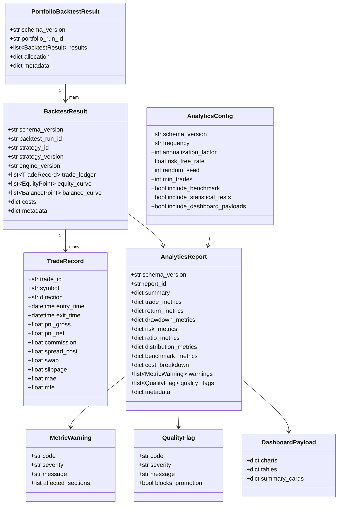
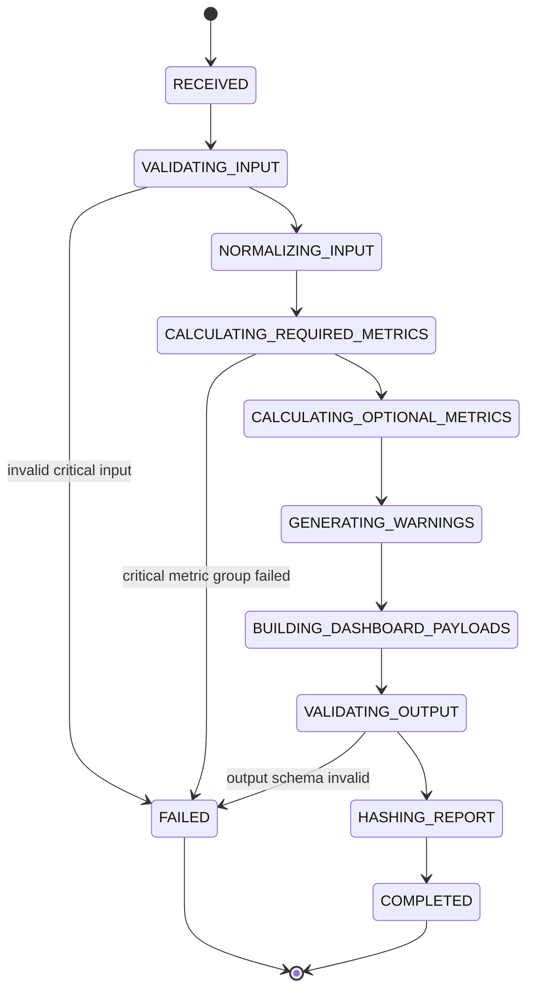
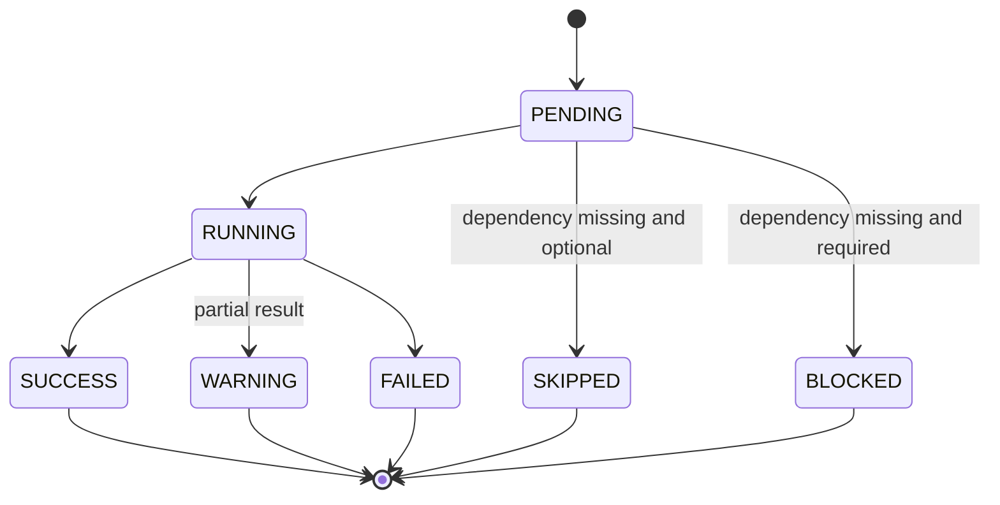
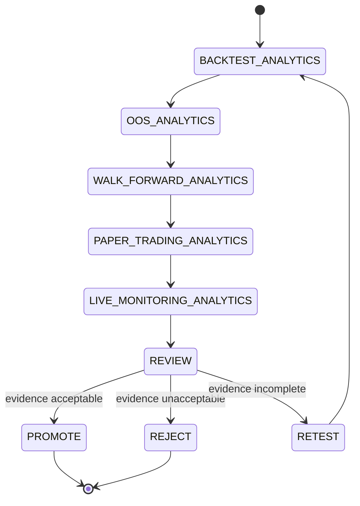

# HaruQuant Analytics / Metrics Module Technical Specification

**Document Version:** v1.3.1
**Supersedes:** v1.3
**Module:** `tools.analytics`
**Target Runtime:** Python 3.12+
**Target Project:** HaruQuantAI Trading Platform
**Primary Consumer:** Simulation / Backtest Engine
**Secondary Consumers:** Risk Governor, Portfolio Manager, Strategy Review, Optimization, Agentic AI Workflows, Dashboard / UI, Governance / Audit
**Status:** Final Production Rewrite Specification with Institutional Quant Analytics Extensions
**Architecture Style:** Deterministic analytics service with a small AI-tool surface
**Risk Level:** Low by default; read-only, no broker or trading side effects

## v1.3.1 Change Log

This v1.3.1 specification is a final clarity and implementation-readiness polish release. It does not change the core v1.3 architecture. It closes the last known ambiguities before implementation:

- Defines the default benchmark currency fallback policy when benchmark metadata is absent.
- Requires TCA calculations to use the same deterministic multi-currency conversion rules as portfolio analytics.
- Defines factor-return alignment behavior for lower-frequency factor data and missing factor observations.
- Makes tail-risk confidence levels configurable and reportable in metadata.
- Prevents low-sample explainability drivers from appearing in ranked driver lists.
- Adds explicit strategy-version drift behavior for live-vs-backtest degradation pairing.


## v1.2 Change Log

This v1.2 specification extends v1.1 by closing the final mandatory gaps identified during the second-pass audit. The following areas are now part of the implementation contract and must be completed before rewriting the analytics module:

- Unified `TradingResult` input model covering backtest, optimization candidate backtests, paper trading, and live trading analytics.
- `PaperTradingResult` and `LiveTradingResult` contracts with actual fill, slippage, latency, broker state, and execution-realism fields.
- Benchmark alignment rules for frequency, date range, timezone, currency, and missing benchmark periods.
- Annualization factor policy and override rules.
- Concrete statistical validation methods, outputs, thresholds, and minimum sample sizes.
- Required propagation of upstream data-quality evidence and bias flags.
- Multi-currency PnL conversion requirements before portfolio aggregation.
- Risk-of-ruin dependency clarification and fallback behavior.
- Prop-firm daily-loss calculation rules.
- Additional non-functional requirements for timezone consistency, duplicate timestamps, floating-point stability, payload limits, and dashboard truncation.
- Chart payload schemas for dashboard/API consumption.
- Cross-module contract alignment with the simulation/backtest engine and optimization evidence packages.


## v1.2.1 Change Log

This v1.2.1 specification is a final polish release. It does not introduce a new architecture direction. It fixes numbering and clarifies small implementation rules discovered during final review:

- Renumbered final sections so the document flows sequentially.
- Removed the duplicate legacy v1.1 final production position.
- Clarified that `BacktestResult`, `PaperTradingResult`, and `LiveTradingResult` must either inherit from `TradingResult` or be normalized through deterministic adapters before analytics execution.
- Added benchmark index currency fallback rules for indexes or synthetic benchmarks without explicit currency metadata.
- Defined allowed `kill_switch_state` values.
- Confirmed that statistical tests remain optional and configurable for large input sizes.

---

## 1. Executive Summary

The HaruQuant Analytics / Metrics Module is the deterministic measurement and evidence layer responsible for converting raw strategy execution results into standardized, auditable, and agent-friendly performance analytics.

The module receives canonical result objects from the simulation/backtest engine, paper-trading engine, or future live-trading monitor and produces a versioned `AnalyticsReport`. This report becomes the evidence package consumed by Strategy Review, Risk Governor, Portfolio Manager, Optimization, Dashboard/UI, and Governance workflows.

The current analytics module has broad metric coverage but needs production standardization before being merged into the backtest engine plan. The biggest changes required are:

1. Reduce the official AI Tool surface from many low-level metric functions to a small set of high-level, stable tools.
2. Introduce canonical input and output contracts.
3. Separate deterministic metric kernels from agent-facing tool wrappers.
4. Add explicit functional and non-functional requirements.
5. Add portfolio, multi-symbol, prop-firm, OOS, walk-forward, MAE/MFE, regime, and session analytics.
6. Add numerical correctness, reproducibility, report hashing, data lineage, and dashboard/API payload requirements.
7. Add component-level Definition of Done and production hardening gates.

The primary integration pattern is:

```python
from tools.analytics import build_analytics_report

result = build_analytics_report(
    backtest_result=backtest_result,
    config=analytics_config,
    request_id=request_id,
)
```

The backtest engine must not directly depend on hundreds of individual metric functions. It must produce a canonical `BacktestResult` and pass it to the analytics module. The analytics module must return a canonical tool response containing a versioned `AnalyticsReport`.

---

## 2. Purpose and Scope

### 2.1 Purpose

The analytics module exists to answer:

> How did this strategy, simulation, portfolio, or trading phase perform, and can the result be trusted enough to move further in the HaruQuant lifecycle?

It must calculate, validate, package, and expose performance analytics in a way that is:

- deterministic
- numerically correct
- reproducible
- auditable
- type-safe
- agent-friendly
- dashboard-ready
- testable with golden datasets
- compatible with backtesting, paper trading, and future live monitoring
- usable by downstream Risk, Portfolio, Strategy, Optimization, and Governance modules

### 2.2 In Scope

The production analytics module covers:

- trade-ledger metrics
- equity-curve metrics
- balance-curve metrics
- return-series metrics
- drawdown metrics
- risk metrics
- ratio metrics
- distribution metrics
- benchmark-relative metrics
- efficiency metrics
- cost attribution
- statistical validation metrics
- MAE/MFE diagnostics
- session and time-of-day analytics
- regime analytics
- symbol-level analytics
- portfolio aggregation analytics
- prop-firm compliance analytics
- in-sample vs out-of-sample comparison
- walk-forward analytics
- paper-trading degradation analytics
- warning and quality flag generation
- strategy decision scorecard input
- report reproducibility and hashing
- dashboard/API payload generation
- agent-callable analytics wrappers
- deterministic internal calculation helpers
- unit, integration, regression, property, failure-path, and golden-dataset testing

### 2.3 Out of Scope

The analytics module must not:

- run a backtest
- place trades
- close trades
- modify broker state
- approve risk
- approve live trading
- optimize strategy parameters
- mutate strategy definitions
- modify production databases directly
- act as an LLM agent
- invent missing results
- hide poor data quality
- silently ignore invalid inputs
- decide final portfolio allocation
- replace Risk Governor or Portfolio Manager decisions

### 2.4 Consumers

| Consumer | Usage |
|---|---|
| Backtest Engine | Generates `BacktestResult`, calls analytics, attaches report to result package |
| Strategy Reviewer | Reads analytics evidence and quality flags |
| Risk Governor | Consumes drawdown, exposure, prop-firm, and risk evidence |
| Portfolio Manager | Consumes multi-symbol, correlation, contribution, and allocation evidence |
| Optimization Module | Compares IS/OOS, WFO, robustness, degradation, and scorecard metrics |
| Dashboard/UI | Displays charts, tables, scorecards, and report summaries |
| Agentic Workflows | Call high-level official analytics tools only |
| Governance/Audit | Reviews lineage, hashes, schema versions, warnings, and reproducibility metadata |

---

## 3. Core Production Rules

### 3.1 Deterministic First

All metric calculations must be deterministic for the same input data, configuration, and analytics engine version. Any stochastic process must require:

- `random_seed`
- `n_iterations`
- `method`
- `confidence_level`
- deterministic default behavior

### 3.2 Small Official AI Tool Surface

Only high-level, stable, agent-friendly functions may be exported through `tools.analytics.__all__`.

Low-level metric functions may exist, but they should be internal deterministic helpers unless they are intentionally promoted as official AI Tools.

### 3.3 Separation of Concerns

The module must separate:

- contracts and schemas
- configuration
- input validation
- pure metric calculations
- report orchestration
- agent-facing tool wrappers
- dashboard payload formatting
- scorecard logic
- testing fixtures

### 3.4 No Trading Side Effects

The analytics module is read-only. It must not:

- place orders
- close positions
- modify live accounts
- modify risk limits
- activate strategies
- write to production databases directly

### 3.5 Standard Tool Response

Every function exported through `tools.analytics.__all__` is an official AI Tool and must return:

```python
{
    "status": "success" | "error",
    "message": str,
    "data": Any,
    "error": None | {
        "code": str,
        "details": str,
    },
    "metadata": {
        "tool_name": str,
        "tool_version": str,
        "tool_category": str,
        "tool_risk_level": str,
        "request_id": str | None,
        "execution_ms": float,
        "read_only": bool,
        "writes_file": bool,
        "modifies_database": bool,
        "places_trade": bool,
        "requires_network": bool,
    },
}
```

### 3.6 Traceability

Every official tool must accept:

```python
request_id: str | None = None
```

The analytics report must preserve:

- `request_id`
- `workflow_id`, when provided by caller context
- `backtest_run_id`
- `strategy_id`
- `strategy_version`
- `analytics_engine_version`
- `schema_version`

### 3.7 Numerical Honesty

The module must never produce misleading metrics. If a metric cannot be calculated safely, it must return:

- `None` in the report section where appropriate
- a warning or quality flag explaining why
- no `NaN`, `inf`, or invalid JSON values in final output

### 3.8 Fail Closed for Critical Inputs

If critical inputs are invalid or missing, the official tool must return an error response.

Critical inputs include:

- empty or invalid backtest result
- missing equity curve when equity metrics are requested
- invalid trade ledger when trade metrics are requested
- impossible timestamps
- non-numeric PnL or equity values
- malformed configuration

---

## 4. Functional Requirements Matrix

| ID | Requirement | Priority | Acceptance Evidence |
|---|---|---:|---|
| FR-001 | Generate a complete `AnalyticsReport` from a valid `BacktestResult`. | Must | Unit and integration test |
| FR-002 | Calculate trade-level metrics from closed trades. | Must | Golden trade ledger tests |
| FR-003 | Calculate equity-curve and balance-curve metrics from time-indexed series. | Must | Golden equity curve tests |
| FR-004 | Calculate drawdowns from equity by default and balance when configured. | Must | Drawdown known-answer tests |
| FR-005 | Separate gross PnL, net PnL, spread cost, commission, swap, slippage, and cost drag. | Must | Cost attribution tests |
| FR-006 | Calculate return metrics using explicit frequency and annualization settings. | Must | Annualization tests |
| FR-007 | Calculate risk and ratio metrics only when dependencies are satisfied. | Must | Dependency matrix tests |
| FR-008 | Calculate benchmark-relative metrics when benchmark data is provided. | Should | Benchmark known-answer tests |
| FR-009 | Generate warnings for insufficient sample sizes. | Must | Warning tests |
| FR-010 | Generate hard blocker flags for invalid or untrustworthy results. | Must | Failure-path tests |
| FR-011 | Support multi-symbol analytics for strategy portfolios. | Should | Multi-symbol fixture tests |
| FR-012 | Support portfolio-level aggregation and contribution analytics. | Should | Portfolio aggregation tests |
| FR-013 | Support prop-firm compliance analytics. | Must | Prop-firm rule fixture tests |
| FR-014 | Support IS/OOS comparison analytics. | Should | IS/OOS degradation tests |
| FR-015 | Support walk-forward window analytics. | Should | WFO fixture tests |
| FR-016 | Support paper-trading degradation analytics. | Should | Paper vs backtest comparison tests |
| FR-017 | Support MAE/MFE diagnostics when excursion fields exist. | Should | Excursion fixture tests |
| FR-018 | Support session, weekday, month, and regime analytics when timestamps exist. | Should | Time-grouped tests |
| FR-019 | Produce dashboard-ready chart and table payloads. | Should | API payload schema tests |
| FR-020 | Produce reproducibility metadata and hashes. | Must | Hash stability tests |
| FR-021 | Expose only approved high-level official tools through `__all__`. | Must | Registry tests |
| FR-022 | Every official tool returns the standard HaruQuant tool response. | Must | Schema compliance tests |
| FR-023 | Every official tool supports `request_id`. | Must | Signature and metadata tests |
| FR-024 | Every official tool logs call, validation failure, success, and failure. | Must | Logging tests |
| FR-025 | The report must not contain `NaN`, `inf`, or unserializable objects. | Must | Serialization tests |

---

## 5. Non-Functional Requirements Matrix

| ID | Requirement | Target / Rule | Acceptance Evidence |
|---|---|---|---|
| NFR-001 | Determinism | Same input + config + version produces same report. | Hash stability test |
| NFR-002 | Reproducibility | Report includes input/config/report hashes and lineage. | Metadata tests |
| NFR-003 | Numerical correctness | Known-answer fixtures pass within tolerance. | Golden tests |
| NFR-004 | Performance | 100,000 trades and 100,000 equity points complete under 3 seconds excluding stochastic tests on dev hardware. | Benchmark test |
| NFR-005 | Memory efficiency | Avoid unnecessary full DataFrame copies; large inputs processed predictably. | Profiling / code review |
| NFR-006 | Observability | Tool calls include logs and `execution_ms`. | Logging and metadata tests |
| NFR-007 | Security | No secrets logged; no broker actions; no unsafe paths. | Security tests |
| NFR-008 | Backward compatibility | v1.x report fields remain backward compatible. | Contract tests |
| NFR-009 | Testability | Pure metric functions are directly testable without agents or brokers. | Unit tests |
| NFR-010 | Agent compatibility | Official tools are high-level, documented, typed, and schema-compliant. | Tool audit tests |
| NFR-011 | Maintainability | Low duplication; clear module boundaries; typed public functions. | Code review and lint |
| NFR-012 | Source hygiene | No `__pycache__`, `.pyc`, `.nbi`, `.nbc`, debug prints, or generated artifacts. | CI artifact check |
| NFR-013 | CI/CD quality | Black, isort, flake8, mypy, pytest, coverage >=80%. | CI pipeline |
| NFR-014 | Documentation | Public tools and contracts have docstrings and usage examples. | Documentation audit |
| NFR-015 | Idempotency | Re-running a report generation call with same data is safe. | Idempotency tests |
| NFR-016 | JSON compatibility | Final response is JSON-serializable. | Serialization tests |

---

## 6. High-Level Architecture

### 6.1 Architecture Overview

```text
Simulation / Backtest Engine
        |
        | produces
        v
BacktestResult / PortfolioBacktestResult
        |
        | consumed by
        v
tools.analytics.build_analytics_report
        |
        +--> contracts.py
        +--> validators.py / common.py
        +--> metrics.py
        +--> returns.py
        +--> drawdowns.py
        +--> risks.py
        +--> ratios.py
        +--> distributions.py
        +--> benchmark.py
        +--> efficiency.py
        +--> statistical_tests.py
        +--> prop_firm.py
        +--> portfolio.py
        +--> regimes.py
        +--> excursions.py
        +--> report.py
        +--> dashboard.py
        |
        v
AnalyticsReport
        |
        +--> Risk Governor
        +--> Portfolio Manager
        +--> Strategy Reviewer
        +--> Optimization Module
        +--> Dashboard/UI
        +--> Governance/Audit
```

### 6.2 Architectural Layers

| Layer | Purpose |
|---|---|
| Tool Registry | Exposes only approved official AI Tools |
| Tool Wrappers | Validate inputs, log, time execution, return standard schema |
| Report Orchestration | Coordinates metric groups and failure policy |
| Metric Kernels | Pure deterministic calculations |
| Contracts | Versioned schemas and serialization rules |
| Validation | Input, output, and dependency checks |
| Quality Flags | Warnings, blockers, severity model |
| Dashboard Payloads | UI-ready chart/table structures |
| Tests | Unit, golden, integration, failure-path, contract, performance |

---

## 7. Target Folder Structure

```text
tools/
    analytics/
        __init__.py
        contracts.py
        config.py
        common.py
        validators.py
        metrics.py
        returns.py
        drawdowns.py
        ratios.py
        risks.py
        distributions.py
        benchmark.py
        efficiency.py
        statistical_tests.py
        excursions.py
        regimes.py
        portfolio.py
        prop_firm.py
        report.py
        dashboard.py
        decision_scorecard.py

        _typing.py              # optional internal aliases
        _serialization.py       # optional internal JSON-safe conversion
        _hashing.py             # optional internal report/input hashing

tests/
    unit/
        tools/
            analytics/
                test_contracts.py
                test_config.py
                test_common.py
                test_validators.py
                test_metrics.py
                test_returns.py
                test_drawdowns.py
                test_ratios.py
                test_risks.py
                test_distributions.py
                test_benchmark.py
                test_efficiency.py
                test_statistical_tests.py
                test_excursions.py
                test_regimes.py
                test_portfolio.py
                test_prop_firm.py
                test_report.py
                test_dashboard.py
                test_decision_scorecard.py
                test_registry.py
                test_schema_compliance.py

    usage/
        tools/
            analytics/
                analytics_report.py
                strategy_quality_scorecard.py
                portfolio_analytics_report.py

    fixtures/
        analytics/
            simple_trade_ledger.py
            simple_equity_curve.py
            simple_benchmark.py
            multi_symbol_portfolio.py
            prop_firm_case.py
            oos_walk_forward_case.py
            mae_mfe_case.py
            edge_cases.py

    integration/
        tools/
            analytics/
                test_backtest_engine_contract.py

    performance/
        tools/
            analytics/
                test_report_performance.py
```

---

## 8. Official AI Tool Surface

### 8.1 Approved Exports

`tools.analytics.__init__.py` should expose only high-level tools:

```python
__all__ = [
    "build_analytics_report",
    "build_portfolio_analytics_report",
    "evaluate_strategy_quality",
    "compare_analytics_reports",
    "calculate_trade_metrics",
    "calculate_equity_metrics",
    "calculate_drawdown_metrics",
    "calculate_risk_metrics",
    "calculate_benchmark_metrics",
    "calculate_statistical_validation",
    "calculate_prop_firm_compliance",
]
```

### 8.2 Export Rules

- Functions in `__all__` are official AI Tools.
- Official AI Tools must follow the HaruQuant tool response schema.
- Internal helper functions must not be exported.
- Agents must import from `tools.analytics`, not deep module files.

### 8.3 Internal Function Rule

Low-level helpers such as the following should not be official AI Tools by default:

```text
avg_win
avg_loss
skewness
kurtosis
max_drawdown_date
tail_ratio
tracking_error
ulcer_index
omega_ratio
payoff_ratio
```

They may exist as deterministic helpers with docstrings, type hints, validation, and unit tests.

---

## 9. Core Domain Model

### 9.1 Primary Entities

| Entity | Purpose |
|---|---|
| `BacktestResult` | Canonical result from simulation/backtest engine |
| `PortfolioBacktestResult` | Collection of symbol/strategy-level backtest results |
| `TradeRecord` | One closed or open trade record |
| `EquityPoint` | Time-indexed equity snapshot |
| `BalancePoint` | Time-indexed realized balance snapshot |
| `ReturnSeries` | Periodic returns derived from equity or balance |
| `BenchmarkSeries` | Benchmark returns/prices for comparison |
| `AnalyticsConfig` | Calculation options and thresholds |
| `AnalyticsReport` | Full analytics output contract |
| `PortfolioAnalyticsReport` | Portfolio-level analytics output |
| `MetricWarning` | Non-fatal issue affecting metric reliability |
| `QualityFlag` | Evidence-quality or strategy-quality classification |
| `MetricGroupResult` | Result of one metric category |
| `DashboardPayload` | UI-ready charts and tables |
| `PropFirmComplianceReport` | Rule-specific prop-firm metrics and violations |
| `WalkForwardAnalytics` | Window-level IS/OOS/WFO analytics |
| `ExcursionAnalytics` | MAE/MFE and trade behavior diagnostics |
| `RegimeAnalytics` | Performance by market/time regime |

### 9.2 Required Core Fields

#### BacktestResult

```text
schema_version
backtest_run_id
strategy_id
strategy_version
engine_version
symbol or symbols
timeframe
start_time
end_time
initial_balance
final_balance
final_equity
trade_ledger
equity_curve
balance_curve
costs
metadata
```

#### TradeRecord

```text
trade_id
symbol
direction
entry_time
exit_time
entry_price
exit_price
volume
pnl_gross
pnl_net
commission
spread_cost
swap
slippage
status
mae optional
mfe optional
r_multiple optional
setup_tag optional
session optional
regime optional
```

#### AnalyticsConfig

```text
schema_version
frequency
annualization_factor
risk_free_rate
confidence_level
random_seed
min_trades
min_return_observations
drawdown_source
include_benchmark
include_statistical_tests
include_prop_firm_compliance
include_portfolio_analytics
include_dashboard_payloads
include_regime_analytics
include_excursion_analytics
prop_firm_rules optional
performance_thresholds
```

#### AnalyticsReport

```text
schema_version
report_id
source_backtest_run_id
strategy_id
strategy_version
summary
trade_metrics
equity_metrics
return_metrics
drawdown_metrics
risk_metrics
ratio_metrics
distribution_metrics
benchmark_metrics
efficiency_metrics
statistical_validation
cost_breakdown
prop_firm_compliance
excursion_analytics
regime_analytics
portfolio_analytics
scorecard
warnings
quality_flags
dashboard_payloads
lineage
metadata
```

---

## 10. Class Diagram



---

## 11. State Machines

### 11.1 Analytics Report Generation State Machine



### 11.2 Metric Group State Machine



### 11.3 Strategy Lifecycle Analytics State Machine



---

## 12. Component Specifications

### 12.1 `contracts.py`

Defines versioned schemas for analytics inputs and outputs.

Required contracts:

- `TradeRecord`
- `EquityPoint`
- `BalancePoint`
- `BenchmarkPoint`
- `BacktestResult`
- `PortfolioBacktestResult`
- `AnalyticsConfig`
- `MetricWarning`
- `QualityFlag`
- `MetricGroupResult`
- `AnalyticsReport`
- `PortfolioAnalyticsReport`
- `DashboardPayload`

Rules:

- Use Pydantic or dataclasses with explicit validation.
- Validate required fields.
- Reject invalid numeric values.
- Normalize timestamps.
- Serialize cleanly to JSON.
- Include `schema_version`.

### 12.2 `config.py`

Defines default thresholds and calculation settings.

Must include:

- annualization defaults
- sample-size thresholds
- quality-flag thresholds
- prop-firm rules
- bootstrap defaults
- dashboard payload defaults

### 12.3 `common.py`

Contains shared utilities:

- standard tool result builder
- execution timing helper
- JSON-safe conversion
- finite-number checks
- warning constructors
- quality flag constructors

Must not contain business-heavy metric logic.

### 12.4 `validators.py`

Validates:

- backtest result structure
- trade ledger columns/fields
- equity curve continuity
- timestamp order
- finite numeric values
- configuration options
- metric dependencies

### 12.5 `metrics.py`

Calculates trade-level metrics:

- trade count
- win/loss count
- win rate
- average win
- average loss
- payoff ratio
- profit factor
- expectancy
- net profit
- gross profit
- gross loss
- longest win/loss streak
- average holding time
- exposure time

### 12.6 `returns.py`

Calculates return and equity metrics:

- total return
- CAGR
- periodic return statistics
- rolling returns
- annualized return
- annualized volatility
- equity highs/lows
- balance/equity divergence

### 12.7 `drawdowns.py`

Calculates:

- max drawdown
- max drawdown percentage
- drawdown duration
- recovery time
- average drawdown
- drawdown frequency
- ulcer index
- rolling drawdown

### 12.8 `ratios.py`

Calculates:

- Sharpe ratio
- Sortino ratio
- Calmar ratio
- Sterling ratio
- Omega ratio
- MAR ratio
- information ratio
- Treynor ratio when benchmark beta exists

### 12.9 `risks.py`

Calculates:

- volatility
- downside deviation
- VaR
- CVaR
- tail risk
- risk of ruin when dependencies exist
- drawdown-at-risk
- skew/kurtosis risk flags

### 12.10 `distributions.py`

Calculates:

- skewness
- kurtosis
- percentile returns
- trade PnL distribution
- return histogram payloads
- outlier counts
- tail metrics

### 12.11 `benchmark.py`

Calculates:

- alpha
- beta
- correlation
- tracking error
- information ratio
- benchmark-relative return
- active return
- up/down capture

### 12.12 `efficiency.py`

Calculates:

- profit per trade
- profit per day
- profit per exposure unit
- cost drag
- execution efficiency
- turnover metrics
- trade frequency efficiency

### 12.13 `statistical_tests.py`

Calculates:

- bootstrap confidence intervals
- t-test style checks where appropriate
- permutation tests
- Monte Carlo robustness inputs
- probability of positive expectancy
- sample-size confidence warnings

All stochastic methods must be seed-controlled.

### 12.14 `excursions.py`

Calculates MAE/MFE diagnostics:

- average MAE
- average MFE
- median MAE/MFE
- MAE/MFE ratio
- profit capture ratio
- giveback ratio
- entry quality proxy
- exit quality proxy
- stop efficiency
- take-profit efficiency
- adverse excursion by symbol/setup/session

### 12.15 `regimes.py`

Calculates time/regime analytics:

- performance by hour
- performance by weekday
- performance by month
- session performance
- news-day vs non-news-day performance when available
- trend/range regime performance
- high/low volatility regime performance
- spread-regime performance

### 12.16 `portfolio.py`

Calculates portfolio-level analytics:

- symbol contribution
- strategy contribution
- correlation matrix
- concentration risk
- drawdown contribution
- return contribution
- volatility contribution
- best/worst symbol
- cluster exposure
- diversification score

### 12.17 `prop_firm.py`

Calculates rule-specific prop-firm compliance analytics:

- max daily loss used
- max daily loss breach
- max total loss used
- max total loss breach
- profit target progress
- best day percentage
- consistency score
- minimum trading days
- news-window violations
- weekend holding violations
- overnight holding violations
- daily loss recovery behavior

This component provides evidence only. It must not approve or reject live trading.

### 12.18 `dashboard.py`

Builds UI/API-ready payloads:

- summary cards
- equity curve chart
- drawdown curve chart
- monthly returns heatmap
- rolling Sharpe chart
- rolling drawdown chart
- trade distribution chart
- cost breakdown chart
- symbol contribution chart
- warning/flag tables

### 12.19 `report.py`

Main orchestration layer.

Responsibilities:

- validate inputs
- normalize input data
- run required metric groups
- run optional metric groups
- collect warnings and flags
- build dashboard payloads
- validate final report
- compute hashes
- return standard tool response

### 12.20 `decision_scorecard.py`

Builds standardized scorecard inputs for strategy evaluation.

Must separate:

- raw metrics
- normalized scores
- penalty flags
- hard blockers
- recommendation evidence

It must not make final live approval decisions.

---

## 13. Backtest Engine Integration Contract

### 13.1 Backtest Engine Responsibility

The backtest engine must provide:

- clean trade ledger
- equity curve
- balance curve
- initial/final account values
- costs
- symbol/timeframe metadata
- strategy metadata
- backtest configuration metadata
- market data lineage when available

### 13.2 Analytics Module Responsibility

The analytics module must:

- validate received result
- calculate metrics
- generate warnings and quality flags
- return one canonical `AnalyticsReport`
- avoid mutating input data
- avoid modifying backtest state

### 13.3 Boundary Rule

The backtest engine should not calculate production analytics itself except for minimal runtime counters required during simulation. Final analytics should be calculated by `tools.analytics`.

---

## 14. Metrics Catalog

### 14.1 Summary Metrics

- initial balance
- final balance
- final equity
- net profit
- total return
- total trades
- winning trades
- losing trades
- win rate
- profit factor
- expectancy
- max drawdown
- Sharpe ratio
- Sortino ratio
- Calmar ratio
- total cost
- cost drag

### 14.2 Trade Metrics

- total trades
- closed trades
- open trades
- win/loss/breakeven count
- win rate
- loss rate
- average win
- average loss
- largest win
- largest loss
- payoff ratio
- profit factor
- expectancy
- average holding time
- trade frequency
- longest win streak
- longest loss streak

### 14.3 Return Metrics

- total return
- CAGR
- mean periodic return
- median periodic return
- annualized return
- annualized volatility
- rolling returns
- best/worst period

### 14.4 Drawdown Metrics

- max drawdown
- max drawdown percentage
- average drawdown
- max drawdown duration
- average recovery time
- drawdown frequency
- ulcer index

### 14.5 Ratio Metrics

- Sharpe
- Sortino
- Calmar
- Sterling
- Omega
- MAR
- Information ratio
- Treynor ratio

### 14.6 Risk Metrics

- volatility
- downside deviation
- VaR
- CVaR
- tail risk
- skewness
- kurtosis
- risk of ruin when dependencies exist

### 14.7 Cost Metrics

- spread cost
- commission cost
- swap cost
- slippage cost
- gross PnL
- net PnL
- cost drag percentage
- average cost per trade

### 14.8 Portfolio Metrics

- portfolio return
- portfolio volatility
- portfolio max drawdown
- symbol contribution
- strategy contribution
- correlation matrix
- concentration score
- cluster exposure
- diversification score

### 14.9 Prop-Firm Metrics

- max daily loss used
- daily loss breach
- max total loss used
- total loss breach
- profit target progress
- consistency score
- best day share
- minimum trading days
- news restriction violations
- weekend/overnight violations

### 14.10 OOS / Walk-Forward Metrics

- IS return
- OOS return
- return degradation
- profit factor degradation
- Sharpe degradation
- drawdown expansion
- WFO pass rate
- window stability
- performance decay
- overfitting score

### 14.11 MAE/MFE Metrics

- average MAE
- average MFE
- MAE/MFE ratio
- capture ratio
- giveback ratio
- stop efficiency
- take-profit efficiency
- entry/exit quality proxies

### 14.12 Regime / Session Metrics

- hour-of-day performance
- weekday performance
- month performance
- Asian/London/New York session performance
- high/low volatility regime performance
- trend/range regime performance
- spread regime performance

---

## 15. Metric Dependency Matrix

| Metric Group | Required Inputs | Optional Inputs | Missing Required Behavior |
|---|---|---|---|
| Trade Metrics | Trade ledger | MAE/MFE, setup tags | Error if requested as required |
| Equity Metrics | Equity curve | Balance curve | Error if required |
| Return Metrics | Equity or balance curve | Frequency override | Error if insufficient points |
| Drawdown Metrics | Equity or balance curve | Drawdown source config | Error if invalid curve |
| Sharpe / Sortino | Return series | Risk-free rate | Warning or null if insufficient observations |
| Benchmark Metrics | Strategy returns + benchmark series | Benchmark metadata | Skip with warning if optional |
| VaR / CVaR | Return series | Confidence level | Warning if insufficient observations |
| Risk of Ruin | Win rate, payoff ratio, risk per trade | Capital assumptions | Skip with warning if missing |
| MAE/MFE | Trade ledger with excursion fields | Setup/session tags | Skip with warning if optional |
| Prop-Firm Metrics | Daily equity/balance series | News/weekend metadata | Critical warning if rule data unavailable |
| Portfolio Metrics | Multiple strategy/symbol results | Allocation weights | Skip if single result |
| Regime Metrics | Timestamped trades/returns | Regime labels | Skip unsupported groups with warning |
| Walk-Forward Metrics | IS/OOS/window reports | Parameter metadata | Skip if no windows provided |

---

## 16. Warning and Severity Model

### 16.1 Severity Levels

| Severity | Meaning | Downstream Behavior |
|---|---|---|
| `info` | Informational note | Display only |
| `warning` | Non-critical issue | Display and continue |
| `major` | Material reliability concern | Risk/Strategy should review |
| `critical` | Serious evidence problem | Blocks promotion unless overridden by policy |
| `blocker` | Invalid or unsafe report | Report generation fails or strategy cannot advance |

### 16.2 Standard Warning Shape

```json
{
  "code": "INSUFFICIENT_TRADES",
  "severity": "major",
  "message": "Only 14 trades were available. Trade metrics are statistically unstable.",
  "affected_sections": ["trade_metrics", "statistical_validation"],
  "blocks_promotion": false
}
```

### 16.3 Standard Quality Flag Examples

| Code | Severity | Meaning |
|---|---|---|
| `INSUFFICIENT_TRADES` | major | Trade sample too small |
| `INSUFFICIENT_RETURN_OBSERVATIONS` | major | Return series too short |
| `MAX_DRAWDOWN_TOO_HIGH` | critical | Drawdown exceeds configured threshold |
| `PROFIT_CONCENTRATION_HIGH` | major | Profit depends heavily on few trades/days |
| `OOS_DEGRADATION_HIGH` | critical | OOS performance degraded materially |
| `WALK_FORWARD_UNSTABLE` | critical | WFO windows unstable |
| `PROP_FIRM_RULE_BREACH` | blocker | Prop-firm rule violation detected |
| `REGIME_FRAGILITY_DETECTED` | major | Performance concentrated in one regime |
| `SESSION_DEPENDENCY_HIGH` | warning | Performance concentrated in one session |
| `COST_DRAG_HIGH` | major | Costs materially reduce edge |
| `BENCHMARK_DATA_MISSING` | warning | Benchmark metrics skipped |
| `EXCURSION_DATA_MISSING` | info | MAE/MFE skipped |

---

## 17. Failure and Partial Report Policy

### 17.1 Critical Metric Groups

If any critical metric group fails, the official tool must return an error unless configured explicitly for diagnostic partial mode.

Critical groups:

- input validation
- summary
- trade metrics when trades are required
- equity metrics
- return metrics
- drawdown metrics
- cost breakdown
- output schema validation

### 17.2 Optional Metric Groups

Optional groups may fail without failing the whole report, but must create warnings:

- benchmark metrics
- statistical validation
- distribution diagnostics
- MAE/MFE diagnostics
- regime analytics
- dashboard payloads
- walk-forward analytics
- portfolio analytics when only one symbol exists

### 17.3 Partial Report Rules

A partial report must include:

- `report_status = "partial"`
- warnings explaining skipped/failed groups
- no invalid JSON values
- clear affected sections

---

## 18. Data Lineage and Report Hashing

### 18.1 Required Lineage Fields

```text
data_source
broker
symbol_source
timeframe_source
market_data_version
backtest_engine_version
strategy_id
strategy_version
analytics_engine_version
spread_model
slippage_model
commission_model
swap_model
execution_model
created_at
```

### 18.2 Required Hashes

```text
input_hash
config_hash
report_hash
trade_ledger_hash
equity_curve_hash
benchmark_hash optional
```

### 18.3 Hashing Rules

- Hashes must be deterministic.
- Serialization order must be stable.
- Non-deterministic fields such as `generated_at` must be excluded from report hash unless explicitly documented.
- Hash algorithm should be `sha256`.

### 18.4 Reproducibility Rule

```text
same input + same config + same analytics_engine_version = same report_hash
```

---

## 19. Numerical Precision Policy

### 19.1 Internal Calculation Rules

- Use `float64` for numerical arrays and pandas series.
- Avoid rounding during internal calculations.
- Round only at presentation or dashboard boundary.
- Use configured tolerance for test comparisons.
- Never allow `NaN`, `inf`, or `-inf` in final JSON output.

### 19.2 Representation Rules

| Value Type | Storage Rule |
|---|---|
| Percentages | Store as decimal by default, e.g. `0.15` for 15%, and label clearly |
| Money | Store as numeric account currency value |
| Pips/points/ticks | Explicitly label unit |
| Drawdown | Store positive magnitude by default unless field name says otherwise |
| Ratios | Store as finite float or `None` with warning |

### 19.3 Edge Case Rules

| Case | Required Behavior |
|---|---|
| Zero volatility Sharpe | Return `None` with warning, not `inf` |
| Zero gross loss profit factor | Return configured cap or `None` with warning |
| Empty trade ledger | Error if trade metrics required; warning if optional |
| Flat equity curve | Return valid flat metrics; ratios may be `None` |
| Single return observation | Return limited metrics with warning |
| Negative equity | Critical warning or blocker depending config |

---

## 20. Portfolio and Multi-Symbol Analytics Requirements

### 20.1 Purpose

Portfolio analytics allow HaruQuant to evaluate combined strategy behavior rather than isolated strategy performance.

### 20.2 Required Capabilities

- aggregate reports across symbols
- calculate portfolio equity curve
- calculate symbol contribution
- calculate drawdown contribution
- calculate return contribution
- calculate correlation matrix
- calculate concentration score
- identify dominant profit/loss symbols
- identify currency cluster exposure
- generate portfolio-level quality flags

### 20.3 Output Contract

`PortfolioAnalyticsReport` must include:

```text
portfolio_summary
symbol_reports
portfolio_return_metrics
portfolio_drawdown_metrics
portfolio_risk_metrics
correlation_matrix
contribution_analysis
concentration_analysis
cluster_exposure
warnings
quality_flags
metadata
```

---

## 21. Prop-Firm Compliance Analytics Requirements

### 21.1 Purpose

The analytics module must calculate prop-firm evidence that Risk Governor can use when enforcing rules.

### 21.2 Required Metrics

- daily loss percentage
- max daily loss used
- daily loss breach flag
- total loss percentage
- max total loss used
- total loss breach flag
- profit target progress
- best day share of total profit
- consistency rule score
- minimum trading days
- weekend holding violations
- overnight holding violations
- high-impact news-window violations when event data exists

### 21.3 Rule Configuration

Prop-firm rules must be configurable:

```text
max_daily_loss_pct
max_total_loss_pct
profit_target_pct
minimum_trading_days
best_day_max_profit_share
news_restriction_minutes_before
news_restriction_minutes_after
weekend_holding_allowed
overnight_holding_allowed
```

### 21.4 Output Rule

The analytics module reports evidence only. Risk Governor decides enforcement.

---

## 22. OOS, Walk-Forward, and Lifecycle Analytics

### 22.1 In-Sample vs Out-of-Sample

The module should compare IS/OOS analytics when both reports are provided.

Metrics:

- return degradation
- Sharpe degradation
- Sortino degradation
- profit factor degradation
- drawdown expansion
- win-rate degradation
- cost drag difference
- stability score

### 22.2 Walk-Forward Analytics

For walk-forward windows, calculate:

- window pass rate
- median OOS return
- median OOS profit factor
- worst window drawdown
- consistency across windows
- degradation trend
- parameter stability when available

### 22.3 Paper vs Backtest Degradation

When paper-trading results exist:

- compare paper vs backtest return
- compare paper vs backtest drawdown
- compare paper vs backtest trade frequency
- compare cost drag
- flag execution degradation

---

## 23. MAE / MFE Diagnostics Requirements

### 23.1 Purpose

MAE/MFE analytics diagnose trade behavior and strategy execution quality.

### 23.2 Required Metrics

- average MAE
- median MAE
- maximum MAE
- average MFE
- median MFE
- maximum MFE
- MAE/MFE ratio
- profit capture ratio
- giveback ratio
- adverse excursion before profit
- favorable excursion before exit
- entry quality proxy
- exit quality proxy

### 23.3 Optional Breakdowns

- by symbol
- by direction
- by setup tag
- by session
- by volatility regime

---

## 24. Regime and Session Analytics Requirements

### 24.1 Time-Based Analytics

Required when timestamps exist:

- performance by hour
- performance by weekday
- performance by month
- session performance
- daily distribution of returns

### 24.2 Market Regime Analytics

Required when regime labels exist or can be supplied:

- trend regime performance
- range regime performance
- high-volatility regime performance
- low-volatility regime performance
- spread regime performance

### 24.3 Quality Flags

- `SESSION_DEPENDENCY_HIGH`
- `PERFORMANCE_CONCENTRATED_IN_ONE_DAY`
- `PERFORMANCE_CONCENTRATED_IN_ONE_SESSION`
- `REGIME_FRAGILITY_DETECTED`

---

## 25. Dashboard / API Payload Contract

### 25.1 Purpose

The analytics module should provide dashboard-ready data so the UI does not recalculate metrics.

### 25.2 Required Dashboard Payloads

```text
summary_cards
equity_curve_chart
drawdown_curve_chart
monthly_returns_heatmap
rolling_sharpe_chart
rolling_drawdown_chart
trade_distribution_chart
cost_breakdown_chart
symbol_contribution_chart
warning_table
quality_flag_table
```

### 25.3 Payload Rules

- Payloads must be JSON serializable.
- Timestamps must be ISO-8601 strings.
- Numeric values must be finite.
- Chart payloads must be presentation-neutral.
- UI formatting should happen in frontend, not analytics core.

---

## 26. Error Handling Specification

### 26.1 Standard Error Codes

```text
INVALID_INPUT
VALIDATION_FAILED
DATA_NOT_FOUND
EMPTY_RESULT
INSUFFICIENT_DATA
DEPENDENCY_MISSING
METRIC_CALCULATION_FAILED
OUTPUT_CONTRACT_FAILED
TOOL_EXECUTION_FAILED
UNKNOWN_ERROR
```

### 26.2 Official Tool Error Rule

Every official analytics tool must return structured errors. It must not:

- return `None`
- throw raw exceptions to agents
- silently skip critical work
- print errors
- return partial raw dictionaries without metadata

---

## 27. Logging and Observability

### 27.1 Required Logs

Every official tool must log:

- tool called
- request ID
- input summary
- validation result
- metric groups started
- metric groups skipped
- metric groups failed
- report generated
- execution time
- report status

### 27.2 Logging Restrictions

Do not log:

- broker passwords
- API keys
- private credentials
- full raw datasets unless explicitly in debug mode
- excessive trade-level records in normal production logs

### 27.3 Required Metadata

Every official tool response must include:

```text
tool_name
tool_version
tool_category
tool_risk_level
request_id
execution_ms
read_only
writes_file
modifies_database
places_trade
requires_network
```

---

## 28. Security and Safety Requirements

- Analytics tools are read-only.
- No broker APIs may be called.
- No live account state may be changed.
- No strategy files may be modified.
- No production database writes may occur.
- Inputs from files must be path-safe if file loading is later added.
- Tool outputs must be sanitized before passing to agents.
- No sensitive credentials may be logged.

---

## 29. Performance Requirements

### 29.1 Baseline Targets

| Scenario | Target |
|---|---|
| 10,000 trades | < 1 second excluding stochastic tests |
| 100,000 trades | < 3 seconds excluding stochastic tests |
| 1,000,000 equity points | < 5 seconds for core metrics where feasible |
| Bootstrap tests | Configurable iterations and timeout |

### 29.2 Performance Rules

- Prefer vectorized calculations for large arrays.
- Avoid unnecessary DataFrame copies.
- Avoid nested Python loops over large datasets unless justified.
- Statistical tests must be optional and configurable.
- Performance tests should run separately from normal unit tests where needed.

---

## 30. Versioning and Backward Compatibility

### 30.1 Schema Versioning

Every major contract must include `schema_version`.

### 30.2 Compatibility Rules

- v1.x must remain backward compatible.
- New optional fields may be added in minor versions.
- Renaming or removing fields requires v2.0.
- Risk and Portfolio consumers must declare accepted report schema versions.
- Migration notes are required for breaking changes.

### 30.3 Engine Versioning

The report must include:

```text
analytics_engine_version
metric_engine_version
schema_version
backtest_engine_version
```

---

## 31. Concurrency and Idempotency

- Official tools must be stateless.
- No mutable global calculation state is allowed.
- Same request may be retried safely.
- Report generation must be idempotent.
- Cache keys must include input hash, config hash, and analytics engine version.
- Parallel optimization workflows must be able to call analytics safely.

---

## 32. Testing Strategy

### 32.1 Required Test Categories

| Test Type | Purpose |
|---|---|
| Unit tests | Validate each deterministic metric function |
| Contract tests | Validate schemas and serialization |
| Registry tests | Validate official AI Tool exports |
| Schema compliance tests | Validate standard tool response |
| Golden-dataset tests | Validate known numerical outputs |
| Edge-case tests | Empty, flat, all-win, all-loss, NaN, missing data |
| Failure-path tests | Validate error responses and warnings |
| Integration tests | Validate backtest engine contract |
| Performance tests | Validate runtime targets |
| Security tests | Validate no side effects and no unsafe logging |
| Usage examples | Demonstrate real workflow usage |

### 32.2 Minimum Golden Fixtures

- simple 10-trade ledger
- all-winning trades
- all-losing trades
- flat equity curve
- simple drawdown curve
- known benchmark relationship
- multi-symbol portfolio
- prop-firm breach case
- OOS degradation case
- MAE/MFE diagnostic case
- invalid input case

### 32.3 Coverage Gate

Coverage must remain above 80% overall, with higher expectations for core metric kernels.

Recommended target:

```text
core metric kernels: >= 90%
official tool wrappers: >= 90%
overall module: >= 85%
minimum project gate: >= 80%
```

---

## 33. Production Hardening Gates

The module cannot be considered production-grade until all gates pass.

### Gate 1 — Source Hygiene

- [ ] No `__pycache__`
- [ ] No `.pyc`
- [ ] No `.nbi` / `.nbc`
- [ ] No debug prints
- [ ] No unused generated duplicates

### Gate 2 — Registry Discipline

- [ ] `__init__.py` exports only approved official AI Tools
- [ ] Every exported tool imports successfully
- [ ] No internal helper accidentally exported
- [ ] Agents import from `tools.analytics`, not deep modules

### Gate 3 — Tool Standard Compliance

- [ ] Standard response schema
- [ ] Metadata
- [ ] Risk flags
- [ ] Side-effect flags
- [ ] `request_id`
- [ ] execution timing
- [ ] logging
- [ ] deterministic error codes

### Gate 4 — Contract Compliance

- [ ] Input schemas validate
- [ ] Output schemas validate
- [ ] JSON serialization passes
- [ ] Schema versions included
- [ ] Backward compatibility tests pass

### Gate 5 — Numerical Correctness

- [ ] Golden fixtures pass
- [ ] Edge cases pass
- [ ] No NaN/inf in output
- [ ] Annualization tested
- [ ] Drawdown conventions tested

### Gate 6 — Integration Readiness

- [ ] Backtest engine can call `build_analytics_report`
- [ ] Risk can consume quality flags
- [ ] Portfolio can consume contribution analytics
- [ ] Dashboard can consume payloads

### Gate 7 — Observability and Audit

- [ ] Logs exist
- [ ] execution_ms measured
- [ ] input/config/report hashes generated
- [ ] lineage recorded
- [ ] warnings and flags structured

---

## 34. Component-Level Definition of Done

### 34.1 `contracts.py` Done When

- [ ] All core schemas exist
- [ ] Required fields validate
- [ ] Invalid data fails clearly
- [ ] JSON serialization passes
- [ ] Schema versioning exists
- [ ] Contract tests pass

### 34.2 `config.py` Done When

- [ ] Defaults are production-safe
- [ ] Annualization settings are explicit
- [ ] Prop-firm rules are configurable
- [ ] Statistical test settings are deterministic
- [ ] Config validation tests pass

### 34.3 `common.py` Done When

- [ ] Standard result helper exists
- [ ] Metadata helper exists
- [ ] Execution timing helper exists
- [ ] JSON-safe conversion exists
- [ ] Unit tests pass

### 34.4 `metrics.py` Done When

- [ ] Trade metrics are deterministic
- [ ] Empty/all-win/all-loss cases pass
- [ ] Golden ledger tests pass
- [ ] No tool wrapper logic mixed into kernels

### 34.5 `returns.py` Done When

- [ ] Return frequency is explicit
- [ ] Annualization is tested
- [ ] Flat and short series cases handled
- [ ] Golden tests pass

### 34.6 `drawdowns.py` Done When

- [ ] Max drawdown convention is documented
- [ ] Duration and recovery are tested
- [ ] Equity/balance source is configurable
- [ ] Golden tests pass

### 34.7 `report.py` Done When

- [ ] Valid `BacktestResult` generates full report
- [ ] Invalid input returns `INVALID_INPUT`
- [ ] Critical metric failure returns error
- [ ] Optional metric failure adds warning
- [ ] Output schema validation passes
- [ ] Hashing and lineage are present

### 34.8 `dashboard.py` Done When

- [ ] Chart payloads are JSON-safe
- [ ] Timestamps are ISO strings
- [ ] Tables are stable
- [ ] UI does not need to recalculate core metrics

### 34.9 `prop_firm.py` Done When

- [ ] Daily loss checks work
- [ ] Total loss checks work
- [ ] Consistency score works
- [ ] Breach flags are deterministic
- [ ] Rule config is tested

### 34.10 `portfolio.py` Done When

- [ ] Multi-symbol fixtures pass
- [ ] Contribution metrics calculate correctly
- [ ] Correlation matrix is stable
- [ ] Concentration flags are generated

---

## 35. Implementation Phases

### Phase 1 — Contract and Registry Foundation

Deliverables:

- `contracts.py`
- `config.py`
- cleaned `__init__.py`
- registry tests
- schema tests

Exit Gate:

- official tool list is small and validated
- schemas serialize to JSON
- invalid contracts fail clearly

### Phase 2 — Core Metric Kernels

Deliverables:

- `metrics.py`
- `returns.py`
- `drawdowns.py`
- `ratios.py`
- `risks.py`
- `distributions.py`
- golden-dataset tests

Exit Gate:

- known-answer tests pass
- no duplicated function definitions
- no NaN/inf output

### Phase 3 — Report Builder

Deliverables:

- `report.py`
- standard official tool wrappers
- warnings and flags
- hashing and lineage
- usage example

Exit Gate:

- `build_analytics_report` produces complete report
- standard tool response validated

### Phase 4 — Advanced Analytics

Deliverables:

- `portfolio.py`
- `prop_firm.py`
- `excursions.py`
- `regimes.py`
- `statistical_tests.py`
- `benchmark.py`

Exit Gate:

- optional groups skip/fail safely
- severity flags created correctly

### Phase 5 — Dashboard and Integration

Deliverables:

- `dashboard.py`
- integration tests with backtest result fixture
- usage examples
- performance tests

Exit Gate:

- dashboard payloads are stable
- backtest integration contract passes

### Phase 6 — Production Hardening

Deliverables:

- CI quality gates
- coverage gate
- performance baseline
- docs
- final audit report

Exit Gate:

- all production hardening gates pass

---

## 36. Acceptance Criteria

The analytics module is production-ready when:

- [ ] It exposes only approved high-level official AI Tools.
- [ ] Every official tool follows the HaruQuant standard response schema.
- [ ] Every official tool supports `request_id`.
- [ ] Every official tool has metadata, risk flags, and side-effect flags.
- [ ] Every official tool logs call, validation failure, success, and failure.
- [ ] Low-level metrics are deterministic internal helpers.
- [ ] Duplicate function definitions are removed.
- [ ] Canonical input and output contracts exist.
- [ ] `BacktestResult -> AnalyticsReport` works end to end.
- [ ] Portfolio analytics are supported.
- [ ] Prop-firm compliance analytics are supported.
- [ ] OOS/walk-forward analytics are supported.
- [ ] MAE/MFE diagnostics are supported when data exists.
- [ ] Regime/session analytics are supported when data exists.
- [ ] Metric dependencies are enforced.
- [ ] Warnings and quality flags include severity.
- [ ] Data lineage and report hashes are included.
- [ ] Numerical precision policy is enforced.
- [ ] Dashboard payloads are JSON-safe.
- [ ] Golden-dataset tests pass.
- [ ] Edge-case tests pass.
- [ ] Contract and schema tests pass.
- [ ] Coverage is above the project gate.
- [ ] No source hygiene violations exist.

---

## 37. Rewrite Instructions

When rewriting the module:

1. Do not blindly preserve the current `__all__` list.
2. Do not expose hundreds of low-level metrics as official AI Tools.
3. Preserve useful metric logic, but move it into clean deterministic kernels.
4. Create canonical contracts before rewriting report logic.
5. Implement `build_analytics_report` as the primary integration point.
6. Implement portfolio, prop-firm, OOS/WFO, MAE/MFE, and regime analytics as optional sections.
7. Add warnings when optional data is missing.
8. Fail closed when critical input data is invalid.
9. Add tests while rewriting, not after.
10. Do not over-engineer beyond this specification.

---


---

## 38. v1.2.1 Mandatory Contract Enhancements

This section is part of the production implementation contract. It closes the remaining gaps from the v1.1 audit and must be implemented before the analytics module is considered ready for rewrite signoff.

### 38.1 Unified Trading Result Contract

The analytics module must not be limited to historical backtest results. It must consume a unified trading-result abstraction that allows the same analytics engine to evaluate:

- historical backtests
- optimization candidate backtests
- out-of-sample tests
- walk-forward windows
- paper-trading runs
- live-trading monitoring snapshots

The canonical input model is:

```text
TradingResult
    schema_version: str
    result_id: str
    phase: backtest | optimization_candidate | oos | walk_forward | paper | live
    strategy_id: str
    strategy_version: str
    account_base_currency: str
    start_time: datetime
    end_time: datetime
    symbols: list[str]
    timeframe: str | None
    trades: list[TradeRecord]
    equity_curve: list[EquityPoint]
    balance_curve: list[BalancePoint] | None
    benchmark: BenchmarkSeries | None
    metadata: TradingResultMetadata
```

`BacktestResult`, `PaperTradingResult`, and `LiveTradingResult` must either inherit from this contract or be convertible into it through deterministic adapters. The analytics engine must execute against the normalized `TradingResult` view only. Adapters must be deterministic, tested, and must preserve `schema_version`, `result_id`, `phase`, timestamps, currency metadata, trades, equity curve, and source metadata without silent field loss.

### 38.2 PaperTradingResult Contract

`PaperTradingResult` must include all required `TradingResult` fields plus paper-specific execution evidence:

```text
PaperTradingResult
    paper_account_id: str
    broker_environment: demo | paper | simulated_live
    order_events: list[OrderEvent]
    fill_events: list[FillEvent]
    slippage_actual: list[SlippageObservation]
    rejected_orders: list[RejectedOrder]
    latency_observations: list[LatencyObservation]
    broker_connection_health: BrokerHealthSummary
```

Paper trading analytics must measure degradation from backtest expectations where comparable fields exist.

Required paper metrics:

- paper net profit
- paper drawdown
- paper profit factor
- paper Sharpe or return stability metric
- actual slippage average and percentile bands
- rejected order rate
- fill latency average, p95, and p99
- missed trade count where detectable
- paper-vs-backtest degradation score

### 38.3 LiveTradingResult Contract

`LiveTradingResult` must include all required `TradingResult` fields plus live-execution monitoring evidence:

```text
LiveTradingResult
    live_account_id: str
    broker_name: str
    broker_server: str
    execution_mode: manual | semi_auto | fully_auto
    order_events: list[OrderEvent]
    fill_events: list[FillEvent]
    open_positions: list[PositionSnapshot]
    realized_pnl: MoneySeries
    floating_pnl: MoneySeries
    margin_snapshots: list[MarginSnapshot]
    slippage_actual: list[SlippageObservation]
    latency_observations: list[LatencyObservation]
    broker_connection_health: BrokerHealthSummary
    kill_switch_state: active | inactive | unknown
```

Allowed `kill_switch_state` values are:

| Value | Meaning | Analytics Behavior |
|---|---|---|
| `active` | Kill switch is currently active or recently triggered during the evaluated window. | Emit a major or critical warning depending on live-risk context. |
| `inactive` | Kill switch is not active during the evaluated window. | No kill-switch warning required. |
| `unknown` | Kill-switch state was not supplied or could not be verified. | Emit `KILL_SWITCH_STATE_UNKNOWN` warning for live analytics. |

The analytics module may analyze live results but must remain read-only. It must never place, modify, or close trades.

Live analytics must include warnings when:

- broker health is degraded
- fill latency exceeds configured thresholds
- actual slippage exceeds backtest assumptions
- floating drawdown is materially larger than historical drawdown
- kill switch state is unknown
- required live execution evidence is missing

### 38.4 Benchmark Alignment Rules

Benchmark metrics must not be calculated until the strategy return series and benchmark series are aligned deterministically.

Required alignment steps:

1. Convert strategy timestamps and benchmark timestamps to UTC.
2. Sort both series by timestamp.
3. Remove or deterministically resolve duplicate timestamps.
4. Restrict benchmark data to the strategy analytics window unless an explicit lookback is required.
5. Resample benchmark prices to the strategy return frequency.
6. Convert benchmark values into account base currency if the benchmark currency differs.
7. If the benchmark is an index, synthetic benchmark, or relative-performance series without explicit currency metadata, use one of these deterministic modes:
   - `same_as_account`: treat benchmark values as comparable to the account base currency.
   - `currency_not_applicable`: calculate relative return metrics only and skip currency-dependent metrics.
   - `require_user_override`: block benchmark metrics until benchmark currency policy is supplied.

Default benchmark currency fallback policy:

```python
DEFAULT_BENCHMARK_CURRENCY_POLICY = "currency_not_applicable"
```

If benchmark metadata is completely absent, analytics must default to `currency_not_applicable`, calculate only currency-neutral relative return metrics, and emit:

```text
BENCHMARK_CURRENCY_UNKNOWN
```

8. Calculate benchmark returns using the same return convention as the strategy report.
9. Emit warnings for missing benchmark periods, truncated date ranges, or excessive forward-fill.

Benchmark resampling defaults:

| Input Type | Default Resampling Rule |
|---|---|
| benchmark prices | last observed close in period |
| benchmark returns | sum simple returns or compound log returns depending on configured return mode |
| intraday benchmark to daily strategy | daily close or configured session close |
| daily benchmark to intraday strategy | forward-fill only if explicitly allowed |

If more than the configured maximum benchmark observations are missing after alignment, benchmark metrics must be skipped with a `BENCHMARK_ALIGNMENT_FAILED` warning or blocker depending on report mode.

### 38.5 Annualization Factor Policy

Annualized metrics must use an explicit annualization factor. The factor must be stored in `AnalyticsConfig` and copied into `AnalyticsReport.metadata`.

Default annualization factors:

| Frequency | Annualization Factor |
|---|---:|
| daily trading days | 252 |
| calendar daily | 365 |
| weekly | 52 |
| monthly | 12 |
| hourly forex 24/5 | 24 * 252 = 6048 |
| H4 forex 24/5 | 6 * 252 = 1512 |
| M30 forex 24/5 | 48 * 252 = 12096 |
| M15 forex 24/5 | 96 * 252 = 24192 |
| M5 forex 24/5 | 288 * 252 = 72576 |
| M1 forex 24/5 | 1440 * 252 = 362880 |
| trade-based | must be explicitly provided or calculated from observed trades per year |
| custom | user-provided positive number |

Rules:

- The analytics module must not guess annualization silently.
- If frequency cannot be inferred safely, annualized metrics must be skipped with `ANNUALIZATION_FACTOR_MISSING`.
- Users may override the factor in `AnalyticsConfig`.
- The final report must include both the configured factor and the inferred frequency.

### 38.6 Concrete Statistical Validation Specification

Statistical validation must produce deterministic, auditable outputs. Randomized methods must accept and store `random_seed`.

Required statistical outputs where dependencies are satisfied:

| Test | Required Inputs | Minimum Sample | Output |
|---|---|---:|---|
| bootstrap Sharpe CI | return series | 30 returns | point estimate, lower CI, upper CI, confidence level |
| bootstrap win-rate CI | closed trades | 30 trades | win rate, lower CI, upper CI |
| bootstrap max drawdown CI | equity curve | 30 points | observed MDD, lower CI, upper CI |
| permutation profitability test | trade PnL or returns | 30 samples | p-value, threshold, pass/fail |
| t-style mean return check | return series | 30 returns | statistic, p-value, pass/fail |
| skew/kurtosis diagnostics | return series | 30 returns | skewness, kurtosis, tail flag |

Default statistical configuration:

```text
n_iterations: 1000
confidence_level: 0.95
p_value_threshold: 0.05
random_seed: 42
minimum_samples: 30
```

If sample size is below the minimum, the module must return `None` for the affected statistical result and emit an `INSUFFICIENT_SAMPLE_SIZE` warning with severity `major`.

### 38.7 Data Quality and Bias Propagation

`TradingResult.metadata` must include or reference an upstream data-quality report.

Required metadata fields:

```text
data_quality_report_id: str | None
data_quality_status: passed | warning | failed | unknown
survivorship_bias_checked: bool
corporate_actions_adjusted: bool | None
stale_price_check_passed: bool | None
missing_bar_count: int | None
duplicate_timestamp_count: int | None
data_vendor: str | None
market_data_version: str | None
```

Analytics must propagate upstream quality issues into final report flags. Examples:

```text
SURVIVORSHIP_BIAS_UNCHECKED
CORPORATE_ACTIONS_UNVERIFIED
STALE_PRICE_RISK
MISSING_BAR_WARNING
DUPLICATE_TIMESTAMPS_DETECTED
DATA_QUALITY_REPORT_MISSING
```

If data quality status is `failed`, the report must either fail or mark the result as non-promotable depending on `AnalyticsConfig.strict_data_quality`.

### 38.8 Multi-Currency PnL Conversion Rule

Portfolio analytics must never sum raw PnL values across different profit currencies.

Before aggregation:

1. Identify account base currency.
2. Identify each trade's profit currency.
3. Convert trade-level PnL, costs, and equity contributions into account base currency.
4. Store conversion source and timestamp.
5. Emit a blocker if required FX conversion rates are missing.

Required blocker:

```text
MULTI_CURRENCY_CONVERSION_MISSING
```

Required converted fields:

```text
pnl_base_currency
commission_base_currency
swap_base_currency
spread_cost_base_currency
slippage_cost_base_currency
```

### 38.9 Risk of Ruin Dependency Clarification

Risk of ruin must be treated as optional unless all required inputs exist.

Inputs:

```text
win_rate
payoff_ratio
risk_per_trade
starting_capital
ruin_threshold
```

`risk_per_trade` may be derived only by one of these approved methods:

1. explicit `risk_amount` or `risk_pct` per trade in `TradeRecord`
2. stop-loss distance and position size if stop-loss exists
3. strategy/backtest config risk model
4. user-provided `AnalyticsConfig.risk_per_trade_override`

If none is available, risk of ruin must not be calculated. Emit:

```text
RISK_OF_RUIN_DEPENDENCY_MISSING
```

### 38.10 Prop-Firm Daily Loss Calculation Rule

Prop-firm daily loss analytics must support configurable rule modes because prop firms differ.

Supported modes:

```text
start_of_day_balance
start_of_day_equity
intraday_peak_equity
static_initial_balance
```

Default HaruQuant mode:

```text
start_of_day_equity
```

Default calculation:

```text
max_daily_loss_used_pct =
    max(start_of_day_equity - intraday_min_equity, 0) / start_of_day_equity
```

If the prop-firm config states that trailing intraday peak equity is required, use:

```text
max_daily_loss_used_pct =
    max(intraday_peak_equity - intraday_min_equity, 0) / start_of_day_equity
```

The report must include:

```text
rule_mode
max_daily_loss_limit_pct
max_daily_loss_used_pct
breach_detected
breach_timestamp
worst_day
```

### 38.11 Additional Non-Functional Requirements

| ID | Requirement | Acceptance Rule |
|---|---|---|
| NFR-017 | Timezone consistency | All timestamps must be timezone-aware or explicitly normalized to UTC before metric calculation. |
| NFR-018 | Floating-point stability | Long-series cumulative operations must use stable methods where practical and tests must allow documented tolerances. |
| NFR-019 | Payload size governance | Dashboard payloads must obey configured size limits and truncation policies. |
| NFR-020 | Duplicate timestamp handling | Duplicate timestamps must be rejected or resolved deterministically according to config. |
| NFR-021 | Benchmark alignment safety | Benchmark metrics must not calculate on unaligned series. |
| NFR-022 | Multi-currency safety | Portfolio aggregation must fail closed when base-currency conversion is unavailable. |
| NFR-023 | Phase compatibility | Backtest, paper, and live result inputs must normalize into `TradingResult`. |
| NFR-024 | Cross-module contract compatibility | Analytics input contracts must remain aligned with simulation and optimization output contracts. |

### 38.12 Edge Case Policy

| Edge Case | Required Behavior |
|---|---|
| empty trade ledger with `min_trades = 0` | allow report with warnings; trade metrics become `None` or empty where undefined |
| empty trade ledger with `min_trades > 0` | fail or major warning depending on strict mode |
| equity curve with one point | return summary only; drawdown/volatility ratios become `None`; emit `INSUFFICIENT_EQUITY_POINTS` |
| all winning trades | profit factor may be `None` or configured infinity representation; emit explanatory note |
| all losing trades | profit factor = 0 where denominator is valid; emit poor-quality flag |
| flat equity curve | volatility-dependent ratios become `None`; emit `ZERO_VOLATILITY` |
| benchmark shorter than strategy period | align overlap; warn with missing coverage ratio |
| duplicate timestamps | reject or keep last according to config; record count |
| extremely large numbers | preserve JSON-safe serialization; use scientific notation or strings if required |
| NaN or infinite outputs | forbidden in final report; convert to `None` with warning |

### 38.13 Dashboard Chart Payload Schemas

Dashboard outputs must be shaped for direct UI/API consumption and must not require the frontend to recalculate financial metrics.

Base chart schema:

```text
ChartPayload
    chart_id: str
    chart_type: line | bar | table | heatmap | histogram | scatter | area
    title: str
    x: list[Any]
    y: list[Any] | dict[str, list[Any]]
    units: dict[str, str]
    metadata: dict[str, Any]
    warnings: list[AnalyticsWarning]
```

Required chart payloads where data exists:

```text
equity_curve_chart:
    x: timestamps
    y.equity: equity values
    y.balance: optional balance values
    y.benchmark: optional aligned benchmark values

drawdown_curve_chart:
    x: timestamps
    y.drawdown_pct: drawdown percentages

monthly_returns_heatmap:
    x: months
    y: years
    values: monthly return values

trade_distribution_chart:
    x: pnl_bins
    y: trade_count

rolling_sharpe_chart:
    x: timestamps
    y.rolling_sharpe: values

cost_breakdown_chart:
    x: cost_categories
    y.cost_amount: values in base currency

symbol_contribution_chart:
    x: symbols
    y.pnl_contribution_pct: contribution percentages
```

Payload size limits must be enforced. If a payload is truncated, the chart metadata must include:

```text
truncated: true
original_points: int
returned_points: int
truncation_method: str
```

### 38.14 Cross-Module Contract Alignment

The analytics module must not invent a separate backtest-result format. Its input must be aligned with the simulation/backtest engine output contract.

Rules:

- `BacktestResult` in analytics must match the simulation engine output contract or be produced by an explicit adapter.
- Optimization candidate results must normalize into `TradingResult` through a deterministic adapter.
- Strategy promotion evidence packages must reference the analytics report hash.
- RiskGovernor must consume the analytics report as evidence, not recompute analytics privately.
- Portfolio Manager must consume portfolio analytics sections from the report, not raw low-level metric functions.

Required adapters:

```text
from_simulation_result(result) -> TradingResult
from_candidate_backtest_result(result) -> TradingResult
from_paper_trading_result(result) -> TradingResult
from_live_trading_result(result) -> TradingResult
```

### 38.15 Component Additions Required by v1.2

The target folder structure must now include:

```text
tools/analytics/
    trading_result.py        # unified input normalization contracts/adapters
    alignment.py             # benchmark/date/frequency/timezone alignment
    annualization.py         # annualization factor policy
    currency.py              # base-currency conversion helpers or adapter boundary
    dashboard.py             # chart/table payload builders
    data_quality.py          # propagation of data-quality and bias flags
```

Corresponding tests are required:

```text
tests/unit/tools/analytics/test_trading_result.py
tests/unit/tools/analytics/test_alignment.py
tests/unit/tools/analytics/test_annualization.py
tests/unit/tools/analytics/test_currency.py
tests/unit/tools/analytics/test_dashboard.py
tests/unit/tools/analytics/test_data_quality.py
```

### 38.16 v1.2.1 Implementation Blockers

Implementation must not begin until these blockers are resolved in code design:

- `TradingResult` normalization path is defined.
- benchmark alignment policy is implemented and tested.
- annualization factor inference and override behavior are implemented and tested.
- statistical validation outputs are concrete and deterministic.
- data-quality propagation is implemented.
- multi-currency portfolio aggregation fails closed without conversion rates.
- prop-firm daily-loss rule mode is configurable.
- dashboard payload schemas are implemented.
- duplicate timestamp policy is implemented.
- cross-module adapters are implemented or stubbed with explicit `NOT_IMPLEMENTED` errors.
- live analytics kill-switch state handling supports only `active`, `inactive`, or `unknown`.

---


---

## 39. v1.3 Institutional Analytics Extension Overview

The v1.3 institutional extensions add analytical depth without changing the module boundary. The module remains deterministic and read-only. These extensions are not agents and do not make trading decisions. They produce evidence for the Simulation Lead, Backtest Analyst, Risk Governor, Portfolio Manager, Strategy Reviewer, Optimization workflows, dashboard, and governance/audit layer.

The v1.3 extension set is mandatory in the final specification, but implementation may be staged:

| Extension | Purpose | Implementation Priority |
|---|---|---|
| Transaction Cost Analysis | Separate alpha from execution quality | Phase 2 after core reports |
| Attribution Analysis | Explain portfolio and factor contribution | Phase 3 |
| Advanced Drawdown and Tail Risk | Improve downside-risk evidence | Phase 2 |
| Dynamic Correlation and Dependence | Detect unstable portfolio relationships | Phase 3 |
| Walk-Forward and Parameter Stability | Quantify OOS persistence and robustness | Phase 2/3 |
| Statistical Significance Expansion | Correct multiple comparisons and test power | Phase 3 |
| Live-vs-Backtest Degradation | Quantify decay from ideal to live conditions | Phase 4 |
| Explainability / Performance Drivers | Identify what caused performance and risk | Phase 4 |

Implementation must remain incremental. v1.3 adds contracts and acceptance criteria now so future implementation cannot drift, but it does not require exposing every new calculation as an official AI Tool.

---

## 40. Transaction Cost Analysis (TCA) Specification

### 40.1 Purpose

Transaction Cost Analysis explains how much performance was lost due to execution quality rather than strategy logic. This is essential when comparing backtest, paper trading, and live trading results.

The analytics module must distinguish:

```text
strategy alpha
expected transaction costs
actual execution costs
market impact
timing delay
missed-trade opportunity cost
broker-specific degradation
```

### 40.2 TCA Contract

```python
@dataclass(frozen=True)
class TCAMetrics:
    implementation_shortfall_bps: float | None
    market_impact_bps: float | None
    timing_cost_bps: float | None
    opportunity_cost_bps: float | None
    spread_cost_bps: float | None
    commission_cost_bps: float | None
    slippage_cost_bps: float | None
    total_tca_cost_bps: float | None
    tca_efficiency_score: float | None
    required_fields_present: bool
    warnings: list[AnalyticsWarning]
```

### 40.3 Required Inputs

TCA requires one or more of these fields:

```text
intended_entry_price
intended_exit_price
actual_entry_price
actual_exit_price
order_timestamp
fill_timestamp
decision_timestamp
order_size
filled_size
notional_value
spread_at_order
spread_at_fill
commission_paid
slippage_actual
vwap_reference
mid_price_at_decision
mid_price_at_order
mid_price_at_fill
```

Backtest-only runs usually do not have enough actual execution evidence. In that case, the module must return `None` for unavailable TCA fields and emit:

```text
TCA_DATA_UNAVAILABLE
```

### 40.4 TCA Rules

- TCA is optional for pure historical backtests.
- TCA is required for paper/live analytics when fill-level data exists.
- TCA must never invent missing fill prices.
- Implementation shortfall must be expressed in basis points of notional.
- All TCA metrics must be converted to the account base currency before aggregation or comparison, using the same deterministic FX conversion rules as portfolio analytics.
- If implementation shortfall, slippage, commission, spread cost, market impact, or opportunity cost is denominated in a currency different from the account base currency and required FX rates are unavailable, skip affected TCA fields and emit `MULTI_CURRENCY_TCA_CONVERSION_MISSING`.
- Broker-specific costs must remain separated from strategy performance.
- If only partial TCA data exists, the report must include partial results and warnings.

### 40.5 TCA Warning Codes

```text
TCA_DATA_UNAVAILABLE
TCA_PARTIAL_FILL_DATA
TCA_MISSING_VWAP_REFERENCE
TCA_MISSING_MID_PRICE_REFERENCE
TCA_NEGATIVE_COST_CHECK_REQUIRED
TCA_OUTLIER_COST_DETECTED
MULTI_CURRENCY_TCA_CONVERSION_MISSING
```

---

## 41. Attribution Analysis Specification

### 41.1 Purpose

Attribution explains where returns, risk, drawdowns, and degradation came from. It allows HaruQuant to answer:

```text
Which symbol made money?
Which strategy leg caused drawdown?
Was performance driven by allocation or selection?
Which factor exposure explains returns?
How much alpha remains unexplained?
```

### 41.2 Attribution Method Contract

```python
class AttributionMethod(str, Enum):
    SIMPLE_CONTRIBUTION = "simple_contribution"
    BRINSON_FACHLER = "brinson_fachler"
    CARRINO = "carrino"
    FACTOR_EXPOSURE = "factor_exposure"
```

```python
@dataclass(frozen=True)
class AttributionResult:
    method: AttributionMethod
    allocation_effect_bps: float | None
    selection_effect_bps: float | None
    interaction_effect_bps: float | None
    symbol_contributions: dict[str, float]
    strategy_leg_contributions: dict[str, float]
    factor_exposures: dict[str, float] | None
    residual_alpha_bps: float | None
    explained_variance_pct: float | None
    warnings: list[AnalyticsWarning]
```

### 41.3 Applicability Rules

- Single-symbol runs may return simple contribution only.
- Brinson-style attribution requires portfolio weights and benchmark weights.
- Factor attribution requires aligned factor-return series.
- Factor returns must be resampled to the strategy return frequency before attribution.
- If factor data has a lower frequency or gaps, forward-fill is allowed only when explicitly enabled in `AnalyticsConfig.allow_factor_forward_fill`.
- If factor series cannot be aligned deterministically, skip factor attribution and emit `FACTOR_DATA_MISALIGNED`.
- If attribution is not applicable, emit:

```text
ATTRIBUTION_NOT_APPLICABLE
FACTOR_DATA_MISALIGNED
```

### 41.4 Attribution Required Outputs

At minimum, attribution must support:

```text
return contribution by symbol
return contribution by strategy leg
drawdown contribution by symbol
cost contribution by symbol
allocation vs selection effect when data exists
residual unexplained return
```

---

## 42. Advanced Drawdown and Tail-Risk Specification

### 42.1 Purpose

Maximum drawdown alone is not enough. The analytics module must describe the distribution, duration, recovery, and tail behavior of drawdowns.

### 42.2 Drawdown Distribution Contract

```python
@dataclass(frozen=True)
class DrawdownDistribution:
    mean_drawdown_pct: float | None
    median_drawdown_pct: float | None
    drawdown_95th_pct: float | None
    drawdown_99th_pct: float | None
    average_duration_bars: float | None
    average_duration_days: float | None
    median_recovery_days: float | None
    recovery_time_95th_days: float | None
    underwater_auc: float | None
    longest_underwater_period_days: float | None
    warnings: list[AnalyticsWarning]
```

### 42.3 Tail-Risk Contract

```python
@dataclass(frozen=True)
class TailRiskMetrics:
    confidence_levels: list[float]  # default [0.95, 0.99]
    var_95: float | None
    var_99: float | None
    cvar_95: float | None
    cvar_99: float | None
    expected_shortfall_95: float | None
    expected_shortfall_99: float | None
    tail_ratio: float | None
    gain_loss_ratio: float | None
    extreme_value_index: float | None
    tail_observation_count: int
    warnings: list[AnalyticsWarning]
```

### 42.4 Tail-Risk Rules

- Tail metrics require at least 100 return observations.
- Tail-dependence metrics require at least 250 overlapping observations.
- EVT fitting is optional and must be disabled by default until tested.
- Tail metrics must clearly state confidence level and return frequency.
- Tail-risk confidence levels must be configurable through `AnalyticsConfig.tail_confidence_levels`.
- Default confidence levels are `[0.95, 0.99]`.
- The chosen confidence levels must be copied into `AnalyticsReport.metadata` and the `TailRiskMetrics.confidence_levels` field.
- Undefined tail metrics must return `None` with a warning, not `0`.

### 42.5 Warning Codes

```text
INSUFFICIENT_RETURN_OBSERVATIONS_FOR_TAIL_METRICS
TAIL_METRICS_UNDEFINED_FOR_FLAT_RETURNS
EVT_FITTING_DISABLED
EVT_FITTING_FAILED
DRAWDOWN_RECOVERY_INCOMPLETE
```

---

## 43. Dynamic Correlation and Dependence Analytics

### 43.1 Purpose

Static correlation is insufficient for multi-symbol portfolios because correlations change during stress. The analytics module must support rolling correlation, correlation volatility, regime changes, and tail dependence.

### 43.2 Dynamic Correlation Contract

```python
@dataclass(frozen=True)
class DynamicCorrelationMetrics:
    rolling_window_days: int
    mean_correlation: float | None
    min_correlation: float | None
    max_correlation: float | None
    correlation_volatility: float | None
    correlation_regime_changes: int | None
    tail_dependence_coefficient: float | None
    correlation_break_test_pvalue: float | None
    overlapping_observations: int
    warnings: list[AnalyticsWarning]
```

### 43.3 Rules

- Requires at least two return series.
- Requires aligned timestamps and common frequency.
- Rolling correlations require at least `rolling_window * 3` observations.
- Tail dependence requires at least 250 overlapping observations.
- Missing or unaligned assets must be excluded with warnings, not silently dropped.

### 43.4 Warning Codes

```text
DYNAMIC_CORRELATION_NOT_APPLICABLE
INSUFFICIENT_OVERLAPPING_RETURNS
TAIL_DEPENDENCE_DATA_INSUFFICIENT
CORRELATION_REGIME_SHIFT_DETECTED
CORRELATION_BREAK_TEST_FAILED
```

---

## 44. Walk-Forward and Parameter-Stability Analytics

### 44.1 Purpose

Walk-forward analytics prove whether strategy performance persists across OOS windows and whether parameters are stable or curve-fit.

### 44.2 Contract

```python
@dataclass(frozen=True)
class WalkForwardAnalytics:
    window_count: int
    mean_oos_return: float | None
    oos_return_std: float | None
    worst_window_return: float | None
    best_window_return: float | None
    oos_pass_rate: float | None
    degradation_trend_slope: float | None
    parameter_drift_correlation: dict[str, float]
    parameter_stability_score: float | None
    performance_stability_score: float | None
    overall_walk_forward_score: float | None
    warnings: list[AnalyticsWarning]
```

### 44.3 Required Window Metadata

```text
window_id
is_start
is_end
oos_start
oos_end
parameter_set
is_metrics
oos_metrics
optimization_objective
```

### 44.4 Rules

- Requires `TradingResult.phase` in `walk_forward`, `oos`, or equivalent normalized lifecycle phase.
- Requires at least two OOS windows for trend/degradation analysis.
- Parameter-performance correlation requires parameter values across windows.
- Stability scores must be 0 to 1, where 1 means highly stable.
- If window metadata is missing, emit `WALK_FORWARD_METADATA_MISSING`.

### 44.5 Warning Codes

```text
WALK_FORWARD_METADATA_MISSING
INSUFFICIENT_WALK_FORWARD_WINDOWS
PARAMETER_STABILITY_UNAVAILABLE
OOS_DEGRADATION_HIGH
WALK_FORWARD_UNSTABLE
PARAMETER_DRIFT_HIGH
```

---

## 45. Statistical Significance Expansion

### 45.1 Purpose

The module must avoid false confidence when many strategies, symbols, parameters, or windows are compared. Statistical evidence should include raw and adjusted significance where relevant.

### 45.2 Multiple-Testing Contract

```python
class MultipleTestingMethod(str, Enum):
    BONFERRONI = "bonferroni"
    BENJAMINI_HOCHBERG = "benjamini_hochberg"
    HOLM = "holm"
```

```python
@dataclass(frozen=True)
class MetricComparisonResult:
    metric_name: str
    group_a_name: str
    group_b_name: str
    group_a_value: float | None
    group_b_value: float | None
    difference: float | None
    p_value_raw: float | None
    p_value_adjusted: float | None
    correction_method: MultipleTestingMethod | None
    power_estimate: float | None
    min_sample_for_80p_power: int | None
    warnings: list[AnalyticsWarning]
```

### 45.3 Rules

- Multiple-testing correction is required when comparing more than three metric groups.
- Benjamini-Hochberg is the default correction for strategy/symbol screening.
- Bonferroni may be used for stricter validation gates.
- Power analysis is optional but recommended when comparing strategy variants.
- Statistical tests must include seed, sample size, test method, and confidence level in metadata.

### 45.4 Warning Codes

```text
MULTIPLE_TESTING_CORRECTION_APPLIED
POWER_ANALYSIS_UNAVAILABLE
INSUFFICIENT_SAMPLE_FOR_COMPARISON
STATISTICAL_TEST_SKIPPED
P_VALUE_UNRELIABLE_LOW_SAMPLE
```

---

## 46. Live-vs-Backtest Degradation Analytics

### 46.1 Purpose

Live degradation analytics compare backtest expectations with paper/live outcomes to detect execution decay, broker-specific behavior, fill-rate problems, and latency impact.

### 46.2 Contract

```python
@dataclass(frozen=True)
class LiveDegradationMetrics:
    backtest_sharpe: float | None
    live_sharpe: float | None
    sharpe_degradation_pct: float | None
    backtest_max_drawdown_pct: float | None
    live_max_drawdown_pct: float | None
    drawdown_expansion_pct: float | None
    backtest_profit_factor: float | None
    live_profit_factor: float | None
    profit_factor_degradation_pct: float | None
    slippage_delta_bps: float | None
    fill_rate_live: float | None
    fill_rate_backtest: float | None
    fill_rate_delta_pct: float | None
    latency_impact_estimate_bps: float | None
    broker_specific_warning: str | None
    degradation_severity: str
    warnings: list[AnalyticsWarning]
```

### 46.3 Pairing Rules

Live degradation analysis requires paired evidence:

```text
same strategy_id
same or compatible strategy_version
same symbol universe or documented mapping
same timeframe or normalized frequency
same account/base currency
backtest date range reference
paper/live date range reference
```

If `strategy_version` differs between the paired historical/paper/live results, analytics must emit:

```text
STRATEGY_VERSION_MISMATCH
```

By default, version drift blocks live degradation comparison. The comparison may proceed only when `AnalyticsConfig.allow_version_drift = True`, and the final report must include the mismatched versions in metadata.

If pairing cannot be verified, emit:

```text
LIVE_BACKTEST_PAIRING_FAILED
```

### 46.4 Severity Rules

```text
sharpe_degradation_pct > 50% -> LIVE_DEGRADATION_CRITICAL
profit_factor_degradation_pct > 40% -> LIVE_DEGRADATION_MAJOR
drawdown_expansion_pct > 50% -> LIVE_DRAWDOWN_EXPANSION_MAJOR
fill_rate_delta_pct < -20% -> LIVE_FILL_RATE_DEGRADATION_MAJOR
```

These thresholds are default values and must be configurable.

---

## 47. Explainability and Performance Driver Attribution

### 47.1 Purpose

The analytics report must not only say what happened. It should identify the main drivers of performance, drawdown, cost, and instability where metadata exists.

### 47.2 Contract

```python
@dataclass(frozen=True)
class PerformanceDriver:
    driver_type: Literal["setup", "regime", "session", "parameter", "symbol", "strategy_leg"]
    driver_name: str
    contribution_to_return_pct: float | None
    contribution_to_drawdown_pct: float | None
    contribution_to_cost_pct: float | None
    statistical_significance: float | None
    sample_size: int
    stability_score: float | None
    warnings: list[AnalyticsWarning]
```

```python
@dataclass(frozen=True)
class ExplainabilityReport:
    top_positive_drivers: list[PerformanceDriver]
    top_negative_drivers: list[PerformanceDriver]
    unstable_drivers: list[PerformanceDriver]
    unexplained_variance_pct: float | None
    driver_metadata_coverage_pct: float
    driver_stability_score: float | None
    warnings: list[AnalyticsWarning]
```

### 47.3 Required Metadata

Explainability requires trade, signal, or window metadata such as:

```text
setup_tag
strategy_leg
regime_label
session_label
symbol
entry_reason
exit_reason
parameter_set_id
market_state_label
news_context_label
```

### 47.4 Rules

- If metadata coverage is below 80%, emit `EXPLAINABILITY_DATA_INCOMPLETE`.
- Driver rankings must include sample size.
- Drivers with `sample_size < AnalyticsConfig.min_driver_sample` must not appear in `top_positive_drivers` or `top_negative_drivers`.
- `AnalyticsConfig.min_driver_sample` defaults to `30`.
- Excluded low-sample drivers may appear only in an optional `unstable_drivers` or diagnostics section and must emit `DRIVER_SAMPLE_SIZE_LOW`.
- Small-sample drivers must not be treated as reliable.
- Agents may use explainability as evidence, but not as proof of future profitability.
- If driver contribution is unstable across windows, emit `DRIVER_STABILITY_LOW`.

### 47.5 Warning Codes

```text
EXPLAINABILITY_DATA_INCOMPLETE
DRIVER_SAMPLE_SIZE_LOW
DRIVER_STABILITY_LOW
UNEXPLAINED_VARIANCE_HIGH
PERFORMANCE_CONCENTRATED_IN_SINGLE_DRIVER
```

---

## 48. v1.3 Report Schema Additions

The `AnalyticsReport.data` object must include these optional sections. They may be `None` or contain warnings when inputs are unavailable.

```python
{
    "tca_metrics": TCAMetrics | None,
    "attribution": AttributionResult | None,
    "drawdown_distribution": DrawdownDistribution | None,
    "tail_risk_metrics": TailRiskMetrics | None,
    "dynamic_correlation": DynamicCorrelationMetrics | None,
    "walk_forward_analytics": WalkForwardAnalytics | None,
    "metric_comparisons": list[MetricComparisonResult],
    "live_degradation": LiveDegradationMetrics | None,
    "explainability": ExplainabilityReport | None,
}
```

Rules:

- Optional v1.3 sections must never break core report generation.
- Missing inputs must produce warnings, not fabricated values.
- Report metadata must state which optional sections were calculated, skipped, or failed.
- Optional section failures must not hide critical core-report failures.

---

## 49. v1.3 Metric Dependency Matrix Additions

| Metric Group | Required Inputs | Minimum Sample | If Missing |
|---|---|---:|---|
| TCA | actual fills, intended prices, notional | 1 fill | `TCA_DATA_UNAVAILABLE` |
| Attribution | symbol/leg returns, weights or tags | 2 groups | `ATTRIBUTION_NOT_APPLICABLE` |
| Tail Risk | return series | 100 returns | `INSUFFICIENT_RETURN_OBSERVATIONS_FOR_TAIL_METRICS` |
| Tail Dependence | overlapping asset returns | 250 overlapping returns | `TAIL_DEPENDENCE_DATA_INSUFFICIENT` |
| Dynamic Correlation | aligned multi-asset returns | rolling_window * 3 | `INSUFFICIENT_OVERLAPPING_RETURNS` |
| Walk-Forward Analytics | OOS windows and metadata | 2 windows | `INSUFFICIENT_WALK_FORWARD_WINDOWS` |
| Multiple Testing | metric comparison groups | >3 groups | apply correction or warn |
| Live Degradation | paired backtest and live/paper result | paired reports | `LIVE_BACKTEST_PAIRING_FAILED` |
| Explainability | metadata tags on trades/windows | 80% metadata coverage | `EXPLAINABILITY_DATA_INCOMPLETE` |

---

## 50. v1.3 Dashboard and API Payload Additions

Dashboard payloads must support these additional chart/table types when data exists:

```text
tca_waterfall_chart
attribution_table
attribution_bar_chart
tail_risk_table
drawdown_distribution_chart
rolling_correlation_chart
tail_dependence_summary
walk_forward_window_table
walk_forward_degradation_chart
parameter_stability_chart
multiple_testing_summary_table
live_degradation_comparison_chart
performance_driver_bar_chart
performance_driver_stability_table
```

Each chart payload must follow the existing dashboard truncation and payload-size rules. Chart payload builders must never recompute metrics; they must consume the validated `AnalyticsReport` sections.

---

## 51. v1.3 Folder Structure Additions

The target folder structure must include these files if v1.3 extensions are implemented as separate modules:

```text
tools/analytics/
    tca.py                       # transaction cost analysis
    attribution.py               # portfolio/factor/driver contribution
    tail_risk.py                 # advanced tail metrics and EVT boundary
    dynamic_correlation.py        # rolling correlation/tail dependence
    walkforward_analytics.py      # WFO/OOS aggregation and stability
    significance.py               # multiple testing and power analysis
    live_degradation.py           # paper/live vs backtest degradation
    explainability.py             # performance-driver attribution
```

Alternative implementation is allowed if modules remain small and cohesive, but the responsibilities above must remain explicit and testable.

### 51.1 Required Tests

```text
tests/unit/tools/analytics/test_tca.py
tests/unit/tools/analytics/test_attribution.py
tests/unit/tools/analytics/test_tail_risk.py
tests/unit/tools/analytics/test_dynamic_correlation.py
tests/unit/tools/analytics/test_walkforward_analytics.py
tests/unit/tools/analytics/test_significance.py
tests/unit/tools/analytics/test_live_degradation.py
tests/unit/tools/analytics/test_explainability.py
```

### 51.2 Required Usage Examples

```text
tests/usage/tools/analytics/tca_report.py
tests/usage/tools/analytics/walkforward_report.py
tests/usage/tools/analytics/live_degradation_report.py
tests/usage/tools/analytics/performance_driver_report.py
```

---

## 52. v1.3 Testing and Golden Fixture Requirements

The v1.3 extensions require deterministic known-answer tests.

| Area | Required Fixture |
|---|---|
| TCA | orders with known intended/actual prices and known shortfall |
| Attribution | portfolio with known symbol contribution and benchmark weights |
| Tail Risk | return series with known VaR/CVaR values |
| Dynamic Correlation | two assets with known rolling-correlation regimes |
| Walk-Forward | three OOS windows with known degradation trend |
| Multiple Testing | known p-values and adjusted p-values |
| Live Degradation | paired backtest/live reports with known degradation |
| Explainability | tagged trades with known top drivers |

Tests must cover:

- success cases
- missing required inputs
- insufficient sample sizes
- warning generation
- schema compliance
- deterministic output with fixed seed
- dashboard payload construction where relevant

---

## 53. v1.3 Production Hardening Gates

The analytics module is not v1.3-complete until these gates pass:

- [ ] TCA returns explicit unavailable warnings for backtest-only runs.
- [ ] TCA computes implementation shortfall correctly for known fixtures.
- [ ] Attribution does not run when portfolio/factor requirements are missing.
- [ ] Tail metrics enforce minimum sample thresholds.
- [ ] Dynamic correlation enforces overlapping-observation requirements.
- [ ] Walk-forward analytics validates window metadata.
- [ ] Multiple-testing correction is applied when comparison count exceeds threshold.
- [ ] Live degradation validates strategy/result pairing before comparison.
- [ ] Explainability validates metadata coverage before ranking drivers.
- [ ] All v1.3 optional sections report calculated/skipped/failed status.
- [ ] Dashboard payloads are generated from report data only.
- [ ] Golden tests pass for every v1.3 extension.
- [ ] Coverage remains above 80% for the full analytics package.

---

## 54. v1.3 Implementation Phasing

v1.3 is the final specification, but implementation must remain staged.

### Phase 1: Foundation

- Contracts
- TradingResult normalization
- Core metrics
- Report builder
- Dashboard schema base
- Data lineage and hashing

### Phase 2: Core Institutional Risk and Robustness

- Advanced drawdown distribution
- Tail-risk metrics
- TCA contract and partial implementation
- Walk-forward aggregation
- Statistical validation baseline

### Phase 3: Portfolio and Statistical Expansion

- Attribution analysis
- Dynamic correlation
- Tail dependence
- Multiple-testing correction
- Parameter-stability analytics

### Phase 4: Live/Paper Monitoring and Explainability

- Live degradation analytics
- Broker-specific degradation warnings
- Explainability report
- Performance-driver attribution
- Driver stability scoring

### Phase 5: Dashboard and Agent Evidence Integration

- v1.3 dashboard payloads
- final evidence-pack formatting
- RiskGovernor and Portfolio Manager consumption tests
- Strategy Reviewer usage examples

---

## 55. Final v1.3 Production Position

This v1.3 specification is the final pre-implementation blueprint for `tools.analytics`.

The analytics module must be implemented as a deterministic, read-only, quant-grade evidence layer that can evaluate historical backtests, optimization candidates, OOS tests, walk-forward windows, paper trading, and live monitoring snapshots through a common `TradingResult` abstraction.

The module must provide a small official AI-tool surface and a rich internal analytics engine. Official tools must follow the HaruQuant Tool Function Standard. Internal kernels must remain typed, documented, deterministic, thoroughly tested, and free from side effects.

v1.3 expands the module beyond reporting into evidence generation. It must support not only what happened, but also why it happened, whether it is statistically meaningful, whether performance survived OOS/live conditions, whether costs explain degradation, and whether risk was concentrated in symbols, sessions, regimes, parameters, or execution effects.

The rewrite must prioritize correctness, reproducibility, traceability, numerical stability, and clean agent-facing boundaries over convenience or breadth of exports.


## v1.3.1 Final Clarification Addendum

The following constants and configuration fields are mandatory in the implementation:

```python
DEFAULT_BENCHMARK_CURRENCY_POLICY = "currency_not_applicable"
DEFAULT_TAIL_CONFIDENCE_LEVELS = [0.95, 0.99]
DEFAULT_MIN_DRIVER_SAMPLE = 30
DEFAULT_ALLOW_VERSION_DRIFT = False
DEFAULT_ALLOW_FACTOR_FORWARD_FILL = False
```

`AnalyticsConfig` must include:

```python
benchmark_currency_policy: Literal["same_as_account", "currency_not_applicable", "require_user_override"]
tail_confidence_levels: list[float]
min_driver_sample: int
allow_version_drift: bool
allow_factor_forward_fill: bool
```

Required new warning codes:

```text
BENCHMARK_CURRENCY_UNKNOWN
MULTI_CURRENCY_TCA_CONVERSION_MISSING
FACTOR_DATA_MISALIGNED
STRATEGY_VERSION_MISMATCH
DRIVER_SAMPLE_SIZE_LOW
```

These clarifications are implementation requirements and must be covered by unit tests before the analytics module is considered complete.
