# HaruQuant Optimization Evidence Engine — Technical Specification v7

**Document Status:** Production-grade implementation specification
**Module:** `tools/optimization`
**Specification Version:** `7.0.0-final-production-and-advanced-quant-lab-implementation-blueprint`
**Previous Version:** `6.0.0-advanced-quant-lab-specification`
**Target Runtime:** HaruQuantAI trading platform and agentic validation system
**Primary Consumers:** Backtest Engine, Strategy Agents, Simulation/Validation Workflow, Risk Governor, Portfolio Manager, CEO/Planner Agent, UI reporting layer
**Architecture Position:** Deterministic strategy optimization, validation, robustness, and evidence-generation engine
**Core Classification:** Medium-risk official tool domain; no live trading authority
**Authoring Context:** v7 is the final closed-book implementation target for the Optimization Evidence Engine. It preserves the v5.1 production baseline and v6 advanced quant-lab extensions, then adds the final 1% implementation polish: parameter constraint expressions, quasi-random space-filling sampling, robust Walk-Forward Efficiency metrics, and Pareto knee-point detection.


---

# v4 Pre-Implementation Hardening Summary

This version supersedes v3 for implementation. The v3 architecture remains valid, but v4 adds mandatory precision where the implementation could otherwise drift.

## v4 Critical Fixes Integrated

| Area | v4 Decision |
|---|---|
| Candidate rejection naming | Use one canonical `RejectionReason` enum. Candidate states, error codes, audit records, and evidence packages must reference this enum instead of creating separate rejection strings. |
| Error code prefix | Optimization-specific errors use the `OPT_` prefix. Backtest errors may be wrapped as `OPT_BACKTEST_ENGINE_FAILED` or `OPT_BACKTEST_ADAPTER_CONTRACT_MISMATCH`. |
| Hashing | Use SHA-256 only. Hash inputs must be canonical JSON with sorted keys and normalized decimals. |
| Decimal serialization | Decimal values are quantized to 8 decimal places by default before hashing, unless a field-specific precision is declared. |
| Parameter space | `ParameterSpaceV1` supports float, int, categorical, boolean, fixed, and conditional parameters. |
| Monte Carlo reproducibility | Every Monte Carlo RNG is derived deterministically from `random_seed`, `candidate_id`, and a phase-specific seed offset. |
| Backtest adapter versioning | The adapter contract has a version constant. Optimization runs reject unsupported adapter versions before execution. |
| Pareto front handling | Multi-objective optimization must define a deterministic `ParetoSelectionPolicy`. Manual review is allowed only as an explicit output state. |
| Regime validation | Regime-aware validation must use a `RegimeDetector` interface, with a default ADX/ATR-based detector and optional custom detectors. |
| Cross-symbol/timeframe validation | Cross validation must be explicitly configured through `CrossSymbolConfig` and `CrossTimeframeConfig`. |
| OOS retention | The OOS retention metric formula is now defined and must be tested. |
| Best-day consistency | The prop-firm best-day rule is now defined and must be tested. |
| Visualization contracts | `ChartDataV1` and related chart-ready schemas are now required. |
| Pruning | Early stopping/pruning is supported by config and must not silently discard candidates. |
| Repository cleanup | Repository interfaces include explicit optional cleanup methods. |
| Performance benchmarks | Candidate throughput and wall-clock benchmarks are part of final production gates. |

## v4 Implementation Rule

If any v3 section conflicts with this v4 hardening summary or the v4 addendum at the end of this document, **v4 wins**.


---

# v5 Final Pre-Implementation Clarifications

This version supersedes v4 for implementation. v4 remains architecturally valid, but v5 removes the final documentation mismatch between the folder tree and the addendum files and adds explicit behavior for conditional parameters.

## v5 Clarifications Integrated

| Area | v5 Decision |
|---|---|
| Folder structure | Section 5 is now the canonical implementation folder tree and includes `enums.py`, `parameter_space.py`, `backtest_adapter.py`, `pruning.py`, `performance.py`, `metrics.py`, `pareto.py`, `cross_validation.py`, `prop_firm.py`, and Monte Carlo seeding files. |
| Conditional parameters | Inactive conditional parameters are excluded from executable candidate parameters, candidate hashes, backtest adapter payloads, scoring, and strategy invocation. They are retained only in metadata/audit as inactive parameters. |
| Performance benchmarks | Candidate throughput figures are benchmark targets to measure and report. They are production-promotion gates only after realistic adapter benchmarks are configured, not blockers for early contract implementation. |
| Adapter version changes | v1 rejects mismatches fail-closed. Future breaking adapter changes require a new contract version and either a migration adapter or explicit re-run policy. |
| Pruning | Pruning remains backend-neutral. Optuna pruning can be mapped through the generic `PruningConfigV1` and `TrialPruningRecordV1` contracts. |

## v5 Implementation Rule

If any earlier section still refers to the old v4 file layout, v5 Section 5 wins. If any earlier section leaves conditional parameter behavior ambiguous, v5 Section 38.3.1 wins.


---


---

# v5.1 Institutional Hardening Summary

This version supersedes v5 for implementation. The v5 structure remains valid, but v5.1 adds institutional quantitative-finance safeguards that prevent the optimizer from promoting lucky curve-fits created by large-scale parameter searches.

## v5.1 Critical Fixes Integrated

| Area | v5.1 Decision |
|---|---|
| Multiple testing bias | Add `MultipleTestingCorrection`, `MTBCorrectionConfig`, and mandatory Deflated Sharpe Ratio tracking for large candidate searches. |
| Deflated Sharpe rejection | Candidates with `deflated_sharpe_ratio < 1.0` must be flagged with `RejectionReason.OVERFIT_RISK` unless explicitly configured for research-only exploratory mode. |
| Time-series leakage | Add `LeakagePreventionConfig` with purging and embargo support for walk-forward folds and cross-validation. |
| Auto embargo | If the average trade duration is known, the effective embargo must be at least the average trade duration in bars unless explicitly overridden by a stricter value. |
| Capacity estimation | Add `CapacityEstimationConfig` and capacity stress testing to estimate AUM where slippage/impact degrades the strategy below the configured threshold. |
| Topological stability | Add `DistanceMetric`, `TopologyConfig`, and isolation penalties for mixed numeric/categorical/conditional parameter spaces. |
| Simulator realism mapping | Replace simplistic friction-only thinking with `RobustnessStressProfile` shock targets that map to simulator latency, slippage, spread, circuit-breaker, and liquidity realism. |
| Execution orchestration | Add day-one `ExecutionOrchestrator` protocol so local multiprocessing can later be replaced by Ray, Dask, Celery, or another distributed runner without rewriting the service. |
| Evidence reporting | Add Deflated Sharpe Ratio and Estimated Capacity USD to evidence packages, reports, chart data, and acceptance gates. |

## v5.1 Implementation Rule

Implementation must not treat raw Sharpe, raw net profit, or raw OOS retention as sufficient evidence when thousands of candidates have been tested. The engine must correct for multiple testing, prevent fold leakage, penalize isolated parameter spikes, estimate capacity where execution realism supports it, and preserve an orchestration boundary from day one.


# v6 Advanced Research Addendum Summary

## v6 Advanced Institutional Research Features Integrated

The v6 specification keeps v5.1 as the production baseline and adds four advanced quant-lab capabilities that are not mandatory for the first production launch but are now formally supported by the architecture:

1. **Combinatorial Purged Cross-Validation (CPCV) and Probability of Backtest Overfitting (PBO)** to reduce dependence on a single OOS path and quantify backtest-overfitting probability.
2. **Global Sensitivity Analysis** through Sobol-style and fANOVA-style contracts to detect nonlinear parameter interactions and identify parameters that are statistically noise.
3. **Stochastic Objective Handling** for simulator realism modes that make repeated evaluations of the same candidate produce different results.
4. **Compute Cost and Return-on-Research Tracking** to treat optimization compute as an auditable research cost.

## v6 Implementation Rule

The v6 features are classified as **Advanced Research / Quant-Lab Extensions**. They should be included in the contracts from Phase 1 so the architecture does not need to be redesigned later, but they may be feature-flagged during the first implementation pass.

Production v1.0 may launch with these features disabled by default, provided the contracts, evidence fields, configuration objects, and test stubs exist.

# 1. Executive Summary

The HaruQuant Optimization Evidence Engine is the production-grade deterministic subsystem responsible for finding, validating, stress-testing, and packaging strategy parameter candidates before they can be reviewed by Risk, Portfolio, Paper Trading, or Live Activation workflows.

This module must not be treated as a simple parameter optimizer. Its real production responsibility is to act as an **evidence engine**:

```text
Find candidate parameters,
validate them against clean data and a known strategy contract,
run them through the approved backtest engine,
measure in-sample and out-of-sample behavior,
prove or reject walk-forward stability,
measure parameter sensitivity,
stress execution costs and market conditions,
estimate survival probabilities through Monte Carlo,
check prop-firm compatibility,
package all evidence in versioned contracts,
and hand the result to downstream risk and portfolio workflows.
```

The engine may recommend that a candidate is ready for risk review, but it must never:

- approve live trading,
- place or close trades,
- bypass Risk Governor,
- bypass Portfolio Manager,
- bypass human approval,
- invent performance evidence,
- hide failed trials,
- silently drop errors,
- optimize on invalid data,
- or promote a candidate without deterministic gates.

The final production target is this lifecycle:

```text
Strategy Specification + Market Data + Parameter Space
        ↓
Optimization Evidence Engine
        ↓
Optimization Evidence Package V1
        ↓
Backtest Analyst / Robustness Validator
        ↓
Risk Governor
        ↓
Portfolio Manager
        ↓
Paper Trading Candidate
        ↓
Human Approval Before Live
```

The engine is complete only when it is contract-driven, auditable, resumable, deterministic where required, fully tested, and safely integrated with the backtest/simulation engine.

---

# 2. Production Definition

## 2.1 What “Production-Grade” Means Here

For this module, production-grade means all of the following are true:

1. It has a stable public tool API through `tools/optimization/__init__.py`.
2. Every exported tool follows the HaruQuant AI Tool Function Standard.
3. It has strict input, data, strategy, and parameter-space validation.
4. It has a backtest adapter contract that supports both vectorized and event-driven strategies.
5. It has deterministic internal fallback optimizer backends.
6. It supports optional approved optimizer backends such as Optuna or scikit-optimize behind a stable interface.
7. It supports single-objective, weighted multi-objective, constraint-based, and Pareto-ready scoring.
8. It includes anti-overfitting gates.
9. It includes walk-forward optimization.
10. It includes parameter stability analysis.
11. It includes robustness tests.
12. It includes Monte Carlo survival analysis.
13. It includes prop-firm compliance checks.
14. It has persistent run/candidate/evidence storage through a repository interface.
15. It supports checkpointing and resumption.
16. It supports candidate hashing and caching.
17. It enforces resource limits and safety caps.
18. It emits structured logs and audit records.
19. It produces versioned evidence packages.
20. It has unit, integration, failure-path, security/policy, contract, and usage tests.
21. It meets coverage and quality gates.
22. It has no direct live trading authority.

## 2.2 Production Readiness Classifications

| Classification | Meaning |
|---|---|
| Prototype | Can run experiments, but unsafe for workflow reliance. |
| Development Ready | Internal algorithms work, but contracts/gates incomplete. |
| Validation Ready | Can produce evidence for non-production strategy review. |
| Paper Candidate Ready | Can produce evidence for Risk/Portfolio review before paper trading. |
| Production Grade | Fully contract-compliant, audited, tested, resumable, and integrated. |

The target state of this specification is **Production Grade**.

---

# 3. Scope

## 3.1 In Scope

The engine must support:

1. Strategy compatibility validation.
2. Data quality validation.
3. Parameter-space validation.
4. Search-space generation.
5. Candidate lifecycle management.
6. Multiple optimizer backends.
7. Grid search and random search built in.
8. Optional Optuna backend.
9. Optional scikit-optimize backend.
10. Multi-objective optimization.
11. Constraint-based optimization.
12. Pareto-front-ready result packaging.
13. Backtest execution through adapter interface.
14. Vectorized strategy execution support.
15. Stateful event-driven strategy execution support.
16. Cost model integration.
17. Walk-forward optimization.
18. In-sample/out-of-sample testing.
19. Parameter stability analysis.
20. Robustness testing.
21. Monte Carlo survival analysis.
22. Regime-aware validation.
23. Cross-symbol validation.
24. Cross-timeframe validation.
25. Prop-firm compliance gates.
26. Candidate scoring and ranking.
27. Evidence package generation.
28. Repository-backed persistence.
29. Checkpointing and resumption.
30. Caching and deduplication.
31. Progress tracking.
32. Cancellation.
33. Resource limits.
34. Structured logging.
35. Audit records.
36. Official AI Tool wrappers.
37. Usage examples.
38. Full production test suite.
39. Chart-ready data contracts.
40. UI/reporting handoff data.

## 3.2 Out of Scope

The engine must not own:

1. Raw market data acquisition from brokers.
2. Strategy code generation.
3. Strategy code modification.
4. Live trading approval.
5. Broker order placement.
6. Broker position closure.
7. Risk policy override.
8. Portfolio allocation approval.
9. Kill-switch override.
10. UI rendering.
11. LLM-based final approval.
12. Permanent database product selection beyond repository interfaces.
13. Human approval workflow implementation.

---

# 4. Core Production Rules

## 4.1 Evidence-First Rule

The engine optimizes only to produce evidence. It does not produce final deployment approval.

Final status may be:

```text
ready_for_risk_review
ready_for_portfolio_review
rejected_by_optimization
rejected_by_walk_forward
rejected_by_robustness
rejected_by_monte_carlo
rejected_by_prop_firm_gate
failed_execution
cancelled
```

It must never output:

```text
approved_for_live_trading
```

## 4.2 No Silent Failure Rule

Every failure must be captured as one of:

```text
validation failure
candidate failure
backtest failure
optimizer failure
repository failure
timeout
cancellation
policy block
unexpected error
```

Each failed candidate must retain:

- candidate ID,
- candidate hash,
- parameters,
- failure code,
- failure message,
- phase where it failed,
- traceback reference if available,
- whether the failure is retryable.

## 4.3 Determinism Rule

Every run must capture:

- `random_seed`,
- optimizer backend name and version,
- module version,
- strategy version,
- data hash,
- config hash,
- cost model hash,
- objective definition hash,
- parameter-space hash.

A repeated run with the same deterministic settings should produce the same candidate ordering and same evidence where backtest execution is deterministic.

## 4.4 Fail-Closed Rule

If a production gate is uncertain, missing, or cannot execute, the candidate is not promoted.

```text
uncertain gate result = reject or needs_manual_review
```

## 4.5 Tool Boundary Rule

Only functions exported through `tools/optimization/__init__.py` are official AI Tools.

Official tools must:

- accept `request_id: Optional[str] = None`,
- return standard HaruQuant tool schema,
- include metadata,
- include side-effect flags,
- include risk level,
- validate all external inputs,
- log call/success/failure,
- never return `None`,
- never use `print()` in production logic.

## 4.6 Backtest Adapter Rule

The optimizer must not directly depend on internal details of the simulation engine.

It must call:

```python
BacktestExecutionAdapter.run_candidate(...)
```

The adapter is responsible for mapping candidate evaluation into vectorized or event-driven simulation.

## 4.7 Risk Authority Rule

The engine may generate risk evidence but cannot approve risk.

Only Risk Governor and relevant policy workflows can approve or reject risk progression.

---

# 5. Target Folder Structure

This is the canonical v5 implementation folder structure. The folder tree intentionally separates contracts, algorithms, gates, adapters, evidence packaging, repository persistence, reporting, and agent-facing tools.

```text
haruquant/
    tools/
        optimization/
            __init__.py
            constants.py
            enums.py
            errors.py
            models.py
            parameter_space.py
            topology.py
            validation.py
            hashing.py
            result.py
            metrics.py
            mtb.py
            sensitivity.py
            noisy_objective.py
            compute_cost.py
            scoring.py
            pareto.py
            splitters.py
            cost_model.py
            realism_mapping.py
            regime.py
            cross_validation.py
            prop_firm.py
            audit.py
            repository.py
            service.py
            backtest_adapter.py
            progress.py
            cancellation.py
            pruning.py
            reporting.py
            visualization_contracts.py
            performance.py
            orchestration.py
            tools.py

            backends/
                __init__.py
                base.py
                grid.py
                random.py
                optuna_backend.py
                skopt_backend.py
                registry.py

            gates/
                __init__.py
                data_quality.py
                strategy_compatibility.py
                anti_overfit.py
                parameter_stability.py
                prop_firm.py
                production_gate.py

            walk_forward/
                __init__.py
                engine.py
                folds.py
                leakage.py
                cpcv.py
                scoring.py
                models.py

            robustness/
                __init__.py
                engine.py
                cost_stress.py
                execution_stress.py
                capacity.py
                market_stress.py
                trade_randomization.py
                cross_symbol.py
                cross_timeframe.py
                models.py

            monte_carlo/
                __init__.py
                engine.py
                seeding.py
                trade_resampling.py
                bootstrapping.py
                survival.py
                drawdown.py
                prop_firm_survival.py
                models.py

    tests/
        unit/
            tools/
                optimization/
                    test_enums.py
                    test_models.py
                    test_parameter_space.py
                    test_topology.py
                    test_validation.py
                    test_hashing.py
                    test_result.py
                    test_metrics.py
                    test_mtb.py
                    test_sensitivity.py
                    test_noisy_objective.py
                    test_compute_cost.py
                    test_scoring.py
                    test_pareto.py
                    test_splitters.py
                    test_cost_model.py
                    test_realism_mapping.py
                    test_regime.py
                    test_cross_validation.py
                    test_prop_firm.py
                    test_repository.py
                    test_backtest_adapter_contract.py
                    test_service.py
                    test_pruning.py
                    test_performance.py
                    test_orchestration.py
                    test_visualization_contracts.py
                    test_tools.py

                    backends/
                        test_base.py
                        test_grid.py
                        test_random.py
                        test_backend_registry.py
                        test_optuna_backend_optional.py
                        test_skopt_backend_optional.py

                    gates/
                        test_data_quality.py
                        test_strategy_compatibility.py
                        test_anti_overfit.py
                        test_parameter_stability.py
                        test_prop_firm.py
                        test_production_gate.py

                    walk_forward/
                        test_folds.py
                        test_leakage.py
                        test_cpcv.py
                        test_scoring.py
                        test_engine.py

                    robustness/
                        test_engine.py
                        test_cost_stress.py
                        test_execution_stress.py
                        test_capacity.py
                        test_market_stress.py
                        test_trade_randomization.py
                        test_cross_symbol.py
                        test_cross_timeframe.py

                    monte_carlo/
                        test_seeding.py
                        test_trade_resampling.py
                        test_bootstrapping.py
                        test_survival.py
                        test_drawdown.py
                        test_prop_firm_survival.py

        integration/
            tools/
                optimization/
                    test_vectorized_strategy_optimization.py
                    test_event_driven_strategy_optimization.py
                    test_repository_resume.py
                    test_evidence_package_handoff.py
                    test_full_evidence_suite.py

        failure/
            tools/
                optimization/
                    test_timeout.py
                    test_cancellation.py
                    test_too_many_failures.py
                    test_invalid_data_blocks_run.py
                    test_adapter_version_mismatch.py
                    test_inactive_conditional_params.py

        performance/
            tools/
                optimization/
                    test_optimization_performance.py

        usage/
            tools/
                optimization/
                    run_parameter_optimization.py
                    run_walk_forward_optimization.py
                    run_full_evidence_suite.py
```

## 5.1 Canonical File Responsibilities

| File | Responsibility |
|---|---|
| `enums.py` | Canonical states, rejection reasons, error-code groups, backend types, objective modes, parameter types, and selection policies. |
| `parameter_space.py` | Numeric, categorical, boolean, fixed, and conditional parameter definitions plus expansion/validation rules. |
| `backtest_adapter.py` | Versioned adapter contract between optimization and the simulation/backtest engine. |
| `metrics.py` | Shared metric formulas such as OOS retention, drawdown retention, trade-count quality, and stability metrics. |
| `mtb.py` | Multiple-testing-bias correction, Deflated Sharpe Ratio, and haircut-style statistical penalties. |
| `sensitivity.py` | OAT, Sobol-style, and fANOVA-style parameter sensitivity contracts and results. |
| `noisy_objective.py` | Stochastic objective handling policies for repeat-and-average or median-survival evaluation. |
| `compute_cost.py` | CPU time, memory, cloud-cost, and return-on-research tracking records. |
| `pareto.py` | Pareto-front calculation and deterministic Pareto selection policy. |
| `regime.py` | Regime detector protocol and default ADX/ATR-style detector. |
| `cross_validation.py` | Cross-symbol and cross-timeframe validation configuration and helpers. |
| `prop_firm.py` | Prop-firm rule contracts and formulas, including best-day consistency. |
| `pruning.py` | Backend-neutral pruning configuration and pruning evidence records. |
| `performance.py` | Benchmark helpers and performance report generation. |
| `monte_carlo/seeding.py` | Deterministic Monte Carlo seed derivation and phase offsets. |

## 5.2 File Naming Rule

`backtest_adapter.py` is the canonical adapter-contract file name. Do not create a parallel `execution_adapter.py` unless it is explicitly a private compatibility shim. If such a shim exists, it must import and comply with `backtest_adapter.py`; it must not define an independent contract.

---

# 6. High-Level Architecture

```text
Official AI Tools
    ↓
Optimization Service
    ↓
Validation Gates
    ↓
Optimizer Backend Registry
    ↓
Candidate Generation
    ↓
Backtest Execution Adapter
    ↓
Scoring Engine
    ↓
Walk-Forward Engine
    ↓
Robustness Engine
    ↓
Monte Carlo Survival Engine
    ↓
Prop-Firm Compliance Gate
    ↓
Evidence Packager
    ↓
Repository + Audit
    ↓
Risk / Portfolio / UI Handoff
```

## 6.1 v5.1 Institutional Architecture Extensions

v5.1 adds three institutional-grade control layers to the architecture:

```text
Optimizer Backend Layer
    → Candidate generation and trial management

Evidence Correction Layer
    → Multiple testing bias correction
    → Deflated Sharpe Ratio
    → Parameter topology and isolation penalty

Execution Realism and Orchestration Layer
    → Backtest adapter contract
    → Simulator realism shock mapping
    → Local or distributed execution orchestration
```

The optimizer remains decoupled from the simulator. The simulator owns execution truth. The optimizer owns candidate generation, statistical correction, validation gates, evidence packaging, and audit-ready conclusions.


## 6.1 Layer Responsibilities

| Layer | Responsibility |
|---|---|
| Official AI Tools | Agent-safe entry points. |
| Service | Orchestrates complete optimization workflows. |
| Validation | Blocks invalid requests before expensive work. |
| Backend Registry | Selects optimizer backend. |
| Optimizer Backend | Generates and records candidate trials. |
| Execution Adapter | Runs candidate through simulation/backtest engine. |
| Scoring | Scores and ranks candidates. |
| Walk-Forward | Validates temporal stability. |
| Robustness | Tests execution and market condition resilience. |
| Monte Carlo | Estimates distributional survival probabilities. |
| Prop-Firm Gate | Checks rule compliance and breach probabilities. |
| Repository | Persists runs, candidates, checkpoints, evidence. |
| Audit | Emits traceable records. |
| Reporting | Creates human-readable and UI-ready outputs. |

---

# 7. Core Domain Model

## 7.1 Main Entities

| Entity | Purpose |
|---|---|
| `OptimizationRequestV1` | User/workflow request to run optimization. |
| `OptimizationRunConfigV1` | Fully validated executable config. |
| `ParameterSpaceV1` | Searchable parameter definition. |
| `OptimizationObjectiveV1` | Defines objective, weights, constraints. |
| `CandidateV1` | One parameter set under evaluation. |
| `CandidateBacktestResultV1` | Backtest result for one candidate. |
| `CandidateScoreV1` | Objective and gate scoring result. |
| `WalkForwardEvidencePackageV1` | Walk-forward fold evidence. |
| `RobustnessEvidencePackageV1` | Robustness suite evidence. |
| `MonteCarloEvidencePackageV1` | Monte Carlo distribution and survival evidence. |
| `PropFirmCompliancePackageV1` | Prop-firm rules and breach risk evidence. |
| `OptimizationEvidencePackageV1` | Final consolidated evidence package. |
| `OptimizationRunRecordV1` | Repository state for run. |
| `OptimizationAuditRecordV1` | Audit event payload. |

## 7.2 Required Identifiers

Every major object must carry:

```text
run_id
request_id
workflow_id
strategy_id
strategy_version
schema_version
created_at
```

Candidate-level objects must also carry:

```text
candidate_id
candidate_hash
parameter_hash
```

## 7.3 Hashing Model

The following hashes must be generated:

| Hash | Inputs |
|---|---|
| `data_hash` | Symbol, timeframe, timestamps, OHLCV checksum, source ID. |
| `strategy_hash` | Strategy code version/spec version. |
| `parameter_space_hash` | Parameter names, bounds, choices, constraints. |
| `objective_hash` | Objective name, weights, constraints. |
| `cost_model_hash` | Spread, slippage, commission, swap, execution delay. |
| `config_hash` | Entire normalized run config. |
| `candidate_hash` | Strategy + data + params + cost + engine + objective. |

---

## 7.4 v5.1 Institutional Domain Additions

The following domain objects are mandatory in v5.1:

| Object | Purpose |
|---|---|
| `MTBCorrectionConfig` | Defines multiple-testing-bias correction method and independent-trial estimate. |
| `LeakagePreventionConfig` | Defines purging and embargo settings for time-series folds. |
| `TopologyConfig` | Defines distance metric and isolation penalty for parameter-space stability. |
| `CapacityEstimationConfig` | Defines AUM scaling and degradation threshold for capacity testing. |
| `RobustnessStressProfile` | Defines simulator realism shocks passed through the adapter. |
| `ExecutionOrchestrator` | Defines the execution backend abstraction for candidate mapping. |
| `ResourceQuotaV1` | Defines CPU, memory, worker, and timeout budgets for execution. |

These are contracts, not optional implementation comments. Phase 1 must create these models before optimization algorithms are implemented.


# 8. Class Diagram

```mermaid
classDiagram
    class OptimizationService {
        +run_parameter_optimization(request) OptimizationEvidencePackageV1
        +run_walk_forward_optimization(request) WalkForwardEvidencePackageV1
        +run_full_evidence_suite(request) OptimizationEvidencePackageV1
        +cancel_run(run_id) ToolResponse
        +resume_run(run_id) OptimizationEvidencePackageV1
    }

    class OptimizationRepository {
        +save_run(run)
        +load_run(run_id)
        +save_candidate(candidate)
        +load_candidates(run_id)
        +save_checkpoint(checkpoint)
        +save_evidence_package(package)
    }

    class BacktestExecutionAdapter {
        +run_candidate(candidate, config, data) CandidateBacktestResultV1
    }

    class OptimizerBackend {
        +initialize(config)
        +suggest() CandidateV1
        +record_result(candidate, score)
        +stop_condition_met() bool
        +finalize() BackendSummaryV1
    }

    class ScoringEngine {
        +score(result, objective) CandidateScoreV1
        +rank(candidates) list~CandidateScoreV1~
    }

    class WalkForwardEngine {
        +run(candidate, config) WalkForwardEvidencePackageV1
    }

    class RobustnessEngine {
        +run(candidate, config) RobustnessEvidencePackageV1
    }

    class MonteCarloEngine {
        +run(candidate, config) MonteCarloEvidencePackageV1
    }

    class PropFirmGate {
        +evaluate(candidate, evidence, rules) PropFirmCompliancePackageV1
    }

    OptimizationService --> OptimizationRepository
    OptimizationService --> BacktestExecutionAdapter
    OptimizationService --> OptimizerBackend
    OptimizationService --> ScoringEngine
    OptimizationService --> WalkForwardEngine
    OptimizationService --> RobustnessEngine
    OptimizationService --> MonteCarloEngine
    OptimizationService --> PropFirmGate
```



---

# 9. State Machines

## 9.1 Optimization Run State Machine

```text
REQUEST_CREATED
    → VALIDATING_REQUEST
    → VALIDATING_STRATEGY
    → VALIDATING_DATA
    → BUILDING_SEARCH_SPACE
    → INITIALIZING_BACKEND
    → RUNNING_CANDIDATES
    → SCORING_CANDIDATES
    → SELECTING_TOP_CANDIDATES
    → RUNNING_WALK_FORWARD
    → RUNNING_PARAMETER_STABILITY
    → RUNNING_ROBUSTNESS
    → RUNNING_MONTE_CARLO
    → RUNNING_PROP_FIRM_GATE
    → APPLYING_PRODUCTION_GATES
    → PACKAGING_EVIDENCE
    → PERSISTING_EVIDENCE
    → COMPLETED
```

Terminal failure states:

```text
FAILED_REQUEST_VALIDATION
FAILED_STRATEGY_VALIDATION
FAILED_DATA_VALIDATION
FAILED_BACKEND_INITIALIZATION
FAILED_EXECUTION
FAILED_TOO_MANY_CANDIDATES
FAILED_TOO_MANY_ERRORS
FAILED_TIMEOUT
FAILED_REPOSITORY
CANCELLED
REJECTED_BY_GATES
```

## 9.2 Candidate Lifecycle State Machine

```text
CREATED
    → QUEUED
    → RUNNING_BACKTEST
    → BACKTEST_COMPLETED
    → SCORING
    → SCORED
    → SELECTED_FOR_WALK_FORWARD
    → WALK_FORWARD_PASSED
    → SELECTED_FOR_ROBUSTNESS
    → ROBUSTNESS_PASSED
    → SELECTED_FOR_MONTE_CARLO
    → MONTE_CARLO_PASSED
    → PROP_FIRM_PASSED
    → PASSED_PRODUCTION_GATES
    → READY_FOR_RISK_REVIEW
```

Candidate rejection states:

```text
FAILED_BACKTEST
FAILED_SCORING
REJECTED_LOW_SCORE
REJECTED_INSUFFICIENT_TRADES
REJECTED_OVERFIT_RISK
REJECTED_WALK_FORWARD
REJECTED_PARAMETER_INSTABILITY
REJECTED_ROBUSTNESS
REJECTED_MONTE_CARLO
REJECTED_PROP_FIRM_RULE
REJECTED_POLICY
```

## 9.3 Cancellation State Machine

```text
RUNNING
    → CANCELLATION_REQUESTED
    → STOPPING_NEW_CANDIDATES
    → WAITING_FOR_ACTIVE_CANDIDATES
    → SAVING_CHECKPOINT
    → CANCELLED
```

Cancellation must preserve evidence already generated.

---

# 10. Official AI Tool Inventory

Official tools should be exported from `tools/optimization/__init__.py` only.

Recommended v3 official tools:

| Tool | Risk | Purpose |
|---|---|---|
| `run_parameter_optimization` | medium | Run candidate search and produce initial optimization evidence. |
| `run_walk_forward_optimization` | medium | Run walk-forward validation for candidate or strategy. |
| `run_full_optimization_evidence_suite` | medium | Run full optimization, robustness, Monte Carlo, and prop-firm gates. |
| `resume_optimization_run` | medium | Resume checkpointed run. |
| `cancel_optimization_run` | medium | Request cancellation of active run. |
| `get_optimization_run_status` | low | Read run state/progress. |
| `load_optimization_evidence_package` | low | Load persisted evidence package. |
| `validate_optimization_request` | low | Validate request without executing optimization. |
| `compare_optimization_candidates` | low | Compare candidate evidence packages. |
| `summarize_optimization_evidence` | low | Produce summary/report-ready evidence. |

Every tool must return:

```python
{
    "status": "success" | "error",
    "message": str,
    "data": Any,
    "error": None | {"code": str, "details": str},
    "metadata": {
        "tool_name": str,
        "tool_version": str,
        "tool_category": "optimization",
        "tool_risk_level": "low" | "medium",
        "request_id": str | None,
        "execution_ms": float,
        "read_only": bool,
        "writes_file": bool,
        "modifies_database": bool,
        "places_trade": False,
        "requires_network": bool,
    },
}
```

---

# 11. Backtest Engine Adapter Contract

## 11.1 Purpose

The backtest adapter isolates optimization from simulation internals.

The optimization engine must not know whether a strategy is implemented as:

- vectorized signal strategy,
- stateful event-driven strategy,
- hybrid strategy,
- paper execution replay strategy.

## 11.2 Required Interface

```python
class BacktestExecutionAdapter:
    """Runs optimization candidates against the approved backtest engine."""

    def run_candidate(
        self,
        *,
        candidate: CandidateV1,
        config: OptimizationRunConfigV1,
        market_data: MarketDataFrame,
        cost_model: CostModelV1,
        request_id: str,
    ) -> CandidateBacktestResultV1:
        """Run one candidate and return a validated candidate backtest result."""
```

## 11.3 Adapter Requirements

The adapter must:

1. Validate strategy compatibility.
2. Validate required data columns.
3. Apply cost model.
4. Apply engine type.
5. Respect deterministic seed.
6. Return standard result model.
7. Capture backtest errors as structured failures.
8. Never place live trades.
9. Never mutate strategy code.
10. Log request/candidate/run IDs.

## 11.4 Supported Engine Types

```text
vectorized
event_driven
hybrid_later
```

Aliases such as `vectorised` may be accepted at request boundary but must normalize internally to `vectorized`.

---

# 12. Optimizer Backend Layer

## 12.1 Backend Interface

```python
class OptimizerBackend(Protocol):
    backend_name: str
    backend_version: str

    def initialize(self, config: OptimizationRunConfigV1) -> None: ...
    def suggest(self) -> CandidateV1: ...
    def record_result(self, candidate: CandidateV1, score: CandidateScoreV1) -> None: ...
    def stop_condition_met(self) -> bool: ...
    def finalize(self) -> OptimizerBackendSummaryV1: ...
```

## 12.2 Required Backends

| Backend | Required | Notes |
|---|---:|---|
| Grid Search | Yes | Deterministic baseline. |
| Random Search | Yes | Seeded deterministic random baseline. |
| Optuna | Optional production backend | Preferred advanced backend when dependency approved. |
| scikit-optimize | Optional alternative | Useful for Bayesian search if approved. |

## 12.3 Dependency Policy

Optuna and scikit-optimize must be optional dependencies until formally approved.

Rules:

1. Internal grid/random backends must always work without optional dependencies.
2. Optional backend import failure must return `SERVICE_UNAVAILABLE` or `BACKEND_UNAVAILABLE`.
3. Optional dependency versions must be pinned once approved.
4. Backend output must be normalized into HaruQuant evidence contracts.
5. Backend-specific objects must not leak into public tool responses.
6. Optuna study storage must be abstracted behind repository policy.

## 12.4 Backend Selection

Backend selection should use:

```text
method = grid | random | optuna | skopt
```

If requested backend is unavailable:

```text
strict_backend=True  → error
strict_backend=False → fallback to approved deterministic backend with warning
```

---

# 13. Objective and Scoring System

## 13.1 Objective Types

The engine must support:

```text
single_objective
weighted_multi_objective
constraint_based
pareto_ready
```

## 13.2 Default Production Objective

The default objective should not optimize pure profit.

Recommended default:

```text
Production Score =
    0.20 * OOS Sharpe Score
  + 0.15 * Net Profit Retention Score
  + 0.15 * Walk-Forward Score
  + 0.15 * Robustness Score
  + 0.10 * Parameter Stability Score
  + 0.10 * Monte Carlo Survival Score
  + 0.10 * Prop-Firm Compliance Score
  + 0.05 * Trade Count Quality Score
  - Drawdown Penalty
  - Cost Sensitivity Penalty
  - Overfit Penalty
```

Weights must be configurable.

## 13.3 Required Metric Inputs

Candidate scoring should support:

- total return,
- net profit,
- CAGR where applicable,
- Sharpe,
- Sortino,
- Calmar,
- profit factor,
- expectancy,
- win rate,
- average win/loss,
- max drawdown,
- daily max drawdown,
- trade count,
- exposure time,
- turnover,
- cost-adjusted return,
- OOS retention,
- fold consistency,
- robustness survival,
- Monte Carlo p5 outcome,
- prop-firm breach probability.

## 13.4 Hard Constraints

A candidate should be rejected before ranking if it violates hard constraints such as:

```text
minimum_trades
maximum_drawdown
maximum_daily_loss
minimum_oos_retention
minimum_walk_forward_pass_rate
maximum_prop_firm_breach_probability
maximum_cost_sensitivity
```

---

## 13.5 Multiple Testing Bias Correction

Large optimization sweeps create data-snooping risk: the best candidate may look excellent only because thousands of trials were attempted. v5.1 therefore requires a multiple-testing-bias correction layer.

```python
class MultipleTestingCorrection(str, Enum):
    NONE = "none"
    BONFERRONI = "bonferroni"
    BENJAMINI_HOCHBERG = "benjamini_hochberg"
    DEFLATED_SHARPE_RATIO = "deflated_sharpe_ratio"

@dataclass(frozen=True)
class MTBCorrectionConfig:
    method: MultipleTestingCorrection = MultipleTestingCorrection.DEFLATED_SHARPE_RATIO
    independent_trials_estimate: int | None = None
    variance_of_sharpe_estimates: Decimal | None = None
    minimum_deflated_sharpe: Decimal = Decimal("1.0")
```

### Production Rules

- `DEFLATED_SHARPE_RATIO` is the default correction method for production optimization.
- `NONE` is allowed only for exploratory research and must mark the run as `research_only=True`.
- `independent_trials_estimate` must be auto-calculated from the candidate set if omitted.
- The final evidence package must include raw Sharpe and deflated Sharpe.
- A candidate with `deflated_sharpe_ratio < minimum_deflated_sharpe` must be flagged as `RejectionReason.OVERFIT_RISK`.

## 13.6 Deflated Sharpe Ratio Output Contract

Every scored candidate must include:

```text
raw_sharpe_ratio
deflated_sharpe_ratio
multiple_testing_method
independent_trials_estimate
sharpe_variance_estimate
mtb_passed
mtb_rejection_reason
```

The scorecard must clearly distinguish raw performance from statistically corrected performance.


## 13.7 v6 Stochastic Objective Handling

Some simulator realism modes intentionally make the objective noisy. Examples include randomized spread/slippage, randomized latency jitter, stochastic partial fills, and randomized execution delay. When these modes are enabled, evaluating the same parameter set twice can produce different Sharpe, drawdown, and profit results.

The optimizer must therefore explicitly declare how noisy objectives are handled.

```python
class ObjectiveNoisePolicy(str, Enum):
    DETERMINISTIC_ONLY = "deterministic_only"
    REPEAT_AND_AVERAGE = "repeat_and_average"
    MEDIAN_SURVIVAL = "median_survival"

@dataclass(frozen=True)
class NoisyObjectiveConfig:
    policy: ObjectiveNoisePolicy = ObjectiveNoisePolicy.DETERMINISTIC_ONLY
    evaluation_repeats: int = 5
    aggregation_metric: str = "median"
    fail_if_noise_detected: bool = True
```

### Production Rules

- `DETERMINISTIC_ONLY` is the default for first-pass optimization.
- If simulator realism introduces randomness and the policy is `DETERMINISTIC_ONLY`, the run must fail closed with `OPT_NOISY_OBJECTIVE_NOT_ALLOWED`.
- `REPEAT_AND_AVERAGE` may be used for research runs where each candidate is evaluated `N` times and objective metrics are averaged.
- `MEDIAN_SURVIVAL` should be preferred when robustness matters more than optimistic mean performance.
- Every repeated evaluation must use deterministic seed derivation from `run_seed`, `candidate_id`, and `repeat_index`.
- Evidence packages must store repeat count, aggregation policy, mean score, median score, score standard deviation, and worst-case score.

# 14. Anti-Overfitting Gate

## 14.1 Purpose

The anti-overfitting gate rejects candidates that look good only because they fit historical noise.

## 14.2 Required Checks

The gate must evaluate:

1. In-sample vs out-of-sample degradation.
2. Walk-forward fold consistency.
3. Parameter neighborhood smoothness.
4. Top-candidate clustering.
5. Profit concentration by date.
6. Profit concentration by symbol.
7. Profit concentration by session.
8. Trade count adequacy.
9. Cost sensitivity.
10. Monte Carlo survival.
11. Regime dependency.

## 14.3 Output

```python
class AntiOverfitGateResultV1:
    status: Literal["passed", "failed", "warning"]
    overfit_risk: Literal["low", "medium", "high"]
    score: float
    failed_checks: list[str]
    warnings: list[str]
    details: dict[str, Any]
```

---

## 14.4 Institutional Anti-Overfit Additions

The Anti-Overfitting Gate must include the following v5.1 checks:

| Check | Required Behavior |
|---|---|
| Deflated Sharpe Ratio | Reject or flag candidates whose corrected Sharpe is below threshold. |
| Multiple testing correction | Penalize large searches where the best candidate may be a data-snooped result. |
| Parameter topology | Penalize isolated peaks with weak profitable neighborhoods. |
| Fold leakage prevention | Reject walk-forward evidence generated without purging/embargo when required. |
| Capacity degradation | Flag strategies whose edge vanishes at small realistic AUM. |

The anti-overfit score must be calculated after raw optimization scoring and before any candidate is promoted to robustness or risk review.


# 15. Walk-Forward Engine

## 15.1 Required Modes

```text
rolling
anchored
expanding
custom_folds
```

## 15.2 Fold Requirements

Each fold must define:

```text
fold_id
is_start
is_end
oos_start
oos_end
is_bars
oos_bars
minimum_trades
```

## 15.3 Required Outputs

```text
fold_results
best_params_per_fold
oos_results_per_fold
fold_pass_rate
parameter_drift_score
oos_retention_score
walk_forward_score
walk_forward_status
```

## 15.4 Failure Rules

Reject candidate if:

- too few folds pass,
- OOS degradation exceeds threshold,
- parameters drift excessively,
- minimum trades fail in too many folds,
- drawdown breaches threshold in any critical fold.

---

## 15.5 Leakage Prevention: Purging and Embargo

Financial time series are not IID. Walk-forward and cross-validation splits must prevent leakage caused by overlapping trade horizons, autocorrelation, or positions that cross fold boundaries.

```python
@dataclass(frozen=True)
class LeakagePreventionConfig:
    purging_enabled: bool = True
    embargo_bars: int = 0
    embargo_policy: Literal["decay", "hard_drop"] = "decay"
    auto_embargo_from_trade_duration: bool = True
    minimum_embargo_bars: int = 0
```

### Purging Rule

When `purging_enabled=True`, any training/IS observation whose label horizon, trade horizon, or holding interval overlaps the OOS fold must be removed from the training set for that fold.

### Embargo Rule

When `auto_embargo_from_trade_duration=True`, the effective embargo must be:

```text
effective_embargo_bars = max(
    configured_embargo_bars,
    minimum_embargo_bars,
    ceil(average_trade_duration_bars)
)
```

If average trade duration is unavailable, the engine must use the configured embargo or fail validation when the strategy requires trade-horizon-aware validation.

### Evidence Rule

Each `WalkForwardEvidencePackageV1` must include:

```text
purging_enabled
configured_embargo_bars
effective_embargo_bars
average_trade_duration_bars
folds_removed_by_purging
folds_removed_by_embargo
leakage_prevention_passed
```


## 15.6 v6 Combinatorial Purged Cross-Validation and PBO

Walk-forward optimization remains the default validation mode, but v6 adds optional Combinatorial Purged Cross-Validation (CPCV) for advanced research runs. CPCV generates multiple OOS paths from combinatorial train/test splits, applies purging and embargo to each split, and estimates the Probability of Backtest Overfitting (PBO).

```python
class ValidationMode(str, Enum):
    WALK_FORWARD = "walk_forward"
    COMBINATORIAL_PURGED_CV = "cpcv"

@dataclass(frozen=True)
class CPCVConfig:
    enabled: bool = False
    num_splits: int = 6
    num_test_splits: int = 2
    purging_enabled: bool = True
    embargo_bars: int = 0
    max_combinations: int | None = None
```

### PBO Rule

`probability_of_backtest_overfitting` estimates the probability that a candidate selected as best in-sample performs worse than the median out-of-sample candidate across CPCV paths.

Production rule:

```text
If PBO > 0.50, candidate is flagged with RejectionReason.OVERFIT_RISK.
If PBO is unavailable but CPCV was required, candidate fails with OPT_PBO_UNAVAILABLE.
```

### Evidence Fields

CPCV evidence must include:

```text
validation_mode
cpcv_num_splits
cpcv_num_test_splits
cpcv_path_count
purging_enabled
embargo_bars
probability_of_backtest_overfitting
cpcv_oos_score_distribution
cpcv_selected_candidate_rank_distribution
```

CPCV is compute-heavy and should be gated by the resource-limit policy and execution orchestrator quotas.

# 16. Parameter Stability Engine

## 16.1 Purpose

Parameter stability analysis determines whether performance is robust around the selected parameter region.

## 16.2 Required Analyses

1. Neighbor grid analysis.
2. One-at-a-time sensitivity.
3. Top-N candidate clustering.
4. Parameter drift across walk-forward folds.
5. Stable parameter range detection.
6. Fragility warning generation.

## 16.3 Output

```python
class ParameterStabilityEvidenceV1:
    stability_score: float
    status: Literal["passed", "warning", "failed"]
    stable_ranges: dict[str, Any]
    sensitive_parameters: list[str]
    neighborhood_results: list[dict[str, Any]]
    warnings: list[str]
```

---

## 16.4 Parameter Topology and Isolation Penalty

Neighbor stability must support mixed parameter spaces, including numeric, categorical, boolean, fixed, and conditional parameters. v5.1 introduces an explicit topology contract.

```python
class DistanceMetric(str, Enum):
    EUCLIDEAN = "euclidean"
    HAMMING = "hamming"
    GOWER = "gower"

@dataclass(frozen=True)
class TopologyConfig:
    distance_metric: DistanceMetric = DistanceMetric.GOWER
    min_cluster_size: int = 5
    isolation_penalty: Decimal = Decimal("0.20")
    profitable_neighbor_threshold: Decimal = Decimal("0.0")
    max_neighbor_distance: Decimal | None = None
```

### Mixed-Space Rule

- Continuous-only spaces may use Euclidean distance.
- Categorical/boolean-only spaces may use Hamming distance.
- Mixed numeric/categorical/conditional spaces must use Gower distance by default.
- Inactive conditional parameters are excluded from distance calculations, candidate hashes, scoring payloads, and backtest payloads.
- Inactive conditional parameters may appear only in audit metadata as inactive fields.

### Isolation Penalty Rule

A candidate is considered isolated when it does not have at least `min_cluster_size` profitable neighbors within the configured distance threshold. Isolated candidates must receive an `isolation_penalty` in the final score and may be rejected by the Anti-Overfitting Gate.

Each candidate evidence record must include:

```text
topology_distance_metric
profitable_neighbor_count
nearest_profitable_neighbors
is_isolated_peak
isolation_penalty_applied
parameter_plateau_score
```


## 16.5 v6 Global Sensitivity Analysis

One-at-a-time local sensitivity is useful but insufficient for nonlinear strategies with interacting parameters. v6 therefore adds global sensitivity-analysis contracts.

```python
class SensitivityMethod(str, Enum):
    OAT_LOCAL = "oat_local"
    SOBOL_GLOBAL = "sobol_global"
    FANOVA = "fanova"

@dataclass(frozen=True)
class ParameterSensitivityResult:
    parameter_name: str
    first_order_index: float | None = None
    total_order_index: float | None = None
    interaction_index: float | None = None
    is_noise: bool = False
    notes: str | None = None
```

### Noise Parameter Rule

If a parameter's `total_order_index` is below the configured noise threshold, the engine may recommend freezing that parameter in future runs. This recommendation must not silently mutate the current strategy; it must be written to the evidence package as a future-search-space recommendation.

### Required Outputs

```text
sensitivity_method
parameter_sensitivity_results
noise_parameters
interaction_warnings
recommended_dimension_reduction
```

# 17. Robustness Engine

## 17.1 Required Test Categories

The robustness suite must support:

```text
spread stress
slippage stress
commission stress
swap stress
execution delay
entry price perturbation
exit price perturbation
random skipped trades
trade order randomization
trade resampling
randomized history windows
cross-symbol validation
cross-timeframe validation
session validation
news-window validation
```

## 17.2 Output

```python
class RobustnessEvidencePackageV1:
    schema_version: str
    candidate_id: str
    robustness_score: float
    status: Literal["passed", "warning", "failed"]
    tests_run: list[str]
    tests_passed: list[str]
    tests_failed: list[str]
    degradation_summary: dict[str, float]
    warnings: list[str]
```

## 17.3 Failure Rules

Reject if:

- strategy fails under realistic cost increases,
- strategy collapses under minor execution delay,
- strategy is only profitable on one fragile session,
- strategy fails cross-timeframe confirmation when required,
- robustness score falls below minimum threshold.

---

## 17.4 Strategy Capacity Estimation

The Robustness Engine must estimate whether the strategy edge survives realistic AUM scaling. A strategy with strong raw metrics but tiny practical capacity must not be promoted without a capacity warning.

```python
@dataclass(frozen=True)
class CapacityEstimationConfig:
    enabled: bool = True
    starting_aum_usd: Decimal = Decimal("100000")
    aum_multiplier: Decimal = Decimal("2.0")
    max_steps: int = 10
    ruin_threshold_sharpe: Decimal = Decimal("0.5")
    min_capacity_usd: Decimal | None = None
```

### Capacity Test Rule

The engine must scale AUM through the configured ladder and rerun execution stress using volume-dependent slippage or simulator-provided liquidity realism. The estimated capacity is the highest AUM level at which the strategy remains above the configured degradation threshold.

### Required Output

`RobustnessEvidencePackageV1` must include:

```text
capacity_test_enabled
estimated_capacity_usd
capacity_ladder_results
capacity_degradation_metric
capacity_threshold
capacity_passed
capacity_warnings
```

## 17.5 Simulator Execution Realism Stress

Robustness tests must not be limited to fixed spread/slippage constants. The optimizer must express shocks as simulator-realism profiles and pass them through the backtest adapter.

```python
class RobustnessShockTarget(str, Enum):
    SIMULATOR_LATENCY_MS = "simulator_latency_ms"
    SIMULATOR_SLIPPAGE_VOLATILITY_COEFF = "simulator_slippage_vol_coeff"
    SIMULATOR_SPREAD_MULTIPLIER = "simulator_spread_multiplier"
    SIMULATOR_CIRCUIT_BREAKER_TIGHTENING = "simulator_circuit_breaker_tightening"
    SIMULATOR_LIQUIDITY_MULTIPLIER = "simulator_liquidity_multiplier"

@dataclass(frozen=True)
class RobustnessStressProfile:
    target: RobustnessShockTarget
    baseline_value: Decimal
    shock_multiplier: Decimal
    profile_name: str
```

The `BacktestExecutionAdapter` must translate these shock profiles into the simulator's execution-realism configuration when the simulator supports it. If the simulator does not support a requested shock, the adapter must return a structured unsupported-feature error rather than silently ignoring the shock.


# 18. Monte Carlo Survival Engine

## 18.1 Required Monte Carlo Outputs

```text
probability_of_ruin
probability_of_daily_loss_breach
probability_of_total_loss_breach
probability_of_profit_target
probability_of_consistency_rule_breach
median_final_equity
p5_final_equity
p95_final_equity
max_drawdown_distribution
losing_streak_distribution
return_distribution
```

## 18.2 Prop-Firm Survival

Monte Carlo must support evaluation against prop-firm constraints:

```text
5% max daily loss
10% max total loss
10% monthly target
best-day consistency rule
weekend/overnight restrictions where applicable
news restriction windows where applicable
```

## 18.3 Output

```python
class MonteCarloEvidencePackageV1:
    schema_version: str
    candidate_id: str
    simulations: int
    random_seed: int
    survival_score: float
    status: Literal["passed", "warning", "failed"]
    probability_of_ruin: float
    probability_of_daily_loss_breach: float
    probability_of_total_loss_breach: float
    probability_of_profit_target: float
    drawdown_percentiles: dict[str, float]
    final_equity_percentiles: dict[str, float]
    warnings: list[str]
```

---

# 19. Prop-Firm Compliance Gate

## 19.1 Required Rules

The gate must support:

- max daily loss,
- max total loss,
- monthly profit target,
- best-day consistency rule,
- news restriction window,
- weekend holding restriction,
- overnight holding restriction,
- max exposure,
- max correlated exposure,
- forbidden trading behavior flags.

## 19.2 Output

```python
class PropFirmCompliancePackageV1:
    schema_version: str
    candidate_id: str
    status: Literal["passed", "warning", "failed"]
    compliance_score: float
    rules_checked: list[str]
    failed_rules: list[str]
    breach_probabilities: dict[str, float]
    warnings: list[str]
```

## 19.3 Production Rule

A candidate that fails mandatory prop-firm rules cannot be marked `READY_FOR_RISK_REVIEW` unless the workflow explicitly marks the run as research-only.

---

# 20. Cost Model

## 20.1 Cost Model Fields

```python
class CostModelV1:
    spread_points: float | None
    slippage_points: float | None
    commission_per_lot: float | None
    swap_long: float | None
    swap_short: float | None
    execution_delay_ms: int | None
    tick_size: float | None
    tick_value: float | None
    contract_size: float | None
    min_volume: float | None
    max_volume: float | None
    volume_step: float | None
```

## 20.2 Required Scenarios

The robustness engine should support:

```text
normal_cost
high_cost
extreme_cost
```

No production candidate should be evaluated only under frictionless costs.

---

## 20.3 Adapter Realism Mapping

`CostModelV1` remains valid for simple fixed-friction tests, but production robustness must prefer `RobustnessStressProfile` when the simulator supports realistic execution controls.

```text
CostModelV1
    → baseline transaction friction

RobustnessStressProfile
    → stress instructions for simulator execution realism

BacktestExecutionAdapter
    → translates optimizer shock profiles into simulator-specific realism configs
```

The optimizer must not duplicate simulator execution logic. It describes the stress; the simulator executes the stress.


# 21. Regime-Aware Validation

## 21.1 Regime Categories

```text
trend
range
high_volatility
low_volatility
high_spread
low_liquidity
session_asia
session_london
session_new_york
news_heavy
```

## 21.2 Output

```python
class RegimeEvidenceV1:
    regime_performance: dict[str, dict[str, float]]
    regime_dependency_score: float
    failed_regimes: list[str]
    allowed_regimes: list[str]
    warnings: list[str]
```

A strategy that works only in one regime may still be useful, but it must be explicitly labeled and gated.

---

# 22. Repository, Checkpointing, and Caching

## 22.1 Repository Interface

```python
class OptimizationRepository(Protocol):
    def save_run(self, run: OptimizationRunRecordV1) -> None: ...
    def load_run(self, run_id: str) -> OptimizationRunRecordV1 | None: ...
    def save_candidate(self, candidate: CandidateV1) -> None: ...
    def load_candidates(self, run_id: str) -> list[CandidateV1]: ...
    def save_candidate_result(self, result: CandidateBacktestResultV1) -> None: ...
    def save_checkpoint(self, checkpoint: OptimizationCheckpointV1) -> None: ...
    def load_latest_checkpoint(self, run_id: str) -> OptimizationCheckpointV1 | None: ...
    def save_evidence_package(self, package: OptimizationEvidencePackageV1) -> None: ...
```

## 22.2 Storage Strategy

Recommended phases:

| Phase | Storage |
|---|---|
| Development | In-memory repository + JSONL fixtures. |
| Local production | SQLite repository. |
| Analytics scale | DuckDB/Parquet candidate history. |
| Multi-user production | PostgreSQL or managed DB. |
| Optuna backend | Optuna RDB storage behind policy. |

## 22.3 Checkpoint Rules

Checkpoint after:

- every N candidates,
- every state transition,
- before long robustness/Monte Carlo phases,
- on cancellation request,
- on recoverable error.

## 22.4 Cache Rules

Candidate cache key:

```text
candidate_hash = hash(strategy_hash + data_hash + parameters + cost_model_hash + engine_type + objective_hash)
```

If candidate exists and `force_rerun=False`, reuse previous result and mark source as cache.

---

# 23. Resource Limits and Safety Caps

Required configurable caps:

```text
max_candidates
max_runtime_seconds
max_candidate_runtime_seconds
max_parallel_workers
max_memory_mb
max_failed_candidates
max_error_rate
max_data_rows
max_walk_forward_folds
max_monte_carlo_simulations
max_symbols_per_run
max_timeframes_per_run
```

Default production-safe behavior:

- fail closed if cap would be exceeded,
- require explicit override for large runs,
- large overrides require approval or higher-trust workflow context.

---

# 24. Parallel Execution Policy

Supported execution modes:

```text
sequential
thread_pool
process_pool
distributed_later
```

Production defaults:

- `sequential` for deterministic debugging,
- `process_pool` for CPU-heavy backtests,
- `thread_pool` only for I/O-bound adapters,
- distributed execution deferred until repository and idempotency are mature.

Parallel execution must preserve deterministic aggregation order by candidate ID or candidate index.

---

## 24.1 Execution Orchestrator Protocol

Distributed execution is not required in the first implementation, but the abstraction must exist from day one. This prevents the service layer from being coupled directly to `ProcessPoolExecutor` or any future distributed system.

```python
class OrchestratorBackend(str, Enum):
    LOCAL_SEQUENTIAL = "local_sequential"
    LOCAL_MULTIPROCESSING = "local_multiprocessing"
    RAY_DISTRIBUTED = "ray_distributed"
    DASK_DISTRIBUTED = "dask_distributed"
    CELERY_DISTRIBUTED = "celery_distributed"

@dataclass(frozen=True)
class ResourceQuotaV1:
    max_workers: int
    max_memory_mb: int | None
    max_runtime_seconds: int | None
    max_candidates_per_batch: int

class ExecutionOrchestrator(Protocol):
    def map_candidates(
        self,
        candidates: list[CandidateV1],
        func: Callable[[CandidateV1], CandidateBacktestResultV1],
        request_id: str,
    ) -> list[CandidateBacktestResultV1]: ...

    def get_resource_quotas(self) -> ResourceQuotaV1: ...
```

### Orchestration Rules

- Phase 1 must define the protocol and local backends.
- Phase 12 service orchestration must depend on `ExecutionOrchestrator`, not directly on multiprocessing.
- Ray, Dask, or Celery adapters are optional later implementations.
- Result ordering must be deterministic regardless of backend.
- Failure isolation must be equivalent across local and distributed backends.


# 25. Evidence Package Contracts

## 25.1 Final Evidence Package

```python
class OptimizationEvidencePackageV1:
    schema_version: str = "1.0.0"
    package_id: str
    run_id: str
    request_id: str
    workflow_id: str | None
    strategy_id: str
    strategy_version: str
    strategy_hash: str
    data_hash: str
    config_hash: str
    objective_hash: str
    cost_model_hash: str
    created_at: str
    module_version: str
    optimizer_backend: str
    run_status: str
    best_candidate: dict[str, Any] | None
    top_candidates: list[dict[str, Any]]
    rejected_candidates_summary: dict[str, int]
    optimization_summary: dict[str, Any]
    walk_forward: dict[str, Any] | None
    parameter_stability: dict[str, Any] | None
    robustness: dict[str, Any] | None
    monte_carlo: dict[str, Any] | None
    prop_firm_compliance: dict[str, Any] | None
    production_gates: dict[str, Any]
    final_decision: str
    warnings: list[str]
    audit_refs: list[str]
    visualization_data: dict[str, Any]
```

## 25.2 Final Decision Values

```text
ready_for_risk_review
needs_more_validation
research_only
rejected_overfit
rejected_walk_forward
rejected_robustness
rejected_monte_carlo
rejected_prop_firm
failed_validation
failed_execution
cancelled
```

---

## 25.3 v5.1 Required Evidence Fields

The final evidence package must include the institutional fields below:

```text
raw_sharpe_ratio
deflated_sharpe_ratio
multiple_testing_method
independent_trials_estimate
mtb_passed
purging_enabled
effective_embargo_bars
leakage_prevention_passed
parameter_plateau_score
is_isolated_peak
isolation_penalty_applied
estimated_capacity_usd
capacity_passed
simulator_realism_profiles_applied
orchestrator_backend
resource_quota
```

A candidate cannot be marked `ready_for_risk_review` if any required institutional evidence field is missing, unless the run is explicitly marked `research_only=True`.


## 25.6 v6 Advanced Research Evidence Fields

The v6 evidence package must support the following optional fields. They may be `None` when the advanced research feature is disabled, but the schema must contain them so downstream agents, reports, and UI components remain stable.

```python
@dataclass(frozen=True)
class AdvancedResearchEvidenceV1:
    probability_of_backtest_overfitting: float | None = None
    cpcv_path_count: int | None = None
    cpcv_oos_score_distribution: list[float] | None = None
    sensitivity_method: str | None = None
    parameter_sensitivity_results: list[dict[str, Any]] | None = None
    noise_parameters: list[str] | None = None
    objective_noise_policy: str | None = None
    evaluation_repeats: int | None = None
    repeated_score_mean: float | None = None
    repeated_score_median: float | None = None
    repeated_score_std: float | None = None
    compute_cost: dict[str, Any] | None = None
```

The final report must include PBO, global sensitivity, noisy objective, and compute-cost sections when those features are enabled.

# 26. Failure Taxonomy

Required deterministic error codes:

```text
INVALID_OPTIMIZATION_REQUEST
INVALID_PARAMETER_SPACE
INVALID_OBJECTIVE
INVALID_DATA
INSUFFICIENT_DATA
INSUFFICIENT_TRADES
STRATEGY_NOT_OPTIMIZABLE
BACKTEST_ENGINE_FAILED
CANDIDATE_FAILED
TOO_MANY_CANDIDATE_FAILURES
OPTIMIZER_BACKEND_UNAVAILABLE
OPTIMIZATION_TIMEOUT
OPTIMIZATION_CANCELLED
REPOSITORY_ERROR
CHECKPOINT_ERROR
CACHE_ERROR
WALK_FORWARD_FAILED
ROBUSTNESS_FAILED
MONTE_CARLO_FAILED
OVERFIT_RISK_REJECTED
PROP_FIRM_RULE_REJECTED
EVIDENCE_PACKAGE_FAILED
POLICY_BLOCKED
TOOL_EXECUTION_FAILED
UNKNOWN_ERROR
```

---

# 27. Reporting and Visualization Contracts

## 27.1 Report Sections

A human-readable report should include:

1. Run summary.
2. Strategy and data summary.
3. Search-space summary.
4. Objective and constraints.
5. Best candidate.
6. Top candidate table.
7. Rejected candidate summary.
8. Metric distribution.
9. Walk-forward summary.
10. Parameter stability summary.
11. Robustness summary.
12. Monte Carlo survival summary.
13. Prop-firm compliance summary.
14. Overfit risk assessment.
15. Final decision.
16. Recommended next workflow.

## 27.2 Chart-Ready Data

The engine should output chart-ready data for:

- equity curves,
- drawdown curves,
- candidate scatter plots,
- parameter heatmaps,
- Pareto front,
- walk-forward fold results,
- Monte Carlo cone,
- final equity distribution,
- drawdown distribution,
- regime performance chart,
- robustness degradation chart.

The engine does not render UI charts. It only provides structured data.

---

## 27.3 v5.1 Report and Chart Additions

Reports and chart-ready contracts must include:

- Deflated Sharpe Ratio vs raw Sharpe.
- Multiple-testing correction method and independent-trial estimate.
- Parameter plateau / isolation visualization.
- Capacity ladder and estimated capacity USD.
- Purging and embargo summary by fold.
- Simulator realism shock profile summary.
- Orchestrator backend and runtime/resource statistics.

`ChartDataV1` must support at least:

```text
mtb_correction_table
sharpe_deflation_bar
parameter_topology_scatter
capacity_ladder_line
walk_forward_embargo_table
execution_realism_stress_table
```


# 28. Audit and Observability

## 28.1 Required Log Fields

Every important event must include:

```text
request_id
workflow_id
run_id
candidate_id where applicable
strategy_id
module
phase
state
status
execution_ms
```

## 28.2 Audit Events

Required audit event types:

```text
optimization.request.created
optimization.request.validated
optimization.data.validated
optimization.strategy.validated
optimization.backend.initialized
optimization.candidate.created
optimization.candidate.completed
optimization.candidate.failed
optimization.checkpoint.saved
optimization.walk_forward.completed
optimization.robustness.completed
optimization.monte_carlo.completed
optimization.prop_firm.completed
optimization.gates.completed
optimization.evidence.packaged
optimization.completed
optimization.failed
optimization.cancelled
```

## 28.3 Redaction Rules

Do not log:

- broker credentials,
- account passwords,
- API keys,
- private tokens,
- full raw dataframes,
- oversized strategy code content.

---

## 28.6 v6 Compute Cost and Return-on-Research Tracking

Every optimization run should track compute usage as part of audit and evidence. This is mandatory for distributed runs and optional but recommended for local runs.

```python
@dataclass(frozen=True)
class ComputeCostRecord:
    total_cpu_seconds: float
    peak_memory_mb: float
    estimated_cloud_cost_usd: Decimal | None = None
    orchestrator_backend: str
    num_parallel_workers: int
    candidate_count: int
    completed_candidate_count: int
    failed_candidate_count: int
```

### Production Rules

- Compute-cost records must be attached to the run audit record.
- Distributed orchestrators must report worker count and resource quotas.
- Return-on-research is a report-level metric, not a trading approval metric.
- Missing compute cost must not invalidate a local development run, but it should create an audit warning.

# 29. Security and Safety

The module is medium-risk because it can run expensive jobs and influence downstream trading decisions.

It must not:

- execute arbitrary code from untrusted input,
- load strategy code from unsafe paths,
- write outside approved artifact directories,
- modify live broker state,
- override risk controls,
- hide failed evidence,
- accept unbounded parameter spaces,
- accept unbounded Monte Carlo simulations.

All file paths must be validated if file output is enabled.

---

# 30. Production Hardening Gates

A run is production-valid only if all mandatory gates are complete.

| Gate | Required | Failure Behavior |
|---|---:|---|
| Request validation | Yes | Stop run. |
| Strategy compatibility | Yes | Stop run. |
| Data quality | Yes | Stop run. |
| Parameter-space validation | Yes | Stop run. |
| Candidate execution | Yes | Reject failed candidates. |
| Minimum trade count | Yes | Reject candidate. |
| OOS validation | Yes | Reject candidate or warning depending config. |
| Walk-forward | Yes for production promotion | Reject if failed. |
| Parameter stability | Yes for production promotion | Reject or warning. |
| Robustness suite | Yes for production promotion | Reject if failed. |
| Monte Carlo survival | Yes for risk handoff | Reject if failed. |
| Prop-firm compliance | Yes for prop workflows | Reject if failed. |
| Evidence packaging | Yes | Stop final promotion. |
| Audit record | Yes | Stop if audit cannot be written in production mode. |

---

# 31. Testing Strategy

## 31.1 Unit Tests

Unit tests must cover:

- models,
- validation,
- hashing,
- scoring,
- splitters,
- backend registry,
- grid backend,
- random backend,
- optional backend fallback behavior,
- cost model,
- data-quality gate,
- strategy-compatibility gate,
- anti-overfit gate,
- parameter stability gate,
- prop-firm gate,
- walk-forward folds,
- robustness tests,
- Monte Carlo survival,
- repository interface,
- official AI tools.

## 31.2 Integration Tests

Integration tests must cover:

- vectorized strategy optimization,
- event-driven strategy optimization,
- full evidence suite,
- repository save/load/resume,
- cancellation and checkpointing,
- cache reuse,
- Risk Governor handoff package shape,
- Portfolio Manager handoff package shape.

## 31.3 Failure-Path Tests

Failure tests must cover:

- invalid request,
- invalid data,
- invalid parameter space,
- strategy not optimizable,
- backtest engine failure,
- too many candidate failures,
- timeout,
- cancellation,
- repository failure,
- optional backend missing,
- evidence packaging failure,
- audit failure in production mode.

## 31.4 Contract Tests

Contract tests must verify:

- official tool return schema,
- evidence package schema,
- candidate result schema,
- repository protocol behavior,
- backtest adapter protocol behavior,
- final decision enum values,
- error code enum values.

## 31.5 Coverage Gate

Minimum coverage:

```text
80% absolute minimum
90% target for optimization module
100% coverage for gates, contracts, and official tool wrappers where practical
```

---

## 31.6 v5.1 Institutional Tests

Additional mandatory tests:

| Test File | Required Coverage |
|---|---|
| `test_mtb.py` | DSR fields, MTB correction config, DSR rejection threshold. |
| `test_topology.py` | Gower/Hamming/Euclidean distance, inactive conditional exclusion, isolation penalty. |
| `walk_forward/test_leakage.py` | Purging, embargo, auto embargo from average trade duration. |
| `robustness/test_capacity.py` | AUM ladder, capacity threshold, capacity evidence output. |
| `test_realism_mapping.py` | Shock profile validation and adapter translation/failure behavior. |
| `test_orchestration.py` | Deterministic ordering, quota handling, local sequential and local multiprocessing behavior. |
| `test_evidence_package_contracts.py` | Required v5.1 evidence fields present. |


# 32. Phase-by-Phase Implementation Roadmap

This roadmap is mandatory before rewriting the module again.

## Phase 1 — Contracts and Evidence Models

### Goal
Create stable Pydantic/dataclass contracts that all future code depends on.

### Required Files

```text
tools/optimization/models.py
tools/optimization/errors.py
tools/optimization/constants.py
tools/optimization/hashing.py
tools/optimization/result.py
```

### Deliverables

- `OptimizationRequestV1`
- `OptimizationRunConfigV1`
- `ParameterSpaceV1`
- `OptimizationObjectiveV1`
- `CandidateV1`
- `CandidateBacktestResultV1`
- `OptimizationEvidencePackageV1`
- error code enums
- run/candidate state enums
- hashing helpers

### Tests

```text
tests/unit/tools/optimization/test_models.py
tests/unit/tools/optimization/test_hashing.py
tests/unit/tools/optimization/test_result.py
```

### Exit Criteria

- All contracts validate.
- Invalid contracts fail clearly.
- Schema versions are present.
- Hashing is deterministic.
- Error codes are deterministic.

## Phase 2 — Validation Gates

### Goal
Prevent bad runs before expensive execution.

### Required Files

```text
tools/optimization/validation.py
tools/optimization/gates/data_quality.py
tools/optimization/gates/strategy_compatibility.py
```

### Deliverables

- request validation,
- parameter-space validation,
- objective validation,
- data-quality validation,
- strategy compatibility validation.

### Tests

```text
tests/unit/tools/optimization/test_validation.py
tests/unit/tools/optimization/gates/test_data_quality.py
tests/unit/tools/optimization/gates/test_strategy_compatibility.py
```

### Exit Criteria

- Invalid data blocks run.
- Invalid parameter space blocks run.
- Non-optimizable strategy blocks run.
- Validation errors are structured.

## Phase 3 — Backtest Execution Adapter

### Goal
Create the stable bridge to the simulation/backtest engine.

### Required Files

```text
tools/optimization/execution_adapter.py
```

### Deliverables

- `BacktestExecutionAdapter` protocol,
- vectorized adapter implementation or stub,
- event-driven adapter implementation or stub,
- structured candidate result conversion,
- exception mapping.

### Tests

```text
tests/unit/tools/optimization/test_execution_adapter.py
tests/integration/tools/optimization/test_vectorized_strategy_optimization.py
tests/integration/tools/optimization/test_event_driven_strategy_optimization.py
```

### Exit Criteria

- Vectorized strategy can be evaluated.
- Event-driven strategy can be evaluated or clearly returns `ENGINE_NOT_IMPLEMENTED` until simulation contract is finalized.
- No optimizer code directly calls simulation internals.

## Phase 4 — Optimizer Backend Layer

### Goal
Implement backend abstraction and deterministic built-in backends.

### Required Files

```text
tools/optimization/backends/base.py
tools/optimization/backends/grid.py
tools/optimization/backends/random.py
tools/optimization/backends/registry.py
```

### Deliverables

- backend protocol,
- grid backend,
- random backend,
- backend registry,
- optional backend unavailable handling.

### Tests

```text
tests/unit/tools/optimization/backends/test_grid.py
tests/unit/tools/optimization/backends/test_random.py
tests/unit/tools/optimization/backends/test_backend_registry.py
```

### Exit Criteria

- Candidate generation is deterministic.
- Backend selection works.
- Missing optional backends fail cleanly.

## Phase 5 — Scoring and Ranking

### Goal
Create production scoring with constraints and multi-objective support.

### Required Files

```text
tools/optimization/scoring.py
```

### Deliverables

- single-objective scoring,
- weighted multi-objective scoring,
- hard constraints,
- penalties,
- candidate ranking.

### Tests

```text
tests/unit/tools/optimization/test_scoring.py
```

### Exit Criteria

- Bad candidates are rejected by constraints.
- Scores are deterministic.
- Ranking is stable.

## Phase 6 — Walk-Forward Engine

### Goal
Implement temporal stability validation.

### Required Files

```text
tools/optimization/walk_forward/folds.py
tools/optimization/walk_forward/engine.py
tools/optimization/walk_forward/scoring.py
tools/optimization/walk_forward/models.py
```

### Deliverables

- rolling folds,
- anchored folds,
- expanding folds,
- fold scoring,
- aggregate walk-forward evidence.

### Tests

```text
tests/unit/tools/optimization/walk_forward/test_folds.py
tests/unit/tools/optimization/walk_forward/test_engine.py
```

### Exit Criteria

- Folds are correct and non-overlapping where required.
- OOS evidence is generated.
- Failed walk-forward blocks production promotion.

## Phase 7 — Parameter Stability and Anti-Overfit Gates

### Goal
Reject fragile parameter sets.

### Required Files

```text
tools/optimization/gates/parameter_stability.py
tools/optimization/gates/anti_overfit.py
```

### Deliverables

- neighbor analysis,
- sensitivity analysis,
- top-candidate clustering,
- overfit risk score,
- fragility warnings.

### Tests

```text
tests/unit/tools/optimization/gates/test_parameter_stability.py
tests/unit/tools/optimization/gates/test_anti_overfit.py
```

### Exit Criteria

- Narrow lucky peaks are flagged.
- Unstable parameters are rejected or warned.

## Phase 8 — Robustness Engine

### Goal
Test candidate survival under realistic execution and market stress.

### Required Files

```text
tools/optimization/robustness/engine.py
tools/optimization/robustness/cost_stress.py
tools/optimization/robustness/execution_stress.py
tools/optimization/robustness/market_stress.py
tools/optimization/robustness/cross_symbol.py
tools/optimization/robustness/cross_timeframe.py
```

### Deliverables

- cost stress,
- slippage stress,
- spread stress,
- execution delay,
- cross-symbol validation,
- cross-timeframe validation,
- robustness evidence package.

### Tests

```text
tests/unit/tools/optimization/robustness/test_engine.py
tests/unit/tools/optimization/robustness/test_cost_stress.py
```

### Exit Criteria

- Robustness degradation is measured.
- Failed robustness blocks production promotion.

## Phase 9 — Monte Carlo Survival Engine

### Goal
Estimate risk and survival distributions.

### Required Files

```text
tools/optimization/monte_carlo/engine.py
tools/optimization/monte_carlo/trade_resampling.py
tools/optimization/monte_carlo/bootstrapping.py
tools/optimization/monte_carlo/survival.py
tools/optimization/monte_carlo/prop_firm_survival.py
```

### Deliverables

- trade resampling,
- equity bootstrapping,
- ruin probability,
- drawdown breach probability,
- prop-firm breach probability,
- Monte Carlo evidence package.

### Tests

```text
tests/unit/tools/optimization/monte_carlo/test_survival.py
tests/unit/tools/optimization/monte_carlo/test_prop_firm_survival.py
```

### Exit Criteria

- Seeded simulations are deterministic.
- Breach probabilities are calculated.
- Monte Carlo failure blocks risk handoff.

## Phase 10 — Prop-Firm Compliance Gate

### Goal
Align evidence with prop-firm constraints.

### Required Files

```text
tools/optimization/gates/prop_firm.py
```

### Deliverables

- daily loss rule,
- total loss rule,
- profit target probability,
- consistency rule,
- news/weekend/overnight flags,
- compliance evidence package.

### Tests

```text
tests/unit/tools/optimization/gates/test_prop_firm.py
```

### Exit Criteria

- Failed mandatory rules block promotion.
- Rule output is structured for Risk Governor.

## Phase 11 — Repository, Checkpointing, Caching

### Goal
Make long optimization runs resumable and auditable.

### Required Files

```text
tools/optimization/repository.py
tools/optimization/progress.py
tools/optimization/cancellation.py
```

### Deliverables

- in-memory repository,
- SQLite repository optional,
- candidate save/load,
- checkpoint save/load,
- cache reuse,
- cancellation state.

### Tests

```text
tests/unit/tools/optimization/test_repository.py
tests/integration/tools/optimization/test_repository_resume.py
```

### Exit Criteria

- Runs can resume from checkpoint.
- Candidate cache deduplicates work.
- Cancellation preserves partial evidence.

## Phase 12 — Optimization Service

### Goal
Orchestrate complete evidence workflow.

### Required Files

```text
tools/optimization/service.py
```

### Deliverables

- run parameter optimization,
- run walk-forward optimization,
- run full evidence suite,
- apply gates,
- package evidence,
- persist results.

### Tests

```text
tests/unit/tools/optimization/test_service.py
tests/integration/tools/optimization/test_evidence_package_handoff.py
```

### Exit Criteria

- Full pipeline runs with test strategy.
- Evidence package generated.
- Final decision follows gates.

## Phase 13 — Official AI Tools

### Goal
Expose safe agent-callable tools.

### Required Files

```text
tools/optimization/tools.py
tools/optimization/__init__.py
```

### Deliverables

- official tool wrappers,
- standard tool schema,
- metadata,
- request ID support,
- validation,
- logging,
- error mapping.

### Tests

```text
tests/unit/tools/optimization/test_tools.py
tests/usage/tools/optimization/run_full_evidence_suite.py
```

### Exit Criteria

- All exported tools pass schema compliance tests.
- Agents import only from `tools.optimization`.

## Phase 14 — Reporting and Visualization Contracts

### Goal
Make evidence human-readable and UI-ready.

### Required Files

```text
tools/optimization/reporting.py
tools/optimization/visualization_contracts.py
```

### Deliverables

- summary report builder,
- chart-ready data builder,
- top candidate table,
- warning summary.

### Tests

```text
tests/unit/tools/optimization/test_reporting.py
```

### Exit Criteria

- Evidence can be summarized without recomputation.
- UI can consume chart-ready data.

## Phase 15 — Final Quality and Production Acceptance

### Goal
Certify module as production-grade.

### Required Deliverables

- full test suite,
- usage examples,
- documentation,
- acceptance checklist,
- dependency lock/update,
- production readiness report.

### Exit Criteria

- `black .` passes.
- `isort .` passes.
- `flake8 .` passes.
- `mypy` passes for module.
- `pytest` passes.
- coverage target passes.
- no official tool violates HaruQuant Tool Function Standard.
- no live-trading capability exists.
- evidence packages validate.
- failure-path tests pass.

---

# 32.1 v5.1 Phase Overrides

The original 15-phase roadmap remains valid. These v5.1 overrides are mandatory additions:

| Phase | Additional v5.1 Deliverables |
|---|---|
| Phase 1 — Contracts | Add `MultipleTestingCorrection`, `MTBCorrectionConfig`, `LeakagePreventionConfig`, `DistanceMetric`, `TopologyConfig`, `CapacityEstimationConfig`, `RobustnessStressProfile`, `OrchestratorBackend`, `ExecutionOrchestrator`, and `ResourceQuotaV1`. |
| Phase 5 — Scoring | Implement Deflated Sharpe Ratio calculation and final-score isolation penalty. |
| Phase 6 — Walk-Forward | Implement purging and embargo in `walk_forward/folds.py` and evidence outputs. |
| Phase 7 — Parameter Stability | Implement mixed-space topology distance and plateau/isolation scoring. |
| Phase 8 — Robustness | Implement capacity estimation and simulator realism stress-profile mapping. |
| Phase 12 — Optimization Service | Route candidate execution through `ExecutionOrchestrator`. |
| Phase 14 — Reporting | Add DSR, estimated capacity, topology, purging/embargo, and shock-profile outputs to reports and `ChartDataV1`. |
| Phase 15 — Acceptance | Block production signoff if v5.1 institutional evidence fields are absent. |


# 32.2 v6 Advanced Research Phase Overrides

The following v6 items modify the phase roadmap without changing the v5.1 production baseline.

| Phase | v6 Addition | Requirement |
|---:|---|---|
| Phase 1 | Advanced contracts | Add `ValidationMode`, `CPCVConfig`, `SensitivityMethod`, `NoisyObjectiveConfig`, and `ComputeCostRecord`. |
| Phase 5 | Noisy objective handling | Add deterministic-only fail-closed behavior and repeated-evaluation aggregation contracts. |
| Phase 6 | CPCV and PBO | Add optional CPCV fold generation, PBO calculation, and evidence fields. |
| Phase 7 | Global sensitivity | Add OAT, Sobol-style, and fANOVA-style contracts and outputs. |
| Phase 12 | Orchestrator accounting | Record compute cost, worker count, candidate throughput, and memory usage. |
| Phase 14 | Reporting | Add PBO, sensitivity, noisy-objective, and compute-cost report sections. |
| Phase 15 | Tests | Add unit, integration, and failure-path tests for CPCV/PBO, noisy objective policies, global sensitivity contracts, and compute-cost records. |

Production v1.0 may feature-flag CPCV, Sobol/fANOVA, and cloud-cost estimation, but the contracts must exist in the implementation.

# 33. Dependency Matrix

| Phase | Depends On | Produces |
|---|---|---|
| 1 Contracts | None | Shared contracts. |
| 2 Validation | Phase 1 | Request/data/strategy gates. |
| 3 Adapter | Phase 1, simulation contract | Candidate execution boundary. |
| 4 Backends | Phase 1 | Candidate generation. |
| 5 Scoring | Phase 1, 3 | Candidate ranking. |
| 6 Walk-Forward | Phase 1, 3, 5 | Temporal validation. |
| 7 Anti-Overfit | Phase 5, 6 | Fragility rejection. |
| 8 Robustness | Phase 3, 5 | Stress evidence. |
| 9 Monte Carlo | Phase 3, 5 | Survival evidence. |
| 10 Prop-Firm | Phase 9 | Compliance evidence. |
| 11 Repository | Phase 1 | Persistence/resume. |
| 12 Service | Phases 1–11 | Full workflow. |
| 13 Tools | Phase 12 | Agent-callable API. |
| 14 Reporting | Phase 12 | Human/UI outputs. |
| 15 Acceptance | All | Production readiness. |

---

# 34. Final Acceptance Criteria

The Optimization Evidence Engine is complete only when all of these are true:

## 34.1 Architecture

- [ ] Module has clear service/backend/adapter/gate/repository separation.
- [ ] Official tools live only in `tools.py` and are exported via `__init__.py`.
- [ ] Backtest engine integration happens only through adapter contract.
- [ ] No optimizer component places or closes trades.

## 34.2 Contracts

- [ ] All request/result/evidence models are versioned.
- [ ] All final decision values are deterministic enums.
- [ ] All error codes are deterministic enums.
- [ ] Evidence package validates before persistence.

## 34.3 Validation

- [ ] Invalid request is blocked.
- [ ] Invalid data is blocked.
- [ ] Invalid strategy compatibility is blocked.
- [ ] Invalid parameter space is blocked.
- [ ] Resource caps are enforced.

## 34.4 Optimization

- [ ] Grid backend works.
- [ ] Random backend works with seed.
- [ ] Optional backend missing behavior is tested.
- [ ] Optuna backend can be added without changing service contract.
- [ ] Multi-objective scoring works.
- [ ] Constraint-based rejection works.

## 34.5 Evidence Gates

- [ ] Walk-forward evidence works.
- [ ] Parameter stability evidence works.
- [ ] Anti-overfit gate works.
- [ ] Robustness evidence works.
- [ ] Monte Carlo evidence works.
- [ ] Prop-firm compliance evidence works.

## 34.6 Persistence

- [ ] Runs can be saved.
- [ ] Candidates can be saved.
- [ ] Evidence can be saved.
- [ ] Checkpoints can be saved.
- [ ] Runs can resume.
- [ ] Candidate cache deduplicates repeated work.

## 34.7 Agent Tool Standard

- [ ] Every exported tool has metadata.
- [ ] Every exported tool has request ID support.
- [ ] Every exported tool returns standard schema.
- [ ] Every exported tool logs call/success/failure.
- [ ] Every exported tool has unit tests.
- [ ] Every exported tool has usage examples.

## 34.8 Tests

- [ ] Unit tests pass.
- [ ] Integration tests pass.
- [ ] Failure-path tests pass.
- [ ] Contract tests pass.
- [ ] Usage examples run.
- [ ] Coverage target passes.

## 34.9 Production Safety

- [ ] No live trading authority.
- [ ] No risk override authority.
- [ ] No silent failure.
- [ ] No unbounded run.
- [ ] Audit records emitted.
- [ ] Logs redact sensitive data.

---

# 35. Definition of Done

The module is production-grade when:

```text
A strategy can be submitted with data and parameter space,
the engine validates the request,
runs deterministic or approved backend optimization,
evaluates candidates through the backtest adapter,
ranks candidates using production scoring,
validates top candidates through walk-forward,
checks parameter stability,
runs robustness tests,
runs Monte Carlo survival analysis,
checks prop-firm compatibility,
packages all evidence into versioned contracts,
persists the run and evidence,
returns a standard HaruQuant tool response,
and passes all tests and production hardening gates.
```

The final output must be one of:

```text
ready_for_risk_review
needs_more_validation
research_only
rejected_*
failed_*
cancelled
```

Never:

```text
approved_for_live_trading
```

---

# 36. Immediate Next Build Instruction

When implementation begins, do not rewrite the entire module in one pass.

Start with:

```text
Phase 1 — Contracts and Evidence Models
Phase 2 — Validation Gates
Phase 3 — Backtest Execution Adapter
```

Only after those pass tests should the optimizer backend and full evidence pipeline be built.

This prevents repeating the previous issue where algorithms existed before the production contracts and integration boundaries were stable.

---

# 37. Final Production Stance

This specification defines the target for a complete HaruQuant Optimization Evidence Engine.

The engine should be considered a core production validation component, not a research convenience module.

Its purpose is to protect HaruQuant from curve-fitted strategies, unrealistic backtests, weak parameter choices, fragile market-regime dependency, poor cost assumptions, prop-firm rule breaches, and unsafe promotion into paper or live trading workflows.

The module is not complete until implementation matches this specification and all acceptance gates pass.

---

# 38. v4 Mandatory Implementation Addendum

This section is mandatory for implementation. It converts the final audit notes into concrete contracts, enums, files, formulas, and test requirements.

## 38.1 Canonical Enum and Error Taxonomy

### Required File

```text
tools/optimization/enums.py
tools/optimization/hashing.py
tools/optimization/parameter_space.py
tools/optimization/backtest_adapter.py
tools/optimization/metrics.py
tools/optimization/pareto.py
tools/optimization/regime.py
tools/optimization/cross_validation.py
tools/optimization/prop_firm.py
tools/optimization/visualization_contracts.py
tools/optimization/pruning.py
tools/optimization/performance.py
tools/optimization/monte_carlo/seeding.py
```

### Required Benchmarks

| Benchmark | Minimum Requirement |
|---|---:|
| Candidate hash generation | 10,000 candidates/sec locally for simple params |
| Parameter validation | 5,000 candidates/sec for simple numeric params |
| Grid expansion | 100,000 combinations generated without memory blowup using iterator mode |
| Sequential dummy backtest adapter | 1,000 candidates benchmarked in CI smoke mode |
| Repository write throughput | 1,000 candidate records saved in benchmark mode |
| Resume scan | 10,000 candidate hashes checked in benchmark mode |

### Reporting Metrics

```text
candidates_per_second
wall_clock_seconds_for_1000_candidates
peak_memory_mb
repository_write_rate
resume_lookup_rate
parallel_speedup_ratio
failure_rate_under_load
```

### Production Gate

The final production acceptance suite must include a performance benchmark report. Performance failures do not always block development, but they block production promotion if they exceed configured limits without an approved exception.

## 38.15 Updated Required Files for v5

The v5 implementation must include at minimum:

```text
tools/optimization/enums.py
tools/optimization/hashing.py
tools/optimization/parameter_space.py
tools/optimization/backtest_adapter.py
tools/optimization/metrics.py
tools/optimization/pareto.py
tools/optimization/regime.py
tools/optimization/cross_validation.py
tools/optimization/prop_firm.py
tools/optimization/visualization_contracts.py
tools/optimization/pruning.py
tools/optimization/performance.py
```

Existing v4 files remain valid unless replaced by a more specific v5 file. Section 5 is the canonical file list for implementation.

## 38.16 v5 Test Additions

Add these tests before implementation can be considered complete:

```text
tests/unit/tools/optimization/test_enums.py
tests/unit/tools/optimization/test_hashing.py
tests/unit/tools/optimization/test_parameter_space.py
tests/unit/tools/optimization/test_inactive_conditional_parameters.py
tests/unit/tools/optimization/test_backtest_adapter_contract.py
tests/unit/tools/optimization/test_monte_carlo_seeding.py
tests/unit/tools/optimization/test_pareto.py
tests/unit/tools/optimization/test_regime.py
tests/unit/tools/optimization/test_cross_validation.py
tests/unit/tools/optimization/test_metrics.py
tests/unit/tools/optimization/test_prop_firm.py
tests/unit/tools/optimization/test_visualization_contracts.py
tests/unit/tools/optimization/test_pruning.py
tests/unit/tools/optimization/test_repository_cleanup.py
tests/performance/tools/optimization/test_optimization_performance.py
```

## 38.17 v5 Phase Gate Changes

### Phase 1 Must Now Include

- `enums.py`
- `hashing.py`
- `parameter_space.py`
- rejection reason enum tests
- deterministic hash tests
- categorical and conditional parameter tests

### Phase 3 Must Now Include

- `BACKTEST_ADAPTER_CONTRACT_VERSION`
- adapter version validation
- adapter mismatch failure test

### Phase 5 Must Now Include

- OOS retention formula
- Pareto selection policy
- pruning config contract

### Phase 8 Must Now Include

- regime detector interface
- cross-symbol config
- cross-timeframe config

### Phase 9 Must Now Include

- deterministic Monte Carlo seed derivation
- repeatability tests across repeated runs

### Phase 10 Must Now Include

- best-day consistency formula
- Monte Carlo breach probability for best-day rule

### Phase 14 Must Now Include

- `ChartDataV1`
- required chart-ready outputs

### Phase 15 Must Now Include

- optimization performance benchmark report
- candidates/sec metrics
- 1000-candidate wall-clock benchmark
- repository throughput benchmark

## 38.18 v5 Final Acceptance Checklist

The engine cannot be called implementation-production-grade unless all of these are true:

- [ ] Candidate states and rejection reasons use canonical enums only.
- [ ] All optimization error codes use the `OPT_` prefix.
- [ ] SHA-256 canonical hashing is implemented and tested.
- [ ] Decimal serialization is deterministic and tested.
- [ ] Parameter space supports numeric, categorical, boolean, fixed, and conditional parameters.
- [ ] Conditional parameter activation is validated and tested.
- [ ] Inactive conditional parameters are excluded from candidate hashes, backtest payloads, and strategy invocation, while retained in audit metadata.
- [ ] Backtest adapter contract version is checked before execution.
- [ ] Adapter version mismatch fails closed.
- [ ] Monte Carlo seed propagation is deterministic and tested.
- [ ] Pareto front selection policy is explicit and tested.
- [ ] Regime detector contract exists and default detector is tested.
- [ ] Cross-symbol and cross-timeframe configs exist and are tested.
- [ ] OOS retention formula is implemented and tested.
- [ ] Best-day consistency rule is implemented and tested.
- [ ] Visualization contracts are implemented and tested.
- [ ] Pruning records partial evidence and does not silently discard candidates.
- [ ] Repository supports soft delete/archive methods.
- [ ] Performance benchmarks run and produce a report.
- [ ] The implementation still respects the no-live-trading authority boundary.

## 38.19 v5 Final Production Stance

After incorporating these final clarifications, the specification is ready to drive implementation. The implementation should now begin at Phase 1 using v5, not v4.

The correct next build instruction is:

```text
Implement the HaruQuant Optimization Evidence Engine from the v5 technical specification, phase by phase, starting with Phase 1 contracts, enums, hashing, parameter space, conditional-parameter behavior, and evidence models. Do not implement optimizer algorithms before the contracts, hashing, adapter versioning, inactive-parameter rules, and rejection taxonomy are complete.
```


---

# 39. v5.1 Institutional Quant-Fund Addendum

This addendum is mandatory for implementation. It upgrades the Optimization Evidence Engine from prop-firm-grade validation to institutional-grade statistical validation.

## 39.1 Institutional Principle

When thousands of parameter sets are tested, the best result is not automatically evidence of edge. The engine must prove that the result survives:

- multiple-testing-bias correction,
- time-series leakage prevention,
- parameter topology stability,
- execution realism stress,
- capacity degradation,
- and reproducible orchestration.

## 39.2 Non-Negotiable Institutional Gates

| Gate | Blocking Condition |
|---|---|
| Multiple Testing Bias | `deflated_sharpe_ratio < minimum_deflated_sharpe` in production mode. |
| Leakage Prevention | Walk-forward evidence generated without required purging/embargo. |
| Topology Stability | Candidate is an isolated peak and fails configured plateau threshold. |
| Capacity | Estimated capacity is below required deployment size or below strategy mandate. |
| Execution Realism | Simulator shock profile requested but silently ignored by adapter. |
| Orchestration | Candidate result order is nondeterministic or resource quotas are bypassed. |

## 39.3 Implementation Acceptance

Implementation may not proceed to final production signoff unless the following are true:

- `mtb.py` implements DSR-compatible correction contracts.
- `walk_forward/leakage.py` implements purging and embargo logic.
- `topology.py` implements mixed-space distance logic.
- `robustness/capacity.py` implements AUM capacity stress testing.
- `realism_mapping.py` maps optimizer stress profiles to simulator-realism adapter inputs.
- `orchestration.py` defines and uses the execution orchestrator abstraction.
- Evidence packages include all required v5.1 fields.
- Reports include Deflated Sharpe Ratio and Estimated Capacity USD.
- Tests cover all institutional gates.

## 39.4 Final v5.1 Production Stance

The engine is production-grade only when it can answer this question with evidence:

```text
Did this strategy perform well because it has a statistically durable edge,
or did it only appear strong because we searched enough combinations to find a lucky result?
```

The purpose of v5.1 is to make the engine reject lucky curve-fits before they reach Risk Governor, Portfolio Manager, paper trading, or live approval workflows.


# 40. v6 Advanced Research Addendum

## 40.1 Purpose

The v6 addendum incorporates the final advanced research notes into the Optimization Evidence Engine. The goal is not to delay the production v1.0 implementation; the goal is to ensure the architecture can support quant-lab-grade validation without a future redesign.

## 40.2 Mandatory vs Feature-Flagged

| Capability | Contract Required in v1.0 | Runtime Required in v1.0 | Default |
|---|---:|---:|---|
| CPCV / PBO | Yes | Optional | Disabled |
| Global Sensitivity | Yes | Optional | OAT only |
| Noisy Objective Handling | Yes | Yes | Deterministic only |
| Compute Cost Tracking | Yes | Partial | Audit warning if unavailable |

## 40.3 CPCV / PBO Acceptance Criteria

- [ ] CPCV config exists.
- [ ] CPCV path generation is deterministic.
- [ ] Purging and embargo apply to every CPCV path.
- [ ] PBO is calculated when CPCV is enabled.
- [ ] PBO greater than configured threshold flags overfit risk.
- [ ] CPCV evidence is included in the evidence package and report.

## 40.4 Global Sensitivity Acceptance Criteria

- [ ] Sensitivity method enum exists.
- [ ] OAT local sensitivity works in v1.0.
- [ ] Sobol/fANOVA adapters are allowed as optional future extensions.
- [ ] Parameter noise detection writes recommendations only; it does not mutate current strategies.
- [ ] Sensitivity output is reportable and chart-ready.

## 40.5 Noisy Objective Acceptance Criteria

- [ ] The engine detects stochastic simulator realism settings.
- [ ] Deterministic-only mode fails closed when randomness is active.
- [ ] Repeat-and-average mode uses deterministic repeat seeds.
- [ ] Median-survival mode records median and worst-case metrics.
- [ ] Evidence package records policy, repeats, and score dispersion.

## 40.6 Compute Cost Acceptance Criteria

- [ ] Run-level compute-cost record exists.
- [ ] CPU seconds and peak memory are recorded where available.
- [ ] Orchestrator backend and worker count are recorded.
- [ ] Estimated cloud cost is optional.
- [ ] Missing local compute cost creates an audit warning, not a hard failure.

## 40.7 Final v6 Stance

The v6 specification defines a production-grade Optimization Evidence Engine with advanced institutional research capability. v5.1 remains sufficient for a strong production v1.0 baseline. v6 makes the system future-proof for deeper research workflows by adding contracts for CPCV/PBO, global sensitivity, noisy-objective management, and compute-cost accounting.

---

# v7 Final Implementation Addendum — Feasibility, Sampling, WFE, and Pareto Knee Selection

## 1. Purpose of the v7 Addendum

The v7 addendum closes the final implementation gaps before the Optimization Evidence Engine is rebuilt against the specification.

The additions are intentionally narrow. They do not change the core architecture. They improve implementation precision in four areas:

1. avoid wasting compute on impossible parameter combinations;
2. improve random-search coverage in high-dimensional spaces;
3. replace fragile OOS-retention-only validation with Walk-Forward Efficiency;
4. automate Pareto-front candidate selection through knee-point detection.

These items are part of the production implementation target, not future optional research work.

---

## 2. Parameter Constraint Expressions

### 2.1 Problem

Many strategies have legal parameter relationships that cannot be represented by independent parameter bounds alone.

Examples:

```text
fast_period < slow_period
stop_loss_distance >= atr_multiplier * 10
min_trades >= 30
risk_per_trade <= max_strategy_risk
entry_threshold > exit_threshold
```

Without explicit feasibility constraints, the optimizer wastes compute evaluating impossible, redundant, or strategy-invalid candidates.

### 2.2 Required Contract

Add the following contract to `tools/optimization/parameter_space.py`.

```python
from __future__ import annotations

from dataclasses import dataclass, field
from typing import Literal


@dataclass(frozen=True)
class ParameterConstraint:
    """
    Defines a deterministic feasibility constraint over a candidate parameter set.

    The expression must be evaluated by a restricted safe-expression evaluator.
    It must not use Python `eval` directly. Only parameter names, decimal/numeric
    literals, boolean operators, comparison operators, and approved arithmetic
    operators are allowed.
    """

    expression: str
    on_violation: Literal["reject_candidate", "penalize_score"] = "reject_candidate"
    penalty_weight: float = 1.0
    reason_code: str = "parameter_constraint"


@dataclass(frozen=True)
class ParameterSpaceV1:
    """
    Versioned parameter-space contract for optimization candidates.

    Supports numeric, categorical, boolean, fixed, conditional, and constrained
    parameter spaces.
    """

    parameters: list[ParameterDef]
    constraints: list[ParameterConstraint] = field(default_factory=list)
    schema_version: str = "1.0.0"
```

### 2.3 Safe Expression Rule

The implementation must not call raw Python `eval` on constraint strings.

The allowed expression grammar is restricted to:

```text
parameter names
integer literals
decimal literals
parentheses
+ - * / arithmetic
< <= > >= == != comparisons
and / or / not boolean operators
```

Blocked:

```text
function calls
attribute access
imports
subscripts
lambda expressions
comprehensions
assignment
method calls
file/system/network access
```

### 2.4 Constraint Evaluation Timing

Constraints must be evaluated after:

```text
parameter candidate generation
conditional parameter activation
inactive parameter removal
canonical candidate normalization
```

Constraints must be evaluated before:

```text
candidate hash generation
repository candidate persistence as runnable
backtest adapter execution
scoring
robustness testing
```

### 2.5 Constraint Violation Behavior

If `on_violation = "reject_candidate"`:

```text
candidate_state = REJECTED_VALIDATION
rejection_reason = PARAMETER_CONSTRAINT
error_code = OPT_PARAMETER_CONSTRAINT_VIOLATED
candidate is not sent to the Backtest Adapter
candidate is persisted as rejected for audit and compute accounting
```

If `on_violation = "penalize_score"`:

```text
candidate may run
score receives deterministic penalty
violation is recorded in evidence metadata
promotion gates may still reject the candidate later
```

For production optimization, `reject_candidate` is the default.

### 2.6 Required New Enum Values

Add to `enums.py`:

```python
class RejectionReason(str, Enum):
    PARAMETER_CONSTRAINT = "parameter_constraint"
```

Add to the optimization error taxonomy:

```text
OPT_PARAMETER_CONSTRAINT_VIOLATED
OPT_PARAMETER_CONSTRAINT_UNSAFE
OPT_PARAMETER_CONSTRAINT_EVALUATION_FAILED
```

### 2.7 Required Tests

```text
test_constraint_accepts_valid_candidate
test_constraint_rejects_invalid_candidate
test_constraint_penalize_score_policy
test_constraint_blocks_unsafe_expression
test_constraint_blocks_function_call
test_constraint_blocks_attribute_access
test_constraint_applies_after_conditional_activation
test_constraint_violation_excluded_from_backtest_adapter
test_constraint_violation_is_audited
test_constraint_deterministic_hash_excludes_rejected_runtime_payload
```

---

## 3. Space-Filling Quasi-Random Sampling

### 3.1 Problem

Pure pseudo-random search can cluster in some regions and leave large gaps in high-dimensional parameter spaces. This leads to inefficient use of candidate budget.

Production random-search backends should support more uniform space-filling methods.

### 3.2 Required Contract

Add to `enums.py` or `backends/random.py`:

```python
from enum import Enum


class RandomSearchMethod(str, Enum):
    PSEUDO_RANDOM = "pseudo_random"
    SOBOL_SEQUENCE = "sobol_sequence"
    LATIN_HYPERCUBE = "latin_hypercube"
```

Add to the random backend config:

```python
@dataclass(frozen=True)
class RandomSearchConfig:
    method: RandomSearchMethod = RandomSearchMethod.SOBOL_SEQUENCE
    num_candidates: int = 100
    random_seed: int | None = None
    scramble: bool = True
```

### 3.3 Method Rules

| Method | Rule |
|---|---|
| `PSEUDO_RANDOM` | Always available fallback using deterministic seeded RNG. |
| `SOBOL_SEQUENCE` | Preferred for continuous numeric spaces and high-dimensional coverage. |
| `LATIN_HYPERCUBE` | Preferred when stratified coverage is needed and Sobol dependencies are unavailable. |

### 3.4 Dependency Policy

Sobol and Latin Hypercube support may use an approved dependency only if dependency policy permits it.

Recommended path:

```text
Phase 1: define contracts and tests
Phase 4: implement deterministic internal fallback or approved dependency adapter
Phase 15: benchmark coverage quality and candidate throughput
```

If an advanced sampler is unavailable:

```text
status = error or fallback depending on config
error_code = OPT_SAMPLER_UNAVAILABLE
fallback must be explicitly recorded in evidence metadata
```

No backend may silently fall back from Sobol/LHS to pseudo-random without recording the fallback.

### 3.5 Required Evidence Fields

Add to `OptimizationEvidencePackageV1`:

```text
random_search_method
sampler_seed
sampler_scramble
sampler_fallback_used
sampler_fallback_reason
```

### 3.6 Required Tests

```text
test_pseudo_random_is_seed_deterministic
test_sobol_sampler_is_seed_deterministic_when_scrambled
test_lhs_sampler_is_seed_deterministic
test_sampler_fallback_is_recorded
test_sampler_unavailable_returns_structured_error
test_sampler_respects_parameter_constraints
test_sampler_excludes_inactive_conditional_parameters
test_sampler_generates_canonical_candidates
```

---

## 4. Walk-Forward Efficiency and Robust OOS Metrics

### 4.1 Problem

Simple OOS retention formulas can be fragile when in-sample scores are near zero, negative, or not economically meaningful.

A candidate can show the same retention ratio while one has a tradable OOS result and the other is statistical noise.

### 4.2 Required Metric

Add Walk-Forward Efficiency to `tools/optimization/metrics.py`.

```python
from decimal import Decimal


def calculate_walk_forward_efficiency(
    is_net_profits: list[Decimal],
    oos_net_profits: list[Decimal],
) -> Decimal:
    """
    Calculates Walk-Forward Efficiency.

    WFE = sum(OOS net profits) / abs(sum(IS net profits))

    A value near 1.0 means the out-of-sample folds preserved most of the
    in-sample profitability. A value far below 1.0 indicates poor OOS survival.

    The function must return a deterministic Decimal and must handle zero or
    negative IS totals explicitly.
    """
```

### 4.3 WFE Rules

```text
If sum(IS net profits) > 0:
    WFE = sum(OOS net profits) / sum(IS net profits)

If sum(IS net profits) == 0:
    WFE is invalid and candidate receives OPT_WFE_UNDEFINED

If sum(IS net profits) < 0:
    WFE is invalid for promotion and candidate is rejected unless explicitly running diagnostic mode
```

The preferred production gate is:

```text
walk_forward_efficiency >= configured_min_wfe
AND aggregate_oos_net_profit > 0
AND fold_pass_rate >= configured_min_fold_pass_rate
```

Recommended defaults:

```text
min_wfe = 0.50
min_fold_pass_rate = 0.60
aggregate_oos_net_profit > 0
```

These are defaults, not universal trading truths. They must be configurable by strategy class, market, timeframe, and risk policy.

### 4.4 OOS Retention Status

OOS retention remains useful as a supplementary metric but must not be the only promotion gate.

Promotion should prefer:

```text
Walk-Forward Efficiency
aggregate OOS net profit
fold pass rate
OOS Sharpe or risk-adjusted OOS score
DSR / MTB correction
PBO if CPCV is enabled
```

### 4.5 Required Evidence Fields

Add to `WalkForwardEvidencePackageV1`:

```text
walk_forward_efficiency
aggregate_is_net_profit
aggregate_oos_net_profit
fold_pass_rate
wfe_gate_passed
wfe_error_code
```

### 4.6 Required Tests

```text
test_wfe_positive_is_positive_oos
test_wfe_positive_is_negative_oos
test_wfe_zero_is_returns_undefined_error
test_wfe_negative_is_rejected_for_promotion
test_wfe_gate_requires_positive_oos_profit
test_wfe_gate_requires_min_fold_pass_rate
test_oos_retention_not_used_as_sole_gate
```

---

## 5. Pareto Knee-Point Detection

### 5.1 Problem

Multi-objective optimization often produces multiple non-dominated candidates. Manual review is useful but can become a bottleneck.

The system should support automatic selection of the candidate with the best mathematical trade-off on the Pareto front.

### 5.2 Required Contract

Update `ParetoSelectionPolicy` in `tools/optimization/pareto.py`:

```python
class ParetoSelectionPolicy(str, Enum):
    HIGHEST_SHARPE = "highest_sharpe"
    LOWEST_DRAWDOWN = "lowest_drawdown"
    CONSERVATIVE = "conservative"
    KNEE_POINT = "knee_point"
    MANUAL_REVIEW = "manual_review"
```

### 5.3 Knee-Point Rule

`KNEE_POINT` selects the candidate on the normalized Pareto front with the strongest curvature or maximum distance from the line connecting the extreme points.

For two-objective fronts, the default algorithm is:

```text
normalize objectives to [0, 1]
identify extreme endpoints
construct line between endpoints
calculate perpendicular distance of each candidate to the line
select candidate with maximum distance
```

For more than two objectives:

```text
use normalized distance-to-utopia with curvature proxy
or fall back to CONSERVATIVE if implementation cannot compute a stable knee
record fallback reason in evidence metadata
```

### 5.4 Required Evidence Fields

Add to `OptimizationEvidencePackageV1`:

```text
pareto_selection_policy
pareto_knee_candidate_id
pareto_knee_score
pareto_selection_fallback_used
pareto_selection_fallback_reason
```

### 5.5 Required Tests

```text
test_pareto_knee_selects_max_curvature_candidate_2d
test_pareto_knee_is_deterministic_for_ties
test_pareto_knee_records_fallback_for_high_dimensional_instability
test_pareto_knee_normalizes_objectives
test_pareto_selection_policy_is_recorded_in_evidence
```

---

## 6. v7 Folder Structure Updates

Add these files to the implementation folder tree.

```text
tools/optimization/
    parameter_space.py          # Parameter definitions, conditional parameters, constraints, topology
    constraints.py              # Safe constraint evaluator and feasibility checks
    metrics.py                  # OOS retention, WFE, DSR, PBO helpers
    pareto.py                   # Pareto front, selection policies, knee-point detection

    backends/
        random.py               # Pseudo-random, Sobol, Latin Hypercube sampling
        optuna.py               # Optional approved Optuna backend
        skopt.py                # Optional approved scikit-optimize backend
```

If the module remains flat-first for v1 implementation, `constraints.py` may be merged into `parameter_space.py`, but the contract must remain testable as a separate responsibility.

---

## 7. v7 Phase Overrides

### Phase 1 — Contracts and Evidence Packages

Add:

```text
ParameterConstraint
RandomSearchMethod
RandomSearchConfig
WalkForwardEfficiency metric contract
ParetoSelectionPolicy.KNEE_POINT
OPT_PARAMETER_CONSTRAINT_* error codes
OPT_SAMPLER_UNAVAILABLE
OPT_WFE_UNDEFINED
```

Exit criteria:

```text
constraints are schema-defined
sampler method is schema-defined
WFE metric is schema-defined
Pareto knee-point policy is schema-defined
all new fields are included in evidence package contracts
```

### Phase 4 — Optimizer Backend Layer

Add:

```text
constraint filtering before candidate execution
Sobol/LHS random backend support or explicit unavailable behavior
sampler fallback recording
```

Exit criteria:

```text
invalid candidates are not sent to the backtest adapter
sampler is deterministic under seed
fallbacks are never silent
```

### Phase 5 — Scoring and Metrics

Add:

```text
Walk-Forward Efficiency
WFE promotion gate
OOS retention demoted to secondary metric
```

Exit criteria:

```text
WFE is calculated with Decimal precision
zero/negative IS edge cases are handled
WFE is used in walk-forward promotion gates
```

### Phase 7 — Parameter Stability and Topology

Add:

```text
constraint-aware topology analysis
constraint-aware neighbor generation
```

Exit criteria:

```text
neighbors do not violate constraints
inactive conditional parameters are excluded from topology distance
```

### Phase 13 — Reporting and Visualization

Add:

```text
constraint violation summary
sampler coverage summary
WFE charts/tables
Pareto knee-point visualization data
```

Exit criteria:

```text
final report shows why candidates were rejected by feasibility constraints
final report shows selected Pareto policy and knee candidate
```

---

## 8. v7 Final Acceptance Criteria

The Optimization Evidence Engine is accepted for implementation closure when:

```text
[ ] Parameter constraints exist and are evaluated before backtest execution.
[ ] Unsafe constraint expressions are blocked.
[ ] Constraint violations are persisted and audited.
[ ] Random backend supports deterministic pseudo-random sampling.
[ ] Random backend contract supports Sobol and Latin Hypercube methods.
[ ] Sobol/LHS unavailable behavior is explicit and not silent.
[ ] Walk-Forward Efficiency is implemented and tested.
[ ] WFE is used as a primary walk-forward promotion metric.
[ ] OOS retention is not the only promotion metric.
[ ] Pareto knee-point selection exists and is deterministic.
[ ] Pareto selection fallback is recorded when used.
[ ] Evidence packages include constraint, sampler, WFE, and knee-point fields.
[ ] Reports include constraint violations, WFE summary, sampler policy, and Pareto selection method.
```

---

## 9. v7 Final Implementation Verdict

With v7 incorporated, the Optimization Evidence Engine specification is closed for implementation.

The architecture now covers:

```text
execution truth separation
anti-leakage validation
multiple-testing correction
PBO/CPCV
capacity estimation
execution realism shocks
topological stability
stochastic objective control
compute-cost tracking
parameter feasibility constraints
space-filling sampling
Walk-Forward Efficiency
Pareto knee-point selection
```

Future additions should be treated as post-v1 plugins or research extensions unless they fix a defect discovered during implementation.

The next step after this document is not another architecture pass. The next step is phased implementation against this v7 specification.
