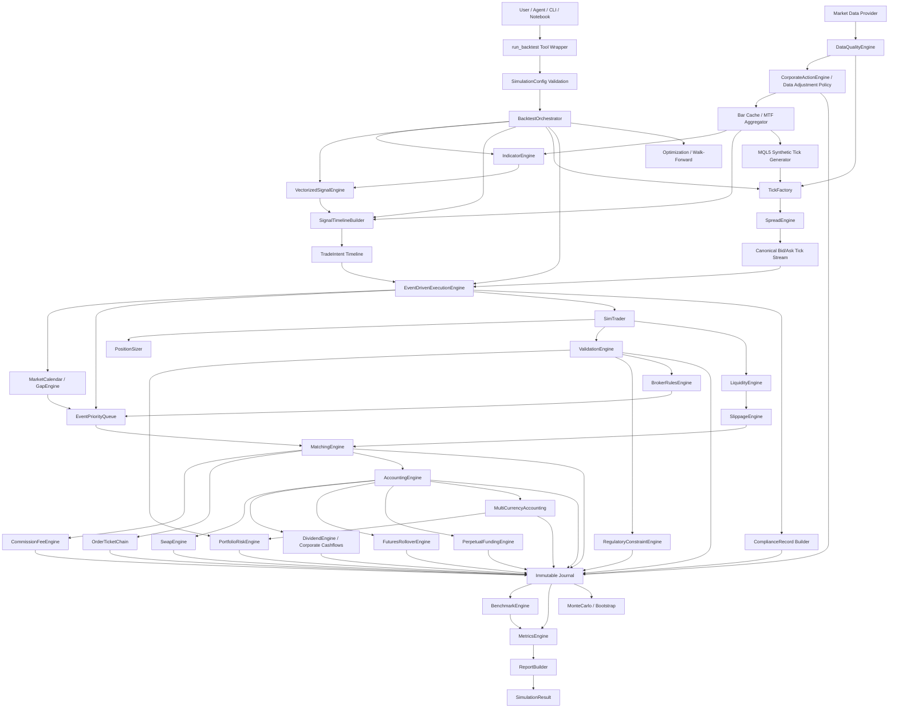
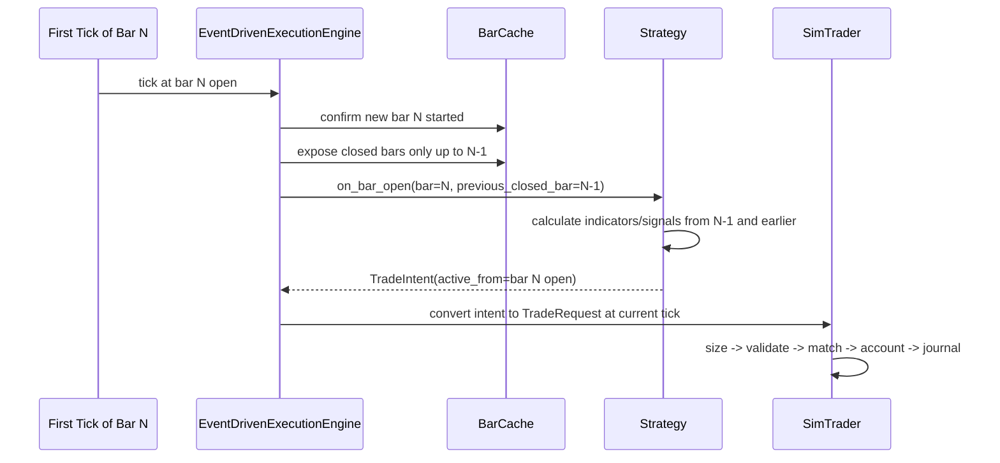
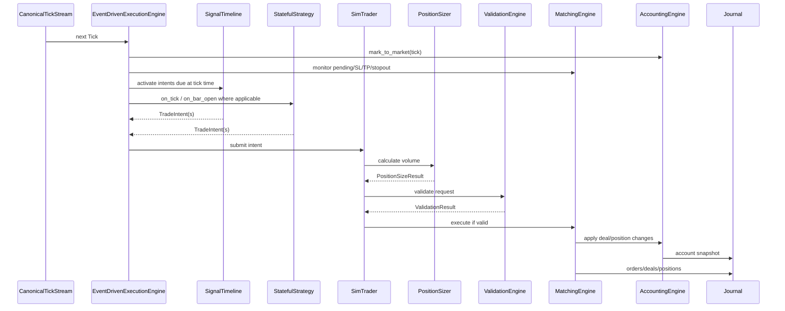
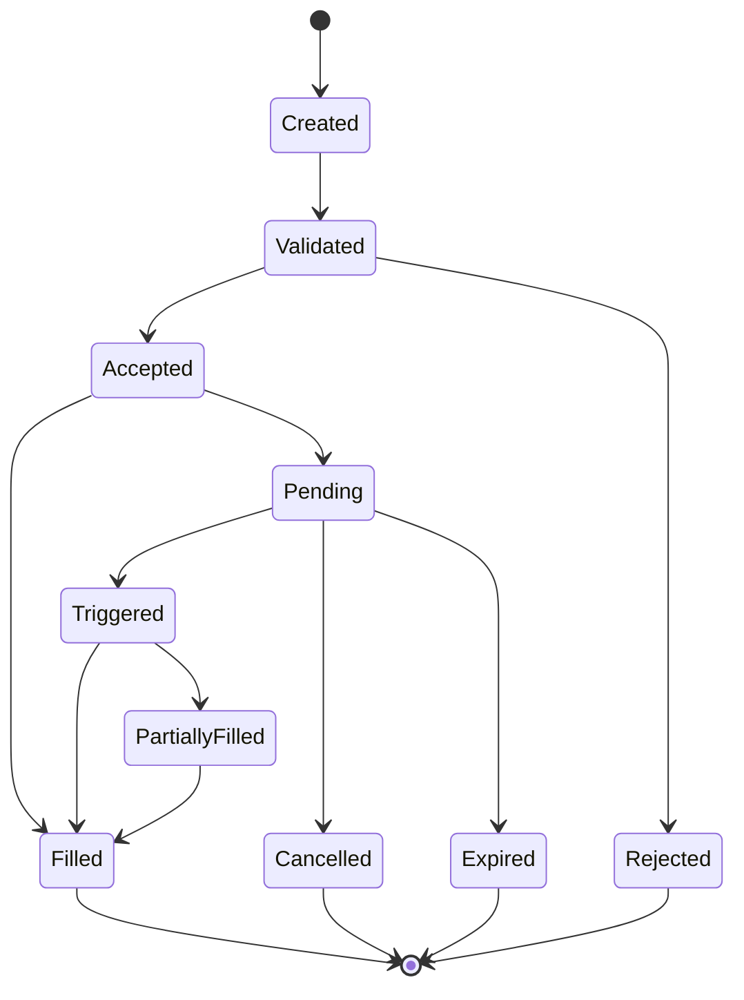
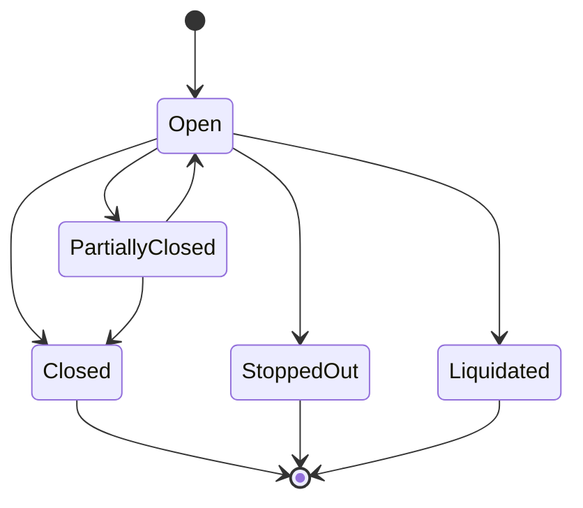

# HaruQuant Simulator Technical Specification — Hardened Draft v1.6

**Document Type:** Formal Technical Specification
**Document Version:** Hardened Draft v1.6
**System:** HaruQuant Python Backtesting / Simulation Engine
**Target Domains:** `tools/simulation/`, `tools/indicators/`, `tools/strategies/`
**Architecture Style:** Domain-driven, deterministic, MT5 Strategy Tester semantics inspired, tick-execution canonical, AI-tool compatible
**Status:** Hardened Draft v1.6 for all-asset-class production implementation planning
**Owner:** HaruQuant / HaruQuantAI
**Version Note:** This file is the corrected v1.6 specification. Any references to earlier review cycles are historical notes, not the active document version.
**Primary Goal:** Build a production-ready Python simulator that behaves like an MT5-style tick-driven strategy tester while supporting fast vectorized indicator/signal calculation, advanced stateful strategies, position sizing, multi-currency accounting, asset-class realism, reporting, optimization, and live/sim parity.

---

## 1. Executive Summary

The HaruQuant Simulator is a deterministic Python backtesting engine designed to reproduce the important execution semantics of the MetaTrader 5 Strategy Tester while remaining cleanly integrated into the HaruQuant `tools/` architecture.

The most important design correction is this:

> HaruQuant does **not** use vectorized execution as the canonical production backtest mode. Vectorized processing is allowed for indicator and signal generation only. All official fills, SL/TP checks, pending order triggers, position state changes, margin checks, account updates, trade journals, and reports are produced by the tick-based `EventDrivenExecutionEngine`.

The simulator therefore has one official execution clock:

> **Canonical bid/ask tick stream.**

Signals may be calculated from bars, multi-timeframe bars, or vectorized indicator arrays, but those signals are converted into timestamped `TradeIntent` objects and executed only when the tick loop reaches an eligible tick.

The default EA-style timing rule is:

> At the first tick of bar **N**, calculate signals using fully closed bar **N-1**, then enter at the opening tick of bar **N** if the strategy emits a trade intent.

This matches the common MT5 EA pattern of detecting a new bar, reading index `1`/previous closed-bar values, and sending orders on the new bar.


### 1.1 Production Review Incorporation Plan

This section incorporates the external production review that moved the simulator from a strong MT5-style research tester toward an industry-grade execution simulation specification. The review correctly identified that tick-based execution, previous-closed-bar timing, synthetic tick generation, centralized sizing, immutable journals, stateful strategies, and determinism were strong foundations, but that production realism also requires liquidity, partial fills, portfolio margin, swap, gaps, event priority rules, advanced fees, data quality gates, and benchmark targets.

| Review Comment | Specification Action |
|---|---|
| Infinite liquidity assumption | Added `LiquidityEngine`, `LiquidityModel`, optional order-book depth, volume-dependent fills, market-impact metrics, and liquidity acceptance gates. |
| Missing portfolio margin/risk | Added `PortfolioRiskConfig`, `PortfolioState`, portfolio margin modes, correlation/concentration checks, and portfolio-level pre-trade validation. |
| Missing swap/rollover | Added `SwapConfig`, `SwapType`, `SwapCalculationMode`, broker rollover time, triple-swap day, and swap journal events. |
| Limited fill policy support | Added deterministic partial-fill handling, fill-policy semantics, `PartialFillResult`, fill events, and average price rules. |
| Gap/weekend handling | Added `MarketHoursConfig`, `GapHandlingMode`, gap flags, session rules, weekend/holiday behavior, and stop-loss-as-market gap treatment. |
| Same-tick race conditions | Added deterministic `EventPriority`, priority queue processing, tie-break modes, and conservative defaults for SL/TP ambiguity. |
| Under-specified commissions | Added tiered, per-lot, per-trade, percent-notional, maker/taker, min/max, and currency-aware commission models. |
| Under-specified optimization | Added grid/random/Bayesian/genetic optimization modes, walk-forward settings, overfitting prevention, and Monte Carlo/bootstrap support. |
| Under-specified slippage | Added fixed, spread-relative, volatility-based, volume-dependent, and queue-position slippage modes with deterministic randomization. |
| Missing performance gates | Added benchmark targets, tick-batching constraints, profiling requirements, and production promotion rules. |
| Missing data quality gates | Added data-quality reports, fail-fast thresholds, spread checks, timestamp checks, and survivorship-bias flags where relevant. |
| Missing compliance/audit detail | Added `ComplianceRecord`, decision rationale, risk-check evidence, pre-trade checks, and compliance tags. |

Design decision: not every realism model must be enabled for every research run. However, every shortcut must be explicit in the config, recorded in the journal, and surfaced in the final report so that no report can accidentally look more realistic than it actually is.

### 1.2 Draft v1.6 Final Completion Plan

Draft v1.6 adds the final asset-class completion layer required to move the simulator from a strong FX/futures/crypto engine toward a complete multi-asset production simulator. The new scope closes three remaining realism gaps: corporate actions for equities/ETFs, futures rollover and perpetual funding, and full account-base-currency accounting for global portfolios.

| Final Review Comment | Draft v1.6 Action |
|---|---|
| Equities/ETFs require dividends, splits, reverse splits, mergers, and delistings | Added `CorporateActionEngine`, `DividendEngine`, `SplitAdjustmentEngine`, `CorporateAction`, `CashFlow`, adjusted/unadjusted data policies, and report disclosures. |
| Futures and perpetual swaps require contract roll and funding-rate treatment | Added `FuturesRolloverEngine`, `PerpetualFundingEngine`, `FuturesRollConfig`, contract-chain handling, roll events, funding intervals, and roll/funding PnL attribution. |
| Global portfolios require full base-currency accounting, not only commission conversion | Added `MultiCurrencyAccounting`, `CurrencyConversionEngine`, `BaseCurrencyConfig`, deterministic FX rate providers, converted realized/unrealized PnL, converted margin, cash ledgers, and currency-exposure reporting. |
| Enterprise reports need benchmark context | Added optional `BenchmarkEngine` for alpha, beta, information ratio, tracking error, benchmark drawdown comparison, and benchmark-relative reports. |
| Complex execution needs auditable parent-child lineage | Added optional `OrderTicketChain` and parent/child/fill lineage requirements for decomposition, TWAP/VWAP, partial fills, and bracket orders. |
| Regulation-aware backtesting may be needed later | Added optional `RegulatoryConstraintEngine` for PDT, short-sale, locate, position-limit, and exchange-specific checks. |

Production classification after v1.6:

- `production_realistic_fx`: requires tick execution, spread, slippage, fees, swap, margin, and currency conversion where account/base currency differs.
- `production_realistic_equity`: requires tick execution plus corporate actions, dividends, splits, fees, market hours, benchmark disclosure, and regulatory/short-sale treatment when applicable.
- `production_realistic_futures`: requires tick execution plus contract metadata, rollover policy, margin, fees, session/gap rules, and currency conversion where needed.
- `production_realistic_perpetual`: requires tick execution plus funding rates, exchange fees, liquidity/slippage, session rules, and currency/base accounting.

---

## 2. Core Production Rules

### 2.1 Engine Owns Trading Truth

The engine is the single source of truth for:

- orders
- deals
- positions
- pending orders
- account state
- balance
- equity
- margin
- free margin
- margin level
- realized PnL
- floating PnL
- commission
- swap
- trade history
- audit journal
- execution timestamps

Strategies may never directly mutate these objects.

### 2.2 Strategies May Be Stateful

Advanced strategies are allowed and expected to be stateful, but the state must be **decision state**, not official trading state.

Allowed strategy state examples:

- martingale level
- basket id
- pyramid layer
- last add-on price
- decomposition plan
- parent order id
- number of child orders sent
- recovery-cycle status

Forbidden strategy state mutation examples:

- directly changing account balance
- directly appending to engine position containers
- directly creating deals
- directly overwriting margin or equity

### 2.3 Tick Execution Is Canonical

All backtests must be executed through a tick loop.

Bar-based strategies are supported by converting bar-level signals into scheduled `TradeIntent` objects. Those intents are executed on the canonical tick stream.

### 2.4 Previous Closed Bar Only

For normal bar-open trading:

```text
At first tick of bar N:
    allowed input bars = bars up to and including N-1
    forbidden input bars = current incomplete bar N high/low/close
    signal timestamp = bar N open time
    execution tick = first valid tick of bar N
```

### 2.5 No Silent Failure

Every rejection, skipped trade, invalid config, invalid data condition, validation failure, sizing failure, or execution failure must return a deterministic error code and must be logged.

### 2.6 Realism Shortcuts Must Be Explicit

The engine may support simplified modes such as infinite liquidity, no slippage, no swap, no commission, or 4-tick OHLC modelling for speed and parity tests. These modes are allowed only when explicitly configured.

Every report must disclose:

- tick model
- spread model
- liquidity model
- slippage model
- commission model
- swap model
- market-hours/gap policy
- margin model
- portfolio risk model
- corporate-action model
- futures rollover model
- perpetual funding model
- currency conversion model
- benchmark model
- regulatory constraint model
- data quality status
- whether the result is `production_realistic`, `production_realistic_fx`, `production_realistic_equity`, `production_realistic_futures`, `production_realistic_perpetual`, `mt5_parity_oriented`, or `research_approximation`

A shortcut must never be silently assumed.

### 2.7 Portfolio State Is First-Class

Multi-symbol backtests must maintain portfolio-level state in addition to per-symbol orders and positions. This includes gross exposure, net exposure, currency exposure, correlation exposure, margin contribution, concentration, and portfolio-level risk limits.

### 2.8 Same-Tick Event Ordering Must Be Deterministic

When multiple actions are possible on the same tick, the engine must not rely on dictionary order, list insertion accidents, pandas row order, or strategy callback timing. All same-tick actions must be resolved through a deterministic priority queue using explicit event priority, event timestamp, and monotonic sequence number.

### 2.9 Asset-Class Realism Must Be Explicit

A simulation must declare the asset-class realism requirements that apply to the selected instruments. The engine must not label a run production-realistic unless the required asset-class models are enabled or explicitly proven unnecessary.

Required examples:

- Equities/ETFs require corporate-action treatment: dividends, splits, reverse splits, delistings, mergers, and adjusted/unadjusted price policy.
- Futures require contract metadata, expiry, rollover policy, margin model, and roll-adjustment disclosure.
- Perpetual swaps require funding-rate treatment, funding timestamps, funding currency, and exchange-fee model.
- Multi-currency strategies require base-currency conversion for realized PnL, floating PnL, margin, commission, swap, dividends, funding, and cash balances.
- Benchmark-relative reports require benchmark data aligned to the same clock and currency as the strategy.

A model may be disabled only if the report records the disablement and downgrades the realism label when the disabled model is relevant to the traded instrument.

---

## 3. Target Folder Structure

```text
tools/
    simulation/
        __init__.py                  # official AI-tool exports only
        config.py                    # SimulationConfig and nested configs
        enums.py                     # execution, order, sizing, tick, spread, liquidity, fee enums
        models.py                    # domain dataclasses
        orchestrator.py              # BacktestOrchestrator

        # data/tick/signal construction
        signal_alignment.py          # bar-open/previous-close signal timing
        tick_factory.py              # canonical tick stream creation
        synthetic_ticks.py           # MQL5 Article #75-style synthetic tick generation
        spread.py                    # spread models
        data_quality.py              # OHLC/tick/spread quality gates

        # execution realism
        market_calendar.py           # sessions, weekends, holidays, rollover boundaries
        gaps.py                      # gap detection and gap handling rules
        liquidity.py                 # infinite/fixed/volume/order-book liquidity models
        slippage.py                  # fixed/spread/volatility/volume/queue slippage models
        event_queue.py               # deterministic same-tick event priority queue
        fees.py                      # commission, fee, maker/taker, tiered schedules
        swap.py                      # rollover and swap accrual
        broker_rules.py              # stopout, margin call, symbol/broker limits
        portfolio.py                 # portfolio exposure, risk, margin aggregation
        currency.py                  # base-currency conversion, FX rate providers, cash ledgers
        corporate_actions.py         # dividends, splits, mergers, delistings, price adjustment policy
        futures_rollover.py          # contract chains, expiry, continuous roll, roll events
        funding.py                   # perpetual swap funding rates and funding cashflows
        benchmarks.py                # benchmark alignment, alpha/beta, information ratio
        order_chaining.py            # parent-child order lineage for decomposition and partial fills
        regulatory.py                # optional PDT, locate, short-sale, position-limit checks

        # trading engine
        position_sizing.py           # position sizing engine
        event_engine.py              # official tick execution engine
        trader.py                    # MT5-compatible SimTrader protocol/backend
        validation.py                # pre-trade validation
        matching.py                  # order matching, SL/TP, pending triggers, partial fills
        accounting.py                # balance/equity/margin/PnL state
        journal.py                   # immutable event and compliance journal
        compliance.py                # pre-trade checks, rationale, compliance record helpers

        # analytics and research
        metrics.py                   # MT5-like metrics and realism diagnostics
        report.py                    # report builder
        optimization.py              # grid/random/Bayesian/genetic and WFO
        monte_carlo.py               # bootstrap and Monte Carlo robustness analysis
        performance.py               # benchmark helpers and tick-batch profiling
        errors.py                    # deterministic error taxonomy
        logging.py                   # structured logging helpers

        examples/
            run_ema_trend_backtest.py
            run_martingale_decomposition.py

        tests/
            test_config.py
            test_data_quality.py
            test_tick_factory.py
            test_synthetic_ticks.py
            test_spread.py
            test_market_calendar.py
            test_gaps.py
            test_liquidity.py
            test_slippage.py
            test_event_queue.py
            test_fees.py
            test_swap.py
            test_broker_rules.py
            test_portfolio.py
            test_currency.py
            test_corporate_actions.py
            test_futures_rollover.py
            test_funding.py
            test_benchmarks.py
            test_order_chaining.py
            test_regulatory.py
            test_position_sizing.py
            test_signal_alignment.py
            test_event_engine.py
            test_validation.py
            test_matching.py
            test_accounting.py
            test_journal.py
            test_compliance.py
            test_metrics.py
            test_optimization.py
            test_monte_carlo.py
            test_performance.py

    indicators/
        __init__.py                  # official indicator tool exports only
        base.py
        trend.py                     # EMA/SMA/ADX trend indicators
        volatility.py                # ATR/ADR/rolling volatility
        momentum.py                  # RSI/Williams %R/etc.
        tests/
            test_trend.py
            test_volatility.py

    strategies/
        __init__.py                  # official strategy tool exports only
        base.py
        templates/
            vectorized_signal_strategy.py
            event_stateful_strategy.py
        examples/
            ema_trend_following.py
            martingale_decomposition.py
        tests/
            test_ema_trend_following.py
            test_martingale_decomposition.py
```

### AI Tool Boundary Rule

Anything exported from a domain `__init__.py` and listed in `__all__` is an official AI Tool and must follow HaruQuant tool standards: metadata, request id, input validation, structured logging, deterministic error codes, no silent failures, and standard return schema.

Internal classes such as `EventDrivenExecutionEngine`, `MatchingEngine`, `AccountingEngine`, `TickFactory`, and `PositionSizer` are internal engine services and should not be exported as agent-callable tools unless a deliberate wrapper is created.

---

## 4. High-Level Architecture



### 4.1 Important Architecture Rule

`VectorizedSignalEngine` is not an execution engine. It may calculate indicator columns and signal columns quickly, but it does not fill orders, update account state, or create final trades.

The only official production execution engine is:

```text
EventDrivenExecutionEngine
```

### 4.2 Production Realism Rule

The execution engine must not assume perfect fills. The default production path is:

```text
TradeIntent
  -> PositionSizer
  -> ValidationEngine
  -> PortfolioRiskEngine
  -> BrokerRulesEngine
  -> EventPriorityQueue
  -> LiquidityEngine
  -> SlippageEngine
  -> MatchingEngine
  -> CommissionFeeEngine
  -> Swap/Accounting/Journal
```

An optional `FastResearchEngine` may be added later for approximate exploration, but any result produced by it must be clearly marked:

```text
research_only = true
mt5_parity = false
canonical_execution = false
production_realistic = false
```

---

## 5. MT5 EA-Style Signal Timing

### 5.1 Default Timing Policy

```python
class SignalTimingPolicy(str, Enum):
    BAR_OPEN_PREVIOUS_CLOSE = "bar_open_previous_close"
    ON_BAR_CLOSE_NEXT_TICK = "on_bar_close_next_tick"   # allowed alias, same safe principle
    INTRABAR_EVENT = "intrabar_event"                   # only for event strategies using current tick data
```

Default:

```python
SignalTimingPolicy.BAR_OPEN_PREVIOUS_CLOSE
```

### 5.2 Timing Diagram



### 5.3 No-Lookahead Requirements

The simulator must reject or flag any bar-open strategy that uses:

- current bar high
- current bar low
- current bar close
- current bar volume before bar completion
- indicators calculated with unshifted current-bar values

For vectorized signal generation, the safe rule is:

```python
signal_at_bar_n_open = condition_calculated_from_bar_n_minus_1
```

Example:

```python
fast = ema(close, 20)
slow = ema(close, 50)
raw_signal = fast > slow
entry_signal_at_open = raw_signal.shift(1)
```

---

## 6. Tick Models

### 6.1 TickModel Enum

```python
class TickModel(str, Enum):
    TIMEFRAME_TICKS = "timeframe_ticks"
    M1_TICKS = "m1_ticks"
    REAL_TICKS = "real_ticks"
    SYNTHETIC_TICKS = "synthetic_ticks"
```

### 6.2 Canonical Tick Contract

Every tick consumed by the execution engine must have:

```python
@dataclass(frozen=True)
class Tick:
    time: datetime
    symbol: str
    bid: Decimal
    ask: Decimal
    last: Decimal | None = None
    volume: Decimal | None = None
    source: str = "generated"
    bar_time: datetime | None = None
    sequence_in_bar: int | None = None
    is_bar_open_tick: bool = False
```

Execution uses bid/ask:

- Buy opens at ask.
- Buy closes at bid.
- Sell opens at bid.
- Sell closes at ask.

### 6.3 `timeframe_ticks`

Purpose: fast fallback when only the trading timeframe OHLC data is available.

Rules:

- Convert each strategy-timeframe OHLC bar into a 4-tick path.
- Bullish candle path: `Open -> Low -> High -> Close`.
- Bearish candle path: `Open -> High -> Low -> Close`.
- Doji may use previous candle direction or configurable default.
- This mode is lower fidelity and must be marked as approximate.

### 6.4 `m1_ticks`

Purpose: better approximation using M1 bars.

Rules:

- Calculate strategy signals on the trading timeframe.
- Merge/align signal timeline into M1 bars.
- Convert each M1 OHLC bar into a 4-tick path.
- Execute all trades on generated M1 ticks.
- This improves intrabar SL/TP behavior compared to strategy-timeframe ticks.

### 6.5 `real_ticks`

Purpose: highest-fidelity mode.

Rules:

- Use downloaded broker real ticks when available.
- Merge bar-based signal timeline into the real tick stream.
- Detect new bars from tick timestamps.
- At the first real tick of bar N, evaluate bar-open signals based on closed bar N-1.
- Use real bid/ask where provided.
- If real ticks have bid/ask already, spread model should usually be disabled or set to `native_spread` from tick bid/ask.

### 6.6 `synthetic_ticks`

Purpose: MT5 Strategy Tester-style synthetic tick generation from M1 bars.

This mode must follow the algorithm described in MQL5 Article #75, **"The Algorithm of Ticks' Generation within the Strategy Tester of the MetaTrader 5 Terminal"**.

Production rule:

> `synthetic_ticks` are generated from M1 OHLCV bars using an MQL5-style support-point algorithm, not from a simple 4-tick OHLC path.

High-level rules:

1. M1 bars are the modelling base.
2. Generated tick prices are treated as bid prices unless real bid/ask ticks are available.
3. Ask is derived from the configured spread model.
4. Tick volume controls how many ticks are generated for the minute.
5. `tick_volume <= 0` is invalid unless the config explicitly allows repair.
6. `tick_volume == 1`: generate one tick at the close price.
7. `tick_volume == 2`: generate two ticks: open, then close.
8. `tick_volume == 3`: generate a valid 3-tick path based on the bar's OHLC shape.
9. `tick_volume > 3`: generate support points first, then generate intermediate ticks between support points.
10. Support-point count must not exceed tick volume and has a maximum of 11 support points, excluding the opening price.
11. Support points are distributed between opening shadow, candle body/range, and closing shadow using the MQL5 pattern family:

```text
3 - 5 - 3
2 - 6 - 2
2 - 5 - 2
2 - 4 - 2
2 - 3 - 2
1 - 4 - 1
1 - 3 - 1
1 - 2 - 1
1 - 1 - 1
```

12. If a candle has no opening or closing shadow, the support points assigned to the missing shadow are transferred to the candle body/range.
13. The body/range should be generated with an odd number of support points where possible.
14. Candle body/range support points are generated using impulse waves.
15. Intermediate ticks between support points are generated linearly when the number of price points allows it; otherwise a saw pattern is used.
16. The output must be deterministic for the same M1 bar, symbol spec, spread config, and random seed.

### 6.7 Synthetic Tick Algorithm Pseudocode

```python
def generate_mql5_synthetic_ticks(bar: Bar, symbol: SymbolSpec, spread_model: SpreadModelConfig) -> list[Tick]:
    """Generate MQL5-style synthetic ticks from one M1 bar."""
    validate_m1_bar(bar)
    volume = max(int(bar.tick_volume), 1)

    if volume == 1:
        bid_prices = [bar.close]
    elif volume == 2:
        bid_prices = [bar.open, bar.close]
    elif volume == 3:
        bid_prices = build_three_tick_path(bar, symbol.point)
    else:
        support = build_mql5_support_points(bar, max_support_points=11)
        bid_prices = interpolate_support_points(
            support_points=support,
            requested_tick_count=volume,
            point=symbol.point,
        )

    return apply_spread_to_bid_prices(
        bid_prices=bid_prices,
        bar=bar,
        symbol=symbol,
        spread_model=spread_model,
    )
```

### 6.8 Synthetic Tick Acceptance Tests

The implementation must test:

- tick volume 1 produces exactly one tick at close.
- tick volume 2 produces open then close.
- tick volume 3 produces three deterministic ticks and respects OHLC bounds.
- tick volume > 3 uses support points, not only OHLC four-price path.
- generated ticks never exceed high or low bounds, except if configured to reproduce known MT5 rounding edge behavior.
- first tick of a minute is marked `is_bar_open_tick=True` when appropriate.
- output tick count equals M1 tick volume unless repair mode is explicitly enabled.
- identical seed/config/data produces identical ticks.
- every generated tick has bid and ask after spread application.

---

## 7. Spread Models

### 7.1 SpreadModel Enum

```python
class SpreadModel(str, Enum):
    NATIVE_SPREAD = "native_spread"
    FIXED_SPREAD = "fixed_spread"
    VARIABLE_SPREAD = "variable_spread"
```

### 7.2 Spread Rules

Generated OHLC-derived tick prices are treated as bid prices. Ask is calculated as:

```text
ask = bid + spread_points * symbol.point
```

### 7.3 `native_spread`

Use the `spread` column from the source DataFrame.

Rules:

- Spread must be interpreted in points.
- Missing spread must either be rejected or repaired according to explicit config.
- For real ticks containing bid/ask, native spread is derived from `ask - bid`.

### 7.4 `fixed_spread`

Use the same spread for all generated ticks.

Required config:

```python
fixed_spread_points: int
```

### 7.5 `variable_spread`

Choose a deterministic pseudo-random spread between configured min and max.

Required config:

```python
min_spread_points: int
max_spread_points: int
random_seed: int
```

Production rules:

- Must be deterministic for identical seed/config/data.
- Must not choose a negative spread.
- Must record the chosen spread on every generated tick or journal checkpoint.

---

## 8. Execution Realism Models

### 8.1 Purpose

This specification defines execution-realism models that determine whether a backtest is only MT5-semantics inspired or genuinely useful for production decision-making. These models sit between validation and matching and must be deterministic, configurable, and fully journaled.

Required realism configuration groups:

```python
@dataclass(frozen=True)
class ExecutionRealismConfig:
    liquidity: LiquidityConfig
    slippage: SlippageConfig
    commission: CommissionConfig
    swap: SwapConfig
    market_hours: MarketHoursConfig
    gap_handling: GapHandlingConfig
    broker_rules: BrokerRules
    portfolio_risk: PortfolioRiskConfig
    data_quality: DataQualityConfig
    corporate_actions: CorporateActionConfig
    futures_rollover: FuturesRollConfig
    perpetual_funding: PerpetualFundingConfig
    currency_conversion: BaseCurrencyConfig
    benchmark: BenchmarkConfig | None = None
    regulatory: RegulatoryConfig | None = None
```

Production rule:

> The engine may allow simplified modes, but the report must clearly disclose them. A backtest using infinite liquidity, no slippage, no commission, no swap, or disabled portfolio checks must not be labelled production-realistic.

### 8.2 Liquidity Model and Optional Order Book

```python
class LiquidityModel(str, Enum):
    INFINITE = "infinite"                 # simple/MT5 parity test mode only
    FIXED_SLIPPAGE = "fixed_slippage"     # no volume constraint, deterministic slippage
    VOLUME_DEPENDENT = "volume_dependent" # available volume estimated from tick/M1 volume
    ORDER_BOOK = "order_book"             # top-N book levels when depth data exists


@dataclass(frozen=True)
class OrderBookLevel:
    price: Decimal
    volume: Decimal


@dataclass(frozen=True)
class OrderBook:
    symbol: str
    bids: list[OrderBookLevel]
    asks: list[OrderBookLevel]
    timestamp: datetime


@dataclass(frozen=True)
class LiquidityConfig:
    model: LiquidityModel = LiquidityModel.VOLUME_DEPENDENT
    max_participation_rate: Decimal = Decimal("0.10")
    min_available_volume: Decimal = Decimal("0")
    allow_partial_fills: bool = True
    market_impact_coefficient: Decimal = Decimal("0")
    depth_levels: int = 5
```

Rules:

- `INFINITE` is allowed for controlled MT5 parity tests and early research but must be disclosed.
- `VOLUME_DEPENDENT` estimates available volume from tick volume, M1 volume, or configured symbol liquidity.
- `ORDER_BOOK` walks the available bid/ask levels and calculates volume-weighted average execution price.
- Large order execution must produce market-impact diagnostics: requested volume, filled volume, unfilled volume, VWAP, slippage points, and impact cost.
- Liquidity decisions must be deterministic for the same tick, config, seed, and order request.

### 8.3 Slippage Model

```python
class SlippageMode(str, Enum):
    NONE = "none"
    FIXED_POINTS = "fixed_points"
    PERCENT_OF_SPREAD = "percent_of_spread"
    VOLATILITY_BASED = "volatility_based"
    VOLUME_DEPENDENT = "volume_dependent"
    QUEUE_POSITION = "queue_position"


@dataclass(frozen=True)
class SlippageConfig:
    mode: SlippageMode = SlippageMode.PERCENT_OF_SPREAD
    fixed_points: int | None = None
    percent_of_spread: Decimal | None = Decimal("0.50")
    volatility_coefficient: Decimal | None = None
    queue_position_model: bool = False
    max_slippage_points: int | None = None
    randomize: bool = False
    random_seed_offset: int = 0
```

Rules:

- Slippage is applied after spread and before final fill price acceptance.
- Slippage is direction-aware: it worsens buy entries/sell exits upward and sell entries/buy exits downward.
- Random slippage must use deterministic seeded randomness and must be reproducible.
- Slippage must be capped when `max_slippage_points` is configured.
- The journal must record expected price, executable bid/ask, slippage points, and final fill price.

### 8.4 Fill Policies and Partial Fills

```python
class FillPolicy(str, Enum):
    FOK = "fok"             # fill full volume immediately or reject
    IOC = "ioc"             # fill available volume immediately, cancel remainder
    RETURN = "return"       # fill available volume and keep remainder pending where allowed
    PARTIAL = "partial"     # simulator extension: explicit partial-fill mode


@dataclass(frozen=True)
class FillEvent:
    order_id: str
    deal_id: str
    symbol: str
    price: Decimal
    volume: Decimal
    time: datetime
    liquidity_level: int | None = None
    commission: Decimal = Decimal("0")
    slippage_points: Decimal = Decimal("0")


@dataclass(frozen=True)
class PartialFillResult:
    requested_volume: Decimal
    filled_volume: Decimal
    remaining_volume: Decimal
    average_price: Decimal
    partial_fills: list[FillEvent]
```

Rules:

- Every partial fill creates a separate deal record.
- Position average price must be recalculated from actual filled volumes and prices.
- `FOK` rejects when full volume is unavailable.
- `IOC` records any available fill and cancels the rest.
- `RETURN` keeps the unfilled remainder pending only if the broker/symbol supports it.
- Partial fills must update margin, exposure, commission, and risk immediately.

### 8.5 Realistic Limit Order and Queue Handling

```python
class QueueModel(str, Enum):
    NONE = "none"
    FIFO = "fifo"
    PRO_RATA = "pro_rata"
    QUEUE_POSITION_ESTIMATE = "queue_position_estimate"


@dataclass(frozen=True)
class LimitOrderQueueConfig:
    queue_model: QueueModel = QueueModel.QUEUE_POSITION_ESTIMATE
    initial_queue_ahead: Decimal | None = None
    allow_touch_fill: bool = True
    require_trade_through: bool = False
    iceberg_support: bool = False
    hidden_order_support: bool = False
```

Rules:

- Limit order fill is not guaranteed merely because price touches the limit unless `allow_touch_fill=True` and liquidity is available.
- Queue-position estimates must reduce available fill volume by the configured or estimated volume ahead.
- FIFO and pro-rata behavior must be deterministic.
- Hidden and iceberg order support may be documented but can remain disabled until order-book data exists.

### 8.6 Market Hours, Weekend Rules, and Gap Handling

```python
class GapHandlingMode(str, Enum):
    REJECT = "reject"
    FILL_AT_OPEN = "fill_at_open"
    FILL_WITH_SLIPPAGE = "fill_with_slippage"
    STOP_LOSS_AS_MARKET = "sl_as_market"


@dataclass(frozen=True)
class MarketHoursConfig:
    session_start: time | None = None
    session_end: time | None = None
    timezone: str = "UTC"
    weekend_closed: bool = True
    holiday_calendar: str | None = None
    asset_trades_24_7: bool = False


@dataclass(frozen=True)
class GapHandlingConfig:
    mode: GapHandlingMode = GapHandlingMode.STOP_LOSS_AS_MARKET
    gap_threshold_points: int | None = None
    slippage_multiplier: Decimal = Decimal("1.0")
    conservative_when_ambiguous: bool = True
```

Rules:

- The tick stream must mark the first tick after a session break or weekend as a gap tick.
- Market orders cannot execute while the market is closed unless explicitly configured for 24/7 assets.
- Stop losses crossed by a gap must be treated as market orders at the first available tick, not as perfect fills at the stop price.
- If both SL and TP are crossed within the same gap and no tick path proves the order, the conservative default is to apply the worse outcome for the strategy.
- Gap handling rules must be recorded in the report.

### 8.7 Deterministic Same-Tick Event Priority

```python
class EventPriority(IntEnum):
    MARGIN_STOPOUT = 0
    ORDER_EXPIRATION = 1
    STOP_LOSS = 2
    TAKE_PROFIT = 3
    PENDING_ORDER_TRIGGER = 4
    MARKET_ORDER = 5
    SIGNAL_INTENT = 6
    STRATEGY_CALLBACK = 7


class EventTieBreakMode(str, Enum):
    CONSERVATIVE = "conservative"
    FAVORABLE = "favorable"
    ENTRY_ORDER = "entry_order"
    MT5_APPROXIMATION = "mt5_approximation"
```

Rules:

- All same-tick events must be ordered by `(tick_time, priority, sequence_number)`.
- Stopout has the highest priority because account survival overrides strategy intent.
- Expiration is processed before new triggers for the same timestamp.
- Existing position exits are processed before new signal intents by default.
- Ambiguous SL/TP conflicts use `CONSERVATIVE` mode unless the config explicitly chooses another mode.
- Priority decisions must be journaled for replay.

### 8.8 Commission, Fee, and Rebate Model

```python
class CommissionMode(str, Enum):
    NONE = "none"
    PER_LOT = "per_lot"
    PER_TRADE = "per_trade"
    PERCENT_NOTIONAL = "percent_notional"
    TIERED = "tiered"
    MAKER_TAKER = "maker_taker"


@dataclass(frozen=True)
class CommissionTier:
    min_monthly_volume: Decimal
    rate: Decimal


@dataclass(frozen=True)
class CommissionConfig:
    mode: CommissionMode = CommissionMode.PER_LOT
    long_rate: Decimal = Decimal("0")
    short_rate: Decimal = Decimal("0")
    min_commission: Decimal | None = None
    max_commission: Decimal | None = None
    currency: str = "USD"
    rebate_for_liquidity: bool = False
    maker_rate: Decimal | None = None
    taker_rate: Decimal | None = None
    tiered_schedule: list[CommissionTier] = field(default_factory=list)
```

Rules:

- Commission must be calculated per actual fill, not only per requested order.
- Partial fills may each carry commission.
- Commission currency conversion must use deterministic conversion rates from the data layer when account currency differs.
- Net PnL must include spread, slippage, commission, fee, and swap.
- Reports must include gross PnL, total cost, and net PnL.

### 8.9 Swap and Rollover Model

```python
class SwapType(str, Enum):
    POINTS = "points"
    MONEY = "money"
    PERCENT = "percent"
    INTEREST = "interest"


class SwapCalculationMode(str, Enum):
    DAILY_END_OF_DAY = "daily_eod"
    TICK_BY_TICK = "tick_by_tick"
    ON_CLOSE_ONLY = "on_close_only"


@dataclass(frozen=True)
class SwapConfig:
    long_swap: Decimal = Decimal("0")
    short_swap: Decimal = Decimal("0")
    swap_type: SwapType = SwapType.POINTS
    calculation_mode: SwapCalculationMode = SwapCalculationMode.DAILY_END_OF_DAY
    triple_swap_day: int = 2  # Wednesday when Monday=0
    rollover_time: time = time(21, 59, 59)
    timezone: str = "UTC"
```

Rules:

- Swap applies only to open positions crossing the configured rollover boundary.
- Triple swap must be configurable per symbol because broker rules differ.
- Swap charges or credits must be represented as journal events and reflected in account balance/equity.
- Backtests that hold overnight positions with swap disabled must be labelled as cost-incomplete.

### 8.10 Broker-Specific Rules

```python
@dataclass(frozen=True)
class BrokerRules:
    margin_call_percent: Decimal = Decimal("100")
    stop_out_percent: Decimal = Decimal("50")
    max_pending_orders: int = 100
    max_positions_total: int | None = None
    max_positions_per_symbol: int | None = None
    supported_fill_policies: set[FillPolicy] = field(default_factory=lambda: {FillPolicy.FOK, FillPolicy.IOC, FillPolicy.RETURN})
    allow_hedging: bool = True
    allow_netting: bool = True
    negative_balance_protection: bool = False
```

Rules:

- Broker rules must be applied before matching.
- Unsupported fill policies must reject the order with deterministic error codes.
- Stopout liquidation order must be deterministic and configurable; default is largest losing position first.
- Netting/hedging behavior must match the configured account mode.

### 8.11 Multi-Asset Portfolio Margin and Risk

```python
class PortfolioMarginMode(str, Enum):
    INDEPENDENT_SYMBOL = "independent_symbol"
    NETTED_FX = "netted_fx"
    CROSS_MARGIN = "cross_margin"
    SPAN_LIKE = "span_like"


@dataclass(frozen=True)
class PortfolioRiskConfig:
    enabled: bool = True
    max_correlation: Decimal | None = Decimal("0.70")
    max_symbol_exposure_pct: Decimal | None = None
    max_cluster_exposure_pct: Decimal | None = None
    max_gross_exposure_pct: Decimal | None = None
    cross_margin_enabled: bool = False
    netting_across_symbols: bool = False
    margin_mode: PortfolioMarginMode = PortfolioMarginMode.INDEPENDENT_SYMBOL


@dataclass(frozen=True)
class PortfolioState:
    gross_exposure: Decimal
    net_exposure: Decimal
    nav: Decimal
    var_95: Decimal | None
    concentration: dict[str, Decimal]
    margin_by_symbol: dict[str, Decimal]
    exposure_by_currency: dict[str, Decimal]
```

Rules:

- Portfolio risk validation happens after position sizing and before matching.
- Correlation and concentration checks must be deterministic and use only historical data available at the tick time.
- Portfolio margin must aggregate all open positions and pending exposure according to the configured margin mode.
- Pair, basket, grid, and martingale strategies must be evaluated at portfolio level, not only per-symbol.

### 8.12 Data Quality Gate

```python
@dataclass(frozen=True)
class DataQualityConfig:
    fail_on_missing_required_columns: bool = True
    fail_on_duplicate_timestamps: bool = True
    fail_on_non_monotonic_time: bool = True
    max_missing_bars_pct: Decimal = Decimal("0.01")
    max_negative_spreads: int = 0
    max_price_jump_atr_multiple: Decimal = Decimal("5")
    require_survivorship_bias_check: bool = False


@dataclass(frozen=True)
class DataQualityReport:
    missing_bars_pct: Decimal
    duplicate_timestamps: int
    non_monotonic_timestamps: int
    negative_spreads_detected: int
    zero_or_negative_prices: int
    price_jumps_outlier_pct: Decimal
    survivorship_bias_checked: bool
    passed: bool
```

Rules:

- Data-quality checks run before indicator calculation and before tick generation.
- Severe data failure must block the backtest unless diagnostic mode is explicitly enabled.
- The final report must include the data-quality report.

### 8.13 Optimization, Walk-Forward, and Overfitting Prevention

```python
class OptimizationMethod(str, Enum):
    GRID_SEARCH = "grid"
    RANDOM_SEARCH = "random"
    BAYESIAN = "bayesian"
    GENETIC = "genetic"


@dataclass(frozen=True)
class WalkForwardConfig:
    enabled: bool = False
    in_sample_ratio: Decimal = Decimal("0.60")
    step_size_months: int = 1
    retrain_frequency_months: int = 3
    test_metric: str = "sharpe_ratio"


@dataclass(frozen=True)
class OverfittingPreventionConfig:
    param_sensitivity_threshold: Decimal = Decimal("0.10")
    min_trades_for_validation: int = 30
    require_out_of_sample: bool = True
    reject_single_peak_parameter_surfaces: bool = True
```

Rules:

- Optimization must call the same canonical tick-execution engine as normal backtests.
- Walk-forward results must separate in-sample and out-of-sample metrics.
- Parameter sets failing minimum trade count, data-quality checks, or robustness checks must be rejected.
- Optimization outputs must include config hash, data hash, parameter hash, random seed, and objective function.

### 8.14 Monte Carlo and Bootstrap Robustness

```python
@dataclass(frozen=True)
class MonteCarloConfig:
    enabled: bool = False
    num_simulations: int = 1000
    shuffle_trades: bool = True
    replace_trades: bool = True
    randomize_spread_slippage: bool = False
    confidence_interval: Decimal = Decimal("0.95")
```

Rules:

- Monte Carlo analysis is performed after a canonical journal exists.
- It does not replace the official backtest result.
- Outputs include confidence bands for drawdown, net profit, profit factor, risk of ruin, and worst-case streaks.

### 8.15 Performance Benchmarks and Tick Batching

Initial production benchmark gates:

| Area | Production Target |
|---|---:|
| Pure indicator/signal calculation on 10 years × 10 symbols M1 bars | target < 5 seconds after caching/preprocessing |
| Python tick loop with no trade events | target >= 10,000 ticks/second |
| Synthetic tick generation | target >= 100,000 generated ticks/second where possible |
| Optimization batch of 10,000 parameter sets | target < 30 minutes only after parallel execution is enabled |
| Memory for common 10-symbol research run | target < 2 GB after chunking/caching |

```python
@dataclass(frozen=True)
class PerformanceConfig:
    enable_tick_batch_fast_path: bool = True
    batch_size: int = 100
    max_memory_mb: int | None = 2048
    benchmark_required: bool = True


class TickBatchProcessor:
    """Fast path for price updates that do not trigger state transitions."""
    batch_size: int = 100

    def process_batch(self, ticks: list[Tick]) -> list[EngineEvent]:
        ...
```

Rules:

- Batching may accelerate pure mark-to-market updates.
- Batching must stop immediately at any tick that may trigger order expiration, SL/TP, pending order, stopout, bar-open signal, strategy callback, gap handling, swap rollover, or compliance event.
- Batching must never reorder ticks or suppress per-event accounting invariants.
- Benchmark results are required before production promotion and must be stored with the release notes.

### 8.16 Compliance Records

```python
@dataclass(frozen=True)
class ComplianceRecord:
    order_id: str | None
    request_id: str
    timestamp: datetime
    decision_rationale: str
    risk_check_passed: bool
    pre_trade_checks: list[str]
    compliance_tag: str | None = None
    strategy_name: str | None = None
    strategy_version: str | None = None
```

Rules:

- Every accepted or rejected trade request must have a compliance/audit record.
- The record must show which pre-trade checks passed or failed.
- Strategy-generated rationale may be optional for simple signal strategies but must be available for advanced stateful strategies and agent-generated strategies.

---

## 9. Position Sizing Engine

### 9.1 PositionSizingMode Enum

```python
class PositionSizingMode(str, Enum):
    FIXED_LOT = "fixed_lot"
    FIXED_RISK = "fixed_risk"
    MILESTONE = "milestone"
    KELLY_CRITERION = "kelly_criterion"
    VOLATILITY = "volatility"
    FIXED_FRACTIONAL = "fixed_fractional"
```

### 9.2 Position Sizing Pipeline

```text
TradeIntent
    -> PositionSizer
    -> volume candidate
    -> volume normalization by symbol min/max/step
    -> margin validation
    -> risk validation
    -> TradeRequest
    -> ValidationEngine
    -> MatchingEngine
```

The strategy may request a sizing mode, but the engine is responsible for final volume calculation and validation.

### 9.3 PositionSizeRequest

```python
@dataclass(frozen=True)
class PositionSizeRequest:
    symbol: str
    direction: int                         # +1 buy, -1 sell
    entry_price: Decimal
    stop_loss: Decimal | None
    account_balance: Decimal
    account_equity: Decimal
    sizing_mode: PositionSizingMode
    fixed_lot: Decimal | None = None
    risk_percent: Decimal | None = None
    capital_fraction: Decimal | None = None
    atr_points: Decimal | None = None
    atr_multiplier: Decimal | None = None
    win_rate: Decimal | None = None
    payoff_ratio: Decimal | None = None
    milestone_table: list[tuple[Decimal, Decimal]] | None = None
    max_lot: Decimal | None = None
    metadata: dict[str, Any] = field(default_factory=dict)
```

### 9.4 PositionSizeResult

```python
@dataclass(frozen=True)
class PositionSizeResult:
    success: bool
    volume: Decimal
    raw_volume: Decimal
    normalized_volume: Decimal
    risk_amount: Decimal | None
    risk_points: Decimal | None
    margin_required: Decimal | None
    sizing_mode: PositionSizingMode
    error_code: str | None = None
    message: str = ""
```

### 9.5 Sizing Formulas

#### `fixed_lot`

```text
volume = configured_fixed_lot
```

Use for deterministic fixed-lot systems and comparison baselines.

#### `fixed_risk`

```text
risk_amount = account_equity * risk_percent
stop_distance_points = abs(entry_price - stop_loss) / symbol.point
money_risk_per_lot = stop_distance_points * value_per_point_per_lot
volume = risk_amount / money_risk_per_lot
```

Requirements:

- Requires valid stop loss.
- Reject if stop distance is zero or negative.
- Reject if tick value/point value cannot be resolved.

#### `milestone`

```text
volume = lot from highest balance milestone <= current balance
```

Example:

```python
milestone_table = [
    (Decimal("10000"), Decimal("0.10")),
    (Decimal("15000"), Decimal("0.15")),
    (Decimal("20000"), Decimal("0.20")),
]
```

Requirements:

- Table must be sorted or normalized at config load.
- Duplicate milestones rejected.

#### `kelly_criterion`

```text
kelly_fraction = win_rate - ((1 - win_rate) / payoff_ratio)
kelly_fraction = clamp(kelly_fraction, 0, max_kelly_fraction)
risk_amount = account_equity * kelly_fraction
volume = risk_amount / money_risk_per_lot
```

Requirements:

- Requires win rate and payoff ratio from validated statistics, not arbitrary strategy claims.
- Must support fractional Kelly cap.
- Must reject missing or invalid payoff ratio.

#### `volatility`

```text
risk_distance_points = atr_points * atr_multiplier
risk_amount = account_equity * risk_percent
volume = risk_amount / (risk_distance_points * value_per_point_per_lot)
```

Requirements:

- Requires ATR or volatility value calculated from closed bars only.
- Reject if ATR is zero, negative, missing, or not aligned to the signal time.

#### `fixed_fractional`

```text
capital_allocated = account_equity * capital_fraction
volume = capital_allocated / margin_required_per_lot
```

Requirements:

- Must still pass margin checks.
- Must still pass max exposure/risk rules.

### 9.6 Volume Normalization

Every sizing mode must pass through symbol rules:

```text
volume >= volume_min
volume <= volume_max
volume % volume_step == 0
volume <= config.max_volume_per_trade
```

The rounding policy must be explicit:

```python
class VolumeRoundingPolicy(str, Enum):
    FLOOR_TO_STEP = "floor_to_step"      # safest default
    ROUND_TO_NEAREST = "round_to_nearest"
    CEIL_TO_STEP = "ceil_to_step"        # dangerous; requires explicit opt-in
```

Default:

```python
VolumeRoundingPolicy.FLOOR_TO_STEP
```

---

## 10. Execution Engine Processing Order

For every tick, the official execution engine must process in this deterministic order:

```text
1. Receive canonical tick.
2. Normalize symbol, timestamp, bid, ask, sequence.
3. Detect new bar boundaries.
4. Update latest market price.
5. Mark-to-market open positions.
6. Recalculate floating PnL.
7. Recalculate equity, margin, free margin, margin level.
8. Check pending order expiration.
9. Check pending order triggers.
10. Fill triggered orders if execution rules allow.
11. Check SL/TP triggers.
12. Check margin call / stopout.
13. If this is a new bar opening tick, evaluate bar-open previous-close signals.
14. Activate scheduled TradeIntent objects whose active time <= tick time.
15. Convert TradeIntent to sized TradeRequest.
16. Validate request.
17. Execute or reject request.
18. Recalculate account state.
19. Record journal entries.
20. Publish progress/update events.
```

### 10.1 Execution Sequence Diagram



---

## 11. Core Domain Model

### 11.1 Core Enums

```python
class ExecutionMode(str, Enum):
    TICK = "tick"                         # official production execution
    FAST_RESEARCH = "fast_research"       # optional approximate mode, not MT5 parity


class TickModel(str, Enum):
    TIMEFRAME_TICKS = "timeframe_ticks"
    M1_TICKS = "m1_ticks"
    REAL_TICKS = "real_ticks"
    SYNTHETIC_TICKS = "synthetic_ticks"


class SpreadModel(str, Enum):
    NATIVE_SPREAD = "native_spread"
    FIXED_SPREAD = "fixed_spread"
    VARIABLE_SPREAD = "variable_spread"


class SignalTimingPolicy(str, Enum):
    BAR_OPEN_PREVIOUS_CLOSE = "bar_open_previous_close"
    INTRABAR_EVENT = "intrabar_event"


class PositionSizingMode(str, Enum):
    FIXED_LOT = "fixed_lot"
    FIXED_RISK = "fixed_risk"
    MILESTONE = "milestone"
    KELLY_CRITERION = "kelly_criterion"
    VOLATILITY = "volatility"
    FIXED_FRACTIONAL = "fixed_fractional"


class MarginMode(str, Enum):
    NETTING = "netting"
    HEDGING = "hedging"


class LiquidityModel(str, Enum):
    INFINITE = "infinite"
    FIXED_SLIPPAGE = "fixed_slippage"
    VOLUME_DEPENDENT = "volume_dependent"
    ORDER_BOOK = "order_book"


class SlippageMode(str, Enum):
    NONE = "none"
    FIXED_POINTS = "fixed_points"
    PERCENT_OF_SPREAD = "percent_of_spread"
    VOLATILITY_BASED = "volatility_based"
    VOLUME_DEPENDENT = "volume_dependent"
    QUEUE_POSITION = "queue_position"


class FillPolicy(str, Enum):
    FOK = "fok"
    IOC = "ioc"
    RETURN = "return"
    PARTIAL = "partial"


class GapHandlingMode(str, Enum):
    REJECT = "reject"
    FILL_AT_OPEN = "fill_at_open"
    FILL_WITH_SLIPPAGE = "fill_with_slippage"
    STOP_LOSS_AS_MARKET = "sl_as_market"


class CommissionMode(str, Enum):
    NONE = "none"
    PER_LOT = "per_lot"
    PER_TRADE = "per_trade"
    PERCENT_NOTIONAL = "percent_notional"
    TIERED = "tiered"
    MAKER_TAKER = "maker_taker"


class SwapType(str, Enum):
    POINTS = "points"
    MONEY = "money"
    PERCENT = "percent"
    INTEREST = "interest"


class PortfolioMarginMode(str, Enum):
    INDEPENDENT_SYMBOL = "independent_symbol"
    NETTED_FX = "netted_fx"
    CROSS_MARGIN = "cross_margin"
    SPAN_LIKE = "span_like"
```

### 11.2 SimulationConfig

```python
@dataclass(frozen=True)
class SimulationConfig:
    symbols: list[str]
    timeframe: str
    start_date: datetime
    end_date: datetime
    execution_mode: ExecutionMode = ExecutionMode.TICK
    tick_model: TickModel = TickModel.SYNTHETIC_TICKS
    spread_model: SpreadModel = SpreadModel.NATIVE_SPREAD
    signal_timing: SignalTimingPolicy = SignalTimingPolicy.BAR_OPEN_PREVIOUS_CLOSE
    sizing_mode: PositionSizingMode = PositionSizingMode.FIXED_LOT
    initial_deposit: Decimal = Decimal("10000")
    leverage: Decimal = Decimal("100")
    margin_mode: MarginMode = MarginMode.HEDGING
    random_seed: int = 42

    # execution realism
    liquidity_config: LiquidityConfig = field(default_factory=LiquidityConfig)
    slippage_config: SlippageConfig = field(default_factory=SlippageConfig)
    commission_config: CommissionConfig = field(default_factory=CommissionConfig)
    swap_config: SwapConfig = field(default_factory=SwapConfig)
    market_hours_config: MarketHoursConfig = field(default_factory=MarketHoursConfig)
    gap_handling_config: GapHandlingConfig = field(default_factory=GapHandlingConfig)
    broker_rules: BrokerRules = field(default_factory=BrokerRules)
    portfolio_risk_config: PortfolioRiskConfig = field(default_factory=PortfolioRiskConfig)
    data_quality_config: DataQualityConfig = field(default_factory=DataQualityConfig)
    performance_config: PerformanceConfig = field(default_factory=PerformanceConfig)

    # reporting/research
    stopout_config: StopoutConfig | None = None
    risk_config: RiskConfig | None = None
    report_config: ReportConfig | None = None
    optimization_config: OptimizationConfig | None = None
    monte_carlo_config: MonteCarloConfig | None = None
```

Production rule:

> A `SimulationConfig` is valid only if every enabled realism model has a deterministic configuration and every disabled realism model is disclosed in the report.

### 11.3 TradeIntent

A `TradeIntent` is a strategy decision before sizing, validation, and execution.

```python
@dataclass(frozen=True)
class TradeIntent:
    symbol: str
    direction: int                         # +1 buy, -1 sell
    intent_type: str                       # market_entry, close, modify, pending, etc.
    active_from: datetime
    active_until: datetime | None = None
    sizing_mode: PositionSizingMode | None = None
    requested_volume: Decimal | None = None
    stop_loss: Decimal | None = None
    take_profit: Decimal | None = None
    entry_price_hint: Decimal | None = None
    magic: int = 0
    comment: str = ""
    parent_intent_id: str | None = None
    metadata: dict[str, Any] = field(default_factory=dict)
```

### 11.4 TradeRequest

A `TradeRequest` is an executable MT5-style request after sizing has produced a volume.

```python
@dataclass(frozen=True)
class TradeRequest:
    action: TradeAction
    symbol: str
    order_type: OrderType
    volume: Decimal
    price: Decimal | None = None
    stoplimit: Decimal | None = None
    sl: Decimal | None = None
    tp: Decimal | None = None
    deviation_points: int = 0
    fill_policy: FillPolicy = FillPolicy.FOK
    time_policy: TimePolicy = TimePolicy.GTC
    expiration: datetime | None = None
    magic: int = 0
    comment: str = ""
    position_id: int | None = None
    position_by_id: int | None = None
    parent_order_id: str | None = None
    request_id: str | None = None
    metadata: dict[str, Any] = field(default_factory=dict)
```

---

## 12. Class Diagram

```mermaid
classDiagram
    class BacktestOrchestrator {
        +run(config, strategy) SimulationResult
        +validate_config(config) ValidationResult
    }

    class SimulationConfig {
        +symbols list[str]
        +timeframe str
        +tick_model TickModel
        +spread_model SpreadModel
        +signal_timing SignalTimingPolicy
        +sizing_mode PositionSizingMode
        +liquidity_config LiquidityConfig
        +slippage_config SlippageConfig
        +commission_config CommissionConfig
        +swap_config SwapConfig
        +portfolio_risk_config PortfolioRiskConfig
        +random_seed int
    }

    class DataQualityEngine {
        +validate_bars(data) DataQualityReport
        +validate_ticks(data) DataQualityReport
    }

    class IndicatorEngine {
        +compute(data, indicator_spec) DataFrame
    }

    class VectorizedSignalEngine {
        +generate_signals(data, strategy) SignalFrame
        +build_trade_intents(signals) list[TradeIntent]
    }

    class SignalTimelineBuilder {
        +align_to_bar_open(signals) SignalTimeline
        +activate_due_intents(tick) list[TradeIntent]
    }

    class TickFactory {
        +build_ticks(config, data) Iterable[Tick]
        +from_timeframe_ohlc(data) Iterable[Tick]
        +from_m1_ohlc(data) Iterable[Tick]
        +from_real_ticks(data) Iterable[Tick]
        +from_mql5_synthetic_m1(data) Iterable[Tick]
    }

    class SpreadEngine {
        +apply_spread(bid_prices, bar, config) list[Tick]
    }

    class MarketCalendarEngine {
        +is_market_open(tick) bool
        +is_rollover_tick(tick) bool
        +detect_gap(prev_tick, tick) GapEvent | None
    }

    class EventPriorityQueue {
        +push(event) None
        +pop_due(tick) list[EngineEvent]
        +resolve_tie(events) list[EngineEvent]
    }

    class EventDrivenExecutionEngine {
        +run(ticks, signal_timeline, strategy) SimulationResult
        +process_tick(tick) None
        +process_bar_open(tick) None
    }

    class SimTrader {
        +order_send(request) TradeResult
        +position_modify(...) TradeResult
        +position_close(...) TradeResult
        +orders_get(...) list[OrderInfo]
        +positions_get(...) list[PositionInfo]
        +account_info() AccountInfo
    }

    class PositionSizer {
        +calculate(request) PositionSizeResult
    }

    class ValidationEngine {
        +validate_request(request) ValidationResult
    }

    class BrokerRulesEngine {
        +validate_broker_rules(request, account) ValidationResult
        +check_stopout(account) StopoutResult
    }

    class PortfolioRiskEngine {
        +validate_portfolio_impact(request, portfolio) ValidationResult
        +calculate_portfolio_state(account, positions) PortfolioState
        +calculate_portfolio_margin(positions) Decimal
    }

    class LiquidityEngine {
        +estimate_available_liquidity(request, tick) LiquidityResult
        +walk_order_book(request, book) PartialFillResult
    }

    class SlippageEngine {
        +apply_slippage(request, tick, liquidity) SlippageResult
    }

    class MatchingEngine {
        +execute_market_order(request, tick) ExecutionResult
        +trigger_pending_orders(tick) list[ExecutionResult]
        +check_sl_tp(tick) list[ExecutionResult]
        +apply_partial_fill(result) list[DealInfo]
    }

    class CommissionFeeEngine {
        +calculate(fill) CommissionResult
    }

    class SwapEngine {
        +apply_rollover(account, positions, tick) list[SwapEvent]
    }

    class AccountingEngine {
        +mark_to_market(tick) None
        +apply_deal(deal) None
        +apply_commission(event) None
        +apply_swap(event) None
        +recalculate_account() AccountInfo
        +check_stopout() StopoutResult
    }

    class TradeJournal {
        +record_order(order) None
        +record_deal(deal) None
        +record_position_event(event) None
        +record_account_snapshot(account) None
        +record_compliance(record) None
    }

    class ComplianceRecorder {
        +record_pre_trade(request, checks) ComplianceRecord
        +record_decision(result) ComplianceRecord
    }

    class MetricsEngine {
        +compute(journal) BacktestMetrics
    }

    class MonteCarloEngine {
        +run(journal, config) MonteCarloResult
    }

    BacktestOrchestrator --> SimulationConfig
    BacktestOrchestrator --> DataQualityEngine
    BacktestOrchestrator --> IndicatorEngine
    BacktestOrchestrator --> VectorizedSignalEngine
    BacktestOrchestrator --> SignalTimelineBuilder
    BacktestOrchestrator --> TickFactory
    TickFactory --> SpreadEngine
    BacktestOrchestrator --> EventDrivenExecutionEngine
    EventDrivenExecutionEngine --> MarketCalendarEngine
    EventDrivenExecutionEngine --> EventPriorityQueue
    EventDrivenExecutionEngine --> SimTrader
    EventDrivenExecutionEngine --> SignalTimelineBuilder
    SimTrader --> PositionSizer
    SimTrader --> ValidationEngine
    ValidationEngine --> BrokerRulesEngine
    ValidationEngine --> PortfolioRiskEngine
    SimTrader --> LiquidityEngine
    LiquidityEngine --> SlippageEngine
    SlippageEngine --> MatchingEngine
    MatchingEngine --> CommissionFeeEngine
    MatchingEngine --> AccountingEngine
    SwapEngine --> AccountingEngine
    AccountingEngine --> PortfolioRiskEngine
    AccountingEngine --> TradeJournal
    MatchingEngine --> TradeJournal
    CommissionFeeEngine --> TradeJournal
    SwapEngine --> TradeJournal
    ComplianceRecorder --> TradeJournal
    TradeJournal --> MetricsEngine
    TradeJournal --> MonteCarloEngine
```



---

## 13. Order and Position State Machines

### 13.1 Order Lifecycle



### 13.2 Position Lifecycle



---

## 14. Component Specifications

### 14.1 `tools/simulation/orchestrator.py`

Responsibilities:

- Validate config and data dependencies.
- Run data-quality checks before any calculation.
- Build indicator/signal data.
- Build signal timeline using bar-open previous-close policy.
- Build canonical tick stream.
- Run the tick-based execution engine.
- Produce report and structured `SimulationResult`.

### 14.2 `tools/simulation/data_quality.py`

Responsibilities:

- Validate OHLCV/tick schema.
- Detect missing bars, duplicate timestamps, non-monotonic timestamps, negative spreads, zero/negative prices, outlier jumps, and impossible OHLC bars.
- Produce `DataQualityReport`.
- Block production runs when quality thresholds fail.

### 14.3 `tools/simulation/tick_factory.py`

Responsibilities:

- Convert all supported data models into canonical bid/ask ticks.
- Mark bar-open ticks.
- Preserve deterministic sequence numbers.
- Apply spread only through `SpreadEngine`.
- Expose history-quality metadata.

### 14.4 `tools/simulation/synthetic_ticks.py`

Responsibilities:

- Implement MQL5 Article #75-style M1 support-point synthetic tick generation.
- Keep simple 4-tick OHLC generation separate from MQL5 synthetic generation.
- Guarantee generated bid prices remain within the M1 OHLC bounds unless repair mode is explicitly enabled.
- Produce deterministic output.

### 14.5 `tools/simulation/spread.py`

Responsibilities:

- Apply native, fixed, or variable spread.
- Validate non-negative spread.
- Generate deterministic random spread when variable spread is enabled.
- Record spread source and spread points per tick.

### 14.6 `tools/simulation/market_calendar.py` and `gaps.py`

Responsibilities:

- Detect market open/closed state.
- Detect session breaks, weekends, holidays, and rollover boundaries.
- Mark gap ticks.
- Apply configured gap execution behavior.
- Prevent market orders outside allowed sessions.

### 14.7 `tools/simulation/event_queue.py`

Responsibilities:

- Maintain deterministic same-tick event priority.
- Resolve SL/TP/pending/signal/stopout race conditions.
- Provide replayable event ordering.
- Journal priority decisions when multiple events compete.

### 14.8 `tools/simulation/liquidity.py`

Responsibilities:

- Implement infinite, fixed-slippage, volume-dependent, and order-book liquidity modes.
- Estimate available volume.
- Support order-book walking where depth data is available.
- Return partial-fill capability and market-impact diagnostics.

### 14.9 `tools/simulation/slippage.py`

Responsibilities:

- Apply fixed, spread-relative, volatility-based, volume-dependent, and queue-position slippage.
- Use deterministic randomization when enabled.
- Enforce maximum slippage.
- Record slippage before/after prices.

### 14.10 `tools/simulation/fees.py`

Responsibilities:

- Calculate commission per fill.
- Support per-lot, per-trade, percent-notional, tiered, and maker/taker commission models.
- Apply min/max commission.
- Handle commission currency conversion when configured.

### 14.11 `tools/simulation/swap.py`

Responsibilities:

- Apply swap/rollover at broker rollover time.
- Support long/short swap, points/money/percent/interest models, and triple-swap day.
- Produce swap journal events.

### 14.12 `tools/simulation/broker_rules.py`

Responsibilities:

- Enforce broker max orders/positions.
- Enforce supported fill policies.
- Enforce netting/hedging account behavior.
- Enforce stopout and margin-call thresholds.
- Support deterministic forced liquidation ordering.

### 14.13 `tools/simulation/portfolio.py`

Responsibilities:

- Maintain portfolio state.
- Calculate gross exposure, net exposure, margin contribution, concentration, and currency exposure.
- Enforce correlation, concentration, and exposure limits.
- Support portfolio margin modes.

### 14.14 `tools/simulation/position_sizing.py`

Responsibilities:

- Calculate requested volume for all sizing modes.
- Normalize volume by symbol rules.
- Return structured sizing errors.
- Never silently adjust volume without recording raw and normalized volume.

### 14.15 `tools/simulation/event_engine.py`

Responsibilities:

- Run the canonical tick loop.
- Process market calendar, gaps, rollover, stopout, pending orders, SL/TP, and signal activation through the event priority queue.
- Dispatch bar-open events.
- Interact with `SimTrader` only through public methods.
- Check accounting invariants after every state-changing event.

### 14.16 `tools/simulation/trader.py`

Required MT5-style methods:

```python
class TraderProtocol(Protocol):
    def order_send(self, request: TradeRequest) -> TradeResult: ...
    def position_modify(self, position_id: int, sl: Decimal | None, tp: Decimal | None) -> TradeResult: ...
    def position_close(self, position_id: int, volume: Decimal | None = None) -> TradeResult: ...
    def order_modify(self, order_id: int, price: Decimal | None, sl: Decimal | None, tp: Decimal | None) -> TradeResult: ...
    def order_delete(self, order_id: int) -> TradeResult: ...
    def positions_get(self, symbol: str | None = None, magic: int | None = None) -> list[PositionInfo]: ...
    def orders_get(self, symbol: str | None = None, magic: int | None = None) -> list[OrderInfo]: ...
    def history_deals_get(self, **filters: Any) -> list[DealInfo]: ...
    def history_orders_get(self, **filters: Any) -> list[OrderInfo]: ...
    def account_info(self) -> AccountInfo: ...
```

### 14.17 `tools/simulation/validation.py`

Validation responsibilities:

- symbol availability
- session/market open
- volume min/max/step
- margin availability
- portfolio risk availability
- price validity
- slippage/deviation rules
- SL/TP direction correctness
- stops level
- freeze level
- broker max orders/positions
- fill policy compatibility
- expiration/time policy
- liquidity model compatibility

### 14.18 `tools/simulation/matching.py`

Matching responsibilities:

- execute market orders
- trigger pending orders
- activate stop-limit orders
- trigger SL/TP
- handle gaps
- enforce fill policy
- simulate partial fills
- apply liquidity and slippage result
- produce orders, deals, position events, and execution diagnostics

### 14.19 `tools/simulation/accounting.py`

Accounting invariants:

```text
Equity = Balance + FloatingPnL
FreeMargin = Equity - Margin
MarginLevel = Equity / Margin * 100, when Margin > 0
Balance changes only from closed realized PnL, commission, fee, and swap
```

### 14.20 `tools/simulation/journal.py`

The journal is immutable and must record:

- config hash
- data checksum
- tick model
- spread model
- liquidity model
- slippage model
- fee/commission model
- swap model
- sizing model
- signal timing policy
- data-quality report
- every event priority decision
- every order state transition
- every deal and partial fill
- every position update
- every account snapshot
- every rejection/error
- every margin event
- every swap event
- every compliance record

### 14.21 `tools/simulation/optimization.py`

Responsibilities:

- Run grid, random, Bayesian, and genetic parameter searches.
- Run every candidate through canonical tick execution.
- Support walk-forward testing.
- Reject overfit candidates using minimum trade count, parameter sensitivity, and out-of-sample gates.

### 14.22 `tools/simulation/monte_carlo.py`

Responsibilities:

- Run bootstrap and Monte Carlo analysis from the immutable journal.
- Produce confidence bands for drawdown, net profit, profit factor, streaks, and risk of ruin.
- Never replace the canonical backtest result.

### 14.23 `tools/simulation/performance.py`

Responsibilities:

- Benchmark tick generation, tick loop speed, memory use, and optimization throughput.
- Store benchmark metadata.
- Validate production promotion performance gates.

---

## 15. Strategy Architecture

### 15.1 Strategy Categories

| Strategy Type | State Required | Signal Calculation | Execution |
|---|---:|---|---|
| EMA trend following | minimal | vectorized bars | canonical tick engine |
| RSI/Williams signal | minimal | vectorized bars | canonical tick engine |
| Breakout | sometimes | bars/ticks | canonical tick engine |
| Martingale | yes | event + bars | canonical tick engine |
| Grid | yes | event + ticks | canonical tick engine |
| Pyramiding | yes | event + bars/ticks | canonical tick engine |
| Basket recovery | yes | event + ticks | canonical tick engine |
| Trade decomposition | yes | event + ticks | canonical tick engine |

### 15.2 Vectorized Signal Strategy Protocol

```python
class VectorizedSignalStrategy(Protocol):
    metadata: StrategyMetadata

    def compute_indicators(self, data: pd.DataFrame) -> pd.DataFrame:
        ...

    def generate_signals(self, data: pd.DataFrame) -> pd.DataFrame:
        ...

    def to_trade_intents(self, signals: pd.DataFrame, config: SimulationConfig) -> list[TradeIntent]:
        ...
```

### 15.3 Stateful Event Strategy Protocol

```python
class EventStrategy(Protocol):
    metadata: StrategyMetadata

    def on_init(self, context: StrategyContext) -> None:
        ...

    def on_bar_open(self, bar: Bar, previous_bar: Bar, context: StrategyContext) -> list[TradeIntent]:
        ...

    def on_tick(self, tick: Tick, context: StrategyContext) -> list[TradeIntent]:
        ...

    def on_trade_transaction(self, event: TradeEvent, context: StrategyContext) -> None:
        ...

    def snapshot_state(self) -> dict[str, Any]:
        ...
```

---

## 16. Indicator Template

```python
# tools/indicators/trend.py
from __future__ import annotations

from dataclasses import dataclass
import pandas as pd


@dataclass(frozen=True)
class TrendIndicatorConfig:
    fast_ema: int = 20
    slow_ema: int = 50
    filter_ema: int = 200
    atr_period: int = 14


def calculate_ema(series: pd.Series, period: int) -> pd.Series:
    if period <= 0:
        raise ValueError("period must be positive")
    return series.ewm(span=period, adjust=False).mean()


def calculate_atr(df: pd.DataFrame, period: int = 14) -> pd.Series:
    required = {"high", "low", "close"}
    missing = required.difference(df.columns)
    if missing:
        raise ValueError(f"missing required columns: {sorted(missing)}")

    high = df["high"]
    low = df["low"]
    close = df["close"]
    prev_close = close.shift(1)

    tr = pd.concat(
        [
            high - low,
            (high - prev_close).abs(),
            (low - prev_close).abs(),
        ],
        axis=1,
    ).max(axis=1)
    return tr.rolling(period, min_periods=period).mean()


def add_trend_indicators(df: pd.DataFrame, config: TrendIndicatorConfig) -> pd.DataFrame:
    required = {"open", "high", "low", "close"}
    missing = required.difference(df.columns)
    if missing:
        raise ValueError(f"missing required columns: {sorted(missing)}")

    out = df.copy()
    out["ema_fast"] = calculate_ema(out["close"], config.fast_ema)
    out["ema_slow"] = calculate_ema(out["close"], config.slow_ema)
    out["ema_filter"] = calculate_ema(out["close"], config.filter_ema)
    out["atr"] = calculate_atr(out, config.atr_period)
    return out
```

---

## 17. Vectorized Strategy Template: EMA Trend Following

This strategy calculates signals vectorized, but execution remains tick-based.

```python
# tools/strategies/examples/ema_trend_following.py
from __future__ import annotations

from dataclasses import dataclass
from decimal import Decimal
import pandas as pd

from tools.simulation.enums import PositionSizingMode
from tools.simulation.models import TradeIntent
from tools.indicators.trend import TrendIndicatorConfig, add_trend_indicators


@dataclass(frozen=True)
class EmaTrendConfig:
    symbol: str
    fast_ema: int = 20
    slow_ema: int = 50
    filter_ema: int = 200
    atr_period: int = 14
    risk_percent: Decimal = Decimal("0.01")
    atr_stop_multiplier: Decimal = Decimal("2.0")
    magic: int = 20050


class EmaTrendFollowingStrategy:
    """Vectorized signal strategy executed by the canonical tick engine."""

    def __init__(self, config: EmaTrendConfig) -> None:
        self.config = config

    def compute_indicators(self, data: pd.DataFrame) -> pd.DataFrame:
        return add_trend_indicators(
            data,
            TrendIndicatorConfig(
                fast_ema=self.config.fast_ema,
                slow_ema=self.config.slow_ema,
                filter_ema=self.config.filter_ema,
                atr_period=self.config.atr_period,
            ),
        )

    def generate_signals(self, data: pd.DataFrame) -> pd.DataFrame:
        df = self.compute_indicators(data)

        bullish_on_closed_bar = (
            (df["ema_fast"] > df["ema_slow"])
            & (df["close"] > df["ema_filter"])
        )
        bearish_on_closed_bar = (
            (df["ema_fast"] < df["ema_slow"])
            & (df["close"] < df["ema_filter"])
        )

        # MT5 EA style: signal at bar N open uses bar N-1 closed values.
        df["entry_long_at_open"] = bullish_on_closed_bar.shift(1).fillna(False)
        df["entry_short_at_open"] = bearish_on_closed_bar.shift(1).fillna(False)
        df["atr_for_sizing"] = df["atr"].shift(1)
        df["previous_close"] = df["close"].shift(1)
        return df

    def to_trade_intents(self, signals: pd.DataFrame) -> list[TradeIntent]:
        intents: list[TradeIntent] = []
        for time, row in signals.iterrows():
            if bool(row.get("entry_long_at_open", False)):
                intents.append(
                    TradeIntent(
                        symbol=self.config.symbol,
                        direction=1,
                        intent_type="market_entry",
                        active_from=time,
                        sizing_mode=PositionSizingMode.VOLATILITY,
                        stop_loss=None,
                        take_profit=None,
                        magic=self.config.magic,
                        comment="ema_trend_long",
                        metadata={
                            "atr_points": row.get("atr_for_sizing"),
                            "risk_percent": str(self.config.risk_percent),
                            "atr_stop_multiplier": str(self.config.atr_stop_multiplier),
                        },
                    )
                )
            elif bool(row.get("entry_short_at_open", False)):
                intents.append(
                    TradeIntent(
                        symbol=self.config.symbol,
                        direction=-1,
                        intent_type="market_entry",
                        active_from=time,
                        sizing_mode=PositionSizingMode.VOLATILITY,
                        magic=self.config.magic,
                        comment="ema_trend_short",
                        metadata={
                            "atr_points": row.get("atr_for_sizing"),
                            "risk_percent": str(self.config.risk_percent),
                            "atr_stop_multiplier": str(self.config.atr_stop_multiplier),
                        },
                    )
                )
        return intents
```

---

## 18. Event Strategy Template: Martingale + Trade Decomposition

This is a stateful event strategy. It uses the previous closed bar for initial direction, then manages recovery and decomposition through tick events.

```python
# tools/strategies/examples/martingale_decomposition.py
from __future__ import annotations

from dataclasses import dataclass, field
from decimal import Decimal
from uuid import uuid4

from tools.simulation.enums import PositionSizingMode
from tools.simulation.models import Bar, Tick, TradeIntent


@dataclass
class ChildOrderPlan:
    child_index: int
    volume_fraction: Decimal
    sent: bool = False
    order_id: int | None = None
    deal_id: int | None = None


@dataclass
class BasketState:
    basket_id: str
    direction: int
    level: int = 0
    last_entry_price: Decimal | None = None
    parent_intent_id: str | None = None
    children: list[ChildOrderPlan] = field(default_factory=list)


@dataclass(frozen=True)
class MartingaleDecompositionConfig:
    symbol: str
    base_lot: Decimal = Decimal("0.10")
    multiplier: Decimal = Decimal("2.0")
    max_levels: int = 5
    grid_distance_points: int = 300
    decomposition_parts: int = 3
    magic: int = 99001


class MartingaleDecompositionStrategy:
    """Stateful event strategy with basket recovery and child-order decomposition."""

    def __init__(self, config: MartingaleDecompositionConfig) -> None:
        self.config = config
        self.basket: BasketState | None = None

    def on_init(self, context) -> None:
        context.logger.info("martingale decomposition initialized")

    def on_bar_open(self, bar: Bar, previous_bar: Bar, context) -> list[TradeIntent]:
        # This function is called at bar N open and is only allowed to use previous_bar=N-1.
        if self.basket is not None:
            return []

        direction = self._direction_from_previous_closed_bar(previous_bar)
        if direction == 0:
            return []

        basket_id = f"basket-{uuid4()}"
        self.basket = BasketState(
            basket_id=basket_id,
            direction=direction,
            level=0,
            children=self._build_child_plan(),
        )

        return self._build_child_intents(
            active_from=bar.time,
            direction=direction,
            basket_id=basket_id,
            level=0,
        )

    def on_tick(self, tick: Tick, context) -> list[TradeIntent]:
        if self.basket is None:
            return []

        if self._basket_is_profitable(context):
            return [
                TradeIntent(
                    symbol=self.config.symbol,
                    direction=0,
                    intent_type="close_basket",
                    active_from=tick.time,
                    magic=self.config.magic,
                    comment=f"close profitable basket {self.basket.basket_id}",
                    metadata={"basket_id": self.basket.basket_id},
                )
            ]

        if self._should_add_recovery_level(tick, context):
            self.basket.level += 1
            self.basket.last_entry_price = tick.ask if self.basket.direction == 1 else tick.bid
            self.basket.children = self._build_child_plan()
            return self._build_child_intents(
                active_from=tick.time,
                direction=self.basket.direction,
                basket_id=self.basket.basket_id,
                level=self.basket.level,
            )

        return []

    def on_trade_transaction(self, event, context) -> None:
        if self.basket is None:
            return
        if getattr(event, "basket_id", None) == self.basket.basket_id:
            context.logger.info("basket trade event received", extra={"event": event})

    def snapshot_state(self) -> dict:
        return {"basket": None if self.basket is None else self.basket.__dict__}

    def _direction_from_previous_closed_bar(self, previous_bar: Bar) -> int:
        if previous_bar.close > previous_bar.open:
            return 1
        if previous_bar.close < previous_bar.open:
            return -1
        return 0

    def _build_child_plan(self) -> list[ChildOrderPlan]:
        part = Decimal("1") / Decimal(self.config.decomposition_parts)
        return [
            ChildOrderPlan(child_index=i + 1, volume_fraction=part)
            for i in range(self.config.decomposition_parts)
        ]

    def _build_child_intents(
        self,
        active_from,
        direction: int,
        basket_id: str,
        level: int,
    ) -> list[TradeIntent]:
        level_lot = self.config.base_lot * (self.config.multiplier ** level)
        intents: list[TradeIntent] = []
        for child in self._build_child_plan():
            child_lot = level_lot * child.volume_fraction
            intents.append(
                TradeIntent(
                    symbol=self.config.symbol,
                    direction=direction,
                    intent_type="market_entry",
                    active_from=active_from,
                    sizing_mode=PositionSizingMode.FIXED_LOT,
                    requested_volume=child_lot,
                    magic=self.config.magic,
                    comment=f"martingale_child_{child.child_index}",
                    metadata={
                        "basket_id": basket_id,
                        "level": level,
                        "child_index": child.child_index,
                        "decomposition_parts": self.config.decomposition_parts,
                    },
                )
            )
        return intents

    def _basket_is_profitable(self, context) -> bool:
        if self.basket is None:
            return False
        positions = context.trader.positions_get(symbol=self.config.symbol, magic=self.config.magic)
        basket_positions = [
            p for p in positions
            if getattr(p, "metadata", {}).get("basket_id") == self.basket.basket_id
        ]
        return bool(basket_positions) and sum(p.profit for p in basket_positions) > 0

    def _should_add_recovery_level(self, tick: Tick, context) -> bool:
        if self.basket is None or self.basket.last_entry_price is None:
            return False
        if self.basket.level >= self.config.max_levels:
            return False

        point = context.symbol_specs[self.config.symbol].point
        distance = Decimal(self.config.grid_distance_points) * point

        if self.basket.direction == 1:
            return tick.bid <= self.basket.last_entry_price - distance
        return tick.ask >= self.basket.last_entry_price + distance
```


Production note:

- Advanced event strategies must assume that child orders may be partially filled, rejected, delayed, or filled at different prices.
- The strategy may track parent/child decision state, but it must query the engine for actual fills, remaining volume, average price, and open exposure.
- Martingale level progression must be based on confirmed deals or position state, not on submitted requests.

---

## 19. Metrics and Reports

The simulator must produce:

- trades list
- orders history
- deals history
- partial-fill history
- position lifecycle history
- equity curve
- balance curve
- margin curve
- exposure curve
- liquidity/slippage diagnostics
- commission/fee/swap summary
- portfolio risk summary
- data-quality summary
- realism disclosure summary
- report summary

Required metrics:

| Category | Metrics |
|---|---|
| Data quality | history quality, bars, ticks, symbols, missing bars, duplicate timestamps, negative spreads, outlier jumps |
| PnL | total net profit, gross profit, gross loss, expected payoff, gross-to-net cost drag |
| Costs | spread cost, slippage cost, commission, fees, swap, market impact |
| Ratios | profit factor, recovery factor, Sharpe, Sortino later |
| Trade stats | total trades, total deals, total partial fills, long won %, short won %, win/loss % |
| Streaks | max consecutive wins/losses, avg wins/losses, streak PnL |
| Regression | LR correlation, LR standard error |
| Returns | AHPR, GHPR |
| Drawdown | balance/equity absolute, maximal, relative |
| Risk | min margin level, max margin, max exposure, concentration, correlation breaches |
| Liquidity | requested volume, filled volume, unfilled volume, average fill price, market impact |
| Execution quality | expected price vs fill price, slippage points, rejected fills, expired orders |
| Portfolio | gross exposure, net exposure, exposure by symbol/currency/cluster, VaR where enabled |
| Robustness | Monte Carlo confidence bands where enabled, walk-forward IS/OOS where enabled |

Report rule:

> Every report must clearly state whether the run used full production realism, MT5-parity settings, or research approximation settings.

---

## 20. Error Code Taxonomy

```text
SIM_INVALID_CONFIG
SIM_INVALID_DATE_RANGE
SIM_MISSING_SYMBOL
SIM_UNSUPPORTED_TICK_MODEL
SIM_UNSUPPORTED_SPREAD_MODEL
SIM_UNSUPPORTED_LIQUIDITY_MODEL
SIM_UNSUPPORTED_SLIPPAGE_MODEL
SIM_UNSUPPORTED_COMMISSION_MODEL
SIM_UNSUPPORTED_SWAP_MODEL
SIM_DATA_EMPTY
SIM_DATA_MISSING_COLUMN
SIM_DATA_DUPLICATE_TIMESTAMP
SIM_DATA_NON_MONOTONIC_TIME
SIM_DATA_NEGATIVE_SPREAD
SIM_DATA_INVALID_OHLC
SIM_DATA_PRICE_OUTLIER
SIM_DATA_QUALITY_FAILED
SIM_LOOKAHEAD_DETECTED
SIM_INVALID_VOLUME
SIM_VOLUME_BELOW_MIN
SIM_VOLUME_ABOVE_MAX
SIM_VOLUME_STEP_MISMATCH
SIM_INVALID_STOPS_LEVEL
SIM_FREEZE_LEVEL_VIOLATION
SIM_INSUFFICIENT_MARGIN
SIM_PORTFOLIO_RISK_REJECTED
SIM_CORRELATION_LIMIT_EXCEEDED
SIM_CONCENTRATION_LIMIT_EXCEEDED
SIM_MARKET_CLOSED
SIM_GAP_HANDLING_REJECTED
SIM_INVALID_PRICE
SIM_SLIPPAGE_EXCEEDED
SIM_LIQUIDITY_UNAVAILABLE
SIM_PARTIAL_FILL_REMAINDER
SIM_UNSUPPORTED_FILL_POLICY
SIM_LIMIT_QUEUE_NOT_FILLED
SIM_PENDING_ORDER_EXPIRED
SIM_POSITION_NOT_FOUND
SIM_ORDER_NOT_FOUND
SIM_SIZING_FAILED
SIM_SIZING_REQUIRES_STOP_LOSS
SIM_SIZING_INVALID_ATR
SIM_SIZING_INVALID_KELLY_INPUTS
SIM_SYNTHETIC_TICK_GENERATION_FAILED
SIM_SPREAD_MISSING
SIM_COMMISSION_CALCULATION_FAILED
SIM_SWAP_CALCULATION_FAILED
SIM_EVENT_PRIORITY_CONFLICT
SIM_ACCOUNT_INVARIANT_BROKEN
SIM_PERFORMANCE_GATE_FAILED
SIM_MONTE_CARLO_FAILED
SIM_OPTIMIZATION_FAILED
SIM_INTERNAL_ERROR
```

---

## 21. Production Hardening Gates

### 21.1 Determinism Gate

Same config + same data + same seed must produce:

- same tick stream
- same spread values
- same liquidity decisions
- same slippage values
- same trade intents
- same event priority order
- same orders/deals/positions
- same commission/swap events
- same portfolio state
- same journal
- same metrics

### 21.2 Accounting Gate

The following must hold after every state-changing event:

```text
Equity = Balance + FloatingPnL
FreeMargin = Equity - Margin
MarginLevel = Equity / Margin * 100 when Margin > 0
Balance changes only from realized PnL, commission, fee, and swap
```

Violation must stop the simulation unless configured for diagnostic mode.

### 21.3 Execution Realism Gate

A run may be labelled production-realistic only when:

- liquidity model is not silently infinite
- slippage model is explicit
- commission/fee model is explicit
- swap model is explicit for multi-day runs
- market hours and gap handling are explicit
- partial fill behavior is explicit
- broker rules are explicit
- data quality passes
- every shortcut is disclosed in the report

### 21.4 Portfolio Risk Gate

For multi-symbol runs:

- portfolio state must be recalculated after every fill and close
- concentration limits must be checked when enabled
- correlation limits must use no-lookahead historical data
- portfolio margin must match configured margin mode
- risk rejections must be journaled

### 21.5 MT5 Parity Gate

Benchmark tests must compare against MT5 Strategy Tester for controlled scenarios:

- fixed-lot market entry at bar open
- previous-closed-bar signal timing
- SL/TP hit inside M1 bar
- spread application
- pending order trigger
- invalid stops level rejection
- insufficient margin rejection
- synthetic M1 tick generation behavior
- swap/rollover where broker data is available

### 21.6 Performance Gate

Before production promotion:

- benchmark suite must run on a known machine profile
- tick generation speed must be recorded
- tick loop speed must be recorded
- memory profile must be recorded
- optimization throughput must be recorded if optimization is enabled
- regressions above accepted threshold must block promotion

### 21.7 CI Gate

Before production merge:

- `ruff` passes
- `black` passes
- `mypy` passes for public modules
- `pytest` passes
- coverage >= 80%
- no official tool exported without metadata/schema tests
- deterministic replay tests pass
- synthetic tick tests pass
- accounting invariant tests pass
- liquidity/partial-fill tests pass
- event-priority tests pass
- portfolio-risk tests pass
- swap/gap tests pass
- data-quality tests pass

---

## 22. Implementation Plan

### Phase 1: Domain Contracts, Config, and Error Taxonomy

Files:

- `tools/simulation/enums.py`
- `tools/simulation/models.py`
- `tools/simulation/config.py`
- `tools/simulation/errors.py`

Exit criteria:

- typed models exist for config, ticks, orders, deals, positions, fills, fees, swap, liquidity, portfolio, and compliance
- config validates all tick/spread/sizing/liquidity/slippage/fee/swap modes
- deterministic config hash generated
- unit tests cover invalid config and schema cases

### Phase 2: Data Quality, Spread, Tick Factory, Synthetic Ticks, and Gap Detection

Files:

- `tools/simulation/data_quality.py`
- `tools/simulation/spread.py`
- `tools/simulation/tick_factory.py`
- `tools/simulation/synthetic_ticks.py`
- `tools/simulation/signal_alignment.py`
- `tools/simulation/market_calendar.py`
- `tools/simulation/gaps.py`

Exit criteria:

- data-quality checks block bad data deterministically
- real ticks pass through unchanged
- timeframe/M1 four-tick paths implemented
- MQL5-style synthetic tick generator implemented
- native/fixed/variable spread models implemented
- bar-open ticks detected
- gap ticks detected
- market-hours behavior tested
- no-lookahead signal alignment tested

### Phase 3: Position Sizing, Broker Rules, Portfolio Risk, and Margin

Files:

- `tools/simulation/position_sizing.py`
- `tools/simulation/broker_rules.py`
- `tools/simulation/portfolio.py`

Exit criteria:

- all sizing modes implemented
- volume rounding policy implemented
- margin estimation integrated
- broker max positions/orders enforced
- portfolio exposure and concentration calculated
- correlation checks use no-lookahead data
- invalid sizing/risk cases return deterministic errors

### Phase 4: Liquidity, Slippage, Partial Fills, Fees, Swap, and Event Priority

Files:

- `tools/simulation/event_queue.py`
- `tools/simulation/liquidity.py`
- `tools/simulation/slippage.py`
- `tools/simulation/fees.py`
- `tools/simulation/swap.py`

Exit criteria:

- liquidity modes implemented
- partial-fill result model implemented
- slippage modes implemented
- commission modes implemented
- swap/rollover implemented
- same-tick priority queue implemented
- deterministic replay passes for conflicting events

### Phase 5: Execution Core

Files:

- `tools/simulation/event_engine.py`
- `tools/simulation/trader.py`
- `tools/simulation/validation.py`
- `tools/simulation/matching.py`
- `tools/simulation/accounting.py`
- `tools/simulation/journal.py`
- `tools/simulation/compliance.py`

Exit criteria:

- tick loop operational
- market orders work
- pending orders work
- SL/TP work
- partial fills work
- margin checks work
- swap/commission applied
- compliance records created
- journal is complete
- accounting invariants tested after every state-changing event

### Phase 6: Indicators and Strategies

Files:

- `tools/indicators/base.py`
- `tools/indicators/trend.py`
- `tools/indicators/volatility.py`
- `tools/strategies/base.py`
- `tools/strategies/templates/vectorized_signal_strategy.py`
- `tools/strategies/templates/event_stateful_strategy.py`
- `tools/strategies/examples/ema_trend_following.py`
- `tools/strategies/examples/martingale_decomposition.py`

Exit criteria:

- EMA strategy emits shifted, no-lookahead intents
- martingale strategy stores decision state only
- martingale/decomposition strategy handles partial fills and remainders
- strategies never mutate engine containers
- usage examples run end-to-end

### Phase 7: Metrics, Reporting, Monte Carlo, and Optimization

Files:

- `tools/simulation/metrics.py`
- `tools/simulation/report.py`
- `tools/simulation/monte_carlo.py`
- `tools/simulation/optimization.py`

Exit criteria:

- MT5-style metrics computed from journal
- equity/balance drawdown separate
- history quality calculated
- cost/slippage/liquidity diagnostics included
- report includes tick/spread/sizing/liquidity/slippage/fee/swap metadata
- Monte Carlo robustness works from journal
- walk-forward optimization separates IS/OOS

### Phase 8: Performance, Tool Wrapper, and Registry

Files:

- `tools/simulation/performance.py`
- `tools/simulation/__init__.py`
- `tools/simulation/run_backtest.py`

Exit criteria:

- benchmark suite exists
- performance results stored
- exported tool follows HaruQuant tool standard
- request id required/created
- structured return schema
- structured logging
- safe errors
- tests cover metadata, success, invalid input, internal failure, and performance gate failures

### Phase 9: Asset-Class Completion, Base Currency, and Enterprise Extensions

Files:

- `tools/simulation/currency.py`
- `tools/simulation/corporate_actions.py`
- `tools/simulation/futures_rollover.py`
- `tools/simulation/funding.py`
- `tools/simulation/benchmarks.py`
- `tools/simulation/order_chaining.py`
- `tools/simulation/regulatory.py`

Exit criteria:

- equity/ETF backtests can apply dividends and split/reverse-split adjustments deterministically
- corporate-action cashflows are journaled and included in realized account state
- futures contract chains can roll using configured roll mode and adjustment method
- perpetual funding is accrued on configured timestamps and converted to account base currency
- multi-currency PnL, margin, fees, swap, dividends, funding, and cash ledgers convert to base currency deterministically
- benchmark-relative metrics are available when benchmark data is provided
- parent-child order relationships are preserved for decomposition, bracket orders, and partial fills
- regulatory checks are optional but deterministic and fully journaled when enabled
- reports disclose which asset-class realism models were enabled, disabled, or unavailable

---

## 23. Testing Matrix

| Area | Required Tests |
|---|---|
| Config | invalid dates, invalid tick model, invalid spread model, invalid liquidity model, invalid fee/swap config, missing symbol |
| Data quality | missing columns, invalid OHLC, duplicate timestamps, non-monotonic time, negative spreads, price outliers, missing bars |
| Signal timing | previous-close only, shifted signals, no current-bar leakage, first tick of new bar activation |
| Tick factory | timeframe ticks, M1 ticks, real ticks, synthetic ticks, sequence order, bar-open flags |
| Synthetic ticks | volume 1/2/3/>3, support points, determinism, bounds, MQL5-style behaviour |
| Spread | native, fixed, variable, missing spread, negative spread, deterministic random spread |
| Market calendar/gaps | market closed rejection, session open, weekend gap, gap-through SL, gap-through TP, SL/TP ambiguity |
| Event priority | same-tick SL/TP conflict, stopout priority, expiration before trigger, deterministic ordering |
| Position sizing | all modes, invalid inputs, volume normalization, margin failure |
| Broker rules | supported fill policies, max pending orders, max positions, hedging/netting rules, stopout thresholds |
| Portfolio risk | exposure, concentration, correlation, portfolio margin, multi-symbol margin aggregation |
| Liquidity | infinite, volume-dependent, order-book walk, insufficient liquidity, partial fills, market impact |
| Slippage | fixed, spread-relative, volatility-based, volume-dependent, cap exceeded, deterministic random slippage |
| Fees/commission | per-lot, per-trade, percent notional, tiered, maker/taker, min/max commission, currency conversion |
| Swap | daily rollover, triple-swap day, long/short swap, disabled-swap disclosure |
| Validation | volume, stops, freeze, price, margin, portfolio, max positions/orders, unsupported fill policy |
| Matching | market order, pending trigger, stop-limit, SL/TP, gap, partial fill, order-book fill |
| Accounting | equity, margin, free margin, margin level, realized/floating PnL, commission, swap, stopout |
| Strategies | EMA trend intents, martingale recovery, decomposition child orders, partial-fill handling |
| Reporting | metrics reproducible from journal, realism disclosure, cost diagnostics, portfolio diagnostics |
| Monte Carlo | bootstrap reproducibility, confidence interval outputs, failure handling |
| Optimization | grid/random runs, walk-forward IS/OOS split, overfit rejection, deterministic parameter ranking |
| Performance | tick generation benchmark, tick loop benchmark, memory benchmark, optimization benchmark |
| Corporate actions | dividend cashflow, split adjustment, reverse split, merger/delisting policy, adjusted/unadjusted price modes, journal disclosure |
| Futures rollover | contract expiry, roll date selection, continuous adjustment, calendar-spread roll, roll PnL attribution, missing contract chain failure |
| Perpetual funding | funding interval, long/short funding direction, funding currency conversion, missing funding-rate behavior |
| Multi-currency accounting | realized PnL conversion, floating PnL conversion, margin conversion, fee/swap/dividend/funding conversion, stale FX rate rejection |
| Benchmark metrics | benchmark alignment, currency conversion, alpha, beta, information ratio, tracking error, benchmark-relative drawdown |
| Order chaining | parent-child lineage, partial-fill child links, decomposition remainder, bracket/OCO chain integrity |
| Regulatory constraints | PDT rule, short-sale locate, position limits, disabled-regulatory disclosure |
| Replay | same seed/config/data produces identical output |

---

## 24. Draft v1.6 Asset-Class Completion Plan

Draft v1.6 adds the final production-parity layer for asset classes where execution alone is not enough. The engine must know whether an instrument behaves like FX, spot crypto, equity, ETF, future, option-like contract, CFD, or perpetual swap. The selected asset class determines which data, accounting, and reporting models are mandatory.

```python
class AssetClass(str, Enum):
    FX = "fx"
    CFD = "cfd"
    EQUITY = "equity"
    ETF = "etf"
    FUTURE = "future"
    PERPETUAL_SWAP = "perpetual_swap"
    CRYPTO_SPOT = "crypto_spot"
    INDEX = "index"


@dataclass(frozen=True)
class AssetClassRealismRequirements:
    require_corporate_actions: bool = False
    require_futures_rollover: bool = False
    require_perpetual_funding: bool = False
    require_base_currency_conversion: bool = True
    require_benchmark: bool = False
    require_regulatory_checks: bool = False
```

Rules:

- The `SymbolSpec` must include asset class, quote currency, margin currency, profit currency, contract size, tick size, tick value, trading session, and broker-specific constraints.
- The engine must derive required realism modules from the symbol metadata and simulation config.
- A disabled-but-required model downgrades the report realism label.
- A missing-but-required data source must either fail fast or be recorded as an explicit approximation.
- Asset-class realism decisions must be included in the immutable journal and final report header.

---

## 25. Optional Enterprise Readiness Additions

These models are optional for the first production implementation, but the architecture must reserve clear extension points for them.

| Feature | Purpose | First Implementation Scope |
|---|---|---|
| Benchmark index tracking | Alpha, beta, information ratio, tracking error, relative drawdown | Daily or bar-aligned benchmark series converted to account base currency |
| Parent-child order chaining | Auditability for decomposition, partial fills, bracket/OCO orders | Store parent order id, child order ids, fill ids, and linkage metadata |
| Regulatory constraints | Equity/regulation-aware testing | Optional deterministic validation layer: PDT, short-sale locate, position limits |
| Time-in-force models | Realistic pending-order expiry | Support GTC, DAY, GTD, IOC, FOK, SPECIFIED, SPECIFIED_DAY |
| Limit-order queue decay | More realistic limit-order fills | Initial queue-ahead model plus deterministic decay per tick/volume |

Production rule:

> Optional enterprise features must not complicate the core FX-style engine, but their contracts must be defined early so the simulator does not need a breaking redesign later.

---

## 26. Corporate Actions & Dividends

### 26.1 Purpose

Corporate actions are mandatory for production-realistic equities and ETF backtests. A stock backtest without dividends, splits, reverse splits, mergers, and delisting policy can materially misstate PnL, risk, drawdown, Sharpe ratio, and benchmark-relative performance.

### 26.2 Core Contracts

```python
class CorporateActionType(str, Enum):
    DIVIDEND = "dividend"
    STOCK_SPLIT = "stock_split"
    REVERSE_SPLIT = "reverse_split"
    MERGER = "merger"
    SPINOFF = "spinoff"
    DELISTING = "delisting"


class PriceAdjustmentMethod(str, Enum):
    RAW_PRICES_CASH_ADJUSTED = "raw_prices_cash_adjusted"
    BACK_ADJUSTED = "back_adjusted"
    FORWARD_ADJUSTED = "forward_adjusted"
    TOTAL_RETURN = "total_return"


@dataclass(frozen=True)
class CorporateAction:
    symbol: str
    ex_date: datetime
    action_type: CorporateActionType
    amount: Decimal | None = None
    ratio: Decimal | None = None
    currency: str | None = None
    description: str | None = None
    source_id: str | None = None


@dataclass(frozen=True)
class CorporateActionConfig:
    enabled: bool = False
    adjustment_method: PriceAdjustmentMethod = PriceAdjustmentMethod.RAW_PRICES_CASH_ADJUSTED
    fail_on_missing_actions: bool = True
    apply_dividends_to_cash: bool = True
    adjust_open_positions_for_splits: bool = True
    delisting_policy: str = "close_at_last_tradeable_price"


@dataclass(frozen=True)
class CashFlow:
    time: datetime
    symbol: str
    amount: Decimal
    currency: str
    reason: str
    related_position_id: str | None = None
    corporate_action_id: str | None = None
```

### 26.3 Dividend Rules

- Dividends are applied on the ex-date according to the selected data policy.
- Long positions receive dividend cashflows when eligible.
- Short positions pay dividend cashflows when applicable.
- Dividend cashflows must be converted to account base currency through `MultiCurrencyAccounting`.
- Dividend events must be recorded separately from trade PnL so reports can show trading PnL versus corporate-action income.
- If `apply_dividends_to_cash=False`, the report must disclose that dividend income was ignored.

### 26.4 Split and Reverse-Split Rules

- Stock splits adjust open position volume and average price without changing economic value before fees/taxes.
- Reverse splits may create fractional-share handling issues; the config must specify whether fractions are rounded, paid as cash-in-lieu, or rejected.
- Pending orders, stop loss, take profit, and limit prices must be adjusted or cancelled according to broker/config policy.
- Split adjustment events must be journaled with before/after volume, price, SL, TP, and pending-order state.

### 26.5 Mergers, Spinoffs, and Delistings

Initial implementation may use conservative handling:

- `MERGER`: close at configured event price or fail if no event price exists.
- `SPINOFF`: record unsupported corporate action unless spinoff price data is available.
- `DELISTING`: close at last tradeable price, close at configured delisting cash value, or fail fast.

Production-equity reports must disclose unsupported corporate-action behavior.

### 26.6 Data Quality Requirements

Equity/ETF runs must include a corporate-action quality report:

```python
@dataclass(frozen=True)
class CorporateActionQualityReport:
    actions_loaded: int
    dividends_loaded: int
    splits_loaded: int
    missing_actions_detected: bool
    symbols_without_action_data: list[str]
    adjustment_method: PriceAdjustmentMethod
    survivorship_bias_checked: bool
```

Acceptance tests:

- Dividend cashflow increases long-position cash and decreases short-position cash.
- 2-for-1 split doubles position quantity and halves average price.
- Reverse split handles fractional quantity according to config.
- Pending orders are adjusted or cancelled deterministically.
- Missing corporate-action data fails fast when required.
- Equity reports disclose the corporate-action adjustment method.

---

## 27. Futures Rollover & Perpetual Funding

### 27.1 Purpose

Futures strategies cannot be evaluated correctly without contract expiry, roll policy, margin treatment, and continuous-contract adjustment. Perpetual swap strategies cannot be evaluated correctly without funding-rate cashflows.

### 27.2 Futures Contract Metadata

```python
@dataclass(frozen=True)
class FuturesContractSpec:
    root_symbol: str
    contract_symbol: str
    expiry: datetime
    first_notice_date: datetime | None
    last_trade_date: datetime
    contract_size: Decimal
    tick_size: Decimal
    tick_value: Decimal
    margin_currency: str
    settlement_currency: str


class FuturesRollMode(str, Enum):
    NONE = "none"
    CONTINUOUS_ADJUSTED = "continuous_adjusted"
    CALENDAR_SPREAD = "calendar_spread"
    PHYSICAL_CLOSE_AND_REOPEN = "physical_close_and_reopen"


class RollAdjustmentMethod(str, Enum):
    NONE = "none"
    DIFFERENCE = "difference"
    RATIO = "ratio"


@dataclass(frozen=True)
class FuturesRollConfig:
    enabled: bool = False
    roll_mode: FuturesRollMode = FuturesRollMode.CONTINUOUS_ADJUSTED
    adjustment_method: RollAdjustmentMethod = RollAdjustmentMethod.DIFFERENCE
    roll_days_before_expiry: int = 1
    continuous_contract_symbol: str | None = None
    fail_on_missing_contract_chain: bool = True
```

### 27.3 Futures Roll Rules

- Roll dates must be deterministic and derived from contract metadata, not from ad hoc strategy logic.
- The roll engine must decide whether to close/reopen, adjust the price series, or simulate calendar-spread roll execution.
- Roll events must be journaled with old contract, new contract, roll price, adjustment amount, realized roll PnL where applicable, and slippage/fees if execution is simulated.
- Reports must separate trade PnL from roll yield where possible.
- Continuous-adjusted data may be used for indicator continuity, but execution must reference tradeable contract prices when simulating fills.

### 27.4 Perpetual Funding Contracts

```python
class FundingRateMode(str, Enum):
    DISABLED = "disabled"
    FIXED = "fixed"
    HISTORICAL = "historical"
    REAL_TIME_TICKS = "real_time_ticks"


@dataclass(frozen=True)
class FundingRateEvent:
    time: datetime
    symbol: str
    funding_rate: Decimal
    currency: str
    source_id: str | None = None


@dataclass(frozen=True)
class PerpetualFundingConfig:
    enabled: bool = False
    mode: FundingRateMode = FundingRateMode.HISTORICAL
    interval_hours: int = 8
    fail_on_missing_funding_rate: bool = True
    apply_to_notional: bool = True
```

### 27.5 Funding Rules

- Funding is applied at exchange-defined funding timestamps.
- Long/short payment direction must follow the funding-rate sign convention configured for the exchange.
- Funding cashflows are distinct from swap and commission.
- Funding must be converted to account base currency.
- Reports must disclose total funding paid/received and net trading PnL excluding funding.

Acceptance tests:

- Contract rolls occur on deterministic roll dates.
- Missing contract chain fails when required.
- Continuous-adjusted indicators do not execute at non-tradeable adjusted prices.
- Roll PnL and roll fees are journaled.
- Positive and negative funding rates debit/credit correct position direction.
- Funding cashflows convert to base currency.

---

## 28. Multi-Currency Base Accounting

### 28.1 Purpose

A production simulator must support instruments whose profit currency, margin currency, commission currency, dividend currency, funding currency, and account base currency differ. This is critical for FX crosses, global equities, futures, CFDs, and crypto portfolios.

### 28.2 Core Contracts

```python
class CurrencyConversionModel(str, Enum):
    FIXED_RATE = "fixed_rate"
    SPOT_AT_EVENT_TIME = "spot_at_event_time"
    SPOT_AT_BAR_CLOSE = "spot_at_bar_close"
    REAL_TIME_TICKS = "real_time_ticks"


@dataclass(frozen=True)
class BaseCurrencyConfig:
    base_currency: str = "USD"
    conversion_model: CurrencyConversionModel = CurrencyConversionModel.SPOT_AT_EVENT_TIME
    fail_on_missing_rate: bool = True
    stale_rate_tolerance_seconds: int = 3600
    allow_inverse_pairs: bool = True
    allow_cross_rate_synthesis: bool = True


@dataclass(frozen=True)
class CurrencyConversionRate:
    time: datetime
    from_currency: str
    to_currency: str
    rate: Decimal
    source: str


@dataclass(frozen=True)
class CashLedgerEntry:
    time: datetime
    currency: str
    amount: Decimal
    reason: str
    related_event_id: str | None = None
    base_currency_amount: Decimal | None = None
```

### 28.3 Accounting Rules

The accounting engine must track both native-currency and base-currency values for:

- realized PnL
- unrealized/floating PnL
- commission and fees
- swap
- dividend cashflows
- futures roll PnL
- perpetual funding
- margin requirement
- cash balances
- portfolio NAV

Conversion must be deterministic:

```python
def convert_pnl(
    amount: Decimal,
    from_currency: str,
    to_currency: str,
    time: datetime,
    config: BaseCurrencyConfig,
) -> Decimal:
    """Convert native PnL or cashflow into account base currency using deterministic rates."""
```

### 28.4 FX Rate Provider Rules

- Conversion rates must come from a deterministic `FXRateProvider`.
- Direct pairs are preferred where available.
- Inverse pairs may be used if enabled.
- Cross-rate synthesis may be used if enabled and all legs are available.
- Stale rates must fail or be explicitly recorded according to config.
- Every conversion must be journaled with rate, source, timestamp, and age.

### 28.5 Margin and Portfolio Rules

- Margin may be calculated in instrument margin currency and then converted to account base currency.
- Portfolio NAV must aggregate all cash ledgers and open PnL in base currency.
- Currency exposure must be reported separately from symbol exposure.
- Multi-currency reports must include currency PnL attribution.

Acceptance tests:

- GBPJPY PnL converts correctly to a USD account using GBP/USD, USD/JPY, or synthesized cross rates.
- Commission currency differs from account currency and converts correctly.
- Margin currency differs from profit currency and converts correctly.
- Stale or missing conversion rates fail when configured.
- Unrealized PnL changes when FX conversion rate changes even if instrument price is unchanged.
- Reports reconcile native and base-currency ledgers.

---

## 29. Final Production Definition

The HaruQuant simulator is production-ready only when:

1. All official execution is tick-based.
2. Vectorized logic is limited to indicators and signal generation.
3. Bar-open entries use previous closed-bar calculations by default.
4. Synthetic ticks follow the MQL5 Article #75-style M1 support-point algorithm.
5. Position sizing is centralized and deterministic.
6. Spread is applied through explicit spread models.
7. Liquidity model is explicit and production runs do not silently assume infinite liquidity.
8. Slippage model is explicit and journaled.
9. Partial fills are supported and correctly reflected in deals, positions, margin, and account state.
10. Market hours, weekend rules, gaps, and ambiguous SL/TP cases are deterministic and disclosed.
11. Commission, fees, and swap/rollover are modelled or explicitly disclosed as disabled.
12. Broker rules are enforced consistently.
13. Portfolio-level exposure, margin, correlation, and concentration checks are available for multi-symbol runs.
14. Data-quality gates run before indicator calculation and tick generation.
15. Same-tick event ordering uses deterministic priority rules.
16. Every trade path is journaled, including validation, sizing, liquidity, slippage, fills, fees, swap, and compliance checks.
17. Accounting invariants hold after every state-changing event.
18. MT5 parity tests pass within documented tolerance for supported semantics.
19. Monte Carlo and walk-forward analysis are available for robustness workflows.
20. Performance benchmarks are recorded and meet the current promotion threshold.
21. Corporate actions are modelled or explicitly disabled with a downgraded realism label for equities/ETFs.
22. Dividends, splits, reverse splits, mergers, and delistings are deterministic and journaled when relevant.
23. Futures contract expiry and rollover are modelled or explicitly disabled with a downgraded realism label for futures.
24. Perpetual funding is modelled or explicitly disabled with a downgraded realism label for perpetual swap instruments.
25. Multi-currency accounting converts realized PnL, floating PnL, margin, fees, swap, dividends, funding, roll PnL, and cash ledgers into account base currency.
26. Benchmark-relative metrics are available when benchmark data is provided and are clearly omitted when not provided.
27. Parent-child order lineage is preserved for trade decomposition, partial fills, bracket orders, and execution algorithms.
28. Regulatory checks are deterministic and disclosed when enabled; disabled regulatory checks are disclosed for regulated asset-class reports.
29. CI/CD gates pass with coverage >= 80%.

---

## 30. External Reference

- MetaQuotes / MQL5 Article #75: **The Algorithm of Ticks' Generation within the Strategy Tester of the MetaTrader 5 Terminal** — https://www.mql5.com/en/articles/75
