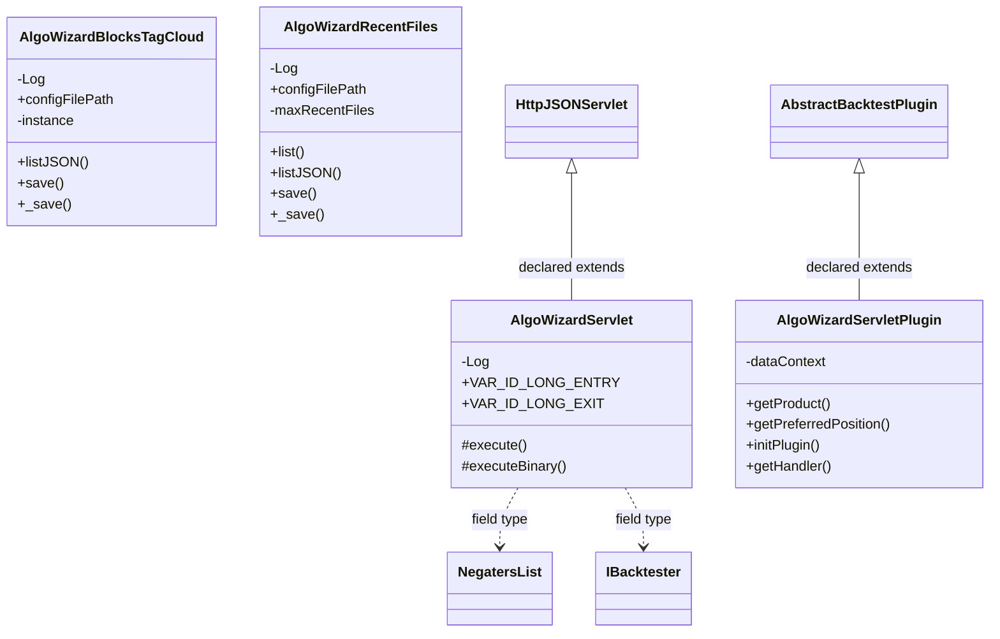

# ServletAlgoWizard.jar

[Workspace/group index](README.md)  |  [All workspaces](../README.md)

## Scope and provenance

- Artifact: `SQX_REFERENCE_ROOT/internal/plugins/ServletAlgoWizard/ServletAlgoWizard.jar`.
- SHA-256: `c6b7b2f21b9a299759a3d760d611646f460fab39e8dd173a78f17a9f806ff541`.
- Inspected: 2026-10-05; generation timestamp `2026-10-05T19:04:16.344170+00:00`.
- Archive class entries: **4**; non-nested: **4**; nested/anonymous: **0**.
- Inspection: ZIP entry/manifest enumeration and `javap -p` declarations for every listed class.
- Repository source HEAD: `8a92c705183a6702eaf62037ccb202ed028aa899`; review state: generated, pending owner review.
- Installed SQX build number is unverified. No method bodies are reproduced.
- Confidence: high for declared structure; workspace ownership inferred except where registration evidence is separately stated. Runtime reachability, call order, formulas and parity remain unverified.

The `AlgoWizard` folder is a navigation/research grouping, not an exclusive backend owner. Shared consumers may use this JAR.

Target mapping: no verified owning HaruQuantAI feature/requirement/decision IDs are assigned by this document. Register or resolve ownership through the normal repository plan before implementation.

## Diagram reading guide

`Parent <|-- Child` means declared inheritance; `Interface <|.. Class` means declared implementation. Interface extension uses the inheritance arrow. `A ..> B : field type` is a declared type dependency, not composition, object ownership or a runtime call. External nodes are referenced types, not fabricated local implementations. Selected fields/method names aid navigation: `+` is public, `#` protected and `-` private. Diagram method names omit parameter/return types and collapse overloads; use the exact inspected declarations below before implementing an API.

Detailed graphs include non-nested classes in package-sized groups of at most 12. Nested/anonymous classes are inventoried and their declarations/relationships are retained below, but omitted from overview graphs. Relationships not drawn for readability remain in the complete declaration-relationship table. Constructors, synthetic bridges and overloads may be collapsed in diagram member lists only. Standard `java.lang.Object` inheritance is omitted from diagrams.

## UML class diagrams

### 1. `com.strategyquant.plugin.Servlet.impl.AlgoWizard`



| Diagram identifier | Exact type | Location |
| --- | --- | --- |
| `C9e396d1a7240` | `com.strategyquant.plugin.Servlet.impl.AlgoWizard.AlgoWizardBlocksTagCloud` (this JAR) | this diagram |
| `Ca6add8e6f8e4` | `com.strategyquant.plugin.Servlet.impl.AlgoWizard.AlgoWizardRecentFiles` (this JAR) | this diagram |
| `C1e11cc070343` | `com.strategyquant.plugin.Servlet.impl.AlgoWizard.AlgoWizardServlet` (this JAR) | this diagram |
| `Ce758736e71af` | `com.strategyquant.plugin.Servlet.impl.AlgoWizard.AlgoWizardServletPlugin` (this JAR) | this diagram |
| `C19300247f704` | [`com.strategyquant.tradinglib.NegatersList`](../Shared/SQTradingLib.md) | referenced external type |
| `Cc90fa75a7032` | [`com.strategyquant.tradinglib.backtest.IBacktester`](../Shared/SQTradingLib.md) | referenced external type |
| `C6aa41875025f` | [`com.strategyquant.tradinglib.results.AbstractBacktestPlugin`](../Shared/SQTradingLib.md) | referenced external type |
| `C8900f90ae594` | [`com.strategyquant.webguilib.servlet.HttpJSONServlet`](../Shared/SQWebGUILib.md) | referenced external type |

## Complete class inventory

| Fully qualified class | Kind | Entry |
| --- | --- | --- |
| `com.strategyquant.plugin.Servlet.impl.AlgoWizard.AlgoWizardBlocksTagCloud` | class | non-nested |
| `com.strategyquant.plugin.Servlet.impl.AlgoWizard.AlgoWizardRecentFiles` | class | non-nested |
| `com.strategyquant.plugin.Servlet.impl.AlgoWizard.AlgoWizardServlet` | class | non-nested |
| `com.strategyquant.plugin.Servlet.impl.AlgoWizard.AlgoWizardServletPlugin` | class | non-nested |

## Declared relationships and evidence locations

Every row is supported by the named class declaration/member in `javap -p`, inside the artifact recorded above. Signature dependencies may include return, parameter, generic-argument and throws types; they do not imply execution.

| Declaring class | Referenced type | Relationship | Narrow inspection location |
| --- | --- | --- | --- |
| `com.strategyquant.plugin.Servlet.impl.AlgoWizard.AlgoWizardBlocksTagCloud` | `org.slf4j.Logger` (not resolved in scoped archives) | type dependency | `com.strategyquant.plugin.Servlet.impl.AlgoWizard.AlgoWizardBlocksTagCloud` / field declaration: `private static final org.slf4j.Logger Log;` |
| `com.strategyquant.plugin.Servlet.impl.AlgoWizard.AlgoWizardBlocksTagCloud` | `java.lang.String` (not resolved in scoped archives) | type dependency | `com.strategyquant.plugin.Servlet.impl.AlgoWizard.AlgoWizardBlocksTagCloud` / field declaration: `public static final java.lang.String configFilePath;`<br>`private java.util.HashMap<java.lang.String, java.lang.Integer> loadedBlocks;` |
| `com.strategyquant.plugin.Servlet.impl.AlgoWizard.AlgoWizardBlocksTagCloud` | `java.lang.String` (not resolved in scoped archives) | type dependency | `com.strategyquant.plugin.Servlet.impl.AlgoWizard.AlgoWizardBlocksTagCloud` / method signature: `public static void save(java.lang.String, java.lang.String, java.lang.String);`<br>`public void _save(java.lang.String, java.lang.String, java.lang.String);` |
| `com.strategyquant.plugin.Servlet.impl.AlgoWizard.AlgoWizardBlocksTagCloud` | `java.util.HashMap` (not resolved in scoped archives) | type dependency | `com.strategyquant.plugin.Servlet.impl.AlgoWizard.AlgoWizardBlocksTagCloud` / field declaration: `private java.util.HashMap<java.lang.String, java.lang.Integer> loadedBlocks;` |
| `com.strategyquant.plugin.Servlet.impl.AlgoWizard.AlgoWizardBlocksTagCloud` | `java.lang.Integer` (not resolved in scoped archives) | type dependency | `com.strategyquant.plugin.Servlet.impl.AlgoWizard.AlgoWizardBlocksTagCloud` / field declaration: `private java.util.HashMap<java.lang.String, java.lang.Integer> loadedBlocks;` |
| `com.strategyquant.plugin.Servlet.impl.AlgoWizard.AlgoWizardBlocksTagCloud` | `java.lang.Exception` (not resolved in scoped archives) | type dependency | `com.strategyquant.plugin.Servlet.impl.AlgoWizard.AlgoWizardBlocksTagCloud` / method signature: `private void load() throws java.lang.Exception;` |
| `com.strategyquant.plugin.Servlet.impl.AlgoWizard.AlgoWizardBlocksTagCloud` | `org.json.JSONArray` (not resolved in scoped archives) | type dependency | `com.strategyquant.plugin.Servlet.impl.AlgoWizard.AlgoWizardBlocksTagCloud` / method signature: `public static org.json.JSONArray listJSON();` |
| `com.strategyquant.plugin.Servlet.impl.AlgoWizard.AlgoWizardRecentFiles` | `org.slf4j.Logger` (not resolved in scoped archives) | type dependency | `com.strategyquant.plugin.Servlet.impl.AlgoWizard.AlgoWizardRecentFiles` / field declaration: `private static final org.slf4j.Logger Log;` |
| `com.strategyquant.plugin.Servlet.impl.AlgoWizard.AlgoWizardRecentFiles` | `java.lang.String` (not resolved in scoped archives) | type dependency | `com.strategyquant.plugin.Servlet.impl.AlgoWizard.AlgoWizardRecentFiles` / field declaration: `public static final java.lang.String configFilePath;`<br>`private java.util.ArrayList<java.lang.String> recentFiles;` |
| `com.strategyquant.plugin.Servlet.impl.AlgoWizard.AlgoWizardRecentFiles` | `java.lang.String` (not resolved in scoped archives) | type dependency | `com.strategyquant.plugin.Servlet.impl.AlgoWizard.AlgoWizardRecentFiles` / method signature: `public static java.util.ArrayList<java.lang.String> list();`<br>`public static void save(java.lang.String);`<br>`public void _save(java.lang.String);` |
| `com.strategyquant.plugin.Servlet.impl.AlgoWizard.AlgoWizardRecentFiles` | `java.util.ArrayList` (not resolved in scoped archives) | type dependency | `com.strategyquant.plugin.Servlet.impl.AlgoWizard.AlgoWizardRecentFiles` / field declaration: `private java.util.ArrayList<java.lang.String> recentFiles;` |
| `com.strategyquant.plugin.Servlet.impl.AlgoWizard.AlgoWizardRecentFiles` | `java.util.ArrayList` (not resolved in scoped archives) | type dependency | `com.strategyquant.plugin.Servlet.impl.AlgoWizard.AlgoWizardRecentFiles` / method signature: `public static java.util.ArrayList<java.lang.String> list();` |
| `com.strategyquant.plugin.Servlet.impl.AlgoWizard.AlgoWizardRecentFiles` | `java.lang.Exception` (not resolved in scoped archives) | type dependency | `com.strategyquant.plugin.Servlet.impl.AlgoWizard.AlgoWizardRecentFiles` / method signature: `private void load() throws java.lang.Exception;` |
| `com.strategyquant.plugin.Servlet.impl.AlgoWizard.AlgoWizardRecentFiles` | `org.json.JSONArray` (not resolved in scoped archives) | type dependency | `com.strategyquant.plugin.Servlet.impl.AlgoWizard.AlgoWizardRecentFiles` / method signature: `public static org.json.JSONArray listJSON();` |
| `com.strategyquant.plugin.Servlet.impl.AlgoWizard.AlgoWizardServlet` | [`com.strategyquant.webguilib.servlet.HttpJSONServlet`](../Shared/SQWebGUILib.md) | extends | `com.strategyquant.plugin.Servlet.impl.AlgoWizard.AlgoWizardServlet` / class declaration: `public class com.strategyquant.plugin.Servlet.impl.AlgoWizard.AlgoWizardServlet extends com.strategyquant.webguilib.servlet.HttpJSONServlet` |
| `com.strategyquant.plugin.Servlet.impl.AlgoWizard.AlgoWizardServlet` | `org.slf4j.Logger` (not resolved in scoped archives) | type dependency | `com.strategyquant.plugin.Servlet.impl.AlgoWizard.AlgoWizardServlet` / field declaration: `private static final org.slf4j.Logger Log;` |
| `com.strategyquant.plugin.Servlet.impl.AlgoWizard.AlgoWizardServlet` | `java.lang.String` (not resolved in scoped archives) | type dependency | `com.strategyquant.plugin.Servlet.impl.AlgoWizard.AlgoWizardServlet` / field declaration: `public static final java.lang.String VAR_ID_LONG_ENTRY;`<br>`public static final java.lang.String VAR_ID_LONG_EXIT;`<br>`public static final java.lang.String VAR_ID_SHORT_ENTRY;`<br>`public static final java.lang.String VAR_ID_SHORT_EXIT;`<br>`private static final java.lang.String RequestFailedFlag;` |
| `com.strategyquant.plugin.Servlet.impl.AlgoWizard.AlgoWizardServlet` | `java.lang.String` (not resolved in scoped archives) | type dependency | `com.strategyquant.plugin.Servlet.impl.AlgoWizard.AlgoWizardServlet` / method signature: `protected java.lang.String execute(java.lang.String, java.util.Map<java.lang.String, java.lang.String[]>, java.lang.String) throws java.lang.Exception;`<br>`private java.lang.String onCheckResources(java.util.Map<java.lang.String, java.lang.String[]>) throws java.lang.Exception;`<br>`private java.lang.String onResolveResources(java.util.Map<java.lang.String, java.lang.String[]>) throws java.lang.Exception;`<br>`private java.lang.String onCustomDataIndys(java.util.Map<java.lang.String, java.lang.String[]>);`<br>`protected byte[] executeBinary(java.lang.String, java.util.Map<java.lang.String, java.lang.String[]>, java.lang.String) throws java.lang.Exception;`<br>`private java.lang.String onResults(java.lang.String, java.util.Map<java.lang.String, java.lang.String[]>) throws java.lang.Exception;`<br>`private java.lang.String onGetConfig(java.util.Map<java.lang.String, java.lang.String[]>);`<br>`private void addAiChatBackendUrlIfPresent(org.json.JSONObject, java.lang.String, java.lang.String);`<br>`private java.lang.String onLoadFile(java.util.Map<java.lang.String, java.lang.String[]>);`<br>`private java.lang.String onSaveFile(java.util.Map<java.lang.String, java.lang.String[]>);`<br>`private java.lang.String addResources(java.lang.String);`<br>`private java.lang.String onSaveToRetester(java.util.Map<java.lang.String, java.lang.String[]>);`<br>`private java.lang.String chooseFilePath(java.lang.String, java.lang.String) throws java.lang.Exception;`<br>`private java.lang.String onGetBacktestResults(java.util.Map<java.lang.String, java.lang.String[]>);`<br>`private java.lang.String onBacktest(java.util.Map<java.lang.String, java.lang.String[]>);`<br>`private void checkStockpickerData(java.lang.String, int, java.lang.String, java.lang.String, org.jdom2.Element) throws java.lang.Exception;`<br>`private java.lang.String getMainSymbol(org.jdom2.Element) throws java.lang.Exception;`<br>`private java.lang.String onNegate(java.util.Map<java.lang.String, java.lang.String[]>);`<br>`private boolean isStandardStrategy(java.lang.String);`<br>`private java.lang.String onNegateCustomBlock(java.util.Map<java.lang.String, java.lang.String[]>);`<br>`private java.lang.String negateSignals(java.lang.String) throws java.lang.Exception;`<br>`private java.lang.String negateStockpicker(java.lang.String) throws java.lang.Exception;`<br>`private org.jdom2.Element getSPRule(org.jdom2.Element, java.lang.String) throws java.lang.Exception;`<br>`private org.jdom2.Element getSignal(org.jdom2.Element, java.lang.String) throws java.lang.Exception;`<br>`private java.lang.String onStopBacktest(java.util.Map<java.lang.String, java.lang.String[]>);`<br>`private java.lang.String onAddNewTimeframe(java.util.Map<java.lang.String, java.lang.String[]>);`<br>`private java.lang.String onSaveBlock(java.util.Map<java.lang.String, java.lang.String[]>);`<br>`private java.lang.String onLoadExample(java.util.Map<java.lang.String, java.lang.String[]>);`<br>`private java.lang.String onLoadBlockGroups(java.util.Map<java.lang.String, java.lang.String[]>);`<br>`private java.lang.String onSaveBlockGroups(java.util.Map<java.lang.String, java.lang.String[]>) throws java.lang.Exception;`<br>`private java.lang.String onLoadCustomBlocks(java.util.Map<java.lang.String, java.lang.String[]>) throws java.lang.Exception;`<br>`private java.lang.String onListBackupsBlockGroups(java.util.Map<java.lang.String, java.lang.String[]>) throws java.lang.Exception;`<br>`private java.lang.String onListBackupsCustomBlocks(java.util.Map<java.lang.String, java.lang.String[]>) throws java.lang.Exception;`<br>`private java.lang.String onSaveCustomBlocks(java.util.Map<java.lang.String, java.lang.String[]>) throws java.lang.Exception;` |
| `com.strategyquant.plugin.Servlet.impl.AlgoWizard.AlgoWizardServlet` | [`com.strategyquant.tradinglib.NegatersList`](../Shared/SQTradingLib.md) | type dependency | `com.strategyquant.plugin.Servlet.impl.AlgoWizard.AlgoWizardServlet` / field declaration: `private com.strategyquant.tradinglib.NegatersList negatersList;` |
| `com.strategyquant.plugin.Servlet.impl.AlgoWizard.AlgoWizardServlet` | [`com.strategyquant.tradinglib.backtest.IBacktester`](../Shared/SQTradingLib.md) | type dependency | `com.strategyquant.plugin.Servlet.impl.AlgoWizard.AlgoWizardServlet` / field declaration: `private com.strategyquant.tradinglib.backtest.IBacktester backtester;` |
| `com.strategyquant.plugin.Servlet.impl.AlgoWizard.AlgoWizardServlet` | [`com.strategyquant.tradinglib.backtest.IBacktester`](../Shared/SQTradingLib.md) | type dependency | `com.strategyquant.plugin.Servlet.impl.AlgoWizard.AlgoWizardServlet` / method signature: `public com.strategyquant.plugin.Servlet.impl.AlgoWizard.AlgoWizardServlet(com.strategyquant.tradinglib.backtest.IBacktester, com.strategyquant.tradinglib.results.IResultsGroupProvider);` |
| `com.strategyquant.plugin.Servlet.impl.AlgoWizard.AlgoWizardServlet` | [`com.strategyquant.tradinglib.results.IResultsGroupProvider`](../Shared/SQTradingLib.md) | type dependency | `com.strategyquant.plugin.Servlet.impl.AlgoWizard.AlgoWizardServlet` / field declaration: `private com.strategyquant.tradinglib.results.IResultsGroupProvider rgProvider;` |
| `com.strategyquant.plugin.Servlet.impl.AlgoWizard.AlgoWizardServlet` | [`com.strategyquant.tradinglib.results.IResultsGroupProvider`](../Shared/SQTradingLib.md) | type dependency | `com.strategyquant.plugin.Servlet.impl.AlgoWizard.AlgoWizardServlet` / method signature: `public com.strategyquant.plugin.Servlet.impl.AlgoWizard.AlgoWizardServlet(com.strategyquant.tradinglib.backtest.IBacktester, com.strategyquant.tradinglib.results.IResultsGroupProvider);` |
| `com.strategyquant.plugin.Servlet.impl.AlgoWizard.AlgoWizardServlet` | `java.util.Map` (not resolved in scoped archives) | type dependency | `com.strategyquant.plugin.Servlet.impl.AlgoWizard.AlgoWizardServlet` / method signature: `protected java.lang.String execute(java.lang.String, java.util.Map<java.lang.String, java.lang.String[]>, java.lang.String) throws java.lang.Exception;`<br>`private java.lang.String onCheckResources(java.util.Map<java.lang.String, java.lang.String[]>) throws java.lang.Exception;`<br>`private java.lang.String onResolveResources(java.util.Map<java.lang.String, java.lang.String[]>) throws java.lang.Exception;`<br>`private java.lang.String onCustomDataIndys(java.util.Map<java.lang.String, java.lang.String[]>);`<br>`protected byte[] executeBinary(java.lang.String, java.util.Map<java.lang.String, java.lang.String[]>, java.lang.String) throws java.lang.Exception;`<br>`private java.lang.String onResults(java.lang.String, java.util.Map<java.lang.String, java.lang.String[]>) throws java.lang.Exception;`<br>`private java.lang.String onGetConfig(java.util.Map<java.lang.String, java.lang.String[]>);`<br>`private java.lang.String onLoadFile(java.util.Map<java.lang.String, java.lang.String[]>);`<br>`private java.lang.String onSaveFile(java.util.Map<java.lang.String, java.lang.String[]>);`<br>`private java.lang.String onSaveToRetester(java.util.Map<java.lang.String, java.lang.String[]>);`<br>`private java.lang.String onGetBacktestResults(java.util.Map<java.lang.String, java.lang.String[]>);`<br>`private java.lang.String onBacktest(java.util.Map<java.lang.String, java.lang.String[]>);`<br>`private java.lang.String onNegate(java.util.Map<java.lang.String, java.lang.String[]>);`<br>`private java.lang.String onNegateCustomBlock(java.util.Map<java.lang.String, java.lang.String[]>);`<br>`private java.lang.String onStopBacktest(java.util.Map<java.lang.String, java.lang.String[]>);`<br>`private java.lang.String onAddNewTimeframe(java.util.Map<java.lang.String, java.lang.String[]>);`<br>`private java.lang.String onSaveBlock(java.util.Map<java.lang.String, java.lang.String[]>);`<br>`private java.lang.String onLoadExample(java.util.Map<java.lang.String, java.lang.String[]>);`<br>`private java.lang.String onLoadBlockGroups(java.util.Map<java.lang.String, java.lang.String[]>);`<br>`private java.lang.String onSaveBlockGroups(java.util.Map<java.lang.String, java.lang.String[]>) throws java.lang.Exception;`<br>`private java.lang.String onLoadCustomBlocks(java.util.Map<java.lang.String, java.lang.String[]>) throws java.lang.Exception;`<br>`private java.lang.String onListBackupsBlockGroups(java.util.Map<java.lang.String, java.lang.String[]>) throws java.lang.Exception;`<br>`private java.lang.String onListBackupsCustomBlocks(java.util.Map<java.lang.String, java.lang.String[]>) throws java.lang.Exception;`<br>`private java.lang.String onSaveCustomBlocks(java.util.Map<java.lang.String, java.lang.String[]>) throws java.lang.Exception;` |
| `com.strategyquant.plugin.Servlet.impl.AlgoWizard.AlgoWizardServlet` | `java.lang.Exception` (not resolved in scoped archives) | type dependency | `com.strategyquant.plugin.Servlet.impl.AlgoWizard.AlgoWizardServlet` / method signature: `protected java.lang.String execute(java.lang.String, java.util.Map<java.lang.String, java.lang.String[]>, java.lang.String) throws java.lang.Exception;`<br>`private java.lang.String onCheckResources(java.util.Map<java.lang.String, java.lang.String[]>) throws java.lang.Exception;`<br>`private java.lang.String onResolveResources(java.util.Map<java.lang.String, java.lang.String[]>) throws java.lang.Exception;`<br>`protected byte[] executeBinary(java.lang.String, java.util.Map<java.lang.String, java.lang.String[]>, java.lang.String) throws java.lang.Exception;`<br>`private java.lang.String onResults(java.lang.String, java.util.Map<java.lang.String, java.lang.String[]>) throws java.lang.Exception;`<br>`private java.lang.String chooseFilePath(java.lang.String, java.lang.String) throws java.lang.Exception;`<br>`private void checkStockpickerData(java.lang.String, int, java.lang.String, java.lang.String, org.jdom2.Element) throws java.lang.Exception;`<br>`private int getEngine(org.jdom2.Element) throws java.lang.Exception;`<br>`private java.lang.String getMainSymbol(org.jdom2.Element) throws java.lang.Exception;`<br>`private java.lang.String negateSignals(java.lang.String) throws java.lang.Exception;`<br>`private java.lang.String negateStockpicker(java.lang.String) throws java.lang.Exception;`<br>`private org.jdom2.Element getSPRule(org.jdom2.Element, java.lang.String) throws java.lang.Exception;`<br>`private org.jdom2.Element negateActionBlock(org.jdom2.Element, com.strategyquant.tradinglib.generator.StrategyWithVariables) throws java.lang.Exception;`<br>`private org.jdom2.Element getSignalRule(org.jdom2.Element) throws java.lang.Exception;`<br>`private org.jdom2.Element getEntryRuleThen(org.jdom2.Element, int) throws java.lang.Exception;`<br>`private org.jdom2.Element negateBlockFromSignal(org.jdom2.Element, com.strategyquant.tradinglib.generator.StrategyWithVariables) throws java.lang.Exception;`<br>`private org.jdom2.Element getSignal(org.jdom2.Element, java.lang.String) throws java.lang.Exception;`<br>`private com.strategyquant.tradinglib.fitnessfunction.IFitnessFunction getFitnessFunction() throws java.lang.Exception;`<br>`private java.lang.String onSaveBlockGroups(java.util.Map<java.lang.String, java.lang.String[]>) throws java.lang.Exception;`<br>`private java.lang.String onLoadCustomBlocks(java.util.Map<java.lang.String, java.lang.String[]>) throws java.lang.Exception;`<br>`private java.lang.String onListBackupsBlockGroups(java.util.Map<java.lang.String, java.lang.String[]>) throws java.lang.Exception;`<br>`private java.lang.String onListBackupsCustomBlocks(java.util.Map<java.lang.String, java.lang.String[]>) throws java.lang.Exception;`<br>`private java.lang.String onSaveCustomBlocks(java.util.Map<java.lang.String, java.lang.String[]>) throws java.lang.Exception;` |
| `com.strategyquant.plugin.Servlet.impl.AlgoWizard.AlgoWizardServlet` | `org.json.JSONObject` (not resolved in scoped archives) | type dependency | `com.strategyquant.plugin.Servlet.impl.AlgoWizard.AlgoWizardServlet` / method signature: `private org.json.JSONObject getAiChatBackendUrls();`<br>`private void addAiChatBackendUrlIfPresent(org.json.JSONObject, java.lang.String, java.lang.String);` |
| `com.strategyquant.plugin.Servlet.impl.AlgoWizard.AlgoWizardServlet` | `org.json.JSONArray` (not resolved in scoped archives) | type dependency | `com.strategyquant.plugin.Servlet.impl.AlgoWizard.AlgoWizardServlet` / method signature: `private org.json.JSONArray getSkinList();` |
| `com.strategyquant.plugin.Servlet.impl.AlgoWizard.AlgoWizardServlet` | `org.jdom2.Element` (not resolved in scoped archives) | type dependency | `com.strategyquant.plugin.Servlet.impl.AlgoWizard.AlgoWizardServlet` / method signature: `private void checkStockpickerData(java.lang.String, int, java.lang.String, java.lang.String, org.jdom2.Element) throws java.lang.Exception;`<br>`private int getEngine(org.jdom2.Element) throws java.lang.Exception;`<br>`private java.lang.String getMainSymbol(org.jdom2.Element) throws java.lang.Exception;`<br>`private void fixCustomParamVariables(org.jdom2.Element);`<br>`private org.jdom2.Element getSPExit(org.jdom2.Element);`<br>`private org.jdom2.Element getSPRule(org.jdom2.Element, java.lang.String) throws java.lang.Exception;`<br>`private org.jdom2.Element negateActionBlock(org.jdom2.Element, com.strategyquant.tradinglib.generator.StrategyWithVariables) throws java.lang.Exception;`<br>`private org.jdom2.Element getSignalRule(org.jdom2.Element) throws java.lang.Exception;`<br>`private org.jdom2.Element getEntryRuleThen(org.jdom2.Element, int) throws java.lang.Exception;`<br>`private org.jdom2.Element negateBlockFromSignal(org.jdom2.Element, com.strategyquant.tradinglib.generator.StrategyWithVariables) throws java.lang.Exception;`<br>`private org.jdom2.Element getSignal(org.jdom2.Element, java.lang.String) throws java.lang.Exception;` |
| `com.strategyquant.plugin.Servlet.impl.AlgoWizard.AlgoWizardServlet` | [`com.strategyquant.tradinglib.generator.StrategyWithVariables`](../Shared/SQTradingLib.md) | type dependency | `com.strategyquant.plugin.Servlet.impl.AlgoWizard.AlgoWizardServlet` / method signature: `private org.jdom2.Element negateActionBlock(org.jdom2.Element, com.strategyquant.tradinglib.generator.StrategyWithVariables) throws java.lang.Exception;`<br>`private org.jdom2.Element negateBlockFromSignal(org.jdom2.Element, com.strategyquant.tradinglib.generator.StrategyWithVariables) throws java.lang.Exception;` |
| `com.strategyquant.plugin.Servlet.impl.AlgoWizard.AlgoWizardServlet` | [`com.strategyquant.tradinglib.fitnessfunction.IFitnessFunction`](../Shared/SQTradingLib.md) | type dependency | `com.strategyquant.plugin.Servlet.impl.AlgoWizard.AlgoWizardServlet` / method signature: `private com.strategyquant.tradinglib.fitnessfunction.IFitnessFunction getFitnessFunction() throws java.lang.Exception;` |
| `com.strategyquant.plugin.Servlet.impl.AlgoWizard.AlgoWizardServletPlugin` | [`com.strategyquant.tradinglib.results.AbstractBacktestPlugin`](../Shared/SQTradingLib.md) | extends | `com.strategyquant.plugin.Servlet.impl.AlgoWizard.AlgoWizardServletPlugin` / class declaration: `public class com.strategyquant.plugin.Servlet.impl.AlgoWizard.AlgoWizardServletPlugin extends com.strategyquant.tradinglib.results.AbstractBacktestPlugin` |
| `com.strategyquant.plugin.Servlet.impl.AlgoWizard.AlgoWizardServletPlugin` | `org.eclipse.jetty.servlet.ServletContextHandler` (not resolved in scoped archives) | type dependency | `com.strategyquant.plugin.Servlet.impl.AlgoWizard.AlgoWizardServletPlugin` / field declaration: `private org.eclipse.jetty.servlet.ServletContextHandler dataContext;` |
| `com.strategyquant.plugin.Servlet.impl.AlgoWizard.AlgoWizardServletPlugin` | `java.lang.String` (not resolved in scoped archives) | type dependency | `com.strategyquant.plugin.Servlet.impl.AlgoWizard.AlgoWizardServletPlugin` / method signature: `public java.lang.String getProduct();` |
| `com.strategyquant.plugin.Servlet.impl.AlgoWizard.AlgoWizardServletPlugin` | `java.lang.Exception` (not resolved in scoped archives) | type dependency | `com.strategyquant.plugin.Servlet.impl.AlgoWizard.AlgoWizardServletPlugin` / method signature: `public void initPlugin() throws java.lang.Exception;` |
| `com.strategyquant.plugin.Servlet.impl.AlgoWizard.AlgoWizardServletPlugin` | `org.eclipse.jetty.server.Handler` (not resolved in scoped archives) | type dependency | `com.strategyquant.plugin.Servlet.impl.AlgoWizard.AlgoWizardServletPlugin` / method signature: `public org.eclipse.jetty.server.Handler getHandler();` |

## Inspected declaration reference

These are structural API/member declarations, not proprietary implementation bodies. Private members and nested classes are retained to make diagram omissions explicit; declarations do not prove behavior.

<details>
<summary>com.strategyquant.plugin.Servlet.impl.AlgoWizard.AlgoWizardBlocksTagCloud</summary>

```text
public class com.strategyquant.plugin.Servlet.impl.AlgoWizard.AlgoWizardBlocksTagCloud
    private static final org.slf4j.Logger Log;
    public static final java.lang.String configFilePath;
    private static com.strategyquant.plugin.Servlet.impl.AlgoWizard.AlgoWizardBlocksTagCloud instance;
    private java.util.HashMap<java.lang.String, java.lang.Integer> loadedBlocks;
    private com.strategyquant.plugin.Servlet.impl.AlgoWizard.AlgoWizardBlocksTagCloud();
    private void load() throws java.lang.Exception;
    public static org.json.JSONArray listJSON();
    public static void save(java.lang.String, java.lang.String, java.lang.String);
    private static com.strategyquant.plugin.Servlet.impl.AlgoWizard.AlgoWizardBlocksTagCloud get();
    public void _save(java.lang.String, java.lang.String, java.lang.String);
```

</details>

<details>
<summary>com.strategyquant.plugin.Servlet.impl.AlgoWizard.AlgoWizardRecentFiles</summary>

```text
public class com.strategyquant.plugin.Servlet.impl.AlgoWizard.AlgoWizardRecentFiles
    private static final org.slf4j.Logger Log;
    public static final java.lang.String configFilePath;
    private static final int maxRecentFiles;
    private static com.strategyquant.plugin.Servlet.impl.AlgoWizard.AlgoWizardRecentFiles instance;
    private java.util.ArrayList<java.lang.String> recentFiles;
    private com.strategyquant.plugin.Servlet.impl.AlgoWizard.AlgoWizardRecentFiles();
    private void load() throws java.lang.Exception;
    public static java.util.ArrayList<java.lang.String> list();
    public static org.json.JSONArray listJSON();
    public static void save(java.lang.String);
    private static com.strategyquant.plugin.Servlet.impl.AlgoWizard.AlgoWizardRecentFiles get();
    public void _save(java.lang.String);
```

</details>

<details>
<summary>com.strategyquant.plugin.Servlet.impl.AlgoWizard.AlgoWizardServlet</summary>

```text
public class com.strategyquant.plugin.Servlet.impl.AlgoWizard.AlgoWizardServlet extends com.strategyquant.webguilib.servlet.HttpJSONServlet
    private static final org.slf4j.Logger Log;
    public static final java.lang.String VAR_ID_LONG_ENTRY;
    public static final java.lang.String VAR_ID_LONG_EXIT;
    public static final java.lang.String VAR_ID_SHORT_ENTRY;
    public static final java.lang.String VAR_ID_SHORT_EXIT;
    private com.strategyquant.tradinglib.NegatersList negatersList;
    private com.strategyquant.tradinglib.backtest.IBacktester backtester;
    private com.strategyquant.tradinglib.results.IResultsGroupProvider rgProvider;
    private static final java.lang.String RequestFailedFlag;
    private static boolean isBacktestNode;
    public com.strategyquant.plugin.Servlet.impl.AlgoWizard.AlgoWizardServlet(com.strategyquant.tradinglib.backtest.IBacktester, com.strategyquant.tradinglib.results.IResultsGroupProvider);
    protected java.lang.String execute(java.lang.String, java.util.Map<java.lang.String, java.lang.String[]>, java.lang.String) throws java.lang.Exception;
    private java.lang.String onCheckResources(java.util.Map<java.lang.String, java.lang.String[]>) throws java.lang.Exception;
    private java.lang.String onResolveResources(java.util.Map<java.lang.String, java.lang.String[]>) throws java.lang.Exception;
    private java.lang.String onCustomDataIndys(java.util.Map<java.lang.String, java.lang.String[]>);
    protected byte[] executeBinary(java.lang.String, java.util.Map<java.lang.String, java.lang.String[]>, java.lang.String) throws java.lang.Exception;
    private java.lang.String onResults(java.lang.String, java.util.Map<java.lang.String, java.lang.String[]>) throws java.lang.Exception;
    private java.lang.String onGetConfig(java.util.Map<java.lang.String, java.lang.String[]>);
    private org.json.JSONObject getAiChatBackendUrls();
    private void addAiChatBackendUrlIfPresent(org.json.JSONObject, java.lang.String, java.lang.String);
    private org.json.JSONArray getSkinList();
    private java.lang.String onLoadFile(java.util.Map<java.lang.String, java.lang.String[]>);
    private java.lang.String onSaveFile(java.util.Map<java.lang.String, java.lang.String[]>);
    private java.lang.String addResources(java.lang.String);
    private java.lang.String onSaveToRetester(java.util.Map<java.lang.String, java.lang.String[]>);
    private java.lang.String chooseFilePath(java.lang.String, java.lang.String) throws java.lang.Exception;
    private java.lang.String onGetBacktestResults(java.util.Map<java.lang.String, java.lang.String[]>);
    private java.lang.String onBacktest(java.util.Map<java.lang.String, java.lang.String[]>);
    private void checkStockpickerData(java.lang.String, int, java.lang.String, java.lang.String, org.jdom2.Element) throws java.lang.Exception;
    private int getEngine(org.jdom2.Element) throws java.lang.Exception;
    private java.lang.String getMainSymbol(org.jdom2.Element) throws java.lang.Exception;
    private java.lang.String onNegate(java.util.Map<java.lang.String, java.lang.String[]>);
    private boolean isStandardStrategy(java.lang.String);
    private java.lang.String onNegateCustomBlock(java.util.Map<java.lang.String, java.lang.String[]>);
    private void fixCustomParamVariables(org.jdom2.Element);
    private java.lang.String negateSignals(java.lang.String) throws java.lang.Exception;
    private java.lang.String negateStockpicker(java.lang.String) throws java.lang.Exception;
    private org.jdom2.Element getSPExit(org.jdom2.Element);
    private org.jdom2.Element getSPRule(org.jdom2.Element, java.lang.String) throws java.lang.Exception;
    private org.jdom2.Element negateActionBlock(org.jdom2.Element, com.strategyquant.tradinglib.generator.StrategyWithVariables) throws java.lang.Exception;
    private org.jdom2.Element getSignalRule(org.jdom2.Element) throws java.lang.Exception;
    private org.jdom2.Element getEntryRuleThen(org.jdom2.Element, int) throws java.lang.Exception;
    private org.jdom2.Element negateBlockFromSignal(org.jdom2.Element, com.strategyquant.tradinglib.generator.StrategyWithVariables) throws java.lang.Exception;
    private org.jdom2.Element getSignal(org.jdom2.Element, java.lang.String) throws java.lang.Exception;
    private java.lang.String onStopBacktest(java.util.Map<java.lang.String, java.lang.String[]>);
    private long getDateFrom(long, long);
    private com.strategyquant.tradinglib.fitnessfunction.IFitnessFunction getFitnessFunction() throws java.lang.Exception;
    private java.lang.String onAddNewTimeframe(java.util.Map<java.lang.String, java.lang.String[]>);
    private java.lang.String onSaveBlock(java.util.Map<java.lang.String, java.lang.String[]>);
    private java.lang.String onLoadExample(java.util.Map<java.lang.String, java.lang.String[]>);
    private java.lang.String onLoadBlockGroups(java.util.Map<java.lang.String, java.lang.String[]>);
    private java.lang.String onSaveBlockGroups(java.util.Map<java.lang.String, java.lang.String[]>) throws java.lang.Exception;
    private java.lang.String onLoadCustomBlocks(java.util.Map<java.lang.String, java.lang.String[]>) throws java.lang.Exception;
    private java.lang.String onListBackupsBlockGroups(java.util.Map<java.lang.String, java.lang.String[]>) throws java.lang.Exception;
    private java.lang.String onListBackupsCustomBlocks(java.util.Map<java.lang.String, java.lang.String[]>) throws java.lang.Exception;
    private java.lang.String onSaveCustomBlocks(java.util.Map<java.lang.String, java.lang.String[]>) throws java.lang.Exception;
```

</details>

<details>
<summary>com.strategyquant.plugin.Servlet.impl.AlgoWizard.AlgoWizardServletPlugin</summary>

```text
public class com.strategyquant.plugin.Servlet.impl.AlgoWizard.AlgoWizardServletPlugin extends com.strategyquant.tradinglib.results.AbstractBacktestPlugin
    private org.eclipse.jetty.servlet.ServletContextHandler dataContext;
    public com.strategyquant.plugin.Servlet.impl.AlgoWizard.AlgoWizardServletPlugin();
    public java.lang.String getProduct();
    public int getPreferredPosition();
    public void initPlugin() throws java.lang.Exception;
    public org.eclipse.jetty.server.Handler getHandler();
```

</details>

## Validation and unresolved gaps

Archive hash and complete class inventory were checked against the inspected local artifact. Declaration extraction accounts for every inventoried class. Documentation/link/diagram structural verification is recorded in the master index and task walkthrough; no SQX runtime validation was performed.

The canonical reimplementation ledger/schema are absent, so no evidence IDs or validation-passed ledger claims are created. This is a donor structural reference. Exact behavior, default values, failure semantics, algorithms, runtime calls and target architectural choices require separate research. No aggregation/composition or cardinalities are inferred.
