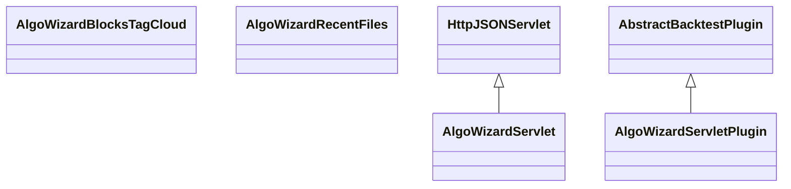

# ServletAlgoWizard.jar

[Group index](README.md) | [All archives](../README.md)

## Scope and provenance

- **Donor:** `SQX_145_REFERENCE_ROOT/internal/plugins/ServletAlgoWizard/ServletAlgoWizard.jar`.
- **SHA-256:** `40595742e8d58ca30f84671dcfd5280d15a6a42222166c510efffc444a29de45`; accessed 2026-10-06; captured `2026-10-06T18:54:51.906614+00:00`.
- **Classes:** 4 raw entries; 4 unique entry names. Duplicate occurrence indices are zero-based.
- **Inspection:** read-only ZIP hashing and class-file structural parsing; signatures/descriptors, modifiers, hierarchy and references only. Bytecode bodies are hashed, not published.
- **Allocation:** proposed `FEAT-AUTHORING-SERVLET-ALGO-WIZARD`, P07; [roadmap](../../dev/sqx-full-application-roadmap.md). Domain README registration remains required.
- **Repository:** `01067f00031428613c6394064ca1bcadc1ba00ee`; review state unreviewed. Download label 145-dev1; installed build/activation and runtime equivalence unverified.
- **Limit:** every class/member is inventoried; declaration coverage does not establish consumed calls, defaults, formulas, failure semantics or algorithm parity.
- **Archive/resource index:** [228.json](../../dev/evidence/sqx145/archives/145/228.json).

## Complete member declarations

Member shards contain exact JVM names/descriptors, access flags, generic signatures, throws types, declared fields/methods, superclass/interfaces and referenced class names. All classes, nested/synthetic members and overloads are retained. Code length/hash is structural evidence, not a normalized algorithm comparison.

- [001.json](../../dev/evidence/sqx145/members/228/001.json) — SHA-256 `416d860d22a27d75eea5f815815c19c3cbb451091584743849f9cfa0b46affe8`.

## Focused structural diagram

Up to twelve non-nested classes; arrows show declared inheritance/interfaces only. External type names are not evidence of an available body or an executed dependency.

## Class inventory

| Archive entry | Occurrence | Class SHA-256 | Fields | Methods |
| --- | ---: | --- | ---: | ---: |
| `com/strategyquant/plugin/Servlet/impl/AlgoWizard/AlgoWizardBlocksTagCloud.class` | 0 | `c7bbb0b2eee0c5fb04369b9131fbf544ab87b95fdf17e1693dad1d7021537b6c` | 4 | 7 |
| `com/strategyquant/plugin/Servlet/impl/AlgoWizard/AlgoWizardRecentFiles.class` | 0 | `97d1f78d72570bb403983860fd1f693ed833b1e614af226879ec03780811a0b5` | 5 | 8 |
| `com/strategyquant/plugin/Servlet/impl/AlgoWizard/AlgoWizardServlet.class` | 0 | `74bcd35ada7418c6a125fe71f1b3c28cbf725823cc4757432bcc8097a0c1c283` | 10 | 50 |
| `com/strategyquant/plugin/Servlet/impl/AlgoWizard/AlgoWizardServletPlugin.class` | 0 | `d4d50d7b4ddaee58e5c1f235316415aab14ea5df2d8b5331286bc5caf16f8a23` | 1 | 5 |
