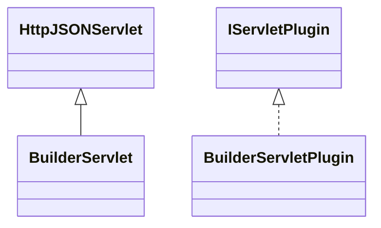

# ServletBuilder.jar

[Group index](README.md) | [All archives](../README.md)

## Scope and provenance

- **Donor:** `SQX_145_REFERENCE_ROOT/internal/plugins/ServletBuilder/ServletBuilder.jar`.
- **SHA-256:** `75b59bfe39e275e8531ada6365a6b16faf5add62688e237a71433e27eddd6b03`; accessed 2026-10-06; captured `2026-10-06T18:54:51.906614+00:00`.
- **Classes:** 2 raw entries; 2 unique entry names. Duplicate occurrence indices are zero-based.
- **Inspection:** read-only ZIP hashing and class-file structural parsing; signatures/descriptors, modifiers, hierarchy and references only. Bytecode bodies are hashed, not published.
- **Allocation:** proposed `FEAT-BUILDER-SERVLET-BUILDER`, P09; [roadmap](../../dev/sqx-full-application-roadmap.md). Domain README registration remains required.
- **Repository:** `01067f00031428613c6394064ca1bcadc1ba00ee`; review state unreviewed. Download label 145-dev1; installed build/activation and runtime equivalence unverified.
- **Limit:** every class/member is inventoried; declaration coverage does not establish consumed calls, defaults, formulas, failure semantics or algorithm parity.
- **Archive/resource index:** [229.json](../../dev/evidence/sqx145/archives/145/229.json).

## Complete member declarations

Member shards contain exact JVM names/descriptors, access flags, generic signatures, throws types, declared fields/methods, superclass/interfaces and referenced class names. All classes, nested/synthetic members and overloads are retained. Code length/hash is structural evidence, not a normalized algorithm comparison.

- [001.json](../../dev/evidence/sqx145/members/229/001.json) — SHA-256 `d10a3a57b4d5166abe4d1d1b8a6180fbfa695f6e5106eb547a18544a383c4a7e`.

## Focused structural diagram

Up to twelve non-nested classes; arrows show declared inheritance/interfaces only. External type names are not evidence of an available body or an executed dependency.

## Class inventory

| Archive entry | Occurrence | Class SHA-256 | Fields | Methods |
| --- | ---: | --- | ---: | ---: |
| `com/strategyquant/plugin/Servlet/impl/Builder/BuilderServlet.class` | 0 | `8a541e12aa14d82f2b0f3fdb11c30a355ee9bae6d1d8acf9b37c54f0d8f5a20b` | 1 | 4 |
| `com/strategyquant/plugin/Servlet/impl/Builder/BuilderServletPlugin.class` | 0 | `e1678a2f12127f1afd3f8bcdf76059b22cdb219a8d05c277b22d42d69c489cff` | 1 | 5 |
