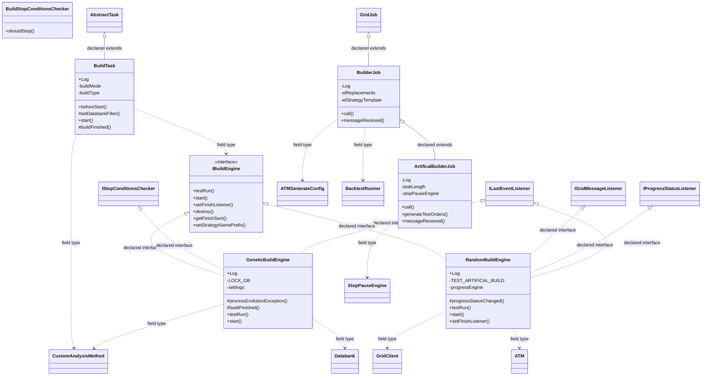

# TaskBuild.jar

[Workspace/group index](README.md)  |  [All workspaces](../README.md)

## Scope and provenance

- Artifact: `SQX_REFERENCE_ROOT/internal/plugins/TaskBuild/TaskBuild.jar`.
- SHA-256: `e5d2f688ef7820d3e46d2de9bd2e0d6bdcf93b39df74532573d0957eca1a3f70`.
- Inspected: 2026-10-05; generation timestamp `2026-10-05T19:04:16.344170+00:00`.
- Archive class entries: **11**; non-nested: **7**; nested/anonymous: **4**.
- Inspection: ZIP entry/manifest enumeration and `javap -p` declarations for every listed class.
- Repository source HEAD: `8a92c705183a6702eaf62037ccb202ed028aa899`; review state: generated, pending owner review.
- Installed SQX build number is unverified. No method bodies are reproduced.
- Confidence: high for declared structure; workspace ownership inferred except where registration evidence is separately stated. Runtime reachability, call order, formulas and parity remain unverified.

The `Builder` folder is a navigation/research grouping, not an exclusive backend owner. Shared consumers may use this JAR.

Target mapping: no verified owning HaruQuantAI feature/requirement/decision IDs are assigned by this document. Register or resolve ownership through the normal repository plan before implementation.

## Diagram reading guide

`Parent <|-- Child` means declared inheritance; `Interface <|.. Class` means declared implementation. Interface extension uses the inheritance arrow. `A ..> B : field type` is a declared type dependency, not composition, object ownership or a runtime call. External nodes are referenced types, not fabricated local implementations. Selected fields/method names aid navigation: `+` is public, `#` protected and `-` private. Diagram method names omit parameter/return types and collapse overloads; use the exact inspected declarations below before implementing an API.

Detailed graphs include non-nested classes in package-sized groups of at most 12. Nested/anonymous classes are inventoried and their declarations/relationships are retained below, but omitted from overview graphs. Relationships not drawn for readability remain in the complete declaration-relationship table. Constructors, synthetic bridges and overloads may be collapsed in diagram member lists only. Standard `java.lang.Object` inheritance is omitted from diagrams.

## UML class diagrams

### 1. `com.strategyquant.plugin.Task.impl.Build`



| Diagram identifier | Exact type | Location |
| --- | --- | --- |
| `C2d5349dc1f49` | [`com.strategyquant.gridlib.client.GridClient`](../Shared/SQGridLib2.md) | referenced external type |
| `C729a56512564` | [`com.strategyquant.gridlib.client.GridJob`](../Shared/SQGridLib2.md) | referenced external type |
| `C8470fa154fcb` | [`com.strategyquant.gridlib.client.IGridMessageListener`](../Shared/SQGridLib2.md) | referenced external type |
| `C9ad46cf664f7` | `com.strategyquant.plugin.Task.impl.Build.ArtificalBuilderJob` (this JAR) | this diagram |
| `Cb4d29bef253e` | `com.strategyquant.plugin.Task.impl.Build.BuildStopConditionsChecker` (this JAR) | this diagram |
| `Ce620835cd00d` | `com.strategyquant.plugin.Task.impl.Build.BuildTask` (this JAR) | this diagram |
| `Cca395d4feacb` | `com.strategyquant.plugin.Task.impl.Build.BuilderJob` (this JAR) | this diagram |
| `C5eeadb4daa6b` | `com.strategyquant.plugin.Task.impl.Build.GeneticBuildEngine` (this JAR) | this diagram |
| `C26a054b2a5b6` | `com.strategyquant.plugin.Task.impl.Build.IBuildEngine` (this JAR) | this diagram |
| `C5e2805ab70aa` | `com.strategyquant.plugin.Task.impl.Build.RandomBuildEngine` (this JAR) | this diagram |
| `C33da5e0a010f` | [`com.strategyquant.tradinglib.ATM`](../Shared/SQTradingLib.md) | referenced external type |
| `C4e0104799ec7` | [`com.strategyquant.tradinglib.CustomAnalysisMethod`](../Shared/SQTradingLib.md) | referenced external type |
| `Cf1cf5abc550f` | [`com.strategyquant.tradinglib.Databank`](../Shared/SQTradingLib.md) | referenced external type |
| `Cec79448b792b` | [`com.strategyquant.tradinglib.atm.ATMGenerateConfig`](../Shared/SQTradingLib.md) | referenced external type |
| `C044e39d2df83` | [`com.strategyquant.tradinglib.backtestrunner.BacktestRunner`](../Shared/SQTradingLib.md) | referenced external type |
| `Cf65307840b2c` | [`com.strategyquant.tradinglib.gp.IStopConditionsChecker`](../Shared/SQTradingLib.md) | referenced external type |
| `C1295ffcc9568` | [`com.strategyquant.tradinglib.project.ILastEventListener`](../Shared/SQTradingLib.md) | referenced external type |
| `C7126b816a5a1` | [`com.strategyquant.tradinglib.project.IProgressStatusListener`](../Shared/SQTradingLib.md) | referenced external type |
| `C61deb3a40141` | [`com.strategyquant.tradinglib.project.StopPauseEngine`](../Shared/SQTradingLib.md) | referenced external type |
| `Ce44d386802cb` | [`com.strategyquant.tradinglib.taskImpl.AbstractTask`](../Shared/SQTradingLib.md) | referenced external type |

## Complete class inventory

| Fully qualified class | Kind | Entry |
| --- | --- | --- |
| `com.strategyquant.plugin.Task.impl.Build.ArtificalBuilderJob` | class | non-nested |
| `com.strategyquant.plugin.Task.impl.Build.BuildStopConditionsChecker` | class | non-nested |
| `com.strategyquant.plugin.Task.impl.Build.BuildTask` | class | non-nested |
| `com.strategyquant.plugin.Task.impl.Build.BuildTask$1` | class | nested/anonymous |
| `com.strategyquant.plugin.Task.impl.Build.BuilderJob` | class | non-nested |
| `com.strategyquant.plugin.Task.impl.Build.GeneticBuildEngine` | class | non-nested |
| `com.strategyquant.plugin.Task.impl.Build.GeneticBuildEngine$1` | class | nested/anonymous |
| `com.strategyquant.plugin.Task.impl.Build.GeneticBuildEngine$2` | class | nested/anonymous |
| `com.strategyquant.plugin.Task.impl.Build.IBuildEngine` | interface | non-nested |
| `com.strategyquant.plugin.Task.impl.Build.RandomBuildEngine` | class | non-nested |
| `com.strategyquant.plugin.Task.impl.Build.RandomBuildEngine$1` | class | nested/anonymous |

## Declared relationships and evidence locations

Every row is supported by the named class declaration/member in `javap -p`, inside the artifact recorded above. Signature dependencies may include return, parameter, generic-argument and throws types; they do not imply execution.

| Declaring class | Referenced type | Relationship | Narrow inspection location |
| --- | --- | --- | --- |
| `com.strategyquant.plugin.Task.impl.Build.ArtificalBuilderJob` | `com.strategyquant.plugin.Task.impl.Build.BuilderJob` (this JAR) | extends | `com.strategyquant.plugin.Task.impl.Build.ArtificalBuilderJob` / class declaration: `public class com.strategyquant.plugin.Task.impl.Build.ArtificalBuilderJob extends com.strategyquant.plugin.Task.impl.Build.BuilderJob` |
| `com.strategyquant.plugin.Task.impl.Build.ArtificalBuilderJob` | `org.slf4j.Logger` (not resolved in scoped archives) | type dependency | `com.strategyquant.plugin.Task.impl.Build.ArtificalBuilderJob` / field declaration: `private static final org.slf4j.Logger Log;` |
| `com.strategyquant.plugin.Task.impl.Build.ArtificalBuilderJob` | [`com.strategyquant.tradinglib.project.StopPauseEngine`](../Shared/SQTradingLib.md) | type dependency | `com.strategyquant.plugin.Task.impl.Build.ArtificalBuilderJob` / field declaration: `private com.strategyquant.tradinglib.project.StopPauseEngine stopPauseEngine;` |
| `com.strategyquant.plugin.Task.impl.Build.ArtificalBuilderJob` | `com.strategyquant.lib.IRandomGenerator` (not resolved in scoped archives) | type dependency | `com.strategyquant.plugin.Task.impl.Build.ArtificalBuilderJob` / field declaration: `private com.strategyquant.lib.IRandomGenerator rng;` |
| `com.strategyquant.plugin.Task.impl.Build.ArtificalBuilderJob` | `java.lang.String` (not resolved in scoped archives) | type dependency | `com.strategyquant.plugin.Task.impl.Build.ArtificalBuilderJob` / method signature: `public com.strategyquant.plugin.Task.impl.Build.ArtificalBuilderJob(java.lang.String, java.util.Map<java.lang.String, java.io.Serializable>, com.strategyquant.tradinglib.project.ILastEventListener) throws java.lang.Exception;` |
| `com.strategyquant.plugin.Task.impl.Build.ArtificalBuilderJob` | `java.util.Map` (not resolved in scoped archives) | type dependency | `com.strategyquant.plugin.Task.impl.Build.ArtificalBuilderJob` / method signature: `public com.strategyquant.plugin.Task.impl.Build.ArtificalBuilderJob(java.lang.String, java.util.Map<java.lang.String, java.io.Serializable>, com.strategyquant.tradinglib.project.ILastEventListener) throws java.lang.Exception;` |
| `com.strategyquant.plugin.Task.impl.Build.ArtificalBuilderJob` | `java.io.Serializable` (not resolved in scoped archives) | type dependency | `com.strategyquant.plugin.Task.impl.Build.ArtificalBuilderJob` / method signature: `public com.strategyquant.plugin.Task.impl.Build.ArtificalBuilderJob(java.lang.String, java.util.Map<java.lang.String, java.io.Serializable>, com.strategyquant.tradinglib.project.ILastEventListener) throws java.lang.Exception;` |
| `com.strategyquant.plugin.Task.impl.Build.ArtificalBuilderJob` | [`com.strategyquant.tradinglib.project.ILastEventListener`](../Shared/SQTradingLib.md) | type dependency | `com.strategyquant.plugin.Task.impl.Build.ArtificalBuilderJob` / method signature: `public com.strategyquant.plugin.Task.impl.Build.ArtificalBuilderJob(java.lang.String, java.util.Map<java.lang.String, java.io.Serializable>, com.strategyquant.tradinglib.project.ILastEventListener) throws java.lang.Exception;` |
| `com.strategyquant.plugin.Task.impl.Build.ArtificalBuilderJob` | `java.lang.Exception` (not resolved in scoped archives) | type dependency | `com.strategyquant.plugin.Task.impl.Build.ArtificalBuilderJob` / method signature: `public com.strategyquant.plugin.Task.impl.Build.ArtificalBuilderJob(java.lang.String, java.util.Map<java.lang.String, java.io.Serializable>, com.strategyquant.tradinglib.project.ILastEventListener) throws java.lang.Exception;`<br>`public com.strategyquant.tradinglib.backtestrunner.BacktestResult call() throws java.lang.Exception;`<br>`private com.strategyquant.tradinglib.backtestrunner.BacktestResult createArtificalStrategy() throws java.lang.Exception;`<br>`public java.lang.Object call() throws java.lang.Exception;` |
| `com.strategyquant.plugin.Task.impl.Build.ArtificalBuilderJob` | [`com.strategyquant.tradinglib.backtestrunner.BacktestResult`](../Shared/SQTradingLib.md) | type dependency | `com.strategyquant.plugin.Task.impl.Build.ArtificalBuilderJob` / method signature: `public com.strategyquant.tradinglib.backtestrunner.BacktestResult call() throws java.lang.Exception;`<br>`private com.strategyquant.tradinglib.backtestrunner.BacktestResult createArtificalStrategy() throws java.lang.Exception;` |
| `com.strategyquant.plugin.Task.impl.Build.ArtificalBuilderJob` | [`com.strategyquant.tradinglib.OrdersList`](../Shared/SQTradingLib.md) | type dependency | `com.strategyquant.plugin.Task.impl.Build.ArtificalBuilderJob` / method signature: `public static com.strategyquant.tradinglib.OrdersList generateTestOrders(int);` |
| `com.strategyquant.plugin.Task.impl.Build.ArtificalBuilderJob` | [`com.strategyquant.gridlib.client.GridMessage`](../Shared/SQGridLib2.md) | type dependency | `com.strategyquant.plugin.Task.impl.Build.ArtificalBuilderJob` / method signature: `public void messageReceived(com.strategyquant.gridlib.client.GridMessage);` |
| `com.strategyquant.plugin.Task.impl.Build.ArtificalBuilderJob` | `java.lang.Object` (not resolved in scoped archives) | type dependency | `com.strategyquant.plugin.Task.impl.Build.ArtificalBuilderJob` / method signature: `public java.lang.Object call() throws java.lang.Exception;` |
| `com.strategyquant.plugin.Task.impl.Build.BuildStopConditionsChecker` | [`com.strategyquant.tradinglib.Databank`](../Shared/SQTradingLib.md) | type dependency | `com.strategyquant.plugin.Task.impl.Build.BuildStopConditionsChecker` / method signature: `public static boolean shouldStop(com.strategyquant.tradinglib.Databank, com.strategyquant.lib.SettingsMap, com.strategyquant.tradinglib.project.ProgressEngine, com.strategyquant.tradinglib.ProjectRunInfo);` |
| `com.strategyquant.plugin.Task.impl.Build.BuildStopConditionsChecker` | `com.strategyquant.lib.SettingsMap` (not resolved in scoped archives) | type dependency | `com.strategyquant.plugin.Task.impl.Build.BuildStopConditionsChecker` / method signature: `public static boolean shouldStop(com.strategyquant.tradinglib.Databank, com.strategyquant.lib.SettingsMap, com.strategyquant.tradinglib.project.ProgressEngine, com.strategyquant.tradinglib.ProjectRunInfo);` |
| `com.strategyquant.plugin.Task.impl.Build.BuildStopConditionsChecker` | [`com.strategyquant.tradinglib.project.ProgressEngine`](../Shared/SQTradingLib.md) | type dependency | `com.strategyquant.plugin.Task.impl.Build.BuildStopConditionsChecker` / method signature: `public static boolean shouldStop(com.strategyquant.tradinglib.Databank, com.strategyquant.lib.SettingsMap, com.strategyquant.tradinglib.project.ProgressEngine, com.strategyquant.tradinglib.ProjectRunInfo);` |
| `com.strategyquant.plugin.Task.impl.Build.BuildStopConditionsChecker` | [`com.strategyquant.tradinglib.ProjectRunInfo`](../Shared/SQTradingLib.md) | type dependency | `com.strategyquant.plugin.Task.impl.Build.BuildStopConditionsChecker` / method signature: `public static boolean shouldStop(com.strategyquant.tradinglib.Databank, com.strategyquant.lib.SettingsMap, com.strategyquant.tradinglib.project.ProgressEngine, com.strategyquant.tradinglib.ProjectRunInfo);` |
| `com.strategyquant.plugin.Task.impl.Build.BuildTask` | [`com.strategyquant.tradinglib.taskImpl.AbstractTask`](../Shared/SQTradingLib.md) | extends | `com.strategyquant.plugin.Task.impl.Build.BuildTask` / class declaration: `public class com.strategyquant.plugin.Task.impl.Build.BuildTask extends com.strategyquant.tradinglib.taskImpl.AbstractTask` |
| `com.strategyquant.plugin.Task.impl.Build.BuildTask` | `org.slf4j.Logger` (not resolved in scoped archives) | type dependency | `com.strategyquant.plugin.Task.impl.Build.BuildTask` / field declaration: `public static final org.slf4j.Logger Log;` |
| `com.strategyquant.plugin.Task.impl.Build.BuildTask` | [`com.strategyquant.tradinglib.task.settings.buildmode.BuildMode`](../Shared/SQTradingLib.md) | type dependency | `com.strategyquant.plugin.Task.impl.Build.BuildTask` / field declaration: `private com.strategyquant.tradinglib.task.settings.buildmode.BuildMode buildMode;` |
| `com.strategyquant.plugin.Task.impl.Build.BuildTask` | `java.lang.String` (not resolved in scoped archives) | type dependency | `com.strategyquant.plugin.Task.impl.Build.BuildTask` / field declaration: `private java.lang.String buildType;`<br>`private java.util.ArrayList<java.lang.String> strategiesToImprove;`<br>`private static final java.lang.String LOCK_IMPROVETASK;`<br>`private java.lang.String improveDatabankName;`<br>`private java.lang.String caInputArgs;` |
| `com.strategyquant.plugin.Task.impl.Build.BuildTask` | `java.lang.String` (not resolved in scoped archives) | type dependency | `com.strategyquant.plugin.Task.impl.Build.BuildTask` / method signature: `public com.strategyquant.plugin.Task.impl.Build.BuildTask(java.lang.String, com.strategyquant.tradinglib.project.ProgressEngine) throws java.lang.Exception;`<br>`private void buildOneStrategy(org.jdom2.Element, java.lang.String, java.lang.String) throws java.lang.Exception;`<br>`public java.lang.String getType();`<br>`public java.lang.String getName();`<br>`public com.strategyquant.tradinglib.taskImpl.ISQTask clone(java.lang.String, com.strategyquant.tradinglib.project.ProgressEngine) throws java.lang.Exception;`<br>`public java.lang.String getPluginFolderName();`<br>`public java.lang.String[] getSettings();` |
| `com.strategyquant.plugin.Task.impl.Build.BuildTask` | [`com.strategyquant.tradinglib.Databank`](../Shared/SQTradingLib.md) | type dependency | `com.strategyquant.plugin.Task.impl.Build.BuildTask` / field declaration: `private com.strategyquant.tradinglib.Databank initialPopulationDatabank;`<br>`private com.strategyquant.tradinglib.Databank outputDatabank;`<br>`private com.strategyquant.tradinglib.Databank lastGenerationDatabank;` |
| `com.strategyquant.plugin.Task.impl.Build.BuildTask` | [`com.strategyquant.tradinglib.Databank`](../Shared/SQTradingLib.md) | type dependency | `com.strategyquant.plugin.Task.impl.Build.BuildTask` / method signature: `protected void setDatabankFilter(com.strategyquant.tradinglib.Databank, boolean);`<br>`protected com.strategyquant.tradinglib.Databank[] getUsedDatabanks();`<br>`protected com.strategyquant.tradinglib.Databank getOutputDatabank();` |
| `com.strategyquant.plugin.Task.impl.Build.BuildTask` | `com.strategyquant.plugin.Task.impl.Build.IBuildEngine` (this JAR) | type dependency | `com.strategyquant.plugin.Task.impl.Build.BuildTask` / field declaration: `private com.strategyquant.plugin.Task.impl.Build.IBuildEngine buildEngine;` |
| `com.strategyquant.plugin.Task.impl.Build.BuildTask` | `com.strategyquant.plugin.Task.impl.Build.IBuildEngine` (this JAR) | type dependency | `com.strategyquant.plugin.Task.impl.Build.BuildTask` / method signature: `private com.strategyquant.plugin.Task.impl.Build.IBuildEngine getBuildEngineByMode(org.jdom2.Element) throws java.lang.Exception;`<br>`static com.strategyquant.plugin.Task.impl.Build.IBuildEngine access$000(com.strategyquant.plugin.Task.impl.Build.BuildTask);` |
| `com.strategyquant.plugin.Task.impl.Build.BuildTask` | `com.strategyquant.lib.random.MersenneTwisterRng` (not resolved in scoped archives) | type dependency | `com.strategyquant.plugin.Task.impl.Build.BuildTask` / field declaration: `private static final com.strategyquant.lib.random.MersenneTwisterRng rng;` |
| `com.strategyquant.plugin.Task.impl.Build.BuildTask` | [`com.strategyquant.tradinglib.task.settings.blocks.ConfigConverter`](../Shared/SQTradingLib.md) | type dependency | `com.strategyquant.plugin.Task.impl.Build.BuildTask` / field declaration: `private com.strategyquant.tradinglib.task.settings.blocks.ConfigConverter configConverter;` |
| `com.strategyquant.plugin.Task.impl.Build.BuildTask` | `java.util.ArrayList` (not resolved in scoped archives) | type dependency | `com.strategyquant.plugin.Task.impl.Build.BuildTask` / field declaration: `private java.util.ArrayList<java.lang.String> strategiesToImprove;` |
| `com.strategyquant.plugin.Task.impl.Build.BuildTask` | `java.util.concurrent.atomic.AtomicBoolean` (not resolved in scoped archives) | type dependency | `com.strategyquant.plugin.Task.impl.Build.BuildTask` / field declaration: `private java.util.concurrent.atomic.AtomicBoolean buildRunning;` |
| `com.strategyquant.plugin.Task.impl.Build.BuildTask` | [`com.strategyquant.tradinglib.CustomAnalysisMethod`](../Shared/SQTradingLib.md) | type dependency | `com.strategyquant.plugin.Task.impl.Build.BuildTask` / field declaration: `private com.strategyquant.tradinglib.CustomAnalysisMethod caMethod;` |
| `com.strategyquant.plugin.Task.impl.Build.BuildTask` | `java.lang.Exception` (not resolved in scoped archives) | type dependency | `com.strategyquant.plugin.Task.impl.Build.BuildTask` / method signature: `public com.strategyquant.plugin.Task.impl.Build.BuildTask() throws java.lang.Exception;`<br>`public com.strategyquant.plugin.Task.impl.Build.BuildTask(java.lang.String, com.strategyquant.tradinglib.project.ProgressEngine) throws java.lang.Exception;`<br>`private void initParams() throws org.jdom2.JDOMException, java.io.IOException, java.lang.Exception;`<br>`public boolean beforeStart() throws java.lang.Exception;`<br>`private void initializeBacktestData() throws java.lang.Exception;`<br>`public void start() throws java.lang.Exception;`<br>`private void buildOneStrategy(org.jdom2.Element, java.lang.String, java.lang.String) throws java.lang.Exception;`<br>`protected void buildFinished(int, boolean) throws java.lang.Exception;`<br>`private com.strategyquant.plugin.Task.impl.Build.IBuildEngine getBuildEngineByMode(org.jdom2.Element) throws java.lang.Exception;`<br>`public com.strategyquant.tradinglib.taskImpl.ISQTask clone(java.lang.String, com.strategyquant.tradinglib.project.ProgressEngine) throws java.lang.Exception;` |
| `com.strategyquant.plugin.Task.impl.Build.BuildTask` | [`com.strategyquant.tradinglib.project.ProgressEngine`](../Shared/SQTradingLib.md) | type dependency | `com.strategyquant.plugin.Task.impl.Build.BuildTask` / method signature: `public com.strategyquant.plugin.Task.impl.Build.BuildTask(java.lang.String, com.strategyquant.tradinglib.project.ProgressEngine) throws java.lang.Exception;`<br>`public com.strategyquant.tradinglib.taskImpl.ISQTask clone(java.lang.String, com.strategyquant.tradinglib.project.ProgressEngine) throws java.lang.Exception;` |
| `com.strategyquant.plugin.Task.impl.Build.BuildTask` | `org.jdom2.JDOMException` (not resolved in scoped archives) | type dependency | `com.strategyquant.plugin.Task.impl.Build.BuildTask` / method signature: `private void initParams() throws org.jdom2.JDOMException, java.io.IOException, java.lang.Exception;` |
| `com.strategyquant.plugin.Task.impl.Build.BuildTask` | `java.io.IOException` (not resolved in scoped archives) | type dependency | `com.strategyquant.plugin.Task.impl.Build.BuildTask` / method signature: `private void initParams() throws org.jdom2.JDOMException, java.io.IOException, java.lang.Exception;` |
| `com.strategyquant.plugin.Task.impl.Build.BuildTask` | `org.jdom2.Element` (not resolved in scoped archives) | type dependency | `com.strategyquant.plugin.Task.impl.Build.BuildTask` / method signature: `private void buildOneStrategy(org.jdom2.Element, java.lang.String, java.lang.String) throws java.lang.Exception;`<br>`private com.strategyquant.plugin.Task.impl.Build.IBuildEngine getBuildEngineByMode(org.jdom2.Element) throws java.lang.Exception;` |
| `com.strategyquant.plugin.Task.impl.Build.BuildTask` | [`com.strategyquant.tradinglib.taskImpl.ISQTask`](../Shared/SQTradingLib.md) | type dependency | `com.strategyquant.plugin.Task.impl.Build.BuildTask` / method signature: `public com.strategyquant.tradinglib.taskImpl.ISQTask clone(java.lang.String, com.strategyquant.tradinglib.project.ProgressEngine) throws java.lang.Exception;` |
| `com.strategyquant.plugin.Task.impl.Build.BuildTask` | [`com.strategyquant.tradinglib.project.ProjectGlobalLog`](../Shared/SQTradingLib.md) | type dependency | `com.strategyquant.plugin.Task.impl.Build.BuildTask` / method signature: `public void logTaskFinished(com.strategyquant.tradinglib.project.ProjectGlobalLog);` |
| `com.strategyquant.plugin.Task.impl.Build.BuildTask$1` | [`com.strategyquant.tradinglib.gp.IGPFinishedListener`](../Shared/SQTradingLib.md) | implements | `com.strategyquant.plugin.Task.impl.Build.BuildTask$1` / class declaration: `class com.strategyquant.plugin.Task.impl.Build.BuildTask$1 implements com.strategyquant.tradinglib.gp.IGPFinishedListener` |
| `com.strategyquant.plugin.Task.impl.Build.BuildTask$1` | `com.strategyquant.plugin.Task.impl.Build.BuildTask` (this JAR) | type dependency | `com.strategyquant.plugin.Task.impl.Build.BuildTask$1` / field declaration: `final com.strategyquant.plugin.Task.impl.Build.BuildTask this$0;` |
| `com.strategyquant.plugin.Task.impl.Build.BuildTask$1` | `com.strategyquant.plugin.Task.impl.Build.BuildTask` (this JAR) | type dependency | `com.strategyquant.plugin.Task.impl.Build.BuildTask$1` / method signature: `com.strategyquant.plugin.Task.impl.Build.BuildTask$1(com.strategyquant.plugin.Task.impl.Build.BuildTask);` |
| `com.strategyquant.plugin.Task.impl.Build.BuilderJob` | [`com.strategyquant.gridlib.client.GridJob`](../Shared/SQGridLib2.md) | extends | `com.strategyquant.plugin.Task.impl.Build.BuilderJob` / class declaration: `public class com.strategyquant.plugin.Task.impl.Build.BuilderJob extends com.strategyquant.gridlib.client.GridJob<com.strategyquant.tradinglib.backtestrunner.BacktestResult>` |
| `com.strategyquant.plugin.Task.impl.Build.BuilderJob` | `org.slf4j.Logger` (not resolved in scoped archives) | type dependency | `com.strategyquant.plugin.Task.impl.Build.BuilderJob` / field declaration: `private static final org.slf4j.Logger Log;` |
| `com.strategyquant.plugin.Task.impl.Build.BuilderJob` | `org.jdom2.Element` (not resolved in scoped archives) | type dependency | `com.strategyquant.plugin.Task.impl.Build.BuilderJob` / field declaration: `private org.jdom2.Element elReplacements;`<br>`private org.jdom2.Element elStrategyTemplate;` |
| `com.strategyquant.plugin.Task.impl.Build.BuilderJob` | `org.jdom2.Element` (not resolved in scoped archives) | type dependency | `com.strategyquant.plugin.Task.impl.Build.BuilderJob` / method signature: `private org.jdom2.Element generateStrategy() throws org.jdom2.JDOMException, java.io.IOException, java.lang.Exception;`<br>`private void addStockpickerFixes(org.jdom2.Element, com.strategyquant.lib.IRandomGenerator) throws java.lang.Exception;` |
| `com.strategyquant.plugin.Task.impl.Build.BuilderJob` | `java.lang.String` (not resolved in scoped archives) | type dependency | `com.strategyquant.plugin.Task.impl.Build.BuilderJob` / field declaration: `protected java.lang.String strategyName;` |
| `com.strategyquant.plugin.Task.impl.Build.BuilderJob` | `java.lang.String` (not resolved in scoped archives) | type dependency | `com.strategyquant.plugin.Task.impl.Build.BuilderJob` / method signature: `public com.strategyquant.plugin.Task.impl.Build.BuilderJob(java.lang.String, java.util.Map<java.lang.String, java.io.Serializable>, com.strategyquant.tradinglib.project.ILastEventListener, java.lang.String) throws java.lang.Exception;` |
| `com.strategyquant.plugin.Task.impl.Build.BuilderJob` | `com.strategyquant.lib.SettingsMap` (not resolved in scoped archives) | type dependency | `com.strategyquant.plugin.Task.impl.Build.BuilderJob` / field declaration: `private com.strategyquant.lib.SettingsMap buildSettings;` |
| `com.strategyquant.plugin.Task.impl.Build.BuilderJob` | [`com.strategyquant.tradinglib.backtestrunner.BacktestRunner`](../Shared/SQTradingLib.md) | type dependency | `com.strategyquant.plugin.Task.impl.Build.BuilderJob` / field declaration: `private com.strategyquant.tradinglib.backtestrunner.BacktestRunner backtestRunner;` |
| `com.strategyquant.plugin.Task.impl.Build.BuilderJob` | [`com.strategyquant.tradinglib.project.StopPauseEngine`](../Shared/SQTradingLib.md) | type dependency | `com.strategyquant.plugin.Task.impl.Build.BuilderJob` / field declaration: `private com.strategyquant.tradinglib.project.StopPauseEngine stopPauseEngine;` |
| `com.strategyquant.plugin.Task.impl.Build.BuilderJob` | [`com.strategyquant.tradinglib.atm.ATMGenerateConfig`](../Shared/SQTradingLib.md) | type dependency | `com.strategyquant.plugin.Task.impl.Build.BuilderJob` / field declaration: `private com.strategyquant.tradinglib.atm.ATMGenerateConfig atmGenerateConfig;` |
| `com.strategyquant.plugin.Task.impl.Build.BuilderJob` | [`com.strategyquant.tradinglib.options.TradingOptions`](../Shared/SQTradingLib.md) | type dependency | `com.strategyquant.plugin.Task.impl.Build.BuilderJob` / field declaration: `private final com.strategyquant.tradinglib.options.TradingOptions tradingOptions;` |
| `com.strategyquant.plugin.Task.impl.Build.BuilderJob` | `java.util.Map` (not resolved in scoped archives) | type dependency | `com.strategyquant.plugin.Task.impl.Build.BuilderJob` / method signature: `public com.strategyquant.plugin.Task.impl.Build.BuilderJob(java.lang.String, java.util.Map<java.lang.String, java.io.Serializable>, com.strategyquant.tradinglib.project.ILastEventListener, java.lang.String) throws java.lang.Exception;` |
| `com.strategyquant.plugin.Task.impl.Build.BuilderJob` | `java.io.Serializable` (not resolved in scoped archives) | type dependency | `com.strategyquant.plugin.Task.impl.Build.BuilderJob` / method signature: `public com.strategyquant.plugin.Task.impl.Build.BuilderJob(java.lang.String, java.util.Map<java.lang.String, java.io.Serializable>, com.strategyquant.tradinglib.project.ILastEventListener, java.lang.String) throws java.lang.Exception;` |
| `com.strategyquant.plugin.Task.impl.Build.BuilderJob` | [`com.strategyquant.tradinglib.project.ILastEventListener`](../Shared/SQTradingLib.md) | type dependency | `com.strategyquant.plugin.Task.impl.Build.BuilderJob` / method signature: `public com.strategyquant.plugin.Task.impl.Build.BuilderJob(java.lang.String, java.util.Map<java.lang.String, java.io.Serializable>, com.strategyquant.tradinglib.project.ILastEventListener, java.lang.String) throws java.lang.Exception;` |
| `com.strategyquant.plugin.Task.impl.Build.BuilderJob` | `java.lang.Exception` (not resolved in scoped archives) | type dependency | `com.strategyquant.plugin.Task.impl.Build.BuilderJob` / method signature: `public com.strategyquant.plugin.Task.impl.Build.BuilderJob(java.lang.String, java.util.Map<java.lang.String, java.io.Serializable>, com.strategyquant.tradinglib.project.ILastEventListener, java.lang.String) throws java.lang.Exception;`<br>`public com.strategyquant.tradinglib.backtestrunner.BacktestResult call() throws java.lang.Exception;`<br>`private org.jdom2.Element generateStrategy() throws org.jdom2.JDOMException, java.io.IOException, java.lang.Exception;`<br>`private void addStockpickerFixes(org.jdom2.Element, com.strategyquant.lib.IRandomGenerator) throws java.lang.Exception;`<br>`public java.lang.Object call() throws java.lang.Exception;` |
| `com.strategyquant.plugin.Task.impl.Build.BuilderJob` | [`com.strategyquant.tradinglib.backtestrunner.BacktestResult`](../Shared/SQTradingLib.md) | type dependency | `com.strategyquant.plugin.Task.impl.Build.BuilderJob` / method signature: `public com.strategyquant.tradinglib.backtestrunner.BacktestResult call() throws java.lang.Exception;` |
| `com.strategyquant.plugin.Task.impl.Build.BuilderJob` | `org.jdom2.JDOMException` (not resolved in scoped archives) | type dependency | `com.strategyquant.plugin.Task.impl.Build.BuilderJob` / method signature: `private org.jdom2.Element generateStrategy() throws org.jdom2.JDOMException, java.io.IOException, java.lang.Exception;` |
| `com.strategyquant.plugin.Task.impl.Build.BuilderJob` | `java.io.IOException` (not resolved in scoped archives) | type dependency | `com.strategyquant.plugin.Task.impl.Build.BuilderJob` / method signature: `private org.jdom2.Element generateStrategy() throws org.jdom2.JDOMException, java.io.IOException, java.lang.Exception;` |
| `com.strategyquant.plugin.Task.impl.Build.BuilderJob` | `com.strategyquant.lib.IRandomGenerator` (not resolved in scoped archives) | type dependency | `com.strategyquant.plugin.Task.impl.Build.BuilderJob` / method signature: `private void addStockpickerFixes(org.jdom2.Element, com.strategyquant.lib.IRandomGenerator) throws java.lang.Exception;` |
| `com.strategyquant.plugin.Task.impl.Build.BuilderJob` | [`com.strategyquant.gridlib.client.GridMessage`](../Shared/SQGridLib2.md) | type dependency | `com.strategyquant.plugin.Task.impl.Build.BuilderJob` / method signature: `public void messageReceived(com.strategyquant.gridlib.client.GridMessage);` |
| `com.strategyquant.plugin.Task.impl.Build.BuilderJob` | `java.lang.Object` (not resolved in scoped archives) | type dependency | `com.strategyquant.plugin.Task.impl.Build.BuilderJob` / method signature: `public java.lang.Object call() throws java.lang.Exception;` |
| `com.strategyquant.plugin.Task.impl.Build.GeneticBuildEngine` | `com.strategyquant.plugin.Task.impl.Build.IBuildEngine` (this JAR) | implements | `com.strategyquant.plugin.Task.impl.Build.GeneticBuildEngine` / class declaration: `public class com.strategyquant.plugin.Task.impl.Build.GeneticBuildEngine implements com.strategyquant.plugin.Task.impl.Build.IBuildEngine,com.strategyquant.tradinglib.gp.IStopConditionsChecker,com.strategyquant.tradinglib.project.ILastEventListener` |
| `com.strategyquant.plugin.Task.impl.Build.GeneticBuildEngine` | [`com.strategyquant.tradinglib.gp.IStopConditionsChecker`](../Shared/SQTradingLib.md) | implements | `com.strategyquant.plugin.Task.impl.Build.GeneticBuildEngine` / class declaration: `public class com.strategyquant.plugin.Task.impl.Build.GeneticBuildEngine implements com.strategyquant.plugin.Task.impl.Build.IBuildEngine,com.strategyquant.tradinglib.gp.IStopConditionsChecker,com.strategyquant.tradinglib.project.ILastEventListener` |
| `com.strategyquant.plugin.Task.impl.Build.GeneticBuildEngine` | [`com.strategyquant.tradinglib.project.ILastEventListener`](../Shared/SQTradingLib.md) | implements | `com.strategyquant.plugin.Task.impl.Build.GeneticBuildEngine` / class declaration: `public class com.strategyquant.plugin.Task.impl.Build.GeneticBuildEngine implements com.strategyquant.plugin.Task.impl.Build.IBuildEngine,com.strategyquant.tradinglib.gp.IStopConditionsChecker,com.strategyquant.tradinglib.project.ILastEventListener` |
| `com.strategyquant.plugin.Task.impl.Build.GeneticBuildEngine` | `org.slf4j.Logger` (not resolved in scoped archives) | type dependency | `com.strategyquant.plugin.Task.impl.Build.GeneticBuildEngine` / field declaration: `public static final org.slf4j.Logger Log;` |
| `com.strategyquant.plugin.Task.impl.Build.GeneticBuildEngine` | `java.lang.String` (not resolved in scoped archives) | type dependency | `com.strategyquant.plugin.Task.impl.Build.GeneticBuildEngine` / field declaration: `private static final java.lang.String LOCK_GB;`<br>`private java.lang.String lastSettingsXml;`<br>`private java.lang.String dismissMessage;`<br>`private java.lang.String strategyNamePrefix;`<br>`private java.lang.String caInputArgs;` |
| `com.strategyquant.plugin.Task.impl.Build.GeneticBuildEngine` | `java.lang.String` (not resolved in scoped archives) | type dependency | `com.strategyquant.plugin.Task.impl.Build.GeneticBuildEngine` / method signature: `public com.strategyquant.plugin.Task.impl.Build.GeneticBuildEngine(com.strategyquant.lib.SettingsMap, java.lang.String, com.strategyquant.tradinglib.project.ProgressEngine, com.strategyquant.tradinglib.Databank, com.strategyquant.tradinglib.Databank, com.strategyquant.tradinglib.Databank, org.jdom2.Element, java.lang.String, int, com.strategyquant.tradinglib.CustomAnalysisMethod, boolean, java.lang.String) throws java.lang.Exception;`<br>`private void setDismissalMessage(com.strategyquant.tradinglib.gp.strategies.Node, java.lang.String);`<br>`private void printNewStrategyToLog(com.strategyquant.gridlib.client.JobDetails, java.lang.String, com.strategyquant.tradinglib.backtestrunner.DurationStats, java.lang.String, double);`<br>`public void setLastEvent(java.lang.String);`<br>`public void setStrategyNamePrefix(java.lang.String);` |
| `com.strategyquant.plugin.Task.impl.Build.GeneticBuildEngine` | `com.strategyquant.lib.SettingsMap` (not resolved in scoped archives) | type dependency | `com.strategyquant.plugin.Task.impl.Build.GeneticBuildEngine` / field declaration: `private com.strategyquant.lib.SettingsMap settings;` |
| `com.strategyquant.plugin.Task.impl.Build.GeneticBuildEngine` | `com.strategyquant.lib.SettingsMap` (not resolved in scoped archives) | type dependency | `com.strategyquant.plugin.Task.impl.Build.GeneticBuildEngine` / method signature: `public com.strategyquant.plugin.Task.impl.Build.GeneticBuildEngine(com.strategyquant.lib.SettingsMap, java.lang.String, com.strategyquant.tradinglib.project.ProgressEngine, com.strategyquant.tradinglib.Databank, com.strategyquant.tradinglib.Databank, com.strategyquant.tradinglib.Databank, org.jdom2.Element, java.lang.String, int, com.strategyquant.tradinglib.CustomAnalysisMethod, boolean, java.lang.String) throws java.lang.Exception;` |
| `com.strategyquant.plugin.Task.impl.Build.GeneticBuildEngine` | `org.jdom2.Element` (not resolved in scoped archives) | type dependency | `com.strategyquant.plugin.Task.impl.Build.GeneticBuildEngine` / field declaration: `private org.jdom2.Element taskSettings;` |
| `com.strategyquant.plugin.Task.impl.Build.GeneticBuildEngine` | `org.jdom2.Element` (not resolved in scoped archives) | type dependency | `com.strategyquant.plugin.Task.impl.Build.GeneticBuildEngine` / method signature: `public com.strategyquant.plugin.Task.impl.Build.GeneticBuildEngine(com.strategyquant.lib.SettingsMap, java.lang.String, com.strategyquant.tradinglib.project.ProgressEngine, com.strategyquant.tradinglib.Databank, com.strategyquant.tradinglib.Databank, com.strategyquant.tradinglib.Databank, org.jdom2.Element, java.lang.String, int, com.strategyquant.tradinglib.CustomAnalysisMethod, boolean, java.lang.String) throws java.lang.Exception;` |
| `com.strategyquant.plugin.Task.impl.Build.GeneticBuildEngine` | [`com.strategyquant.tradinglib.project.ProgressEngine`](../Shared/SQTradingLib.md) | type dependency | `com.strategyquant.plugin.Task.impl.Build.GeneticBuildEngine` / field declaration: `private com.strategyquant.tradinglib.project.ProgressEngine progressEngine;` |
| `com.strategyquant.plugin.Task.impl.Build.GeneticBuildEngine` | [`com.strategyquant.tradinglib.project.ProgressEngine`](../Shared/SQTradingLib.md) | type dependency | `com.strategyquant.plugin.Task.impl.Build.GeneticBuildEngine` / method signature: `public com.strategyquant.plugin.Task.impl.Build.GeneticBuildEngine(com.strategyquant.lib.SettingsMap, java.lang.String, com.strategyquant.tradinglib.project.ProgressEngine, com.strategyquant.tradinglib.Databank, com.strategyquant.tradinglib.Databank, com.strategyquant.tradinglib.Databank, org.jdom2.Element, java.lang.String, int, com.strategyquant.tradinglib.CustomAnalysisMethod, boolean, java.lang.String) throws java.lang.Exception;` |
| `com.strategyquant.plugin.Task.impl.Build.GeneticBuildEngine` | [`com.strategyquant.tradinglib.Databank`](../Shared/SQTradingLib.md) | type dependency | `com.strategyquant.plugin.Task.impl.Build.GeneticBuildEngine` / field declaration: `private com.strategyquant.tradinglib.Databank initialPopulationDatabank;`<br>`private com.strategyquant.tradinglib.Databank outputDatabank;`<br>`private com.strategyquant.tradinglib.Databank lastGenerationDatabank;` |
| `com.strategyquant.plugin.Task.impl.Build.GeneticBuildEngine` | [`com.strategyquant.tradinglib.Databank`](../Shared/SQTradingLib.md) | type dependency | `com.strategyquant.plugin.Task.impl.Build.GeneticBuildEngine` / method signature: `public com.strategyquant.plugin.Task.impl.Build.GeneticBuildEngine(com.strategyquant.lib.SettingsMap, java.lang.String, com.strategyquant.tradinglib.project.ProgressEngine, com.strategyquant.tradinglib.Databank, com.strategyquant.tradinglib.Databank, com.strategyquant.tradinglib.Databank, org.jdom2.Element, java.lang.String, int, com.strategyquant.tradinglib.CustomAnalysisMethod, boolean, java.lang.String) throws java.lang.Exception;` |
| `com.strategyquant.plugin.Task.impl.Build.GeneticBuildEngine` | [`com.strategyquant.tradinglib.gp.GPEngine`](../Shared/SQTradingLib.md) | type dependency | `com.strategyquant.plugin.Task.impl.Build.GeneticBuildEngine` / field declaration: `private com.strategyquant.tradinglib.gp.GPEngine<com.strategyquant.tradinglib.gp.strategies.Node> gpEngine;` |
| `com.strategyquant.plugin.Task.impl.Build.GeneticBuildEngine` | [`com.strategyquant.tradinglib.gp.GPEngine`](../Shared/SQTradingLib.md) | type dependency | `com.strategyquant.plugin.Task.impl.Build.GeneticBuildEngine` / method signature: `private void processNewCandidate(com.strategyquant.tradinglib.gp.strategies.Node, com.strategyquant.tradinglib.gp.GPEngine<com.strategyquant.tradinglib.gp.strategies.Node>);`<br>`static com.strategyquant.tradinglib.gp.GPEngine access$000(com.strategyquant.plugin.Task.impl.Build.GeneticBuildEngine);`<br>`static void access$100(com.strategyquant.plugin.Task.impl.Build.GeneticBuildEngine, com.strategyquant.tradinglib.gp.strategies.Node, com.strategyquant.tradinglib.gp.GPEngine);` |
| `com.strategyquant.plugin.Task.impl.Build.GeneticBuildEngine` | [`com.strategyquant.tradinglib.gp.strategies.Node`](../Shared/SQTradingLib.md) | type dependency | `com.strategyquant.plugin.Task.impl.Build.GeneticBuildEngine` / field declaration: `private com.strategyquant.tradinglib.gp.GPEngine<com.strategyquant.tradinglib.gp.strategies.Node> gpEngine;` |
| `com.strategyquant.plugin.Task.impl.Build.GeneticBuildEngine` | [`com.strategyquant.tradinglib.gp.strategies.Node`](../Shared/SQTradingLib.md) | type dependency | `com.strategyquant.plugin.Task.impl.Build.GeneticBuildEngine` / method signature: `private void processNewCandidate(com.strategyquant.tradinglib.gp.strategies.Node, com.strategyquant.tradinglib.gp.GPEngine<com.strategyquant.tradinglib.gp.strategies.Node>);`<br>`private void setDismissalMessage(com.strategyquant.tradinglib.gp.strategies.Node, java.lang.String);`<br>`private void processLastPopulation(com.strategyquant.tradinglib.gp.GPEvolutionPopulationMessage<com.strategyquant.tradinglib.gp.strategies.Node>);`<br>`private com.strategyquant.tradinglib.gp.GPSettings<com.strategyquant.tradinglib.gp.strategies.Node> getGPSettings() throws java.lang.Exception;`<br>`private java.util.ArrayList<com.strategyquant.tradinglib.gp.strategies.Node> getInitialPopulation() throws java.lang.Exception;`<br>`static void access$100(com.strategyquant.plugin.Task.impl.Build.GeneticBuildEngine, com.strategyquant.tradinglib.gp.strategies.Node, com.strategyquant.tradinglib.gp.GPEngine);` |
| `com.strategyquant.plugin.Task.impl.Build.GeneticBuildEngine` | [`com.strategyquant.tradinglib.project.SQProject`](../Shared/SQTradingLib.md) | type dependency | `com.strategyquant.plugin.Task.impl.Build.GeneticBuildEngine` / field declaration: `private com.strategyquant.tradinglib.project.SQProject project;` |
| `com.strategyquant.plugin.Task.impl.Build.GeneticBuildEngine` | [`com.strategyquant.tradinglib.exception.TaskErrorInfo`](../Shared/SQTradingLib.md) | type dependency | `com.strategyquant.plugin.Task.impl.Build.GeneticBuildEngine` / field declaration: `private com.strategyquant.tradinglib.exception.TaskErrorInfo taskErrorInfo;` |
| `com.strategyquant.plugin.Task.impl.Build.GeneticBuildEngine` | [`com.strategyquant.tradinglib.backtestrunner.BacktestSettings`](../Shared/SQTradingLib.md) | type dependency | `com.strategyquant.plugin.Task.impl.Build.GeneticBuildEngine` / field declaration: `private com.strategyquant.tradinglib.backtestrunner.BacktestSettings backtestSettings;` |
| `com.strategyquant.plugin.Task.impl.Build.GeneticBuildEngine` | [`com.strategyquant.tradinglib.backtestrunner.BacktestSettings`](../Shared/SQTradingLib.md) | type dependency | `com.strategyquant.plugin.Task.impl.Build.GeneticBuildEngine` / method signature: `private com.strategyquant.tradinglib.backtestrunner.BacktestSettings getBacktestSettings() throws java.lang.Exception;` |
| `com.strategyquant.plugin.Task.impl.Build.GeneticBuildEngine` | [`com.strategyquant.tradinglib.gp.IGPFinishedListener`](../Shared/SQTradingLib.md) | type dependency | `com.strategyquant.plugin.Task.impl.Build.GeneticBuildEngine` / field declaration: `private com.strategyquant.tradinglib.gp.IGPFinishedListener finishedListener;` |
| `com.strategyquant.plugin.Task.impl.Build.GeneticBuildEngine` | [`com.strategyquant.tradinglib.gp.IGPFinishedListener`](../Shared/SQTradingLib.md) | type dependency | `com.strategyquant.plugin.Task.impl.Build.GeneticBuildEngine` / method signature: `public void setFinishListener(com.strategyquant.tradinglib.gp.IGPFinishedListener);` |
| `com.strategyquant.plugin.Task.impl.Build.GeneticBuildEngine` | [`com.strategyquant.tradinglib.CustomAnalysisMethod`](../Shared/SQTradingLib.md) | type dependency | `com.strategyquant.plugin.Task.impl.Build.GeneticBuildEngine` / field declaration: `private com.strategyquant.tradinglib.CustomAnalysisMethod caMethod;` |
| `com.strategyquant.plugin.Task.impl.Build.GeneticBuildEngine` | [`com.strategyquant.tradinglib.CustomAnalysisMethod`](../Shared/SQTradingLib.md) | type dependency | `com.strategyquant.plugin.Task.impl.Build.GeneticBuildEngine` / method signature: `public com.strategyquant.plugin.Task.impl.Build.GeneticBuildEngine(com.strategyquant.lib.SettingsMap, java.lang.String, com.strategyquant.tradinglib.project.ProgressEngine, com.strategyquant.tradinglib.Databank, com.strategyquant.tradinglib.Databank, com.strategyquant.tradinglib.Databank, org.jdom2.Element, java.lang.String, int, com.strategyquant.tradinglib.CustomAnalysisMethod, boolean, java.lang.String) throws java.lang.Exception;` |
| `com.strategyquant.plugin.Task.impl.Build.GeneticBuildEngine` | `java.lang.Exception` (not resolved in scoped archives) | type dependency | `com.strategyquant.plugin.Task.impl.Build.GeneticBuildEngine` / method signature: `public com.strategyquant.plugin.Task.impl.Build.GeneticBuildEngine(com.strategyquant.lib.SettingsMap, java.lang.String, com.strategyquant.tradinglib.project.ProgressEngine, com.strategyquant.tradinglib.Databank, com.strategyquant.tradinglib.Databank, com.strategyquant.tradinglib.Databank, org.jdom2.Element, java.lang.String, int, com.strategyquant.tradinglib.CustomAnalysisMethod, boolean, java.lang.String) throws java.lang.Exception;`<br>`public void testRun() throws java.lang.Exception;`<br>`public void start() throws java.lang.Exception;`<br>`private com.strategyquant.tradinglib.gp.GPSettings<com.strategyquant.tradinglib.gp.strategies.Node> getGPSettings() throws java.lang.Exception;`<br>`private java.util.ArrayList<com.strategyquant.tradinglib.gp.strategies.Node> getInitialPopulation() throws java.lang.Exception;`<br>`private com.strategyquant.tradinglib.gp.strategies.BuildSettings getBuildSettings() throws java.lang.Exception;`<br>`private com.strategyquant.tradinglib.backtestrunner.BacktestSettings getBacktestSettings() throws java.lang.Exception;` |
| `com.strategyquant.plugin.Task.impl.Build.GeneticBuildEngine` | `java.io.Serializable` (not resolved in scoped archives) | type dependency | `com.strategyquant.plugin.Task.impl.Build.GeneticBuildEngine` / method signature: `protected void processEvolutionException(java.io.Serializable);` |
| `com.strategyquant.plugin.Task.impl.Build.GeneticBuildEngine` | [`com.strategyquant.tradinglib.ResultsGroup`](../Shared/SQTradingLib.md) | type dependency | `com.strategyquant.plugin.Task.impl.Build.GeneticBuildEngine` / method signature: `private void checkAutomaticDismissalRules(com.strategyquant.tradinglib.ResultsGroup);`<br>`private void addToDatabank(com.strategyquant.tradinglib.ResultsGroup);`<br>`private com.strategyquant.tradinglib.conditions.DismissStruct conditionsPass(com.strategyquant.tradinglib.ResultsGroup);` |
| `com.strategyquant.plugin.Task.impl.Build.GeneticBuildEngine` | [`com.strategyquant.tradinglib.gp.GPEvolutionPopulationMessage`](../Shared/SQTradingLib.md) | type dependency | `com.strategyquant.plugin.Task.impl.Build.GeneticBuildEngine` / method signature: `private void processLastPopulation(com.strategyquant.tradinglib.gp.GPEvolutionPopulationMessage<com.strategyquant.tradinglib.gp.strategies.Node>);`<br>`static void access$300(com.strategyquant.plugin.Task.impl.Build.GeneticBuildEngine, com.strategyquant.tradinglib.gp.GPEvolutionPopulationMessage);` |
| `com.strategyquant.plugin.Task.impl.Build.GeneticBuildEngine` | [`com.strategyquant.gridlib.client.JobDetails`](../Shared/SQGridLib2.md) | type dependency | `com.strategyquant.plugin.Task.impl.Build.GeneticBuildEngine` / method signature: `private void printNewStrategyToLog(com.strategyquant.gridlib.client.JobDetails, java.lang.String, com.strategyquant.tradinglib.backtestrunner.DurationStats, java.lang.String, double);` |
| `com.strategyquant.plugin.Task.impl.Build.GeneticBuildEngine` | [`com.strategyquant.tradinglib.backtestrunner.DurationStats`](../Shared/SQTradingLib.md) | type dependency | `com.strategyquant.plugin.Task.impl.Build.GeneticBuildEngine` / method signature: `private void printNewStrategyToLog(com.strategyquant.gridlib.client.JobDetails, java.lang.String, com.strategyquant.tradinglib.backtestrunner.DurationStats, java.lang.String, double);` |
| `com.strategyquant.plugin.Task.impl.Build.GeneticBuildEngine` | [`com.strategyquant.tradinglib.gp.GPEvolutionMessage`](../Shared/SQTradingLib.md) | type dependency | `com.strategyquant.plugin.Task.impl.Build.GeneticBuildEngine` / method signature: `private void processEvolutionMessage(com.strategyquant.tradinglib.gp.GPEvolutionMessage);`<br>`static void access$200(com.strategyquant.plugin.Task.impl.Build.GeneticBuildEngine, com.strategyquant.tradinglib.gp.GPEvolutionMessage);` |
| `com.strategyquant.plugin.Task.impl.Build.GeneticBuildEngine` | [`com.strategyquant.tradinglib.conditions.DismissStruct`](../Shared/SQTradingLib.md) | type dependency | `com.strategyquant.plugin.Task.impl.Build.GeneticBuildEngine` / method signature: `private com.strategyquant.tradinglib.conditions.DismissStruct conditionsPass(com.strategyquant.tradinglib.ResultsGroup);` |
| `com.strategyquant.plugin.Task.impl.Build.GeneticBuildEngine` | [`com.strategyquant.tradinglib.gp.GPSettings`](../Shared/SQTradingLib.md) | type dependency | `com.strategyquant.plugin.Task.impl.Build.GeneticBuildEngine` / method signature: `private com.strategyquant.tradinglib.gp.GPSettings<com.strategyquant.tradinglib.gp.strategies.Node> getGPSettings() throws java.lang.Exception;` |
| `com.strategyquant.plugin.Task.impl.Build.GeneticBuildEngine` | `java.util.ArrayList` (not resolved in scoped archives) | type dependency | `com.strategyquant.plugin.Task.impl.Build.GeneticBuildEngine` / method signature: `private java.util.ArrayList<com.strategyquant.tradinglib.gp.strategies.Node> getInitialPopulation() throws java.lang.Exception;` |
| `com.strategyquant.plugin.Task.impl.Build.GeneticBuildEngine` | [`com.strategyquant.tradinglib.gp.strategies.BuildSettings`](../Shared/SQTradingLib.md) | type dependency | `com.strategyquant.plugin.Task.impl.Build.GeneticBuildEngine` / method signature: `private com.strategyquant.tradinglib.gp.strategies.BuildSettings getBuildSettings() throws java.lang.Exception;` |
| `com.strategyquant.plugin.Task.impl.Build.GeneticBuildEngine$1` | [`com.strategyquant.tradinglib.gp.IGPEvolutionMessagesListener`](../Shared/SQTradingLib.md) | implements | `com.strategyquant.plugin.Task.impl.Build.GeneticBuildEngine$1` / class declaration: `class com.strategyquant.plugin.Task.impl.Build.GeneticBuildEngine$1 implements com.strategyquant.tradinglib.gp.IGPEvolutionMessagesListener<com.strategyquant.tradinglib.gp.strategies.Node>` |
| `com.strategyquant.plugin.Task.impl.Build.GeneticBuildEngine$1` | `com.strategyquant.plugin.Task.impl.Build.GeneticBuildEngine` (this JAR) | type dependency | `com.strategyquant.plugin.Task.impl.Build.GeneticBuildEngine$1` / field declaration: `final com.strategyquant.plugin.Task.impl.Build.GeneticBuildEngine this$0;` |
| `com.strategyquant.plugin.Task.impl.Build.GeneticBuildEngine$1` | `com.strategyquant.plugin.Task.impl.Build.GeneticBuildEngine` (this JAR) | type dependency | `com.strategyquant.plugin.Task.impl.Build.GeneticBuildEngine$1` / method signature: `com.strategyquant.plugin.Task.impl.Build.GeneticBuildEngine$1(com.strategyquant.plugin.Task.impl.Build.GeneticBuildEngine);` |
| `com.strategyquant.plugin.Task.impl.Build.GeneticBuildEngine$1` | [`com.strategyquant.tradinglib.gp.strategies.Node`](../Shared/SQTradingLib.md) | type dependency | `com.strategyquant.plugin.Task.impl.Build.GeneticBuildEngine$1` / method signature: `public void newCandidate(com.strategyquant.tradinglib.gp.strategies.Node);` |
| `com.strategyquant.plugin.Task.impl.Build.GeneticBuildEngine$1` | [`com.strategyquant.tradinglib.gp.GPEvolutionMessage`](../Shared/SQTradingLib.md) | type dependency | `com.strategyquant.plugin.Task.impl.Build.GeneticBuildEngine$1` / method signature: `public void evolutionMessage(com.strategyquant.tradinglib.gp.GPEvolutionMessage);` |
| `com.strategyquant.plugin.Task.impl.Build.GeneticBuildEngine$1` | [`com.strategyquant.tradinglib.gp.GPEvolutionPopulationMessage`](../Shared/SQTradingLib.md) | type dependency | `com.strategyquant.plugin.Task.impl.Build.GeneticBuildEngine$1` / method signature: `public void lastPopulation(com.strategyquant.tradinglib.gp.GPEvolutionPopulationMessage);` |
| `com.strategyquant.plugin.Task.impl.Build.GeneticBuildEngine$1` | `java.io.Serializable` (not resolved in scoped archives) | type dependency | `com.strategyquant.plugin.Task.impl.Build.GeneticBuildEngine$1` / method signature: `public void evolutionException(java.io.Serializable);` |
| `com.strategyquant.plugin.Task.impl.Build.GeneticBuildEngine$1` | [`com.strategyquant.tradinglib.gp.IGPNode`](../Shared/SQTradingLib.md) | type dependency | `com.strategyquant.plugin.Task.impl.Build.GeneticBuildEngine$1` / method signature: `public void newCandidate(com.strategyquant.tradinglib.gp.IGPNode);` |
| `com.strategyquant.plugin.Task.impl.Build.GeneticBuildEngine$2` | [`com.strategyquant.tradinglib.gp.IGPFinishedListener`](../Shared/SQTradingLib.md) | implements | `com.strategyquant.plugin.Task.impl.Build.GeneticBuildEngine$2` / class declaration: `class com.strategyquant.plugin.Task.impl.Build.GeneticBuildEngine$2 implements com.strategyquant.tradinglib.gp.IGPFinishedListener` |
| `com.strategyquant.plugin.Task.impl.Build.GeneticBuildEngine$2` | `com.strategyquant.plugin.Task.impl.Build.GeneticBuildEngine` (this JAR) | type dependency | `com.strategyquant.plugin.Task.impl.Build.GeneticBuildEngine$2` / field declaration: `final com.strategyquant.plugin.Task.impl.Build.GeneticBuildEngine this$0;` |
| `com.strategyquant.plugin.Task.impl.Build.GeneticBuildEngine$2` | `com.strategyquant.plugin.Task.impl.Build.GeneticBuildEngine` (this JAR) | type dependency | `com.strategyquant.plugin.Task.impl.Build.GeneticBuildEngine$2` / method signature: `com.strategyquant.plugin.Task.impl.Build.GeneticBuildEngine$2(com.strategyquant.plugin.Task.impl.Build.GeneticBuildEngine);` |
| `com.strategyquant.plugin.Task.impl.Build.IBuildEngine` | `java.lang.Exception` (not resolved in scoped archives) | type dependency | `com.strategyquant.plugin.Task.impl.Build.IBuildEngine` / method signature: `public abstract void testRun() throws java.lang.Exception;`<br>`public abstract void start() throws java.lang.Exception;` |
| `com.strategyquant.plugin.Task.impl.Build.IBuildEngine` | [`com.strategyquant.tradinglib.gp.IGPFinishedListener`](../Shared/SQTradingLib.md) | type dependency | `com.strategyquant.plugin.Task.impl.Build.IBuildEngine` / method signature: `public abstract void setFinishListener(com.strategyquant.tradinglib.gp.IGPFinishedListener);` |
| `com.strategyquant.plugin.Task.impl.Build.IBuildEngine` | `java.lang.String` (not resolved in scoped archives) | type dependency | `com.strategyquant.plugin.Task.impl.Build.IBuildEngine` / method signature: `public abstract void setStrategyNamePrefix(java.lang.String);` |
| `com.strategyquant.plugin.Task.impl.Build.RandomBuildEngine` | `com.strategyquant.plugin.Task.impl.Build.IBuildEngine` (this JAR) | implements | `com.strategyquant.plugin.Task.impl.Build.RandomBuildEngine` / class declaration: `public class com.strategyquant.plugin.Task.impl.Build.RandomBuildEngine implements com.strategyquant.plugin.Task.impl.Build.IBuildEngine,com.strategyquant.gridlib.client.IGridMessageListener,com.strategyquant.tradinglib.project.IProgressStatusListener,com.strategyquant.tradinglib.project.ILastEventListener` |
| `com.strategyquant.plugin.Task.impl.Build.RandomBuildEngine` | [`com.strategyquant.gridlib.client.IGridMessageListener`](../Shared/SQGridLib2.md) | implements | `com.strategyquant.plugin.Task.impl.Build.RandomBuildEngine` / class declaration: `public class com.strategyquant.plugin.Task.impl.Build.RandomBuildEngine implements com.strategyquant.plugin.Task.impl.Build.IBuildEngine,com.strategyquant.gridlib.client.IGridMessageListener,com.strategyquant.tradinglib.project.IProgressStatusListener,com.strategyquant.tradinglib.project.ILastEventListener` |
| `com.strategyquant.plugin.Task.impl.Build.RandomBuildEngine` | [`com.strategyquant.tradinglib.project.IProgressStatusListener`](../Shared/SQTradingLib.md) | implements | `com.strategyquant.plugin.Task.impl.Build.RandomBuildEngine` / class declaration: `public class com.strategyquant.plugin.Task.impl.Build.RandomBuildEngine implements com.strategyquant.plugin.Task.impl.Build.IBuildEngine,com.strategyquant.gridlib.client.IGridMessageListener,com.strategyquant.tradinglib.project.IProgressStatusListener,com.strategyquant.tradinglib.project.ILastEventListener` |
| `com.strategyquant.plugin.Task.impl.Build.RandomBuildEngine` | [`com.strategyquant.tradinglib.project.ILastEventListener`](../Shared/SQTradingLib.md) | implements | `com.strategyquant.plugin.Task.impl.Build.RandomBuildEngine` / class declaration: `public class com.strategyquant.plugin.Task.impl.Build.RandomBuildEngine implements com.strategyquant.plugin.Task.impl.Build.IBuildEngine,com.strategyquant.gridlib.client.IGridMessageListener,com.strategyquant.tradinglib.project.IProgressStatusListener,com.strategyquant.tradinglib.project.ILastEventListener` |
| `com.strategyquant.plugin.Task.impl.Build.RandomBuildEngine` | `org.slf4j.Logger` (not resolved in scoped archives) | type dependency | `com.strategyquant.plugin.Task.impl.Build.RandomBuildEngine` / field declaration: `public static final org.slf4j.Logger Log;` |
| `com.strategyquant.plugin.Task.impl.Build.RandomBuildEngine` | [`com.strategyquant.tradinglib.project.ProgressEngine`](../Shared/SQTradingLib.md) | type dependency | `com.strategyquant.plugin.Task.impl.Build.RandomBuildEngine` / field declaration: `private com.strategyquant.tradinglib.project.ProgressEngine progressEngine;` |
| `com.strategyquant.plugin.Task.impl.Build.RandomBuildEngine` | [`com.strategyquant.tradinglib.project.ProgressEngine`](../Shared/SQTradingLib.md) | type dependency | `com.strategyquant.plugin.Task.impl.Build.RandomBuildEngine` / method signature: `public com.strategyquant.plugin.Task.impl.Build.RandomBuildEngine(com.strategyquant.lib.SettingsMap, int, java.lang.String, com.strategyquant.tradinglib.project.ProgressEngine, com.strategyquant.tradinglib.Databank, org.jdom2.Element, java.lang.String, int, com.strategyquant.tradinglib.CustomAnalysisMethod, boolean, java.lang.String) throws org.jdom2.JDOMException, java.io.IOException, java.lang.Exception;` |
| `com.strategyquant.plugin.Task.impl.Build.RandomBuildEngine` | [`com.strategyquant.gridlib.client.GridClient`](../Shared/SQGridLib2.md) | type dependency | `com.strategyquant.plugin.Task.impl.Build.RandomBuildEngine` / field declaration: `private com.strategyquant.gridlib.client.GridClient gridClient;` |
| `com.strategyquant.plugin.Task.impl.Build.RandomBuildEngine` | `com.strategyquant.lib.random.MersenneTwisterRng` (not resolved in scoped archives) | type dependency | `com.strategyquant.plugin.Task.impl.Build.RandomBuildEngine` / field declaration: `private com.strategyquant.lib.random.MersenneTwisterRng rng;` |
| `com.strategyquant.plugin.Task.impl.Build.RandomBuildEngine` | `java.lang.String` (not resolved in scoped archives) | type dependency | `com.strategyquant.plugin.Task.impl.Build.RandomBuildEngine` / field declaration: `private java.lang.String jobGroupID;`<br>`private java.lang.String projectName;`<br>`private java.lang.String lastSettingsXml;`<br>`private java.lang.String strategyNamePrefix;`<br>`private java.lang.String caInputArgs;` |
| `com.strategyquant.plugin.Task.impl.Build.RandomBuildEngine` | `java.lang.String` (not resolved in scoped archives) | type dependency | `com.strategyquant.plugin.Task.impl.Build.RandomBuildEngine` / method signature: `public com.strategyquant.plugin.Task.impl.Build.RandomBuildEngine(com.strategyquant.lib.SettingsMap, int, java.lang.String, com.strategyquant.tradinglib.project.ProgressEngine, com.strategyquant.tradinglib.Databank, org.jdom2.Element, java.lang.String, int, com.strategyquant.tradinglib.CustomAnalysisMethod, boolean, java.lang.String) throws org.jdom2.JDOMException, java.io.IOException, java.lang.Exception;`<br>`private void printNewStrategyToLog(com.strategyquant.gridlib.client.JobDetails, java.lang.String, int, com.strategyquant.tradinglib.backtestrunner.DurationStats, java.lang.String);`<br>`private java.util.Map<java.lang.String, java.io.Serializable> getJobParams(java.lang.String) throws java.lang.Exception;`<br>`public void setLastEvent(java.lang.String);`<br>`public void setStrategyNamePrefix(java.lang.String);` |
| `com.strategyquant.plugin.Task.impl.Build.RandomBuildEngine` | `org.jdom2.Element` (not resolved in scoped archives) | type dependency | `com.strategyquant.plugin.Task.impl.Build.RandomBuildEngine` / field declaration: `private org.jdom2.Element taskSettings;`<br>`private org.jdom2.Element elReplacements;`<br>`private org.jdom2.Element elStrategyTemplate;` |
| `com.strategyquant.plugin.Task.impl.Build.RandomBuildEngine` | `org.jdom2.Element` (not resolved in scoped archives) | type dependency | `com.strategyquant.plugin.Task.impl.Build.RandomBuildEngine` / method signature: `public com.strategyquant.plugin.Task.impl.Build.RandomBuildEngine(com.strategyquant.lib.SettingsMap, int, java.lang.String, com.strategyquant.tradinglib.project.ProgressEngine, com.strategyquant.tradinglib.Databank, org.jdom2.Element, java.lang.String, int, com.strategyquant.tradinglib.CustomAnalysisMethod, boolean, java.lang.String) throws org.jdom2.JDOMException, java.io.IOException, java.lang.Exception;` |
| `com.strategyquant.plugin.Task.impl.Build.RandomBuildEngine` | `com.strategyquant.lib.SettingsMap` (not resolved in scoped archives) | type dependency | `com.strategyquant.plugin.Task.impl.Build.RandomBuildEngine` / field declaration: `private com.strategyquant.lib.SettingsMap buildSettings;`<br>`private com.strategyquant.lib.SettingsMap settings;` |
| `com.strategyquant.plugin.Task.impl.Build.RandomBuildEngine` | `com.strategyquant.lib.SettingsMap` (not resolved in scoped archives) | type dependency | `com.strategyquant.plugin.Task.impl.Build.RandomBuildEngine` / method signature: `public com.strategyquant.plugin.Task.impl.Build.RandomBuildEngine(com.strategyquant.lib.SettingsMap, int, java.lang.String, com.strategyquant.tradinglib.project.ProgressEngine, com.strategyquant.tradinglib.Databank, org.jdom2.Element, java.lang.String, int, com.strategyquant.tradinglib.CustomAnalysisMethod, boolean, java.lang.String) throws org.jdom2.JDOMException, java.io.IOException, java.lang.Exception;` |
| `com.strategyquant.plugin.Task.impl.Build.RandomBuildEngine` | [`com.strategyquant.tradinglib.MoneyManagementMethod`](../Shared/SQTradingLib.md) | type dependency | `com.strategyquant.plugin.Task.impl.Build.RandomBuildEngine` / field declaration: `private com.strategyquant.tradinglib.MoneyManagementMethod moneyManagementMethod;` |
| `com.strategyquant.plugin.Task.impl.Build.RandomBuildEngine` | [`com.strategyquant.tradinglib.RiskManagementMethod`](../Shared/SQTradingLib.md) | type dependency | `com.strategyquant.plugin.Task.impl.Build.RandomBuildEngine` / field declaration: `private com.strategyquant.tradinglib.RiskManagementMethod riskManagementMethod;` |
| `com.strategyquant.plugin.Task.impl.Build.RandomBuildEngine` | [`com.strategyquant.tradinglib.fitnessfunction.IFitnessFunction`](../Shared/SQTradingLib.md) | type dependency | `com.strategyquant.plugin.Task.impl.Build.RandomBuildEngine` / field declaration: `private com.strategyquant.tradinglib.fitnessfunction.IFitnessFunction fitnessFunction;` |
| `com.strategyquant.plugin.Task.impl.Build.RandomBuildEngine` | `java.util.ArrayList` (not resolved in scoped archives) | type dependency | `com.strategyquant.plugin.Task.impl.Build.RandomBuildEngine` / field declaration: `private java.util.ArrayList<com.strategyquant.tradinglib.conditions.Condition> conditions;`<br>`private java.util.ArrayList<com.strategyquant.tradinglib.ChartSetup> chartSetups;`<br>`private java.util.ArrayList<com.strategyquant.tradinglib.crosscheck.ICrossCheck> crossChecks;` |
| `com.strategyquant.plugin.Task.impl.Build.RandomBuildEngine` | [`com.strategyquant.tradinglib.conditions.Condition`](../Shared/SQTradingLib.md) | type dependency | `com.strategyquant.plugin.Task.impl.Build.RandomBuildEngine` / field declaration: `private java.util.ArrayList<com.strategyquant.tradinglib.conditions.Condition> conditions;` |
| `com.strategyquant.plugin.Task.impl.Build.RandomBuildEngine` | [`com.strategyquant.tradinglib.options.TradingOptions`](../Shared/SQTradingLib.md) | type dependency | `com.strategyquant.plugin.Task.impl.Build.RandomBuildEngine` / field declaration: `private com.strategyquant.tradinglib.options.TradingOptions tradingOptions;` |
| `com.strategyquant.plugin.Task.impl.Build.RandomBuildEngine` | [`com.strategyquant.tradinglib.ATM`](../Shared/SQTradingLib.md) | type dependency | `com.strategyquant.plugin.Task.impl.Build.RandomBuildEngine` / field declaration: `private com.strategyquant.tradinglib.ATM atm;` |
| `com.strategyquant.plugin.Task.impl.Build.RandomBuildEngine` | [`com.strategyquant.tradinglib.atm.ATMGenerateConfig`](../Shared/SQTradingLib.md) | type dependency | `com.strategyquant.plugin.Task.impl.Build.RandomBuildEngine` / field declaration: `private com.strategyquant.tradinglib.atm.ATMGenerateConfig atmGenerateConfig;` |
| `com.strategyquant.plugin.Task.impl.Build.RandomBuildEngine` | [`com.strategyquant.tradinglib.ChartSetup`](../Shared/SQTradingLib.md) | type dependency | `com.strategyquant.plugin.Task.impl.Build.RandomBuildEngine` / field declaration: `private java.util.ArrayList<com.strategyquant.tradinglib.ChartSetup> chartSetups;` |
| `com.strategyquant.plugin.Task.impl.Build.RandomBuildEngine` | [`com.strategyquant.tradinglib.strategy.OutOfSample`](../Shared/SQTradingLib.md) | type dependency | `com.strategyquant.plugin.Task.impl.Build.RandomBuildEngine` / field declaration: `private com.strategyquant.tradinglib.strategy.OutOfSample outOfSample;` |
| `com.strategyquant.plugin.Task.impl.Build.RandomBuildEngine` | [`com.strategyquant.tradinglib.crosscheck.ICrossCheck`](../Shared/SQTradingLib.md) | type dependency | `com.strategyquant.plugin.Task.impl.Build.RandomBuildEngine` / field declaration: `private java.util.ArrayList<com.strategyquant.tradinglib.crosscheck.ICrossCheck> crossChecks;` |
| `com.strategyquant.plugin.Task.impl.Build.RandomBuildEngine` | [`com.strategyquant.tradinglib.Databank`](../Shared/SQTradingLib.md) | type dependency | `com.strategyquant.plugin.Task.impl.Build.RandomBuildEngine` / field declaration: `private com.strategyquant.tradinglib.Databank databank;` |
| `com.strategyquant.plugin.Task.impl.Build.RandomBuildEngine` | [`com.strategyquant.tradinglib.Databank`](../Shared/SQTradingLib.md) | type dependency | `com.strategyquant.plugin.Task.impl.Build.RandomBuildEngine` / method signature: `public com.strategyquant.plugin.Task.impl.Build.RandomBuildEngine(com.strategyquant.lib.SettingsMap, int, java.lang.String, com.strategyquant.tradinglib.project.ProgressEngine, com.strategyquant.tradinglib.Databank, org.jdom2.Element, java.lang.String, int, com.strategyquant.tradinglib.CustomAnalysisMethod, boolean, java.lang.String) throws org.jdom2.JDOMException, java.io.IOException, java.lang.Exception;` |
| `com.strategyquant.plugin.Task.impl.Build.RandomBuildEngine` | [`com.strategyquant.tradinglib.ProjectRunInfo`](../Shared/SQTradingLib.md) | type dependency | `com.strategyquant.plugin.Task.impl.Build.RandomBuildEngine` / field declaration: `private com.strategyquant.tradinglib.ProjectRunInfo projectRunInfo;` |
| `com.strategyquant.plugin.Task.impl.Build.RandomBuildEngine` | [`com.strategyquant.tradinglib.CommissionsMethod`](../Shared/SQTradingLib.md) | type dependency | `com.strategyquant.plugin.Task.impl.Build.RandomBuildEngine` / field declaration: `private com.strategyquant.tradinglib.CommissionsMethod commission;` |
| `com.strategyquant.plugin.Task.impl.Build.RandomBuildEngine` | [`com.strategyquant.tradinglib.SwapMethod`](../Shared/SQTradingLib.md) | type dependency | `com.strategyquant.plugin.Task.impl.Build.RandomBuildEngine` / field declaration: `private com.strategyquant.tradinglib.SwapMethod swap;` |
| `com.strategyquant.plugin.Task.impl.Build.RandomBuildEngine` | [`com.strategyquant.tradinglib.exception.TaskErrorInfo`](../Shared/SQTradingLib.md) | type dependency | `com.strategyquant.plugin.Task.impl.Build.RandomBuildEngine` / field declaration: `private com.strategyquant.tradinglib.exception.TaskErrorInfo taskErrorInfo;` |
| `com.strategyquant.plugin.Task.impl.Build.RandomBuildEngine` | [`com.strategyquant.tradinglib.gp.IGPFinishedListener`](../Shared/SQTradingLib.md) | type dependency | `com.strategyquant.plugin.Task.impl.Build.RandomBuildEngine` / field declaration: `private com.strategyquant.tradinglib.gp.IGPFinishedListener finishedListener;` |
| `com.strategyquant.plugin.Task.impl.Build.RandomBuildEngine` | [`com.strategyquant.tradinglib.gp.IGPFinishedListener`](../Shared/SQTradingLib.md) | type dependency | `com.strategyquant.plugin.Task.impl.Build.RandomBuildEngine` / method signature: `public void setFinishListener(com.strategyquant.tradinglib.gp.IGPFinishedListener);` |
| `com.strategyquant.plugin.Task.impl.Build.RandomBuildEngine` | [`com.strategyquant.tradinglib.project.SQProject`](../Shared/SQTradingLib.md) | type dependency | `com.strategyquant.plugin.Task.impl.Build.RandomBuildEngine` / field declaration: `private com.strategyquant.tradinglib.project.SQProject project;` |
| `com.strategyquant.plugin.Task.impl.Build.RandomBuildEngine` | `java.util.concurrent.locks.ReentrantLock` (not resolved in scoped archives) | type dependency | `com.strategyquant.plugin.Task.impl.Build.RandomBuildEngine` / field declaration: `private java.util.concurrent.locks.ReentrantLock lockCreatingBatch;` |
| `com.strategyquant.plugin.Task.impl.Build.RandomBuildEngine` | `java.util.Timer` (not resolved in scoped archives) | type dependency | `com.strategyquant.plugin.Task.impl.Build.RandomBuildEngine` / field declaration: `private java.util.Timer timer;` |
| `com.strategyquant.plugin.Task.impl.Build.RandomBuildEngine` | [`com.strategyquant.tradinglib.correlation.FitPortfolio`](../Shared/SQTradingLib.md) | type dependency | `com.strategyquant.plugin.Task.impl.Build.RandomBuildEngine` / field declaration: `private com.strategyquant.tradinglib.correlation.FitPortfolio fitPortfolio;` |
| `com.strategyquant.plugin.Task.impl.Build.RandomBuildEngine` | [`com.strategyquant.tradinglib.CustomAnalysisMethod`](../Shared/SQTradingLib.md) | type dependency | `com.strategyquant.plugin.Task.impl.Build.RandomBuildEngine` / field declaration: `private com.strategyquant.tradinglib.CustomAnalysisMethod caMethod;` |
| `com.strategyquant.plugin.Task.impl.Build.RandomBuildEngine` | [`com.strategyquant.tradinglib.CustomAnalysisMethod`](../Shared/SQTradingLib.md) | type dependency | `com.strategyquant.plugin.Task.impl.Build.RandomBuildEngine` / method signature: `public com.strategyquant.plugin.Task.impl.Build.RandomBuildEngine(com.strategyquant.lib.SettingsMap, int, java.lang.String, com.strategyquant.tradinglib.project.ProgressEngine, com.strategyquant.tradinglib.Databank, org.jdom2.Element, java.lang.String, int, com.strategyquant.tradinglib.CustomAnalysisMethod, boolean, java.lang.String) throws org.jdom2.JDOMException, java.io.IOException, java.lang.Exception;` |
| `com.strategyquant.plugin.Task.impl.Build.RandomBuildEngine` | `org.jdom2.JDOMException` (not resolved in scoped archives) | type dependency | `com.strategyquant.plugin.Task.impl.Build.RandomBuildEngine` / method signature: `public com.strategyquant.plugin.Task.impl.Build.RandomBuildEngine(com.strategyquant.lib.SettingsMap, int, java.lang.String, com.strategyquant.tradinglib.project.ProgressEngine, com.strategyquant.tradinglib.Databank, org.jdom2.Element, java.lang.String, int, com.strategyquant.tradinglib.CustomAnalysisMethod, boolean, java.lang.String) throws org.jdom2.JDOMException, java.io.IOException, java.lang.Exception;`<br>`private void createJobSettings() throws org.jdom2.JDOMException, java.io.IOException, java.lang.Exception;` |
| `com.strategyquant.plugin.Task.impl.Build.RandomBuildEngine` | `java.io.IOException` (not resolved in scoped archives) | type dependency | `com.strategyquant.plugin.Task.impl.Build.RandomBuildEngine` / method signature: `public com.strategyquant.plugin.Task.impl.Build.RandomBuildEngine(com.strategyquant.lib.SettingsMap, int, java.lang.String, com.strategyquant.tradinglib.project.ProgressEngine, com.strategyquant.tradinglib.Databank, org.jdom2.Element, java.lang.String, int, com.strategyquant.tradinglib.CustomAnalysisMethod, boolean, java.lang.String) throws org.jdom2.JDOMException, java.io.IOException, java.lang.Exception;`<br>`private void createJobSettings() throws org.jdom2.JDOMException, java.io.IOException, java.lang.Exception;` |
| `com.strategyquant.plugin.Task.impl.Build.RandomBuildEngine` | `java.lang.Exception` (not resolved in scoped archives) | type dependency | `com.strategyquant.plugin.Task.impl.Build.RandomBuildEngine` / method signature: `public com.strategyquant.plugin.Task.impl.Build.RandomBuildEngine(com.strategyquant.lib.SettingsMap, int, java.lang.String, com.strategyquant.tradinglib.project.ProgressEngine, com.strategyquant.tradinglib.Databank, org.jdom2.Element, java.lang.String, int, com.strategyquant.tradinglib.CustomAnalysisMethod, boolean, java.lang.String) throws org.jdom2.JDOMException, java.io.IOException, java.lang.Exception;`<br>`private void createJobSettings() throws org.jdom2.JDOMException, java.io.IOException, java.lang.Exception;`<br>`public void testRun() throws java.lang.Exception;`<br>`public void start() throws java.lang.Exception;`<br>`private void createNewBatch(int) throws java.lang.Exception;`<br>`private java.util.Map<java.lang.String, java.io.Serializable> getJobParams(java.lang.String) throws java.lang.Exception;`<br>`static void access$100(com.strategyquant.plugin.Task.impl.Build.RandomBuildEngine, int) throws java.lang.Exception;` |
| `com.strategyquant.plugin.Task.impl.Build.RandomBuildEngine` | [`com.strategyquant.gridlib.client.GridMessage`](../Shared/SQGridLib2.md) | type dependency | `com.strategyquant.plugin.Task.impl.Build.RandomBuildEngine` / method signature: `private void processMessage(com.strategyquant.gridlib.client.GridMessage);`<br>`public void messageReceived(com.strategyquant.gridlib.client.GridMessage);` |
| `com.strategyquant.plugin.Task.impl.Build.RandomBuildEngine` | [`com.strategyquant.gridlib.client.JobDetails`](../Shared/SQGridLib2.md) | type dependency | `com.strategyquant.plugin.Task.impl.Build.RandomBuildEngine` / method signature: `private int processBuildResult(com.strategyquant.gridlib.client.JobDetails, com.strategyquant.tradinglib.backtestrunner.BacktestResult);`<br>`private void printNewStrategyToLog(com.strategyquant.gridlib.client.JobDetails, java.lang.String, int, com.strategyquant.tradinglib.backtestrunner.DurationStats, java.lang.String);` |
| `com.strategyquant.plugin.Task.impl.Build.RandomBuildEngine` | [`com.strategyquant.tradinglib.backtestrunner.BacktestResult`](../Shared/SQTradingLib.md) | type dependency | `com.strategyquant.plugin.Task.impl.Build.RandomBuildEngine` / method signature: `private int processBuildResult(com.strategyquant.gridlib.client.JobDetails, com.strategyquant.tradinglib.backtestrunner.BacktestResult);` |
| `com.strategyquant.plugin.Task.impl.Build.RandomBuildEngine` | [`com.strategyquant.tradinglib.backtestrunner.DurationStats`](../Shared/SQTradingLib.md) | type dependency | `com.strategyquant.plugin.Task.impl.Build.RandomBuildEngine` / method signature: `private void printNewStrategyToLog(com.strategyquant.gridlib.client.JobDetails, java.lang.String, int, com.strategyquant.tradinglib.backtestrunner.DurationStats, java.lang.String);` |
| `com.strategyquant.plugin.Task.impl.Build.RandomBuildEngine` | `java.util.Map` (not resolved in scoped archives) | type dependency | `com.strategyquant.plugin.Task.impl.Build.RandomBuildEngine` / method signature: `private java.util.Map<java.lang.String, java.io.Serializable> getJobParams(java.lang.String) throws java.lang.Exception;` |
| `com.strategyquant.plugin.Task.impl.Build.RandomBuildEngine` | `java.io.Serializable` (not resolved in scoped archives) | type dependency | `com.strategyquant.plugin.Task.impl.Build.RandomBuildEngine` / method signature: `private java.util.Map<java.lang.String, java.io.Serializable> getJobParams(java.lang.String) throws java.lang.Exception;` |
| `com.strategyquant.plugin.Task.impl.Build.RandomBuildEngine$1` | `java.util.TimerTask` (not resolved in scoped archives) | extends | `com.strategyquant.plugin.Task.impl.Build.RandomBuildEngine$1` / class declaration: `class com.strategyquant.plugin.Task.impl.Build.RandomBuildEngine$1 extends java.util.TimerTask` |
| `com.strategyquant.plugin.Task.impl.Build.RandomBuildEngine$1` | `com.strategyquant.plugin.Task.impl.Build.RandomBuildEngine` (this JAR) | type dependency | `com.strategyquant.plugin.Task.impl.Build.RandomBuildEngine$1` / field declaration: `final com.strategyquant.plugin.Task.impl.Build.RandomBuildEngine this$0;` |
| `com.strategyquant.plugin.Task.impl.Build.RandomBuildEngine$1` | `com.strategyquant.plugin.Task.impl.Build.RandomBuildEngine` (this JAR) | type dependency | `com.strategyquant.plugin.Task.impl.Build.RandomBuildEngine$1` / method signature: `com.strategyquant.plugin.Task.impl.Build.RandomBuildEngine$1(com.strategyquant.plugin.Task.impl.Build.RandomBuildEngine);` |

## Inspected declaration reference

These are structural API/member declarations, not proprietary implementation bodies. Private members and nested classes are retained to make diagram omissions explicit; declarations do not prove behavior.

<details>
<summary>com.strategyquant.plugin.Task.impl.Build.ArtificalBuilderJob</summary>

```text
public class com.strategyquant.plugin.Task.impl.Build.ArtificalBuilderJob extends com.strategyquant.plugin.Task.impl.Build.BuilderJob
    private static final org.slf4j.Logger Log;
    private int taskLength;
    private com.strategyquant.tradinglib.project.StopPauseEngine stopPauseEngine;
    private com.strategyquant.lib.IRandomGenerator rng;
    public com.strategyquant.plugin.Task.impl.Build.ArtificalBuilderJob(java.lang.String, java.util.Map<java.lang.String, java.io.Serializable>, com.strategyquant.tradinglib.project.ILastEventListener) throws java.lang.Exception;
    public com.strategyquant.tradinglib.backtestrunner.BacktestResult call() throws java.lang.Exception;
    private com.strategyquant.tradinglib.backtestrunner.BacktestResult createArtificalStrategy() throws java.lang.Exception;
    public static com.strategyquant.tradinglib.OrdersList generateTestOrders(int);
    public void messageReceived(com.strategyquant.gridlib.client.GridMessage);
    public java.lang.Object call() throws java.lang.Exception;
```

</details>

<details>
<summary>com.strategyquant.plugin.Task.impl.Build.BuildStopConditionsChecker</summary>

```text
public class com.strategyquant.plugin.Task.impl.Build.BuildStopConditionsChecker
    public com.strategyquant.plugin.Task.impl.Build.BuildStopConditionsChecker();
    public static boolean shouldStop(com.strategyquant.tradinglib.Databank, com.strategyquant.lib.SettingsMap, com.strategyquant.tradinglib.project.ProgressEngine, com.strategyquant.tradinglib.ProjectRunInfo);
```

</details>

<details>
<summary>com.strategyquant.plugin.Task.impl.Build.BuildTask</summary>

```text
public class com.strategyquant.plugin.Task.impl.Build.BuildTask extends com.strategyquant.tradinglib.taskImpl.AbstractTask
    public static final org.slf4j.Logger Log;
    private com.strategyquant.tradinglib.task.settings.buildmode.BuildMode buildMode;
    private java.lang.String buildType;
    private com.strategyquant.tradinglib.Databank initialPopulationDatabank;
    private com.strategyquant.tradinglib.Databank outputDatabank;
    private com.strategyquant.tradinglib.Databank lastGenerationDatabank;
    private com.strategyquant.plugin.Task.impl.Build.IBuildEngine buildEngine;
    private static final com.strategyquant.lib.random.MersenneTwisterRng rng;
    private com.strategyquant.tradinglib.task.settings.blocks.ConfigConverter configConverter;
    private java.util.ArrayList<java.lang.String> strategiesToImprove;
    private static final java.lang.String LOCK_IMPROVETASK;
    private java.util.concurrent.atomic.AtomicBoolean buildRunning;
    private boolean improveDatabank;
    private java.lang.String improveDatabankName;
    private com.strategyquant.tradinglib.CustomAnalysisMethod caMethod;
    private java.lang.String caInputArgs;
    private boolean caFilter;
    private int tradingEngine;
    public com.strategyquant.plugin.Task.impl.Build.BuildTask() throws java.lang.Exception;
    public com.strategyquant.plugin.Task.impl.Build.BuildTask(java.lang.String, com.strategyquant.tradinglib.project.ProgressEngine) throws java.lang.Exception;
    private void initParams() throws org.jdom2.JDOMException, java.io.IOException, java.lang.Exception;
    public boolean beforeStart() throws java.lang.Exception;
    private void recognizeCustomAnalysisMethod();
    protected void setDatabankFilter(com.strategyquant.tradinglib.Databank, boolean);
    private void initializeBacktestData() throws java.lang.Exception;
    public void start() throws java.lang.Exception;
    private void buildOneStrategy(org.jdom2.Element, java.lang.String, java.lang.String) throws java.lang.Exception;
    private void increaseActivityAfterFinish();
    protected void buildFinished(int, boolean) throws java.lang.Exception;
    private com.strategyquant.plugin.Task.impl.Build.IBuildEngine getBuildEngineByMode(org.jdom2.Element) throws java.lang.Exception;
    public java.lang.String getType();
    public java.lang.String getName();
    public com.strategyquant.tradinglib.taskImpl.ISQTask clone(java.lang.String, com.strategyquant.tradinglib.project.ProgressEngine) throws java.lang.Exception;
    public java.lang.String getPluginFolderName();
    public int getPreferredPosition();
    public java.lang.String[] getSettings();
    protected int getRunningStatus();
    protected com.strategyquant.tradinglib.Databank[] getUsedDatabanks();
    protected com.strategyquant.tradinglib.Databank getOutputDatabank();
    public void logTaskFinished(com.strategyquant.tradinglib.project.ProjectGlobalLog);
    static com.strategyquant.plugin.Task.impl.Build.IBuildEngine access$000(com.strategyquant.plugin.Task.impl.Build.BuildTask);
```

</details>

<details>
<summary>com.strategyquant.plugin.Task.impl.Build.BuildTask$1</summary>

```text
class com.strategyquant.plugin.Task.impl.Build.BuildTask$1 implements com.strategyquant.tradinglib.gp.IGPFinishedListener
    final com.strategyquant.plugin.Task.impl.Build.BuildTask this$0;
    com.strategyquant.plugin.Task.impl.Build.BuildTask$1(com.strategyquant.plugin.Task.impl.Build.BuildTask);
    public void finished(int);
```

</details>

<details>
<summary>com.strategyquant.plugin.Task.impl.Build.BuilderJob</summary>

```text
public class com.strategyquant.plugin.Task.impl.Build.BuilderJob extends com.strategyquant.gridlib.client.GridJob<com.strategyquant.tradinglib.backtestrunner.BacktestResult>
    private static final org.slf4j.Logger Log;
    private org.jdom2.Element elReplacements;
    private org.jdom2.Element elStrategyTemplate;
    protected java.lang.String strategyName;
    private com.strategyquant.lib.SettingsMap buildSettings;
    private long randomSeed;
    private com.strategyquant.tradinglib.backtestrunner.BacktestRunner backtestRunner;
    private int generatorHash;
    private com.strategyquant.tradinglib.project.StopPauseEngine stopPauseEngine;
    private boolean stopped;
    private com.strategyquant.tradinglib.atm.ATMGenerateConfig atmGenerateConfig;
    private final com.strategyquant.tradinglib.options.TradingOptions tradingOptions;
    public com.strategyquant.plugin.Task.impl.Build.BuilderJob(java.lang.String, java.util.Map<java.lang.String, java.io.Serializable>, com.strategyquant.tradinglib.project.ILastEventListener, java.lang.String) throws java.lang.Exception;
    public com.strategyquant.tradinglib.backtestrunner.BacktestResult call() throws java.lang.Exception;
    private org.jdom2.Element generateStrategy() throws org.jdom2.JDOMException, java.io.IOException, java.lang.Exception;
    private void addStockpickerFixes(org.jdom2.Element, com.strategyquant.lib.IRandomGenerator) throws java.lang.Exception;
    public void messageReceived(com.strategyquant.gridlib.client.GridMessage);
    public java.lang.Object call() throws java.lang.Exception;
```

</details>

<details>
<summary>com.strategyquant.plugin.Task.impl.Build.GeneticBuildEngine</summary>

```text
public class com.strategyquant.plugin.Task.impl.Build.GeneticBuildEngine implements com.strategyquant.plugin.Task.impl.Build.IBuildEngine,com.strategyquant.tradinglib.gp.IStopConditionsChecker,com.strategyquant.tradinglib.project.ILastEventListener
    public static final org.slf4j.Logger Log;
    private static final java.lang.String LOCK_GB;
    private com.strategyquant.lib.SettingsMap settings;
    private org.jdom2.Element taskSettings;
    private com.strategyquant.tradinglib.project.ProgressEngine progressEngine;
    private com.strategyquant.tradinglib.Databank initialPopulationDatabank;
    private com.strategyquant.tradinglib.Databank outputDatabank;
    private com.strategyquant.tradinglib.Databank lastGenerationDatabank;
    private double lastWorstFitness;
    private com.strategyquant.tradinglib.gp.GPEngine<com.strategyquant.tradinglib.gp.strategies.Node> gpEngine;
    private com.strategyquant.tradinglib.project.SQProject project;
    private java.lang.String lastSettingsXml;
    private com.strategyquant.tradinglib.exception.TaskErrorInfo taskErrorInfo;
    private com.strategyquant.tradinglib.backtestrunner.BacktestSettings backtestSettings;
    private com.strategyquant.tradinglib.gp.IGPFinishedListener finishedListener;
    private int maxDatabankRecords;
    private java.lang.String dismissMessage;
    private int dismissReason;
    private boolean finishSent;
    private int taskHash;
    private java.lang.String strategyNamePrefix;
    private com.strategyquant.tradinglib.CustomAnalysisMethod caMethod;
    private java.lang.String caInputArgs;
    private boolean caFilter;
    public com.strategyquant.plugin.Task.impl.Build.GeneticBuildEngine(com.strategyquant.lib.SettingsMap, java.lang.String, com.strategyquant.tradinglib.project.ProgressEngine, com.strategyquant.tradinglib.Databank, com.strategyquant.tradinglib.Databank, com.strategyquant.tradinglib.Databank, org.jdom2.Element, java.lang.String, int, com.strategyquant.tradinglib.CustomAnalysisMethod, boolean, java.lang.String) throws java.lang.Exception;
    protected void processEvolutionException(java.io.Serializable);
    protected void buildFinished(int);
    public void testRun() throws java.lang.Exception;
    public void start() throws java.lang.Exception;
    private void processNewCandidate(com.strategyquant.tradinglib.gp.strategies.Node, com.strategyquant.tradinglib.gp.GPEngine<com.strategyquant.tradinglib.gp.strategies.Node>);
    private void checkAutomaticDismissalRules(com.strategyquant.tradinglib.ResultsGroup);
    private void setDismissalMessage(com.strategyquant.tradinglib.gp.strategies.Node, java.lang.String);
    private void addToDatabank(com.strategyquant.tradinglib.ResultsGroup);
    public boolean shouldStop();
    private void processLastPopulation(com.strategyquant.tradinglib.gp.GPEvolutionPopulationMessage<com.strategyquant.tradinglib.gp.strategies.Node>);
    private void printNewStrategyToLog(com.strategyquant.gridlib.client.JobDetails, java.lang.String, com.strategyquant.tradinglib.backtestrunner.DurationStats, java.lang.String, double);
    private void processEvolutionMessage(com.strategyquant.tradinglib.gp.GPEvolutionMessage);
    private com.strategyquant.tradinglib.conditions.DismissStruct conditionsPass(com.strategyquant.tradinglib.ResultsGroup);
    private com.strategyquant.tradinglib.gp.GPSettings<com.strategyquant.tradinglib.gp.strategies.Node> getGPSettings() throws java.lang.Exception;
    private java.util.ArrayList<com.strategyquant.tradinglib.gp.strategies.Node> getInitialPopulation() throws java.lang.Exception;
    private int getElitismFromPopulationSize(int);
    private com.strategyquant.tradinglib.gp.strategies.BuildSettings getBuildSettings() throws java.lang.Exception;
    private com.strategyquant.tradinglib.backtestrunner.BacktestSettings getBacktestSettings() throws java.lang.Exception;
    public void setFinishListener(com.strategyquant.tradinglib.gp.IGPFinishedListener);
    public void destroy();
    public boolean getFinishSent();
    public void setLastEvent(java.lang.String);
    public void setStrategyNamePrefix(java.lang.String);
    static com.strategyquant.tradinglib.gp.GPEngine access$000(com.strategyquant.plugin.Task.impl.Build.GeneticBuildEngine);
    static void access$100(com.strategyquant.plugin.Task.impl.Build.GeneticBuildEngine, com.strategyquant.tradinglib.gp.strategies.Node, com.strategyquant.tradinglib.gp.GPEngine);
    static void access$200(com.strategyquant.plugin.Task.impl.Build.GeneticBuildEngine, com.strategyquant.tradinglib.gp.GPEvolutionMessage);
    static void access$300(com.strategyquant.plugin.Task.impl.Build.GeneticBuildEngine, com.strategyquant.tradinglib.gp.GPEvolutionPopulationMessage);
```

</details>

<details>
<summary>com.strategyquant.plugin.Task.impl.Build.GeneticBuildEngine$1</summary>

```text
class com.strategyquant.plugin.Task.impl.Build.GeneticBuildEngine$1 implements com.strategyquant.tradinglib.gp.IGPEvolutionMessagesListener<com.strategyquant.tradinglib.gp.strategies.Node>
    final com.strategyquant.plugin.Task.impl.Build.GeneticBuildEngine this$0;
    com.strategyquant.plugin.Task.impl.Build.GeneticBuildEngine$1(com.strategyquant.plugin.Task.impl.Build.GeneticBuildEngine);
    public void newCandidate(com.strategyquant.tradinglib.gp.strategies.Node);
    public void evolutionMessage(com.strategyquant.tradinglib.gp.GPEvolutionMessage);
    public void lastPopulation(com.strategyquant.tradinglib.gp.GPEvolutionPopulationMessage);
    public void evolutionException(java.io.Serializable);
    public void newCandidate(com.strategyquant.tradinglib.gp.IGPNode);
```

</details>

<details>
<summary>com.strategyquant.plugin.Task.impl.Build.GeneticBuildEngine$2</summary>

```text
class com.strategyquant.plugin.Task.impl.Build.GeneticBuildEngine$2 implements com.strategyquant.tradinglib.gp.IGPFinishedListener
    final com.strategyquant.plugin.Task.impl.Build.GeneticBuildEngine this$0;
    com.strategyquant.plugin.Task.impl.Build.GeneticBuildEngine$2(com.strategyquant.plugin.Task.impl.Build.GeneticBuildEngine);
    public void finished(int);
```

</details>

<details>
<summary>com.strategyquant.plugin.Task.impl.Build.IBuildEngine</summary>

```text
public interface com.strategyquant.plugin.Task.impl.Build.IBuildEngine
    public abstract void testRun() throws java.lang.Exception;
    public abstract void start() throws java.lang.Exception;
    public abstract void setFinishListener(com.strategyquant.tradinglib.gp.IGPFinishedListener);
    public abstract void destroy();
    public abstract boolean getFinishSent();
    public abstract void setStrategyNamePrefix(java.lang.String);
```

</details>

<details>
<summary>com.strategyquant.plugin.Task.impl.Build.RandomBuildEngine</summary>

```text
public class com.strategyquant.plugin.Task.impl.Build.RandomBuildEngine implements com.strategyquant.plugin.Task.impl.Build.IBuildEngine,com.strategyquant.gridlib.client.IGridMessageListener,com.strategyquant.tradinglib.project.IProgressStatusListener,com.strategyquant.tradinglib.project.ILastEventListener
    public static final org.slf4j.Logger Log;
    private boolean TEST_ARTIFICAL_BUILD;
    private com.strategyquant.tradinglib.project.ProgressEngine progressEngine;
    private com.strategyquant.gridlib.client.GridClient gridClient;
    private com.strategyquant.lib.random.MersenneTwisterRng rng;
    private java.lang.String jobGroupID;
    private long jobCount;
    private int jobsCountThreshold;
    private int runningStatus;
    private org.jdom2.Element taskSettings;
    private org.jdom2.Element elReplacements;
    private org.jdom2.Element elStrategyTemplate;
    private double initialCapital;
    private com.strategyquant.lib.SettingsMap buildSettings;
    private com.strategyquant.tradinglib.MoneyManagementMethod moneyManagementMethod;
    private com.strategyquant.tradinglib.RiskManagementMethod riskManagementMethod;
    private com.strategyquant.tradinglib.fitnessfunction.IFitnessFunction fitnessFunction;
    private java.util.ArrayList<com.strategyquant.tradinglib.conditions.Condition> conditions;
    private com.strategyquant.tradinglib.options.TradingOptions tradingOptions;
    private com.strategyquant.tradinglib.ATM atm;
    private com.strategyquant.tradinglib.atm.ATMGenerateConfig atmGenerateConfig;
    private java.util.ArrayList<com.strategyquant.tradinglib.ChartSetup> chartSetups;
    private com.strategyquant.tradinglib.strategy.OutOfSample outOfSample;
    private boolean useRobustnessTests;
    private final int tradingEngine;
    private java.util.ArrayList<com.strategyquant.tradinglib.crosscheck.ICrossCheck> crossChecks;
    private java.lang.String projectName;
    private com.strategyquant.tradinglib.Databank databank;
    private com.strategyquant.tradinglib.ProjectRunInfo projectRunInfo;
    private com.strategyquant.lib.SettingsMap settings;
    private java.lang.String lastSettingsXml;
    private double slippage;
    private double minDistance;
    private com.strategyquant.tradinglib.CommissionsMethod commission;
    private com.strategyquant.tradinglib.SwapMethod swap;
    private int dismissBadStrategies;
    private boolean warningsBadStrategies;
    private com.strategyquant.tradinglib.exception.TaskErrorInfo taskErrorInfo;
    private int batchSize;
    private com.strategyquant.tradinglib.gp.IGPFinishedListener finishedListener;
    private int generatorHash;
    private com.strategyquant.tradinglib.project.SQProject project;
    private java.util.concurrent.locks.ReentrantLock lockCreatingBatch;
    private int maxAllJobs;
    private java.util.Timer timer;
    private boolean finishSent;
    private int taskHash;
    private java.lang.String strategyNamePrefix;
    private com.strategyquant.tradinglib.correlation.FitPortfolio fitPortfolio;
    private com.strategyquant.tradinglib.CustomAnalysisMethod caMethod;
    private java.lang.String caInputArgs;
    private boolean caFilter;
    public com.strategyquant.plugin.Task.impl.Build.RandomBuildEngine(com.strategyquant.lib.SettingsMap, int, java.lang.String, com.strategyquant.tradinglib.project.ProgressEngine, com.strategyquant.tradinglib.Databank, org.jdom2.Element, java.lang.String, int, com.strategyquant.tradinglib.CustomAnalysisMethod, boolean, java.lang.String) throws org.jdom2.JDOMException, java.io.IOException, java.lang.Exception;
    protected void progressStatusChanged(int);
    private void buildFinished();
    private void createJobSettings() throws org.jdom2.JDOMException, java.io.IOException, java.lang.Exception;
    public void testRun() throws java.lang.Exception;
    public void start() throws java.lang.Exception;
    private void computeOptimalBatchSize();
    private void processMessage(com.strategyquant.gridlib.client.GridMessage);
    private int processBuildResult(com.strategyquant.gridlib.client.JobDetails, com.strategyquant.tradinglib.backtestrunner.BacktestResult);
    private void printNewStrategyToLog(com.strategyquant.gridlib.client.JobDetails, java.lang.String, int, com.strategyquant.tradinglib.backtestrunner.DurationStats, java.lang.String);
    private void createNewBatch(int) throws java.lang.Exception;
    private java.util.Map<java.lang.String, java.io.Serializable> getJobParams(java.lang.String) throws java.lang.Exception;
    public void setFinishListener(com.strategyquant.tradinglib.gp.IGPFinishedListener);
    public void onStatusChanged(int);
    public void messageReceived(com.strategyquant.gridlib.client.GridMessage);
    public void destroy();
    public boolean getFinishSent();
    public void setLastEvent(java.lang.String);
    public void setStrategyNamePrefix(java.lang.String);
    static int access$000(com.strategyquant.plugin.Task.impl.Build.RandomBuildEngine);
    static void access$100(com.strategyquant.plugin.Task.impl.Build.RandomBuildEngine, int) throws java.lang.Exception;
```

</details>

<details>
<summary>com.strategyquant.plugin.Task.impl.Build.RandomBuildEngine$1</summary>

```text
class com.strategyquant.plugin.Task.impl.Build.RandomBuildEngine$1 extends java.util.TimerTask
    final com.strategyquant.plugin.Task.impl.Build.RandomBuildEngine this$0;
    com.strategyquant.plugin.Task.impl.Build.RandomBuildEngine$1(com.strategyquant.plugin.Task.impl.Build.RandomBuildEngine);
    public void run();
```

</details>

## Validation and unresolved gaps

Archive hash and complete class inventory were checked against the inspected local artifact. Declaration extraction accounts for every inventoried class. Documentation/link/diagram structural verification is recorded in the master index and task walkthrough; no SQX runtime validation was performed.

The canonical reimplementation ledger/schema are absent, so no evidence IDs or validation-passed ledger claims are created. This is a donor structural reference. Exact behavior, default values, failure semantics, algorithms, runtime calls and target architectural choices require separate research. No aggregation/composition or cardinalities are inferred.
