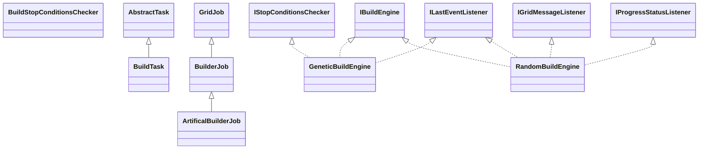

# TaskBuild.jar

[Group index](README.md) | [All archives](../README.md)

## Scope and provenance

- **Donor:** `SQX_145_REFERENCE_ROOT/internal/plugins/TaskBuild/TaskBuild.jar`.
- **SHA-256:** `38d7920fafa619f5521a5d147f2f57d2bc265f251aae02d6076bd972c49643d4`; accessed 2026-10-06; captured `2026-10-06T18:54:51.906614+00:00`.
- **Classes:** 11 raw entries; 11 unique entry names. Duplicate occurrence indices are zero-based.
- **Inspection:** read-only ZIP hashing and class-file structural parsing; signatures/descriptors, modifiers, hierarchy and references only. Bytecode bodies are hashed, not published.
- **Allocation:** proposed `FEAT-BUILDER-TASK-BUILD`, P09; [roadmap](../../dev/sqx-full-application-roadmap.md). Domain README registration remains required.
- **Repository:** `01067f00031428613c6394064ca1bcadc1ba00ee`; review state unreviewed. Download label 145-dev1; installed build/activation and runtime equivalence unverified.
- **Limit:** every class/member is inventoried; declaration coverage does not establish consumed calls, defaults, formulas, failure semantics or algorithm parity.
- **Archive/resource index:** [270.json](../../dev/evidence/sqx145/archives/145/270.json).

## Complete member declarations

Member shards contain exact JVM names/descriptors, access flags, generic signatures, throws types, declared fields/methods, superclass/interfaces and referenced class names. All classes, nested/synthetic members and overloads are retained. Code length/hash is structural evidence, not a normalized algorithm comparison.

- [001.json](../../dev/evidence/sqx145/members/270/001.json) — SHA-256 `db53e6744bf48f4a7c773f8bc614e6330783d642450bf4b107889d6c15a59679`.

## Focused structural diagram

Up to twelve non-nested classes; arrows show declared inheritance/interfaces only. External type names are not evidence of an available body or an executed dependency.

## Class inventory

| Archive entry | Occurrence | Class SHA-256 | Fields | Methods |
| --- | ---: | --- | ---: | ---: |
| `com/strategyquant/plugin/Task/impl/Build/ArtificalBuilderJob.class` | 0 | `ec234e7eea4c9e5edb013d488a5b169ed1281a308f37846537e7427aba6edb36` | 4 | 7 |
| `com/strategyquant/plugin/Task/impl/Build/BuildStopConditionsChecker.class` | 0 | `1fbb44e0994a320aac1294219b14403d60d15af45ff602fba853358c9f3a46a6` | 0 | 2 |
| `com/strategyquant/plugin/Task/impl/Build/BuildTask$1.class` | 0 | `8209d46cb058f8c549b097a8d6d7fa90669bd3ca09f5c95aa9bd828b4f16db3d` | 1 | 2 |
| `com/strategyquant/plugin/Task/impl/Build/BuildTask.class` | 0 | `b58c801fb00abea9926e1c7842d804cb5256049ea1d5662fddd600ad763c2b51` | 18 | 24 |
| `com/strategyquant/plugin/Task/impl/Build/BuilderJob.class` | 0 | `c9217d21c59a54a75a0ed4b4e648aa58a4933004c8c9a4e21c3acf257617d751` | 12 | 7 |
| `com/strategyquant/plugin/Task/impl/Build/GeneticBuildEngine$1.class` | 0 | `03994de6bf799921f3671c0a3d807c71e33f266fa67563dcd9a8d743947b6165` | 1 | 6 |
| `com/strategyquant/plugin/Task/impl/Build/GeneticBuildEngine$2.class` | 0 | `b950daa28023f615764d0b49ca6cc7dcb2456134d86cca9f71d460ef0b20497d` | 1 | 2 |
| `com/strategyquant/plugin/Task/impl/Build/GeneticBuildEngine.class` | 0 | `f6ad2ddcbb7ae1578931916e2f5b09bd810ec672d9f54268de07dbc354cf100f` | 24 | 29 |
| `com/strategyquant/plugin/Task/impl/Build/IBuildEngine.class` | 0 | `0fa0ee4b89adc77034c81501d6de93cc0bebe5073272c5eb9731ee9375225ef0` | 0 | 6 |
| `com/strategyquant/plugin/Task/impl/Build/RandomBuildEngine$1.class` | 0 | `f8bef83df29433f5be90287aeac6a20b592185a2c813ddec96a8645b10fedb1b` | 1 | 2 |
| `com/strategyquant/plugin/Task/impl/Build/RandomBuildEngine.class` | 0 | `d66801dc2dac2a3899f55fb2cc95c43fab0689a878e87777790241501083c5a2` | 52 | 22 |
