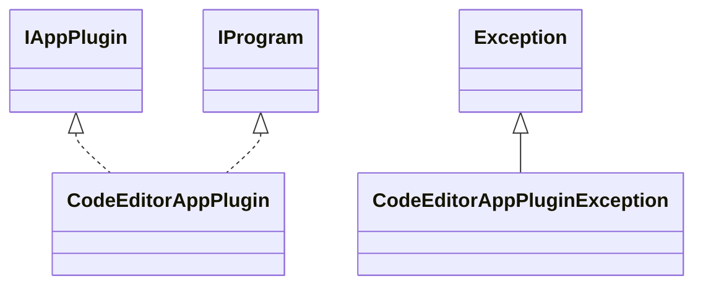

# AppCodeEditor.jar

[Group index](README.md) | [All archives](../README.md)

## Scope and provenance

- **Donor:** `SQX_145_REFERENCE_ROOT/internal/plugins/AppCodeEditor/AppCodeEditor.jar`.
- **SHA-256:** `df88cbdf4baae6ee27892d389cefd6349fee81962f12d21ff45b663094826a15`; accessed 2026-10-06; captured `2026-10-06T18:54:51.906614+00:00`.
- **Classes:** 3 raw entries; 3 unique entry names. Duplicate occurrence indices are zero-based.
- **Inspection:** read-only ZIP hashing and class-file structural parsing; signatures/descriptors, modifiers, hierarchy and references only. Bytecode bodies are hashed, not published.
- **Allocation:** proposed `FEAT-AUTHORING-APP-CODE-EDITOR`, P07; [roadmap](../../dev/sqx-full-application-roadmap.md). Domain README registration remains required.
- **Repository:** `01067f00031428613c6394064ca1bcadc1ba00ee`; review state unreviewed. Download label 145-dev1; installed build/activation and runtime equivalence unverified.
- **Limit:** every class/member is inventoried; declaration coverage does not establish consumed calls, defaults, formulas, failure semantics or algorithm parity.
- **Archive/resource index:** [125.json](../../dev/evidence/sqx145/archives/145/125.json).

## Complete member declarations

Member shards contain exact JVM names/descriptors, access flags, generic signatures, throws types, declared fields/methods, superclass/interfaces and referenced class names. All classes, nested/synthetic members and overloads are retained. Code length/hash is structural evidence, not a normalized algorithm comparison.

- [001.json](../../dev/evidence/sqx145/members/125/001.json) — SHA-256 `4c592cc4d6ed95feb007d62eed3c5a189c4c1979c9f2ca08e3e5f542aa0cc4c3`.

## Focused structural diagram

Up to twelve non-nested classes; arrows show declared inheritance/interfaces only. External type names are not evidence of an available body or an executed dependency.

## Class inventory

| Archive entry | Occurrence | Class SHA-256 | Fields | Methods |
| --- | ---: | --- | ---: | ---: |
| `com/strategyquant/plugin/App/impl/CodeEditor/CodeEditorAppPlugin$1.class` | 0 | `3469cd77e8c932b8e2477c64e837917b08b5b64002555d3a0c4fc3918f05a0ec` | 1 | 2 |
| `com/strategyquant/plugin/App/impl/CodeEditor/CodeEditorAppPlugin.class` | 0 | `b913491d012397337013670990b0396289e33d18006b4d23b5ac83c5e255b13c` | 1 | 13 |
| `com/strategyquant/plugin/App/impl/CodeEditor/CodeEditorAppPluginException.class` | 0 | `8dd567d4f12cc5ea0f3c4dc607f5449c25a8949f634ada25f6d9637a08c2c8d0` | 0 | 1 |
