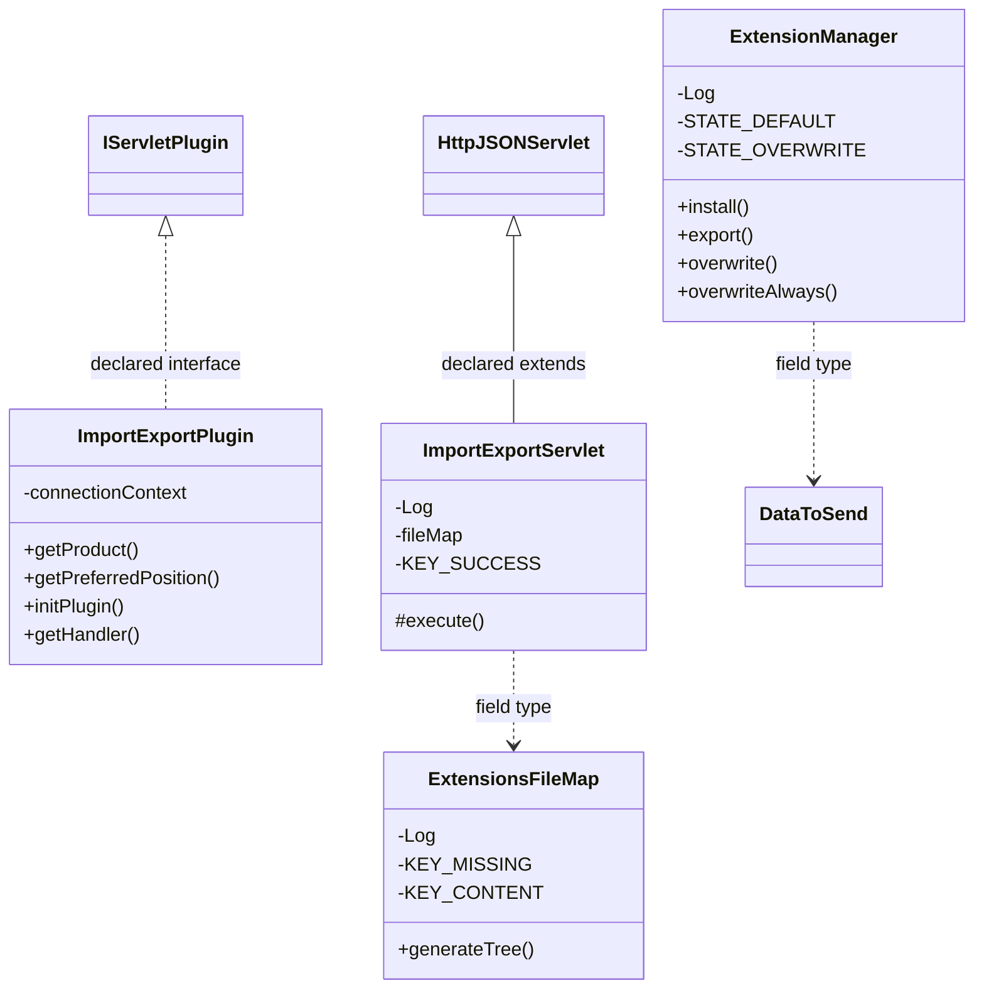

# CodeEditorImportExport.jar

[Workspace/group index](README.md)  |  [All workspaces](../README.md)

## Scope and provenance

- Artifact: `SQX_REFERENCE_ROOT/internal/plugins/CodeEditorImportExport/CodeEditorImportExport.jar`.
- SHA-256: `c2a0f530874c947e743e82c5ac98793e40e5d45764e1632e85a0396a3f830dbb`.
- Inspected: 2026-10-05; generation timestamp `2026-10-05T19:04:16.344170+00:00`.
- Archive class entries: **5**; non-nested: **4**; nested/anonymous: **1**.
- Inspection: ZIP entry/manifest enumeration and `javap -p` declarations for every listed class.
- Repository source HEAD: `8a92c705183a6702eaf62037ccb202ed028aa899`; review state: generated, pending owner review.
- Installed SQX build number is unverified. No method bodies are reproduced.
- Confidence: high for declared structure; workspace ownership inferred except where registration evidence is separately stated. Runtime reachability, call order, formulas and parity remain unverified.

The `CodeEditor` folder is a navigation/research grouping, not an exclusive backend owner. Shared consumers may use this JAR.

Target mapping: no verified owning HaruQuantAI feature/requirement/decision IDs are assigned by this document. Register or resolve ownership through the normal repository plan before implementation.

## Diagram reading guide

`Parent <|-- Child` means declared inheritance; `Interface <|.. Class` means declared implementation. Interface extension uses the inheritance arrow. `A ..> B : field type` is a declared type dependency, not composition, object ownership or a runtime call. External nodes are referenced types, not fabricated local implementations. Selected fields/method names aid navigation: `+` is public, `#` protected and `-` private. Diagram method names omit parameter/return types and collapse overloads; use the exact inspected declarations below before implementing an API.

Detailed graphs include non-nested classes in package-sized groups of at most 12. Nested/anonymous classes are inventoried and their declarations/relationships are retained below, but omitted from overview graphs. Relationships not drawn for readability remain in the complete declaration-relationship table. Constructors, synthetic bridges and overloads may be collapsed in diagram member lists only. Standard `java.lang.Object` inheritance is omitted from diagrams.

## UML class diagrams

### 1. `com.strategyquant.plugin.CodeEditor.impl.ImportExport`



| Diagram identifier | Exact type | Location |
| --- | --- | --- |
| `Cb8775fa5d589` | `com.strategyquant.plugin.CodeEditor.impl.ImportExport.ExtensionManager` (this JAR) | this diagram |
| `C5b9c3427d14d` | `com.strategyquant.plugin.CodeEditor.impl.ImportExport.ExtensionsFileMap` (this JAR) | this diagram |
| `C86c32e8e00c6` | `com.strategyquant.plugin.CodeEditor.impl.ImportExport.ImportExportPlugin` (this JAR) | this diagram |
| `C29b97a193005` | `com.strategyquant.plugin.CodeEditor.impl.ImportExport.ImportExportServlet` (this JAR) | this diagram |
| `C6128eed56b6d` | [`com.strategyquant.tradinglib.project.websocket.DataToSend`](../Shared/SQTradingLib.md) | referenced external type |
| `C249b5c671b1a` | [`com.strategyquant.tradinglib.servlet.IServletPlugin`](../Shared/SQTradingLib.md) | referenced external type |
| `C8900f90ae594` | [`com.strategyquant.webguilib.servlet.HttpJSONServlet`](../Shared/SQWebGUILib.md) | referenced external type |

## Complete class inventory

| Fully qualified class | Kind | Entry |
| --- | --- | --- |
| `com.strategyquant.plugin.CodeEditor.impl.ImportExport.ExtensionManager` | class | non-nested |
| `com.strategyquant.plugin.CodeEditor.impl.ImportExport.ExtensionManager$1` | class | nested/anonymous |
| `com.strategyquant.plugin.CodeEditor.impl.ImportExport.ExtensionsFileMap` | class | non-nested |
| `com.strategyquant.plugin.CodeEditor.impl.ImportExport.ImportExportPlugin` | class | non-nested |
| `com.strategyquant.plugin.CodeEditor.impl.ImportExport.ImportExportServlet` | class | non-nested |

## Declared relationships and evidence locations

Every row is supported by the named class declaration/member in `javap -p`, inside the artifact recorded above. Signature dependencies may include return, parameter, generic-argument and throws types; they do not imply execution.

| Declaring class | Referenced type | Relationship | Narrow inspection location |
| --- | --- | --- | --- |
| `com.strategyquant.plugin.CodeEditor.impl.ImportExport.ExtensionManager` | `org.slf4j.Logger` (not resolved in scoped archives) | type dependency | `com.strategyquant.plugin.CodeEditor.impl.ImportExport.ExtensionManager` / field declaration: `private static final org.slf4j.Logger Log;` |
| `com.strategyquant.plugin.CodeEditor.impl.ImportExport.ExtensionManager` | `java.lang.Thread` (not resolved in scoped archives) | type dependency | `com.strategyquant.plugin.CodeEditor.impl.ImportExport.ExtensionManager` / field declaration: `private static java.lang.Thread waitingThread;` |
| `com.strategyquant.plugin.CodeEditor.impl.ImportExport.ExtensionManager` | `org.json.JSONObject` (not resolved in scoped archives) | type dependency | `com.strategyquant.plugin.CodeEditor.impl.ImportExport.ExtensionManager` / field declaration: `private static org.json.JSONObject confirmObj;` |
| `com.strategyquant.plugin.CodeEditor.impl.ImportExport.ExtensionManager` | [`com.strategyquant.tradinglib.project.websocket.DataToSend`](../Shared/SQTradingLib.md) | type dependency | `com.strategyquant.plugin.CodeEditor.impl.ImportExport.ExtensionManager` / field declaration: `private static com.strategyquant.tradinglib.project.websocket.DataToSend dataToSend;` |
| `com.strategyquant.plugin.CodeEditor.impl.ImportExport.ExtensionManager` | `java.util.HashMap` (not resolved in scoped archives) | type dependency | `com.strategyquant.plugin.CodeEditor.impl.ImportExport.ExtensionManager` / field declaration: `public static java.util.HashMap<java.lang.String, java.lang.String> notImportedMap;` |
| `com.strategyquant.plugin.CodeEditor.impl.ImportExport.ExtensionManager` | `java.lang.String` (not resolved in scoped archives) | type dependency | `com.strategyquant.plugin.CodeEditor.impl.ImportExport.ExtensionManager` / field declaration: `public static java.util.HashMap<java.lang.String, java.lang.String> notImportedMap;` |
| `com.strategyquant.plugin.CodeEditor.impl.ImportExport.ExtensionManager` | `java.lang.String` (not resolved in scoped archives) | type dependency | `com.strategyquant.plugin.CodeEditor.impl.ImportExport.ExtensionManager` / method signature: `public static java.util.ArrayList<java.lang.String> install(java.lang.String[]) throws java.lang.Exception;`<br>`public static void export(java.lang.String[], java.lang.String) throws java.lang.Exception;`<br>`private static void sendConfirmation(java.lang.String);` |
| `com.strategyquant.plugin.CodeEditor.impl.ImportExport.ExtensionManager` | `java.util.ArrayList` (not resolved in scoped archives) | type dependency | `com.strategyquant.plugin.CodeEditor.impl.ImportExport.ExtensionManager` / method signature: `public static java.util.ArrayList<java.lang.String> install(java.lang.String[]) throws java.lang.Exception;` |
| `com.strategyquant.plugin.CodeEditor.impl.ImportExport.ExtensionManager` | `java.lang.Exception` (not resolved in scoped archives) | type dependency | `com.strategyquant.plugin.CodeEditor.impl.ImportExport.ExtensionManager` / method signature: `public static java.util.ArrayList<java.lang.String> install(java.lang.String[]) throws java.lang.Exception;`<br>`public static void export(java.lang.String[], java.lang.String) throws java.lang.Exception;`<br>`private static void writeToFile(java.io.File, java.util.zip.ZipInputStream) throws java.lang.Exception;`<br>`private static void waitForUserAction() throws java.lang.Exception;` |
| `com.strategyquant.plugin.CodeEditor.impl.ImportExport.ExtensionManager` | `java.io.File` (not resolved in scoped archives) | type dependency | `com.strategyquant.plugin.CodeEditor.impl.ImportExport.ExtensionManager` / method signature: `private static void writeToFile(java.io.File, java.util.zip.ZipInputStream) throws java.lang.Exception;` |
| `com.strategyquant.plugin.CodeEditor.impl.ImportExport.ExtensionManager` | `java.util.zip.ZipInputStream` (not resolved in scoped archives) | type dependency | `com.strategyquant.plugin.CodeEditor.impl.ImportExport.ExtensionManager` / method signature: `private static void writeToFile(java.io.File, java.util.zip.ZipInputStream) throws java.lang.Exception;` |
| `com.strategyquant.plugin.CodeEditor.impl.ImportExport.ExtensionManager$1` | `java.lang.Thread` (not resolved in scoped archives) | extends | `com.strategyquant.plugin.CodeEditor.impl.ImportExport.ExtensionManager$1` / class declaration: `class com.strategyquant.plugin.CodeEditor.impl.ImportExport.ExtensionManager$1 extends java.lang.Thread` |
| `com.strategyquant.plugin.CodeEditor.impl.ImportExport.ExtensionsFileMap` | `org.slf4j.Logger` (not resolved in scoped archives) | type dependency | `com.strategyquant.plugin.CodeEditor.impl.ImportExport.ExtensionsFileMap` / field declaration: `private static final org.slf4j.Logger Log;` |
| `com.strategyquant.plugin.CodeEditor.impl.ImportExport.ExtensionsFileMap` | `java.lang.String` (not resolved in scoped archives) | type dependency | `com.strategyquant.plugin.CodeEditor.impl.ImportExport.ExtensionsFileMap` / field declaration: `private static final java.lang.String KEY_MISSING;`<br>`private static final java.lang.String KEY_CONTENT;`<br>`private static final java.lang.String KEY_INFO;`<br>`private static final java.lang.String KEY_NAME;`<br>`private static final java.lang.String KEY_FILE;`<br>`private static final java.lang.String KEY_TYPE;`<br>`private static final java.lang.String KEY_TYPES;`<br>`private static final java.lang.String KEY_ID;`<br>`private static final java.lang.String KEY_TEXT;`<br>`private static final java.lang.String KEY_USERDATA;`<br>`private static final java.lang.String KEY_ITEM;`<br>`java.lang.String userExtedDirPath;`<br>`java.lang.String userLibsDirPath;` |
| `com.strategyquant.plugin.CodeEditor.impl.ImportExport.ExtensionsFileMap` | `java.lang.String` (not resolved in scoped archives) | type dependency | `com.strategyquant.plugin.CodeEditor.impl.ImportExport.ExtensionsFileMap` / method signature: `public org.json.JSONArray generateTree(java.util.Map<java.lang.String, java.lang.String>, java.lang.String, int);`<br>`private void parseFolder(java.lang.String, java.lang.String, org.json.JSONArray, java.lang.String);`<br>`private org.json.JSONArray prvParse(java.io.File, java.lang.String, org.json.JSONArray, boolean, java.lang.String);`<br>`private boolean checkFile(java.io.File, java.lang.String);`<br>`private boolean containsFileByFilter(java.io.File, java.lang.String);` |
| `com.strategyquant.plugin.CodeEditor.impl.ImportExport.ExtensionsFileMap` | `java.util.concurrent.locks.Lock` (not resolved in scoped archives) | type dependency | `com.strategyquant.plugin.CodeEditor.impl.ImportExport.ExtensionsFileMap` / field declaration: `private final java.util.concurrent.locks.Lock lock;` |
| `com.strategyquant.plugin.CodeEditor.impl.ImportExport.ExtensionsFileMap` | `org.json.JSONArray` (not resolved in scoped archives) | type dependency | `com.strategyquant.plugin.CodeEditor.impl.ImportExport.ExtensionsFileMap` / method signature: `public org.json.JSONArray generateTree(java.util.Map<java.lang.String, java.lang.String>, java.lang.String, int);`<br>`private void parseFolder(java.lang.String, java.lang.String, org.json.JSONArray, java.lang.String);`<br>`private org.json.JSONArray prvParse(java.io.File, java.lang.String, org.json.JSONArray, boolean, java.lang.String);` |
| `com.strategyquant.plugin.CodeEditor.impl.ImportExport.ExtensionsFileMap` | `java.util.Map` (not resolved in scoped archives) | type dependency | `com.strategyquant.plugin.CodeEditor.impl.ImportExport.ExtensionsFileMap` / method signature: `public org.json.JSONArray generateTree(java.util.Map<java.lang.String, java.lang.String>, java.lang.String, int);` |
| `com.strategyquant.plugin.CodeEditor.impl.ImportExport.ExtensionsFileMap` | `java.io.File` (not resolved in scoped archives) | type dependency | `com.strategyquant.plugin.CodeEditor.impl.ImportExport.ExtensionsFileMap` / method signature: `private org.json.JSONArray prvParse(java.io.File, java.lang.String, org.json.JSONArray, boolean, java.lang.String);`<br>`private boolean checkFile(java.io.File, java.lang.String);`<br>`private boolean containsFileByFilter(java.io.File, java.lang.String);` |
| `com.strategyquant.plugin.CodeEditor.impl.ImportExport.ImportExportPlugin` | [`com.strategyquant.tradinglib.servlet.IServletPlugin`](../Shared/SQTradingLib.md) | implements | `com.strategyquant.plugin.CodeEditor.impl.ImportExport.ImportExportPlugin` / class declaration: `public class com.strategyquant.plugin.CodeEditor.impl.ImportExport.ImportExportPlugin implements com.strategyquant.tradinglib.servlet.IServletPlugin` |
| `com.strategyquant.plugin.CodeEditor.impl.ImportExport.ImportExportPlugin` | `org.eclipse.jetty.servlet.ServletContextHandler` (not resolved in scoped archives) | type dependency | `com.strategyquant.plugin.CodeEditor.impl.ImportExport.ImportExportPlugin` / field declaration: `private org.eclipse.jetty.servlet.ServletContextHandler connectionContext;` |
| `com.strategyquant.plugin.CodeEditor.impl.ImportExport.ImportExportPlugin` | `java.lang.String` (not resolved in scoped archives) | type dependency | `com.strategyquant.plugin.CodeEditor.impl.ImportExport.ImportExportPlugin` / method signature: `public java.lang.String getProduct();` |
| `com.strategyquant.plugin.CodeEditor.impl.ImportExport.ImportExportPlugin` | `java.lang.Exception` (not resolved in scoped archives) | type dependency | `com.strategyquant.plugin.CodeEditor.impl.ImportExport.ImportExportPlugin` / method signature: `public void initPlugin() throws java.lang.Exception;` |
| `com.strategyquant.plugin.CodeEditor.impl.ImportExport.ImportExportPlugin` | `org.eclipse.jetty.server.Handler` (not resolved in scoped archives) | type dependency | `com.strategyquant.plugin.CodeEditor.impl.ImportExport.ImportExportPlugin` / method signature: `public org.eclipse.jetty.server.Handler getHandler();` |
| `com.strategyquant.plugin.CodeEditor.impl.ImportExport.ImportExportServlet` | [`com.strategyquant.webguilib.servlet.HttpJSONServlet`](../Shared/SQWebGUILib.md) | extends | `com.strategyquant.plugin.CodeEditor.impl.ImportExport.ImportExportServlet` / class declaration: `public class com.strategyquant.plugin.CodeEditor.impl.ImportExport.ImportExportServlet extends com.strategyquant.webguilib.servlet.HttpJSONServlet` |
| `com.strategyquant.plugin.CodeEditor.impl.ImportExport.ImportExportServlet` | `org.slf4j.Logger` (not resolved in scoped archives) | type dependency | `com.strategyquant.plugin.CodeEditor.impl.ImportExport.ImportExportServlet` / field declaration: `private static final org.slf4j.Logger Log;` |
| `com.strategyquant.plugin.CodeEditor.impl.ImportExport.ImportExportServlet` | `com.strategyquant.plugin.CodeEditor.impl.ImportExport.ExtensionsFileMap` (this JAR) | type dependency | `com.strategyquant.plugin.CodeEditor.impl.ImportExport.ImportExportServlet` / field declaration: `private static com.strategyquant.plugin.CodeEditor.impl.ImportExport.ExtensionsFileMap fileMap;` |
| `com.strategyquant.plugin.CodeEditor.impl.ImportExport.ImportExportServlet` | `com.strategyquant.plugin.CodeEditor.impl.ImportExport.ExtensionsFileMap` (this JAR) | type dependency | `com.strategyquant.plugin.CodeEditor.impl.ImportExport.ImportExportServlet` / method signature: `private static synchronized com.strategyquant.plugin.CodeEditor.impl.ImportExport.ExtensionsFileMap getFileMapInstance();` |
| `com.strategyquant.plugin.CodeEditor.impl.ImportExport.ImportExportServlet` | `java.lang.String` (not resolved in scoped archives) | type dependency | `com.strategyquant.plugin.CodeEditor.impl.ImportExport.ImportExportServlet` / field declaration: `private static final java.lang.String KEY_SUCCESS;`<br>`private static final java.lang.String KEY_FILE;`<br>`private static final java.lang.String KEY_FILES;`<br>`private static final java.lang.String KEY_COMPILATION_RESULT;`<br>`private static final java.lang.String KEY_INDICATORS;`<br>`private static final java.lang.String KEY_TEMPLATE;`<br>`private static final java.lang.String KEY_TEMPLATES;`<br>`private static final java.lang.String KEY_ID;`<br>`private static final java.lang.String KEY_TEXT;`<br>`private static final java.lang.String KEY_MATCHES;`<br>`private static final java.lang.String KEY_ITEM;`<br>`private static final java.lang.String KEY_ITEMS;`<br>`private static final java.lang.String KEY_NAME;`<br>`private static final java.lang.String KEY_PROTECTED;`<br>`private static final java.lang.String KEY_TYPE;`<br>`private static final java.lang.String KEY_DESCRIPTION;`<br>`private static final java.lang.String KEY_DATA;` |
| `com.strategyquant.plugin.CodeEditor.impl.ImportExport.ImportExportServlet` | `java.lang.String` (not resolved in scoped archives) | type dependency | `com.strategyquant.plugin.CodeEditor.impl.ImportExport.ImportExportServlet` / method signature: `protected java.lang.String execute(java.lang.String, java.util.Map<java.lang.String, java.lang.String[]>, java.lang.String) throws java.lang.Exception;`<br>`private java.lang.String onList(java.util.Map<java.lang.String, java.lang.String[]>) throws java.lang.Exception;`<br>`private java.lang.String onImport(java.util.Map<java.lang.String, java.lang.String[]>);`<br>`private java.lang.String onExport(java.util.Map<java.lang.String, java.lang.String[]>);`<br>`private java.lang.String onOverwrite(java.util.Map<java.lang.String, java.lang.String[]>);`<br>`private java.lang.String onOverwriteAlways(java.util.Map<java.lang.String, java.lang.String[]>);`<br>`private java.lang.String onSkip(java.util.Map<java.lang.String, java.lang.String[]>);`<br>`private java.lang.String onSkipAlways(java.util.Map<java.lang.String, java.lang.String[]>);`<br>`private java.lang.String onCancel(java.util.Map<java.lang.String, java.lang.String[]>);` |
| `com.strategyquant.plugin.CodeEditor.impl.ImportExport.ImportExportServlet` | `java.util.Map` (not resolved in scoped archives) | type dependency | `com.strategyquant.plugin.CodeEditor.impl.ImportExport.ImportExportServlet` / method signature: `protected java.lang.String execute(java.lang.String, java.util.Map<java.lang.String, java.lang.String[]>, java.lang.String) throws java.lang.Exception;`<br>`private java.lang.String onList(java.util.Map<java.lang.String, java.lang.String[]>) throws java.lang.Exception;`<br>`private java.lang.String onImport(java.util.Map<java.lang.String, java.lang.String[]>);`<br>`private java.lang.String onExport(java.util.Map<java.lang.String, java.lang.String[]>);`<br>`private java.lang.String onOverwrite(java.util.Map<java.lang.String, java.lang.String[]>);`<br>`private java.lang.String onOverwriteAlways(java.util.Map<java.lang.String, java.lang.String[]>);`<br>`private java.lang.String onSkip(java.util.Map<java.lang.String, java.lang.String[]>);`<br>`private java.lang.String onSkipAlways(java.util.Map<java.lang.String, java.lang.String[]>);`<br>`private java.lang.String onCancel(java.util.Map<java.lang.String, java.lang.String[]>);` |
| `com.strategyquant.plugin.CodeEditor.impl.ImportExport.ImportExportServlet` | `java.lang.Exception` (not resolved in scoped archives) | type dependency | `com.strategyquant.plugin.CodeEditor.impl.ImportExport.ImportExportServlet` / method signature: `protected java.lang.String execute(java.lang.String, java.util.Map<java.lang.String, java.lang.String[]>, java.lang.String) throws java.lang.Exception;`<br>`private java.lang.String onList(java.util.Map<java.lang.String, java.lang.String[]>) throws java.lang.Exception;` |

## Inspected declaration reference

These are structural API/member declarations, not proprietary implementation bodies. Private members and nested classes are retained to make diagram omissions explicit; declarations do not prove behavior.

<details>
<summary>com.strategyquant.plugin.CodeEditor.impl.ImportExport.ExtensionManager</summary>

```text
public class com.strategyquant.plugin.CodeEditor.impl.ImportExport.ExtensionManager
    private static final org.slf4j.Logger Log;
    private static final byte STATE_DEFAULT;
    private static final byte STATE_OVERWRITE;
    private static final byte STATE_OVERWRITEALWAYS;
    private static final byte STATE_SKIP;
    private static final byte STATE_SKIPALWAYS;
    private static final byte STATE_CANCEL;
    private static volatile byte state;
    private static java.lang.Thread waitingThread;
    private static org.json.JSONObject confirmObj;
    private static com.strategyquant.tradinglib.project.websocket.DataToSend dataToSend;
    public static java.util.HashMap<java.lang.String, java.lang.String> notImportedMap;
    public com.strategyquant.plugin.CodeEditor.impl.ImportExport.ExtensionManager();
    public static java.util.ArrayList<java.lang.String> install(java.lang.String[]) throws java.lang.Exception;
    public static void export(java.lang.String[], java.lang.String) throws java.lang.Exception;
    public static void overwrite();
    public static void overwriteAlways();
    public static void skip();
    public static void skipAlways();
    public static void cancelImport();
    private static void writeToFile(java.io.File, java.util.zip.ZipInputStream) throws java.lang.Exception;
    private static void sendConfirmation(java.lang.String);
    private static void waitForUserAction() throws java.lang.Exception;
    static byte access$000();
    static byte access$002(byte);
```

</details>

<details>
<summary>com.strategyquant.plugin.CodeEditor.impl.ImportExport.ExtensionManager$1</summary>

```text
class com.strategyquant.plugin.CodeEditor.impl.ImportExport.ExtensionManager$1 extends java.lang.Thread
    com.strategyquant.plugin.CodeEditor.impl.ImportExport.ExtensionManager$1();
    public void run();
```

</details>

<details>
<summary>com.strategyquant.plugin.CodeEditor.impl.ImportExport.ExtensionsFileMap</summary>

```text
public class com.strategyquant.plugin.CodeEditor.impl.ImportExport.ExtensionsFileMap
    private static final org.slf4j.Logger Log;
    private static final java.lang.String KEY_MISSING;
    private static final java.lang.String KEY_CONTENT;
    private static final java.lang.String KEY_INFO;
    private static final java.lang.String KEY_NAME;
    private static final java.lang.String KEY_FILE;
    private static final java.lang.String KEY_TYPE;
    private static final java.lang.String KEY_TYPES;
    private static final java.lang.String KEY_ID;
    private static final java.lang.String KEY_TEXT;
    private static final java.lang.String KEY_USERDATA;
    private static final java.lang.String KEY_ITEM;
    private int index;
    private final java.util.concurrent.locks.Lock lock;
    java.lang.String userExtedDirPath;
    java.lang.String userLibsDirPath;
    public com.strategyquant.plugin.CodeEditor.impl.ImportExport.ExtensionsFileMap();
    public org.json.JSONArray generateTree(java.util.Map<java.lang.String, java.lang.String>, java.lang.String, int);
    private void parseFolder(java.lang.String, java.lang.String, org.json.JSONArray, java.lang.String);
    private org.json.JSONArray prvParse(java.io.File, java.lang.String, org.json.JSONArray, boolean, java.lang.String);
    private boolean checkFile(java.io.File, java.lang.String);
    private boolean containsFileByFilter(java.io.File, java.lang.String);
```

</details>

<details>
<summary>com.strategyquant.plugin.CodeEditor.impl.ImportExport.ImportExportPlugin</summary>

```text
public class com.strategyquant.plugin.CodeEditor.impl.ImportExport.ImportExportPlugin implements com.strategyquant.tradinglib.servlet.IServletPlugin
    private org.eclipse.jetty.servlet.ServletContextHandler connectionContext;
    public com.strategyquant.plugin.CodeEditor.impl.ImportExport.ImportExportPlugin();
    public java.lang.String getProduct();
    public int getPreferredPosition();
    public void initPlugin() throws java.lang.Exception;
    public org.eclipse.jetty.server.Handler getHandler();
```

</details>

<details>
<summary>com.strategyquant.plugin.CodeEditor.impl.ImportExport.ImportExportServlet</summary>

```text
public class com.strategyquant.plugin.CodeEditor.impl.ImportExport.ImportExportServlet extends com.strategyquant.webguilib.servlet.HttpJSONServlet
    private static final org.slf4j.Logger Log;
    private static com.strategyquant.plugin.CodeEditor.impl.ImportExport.ExtensionsFileMap fileMap;
    private static final java.lang.String KEY_SUCCESS;
    private static final java.lang.String KEY_FILE;
    private static final java.lang.String KEY_FILES;
    private static final java.lang.String KEY_COMPILATION_RESULT;
    private static final java.lang.String KEY_INDICATORS;
    private static final java.lang.String KEY_TEMPLATE;
    private static final java.lang.String KEY_TEMPLATES;
    private static final java.lang.String KEY_ID;
    private static final java.lang.String KEY_TEXT;
    private static final java.lang.String KEY_MATCHES;
    private static final java.lang.String KEY_ITEM;
    private static final java.lang.String KEY_ITEMS;
    private static final java.lang.String KEY_NAME;
    private static final java.lang.String KEY_PROTECTED;
    private static final java.lang.String KEY_TYPE;
    private static final java.lang.String KEY_DESCRIPTION;
    private static final java.lang.String KEY_DATA;
    public com.strategyquant.plugin.CodeEditor.impl.ImportExport.ImportExportServlet();
    protected java.lang.String execute(java.lang.String, java.util.Map<java.lang.String, java.lang.String[]>, java.lang.String) throws java.lang.Exception;
    private java.lang.String onList(java.util.Map<java.lang.String, java.lang.String[]>) throws java.lang.Exception;
    private static synchronized com.strategyquant.plugin.CodeEditor.impl.ImportExport.ExtensionsFileMap getFileMapInstance();
    private java.lang.String onImport(java.util.Map<java.lang.String, java.lang.String[]>);
    private java.lang.String onExport(java.util.Map<java.lang.String, java.lang.String[]>);
    private java.lang.String onOverwrite(java.util.Map<java.lang.String, java.lang.String[]>);
    private java.lang.String onOverwriteAlways(java.util.Map<java.lang.String, java.lang.String[]>);
    private java.lang.String onSkip(java.util.Map<java.lang.String, java.lang.String[]>);
    private java.lang.String onSkipAlways(java.util.Map<java.lang.String, java.lang.String[]>);
    private java.lang.String onCancel(java.util.Map<java.lang.String, java.lang.String[]>);
```

</details>

## Validation and unresolved gaps

Archive hash and complete class inventory were checked against the inspected local artifact. Declaration extraction accounts for every inventoried class. Documentation/link/diagram structural verification is recorded in the master index and task walkthrough; no SQX runtime validation was performed.

The canonical reimplementation ledger/schema are absent, so no evidence IDs or validation-passed ledger claims are created. This is a donor structural reference. Exact behavior, default values, failure semantics, algorithms, runtime calls and target architectural choices require separate research. No aggregation/composition or cardinalities are inferred.
