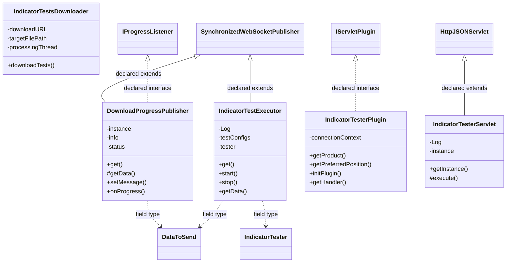

# CodeEditorIndicatorTester.jar

[Workspace/group index](README.md)  |  [All workspaces](../README.md)

## Scope and provenance

- Artifact: `SQX_REFERENCE_ROOT/internal/plugins/CodeEditorIndicatorTester/CodeEditorIndicatorTester.jar`.
- SHA-256: `0a9dae03be5a30d26bc68da2289b33010af52c833ce239979b8338fec5dd233b`.
- Inspected: 2026-10-05; generation timestamp `2026-10-05T19:04:16.344170+00:00`.
- Archive class entries: **7**; non-nested: **5**; nested/anonymous: **2**.
- Inspection: ZIP entry/manifest enumeration and `javap -p` declarations for every listed class.
- Repository source HEAD: `8a92c705183a6702eaf62037ccb202ed028aa899`; review state: generated, pending owner review.
- Installed SQX build number is unverified. No method bodies are reproduced.
- Confidence: high for declared structure; workspace ownership inferred except where registration evidence is separately stated. Runtime reachability, call order, formulas and parity remain unverified.

The `CodeEditor` folder is a navigation/research grouping, not an exclusive backend owner. Shared consumers may use this JAR.

Target mapping: no verified owning HaruQuantAI feature/requirement/decision IDs are assigned by this document. Register or resolve ownership through the normal repository plan before implementation.

## Diagram reading guide

`Parent <|-- Child` means declared inheritance; `Interface <|.. Class` means declared implementation. Interface extension uses the inheritance arrow. `A ..> B : field type` is a declared type dependency, not composition, object ownership or a runtime call. External nodes are referenced types, not fabricated local implementations. Selected fields/method names aid navigation: `+` is public, `#` protected and `-` private. Diagram method names omit parameter/return types and collapse overloads; use the exact inspected declarations below before implementing an API.

Detailed graphs include non-nested classes in package-sized groups of at most 12. Nested/anonymous classes are inventoried and their declarations/relationships are retained below, but omitted from overview graphs. Relationships not drawn for readability remain in the complete declaration-relationship table. Constructors, synthetic bridges and overloads may be collapsed in diagram member lists only. Standard `java.lang.Object` inheritance is omitted from diagrams.

## UML class diagrams

### 1. `com.strategyquant.plugin.CodeEditor.impl.IndicatorTester`



| Diagram identifier | Exact type | Location |
| --- | --- | --- |
| `C686f22f7d531` | [`com.strategyquant.indicatorTester.IndicatorTester`](../Shared/SQTradingLib.md) | referenced external type |
| `C4e26b970a2d9` | `com.strategyquant.lib.utils.IProgressListener` (not resolved in scoped archives) | referenced external type |
| `Ce5b5341d7e8d` | `com.strategyquant.plugin.CodeEditor.impl.IndicatorTester.DownloadProgressPublisher` (this JAR) | this diagram |
| `C2d141a513ab1` | `com.strategyquant.plugin.CodeEditor.impl.IndicatorTester.IndicatorTestExecutor` (this JAR) | this diagram |
| `Cd610a99ca102` | `com.strategyquant.plugin.CodeEditor.impl.IndicatorTester.IndicatorTesterPlugin` (this JAR) | this diagram |
| `Ccf981f85976b` | `com.strategyquant.plugin.CodeEditor.impl.IndicatorTester.IndicatorTesterServlet` (this JAR) | this diagram |
| `Cc1194c52d730` | `com.strategyquant.plugin.CodeEditor.impl.IndicatorTester.IndicatorTestsDownloader` (this JAR) | this diagram |
| `C6128eed56b6d` | [`com.strategyquant.tradinglib.project.websocket.DataToSend`](../Shared/SQTradingLib.md) | referenced external type |
| `Ce87cf9854aad` | [`com.strategyquant.tradinglib.project.websocket.SynchronizedWebSocketPublisher`](../Shared/SQTradingLib.md) | referenced external type |
| `C249b5c671b1a` | [`com.strategyquant.tradinglib.servlet.IServletPlugin`](../Shared/SQTradingLib.md) | referenced external type |
| `C8900f90ae594` | [`com.strategyquant.webguilib.servlet.HttpJSONServlet`](../Shared/SQWebGUILib.md) | referenced external type |

## Complete class inventory

| Fully qualified class | Kind | Entry |
| --- | --- | --- |
| `com.strategyquant.plugin.CodeEditor.impl.IndicatorTester.DownloadProgressPublisher` | class | non-nested |
| `com.strategyquant.plugin.CodeEditor.impl.IndicatorTester.IndicatorTestExecutor` | class | non-nested |
| `com.strategyquant.plugin.CodeEditor.impl.IndicatorTester.IndicatorTestExecutor$1` | class | nested/anonymous |
| `com.strategyquant.plugin.CodeEditor.impl.IndicatorTester.IndicatorTesterPlugin` | class | non-nested |
| `com.strategyquant.plugin.CodeEditor.impl.IndicatorTester.IndicatorTesterServlet` | class | non-nested |
| `com.strategyquant.plugin.CodeEditor.impl.IndicatorTester.IndicatorTestsDownloader` | class | non-nested |
| `com.strategyquant.plugin.CodeEditor.impl.IndicatorTester.IndicatorTestsDownloader$1` | class | nested/anonymous |

## Declared relationships and evidence locations

Every row is supported by the named class declaration/member in `javap -p`, inside the artifact recorded above. Signature dependencies may include return, parameter, generic-argument and throws types; they do not imply execution.

| Declaring class | Referenced type | Relationship | Narrow inspection location |
| --- | --- | --- | --- |
| `com.strategyquant.plugin.CodeEditor.impl.IndicatorTester.DownloadProgressPublisher` | [`com.strategyquant.tradinglib.project.websocket.SynchronizedWebSocketPublisher`](../Shared/SQTradingLib.md) | extends | `com.strategyquant.plugin.CodeEditor.impl.IndicatorTester.DownloadProgressPublisher` / class declaration: `public class com.strategyquant.plugin.CodeEditor.impl.IndicatorTester.DownloadProgressPublisher extends com.strategyquant.tradinglib.project.websocket.SynchronizedWebSocketPublisher implements com.strategyquant.lib.utils.IProgressListener` |
| `com.strategyquant.plugin.CodeEditor.impl.IndicatorTester.DownloadProgressPublisher` | `com.strategyquant.lib.utils.IProgressListener` (not resolved in scoped archives) | implements | `com.strategyquant.plugin.CodeEditor.impl.IndicatorTester.DownloadProgressPublisher` / class declaration: `public class com.strategyquant.plugin.CodeEditor.impl.IndicatorTester.DownloadProgressPublisher extends com.strategyquant.tradinglib.project.websocket.SynchronizedWebSocketPublisher implements com.strategyquant.lib.utils.IProgressListener` |
| `com.strategyquant.plugin.CodeEditor.impl.IndicatorTester.DownloadProgressPublisher` | [`com.strategyquant.tradinglib.project.websocket.DataToSend`](../Shared/SQTradingLib.md) | type dependency | `com.strategyquant.plugin.CodeEditor.impl.IndicatorTester.DownloadProgressPublisher` / field declaration: `private com.strategyquant.tradinglib.project.websocket.DataToSend info;` |
| `com.strategyquant.plugin.CodeEditor.impl.IndicatorTester.DownloadProgressPublisher` | [`com.strategyquant.tradinglib.project.websocket.DataToSend`](../Shared/SQTradingLib.md) | type dependency | `com.strategyquant.plugin.CodeEditor.impl.IndicatorTester.DownloadProgressPublisher` / method signature: `protected com.strategyquant.tradinglib.project.websocket.DataToSend getData();` |
| `com.strategyquant.plugin.CodeEditor.impl.IndicatorTester.DownloadProgressPublisher` | `org.json.JSONObject` (not resolved in scoped archives) | type dependency | `com.strategyquant.plugin.CodeEditor.impl.IndicatorTester.DownloadProgressPublisher` / field declaration: `private org.json.JSONObject status;` |
| `com.strategyquant.plugin.CodeEditor.impl.IndicatorTester.DownloadProgressPublisher` | `java.lang.String` (not resolved in scoped archives) | type dependency | `com.strategyquant.plugin.CodeEditor.impl.IndicatorTester.DownloadProgressPublisher` / field declaration: `private java.lang.String lastData;` |
| `com.strategyquant.plugin.CodeEditor.impl.IndicatorTester.DownloadProgressPublisher` | `java.lang.String` (not resolved in scoped archives) | type dependency | `com.strategyquant.plugin.CodeEditor.impl.IndicatorTester.DownloadProgressPublisher` / method signature: `public void setMessage(java.lang.String);`<br>`public void onError(java.lang.String);`<br>`public void onConfirm(java.lang.String);` |
| `com.strategyquant.plugin.CodeEditor.impl.IndicatorTester.DownloadProgressPublisher` | `java.util.concurrent.locks.StampedLock` (not resolved in scoped archives) | type dependency | `com.strategyquant.plugin.CodeEditor.impl.IndicatorTester.DownloadProgressPublisher` / field declaration: `private java.util.concurrent.locks.StampedLock lock;` |
| `com.strategyquant.plugin.CodeEditor.impl.IndicatorTester.IndicatorTestExecutor` | [`com.strategyquant.tradinglib.project.websocket.SynchronizedWebSocketPublisher`](../Shared/SQTradingLib.md) | extends | `com.strategyquant.plugin.CodeEditor.impl.IndicatorTester.IndicatorTestExecutor` / class declaration: `public class com.strategyquant.plugin.CodeEditor.impl.IndicatorTester.IndicatorTestExecutor extends com.strategyquant.tradinglib.project.websocket.SynchronizedWebSocketPublisher` |
| `com.strategyquant.plugin.CodeEditor.impl.IndicatorTester.IndicatorTestExecutor` | `org.slf4j.Logger` (not resolved in scoped archives) | type dependency | `com.strategyquant.plugin.CodeEditor.impl.IndicatorTester.IndicatorTestExecutor` / field declaration: `private static final org.slf4j.Logger Log;` |
| `com.strategyquant.plugin.CodeEditor.impl.IndicatorTester.IndicatorTestExecutor` | `java.util.List` (not resolved in scoped archives) | type dependency | `com.strategyquant.plugin.CodeEditor.impl.IndicatorTester.IndicatorTestExecutor` / field declaration: `private java.util.List<org.jdom2.Element> testConfigs;` |
| `com.strategyquant.plugin.CodeEditor.impl.IndicatorTester.IndicatorTestExecutor` | `java.util.List` (not resolved in scoped archives) | type dependency | `com.strategyquant.plugin.CodeEditor.impl.IndicatorTester.IndicatorTestExecutor` / method signature: `static java.util.List access$400(com.strategyquant.plugin.CodeEditor.impl.IndicatorTester.IndicatorTestExecutor);` |
| `com.strategyquant.plugin.CodeEditor.impl.IndicatorTester.IndicatorTestExecutor` | `org.jdom2.Element` (not resolved in scoped archives) | type dependency | `com.strategyquant.plugin.CodeEditor.impl.IndicatorTester.IndicatorTestExecutor` / field declaration: `private java.util.List<org.jdom2.Element> testConfigs;` |
| `com.strategyquant.plugin.CodeEditor.impl.IndicatorTester.IndicatorTestExecutor` | `org.jdom2.Element` (not resolved in scoped archives) | type dependency | `com.strategyquant.plugin.CodeEditor.impl.IndicatorTester.IndicatorTestExecutor` / method signature: `private void addErrors(org.jdom2.Element);` |
| `com.strategyquant.plugin.CodeEditor.impl.IndicatorTester.IndicatorTestExecutor` | [`com.strategyquant.indicatorTester.IndicatorTester`](../Shared/SQTradingLib.md) | type dependency | `com.strategyquant.plugin.CodeEditor.impl.IndicatorTester.IndicatorTestExecutor` / field declaration: `private com.strategyquant.indicatorTester.IndicatorTester tester;` |
| `com.strategyquant.plugin.CodeEditor.impl.IndicatorTester.IndicatorTestExecutor` | [`com.strategyquant.tradinglib.project.websocket.DataToSend`](../Shared/SQTradingLib.md) | type dependency | `com.strategyquant.plugin.CodeEditor.impl.IndicatorTester.IndicatorTestExecutor` / field declaration: `private com.strategyquant.tradinglib.project.websocket.DataToSend info;` |
| `com.strategyquant.plugin.CodeEditor.impl.IndicatorTester.IndicatorTestExecutor` | [`com.strategyquant.tradinglib.project.websocket.DataToSend`](../Shared/SQTradingLib.md) | type dependency | `com.strategyquant.plugin.CodeEditor.impl.IndicatorTester.IndicatorTestExecutor` / method signature: `public com.strategyquant.tradinglib.project.websocket.DataToSend getData();` |
| `com.strategyquant.plugin.CodeEditor.impl.IndicatorTester.IndicatorTestExecutor` | `org.json.JSONObject` (not resolved in scoped archives) | type dependency | `com.strategyquant.plugin.CodeEditor.impl.IndicatorTester.IndicatorTestExecutor` / field declaration: `private org.json.JSONObject status;` |
| `com.strategyquant.plugin.CodeEditor.impl.IndicatorTester.IndicatorTestExecutor` | `java.util.concurrent.locks.ReentrantLock` (not resolved in scoped archives) | type dependency | `com.strategyquant.plugin.CodeEditor.impl.IndicatorTester.IndicatorTestExecutor` / field declaration: `private java.util.concurrent.locks.ReentrantLock lock;` |
| `com.strategyquant.plugin.CodeEditor.impl.IndicatorTester.IndicatorTestExecutor` | `java.lang.Exception` (not resolved in scoped archives) | type dependency | `com.strategyquant.plugin.CodeEditor.impl.IndicatorTester.IndicatorTestExecutor` / method signature: `public void start() throws java.lang.Exception;`<br>`private void loadTestsConfig() throws java.lang.Exception;` |
| `com.strategyquant.plugin.CodeEditor.impl.IndicatorTester.IndicatorTestExecutor` | `java.lang.String` (not resolved in scoped archives) | type dependency | `com.strategyquant.plugin.CodeEditor.impl.IndicatorTester.IndicatorTestExecutor` / method signature: `private java.lang.String getResultMessage(com.strategyquant.indicatorTester.IndicatorTestException);` |
| `com.strategyquant.plugin.CodeEditor.impl.IndicatorTester.IndicatorTestExecutor` | [`com.strategyquant.indicatorTester.IndicatorTestException`](../Shared/SQTradingLib.md) | type dependency | `com.strategyquant.plugin.CodeEditor.impl.IndicatorTester.IndicatorTestExecutor` / method signature: `private java.lang.String getResultMessage(com.strategyquant.indicatorTester.IndicatorTestException);`<br>`private void performTest() throws com.strategyquant.indicatorTester.IndicatorTestException;` |
| `com.strategyquant.plugin.CodeEditor.impl.IndicatorTester.IndicatorTestExecutor$1` | `java.lang.Thread` (not resolved in scoped archives) | extends | `com.strategyquant.plugin.CodeEditor.impl.IndicatorTester.IndicatorTestExecutor$1` / class declaration: `class com.strategyquant.plugin.CodeEditor.impl.IndicatorTester.IndicatorTestExecutor$1 extends java.lang.Thread` |
| `com.strategyquant.plugin.CodeEditor.impl.IndicatorTester.IndicatorTestExecutor$1` | `com.strategyquant.plugin.CodeEditor.impl.IndicatorTester.IndicatorTestExecutor` (this JAR) | type dependency | `com.strategyquant.plugin.CodeEditor.impl.IndicatorTester.IndicatorTestExecutor$1` / field declaration: `final com.strategyquant.plugin.CodeEditor.impl.IndicatorTester.IndicatorTestExecutor this$0;` |
| `com.strategyquant.plugin.CodeEditor.impl.IndicatorTester.IndicatorTestExecutor$1` | `com.strategyquant.plugin.CodeEditor.impl.IndicatorTester.IndicatorTestExecutor` (this JAR) | type dependency | `com.strategyquant.plugin.CodeEditor.impl.IndicatorTester.IndicatorTestExecutor$1` / method signature: `com.strategyquant.plugin.CodeEditor.impl.IndicatorTester.IndicatorTestExecutor$1(com.strategyquant.plugin.CodeEditor.impl.IndicatorTester.IndicatorTestExecutor);` |
| `com.strategyquant.plugin.CodeEditor.impl.IndicatorTester.IndicatorTesterPlugin` | [`com.strategyquant.tradinglib.servlet.IServletPlugin`](../Shared/SQTradingLib.md) | implements | `com.strategyquant.plugin.CodeEditor.impl.IndicatorTester.IndicatorTesterPlugin` / class declaration: `public class com.strategyquant.plugin.CodeEditor.impl.IndicatorTester.IndicatorTesterPlugin implements com.strategyquant.tradinglib.servlet.IServletPlugin` |
| `com.strategyquant.plugin.CodeEditor.impl.IndicatorTester.IndicatorTesterPlugin` | `org.eclipse.jetty.servlet.ServletContextHandler` (not resolved in scoped archives) | type dependency | `com.strategyquant.plugin.CodeEditor.impl.IndicatorTester.IndicatorTesterPlugin` / field declaration: `private org.eclipse.jetty.servlet.ServletContextHandler connectionContext;` |
| `com.strategyquant.plugin.CodeEditor.impl.IndicatorTester.IndicatorTesterPlugin` | `java.lang.String` (not resolved in scoped archives) | type dependency | `com.strategyquant.plugin.CodeEditor.impl.IndicatorTester.IndicatorTesterPlugin` / method signature: `public java.lang.String getProduct();` |
| `com.strategyquant.plugin.CodeEditor.impl.IndicatorTester.IndicatorTesterPlugin` | `java.lang.Exception` (not resolved in scoped archives) | type dependency | `com.strategyquant.plugin.CodeEditor.impl.IndicatorTester.IndicatorTesterPlugin` / method signature: `public void initPlugin() throws java.lang.Exception;` |
| `com.strategyquant.plugin.CodeEditor.impl.IndicatorTester.IndicatorTesterPlugin` | `org.eclipse.jetty.server.Handler` (not resolved in scoped archives) | type dependency | `com.strategyquant.plugin.CodeEditor.impl.IndicatorTester.IndicatorTesterPlugin` / method signature: `public org.eclipse.jetty.server.Handler getHandler();` |
| `com.strategyquant.plugin.CodeEditor.impl.IndicatorTester.IndicatorTesterServlet` | [`com.strategyquant.webguilib.servlet.HttpJSONServlet`](../Shared/SQWebGUILib.md) | extends | `com.strategyquant.plugin.CodeEditor.impl.IndicatorTester.IndicatorTesterServlet` / class declaration: `public class com.strategyquant.plugin.CodeEditor.impl.IndicatorTester.IndicatorTesterServlet extends com.strategyquant.webguilib.servlet.HttpJSONServlet` |
| `com.strategyquant.plugin.CodeEditor.impl.IndicatorTester.IndicatorTesterServlet` | `org.slf4j.Logger` (not resolved in scoped archives) | type dependency | `com.strategyquant.plugin.CodeEditor.impl.IndicatorTester.IndicatorTesterServlet` / field declaration: `private static final org.slf4j.Logger Log;` |
| `com.strategyquant.plugin.CodeEditor.impl.IndicatorTester.IndicatorTesterServlet` | `java.lang.String` (not resolved in scoped archives) | type dependency | `com.strategyquant.plugin.CodeEditor.impl.IndicatorTester.IndicatorTesterServlet` / method signature: `protected java.lang.String execute(java.lang.String, java.util.Map<java.lang.String, java.lang.String[]>, java.lang.String);`<br>`private java.lang.String onListIndicators();`<br>`private java.lang.String onCreateNewConfig(java.util.Map<java.lang.String, java.lang.String[]>);`<br>`private java.lang.String onAddTests(java.util.Map<java.lang.String, java.lang.String[]>);`<br>`private java.lang.String onLoadConfig(java.util.Map<java.lang.String, java.lang.String[]>);`<br>`private java.lang.String onSaveConfig(java.util.Map<java.lang.String, java.lang.String[]>);`<br>`private java.lang.String onStartTesting(java.util.Map<java.lang.String, java.lang.String[]>);`<br>`private java.lang.String onStopTesting();`<br>`private java.lang.String onDownloadTests();`<br>`private java.lang.String onCalibrate(java.util.Map<java.lang.String, java.lang.String[]>);` |
| `com.strategyquant.plugin.CodeEditor.impl.IndicatorTester.IndicatorTesterServlet` | `java.util.Map` (not resolved in scoped archives) | type dependency | `com.strategyquant.plugin.CodeEditor.impl.IndicatorTester.IndicatorTesterServlet` / method signature: `protected java.lang.String execute(java.lang.String, java.util.Map<java.lang.String, java.lang.String[]>, java.lang.String);`<br>`private java.lang.String onCreateNewConfig(java.util.Map<java.lang.String, java.lang.String[]>);`<br>`private java.lang.String onAddTests(java.util.Map<java.lang.String, java.lang.String[]>);`<br>`private java.lang.String onLoadConfig(java.util.Map<java.lang.String, java.lang.String[]>);`<br>`private java.lang.String onSaveConfig(java.util.Map<java.lang.String, java.lang.String[]>);`<br>`private java.lang.String onStartTesting(java.util.Map<java.lang.String, java.lang.String[]>);`<br>`private java.lang.String onCalibrate(java.util.Map<java.lang.String, java.lang.String[]>);` |
| `com.strategyquant.plugin.CodeEditor.impl.IndicatorTester.IndicatorTestsDownloader` | `java.lang.String` (not resolved in scoped archives) | type dependency | `com.strategyquant.plugin.CodeEditor.impl.IndicatorTester.IndicatorTestsDownloader` / field declaration: `private static final java.lang.String downloadURL;`<br>`private static final java.lang.String targetFilePath;` |
| `com.strategyquant.plugin.CodeEditor.impl.IndicatorTester.IndicatorTestsDownloader` | `java.lang.Thread` (not resolved in scoped archives) | type dependency | `com.strategyquant.plugin.CodeEditor.impl.IndicatorTester.IndicatorTestsDownloader` / field declaration: `private static java.lang.Thread processingThread;` |
| `com.strategyquant.plugin.CodeEditor.impl.IndicatorTester.IndicatorTestsDownloader` | `com.strategyquant.lib.utils.IProgressListener` (not resolved in scoped archives) | type dependency | `com.strategyquant.plugin.CodeEditor.impl.IndicatorTester.IndicatorTestsDownloader` / method signature: `public static void downloadTests(com.strategyquant.lib.utils.IProgressListener) throws java.lang.Exception;`<br>`private static void downloadFile(com.strategyquant.lib.utils.IProgressListener) throws java.lang.Exception;`<br>`private static void copyTestFiles(com.strategyquant.lib.utils.IProgressListener) throws java.lang.Exception;`<br>`private static void updateTesterConfig(com.strategyquant.lib.utils.IProgressListener) throws java.lang.Exception;`<br>`static void access$000(com.strategyquant.lib.utils.IProgressListener) throws java.lang.Exception;`<br>`static void access$100(com.strategyquant.lib.utils.IProgressListener) throws java.lang.Exception;`<br>`static void access$200(com.strategyquant.lib.utils.IProgressListener) throws java.lang.Exception;` |
| `com.strategyquant.plugin.CodeEditor.impl.IndicatorTester.IndicatorTestsDownloader` | `java.lang.Exception` (not resolved in scoped archives) | type dependency | `com.strategyquant.plugin.CodeEditor.impl.IndicatorTester.IndicatorTestsDownloader` / method signature: `public static void downloadTests(com.strategyquant.lib.utils.IProgressListener) throws java.lang.Exception;`<br>`private static void downloadFile(com.strategyquant.lib.utils.IProgressListener) throws java.lang.Exception;`<br>`private static void copyTestFiles(com.strategyquant.lib.utils.IProgressListener) throws java.lang.Exception;`<br>`private static void updateTesterConfig(com.strategyquant.lib.utils.IProgressListener) throws java.lang.Exception;`<br>`static void access$000(com.strategyquant.lib.utils.IProgressListener) throws java.lang.Exception;`<br>`static void access$100(com.strategyquant.lib.utils.IProgressListener) throws java.lang.Exception;`<br>`static void access$200(com.strategyquant.lib.utils.IProgressListener) throws java.lang.Exception;` |
| `com.strategyquant.plugin.CodeEditor.impl.IndicatorTester.IndicatorTestsDownloader$1` | `java.lang.Thread` (not resolved in scoped archives) | extends | `com.strategyquant.plugin.CodeEditor.impl.IndicatorTester.IndicatorTestsDownloader$1` / class declaration: `class com.strategyquant.plugin.CodeEditor.impl.IndicatorTester.IndicatorTestsDownloader$1 extends java.lang.Thread` |
| `com.strategyquant.plugin.CodeEditor.impl.IndicatorTester.IndicatorTestsDownloader$1` | `com.strategyquant.lib.utils.IProgressListener` (not resolved in scoped archives) | type dependency | `com.strategyquant.plugin.CodeEditor.impl.IndicatorTester.IndicatorTestsDownloader$1` / field declaration: `final com.strategyquant.lib.utils.IProgressListener val$listener;` |
| `com.strategyquant.plugin.CodeEditor.impl.IndicatorTester.IndicatorTestsDownloader$1` | `com.strategyquant.lib.utils.IProgressListener` (not resolved in scoped archives) | type dependency | `com.strategyquant.plugin.CodeEditor.impl.IndicatorTester.IndicatorTestsDownloader$1` / method signature: `com.strategyquant.plugin.CodeEditor.impl.IndicatorTester.IndicatorTestsDownloader$1(com.strategyquant.lib.utils.IProgressListener);` |

## Inspected declaration reference

These are structural API/member declarations, not proprietary implementation bodies. Private members and nested classes are retained to make diagram omissions explicit; declarations do not prove behavior.

<details>
<summary>com.strategyquant.plugin.CodeEditor.impl.IndicatorTester.DownloadProgressPublisher</summary>

```text
public class com.strategyquant.plugin.CodeEditor.impl.IndicatorTester.DownloadProgressPublisher extends com.strategyquant.tradinglib.project.websocket.SynchronizedWebSocketPublisher implements com.strategyquant.lib.utils.IProgressListener
    private static com.strategyquant.plugin.CodeEditor.impl.IndicatorTester.DownloadProgressPublisher instance;
    private com.strategyquant.tradinglib.project.websocket.DataToSend info;
    private org.json.JSONObject status;
    private java.lang.String lastData;
    private java.util.concurrent.locks.StampedLock lock;
    private com.strategyquant.plugin.CodeEditor.impl.IndicatorTester.DownloadProgressPublisher();
    public static com.strategyquant.plugin.CodeEditor.impl.IndicatorTester.DownloadProgressPublisher get();
    protected com.strategyquant.tradinglib.project.websocket.DataToSend getData();
    public void setMessage(java.lang.String);
    public void onProgress(double);
    public void onError(java.lang.String);
    public void resetLastData();
    public void onStart();
    public void onFinish();
    public void onConfirm(java.lang.String);
    public void setStep(int);
    public void onPause();
    public void onContinue();
```

</details>

<details>
<summary>com.strategyquant.plugin.CodeEditor.impl.IndicatorTester.IndicatorTestExecutor</summary>

```text
public class com.strategyquant.plugin.CodeEditor.impl.IndicatorTester.IndicatorTestExecutor extends com.strategyquant.tradinglib.project.websocket.SynchronizedWebSocketPublisher
    private static final org.slf4j.Logger Log;
    private java.util.List<org.jdom2.Element> testConfigs;
    private com.strategyquant.indicatorTester.IndicatorTester tester;
    private int testIndex;
    private int runningStatus;
    private boolean shouldStop;
    private boolean newUpdate;
    private int dataSource;
    private com.strategyquant.tradinglib.project.websocket.DataToSend info;
    private org.json.JSONObject status;
    private java.util.concurrent.locks.ReentrantLock lock;
    private static com.strategyquant.plugin.CodeEditor.impl.IndicatorTester.IndicatorTestExecutor instance;
    private com.strategyquant.plugin.CodeEditor.impl.IndicatorTester.IndicatorTestExecutor();
    public static com.strategyquant.plugin.CodeEditor.impl.IndicatorTester.IndicatorTestExecutor get();
    public void start() throws java.lang.Exception;
    public void stop();
    private void loadTestsConfig() throws java.lang.Exception;
    private void runNextTest();
    private void addErrors(org.jdom2.Element);
    private java.lang.String getResultMessage(com.strategyquant.indicatorTester.IndicatorTestException);
    private void performTest() throws com.strategyquant.indicatorTester.IndicatorTestException;
    public com.strategyquant.tradinglib.project.websocket.DataToSend getData();
    public void resetLastData();
    private int getTestIndex();
    private void setTestIndex(int);
    private void incrementTestIndex();
    public int getRunningStatus();
    private void setRunningStatus(int);
    private void setNewUpdate();
    static boolean access$002(com.strategyquant.plugin.CodeEditor.impl.IndicatorTester.IndicatorTestExecutor, boolean);
    static void access$100(com.strategyquant.plugin.CodeEditor.impl.IndicatorTester.IndicatorTestExecutor, int);
    static void access$200(com.strategyquant.plugin.CodeEditor.impl.IndicatorTester.IndicatorTestExecutor, int);
    static int access$300(com.strategyquant.plugin.CodeEditor.impl.IndicatorTester.IndicatorTestExecutor);
    static java.util.List access$400(com.strategyquant.plugin.CodeEditor.impl.IndicatorTester.IndicatorTestExecutor);
    static boolean access$000(com.strategyquant.plugin.CodeEditor.impl.IndicatorTester.IndicatorTestExecutor);
    static void access$500(com.strategyquant.plugin.CodeEditor.impl.IndicatorTester.IndicatorTestExecutor);
    static void access$600(com.strategyquant.plugin.CodeEditor.impl.IndicatorTester.IndicatorTestExecutor);
    static void access$700(com.strategyquant.plugin.CodeEditor.impl.IndicatorTester.IndicatorTestExecutor);
```

</details>

<details>
<summary>com.strategyquant.plugin.CodeEditor.impl.IndicatorTester.IndicatorTestExecutor$1</summary>

```text
class com.strategyquant.plugin.CodeEditor.impl.IndicatorTester.IndicatorTestExecutor$1 extends java.lang.Thread
    final com.strategyquant.plugin.CodeEditor.impl.IndicatorTester.IndicatorTestExecutor this$0;
    com.strategyquant.plugin.CodeEditor.impl.IndicatorTester.IndicatorTestExecutor$1(com.strategyquant.plugin.CodeEditor.impl.IndicatorTester.IndicatorTestExecutor);
    public void run();
```

</details>

<details>
<summary>com.strategyquant.plugin.CodeEditor.impl.IndicatorTester.IndicatorTesterPlugin</summary>

```text
public class com.strategyquant.plugin.CodeEditor.impl.IndicatorTester.IndicatorTesterPlugin implements com.strategyquant.tradinglib.servlet.IServletPlugin
    private org.eclipse.jetty.servlet.ServletContextHandler connectionContext;
    public com.strategyquant.plugin.CodeEditor.impl.IndicatorTester.IndicatorTesterPlugin();
    public java.lang.String getProduct();
    public int getPreferredPosition();
    public void initPlugin() throws java.lang.Exception;
    public org.eclipse.jetty.server.Handler getHandler();
```

</details>

<details>
<summary>com.strategyquant.plugin.CodeEditor.impl.IndicatorTester.IndicatorTesterServlet</summary>

```text
public class com.strategyquant.plugin.CodeEditor.impl.IndicatorTester.IndicatorTesterServlet extends com.strategyquant.webguilib.servlet.HttpJSONServlet
    private static final org.slf4j.Logger Log;
    private static com.strategyquant.plugin.CodeEditor.impl.IndicatorTester.IndicatorTesterServlet instance;
    public com.strategyquant.plugin.CodeEditor.impl.IndicatorTester.IndicatorTesterServlet();
    public static com.strategyquant.plugin.CodeEditor.impl.IndicatorTester.IndicatorTesterServlet getInstance();
    protected java.lang.String execute(java.lang.String, java.util.Map<java.lang.String, java.lang.String[]>, java.lang.String);
    private java.lang.String onListIndicators();
    private java.lang.String onCreateNewConfig(java.util.Map<java.lang.String, java.lang.String[]>);
    private java.lang.String onAddTests(java.util.Map<java.lang.String, java.lang.String[]>);
    private java.lang.String onLoadConfig(java.util.Map<java.lang.String, java.lang.String[]>);
    private java.lang.String onSaveConfig(java.util.Map<java.lang.String, java.lang.String[]>);
    private java.lang.String onStartTesting(java.util.Map<java.lang.String, java.lang.String[]>);
    private java.lang.String onStopTesting();
    private java.lang.String onDownloadTests();
    private java.lang.String onCalibrate(java.util.Map<java.lang.String, java.lang.String[]>);
```

</details>

<details>
<summary>com.strategyquant.plugin.CodeEditor.impl.IndicatorTester.IndicatorTestsDownloader</summary>

```text
public class com.strategyquant.plugin.CodeEditor.impl.IndicatorTester.IndicatorTestsDownloader
    private static final java.lang.String downloadURL;
    private static final java.lang.String targetFilePath;
    private static java.lang.Thread processingThread;
    public com.strategyquant.plugin.CodeEditor.impl.IndicatorTester.IndicatorTestsDownloader();
    public static void downloadTests(com.strategyquant.lib.utils.IProgressListener) throws java.lang.Exception;
    private static void downloadFile(com.strategyquant.lib.utils.IProgressListener) throws java.lang.Exception;
    private static void copyTestFiles(com.strategyquant.lib.utils.IProgressListener) throws java.lang.Exception;
    private static void updateTesterConfig(com.strategyquant.lib.utils.IProgressListener) throws java.lang.Exception;
    static void access$000(com.strategyquant.lib.utils.IProgressListener) throws java.lang.Exception;
    static void access$100(com.strategyquant.lib.utils.IProgressListener) throws java.lang.Exception;
    static void access$200(com.strategyquant.lib.utils.IProgressListener) throws java.lang.Exception;
```

</details>

<details>
<summary>com.strategyquant.plugin.CodeEditor.impl.IndicatorTester.IndicatorTestsDownloader$1</summary>

```text
class com.strategyquant.plugin.CodeEditor.impl.IndicatorTester.IndicatorTestsDownloader$1 extends java.lang.Thread
    final com.strategyquant.lib.utils.IProgressListener val$listener;
    com.strategyquant.plugin.CodeEditor.impl.IndicatorTester.IndicatorTestsDownloader$1(com.strategyquant.lib.utils.IProgressListener);
    public void run();
```

</details>

## Validation and unresolved gaps

Archive hash and complete class inventory were checked against the inspected local artifact. Declaration extraction accounts for every inventoried class. Documentation/link/diagram structural verification is recorded in the master index and task walkthrough; no SQX runtime validation was performed.

The canonical reimplementation ledger/schema are absent, so no evidence IDs or validation-passed ledger claims are created. This is a donor structural reference. Exact behavior, default values, failure semantics, algorithms, runtime calls and target architectural choices require separate research. No aggregation/composition or cardinalities are inferred.
