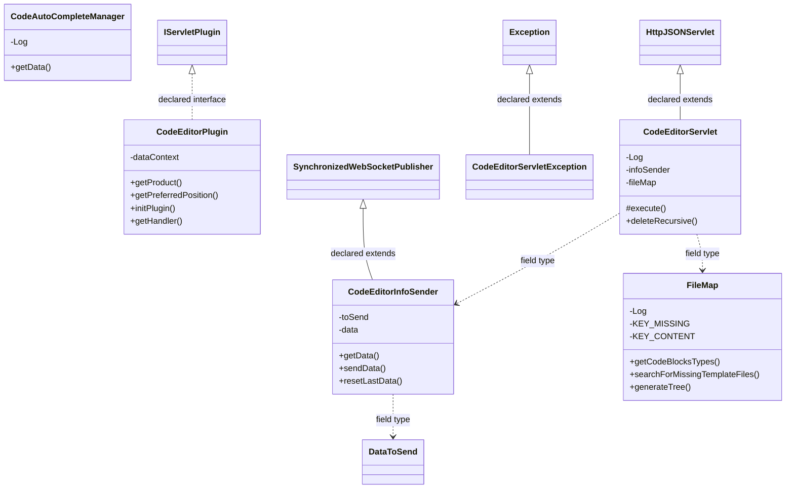
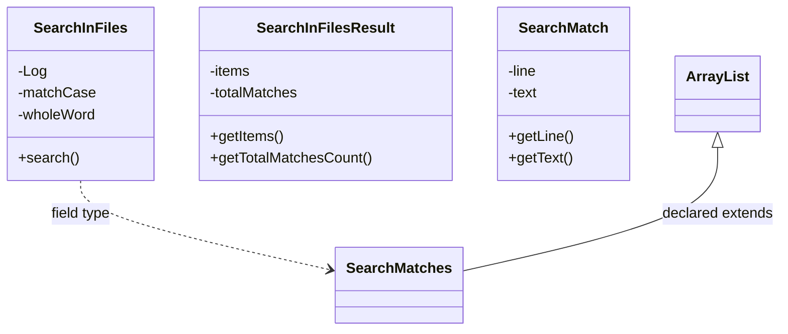
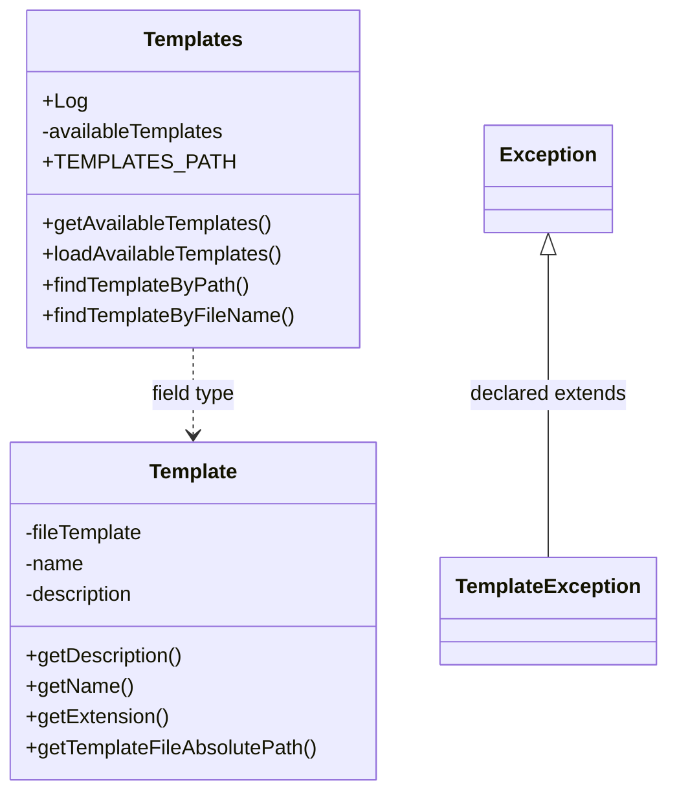

# ServletCodeEditor.jar

[Workspace/group index](README.md)  |  [All workspaces](../README.md)

## Scope and provenance

- Artifact: `SQX_REFERENCE_ROOT/internal/plugins/ServletCodeEditor/ServletCodeEditor.jar`.
- SHA-256: `2950747967d42710cad4df45cef4aaf0d3317df5261964c788eb147138e9744e`.
- Inspected: 2026-10-05; generation timestamp `2026-10-05T19:04:16.344170+00:00`.
- Archive class entries: **13**; non-nested: **13**; nested/anonymous: **0**.
- Inspection: ZIP entry/manifest enumeration and `javap -p` declarations for every listed class.
- Repository source HEAD: `8a92c705183a6702eaf62037ccb202ed028aa899`; review state: generated, pending owner review.
- Installed SQX build number is unverified. No method bodies are reproduced.
- Confidence: high for declared structure; workspace ownership inferred except where registration evidence is separately stated. Runtime reachability, call order, formulas and parity remain unverified.

The `CodeEditor` folder is a navigation/research grouping, not an exclusive backend owner. Shared consumers may use this JAR.

Target mapping: no verified owning HaruQuantAI feature/requirement/decision IDs are assigned by this document. Register or resolve ownership through the normal repository plan before implementation.

## Diagram reading guide

`Parent <|-- Child` means declared inheritance; `Interface <|.. Class` means declared implementation. Interface extension uses the inheritance arrow. `A ..> B : field type` is a declared type dependency, not composition, object ownership or a runtime call. External nodes are referenced types, not fabricated local implementations. Selected fields/method names aid navigation: `+` is public, `#` protected and `-` private. Diagram method names omit parameter/return types and collapse overloads; use the exact inspected declarations below before implementing an API.

Detailed graphs include non-nested classes in package-sized groups of at most 12. Nested/anonymous classes are inventoried and their declarations/relationships are retained below, but omitted from overview graphs. Relationships not drawn for readability remain in the complete declaration-relationship table. Constructors, synthetic bridges and overloads may be collapsed in diagram member lists only. Standard `java.lang.Object` inheritance is omitted from diagrams.

## UML class diagrams

### 1. `com.strategyquant.plugin.Servlet.impl.CodeEditor`



| Diagram identifier | Exact type | Location |
| --- | --- | --- |
| `Cd973ea900ec6` | `com.strategyquant.plugin.Servlet.impl.CodeEditor.CodeAutoCompleteManager` (this JAR) | this diagram |
| `C820749492650` | `com.strategyquant.plugin.Servlet.impl.CodeEditor.CodeEditorInfoSender` (this JAR) | this diagram |
| `Cc562bd44151d` | `com.strategyquant.plugin.Servlet.impl.CodeEditor.CodeEditorPlugin` (this JAR) | this diagram |
| `Caf532576d23d` | `com.strategyquant.plugin.Servlet.impl.CodeEditor.CodeEditorServlet` (this JAR) | this diagram |
| `C441435a336b7` | `com.strategyquant.plugin.Servlet.impl.CodeEditor.CodeEditorServletException` (this JAR) | this diagram |
| `C7001dc3adf79` | `com.strategyquant.plugin.Servlet.impl.CodeEditor.FileMap` (this JAR) | this diagram |
| `C6128eed56b6d` | [`com.strategyquant.tradinglib.project.websocket.DataToSend`](../Shared/SQTradingLib.md) | referenced external type |
| `Ce87cf9854aad` | [`com.strategyquant.tradinglib.project.websocket.SynchronizedWebSocketPublisher`](../Shared/SQTradingLib.md) | referenced external type |
| `C249b5c671b1a` | [`com.strategyquant.tradinglib.servlet.IServletPlugin`](../Shared/SQTradingLib.md) | referenced external type |
| `C8900f90ae594` | [`com.strategyquant.webguilib.servlet.HttpJSONServlet`](../Shared/SQWebGUILib.md) | referenced external type |
| `C4bc2cd7a4e9d` | `java.lang.Exception` (not resolved in scoped archives) | referenced external type |

### 2. `com.strategyquant.plugin.Servlet.impl.CodeEditor.searchInFiles`



| Diagram identifier | Exact type | Location |
| --- | --- | --- |
| `C012c77fba0bc` | `com.strategyquant.plugin.Servlet.impl.CodeEditor.searchInFiles.SearchInFiles` (this JAR) | this diagram |
| `Cb5906140ed54` | `com.strategyquant.plugin.Servlet.impl.CodeEditor.searchInFiles.SearchInFilesResult` (this JAR) | this diagram |
| `Cdf0d655f0ba9` | `com.strategyquant.plugin.Servlet.impl.CodeEditor.searchInFiles.SearchMatch` (this JAR) | this diagram |
| `C215b1d36ce0c` | `com.strategyquant.plugin.Servlet.impl.CodeEditor.searchInFiles.SearchMatches` (this JAR) | this diagram |
| `C5098f415c102` | `java.util.ArrayList` (not resolved in scoped archives) | referenced external type |

### 3. `com.strategyquant.plugin.Servlet.impl.CodeEditor.templates`



| Diagram identifier | Exact type | Location |
| --- | --- | --- |
| `C59ed721f8881` | `com.strategyquant.plugin.Servlet.impl.CodeEditor.templates.Template` (this JAR) | this diagram |
| `Cfcf630e2d5e0` | `com.strategyquant.plugin.Servlet.impl.CodeEditor.templates.TemplateException` (this JAR) | this diagram |
| `C4c9f7c119bb3` | `com.strategyquant.plugin.Servlet.impl.CodeEditor.templates.Templates` (this JAR) | this diagram |
| `C4bc2cd7a4e9d` | `java.lang.Exception` (not resolved in scoped archives) | referenced external type |

## Complete class inventory

| Fully qualified class | Kind | Entry |
| --- | --- | --- |
| `com.strategyquant.plugin.Servlet.impl.CodeEditor.CodeAutoCompleteManager` | class | non-nested |
| `com.strategyquant.plugin.Servlet.impl.CodeEditor.CodeEditorInfoSender` | class | non-nested |
| `com.strategyquant.plugin.Servlet.impl.CodeEditor.CodeEditorPlugin` | class | non-nested |
| `com.strategyquant.plugin.Servlet.impl.CodeEditor.CodeEditorServlet` | class | non-nested |
| `com.strategyquant.plugin.Servlet.impl.CodeEditor.CodeEditorServletException` | class | non-nested |
| `com.strategyquant.plugin.Servlet.impl.CodeEditor.FileMap` | class | non-nested |
| `com.strategyquant.plugin.Servlet.impl.CodeEditor.searchInFiles.SearchInFiles` | class | non-nested |
| `com.strategyquant.plugin.Servlet.impl.CodeEditor.searchInFiles.SearchInFilesResult` | class | non-nested |
| `com.strategyquant.plugin.Servlet.impl.CodeEditor.searchInFiles.SearchMatch` | class | non-nested |
| `com.strategyquant.plugin.Servlet.impl.CodeEditor.searchInFiles.SearchMatches` | class | non-nested |
| `com.strategyquant.plugin.Servlet.impl.CodeEditor.templates.Template` | class | non-nested |
| `com.strategyquant.plugin.Servlet.impl.CodeEditor.templates.TemplateException` | class | non-nested |
| `com.strategyquant.plugin.Servlet.impl.CodeEditor.templates.Templates` | class | non-nested |

## Declared relationships and evidence locations

Every row is supported by the named class declaration/member in `javap -p`, inside the artifact recorded above. Signature dependencies may include return, parameter, generic-argument and throws types; they do not imply execution.

| Declaring class | Referenced type | Relationship | Narrow inspection location |
| --- | --- | --- | --- |
| `com.strategyquant.plugin.Servlet.impl.CodeEditor.CodeAutoCompleteManager` | `org.slf4j.Logger` (not resolved in scoped archives) | type dependency | `com.strategyquant.plugin.Servlet.impl.CodeEditor.CodeAutoCompleteManager` / field declaration: `private static final org.slf4j.Logger Log;` |
| `com.strategyquant.plugin.Servlet.impl.CodeEditor.CodeAutoCompleteManager` | `java.lang.String` (not resolved in scoped archives) | type dependency | `com.strategyquant.plugin.Servlet.impl.CodeEditor.CodeAutoCompleteManager` / method signature: `public java.lang.String getData() throws java.io.IOException, java.lang.ClassNotFoundException;`<br>`private java.lang.String getCachedCustomJarData(java.io.File);`<br>`private java.lang.String getCustomJarsCompleteData() throws java.io.IOException;`<br>`private java.lang.String getSqAutoCompleteData() throws java.lang.ClassNotFoundException, java.io.IOException;`<br>`private java.lang.String getJavaDocs();`<br>`private static boolean lambda$getSqAutoCompleteData$1(java.lang.String);`<br>`private static boolean lambda$getCustomJarFiles$0(java.io.File, java.lang.String);` |
| `com.strategyquant.plugin.Servlet.impl.CodeEditor.CodeAutoCompleteManager` | `java.io.IOException` (not resolved in scoped archives) | type dependency | `com.strategyquant.plugin.Servlet.impl.CodeEditor.CodeAutoCompleteManager` / method signature: `public java.lang.String getData() throws java.io.IOException, java.lang.ClassNotFoundException;`<br>`private com.strategyquant.lib.classInfo.CodeInfo performLoadCustomJarInfo(java.io.File) throws java.io.IOException;`<br>`private java.lang.String getCustomJarsCompleteData() throws java.io.IOException;`<br>`private java.lang.String getSqAutoCompleteData() throws java.lang.ClassNotFoundException, java.io.IOException;` |
| `com.strategyquant.plugin.Servlet.impl.CodeEditor.CodeAutoCompleteManager` | `java.lang.ClassNotFoundException` (not resolved in scoped archives) | type dependency | `com.strategyquant.plugin.Servlet.impl.CodeEditor.CodeAutoCompleteManager` / method signature: `public java.lang.String getData() throws java.io.IOException, java.lang.ClassNotFoundException;`<br>`private java.lang.String getSqAutoCompleteData() throws java.lang.ClassNotFoundException, java.io.IOException;` |
| `com.strategyquant.plugin.Servlet.impl.CodeEditor.CodeAutoCompleteManager` | `java.io.File` (not resolved in scoped archives) | type dependency | `com.strategyquant.plugin.Servlet.impl.CodeEditor.CodeAutoCompleteManager` / method signature: `private java.io.File[] getCustomJarFiles();`<br>`private java.io.File getCustomJarCacheFile(java.io.File);`<br>`private java.lang.String getCachedCustomJarData(java.io.File);`<br>`private com.strategyquant.lib.classInfo.CodeInfo performLoadCustomJarInfo(java.io.File) throws java.io.IOException;`<br>`private static boolean lambda$getCustomJarFiles$0(java.io.File, java.lang.String);` |
| `com.strategyquant.plugin.Servlet.impl.CodeEditor.CodeAutoCompleteManager` | `com.strategyquant.lib.classInfo.CodeInfo` (not resolved in scoped archives) | type dependency | `com.strategyquant.plugin.Servlet.impl.CodeEditor.CodeAutoCompleteManager` / method signature: `private com.strategyquant.lib.classInfo.CodeInfo performLoadCustomJarInfo(java.io.File) throws java.io.IOException;` |
| `com.strategyquant.plugin.Servlet.impl.CodeEditor.CodeEditorInfoSender` | [`com.strategyquant.tradinglib.project.websocket.SynchronizedWebSocketPublisher`](../Shared/SQTradingLib.md) | extends | `com.strategyquant.plugin.Servlet.impl.CodeEditor.CodeEditorInfoSender` / class declaration: `public class com.strategyquant.plugin.Servlet.impl.CodeEditor.CodeEditorInfoSender extends com.strategyquant.tradinglib.project.websocket.SynchronizedWebSocketPublisher` |
| `com.strategyquant.plugin.Servlet.impl.CodeEditor.CodeEditorInfoSender` | [`com.strategyquant.tradinglib.project.websocket.DataToSend`](../Shared/SQTradingLib.md) | type dependency | `com.strategyquant.plugin.Servlet.impl.CodeEditor.CodeEditorInfoSender` / field declaration: `private final com.strategyquant.tradinglib.project.websocket.DataToSend toSend;` |
| `com.strategyquant.plugin.Servlet.impl.CodeEditor.CodeEditorInfoSender` | [`com.strategyquant.tradinglib.project.websocket.DataToSend`](../Shared/SQTradingLib.md) | type dependency | `com.strategyquant.plugin.Servlet.impl.CodeEditor.CodeEditorInfoSender` / method signature: `public com.strategyquant.tradinglib.project.websocket.DataToSend getData();` |
| `com.strategyquant.plugin.Servlet.impl.CodeEditor.CodeEditorInfoSender` | `org.json.JSONObject` (not resolved in scoped archives) | type dependency | `com.strategyquant.plugin.Servlet.impl.CodeEditor.CodeEditorInfoSender` / field declaration: `private org.json.JSONObject data;` |
| `com.strategyquant.plugin.Servlet.impl.CodeEditor.CodeEditorInfoSender` | `org.json.JSONObject` (not resolved in scoped archives) | type dependency | `com.strategyquant.plugin.Servlet.impl.CodeEditor.CodeEditorInfoSender` / method signature: `public void sendData(org.json.JSONObject);` |
| `com.strategyquant.plugin.Servlet.impl.CodeEditor.CodeEditorPlugin` | [`com.strategyquant.tradinglib.servlet.IServletPlugin`](../Shared/SQTradingLib.md) | implements | `com.strategyquant.plugin.Servlet.impl.CodeEditor.CodeEditorPlugin` / class declaration: `public class com.strategyquant.plugin.Servlet.impl.CodeEditor.CodeEditorPlugin implements com.strategyquant.tradinglib.servlet.IServletPlugin` |
| `com.strategyquant.plugin.Servlet.impl.CodeEditor.CodeEditorPlugin` | `org.eclipse.jetty.servlet.ServletContextHandler` (not resolved in scoped archives) | type dependency | `com.strategyquant.plugin.Servlet.impl.CodeEditor.CodeEditorPlugin` / field declaration: `private org.eclipse.jetty.servlet.ServletContextHandler dataContext;` |
| `com.strategyquant.plugin.Servlet.impl.CodeEditor.CodeEditorPlugin` | `java.lang.String` (not resolved in scoped archives) | type dependency | `com.strategyquant.plugin.Servlet.impl.CodeEditor.CodeEditorPlugin` / method signature: `public java.lang.String getProduct();` |
| `com.strategyquant.plugin.Servlet.impl.CodeEditor.CodeEditorPlugin` | `java.lang.Exception` (not resolved in scoped archives) | type dependency | `com.strategyquant.plugin.Servlet.impl.CodeEditor.CodeEditorPlugin` / method signature: `public void initPlugin() throws java.lang.Exception;` |
| `com.strategyquant.plugin.Servlet.impl.CodeEditor.CodeEditorPlugin` | `org.eclipse.jetty.server.Handler` (not resolved in scoped archives) | type dependency | `com.strategyquant.plugin.Servlet.impl.CodeEditor.CodeEditorPlugin` / method signature: `public org.eclipse.jetty.server.Handler getHandler();` |
| `com.strategyquant.plugin.Servlet.impl.CodeEditor.CodeEditorServlet` | [`com.strategyquant.webguilib.servlet.HttpJSONServlet`](../Shared/SQWebGUILib.md) | extends | `com.strategyquant.plugin.Servlet.impl.CodeEditor.CodeEditorServlet` / class declaration: `public class com.strategyquant.plugin.Servlet.impl.CodeEditor.CodeEditorServlet extends com.strategyquant.webguilib.servlet.HttpJSONServlet` |
| `com.strategyquant.plugin.Servlet.impl.CodeEditor.CodeEditorServlet` | `org.slf4j.Logger` (not resolved in scoped archives) | type dependency | `com.strategyquant.plugin.Servlet.impl.CodeEditor.CodeEditorServlet` / field declaration: `private static final org.slf4j.Logger Log;` |
| `com.strategyquant.plugin.Servlet.impl.CodeEditor.CodeEditorServlet` | `com.strategyquant.plugin.Servlet.impl.CodeEditor.CodeEditorInfoSender` (this JAR) | type dependency | `com.strategyquant.plugin.Servlet.impl.CodeEditor.CodeEditorServlet` / field declaration: `private static com.strategyquant.plugin.Servlet.impl.CodeEditor.CodeEditorInfoSender infoSender;` |
| `com.strategyquant.plugin.Servlet.impl.CodeEditor.CodeEditorServlet` | `com.strategyquant.plugin.Servlet.impl.CodeEditor.CodeEditorInfoSender` (this JAR) | type dependency | `com.strategyquant.plugin.Servlet.impl.CodeEditor.CodeEditorServlet` / method signature: `private static synchronized com.strategyquant.plugin.Servlet.impl.CodeEditor.CodeEditorInfoSender getInfoSenderInstance();` |
| `com.strategyquant.plugin.Servlet.impl.CodeEditor.CodeEditorServlet` | `com.strategyquant.plugin.Servlet.impl.CodeEditor.FileMap` (this JAR) | type dependency | `com.strategyquant.plugin.Servlet.impl.CodeEditor.CodeEditorServlet` / field declaration: `private static com.strategyquant.plugin.Servlet.impl.CodeEditor.FileMap fileMap;` |
| `com.strategyquant.plugin.Servlet.impl.CodeEditor.CodeEditorServlet` | `com.strategyquant.plugin.Servlet.impl.CodeEditor.FileMap` (this JAR) | type dependency | `com.strategyquant.plugin.Servlet.impl.CodeEditor.CodeEditorServlet` / method signature: `private static synchronized com.strategyquant.plugin.Servlet.impl.CodeEditor.FileMap getFileMapInstance();` |
| `com.strategyquant.plugin.Servlet.impl.CodeEditor.CodeEditorServlet` | `com.strategyquant.plugin.Servlet.impl.CodeEditor.templates.Templates` (this JAR) | type dependency | `com.strategyquant.plugin.Servlet.impl.CodeEditor.CodeEditorServlet` / field declaration: `private static com.strategyquant.plugin.Servlet.impl.CodeEditor.templates.Templates templates;` |
| `com.strategyquant.plugin.Servlet.impl.CodeEditor.CodeEditorServlet` | `com.strategyquant.plugin.Servlet.impl.CodeEditor.templates.Templates` (this JAR) | type dependency | `com.strategyquant.plugin.Servlet.impl.CodeEditor.CodeEditorServlet` / method signature: `private static synchronized com.strategyquant.plugin.Servlet.impl.CodeEditor.templates.Templates getTemplatesInstance();` |
| `com.strategyquant.plugin.Servlet.impl.CodeEditor.CodeEditorServlet` | `com.strategyquant.lib.plugins.compile.PluginCompiler` (not resolved in scoped archives) | type dependency | `com.strategyquant.plugin.Servlet.impl.CodeEditor.CodeEditorServlet` / field declaration: `private com.strategyquant.lib.plugins.compile.PluginCompiler pc;` |
| `com.strategyquant.plugin.Servlet.impl.CodeEditor.CodeEditorServlet` | `java.lang.String` (not resolved in scoped archives) | type dependency | `com.strategyquant.plugin.Servlet.impl.CodeEditor.CodeEditorServlet` / field declaration: `private static final java.lang.String KEY_SUCCESS;`<br>`private static final java.lang.String KEY_FILE;`<br>`private static final java.lang.String KEY_FILES;`<br>`private static final java.lang.String KEY_COMPILATION_RESULT;`<br>`private static final java.lang.String KEY_INDICATORS;`<br>`private static final java.lang.String KEY_TEMPLATE;`<br>`private static final java.lang.String KEY_TEMPLATES;`<br>`private static final java.lang.String KEY_ID;`<br>`private static final java.lang.String KEY_TEXT;`<br>`private static final java.lang.String KEY_MATCHES;`<br>`private static final java.lang.String KEY_ITEM;`<br>`private static final java.lang.String KEY_ITEMS;`<br>`private static final java.lang.String KEY_NAME;`<br>`private static final java.lang.String KEY_PROTECTED;`<br>`private static final java.lang.String KEY_TYPE;`<br>`private static final java.lang.String KEY_DESCRIPTION;`<br>`private static final java.lang.String KEY_DATA;`<br>`private static final java.lang.String KEY_PLUGIN;`<br>`private static final java.lang.String LAST_OPENED_SNIPPETS_FILE_PATH;` |
| `com.strategyquant.plugin.Servlet.impl.CodeEditor.CodeEditorServlet` | `java.lang.String` (not resolved in scoped archives) | type dependency | `com.strategyquant.plugin.Servlet.impl.CodeEditor.CodeEditorServlet` / method signature: `protected java.lang.String execute(java.lang.String, java.util.Map<java.lang.String, java.lang.String[]>, java.lang.String) throws java.lang.Exception;`<br>`private void validateFileName(java.lang.String) throws com.strategyquant.plugin.Servlet.impl.CodeEditor.CodeEditorServletException;`<br>`private void prvCheckParamExists(java.util.Map<java.lang.String, java.lang.String[]>, java.lang.String[]) throws com.strategyquant.plugin.Servlet.impl.CodeEditor.CodeEditorServletException;`<br>`private static void prvStringToFile(java.lang.String, java.lang.String) throws com.strategyquant.plugin.Servlet.impl.CodeEditor.CodeEditorServletException;`<br>`private static void prvStringToFile(java.io.File, java.lang.String) throws com.strategyquant.plugin.Servlet.impl.CodeEditor.CodeEditorServletException;`<br>`private static java.lang.String prvFileToString(java.io.File) throws com.strategyquant.plugin.Servlet.impl.CodeEditor.CodeEditorServletException;`<br>`private java.lang.String onFindInFiles(java.util.Map<java.lang.String, java.lang.String[]>);`<br>`private java.lang.String onReload(java.util.Map<java.lang.String, java.lang.String[]>) throws com.strategyquant.plugin.Servlet.impl.CodeEditor.CodeEditorServletException;`<br>`private java.lang.String onDelete(java.util.Map<java.lang.String, java.lang.String[]>) throws java.lang.Exception;`<br>`public boolean deleteRecursive(java.io.File, java.util.List<java.lang.String>) throws java.lang.Exception;`<br>`private java.lang.String onRename(java.util.Map<java.lang.String, java.lang.String[]>) throws com.strategyquant.plugin.Servlet.impl.CodeEditor.CodeEditorServletException;`<br>`private java.lang.String onClone(java.util.Map<java.lang.String, java.lang.String[]>) throws java.lang.Exception;`<br>`private java.lang.String onCreateNewDir(java.util.Map<java.lang.String, java.lang.String[]>) throws com.strategyquant.plugin.Servlet.impl.CodeEditor.CodeEditorServletException;`<br>`private java.lang.String onCreateNew(java.util.Map<java.lang.String, java.lang.String[]>) throws com.strategyquant.plugin.Servlet.impl.CodeEditor.CodeEditorServletException;`<br>`private java.lang.String onCreateNewFile(java.util.Map<java.lang.String, java.lang.String[]>) throws java.lang.Exception;`<br>`private java.lang.String createEmptyFileTemplate(java.lang.String) throws java.lang.Exception;`<br>`private java.lang.String createCodeBlocksTemplate(java.lang.String) throws java.lang.Exception;`<br>`private java.lang.String onCreateNewTemplate(java.util.Map<java.lang.String, java.lang.String[]>) throws java.lang.Exception;`<br>`private boolean isNameValid(java.lang.String);`<br>`private java.lang.String onListIndicators();`<br>`private void listIndicators(java.lang.String, org.json.JSONArray);`<br>`private java.lang.String onListTemplates(java.util.Map<java.lang.String, java.lang.String[]>);`<br>`private java.lang.String onEditorAutocomplete() throws java.lang.ClassNotFoundException, java.io.IOException;`<br>`private java.lang.String onListCodeTypes() throws com.strategyquant.plugin.Servlet.impl.CodeEditor.CodeEditorServletException;`<br>`private java.lang.String onList(java.util.Map<java.lang.String, java.lang.String[]>) throws java.lang.Exception;`<br>`private java.lang.String onGetContent(java.util.Map<java.lang.String, java.lang.String[]>) throws java.lang.Exception;`<br>`private java.io.File getFile(java.util.Map<java.lang.String, java.lang.String[]>) throws com.strategyquant.plugin.Servlet.impl.CodeEditor.CodeEditorServletException;`<br>`private java.lang.String onSave(java.util.Map<java.lang.String, java.lang.String[]>) throws com.strategyquant.plugin.Servlet.impl.CodeEditor.CodeEditorServletException;`<br>`private java.lang.String onSaveAs(java.util.Map<java.lang.String, java.lang.String[]>) throws com.strategyquant.plugin.Servlet.impl.CodeEditor.CodeEditorServletException;`<br>`private java.lang.String onCompile(java.util.Map<java.lang.String, java.lang.String[]>) throws com.strategyquant.plugin.Servlet.impl.CodeEditor.CodeEditorServletException;`<br>`private java.lang.String onCompileAll();`<br>`private java.lang.String onStopCompilation();`<br>`private java.lang.String onCompilePlugin(java.util.Map<java.lang.String, java.lang.String[]>) throws com.strategyquant.plugin.Servlet.impl.CodeEditor.CodeEditorServletException;`<br>`private java.lang.String onFixImports(java.util.Map<java.lang.String, java.lang.String[]>) throws java.lang.Exception;`<br>`private java.lang.String onGetInfo();`<br>`private java.lang.String onSaveLastOpenedFiles(java.util.Map<java.lang.String, java.lang.String[]>);`<br>`private java.lang.String onReloadApp();`<br>`private java.lang.String onLoadLastOpenedFiles();`<br>`private static void lambda$onCompile$0(java.io.File, java.lang.String);` |
| `com.strategyquant.plugin.Servlet.impl.CodeEditor.CodeEditorServlet` | `java.util.Map` (not resolved in scoped archives) | type dependency | `com.strategyquant.plugin.Servlet.impl.CodeEditor.CodeEditorServlet` / method signature: `protected java.lang.String execute(java.lang.String, java.util.Map<java.lang.String, java.lang.String[]>, java.lang.String) throws java.lang.Exception;`<br>`private void prvCheckParamExists(java.util.Map<java.lang.String, java.lang.String[]>, java.lang.String[]) throws com.strategyquant.plugin.Servlet.impl.CodeEditor.CodeEditorServletException;`<br>`private java.lang.String onFindInFiles(java.util.Map<java.lang.String, java.lang.String[]>);`<br>`private java.lang.String onReload(java.util.Map<java.lang.String, java.lang.String[]>) throws com.strategyquant.plugin.Servlet.impl.CodeEditor.CodeEditorServletException;`<br>`private java.lang.String onDelete(java.util.Map<java.lang.String, java.lang.String[]>) throws java.lang.Exception;`<br>`private java.lang.String onRename(java.util.Map<java.lang.String, java.lang.String[]>) throws com.strategyquant.plugin.Servlet.impl.CodeEditor.CodeEditorServletException;`<br>`private java.lang.String onClone(java.util.Map<java.lang.String, java.lang.String[]>) throws java.lang.Exception;`<br>`private java.lang.String onCreateNewDir(java.util.Map<java.lang.String, java.lang.String[]>) throws com.strategyquant.plugin.Servlet.impl.CodeEditor.CodeEditorServletException;`<br>`private java.lang.String onCreateNew(java.util.Map<java.lang.String, java.lang.String[]>) throws com.strategyquant.plugin.Servlet.impl.CodeEditor.CodeEditorServletException;`<br>`private java.lang.String onCreateNewFile(java.util.Map<java.lang.String, java.lang.String[]>) throws java.lang.Exception;`<br>`private java.lang.String onCreateNewTemplate(java.util.Map<java.lang.String, java.lang.String[]>) throws java.lang.Exception;`<br>`private java.lang.String onListTemplates(java.util.Map<java.lang.String, java.lang.String[]>);`<br>`private java.lang.String onList(java.util.Map<java.lang.String, java.lang.String[]>) throws java.lang.Exception;`<br>`private java.lang.String onGetContent(java.util.Map<java.lang.String, java.lang.String[]>) throws java.lang.Exception;`<br>`private java.io.File getFile(java.util.Map<java.lang.String, java.lang.String[]>) throws com.strategyquant.plugin.Servlet.impl.CodeEditor.CodeEditorServletException;`<br>`private java.lang.String onSave(java.util.Map<java.lang.String, java.lang.String[]>) throws com.strategyquant.plugin.Servlet.impl.CodeEditor.CodeEditorServletException;`<br>`private java.lang.String onSaveAs(java.util.Map<java.lang.String, java.lang.String[]>) throws com.strategyquant.plugin.Servlet.impl.CodeEditor.CodeEditorServletException;`<br>`private java.lang.String onCompile(java.util.Map<java.lang.String, java.lang.String[]>) throws com.strategyquant.plugin.Servlet.impl.CodeEditor.CodeEditorServletException;`<br>`private java.lang.String onCompilePlugin(java.util.Map<java.lang.String, java.lang.String[]>) throws com.strategyquant.plugin.Servlet.impl.CodeEditor.CodeEditorServletException;`<br>`private java.lang.String onFixImports(java.util.Map<java.lang.String, java.lang.String[]>) throws java.lang.Exception;`<br>`private java.lang.String onSaveLastOpenedFiles(java.util.Map<java.lang.String, java.lang.String[]>);` |
| `com.strategyquant.plugin.Servlet.impl.CodeEditor.CodeEditorServlet` | `java.lang.Exception` (not resolved in scoped archives) | type dependency | `com.strategyquant.plugin.Servlet.impl.CodeEditor.CodeEditorServlet` / method signature: `protected java.lang.String execute(java.lang.String, java.util.Map<java.lang.String, java.lang.String[]>, java.lang.String) throws java.lang.Exception;`<br>`private java.lang.String onDelete(java.util.Map<java.lang.String, java.lang.String[]>) throws java.lang.Exception;`<br>`public boolean deleteRecursive(java.io.File, java.util.List<java.lang.String>) throws java.lang.Exception;`<br>`private java.lang.String onClone(java.util.Map<java.lang.String, java.lang.String[]>) throws java.lang.Exception;`<br>`private java.lang.String onCreateNewFile(java.util.Map<java.lang.String, java.lang.String[]>) throws java.lang.Exception;`<br>`private java.lang.String createEmptyFileTemplate(java.lang.String) throws java.lang.Exception;`<br>`private java.lang.String createCodeBlocksTemplate(java.lang.String) throws java.lang.Exception;`<br>`private java.lang.String onCreateNewTemplate(java.util.Map<java.lang.String, java.lang.String[]>) throws java.lang.Exception;`<br>`private java.lang.String onList(java.util.Map<java.lang.String, java.lang.String[]>) throws java.lang.Exception;`<br>`private java.lang.String onGetContent(java.util.Map<java.lang.String, java.lang.String[]>) throws java.lang.Exception;`<br>`private java.lang.String onFixImports(java.util.Map<java.lang.String, java.lang.String[]>) throws java.lang.Exception;` |
| `com.strategyquant.plugin.Servlet.impl.CodeEditor.CodeEditorServlet` | `com.strategyquant.plugin.Servlet.impl.CodeEditor.CodeEditorServletException` (this JAR) | type dependency | `com.strategyquant.plugin.Servlet.impl.CodeEditor.CodeEditorServlet` / method signature: `private void validateFileName(java.lang.String) throws com.strategyquant.plugin.Servlet.impl.CodeEditor.CodeEditorServletException;`<br>`private void prvCheckParamExists(java.util.Map<java.lang.String, java.lang.String[]>, java.lang.String[]) throws com.strategyquant.plugin.Servlet.impl.CodeEditor.CodeEditorServletException;`<br>`private static void prvStringToFile(java.lang.String, java.lang.String) throws com.strategyquant.plugin.Servlet.impl.CodeEditor.CodeEditorServletException;`<br>`private static void prvStringToFile(java.io.File, java.lang.String) throws com.strategyquant.plugin.Servlet.impl.CodeEditor.CodeEditorServletException;`<br>`private static java.lang.String prvFileToString(java.io.File) throws com.strategyquant.plugin.Servlet.impl.CodeEditor.CodeEditorServletException;`<br>`private java.lang.String onReload(java.util.Map<java.lang.String, java.lang.String[]>) throws com.strategyquant.plugin.Servlet.impl.CodeEditor.CodeEditorServletException;`<br>`private java.lang.String onRename(java.util.Map<java.lang.String, java.lang.String[]>) throws com.strategyquant.plugin.Servlet.impl.CodeEditor.CodeEditorServletException;`<br>`private java.lang.String onCreateNewDir(java.util.Map<java.lang.String, java.lang.String[]>) throws com.strategyquant.plugin.Servlet.impl.CodeEditor.CodeEditorServletException;`<br>`private java.lang.String onCreateNew(java.util.Map<java.lang.String, java.lang.String[]>) throws com.strategyquant.plugin.Servlet.impl.CodeEditor.CodeEditorServletException;`<br>`private java.lang.String onListCodeTypes() throws com.strategyquant.plugin.Servlet.impl.CodeEditor.CodeEditorServletException;`<br>`private java.io.File getFile(java.util.Map<java.lang.String, java.lang.String[]>) throws com.strategyquant.plugin.Servlet.impl.CodeEditor.CodeEditorServletException;`<br>`private java.lang.String onSave(java.util.Map<java.lang.String, java.lang.String[]>) throws com.strategyquant.plugin.Servlet.impl.CodeEditor.CodeEditorServletException;`<br>`private java.lang.String onSaveAs(java.util.Map<java.lang.String, java.lang.String[]>) throws com.strategyquant.plugin.Servlet.impl.CodeEditor.CodeEditorServletException;`<br>`private java.lang.String onCompile(java.util.Map<java.lang.String, java.lang.String[]>) throws com.strategyquant.plugin.Servlet.impl.CodeEditor.CodeEditorServletException;`<br>`private java.lang.String onCompilePlugin(java.util.Map<java.lang.String, java.lang.String[]>) throws com.strategyquant.plugin.Servlet.impl.CodeEditor.CodeEditorServletException;` |
| `com.strategyquant.plugin.Servlet.impl.CodeEditor.CodeEditorServlet` | `java.io.File` (not resolved in scoped archives) | type dependency | `com.strategyquant.plugin.Servlet.impl.CodeEditor.CodeEditorServlet` / method signature: `private static void prvStringToFile(java.io.File, java.lang.String) throws com.strategyquant.plugin.Servlet.impl.CodeEditor.CodeEditorServletException;`<br>`private static java.lang.String prvFileToString(java.io.File) throws com.strategyquant.plugin.Servlet.impl.CodeEditor.CodeEditorServletException;`<br>`public boolean deleteRecursive(java.io.File, java.util.List<java.lang.String>) throws java.lang.Exception;`<br>`private java.io.File getFile(java.util.Map<java.lang.String, java.lang.String[]>) throws com.strategyquant.plugin.Servlet.impl.CodeEditor.CodeEditorServletException;`<br>`private boolean fixImports(java.io.File);`<br>`private void lambda$onCompilePlugin$2(java.io.File);`<br>`private static void lambda$onCompile$0(java.io.File, java.lang.String);` |
| `com.strategyquant.plugin.Servlet.impl.CodeEditor.CodeEditorServlet` | `java.util.List` (not resolved in scoped archives) | type dependency | `com.strategyquant.plugin.Servlet.impl.CodeEditor.CodeEditorServlet` / method signature: `public boolean deleteRecursive(java.io.File, java.util.List<java.lang.String>) throws java.lang.Exception;` |
| `com.strategyquant.plugin.Servlet.impl.CodeEditor.CodeEditorServlet` | `org.json.JSONArray` (not resolved in scoped archives) | type dependency | `com.strategyquant.plugin.Servlet.impl.CodeEditor.CodeEditorServlet` / method signature: `private void listIndicators(java.lang.String, org.json.JSONArray);` |
| `com.strategyquant.plugin.Servlet.impl.CodeEditor.CodeEditorServlet` | `java.lang.ClassNotFoundException` (not resolved in scoped archives) | type dependency | `com.strategyquant.plugin.Servlet.impl.CodeEditor.CodeEditorServlet` / method signature: `private java.lang.String onEditorAutocomplete() throws java.lang.ClassNotFoundException, java.io.IOException;` |
| `com.strategyquant.plugin.Servlet.impl.CodeEditor.CodeEditorServlet` | `java.io.IOException` (not resolved in scoped archives) | type dependency | `com.strategyquant.plugin.Servlet.impl.CodeEditor.CodeEditorServlet` / method signature: `private java.lang.String onEditorAutocomplete() throws java.lang.ClassNotFoundException, java.io.IOException;` |
| `com.strategyquant.plugin.Servlet.impl.CodeEditor.CodeEditorServletException` | `java.lang.Exception` (not resolved in scoped archives) | extends | `com.strategyquant.plugin.Servlet.impl.CodeEditor.CodeEditorServletException` / class declaration: `public class com.strategyquant.plugin.Servlet.impl.CodeEditor.CodeEditorServletException extends java.lang.Exception` |
| `com.strategyquant.plugin.Servlet.impl.CodeEditor.CodeEditorServletException` | `java.lang.String` (not resolved in scoped archives) | type dependency | `com.strategyquant.plugin.Servlet.impl.CodeEditor.CodeEditorServletException` / method signature: `public com.strategyquant.plugin.Servlet.impl.CodeEditor.CodeEditorServletException(java.lang.String);` |
| `com.strategyquant.plugin.Servlet.impl.CodeEditor.FileMap` | `org.slf4j.Logger` (not resolved in scoped archives) | type dependency | `com.strategyquant.plugin.Servlet.impl.CodeEditor.FileMap` / field declaration: `private static final org.slf4j.Logger Log;` |
| `com.strategyquant.plugin.Servlet.impl.CodeEditor.FileMap` | `java.lang.String` (not resolved in scoped archives) | type dependency | `com.strategyquant.plugin.Servlet.impl.CodeEditor.FileMap` / field declaration: `private static final java.lang.String KEY_MISSING;`<br>`private static final java.lang.String KEY_CONTENT;`<br>`private static final java.lang.String KEY_INFO;`<br>`private static final java.lang.String KEY_NAME;`<br>`private static final java.lang.String KEY_FILE;`<br>`private static final java.lang.String KEY_TYPE;`<br>`private static final java.lang.String KEY_TYPES;`<br>`private static final java.lang.String KEY_ID;`<br>`private static final java.lang.String KEY_TEXT;`<br>`private static final java.lang.String KEY_USERDATA;`<br>`private static final java.lang.String KEY_ITEM;` |
| `com.strategyquant.plugin.Servlet.impl.CodeEditor.FileMap` | `java.lang.String` (not resolved in scoped archives) | type dependency | `com.strategyquant.plugin.Servlet.impl.CodeEditor.FileMap` / method signature: `public java.lang.String[] getCodeBlocksTypes();`<br>`private boolean dirContains(java.io.File, java.lang.String);`<br>`public org.json.JSONArray generateTree(java.util.Map<java.lang.String, java.lang.String>, java.lang.String, int);`<br>`private void parseFolder(java.lang.String, java.lang.String, org.json.JSONArray, java.lang.String);`<br>`private org.json.JSONArray prvParse(java.io.File, java.lang.String, org.json.JSONArray, boolean, java.lang.String);`<br>`private boolean checkFile(java.io.File, java.lang.String);`<br>`private boolean containsFileByFilter(java.io.File, java.lang.String);`<br>`private static java.lang.String[] lambda$getCodeBlocksTypes$0(int);` |
| `com.strategyquant.plugin.Servlet.impl.CodeEditor.FileMap` | `java.util.concurrent.locks.Lock` (not resolved in scoped archives) | type dependency | `com.strategyquant.plugin.Servlet.impl.CodeEditor.FileMap` / field declaration: `private final java.util.concurrent.locks.Lock lock;` |
| `com.strategyquant.plugin.Servlet.impl.CodeEditor.FileMap` | `java.io.File` (not resolved in scoped archives) | type dependency | `com.strategyquant.plugin.Servlet.impl.CodeEditor.FileMap` / field declaration: `private final java.io.File fileInternalDir;`<br>`private final java.util.List<java.io.File> missingTemplateFiles;`<br>`private final java.util.List<java.io.File> fileCodeBlockDirs;`<br>`private final java.util.List<java.io.File> fileSnippetsBlocksDirs;` |
| `com.strategyquant.plugin.Servlet.impl.CodeEditor.FileMap` | `java.io.File` (not resolved in scoped archives) | type dependency | `com.strategyquant.plugin.Servlet.impl.CodeEditor.FileMap` / method signature: `private void searchForMissingTemplateFilesRecursively(java.io.File, java.util.List<java.io.File>) throws java.lang.Exception;`<br>`private boolean dirContains(java.io.File, java.lang.String);`<br>`private org.json.JSONArray prvParse(java.io.File, java.lang.String, org.json.JSONArray, boolean, java.lang.String);`<br>`private boolean isProtectedFile(java.io.File);`<br>`private boolean isJavaFile(java.io.File);`<br>`private boolean checkFile(java.io.File, java.lang.String);`<br>`private boolean containsFileByFilter(java.io.File, java.lang.String);`<br>`private org.json.JSONObject checkTemplates(java.io.File);`<br>`private boolean isMissingTemplate(java.io.File);`<br>`private boolean isSnippetsBlockSourceFile(java.io.File);` |
| `com.strategyquant.plugin.Servlet.impl.CodeEditor.FileMap` | `java.util.List` (not resolved in scoped archives) | type dependency | `com.strategyquant.plugin.Servlet.impl.CodeEditor.FileMap` / field declaration: `private final java.util.List<java.io.File> missingTemplateFiles;`<br>`private final java.util.List<java.io.File> fileCodeBlockDirs;`<br>`private final java.util.List<java.io.File> fileSnippetsBlocksDirs;` |
| `com.strategyquant.plugin.Servlet.impl.CodeEditor.FileMap` | `java.util.List` (not resolved in scoped archives) | type dependency | `com.strategyquant.plugin.Servlet.impl.CodeEditor.FileMap` / method signature: `private void searchForMissingTemplateFilesRecursively(java.io.File, java.util.List<java.io.File>) throws java.lang.Exception;` |
| `com.strategyquant.plugin.Servlet.impl.CodeEditor.FileMap` | `java.util.regex.Pattern` (not resolved in scoped archives) | type dependency | `com.strategyquant.plugin.Servlet.impl.CodeEditor.FileMap` / field declaration: `private static final java.util.regex.Pattern patternForEngine;` |
| `com.strategyquant.plugin.Servlet.impl.CodeEditor.FileMap` | `java.lang.Exception` (not resolved in scoped archives) | type dependency | `com.strategyquant.plugin.Servlet.impl.CodeEditor.FileMap` / method signature: `private void searchForMissingTemplateFilesRecursively(java.io.File, java.util.List<java.io.File>) throws java.lang.Exception;` |
| `com.strategyquant.plugin.Servlet.impl.CodeEditor.FileMap` | `org.json.JSONArray` (not resolved in scoped archives) | type dependency | `com.strategyquant.plugin.Servlet.impl.CodeEditor.FileMap` / method signature: `public org.json.JSONArray generateTree(java.util.Map<java.lang.String, java.lang.String>, java.lang.String, int);`<br>`private void parseFolder(java.lang.String, java.lang.String, org.json.JSONArray, java.lang.String);`<br>`private org.json.JSONArray prvParse(java.io.File, java.lang.String, org.json.JSONArray, boolean, java.lang.String);` |
| `com.strategyquant.plugin.Servlet.impl.CodeEditor.FileMap` | `java.util.Map` (not resolved in scoped archives) | type dependency | `com.strategyquant.plugin.Servlet.impl.CodeEditor.FileMap` / method signature: `public org.json.JSONArray generateTree(java.util.Map<java.lang.String, java.lang.String>, java.lang.String, int);` |
| `com.strategyquant.plugin.Servlet.impl.CodeEditor.FileMap` | `org.json.JSONObject` (not resolved in scoped archives) | type dependency | `com.strategyquant.plugin.Servlet.impl.CodeEditor.FileMap` / method signature: `private org.json.JSONObject checkTemplates(java.io.File);` |
| `com.strategyquant.plugin.Servlet.impl.CodeEditor.searchInFiles.SearchInFiles` | `org.slf4j.Logger` (not resolved in scoped archives) | type dependency | `com.strategyquant.plugin.Servlet.impl.CodeEditor.searchInFiles.SearchInFiles` / field declaration: `private static final org.slf4j.Logger Log;` |
| `com.strategyquant.plugin.Servlet.impl.CodeEditor.searchInFiles.SearchInFiles` | `java.lang.String` (not resolved in scoped archives) | type dependency | `com.strategyquant.plugin.Servlet.impl.CodeEditor.searchInFiles.SearchInFiles` / field declaration: `private java.lang.String searchString;`<br>`private final java.util.HashMap<java.lang.String, com.strategyquant.plugin.Servlet.impl.CodeEditor.searchInFiles.SearchMatches> matches;`<br>`private static final java.lang.String IMG_PAGING_PAGE;`<br>`private static final java.lang.String IMG_MATCH;`<br>`private static final java.lang.String RESP_TAG_NAME;`<br>`private static final java.lang.String RESP_TAG_CONTENT;` |
| `com.strategyquant.plugin.Servlet.impl.CodeEditor.searchInFiles.SearchInFiles` | `java.lang.String` (not resolved in scoped archives) | type dependency | `com.strategyquant.plugin.Servlet.impl.CodeEditor.searchInFiles.SearchInFiles` / method signature: `public synchronized com.strategyquant.plugin.Servlet.impl.CodeEditor.searchInFiles.SearchInFilesResult search(java.util.Map<java.lang.String, java.lang.String>, java.lang.String, boolean, boolean, boolean);`<br>`private org.json.JSONArray generateTree(java.io.File, org.json.JSONArray, boolean, java.lang.String);`<br>`private com.strategyquant.plugin.Servlet.impl.CodeEditor.searchInFiles.SearchMatches doSearchNoRegex(java.lang.String) throws com.strategyquant.plugin.Servlet.impl.CodeEditor.CodeEditorServletException;`<br>`private com.strategyquant.plugin.Servlet.impl.CodeEditor.searchInFiles.SearchMatches doSearchRegex(java.lang.String) throws com.strategyquant.plugin.Servlet.impl.CodeEditor.CodeEditorServletException;`<br>`private com.strategyquant.plugin.Servlet.impl.CodeEditor.searchInFiles.SearchMatch getMatch(java.lang.String, int) throws com.strategyquant.plugin.Servlet.impl.CodeEditor.CodeEditorServletException;` |
| `com.strategyquant.plugin.Servlet.impl.CodeEditor.searchInFiles.SearchInFiles` | `java.util.HashMap` (not resolved in scoped archives) | type dependency | `com.strategyquant.plugin.Servlet.impl.CodeEditor.searchInFiles.SearchInFiles` / field declaration: `private final java.util.HashMap<java.lang.String, com.strategyquant.plugin.Servlet.impl.CodeEditor.searchInFiles.SearchMatches> matches;` |
| `com.strategyquant.plugin.Servlet.impl.CodeEditor.searchInFiles.SearchInFiles` | `com.strategyquant.plugin.Servlet.impl.CodeEditor.searchInFiles.SearchMatches` (this JAR) | type dependency | `com.strategyquant.plugin.Servlet.impl.CodeEditor.searchInFiles.SearchInFiles` / field declaration: `private final java.util.HashMap<java.lang.String, com.strategyquant.plugin.Servlet.impl.CodeEditor.searchInFiles.SearchMatches> matches;` |
| `com.strategyquant.plugin.Servlet.impl.CodeEditor.searchInFiles.SearchInFiles` | `com.strategyquant.plugin.Servlet.impl.CodeEditor.searchInFiles.SearchMatches` (this JAR) | type dependency | `com.strategyquant.plugin.Servlet.impl.CodeEditor.searchInFiles.SearchInFiles` / method signature: `private com.strategyquant.plugin.Servlet.impl.CodeEditor.searchInFiles.SearchMatches doSearchNoRegex(java.lang.String) throws com.strategyquant.plugin.Servlet.impl.CodeEditor.CodeEditorServletException;`<br>`private com.strategyquant.plugin.Servlet.impl.CodeEditor.searchInFiles.SearchMatches doSearchRegex(java.lang.String) throws com.strategyquant.plugin.Servlet.impl.CodeEditor.CodeEditorServletException;` |
| `com.strategyquant.plugin.Servlet.impl.CodeEditor.searchInFiles.SearchInFiles` | `com.strategyquant.plugin.Servlet.impl.CodeEditor.searchInFiles.SearchInFilesResult` (this JAR) | type dependency | `com.strategyquant.plugin.Servlet.impl.CodeEditor.searchInFiles.SearchInFiles` / method signature: `public synchronized com.strategyquant.plugin.Servlet.impl.CodeEditor.searchInFiles.SearchInFilesResult search(java.util.Map<java.lang.String, java.lang.String>, java.lang.String, boolean, boolean, boolean);` |
| `com.strategyquant.plugin.Servlet.impl.CodeEditor.searchInFiles.SearchInFiles` | `java.util.Map` (not resolved in scoped archives) | type dependency | `com.strategyquant.plugin.Servlet.impl.CodeEditor.searchInFiles.SearchInFiles` / method signature: `public synchronized com.strategyquant.plugin.Servlet.impl.CodeEditor.searchInFiles.SearchInFilesResult search(java.util.Map<java.lang.String, java.lang.String>, java.lang.String, boolean, boolean, boolean);` |
| `com.strategyquant.plugin.Servlet.impl.CodeEditor.searchInFiles.SearchInFiles` | `org.json.JSONArray` (not resolved in scoped archives) | type dependency | `com.strategyquant.plugin.Servlet.impl.CodeEditor.searchInFiles.SearchInFiles` / method signature: `private org.json.JSONArray generateTree(java.io.File, org.json.JSONArray, boolean, java.lang.String);` |
| `com.strategyquant.plugin.Servlet.impl.CodeEditor.searchInFiles.SearchInFiles` | `java.io.File` (not resolved in scoped archives) | type dependency | `com.strategyquant.plugin.Servlet.impl.CodeEditor.searchInFiles.SearchInFiles` / method signature: `private org.json.JSONArray generateTree(java.io.File, org.json.JSONArray, boolean, java.lang.String);`<br>`private void matchFiles(java.io.File);`<br>`private void searchInFile(java.io.File);`<br>`private boolean checkFile(java.io.File);`<br>`private boolean checkFiles(java.io.File);` |
| `com.strategyquant.plugin.Servlet.impl.CodeEditor.searchInFiles.SearchInFiles` | `com.strategyquant.plugin.Servlet.impl.CodeEditor.CodeEditorServletException` (this JAR) | type dependency | `com.strategyquant.plugin.Servlet.impl.CodeEditor.searchInFiles.SearchInFiles` / method signature: `private com.strategyquant.plugin.Servlet.impl.CodeEditor.searchInFiles.SearchMatches doSearchNoRegex(java.lang.String) throws com.strategyquant.plugin.Servlet.impl.CodeEditor.CodeEditorServletException;`<br>`private com.strategyquant.plugin.Servlet.impl.CodeEditor.searchInFiles.SearchMatches doSearchRegex(java.lang.String) throws com.strategyquant.plugin.Servlet.impl.CodeEditor.CodeEditorServletException;`<br>`private com.strategyquant.plugin.Servlet.impl.CodeEditor.searchInFiles.SearchMatch getMatch(java.lang.String, int) throws com.strategyquant.plugin.Servlet.impl.CodeEditor.CodeEditorServletException;` |
| `com.strategyquant.plugin.Servlet.impl.CodeEditor.searchInFiles.SearchInFiles` | `com.strategyquant.plugin.Servlet.impl.CodeEditor.searchInFiles.SearchMatch` (this JAR) | type dependency | `com.strategyquant.plugin.Servlet.impl.CodeEditor.searchInFiles.SearchInFiles` / method signature: `private com.strategyquant.plugin.Servlet.impl.CodeEditor.searchInFiles.SearchMatch getMatch(java.lang.String, int) throws com.strategyquant.plugin.Servlet.impl.CodeEditor.CodeEditorServletException;` |
| `com.strategyquant.plugin.Servlet.impl.CodeEditor.searchInFiles.SearchInFiles` | `java.lang.CharSequence` (not resolved in scoped archives) | type dependency | `com.strategyquant.plugin.Servlet.impl.CodeEditor.searchInFiles.SearchInFiles` / method signature: `private boolean isWholeWord(java.lang.CharSequence, int, int);` |
| `com.strategyquant.plugin.Servlet.impl.CodeEditor.searchInFiles.SearchInFilesResult` | `org.json.JSONArray` (not resolved in scoped archives) | type dependency | `com.strategyquant.plugin.Servlet.impl.CodeEditor.searchInFiles.SearchInFilesResult` / field declaration: `private final org.json.JSONArray items;` |
| `com.strategyquant.plugin.Servlet.impl.CodeEditor.searchInFiles.SearchInFilesResult` | `org.json.JSONArray` (not resolved in scoped archives) | type dependency | `com.strategyquant.plugin.Servlet.impl.CodeEditor.searchInFiles.SearchInFilesResult` / method signature: `com.strategyquant.plugin.Servlet.impl.CodeEditor.searchInFiles.SearchInFilesResult(org.json.JSONArray, int);`<br>`public org.json.JSONArray getItems();` |
| `com.strategyquant.plugin.Servlet.impl.CodeEditor.searchInFiles.SearchMatch` | `java.lang.String` (not resolved in scoped archives) | type dependency | `com.strategyquant.plugin.Servlet.impl.CodeEditor.searchInFiles.SearchMatch` / field declaration: `private final java.lang.String text;` |
| `com.strategyquant.plugin.Servlet.impl.CodeEditor.searchInFiles.SearchMatch` | `java.lang.String` (not resolved in scoped archives) | type dependency | `com.strategyquant.plugin.Servlet.impl.CodeEditor.searchInFiles.SearchMatch` / method signature: `public com.strategyquant.plugin.Servlet.impl.CodeEditor.searchInFiles.SearchMatch(int, java.lang.String);`<br>`public java.lang.String getText();` |
| `com.strategyquant.plugin.Servlet.impl.CodeEditor.searchInFiles.SearchMatches` | `java.util.ArrayList` (not resolved in scoped archives) | extends | `com.strategyquant.plugin.Servlet.impl.CodeEditor.searchInFiles.SearchMatches` / class declaration: `public class com.strategyquant.plugin.Servlet.impl.CodeEditor.searchInFiles.SearchMatches extends java.util.ArrayList<com.strategyquant.plugin.Servlet.impl.CodeEditor.searchInFiles.SearchMatch>` |
| `com.strategyquant.plugin.Servlet.impl.CodeEditor.templates.Template` | `java.io.File` (not resolved in scoped archives) | type dependency | `com.strategyquant.plugin.Servlet.impl.CodeEditor.templates.Template` / field declaration: `private final java.io.File fileTemplate;` |
| `com.strategyquant.plugin.Servlet.impl.CodeEditor.templates.Template` | `java.io.File` (not resolved in scoped archives) | type dependency | `com.strategyquant.plugin.Servlet.impl.CodeEditor.templates.Template` / method signature: `public com.strategyquant.plugin.Servlet.impl.CodeEditor.templates.Template(java.io.File) throws com.strategyquant.plugin.Servlet.impl.CodeEditor.templates.TemplateException;`<br>`private java.lang.String generateContent(java.lang.String, java.io.File, java.lang.String) throws com.strategyquant.plugin.Servlet.impl.CodeEditor.templates.TemplateException;` |
| `com.strategyquant.plugin.Servlet.impl.CodeEditor.templates.Template` | `java.lang.String` (not resolved in scoped archives) | type dependency | `com.strategyquant.plugin.Servlet.impl.CodeEditor.templates.Template` / field declaration: `private java.lang.String name;`<br>`private java.lang.String description;`<br>`private java.lang.String fileExt;` |
| `com.strategyquant.plugin.Servlet.impl.CodeEditor.templates.Template` | `java.lang.String` (not resolved in scoped archives) | type dependency | `com.strategyquant.plugin.Servlet.impl.CodeEditor.templates.Template` / method signature: `public java.lang.String getDescription();`<br>`public java.lang.String getName();`<br>`public java.lang.String getExtension();`<br>`public java.lang.String getTemplateFileAbsolutePath();`<br>`public java.lang.String getTemplateFileDirectoryPath();`<br>`public java.lang.String getTemplateFileName();`<br>`private java.lang.String parseTextBetweenTags(java.lang.String, java.lang.String) throws com.strategyquant.plugin.Servlet.impl.CodeEditor.templates.TemplateException;`<br>`public java.lang.String createNewFile(java.lang.String, java.lang.String, java.lang.String) throws com.strategyquant.plugin.Servlet.impl.CodeEditor.templates.TemplateException;`<br>`private java.lang.String generateContent(java.lang.String, java.io.File, java.lang.String) throws com.strategyquant.plugin.Servlet.impl.CodeEditor.templates.TemplateException;`<br>`private static java.lang.String removeDefinition(java.lang.String);` |
| `com.strategyquant.plugin.Servlet.impl.CodeEditor.templates.Template` | `com.strategyquant.plugin.Servlet.impl.CodeEditor.templates.TemplateException` (this JAR) | type dependency | `com.strategyquant.plugin.Servlet.impl.CodeEditor.templates.Template` / method signature: `public com.strategyquant.plugin.Servlet.impl.CodeEditor.templates.Template(java.io.File) throws com.strategyquant.plugin.Servlet.impl.CodeEditor.templates.TemplateException;`<br>`private void parse() throws com.strategyquant.plugin.Servlet.impl.CodeEditor.templates.TemplateException;`<br>`private java.lang.String parseTextBetweenTags(java.lang.String, java.lang.String) throws com.strategyquant.plugin.Servlet.impl.CodeEditor.templates.TemplateException;`<br>`public java.lang.String createNewFile(java.lang.String, java.lang.String, java.lang.String) throws com.strategyquant.plugin.Servlet.impl.CodeEditor.templates.TemplateException;`<br>`private java.lang.String generateContent(java.lang.String, java.io.File, java.lang.String) throws com.strategyquant.plugin.Servlet.impl.CodeEditor.templates.TemplateException;` |
| `com.strategyquant.plugin.Servlet.impl.CodeEditor.templates.TemplateException` | `java.lang.Exception` (not resolved in scoped archives) | extends | `com.strategyquant.plugin.Servlet.impl.CodeEditor.templates.TemplateException` / class declaration: `public class com.strategyquant.plugin.Servlet.impl.CodeEditor.templates.TemplateException extends java.lang.Exception` |
| `com.strategyquant.plugin.Servlet.impl.CodeEditor.templates.TemplateException` | `java.lang.String` (not resolved in scoped archives) | type dependency | `com.strategyquant.plugin.Servlet.impl.CodeEditor.templates.TemplateException` / method signature: `com.strategyquant.plugin.Servlet.impl.CodeEditor.templates.TemplateException(java.lang.String);`<br>`com.strategyquant.plugin.Servlet.impl.CodeEditor.templates.TemplateException(java.lang.String, java.lang.Throwable);` |
| `com.strategyquant.plugin.Servlet.impl.CodeEditor.templates.TemplateException` | `java.lang.Throwable` (not resolved in scoped archives) | type dependency | `com.strategyquant.plugin.Servlet.impl.CodeEditor.templates.TemplateException` / method signature: `com.strategyquant.plugin.Servlet.impl.CodeEditor.templates.TemplateException(java.lang.String, java.lang.Throwable);` |
| `com.strategyquant.plugin.Servlet.impl.CodeEditor.templates.Templates` | `org.slf4j.Logger` (not resolved in scoped archives) | type dependency | `com.strategyquant.plugin.Servlet.impl.CodeEditor.templates.Templates` / field declaration: `public static final org.slf4j.Logger Log;` |
| `com.strategyquant.plugin.Servlet.impl.CodeEditor.templates.Templates` | `java.util.ArrayList` (not resolved in scoped archives) | type dependency | `com.strategyquant.plugin.Servlet.impl.CodeEditor.templates.Templates` / field declaration: `private final java.util.ArrayList<com.strategyquant.plugin.Servlet.impl.CodeEditor.templates.Template> availableTemplates;` |
| `com.strategyquant.plugin.Servlet.impl.CodeEditor.templates.Templates` | `com.strategyquant.plugin.Servlet.impl.CodeEditor.templates.Template` (this JAR) | type dependency | `com.strategyquant.plugin.Servlet.impl.CodeEditor.templates.Templates` / field declaration: `private final java.util.ArrayList<com.strategyquant.plugin.Servlet.impl.CodeEditor.templates.Template> availableTemplates;` |
| `com.strategyquant.plugin.Servlet.impl.CodeEditor.templates.Templates` | `com.strategyquant.plugin.Servlet.impl.CodeEditor.templates.Template` (this JAR) | type dependency | `com.strategyquant.plugin.Servlet.impl.CodeEditor.templates.Templates` / method signature: `public java.util.List<com.strategyquant.plugin.Servlet.impl.CodeEditor.templates.Template> getAvailableTemplates();`<br>`public com.strategyquant.plugin.Servlet.impl.CodeEditor.templates.Template findTemplateByPath(java.lang.String) throws com.strategyquant.plugin.Servlet.impl.CodeEditor.CodeEditorServletException;`<br>`public com.strategyquant.plugin.Servlet.impl.CodeEditor.templates.Template findTemplateByFileName(java.lang.String) throws com.strategyquant.plugin.Servlet.impl.CodeEditor.CodeEditorServletException;` |
| `com.strategyquant.plugin.Servlet.impl.CodeEditor.templates.Templates` | `java.lang.String` (not resolved in scoped archives) | type dependency | `com.strategyquant.plugin.Servlet.impl.CodeEditor.templates.Templates` / field declaration: `public static final java.lang.String TEMPLATES_PATH;`<br>`public static final java.lang.String CODE_BLOCKS_TPL_PATH;`<br>`public static final java.lang.String PSEUDO_CODE_BLOCKS_TPL_PATH;`<br>`public static final java.lang.String EMPTY_FILE_PATH;` |
| `com.strategyquant.plugin.Servlet.impl.CodeEditor.templates.Templates` | `java.lang.String` (not resolved in scoped archives) | type dependency | `com.strategyquant.plugin.Servlet.impl.CodeEditor.templates.Templates` / method signature: `public com.strategyquant.plugin.Servlet.impl.CodeEditor.templates.Template findTemplateByPath(java.lang.String) throws com.strategyquant.plugin.Servlet.impl.CodeEditor.CodeEditorServletException;`<br>`public com.strategyquant.plugin.Servlet.impl.CodeEditor.templates.Template findTemplateByFileName(java.lang.String) throws com.strategyquant.plugin.Servlet.impl.CodeEditor.CodeEditorServletException;` |
| `com.strategyquant.plugin.Servlet.impl.CodeEditor.templates.Templates` | `java.util.List` (not resolved in scoped archives) | type dependency | `com.strategyquant.plugin.Servlet.impl.CodeEditor.templates.Templates` / method signature: `public java.util.List<com.strategyquant.plugin.Servlet.impl.CodeEditor.templates.Template> getAvailableTemplates();` |
| `com.strategyquant.plugin.Servlet.impl.CodeEditor.templates.Templates` | `java.io.File` (not resolved in scoped archives) | type dependency | `com.strategyquant.plugin.Servlet.impl.CodeEditor.templates.Templates` / method signature: `private void loadTemplates(java.io.File);` |
| `com.strategyquant.plugin.Servlet.impl.CodeEditor.templates.Templates` | `com.strategyquant.plugin.Servlet.impl.CodeEditor.CodeEditorServletException` (this JAR) | type dependency | `com.strategyquant.plugin.Servlet.impl.CodeEditor.templates.Templates` / method signature: `public com.strategyquant.plugin.Servlet.impl.CodeEditor.templates.Template findTemplateByPath(java.lang.String) throws com.strategyquant.plugin.Servlet.impl.CodeEditor.CodeEditorServletException;`<br>`public com.strategyquant.plugin.Servlet.impl.CodeEditor.templates.Template findTemplateByFileName(java.lang.String) throws com.strategyquant.plugin.Servlet.impl.CodeEditor.CodeEditorServletException;` |

## Inspected declaration reference

These are structural API/member declarations, not proprietary implementation bodies. Private members and nested classes are retained to make diagram omissions explicit; declarations do not prove behavior.

<details>
<summary>com.strategyquant.plugin.Servlet.impl.CodeEditor.CodeAutoCompleteManager</summary>

```text
public class com.strategyquant.plugin.Servlet.impl.CodeEditor.CodeAutoCompleteManager
    private static final org.slf4j.Logger Log;
    public com.strategyquant.plugin.Servlet.impl.CodeEditor.CodeAutoCompleteManager();
    public java.lang.String getData() throws java.io.IOException, java.lang.ClassNotFoundException;
    private java.io.File[] getCustomJarFiles();
    private java.io.File getCustomJarCacheFile(java.io.File);
    private java.lang.String getCachedCustomJarData(java.io.File);
    private com.strategyquant.lib.classInfo.CodeInfo performLoadCustomJarInfo(java.io.File) throws java.io.IOException;
    private java.lang.String getCustomJarsCompleteData() throws java.io.IOException;
    private java.lang.String getSqAutoCompleteData() throws java.lang.ClassNotFoundException, java.io.IOException;
    private java.lang.String getJavaDocs();
    private static boolean lambda$getSqAutoCompleteData$1(java.lang.String);
    private static boolean lambda$getCustomJarFiles$0(java.io.File, java.lang.String);
```

</details>

<details>
<summary>com.strategyquant.plugin.Servlet.impl.CodeEditor.CodeEditorInfoSender</summary>

```text
public class com.strategyquant.plugin.Servlet.impl.CodeEditor.CodeEditorInfoSender extends com.strategyquant.tradinglib.project.websocket.SynchronizedWebSocketPublisher
    private final com.strategyquant.tradinglib.project.websocket.DataToSend toSend;
    private org.json.JSONObject data;
    public com.strategyquant.plugin.Servlet.impl.CodeEditor.CodeEditorInfoSender();
    public com.strategyquant.tradinglib.project.websocket.DataToSend getData();
    public void sendData(org.json.JSONObject);
    public void resetLastData();
```

</details>

<details>
<summary>com.strategyquant.plugin.Servlet.impl.CodeEditor.CodeEditorPlugin</summary>

```text
public class com.strategyquant.plugin.Servlet.impl.CodeEditor.CodeEditorPlugin implements com.strategyquant.tradinglib.servlet.IServletPlugin
    private org.eclipse.jetty.servlet.ServletContextHandler dataContext;
    public com.strategyquant.plugin.Servlet.impl.CodeEditor.CodeEditorPlugin();
    public java.lang.String getProduct();
    public int getPreferredPosition();
    public void initPlugin() throws java.lang.Exception;
    public org.eclipse.jetty.server.Handler getHandler();
```

</details>

<details>
<summary>com.strategyquant.plugin.Servlet.impl.CodeEditor.CodeEditorServlet</summary>

```text
public class com.strategyquant.plugin.Servlet.impl.CodeEditor.CodeEditorServlet extends com.strategyquant.webguilib.servlet.HttpJSONServlet
    private static final org.slf4j.Logger Log;
    private static com.strategyquant.plugin.Servlet.impl.CodeEditor.CodeEditorInfoSender infoSender;
    private static com.strategyquant.plugin.Servlet.impl.CodeEditor.FileMap fileMap;
    private static com.strategyquant.plugin.Servlet.impl.CodeEditor.templates.Templates templates;
    private com.strategyquant.lib.plugins.compile.PluginCompiler pc;
    private static final java.lang.String KEY_SUCCESS;
    private static final java.lang.String KEY_FILE;
    private static final java.lang.String KEY_FILES;
    private static final java.lang.String KEY_COMPILATION_RESULT;
    private static final java.lang.String KEY_INDICATORS;
    private static final java.lang.String KEY_TEMPLATE;
    private static final java.lang.String KEY_TEMPLATES;
    private static final java.lang.String KEY_ID;
    private static final java.lang.String KEY_TEXT;
    private static final java.lang.String KEY_MATCHES;
    private static final java.lang.String KEY_ITEM;
    private static final java.lang.String KEY_ITEMS;
    private static final java.lang.String KEY_NAME;
    private static final java.lang.String KEY_PROTECTED;
    private static final java.lang.String KEY_TYPE;
    private static final java.lang.String KEY_DESCRIPTION;
    private static final java.lang.String KEY_DATA;
    private static final java.lang.String KEY_PLUGIN;
    private static final java.lang.String LAST_OPENED_SNIPPETS_FILE_PATH;
    public com.strategyquant.plugin.Servlet.impl.CodeEditor.CodeEditorServlet();
    private static synchronized com.strategyquant.plugin.Servlet.impl.CodeEditor.CodeEditorInfoSender getInfoSenderInstance();
    private static synchronized com.strategyquant.plugin.Servlet.impl.CodeEditor.FileMap getFileMapInstance();
    private static synchronized com.strategyquant.plugin.Servlet.impl.CodeEditor.templates.Templates getTemplatesInstance();
    protected java.lang.String execute(java.lang.String, java.util.Map<java.lang.String, java.lang.String[]>, java.lang.String) throws java.lang.Exception;
    private void validateFileName(java.lang.String) throws com.strategyquant.plugin.Servlet.impl.CodeEditor.CodeEditorServletException;
    private void prvCheckParamExists(java.util.Map<java.lang.String, java.lang.String[]>, java.lang.String[]) throws com.strategyquant.plugin.Servlet.impl.CodeEditor.CodeEditorServletException;
    private static void prvStringToFile(java.lang.String, java.lang.String) throws com.strategyquant.plugin.Servlet.impl.CodeEditor.CodeEditorServletException;
    private static void prvStringToFile(java.io.File, java.lang.String) throws com.strategyquant.plugin.Servlet.impl.CodeEditor.CodeEditorServletException;
    private static java.lang.String prvFileToString(java.io.File) throws com.strategyquant.plugin.Servlet.impl.CodeEditor.CodeEditorServletException;
    private java.lang.String onFindInFiles(java.util.Map<java.lang.String, java.lang.String[]>);
    private java.lang.String onReload(java.util.Map<java.lang.String, java.lang.String[]>) throws com.strategyquant.plugin.Servlet.impl.CodeEditor.CodeEditorServletException;
    private java.lang.String onDelete(java.util.Map<java.lang.String, java.lang.String[]>) throws java.lang.Exception;
    public boolean deleteRecursive(java.io.File, java.util.List<java.lang.String>) throws java.lang.Exception;
    private java.lang.String onRename(java.util.Map<java.lang.String, java.lang.String[]>) throws com.strategyquant.plugin.Servlet.impl.CodeEditor.CodeEditorServletException;
    private java.lang.String onClone(java.util.Map<java.lang.String, java.lang.String[]>) throws java.lang.Exception;
    private java.lang.String onCreateNewDir(java.util.Map<java.lang.String, java.lang.String[]>) throws com.strategyquant.plugin.Servlet.impl.CodeEditor.CodeEditorServletException;
    private java.lang.String onCreateNew(java.util.Map<java.lang.String, java.lang.String[]>) throws com.strategyquant.plugin.Servlet.impl.CodeEditor.CodeEditorServletException;
    private java.lang.String onCreateNewFile(java.util.Map<java.lang.String, java.lang.String[]>) throws java.lang.Exception;
    private java.lang.String createEmptyFileTemplate(java.lang.String) throws java.lang.Exception;
    private java.lang.String createCodeBlocksTemplate(java.lang.String) throws java.lang.Exception;
    private java.lang.String onCreateNewTemplate(java.util.Map<java.lang.String, java.lang.String[]>) throws java.lang.Exception;
    private boolean isNameValid(java.lang.String);
    private java.lang.String onListIndicators();
    private void listIndicators(java.lang.String, org.json.JSONArray);
    private java.lang.String onListTemplates(java.util.Map<java.lang.String, java.lang.String[]>);
    private java.lang.String onEditorAutocomplete() throws java.lang.ClassNotFoundException, java.io.IOException;
    private java.lang.String onListCodeTypes() throws com.strategyquant.plugin.Servlet.impl.CodeEditor.CodeEditorServletException;
    private java.lang.String onList(java.util.Map<java.lang.String, java.lang.String[]>) throws java.lang.Exception;
    private java.lang.String onGetContent(java.util.Map<java.lang.String, java.lang.String[]>) throws java.lang.Exception;
    private java.io.File getFile(java.util.Map<java.lang.String, java.lang.String[]>) throws com.strategyquant.plugin.Servlet.impl.CodeEditor.CodeEditorServletException;
    private java.lang.String onSave(java.util.Map<java.lang.String, java.lang.String[]>) throws com.strategyquant.plugin.Servlet.impl.CodeEditor.CodeEditorServletException;
    private java.lang.String onSaveAs(java.util.Map<java.lang.String, java.lang.String[]>) throws com.strategyquant.plugin.Servlet.impl.CodeEditor.CodeEditorServletException;
    private java.lang.String onCompile(java.util.Map<java.lang.String, java.lang.String[]>) throws com.strategyquant.plugin.Servlet.impl.CodeEditor.CodeEditorServletException;
    private java.lang.String onCompileAll();
    private java.lang.String onStopCompilation();
    private java.lang.String onCompilePlugin(java.util.Map<java.lang.String, java.lang.String[]>) throws com.strategyquant.plugin.Servlet.impl.CodeEditor.CodeEditorServletException;
    private java.lang.String onFixImports(java.util.Map<java.lang.String, java.lang.String[]>) throws java.lang.Exception;
    private boolean fixImports(java.io.File);
    private java.lang.String onGetInfo();
    private java.lang.String onSaveLastOpenedFiles(java.util.Map<java.lang.String, java.lang.String[]>);
    private java.lang.String onReloadApp();
    private java.lang.String onLoadLastOpenedFiles();
    private static void lambda$onGetInfo$3();
    private void lambda$onCompilePlugin$2(java.io.File);
    private static void lambda$onCompileAll$1();
    private static void lambda$onCompile$0(java.io.File, java.lang.String);
```

</details>

<details>
<summary>com.strategyquant.plugin.Servlet.impl.CodeEditor.CodeEditorServletException</summary>

```text
public class com.strategyquant.plugin.Servlet.impl.CodeEditor.CodeEditorServletException extends java.lang.Exception
    public com.strategyquant.plugin.Servlet.impl.CodeEditor.CodeEditorServletException(java.lang.String);
```

</details>

<details>
<summary>com.strategyquant.plugin.Servlet.impl.CodeEditor.FileMap</summary>

```text
public class com.strategyquant.plugin.Servlet.impl.CodeEditor.FileMap
    private static final org.slf4j.Logger Log;
    private static final java.lang.String KEY_MISSING;
    private static final java.lang.String KEY_CONTENT;
    private static final java.lang.String KEY_INFO;
    private static final java.lang.String KEY_NAME;
    private static final java.lang.String KEY_FILE;
    private static final java.lang.String KEY_TYPE;
    private static final java.lang.String KEY_TYPES;
    private static final java.lang.String KEY_ID;
    private static final java.lang.String KEY_TEXT;
    private static final java.lang.String KEY_USERDATA;
    private static final java.lang.String KEY_ITEM;
    private int index;
    private final java.util.concurrent.locks.Lock lock;
    private final java.io.File fileInternalDir;
    private final java.util.List<java.io.File> missingTemplateFiles;
    private final java.util.List<java.io.File> fileCodeBlockDirs;
    private final java.util.List<java.io.File> fileSnippetsBlocksDirs;
    private static final java.util.regex.Pattern patternForEngine;
    public com.strategyquant.plugin.Servlet.impl.CodeEditor.FileMap();
    public java.lang.String[] getCodeBlocksTypes();
    public void searchForMissingTemplateFiles();
    private void searchForMissingTemplateFilesRecursively(java.io.File, java.util.List<java.io.File>) throws java.lang.Exception;
    private boolean dirContains(java.io.File, java.lang.String);
    public org.json.JSONArray generateTree(java.util.Map<java.lang.String, java.lang.String>, java.lang.String, int);
    private void parseFolder(java.lang.String, java.lang.String, org.json.JSONArray, java.lang.String);
    private org.json.JSONArray prvParse(java.io.File, java.lang.String, org.json.JSONArray, boolean, java.lang.String);
    private boolean isProtectedFile(java.io.File);
    private boolean isJavaFile(java.io.File);
    private boolean checkFile(java.io.File, java.lang.String);
    private boolean containsFileByFilter(java.io.File, java.lang.String);
    private org.json.JSONObject checkTemplates(java.io.File);
    private boolean isMissingTemplate(java.io.File);
    private boolean isSnippetsBlockSourceFile(java.io.File);
    private static java.lang.String[] lambda$getCodeBlocksTypes$0(int);
```

</details>

<details>
<summary>com.strategyquant.plugin.Servlet.impl.CodeEditor.searchInFiles.SearchInFiles</summary>

```text
public class com.strategyquant.plugin.Servlet.impl.CodeEditor.searchInFiles.SearchInFiles
    private static final org.slf4j.Logger Log;
    private boolean matchCase;
    private boolean wholeWord;
    private boolean useRegex;
    private java.lang.String searchString;
    private int index;
    private final java.util.HashMap<java.lang.String, com.strategyquant.plugin.Servlet.impl.CodeEditor.searchInFiles.SearchMatches> matches;
    private int totalMatches;
    private static final java.lang.String IMG_PAGING_PAGE;
    private static final java.lang.String IMG_MATCH;
    private static final java.lang.String RESP_TAG_NAME;
    private static final java.lang.String RESP_TAG_CONTENT;
    public com.strategyquant.plugin.Servlet.impl.CodeEditor.searchInFiles.SearchInFiles();
    public synchronized com.strategyquant.plugin.Servlet.impl.CodeEditor.searchInFiles.SearchInFilesResult search(java.util.Map<java.lang.String, java.lang.String>, java.lang.String, boolean, boolean, boolean);
    private org.json.JSONArray generateTree(java.io.File, org.json.JSONArray, boolean, java.lang.String);
    private void matchFiles(java.io.File);
    private void searchInFile(java.io.File);
    private com.strategyquant.plugin.Servlet.impl.CodeEditor.searchInFiles.SearchMatches doSearchNoRegex(java.lang.String) throws com.strategyquant.plugin.Servlet.impl.CodeEditor.CodeEditorServletException;
    private com.strategyquant.plugin.Servlet.impl.CodeEditor.searchInFiles.SearchMatches doSearchRegex(java.lang.String) throws com.strategyquant.plugin.Servlet.impl.CodeEditor.CodeEditorServletException;
    private com.strategyquant.plugin.Servlet.impl.CodeEditor.searchInFiles.SearchMatch getMatch(java.lang.String, int) throws com.strategyquant.plugin.Servlet.impl.CodeEditor.CodeEditorServletException;
    private boolean isWholeWord(java.lang.CharSequence, int, int);
    private boolean checkFile(java.io.File);
    private boolean checkFiles(java.io.File);
```

</details>

<details>
<summary>com.strategyquant.plugin.Servlet.impl.CodeEditor.searchInFiles.SearchInFilesResult</summary>

```text
public class com.strategyquant.plugin.Servlet.impl.CodeEditor.searchInFiles.SearchInFilesResult
    private final org.json.JSONArray items;
    private final int totalMatches;
    com.strategyquant.plugin.Servlet.impl.CodeEditor.searchInFiles.SearchInFilesResult(org.json.JSONArray, int);
    public org.json.JSONArray getItems();
    public int getTotalMatchesCount();
```

</details>

<details>
<summary>com.strategyquant.plugin.Servlet.impl.CodeEditor.searchInFiles.SearchMatch</summary>

```text
public class com.strategyquant.plugin.Servlet.impl.CodeEditor.searchInFiles.SearchMatch
    private final int line;
    private final java.lang.String text;
    public com.strategyquant.plugin.Servlet.impl.CodeEditor.searchInFiles.SearchMatch(int, java.lang.String);
    public int getLine();
    public java.lang.String getText();
```

</details>

<details>
<summary>com.strategyquant.plugin.Servlet.impl.CodeEditor.searchInFiles.SearchMatches</summary>

```text
public class com.strategyquant.plugin.Servlet.impl.CodeEditor.searchInFiles.SearchMatches extends java.util.ArrayList<com.strategyquant.plugin.Servlet.impl.CodeEditor.searchInFiles.SearchMatch>
    public com.strategyquant.plugin.Servlet.impl.CodeEditor.searchInFiles.SearchMatches();
```

</details>

<details>
<summary>com.strategyquant.plugin.Servlet.impl.CodeEditor.templates.Template</summary>

```text
public class com.strategyquant.plugin.Servlet.impl.CodeEditor.templates.Template
    private final java.io.File fileTemplate;
    private java.lang.String name;
    private java.lang.String description;
    private java.lang.String fileExt;
    public com.strategyquant.plugin.Servlet.impl.CodeEditor.templates.Template(java.io.File) throws com.strategyquant.plugin.Servlet.impl.CodeEditor.templates.TemplateException;
    public java.lang.String getDescription();
    public java.lang.String getName();
    public java.lang.String getExtension();
    public java.lang.String getTemplateFileAbsolutePath();
    public java.lang.String getTemplateFileDirectoryPath();
    public java.lang.String getTemplateFileName();
    private void parse() throws com.strategyquant.plugin.Servlet.impl.CodeEditor.templates.TemplateException;
    private java.lang.String parseTextBetweenTags(java.lang.String, java.lang.String) throws com.strategyquant.plugin.Servlet.impl.CodeEditor.templates.TemplateException;
    public java.lang.String createNewFile(java.lang.String, java.lang.String, java.lang.String) throws com.strategyquant.plugin.Servlet.impl.CodeEditor.templates.TemplateException;
    private java.lang.String generateContent(java.lang.String, java.io.File, java.lang.String) throws com.strategyquant.plugin.Servlet.impl.CodeEditor.templates.TemplateException;
    private static java.lang.String removeDefinition(java.lang.String);
```

</details>

<details>
<summary>com.strategyquant.plugin.Servlet.impl.CodeEditor.templates.TemplateException</summary>

```text
public class com.strategyquant.plugin.Servlet.impl.CodeEditor.templates.TemplateException extends java.lang.Exception
    com.strategyquant.plugin.Servlet.impl.CodeEditor.templates.TemplateException(java.lang.String);
    com.strategyquant.plugin.Servlet.impl.CodeEditor.templates.TemplateException(java.lang.String, java.lang.Throwable);
```

</details>

<details>
<summary>com.strategyquant.plugin.Servlet.impl.CodeEditor.templates.Templates</summary>

```text
public class com.strategyquant.plugin.Servlet.impl.CodeEditor.templates.Templates
    public static final org.slf4j.Logger Log;
    private final java.util.ArrayList<com.strategyquant.plugin.Servlet.impl.CodeEditor.templates.Template> availableTemplates;
    public static final java.lang.String TEMPLATES_PATH;
    public static final java.lang.String CODE_BLOCKS_TPL_PATH;
    public static final java.lang.String PSEUDO_CODE_BLOCKS_TPL_PATH;
    public static final java.lang.String EMPTY_FILE_PATH;
    public com.strategyquant.plugin.Servlet.impl.CodeEditor.templates.Templates();
    public java.util.List<com.strategyquant.plugin.Servlet.impl.CodeEditor.templates.Template> getAvailableTemplates();
    public void loadAvailableTemplates();
    private void loadTemplates(java.io.File);
    public com.strategyquant.plugin.Servlet.impl.CodeEditor.templates.Template findTemplateByPath(java.lang.String) throws com.strategyquant.plugin.Servlet.impl.CodeEditor.CodeEditorServletException;
    public com.strategyquant.plugin.Servlet.impl.CodeEditor.templates.Template findTemplateByFileName(java.lang.String) throws com.strategyquant.plugin.Servlet.impl.CodeEditor.CodeEditorServletException;
```

</details>

## Validation and unresolved gaps

Archive hash and complete class inventory were checked against the inspected local artifact. Declaration extraction accounts for every inventoried class. Documentation/link/diagram structural verification is recorded in the master index and task walkthrough; no SQX runtime validation was performed.

The canonical reimplementation ledger/schema are absent, so no evidence IDs or validation-passed ledger claims are created. This is a donor structural reference. Exact behavior, default values, failure semantics, algorithms, runtime calls and target architectural choices require separate research. No aggregation/composition or cardinalities are inferred.
