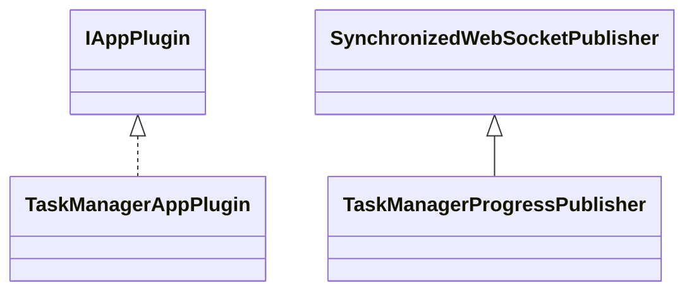

# AppTaskManager.jar

[Group index](README.md) | [All archives](../README.md)

## Scope and provenance

- **Donor:** `SQX_145_REFERENCE_ROOT/internal/plugins/AppTaskManager/AppTaskManager.jar`.
- **SHA-256:** `c6d7819512130bf30f32f2368f0fc64f2532718b71dc0df5d0b2089d1d9db8d7`; accessed 2026-10-06; captured `2026-10-06T18:54:51.906614+00:00`.
- **Classes:** 2 raw entries; 2 unique entry names. Duplicate occurrence indices are zero-based.
- **Inspection:** read-only ZIP hashing and class-file structural parsing; signatures/descriptors, modifiers, hierarchy and references only. Bytecode bodies are hashed, not published.
- **Allocation:** proposed `FEAT-PROJECT-APP-TASK-MANAGER`, P13; [roadmap](../../dev/sqx-full-application-roadmap.md). Domain README registration remains required.
- **Repository:** `01067f00031428613c6394064ca1bcadc1ba00ee`; review state unreviewed. Download label 145-dev1; installed build/activation and runtime equivalence unverified.
- **Limit:** every class/member is inventoried; declaration coverage does not establish consumed calls, defaults, formulas, failure semantics or algorithm parity.
- **Archive/resource index:** [140.json](../../dev/evidence/sqx145/archives/145/140.json).

## Complete member declarations

Member shards contain exact JVM names/descriptors, access flags, generic signatures, throws types, declared fields/methods, superclass/interfaces and referenced class names. All classes, nested/synthetic members and overloads are retained. Code length/hash is structural evidence, not a normalized algorithm comparison.

- [001.json](../../dev/evidence/sqx145/members/140/001.json) — SHA-256 `658cc27ac3b98732f402fbcaa866b8a79cd55681e26fe85bdb3e43ca21478a49`.

## Focused structural diagram

Up to twelve non-nested classes; arrows show declared inheritance/interfaces only. External type names are not evidence of an available body or an executed dependency.

## Class inventory

| Archive entry | Occurrence | Class SHA-256 | Fields | Methods |
| --- | ---: | --- | ---: | ---: |
| `com/strategyquant/plugin/App/impl/TaskManager/TaskManagerAppPlugin.class` | 0 | `773e1708458054894db3826ef9753059c50ce09326596f626bda8c246782a0b6` | 1 | 12 |
| `com/strategyquant/plugin/App/impl/TaskManager/TaskManagerProgressPublisher.class` | 0 | `65a465539ed0d1871e15a621e488aa2b08e87e651e92ee0153b6437dff44cb93` | 3 | 3 |
