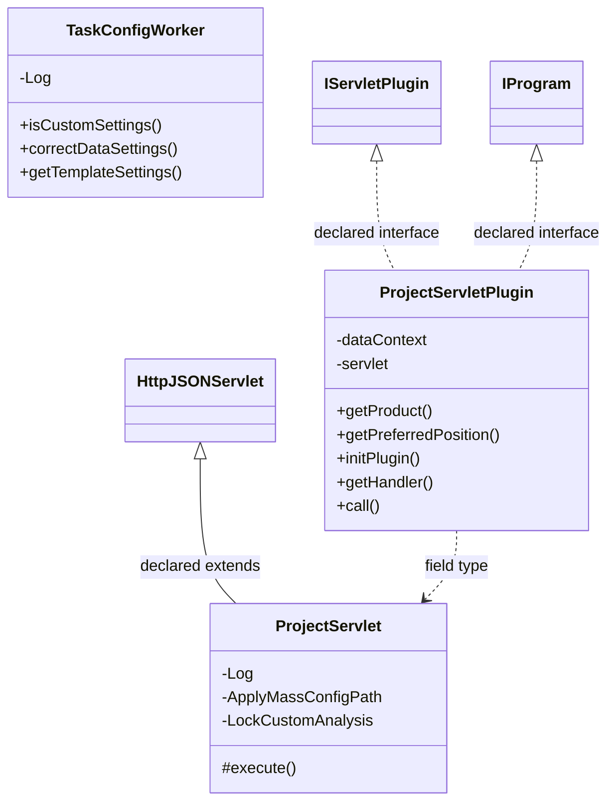

# ServletProject.jar

[Workspace/group index](README.md)  |  [All workspaces](../README.md)

## Scope and provenance

- Artifact: `SQX_REFERENCE_ROOT/internal/plugins/ServletProject/ServletProject.jar`.
- SHA-256: `60935843ba2ddf41a57f589f778c8bda1adbd4ff79a1e0469d9fc7d9f22255c4`.
- Inspected: 2026-10-05; generation timestamp `2026-10-05T19:04:16.344170+00:00`.
- Archive class entries: **13**; non-nested: **3**; nested/anonymous: **10**.
- Inspection: ZIP entry/manifest enumeration and `javap -p` declarations for every listed class.
- Repository source HEAD: `8a92c705183a6702eaf62037ccb202ed028aa899`; review state: generated, pending owner review.
- Installed SQX build number is unverified. No method bodies are reproduced.
- Confidence: high for declared structure; workspace ownership inferred except where registration evidence is separately stated. Runtime reachability, call order, formulas and parity remain unverified.

The `CustomProjects` folder is a navigation/research grouping, not an exclusive backend owner. Shared consumers may use this JAR.

Target mapping: no verified owning HaruQuantAI feature/requirement/decision IDs are assigned by this document. Register or resolve ownership through the normal repository plan before implementation.

## Diagram reading guide

`Parent <|-- Child` means declared inheritance; `Interface <|.. Class` means declared implementation. Interface extension uses the inheritance arrow. `A ..> B : field type` is a declared type dependency, not composition, object ownership or a runtime call. External nodes are referenced types, not fabricated local implementations. Selected fields/method names aid navigation: `+` is public, `#` protected and `-` private. Diagram method names omit parameter/return types and collapse overloads; use the exact inspected declarations below before implementing an API.

Detailed graphs include non-nested classes in package-sized groups of at most 12. Nested/anonymous classes are inventoried and their declarations/relationships are retained below, but omitted from overview graphs. Relationships not drawn for readability remain in the complete declaration-relationship table. Constructors, synthetic bridges and overloads may be collapsed in diagram member lists only. Standard `java.lang.Object` inheritance is omitted from diagrams.

## UML class diagrams

### 1. `com.strategyquant.plugin.Servlet.impl.Project`



| Diagram identifier | Exact type | Location |
| --- | --- | --- |
| `Cbd242b69c7f2` | `com.strategyquant.plugin.Servlet.impl.Project.ProjectServlet` (this JAR) | this diagram |
| `Cf7d433d4af2e` | `com.strategyquant.plugin.Servlet.impl.Project.ProjectServletPlugin` (this JAR) | this diagram |
| `Cdfaf8a4d4638` | `com.strategyquant.plugin.Servlet.impl.Project.TaskConfigWorker` (this JAR) | this diagram |
| `C1b6b4448b67b` | [`com.strategyquant.pluginlib.program.IProgram`](../Shared/SQPluginLib.md) | referenced external type |
| `C249b5c671b1a` | [`com.strategyquant.tradinglib.servlet.IServletPlugin`](../Shared/SQTradingLib.md) | referenced external type |
| `C8900f90ae594` | [`com.strategyquant.webguilib.servlet.HttpJSONServlet`](../Shared/SQWebGUILib.md) | referenced external type |

## Complete class inventory

| Fully qualified class | Kind | Entry |
| --- | --- | --- |
| `com.strategyquant.plugin.Servlet.impl.Project.ProjectServlet` | class | non-nested |
| `com.strategyquant.plugin.Servlet.impl.Project.ProjectServlet$1` | class | nested/anonymous |
| `com.strategyquant.plugin.Servlet.impl.Project.ProjectServlet$10` | class | nested/anonymous |
| `com.strategyquant.plugin.Servlet.impl.Project.ProjectServlet$2` | class | nested/anonymous |
| `com.strategyquant.plugin.Servlet.impl.Project.ProjectServlet$3` | class | nested/anonymous |
| `com.strategyquant.plugin.Servlet.impl.Project.ProjectServlet$4` | class | nested/anonymous |
| `com.strategyquant.plugin.Servlet.impl.Project.ProjectServlet$5` | class | nested/anonymous |
| `com.strategyquant.plugin.Servlet.impl.Project.ProjectServlet$6` | class | nested/anonymous |
| `com.strategyquant.plugin.Servlet.impl.Project.ProjectServlet$7` | class | nested/anonymous |
| `com.strategyquant.plugin.Servlet.impl.Project.ProjectServlet$8` | class | nested/anonymous |
| `com.strategyquant.plugin.Servlet.impl.Project.ProjectServlet$9` | class | nested/anonymous |
| `com.strategyquant.plugin.Servlet.impl.Project.ProjectServletPlugin` | class | non-nested |
| `com.strategyquant.plugin.Servlet.impl.Project.TaskConfigWorker` | class | non-nested |

## Declared relationships and evidence locations

Every row is supported by the named class declaration/member in `javap -p`, inside the artifact recorded above. Signature dependencies may include return, parameter, generic-argument and throws types; they do not imply execution.

| Declaring class | Referenced type | Relationship | Narrow inspection location |
| --- | --- | --- | --- |
| `com.strategyquant.plugin.Servlet.impl.Project.ProjectServlet` | [`com.strategyquant.webguilib.servlet.HttpJSONServlet`](../Shared/SQWebGUILib.md) | extends | `com.strategyquant.plugin.Servlet.impl.Project.ProjectServlet` / class declaration: `public class com.strategyquant.plugin.Servlet.impl.Project.ProjectServlet extends com.strategyquant.webguilib.servlet.HttpJSONServlet` |
| `com.strategyquant.plugin.Servlet.impl.Project.ProjectServlet` | `org.slf4j.Logger` (not resolved in scoped archives) | type dependency | `com.strategyquant.plugin.Servlet.impl.Project.ProjectServlet` / field declaration: `private static final org.slf4j.Logger Log;` |
| `com.strategyquant.plugin.Servlet.impl.Project.ProjectServlet` | `org.slf4j.Logger` (not resolved in scoped archives) | type dependency | `com.strategyquant.plugin.Servlet.impl.Project.ProjectServlet` / method signature: `static org.slf4j.Logger access$100();` |
| `com.strategyquant.plugin.Servlet.impl.Project.ProjectServlet` | `java.lang.String` (not resolved in scoped archives) | type dependency | `com.strategyquant.plugin.Servlet.impl.Project.ProjectServlet` / field declaration: `private static final java.lang.String ApplyMassConfigPath;`<br>`private static final java.lang.String LockCustomAnalysis;` |
| `com.strategyquant.plugin.Servlet.impl.Project.ProjectServlet` | `java.lang.String` (not resolved in scoped archives) | type dependency | `com.strategyquant.plugin.Servlet.impl.Project.ProjectServlet` / method signature: `protected java.lang.String execute(java.lang.String, java.util.Map<java.lang.String, java.lang.String[]>, java.lang.String) throws java.lang.Exception;`<br>`private com.strategyquant.tradinglib.customanalysis.CustomAnalysisInfo getCustomAnalysisInfo(java.util.Map<java.lang.String, java.lang.String[]>) throws java.lang.Exception;`<br>`private java.lang.String onRunCustomAnalysis(java.util.Map<java.lang.String, java.lang.String[]>) throws java.lang.Exception;`<br>`private java.lang.String onSetNote(java.util.Map<java.lang.String, java.lang.String[]>) throws java.lang.Exception;`<br>`private java.lang.String onApplyMassConfig(java.util.Map<java.lang.String, java.lang.String[]>);`<br>`private java.lang.String onApplyMassConfigLoad(java.util.Map<java.lang.String, java.lang.String[]>);`<br>`private java.lang.String onSynchronizeAllDatabanks(java.util.Map<java.lang.String, java.lang.String[]>);`<br>`private java.lang.String onSynchronizeDatabanks(java.util.Map<java.lang.String, java.lang.String[]>) throws java.lang.Exception;`<br>`private java.lang.String onDatabankCount(java.util.Map<java.lang.String, java.lang.String[]>) throws java.lang.Exception;`<br>`private java.lang.String onDatabankList(java.util.Map<java.lang.String, java.lang.String[]>) throws java.lang.Exception;`<br>`private java.lang.String onMoveDatabank(java.util.Map<java.lang.String, java.lang.String[]>) throws java.lang.Exception;`<br>`private java.lang.String onMoveDatabankToPosition(java.util.Map<java.lang.String, java.lang.String[]>) throws java.lang.Exception;`<br>`private java.lang.String onListStrategies(java.util.Map<java.lang.String, java.lang.String[]>) throws java.lang.Exception;`<br>`private java.lang.String onGetStrategyStats(java.util.Map<java.lang.String, java.lang.String[]>) throws java.lang.Exception;`<br>`private java.lang.String onCreateDatabank(java.util.Map<java.lang.String, java.lang.String[]>) throws java.lang.Exception;`<br>`private java.lang.String onRemoveDatabank(java.util.Map<java.lang.String, java.lang.String[]>) throws java.lang.Exception;`<br>`private java.lang.String onRenameDatabank(java.util.Map<java.lang.String, java.lang.String[]>) throws java.lang.Exception;`<br>`private java.lang.String onStart(java.util.Map<java.lang.String, java.lang.String[]>);`<br>`private void updateProjectXMLBeforeStart(com.strategyquant.tradinglib.project.SQProject, java.lang.String, java.lang.String, java.lang.String) throws java.lang.Exception;`<br>`private java.lang.String onResume(java.util.Map<java.lang.String, java.lang.String[]>);`<br>`private java.lang.String onPause(java.util.Map<java.lang.String, java.lang.String[]>);`<br>`private java.lang.String onStop(java.util.Map<java.lang.String, java.lang.String[]>);`<br>`private java.lang.String onProjectChanged(java.util.Map<java.lang.String, java.lang.String[]>) throws java.lang.Exception;`<br>`private java.lang.String onGetRankColumns(java.util.Map<java.lang.String, java.lang.String[]>);`<br>`private java.lang.String onChangeMaxRecords(java.util.Map<java.lang.String, java.lang.String[]>);`<br>`private java.lang.String onLoadFilesToDatabank(java.util.Map<java.lang.String, java.lang.String[]>) throws java.lang.Exception;`<br>`private void loadFiles(com.strategyquant.tradinglib.Databank, java.lang.String[], com.strategyquant.tradinglib.project.SQProject, boolean, java.lang.String);`<br>`private java.lang.String onInstrumentSelected(java.util.Map<java.lang.String, java.lang.String[]>) throws java.lang.Exception;`<br>`private java.lang.String onCancelRecordsLoading(java.util.Map<java.lang.String, java.lang.String[]>);`<br>`private java.lang.String onRemoveReports(java.util.Map<java.lang.String, java.lang.String[]>);`<br>`private java.lang.String onRemoveAllReports(java.util.Map<java.lang.String, java.lang.String[]>);`<br>`private java.lang.String onClearAllDatabanks(java.util.Map<java.lang.String, java.lang.String[]>);`<br>`private java.lang.String onCreatePortfolio(java.util.Map<java.lang.String, java.lang.String[]>);`<br>`private java.lang.String onMergeStrategies(java.util.Map<java.lang.String, java.lang.String[]>);`<br>`private java.lang.String onSplitStrategies(java.util.Map<java.lang.String, java.lang.String[]>);`<br>`private java.lang.String onMoveToPM(java.util.Map<java.lang.String, java.lang.String[]>);`<br>`private java.lang.String onMoveToPC(java.util.Map<java.lang.String, java.lang.String[]>);`<br>`private void createPortfolio(java.util.Map<java.lang.String, java.lang.String[]>);`<br>`private void mergeStrategies(java.util.Map<java.lang.String, java.lang.String[]>);`<br>`private java.lang.String onGetDataItems(java.util.Map<java.lang.String, java.lang.String[]>);`<br>`private java.lang.String onSaveReports(java.util.Map<java.lang.String, java.lang.String[]>);`<br>`private java.lang.String onSaveSingleFileJava(java.util.Map<java.lang.String, java.lang.String[]>);`<br>`private java.lang.String onGetConfig(java.util.Map<java.lang.String, java.lang.String[]>);`<br>`private java.lang.String onCheckResources(java.util.Map<java.lang.String, java.lang.String[]>);`<br>`private java.lang.String onGetTemplateConfig(java.util.Map<java.lang.String, java.lang.String[]>);`<br>`private java.lang.String onLoadConfig(java.util.Map<java.lang.String, java.lang.String[]>);`<br>`private java.lang.String onSaveConfig(java.util.Map<java.lang.String, java.lang.String[]>);`<br>`private org.jdom2.Element prepareTaskConfig(org.jdom2.Element, java.lang.String) throws java.lang.Exception;`<br>`private java.lang.String onUpdateTemplateConfig(java.util.Map<java.lang.String, java.lang.String[]>);`<br>`private java.lang.String onApplySimpleTemplate(java.util.Map<java.lang.String, java.lang.String[]>);`<br>`private java.lang.String onGetCurrentTemplateSettings(java.util.Map<java.lang.String, java.lang.String[]>);`<br>`private java.lang.String onResetTaskConfig(java.util.Map<java.lang.String, java.lang.String[]>);`<br>`private java.io.File getTemplateFile(java.lang.String, boolean) throws java.lang.Exception;`<br>`private synchronized java.lang.String onUpdateTaskXML(java.util.Map<java.lang.String, java.lang.String[]>);`<br>`private synchronized java.lang.String onUpdateProjectXML(java.util.Map<java.lang.String, java.lang.String[]>);`<br>`private com.strategyquant.tradinglib.Databank getDatabank(java.util.Map<java.lang.String, java.lang.String[]>) throws java.lang.Exception;`<br>`private java.lang.String onRetest(java.util.Map<java.lang.String, java.lang.String[]>);`<br>`private java.lang.String onConfirm(java.util.Map<java.lang.String, java.lang.String[]>);`<br>`private java.lang.String onLoadGridData(java.util.Map<java.lang.String, java.lang.String[]>);`<br>`private java.lang.String onSetDatabankColumnValue(java.util.Map<java.lang.String, java.lang.String[]>) throws java.lang.Exception;`<br>`private java.lang.String onSetDatabankSynchronization(java.util.Map<java.lang.String, java.lang.String[]>);`<br>`private java.lang.String onSyncfromfiles(java.util.Map<java.lang.String, java.lang.String[]>);`<br>`private java.lang.String onSynchronizeDatabank(java.util.Map<java.lang.String, java.lang.String[]>);`<br>`private java.lang.String onPrintToLog(java.util.Map<java.lang.String, java.lang.String[]>);`<br>`private java.lang.String onCutStrategies(java.util.Map<java.lang.String, java.lang.String[]>);`<br>`private java.lang.String onCopyStrategies(java.util.Map<java.lang.String, java.lang.String[]>);`<br>`private java.lang.String onPasteStrategies(java.util.Map<java.lang.String, java.lang.String[]>);`<br>`private java.lang.String onResolveResources(java.util.Map<java.lang.String, java.lang.String[]>) throws java.lang.Exception;`<br>`private java.lang.String onCancelResolving();`<br>`private java.lang.String onCheckCustomResources(java.util.Map<java.lang.String, java.lang.String[]>) throws java.lang.Exception;`<br>`private java.lang.String onCheckTemplateResources(java.util.Map<java.lang.String, java.lang.String[]>) throws java.lang.Exception;`<br>`private java.lang.String onResolveCustomResources(java.util.Map<java.lang.String, java.lang.String[]>) throws java.lang.Exception;`<br>`private java.lang.String onStatus(java.util.Map<java.lang.String, java.lang.String[]>) throws java.lang.Exception;`<br>`private java.lang.String onList() throws java.lang.Exception;`<br>`private java.lang.String formatIntOrDouble(double);`<br>`private java.lang.String onMergeWFStrategies(java.util.Map<java.lang.String, java.lang.String[]>);`<br>`private void mergeWFStrategies(java.util.Map<java.lang.String, java.lang.String[]>);`<br>`static void access$000(com.strategyquant.plugin.Servlet.impl.Project.ProjectServlet, com.strategyquant.tradinglib.Databank, java.lang.String[], com.strategyquant.tradinglib.project.SQProject, boolean, java.lang.String);` |
| `com.strategyquant.plugin.Servlet.impl.Project.ProjectServlet` | `com.strategyquant.lib.hw.OperatingSystem` (not resolved in scoped archives) | type dependency | `com.strategyquant.plugin.Servlet.impl.Project.ProjectServlet` / field declaration: `private com.strategyquant.lib.hw.OperatingSystem os;` |
| `com.strategyquant.plugin.Servlet.impl.Project.ProjectServlet` | `java.util.Map` (not resolved in scoped archives) | type dependency | `com.strategyquant.plugin.Servlet.impl.Project.ProjectServlet` / method signature: `protected java.lang.String execute(java.lang.String, java.util.Map<java.lang.String, java.lang.String[]>, java.lang.String) throws java.lang.Exception;`<br>`private com.strategyquant.tradinglib.customanalysis.CustomAnalysisInfo getCustomAnalysisInfo(java.util.Map<java.lang.String, java.lang.String[]>) throws java.lang.Exception;`<br>`private java.lang.String onRunCustomAnalysis(java.util.Map<java.lang.String, java.lang.String[]>) throws java.lang.Exception;`<br>`private java.lang.String onSetNote(java.util.Map<java.lang.String, java.lang.String[]>) throws java.lang.Exception;`<br>`private java.lang.String onApplyMassConfig(java.util.Map<java.lang.String, java.lang.String[]>);`<br>`private java.lang.String onApplyMassConfigLoad(java.util.Map<java.lang.String, java.lang.String[]>);`<br>`private java.lang.String onSynchronizeAllDatabanks(java.util.Map<java.lang.String, java.lang.String[]>);`<br>`private java.lang.String onSynchronizeDatabanks(java.util.Map<java.lang.String, java.lang.String[]>) throws java.lang.Exception;`<br>`private java.lang.String onDatabankCount(java.util.Map<java.lang.String, java.lang.String[]>) throws java.lang.Exception;`<br>`private java.lang.String onDatabankList(java.util.Map<java.lang.String, java.lang.String[]>) throws java.lang.Exception;`<br>`private java.lang.String onMoveDatabank(java.util.Map<java.lang.String, java.lang.String[]>) throws java.lang.Exception;`<br>`private java.lang.String onMoveDatabankToPosition(java.util.Map<java.lang.String, java.lang.String[]>) throws java.lang.Exception;`<br>`private java.lang.String onListStrategies(java.util.Map<java.lang.String, java.lang.String[]>) throws java.lang.Exception;`<br>`private java.lang.String onGetStrategyStats(java.util.Map<java.lang.String, java.lang.String[]>) throws java.lang.Exception;`<br>`private java.lang.String onCreateDatabank(java.util.Map<java.lang.String, java.lang.String[]>) throws java.lang.Exception;`<br>`private java.lang.String onRemoveDatabank(java.util.Map<java.lang.String, java.lang.String[]>) throws java.lang.Exception;`<br>`private java.lang.String onRenameDatabank(java.util.Map<java.lang.String, java.lang.String[]>) throws java.lang.Exception;`<br>`private java.lang.String onStart(java.util.Map<java.lang.String, java.lang.String[]>);`<br>`private java.lang.String onResume(java.util.Map<java.lang.String, java.lang.String[]>);`<br>`private java.lang.String onPause(java.util.Map<java.lang.String, java.lang.String[]>);`<br>`private java.lang.String onStop(java.util.Map<java.lang.String, java.lang.String[]>);`<br>`private java.lang.String onProjectChanged(java.util.Map<java.lang.String, java.lang.String[]>) throws java.lang.Exception;`<br>`private java.lang.String onGetRankColumns(java.util.Map<java.lang.String, java.lang.String[]>);`<br>`private java.lang.String onChangeMaxRecords(java.util.Map<java.lang.String, java.lang.String[]>);`<br>`private java.lang.String onLoadFilesToDatabank(java.util.Map<java.lang.String, java.lang.String[]>) throws java.lang.Exception;`<br>`private java.lang.String onInstrumentSelected(java.util.Map<java.lang.String, java.lang.String[]>) throws java.lang.Exception;`<br>`private java.lang.String onCancelRecordsLoading(java.util.Map<java.lang.String, java.lang.String[]>);`<br>`private java.lang.String onRemoveReports(java.util.Map<java.lang.String, java.lang.String[]>);`<br>`private java.lang.String onRemoveAllReports(java.util.Map<java.lang.String, java.lang.String[]>);`<br>`private java.lang.String onClearAllDatabanks(java.util.Map<java.lang.String, java.lang.String[]>);`<br>`private java.lang.String onCreatePortfolio(java.util.Map<java.lang.String, java.lang.String[]>);`<br>`private java.lang.String onMergeStrategies(java.util.Map<java.lang.String, java.lang.String[]>);`<br>`private java.lang.String onSplitStrategies(java.util.Map<java.lang.String, java.lang.String[]>);`<br>`private java.lang.String onMoveToPM(java.util.Map<java.lang.String, java.lang.String[]>);`<br>`private java.lang.String onMoveToPC(java.util.Map<java.lang.String, java.lang.String[]>);`<br>`private void createPortfolio(java.util.Map<java.lang.String, java.lang.String[]>);`<br>`private void mergeStrategies(java.util.Map<java.lang.String, java.lang.String[]>);`<br>`private java.lang.String onGetDataItems(java.util.Map<java.lang.String, java.lang.String[]>);`<br>`private java.lang.String onSaveReports(java.util.Map<java.lang.String, java.lang.String[]>);`<br>`private java.lang.String onSaveSingleFileJava(java.util.Map<java.lang.String, java.lang.String[]>);`<br>`private java.lang.String onGetConfig(java.util.Map<java.lang.String, java.lang.String[]>);`<br>`private java.lang.String onCheckResources(java.util.Map<java.lang.String, java.lang.String[]>);`<br>`private java.lang.String onGetTemplateConfig(java.util.Map<java.lang.String, java.lang.String[]>);`<br>`private java.lang.String onLoadConfig(java.util.Map<java.lang.String, java.lang.String[]>);`<br>`private java.lang.String onSaveConfig(java.util.Map<java.lang.String, java.lang.String[]>);`<br>`private java.lang.String onUpdateTemplateConfig(java.util.Map<java.lang.String, java.lang.String[]>);`<br>`private java.lang.String onApplySimpleTemplate(java.util.Map<java.lang.String, java.lang.String[]>);`<br>`private java.lang.String onGetCurrentTemplateSettings(java.util.Map<java.lang.String, java.lang.String[]>);`<br>`private java.lang.String onResetTaskConfig(java.util.Map<java.lang.String, java.lang.String[]>);`<br>`private synchronized java.lang.String onUpdateTaskXML(java.util.Map<java.lang.String, java.lang.String[]>);`<br>`private synchronized java.lang.String onUpdateProjectXML(java.util.Map<java.lang.String, java.lang.String[]>);`<br>`private com.strategyquant.tradinglib.Databank getDatabank(java.util.Map<java.lang.String, java.lang.String[]>) throws java.lang.Exception;`<br>`private java.lang.String onRetest(java.util.Map<java.lang.String, java.lang.String[]>);`<br>`private java.lang.String onConfirm(java.util.Map<java.lang.String, java.lang.String[]>);`<br>`private java.lang.String onLoadGridData(java.util.Map<java.lang.String, java.lang.String[]>);`<br>`private java.lang.String onSetDatabankColumnValue(java.util.Map<java.lang.String, java.lang.String[]>) throws java.lang.Exception;`<br>`private java.lang.String onSetDatabankSynchronization(java.util.Map<java.lang.String, java.lang.String[]>);`<br>`private java.lang.String onSyncfromfiles(java.util.Map<java.lang.String, java.lang.String[]>);`<br>`private java.lang.String onSynchronizeDatabank(java.util.Map<java.lang.String, java.lang.String[]>);`<br>`private java.lang.String onPrintToLog(java.util.Map<java.lang.String, java.lang.String[]>);`<br>`private java.lang.String onCutStrategies(java.util.Map<java.lang.String, java.lang.String[]>);`<br>`private java.lang.String onCopyStrategies(java.util.Map<java.lang.String, java.lang.String[]>);`<br>`private java.lang.String onPasteStrategies(java.util.Map<java.lang.String, java.lang.String[]>);`<br>`private java.lang.String onResolveResources(java.util.Map<java.lang.String, java.lang.String[]>) throws java.lang.Exception;`<br>`private java.lang.String onCheckCustomResources(java.util.Map<java.lang.String, java.lang.String[]>) throws java.lang.Exception;`<br>`private java.lang.String onCheckTemplateResources(java.util.Map<java.lang.String, java.lang.String[]>) throws java.lang.Exception;`<br>`private java.lang.String onResolveCustomResources(java.util.Map<java.lang.String, java.lang.String[]>) throws java.lang.Exception;`<br>`private java.lang.String onStatus(java.util.Map<java.lang.String, java.lang.String[]>) throws java.lang.Exception;`<br>`private java.lang.String onMergeWFStrategies(java.util.Map<java.lang.String, java.lang.String[]>);`<br>`private void mergeWFStrategies(java.util.Map<java.lang.String, java.lang.String[]>);`<br>`static void access$200(com.strategyquant.plugin.Servlet.impl.Project.ProjectServlet, java.util.Map);`<br>`static void access$300(com.strategyquant.plugin.Servlet.impl.Project.ProjectServlet, java.util.Map);`<br>`static void access$400(com.strategyquant.plugin.Servlet.impl.Project.ProjectServlet, java.util.Map);` |
| `com.strategyquant.plugin.Servlet.impl.Project.ProjectServlet` | `java.lang.Exception` (not resolved in scoped archives) | type dependency | `com.strategyquant.plugin.Servlet.impl.Project.ProjectServlet` / method signature: `protected java.lang.String execute(java.lang.String, java.util.Map<java.lang.String, java.lang.String[]>, java.lang.String) throws java.lang.Exception;`<br>`private com.strategyquant.tradinglib.customanalysis.CustomAnalysisInfo getCustomAnalysisInfo(java.util.Map<java.lang.String, java.lang.String[]>) throws java.lang.Exception;`<br>`private java.lang.String onRunCustomAnalysis(java.util.Map<java.lang.String, java.lang.String[]>) throws java.lang.Exception;`<br>`private java.lang.String onSetNote(java.util.Map<java.lang.String, java.lang.String[]>) throws java.lang.Exception;`<br>`private java.lang.String onSynchronizeDatabanks(java.util.Map<java.lang.String, java.lang.String[]>) throws java.lang.Exception;`<br>`private java.lang.String onDatabankCount(java.util.Map<java.lang.String, java.lang.String[]>) throws java.lang.Exception;`<br>`private java.lang.String onDatabankList(java.util.Map<java.lang.String, java.lang.String[]>) throws java.lang.Exception;`<br>`private java.lang.String onMoveDatabank(java.util.Map<java.lang.String, java.lang.String[]>) throws java.lang.Exception;`<br>`private java.lang.String onMoveDatabankToPosition(java.util.Map<java.lang.String, java.lang.String[]>) throws java.lang.Exception;`<br>`private java.lang.String onListStrategies(java.util.Map<java.lang.String, java.lang.String[]>) throws java.lang.Exception;`<br>`private java.lang.String onGetStrategyStats(java.util.Map<java.lang.String, java.lang.String[]>) throws java.lang.Exception;`<br>`private java.lang.String onCreateDatabank(java.util.Map<java.lang.String, java.lang.String[]>) throws java.lang.Exception;`<br>`private java.lang.String onRemoveDatabank(java.util.Map<java.lang.String, java.lang.String[]>) throws java.lang.Exception;`<br>`private java.lang.String onRenameDatabank(java.util.Map<java.lang.String, java.lang.String[]>) throws java.lang.Exception;`<br>`private void updateProjectXMLBeforeStart(com.strategyquant.tradinglib.project.SQProject, java.lang.String, java.lang.String, java.lang.String) throws java.lang.Exception;`<br>`private java.lang.String onProjectChanged(java.util.Map<java.lang.String, java.lang.String[]>) throws java.lang.Exception;`<br>`private java.lang.String onLoadFilesToDatabank(java.util.Map<java.lang.String, java.lang.String[]>) throws java.lang.Exception;`<br>`private java.lang.String onInstrumentSelected(java.util.Map<java.lang.String, java.lang.String[]>) throws java.lang.Exception;`<br>`private org.jdom2.Element prepareTaskConfig(org.jdom2.Element, java.lang.String) throws java.lang.Exception;`<br>`private java.io.File getTemplateFile(java.lang.String, boolean) throws java.lang.Exception;`<br>`private com.strategyquant.tradinglib.Databank getDatabank(java.util.Map<java.lang.String, java.lang.String[]>) throws java.lang.Exception;`<br>`private java.lang.String onSetDatabankColumnValue(java.util.Map<java.lang.String, java.lang.String[]>) throws java.lang.Exception;`<br>`private java.lang.String onResolveResources(java.util.Map<java.lang.String, java.lang.String[]>) throws java.lang.Exception;`<br>`private java.lang.String onCheckCustomResources(java.util.Map<java.lang.String, java.lang.String[]>) throws java.lang.Exception;`<br>`private java.lang.String onCheckTemplateResources(java.util.Map<java.lang.String, java.lang.String[]>) throws java.lang.Exception;`<br>`private java.lang.String onResolveCustomResources(java.util.Map<java.lang.String, java.lang.String[]>) throws java.lang.Exception;`<br>`private java.lang.String onStatus(java.util.Map<java.lang.String, java.lang.String[]>) throws java.lang.Exception;`<br>`private java.lang.String onList() throws java.lang.Exception;` |
| `com.strategyquant.plugin.Servlet.impl.Project.ProjectServlet` | [`com.strategyquant.tradinglib.customanalysis.CustomAnalysisInfo`](../Shared/SQTradingLib.md) | type dependency | `com.strategyquant.plugin.Servlet.impl.Project.ProjectServlet` / method signature: `private com.strategyquant.tradinglib.customanalysis.CustomAnalysisInfo getCustomAnalysisInfo(java.util.Map<java.lang.String, java.lang.String[]>) throws java.lang.Exception;` |
| `com.strategyquant.plugin.Servlet.impl.Project.ProjectServlet` | `org.json.JSONArray` (not resolved in scoped archives) | type dependency | `com.strategyquant.plugin.Servlet.impl.Project.ProjectServlet` / method signature: `private org.json.JSONArray listDatabanks(com.strategyquant.tradinglib.project.SQProject);` |
| `com.strategyquant.plugin.Servlet.impl.Project.ProjectServlet` | [`com.strategyquant.tradinglib.project.SQProject`](../Shared/SQTradingLib.md) | type dependency | `com.strategyquant.plugin.Servlet.impl.Project.ProjectServlet` / method signature: `private org.json.JSONArray listDatabanks(com.strategyquant.tradinglib.project.SQProject);`<br>`private void updateProjectXMLBeforeStart(com.strategyquant.tradinglib.project.SQProject, java.lang.String, java.lang.String, java.lang.String) throws java.lang.Exception;`<br>`private void loadFiles(com.strategyquant.tradinglib.Databank, java.lang.String[], com.strategyquant.tradinglib.project.SQProject, boolean, java.lang.String);`<br>`static void access$000(com.strategyquant.plugin.Servlet.impl.Project.ProjectServlet, com.strategyquant.tradinglib.Databank, java.lang.String[], com.strategyquant.tradinglib.project.SQProject, boolean, java.lang.String);` |
| `com.strategyquant.plugin.Servlet.impl.Project.ProjectServlet` | [`com.strategyquant.tradinglib.Databank`](../Shared/SQTradingLib.md) | type dependency | `com.strategyquant.plugin.Servlet.impl.Project.ProjectServlet` / method signature: `private void loadFiles(com.strategyquant.tradinglib.Databank, java.lang.String[], com.strategyquant.tradinglib.project.SQProject, boolean, java.lang.String);`<br>`private com.strategyquant.tradinglib.Databank getDatabank(java.util.Map<java.lang.String, java.lang.String[]>) throws java.lang.Exception;`<br>`static void access$000(com.strategyquant.plugin.Servlet.impl.Project.ProjectServlet, com.strategyquant.tradinglib.Databank, java.lang.String[], com.strategyquant.tradinglib.project.SQProject, boolean, java.lang.String);` |
| `com.strategyquant.plugin.Servlet.impl.Project.ProjectServlet` | `org.jdom2.Element` (not resolved in scoped archives) | type dependency | `com.strategyquant.plugin.Servlet.impl.Project.ProjectServlet` / method signature: `private org.jdom2.Element prepareTaskConfig(org.jdom2.Element, java.lang.String) throws java.lang.Exception;` |
| `com.strategyquant.plugin.Servlet.impl.Project.ProjectServlet` | `java.io.File` (not resolved in scoped archives) | type dependency | `com.strategyquant.plugin.Servlet.impl.Project.ProjectServlet` / method signature: `private java.io.File getTemplateFile(java.lang.String, boolean) throws java.lang.Exception;` |
| `com.strategyquant.plugin.Servlet.impl.Project.ProjectServlet$1` | [`com.strategyquant.tradinglib.databank.IProgressListener`](../Shared/SQTradingLib.md) | implements | `com.strategyquant.plugin.Servlet.impl.Project.ProjectServlet$1` / class declaration: `class com.strategyquant.plugin.Servlet.impl.Project.ProjectServlet$1 implements com.strategyquant.tradinglib.databank.IProgressListener` |
| `com.strategyquant.plugin.Servlet.impl.Project.ProjectServlet$1` | [`com.strategyquant.tradinglib.Databank`](../Shared/SQTradingLib.md) | type dependency | `com.strategyquant.plugin.Servlet.impl.Project.ProjectServlet$1` / field declaration: `final com.strategyquant.tradinglib.Databank val$databank;` |
| `com.strategyquant.plugin.Servlet.impl.Project.ProjectServlet$1` | `com.strategyquant.plugin.Servlet.impl.Project.ProjectServlet` (this JAR) | type dependency | `com.strategyquant.plugin.Servlet.impl.Project.ProjectServlet$1` / field declaration: `final com.strategyquant.plugin.Servlet.impl.Project.ProjectServlet this$0;` |
| `com.strategyquant.plugin.Servlet.impl.Project.ProjectServlet$1` | `java.lang.String` (not resolved in scoped archives) | type dependency | `com.strategyquant.plugin.Servlet.impl.Project.ProjectServlet$1` / method signature: `public void onError(double, java.lang.String);` |
| `com.strategyquant.plugin.Servlet.impl.Project.ProjectServlet$10` | `java.lang.Thread` (not resolved in scoped archives) | extends | `com.strategyquant.plugin.Servlet.impl.Project.ProjectServlet$10` / class declaration: `class com.strategyquant.plugin.Servlet.impl.Project.ProjectServlet$10 extends java.lang.Thread` |
| `com.strategyquant.plugin.Servlet.impl.Project.ProjectServlet$10` | `java.util.Map` (not resolved in scoped archives) | type dependency | `com.strategyquant.plugin.Servlet.impl.Project.ProjectServlet$10` / field declaration: `final java.util.Map val$parameterMap;` |
| `com.strategyquant.plugin.Servlet.impl.Project.ProjectServlet$10` | `java.util.Map` (not resolved in scoped archives) | type dependency | `com.strategyquant.plugin.Servlet.impl.Project.ProjectServlet$10` / method signature: `com.strategyquant.plugin.Servlet.impl.Project.ProjectServlet$10(com.strategyquant.plugin.Servlet.impl.Project.ProjectServlet, java.util.Map);` |
| `com.strategyquant.plugin.Servlet.impl.Project.ProjectServlet$10` | `com.strategyquant.plugin.Servlet.impl.Project.ProjectServlet` (this JAR) | type dependency | `com.strategyquant.plugin.Servlet.impl.Project.ProjectServlet$10` / field declaration: `final com.strategyquant.plugin.Servlet.impl.Project.ProjectServlet this$0;` |
| `com.strategyquant.plugin.Servlet.impl.Project.ProjectServlet$10` | `com.strategyquant.plugin.Servlet.impl.Project.ProjectServlet` (this JAR) | type dependency | `com.strategyquant.plugin.Servlet.impl.Project.ProjectServlet$10` / method signature: `com.strategyquant.plugin.Servlet.impl.Project.ProjectServlet$10(com.strategyquant.plugin.Servlet.impl.Project.ProjectServlet, java.util.Map);` |
| `com.strategyquant.plugin.Servlet.impl.Project.ProjectServlet$2` | [`com.strategyquant.tradinglib.databank.IProgressListener`](../Shared/SQTradingLib.md) | implements | `com.strategyquant.plugin.Servlet.impl.Project.ProjectServlet$2` / class declaration: `class com.strategyquant.plugin.Servlet.impl.Project.ProjectServlet$2 implements com.strategyquant.tradinglib.databank.IProgressListener` |
| `com.strategyquant.plugin.Servlet.impl.Project.ProjectServlet$2` | [`com.strategyquant.tradinglib.project.SQProject`](../Shared/SQTradingLib.md) | type dependency | `com.strategyquant.plugin.Servlet.impl.Project.ProjectServlet$2` / field declaration: `final com.strategyquant.tradinglib.project.SQProject val$project;` |
| `com.strategyquant.plugin.Servlet.impl.Project.ProjectServlet$2` | [`com.strategyquant.tradinglib.Databank`](../Shared/SQTradingLib.md) | type dependency | `com.strategyquant.plugin.Servlet.impl.Project.ProjectServlet$2` / field declaration: `final com.strategyquant.tradinglib.Databank val$databank;` |
| `com.strategyquant.plugin.Servlet.impl.Project.ProjectServlet$2` | `com.strategyquant.plugin.Servlet.impl.Project.ProjectServlet` (this JAR) | type dependency | `com.strategyquant.plugin.Servlet.impl.Project.ProjectServlet$2` / field declaration: `final com.strategyquant.plugin.Servlet.impl.Project.ProjectServlet this$0;` |
| `com.strategyquant.plugin.Servlet.impl.Project.ProjectServlet$2` | `java.lang.String` (not resolved in scoped archives) | type dependency | `com.strategyquant.plugin.Servlet.impl.Project.ProjectServlet$2` / method signature: `public void onError(double, java.lang.String);` |
| `com.strategyquant.plugin.Servlet.impl.Project.ProjectServlet$3` | `java.lang.Thread` (not resolved in scoped archives) | extends | `com.strategyquant.plugin.Servlet.impl.Project.ProjectServlet$3` / class declaration: `class com.strategyquant.plugin.Servlet.impl.Project.ProjectServlet$3 extends java.lang.Thread` |
| `com.strategyquant.plugin.Servlet.impl.Project.ProjectServlet$3` | [`com.strategyquant.tradinglib.Databank`](../Shared/SQTradingLib.md) | type dependency | `com.strategyquant.plugin.Servlet.impl.Project.ProjectServlet$3` / field declaration: `final com.strategyquant.tradinglib.Databank val$databank;` |
| `com.strategyquant.plugin.Servlet.impl.Project.ProjectServlet$3` | [`com.strategyquant.tradinglib.Databank`](../Shared/SQTradingLib.md) | type dependency | `com.strategyquant.plugin.Servlet.impl.Project.ProjectServlet$3` / method signature: `com.strategyquant.plugin.Servlet.impl.Project.ProjectServlet$3(com.strategyquant.plugin.Servlet.impl.Project.ProjectServlet, com.strategyquant.tradinglib.Databank, java.lang.String[], com.strategyquant.tradinglib.project.SQProject, boolean);` |
| `com.strategyquant.plugin.Servlet.impl.Project.ProjectServlet$3` | `java.lang.String` (not resolved in scoped archives) | type dependency | `com.strategyquant.plugin.Servlet.impl.Project.ProjectServlet$3` / field declaration: `final java.lang.String[] val$p;` |
| `com.strategyquant.plugin.Servlet.impl.Project.ProjectServlet$3` | `java.lang.String` (not resolved in scoped archives) | type dependency | `com.strategyquant.plugin.Servlet.impl.Project.ProjectServlet$3` / method signature: `com.strategyquant.plugin.Servlet.impl.Project.ProjectServlet$3(com.strategyquant.plugin.Servlet.impl.Project.ProjectServlet, com.strategyquant.tradinglib.Databank, java.lang.String[], com.strategyquant.tradinglib.project.SQProject, boolean);` |
| `com.strategyquant.plugin.Servlet.impl.Project.ProjectServlet$3` | [`com.strategyquant.tradinglib.project.SQProject`](../Shared/SQTradingLib.md) | type dependency | `com.strategyquant.plugin.Servlet.impl.Project.ProjectServlet$3` / field declaration: `final com.strategyquant.tradinglib.project.SQProject val$project;` |
| `com.strategyquant.plugin.Servlet.impl.Project.ProjectServlet$3` | [`com.strategyquant.tradinglib.project.SQProject`](../Shared/SQTradingLib.md) | type dependency | `com.strategyquant.plugin.Servlet.impl.Project.ProjectServlet$3` / method signature: `com.strategyquant.plugin.Servlet.impl.Project.ProjectServlet$3(com.strategyquant.plugin.Servlet.impl.Project.ProjectServlet, com.strategyquant.tradinglib.Databank, java.lang.String[], com.strategyquant.tradinglib.project.SQProject, boolean);` |
| `com.strategyquant.plugin.Servlet.impl.Project.ProjectServlet$3` | `com.strategyquant.plugin.Servlet.impl.Project.ProjectServlet` (this JAR) | type dependency | `com.strategyquant.plugin.Servlet.impl.Project.ProjectServlet$3` / field declaration: `final com.strategyquant.plugin.Servlet.impl.Project.ProjectServlet this$0;` |
| `com.strategyquant.plugin.Servlet.impl.Project.ProjectServlet$3` | `com.strategyquant.plugin.Servlet.impl.Project.ProjectServlet` (this JAR) | type dependency | `com.strategyquant.plugin.Servlet.impl.Project.ProjectServlet$3` / method signature: `com.strategyquant.plugin.Servlet.impl.Project.ProjectServlet$3(com.strategyquant.plugin.Servlet.impl.Project.ProjectServlet, com.strategyquant.tradinglib.Databank, java.lang.String[], com.strategyquant.tradinglib.project.SQProject, boolean);` |
| `com.strategyquant.plugin.Servlet.impl.Project.ProjectServlet$4` | `java.lang.Thread` (not resolved in scoped archives) | extends | `com.strategyquant.plugin.Servlet.impl.Project.ProjectServlet$4` / class declaration: `class com.strategyquant.plugin.Servlet.impl.Project.ProjectServlet$4 extends java.lang.Thread` |
| `com.strategyquant.plugin.Servlet.impl.Project.ProjectServlet$4` | `java.util.Map` (not resolved in scoped archives) | type dependency | `com.strategyquant.plugin.Servlet.impl.Project.ProjectServlet$4` / field declaration: `final java.util.Map val$parameterMap;` |
| `com.strategyquant.plugin.Servlet.impl.Project.ProjectServlet$4` | `java.util.Map` (not resolved in scoped archives) | type dependency | `com.strategyquant.plugin.Servlet.impl.Project.ProjectServlet$4` / method signature: `com.strategyquant.plugin.Servlet.impl.Project.ProjectServlet$4(com.strategyquant.plugin.Servlet.impl.Project.ProjectServlet, java.util.Map);` |
| `com.strategyquant.plugin.Servlet.impl.Project.ProjectServlet$4` | `com.strategyquant.plugin.Servlet.impl.Project.ProjectServlet` (this JAR) | type dependency | `com.strategyquant.plugin.Servlet.impl.Project.ProjectServlet$4` / field declaration: `final com.strategyquant.plugin.Servlet.impl.Project.ProjectServlet this$0;` |
| `com.strategyquant.plugin.Servlet.impl.Project.ProjectServlet$4` | `com.strategyquant.plugin.Servlet.impl.Project.ProjectServlet` (this JAR) | type dependency | `com.strategyquant.plugin.Servlet.impl.Project.ProjectServlet$4` / method signature: `com.strategyquant.plugin.Servlet.impl.Project.ProjectServlet$4(com.strategyquant.plugin.Servlet.impl.Project.ProjectServlet, java.util.Map);` |
| `com.strategyquant.plugin.Servlet.impl.Project.ProjectServlet$5` | `java.lang.Thread` (not resolved in scoped archives) | extends | `com.strategyquant.plugin.Servlet.impl.Project.ProjectServlet$5` / class declaration: `class com.strategyquant.plugin.Servlet.impl.Project.ProjectServlet$5 extends java.lang.Thread` |
| `com.strategyquant.plugin.Servlet.impl.Project.ProjectServlet$5` | `java.util.Map` (not resolved in scoped archives) | type dependency | `com.strategyquant.plugin.Servlet.impl.Project.ProjectServlet$5` / field declaration: `final java.util.Map val$parameterMap;` |
| `com.strategyquant.plugin.Servlet.impl.Project.ProjectServlet$5` | `java.util.Map` (not resolved in scoped archives) | type dependency | `com.strategyquant.plugin.Servlet.impl.Project.ProjectServlet$5` / method signature: `com.strategyquant.plugin.Servlet.impl.Project.ProjectServlet$5(com.strategyquant.plugin.Servlet.impl.Project.ProjectServlet, java.util.Map);` |
| `com.strategyquant.plugin.Servlet.impl.Project.ProjectServlet$5` | `com.strategyquant.plugin.Servlet.impl.Project.ProjectServlet` (this JAR) | type dependency | `com.strategyquant.plugin.Servlet.impl.Project.ProjectServlet$5` / field declaration: `final com.strategyquant.plugin.Servlet.impl.Project.ProjectServlet this$0;` |
| `com.strategyquant.plugin.Servlet.impl.Project.ProjectServlet$5` | `com.strategyquant.plugin.Servlet.impl.Project.ProjectServlet` (this JAR) | type dependency | `com.strategyquant.plugin.Servlet.impl.Project.ProjectServlet$5` / method signature: `com.strategyquant.plugin.Servlet.impl.Project.ProjectServlet$5(com.strategyquant.plugin.Servlet.impl.Project.ProjectServlet, java.util.Map);` |
| `com.strategyquant.plugin.Servlet.impl.Project.ProjectServlet$6` | `java.lang.Thread` (not resolved in scoped archives) | extends | `com.strategyquant.plugin.Servlet.impl.Project.ProjectServlet$6` / class declaration: `class com.strategyquant.plugin.Servlet.impl.Project.ProjectServlet$6 extends java.lang.Thread` |
| `com.strategyquant.plugin.Servlet.impl.Project.ProjectServlet$6` | [`com.strategyquant.tradinglib.project.SQProject`](../Shared/SQTradingLib.md) | type dependency | `com.strategyquant.plugin.Servlet.impl.Project.ProjectServlet$6` / field declaration: `final com.strategyquant.tradinglib.project.SQProject val$tgtProject;`<br>`final com.strategyquant.tradinglib.project.SQProject val$srcProject;` |
| `com.strategyquant.plugin.Servlet.impl.Project.ProjectServlet$6` | [`com.strategyquant.tradinglib.project.SQProject`](../Shared/SQTradingLib.md) | type dependency | `com.strategyquant.plugin.Servlet.impl.Project.ProjectServlet$6` / method signature: `com.strategyquant.plugin.Servlet.impl.Project.ProjectServlet$6(com.strategyquant.plugin.Servlet.impl.Project.ProjectServlet, com.strategyquant.tradinglib.project.SQProject, com.strategyquant.tradinglib.project.SQProject, boolean, com.strategyquant.tradinglib.Databank, com.strategyquant.tradinglib.Databank, java.lang.String[]);` |
| `com.strategyquant.plugin.Servlet.impl.Project.ProjectServlet$6` | [`com.strategyquant.tradinglib.Databank`](../Shared/SQTradingLib.md) | type dependency | `com.strategyquant.plugin.Servlet.impl.Project.ProjectServlet$6` / field declaration: `final com.strategyquant.tradinglib.Databank val$srcDatabank;`<br>`final com.strategyquant.tradinglib.Databank val$tgtDatabank;` |
| `com.strategyquant.plugin.Servlet.impl.Project.ProjectServlet$6` | [`com.strategyquant.tradinglib.Databank`](../Shared/SQTradingLib.md) | type dependency | `com.strategyquant.plugin.Servlet.impl.Project.ProjectServlet$6` / method signature: `com.strategyquant.plugin.Servlet.impl.Project.ProjectServlet$6(com.strategyquant.plugin.Servlet.impl.Project.ProjectServlet, com.strategyquant.tradinglib.project.SQProject, com.strategyquant.tradinglib.project.SQProject, boolean, com.strategyquant.tradinglib.Databank, com.strategyquant.tradinglib.Databank, java.lang.String[]);` |
| `com.strategyquant.plugin.Servlet.impl.Project.ProjectServlet$6` | `java.lang.String` (not resolved in scoped archives) | type dependency | `com.strategyquant.plugin.Servlet.impl.Project.ProjectServlet$6` / field declaration: `final java.lang.String[] val$strategiesArray;` |
| `com.strategyquant.plugin.Servlet.impl.Project.ProjectServlet$6` | `java.lang.String` (not resolved in scoped archives) | type dependency | `com.strategyquant.plugin.Servlet.impl.Project.ProjectServlet$6` / method signature: `com.strategyquant.plugin.Servlet.impl.Project.ProjectServlet$6(com.strategyquant.plugin.Servlet.impl.Project.ProjectServlet, com.strategyquant.tradinglib.project.SQProject, com.strategyquant.tradinglib.project.SQProject, boolean, com.strategyquant.tradinglib.Databank, com.strategyquant.tradinglib.Databank, java.lang.String[]);` |
| `com.strategyquant.plugin.Servlet.impl.Project.ProjectServlet$6` | `com.strategyquant.plugin.Servlet.impl.Project.ProjectServlet` (this JAR) | type dependency | `com.strategyquant.plugin.Servlet.impl.Project.ProjectServlet$6` / field declaration: `final com.strategyquant.plugin.Servlet.impl.Project.ProjectServlet this$0;` |
| `com.strategyquant.plugin.Servlet.impl.Project.ProjectServlet$6` | `com.strategyquant.plugin.Servlet.impl.Project.ProjectServlet` (this JAR) | type dependency | `com.strategyquant.plugin.Servlet.impl.Project.ProjectServlet$6` / method signature: `com.strategyquant.plugin.Servlet.impl.Project.ProjectServlet$6(com.strategyquant.plugin.Servlet.impl.Project.ProjectServlet, com.strategyquant.tradinglib.project.SQProject, com.strategyquant.tradinglib.project.SQProject, boolean, com.strategyquant.tradinglib.Databank, com.strategyquant.tradinglib.Databank, java.lang.String[]);` |
| `com.strategyquant.plugin.Servlet.impl.Project.ProjectServlet$7` | `java.lang.Thread` (not resolved in scoped archives) | extends | `com.strategyquant.plugin.Servlet.impl.Project.ProjectServlet$7` / class declaration: `class com.strategyquant.plugin.Servlet.impl.Project.ProjectServlet$7 extends java.lang.Thread` |
| `com.strategyquant.plugin.Servlet.impl.Project.ProjectServlet$7` | [`com.strategyquant.tradinglib.project.SQProject`](../Shared/SQTradingLib.md) | type dependency | `com.strategyquant.plugin.Servlet.impl.Project.ProjectServlet$7` / field declaration: `final com.strategyquant.tradinglib.project.SQProject val$tgtProject;`<br>`final com.strategyquant.tradinglib.project.SQProject val$srcProject;` |
| `com.strategyquant.plugin.Servlet.impl.Project.ProjectServlet$7` | [`com.strategyquant.tradinglib.project.SQProject`](../Shared/SQTradingLib.md) | type dependency | `com.strategyquant.plugin.Servlet.impl.Project.ProjectServlet$7` / method signature: `com.strategyquant.plugin.Servlet.impl.Project.ProjectServlet$7(com.strategyquant.plugin.Servlet.impl.Project.ProjectServlet, com.strategyquant.tradinglib.project.SQProject, com.strategyquant.tradinglib.project.SQProject, boolean, com.strategyquant.tradinglib.Databank, com.strategyquant.tradinglib.Databank, java.lang.String[]);` |
| `com.strategyquant.plugin.Servlet.impl.Project.ProjectServlet$7` | [`com.strategyquant.tradinglib.Databank`](../Shared/SQTradingLib.md) | type dependency | `com.strategyquant.plugin.Servlet.impl.Project.ProjectServlet$7` / field declaration: `final com.strategyquant.tradinglib.Databank val$srcDatabank;`<br>`final com.strategyquant.tradinglib.Databank val$tgtDatabank;` |
| `com.strategyquant.plugin.Servlet.impl.Project.ProjectServlet$7` | [`com.strategyquant.tradinglib.Databank`](../Shared/SQTradingLib.md) | type dependency | `com.strategyquant.plugin.Servlet.impl.Project.ProjectServlet$7` / method signature: `com.strategyquant.plugin.Servlet.impl.Project.ProjectServlet$7(com.strategyquant.plugin.Servlet.impl.Project.ProjectServlet, com.strategyquant.tradinglib.project.SQProject, com.strategyquant.tradinglib.project.SQProject, boolean, com.strategyquant.tradinglib.Databank, com.strategyquant.tradinglib.Databank, java.lang.String[]);` |
| `com.strategyquant.plugin.Servlet.impl.Project.ProjectServlet$7` | `java.lang.String` (not resolved in scoped archives) | type dependency | `com.strategyquant.plugin.Servlet.impl.Project.ProjectServlet$7` / field declaration: `final java.lang.String[] val$strategiesArray;` |
| `com.strategyquant.plugin.Servlet.impl.Project.ProjectServlet$7` | `java.lang.String` (not resolved in scoped archives) | type dependency | `com.strategyquant.plugin.Servlet.impl.Project.ProjectServlet$7` / method signature: `com.strategyquant.plugin.Servlet.impl.Project.ProjectServlet$7(com.strategyquant.plugin.Servlet.impl.Project.ProjectServlet, com.strategyquant.tradinglib.project.SQProject, com.strategyquant.tradinglib.project.SQProject, boolean, com.strategyquant.tradinglib.Databank, com.strategyquant.tradinglib.Databank, java.lang.String[]);` |
| `com.strategyquant.plugin.Servlet.impl.Project.ProjectServlet$7` | `com.strategyquant.plugin.Servlet.impl.Project.ProjectServlet` (this JAR) | type dependency | `com.strategyquant.plugin.Servlet.impl.Project.ProjectServlet$7` / field declaration: `final com.strategyquant.plugin.Servlet.impl.Project.ProjectServlet this$0;` |
| `com.strategyquant.plugin.Servlet.impl.Project.ProjectServlet$7` | `com.strategyquant.plugin.Servlet.impl.Project.ProjectServlet` (this JAR) | type dependency | `com.strategyquant.plugin.Servlet.impl.Project.ProjectServlet$7` / method signature: `com.strategyquant.plugin.Servlet.impl.Project.ProjectServlet$7(com.strategyquant.plugin.Servlet.impl.Project.ProjectServlet, com.strategyquant.tradinglib.project.SQProject, com.strategyquant.tradinglib.project.SQProject, boolean, com.strategyquant.tradinglib.Databank, com.strategyquant.tradinglib.Databank, java.lang.String[]);` |
| `com.strategyquant.plugin.Servlet.impl.Project.ProjectServlet$8` | `java.lang.Thread` (not resolved in scoped archives) | extends | `com.strategyquant.plugin.Servlet.impl.Project.ProjectServlet$8` / class declaration: `class com.strategyquant.plugin.Servlet.impl.Project.ProjectServlet$8 extends java.lang.Thread` |
| `com.strategyquant.plugin.Servlet.impl.Project.ProjectServlet$8` | [`com.strategyquant.tradinglib.project.SQProject`](../Shared/SQTradingLib.md) | type dependency | `com.strategyquant.plugin.Servlet.impl.Project.ProjectServlet$8` / field declaration: `final com.strategyquant.tradinglib.project.SQProject val$retesterProject;`<br>`final com.strategyquant.tradinglib.project.SQProject val$srcProject;` |
| `com.strategyquant.plugin.Servlet.impl.Project.ProjectServlet$8` | [`com.strategyquant.tradinglib.project.SQProject`](../Shared/SQTradingLib.md) | type dependency | `com.strategyquant.plugin.Servlet.impl.Project.ProjectServlet$8` / method signature: `com.strategyquant.plugin.Servlet.impl.Project.ProjectServlet$8(com.strategyquant.plugin.Servlet.impl.Project.ProjectServlet, com.strategyquant.tradinglib.project.SQProject, com.strategyquant.tradinglib.project.SQProject, boolean, com.strategyquant.tradinglib.Databank, boolean, com.strategyquant.tradinglib.Databank, java.lang.String[]);` |
| `com.strategyquant.plugin.Servlet.impl.Project.ProjectServlet$8` | [`com.strategyquant.tradinglib.Databank`](../Shared/SQTradingLib.md) | type dependency | `com.strategyquant.plugin.Servlet.impl.Project.ProjectServlet$8` / field declaration: `final com.strategyquant.tradinglib.Databank val$srcDatabank;`<br>`final com.strategyquant.tradinglib.Databank val$retesterDatabank;` |
| `com.strategyquant.plugin.Servlet.impl.Project.ProjectServlet$8` | [`com.strategyquant.tradinglib.Databank`](../Shared/SQTradingLib.md) | type dependency | `com.strategyquant.plugin.Servlet.impl.Project.ProjectServlet$8` / method signature: `com.strategyquant.plugin.Servlet.impl.Project.ProjectServlet$8(com.strategyquant.plugin.Servlet.impl.Project.ProjectServlet, com.strategyquant.tradinglib.project.SQProject, com.strategyquant.tradinglib.project.SQProject, boolean, com.strategyquant.tradinglib.Databank, boolean, com.strategyquant.tradinglib.Databank, java.lang.String[]);` |
| `com.strategyquant.plugin.Servlet.impl.Project.ProjectServlet$8` | `java.lang.String` (not resolved in scoped archives) | type dependency | `com.strategyquant.plugin.Servlet.impl.Project.ProjectServlet$8` / field declaration: `final java.lang.String[] val$strategiesArray;` |
| `com.strategyquant.plugin.Servlet.impl.Project.ProjectServlet$8` | `java.lang.String` (not resolved in scoped archives) | type dependency | `com.strategyquant.plugin.Servlet.impl.Project.ProjectServlet$8` / method signature: `com.strategyquant.plugin.Servlet.impl.Project.ProjectServlet$8(com.strategyquant.plugin.Servlet.impl.Project.ProjectServlet, com.strategyquant.tradinglib.project.SQProject, com.strategyquant.tradinglib.project.SQProject, boolean, com.strategyquant.tradinglib.Databank, boolean, com.strategyquant.tradinglib.Databank, java.lang.String[]);` |
| `com.strategyquant.plugin.Servlet.impl.Project.ProjectServlet$8` | `com.strategyquant.plugin.Servlet.impl.Project.ProjectServlet` (this JAR) | type dependency | `com.strategyquant.plugin.Servlet.impl.Project.ProjectServlet$8` / field declaration: `final com.strategyquant.plugin.Servlet.impl.Project.ProjectServlet this$0;` |
| `com.strategyquant.plugin.Servlet.impl.Project.ProjectServlet$8` | `com.strategyquant.plugin.Servlet.impl.Project.ProjectServlet` (this JAR) | type dependency | `com.strategyquant.plugin.Servlet.impl.Project.ProjectServlet$8` / method signature: `com.strategyquant.plugin.Servlet.impl.Project.ProjectServlet$8(com.strategyquant.plugin.Servlet.impl.Project.ProjectServlet, com.strategyquant.tradinglib.project.SQProject, com.strategyquant.tradinglib.project.SQProject, boolean, com.strategyquant.tradinglib.Databank, boolean, com.strategyquant.tradinglib.Databank, java.lang.String[]);` |
| `com.strategyquant.plugin.Servlet.impl.Project.ProjectServlet$9` | [`com.strategyquant.tradinglib.databank.IProgressListener`](../Shared/SQTradingLib.md) | implements | `com.strategyquant.plugin.Servlet.impl.Project.ProjectServlet$9` / class declaration: `class com.strategyquant.plugin.Servlet.impl.Project.ProjectServlet$9 implements com.strategyquant.tradinglib.databank.IProgressListener` |
| `com.strategyquant.plugin.Servlet.impl.Project.ProjectServlet$9` | [`com.strategyquant.tradinglib.Databank`](../Shared/SQTradingLib.md) | type dependency | `com.strategyquant.plugin.Servlet.impl.Project.ProjectServlet$9` / field declaration: `final com.strategyquant.tradinglib.Databank val$databank;` |
| `com.strategyquant.plugin.Servlet.impl.Project.ProjectServlet$9` | `com.strategyquant.plugin.Servlet.impl.Project.ProjectServlet` (this JAR) | type dependency | `com.strategyquant.plugin.Servlet.impl.Project.ProjectServlet$9` / field declaration: `final com.strategyquant.plugin.Servlet.impl.Project.ProjectServlet this$0;` |
| `com.strategyquant.plugin.Servlet.impl.Project.ProjectServlet$9` | `java.lang.String` (not resolved in scoped archives) | type dependency | `com.strategyquant.plugin.Servlet.impl.Project.ProjectServlet$9` / method signature: `public void onError(double, java.lang.String);` |
| `com.strategyquant.plugin.Servlet.impl.Project.ProjectServletPlugin` | [`com.strategyquant.tradinglib.servlet.IServletPlugin`](../Shared/SQTradingLib.md) | implements | `com.strategyquant.plugin.Servlet.impl.Project.ProjectServletPlugin` / class declaration: `public class com.strategyquant.plugin.Servlet.impl.Project.ProjectServletPlugin implements com.strategyquant.tradinglib.servlet.IServletPlugin,com.strategyquant.pluginlib.program.IProgram` |
| `com.strategyquant.plugin.Servlet.impl.Project.ProjectServletPlugin` | [`com.strategyquant.pluginlib.program.IProgram`](../Shared/SQPluginLib.md) | implements | `com.strategyquant.plugin.Servlet.impl.Project.ProjectServletPlugin` / class declaration: `public class com.strategyquant.plugin.Servlet.impl.Project.ProjectServletPlugin implements com.strategyquant.tradinglib.servlet.IServletPlugin,com.strategyquant.pluginlib.program.IProgram` |
| `com.strategyquant.plugin.Servlet.impl.Project.ProjectServletPlugin` | `org.eclipse.jetty.servlet.ServletContextHandler` (not resolved in scoped archives) | type dependency | `com.strategyquant.plugin.Servlet.impl.Project.ProjectServletPlugin` / field declaration: `private org.eclipse.jetty.servlet.ServletContextHandler dataContext;` |
| `com.strategyquant.plugin.Servlet.impl.Project.ProjectServletPlugin` | `com.strategyquant.plugin.Servlet.impl.Project.ProjectServlet` (this JAR) | type dependency | `com.strategyquant.plugin.Servlet.impl.Project.ProjectServletPlugin` / field declaration: `private com.strategyquant.plugin.Servlet.impl.Project.ProjectServlet servlet;` |
| `com.strategyquant.plugin.Servlet.impl.Project.ProjectServletPlugin` | `java.lang.String` (not resolved in scoped archives) | type dependency | `com.strategyquant.plugin.Servlet.impl.Project.ProjectServletPlugin` / method signature: `public java.lang.String getProduct();`<br>`public java.lang.Object call(java.lang.String, java.lang.Object...) throws java.lang.Exception;` |
| `com.strategyquant.plugin.Servlet.impl.Project.ProjectServletPlugin` | `java.lang.Exception` (not resolved in scoped archives) | type dependency | `com.strategyquant.plugin.Servlet.impl.Project.ProjectServletPlugin` / method signature: `public void initPlugin() throws java.lang.Exception;`<br>`public java.lang.Object call(java.lang.String, java.lang.Object...) throws java.lang.Exception;` |
| `com.strategyquant.plugin.Servlet.impl.Project.ProjectServletPlugin` | `org.eclipse.jetty.server.Handler` (not resolved in scoped archives) | type dependency | `com.strategyquant.plugin.Servlet.impl.Project.ProjectServletPlugin` / method signature: `public org.eclipse.jetty.server.Handler getHandler();` |
| `com.strategyquant.plugin.Servlet.impl.Project.ProjectServletPlugin` | `java.lang.Object` (not resolved in scoped archives) | type dependency | `com.strategyquant.plugin.Servlet.impl.Project.ProjectServletPlugin` / method signature: `public java.lang.Object call(java.lang.String, java.lang.Object...) throws java.lang.Exception;` |
| `com.strategyquant.plugin.Servlet.impl.Project.TaskConfigWorker` | `org.slf4j.Logger` (not resolved in scoped archives) | type dependency | `com.strategyquant.plugin.Servlet.impl.Project.TaskConfigWorker` / field declaration: `private static final org.slf4j.Logger Log;` |
| `com.strategyquant.plugin.Servlet.impl.Project.TaskConfigWorker` | `java.lang.String` (not resolved in scoped archives) | type dependency | `com.strategyquant.plugin.Servlet.impl.Project.TaskConfigWorker` / method signature: `public static boolean isCustomSettings(java.lang.String, org.jdom2.Element) throws java.lang.Exception;`<br>`public static void correctDataSettings(org.jdom2.Element, java.lang.String) throws java.lang.Exception;`<br>`private static void addDefaultChart(org.jdom2.Element, com.strategyquant.datalib.DataInfo, java.lang.String) throws java.lang.Exception;`<br>`public static org.jdom2.Element getTemplateSettings(java.lang.String) throws java.lang.Exception;` |
| `com.strategyquant.plugin.Servlet.impl.Project.TaskConfigWorker` | `org.jdom2.Element` (not resolved in scoped archives) | type dependency | `com.strategyquant.plugin.Servlet.impl.Project.TaskConfigWorker` / method signature: `public static boolean isCustomSettings(java.lang.String, org.jdom2.Element) throws java.lang.Exception;`<br>`public static void correctDataSettings(org.jdom2.Element, java.lang.String) throws java.lang.Exception;`<br>`private static void addDefaultChart(org.jdom2.Element, com.strategyquant.datalib.DataInfo, java.lang.String) throws java.lang.Exception;`<br>`public static org.jdom2.Element getTemplateSettings(java.lang.String) throws java.lang.Exception;` |
| `com.strategyquant.plugin.Servlet.impl.Project.TaskConfigWorker` | `java.lang.Exception` (not resolved in scoped archives) | type dependency | `com.strategyquant.plugin.Servlet.impl.Project.TaskConfigWorker` / method signature: `public static boolean isCustomSettings(java.lang.String, org.jdom2.Element) throws java.lang.Exception;`<br>`public static void correctDataSettings(org.jdom2.Element, java.lang.String) throws java.lang.Exception;`<br>`private static void addDefaultChart(org.jdom2.Element, com.strategyquant.datalib.DataInfo, java.lang.String) throws java.lang.Exception;`<br>`public static org.jdom2.Element getTemplateSettings(java.lang.String) throws java.lang.Exception;` |
| `com.strategyquant.plugin.Servlet.impl.Project.TaskConfigWorker` | [`com.strategyquant.datalib.DataInfo`](../Shared/SQDataLib.md) | type dependency | `com.strategyquant.plugin.Servlet.impl.Project.TaskConfigWorker` / method signature: `private static void addDefaultChart(org.jdom2.Element, com.strategyquant.datalib.DataInfo, java.lang.String) throws java.lang.Exception;` |

## Inspected declaration reference

These are structural API/member declarations, not proprietary implementation bodies. Private members and nested classes are retained to make diagram omissions explicit; declarations do not prove behavior.

<details>
<summary>com.strategyquant.plugin.Servlet.impl.Project.ProjectServlet</summary>

```text
public class com.strategyquant.plugin.Servlet.impl.Project.ProjectServlet extends com.strategyquant.webguilib.servlet.HttpJSONServlet
    private static final org.slf4j.Logger Log;
    private static final java.lang.String ApplyMassConfigPath;
    private static final java.lang.String LockCustomAnalysis;
    private com.strategyquant.lib.hw.OperatingSystem os;
    public com.strategyquant.plugin.Servlet.impl.Project.ProjectServlet();
    protected java.lang.String execute(java.lang.String, java.util.Map<java.lang.String, java.lang.String[]>, java.lang.String) throws java.lang.Exception;
    private com.strategyquant.tradinglib.customanalysis.CustomAnalysisInfo getCustomAnalysisInfo(java.util.Map<java.lang.String, java.lang.String[]>) throws java.lang.Exception;
    private java.lang.String onRunCustomAnalysis(java.util.Map<java.lang.String, java.lang.String[]>) throws java.lang.Exception;
    private java.lang.String onSetNote(java.util.Map<java.lang.String, java.lang.String[]>) throws java.lang.Exception;
    private java.lang.String onApplyMassConfig(java.util.Map<java.lang.String, java.lang.String[]>);
    private java.lang.String onApplyMassConfigLoad(java.util.Map<java.lang.String, java.lang.String[]>);
    private java.lang.String onSynchronizeAllDatabanks(java.util.Map<java.lang.String, java.lang.String[]>);
    private java.lang.String onSynchronizeDatabanks(java.util.Map<java.lang.String, java.lang.String[]>) throws java.lang.Exception;
    private java.lang.String onDatabankCount(java.util.Map<java.lang.String, java.lang.String[]>) throws java.lang.Exception;
    private java.lang.String onDatabankList(java.util.Map<java.lang.String, java.lang.String[]>) throws java.lang.Exception;
    private java.lang.String onMoveDatabank(java.util.Map<java.lang.String, java.lang.String[]>) throws java.lang.Exception;
    private java.lang.String onMoveDatabankToPosition(java.util.Map<java.lang.String, java.lang.String[]>) throws java.lang.Exception;
    private org.json.JSONArray listDatabanks(com.strategyquant.tradinglib.project.SQProject);
    private java.lang.String onListStrategies(java.util.Map<java.lang.String, java.lang.String[]>) throws java.lang.Exception;
    private java.lang.String onGetStrategyStats(java.util.Map<java.lang.String, java.lang.String[]>) throws java.lang.Exception;
    private java.lang.String onCreateDatabank(java.util.Map<java.lang.String, java.lang.String[]>) throws java.lang.Exception;
    private java.lang.String onRemoveDatabank(java.util.Map<java.lang.String, java.lang.String[]>) throws java.lang.Exception;
    private java.lang.String onRenameDatabank(java.util.Map<java.lang.String, java.lang.String[]>) throws java.lang.Exception;
    private java.lang.String onStart(java.util.Map<java.lang.String, java.lang.String[]>);
    private void updateProjectXMLBeforeStart(com.strategyquant.tradinglib.project.SQProject, java.lang.String, java.lang.String, java.lang.String) throws java.lang.Exception;
    private java.lang.String onResume(java.util.Map<java.lang.String, java.lang.String[]>);
    private java.lang.String onPause(java.util.Map<java.lang.String, java.lang.String[]>);
    private java.lang.String onStop(java.util.Map<java.lang.String, java.lang.String[]>);
    private java.lang.String onProjectChanged(java.util.Map<java.lang.String, java.lang.String[]>) throws java.lang.Exception;
    private java.lang.String onGetRankColumns(java.util.Map<java.lang.String, java.lang.String[]>);
    private java.lang.String onChangeMaxRecords(java.util.Map<java.lang.String, java.lang.String[]>);
    private java.lang.String onLoadFilesToDatabank(java.util.Map<java.lang.String, java.lang.String[]>) throws java.lang.Exception;
    private void loadFiles(com.strategyquant.tradinglib.Databank, java.lang.String[], com.strategyquant.tradinglib.project.SQProject, boolean, java.lang.String);
    private java.lang.String onInstrumentSelected(java.util.Map<java.lang.String, java.lang.String[]>) throws java.lang.Exception;
    private java.lang.String onCancelRecordsLoading(java.util.Map<java.lang.String, java.lang.String[]>);
    private java.lang.String onRemoveReports(java.util.Map<java.lang.String, java.lang.String[]>);
    private java.lang.String onRemoveAllReports(java.util.Map<java.lang.String, java.lang.String[]>);
    private java.lang.String onClearAllDatabanks(java.util.Map<java.lang.String, java.lang.String[]>);
    private java.lang.String onCreatePortfolio(java.util.Map<java.lang.String, java.lang.String[]>);
    private java.lang.String onMergeStrategies(java.util.Map<java.lang.String, java.lang.String[]>);
    private java.lang.String onSplitStrategies(java.util.Map<java.lang.String, java.lang.String[]>);
    private java.lang.String onMoveToPM(java.util.Map<java.lang.String, java.lang.String[]>);
    private java.lang.String onMoveToPC(java.util.Map<java.lang.String, java.lang.String[]>);
    private void createPortfolio(java.util.Map<java.lang.String, java.lang.String[]>);
    private void mergeStrategies(java.util.Map<java.lang.String, java.lang.String[]>);
    private java.lang.String onGetDataItems(java.util.Map<java.lang.String, java.lang.String[]>);
    private java.lang.String onSaveReports(java.util.Map<java.lang.String, java.lang.String[]>);
    private java.lang.String onSaveSingleFileJava(java.util.Map<java.lang.String, java.lang.String[]>);
    private java.lang.String onGetConfig(java.util.Map<java.lang.String, java.lang.String[]>);
    private java.lang.String onCheckResources(java.util.Map<java.lang.String, java.lang.String[]>);
    private java.lang.String onGetTemplateConfig(java.util.Map<java.lang.String, java.lang.String[]>);
    private java.lang.String onLoadConfig(java.util.Map<java.lang.String, java.lang.String[]>);
    private java.lang.String onSaveConfig(java.util.Map<java.lang.String, java.lang.String[]>);
    private org.jdom2.Element prepareTaskConfig(org.jdom2.Element, java.lang.String) throws java.lang.Exception;
    private java.lang.String onUpdateTemplateConfig(java.util.Map<java.lang.String, java.lang.String[]>);
    private java.lang.String onApplySimpleTemplate(java.util.Map<java.lang.String, java.lang.String[]>);
    private java.lang.String onGetCurrentTemplateSettings(java.util.Map<java.lang.String, java.lang.String[]>);
    private java.lang.String onResetTaskConfig(java.util.Map<java.lang.String, java.lang.String[]>);
    private java.io.File getTemplateFile(java.lang.String, boolean) throws java.lang.Exception;
    private synchronized java.lang.String onUpdateTaskXML(java.util.Map<java.lang.String, java.lang.String[]>);
    private synchronized java.lang.String onUpdateProjectXML(java.util.Map<java.lang.String, java.lang.String[]>);
    private com.strategyquant.tradinglib.Databank getDatabank(java.util.Map<java.lang.String, java.lang.String[]>) throws java.lang.Exception;
    private java.lang.String onRetest(java.util.Map<java.lang.String, java.lang.String[]>);
    private java.lang.String onConfirm(java.util.Map<java.lang.String, java.lang.String[]>);
    private java.lang.String onLoadGridData(java.util.Map<java.lang.String, java.lang.String[]>);
    private java.lang.String onSetDatabankColumnValue(java.util.Map<java.lang.String, java.lang.String[]>) throws java.lang.Exception;
    private java.lang.String onSetDatabankSynchronization(java.util.Map<java.lang.String, java.lang.String[]>);
    private java.lang.String onSyncfromfiles(java.util.Map<java.lang.String, java.lang.String[]>);
    private java.lang.String onSynchronizeDatabank(java.util.Map<java.lang.String, java.lang.String[]>);
    private java.lang.String onPrintToLog(java.util.Map<java.lang.String, java.lang.String[]>);
    private java.lang.String onCutStrategies(java.util.Map<java.lang.String, java.lang.String[]>);
    private java.lang.String onCopyStrategies(java.util.Map<java.lang.String, java.lang.String[]>);
    private java.lang.String onPasteStrategies(java.util.Map<java.lang.String, java.lang.String[]>);
    private java.lang.String onResolveResources(java.util.Map<java.lang.String, java.lang.String[]>) throws java.lang.Exception;
    private java.lang.String onCancelResolving();
    private java.lang.String onCheckCustomResources(java.util.Map<java.lang.String, java.lang.String[]>) throws java.lang.Exception;
    private java.lang.String onCheckTemplateResources(java.util.Map<java.lang.String, java.lang.String[]>) throws java.lang.Exception;
    private java.lang.String onResolveCustomResources(java.util.Map<java.lang.String, java.lang.String[]>) throws java.lang.Exception;
    private java.lang.String onStatus(java.util.Map<java.lang.String, java.lang.String[]>) throws java.lang.Exception;
    private java.lang.String onList() throws java.lang.Exception;
    private java.lang.String formatIntOrDouble(double);
    private java.lang.String onMergeWFStrategies(java.util.Map<java.lang.String, java.lang.String[]>);
    private void mergeWFStrategies(java.util.Map<java.lang.String, java.lang.String[]>);
    static void access$000(com.strategyquant.plugin.Servlet.impl.Project.ProjectServlet, com.strategyquant.tradinglib.Databank, java.lang.String[], com.strategyquant.tradinglib.project.SQProject, boolean, java.lang.String);
    static org.slf4j.Logger access$100();
    static void access$200(com.strategyquant.plugin.Servlet.impl.Project.ProjectServlet, java.util.Map);
    static void access$300(com.strategyquant.plugin.Servlet.impl.Project.ProjectServlet, java.util.Map);
    static void access$400(com.strategyquant.plugin.Servlet.impl.Project.ProjectServlet, java.util.Map);
```

</details>

<details>
<summary>com.strategyquant.plugin.Servlet.impl.Project.ProjectServlet$1</summary>

```text
class com.strategyquant.plugin.Servlet.impl.Project.ProjectServlet$1 implements com.strategyquant.tradinglib.databank.IProgressListener
    final com.strategyquant.tradinglib.Databank val$databank;
    final com.strategyquant.plugin.Servlet.impl.Project.ProjectServlet this$0;
    com.strategyquant.plugin.Servlet.impl.Project.ProjectServlet$1();
    public void onError(double, java.lang.String);
    public void onDone();
    public void onProgress(double);
```

</details>

<details>
<summary>com.strategyquant.plugin.Servlet.impl.Project.ProjectServlet$10</summary>

```text
class com.strategyquant.plugin.Servlet.impl.Project.ProjectServlet$10 extends java.lang.Thread
    final java.util.Map val$parameterMap;
    final com.strategyquant.plugin.Servlet.impl.Project.ProjectServlet this$0;
    com.strategyquant.plugin.Servlet.impl.Project.ProjectServlet$10(com.strategyquant.plugin.Servlet.impl.Project.ProjectServlet, java.util.Map);
    public void run();
```

</details>

<details>
<summary>com.strategyquant.plugin.Servlet.impl.Project.ProjectServlet$2</summary>

```text
class com.strategyquant.plugin.Servlet.impl.Project.ProjectServlet$2 implements com.strategyquant.tradinglib.databank.IProgressListener
    final com.strategyquant.tradinglib.project.SQProject val$project;
    final com.strategyquant.tradinglib.Databank val$databank;
    final com.strategyquant.plugin.Servlet.impl.Project.ProjectServlet this$0;
    com.strategyquant.plugin.Servlet.impl.Project.ProjectServlet$2();
    public void onProgress(double);
    public void onError(double, java.lang.String);
    public void onDone();
```

</details>

<details>
<summary>com.strategyquant.plugin.Servlet.impl.Project.ProjectServlet$3</summary>

```text
class com.strategyquant.plugin.Servlet.impl.Project.ProjectServlet$3 extends java.lang.Thread
    final com.strategyquant.tradinglib.Databank val$databank;
    final java.lang.String[] val$p;
    final com.strategyquant.tradinglib.project.SQProject val$project;
    final boolean val$clear;
    final com.strategyquant.plugin.Servlet.impl.Project.ProjectServlet this$0;
    com.strategyquant.plugin.Servlet.impl.Project.ProjectServlet$3(com.strategyquant.plugin.Servlet.impl.Project.ProjectServlet, com.strategyquant.tradinglib.Databank, java.lang.String[], com.strategyquant.tradinglib.project.SQProject, boolean);
    public void run();
```

</details>

<details>
<summary>com.strategyquant.plugin.Servlet.impl.Project.ProjectServlet$4</summary>

```text
class com.strategyquant.plugin.Servlet.impl.Project.ProjectServlet$4 extends java.lang.Thread
    final java.util.Map val$parameterMap;
    final com.strategyquant.plugin.Servlet.impl.Project.ProjectServlet this$0;
    com.strategyquant.plugin.Servlet.impl.Project.ProjectServlet$4(com.strategyquant.plugin.Servlet.impl.Project.ProjectServlet, java.util.Map);
    public void run();
```

</details>

<details>
<summary>com.strategyquant.plugin.Servlet.impl.Project.ProjectServlet$5</summary>

```text
class com.strategyquant.plugin.Servlet.impl.Project.ProjectServlet$5 extends java.lang.Thread
    final java.util.Map val$parameterMap;
    final com.strategyquant.plugin.Servlet.impl.Project.ProjectServlet this$0;
    com.strategyquant.plugin.Servlet.impl.Project.ProjectServlet$5(com.strategyquant.plugin.Servlet.impl.Project.ProjectServlet, java.util.Map);
    public void run();
```

</details>

<details>
<summary>com.strategyquant.plugin.Servlet.impl.Project.ProjectServlet$6</summary>

```text
class com.strategyquant.plugin.Servlet.impl.Project.ProjectServlet$6 extends java.lang.Thread
    final com.strategyquant.tradinglib.project.SQProject val$tgtProject;
    final com.strategyquant.tradinglib.project.SQProject val$srcProject;
    final boolean val$takeAllStrategies;
    final com.strategyquant.tradinglib.Databank val$srcDatabank;
    final com.strategyquant.tradinglib.Databank val$tgtDatabank;
    final java.lang.String[] val$strategiesArray;
    final com.strategyquant.plugin.Servlet.impl.Project.ProjectServlet this$0;
    com.strategyquant.plugin.Servlet.impl.Project.ProjectServlet$6(com.strategyquant.plugin.Servlet.impl.Project.ProjectServlet, com.strategyquant.tradinglib.project.SQProject, com.strategyquant.tradinglib.project.SQProject, boolean, com.strategyquant.tradinglib.Databank, com.strategyquant.tradinglib.Databank, java.lang.String[]);
    public void run();
```

</details>

<details>
<summary>com.strategyquant.plugin.Servlet.impl.Project.ProjectServlet$7</summary>

```text
class com.strategyquant.plugin.Servlet.impl.Project.ProjectServlet$7 extends java.lang.Thread
    final com.strategyquant.tradinglib.project.SQProject val$tgtProject;
    final com.strategyquant.tradinglib.project.SQProject val$srcProject;
    final boolean val$takeAllStrategies;
    final com.strategyquant.tradinglib.Databank val$srcDatabank;
    final com.strategyquant.tradinglib.Databank val$tgtDatabank;
    final java.lang.String[] val$strategiesArray;
    final com.strategyquant.plugin.Servlet.impl.Project.ProjectServlet this$0;
    com.strategyquant.plugin.Servlet.impl.Project.ProjectServlet$7(com.strategyquant.plugin.Servlet.impl.Project.ProjectServlet, com.strategyquant.tradinglib.project.SQProject, com.strategyquant.tradinglib.project.SQProject, boolean, com.strategyquant.tradinglib.Databank, com.strategyquant.tradinglib.Databank, java.lang.String[]);
    public void run();
```

</details>

<details>
<summary>com.strategyquant.plugin.Servlet.impl.Project.ProjectServlet$8</summary>

```text
class com.strategyquant.plugin.Servlet.impl.Project.ProjectServlet$8 extends java.lang.Thread
    final com.strategyquant.tradinglib.project.SQProject val$retesterProject;
    final com.strategyquant.tradinglib.project.SQProject val$srcProject;
    final boolean val$takeAllStrategies;
    final com.strategyquant.tradinglib.Databank val$srcDatabank;
    final boolean val$move;
    final com.strategyquant.tradinglib.Databank val$retesterDatabank;
    final java.lang.String[] val$strategiesArray;
    final com.strategyquant.plugin.Servlet.impl.Project.ProjectServlet this$0;
    com.strategyquant.plugin.Servlet.impl.Project.ProjectServlet$8(com.strategyquant.plugin.Servlet.impl.Project.ProjectServlet, com.strategyquant.tradinglib.project.SQProject, com.strategyquant.tradinglib.project.SQProject, boolean, com.strategyquant.tradinglib.Databank, boolean, com.strategyquant.tradinglib.Databank, java.lang.String[]);
    public void run();
```

</details>

<details>
<summary>com.strategyquant.plugin.Servlet.impl.Project.ProjectServlet$9</summary>

```text
class com.strategyquant.plugin.Servlet.impl.Project.ProjectServlet$9 implements com.strategyquant.tradinglib.databank.IProgressListener
    final com.strategyquant.tradinglib.Databank val$databank;
    final com.strategyquant.plugin.Servlet.impl.Project.ProjectServlet this$0;
    com.strategyquant.plugin.Servlet.impl.Project.ProjectServlet$9();
    public void onError(double, java.lang.String);
    public void onDone();
    public void onProgress(double);
```

</details>

<details>
<summary>com.strategyquant.plugin.Servlet.impl.Project.ProjectServletPlugin</summary>

```text
public class com.strategyquant.plugin.Servlet.impl.Project.ProjectServletPlugin implements com.strategyquant.tradinglib.servlet.IServletPlugin,com.strategyquant.pluginlib.program.IProgram
    private org.eclipse.jetty.servlet.ServletContextHandler dataContext;
    private com.strategyquant.plugin.Servlet.impl.Project.ProjectServlet servlet;
    public com.strategyquant.plugin.Servlet.impl.Project.ProjectServletPlugin();
    public java.lang.String getProduct();
    public int getPreferredPosition();
    public void initPlugin() throws java.lang.Exception;
    public org.eclipse.jetty.server.Handler getHandler();
    public java.lang.Object call(java.lang.String, java.lang.Object...) throws java.lang.Exception;
```

</details>

<details>
<summary>com.strategyquant.plugin.Servlet.impl.Project.TaskConfigWorker</summary>

```text
public class com.strategyquant.plugin.Servlet.impl.Project.TaskConfigWorker
    private static final org.slf4j.Logger Log;
    public com.strategyquant.plugin.Servlet.impl.Project.TaskConfigWorker();
    public static boolean isCustomSettings(java.lang.String, org.jdom2.Element) throws java.lang.Exception;
    public static void correctDataSettings(org.jdom2.Element, java.lang.String) throws java.lang.Exception;
    private static void addDefaultChart(org.jdom2.Element, com.strategyquant.datalib.DataInfo, java.lang.String) throws java.lang.Exception;
    public static org.jdom2.Element getTemplateSettings(java.lang.String) throws java.lang.Exception;
```

</details>

## Validation and unresolved gaps

Archive hash and complete class inventory were checked against the inspected local artifact. Declaration extraction accounts for every inventoried class. Documentation/link/diagram structural verification is recorded in the master index and task walkthrough; no SQX runtime validation was performed.

The canonical reimplementation ledger/schema are absent, so no evidence IDs or validation-passed ledger claims are created. This is a donor structural reference. Exact behavior, default values, failure semantics, algorithms, runtime calls and target architectural choices require separate research. No aggregation/composition or cardinalities are inferred.
