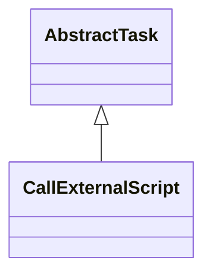

# TaskCallExternalScript.jar

[Group index](README.md) | [All archives](../README.md)

## Scope and provenance

- **Donor:** `SQX_145_REFERENCE_ROOT/internal/plugins/TaskCallExternalScript/TaskCallExternalScript.jar`.
- **SHA-256:** `487d4460de5659572b1d9cb6f3d34e4b29593c428f97bf9af4847fab5199c46f`; accessed 2026-10-06; captured `2026-10-06T18:54:51.906614+00:00`.
- **Classes:** 2 raw entries; 2 unique entry names. Duplicate occurrence indices are zero-based.
- **Inspection:** read-only ZIP hashing and class-file structural parsing; signatures/descriptors, modifiers, hierarchy and references only. Bytecode bodies are hashed, not published.
- **Allocation:** proposed `FEAT-PROJECT-TASK-CALL-EXTERNAL-SCRIPT`, P13; [roadmap](../../dev/sqx-full-application-roadmap.md). Domain README registration remains required.
- **Repository:** `01067f00031428613c6394064ca1bcadc1ba00ee`; review state unreviewed. Download label 145-dev1; installed build/activation and runtime equivalence unverified.
- **Limit:** every class/member is inventoried; declaration coverage does not establish consumed calls, defaults, formulas, failure semantics or algorithm parity.
- **Archive/resource index:** [271.json](../../dev/evidence/sqx145/archives/145/271.json).

## Complete member declarations

Member shards contain exact JVM names/descriptors, access flags, generic signatures, throws types, declared fields/methods, superclass/interfaces and referenced class names. All classes, nested/synthetic members and overloads are retained. Code length/hash is structural evidence, not a normalized algorithm comparison.

- [001.json](../../dev/evidence/sqx145/members/271/001.json) — SHA-256 `fa913e7b53d3f3dfb29025ace4ca2d108ae1a5da1c04fac3bd05e5c810ae05cb`.

## Focused structural diagram

Up to twelve non-nested classes; arrows show declared inheritance/interfaces only. External type names are not evidence of an available body or an executed dependency.

## Class inventory

| Archive entry | Occurrence | Class SHA-256 | Fields | Methods |
| --- | ---: | --- | ---: | ---: |
| `com/strategyquant/plugin/Task/impl/CallExternalScript/CallExternalScript$1.class` | 0 | `418dbb5be8c406a3e449df50287ef96b611326611985c6e92bcea62a03719e65` | 1 | 2 |
| `com/strategyquant/plugin/Task/impl/CallExternalScript/CallExternalScript.class` | 0 | `6c5a4de777d18fad4af61408b1b5947dec35133d75ed365c0df277ca74063ae0` | 4 | 15 |
