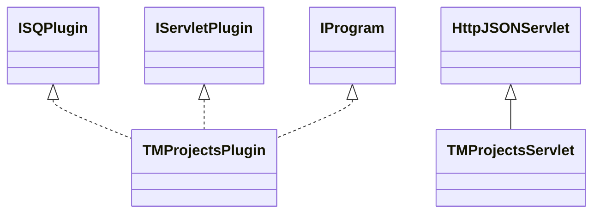

# TaskManagerProjects.jar

[Group index](README.md) | [All archives](../README.md)

## Scope and provenance

- **Donor:** `SQX_145_REFERENCE_ROOT/internal/plugins/TaskManagerProjects/TaskManagerProjects.jar`.
- **SHA-256:** `f63173a05008c4ec13ffafd8cb7d21cdf5d7fc24acb6c1191c80b8d0eb3896d5`; accessed 2026-10-06; captured `2026-10-06T18:54:51.906614+00:00`.
- **Classes:** 2 raw entries; 2 unique entry names. Duplicate occurrence indices are zero-based.
- **Inspection:** read-only ZIP hashing and class-file structural parsing; signatures/descriptors, modifiers, hierarchy and references only. Bytecode bodies are hashed, not published.
- **Allocation:** proposed `FEAT-PROJECT-TASK-MANAGER-PROJECTS`, P13; [roadmap](../../dev/sqx-full-application-roadmap.md). Domain README registration remains required.
- **Repository:** `01067f00031428613c6394064ca1bcadc1ba00ee`; review state unreviewed. Download label 145-dev1; installed build/activation and runtime equivalence unverified.
- **Limit:** every class/member is inventoried; declaration coverage does not establish consumed calls, defaults, formulas, failure semantics or algorithm parity.
- **Archive/resource index:** [280.json](../../dev/evidence/sqx145/archives/145/280.json).

## Complete member declarations

Member shards contain exact JVM names/descriptors, access flags, generic signatures, throws types, declared fields/methods, superclass/interfaces and referenced class names. All classes, nested/synthetic members and overloads are retained. Code length/hash is structural evidence, not a normalized algorithm comparison.

- [001.json](../../dev/evidence/sqx145/members/280/001.json) — SHA-256 `c7ecc0d50a6f2dd4cc37373f210c42aa48801f8aabbac282db06c3e46b964b41`.

## Focused structural diagram

Up to twelve non-nested classes; arrows show declared inheritance/interfaces only. External type names are not evidence of an available body or an executed dependency.

## Class inventory

| Archive entry | Occurrence | Class SHA-256 | Fields | Methods |
| --- | ---: | --- | ---: | ---: |
| `com/strategyquant/plugin/TaskManager/impl/Projects/TMProjectsPlugin.class` | 0 | `2bc72229c16724be19c6b572e601764aaf3851735a0b161e22c4ddc3b1a120c0` | 3 | 7 |
| `com/strategyquant/plugin/TaskManager/impl/Projects/TMProjectsServlet.class` | 0 | `4fe21b8fffb3d3b7221a6a7240198327d300eb01a45ee40641558c43db389684` | 4 | 28 |
