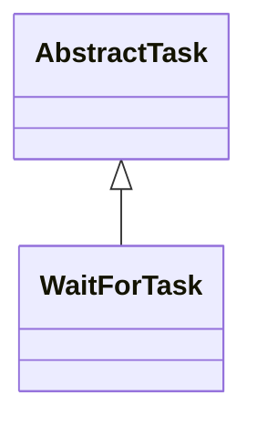

# TaskWaitFor.jar

[Group index](README.md) | [All archives](../README.md)

## Scope and provenance

- **Donor:** `SQX_145_REFERENCE_ROOT/internal/plugins/TaskWaitFor/TaskWaitFor.jar`.
- **SHA-256:** `46957acd37eca2a2feb6b322230f323955380e952ab45d626dc47f52436ce7f8`; accessed 2026-10-06; captured `2026-10-06T18:54:51.906614+00:00`.
- **Classes:** 2 raw entries; 2 unique entry names. Duplicate occurrence indices are zero-based.
- **Inspection:** read-only ZIP hashing and class-file structural parsing; signatures/descriptors, modifiers, hierarchy and references only. Bytecode bodies are hashed, not published.
- **Allocation:** proposed `FEAT-PROJECT-TASK-WAIT-FOR`, P13; [roadmap](../../dev/sqx-full-application-roadmap.md). Domain README registration remains required.
- **Repository:** `01067f00031428613c6394064ca1bcadc1ba00ee`; review state unreviewed. Download label 145-dev1; installed build/activation and runtime equivalence unverified.
- **Limit:** every class/member is inventoried; declaration coverage does not establish consumed calls, defaults, formulas, failure semantics or algorithm parity.
- **Archive/resource index:** [288.json](../../dev/evidence/sqx145/archives/145/288.json).

## Complete member declarations

Member shards contain exact JVM names/descriptors, access flags, generic signatures, throws types, declared fields/methods, superclass/interfaces and referenced class names. All classes, nested/synthetic members and overloads are retained. Code length/hash is structural evidence, not a normalized algorithm comparison.

- [001.json](../../dev/evidence/sqx145/members/288/001.json) — SHA-256 `be6f222f01bb940400f5a4fef03f256b0a0a724628e49c866861104b75791660`.

## Focused structural diagram

Up to twelve non-nested classes; arrows show declared inheritance/interfaces only. External type names are not evidence of an available body or an executed dependency.

## Class inventory

| Archive entry | Occurrence | Class SHA-256 | Fields | Methods |
| --- | ---: | --- | ---: | ---: |
| `com/strategyquant/plugin/Task/impl/WaitFor/WaitForTask$1.class` | 0 | `9bebd6a1f71b1d5b84c8f69c6d9258416d0754c8084aa38c2b067509a1e21ab2` | 2 | 2 |
| `com/strategyquant/plugin/Task/impl/WaitFor/WaitForTask.class` | 0 | `a9bd2d1856b4a3863869d683d20278fe69dda4dc56dcd167a0f2eadaaa8bebb8` | 3 | 17 |
