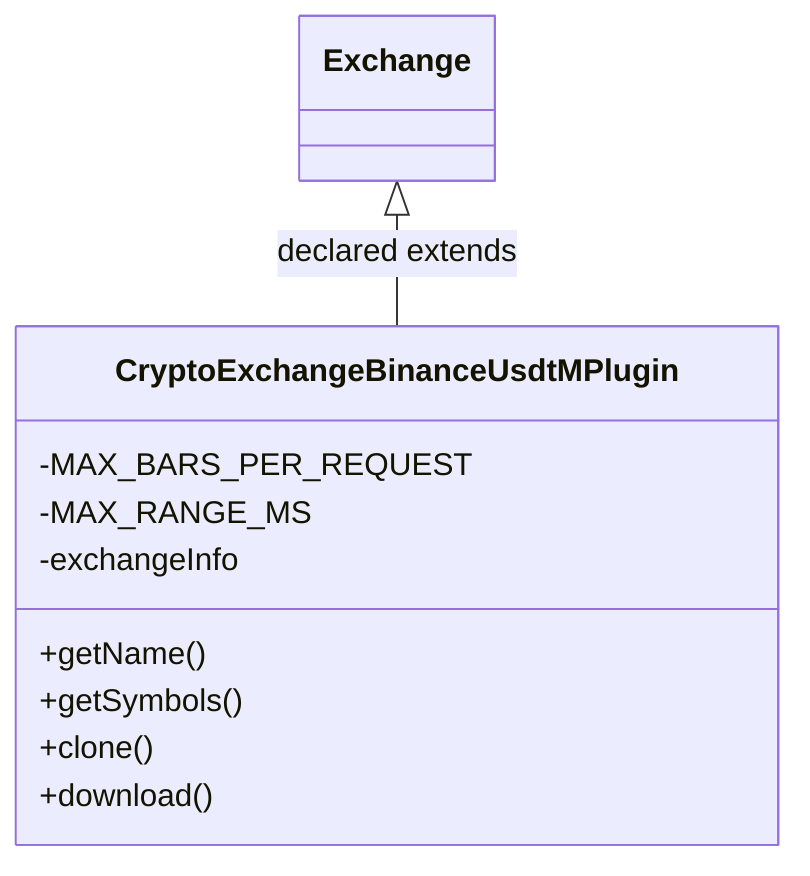

# CryptoExchangeBinanceUsdtM.jar

[Workspace/group index](README.md)  |  [All workspaces](../README.md)

## Scope and provenance

- Artifact: `SQX_REFERENCE_ROOT/internal/plugins/CryptoExchangeBinanceUsdtM/CryptoExchangeBinanceUsdtM.jar`.
- SHA-256: `9f5fbc9dd3f23b21979f1e678d09e7bdef50aed3cf2d6d82ac94ec0b62837724`.
- Inspected: 2026-10-05; generation timestamp `2026-10-05T19:04:16.344170+00:00`.
- Archive class entries: **2**; non-nested: **1**; nested/anonymous: **1**.
- Inspection: ZIP entry/manifest enumeration and `javap -p` declarations for every listed class.
- Repository source HEAD: `8a92c705183a6702eaf62037ccb202ed028aa899`; review state: generated, pending owner review.
- Installed SQX build number is unverified. No method bodies are reproduced.
- Confidence: high for declared structure; workspace ownership inferred except where registration evidence is separately stated. Runtime reachability, call order, formulas and parity remain unverified.

The `DataManager` folder is a navigation/research grouping, not an exclusive backend owner. Shared consumers may use this JAR.

Target mapping: no verified owning HaruQuantAI feature/requirement/decision IDs are assigned by this document. Register or resolve ownership through the normal repository plan before implementation.

## Diagram reading guide

`Parent <|-- Child` means declared inheritance; `Interface <|.. Class` means declared implementation. Interface extension uses the inheritance arrow. `A ..> B : field type` is a declared type dependency, not composition, object ownership or a runtime call. External nodes are referenced types, not fabricated local implementations. Selected fields/method names aid navigation: `+` is public, `#` protected and `-` private. Diagram method names omit parameter/return types and collapse overloads; use the exact inspected declarations below before implementing an API.

Detailed graphs include non-nested classes in package-sized groups of at most 12. Nested/anonymous classes are inventoried and their declarations/relationships are retained below, but omitted from overview graphs. Relationships not drawn for readability remain in the complete declaration-relationship table. Constructors, synthetic bridges and overloads may be collapsed in diagram member lists only. Standard `java.lang.Object` inheritance is omitted from diagrams.

## UML class diagrams

### 1. `com.strategyquant.plugin.CryptoExchange.impl.BinanceUsdtM`



| Diagram identifier | Exact type | Location |
| --- | --- | --- |
| `C3aecb4aac47c` | `com.strategyquant.plugin.CryptoExchange.impl.BinanceUsdtM.CryptoExchangeBinanceUsdtMPlugin` (this JAR) | this diagram |
| `Cdc5bf0b36300` | [`com.strategyquant.tradinglib.exchange.Exchange`](../Shared/SQTradingLib.md) | referenced external type |

## Complete class inventory

| Fully qualified class | Kind | Entry |
| --- | --- | --- |
| `com.strategyquant.plugin.CryptoExchange.impl.BinanceUsdtM.CryptoExchangeBinanceUsdtMPlugin` | class | non-nested |
| `com.strategyquant.plugin.CryptoExchange.impl.BinanceUsdtM.CryptoExchangeBinanceUsdtMPlugin$1` | class | nested/anonymous |

## Declared relationships and evidence locations

Every row is supported by the named class declaration/member in `javap -p`, inside the artifact recorded above. Signature dependencies may include return, parameter, generic-argument and throws types; they do not imply execution.

| Declaring class | Referenced type | Relationship | Narrow inspection location |
| --- | --- | --- | --- |
| `com.strategyquant.plugin.CryptoExchange.impl.BinanceUsdtM.CryptoExchangeBinanceUsdtMPlugin` | [`com.strategyquant.tradinglib.exchange.Exchange`](../Shared/SQTradingLib.md) | extends | `com.strategyquant.plugin.CryptoExchange.impl.BinanceUsdtM.CryptoExchangeBinanceUsdtMPlugin` / class declaration: `public class com.strategyquant.plugin.CryptoExchange.impl.BinanceUsdtM.CryptoExchangeBinanceUsdtMPlugin extends com.strategyquant.tradinglib.exchange.Exchange` |
| `com.strategyquant.plugin.CryptoExchange.impl.BinanceUsdtM.CryptoExchangeBinanceUsdtMPlugin` | `java.lang.String` (not resolved in scoped archives) | type dependency | `com.strategyquant.plugin.CryptoExchange.impl.BinanceUsdtM.CryptoExchangeBinanceUsdtMPlugin` / field declaration: `private java.lang.String exchangeInfo;` |
| `com.strategyquant.plugin.CryptoExchange.impl.BinanceUsdtM.CryptoExchangeBinanceUsdtMPlugin` | `java.lang.String` (not resolved in scoped archives) | type dependency | `com.strategyquant.plugin.CryptoExchange.impl.BinanceUsdtM.CryptoExchangeBinanceUsdtMPlugin` / method signature: `public java.lang.String getName();`<br>`private java.lang.String getStartEndParams(long, long);`<br>`public java.lang.String convertTimeframe(java.lang.String) throws java.lang.Exception;`<br>`public boolean checkSymbolExists(java.lang.String);`<br>`private synchronized java.lang.String getExchangeInfo() throws org.apache.http.client.ClientProtocolException, java.io.IOException;`<br>`public com.strategyquant.tradinglib.exchange.SymbolInfo getSymbolInfo(java.lang.String);`<br>`private com.strategyquant.tradinglib.exchange.SymbolInfo findSymbolInfo(org.json.JSONArray, java.lang.String);` |
| `com.strategyquant.plugin.CryptoExchange.impl.BinanceUsdtM.CryptoExchangeBinanceUsdtMPlugin` | `org.json.JSONArray` (not resolved in scoped archives) | type dependency | `com.strategyquant.plugin.CryptoExchange.impl.BinanceUsdtM.CryptoExchangeBinanceUsdtMPlugin` / field declaration: `private org.json.JSONArray availableSymbols;` |
| `com.strategyquant.plugin.CryptoExchange.impl.BinanceUsdtM.CryptoExchangeBinanceUsdtMPlugin` | `org.json.JSONArray` (not resolved in scoped archives) | type dependency | `com.strategyquant.plugin.CryptoExchange.impl.BinanceUsdtM.CryptoExchangeBinanceUsdtMPlugin` / method signature: `public org.json.JSONArray getSymbols() throws java.lang.Exception;`<br>`private com.strategyquant.datalib.data.io.VersatileData parseData(org.json.JSONArray);`<br>`public org.json.JSONArray availableTimeframes();`<br>`private com.strategyquant.tradinglib.exchange.SymbolInfo findSymbolInfo(org.json.JSONArray, java.lang.String);` |
| `com.strategyquant.plugin.CryptoExchange.impl.BinanceUsdtM.CryptoExchangeBinanceUsdtMPlugin` | `java.lang.Exception` (not resolved in scoped archives) | type dependency | `com.strategyquant.plugin.CryptoExchange.impl.BinanceUsdtM.CryptoExchangeBinanceUsdtMPlugin` / method signature: `public org.json.JSONArray getSymbols() throws java.lang.Exception;`<br>`public void download() throws java.lang.Exception;`<br>`public java.lang.String convertTimeframe(java.lang.String) throws java.lang.Exception;` |
| `com.strategyquant.plugin.CryptoExchange.impl.BinanceUsdtM.CryptoExchangeBinanceUsdtMPlugin` | [`com.strategyquant.tradinglib.exchange.IExchange`](../Shared/SQTradingLib.md) | type dependency | `com.strategyquant.plugin.CryptoExchange.impl.BinanceUsdtM.CryptoExchangeBinanceUsdtMPlugin` / method signature: `public com.strategyquant.tradinglib.exchange.IExchange clone();` |
| `com.strategyquant.plugin.CryptoExchange.impl.BinanceUsdtM.CryptoExchangeBinanceUsdtMPlugin` | [`com.strategyquant.datalib.data.io.VersatileData`](../Shared/SQDataLib.md) | type dependency | `com.strategyquant.plugin.CryptoExchange.impl.BinanceUsdtM.CryptoExchangeBinanceUsdtMPlugin` / method signature: `private com.strategyquant.datalib.data.io.VersatileData parseData2(com.fasterxml.jackson.core.JsonParser) throws java.io.IOException;`<br>`private com.strategyquant.datalib.data.io.VersatileData parseData(org.json.JSONArray);` |
| `com.strategyquant.plugin.CryptoExchange.impl.BinanceUsdtM.CryptoExchangeBinanceUsdtMPlugin` | `com.fasterxml.jackson.core.JsonParser` (not resolved in scoped archives) | type dependency | `com.strategyquant.plugin.CryptoExchange.impl.BinanceUsdtM.CryptoExchangeBinanceUsdtMPlugin` / method signature: `private com.strategyquant.datalib.data.io.VersatileData parseData2(com.fasterxml.jackson.core.JsonParser) throws java.io.IOException;` |
| `com.strategyquant.plugin.CryptoExchange.impl.BinanceUsdtM.CryptoExchangeBinanceUsdtMPlugin` | `java.io.IOException` (not resolved in scoped archives) | type dependency | `com.strategyquant.plugin.CryptoExchange.impl.BinanceUsdtM.CryptoExchangeBinanceUsdtMPlugin` / method signature: `private com.strategyquant.datalib.data.io.VersatileData parseData2(com.fasterxml.jackson.core.JsonParser) throws java.io.IOException;`<br>`private synchronized java.lang.String getExchangeInfo() throws org.apache.http.client.ClientProtocolException, java.io.IOException;` |
| `com.strategyquant.plugin.CryptoExchange.impl.BinanceUsdtM.CryptoExchangeBinanceUsdtMPlugin` | `org.apache.http.client.ClientProtocolException` (not resolved in scoped archives) | type dependency | `com.strategyquant.plugin.CryptoExchange.impl.BinanceUsdtM.CryptoExchangeBinanceUsdtMPlugin` / method signature: `private synchronized java.lang.String getExchangeInfo() throws org.apache.http.client.ClientProtocolException, java.io.IOException;` |
| `com.strategyquant.plugin.CryptoExchange.impl.BinanceUsdtM.CryptoExchangeBinanceUsdtMPlugin` | [`com.strategyquant.tradinglib.exchange.SymbolInfo`](../Shared/SQTradingLib.md) | type dependency | `com.strategyquant.plugin.CryptoExchange.impl.BinanceUsdtM.CryptoExchangeBinanceUsdtMPlugin` / method signature: `public com.strategyquant.tradinglib.exchange.SymbolInfo getSymbolInfo(java.lang.String);`<br>`private com.strategyquant.tradinglib.exchange.SymbolInfo findSymbolInfo(org.json.JSONArray, java.lang.String);`<br>`private void fillSymbolInfo(com.strategyquant.tradinglib.exchange.SymbolInfo, org.json.JSONObject);` |
| `com.strategyquant.plugin.CryptoExchange.impl.BinanceUsdtM.CryptoExchangeBinanceUsdtMPlugin` | `org.json.JSONObject` (not resolved in scoped archives) | type dependency | `com.strategyquant.plugin.CryptoExchange.impl.BinanceUsdtM.CryptoExchangeBinanceUsdtMPlugin` / method signature: `private void fillSymbolInfo(com.strategyquant.tradinglib.exchange.SymbolInfo, org.json.JSONObject);` |
| `com.strategyquant.plugin.CryptoExchange.impl.BinanceUsdtM.CryptoExchangeBinanceUsdtMPlugin` | `java.lang.Object` (not resolved in scoped archives) | type dependency | `com.strategyquant.plugin.CryptoExchange.impl.BinanceUsdtM.CryptoExchangeBinanceUsdtMPlugin` / method signature: `public java.lang.Object clone() throws java.lang.CloneNotSupportedException;` |
| `com.strategyquant.plugin.CryptoExchange.impl.BinanceUsdtM.CryptoExchangeBinanceUsdtMPlugin` | `java.lang.CloneNotSupportedException` (not resolved in scoped archives) | type dependency | `com.strategyquant.plugin.CryptoExchange.impl.BinanceUsdtM.CryptoExchangeBinanceUsdtMPlugin` / method signature: `public java.lang.Object clone() throws java.lang.CloneNotSupportedException;` |
| `com.strategyquant.plugin.CryptoExchange.impl.BinanceUsdtM.CryptoExchangeBinanceUsdtMPlugin$1` | `java.lang.Thread` (not resolved in scoped archives) | extends | `com.strategyquant.plugin.CryptoExchange.impl.BinanceUsdtM.CryptoExchangeBinanceUsdtMPlugin$1` / class declaration: `class com.strategyquant.plugin.CryptoExchange.impl.BinanceUsdtM.CryptoExchangeBinanceUsdtMPlugin$1 extends java.lang.Thread` |
| `com.strategyquant.plugin.CryptoExchange.impl.BinanceUsdtM.CryptoExchangeBinanceUsdtMPlugin$1` | `com.strategyquant.plugin.CryptoExchange.impl.BinanceUsdtM.CryptoExchangeBinanceUsdtMPlugin` (this JAR) | type dependency | `com.strategyquant.plugin.CryptoExchange.impl.BinanceUsdtM.CryptoExchangeBinanceUsdtMPlugin$1` / field declaration: `final com.strategyquant.plugin.CryptoExchange.impl.BinanceUsdtM.CryptoExchangeBinanceUsdtMPlugin this$0;` |
| `com.strategyquant.plugin.CryptoExchange.impl.BinanceUsdtM.CryptoExchangeBinanceUsdtMPlugin$1` | `com.strategyquant.plugin.CryptoExchange.impl.BinanceUsdtM.CryptoExchangeBinanceUsdtMPlugin` (this JAR) | type dependency | `com.strategyquant.plugin.CryptoExchange.impl.BinanceUsdtM.CryptoExchangeBinanceUsdtMPlugin$1` / method signature: `com.strategyquant.plugin.CryptoExchange.impl.BinanceUsdtM.CryptoExchangeBinanceUsdtMPlugin$1(com.strategyquant.plugin.CryptoExchange.impl.BinanceUsdtM.CryptoExchangeBinanceUsdtMPlugin);` |

## Inspected declaration reference

These are structural API/member declarations, not proprietary implementation bodies. Private members and nested classes are retained to make diagram omissions explicit; declarations do not prove behavior.

<details>
<summary>com.strategyquant.plugin.CryptoExchange.impl.BinanceUsdtM.CryptoExchangeBinanceUsdtMPlugin</summary>

```text
public class com.strategyquant.plugin.CryptoExchange.impl.BinanceUsdtM.CryptoExchangeBinanceUsdtMPlugin extends com.strategyquant.tradinglib.exchange.Exchange
    private static final long MAX_BARS_PER_REQUEST;
    private static final long MAX_RANGE_MS;
    private java.lang.String exchangeInfo;
    private org.json.JSONArray availableSymbols;
    public com.strategyquant.plugin.CryptoExchange.impl.BinanceUsdtM.CryptoExchangeBinanceUsdtMPlugin();
    public java.lang.String getName();
    public org.json.JSONArray getSymbols() throws java.lang.Exception;
    public com.strategyquant.tradinglib.exchange.IExchange clone();
    private java.lang.String getStartEndParams(long, long);
    public void download() throws java.lang.Exception;
    private com.strategyquant.datalib.data.io.VersatileData parseData2(com.fasterxml.jackson.core.JsonParser) throws java.io.IOException;
    private com.strategyquant.datalib.data.io.VersatileData parseData(org.json.JSONArray);
    public org.json.JSONArray availableTimeframes();
    public java.lang.String convertTimeframe(java.lang.String) throws java.lang.Exception;
    public boolean checkSymbolExists(java.lang.String);
    private synchronized java.lang.String getExchangeInfo() throws org.apache.http.client.ClientProtocolException, java.io.IOException;
    public com.strategyquant.tradinglib.exchange.SymbolInfo getSymbolInfo(java.lang.String);
    private com.strategyquant.tradinglib.exchange.SymbolInfo findSymbolInfo(org.json.JSONArray, java.lang.String);
    private void fillSymbolInfo(com.strategyquant.tradinglib.exchange.SymbolInfo, org.json.JSONObject);
    public java.lang.Object clone() throws java.lang.CloneNotSupportedException;
    private static boolean lambda$getSymbols$0(int);
```

</details>

<details>
<summary>com.strategyquant.plugin.CryptoExchange.impl.BinanceUsdtM.CryptoExchangeBinanceUsdtMPlugin$1</summary>

```text
class com.strategyquant.plugin.CryptoExchange.impl.BinanceUsdtM.CryptoExchangeBinanceUsdtMPlugin$1 extends java.lang.Thread
    final com.strategyquant.plugin.CryptoExchange.impl.BinanceUsdtM.CryptoExchangeBinanceUsdtMPlugin this$0;
    com.strategyquant.plugin.CryptoExchange.impl.BinanceUsdtM.CryptoExchangeBinanceUsdtMPlugin$1(com.strategyquant.plugin.CryptoExchange.impl.BinanceUsdtM.CryptoExchangeBinanceUsdtMPlugin);
    public void run();
```

</details>

## Validation and unresolved gaps

Archive hash and complete class inventory were checked against the inspected local artifact. Declaration extraction accounts for every inventoried class. Documentation/link/diagram structural verification is recorded in the master index and task walkthrough; no SQX runtime validation was performed.

The canonical reimplementation ledger/schema are absent, so no evidence IDs or validation-passed ledger claims are created. This is a donor structural reference. Exact behavior, default values, failure semantics, algorithms, runtime calls and target architectural choices require separate research. No aggregation/composition or cardinalities are inferred.
