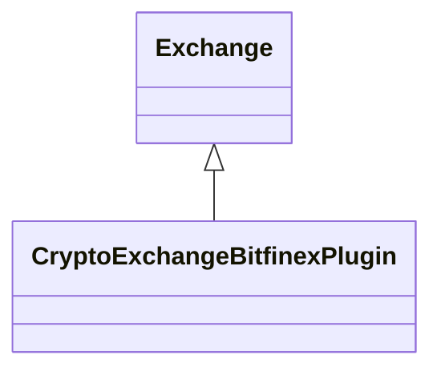

# CryptoExchangeBitfinex.jar

[Group index](README.md) | [All archives](../README.md)

## Scope and provenance

- **Donor:** `SQX_145_REFERENCE_ROOT/internal/plugins/CryptoExchangeBitfinex/CryptoExchangeBitfinex.jar`.
- **SHA-256:** `6ff09545942c0fd51dd9e4d5d3ee2ffd95022c9cedee49d1faecaa01e00cfeee`; accessed 2026-10-06; captured `2026-10-06T18:54:51.906614+00:00`.
- **Classes:** 1 raw entries; 1 unique entry names. Duplicate occurrence indices are zero-based.
- **Inspection:** read-only ZIP hashing and class-file structural parsing; signatures/descriptors, modifiers, hierarchy and references only. Bytecode bodies are hashed, not published.
- **Allocation:** proposed `FEAT-DATA-SOURCE-CRYPTO-EXCHANGE-BITFINEX`, P04; [roadmap](../../dev/sqx-full-application-roadmap.md). Domain README registration remains required.
- **Repository:** `01067f00031428613c6394064ca1bcadc1ba00ee`; review state unreviewed. Download label 145-dev1; installed build/activation and runtime equivalence unverified.
- **Limit:** every class/member is inventoried; declaration coverage does not establish consumed calls, defaults, formulas, failure semantics or algorithm parity.
- **Archive/resource index:** [159.json](../../dev/evidence/sqx145/archives/145/159.json).

## Complete member declarations

Member shards contain exact JVM names/descriptors, access flags, generic signatures, throws types, declared fields/methods, superclass/interfaces and referenced class names. All classes, nested/synthetic members and overloads are retained. Code length/hash is structural evidence, not a normalized algorithm comparison.

- [001.json](../../dev/evidence/sqx145/members/159/001.json) — SHA-256 `1c48374e7b855a36fc6696e70227f907f1592bd1cddb65fa6bab831db09469f2`.

## Focused structural diagram

Up to twelve non-nested classes; arrows show declared inheritance/interfaces only. External type names are not evidence of an available body or an executed dependency.

## Class inventory

| Archive entry | Occurrence | Class SHA-256 | Fields | Methods |
| --- | ---: | --- | ---: | ---: |
| `com/strategyquant/plugin/CryptoExchange/impl/Bitfinex/CryptoExchangeBitfinexPlugin.class` | 0 | `58069063ff72122bbcdb25bc5ec6569c76f78c0252374385a8276914d66fee7a` | 1 | 12 |
