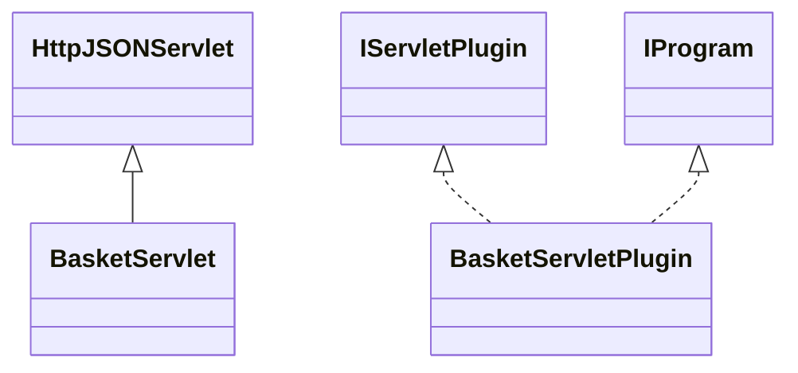

# DataManagerBasket.jar

[Group index](README.md) | [All archives](../README.md)

## Scope and provenance

- **Donor:** `SQX_145_REFERENCE_ROOT/internal/plugins/DataManagerBasket/DataManagerBasket.jar`.
- **SHA-256:** `15d1dee0a9a962a2302f5eabf025c5486452ccfba39f9f57023c1642ba903c60`; accessed 2026-10-06; captured `2026-10-06T18:54:51.906614+00:00`.
- **Classes:** 3 raw entries; 3 unique entry names. Duplicate occurrence indices are zero-based.
- **Inspection:** read-only ZIP hashing and class-file structural parsing; signatures/descriptors, modifiers, hierarchy and references only. Bytecode bodies are hashed, not published.
- **Allocation:** proposed `FEAT-DATA-DATA-MANAGER-BASKET`, P03; [roadmap](../../dev/sqx-full-application-roadmap.md). Domain README registration remains required.
- **Repository:** `01067f00031428613c6394064ca1bcadc1ba00ee`; review state unreviewed. Download label 145-dev1; installed build/activation and runtime equivalence unverified.
- **Limit:** every class/member is inventoried; declaration coverage does not establish consumed calls, defaults, formulas, failure semantics or algorithm parity.
- **Archive/resource index:** [165.json](../../dev/evidence/sqx145/archives/145/165.json).

## Complete member declarations

Member shards contain exact JVM names/descriptors, access flags, generic signatures, throws types, declared fields/methods, superclass/interfaces and referenced class names. All classes, nested/synthetic members and overloads are retained. Code length/hash is structural evidence, not a normalized algorithm comparison.

- [001.json](../../dev/evidence/sqx145/members/165/001.json) — SHA-256 `b2cb75a28e4de23c57b2b6f0b88c4b28e74a90224b09a75e0966828f0f377156`.

## Focused structural diagram

Up to twelve non-nested classes; arrows show declared inheritance/interfaces only. External type names are not evidence of an available body or an executed dependency.

## Class inventory

| Archive entry | Occurrence | Class SHA-256 | Fields | Methods |
| --- | ---: | --- | ---: | ---: |
| `com/strategyquant/plugin/DataManager/impl/Basket/BasketServlet$1.class` | 0 | `f2cb5154e61009a43b3eef8829310ccd985ad103d391f58e2016099ea0948980` | 2 | 2 |
| `com/strategyquant/plugin/DataManager/impl/Basket/BasketServlet.class` | 0 | `7d4353adc05899f34a046faf2673f256863c0d1f33ce0bf4171a2761eaaf61ed` | 2 | 20 |
| `com/strategyquant/plugin/DataManager/impl/Basket/BasketServletPlugin.class` | 0 | `791d7c4b435d8e9f8b8c47eee019923cdfd89091f80632ee4efaa99c5b9e13cb` | 2 | 6 |
