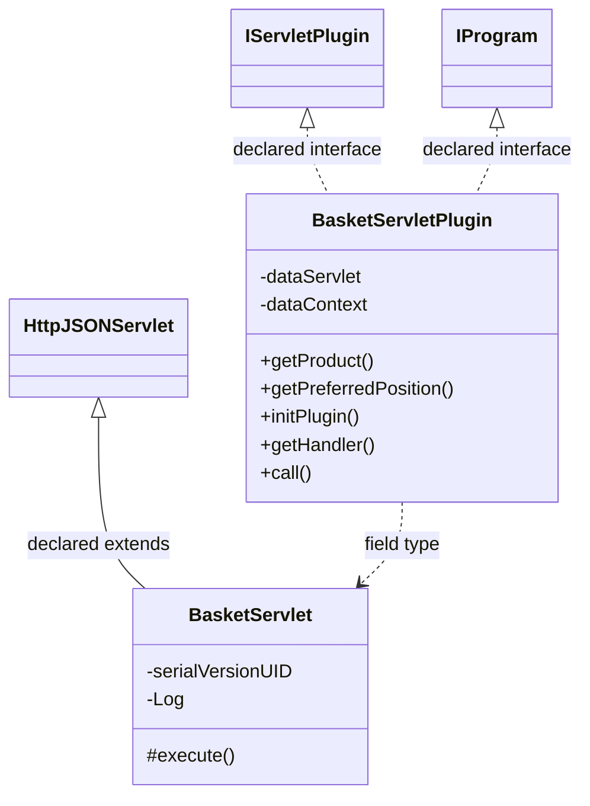

# DataManagerBasket.jar

[Workspace/group index](README.md)  |  [All workspaces](../README.md)

## Scope and provenance

- Artifact: `SQX_REFERENCE_ROOT/internal/plugins/DataManagerBasket/DataManagerBasket.jar`.
- SHA-256: `7878ca809dcc933f462fbc1f203ea7fb2d994af4e7af80f070ecf8c073ab322d`.
- Inspected: 2026-10-05; generation timestamp `2026-10-05T19:04:16.344170+00:00`.
- Archive class entries: **3**; non-nested: **2**; nested/anonymous: **1**.
- Inspection: ZIP entry/manifest enumeration and `javap -p` declarations for every listed class.
- Repository source HEAD: `8a92c705183a6702eaf62037ccb202ed028aa899`; review state: generated, pending owner review.
- Installed SQX build number is unverified. No method bodies are reproduced.
- Confidence: high for declared structure; workspace ownership inferred except where registration evidence is separately stated. Runtime reachability, call order, formulas and parity remain unverified.

The `DataManager` folder is a navigation/research grouping, not an exclusive backend owner. Shared consumers may use this JAR.

Target mapping: no verified owning HaruQuantAI feature/requirement/decision IDs are assigned by this document. Register or resolve ownership through the normal repository plan before implementation.

## Diagram reading guide

`Parent <|-- Child` means declared inheritance; `Interface <|.. Class` means declared implementation. Interface extension uses the inheritance arrow. `A ..> B : field type` is a declared type dependency, not composition, object ownership or a runtime call. External nodes are referenced types, not fabricated local implementations. Selected fields/method names aid navigation: `+` is public, `#` protected and `-` private. Diagram method names omit parameter/return types and collapse overloads; use the exact inspected declarations below before implementing an API.

Detailed graphs include non-nested classes in package-sized groups of at most 12. Nested/anonymous classes are inventoried and their declarations/relationships are retained below, but omitted from overview graphs. Relationships not drawn for readability remain in the complete declaration-relationship table. Constructors, synthetic bridges and overloads may be collapsed in diagram member lists only. Standard `java.lang.Object` inheritance is omitted from diagrams.

## UML class diagrams

### 1. `com.strategyquant.plugin.DataManager.impl.Basket`



| Diagram identifier | Exact type | Location |
| --- | --- | --- |
| `C7ee8d5e4e8a2` | `com.strategyquant.plugin.DataManager.impl.Basket.BasketServlet` (this JAR) | this diagram |
| `Cece6cee9f909` | `com.strategyquant.plugin.DataManager.impl.Basket.BasketServletPlugin` (this JAR) | this diagram |
| `C1b6b4448b67b` | [`com.strategyquant.pluginlib.program.IProgram`](../Shared/SQPluginLib.md) | referenced external type |
| `C249b5c671b1a` | [`com.strategyquant.tradinglib.servlet.IServletPlugin`](../Shared/SQTradingLib.md) | referenced external type |
| `C8900f90ae594` | [`com.strategyquant.webguilib.servlet.HttpJSONServlet`](../Shared/SQWebGUILib.md) | referenced external type |

## Complete class inventory

| Fully qualified class | Kind | Entry |
| --- | --- | --- |
| `com.strategyquant.plugin.DataManager.impl.Basket.BasketServlet` | class | non-nested |
| `com.strategyquant.plugin.DataManager.impl.Basket.BasketServlet$1` | class | nested/anonymous |
| `com.strategyquant.plugin.DataManager.impl.Basket.BasketServletPlugin` | class | non-nested |

## Declared relationships and evidence locations

Every row is supported by the named class declaration/member in `javap -p`, inside the artifact recorded above. Signature dependencies may include return, parameter, generic-argument and throws types; they do not imply execution.

| Declaring class | Referenced type | Relationship | Narrow inspection location |
| --- | --- | --- | --- |
| `com.strategyquant.plugin.DataManager.impl.Basket.BasketServlet` | [`com.strategyquant.webguilib.servlet.HttpJSONServlet`](../Shared/SQWebGUILib.md) | extends | `com.strategyquant.plugin.DataManager.impl.Basket.BasketServlet` / class declaration: `public class com.strategyquant.plugin.DataManager.impl.Basket.BasketServlet extends com.strategyquant.webguilib.servlet.HttpJSONServlet` |
| `com.strategyquant.plugin.DataManager.impl.Basket.BasketServlet` | `org.slf4j.Logger` (not resolved in scoped archives) | type dependency | `com.strategyquant.plugin.DataManager.impl.Basket.BasketServlet` / field declaration: `private static final org.slf4j.Logger Log;` |
| `com.strategyquant.plugin.DataManager.impl.Basket.BasketServlet` | `org.slf4j.Logger` (not resolved in scoped archives) | type dependency | `com.strategyquant.plugin.DataManager.impl.Basket.BasketServlet` / method signature: `static org.slf4j.Logger access$100();` |
| `com.strategyquant.plugin.DataManager.impl.Basket.BasketServlet` | `java.lang.String` (not resolved in scoped archives) | type dependency | `com.strategyquant.plugin.DataManager.impl.Basket.BasketServlet` / method signature: `protected java.lang.String execute(java.lang.String, java.util.Map<java.lang.String, java.lang.String[]>, java.lang.String) throws java.lang.Exception;`<br>`private java.lang.String onLoad(java.util.Map<java.lang.String, java.lang.String[]>);`<br>`private java.lang.String onSave(java.util.Map<java.lang.String, java.lang.String[]>);`<br>`private java.lang.String onEditGroup(java.util.Map<java.lang.String, java.lang.String[]>);`<br>`private java.lang.String onExportStocks(java.util.Map<java.lang.String, java.lang.String[]>) throws java.lang.Exception;`<br>`private void writeStocksToCsv(java.lang.String, java.util.List<com.strategyquant.datalib.basket.StockDto>) throws java.io.IOException;`<br>`private java.lang.String onImportStocks(java.util.Map<java.lang.String, java.lang.String[]>) throws java.lang.Exception;`<br>`private java.lang.String onDeleteBasket(java.util.Map<java.lang.String, java.lang.String[]>) throws java.lang.Exception;`<br>`private java.lang.String getSuccessResult(java.lang.String);`<br>`private java.lang.String onSaveBasket(java.util.Map<java.lang.String, java.lang.String[]>) throws java.lang.Exception;`<br>`private java.lang.String onListBasket(java.util.Map<java.lang.String, java.lang.String[]>) throws java.lang.Exception;`<br>`private java.lang.String onEditStocks(java.util.Map<java.lang.String, java.lang.String[]>) throws java.lang.Exception;`<br>`private java.lang.String onListStocks(java.util.Map<java.lang.String, java.lang.String[]>) throws java.lang.Exception;`<br>`private java.lang.String onUpdateData(java.util.Map<java.lang.String, java.lang.String[]>) throws java.lang.Exception;` |
| `com.strategyquant.plugin.DataManager.impl.Basket.BasketServlet` | `java.util.Map` (not resolved in scoped archives) | type dependency | `com.strategyquant.plugin.DataManager.impl.Basket.BasketServlet` / method signature: `protected java.lang.String execute(java.lang.String, java.util.Map<java.lang.String, java.lang.String[]>, java.lang.String) throws java.lang.Exception;`<br>`private java.lang.String onLoad(java.util.Map<java.lang.String, java.lang.String[]>);`<br>`private java.lang.String onSave(java.util.Map<java.lang.String, java.lang.String[]>);`<br>`private java.lang.String onEditGroup(java.util.Map<java.lang.String, java.lang.String[]>);`<br>`private java.lang.String onExportStocks(java.util.Map<java.lang.String, java.lang.String[]>) throws java.lang.Exception;`<br>`private java.lang.String onImportStocks(java.util.Map<java.lang.String, java.lang.String[]>) throws java.lang.Exception;`<br>`private java.lang.String onDeleteBasket(java.util.Map<java.lang.String, java.lang.String[]>) throws java.lang.Exception;`<br>`private java.lang.String onSaveBasket(java.util.Map<java.lang.String, java.lang.String[]>) throws java.lang.Exception;`<br>`private java.lang.String onListBasket(java.util.Map<java.lang.String, java.lang.String[]>) throws java.lang.Exception;`<br>`private java.lang.String onEditStocks(java.util.Map<java.lang.String, java.lang.String[]>) throws java.lang.Exception;`<br>`private java.lang.String onListStocks(java.util.Map<java.lang.String, java.lang.String[]>) throws java.lang.Exception;`<br>`private java.lang.String onUpdateData(java.util.Map<java.lang.String, java.lang.String[]>) throws java.lang.Exception;` |
| `com.strategyquant.plugin.DataManager.impl.Basket.BasketServlet` | `java.lang.Exception` (not resolved in scoped archives) | type dependency | `com.strategyquant.plugin.DataManager.impl.Basket.BasketServlet` / method signature: `protected java.lang.String execute(java.lang.String, java.util.Map<java.lang.String, java.lang.String[]>, java.lang.String) throws java.lang.Exception;`<br>`private java.lang.String onExportStocks(java.util.Map<java.lang.String, java.lang.String[]>) throws java.lang.Exception;`<br>`private java.lang.String onImportStocks(java.util.Map<java.lang.String, java.lang.String[]>) throws java.lang.Exception;`<br>`private java.lang.String onDeleteBasket(java.util.Map<java.lang.String, java.lang.String[]>) throws java.lang.Exception;`<br>`private java.lang.String onSaveBasket(java.util.Map<java.lang.String, java.lang.String[]>) throws java.lang.Exception;`<br>`private java.lang.String onListBasket(java.util.Map<java.lang.String, java.lang.String[]>) throws java.lang.Exception;`<br>`private java.lang.String onEditStocks(java.util.Map<java.lang.String, java.lang.String[]>) throws java.lang.Exception;`<br>`private java.lang.String onListStocks(java.util.Map<java.lang.String, java.lang.String[]>) throws java.lang.Exception;`<br>`private java.lang.String onUpdateData(java.util.Map<java.lang.String, java.lang.String[]>) throws java.lang.Exception;`<br>`private void _onUpdateData(java.util.List<com.strategyquant.datalib.basket.StockDto>) throws com.strategyquant.pluginlib.program.ProgramDoesntExistException, java.lang.Exception;`<br>`static void access$000(com.strategyquant.plugin.DataManager.impl.Basket.BasketServlet, java.util.List) throws com.strategyquant.pluginlib.program.ProgramDoesntExistException, java.lang.Exception;` |
| `com.strategyquant.plugin.DataManager.impl.Basket.BasketServlet` | `org.jdom2.Element` (not resolved in scoped archives) | type dependency | `com.strategyquant.plugin.DataManager.impl.Basket.BasketServlet` / method signature: `private org.jdom2.Element toXML(com.strategyquant.datalib.basket.BasketDto, java.util.List<com.strategyquant.datalib.basket.StockDto>);` |
| `com.strategyquant.plugin.DataManager.impl.Basket.BasketServlet` | [`com.strategyquant.datalib.basket.BasketDto`](../Shared/SQDataLib.md) | type dependency | `com.strategyquant.plugin.DataManager.impl.Basket.BasketServlet` / method signature: `private org.jdom2.Element toXML(com.strategyquant.datalib.basket.BasketDto, java.util.List<com.strategyquant.datalib.basket.StockDto>);` |
| `com.strategyquant.plugin.DataManager.impl.Basket.BasketServlet` | `java.util.List` (not resolved in scoped archives) | type dependency | `com.strategyquant.plugin.DataManager.impl.Basket.BasketServlet` / method signature: `private org.jdom2.Element toXML(com.strategyquant.datalib.basket.BasketDto, java.util.List<com.strategyquant.datalib.basket.StockDto>);`<br>`private void writeStocksToCsv(java.lang.String, java.util.List<com.strategyquant.datalib.basket.StockDto>) throws java.io.IOException;`<br>`private void _onUpdateData(java.util.List<com.strategyquant.datalib.basket.StockDto>) throws com.strategyquant.pluginlib.program.ProgramDoesntExistException, java.lang.Exception;`<br>`static void access$000(com.strategyquant.plugin.DataManager.impl.Basket.BasketServlet, java.util.List) throws com.strategyquant.pluginlib.program.ProgramDoesntExistException, java.lang.Exception;` |
| `com.strategyquant.plugin.DataManager.impl.Basket.BasketServlet` | [`com.strategyquant.datalib.basket.StockDto`](../Shared/SQDataLib.md) | type dependency | `com.strategyquant.plugin.DataManager.impl.Basket.BasketServlet` / method signature: `private org.jdom2.Element toXML(com.strategyquant.datalib.basket.BasketDto, java.util.List<com.strategyquant.datalib.basket.StockDto>);`<br>`private void writeStocksToCsv(java.lang.String, java.util.List<com.strategyquant.datalib.basket.StockDto>) throws java.io.IOException;`<br>`private void _onUpdateData(java.util.List<com.strategyquant.datalib.basket.StockDto>) throws com.strategyquant.pluginlib.program.ProgramDoesntExistException, java.lang.Exception;` |
| `com.strategyquant.plugin.DataManager.impl.Basket.BasketServlet` | `java.io.IOException` (not resolved in scoped archives) | type dependency | `com.strategyquant.plugin.DataManager.impl.Basket.BasketServlet` / method signature: `private void writeStocksToCsv(java.lang.String, java.util.List<com.strategyquant.datalib.basket.StockDto>) throws java.io.IOException;` |
| `com.strategyquant.plugin.DataManager.impl.Basket.BasketServlet` | [`com.strategyquant.pluginlib.program.ProgramDoesntExistException`](../Shared/SQPluginLib.md) | type dependency | `com.strategyquant.plugin.DataManager.impl.Basket.BasketServlet` / method signature: `private void _onUpdateData(java.util.List<com.strategyquant.datalib.basket.StockDto>) throws com.strategyquant.pluginlib.program.ProgramDoesntExistException, java.lang.Exception;`<br>`static void access$000(com.strategyquant.plugin.DataManager.impl.Basket.BasketServlet, java.util.List) throws com.strategyquant.pluginlib.program.ProgramDoesntExistException, java.lang.Exception;` |
| `com.strategyquant.plugin.DataManager.impl.Basket.BasketServlet$1` | `java.lang.Runnable` (not resolved in scoped archives) | implements | `com.strategyquant.plugin.DataManager.impl.Basket.BasketServlet$1` / class declaration: `class com.strategyquant.plugin.DataManager.impl.Basket.BasketServlet$1 implements java.lang.Runnable` |
| `com.strategyquant.plugin.DataManager.impl.Basket.BasketServlet$1` | `java.util.List` (not resolved in scoped archives) | type dependency | `com.strategyquant.plugin.DataManager.impl.Basket.BasketServlet$1` / field declaration: `final java.util.List val$stocks;` |
| `com.strategyquant.plugin.DataManager.impl.Basket.BasketServlet$1` | `com.strategyquant.plugin.DataManager.impl.Basket.BasketServlet` (this JAR) | type dependency | `com.strategyquant.plugin.DataManager.impl.Basket.BasketServlet$1` / field declaration: `final com.strategyquant.plugin.DataManager.impl.Basket.BasketServlet this$0;` |
| `com.strategyquant.plugin.DataManager.impl.Basket.BasketServletPlugin` | [`com.strategyquant.tradinglib.servlet.IServletPlugin`](../Shared/SQTradingLib.md) | implements | `com.strategyquant.plugin.DataManager.impl.Basket.BasketServletPlugin` / class declaration: `public class com.strategyquant.plugin.DataManager.impl.Basket.BasketServletPlugin implements com.strategyquant.tradinglib.servlet.IServletPlugin,com.strategyquant.pluginlib.program.IProgram` |
| `com.strategyquant.plugin.DataManager.impl.Basket.BasketServletPlugin` | [`com.strategyquant.pluginlib.program.IProgram`](../Shared/SQPluginLib.md) | implements | `com.strategyquant.plugin.DataManager.impl.Basket.BasketServletPlugin` / class declaration: `public class com.strategyquant.plugin.DataManager.impl.Basket.BasketServletPlugin implements com.strategyquant.tradinglib.servlet.IServletPlugin,com.strategyquant.pluginlib.program.IProgram` |
| `com.strategyquant.plugin.DataManager.impl.Basket.BasketServletPlugin` | `com.strategyquant.plugin.DataManager.impl.Basket.BasketServlet` (this JAR) | type dependency | `com.strategyquant.plugin.DataManager.impl.Basket.BasketServletPlugin` / field declaration: `private com.strategyquant.plugin.DataManager.impl.Basket.BasketServlet dataServlet;` |
| `com.strategyquant.plugin.DataManager.impl.Basket.BasketServletPlugin` | `org.eclipse.jetty.servlet.ServletContextHandler` (not resolved in scoped archives) | type dependency | `com.strategyquant.plugin.DataManager.impl.Basket.BasketServletPlugin` / field declaration: `private org.eclipse.jetty.servlet.ServletContextHandler dataContext;` |
| `com.strategyquant.plugin.DataManager.impl.Basket.BasketServletPlugin` | `java.lang.String` (not resolved in scoped archives) | type dependency | `com.strategyquant.plugin.DataManager.impl.Basket.BasketServletPlugin` / method signature: `public java.lang.String getProduct();`<br>`public java.lang.Object call(java.lang.String, java.lang.Object...) throws java.lang.Exception;` |
| `com.strategyquant.plugin.DataManager.impl.Basket.BasketServletPlugin` | `java.lang.Exception` (not resolved in scoped archives) | type dependency | `com.strategyquant.plugin.DataManager.impl.Basket.BasketServletPlugin` / method signature: `public void initPlugin() throws java.lang.Exception;`<br>`public java.lang.Object call(java.lang.String, java.lang.Object...) throws java.lang.Exception;` |
| `com.strategyquant.plugin.DataManager.impl.Basket.BasketServletPlugin` | `org.eclipse.jetty.server.Handler` (not resolved in scoped archives) | type dependency | `com.strategyquant.plugin.DataManager.impl.Basket.BasketServletPlugin` / method signature: `public org.eclipse.jetty.server.Handler getHandler();` |
| `com.strategyquant.plugin.DataManager.impl.Basket.BasketServletPlugin` | `java.lang.Object` (not resolved in scoped archives) | type dependency | `com.strategyquant.plugin.DataManager.impl.Basket.BasketServletPlugin` / method signature: `public java.lang.Object call(java.lang.String, java.lang.Object...) throws java.lang.Exception;` |

## Inspected declaration reference

These are structural API/member declarations, not proprietary implementation bodies. Private members and nested classes are retained to make diagram omissions explicit; declarations do not prove behavior.

<details>
<summary>com.strategyquant.plugin.DataManager.impl.Basket.BasketServlet</summary>

```text
public class com.strategyquant.plugin.DataManager.impl.Basket.BasketServlet extends com.strategyquant.webguilib.servlet.HttpJSONServlet
    private static final long serialVersionUID;
    private static final org.slf4j.Logger Log;
    public com.strategyquant.plugin.DataManager.impl.Basket.BasketServlet();
    protected java.lang.String execute(java.lang.String, java.util.Map<java.lang.String, java.lang.String[]>, java.lang.String) throws java.lang.Exception;
    private java.lang.String onLoad(java.util.Map<java.lang.String, java.lang.String[]>);
    private java.lang.String onSave(java.util.Map<java.lang.String, java.lang.String[]>);
    private org.jdom2.Element toXML(com.strategyquant.datalib.basket.BasketDto, java.util.List<com.strategyquant.datalib.basket.StockDto>);
    private java.lang.String onEditGroup(java.util.Map<java.lang.String, java.lang.String[]>);
    private java.lang.String onExportStocks(java.util.Map<java.lang.String, java.lang.String[]>) throws java.lang.Exception;
    private void writeStocksToCsv(java.lang.String, java.util.List<com.strategyquant.datalib.basket.StockDto>) throws java.io.IOException;
    private java.lang.String onImportStocks(java.util.Map<java.lang.String, java.lang.String[]>) throws java.lang.Exception;
    private java.lang.String onDeleteBasket(java.util.Map<java.lang.String, java.lang.String[]>) throws java.lang.Exception;
    private java.lang.String getSuccessResult(java.lang.String);
    private java.lang.String onSaveBasket(java.util.Map<java.lang.String, java.lang.String[]>) throws java.lang.Exception;
    private java.lang.String onListBasket(java.util.Map<java.lang.String, java.lang.String[]>) throws java.lang.Exception;
    private java.lang.String onEditStocks(java.util.Map<java.lang.String, java.lang.String[]>) throws java.lang.Exception;
    private java.lang.String onListStocks(java.util.Map<java.lang.String, java.lang.String[]>) throws java.lang.Exception;
    private java.lang.String onUpdateData(java.util.Map<java.lang.String, java.lang.String[]>) throws java.lang.Exception;
    private void _onUpdateData(java.util.List<com.strategyquant.datalib.basket.StockDto>) throws com.strategyquant.pluginlib.program.ProgramDoesntExistException, java.lang.Exception;
    static void access$000(com.strategyquant.plugin.DataManager.impl.Basket.BasketServlet, java.util.List) throws com.strategyquant.pluginlib.program.ProgramDoesntExistException, java.lang.Exception;
    static org.slf4j.Logger access$100();
```

</details>

<details>
<summary>com.strategyquant.plugin.DataManager.impl.Basket.BasketServlet$1</summary>

```text
class com.strategyquant.plugin.DataManager.impl.Basket.BasketServlet$1 implements java.lang.Runnable
    final java.util.List val$stocks;
    final com.strategyquant.plugin.DataManager.impl.Basket.BasketServlet this$0;
    com.strategyquant.plugin.DataManager.impl.Basket.BasketServlet$1();
    public void run();
```

</details>

<details>
<summary>com.strategyquant.plugin.DataManager.impl.Basket.BasketServletPlugin</summary>

```text
public class com.strategyquant.plugin.DataManager.impl.Basket.BasketServletPlugin implements com.strategyquant.tradinglib.servlet.IServletPlugin,com.strategyquant.pluginlib.program.IProgram
    private com.strategyquant.plugin.DataManager.impl.Basket.BasketServlet dataServlet;
    private org.eclipse.jetty.servlet.ServletContextHandler dataContext;
    public com.strategyquant.plugin.DataManager.impl.Basket.BasketServletPlugin();
    public java.lang.String getProduct();
    public int getPreferredPosition();
    public void initPlugin() throws java.lang.Exception;
    public org.eclipse.jetty.server.Handler getHandler();
    public java.lang.Object call(java.lang.String, java.lang.Object...) throws java.lang.Exception;
```

</details>

## Validation and unresolved gaps

Archive hash and complete class inventory were checked against the inspected local artifact. Declaration extraction accounts for every inventoried class. Documentation/link/diagram structural verification is recorded in the master index and task walkthrough; no SQX runtime validation was performed.

The canonical reimplementation ledger/schema are absent, so no evidence IDs or validation-passed ledger claims are created. This is a donor structural reference. Exact behavior, default values, failure semantics, algorithms, runtime calls and target architectural choices require separate research. No aggregation/composition or cardinalities are inferred.
