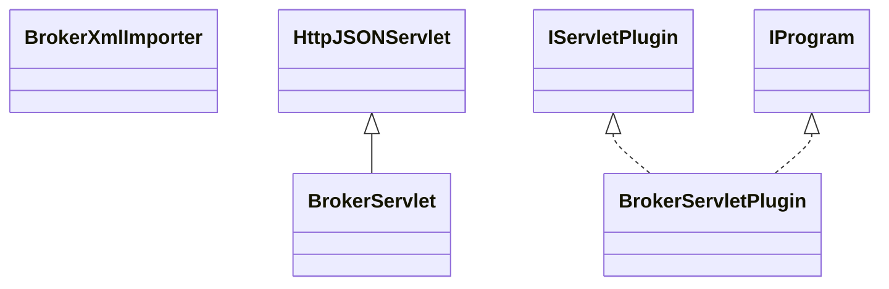

# DataManagerBroker.jar

[Group index](README.md) | [All archives](../README.md)

## Scope and provenance

- **Donor:** `SQX_145_REFERENCE_ROOT/internal/plugins/DataManagerBroker/DataManagerBroker.jar`.
- **SHA-256:** `84d9f257022e864c7fd738ef335783557b059f3367e61fedc2de3d5982af0c45`; accessed 2026-10-06; captured `2026-10-06T18:54:51.906614+00:00`.
- **Classes:** 6 raw entries; 6 unique entry names. Duplicate occurrence indices are zero-based.
- **Inspection:** read-only ZIP hashing and class-file structural parsing; signatures/descriptors, modifiers, hierarchy and references only. Bytecode bodies are hashed, not published.
- **Allocation:** proposed `FEAT-DATA-DATA-MANAGER-BROKER`, P03; [roadmap](../../dev/sqx-full-application-roadmap.md). Domain README registration remains required.
- **Repository:** `01067f00031428613c6394064ca1bcadc1ba00ee`; review state unreviewed. Download label 145-dev1; installed build/activation and runtime equivalence unverified.
- **Limit:** every class/member is inventoried; declaration coverage does not establish consumed calls, defaults, formulas, failure semantics or algorithm parity.
- **Archive/resource index:** [166.json](../../dev/evidence/sqx145/archives/145/166.json).

## Complete member declarations

Member shards contain exact JVM names/descriptors, access flags, generic signatures, throws types, declared fields/methods, superclass/interfaces and referenced class names. All classes, nested/synthetic members and overloads are retained. Code length/hash is structural evidence, not a normalized algorithm comparison.

- [001.json](../../dev/evidence/sqx145/members/166/001.json) — SHA-256 `63adb8c9552503acd5ec01b0b87e690eab552b7779aee4fd13ba914030ee3463`.

## Focused structural diagram

Up to twelve non-nested classes; arrows show declared inheritance/interfaces only. External type names are not evidence of an available body or an executed dependency.

## Class inventory

| Archive entry | Occurrence | Class SHA-256 | Fields | Methods |
| --- | ---: | --- | ---: | ---: |
| `com/strategyquant/plugin/DataManager/impl/Broker/BrokerServlet$1.class` | 0 | `6cd4ef50c31efd36d5fb6d22fa1e765d5c97726c971a0c3b609173ced3a6bfe4` | 6 | 2 |
| `com/strategyquant/plugin/DataManager/impl/Broker/BrokerServlet$2.class` | 0 | `989461f8d4134b976b9525c94bf1631fcdb1eba07ba4cba57dfae740c92d2ae5` | 6 | 2 |
| `com/strategyquant/plugin/DataManager/impl/Broker/BrokerServlet$3.class` | 0 | `e731412b92573f76ee9fe697beb58f525b85e4cc3868041316c99b38fe8f8c88` | 2 | 2 |
| `com/strategyquant/plugin/DataManager/impl/Broker/BrokerServlet.class` | 0 | `03f93f4628ce2d4764495e06c4c2dc5082a259ff980ae37d6f4a878ba44312e1` | 2 | 29 |
| `com/strategyquant/plugin/DataManager/impl/Broker/BrokerServletPlugin.class` | 0 | `2ba8e5938571bb845cb7d4299fe1abc9f0013d025a1619dcc96ae330e6537a0c` | 2 | 6 |
| `com/strategyquant/plugin/DataManager/impl/Broker/BrokerXmlImporter.class` | 0 | `62247e4de211c5b5cd42cf7d8a01ab0d9814b2df931261826d5b17cb94e2d835` | 0 | 3 |
