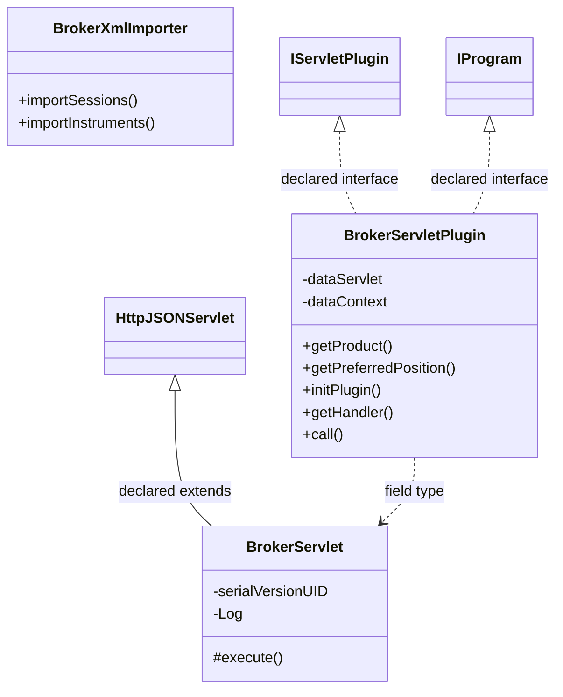

# DataManagerBroker.jar

[Workspace/group index](README.md)  |  [All workspaces](../README.md)

## Scope and provenance

- Artifact: `SQX_REFERENCE_ROOT/internal/plugins/DataManagerBroker/DataManagerBroker.jar`.
- SHA-256: `ddf4ef361c3b9b52333c4ba93a74cd0f6f2a4ab190878c4c521ae04944ae55fd`.
- Inspected: 2026-10-05; generation timestamp `2026-10-05T19:04:16.344170+00:00`.
- Archive class entries: **6**; non-nested: **3**; nested/anonymous: **3**.
- Inspection: ZIP entry/manifest enumeration and `javap -p` declarations for every listed class.
- Repository source HEAD: `8a92c705183a6702eaf62037ccb202ed028aa899`; review state: generated, pending owner review.
- Installed SQX build number is unverified. No method bodies are reproduced.
- Confidence: high for declared structure; workspace ownership inferred except where registration evidence is separately stated. Runtime reachability, call order, formulas and parity remain unverified.

The `DataManager` folder is a navigation/research grouping, not an exclusive backend owner. Shared consumers may use this JAR.

Target mapping: no verified owning HaruQuantAI feature/requirement/decision IDs are assigned by this document. Register or resolve ownership through the normal repository plan before implementation.

## Diagram reading guide

`Parent <|-- Child` means declared inheritance; `Interface <|.. Class` means declared implementation. Interface extension uses the inheritance arrow. `A ..> B : field type` is a declared type dependency, not composition, object ownership or a runtime call. External nodes are referenced types, not fabricated local implementations. Selected fields/method names aid navigation: `+` is public, `#` protected and `-` private. Diagram method names omit parameter/return types and collapse overloads; use the exact inspected declarations below before implementing an API.

Detailed graphs include non-nested classes in package-sized groups of at most 12. Nested/anonymous classes are inventoried and their declarations/relationships are retained below, but omitted from overview graphs. Relationships not drawn for readability remain in the complete declaration-relationship table. Constructors, synthetic bridges and overloads may be collapsed in diagram member lists only. Standard `java.lang.Object` inheritance is omitted from diagrams.

## UML class diagrams

### 1. `com.strategyquant.plugin.DataManager.impl.Broker`



| Diagram identifier | Exact type | Location |
| --- | --- | --- |
| `C160aff18764c` | `com.strategyquant.plugin.DataManager.impl.Broker.BrokerServlet` (this JAR) | this diagram |
| `Cb1b23feef7f7` | `com.strategyquant.plugin.DataManager.impl.Broker.BrokerServletPlugin` (this JAR) | this diagram |
| `C26f4be447224` | `com.strategyquant.plugin.DataManager.impl.Broker.BrokerXmlImporter` (this JAR) | this diagram |
| `C1b6b4448b67b` | [`com.strategyquant.pluginlib.program.IProgram`](../Shared/SQPluginLib.md) | referenced external type |
| `C249b5c671b1a` | [`com.strategyquant.tradinglib.servlet.IServletPlugin`](../Shared/SQTradingLib.md) | referenced external type |
| `C8900f90ae594` | [`com.strategyquant.webguilib.servlet.HttpJSONServlet`](../Shared/SQWebGUILib.md) | referenced external type |

## Complete class inventory

| Fully qualified class | Kind | Entry |
| --- | --- | --- |
| `com.strategyquant.plugin.DataManager.impl.Broker.BrokerServlet` | class | non-nested |
| `com.strategyquant.plugin.DataManager.impl.Broker.BrokerServlet$1` | class | nested/anonymous |
| `com.strategyquant.plugin.DataManager.impl.Broker.BrokerServlet$2` | class | nested/anonymous |
| `com.strategyquant.plugin.DataManager.impl.Broker.BrokerServlet$3` | class | nested/anonymous |
| `com.strategyquant.plugin.DataManager.impl.Broker.BrokerServletPlugin` | class | non-nested |
| `com.strategyquant.plugin.DataManager.impl.Broker.BrokerXmlImporter` | class | non-nested |

## Declared relationships and evidence locations

Every row is supported by the named class declaration/member in `javap -p`, inside the artifact recorded above. Signature dependencies may include return, parameter, generic-argument and throws types; they do not imply execution.

| Declaring class | Referenced type | Relationship | Narrow inspection location |
| --- | --- | --- | --- |
| `com.strategyquant.plugin.DataManager.impl.Broker.BrokerServlet` | [`com.strategyquant.webguilib.servlet.HttpJSONServlet`](../Shared/SQWebGUILib.md) | extends | `com.strategyquant.plugin.DataManager.impl.Broker.BrokerServlet` / class declaration: `public class com.strategyquant.plugin.DataManager.impl.Broker.BrokerServlet extends com.strategyquant.webguilib.servlet.HttpJSONServlet` |
| `com.strategyquant.plugin.DataManager.impl.Broker.BrokerServlet` | `org.slf4j.Logger` (not resolved in scoped archives) | type dependency | `com.strategyquant.plugin.DataManager.impl.Broker.BrokerServlet` / field declaration: `private static final org.slf4j.Logger Log;` |
| `com.strategyquant.plugin.DataManager.impl.Broker.BrokerServlet` | `org.slf4j.Logger` (not resolved in scoped archives) | type dependency | `com.strategyquant.plugin.DataManager.impl.Broker.BrokerServlet` / method signature: `static org.slf4j.Logger access$100();` |
| `com.strategyquant.plugin.DataManager.impl.Broker.BrokerServlet` | `java.lang.String` (not resolved in scoped archives) | type dependency | `com.strategyquant.plugin.DataManager.impl.Broker.BrokerServlet` / method signature: `protected java.lang.String execute(java.lang.String, java.util.Map<java.lang.String, java.lang.String[]>, java.lang.String) throws java.lang.Exception;`<br>`private java.lang.String onImportGetOverview(java.util.Map<java.lang.String, java.lang.String[]>);`<br>`private java.lang.String onImportSessionInstrument(java.util.Map<java.lang.String, java.lang.String[]>);`<br>`private void importSessionAsync(java.util.List<com.strategyquant.datalib.session.Session>, int, java.lang.String, com.strategyquant.datalib.broker.BrokerDto);`<br>`private void performImportSession(com.strategyquant.datalib.session.Session, int, java.lang.String, com.strategyquant.datalib.broker.BrokerDto) throws com.strategyquant.datalib.session.SessionException;`<br>`private void performImportInstrument(com.strategyquant.datalib.InstrumentInfo, int, java.lang.String, com.strategyquant.datalib.broker.BrokerDto) throws java.lang.Exception;`<br>`private void importInstrumentsAsync(java.util.List<com.strategyquant.datalib.InstrumentInfo>, int, java.lang.String, com.strategyquant.datalib.broker.BrokerDto);`<br>`private java.lang.String onLoad(java.util.Map<java.lang.String, java.lang.String[]>);`<br>`private java.lang.String onSave(java.util.Map<java.lang.String, java.lang.String[]>);`<br>`private org.jdom2.Element toXML(com.strategyquant.datalib.broker.BrokerDto, java.util.List<java.lang.String>);`<br>`private java.lang.String onUpdateData(java.util.Map<java.lang.String, java.lang.String[]>) throws java.lang.Exception;`<br>`private void _onUpdateData(java.util.List<java.lang.String>) throws com.strategyquant.pluginlib.program.ProgramDoesntExistException, java.lang.Exception;`<br>`private java.lang.String onExportStocks(java.util.Map<java.lang.String, java.lang.String[]>) throws java.lang.Exception;`<br>`private void writeStocksToCsv(java.lang.String, java.util.List<java.lang.String>) throws java.io.IOException;`<br>`private java.lang.String onImportStocks(java.util.Map<java.lang.String, java.lang.String[]>) throws java.lang.Exception;`<br>`private java.lang.String onDeleteBroker(java.util.Map<java.lang.String, java.lang.String[]>) throws java.lang.Exception;`<br>`private java.lang.String getSuccessResult(java.lang.String);`<br>`private java.lang.String onSaveBroker(java.util.Map<java.lang.String, java.lang.String[]>) throws java.lang.Exception;`<br>`private java.lang.String onListBroker(java.util.Map<java.lang.String, java.lang.String[]>) throws java.lang.Exception;`<br>`private java.lang.String onEditStocks(java.util.Map<java.lang.String, java.lang.String[]>) throws java.lang.Exception;`<br>`private java.lang.String onListStocks(java.util.Map<java.lang.String, java.lang.String[]>) throws java.lang.Exception;`<br>`static void access$000(com.strategyquant.plugin.DataManager.impl.Broker.BrokerServlet, com.strategyquant.datalib.session.Session, int, java.lang.String, com.strategyquant.datalib.broker.BrokerDto) throws com.strategyquant.datalib.session.SessionException;`<br>`static void access$200(com.strategyquant.plugin.DataManager.impl.Broker.BrokerServlet, com.strategyquant.datalib.InstrumentInfo, int, java.lang.String, com.strategyquant.datalib.broker.BrokerDto) throws java.lang.Exception;` |
| `com.strategyquant.plugin.DataManager.impl.Broker.BrokerServlet` | `java.util.Map` (not resolved in scoped archives) | type dependency | `com.strategyquant.plugin.DataManager.impl.Broker.BrokerServlet` / method signature: `protected java.lang.String execute(java.lang.String, java.util.Map<java.lang.String, java.lang.String[]>, java.lang.String) throws java.lang.Exception;`<br>`private java.lang.String onImportGetOverview(java.util.Map<java.lang.String, java.lang.String[]>);`<br>`private java.lang.String onImportSessionInstrument(java.util.Map<java.lang.String, java.lang.String[]>);`<br>`private java.lang.String onLoad(java.util.Map<java.lang.String, java.lang.String[]>);`<br>`private java.lang.String onSave(java.util.Map<java.lang.String, java.lang.String[]>);`<br>`private java.lang.String onUpdateData(java.util.Map<java.lang.String, java.lang.String[]>) throws java.lang.Exception;`<br>`private java.lang.String onExportStocks(java.util.Map<java.lang.String, java.lang.String[]>) throws java.lang.Exception;`<br>`private java.lang.String onImportStocks(java.util.Map<java.lang.String, java.lang.String[]>) throws java.lang.Exception;`<br>`private java.lang.String onDeleteBroker(java.util.Map<java.lang.String, java.lang.String[]>) throws java.lang.Exception;`<br>`private java.lang.String onSaveBroker(java.util.Map<java.lang.String, java.lang.String[]>) throws java.lang.Exception;`<br>`private java.lang.String onListBroker(java.util.Map<java.lang.String, java.lang.String[]>) throws java.lang.Exception;`<br>`private java.lang.String onEditStocks(java.util.Map<java.lang.String, java.lang.String[]>) throws java.lang.Exception;`<br>`private java.lang.String onListStocks(java.util.Map<java.lang.String, java.lang.String[]>) throws java.lang.Exception;` |
| `com.strategyquant.plugin.DataManager.impl.Broker.BrokerServlet` | `java.lang.Exception` (not resolved in scoped archives) | type dependency | `com.strategyquant.plugin.DataManager.impl.Broker.BrokerServlet` / method signature: `protected java.lang.String execute(java.lang.String, java.util.Map<java.lang.String, java.lang.String[]>, java.lang.String) throws java.lang.Exception;`<br>`private void performImportInstrument(com.strategyquant.datalib.InstrumentInfo, int, java.lang.String, com.strategyquant.datalib.broker.BrokerDto) throws java.lang.Exception;`<br>`private java.lang.String onUpdateData(java.util.Map<java.lang.String, java.lang.String[]>) throws java.lang.Exception;`<br>`private void _onUpdateData(java.util.List<java.lang.String>) throws com.strategyquant.pluginlib.program.ProgramDoesntExistException, java.lang.Exception;`<br>`private java.lang.String onExportStocks(java.util.Map<java.lang.String, java.lang.String[]>) throws java.lang.Exception;`<br>`private java.lang.String onImportStocks(java.util.Map<java.lang.String, java.lang.String[]>) throws java.lang.Exception;`<br>`private java.lang.String onDeleteBroker(java.util.Map<java.lang.String, java.lang.String[]>) throws java.lang.Exception;`<br>`private java.lang.String onSaveBroker(java.util.Map<java.lang.String, java.lang.String[]>) throws java.lang.Exception;`<br>`private java.lang.String onListBroker(java.util.Map<java.lang.String, java.lang.String[]>) throws java.lang.Exception;`<br>`private java.lang.String onEditStocks(java.util.Map<java.lang.String, java.lang.String[]>) throws java.lang.Exception;`<br>`private java.lang.String onListStocks(java.util.Map<java.lang.String, java.lang.String[]>) throws java.lang.Exception;`<br>`static void access$200(com.strategyquant.plugin.DataManager.impl.Broker.BrokerServlet, com.strategyquant.datalib.InstrumentInfo, int, java.lang.String, com.strategyquant.datalib.broker.BrokerDto) throws java.lang.Exception;`<br>`static void access$300(com.strategyquant.plugin.DataManager.impl.Broker.BrokerServlet, java.util.List) throws com.strategyquant.pluginlib.program.ProgramDoesntExistException, java.lang.Exception;` |
| `com.strategyquant.plugin.DataManager.impl.Broker.BrokerServlet` | `java.util.List` (not resolved in scoped archives) | type dependency | `com.strategyquant.plugin.DataManager.impl.Broker.BrokerServlet` / method signature: `private void importSessionAsync(java.util.List<com.strategyquant.datalib.session.Session>, int, java.lang.String, com.strategyquant.datalib.broker.BrokerDto);`<br>`private void importInstrumentsAsync(java.util.List<com.strategyquant.datalib.InstrumentInfo>, int, java.lang.String, com.strategyquant.datalib.broker.BrokerDto);`<br>`private org.jdom2.Element toXML(com.strategyquant.datalib.broker.BrokerDto, java.util.List<java.lang.String>);`<br>`private void _onUpdateData(java.util.List<java.lang.String>) throws com.strategyquant.pluginlib.program.ProgramDoesntExistException, java.lang.Exception;`<br>`private void writeStocksToCsv(java.lang.String, java.util.List<java.lang.String>) throws java.io.IOException;`<br>`static void access$300(com.strategyquant.plugin.DataManager.impl.Broker.BrokerServlet, java.util.List) throws com.strategyquant.pluginlib.program.ProgramDoesntExistException, java.lang.Exception;` |
| `com.strategyquant.plugin.DataManager.impl.Broker.BrokerServlet` | [`com.strategyquant.datalib.session.Session`](../Shared/SQDataLib.md) | type dependency | `com.strategyquant.plugin.DataManager.impl.Broker.BrokerServlet` / method signature: `private void importSessionAsync(java.util.List<com.strategyquant.datalib.session.Session>, int, java.lang.String, com.strategyquant.datalib.broker.BrokerDto);`<br>`private void performImportSession(com.strategyquant.datalib.session.Session, int, java.lang.String, com.strategyquant.datalib.broker.BrokerDto) throws com.strategyquant.datalib.session.SessionException;`<br>`static void access$000(com.strategyquant.plugin.DataManager.impl.Broker.BrokerServlet, com.strategyquant.datalib.session.Session, int, java.lang.String, com.strategyquant.datalib.broker.BrokerDto) throws com.strategyquant.datalib.session.SessionException;` |
| `com.strategyquant.plugin.DataManager.impl.Broker.BrokerServlet` | [`com.strategyquant.datalib.broker.BrokerDto`](../Shared/SQDataLib.md) | type dependency | `com.strategyquant.plugin.DataManager.impl.Broker.BrokerServlet` / method signature: `private void importSessionAsync(java.util.List<com.strategyquant.datalib.session.Session>, int, java.lang.String, com.strategyquant.datalib.broker.BrokerDto);`<br>`private void performImportSession(com.strategyquant.datalib.session.Session, int, java.lang.String, com.strategyquant.datalib.broker.BrokerDto) throws com.strategyquant.datalib.session.SessionException;`<br>`private void performImportInstrument(com.strategyquant.datalib.InstrumentInfo, int, java.lang.String, com.strategyquant.datalib.broker.BrokerDto) throws java.lang.Exception;`<br>`private void importInstrumentsAsync(java.util.List<com.strategyquant.datalib.InstrumentInfo>, int, java.lang.String, com.strategyquant.datalib.broker.BrokerDto);`<br>`private org.jdom2.Element toXML(com.strategyquant.datalib.broker.BrokerDto, java.util.List<java.lang.String>);`<br>`static void access$000(com.strategyquant.plugin.DataManager.impl.Broker.BrokerServlet, com.strategyquant.datalib.session.Session, int, java.lang.String, com.strategyquant.datalib.broker.BrokerDto) throws com.strategyquant.datalib.session.SessionException;`<br>`static void access$200(com.strategyquant.plugin.DataManager.impl.Broker.BrokerServlet, com.strategyquant.datalib.InstrumentInfo, int, java.lang.String, com.strategyquant.datalib.broker.BrokerDto) throws java.lang.Exception;` |
| `com.strategyquant.plugin.DataManager.impl.Broker.BrokerServlet` | [`com.strategyquant.datalib.session.SessionException`](../Shared/SQDataLib.md) | type dependency | `com.strategyquant.plugin.DataManager.impl.Broker.BrokerServlet` / method signature: `private void performImportSession(com.strategyquant.datalib.session.Session, int, java.lang.String, com.strategyquant.datalib.broker.BrokerDto) throws com.strategyquant.datalib.session.SessionException;`<br>`static void access$000(com.strategyquant.plugin.DataManager.impl.Broker.BrokerServlet, com.strategyquant.datalib.session.Session, int, java.lang.String, com.strategyquant.datalib.broker.BrokerDto) throws com.strategyquant.datalib.session.SessionException;` |
| `com.strategyquant.plugin.DataManager.impl.Broker.BrokerServlet` | [`com.strategyquant.datalib.InstrumentInfo`](../Shared/SQDataLib.md) | type dependency | `com.strategyquant.plugin.DataManager.impl.Broker.BrokerServlet` / method signature: `private void performImportInstrument(com.strategyquant.datalib.InstrumentInfo, int, java.lang.String, com.strategyquant.datalib.broker.BrokerDto) throws java.lang.Exception;`<br>`private void importInstrumentsAsync(java.util.List<com.strategyquant.datalib.InstrumentInfo>, int, java.lang.String, com.strategyquant.datalib.broker.BrokerDto);`<br>`static void access$200(com.strategyquant.plugin.DataManager.impl.Broker.BrokerServlet, com.strategyquant.datalib.InstrumentInfo, int, java.lang.String, com.strategyquant.datalib.broker.BrokerDto) throws java.lang.Exception;` |
| `com.strategyquant.plugin.DataManager.impl.Broker.BrokerServlet` | `org.jdom2.Element` (not resolved in scoped archives) | type dependency | `com.strategyquant.plugin.DataManager.impl.Broker.BrokerServlet` / method signature: `private org.jdom2.Element toXML(com.strategyquant.datalib.broker.BrokerDto, java.util.List<java.lang.String>);` |
| `com.strategyquant.plugin.DataManager.impl.Broker.BrokerServlet` | [`com.strategyquant.pluginlib.program.ProgramDoesntExistException`](../Shared/SQPluginLib.md) | type dependency | `com.strategyquant.plugin.DataManager.impl.Broker.BrokerServlet` / method signature: `private void _onUpdateData(java.util.List<java.lang.String>) throws com.strategyquant.pluginlib.program.ProgramDoesntExistException, java.lang.Exception;`<br>`static void access$300(com.strategyquant.plugin.DataManager.impl.Broker.BrokerServlet, java.util.List) throws com.strategyquant.pluginlib.program.ProgramDoesntExistException, java.lang.Exception;` |
| `com.strategyquant.plugin.DataManager.impl.Broker.BrokerServlet` | `java.io.IOException` (not resolved in scoped archives) | type dependency | `com.strategyquant.plugin.DataManager.impl.Broker.BrokerServlet` / method signature: `private void writeStocksToCsv(java.lang.String, java.util.List<java.lang.String>) throws java.io.IOException;` |
| `com.strategyquant.plugin.DataManager.impl.Broker.BrokerServlet$1` | `java.lang.Thread` (not resolved in scoped archives) | extends | `com.strategyquant.plugin.DataManager.impl.Broker.BrokerServlet$1` / class declaration: `class com.strategyquant.plugin.DataManager.impl.Broker.BrokerServlet$1 extends java.lang.Thread` |
| `com.strategyquant.plugin.DataManager.impl.Broker.BrokerServlet$1` | `java.util.List` (not resolved in scoped archives) | type dependency | `com.strategyquant.plugin.DataManager.impl.Broker.BrokerServlet$1` / field declaration: `final java.util.List val$sessions;` |
| `com.strategyquant.plugin.DataManager.impl.Broker.BrokerServlet$1` | `java.util.List` (not resolved in scoped archives) | type dependency | `com.strategyquant.plugin.DataManager.impl.Broker.BrokerServlet$1` / method signature: `com.strategyquant.plugin.DataManager.impl.Broker.BrokerServlet$1(com.strategyquant.plugin.DataManager.impl.Broker.BrokerServlet, java.util.List, int, java.lang.String, com.strategyquant.datalib.broker.BrokerDto, int);` |
| `com.strategyquant.plugin.DataManager.impl.Broker.BrokerServlet$1` | `java.lang.String` (not resolved in scoped archives) | type dependency | `com.strategyquant.plugin.DataManager.impl.Broker.BrokerServlet$1` / field declaration: `final java.lang.String val$postfix;` |
| `com.strategyquant.plugin.DataManager.impl.Broker.BrokerServlet$1` | `java.lang.String` (not resolved in scoped archives) | type dependency | `com.strategyquant.plugin.DataManager.impl.Broker.BrokerServlet$1` / method signature: `com.strategyquant.plugin.DataManager.impl.Broker.BrokerServlet$1(com.strategyquant.plugin.DataManager.impl.Broker.BrokerServlet, java.util.List, int, java.lang.String, com.strategyquant.datalib.broker.BrokerDto, int);` |
| `com.strategyquant.plugin.DataManager.impl.Broker.BrokerServlet$1` | [`com.strategyquant.datalib.broker.BrokerDto`](../Shared/SQDataLib.md) | type dependency | `com.strategyquant.plugin.DataManager.impl.Broker.BrokerServlet$1` / field declaration: `final com.strategyquant.datalib.broker.BrokerDto val$broker;` |
| `com.strategyquant.plugin.DataManager.impl.Broker.BrokerServlet$1` | [`com.strategyquant.datalib.broker.BrokerDto`](../Shared/SQDataLib.md) | type dependency | `com.strategyquant.plugin.DataManager.impl.Broker.BrokerServlet$1` / method signature: `com.strategyquant.plugin.DataManager.impl.Broker.BrokerServlet$1(com.strategyquant.plugin.DataManager.impl.Broker.BrokerServlet, java.util.List, int, java.lang.String, com.strategyquant.datalib.broker.BrokerDto, int);` |
| `com.strategyquant.plugin.DataManager.impl.Broker.BrokerServlet$1` | `com.strategyquant.plugin.DataManager.impl.Broker.BrokerServlet` (this JAR) | type dependency | `com.strategyquant.plugin.DataManager.impl.Broker.BrokerServlet$1` / field declaration: `final com.strategyquant.plugin.DataManager.impl.Broker.BrokerServlet this$0;` |
| `com.strategyquant.plugin.DataManager.impl.Broker.BrokerServlet$1` | `com.strategyquant.plugin.DataManager.impl.Broker.BrokerServlet` (this JAR) | type dependency | `com.strategyquant.plugin.DataManager.impl.Broker.BrokerServlet$1` / method signature: `com.strategyquant.plugin.DataManager.impl.Broker.BrokerServlet$1(com.strategyquant.plugin.DataManager.impl.Broker.BrokerServlet, java.util.List, int, java.lang.String, com.strategyquant.datalib.broker.BrokerDto, int);` |
| `com.strategyquant.plugin.DataManager.impl.Broker.BrokerServlet$2` | `java.lang.Thread` (not resolved in scoped archives) | extends | `com.strategyquant.plugin.DataManager.impl.Broker.BrokerServlet$2` / class declaration: `class com.strategyquant.plugin.DataManager.impl.Broker.BrokerServlet$2 extends java.lang.Thread` |
| `com.strategyquant.plugin.DataManager.impl.Broker.BrokerServlet$2` | `java.util.List` (not resolved in scoped archives) | type dependency | `com.strategyquant.plugin.DataManager.impl.Broker.BrokerServlet$2` / field declaration: `final java.util.List val$instruments;` |
| `com.strategyquant.plugin.DataManager.impl.Broker.BrokerServlet$2` | `java.util.List` (not resolved in scoped archives) | type dependency | `com.strategyquant.plugin.DataManager.impl.Broker.BrokerServlet$2` / method signature: `com.strategyquant.plugin.DataManager.impl.Broker.BrokerServlet$2(com.strategyquant.plugin.DataManager.impl.Broker.BrokerServlet, java.util.List, int, java.lang.String, com.strategyquant.datalib.broker.BrokerDto, int);` |
| `com.strategyquant.plugin.DataManager.impl.Broker.BrokerServlet$2` | `java.lang.String` (not resolved in scoped archives) | type dependency | `com.strategyquant.plugin.DataManager.impl.Broker.BrokerServlet$2` / field declaration: `final java.lang.String val$postfix;` |
| `com.strategyquant.plugin.DataManager.impl.Broker.BrokerServlet$2` | `java.lang.String` (not resolved in scoped archives) | type dependency | `com.strategyquant.plugin.DataManager.impl.Broker.BrokerServlet$2` / method signature: `com.strategyquant.plugin.DataManager.impl.Broker.BrokerServlet$2(com.strategyquant.plugin.DataManager.impl.Broker.BrokerServlet, java.util.List, int, java.lang.String, com.strategyquant.datalib.broker.BrokerDto, int);` |
| `com.strategyquant.plugin.DataManager.impl.Broker.BrokerServlet$2` | [`com.strategyquant.datalib.broker.BrokerDto`](../Shared/SQDataLib.md) | type dependency | `com.strategyquant.plugin.DataManager.impl.Broker.BrokerServlet$2` / field declaration: `final com.strategyquant.datalib.broker.BrokerDto val$broker;` |
| `com.strategyquant.plugin.DataManager.impl.Broker.BrokerServlet$2` | [`com.strategyquant.datalib.broker.BrokerDto`](../Shared/SQDataLib.md) | type dependency | `com.strategyquant.plugin.DataManager.impl.Broker.BrokerServlet$2` / method signature: `com.strategyquant.plugin.DataManager.impl.Broker.BrokerServlet$2(com.strategyquant.plugin.DataManager.impl.Broker.BrokerServlet, java.util.List, int, java.lang.String, com.strategyquant.datalib.broker.BrokerDto, int);` |
| `com.strategyquant.plugin.DataManager.impl.Broker.BrokerServlet$2` | `com.strategyquant.plugin.DataManager.impl.Broker.BrokerServlet` (this JAR) | type dependency | `com.strategyquant.plugin.DataManager.impl.Broker.BrokerServlet$2` / field declaration: `final com.strategyquant.plugin.DataManager.impl.Broker.BrokerServlet this$0;` |
| `com.strategyquant.plugin.DataManager.impl.Broker.BrokerServlet$2` | `com.strategyquant.plugin.DataManager.impl.Broker.BrokerServlet` (this JAR) | type dependency | `com.strategyquant.plugin.DataManager.impl.Broker.BrokerServlet$2` / method signature: `com.strategyquant.plugin.DataManager.impl.Broker.BrokerServlet$2(com.strategyquant.plugin.DataManager.impl.Broker.BrokerServlet, java.util.List, int, java.lang.String, com.strategyquant.datalib.broker.BrokerDto, int);` |
| `com.strategyquant.plugin.DataManager.impl.Broker.BrokerServlet$3` | `java.lang.Runnable` (not resolved in scoped archives) | implements | `com.strategyquant.plugin.DataManager.impl.Broker.BrokerServlet$3` / class declaration: `class com.strategyquant.plugin.DataManager.impl.Broker.BrokerServlet$3 implements java.lang.Runnable` |
| `com.strategyquant.plugin.DataManager.impl.Broker.BrokerServlet$3` | `java.util.List` (not resolved in scoped archives) | type dependency | `com.strategyquant.plugin.DataManager.impl.Broker.BrokerServlet$3` / field declaration: `final java.util.List val$stocks;` |
| `com.strategyquant.plugin.DataManager.impl.Broker.BrokerServlet$3` | `com.strategyquant.plugin.DataManager.impl.Broker.BrokerServlet` (this JAR) | type dependency | `com.strategyquant.plugin.DataManager.impl.Broker.BrokerServlet$3` / field declaration: `final com.strategyquant.plugin.DataManager.impl.Broker.BrokerServlet this$0;` |
| `com.strategyquant.plugin.DataManager.impl.Broker.BrokerServletPlugin` | [`com.strategyquant.tradinglib.servlet.IServletPlugin`](../Shared/SQTradingLib.md) | implements | `com.strategyquant.plugin.DataManager.impl.Broker.BrokerServletPlugin` / class declaration: `public class com.strategyquant.plugin.DataManager.impl.Broker.BrokerServletPlugin implements com.strategyquant.tradinglib.servlet.IServletPlugin,com.strategyquant.pluginlib.program.IProgram` |
| `com.strategyquant.plugin.DataManager.impl.Broker.BrokerServletPlugin` | [`com.strategyquant.pluginlib.program.IProgram`](../Shared/SQPluginLib.md) | implements | `com.strategyquant.plugin.DataManager.impl.Broker.BrokerServletPlugin` / class declaration: `public class com.strategyquant.plugin.DataManager.impl.Broker.BrokerServletPlugin implements com.strategyquant.tradinglib.servlet.IServletPlugin,com.strategyquant.pluginlib.program.IProgram` |
| `com.strategyquant.plugin.DataManager.impl.Broker.BrokerServletPlugin` | `com.strategyquant.plugin.DataManager.impl.Broker.BrokerServlet` (this JAR) | type dependency | `com.strategyquant.plugin.DataManager.impl.Broker.BrokerServletPlugin` / field declaration: `private com.strategyquant.plugin.DataManager.impl.Broker.BrokerServlet dataServlet;` |
| `com.strategyquant.plugin.DataManager.impl.Broker.BrokerServletPlugin` | `org.eclipse.jetty.servlet.ServletContextHandler` (not resolved in scoped archives) | type dependency | `com.strategyquant.plugin.DataManager.impl.Broker.BrokerServletPlugin` / field declaration: `private org.eclipse.jetty.servlet.ServletContextHandler dataContext;` |
| `com.strategyquant.plugin.DataManager.impl.Broker.BrokerServletPlugin` | `java.lang.String` (not resolved in scoped archives) | type dependency | `com.strategyquant.plugin.DataManager.impl.Broker.BrokerServletPlugin` / method signature: `public java.lang.String getProduct();`<br>`public java.lang.Object call(java.lang.String, java.lang.Object...) throws java.lang.Exception;` |
| `com.strategyquant.plugin.DataManager.impl.Broker.BrokerServletPlugin` | `java.lang.Exception` (not resolved in scoped archives) | type dependency | `com.strategyquant.plugin.DataManager.impl.Broker.BrokerServletPlugin` / method signature: `public void initPlugin() throws java.lang.Exception;`<br>`public java.lang.Object call(java.lang.String, java.lang.Object...) throws java.lang.Exception;` |
| `com.strategyquant.plugin.DataManager.impl.Broker.BrokerServletPlugin` | `org.eclipse.jetty.server.Handler` (not resolved in scoped archives) | type dependency | `com.strategyquant.plugin.DataManager.impl.Broker.BrokerServletPlugin` / method signature: `public org.eclipse.jetty.server.Handler getHandler();` |
| `com.strategyquant.plugin.DataManager.impl.Broker.BrokerServletPlugin` | `java.lang.Object` (not resolved in scoped archives) | type dependency | `com.strategyquant.plugin.DataManager.impl.Broker.BrokerServletPlugin` / method signature: `public java.lang.Object call(java.lang.String, java.lang.Object...) throws java.lang.Exception;` |
| `com.strategyquant.plugin.DataManager.impl.Broker.BrokerXmlImporter` | `java.util.List` (not resolved in scoped archives) | type dependency | `com.strategyquant.plugin.DataManager.impl.Broker.BrokerXmlImporter` / method signature: `public java.util.List<com.strategyquant.datalib.session.Session> importSessions(java.lang.String, java.util.List<java.lang.String>) throws org.jdom2.JDOMException, java.io.IOException, java.lang.Exception;`<br>`public java.util.List<com.strategyquant.datalib.InstrumentInfo> importInstruments(java.lang.String, java.util.List<java.lang.String>) throws org.jdom2.JDOMException, java.io.IOException, java.lang.Exception;` |
| `com.strategyquant.plugin.DataManager.impl.Broker.BrokerXmlImporter` | [`com.strategyquant.datalib.session.Session`](../Shared/SQDataLib.md) | type dependency | `com.strategyquant.plugin.DataManager.impl.Broker.BrokerXmlImporter` / method signature: `public java.util.List<com.strategyquant.datalib.session.Session> importSessions(java.lang.String, java.util.List<java.lang.String>) throws org.jdom2.JDOMException, java.io.IOException, java.lang.Exception;` |
| `com.strategyquant.plugin.DataManager.impl.Broker.BrokerXmlImporter` | `java.lang.String` (not resolved in scoped archives) | type dependency | `com.strategyquant.plugin.DataManager.impl.Broker.BrokerXmlImporter` / method signature: `public java.util.List<com.strategyquant.datalib.session.Session> importSessions(java.lang.String, java.util.List<java.lang.String>) throws org.jdom2.JDOMException, java.io.IOException, java.lang.Exception;`<br>`public java.util.List<com.strategyquant.datalib.InstrumentInfo> importInstruments(java.lang.String, java.util.List<java.lang.String>) throws org.jdom2.JDOMException, java.io.IOException, java.lang.Exception;` |
| `com.strategyquant.plugin.DataManager.impl.Broker.BrokerXmlImporter` | `org.jdom2.JDOMException` (not resolved in scoped archives) | type dependency | `com.strategyquant.plugin.DataManager.impl.Broker.BrokerXmlImporter` / method signature: `public java.util.List<com.strategyquant.datalib.session.Session> importSessions(java.lang.String, java.util.List<java.lang.String>) throws org.jdom2.JDOMException, java.io.IOException, java.lang.Exception;`<br>`public java.util.List<com.strategyquant.datalib.InstrumentInfo> importInstruments(java.lang.String, java.util.List<java.lang.String>) throws org.jdom2.JDOMException, java.io.IOException, java.lang.Exception;` |
| `com.strategyquant.plugin.DataManager.impl.Broker.BrokerXmlImporter` | `java.io.IOException` (not resolved in scoped archives) | type dependency | `com.strategyquant.plugin.DataManager.impl.Broker.BrokerXmlImporter` / method signature: `public java.util.List<com.strategyquant.datalib.session.Session> importSessions(java.lang.String, java.util.List<java.lang.String>) throws org.jdom2.JDOMException, java.io.IOException, java.lang.Exception;`<br>`public java.util.List<com.strategyquant.datalib.InstrumentInfo> importInstruments(java.lang.String, java.util.List<java.lang.String>) throws org.jdom2.JDOMException, java.io.IOException, java.lang.Exception;` |
| `com.strategyquant.plugin.DataManager.impl.Broker.BrokerXmlImporter` | `java.lang.Exception` (not resolved in scoped archives) | type dependency | `com.strategyquant.plugin.DataManager.impl.Broker.BrokerXmlImporter` / method signature: `public java.util.List<com.strategyquant.datalib.session.Session> importSessions(java.lang.String, java.util.List<java.lang.String>) throws org.jdom2.JDOMException, java.io.IOException, java.lang.Exception;`<br>`public java.util.List<com.strategyquant.datalib.InstrumentInfo> importInstruments(java.lang.String, java.util.List<java.lang.String>) throws org.jdom2.JDOMException, java.io.IOException, java.lang.Exception;` |
| `com.strategyquant.plugin.DataManager.impl.Broker.BrokerXmlImporter` | [`com.strategyquant.datalib.InstrumentInfo`](../Shared/SQDataLib.md) | type dependency | `com.strategyquant.plugin.DataManager.impl.Broker.BrokerXmlImporter` / method signature: `public java.util.List<com.strategyquant.datalib.InstrumentInfo> importInstruments(java.lang.String, java.util.List<java.lang.String>) throws org.jdom2.JDOMException, java.io.IOException, java.lang.Exception;` |

## Inspected declaration reference

These are structural API/member declarations, not proprietary implementation bodies. Private members and nested classes are retained to make diagram omissions explicit; declarations do not prove behavior.

<details>
<summary>com.strategyquant.plugin.DataManager.impl.Broker.BrokerServlet</summary>

```text
public class com.strategyquant.plugin.DataManager.impl.Broker.BrokerServlet extends com.strategyquant.webguilib.servlet.HttpJSONServlet
    private static final long serialVersionUID;
    private static final org.slf4j.Logger Log;
    public com.strategyquant.plugin.DataManager.impl.Broker.BrokerServlet();
    protected java.lang.String execute(java.lang.String, java.util.Map<java.lang.String, java.lang.String[]>, java.lang.String) throws java.lang.Exception;
    private java.lang.String onImportGetOverview(java.util.Map<java.lang.String, java.lang.String[]>);
    private java.lang.String onImportSessionInstrument(java.util.Map<java.lang.String, java.lang.String[]>);
    private void importSessionAsync(java.util.List<com.strategyquant.datalib.session.Session>, int, java.lang.String, com.strategyquant.datalib.broker.BrokerDto);
    private void performImportSession(com.strategyquant.datalib.session.Session, int, java.lang.String, com.strategyquant.datalib.broker.BrokerDto) throws com.strategyquant.datalib.session.SessionException;
    private void performImportInstrument(com.strategyquant.datalib.InstrumentInfo, int, java.lang.String, com.strategyquant.datalib.broker.BrokerDto) throws java.lang.Exception;
    private void importInstrumentsAsync(java.util.List<com.strategyquant.datalib.InstrumentInfo>, int, java.lang.String, com.strategyquant.datalib.broker.BrokerDto);
    private java.lang.String onLoad(java.util.Map<java.lang.String, java.lang.String[]>);
    private java.lang.String onSave(java.util.Map<java.lang.String, java.lang.String[]>);
    private org.jdom2.Element toXML(com.strategyquant.datalib.broker.BrokerDto, java.util.List<java.lang.String>);
    private java.lang.String onUpdateData(java.util.Map<java.lang.String, java.lang.String[]>) throws java.lang.Exception;
    private void _onUpdateData(java.util.List<java.lang.String>) throws com.strategyquant.pluginlib.program.ProgramDoesntExistException, java.lang.Exception;
    private java.lang.String onExportStocks(java.util.Map<java.lang.String, java.lang.String[]>) throws java.lang.Exception;
    private void writeStocksToCsv(java.lang.String, java.util.List<java.lang.String>) throws java.io.IOException;
    private java.lang.String onImportStocks(java.util.Map<java.lang.String, java.lang.String[]>) throws java.lang.Exception;
    private java.lang.String onDeleteBroker(java.util.Map<java.lang.String, java.lang.String[]>) throws java.lang.Exception;
    private java.lang.String getSuccessResult(java.lang.String);
    private java.lang.String onSaveBroker(java.util.Map<java.lang.String, java.lang.String[]>) throws java.lang.Exception;
    private java.lang.String onListBroker(java.util.Map<java.lang.String, java.lang.String[]>) throws java.lang.Exception;
    private java.lang.String onEditStocks(java.util.Map<java.lang.String, java.lang.String[]>) throws java.lang.Exception;
    private java.lang.String onListStocks(java.util.Map<java.lang.String, java.lang.String[]>) throws java.lang.Exception;
    static void access$000(com.strategyquant.plugin.DataManager.impl.Broker.BrokerServlet, com.strategyquant.datalib.session.Session, int, java.lang.String, com.strategyquant.datalib.broker.BrokerDto) throws com.strategyquant.datalib.session.SessionException;
    static org.slf4j.Logger access$100();
    static void access$200(com.strategyquant.plugin.DataManager.impl.Broker.BrokerServlet, com.strategyquant.datalib.InstrumentInfo, int, java.lang.String, com.strategyquant.datalib.broker.BrokerDto) throws java.lang.Exception;
    static void access$300(com.strategyquant.plugin.DataManager.impl.Broker.BrokerServlet, java.util.List) throws com.strategyquant.pluginlib.program.ProgramDoesntExistException, java.lang.Exception;
```

</details>

<details>
<summary>com.strategyquant.plugin.DataManager.impl.Broker.BrokerServlet$1</summary>

```text
class com.strategyquant.plugin.DataManager.impl.Broker.BrokerServlet$1 extends java.lang.Thread
    final java.util.List val$sessions;
    final int val$brokerId;
    final java.lang.String val$postfix;
    final com.strategyquant.datalib.broker.BrokerDto val$broker;
    final int val$total;
    final com.strategyquant.plugin.DataManager.impl.Broker.BrokerServlet this$0;
    com.strategyquant.plugin.DataManager.impl.Broker.BrokerServlet$1(com.strategyquant.plugin.DataManager.impl.Broker.BrokerServlet, java.util.List, int, java.lang.String, com.strategyquant.datalib.broker.BrokerDto, int);
    public void run();
```

</details>

<details>
<summary>com.strategyquant.plugin.DataManager.impl.Broker.BrokerServlet$2</summary>

```text
class com.strategyquant.plugin.DataManager.impl.Broker.BrokerServlet$2 extends java.lang.Thread
    final java.util.List val$instruments;
    final int val$brokerId;
    final java.lang.String val$postfix;
    final com.strategyquant.datalib.broker.BrokerDto val$broker;
    final int val$total;
    final com.strategyquant.plugin.DataManager.impl.Broker.BrokerServlet this$0;
    com.strategyquant.plugin.DataManager.impl.Broker.BrokerServlet$2(com.strategyquant.plugin.DataManager.impl.Broker.BrokerServlet, java.util.List, int, java.lang.String, com.strategyquant.datalib.broker.BrokerDto, int);
    public void run();
```

</details>

<details>
<summary>com.strategyquant.plugin.DataManager.impl.Broker.BrokerServlet$3</summary>

```text
class com.strategyquant.plugin.DataManager.impl.Broker.BrokerServlet$3 implements java.lang.Runnable
    final java.util.List val$stocks;
    final com.strategyquant.plugin.DataManager.impl.Broker.BrokerServlet this$0;
    com.strategyquant.plugin.DataManager.impl.Broker.BrokerServlet$3();
    public void run();
```

</details>

<details>
<summary>com.strategyquant.plugin.DataManager.impl.Broker.BrokerServletPlugin</summary>

```text
public class com.strategyquant.plugin.DataManager.impl.Broker.BrokerServletPlugin implements com.strategyquant.tradinglib.servlet.IServletPlugin,com.strategyquant.pluginlib.program.IProgram
    private com.strategyquant.plugin.DataManager.impl.Broker.BrokerServlet dataServlet;
    private org.eclipse.jetty.servlet.ServletContextHandler dataContext;
    public com.strategyquant.plugin.DataManager.impl.Broker.BrokerServletPlugin();
    public java.lang.String getProduct();
    public int getPreferredPosition();
    public void initPlugin() throws java.lang.Exception;
    public org.eclipse.jetty.server.Handler getHandler();
    public java.lang.Object call(java.lang.String, java.lang.Object...) throws java.lang.Exception;
```

</details>

<details>
<summary>com.strategyquant.plugin.DataManager.impl.Broker.BrokerXmlImporter</summary>

```text
public class com.strategyquant.plugin.DataManager.impl.Broker.BrokerXmlImporter
    public com.strategyquant.plugin.DataManager.impl.Broker.BrokerXmlImporter();
    public java.util.List<com.strategyquant.datalib.session.Session> importSessions(java.lang.String, java.util.List<java.lang.String>) throws org.jdom2.JDOMException, java.io.IOException, java.lang.Exception;
    public java.util.List<com.strategyquant.datalib.InstrumentInfo> importInstruments(java.lang.String, java.util.List<java.lang.String>) throws org.jdom2.JDOMException, java.io.IOException, java.lang.Exception;
```

</details>

## Validation and unresolved gaps

Archive hash and complete class inventory were checked against the inspected local artifact. Declaration extraction accounts for every inventoried class. Documentation/link/diagram structural verification is recorded in the master index and task walkthrough; no SQX runtime validation was performed.

The canonical reimplementation ledger/schema are absent, so no evidence IDs or validation-passed ledger claims are created. This is a donor structural reference. Exact behavior, default values, failure semantics, algorithms, runtime calls and target architectural choices require separate research. No aggregation/composition or cardinalities are inferred.
