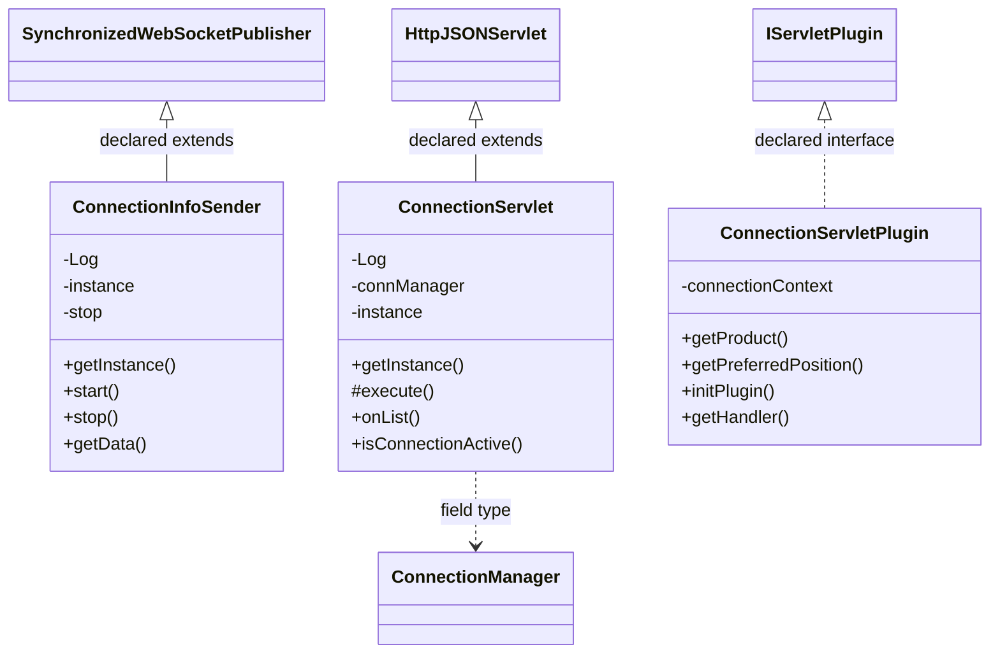

# DataManagerConnections.jar

[Workspace/group index](README.md)  |  [All workspaces](../README.md)

## Scope and provenance

- Artifact: `SQX_REFERENCE_ROOT/internal/plugins/DataManagerConnections/DataManagerConnections.jar`.
- SHA-256: `8978514482bcc046e28887fea63697c880dcaa3340fb62b9084ab71400300ab8`.
- Inspected: 2026-10-05; generation timestamp `2026-10-05T19:04:16.344170+00:00`.
- Archive class entries: **3**; non-nested: **3**; nested/anonymous: **0**.
- Inspection: ZIP entry/manifest enumeration and `javap -p` declarations for every listed class.
- Repository source HEAD: `8a92c705183a6702eaf62037ccb202ed028aa899`; review state: generated, pending owner review.
- Installed SQX build number is unverified. No method bodies are reproduced.
- Confidence: high for declared structure; workspace ownership inferred except where registration evidence is separately stated. Runtime reachability, call order, formulas and parity remain unverified.

The `DataManager` folder is a navigation/research grouping, not an exclusive backend owner. Shared consumers may use this JAR.

Target mapping: no verified owning HaruQuantAI feature/requirement/decision IDs are assigned by this document. Register or resolve ownership through the normal repository plan before implementation.

## Diagram reading guide

`Parent <|-- Child` means declared inheritance; `Interface <|.. Class` means declared implementation. Interface extension uses the inheritance arrow. `A ..> B : field type` is a declared type dependency, not composition, object ownership or a runtime call. External nodes are referenced types, not fabricated local implementations. Selected fields/method names aid navigation: `+` is public, `#` protected and `-` private. Diagram method names omit parameter/return types and collapse overloads; use the exact inspected declarations below before implementing an API.

Detailed graphs include non-nested classes in package-sized groups of at most 12. Nested/anonymous classes are inventoried and their declarations/relationships are retained below, but omitted from overview graphs. Relationships not drawn for readability remain in the complete declaration-relationship table. Constructors, synthetic bridges and overloads may be collapsed in diagram member lists only. Standard `java.lang.Object` inheritance is omitted from diagrams.

## UML class diagrams

### 1. `com.strategyquant.plugin.DataManager.impl.Connections`



| Diagram identifier | Exact type | Location |
| --- | --- | --- |
| `C8d18e5b2dae8` | `com.strategyquant.plugin.DataManager.impl.Connections.ConnectionInfoSender` (this JAR) | this diagram |
| `C0d4a530dec24` | `com.strategyquant.plugin.DataManager.impl.Connections.ConnectionServlet` (this JAR) | this diagram |
| `C86968828e451` | `com.strategyquant.plugin.DataManager.impl.Connections.ConnectionServletPlugin` (this JAR) | this diagram |
| `C001b68001ef7` | [`com.strategyquant.tradinglib.connection.ConnectionManager`](../Shared/SQTradingLib.md) | referenced external type |
| `Ce87cf9854aad` | [`com.strategyquant.tradinglib.project.websocket.SynchronizedWebSocketPublisher`](../Shared/SQTradingLib.md) | referenced external type |
| `C249b5c671b1a` | [`com.strategyquant.tradinglib.servlet.IServletPlugin`](../Shared/SQTradingLib.md) | referenced external type |
| `C8900f90ae594` | [`com.strategyquant.webguilib.servlet.HttpJSONServlet`](../Shared/SQWebGUILib.md) | referenced external type |

## Complete class inventory

| Fully qualified class | Kind | Entry |
| --- | --- | --- |
| `com.strategyquant.plugin.DataManager.impl.Connections.ConnectionInfoSender` | class | non-nested |
| `com.strategyquant.plugin.DataManager.impl.Connections.ConnectionServlet` | class | non-nested |
| `com.strategyquant.plugin.DataManager.impl.Connections.ConnectionServletPlugin` | class | non-nested |

## Declared relationships and evidence locations

Every row is supported by the named class declaration/member in `javap -p`, inside the artifact recorded above. Signature dependencies may include return, parameter, generic-argument and throws types; they do not imply execution.

| Declaring class | Referenced type | Relationship | Narrow inspection location |
| --- | --- | --- | --- |
| `com.strategyquant.plugin.DataManager.impl.Connections.ConnectionInfoSender` | [`com.strategyquant.tradinglib.project.websocket.SynchronizedWebSocketPublisher`](../Shared/SQTradingLib.md) | extends | `com.strategyquant.plugin.DataManager.impl.Connections.ConnectionInfoSender` / class declaration: `public class com.strategyquant.plugin.DataManager.impl.Connections.ConnectionInfoSender extends com.strategyquant.tradinglib.project.websocket.SynchronizedWebSocketPublisher` |
| `com.strategyquant.plugin.DataManager.impl.Connections.ConnectionInfoSender` | `org.slf4j.Logger` (not resolved in scoped archives) | type dependency | `com.strategyquant.plugin.DataManager.impl.Connections.ConnectionInfoSender` / field declaration: `private static final org.slf4j.Logger Log;` |
| `com.strategyquant.plugin.DataManager.impl.Connections.ConnectionInfoSender` | [`com.strategyquant.tradinglib.project.websocket.DataToSend`](../Shared/SQTradingLib.md) | type dependency | `com.strategyquant.plugin.DataManager.impl.Connections.ConnectionInfoSender` / method signature: `public com.strategyquant.tradinglib.project.websocket.DataToSend getData();` |
| `com.strategyquant.plugin.DataManager.impl.Connections.ConnectionServlet` | [`com.strategyquant.webguilib.servlet.HttpJSONServlet`](../Shared/SQWebGUILib.md) | extends | `com.strategyquant.plugin.DataManager.impl.Connections.ConnectionServlet` / class declaration: `public class com.strategyquant.plugin.DataManager.impl.Connections.ConnectionServlet extends com.strategyquant.webguilib.servlet.HttpJSONServlet` |
| `com.strategyquant.plugin.DataManager.impl.Connections.ConnectionServlet` | `org.slf4j.Logger` (not resolved in scoped archives) | type dependency | `com.strategyquant.plugin.DataManager.impl.Connections.ConnectionServlet` / field declaration: `private static final org.slf4j.Logger Log;` |
| `com.strategyquant.plugin.DataManager.impl.Connections.ConnectionServlet` | [`com.strategyquant.tradinglib.connection.ConnectionManager`](../Shared/SQTradingLib.md) | type dependency | `com.strategyquant.plugin.DataManager.impl.Connections.ConnectionServlet` / field declaration: `private com.strategyquant.tradinglib.connection.ConnectionManager connManager;` |
| `com.strategyquant.plugin.DataManager.impl.Connections.ConnectionServlet` | `java.lang.String` (not resolved in scoped archives) | type dependency | `com.strategyquant.plugin.DataManager.impl.Connections.ConnectionServlet` / method signature: `protected java.lang.String execute(java.lang.String, java.util.Map<java.lang.String, java.lang.String[]>, java.lang.String);`<br>`private java.lang.String onAdd(java.util.Map<java.lang.String, java.lang.String[]>);`<br>`public java.lang.String onList();`<br>`private java.lang.String onListPlugins();`<br>`private java.lang.String onRemove(java.util.Map<java.lang.String, java.lang.String[]>);`<br>`private java.lang.String onEdit(java.util.Map<java.lang.String, java.lang.String[]>);`<br>`public boolean isConnectionActive(java.lang.String);` |
| `com.strategyquant.plugin.DataManager.impl.Connections.ConnectionServlet` | `java.util.Map` (not resolved in scoped archives) | type dependency | `com.strategyquant.plugin.DataManager.impl.Connections.ConnectionServlet` / method signature: `protected java.lang.String execute(java.lang.String, java.util.Map<java.lang.String, java.lang.String[]>, java.lang.String);`<br>`private java.lang.String onAdd(java.util.Map<java.lang.String, java.lang.String[]>);`<br>`private java.lang.String onRemove(java.util.Map<java.lang.String, java.lang.String[]>);`<br>`private java.lang.String onEdit(java.util.Map<java.lang.String, java.lang.String[]>);` |
| `com.strategyquant.plugin.DataManager.impl.Connections.ConnectionServletPlugin` | [`com.strategyquant.tradinglib.servlet.IServletPlugin`](../Shared/SQTradingLib.md) | implements | `com.strategyquant.plugin.DataManager.impl.Connections.ConnectionServletPlugin` / class declaration: `public class com.strategyquant.plugin.DataManager.impl.Connections.ConnectionServletPlugin implements com.strategyquant.tradinglib.servlet.IServletPlugin` |
| `com.strategyquant.plugin.DataManager.impl.Connections.ConnectionServletPlugin` | `org.eclipse.jetty.servlet.ServletContextHandler` (not resolved in scoped archives) | type dependency | `com.strategyquant.plugin.DataManager.impl.Connections.ConnectionServletPlugin` / field declaration: `private org.eclipse.jetty.servlet.ServletContextHandler connectionContext;` |
| `com.strategyquant.plugin.DataManager.impl.Connections.ConnectionServletPlugin` | `java.lang.String` (not resolved in scoped archives) | type dependency | `com.strategyquant.plugin.DataManager.impl.Connections.ConnectionServletPlugin` / method signature: `public java.lang.String getProduct();` |
| `com.strategyquant.plugin.DataManager.impl.Connections.ConnectionServletPlugin` | `java.lang.Exception` (not resolved in scoped archives) | type dependency | `com.strategyquant.plugin.DataManager.impl.Connections.ConnectionServletPlugin` / method signature: `public void initPlugin() throws java.lang.Exception;` |
| `com.strategyquant.plugin.DataManager.impl.Connections.ConnectionServletPlugin` | `org.eclipse.jetty.server.Handler` (not resolved in scoped archives) | type dependency | `com.strategyquant.plugin.DataManager.impl.Connections.ConnectionServletPlugin` / method signature: `public org.eclipse.jetty.server.Handler getHandler();` |

## Inspected declaration reference

These are structural API/member declarations, not proprietary implementation bodies. Private members and nested classes are retained to make diagram omissions explicit; declarations do not prove behavior.

<details>
<summary>com.strategyquant.plugin.DataManager.impl.Connections.ConnectionInfoSender</summary>

```text
public class com.strategyquant.plugin.DataManager.impl.Connections.ConnectionInfoSender extends com.strategyquant.tradinglib.project.websocket.SynchronizedWebSocketPublisher
    private static final org.slf4j.Logger Log;
    private static com.strategyquant.plugin.DataManager.impl.Connections.ConnectionInfoSender instance;
    private boolean stop;
    public com.strategyquant.plugin.DataManager.impl.Connections.ConnectionInfoSender();
    public static com.strategyquant.plugin.DataManager.impl.Connections.ConnectionInfoSender getInstance();
    public void start();
    public void stop();
    public com.strategyquant.tradinglib.project.websocket.DataToSend getData();
    public void resetLastData();
```

</details>

<details>
<summary>com.strategyquant.plugin.DataManager.impl.Connections.ConnectionServlet</summary>

```text
public class com.strategyquant.plugin.DataManager.impl.Connections.ConnectionServlet extends com.strategyquant.webguilib.servlet.HttpJSONServlet
    private static final org.slf4j.Logger Log;
    private com.strategyquant.tradinglib.connection.ConnectionManager connManager;
    private static com.strategyquant.plugin.DataManager.impl.Connections.ConnectionServlet instance;
    public com.strategyquant.plugin.DataManager.impl.Connections.ConnectionServlet();
    public static com.strategyquant.plugin.DataManager.impl.Connections.ConnectionServlet getInstance();
    protected java.lang.String execute(java.lang.String, java.util.Map<java.lang.String, java.lang.String[]>, java.lang.String);
    private java.lang.String onAdd(java.util.Map<java.lang.String, java.lang.String[]>);
    public java.lang.String onList();
    private java.lang.String onListPlugins();
    private java.lang.String onRemove(java.util.Map<java.lang.String, java.lang.String[]>);
    private java.lang.String onEdit(java.util.Map<java.lang.String, java.lang.String[]>);
    public boolean isConnectionActive(java.lang.String);
```

</details>

<details>
<summary>com.strategyquant.plugin.DataManager.impl.Connections.ConnectionServletPlugin</summary>

```text
public class com.strategyquant.plugin.DataManager.impl.Connections.ConnectionServletPlugin implements com.strategyquant.tradinglib.servlet.IServletPlugin
    private org.eclipse.jetty.servlet.ServletContextHandler connectionContext;
    public com.strategyquant.plugin.DataManager.impl.Connections.ConnectionServletPlugin();
    public java.lang.String getProduct();
    public int getPreferredPosition();
    public void initPlugin() throws java.lang.Exception;
    public org.eclipse.jetty.server.Handler getHandler();
```

</details>

## Validation and unresolved gaps

Archive hash and complete class inventory were checked against the inspected local artifact. Declaration extraction accounts for every inventoried class. Documentation/link/diagram structural verification is recorded in the master index and task walkthrough; no SQX runtime validation was performed.

The canonical reimplementation ledger/schema are absent, so no evidence IDs or validation-passed ledger claims are created. This is a donor structural reference. Exact behavior, default values, failure semantics, algorithms, runtime calls and target architectural choices require separate research. No aggregation/composition or cardinalities are inferred.
