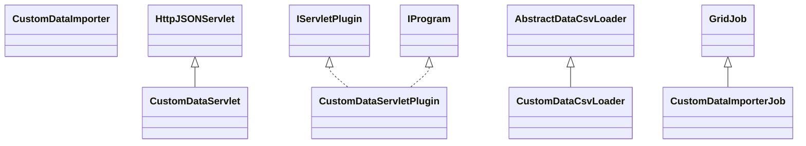

# DataManagerCustomData.jar

[Group index](README.md) | [All archives](../README.md)

## Scope and provenance

- **Donor:** `SQX_145_REFERENCE_ROOT/internal/plugins/DataManagerCustomData/DataManagerCustomData.jar`.
- **SHA-256:** `4339edcc665b0b9b540cfc2802c8ef207a8e3180931a314c70a7d0ebccdae316`; accessed 2026-10-06; captured `2026-10-06T18:54:51.906614+00:00`.
- **Classes:** 6 raw entries; 6 unique entry names. Duplicate occurrence indices are zero-based.
- **Inspection:** read-only ZIP hashing and class-file structural parsing; signatures/descriptors, modifiers, hierarchy and references only. Bytecode bodies are hashed, not published.
- **Allocation:** proposed `FEAT-DATA-DATA-MANAGER-CUSTOM-DATA`, P03; [roadmap](../../dev/sqx-full-application-roadmap.md). Domain README registration remains required.
- **Repository:** `01067f00031428613c6394064ca1bcadc1ba00ee`; review state unreviewed. Download label 145-dev1; installed build/activation and runtime equivalence unverified.
- **Limit:** every class/member is inventoried; declaration coverage does not establish consumed calls, defaults, formulas, failure semantics or algorithm parity.
- **Archive/resource index:** [168.json](../../dev/evidence/sqx145/archives/145/168.json).

## Complete member declarations

Member shards contain exact JVM names/descriptors, access flags, generic signatures, throws types, declared fields/methods, superclass/interfaces and referenced class names. All classes, nested/synthetic members and overloads are retained. Code length/hash is structural evidence, not a normalized algorithm comparison.

- [001.json](../../dev/evidence/sqx145/members/168/001.json) — SHA-256 `d6b5fb93774fec80c7e88ebb60dd821054b78ba338d89d9e173209a2ad7d19ab`.

## Focused structural diagram

Up to twelve non-nested classes; arrows show declared inheritance/interfaces only. External type names are not evidence of an available body or an executed dependency.

## Class inventory

| Archive entry | Occurrence | Class SHA-256 | Fields | Methods |
| --- | ---: | --- | ---: | ---: |
| `com/strategyquant/plugin/DataManager/impl/CustomData/CustomDataServlet$1.class` | 0 | `5dee27308491b3b09636f4657a0e938e35438cc245167186da58107907becc50` | 0 | 3 |
| `com/strategyquant/plugin/DataManager/impl/CustomData/CustomDataServlet.class` | 0 | `b9fe4265df58550f5eb9d128d3339db5e3b8ddd69d3a9e6ef7dd5505d5284ffc` | 3 | 31 |
| `com/strategyquant/plugin/DataManager/impl/CustomData/CustomDataServletPlugin.class` | 0 | `ffcdde1d26fcade0e94d6b086411500321d862778720472ae56a07d758f87578` | 2 | 6 |
| `com/strategyquant/plugin/DataManager/impl/CustomData/job/CustomDataCsvLoader.class` | 0 | `a5dfb72e4e3c4d24dc045514e65c4e4a050ff2290ecf750b0790d921252351da` | 4 | 5 |
| `com/strategyquant/plugin/DataManager/impl/CustomData/job/CustomDataImporter.class` | 0 | `c75d4824dccb64a57743f9569730e422765cbffa4fbaafc0b7ae9387d110399e` | 6 | 11 |
| `com/strategyquant/plugin/DataManager/impl/CustomData/job/CustomDataImporterJob.class` | 0 | `3e82c4280fdf1ec3ad9d90912f9fdf686891b1fa448a86d95299c2504321491b` | 4 | 5 |
