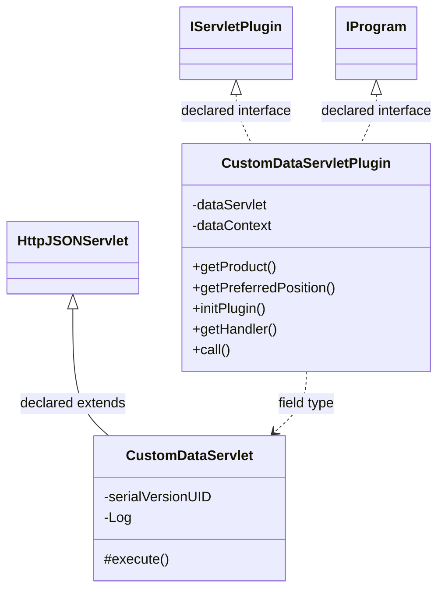
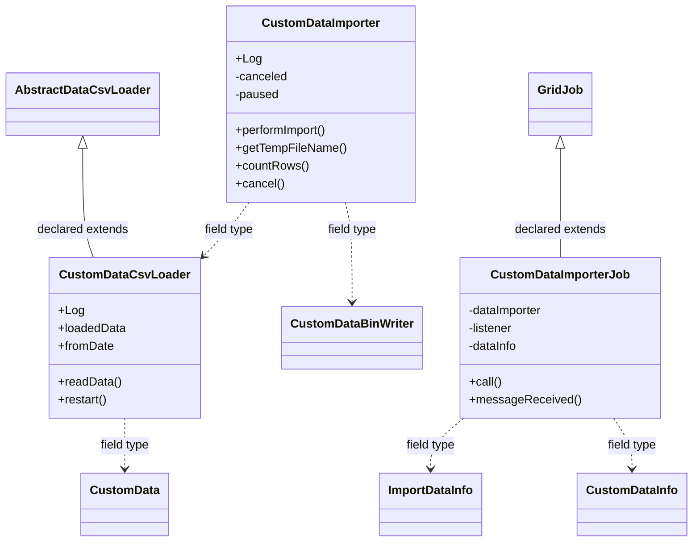

# DataManagerCustomData.jar

[Workspace/group index](README.md)  |  [All workspaces](../README.md)

## Scope and provenance

- Artifact: `SQX_REFERENCE_ROOT/internal/plugins/DataManagerCustomData/DataManagerCustomData.jar`.
- SHA-256: `6fd3ed5e49ae80ff29fd08498ce46644b17a38c17c829503788c9bb4cf9f91d9`.
- Inspected: 2026-10-05; generation timestamp `2026-10-05T19:04:16.344170+00:00`.
- Archive class entries: **5**; non-nested: **5**; nested/anonymous: **0**.
- Inspection: ZIP entry/manifest enumeration and `javap -p` declarations for every listed class.
- Repository source HEAD: `8a92c705183a6702eaf62037ccb202ed028aa899`; review state: generated, pending owner review.
- Installed SQX build number is unverified. No method bodies are reproduced.
- Confidence: high for declared structure; workspace ownership inferred except where registration evidence is separately stated. Runtime reachability, call order, formulas and parity remain unverified.

The `DataManager` folder is a navigation/research grouping, not an exclusive backend owner. Shared consumers may use this JAR.

Target mapping: no verified owning HaruQuantAI feature/requirement/decision IDs are assigned by this document. Register or resolve ownership through the normal repository plan before implementation.

## Diagram reading guide

`Parent <|-- Child` means declared inheritance; `Interface <|.. Class` means declared implementation. Interface extension uses the inheritance arrow. `A ..> B : field type` is a declared type dependency, not composition, object ownership or a runtime call. External nodes are referenced types, not fabricated local implementations. Selected fields/method names aid navigation: `+` is public, `#` protected and `-` private. Diagram method names omit parameter/return types and collapse overloads; use the exact inspected declarations below before implementing an API.

Detailed graphs include non-nested classes in package-sized groups of at most 12. Nested/anonymous classes are inventoried and their declarations/relationships are retained below, but omitted from overview graphs. Relationships not drawn for readability remain in the complete declaration-relationship table. Constructors, synthetic bridges and overloads may be collapsed in diagram member lists only. Standard `java.lang.Object` inheritance is omitted from diagrams.

## UML class diagrams

### 1. `com.strategyquant.plugin.DataManager.impl.CustomData`



| Diagram identifier | Exact type | Location |
| --- | --- | --- |
| `Cef0b39c585de` | `com.strategyquant.plugin.DataManager.impl.CustomData.CustomDataServlet` (this JAR) | this diagram |
| `C3fb9aa899058` | `com.strategyquant.plugin.DataManager.impl.CustomData.CustomDataServletPlugin` (this JAR) | this diagram |
| `C1b6b4448b67b` | [`com.strategyquant.pluginlib.program.IProgram`](../Shared/SQPluginLib.md) | referenced external type |
| `C249b5c671b1a` | [`com.strategyquant.tradinglib.servlet.IServletPlugin`](../Shared/SQTradingLib.md) | referenced external type |
| `C8900f90ae594` | [`com.strategyquant.webguilib.servlet.HttpJSONServlet`](../Shared/SQWebGUILib.md) | referenced external type |

### 2. `com.strategyquant.plugin.DataManager.impl.CustomData.job`



| Diagram identifier | Exact type | Location |
| --- | --- | --- |
| `C82154e4e3034` | [`com.strategyquant.datalib.customData.CustomData`](../Shared/SQDataLib.md) | referenced external type |
| `Cae6a89b967b0` | [`com.strategyquant.datalib.customData.CustomDataBinWriter`](../Shared/SQDataLib.md) | referenced external type |
| `Cf849f7783b12` | [`com.strategyquant.datalib.customData.CustomDataInfo`](../Shared/SQDataLib.md) | referenced external type |
| `C555f2ebba2b8` | [`com.strategyquant.datalib.data.io.AbstractDataCsvLoader`](../Shared/SQDataLib.md) | referenced external type |
| `C1241a9ebc3a6` | [`com.strategyquant.datalib.data.io.ImportDataInfo`](../Shared/SQDataLib.md) | referenced external type |
| `C729a56512564` | [`com.strategyquant.gridlib.client.GridJob`](../Shared/SQGridLib2.md) | referenced external type |
| `C700a3449402b` | `com.strategyquant.plugin.DataManager.impl.CustomData.job.CustomDataCsvLoader` (this JAR) | this diagram |
| `C6486bb7b87a1` | `com.strategyquant.plugin.DataManager.impl.CustomData.job.CustomDataImporter` (this JAR) | this diagram |
| `C01b7a48b90eb` | `com.strategyquant.plugin.DataManager.impl.CustomData.job.CustomDataImporterJob` (this JAR) | this diagram |

## Complete class inventory

| Fully qualified class | Kind | Entry |
| --- | --- | --- |
| `com.strategyquant.plugin.DataManager.impl.CustomData.CustomDataServlet` | class | non-nested |
| `com.strategyquant.plugin.DataManager.impl.CustomData.CustomDataServletPlugin` | class | non-nested |
| `com.strategyquant.plugin.DataManager.impl.CustomData.job.CustomDataCsvLoader` | class | non-nested |
| `com.strategyquant.plugin.DataManager.impl.CustomData.job.CustomDataImporter` | class | non-nested |
| `com.strategyquant.plugin.DataManager.impl.CustomData.job.CustomDataImporterJob` | class | non-nested |

## Declared relationships and evidence locations

Every row is supported by the named class declaration/member in `javap -p`, inside the artifact recorded above. Signature dependencies may include return, parameter, generic-argument and throws types; they do not imply execution.

| Declaring class | Referenced type | Relationship | Narrow inspection location |
| --- | --- | --- | --- |
| `com.strategyquant.plugin.DataManager.impl.CustomData.CustomDataServlet` | [`com.strategyquant.webguilib.servlet.HttpJSONServlet`](../Shared/SQWebGUILib.md) | extends | `com.strategyquant.plugin.DataManager.impl.CustomData.CustomDataServlet` / class declaration: `public class com.strategyquant.plugin.DataManager.impl.CustomData.CustomDataServlet extends com.strategyquant.webguilib.servlet.HttpJSONServlet` |
| `com.strategyquant.plugin.DataManager.impl.CustomData.CustomDataServlet` | `org.slf4j.Logger` (not resolved in scoped archives) | type dependency | `com.strategyquant.plugin.DataManager.impl.CustomData.CustomDataServlet` / field declaration: `private static final org.slf4j.Logger Log;` |
| `com.strategyquant.plugin.DataManager.impl.CustomData.CustomDataServlet` | `java.lang.String` (not resolved in scoped archives) | type dependency | `com.strategyquant.plugin.DataManager.impl.CustomData.CustomDataServlet` / method signature: `protected java.lang.String execute(java.lang.String, java.util.Map<java.lang.String, java.lang.String[]>, java.lang.String) throws java.lang.Exception;`<br>`private java.lang.String onRecognizeFromFile(java.util.Map<java.lang.String, java.lang.String[]>) throws java.lang.Exception;`<br>`private java.lang.String onReviewData(java.util.Map<java.lang.String, java.lang.String[]>) throws java.lang.Exception;`<br>`private java.lang.String onList(java.util.Map<java.lang.String, java.lang.String[]>);`<br>`private java.lang.String onAdd(java.util.Map<java.lang.String, java.lang.String[]>);`<br>`private java.lang.String onEdit(java.util.Map<java.lang.String, java.lang.String[]>) throws java.lang.Exception;`<br>`private java.lang.String onClear(java.util.Map<java.lang.String, java.lang.String[]>);`<br>`private java.lang.String onRemove(java.util.Map<java.lang.String, java.lang.String[]>);`<br>`private java.lang.String onImportGetInfo();`<br>`private java.lang.String onImportGetOverview(java.util.Map<java.lang.String, java.lang.String[]>);`<br>`private java.lang.String onImportData(java.util.Map<java.lang.String, java.lang.String[]>);`<br>`private java.lang.String onImportAction(java.util.Map<java.lang.String, java.lang.String[]>) throws java.lang.Exception;`<br>`private java.lang.String onImportSaveNewDataFormat(java.util.Map<java.lang.String, java.lang.String[]>);`<br>`private java.lang.String onImportDeleteDataFormat(java.util.Map<java.lang.String, java.lang.String[]>);`<br>`private java.lang.String onImportUpdateDataFormat(java.util.Map<java.lang.String, java.lang.String[]>);`<br>`private com.strategyquant.datalib.data.imports.CustomDataFormat getFileFormat(java.util.Map<java.lang.String, java.lang.String[]>) throws java.lang.Exception;`<br>`private void sendDataUpdate(java.lang.String, java.lang.String);`<br>`private java.lang.String onLoad(java.util.Map<java.lang.String, java.lang.String[]>);`<br>`private java.lang.String onSave(java.util.Map<java.lang.String, java.lang.String[]>);`<br>`private java.lang.String onImportDataCli(java.util.Map<java.lang.String, java.lang.String[]>);` |
| `com.strategyquant.plugin.DataManager.impl.CustomData.CustomDataServlet` | `java.util.Map` (not resolved in scoped archives) | type dependency | `com.strategyquant.plugin.DataManager.impl.CustomData.CustomDataServlet` / method signature: `protected java.lang.String execute(java.lang.String, java.util.Map<java.lang.String, java.lang.String[]>, java.lang.String) throws java.lang.Exception;`<br>`private java.lang.String onRecognizeFromFile(java.util.Map<java.lang.String, java.lang.String[]>) throws java.lang.Exception;`<br>`private java.lang.String onReviewData(java.util.Map<java.lang.String, java.lang.String[]>) throws java.lang.Exception;`<br>`private java.lang.String onList(java.util.Map<java.lang.String, java.lang.String[]>);`<br>`private java.lang.String onAdd(java.util.Map<java.lang.String, java.lang.String[]>);`<br>`private java.lang.String onEdit(java.util.Map<java.lang.String, java.lang.String[]>) throws java.lang.Exception;`<br>`private java.lang.String onClear(java.util.Map<java.lang.String, java.lang.String[]>);`<br>`private java.lang.String onRemove(java.util.Map<java.lang.String, java.lang.String[]>);`<br>`private java.lang.String onImportGetOverview(java.util.Map<java.lang.String, java.lang.String[]>);`<br>`private java.lang.String onImportData(java.util.Map<java.lang.String, java.lang.String[]>);`<br>`private java.lang.String onImportAction(java.util.Map<java.lang.String, java.lang.String[]>) throws java.lang.Exception;`<br>`private java.lang.String onImportSaveNewDataFormat(java.util.Map<java.lang.String, java.lang.String[]>);`<br>`private java.lang.String onImportDeleteDataFormat(java.util.Map<java.lang.String, java.lang.String[]>);`<br>`private java.lang.String onImportUpdateDataFormat(java.util.Map<java.lang.String, java.lang.String[]>);`<br>`private com.strategyquant.datalib.data.imports.CustomDataFormat getFileFormat(java.util.Map<java.lang.String, java.lang.String[]>) throws java.lang.Exception;`<br>`private java.lang.String onLoad(java.util.Map<java.lang.String, java.lang.String[]>);`<br>`private java.lang.String onSave(java.util.Map<java.lang.String, java.lang.String[]>);`<br>`private java.lang.String onImportDataCli(java.util.Map<java.lang.String, java.lang.String[]>);` |
| `com.strategyquant.plugin.DataManager.impl.CustomData.CustomDataServlet` | `java.lang.Exception` (not resolved in scoped archives) | type dependency | `com.strategyquant.plugin.DataManager.impl.CustomData.CustomDataServlet` / method signature: `protected java.lang.String execute(java.lang.String, java.util.Map<java.lang.String, java.lang.String[]>, java.lang.String) throws java.lang.Exception;`<br>`private java.lang.String onRecognizeFromFile(java.util.Map<java.lang.String, java.lang.String[]>) throws java.lang.Exception;`<br>`private java.lang.String onReviewData(java.util.Map<java.lang.String, java.lang.String[]>) throws java.lang.Exception;`<br>`private java.lang.String onEdit(java.util.Map<java.lang.String, java.lang.String[]>) throws java.lang.Exception;`<br>`private java.lang.String onImportAction(java.util.Map<java.lang.String, java.lang.String[]>) throws java.lang.Exception;`<br>`private com.strategyquant.datalib.data.imports.CustomDataFormat getFileFormat(java.util.Map<java.lang.String, java.lang.String[]>) throws java.lang.Exception;` |
| `com.strategyquant.plugin.DataManager.impl.CustomData.CustomDataServlet` | `org.json.JSONArray` (not resolved in scoped archives) | type dependency | `com.strategyquant.plugin.DataManager.impl.CustomData.CustomDataServlet` / method signature: `private org.json.JSONArray fillMissingValues(com.strategyquant.datalib.data.imports.CustomDataFormat, org.json.JSONArray);`<br>`private org.json.JSONArray listColumnTypes(java.util.HashMap<java.lang.Integer, com.strategyquant.datalib.data.io.columns.DefaultCol>);` |
| `com.strategyquant.plugin.DataManager.impl.CustomData.CustomDataServlet` | [`com.strategyquant.datalib.data.imports.CustomDataFormat`](../Shared/SQDataLib.md) | type dependency | `com.strategyquant.plugin.DataManager.impl.CustomData.CustomDataServlet` / method signature: `private org.json.JSONArray fillMissingValues(com.strategyquant.datalib.data.imports.CustomDataFormat, org.json.JSONArray);`<br>`private com.strategyquant.datalib.data.imports.CustomDataFormat getFileFormat(java.util.Map<java.lang.String, java.lang.String[]>) throws java.lang.Exception;` |
| `com.strategyquant.plugin.DataManager.impl.CustomData.CustomDataServlet` | `java.util.HashMap` (not resolved in scoped archives) | type dependency | `com.strategyquant.plugin.DataManager.impl.CustomData.CustomDataServlet` / method signature: `private org.json.JSONArray listColumnTypes(java.util.HashMap<java.lang.Integer, com.strategyquant.datalib.data.io.columns.DefaultCol>);` |
| `com.strategyquant.plugin.DataManager.impl.CustomData.CustomDataServlet` | `java.lang.Integer` (not resolved in scoped archives) | type dependency | `com.strategyquant.plugin.DataManager.impl.CustomData.CustomDataServlet` / method signature: `private org.json.JSONArray listColumnTypes(java.util.HashMap<java.lang.Integer, com.strategyquant.datalib.data.io.columns.DefaultCol>);` |
| `com.strategyquant.plugin.DataManager.impl.CustomData.CustomDataServlet` | [`com.strategyquant.datalib.data.io.columns.DefaultCol`](../Shared/SQDataLib.md) | type dependency | `com.strategyquant.plugin.DataManager.impl.CustomData.CustomDataServlet` / method signature: `private org.json.JSONArray listColumnTypes(java.util.HashMap<java.lang.Integer, com.strategyquant.datalib.data.io.columns.DefaultCol>);` |
| `com.strategyquant.plugin.DataManager.impl.CustomData.CustomDataServletPlugin` | [`com.strategyquant.tradinglib.servlet.IServletPlugin`](../Shared/SQTradingLib.md) | implements | `com.strategyquant.plugin.DataManager.impl.CustomData.CustomDataServletPlugin` / class declaration: `public class com.strategyquant.plugin.DataManager.impl.CustomData.CustomDataServletPlugin implements com.strategyquant.tradinglib.servlet.IServletPlugin,com.strategyquant.pluginlib.program.IProgram` |
| `com.strategyquant.plugin.DataManager.impl.CustomData.CustomDataServletPlugin` | [`com.strategyquant.pluginlib.program.IProgram`](../Shared/SQPluginLib.md) | implements | `com.strategyquant.plugin.DataManager.impl.CustomData.CustomDataServletPlugin` / class declaration: `public class com.strategyquant.plugin.DataManager.impl.CustomData.CustomDataServletPlugin implements com.strategyquant.tradinglib.servlet.IServletPlugin,com.strategyquant.pluginlib.program.IProgram` |
| `com.strategyquant.plugin.DataManager.impl.CustomData.CustomDataServletPlugin` | `com.strategyquant.plugin.DataManager.impl.CustomData.CustomDataServlet` (this JAR) | type dependency | `com.strategyquant.plugin.DataManager.impl.CustomData.CustomDataServletPlugin` / field declaration: `private com.strategyquant.plugin.DataManager.impl.CustomData.CustomDataServlet dataServlet;` |
| `com.strategyquant.plugin.DataManager.impl.CustomData.CustomDataServletPlugin` | `org.eclipse.jetty.servlet.ServletContextHandler` (not resolved in scoped archives) | type dependency | `com.strategyquant.plugin.DataManager.impl.CustomData.CustomDataServletPlugin` / field declaration: `private org.eclipse.jetty.servlet.ServletContextHandler dataContext;` |
| `com.strategyquant.plugin.DataManager.impl.CustomData.CustomDataServletPlugin` | `java.lang.String` (not resolved in scoped archives) | type dependency | `com.strategyquant.plugin.DataManager.impl.CustomData.CustomDataServletPlugin` / method signature: `public java.lang.String getProduct();`<br>`public java.lang.Object call(java.lang.String, java.lang.Object...) throws java.lang.Exception;` |
| `com.strategyquant.plugin.DataManager.impl.CustomData.CustomDataServletPlugin` | `java.lang.Exception` (not resolved in scoped archives) | type dependency | `com.strategyquant.plugin.DataManager.impl.CustomData.CustomDataServletPlugin` / method signature: `public void initPlugin() throws java.lang.Exception;`<br>`public java.lang.Object call(java.lang.String, java.lang.Object...) throws java.lang.Exception;` |
| `com.strategyquant.plugin.DataManager.impl.CustomData.CustomDataServletPlugin` | `org.eclipse.jetty.server.Handler` (not resolved in scoped archives) | type dependency | `com.strategyquant.plugin.DataManager.impl.CustomData.CustomDataServletPlugin` / method signature: `public org.eclipse.jetty.server.Handler getHandler();` |
| `com.strategyquant.plugin.DataManager.impl.CustomData.CustomDataServletPlugin` | `java.lang.Object` (not resolved in scoped archives) | type dependency | `com.strategyquant.plugin.DataManager.impl.CustomData.CustomDataServletPlugin` / method signature: `public java.lang.Object call(java.lang.String, java.lang.Object...) throws java.lang.Exception;` |
| `com.strategyquant.plugin.DataManager.impl.CustomData.job.CustomDataCsvLoader` | [`com.strategyquant.datalib.data.io.AbstractDataCsvLoader`](../Shared/SQDataLib.md) | extends | `com.strategyquant.plugin.DataManager.impl.CustomData.job.CustomDataCsvLoader` / class declaration: `public class com.strategyquant.plugin.DataManager.impl.CustomData.job.CustomDataCsvLoader extends com.strategyquant.datalib.data.io.AbstractDataCsvLoader` |
| `com.strategyquant.plugin.DataManager.impl.CustomData.job.CustomDataCsvLoader` | `org.slf4j.Logger` (not resolved in scoped archives) | type dependency | `com.strategyquant.plugin.DataManager.impl.CustomData.job.CustomDataCsvLoader` / field declaration: `public static final org.slf4j.Logger Log;` |
| `com.strategyquant.plugin.DataManager.impl.CustomData.job.CustomDataCsvLoader` | [`com.strategyquant.datalib.customData.CustomData`](../Shared/SQDataLib.md) | type dependency | `com.strategyquant.plugin.DataManager.impl.CustomData.job.CustomDataCsvLoader` / field declaration: `public com.strategyquant.datalib.customData.CustomData loadedData;` |
| `com.strategyquant.plugin.DataManager.impl.CustomData.job.CustomDataCsvLoader` | `com.strategyquant.lib.utils.IProgressListener` (not resolved in scoped archives) | type dependency | `com.strategyquant.plugin.DataManager.impl.CustomData.job.CustomDataCsvLoader` / method signature: `public com.strategyquant.plugin.DataManager.impl.CustomData.job.CustomDataCsvLoader(com.strategyquant.lib.utils.IProgressListener, com.strategyquant.datalib.customData.CustomDataInfo, com.strategyquant.datalib.data.io.ImportDataInfo);` |
| `com.strategyquant.plugin.DataManager.impl.CustomData.job.CustomDataCsvLoader` | [`com.strategyquant.datalib.customData.CustomDataInfo`](../Shared/SQDataLib.md) | type dependency | `com.strategyquant.plugin.DataManager.impl.CustomData.job.CustomDataCsvLoader` / method signature: `public com.strategyquant.plugin.DataManager.impl.CustomData.job.CustomDataCsvLoader(com.strategyquant.lib.utils.IProgressListener, com.strategyquant.datalib.customData.CustomDataInfo, com.strategyquant.datalib.data.io.ImportDataInfo);` |
| `com.strategyquant.plugin.DataManager.impl.CustomData.job.CustomDataCsvLoader` | [`com.strategyquant.datalib.data.io.ImportDataInfo`](../Shared/SQDataLib.md) | type dependency | `com.strategyquant.plugin.DataManager.impl.CustomData.job.CustomDataCsvLoader` / method signature: `public com.strategyquant.plugin.DataManager.impl.CustomData.job.CustomDataCsvLoader(com.strategyquant.lib.utils.IProgressListener, com.strategyquant.datalib.customData.CustomDataInfo, com.strategyquant.datalib.data.io.ImportDataInfo);` |
| `com.strategyquant.plugin.DataManager.impl.CustomData.job.CustomDataCsvLoader` | `java.lang.Exception` (not resolved in scoped archives) | type dependency | `com.strategyquant.plugin.DataManager.impl.CustomData.job.CustomDataCsvLoader` / method signature: `public boolean readData() throws java.lang.Exception;` |
| `com.strategyquant.plugin.DataManager.impl.CustomData.job.CustomDataCsvLoader` | `java.lang.Object` (not resolved in scoped archives) | type dependency | `com.strategyquant.plugin.DataManager.impl.CustomData.job.CustomDataCsvLoader` / method signature: `private void parseCustomData(java.lang.Object[]);` |
| `com.strategyquant.plugin.DataManager.impl.CustomData.job.CustomDataImporter` | `org.slf4j.Logger` (not resolved in scoped archives) | type dependency | `com.strategyquant.plugin.DataManager.impl.CustomData.job.CustomDataImporter` / field declaration: `public static final org.slf4j.Logger Log;` |
| `com.strategyquant.plugin.DataManager.impl.CustomData.job.CustomDataImporter` | `com.strategyquant.plugin.DataManager.impl.CustomData.job.CustomDataCsvLoader` (this JAR) | type dependency | `com.strategyquant.plugin.DataManager.impl.CustomData.job.CustomDataImporter` / field declaration: `com.strategyquant.plugin.DataManager.impl.CustomData.job.CustomDataCsvLoader csvLoader;` |
| `com.strategyquant.plugin.DataManager.impl.CustomData.job.CustomDataImporter` | [`com.strategyquant.datalib.customData.CustomDataBinWriter`](../Shared/SQDataLib.md) | type dependency | `com.strategyquant.plugin.DataManager.impl.CustomData.job.CustomDataImporter` / field declaration: `com.strategyquant.datalib.customData.CustomDataBinWriter writer;` |
| `com.strategyquant.plugin.DataManager.impl.CustomData.job.CustomDataImporter` | `com.strategyquant.lib.utils.IProgressListener` (not resolved in scoped archives) | type dependency | `com.strategyquant.plugin.DataManager.impl.CustomData.job.CustomDataImporter` / field declaration: `private com.strategyquant.lib.utils.IProgressListener listener;` |
| `com.strategyquant.plugin.DataManager.impl.CustomData.job.CustomDataImporter` | `com.strategyquant.lib.utils.IProgressListener` (not resolved in scoped archives) | type dependency | `com.strategyquant.plugin.DataManager.impl.CustomData.job.CustomDataImporter` / method signature: `public void performImport(com.strategyquant.lib.utils.IProgressListener, com.strategyquant.datalib.customData.CustomDataInfo, com.strategyquant.datalib.data.io.ImportDataInfo) throws java.lang.Exception;`<br>`private int checkDataFile(com.strategyquant.lib.utils.IProgressListener, com.strategyquant.datalib.customData.CustomDataInfo, com.strategyquant.datalib.data.io.ImportDataInfo) throws java.lang.Exception;` |
| `com.strategyquant.plugin.DataManager.impl.CustomData.job.CustomDataImporter` | [`com.strategyquant.datalib.customData.CustomDataInfo`](../Shared/SQDataLib.md) | type dependency | `com.strategyquant.plugin.DataManager.impl.CustomData.job.CustomDataImporter` / method signature: `public void performImport(com.strategyquant.lib.utils.IProgressListener, com.strategyquant.datalib.customData.CustomDataInfo, com.strategyquant.datalib.data.io.ImportDataInfo) throws java.lang.Exception;`<br>`private int checkDataFile(com.strategyquant.lib.utils.IProgressListener, com.strategyquant.datalib.customData.CustomDataInfo, com.strategyquant.datalib.data.io.ImportDataInfo) throws java.lang.Exception;` |
| `com.strategyquant.plugin.DataManager.impl.CustomData.job.CustomDataImporter` | [`com.strategyquant.datalib.data.io.ImportDataInfo`](../Shared/SQDataLib.md) | type dependency | `com.strategyquant.plugin.DataManager.impl.CustomData.job.CustomDataImporter` / method signature: `public void performImport(com.strategyquant.lib.utils.IProgressListener, com.strategyquant.datalib.customData.CustomDataInfo, com.strategyquant.datalib.data.io.ImportDataInfo) throws java.lang.Exception;`<br>`private int checkDataFile(com.strategyquant.lib.utils.IProgressListener, com.strategyquant.datalib.customData.CustomDataInfo, com.strategyquant.datalib.data.io.ImportDataInfo) throws java.lang.Exception;` |
| `com.strategyquant.plugin.DataManager.impl.CustomData.job.CustomDataImporter` | `java.lang.Exception` (not resolved in scoped archives) | type dependency | `com.strategyquant.plugin.DataManager.impl.CustomData.job.CustomDataImporter` / method signature: `public void performImport(com.strategyquant.lib.utils.IProgressListener, com.strategyquant.datalib.customData.CustomDataInfo, com.strategyquant.datalib.data.io.ImportDataInfo) throws java.lang.Exception;`<br>`private int checkDataFile(com.strategyquant.lib.utils.IProgressListener, com.strategyquant.datalib.customData.CustomDataInfo, com.strategyquant.datalib.data.io.ImportDataInfo) throws java.lang.Exception;` |
| `com.strategyquant.plugin.DataManager.impl.CustomData.job.CustomDataImporter` | `java.lang.String` (not resolved in scoped archives) | type dependency | `com.strategyquant.plugin.DataManager.impl.CustomData.job.CustomDataImporter` / method signature: `public static java.lang.String getTempFileName(java.lang.String);`<br>`public int countRows(java.lang.String);` |
| `com.strategyquant.plugin.DataManager.impl.CustomData.job.CustomDataImporter` | `java.lang.InterruptedException` (not resolved in scoped archives) | type dependency | `com.strategyquant.plugin.DataManager.impl.CustomData.job.CustomDataImporter` / method signature: `private void checkPaused() throws java.lang.InterruptedException;` |
| `com.strategyquant.plugin.DataManager.impl.CustomData.job.CustomDataImporterJob` | [`com.strategyquant.gridlib.client.GridJob`](../Shared/SQGridLib2.md) | extends | `com.strategyquant.plugin.DataManager.impl.CustomData.job.CustomDataImporterJob` / class declaration: `public class com.strategyquant.plugin.DataManager.impl.CustomData.job.CustomDataImporterJob extends com.strategyquant.gridlib.client.GridJob<java.lang.Void>` |
| `com.strategyquant.plugin.DataManager.impl.CustomData.job.CustomDataImporterJob` | `com.strategyquant.plugin.DataManager.impl.CustomData.job.CustomDataImporter` (this JAR) | type dependency | `com.strategyquant.plugin.DataManager.impl.CustomData.job.CustomDataImporterJob` / field declaration: `private com.strategyquant.plugin.DataManager.impl.CustomData.job.CustomDataImporter dataImporter;` |
| `com.strategyquant.plugin.DataManager.impl.CustomData.job.CustomDataImporterJob` | `com.strategyquant.lib.utils.IProgressListener` (not resolved in scoped archives) | type dependency | `com.strategyquant.plugin.DataManager.impl.CustomData.job.CustomDataImporterJob` / field declaration: `private com.strategyquant.lib.utils.IProgressListener listener;` |
| `com.strategyquant.plugin.DataManager.impl.CustomData.job.CustomDataImporterJob` | `com.strategyquant.lib.utils.IProgressListener` (not resolved in scoped archives) | type dependency | `com.strategyquant.plugin.DataManager.impl.CustomData.job.CustomDataImporterJob` / method signature: `public com.strategyquant.plugin.DataManager.impl.CustomData.job.CustomDataImporterJob(java.lang.String, com.strategyquant.lib.utils.IProgressListener, com.strategyquant.datalib.customData.CustomDataInfo, com.strategyquant.datalib.data.io.ImportDataInfo);` |
| `com.strategyquant.plugin.DataManager.impl.CustomData.job.CustomDataImporterJob` | [`com.strategyquant.datalib.customData.CustomDataInfo`](../Shared/SQDataLib.md) | type dependency | `com.strategyquant.plugin.DataManager.impl.CustomData.job.CustomDataImporterJob` / field declaration: `private com.strategyquant.datalib.customData.CustomDataInfo dataInfo;` |
| `com.strategyquant.plugin.DataManager.impl.CustomData.job.CustomDataImporterJob` | [`com.strategyquant.datalib.customData.CustomDataInfo`](../Shared/SQDataLib.md) | type dependency | `com.strategyquant.plugin.DataManager.impl.CustomData.job.CustomDataImporterJob` / method signature: `public com.strategyquant.plugin.DataManager.impl.CustomData.job.CustomDataImporterJob(java.lang.String, com.strategyquant.lib.utils.IProgressListener, com.strategyquant.datalib.customData.CustomDataInfo, com.strategyquant.datalib.data.io.ImportDataInfo);` |
| `com.strategyquant.plugin.DataManager.impl.CustomData.job.CustomDataImporterJob` | [`com.strategyquant.datalib.data.io.ImportDataInfo`](../Shared/SQDataLib.md) | type dependency | `com.strategyquant.plugin.DataManager.impl.CustomData.job.CustomDataImporterJob` / field declaration: `private com.strategyquant.datalib.data.io.ImportDataInfo importInfo;` |
| `com.strategyquant.plugin.DataManager.impl.CustomData.job.CustomDataImporterJob` | [`com.strategyquant.datalib.data.io.ImportDataInfo`](../Shared/SQDataLib.md) | type dependency | `com.strategyquant.plugin.DataManager.impl.CustomData.job.CustomDataImporterJob` / method signature: `public com.strategyquant.plugin.DataManager.impl.CustomData.job.CustomDataImporterJob(java.lang.String, com.strategyquant.lib.utils.IProgressListener, com.strategyquant.datalib.customData.CustomDataInfo, com.strategyquant.datalib.data.io.ImportDataInfo);` |
| `com.strategyquant.plugin.DataManager.impl.CustomData.job.CustomDataImporterJob` | `java.lang.String` (not resolved in scoped archives) | type dependency | `com.strategyquant.plugin.DataManager.impl.CustomData.job.CustomDataImporterJob` / method signature: `public com.strategyquant.plugin.DataManager.impl.CustomData.job.CustomDataImporterJob(java.lang.String, com.strategyquant.lib.utils.IProgressListener, com.strategyquant.datalib.customData.CustomDataInfo, com.strategyquant.datalib.data.io.ImportDataInfo);` |
| `com.strategyquant.plugin.DataManager.impl.CustomData.job.CustomDataImporterJob` | `java.lang.Void` (not resolved in scoped archives) | type dependency | `com.strategyquant.plugin.DataManager.impl.CustomData.job.CustomDataImporterJob` / method signature: `public java.lang.Void call() throws java.lang.Exception;` |
| `com.strategyquant.plugin.DataManager.impl.CustomData.job.CustomDataImporterJob` | `java.lang.Exception` (not resolved in scoped archives) | type dependency | `com.strategyquant.plugin.DataManager.impl.CustomData.job.CustomDataImporterJob` / method signature: `public java.lang.Void call() throws java.lang.Exception;`<br>`public java.lang.Object call() throws java.lang.Exception;` |
| `com.strategyquant.plugin.DataManager.impl.CustomData.job.CustomDataImporterJob` | [`com.strategyquant.gridlib.client.GridMessage`](../Shared/SQGridLib2.md) | type dependency | `com.strategyquant.plugin.DataManager.impl.CustomData.job.CustomDataImporterJob` / method signature: `public void messageReceived(com.strategyquant.gridlib.client.GridMessage);` |
| `com.strategyquant.plugin.DataManager.impl.CustomData.job.CustomDataImporterJob` | `java.lang.Object` (not resolved in scoped archives) | type dependency | `com.strategyquant.plugin.DataManager.impl.CustomData.job.CustomDataImporterJob` / method signature: `public java.lang.Object call() throws java.lang.Exception;` |

## Inspected declaration reference

These are structural API/member declarations, not proprietary implementation bodies. Private members and nested classes are retained to make diagram omissions explicit; declarations do not prove behavior.

<details>
<summary>com.strategyquant.plugin.DataManager.impl.CustomData.CustomDataServlet</summary>

```text
public class com.strategyquant.plugin.DataManager.impl.CustomData.CustomDataServlet extends com.strategyquant.webguilib.servlet.HttpJSONServlet
    private static final long serialVersionUID;
    private static final org.slf4j.Logger Log;
    public com.strategyquant.plugin.DataManager.impl.CustomData.CustomDataServlet();
    protected java.lang.String execute(java.lang.String, java.util.Map<java.lang.String, java.lang.String[]>, java.lang.String) throws java.lang.Exception;
    private java.lang.String onRecognizeFromFile(java.util.Map<java.lang.String, java.lang.String[]>) throws java.lang.Exception;
    private java.lang.String onReviewData(java.util.Map<java.lang.String, java.lang.String[]>) throws java.lang.Exception;
    private java.lang.String onList(java.util.Map<java.lang.String, java.lang.String[]>);
    private java.lang.String onAdd(java.util.Map<java.lang.String, java.lang.String[]>);
    private java.lang.String onEdit(java.util.Map<java.lang.String, java.lang.String[]>) throws java.lang.Exception;
    private java.lang.String onClear(java.util.Map<java.lang.String, java.lang.String[]>);
    private java.lang.String onRemove(java.util.Map<java.lang.String, java.lang.String[]>);
    private java.lang.String onImportGetInfo();
    private java.lang.String onImportGetOverview(java.util.Map<java.lang.String, java.lang.String[]>);
    private org.json.JSONArray fillMissingValues(com.strategyquant.datalib.data.imports.CustomDataFormat, org.json.JSONArray);
    private java.lang.String onImportData(java.util.Map<java.lang.String, java.lang.String[]>);
    private java.lang.String onImportAction(java.util.Map<java.lang.String, java.lang.String[]>) throws java.lang.Exception;
    private java.lang.String onImportSaveNewDataFormat(java.util.Map<java.lang.String, java.lang.String[]>);
    private java.lang.String onImportDeleteDataFormat(java.util.Map<java.lang.String, java.lang.String[]>);
    private java.lang.String onImportUpdateDataFormat(java.util.Map<java.lang.String, java.lang.String[]>);
    private com.strategyquant.datalib.data.imports.CustomDataFormat getFileFormat(java.util.Map<java.lang.String, java.lang.String[]>) throws java.lang.Exception;
    private org.json.JSONArray listColumnTypes(java.util.HashMap<java.lang.Integer, com.strategyquant.datalib.data.io.columns.DefaultCol>);
    private void sendDataUpdate(java.lang.String, java.lang.String);
    private java.lang.String onLoad(java.util.Map<java.lang.String, java.lang.String[]>);
    private java.lang.String onSave(java.util.Map<java.lang.String, java.lang.String[]>);
    private java.lang.String onImportDataCli(java.util.Map<java.lang.String, java.lang.String[]>);
```

</details>

<details>
<summary>com.strategyquant.plugin.DataManager.impl.CustomData.CustomDataServletPlugin</summary>

```text
public class com.strategyquant.plugin.DataManager.impl.CustomData.CustomDataServletPlugin implements com.strategyquant.tradinglib.servlet.IServletPlugin,com.strategyquant.pluginlib.program.IProgram
    private com.strategyquant.plugin.DataManager.impl.CustomData.CustomDataServlet dataServlet;
    private org.eclipse.jetty.servlet.ServletContextHandler dataContext;
    public com.strategyquant.plugin.DataManager.impl.CustomData.CustomDataServletPlugin();
    public java.lang.String getProduct();
    public int getPreferredPosition();
    public void initPlugin() throws java.lang.Exception;
    public org.eclipse.jetty.server.Handler getHandler();
    public java.lang.Object call(java.lang.String, java.lang.Object...) throws java.lang.Exception;
```

</details>

<details>
<summary>com.strategyquant.plugin.DataManager.impl.CustomData.job.CustomDataCsvLoader</summary>

```text
public class com.strategyquant.plugin.DataManager.impl.CustomData.job.CustomDataCsvLoader extends com.strategyquant.datalib.data.io.AbstractDataCsvLoader
    public static final org.slf4j.Logger Log;
    public com.strategyquant.datalib.customData.CustomData loadedData;
    public long fromDate;
    public long toDate;
    public com.strategyquant.plugin.DataManager.impl.CustomData.job.CustomDataCsvLoader(com.strategyquant.lib.utils.IProgressListener, com.strategyquant.datalib.customData.CustomDataInfo, com.strategyquant.datalib.data.io.ImportDataInfo);
    public boolean readData() throws java.lang.Exception;
    private void parseCustomData(java.lang.Object[]);
    public void restart();
```

</details>

<details>
<summary>com.strategyquant.plugin.DataManager.impl.CustomData.job.CustomDataImporter</summary>

```text
public class com.strategyquant.plugin.DataManager.impl.CustomData.job.CustomDataImporter
    public static final org.slf4j.Logger Log;
    private volatile boolean canceled;
    private volatile boolean paused;
    com.strategyquant.plugin.DataManager.impl.CustomData.job.CustomDataCsvLoader csvLoader;
    com.strategyquant.datalib.customData.CustomDataBinWriter writer;
    private com.strategyquant.lib.utils.IProgressListener listener;
    public com.strategyquant.plugin.DataManager.impl.CustomData.job.CustomDataImporter();
    public void performImport(com.strategyquant.lib.utils.IProgressListener, com.strategyquant.datalib.customData.CustomDataInfo, com.strategyquant.datalib.data.io.ImportDataInfo) throws java.lang.Exception;
    public static java.lang.String getTempFileName(java.lang.String);
    private int checkDataFile(com.strategyquant.lib.utils.IProgressListener, com.strategyquant.datalib.customData.CustomDataInfo, com.strategyquant.datalib.data.io.ImportDataInfo) throws java.lang.Exception;
    public int countRows(java.lang.String);
    private void checkPaused() throws java.lang.InterruptedException;
    public void cancel();
    public boolean isCanceled();
    public void pause();
    public void restart();
```

</details>

<details>
<summary>com.strategyquant.plugin.DataManager.impl.CustomData.job.CustomDataImporterJob</summary>

```text
public class com.strategyquant.plugin.DataManager.impl.CustomData.job.CustomDataImporterJob extends com.strategyquant.gridlib.client.GridJob<java.lang.Void>
    private com.strategyquant.plugin.DataManager.impl.CustomData.job.CustomDataImporter dataImporter;
    private com.strategyquant.lib.utils.IProgressListener listener;
    private com.strategyquant.datalib.customData.CustomDataInfo dataInfo;
    private com.strategyquant.datalib.data.io.ImportDataInfo importInfo;
    public com.strategyquant.plugin.DataManager.impl.CustomData.job.CustomDataImporterJob(java.lang.String, com.strategyquant.lib.utils.IProgressListener, com.strategyquant.datalib.customData.CustomDataInfo, com.strategyquant.datalib.data.io.ImportDataInfo);
    public java.lang.Void call() throws java.lang.Exception;
    private void sendRefreshMessage();
    public void messageReceived(com.strategyquant.gridlib.client.GridMessage);
    public java.lang.Object call() throws java.lang.Exception;
```

</details>

## Validation and unresolved gaps

Archive hash and complete class inventory were checked against the inspected local artifact. Declaration extraction accounts for every inventoried class. Documentation/link/diagram structural verification is recorded in the master index and task walkthrough; no SQX runtime validation was performed.

The canonical reimplementation ledger/schema are absent, so no evidence IDs or validation-passed ledger claims are created. This is a donor structural reference. Exact behavior, default values, failure semantics, algorithms, runtime calls and target architectural choices require separate research. No aggregation/composition or cardinalities are inferred.
