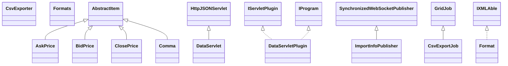

# DataManagerData.jar

[Group index](README.md) | [All archives](../README.md)

## Scope and provenance

- **Donor:** `SQX_145_REFERENCE_ROOT/internal/plugins/DataManagerData/DataManagerData.jar`.
- **SHA-256:** `4970124bec1bc7aead64d019b242d6895686981f9c338b4bee1d832aef28bcd5`; accessed 2026-10-06; captured `2026-10-06T18:54:51.906614+00:00`.
- **Classes:** 35 raw entries; 35 unique entry names. Duplicate occurrence indices are zero-based.
- **Inspection:** read-only ZIP hashing and class-file structural parsing; signatures/descriptors, modifiers, hierarchy and references only. Bytecode bodies are hashed, not published.
- **Allocation:** proposed `FEAT-DATA-DATA-MANAGER-DATA`, P03; [roadmap](../../dev/sqx-full-application-roadmap.md). Domain README registration remains required.
- **Repository:** `01067f00031428613c6394064ca1bcadc1ba00ee`; review state unreviewed. Download label 145-dev1; installed build/activation and runtime equivalence unverified.
- **Limit:** every class/member is inventoried; declaration coverage does not establish consumed calls, defaults, formulas, failure semantics or algorithm parity.
- **Archive/resource index:** [169.json](../../dev/evidence/sqx145/archives/145/169.json).

## Complete member declarations

Member shards contain exact JVM names/descriptors, access flags, generic signatures, throws types, declared fields/methods, superclass/interfaces and referenced class names. All classes, nested/synthetic members and overloads are retained. Code length/hash is structural evidence, not a normalized algorithm comparison.

- [001.json](../../dev/evidence/sqx145/members/169/001.json) — SHA-256 `ed85372442101157fdf0f606f6ef33c55dc626819fd664d34d14c2688ed3d7dd`.

## Focused structural diagram

Up to twelve non-nested classes; arrows show declared inheritance/interfaces only. External type names are not evidence of an available body or an executed dependency.

## Class inventory

| Archive entry | Occurrence | Class SHA-256 | Fields | Methods |
| --- | ---: | --- | ---: | ---: |
| `com/strategyquant/plugin/DataManager/impl/Data/DataServlet$1.class` | 0 | `9e7a55ad91eb777f63ca366460a3259d597802b3c5bed40a29b7052fe7652b48` | 6 | 2 |
| `com/strategyquant/plugin/DataManager/impl/Data/DataServlet$2.class` | 0 | `7f2fa3bbe898c516edd28c2d1a8b13f55790ef8143913c13ed10776dba69baf2` | 1 | 2 |
| `com/strategyquant/plugin/DataManager/impl/Data/DataServlet$3$1.class` | 0 | `2c08cffe960b18dac132f401f0851c5d0b7126328d1e2d0a3a42520edf5fea62` | 4 | 4 |
| `com/strategyquant/plugin/DataManager/impl/Data/DataServlet$3.class` | 0 | `47b525bca7e1faae082ab6257bd3205fef8d510b42d46678365546818df7c0ba` | 5 | 2 |
| `com/strategyquant/plugin/DataManager/impl/Data/DataServlet$4.class` | 0 | `16e65742bd74c9123536c8b1da77f66da5a3d3a809621eaf19ecee76da079dc4` | 7 | 2 |
| `com/strategyquant/plugin/DataManager/impl/Data/DataServlet$5.class` | 0 | `05d2256669507f9361bb44346fa99dc2949325a616c25cbe9dbe4e72285be6e5` | 1 | 2 |
| `com/strategyquant/plugin/DataManager/impl/Data/DataServlet.class` | 0 | `24bc7839216dd8e99f89f13996f0e4e50af645a1bda1b1b3e9e89d509d4cce60` | 6 | 67 |
| `com/strategyquant/plugin/DataManager/impl/Data/DataServletPlugin.class` | 0 | `afd685a100fa01485a2059c49148ca1b2fdeae978b2a0db584f0aefa01a995e1` | 2 | 6 |
| `com/strategyquant/plugin/DataManager/impl/Data/ImportInfoPublisher.class` | 0 | `b9641b70d31aa4befc285e1033088a78312ccc7c2a12d004f8d51ebb879f4121` | 5 | 9 |
| `com/strategyquant/plugin/DataManager/impl/Data/csvexport/CsvExportJob.class` | 0 | `5ec7a7de631607dbb0306d6fe80770299fa5d2681eaed1c56766bb43ab0a9f22` | 11 | 4 |
| `com/strategyquant/plugin/DataManager/impl/Data/csvexport/CsvExporter.class` | 0 | `89b9f36d0674fe14ede285c117cbe67efabc6f4ab80dc877bbb7fba869927775` | 6 | 8 |
| `com/strategyquant/plugin/DataManager/impl/Data/csvexport/format/Format.class` | 0 | `84a320317573bad1246f622e33a5eb1ba5684638ae04f05c38ee370d5ba8a0ca` | 8 | 7 |
| `com/strategyquant/plugin/DataManager/impl/Data/csvexport/format/Formats.class` | 0 | `63562eccce79c92e973ed6fa90c6fca4c53733b2940333b002ae3e7d08e6a753` | 8 | 14 |
| `com/strategyquant/plugin/DataManager/impl/Data/csvexport/items/AbstractItem.class` | 0 | `38fb6ee0522dd450b2db4aae45b1dc13c168f0d0bba51beb76fc372ca4df169e` | 8 | 8 |
| `com/strategyquant/plugin/DataManager/impl/Data/csvexport/items/AskPrice.class` | 0 | `b91f811eaec07d7ae5bbc6b6f998098740c9a1ffe9dff7e4287a5d41d576038d` | 2 | 4 |
| `com/strategyquant/plugin/DataManager/impl/Data/csvexport/items/BidPrice.class` | 0 | `e657d6665a4129a190a9b190e59134563ffcd10bc9eb78c51712e47aadcf0bd8` | 2 | 4 |
| `com/strategyquant/plugin/DataManager/impl/Data/csvexport/items/ClosePrice.class` | 0 | `8b912692a68621ac2231f3b5a90d8f3189e12562cf05c2e050e652e42daa5cdc` | 2 | 4 |
| `com/strategyquant/plugin/DataManager/impl/Data/csvexport/items/Comma.class` | 0 | `d8bc1ee9f33ecda33d2f60704fb9b893d6424f2b6b2e1e2a7959e52397d789b3` | 2 | 4 |
| `com/strategyquant/plugin/DataManager/impl/Data/csvexport/items/Date.class` | 0 | `b5ce84fcded97b66e1edcf5dbb64b99b7b018bd12ec771ee18d35af97c91d58e` | 2 | 5 |
| `com/strategyquant/plugin/DataManager/impl/Data/csvexport/items/DateTime.class` | 0 | `85e6333c35e85d3fe1cccd852de96a1b43da931f26245cb44793c78739dec3be` | 2 | 5 |
| `com/strategyquant/plugin/DataManager/impl/Data/csvexport/items/HighPrice.class` | 0 | `edbf98fab3cefbc45712e0f9677e6d382cc760939e008dfee9fec68a8203e550` | 2 | 4 |
| `com/strategyquant/plugin/DataManager/impl/Data/csvexport/items/Items.class` | 0 | `e69c275bcd28342c373cec7428667cc4bf6633ad7a97a73acad6add95edf8df5` | 2 | 4 |
| `com/strategyquant/plugin/DataManager/impl/Data/csvexport/items/LowPrice.class` | 0 | `0dcb6ad134c2beda5733244e8f8d5cdf76d5e8a0336251330339bc1792a62771` | 2 | 4 |
| `com/strategyquant/plugin/DataManager/impl/Data/csvexport/items/OpenPrice.class` | 0 | `272db981d52e5487fe2181ddc3498901841d81c3e41a6bd61af4ec2163385dbd` | 2 | 4 |
| `com/strategyquant/plugin/DataManager/impl/Data/csvexport/items/Semicolon.class` | 0 | `a1437b270243af998fcc20ab84406d79b0d32a4a1ee1a013b00aae188d9c766b` | 2 | 4 |
| `com/strategyquant/plugin/DataManager/impl/Data/csvexport/items/Spread.class` | 0 | `9473e7ea2ab5202304a6ae38fe98526508d39a4e55be2423445773ca8dd7e9d3` | 2 | 4 |
| `com/strategyquant/plugin/DataManager/impl/Data/csvexport/items/Symbol.class` | 0 | `f9158e7be3622b8f6b2e190028e2a836ae2e157a68d69b793a5ce428135847f9` | 2 | 4 |
| `com/strategyquant/plugin/DataManager/impl/Data/csvexport/items/Tab.class` | 0 | `19450edd2af758655657045de07f4ddec99c7d49a51822806f4eb8a94610a424` | 2 | 4 |
| `com/strategyquant/plugin/DataManager/impl/Data/csvexport/items/TextItem.class` | 0 | `34810e2d2bfc64118cf3c325b89f01abf935912fe05473a954e54651512c0c41` | 0 | 4 |
| `com/strategyquant/plugin/DataManager/impl/Data/csvexport/items/Time.class` | 0 | `49e69a654bd248bb522590c7d73505dffbe65e7c69237b02e0b352f42c00ca98` | 2 | 5 |
| `com/strategyquant/plugin/DataManager/impl/Data/csvexport/items/Volume.class` | 0 | `0bc7e971c2ccdb8a0686b996f56061c29152f081ba6218b066b8732a261b786f` | 2 | 4 |
| `com/strategyquant/plugin/DataManager/impl/Data/job/CloneToTimezoneJob.class` | 0 | `0bd91d4fbe181b0b3d2c3267cfcce17d652d63a35fa3521cf81e6ead64eaef57` | 10 | 6 |
| `com/strategyquant/plugin/DataManager/impl/Data/job/MT4ExportJob.class` | 0 | `87cd2ea19ca579648df09d24ffbd98c2b5b5997a558e8767036f4a529e911b44` | 2 | 4 |
| `com/strategyquant/plugin/DataManager/impl/Data/job/MT5ExportJob.class` | 0 | `ec0852a4512f01e72467e8d235851beaa2e38ad990778d9b51fb467ae2519fbb` | 13 | 5 |
| `com/strategyquant/plugin/DataManager/impl/Data/job/MT5Exporter.class` | 0 | `8c4a4cd5e18e673cda4fef34205f2311f2bb56431751c240ff6a37f5d2eaf054` | 8 | 14 |
