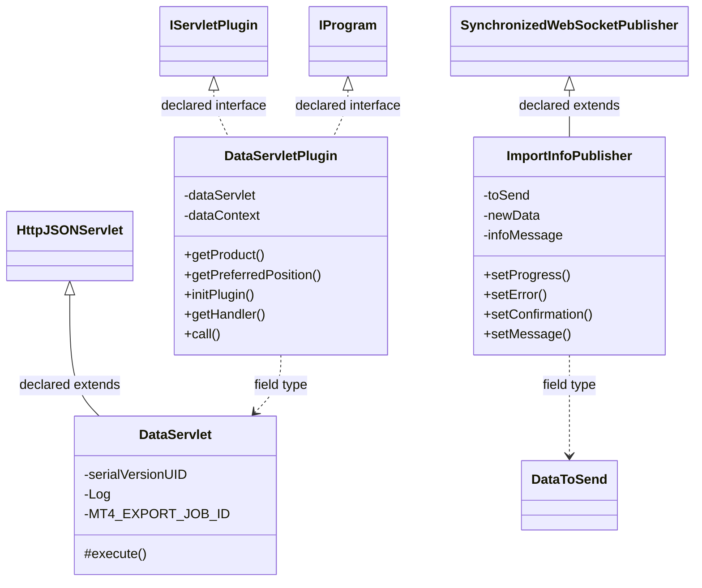
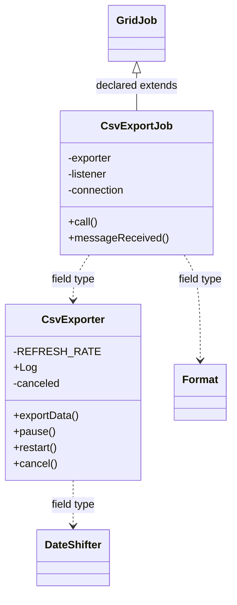
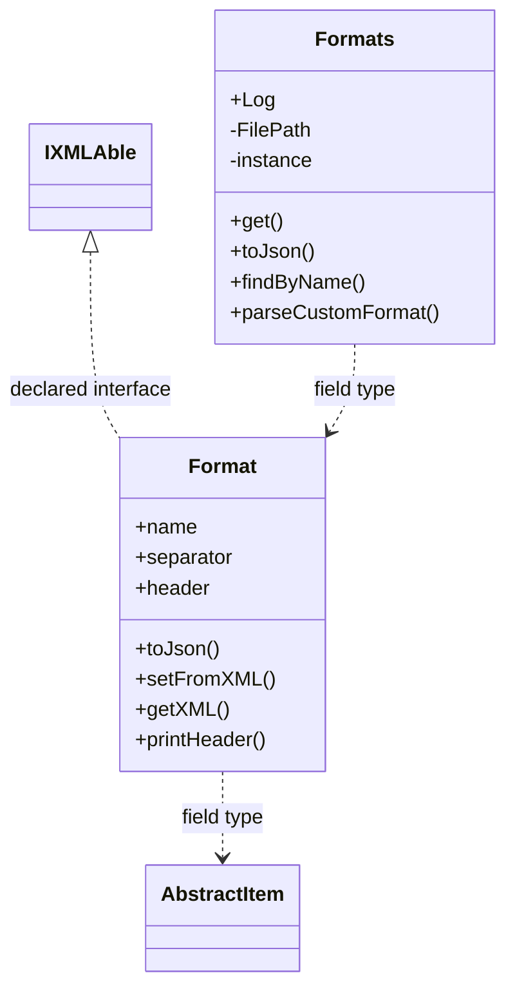
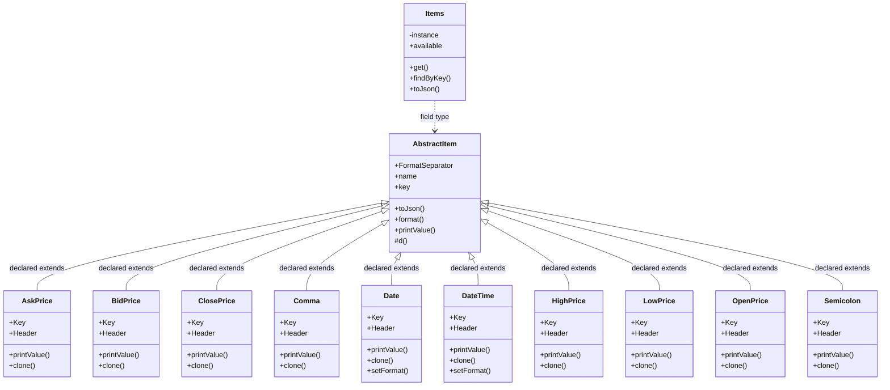
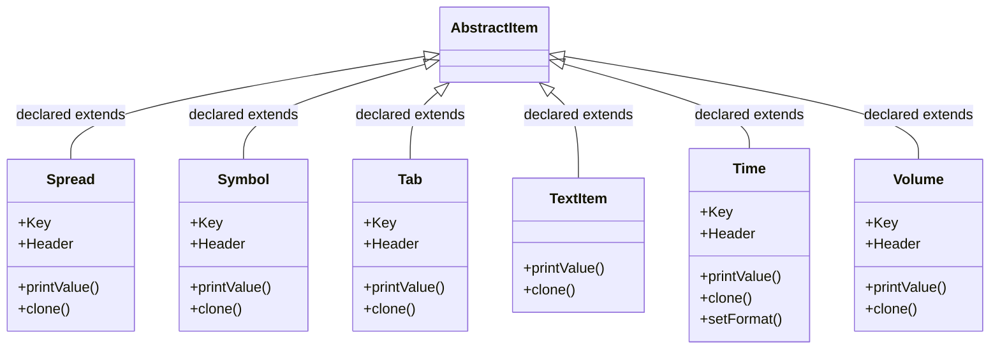
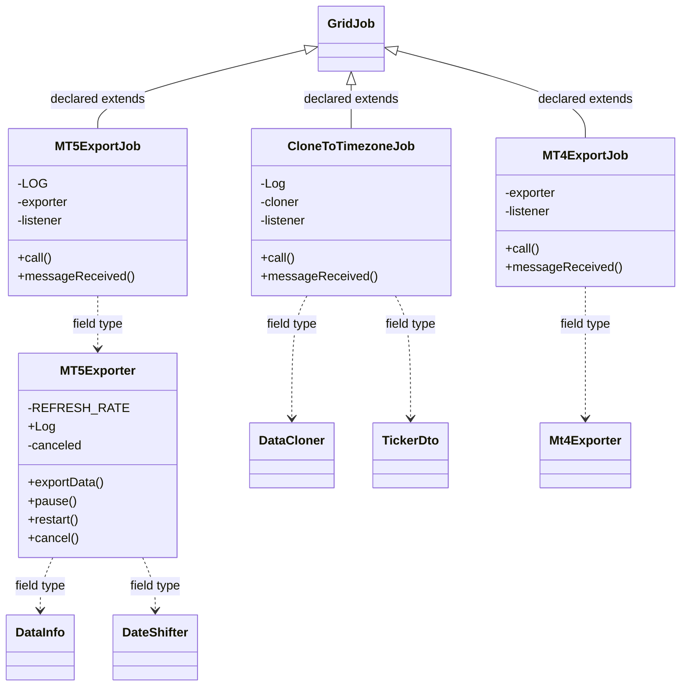

# DataManagerData.jar

[Workspace/group index](README.md)  |  [All workspaces](../README.md)

## Scope and provenance

- Artifact: `SQX_REFERENCE_ROOT/internal/plugins/DataManagerData/DataManagerData.jar`.
- SHA-256: `5a050f2411038160bd386a58942c80a209df75612c0aabdd85c4f307817d8ad0`.
- Inspected: 2026-10-05; generation timestamp `2026-10-05T19:04:16.344170+00:00`.
- Archive class entries: **35**; non-nested: **29**; nested/anonymous: **6**.
- Inspection: ZIP entry/manifest enumeration and `javap -p` declarations for every listed class.
- Repository source HEAD: `8a92c705183a6702eaf62037ccb202ed028aa899`; review state: generated, pending owner review.
- Installed SQX build number is unverified. No method bodies are reproduced.
- Confidence: high for declared structure; workspace ownership inferred except where registration evidence is separately stated. Runtime reachability, call order, formulas and parity remain unverified.

The `DataManager` folder is a navigation/research grouping, not an exclusive backend owner. Shared consumers may use this JAR.

Local target mapping: [FEAT-DATASET-MANAGEMENT](../../../app/workspace/DataManager/Data/README.md) is the existing HaruQuantAI feature registry. This donor inventory is broader than its implemented Cohort A; it neither changes feature ownership nor claims parity.

## Diagram reading guide

`Parent <|-- Child` means declared inheritance; `Interface <|.. Class` means declared implementation. Interface extension uses the inheritance arrow. `A ..> B : field type` is a declared type dependency, not composition, object ownership or a runtime call. External nodes are referenced types, not fabricated local implementations. Selected fields/method names aid navigation: `+` is public, `#` protected and `-` private. Diagram method names omit parameter/return types and collapse overloads; use the exact inspected declarations below before implementing an API.

Detailed graphs include non-nested classes in package-sized groups of at most 12. Nested/anonymous classes are inventoried and their declarations/relationships are retained below, but omitted from overview graphs. Relationships not drawn for readability remain in the complete declaration-relationship table. Constructors, synthetic bridges and overloads may be collapsed in diagram member lists only. Standard `java.lang.Object` inheritance is omitted from diagrams.

## UML class diagrams

### 1. `com.strategyquant.plugin.DataManager.impl.Data`



| Diagram identifier | Exact type | Location |
| --- | --- | --- |
| `Cbe1b5ce0802a` | `com.strategyquant.plugin.DataManager.impl.Data.DataServlet` (this JAR) | this diagram |
| `Cefc8a00dfb8c` | `com.strategyquant.plugin.DataManager.impl.Data.DataServletPlugin` (this JAR) | this diagram |
| `C5e7ec94a0616` | `com.strategyquant.plugin.DataManager.impl.Data.ImportInfoPublisher` (this JAR) | this diagram |
| `C1b6b4448b67b` | [`com.strategyquant.pluginlib.program.IProgram`](../Shared/SQPluginLib.md) | referenced external type |
| `C6128eed56b6d` | [`com.strategyquant.tradinglib.project.websocket.DataToSend`](../Shared/SQTradingLib.md) | referenced external type |
| `Ce87cf9854aad` | [`com.strategyquant.tradinglib.project.websocket.SynchronizedWebSocketPublisher`](../Shared/SQTradingLib.md) | referenced external type |
| `C249b5c671b1a` | [`com.strategyquant.tradinglib.servlet.IServletPlugin`](../Shared/SQTradingLib.md) | referenced external type |
| `C8900f90ae594` | [`com.strategyquant.webguilib.servlet.HttpJSONServlet`](../Shared/SQWebGUILib.md) | referenced external type |

### 2. `com.strategyquant.plugin.DataManager.impl.Data.csvexport`



| Diagram identifier | Exact type | Location |
| --- | --- | --- |
| `C16b72a10ecda` | [`com.strategyquant.datalib.data.DateShifter`](../Shared/SQDataLib.md) | referenced external type |
| `C729a56512564` | [`com.strategyquant.gridlib.client.GridJob`](../Shared/SQGridLib2.md) | referenced external type |
| `C124a19948c67` | `com.strategyquant.plugin.DataManager.impl.Data.csvexport.CsvExportJob` (this JAR) | this diagram |
| `C75eccd87053c` | `com.strategyquant.plugin.DataManager.impl.Data.csvexport.CsvExporter` (this JAR) | this diagram |
| `Cc4da15b966f0` | `com.strategyquant.plugin.DataManager.impl.Data.csvexport.format.Format` (this JAR) | another group in this JAR |

### 3. `com.strategyquant.plugin.DataManager.impl.Data.csvexport.format`



| Diagram identifier | Exact type | Location |
| --- | --- | --- |
| `C04837263807c` | `com.strategyquant.lib.settings.IXMLAble` (not resolved in scoped archives) | referenced external type |
| `Cc4da15b966f0` | `com.strategyquant.plugin.DataManager.impl.Data.csvexport.format.Format` (this JAR) | this diagram |
| `Cb5c84b181359` | `com.strategyquant.plugin.DataManager.impl.Data.csvexport.format.Formats` (this JAR) | this diagram |
| `C8ce809f31ad6` | `com.strategyquant.plugin.DataManager.impl.Data.csvexport.items.AbstractItem` (this JAR) | another group in this JAR |

### 4. `com.strategyquant.plugin.DataManager.impl.Data.csvexport.items` - group 1



| Diagram identifier | Exact type | Location |
| --- | --- | --- |
| `C8ce809f31ad6` | `com.strategyquant.plugin.DataManager.impl.Data.csvexport.items.AbstractItem` (this JAR) | this diagram |
| `C4c4a86a445d4` | `com.strategyquant.plugin.DataManager.impl.Data.csvexport.items.AskPrice` (this JAR) | this diagram |
| `C42b4c9631c95` | `com.strategyquant.plugin.DataManager.impl.Data.csvexport.items.BidPrice` (this JAR) | this diagram |
| `Cc9ab772d9dfb` | `com.strategyquant.plugin.DataManager.impl.Data.csvexport.items.ClosePrice` (this JAR) | this diagram |
| `Cf489bbb76bdf` | `com.strategyquant.plugin.DataManager.impl.Data.csvexport.items.Comma` (this JAR) | this diagram |
| `C78851c2f3eaf` | `com.strategyquant.plugin.DataManager.impl.Data.csvexport.items.Date` (this JAR) | this diagram |
| `Cad85df1fd553` | `com.strategyquant.plugin.DataManager.impl.Data.csvexport.items.DateTime` (this JAR) | this diagram |
| `C102948aaddd9` | `com.strategyquant.plugin.DataManager.impl.Data.csvexport.items.HighPrice` (this JAR) | this diagram |
| `C486b042ba088` | `com.strategyquant.plugin.DataManager.impl.Data.csvexport.items.Items` (this JAR) | this diagram |
| `Cd2efc0d797ad` | `com.strategyquant.plugin.DataManager.impl.Data.csvexport.items.LowPrice` (this JAR) | this diagram |
| `C7712c0ba8c8e` | `com.strategyquant.plugin.DataManager.impl.Data.csvexport.items.OpenPrice` (this JAR) | this diagram |
| `Cfeacfe398570` | `com.strategyquant.plugin.DataManager.impl.Data.csvexport.items.Semicolon` (this JAR) | this diagram |

### 5. `com.strategyquant.plugin.DataManager.impl.Data.csvexport.items` - group 2



| Diagram identifier | Exact type | Location |
| --- | --- | --- |
| `C8ce809f31ad6` | `com.strategyquant.plugin.DataManager.impl.Data.csvexport.items.AbstractItem` (this JAR) | another group in this JAR |
| `C75766d003684` | `com.strategyquant.plugin.DataManager.impl.Data.csvexport.items.Spread` (this JAR) | this diagram |
| `Ca1c97b176f5b` | `com.strategyquant.plugin.DataManager.impl.Data.csvexport.items.Symbol` (this JAR) | this diagram |
| `C511c49f91e3f` | `com.strategyquant.plugin.DataManager.impl.Data.csvexport.items.Tab` (this JAR) | this diagram |
| `C35a20b959dcf` | `com.strategyquant.plugin.DataManager.impl.Data.csvexport.items.TextItem` (this JAR) | this diagram |
| `Cce67927a0cae` | `com.strategyquant.plugin.DataManager.impl.Data.csvexport.items.Time` (this JAR) | this diagram |
| `Cba770ebdc526` | `com.strategyquant.plugin.DataManager.impl.Data.csvexport.items.Volume` (this JAR) | this diagram |

### 6. `com.strategyquant.plugin.DataManager.impl.Data.job`



| Diagram identifier | Exact type | Location |
| --- | --- | --- |
| `C507ddf99c601` | [`com.strategyquant.datalib.DataInfo`](../Shared/SQDataLib.md) | referenced external type |
| `Cfbb49f22ef79` | [`com.strategyquant.datalib.data.DataCloner`](../Shared/SQDataLib.md) | referenced external type |
| `C16b72a10ecda` | [`com.strategyquant.datalib.data.DateShifter`](../Shared/SQDataLib.md) | referenced external type |
| `Cbdf969509bfc` | [`com.strategyquant.datalib.historyData.dto.TickerDto`](../Shared/SQDataLib.md) | referenced external type |
| `C729a56512564` | [`com.strategyquant.gridlib.client.GridJob`](../Shared/SQGridLib2.md) | referenced external type |
| `C59015a1e2d92` | `com.strategyquant.plugin.DataManager.impl.Data.job.CloneToTimezoneJob` (this JAR) | this diagram |
| `Ccb9986d52106` | `com.strategyquant.plugin.DataManager.impl.Data.job.MT4ExportJob` (this JAR) | this diagram |
| `Ca2cabd543c14` | `com.strategyquant.plugin.DataManager.impl.Data.job.MT5ExportJob` (this JAR) | this diagram |
| `C05aca42790c6` | `com.strategyquant.plugin.DataManager.impl.Data.job.MT5Exporter` (this JAR) | this diagram |
| `C9e8902df8df3` | [`com.strategyquant.tradinglib.mt4.Mt4Exporter`](../Shared/SQTradingLib.md) | referenced external type |

## Complete class inventory

| Fully qualified class | Kind | Entry |
| --- | --- | --- |
| `com.strategyquant.plugin.DataManager.impl.Data.DataServlet` | class | non-nested |
| `com.strategyquant.plugin.DataManager.impl.Data.DataServlet$1` | class | nested/anonymous |
| `com.strategyquant.plugin.DataManager.impl.Data.DataServlet$2` | class | nested/anonymous |
| `com.strategyquant.plugin.DataManager.impl.Data.DataServlet$3` | class | nested/anonymous |
| `com.strategyquant.plugin.DataManager.impl.Data.DataServlet$3$1` | class | nested/anonymous |
| `com.strategyquant.plugin.DataManager.impl.Data.DataServlet$4` | class | nested/anonymous |
| `com.strategyquant.plugin.DataManager.impl.Data.DataServlet$5` | class | nested/anonymous |
| `com.strategyquant.plugin.DataManager.impl.Data.DataServletPlugin` | class | non-nested |
| `com.strategyquant.plugin.DataManager.impl.Data.ImportInfoPublisher` | class | non-nested |
| `com.strategyquant.plugin.DataManager.impl.Data.csvexport.CsvExportJob` | class | non-nested |
| `com.strategyquant.plugin.DataManager.impl.Data.csvexport.CsvExporter` | class | non-nested |
| `com.strategyquant.plugin.DataManager.impl.Data.csvexport.format.Format` | class | non-nested |
| `com.strategyquant.plugin.DataManager.impl.Data.csvexport.format.Formats` | class | non-nested |
| `com.strategyquant.plugin.DataManager.impl.Data.csvexport.items.AbstractItem` | class | non-nested |
| `com.strategyquant.plugin.DataManager.impl.Data.csvexport.items.AskPrice` | class | non-nested |
| `com.strategyquant.plugin.DataManager.impl.Data.csvexport.items.BidPrice` | class | non-nested |
| `com.strategyquant.plugin.DataManager.impl.Data.csvexport.items.ClosePrice` | class | non-nested |
| `com.strategyquant.plugin.DataManager.impl.Data.csvexport.items.Comma` | class | non-nested |
| `com.strategyquant.plugin.DataManager.impl.Data.csvexport.items.Date` | class | non-nested |
| `com.strategyquant.plugin.DataManager.impl.Data.csvexport.items.DateTime` | class | non-nested |
| `com.strategyquant.plugin.DataManager.impl.Data.csvexport.items.HighPrice` | class | non-nested |
| `com.strategyquant.plugin.DataManager.impl.Data.csvexport.items.Items` | class | non-nested |
| `com.strategyquant.plugin.DataManager.impl.Data.csvexport.items.LowPrice` | class | non-nested |
| `com.strategyquant.plugin.DataManager.impl.Data.csvexport.items.OpenPrice` | class | non-nested |
| `com.strategyquant.plugin.DataManager.impl.Data.csvexport.items.Semicolon` | class | non-nested |
| `com.strategyquant.plugin.DataManager.impl.Data.csvexport.items.Spread` | class | non-nested |
| `com.strategyquant.plugin.DataManager.impl.Data.csvexport.items.Symbol` | class | non-nested |
| `com.strategyquant.plugin.DataManager.impl.Data.csvexport.items.Tab` | class | non-nested |
| `com.strategyquant.plugin.DataManager.impl.Data.csvexport.items.TextItem` | class | non-nested |
| `com.strategyquant.plugin.DataManager.impl.Data.csvexport.items.Time` | class | non-nested |
| `com.strategyquant.plugin.DataManager.impl.Data.csvexport.items.Volume` | class | non-nested |
| `com.strategyquant.plugin.DataManager.impl.Data.job.CloneToTimezoneJob` | class | non-nested |
| `com.strategyquant.plugin.DataManager.impl.Data.job.MT4ExportJob` | class | non-nested |
| `com.strategyquant.plugin.DataManager.impl.Data.job.MT5ExportJob` | class | non-nested |
| `com.strategyquant.plugin.DataManager.impl.Data.job.MT5Exporter` | class | non-nested |

## Declared relationships and evidence locations

Every row is supported by the named class declaration/member in `javap -p`, inside the artifact recorded above. Signature dependencies may include return, parameter, generic-argument and throws types; they do not imply execution.

| Declaring class | Referenced type | Relationship | Narrow inspection location |
| --- | --- | --- | --- |
| `com.strategyquant.plugin.DataManager.impl.Data.DataServlet` | [`com.strategyquant.webguilib.servlet.HttpJSONServlet`](../Shared/SQWebGUILib.md) | extends | `com.strategyquant.plugin.DataManager.impl.Data.DataServlet` / class declaration: `public class com.strategyquant.plugin.DataManager.impl.Data.DataServlet extends com.strategyquant.webguilib.servlet.HttpJSONServlet` |
| `com.strategyquant.plugin.DataManager.impl.Data.DataServlet` | `org.slf4j.Logger` (not resolved in scoped archives) | type dependency | `com.strategyquant.plugin.DataManager.impl.Data.DataServlet` / field declaration: `private static final org.slf4j.Logger Log;` |
| `com.strategyquant.plugin.DataManager.impl.Data.DataServlet` | `org.slf4j.Logger` (not resolved in scoped archives) | type dependency | `com.strategyquant.plugin.DataManager.impl.Data.DataServlet` / method signature: `static org.slf4j.Logger access$100();` |
| `com.strategyquant.plugin.DataManager.impl.Data.DataServlet` | `java.lang.String` (not resolved in scoped archives) | type dependency | `com.strategyquant.plugin.DataManager.impl.Data.DataServlet` / field declaration: `private static final java.lang.String MT4_EXPORT_JOB_ID;`<br>`private static final java.lang.String MT5_EXPORT;` |
| `com.strategyquant.plugin.DataManager.impl.Data.DataServlet` | `java.lang.String` (not resolved in scoped archives) | type dependency | `com.strategyquant.plugin.DataManager.impl.Data.DataServlet` / method signature: `private void checkLimitedSymbol(java.lang.String);`<br>`private void checkLimitedSymbols(java.lang.String[]);`<br>`private int getLimitedCount(java.lang.String[]);`<br>`protected java.lang.String execute(java.lang.String, java.util.Map<java.lang.String, java.lang.String[]>, java.lang.String) throws java.lang.Exception;`<br>`private java.lang.String onCancelDataOperation(java.util.Map<java.lang.String, java.lang.String[]>);`<br>`private java.lang.String onResumeAll();`<br>`private java.lang.String onPauseAll();`<br>`private java.lang.String onStopAll();`<br>`private java.lang.String onListTimezones(java.util.Map<java.lang.String, java.lang.String[]>);`<br>`private java.lang.String onExportToCsv(java.util.Map<java.lang.String, java.lang.String[]>);`<br>`private java.lang.String onExportToCsvAction(java.util.Map<java.lang.String, java.lang.String[]>) throws java.lang.Exception;`<br>`private java.lang.String onExportToCsvLoadSettings() throws java.lang.Exception;`<br>`private java.lang.String onExportToCsvSaveFileFormat(java.util.Map<java.lang.String, java.lang.String[]>) throws java.lang.Exception;`<br>`private java.lang.String onExportToCsvSaveAsFileFormat(java.util.Map<java.lang.String, java.lang.String[]>) throws java.lang.Exception;`<br>`private java.lang.String onExportToCsvDeleteFileFormat(java.util.Map<java.lang.String, java.lang.String[]>) throws java.lang.Exception;`<br>`private java.lang.String onCheckQualityDetails(java.util.Map<java.lang.String, java.lang.String[]>) throws java.lang.NumberFormatException, java.lang.Exception;`<br>`private java.lang.String onCheckQualitySummary(java.util.Map<java.lang.String, java.lang.String[]>) throws java.lang.Exception;`<br>`private java.lang.String onExportToMT4GetDataFolder(java.util.Map<java.lang.String, java.lang.String[]>) throws java.lang.Exception;`<br>`private java.lang.String onExportToMT4GetServerNames(java.util.Map<java.lang.String, java.lang.String[]>) throws java.lang.Exception;`<br>`private java.lang.String onExportToMT4LoadProperties(java.util.Map<java.lang.String, java.lang.String[]>) throws java.lang.Exception;`<br>`private java.lang.String onExportToMT4(java.util.Map<java.lang.String, java.lang.String[]>) throws java.lang.Exception;`<br>`private java.lang.String onExportToMT4Action(java.util.Map<java.lang.String, java.lang.String[]>) throws java.lang.Exception;`<br>`private java.lang.String onExportToMT5(java.util.Map<java.lang.String, java.lang.String[]>) throws java.lang.Exception;`<br>`private java.lang.String onExportToMT5Action(java.util.Map<java.lang.String, java.lang.String[]>) throws java.lang.Exception;`<br>`private java.lang.String onListData(java.util.Map<java.lang.String, java.lang.String[]>);`<br>`private java.lang.String onEditData(java.util.Map<java.lang.String, java.lang.String[]>);`<br>`private java.lang.String onClearData(java.util.Map<java.lang.String, java.lang.String[]>);`<br>`private void updateStockGroups(java.lang.String[]);`<br>`private java.lang.String onRemoveData(java.util.Map<java.lang.String, java.lang.String[]>);`<br>`private java.lang.String onShowData(java.util.Map<java.lang.String, java.lang.String[]>);`<br>`private java.lang.String onGetSymbolData(java.util.Map<java.lang.String, java.lang.String[]>);`<br>`private java.lang.String onAddTimeframe(java.util.Map<java.lang.String, java.lang.String[]>);`<br>`private java.lang.String onSaveDataChanges(java.util.Map<java.lang.String, java.lang.String[]>);`<br>`private java.lang.String onGetIndexForDate(java.util.Map<java.lang.String, java.lang.String[]>) throws java.lang.Exception;`<br>`private com.strategyquant.datalib.data.io.newDataFormat.DataBinReaderNew getDataReader(java.lang.String, java.lang.String, java.lang.String) throws java.lang.Exception;`<br>`private java.lang.String onReviewData(java.util.Map<java.lang.String, java.lang.String[]>) throws java.lang.Exception;`<br>`private java.lang.String onExport(boolean, java.util.Map<java.lang.String, java.lang.String[]>) throws java.lang.Exception;`<br>`private java.lang.String onExportCDN() throws java.lang.Exception;`<br>`private java.lang.String onReviewChart(java.util.Map<java.lang.String, java.lang.String[]>) throws java.lang.Exception;`<br>`private java.lang.String onCloneToTimezone(java.util.Map<java.lang.String, java.lang.String[]>) throws java.lang.Exception;`<br>`private java.lang.String addPostfixToSymbolName(java.lang.String, java.lang.String, java.lang.String, int, com.strategyquant.datalib.DataInfo);`<br>`private java.lang.String onCloneToTimezoneAction(java.util.Map<java.lang.String, java.lang.String[]>) throws java.lang.Exception;`<br>`private org.json.JSONArray listTickData(java.lang.String, java.lang.String, java.lang.String, int, int, com.strategyquant.datalib.DataInfo) throws java.lang.Exception;`<br>`private void sendDataUpdate(java.lang.String, java.lang.String);`<br>`private com.strategyquant.datalib.historyData.TickerFilterDto getFilterForHistoryTickers(java.util.List<java.lang.String>);`<br>`private java.lang.String onUpdateAll();`<br>`private java.util.Map<java.lang.String, com.strategyquant.datalib.historyData.dto.TickerDto> toMap(java.util.List<com.strategyquant.datalib.historyData.dto.TickerDto>);`<br>`private java.lang.String onUpdateSelected(java.util.Map<java.lang.String, java.lang.String[]>);`<br>`private java.lang.String onLoad(java.util.Map<java.lang.String, java.lang.String[]>);`<br>`private java.lang.String onSave(java.util.Map<java.lang.String, java.lang.String[]>);`<br>`private java.lang.String onConfirm(java.util.Map<java.lang.String, java.lang.String[]>);`<br>`private static java.lang.Long lambda$onSaveDataChanges$1(java.lang.String, java.lang.String);`<br>`private static boolean lambda$onSaveDataChanges$0(java.lang.String);`<br>`static void access$200(com.strategyquant.plugin.DataManager.impl.Data.DataServlet, java.lang.String[]);`<br>`static void access$300(com.strategyquant.plugin.DataManager.impl.Data.DataServlet, java.lang.String, java.lang.String);` |
| `com.strategyquant.plugin.DataManager.impl.Data.DataServlet` | `java.util.Map` (not resolved in scoped archives) | type dependency | `com.strategyquant.plugin.DataManager.impl.Data.DataServlet` / method signature: `protected java.lang.String execute(java.lang.String, java.util.Map<java.lang.String, java.lang.String[]>, java.lang.String) throws java.lang.Exception;`<br>`private java.lang.String onCancelDataOperation(java.util.Map<java.lang.String, java.lang.String[]>);`<br>`private java.lang.String onListTimezones(java.util.Map<java.lang.String, java.lang.String[]>);`<br>`private java.lang.String onExportToCsv(java.util.Map<java.lang.String, java.lang.String[]>);`<br>`private java.lang.String onExportToCsvAction(java.util.Map<java.lang.String, java.lang.String[]>) throws java.lang.Exception;`<br>`private java.lang.String onExportToCsvSaveFileFormat(java.util.Map<java.lang.String, java.lang.String[]>) throws java.lang.Exception;`<br>`private java.lang.String onExportToCsvSaveAsFileFormat(java.util.Map<java.lang.String, java.lang.String[]>) throws java.lang.Exception;`<br>`private java.lang.String onExportToCsvDeleteFileFormat(java.util.Map<java.lang.String, java.lang.String[]>) throws java.lang.Exception;`<br>`private java.lang.String onCheckQualityDetails(java.util.Map<java.lang.String, java.lang.String[]>) throws java.lang.NumberFormatException, java.lang.Exception;`<br>`private java.lang.String onCheckQualitySummary(java.util.Map<java.lang.String, java.lang.String[]>) throws java.lang.Exception;`<br>`private java.lang.String onExportToMT4GetDataFolder(java.util.Map<java.lang.String, java.lang.String[]>) throws java.lang.Exception;`<br>`private java.lang.String onExportToMT4GetServerNames(java.util.Map<java.lang.String, java.lang.String[]>) throws java.lang.Exception;`<br>`private java.lang.String onExportToMT4LoadProperties(java.util.Map<java.lang.String, java.lang.String[]>) throws java.lang.Exception;`<br>`private java.lang.String onExportToMT4(java.util.Map<java.lang.String, java.lang.String[]>) throws java.lang.Exception;`<br>`private java.lang.String onExportToMT4Action(java.util.Map<java.lang.String, java.lang.String[]>) throws java.lang.Exception;`<br>`private java.lang.String onExportToMT5(java.util.Map<java.lang.String, java.lang.String[]>) throws java.lang.Exception;`<br>`private java.lang.String onExportToMT5Action(java.util.Map<java.lang.String, java.lang.String[]>) throws java.lang.Exception;`<br>`private java.lang.String onListData(java.util.Map<java.lang.String, java.lang.String[]>);`<br>`private java.lang.String onEditData(java.util.Map<java.lang.String, java.lang.String[]>);`<br>`private java.lang.String onClearData(java.util.Map<java.lang.String, java.lang.String[]>);`<br>`private java.lang.String onRemoveData(java.util.Map<java.lang.String, java.lang.String[]>);`<br>`private java.lang.String onShowData(java.util.Map<java.lang.String, java.lang.String[]>);`<br>`private java.lang.String onGetSymbolData(java.util.Map<java.lang.String, java.lang.String[]>);`<br>`private java.lang.String onAddTimeframe(java.util.Map<java.lang.String, java.lang.String[]>);`<br>`private java.lang.String onSaveDataChanges(java.util.Map<java.lang.String, java.lang.String[]>);`<br>`private java.lang.String onGetIndexForDate(java.util.Map<java.lang.String, java.lang.String[]>) throws java.lang.Exception;`<br>`private java.lang.String onReviewData(java.util.Map<java.lang.String, java.lang.String[]>) throws java.lang.Exception;`<br>`private java.lang.String onExport(boolean, java.util.Map<java.lang.String, java.lang.String[]>) throws java.lang.Exception;`<br>`private java.lang.String onReviewChart(java.util.Map<java.lang.String, java.lang.String[]>) throws java.lang.Exception;`<br>`private java.lang.String onCloneToTimezone(java.util.Map<java.lang.String, java.lang.String[]>) throws java.lang.Exception;`<br>`private java.lang.String onCloneToTimezoneAction(java.util.Map<java.lang.String, java.lang.String[]>) throws java.lang.Exception;`<br>`private java.util.Map<java.lang.String, com.strategyquant.datalib.historyData.dto.TickerDto> toMap(java.util.List<com.strategyquant.datalib.historyData.dto.TickerDto>);`<br>`private java.lang.String onUpdateSelected(java.util.Map<java.lang.String, java.lang.String[]>);`<br>`private java.lang.String onLoad(java.util.Map<java.lang.String, java.lang.String[]>);`<br>`private java.lang.String onSave(java.util.Map<java.lang.String, java.lang.String[]>);`<br>`private java.lang.String onConfirm(java.util.Map<java.lang.String, java.lang.String[]>);` |
| `com.strategyquant.plugin.DataManager.impl.Data.DataServlet` | `java.lang.Exception` (not resolved in scoped archives) | type dependency | `com.strategyquant.plugin.DataManager.impl.Data.DataServlet` / method signature: `protected java.lang.String execute(java.lang.String, java.util.Map<java.lang.String, java.lang.String[]>, java.lang.String) throws java.lang.Exception;`<br>`private java.lang.String onExportToCsvAction(java.util.Map<java.lang.String, java.lang.String[]>) throws java.lang.Exception;`<br>`private java.lang.String onExportToCsvLoadSettings() throws java.lang.Exception;`<br>`private java.lang.String onExportToCsvSaveFileFormat(java.util.Map<java.lang.String, java.lang.String[]>) throws java.lang.Exception;`<br>`private java.lang.String onExportToCsvSaveAsFileFormat(java.util.Map<java.lang.String, java.lang.String[]>) throws java.lang.Exception;`<br>`private java.lang.String onExportToCsvDeleteFileFormat(java.util.Map<java.lang.String, java.lang.String[]>) throws java.lang.Exception;`<br>`private java.lang.String onCheckQualityDetails(java.util.Map<java.lang.String, java.lang.String[]>) throws java.lang.NumberFormatException, java.lang.Exception;`<br>`private java.lang.String onCheckQualitySummary(java.util.Map<java.lang.String, java.lang.String[]>) throws java.lang.Exception;`<br>`private java.lang.String onExportToMT4GetDataFolder(java.util.Map<java.lang.String, java.lang.String[]>) throws java.lang.Exception;`<br>`private java.lang.String onExportToMT4GetServerNames(java.util.Map<java.lang.String, java.lang.String[]>) throws java.lang.Exception;`<br>`private java.lang.String onExportToMT4LoadProperties(java.util.Map<java.lang.String, java.lang.String[]>) throws java.lang.Exception;`<br>`private java.lang.String onExportToMT4(java.util.Map<java.lang.String, java.lang.String[]>) throws java.lang.Exception;`<br>`private java.lang.String onExportToMT4Action(java.util.Map<java.lang.String, java.lang.String[]>) throws java.lang.Exception;`<br>`private java.lang.String onExportToMT5(java.util.Map<java.lang.String, java.lang.String[]>) throws java.lang.Exception;`<br>`private java.lang.String onExportToMT5Action(java.util.Map<java.lang.String, java.lang.String[]>) throws java.lang.Exception;`<br>`private java.lang.String onGetIndexForDate(java.util.Map<java.lang.String, java.lang.String[]>) throws java.lang.Exception;`<br>`private int seekReader(com.strategyquant.datalib.data.io.newDataFormat.DataBinReaderNew, com.strategyquant.datalib.DataInfo, long) throws java.lang.Exception;`<br>`private com.strategyquant.datalib.data.io.newDataFormat.DataBinReaderNew getDataReader(java.lang.String, java.lang.String, java.lang.String) throws java.lang.Exception;`<br>`private java.lang.String onReviewData(java.util.Map<java.lang.String, java.lang.String[]>) throws java.lang.Exception;`<br>`private java.lang.String onExport(boolean, java.util.Map<java.lang.String, java.lang.String[]>) throws java.lang.Exception;`<br>`private java.lang.String onExportCDN() throws java.lang.Exception;`<br>`private java.lang.String onReviewChart(java.util.Map<java.lang.String, java.lang.String[]>) throws java.lang.Exception;`<br>`private java.lang.String onCloneToTimezone(java.util.Map<java.lang.String, java.lang.String[]>) throws java.lang.Exception;`<br>`private java.lang.String onCloneToTimezoneAction(java.util.Map<java.lang.String, java.lang.String[]>) throws java.lang.Exception;`<br>`private void fillPreview(com.strategyquant.tradinglib.stockchart.StockData, long, com.strategyquant.datalib.data.io.IDataLoader) throws java.lang.Exception;`<br>`private void fillStockData(com.strategyquant.tradinglib.stockchart.StockData, com.strategyquant.datalib.data.io.IDataLoader, com.strategyquant.datalib.DataInfo) throws java.lang.Exception;`<br>`private org.json.JSONArray listTickData(java.lang.String, java.lang.String, java.lang.String, int, int, com.strategyquant.datalib.DataInfo) throws java.lang.Exception;`<br>`private org.json.JSONArray listOHLCData(int, int, com.strategyquant.datalib.data.io.IDataLoader, com.strategyquant.datalib.DataInfo) throws java.lang.Exception;`<br>`private void performUpdate(java.util.List<com.strategyquant.datalib.DataInfo>) throws java.lang.Exception;` |
| `com.strategyquant.plugin.DataManager.impl.Data.DataServlet` | `java.lang.NumberFormatException` (not resolved in scoped archives) | type dependency | `com.strategyquant.plugin.DataManager.impl.Data.DataServlet` / method signature: `private java.lang.String onCheckQualityDetails(java.util.Map<java.lang.String, java.lang.String[]>) throws java.lang.NumberFormatException, java.lang.Exception;` |
| `com.strategyquant.plugin.DataManager.impl.Data.DataServlet` | [`com.strategyquant.datalib.data.io.newDataFormat.DataBinReaderNew`](../Shared/SQDataLib.md) | type dependency | `com.strategyquant.plugin.DataManager.impl.Data.DataServlet` / method signature: `private int seekReader(com.strategyquant.datalib.data.io.newDataFormat.DataBinReaderNew, com.strategyquant.datalib.DataInfo, long) throws java.lang.Exception;`<br>`private com.strategyquant.datalib.data.io.newDataFormat.DataBinReaderNew getDataReader(java.lang.String, java.lang.String, java.lang.String) throws java.lang.Exception;` |
| `com.strategyquant.plugin.DataManager.impl.Data.DataServlet` | [`com.strategyquant.datalib.DataInfo`](../Shared/SQDataLib.md) | type dependency | `com.strategyquant.plugin.DataManager.impl.Data.DataServlet` / method signature: `private int seekReader(com.strategyquant.datalib.data.io.newDataFormat.DataBinReaderNew, com.strategyquant.datalib.DataInfo, long) throws java.lang.Exception;`<br>`private java.lang.String addPostfixToSymbolName(java.lang.String, java.lang.String, java.lang.String, int, com.strategyquant.datalib.DataInfo);`<br>`private void fillStockData(com.strategyquant.tradinglib.stockchart.StockData, com.strategyquant.datalib.data.io.IDataLoader, com.strategyquant.datalib.DataInfo) throws java.lang.Exception;`<br>`private org.json.JSONArray listTickData(java.lang.String, java.lang.String, java.lang.String, int, int, com.strategyquant.datalib.DataInfo) throws java.lang.Exception;`<br>`private org.json.JSONArray listOHLCData(int, int, com.strategyquant.datalib.data.io.IDataLoader, com.strategyquant.datalib.DataInfo) throws java.lang.Exception;`<br>`private void performUpdate(java.util.List<com.strategyquant.datalib.DataInfo>) throws java.lang.Exception;`<br>`private static boolean lambda$onUpdateAll$2(com.strategyquant.datalib.DataInfo);` |
| `com.strategyquant.plugin.DataManager.impl.Data.DataServlet` | [`com.strategyquant.tradinglib.stockchart.StockData`](../Shared/SQTradingLib.md) | type dependency | `com.strategyquant.plugin.DataManager.impl.Data.DataServlet` / method signature: `private void fillPreview(com.strategyquant.tradinglib.stockchart.StockData, long, com.strategyquant.datalib.data.io.IDataLoader) throws java.lang.Exception;`<br>`private void fillStockData(com.strategyquant.tradinglib.stockchart.StockData, com.strategyquant.datalib.data.io.IDataLoader, com.strategyquant.datalib.DataInfo) throws java.lang.Exception;` |
| `com.strategyquant.plugin.DataManager.impl.Data.DataServlet` | [`com.strategyquant.datalib.data.io.IDataLoader`](../Shared/SQDataLib.md) | type dependency | `com.strategyquant.plugin.DataManager.impl.Data.DataServlet` / method signature: `private void fillPreview(com.strategyquant.tradinglib.stockchart.StockData, long, com.strategyquant.datalib.data.io.IDataLoader) throws java.lang.Exception;`<br>`private void fillStockData(com.strategyquant.tradinglib.stockchart.StockData, com.strategyquant.datalib.data.io.IDataLoader, com.strategyquant.datalib.DataInfo) throws java.lang.Exception;`<br>`private org.json.JSONArray listOHLCData(int, int, com.strategyquant.datalib.data.io.IDataLoader, com.strategyquant.datalib.DataInfo) throws java.lang.Exception;` |
| `com.strategyquant.plugin.DataManager.impl.Data.DataServlet` | `org.json.JSONArray` (not resolved in scoped archives) | type dependency | `com.strategyquant.plugin.DataManager.impl.Data.DataServlet` / method signature: `private org.json.JSONArray listTickData(java.lang.String, java.lang.String, java.lang.String, int, int, com.strategyquant.datalib.DataInfo) throws java.lang.Exception;`<br>`private org.json.JSONArray listOHLCData(int, int, com.strategyquant.datalib.data.io.IDataLoader, com.strategyquant.datalib.DataInfo) throws java.lang.Exception;` |
| `com.strategyquant.plugin.DataManager.impl.Data.DataServlet` | [`com.strategyquant.datalib.historyData.TickerFilterDto`](../Shared/SQDataLib.md) | type dependency | `com.strategyquant.plugin.DataManager.impl.Data.DataServlet` / method signature: `private com.strategyquant.datalib.historyData.TickerFilterDto getFilterForHistoryTickers(java.util.List<java.lang.String>);` |
| `com.strategyquant.plugin.DataManager.impl.Data.DataServlet` | `java.util.List` (not resolved in scoped archives) | type dependency | `com.strategyquant.plugin.DataManager.impl.Data.DataServlet` / method signature: `private com.strategyquant.datalib.historyData.TickerFilterDto getFilterForHistoryTickers(java.util.List<java.lang.String>);`<br>`private void performUpdate(java.util.List<com.strategyquant.datalib.DataInfo>) throws java.lang.Exception;`<br>`private java.util.Map<java.lang.String, com.strategyquant.datalib.historyData.dto.TickerDto> toMap(java.util.List<com.strategyquant.datalib.historyData.dto.TickerDto>);` |
| `com.strategyquant.plugin.DataManager.impl.Data.DataServlet` | [`com.strategyquant.datalib.historyData.dto.TickerDto`](../Shared/SQDataLib.md) | type dependency | `com.strategyquant.plugin.DataManager.impl.Data.DataServlet` / method signature: `private java.util.Map<java.lang.String, com.strategyquant.datalib.historyData.dto.TickerDto> toMap(java.util.List<com.strategyquant.datalib.historyData.dto.TickerDto>);` |
| `com.strategyquant.plugin.DataManager.impl.Data.DataServlet` | `java.lang.Long` (not resolved in scoped archives) | type dependency | `com.strategyquant.plugin.DataManager.impl.Data.DataServlet` / method signature: `private static java.lang.Long lambda$onSaveDataChanges$1(java.lang.String, java.lang.String);` |
| `com.strategyquant.plugin.DataManager.impl.Data.DataServlet$1` | `java.lang.Thread` (not resolved in scoped archives) | extends | `com.strategyquant.plugin.DataManager.impl.Data.DataServlet$1` / class declaration: `class com.strategyquant.plugin.DataManager.impl.Data.DataServlet$1 extends java.lang.Thread` |
| `com.strategyquant.plugin.DataManager.impl.Data.DataServlet$1` | `java.lang.String` (not resolved in scoped archives) | type dependency | `com.strategyquant.plugin.DataManager.impl.Data.DataServlet$1` / field declaration: `final java.lang.String[] val$connections;`<br>`final java.lang.String[] val$symbols;`<br>`final java.lang.String val$message;`<br>`final java.lang.String val$rawSymbols;` |
| `com.strategyquant.plugin.DataManager.impl.Data.DataServlet$1` | `java.lang.String` (not resolved in scoped archives) | type dependency | `com.strategyquant.plugin.DataManager.impl.Data.DataServlet$1` / method signature: `com.strategyquant.plugin.DataManager.impl.Data.DataServlet$1(com.strategyquant.plugin.DataManager.impl.Data.DataServlet, java.lang.String[], java.lang.String[], boolean, java.lang.String, java.lang.String);` |
| `com.strategyquant.plugin.DataManager.impl.Data.DataServlet$1` | `com.strategyquant.plugin.DataManager.impl.Data.DataServlet` (this JAR) | type dependency | `com.strategyquant.plugin.DataManager.impl.Data.DataServlet$1` / field declaration: `final com.strategyquant.plugin.DataManager.impl.Data.DataServlet this$0;` |
| `com.strategyquant.plugin.DataManager.impl.Data.DataServlet$1` | `com.strategyquant.plugin.DataManager.impl.Data.DataServlet` (this JAR) | type dependency | `com.strategyquant.plugin.DataManager.impl.Data.DataServlet$1` / method signature: `com.strategyquant.plugin.DataManager.impl.Data.DataServlet$1(com.strategyquant.plugin.DataManager.impl.Data.DataServlet, java.lang.String[], java.lang.String[], boolean, java.lang.String, java.lang.String);` |
| `com.strategyquant.plugin.DataManager.impl.Data.DataServlet$2` | `java.lang.Runnable` (not resolved in scoped archives) | implements | `com.strategyquant.plugin.DataManager.impl.Data.DataServlet$2` / class declaration: `class com.strategyquant.plugin.DataManager.impl.Data.DataServlet$2 implements java.lang.Runnable` |
| `com.strategyquant.plugin.DataManager.impl.Data.DataServlet$2` | `com.strategyquant.plugin.DataManager.impl.Data.DataServlet` (this JAR) | type dependency | `com.strategyquant.plugin.DataManager.impl.Data.DataServlet$2` / field declaration: `final com.strategyquant.plugin.DataManager.impl.Data.DataServlet this$0;` |
| `com.strategyquant.plugin.DataManager.impl.Data.DataServlet$2` | `com.strategyquant.plugin.DataManager.impl.Data.DataServlet` (this JAR) | type dependency | `com.strategyquant.plugin.DataManager.impl.Data.DataServlet$2` / method signature: `com.strategyquant.plugin.DataManager.impl.Data.DataServlet$2(com.strategyquant.plugin.DataManager.impl.Data.DataServlet);` |
| `com.strategyquant.plugin.DataManager.impl.Data.DataServlet$3` | `java.lang.Runnable` (not resolved in scoped archives) | implements | `com.strategyquant.plugin.DataManager.impl.Data.DataServlet$3` / class declaration: `class com.strategyquant.plugin.DataManager.impl.Data.DataServlet$3 implements java.lang.Runnable` |
| `com.strategyquant.plugin.DataManager.impl.Data.DataServlet$3` | `java.lang.String` (not resolved in scoped archives) | type dependency | `com.strategyquant.plugin.DataManager.impl.Data.DataServlet$3` / field declaration: `final java.lang.String[] val$connections;`<br>`final java.lang.String[] val$symbols;`<br>`final java.lang.String val$rawSymbols;` |
| `com.strategyquant.plugin.DataManager.impl.Data.DataServlet$3` | `org.json.JSONObject` (not resolved in scoped archives) | type dependency | `com.strategyquant.plugin.DataManager.impl.Data.DataServlet$3` / field declaration: `final org.json.JSONObject val$progress;` |
| `com.strategyquant.plugin.DataManager.impl.Data.DataServlet$3` | `com.strategyquant.plugin.DataManager.impl.Data.DataServlet` (this JAR) | type dependency | `com.strategyquant.plugin.DataManager.impl.Data.DataServlet$3` / field declaration: `final com.strategyquant.plugin.DataManager.impl.Data.DataServlet this$0;` |
| `com.strategyquant.plugin.DataManager.impl.Data.DataServlet$3$1` | [`com.strategyquant.datalib.data.BatchProgressController`](../Shared/SQDataLib.md) | implements | `com.strategyquant.plugin.DataManager.impl.Data.DataServlet$3$1` / class declaration: `class com.strategyquant.plugin.DataManager.impl.Data.DataServlet$3$1 implements com.strategyquant.datalib.data.BatchProgressController` |
| `com.strategyquant.plugin.DataManager.impl.Data.DataServlet$3$1` | `com.strategyquant.plugin.DataManager.impl.Data.DataServlet$3` (this JAR) | type dependency | `com.strategyquant.plugin.DataManager.impl.Data.DataServlet$3$1` / field declaration: `final com.strategyquant.plugin.DataManager.impl.Data.DataServlet$3 this$1;` |
| `com.strategyquant.plugin.DataManager.impl.Data.DataServlet$3$1` | `com.strategyquant.plugin.DataManager.impl.Data.DataServlet$3` (this JAR) | type dependency | `com.strategyquant.plugin.DataManager.impl.Data.DataServlet$3$1` / method signature: `com.strategyquant.plugin.DataManager.impl.Data.DataServlet$3$1(com.strategyquant.plugin.DataManager.impl.Data.DataServlet$3);` |
| `com.strategyquant.plugin.DataManager.impl.Data.DataServlet$3$1` | `java.lang.String` (not resolved in scoped archives) | type dependency | `com.strategyquant.plugin.DataManager.impl.Data.DataServlet$3$1` / method signature: `public void updateProgress(int, int, java.lang.String) throws java.lang.Exception;` |
| `com.strategyquant.plugin.DataManager.impl.Data.DataServlet$3$1` | `java.lang.Exception` (not resolved in scoped archives) | type dependency | `com.strategyquant.plugin.DataManager.impl.Data.DataServlet$3$1` / method signature: `public void updateProgress(int, int, java.lang.String) throws java.lang.Exception;` |
| `com.strategyquant.plugin.DataManager.impl.Data.DataServlet$4` | `java.lang.Runnable` (not resolved in scoped archives) | implements | `com.strategyquant.plugin.DataManager.impl.Data.DataServlet$4` / class declaration: `class com.strategyquant.plugin.DataManager.impl.Data.DataServlet$4 implements java.lang.Runnable` |
| `com.strategyquant.plugin.DataManager.impl.Data.DataServlet$4` | `java.lang.String` (not resolved in scoped archives) | type dependency | `com.strategyquant.plugin.DataManager.impl.Data.DataServlet$4` / field declaration: `final java.lang.String val$symbol;`<br>`final java.lang.String val$timeframe;`<br>`final java.lang.String val$session;` |
| `com.strategyquant.plugin.DataManager.impl.Data.DataServlet$4` | `java.util.Set` (not resolved in scoped archives) | type dependency | `com.strategyquant.plugin.DataManager.impl.Data.DataServlet$4` / field declaration: `final java.util.Set val$datesForDeleteSet;` |
| `com.strategyquant.plugin.DataManager.impl.Data.DataServlet$4` | `java.util.Map` (not resolved in scoped archives) | type dependency | `com.strategyquant.plugin.DataManager.impl.Data.DataServlet$4` / field declaration: `final java.util.Map val$changed;` |
| `com.strategyquant.plugin.DataManager.impl.Data.DataServlet$4` | `com.strategyquant.plugin.DataManager.impl.Data.DataServlet` (this JAR) | type dependency | `com.strategyquant.plugin.DataManager.impl.Data.DataServlet$4` / field declaration: `final com.strategyquant.plugin.DataManager.impl.Data.DataServlet this$0;` |
| `com.strategyquant.plugin.DataManager.impl.Data.DataServlet$5` | `java.lang.Thread` (not resolved in scoped archives) | extends | `com.strategyquant.plugin.DataManager.impl.Data.DataServlet$5` / class declaration: `class com.strategyquant.plugin.DataManager.impl.Data.DataServlet$5 extends java.lang.Thread` |
| `com.strategyquant.plugin.DataManager.impl.Data.DataServlet$5` | `com.strategyquant.plugin.DataManager.impl.Data.DataServlet` (this JAR) | type dependency | `com.strategyquant.plugin.DataManager.impl.Data.DataServlet$5` / field declaration: `final com.strategyquant.plugin.DataManager.impl.Data.DataServlet this$0;` |
| `com.strategyquant.plugin.DataManager.impl.Data.DataServlet$5` | `com.strategyquant.plugin.DataManager.impl.Data.DataServlet` (this JAR) | type dependency | `com.strategyquant.plugin.DataManager.impl.Data.DataServlet$5` / method signature: `com.strategyquant.plugin.DataManager.impl.Data.DataServlet$5(com.strategyquant.plugin.DataManager.impl.Data.DataServlet);` |
| `com.strategyquant.plugin.DataManager.impl.Data.DataServletPlugin` | [`com.strategyquant.tradinglib.servlet.IServletPlugin`](../Shared/SQTradingLib.md) | implements | `com.strategyquant.plugin.DataManager.impl.Data.DataServletPlugin` / class declaration: `public class com.strategyquant.plugin.DataManager.impl.Data.DataServletPlugin implements com.strategyquant.tradinglib.servlet.IServletPlugin,com.strategyquant.pluginlib.program.IProgram` |
| `com.strategyquant.plugin.DataManager.impl.Data.DataServletPlugin` | [`com.strategyquant.pluginlib.program.IProgram`](../Shared/SQPluginLib.md) | implements | `com.strategyquant.plugin.DataManager.impl.Data.DataServletPlugin` / class declaration: `public class com.strategyquant.plugin.DataManager.impl.Data.DataServletPlugin implements com.strategyquant.tradinglib.servlet.IServletPlugin,com.strategyquant.pluginlib.program.IProgram` |
| `com.strategyquant.plugin.DataManager.impl.Data.DataServletPlugin` | `com.strategyquant.plugin.DataManager.impl.Data.DataServlet` (this JAR) | type dependency | `com.strategyquant.plugin.DataManager.impl.Data.DataServletPlugin` / field declaration: `private com.strategyquant.plugin.DataManager.impl.Data.DataServlet dataServlet;` |
| `com.strategyquant.plugin.DataManager.impl.Data.DataServletPlugin` | `org.eclipse.jetty.servlet.ServletContextHandler` (not resolved in scoped archives) | type dependency | `com.strategyquant.plugin.DataManager.impl.Data.DataServletPlugin` / field declaration: `private org.eclipse.jetty.servlet.ServletContextHandler dataContext;` |
| `com.strategyquant.plugin.DataManager.impl.Data.DataServletPlugin` | `java.lang.String` (not resolved in scoped archives) | type dependency | `com.strategyquant.plugin.DataManager.impl.Data.DataServletPlugin` / method signature: `public java.lang.String getProduct();`<br>`public java.lang.Object call(java.lang.String, java.lang.Object...) throws java.lang.Exception;` |
| `com.strategyquant.plugin.DataManager.impl.Data.DataServletPlugin` | `java.lang.Exception` (not resolved in scoped archives) | type dependency | `com.strategyquant.plugin.DataManager.impl.Data.DataServletPlugin` / method signature: `public void initPlugin() throws java.lang.Exception;`<br>`public java.lang.Object call(java.lang.String, java.lang.Object...) throws java.lang.Exception;` |
| `com.strategyquant.plugin.DataManager.impl.Data.DataServletPlugin` | `org.eclipse.jetty.server.Handler` (not resolved in scoped archives) | type dependency | `com.strategyquant.plugin.DataManager.impl.Data.DataServletPlugin` / method signature: `public org.eclipse.jetty.server.Handler getHandler();` |
| `com.strategyquant.plugin.DataManager.impl.Data.DataServletPlugin` | `java.lang.Object` (not resolved in scoped archives) | type dependency | `com.strategyquant.plugin.DataManager.impl.Data.DataServletPlugin` / method signature: `public java.lang.Object call(java.lang.String, java.lang.Object...) throws java.lang.Exception;` |
| `com.strategyquant.plugin.DataManager.impl.Data.ImportInfoPublisher` | [`com.strategyquant.tradinglib.project.websocket.SynchronizedWebSocketPublisher`](../Shared/SQTradingLib.md) | extends | `com.strategyquant.plugin.DataManager.impl.Data.ImportInfoPublisher` / class declaration: `public class com.strategyquant.plugin.DataManager.impl.Data.ImportInfoPublisher extends com.strategyquant.tradinglib.project.websocket.SynchronizedWebSocketPublisher` |
| `com.strategyquant.plugin.DataManager.impl.Data.ImportInfoPublisher` | [`com.strategyquant.tradinglib.project.websocket.DataToSend`](../Shared/SQTradingLib.md) | type dependency | `com.strategyquant.plugin.DataManager.impl.Data.ImportInfoPublisher` / field declaration: `private com.strategyquant.tradinglib.project.websocket.DataToSend toSend;` |
| `com.strategyquant.plugin.DataManager.impl.Data.ImportInfoPublisher` | [`com.strategyquant.tradinglib.project.websocket.DataToSend`](../Shared/SQTradingLib.md) | type dependency | `com.strategyquant.plugin.DataManager.impl.Data.ImportInfoPublisher` / method signature: `public com.strategyquant.tradinglib.project.websocket.DataToSend getData();` |
| `com.strategyquant.plugin.DataManager.impl.Data.ImportInfoPublisher` | `java.lang.String` (not resolved in scoped archives) | type dependency | `com.strategyquant.plugin.DataManager.impl.Data.ImportInfoPublisher` / field declaration: `private java.lang.String infoMessage;` |
| `com.strategyquant.plugin.DataManager.impl.Data.ImportInfoPublisher` | `java.lang.String` (not resolved in scoped archives) | type dependency | `com.strategyquant.plugin.DataManager.impl.Data.ImportInfoPublisher` / method signature: `public static void setError(java.lang.String);`<br>`public static void setConfirmation(java.lang.String, java.lang.String);`<br>`public static void setMessage(java.lang.String);` |
| `com.strategyquant.plugin.DataManager.impl.Data.csvexport.CsvExportJob` | [`com.strategyquant.gridlib.client.GridJob`](../Shared/SQGridLib2.md) | extends | `com.strategyquant.plugin.DataManager.impl.Data.csvexport.CsvExportJob` / class declaration: `public class com.strategyquant.plugin.DataManager.impl.Data.csvexport.CsvExportJob extends com.strategyquant.gridlib.client.GridJob<java.lang.Void>` |
| `com.strategyquant.plugin.DataManager.impl.Data.csvexport.CsvExportJob` | `com.strategyquant.plugin.DataManager.impl.Data.csvexport.CsvExporter` (this JAR) | type dependency | `com.strategyquant.plugin.DataManager.impl.Data.csvexport.CsvExportJob` / field declaration: `private com.strategyquant.plugin.DataManager.impl.Data.csvexport.CsvExporter exporter;` |
| `com.strategyquant.plugin.DataManager.impl.Data.csvexport.CsvExportJob` | `com.strategyquant.lib.utils.IProgressListener` (not resolved in scoped archives) | type dependency | `com.strategyquant.plugin.DataManager.impl.Data.csvexport.CsvExportJob` / field declaration: `private com.strategyquant.lib.utils.IProgressListener listener;` |
| `com.strategyquant.plugin.DataManager.impl.Data.csvexport.CsvExportJob` | `com.strategyquant.lib.utils.IProgressListener` (not resolved in scoped archives) | type dependency | `com.strategyquant.plugin.DataManager.impl.Data.csvexport.CsvExportJob` / method signature: `public com.strategyquant.plugin.DataManager.impl.Data.csvexport.CsvExportJob(java.lang.String, com.strategyquant.lib.utils.IProgressListener, java.lang.String, java.lang.String, java.lang.String, java.lang.String, java.lang.String, long, long, com.strategyquant.plugin.DataManager.impl.Data.csvexport.format.Format, java.lang.String);` |
| `com.strategyquant.plugin.DataManager.impl.Data.csvexport.CsvExportJob` | `java.lang.String` (not resolved in scoped archives) | type dependency | `com.strategyquant.plugin.DataManager.impl.Data.csvexport.CsvExportJob` / field declaration: `private java.lang.String connection;`<br>`private java.lang.String symbol;`<br>`private java.lang.String timeframe;`<br>`private java.lang.String session;`<br>`private java.lang.String filePath;`<br>`private java.lang.String targetTimezone;` |
| `com.strategyquant.plugin.DataManager.impl.Data.csvexport.CsvExportJob` | `java.lang.String` (not resolved in scoped archives) | type dependency | `com.strategyquant.plugin.DataManager.impl.Data.csvexport.CsvExportJob` / method signature: `public com.strategyquant.plugin.DataManager.impl.Data.csvexport.CsvExportJob(java.lang.String, com.strategyquant.lib.utils.IProgressListener, java.lang.String, java.lang.String, java.lang.String, java.lang.String, java.lang.String, long, long, com.strategyquant.plugin.DataManager.impl.Data.csvexport.format.Format, java.lang.String);` |
| `com.strategyquant.plugin.DataManager.impl.Data.csvexport.CsvExportJob` | `com.strategyquant.plugin.DataManager.impl.Data.csvexport.format.Format` (this JAR) | type dependency | `com.strategyquant.plugin.DataManager.impl.Data.csvexport.CsvExportJob` / field declaration: `private com.strategyquant.plugin.DataManager.impl.Data.csvexport.format.Format format;` |
| `com.strategyquant.plugin.DataManager.impl.Data.csvexport.CsvExportJob` | `com.strategyquant.plugin.DataManager.impl.Data.csvexport.format.Format` (this JAR) | type dependency | `com.strategyquant.plugin.DataManager.impl.Data.csvexport.CsvExportJob` / method signature: `public com.strategyquant.plugin.DataManager.impl.Data.csvexport.CsvExportJob(java.lang.String, com.strategyquant.lib.utils.IProgressListener, java.lang.String, java.lang.String, java.lang.String, java.lang.String, java.lang.String, long, long, com.strategyquant.plugin.DataManager.impl.Data.csvexport.format.Format, java.lang.String);` |
| `com.strategyquant.plugin.DataManager.impl.Data.csvexport.CsvExportJob` | `java.lang.Void` (not resolved in scoped archives) | type dependency | `com.strategyquant.plugin.DataManager.impl.Data.csvexport.CsvExportJob` / method signature: `public java.lang.Void call() throws java.lang.Exception;` |
| `com.strategyquant.plugin.DataManager.impl.Data.csvexport.CsvExportJob` | `java.lang.Exception` (not resolved in scoped archives) | type dependency | `com.strategyquant.plugin.DataManager.impl.Data.csvexport.CsvExportJob` / method signature: `public java.lang.Void call() throws java.lang.Exception;`<br>`public java.lang.Object call() throws java.lang.Exception;` |
| `com.strategyquant.plugin.DataManager.impl.Data.csvexport.CsvExportJob` | [`com.strategyquant.gridlib.client.GridMessage`](../Shared/SQGridLib2.md) | type dependency | `com.strategyquant.plugin.DataManager.impl.Data.csvexport.CsvExportJob` / method signature: `public void messageReceived(com.strategyquant.gridlib.client.GridMessage);` |
| `com.strategyquant.plugin.DataManager.impl.Data.csvexport.CsvExportJob` | `java.lang.Object` (not resolved in scoped archives) | type dependency | `com.strategyquant.plugin.DataManager.impl.Data.csvexport.CsvExportJob` / method signature: `public java.lang.Object call() throws java.lang.Exception;` |
| `com.strategyquant.plugin.DataManager.impl.Data.csvexport.CsvExporter` | `org.slf4j.Logger` (not resolved in scoped archives) | type dependency | `com.strategyquant.plugin.DataManager.impl.Data.csvexport.CsvExporter` / field declaration: `public static final org.slf4j.Logger Log;` |
| `com.strategyquant.plugin.DataManager.impl.Data.csvexport.CsvExporter` | `com.strategyquant.lib.utils.IProgressListener` (not resolved in scoped archives) | type dependency | `com.strategyquant.plugin.DataManager.impl.Data.csvexport.CsvExporter` / field declaration: `private com.strategyquant.lib.utils.IProgressListener listener;` |
| `com.strategyquant.plugin.DataManager.impl.Data.csvexport.CsvExporter` | `com.strategyquant.lib.utils.IProgressListener` (not resolved in scoped archives) | type dependency | `com.strategyquant.plugin.DataManager.impl.Data.csvexport.CsvExporter` / method signature: `public void exportData(com.strategyquant.lib.utils.IProgressListener, java.lang.String, java.lang.String, java.lang.String, java.lang.String, java.lang.String, long, long, com.strategyquant.plugin.DataManager.impl.Data.csvexport.format.Format, java.lang.String);` |
| `com.strategyquant.plugin.DataManager.impl.Data.csvexport.CsvExporter` | [`com.strategyquant.datalib.data.DateShifter`](../Shared/SQDataLib.md) | type dependency | `com.strategyquant.plugin.DataManager.impl.Data.csvexport.CsvExporter` / field declaration: `private com.strategyquant.datalib.data.DateShifter dateShifter;` |
| `com.strategyquant.plugin.DataManager.impl.Data.csvexport.CsvExporter` | `java.lang.String` (not resolved in scoped archives) | type dependency | `com.strategyquant.plugin.DataManager.impl.Data.csvexport.CsvExporter` / method signature: `public void exportData(com.strategyquant.lib.utils.IProgressListener, java.lang.String, java.lang.String, java.lang.String, java.lang.String, java.lang.String, long, long, com.strategyquant.plugin.DataManager.impl.Data.csvexport.format.Format, java.lang.String);`<br>`private void evalTimeZones(com.strategyquant.datalib.DataInfo, java.lang.String);` |
| `com.strategyquant.plugin.DataManager.impl.Data.csvexport.CsvExporter` | `com.strategyquant.plugin.DataManager.impl.Data.csvexport.format.Format` (this JAR) | type dependency | `com.strategyquant.plugin.DataManager.impl.Data.csvexport.CsvExporter` / method signature: `public void exportData(com.strategyquant.lib.utils.IProgressListener, java.lang.String, java.lang.String, java.lang.String, java.lang.String, java.lang.String, long, long, com.strategyquant.plugin.DataManager.impl.Data.csvexport.format.Format, java.lang.String);` |
| `com.strategyquant.plugin.DataManager.impl.Data.csvexport.CsvExporter` | [`com.strategyquant.datalib.DataInfo`](../Shared/SQDataLib.md) | type dependency | `com.strategyquant.plugin.DataManager.impl.Data.csvexport.CsvExporter` / method signature: `private void evalTimeZones(com.strategyquant.datalib.DataInfo, java.lang.String);` |
| `com.strategyquant.plugin.DataManager.impl.Data.csvexport.CsvExporter` | `java.lang.InterruptedException` (not resolved in scoped archives) | type dependency | `com.strategyquant.plugin.DataManager.impl.Data.csvexport.CsvExporter` / method signature: `private void checkPaused() throws java.lang.InterruptedException;` |
| `com.strategyquant.plugin.DataManager.impl.Data.csvexport.format.Format` | `com.strategyquant.lib.settings.IXMLAble` (not resolved in scoped archives) | implements | `com.strategyquant.plugin.DataManager.impl.Data.csvexport.format.Format` / class declaration: `public class com.strategyquant.plugin.DataManager.impl.Data.csvexport.format.Format implements com.strategyquant.lib.settings.IXMLAble` |
| `com.strategyquant.plugin.DataManager.impl.Data.csvexport.format.Format` | `java.lang.String` (not resolved in scoped archives) | type dependency | `com.strategyquant.plugin.DataManager.impl.Data.csvexport.format.Format` / field declaration: `public java.lang.String name;`<br>`public java.lang.String separator;`<br>`public java.lang.String header;`<br>`public java.lang.String items;` |
| `com.strategyquant.plugin.DataManager.impl.Data.csvexport.format.Format` | `java.lang.String` (not resolved in scoped archives) | type dependency | `com.strategyquant.plugin.DataManager.impl.Data.csvexport.format.Format` / method signature: `public com.strategyquant.plugin.DataManager.impl.Data.csvexport.format.Format(java.lang.String, java.lang.String, java.lang.String[], java.lang.String[], boolean, boolean) throws java.lang.Exception;`<br>`public java.lang.String printHeader();`<br>`public java.lang.String printData(java.lang.String, com.strategyquant.datalib.data.io.VersatileData, int);` |
| `com.strategyquant.plugin.DataManager.impl.Data.csvexport.format.Format` | `java.util.ArrayList` (not resolved in scoped archives) | type dependency | `com.strategyquant.plugin.DataManager.impl.Data.csvexport.format.Format` / field declaration: `private java.util.ArrayList<com.strategyquant.plugin.DataManager.impl.Data.csvexport.items.AbstractItem> itemsList;` |
| `com.strategyquant.plugin.DataManager.impl.Data.csvexport.format.Format` | `com.strategyquant.plugin.DataManager.impl.Data.csvexport.items.AbstractItem` (this JAR) | type dependency | `com.strategyquant.plugin.DataManager.impl.Data.csvexport.format.Format` / field declaration: `private java.util.ArrayList<com.strategyquant.plugin.DataManager.impl.Data.csvexport.items.AbstractItem> itemsList;` |
| `com.strategyquant.plugin.DataManager.impl.Data.csvexport.format.Format` | `java.lang.Exception` (not resolved in scoped archives) | type dependency | `com.strategyquant.plugin.DataManager.impl.Data.csvexport.format.Format` / method signature: `public com.strategyquant.plugin.DataManager.impl.Data.csvexport.format.Format(java.lang.String, java.lang.String, java.lang.String[], java.lang.String[], boolean, boolean) throws java.lang.Exception;`<br>`public void setFromXML(org.jdom2.Element) throws java.lang.Exception;` |
| `com.strategyquant.plugin.DataManager.impl.Data.csvexport.format.Format` | `org.json.JSONObject` (not resolved in scoped archives) | type dependency | `com.strategyquant.plugin.DataManager.impl.Data.csvexport.format.Format` / method signature: `public org.json.JSONObject toJson();` |
| `com.strategyquant.plugin.DataManager.impl.Data.csvexport.format.Format` | `org.jdom2.Element` (not resolved in scoped archives) | type dependency | `com.strategyquant.plugin.DataManager.impl.Data.csvexport.format.Format` / method signature: `public void setFromXML(org.jdom2.Element) throws java.lang.Exception;`<br>`public org.jdom2.Element getXML();` |
| `com.strategyquant.plugin.DataManager.impl.Data.csvexport.format.Format` | [`com.strategyquant.datalib.data.io.VersatileData`](../Shared/SQDataLib.md) | type dependency | `com.strategyquant.plugin.DataManager.impl.Data.csvexport.format.Format` / method signature: `public java.lang.String printData(java.lang.String, com.strategyquant.datalib.data.io.VersatileData, int);` |
| `com.strategyquant.plugin.DataManager.impl.Data.csvexport.format.Formats` | `org.slf4j.Logger` (not resolved in scoped archives) | type dependency | `com.strategyquant.plugin.DataManager.impl.Data.csvexport.format.Formats` / field declaration: `public static final org.slf4j.Logger Log;` |
| `com.strategyquant.plugin.DataManager.impl.Data.csvexport.format.Formats` | `java.lang.String` (not resolved in scoped archives) | type dependency | `com.strategyquant.plugin.DataManager.impl.Data.csvexport.format.Formats` / field declaration: `private static final java.lang.String FilePath;` |
| `com.strategyquant.plugin.DataManager.impl.Data.csvexport.format.Formats` | `java.lang.String` (not resolved in scoped archives) | type dependency | `com.strategyquant.plugin.DataManager.impl.Data.csvexport.format.Formats` / method signature: `private void addFormat(java.lang.String, java.lang.String, java.lang.String[], java.lang.String[], boolean, boolean);`<br>`public com.strategyquant.plugin.DataManager.impl.Data.csvexport.format.Format findByName(java.lang.String);`<br>`public static com.strategyquant.plugin.DataManager.impl.Data.csvexport.format.Format parseCustomFormat(java.lang.String, java.lang.String, java.lang.String, boolean) throws java.lang.Exception;`<br>`private static java.lang.String[] split(java.lang.String, java.lang.String);`<br>`public void updateFormat(java.lang.String, java.lang.String, java.lang.String, boolean) throws java.lang.Exception;`<br>`public void addFormat(java.lang.String, java.lang.String, java.lang.String, boolean) throws java.lang.Exception;`<br>`public void deleteFormat(java.lang.String) throws java.lang.Exception;` |
| `com.strategyquant.plugin.DataManager.impl.Data.csvexport.format.Formats` | `java.util.List` (not resolved in scoped archives) | type dependency | `com.strategyquant.plugin.DataManager.impl.Data.csvexport.format.Formats` / field declaration: `public java.util.List<com.strategyquant.plugin.DataManager.impl.Data.csvexport.format.Format> available;` |
| `com.strategyquant.plugin.DataManager.impl.Data.csvexport.format.Formats` | `com.strategyquant.plugin.DataManager.impl.Data.csvexport.format.Format` (this JAR) | type dependency | `com.strategyquant.plugin.DataManager.impl.Data.csvexport.format.Formats` / field declaration: `public java.util.List<com.strategyquant.plugin.DataManager.impl.Data.csvexport.format.Format> available;` |
| `com.strategyquant.plugin.DataManager.impl.Data.csvexport.format.Formats` | `com.strategyquant.plugin.DataManager.impl.Data.csvexport.format.Format` (this JAR) | type dependency | `com.strategyquant.plugin.DataManager.impl.Data.csvexport.format.Formats` / method signature: `public com.strategyquant.plugin.DataManager.impl.Data.csvexport.format.Format findByName(java.lang.String);`<br>`public static com.strategyquant.plugin.DataManager.impl.Data.csvexport.format.Format parseCustomFormat(java.lang.String, java.lang.String, java.lang.String, boolean) throws java.lang.Exception;` |
| `com.strategyquant.plugin.DataManager.impl.Data.csvexport.format.Formats` | `org.json.JSONArray` (not resolved in scoped archives) | type dependency | `com.strategyquant.plugin.DataManager.impl.Data.csvexport.format.Formats` / method signature: `public org.json.JSONArray toJson();` |
| `com.strategyquant.plugin.DataManager.impl.Data.csvexport.format.Formats` | `java.lang.Exception` (not resolved in scoped archives) | type dependency | `com.strategyquant.plugin.DataManager.impl.Data.csvexport.format.Formats` / method signature: `public static com.strategyquant.plugin.DataManager.impl.Data.csvexport.format.Format parseCustomFormat(java.lang.String, java.lang.String, java.lang.String, boolean) throws java.lang.Exception;`<br>`public void updateFormat(java.lang.String, java.lang.String, java.lang.String, boolean) throws java.lang.Exception;`<br>`public void addFormat(java.lang.String, java.lang.String, java.lang.String, boolean) throws java.lang.Exception;`<br>`public void deleteFormat(java.lang.String) throws java.lang.Exception;` |
| `com.strategyquant.plugin.DataManager.impl.Data.csvexport.items.AbstractItem` | `java.lang.String` (not resolved in scoped archives) | type dependency | `com.strategyquant.plugin.DataManager.impl.Data.csvexport.items.AbstractItem` / field declaration: `public static final java.lang.String FormatSeparator;`<br>`public java.lang.String name;`<br>`public java.lang.String key;`<br>`public java.lang.String format;`<br>`public java.lang.String header;`<br>`public java.lang.String value;` |
| `com.strategyquant.plugin.DataManager.impl.Data.csvexport.items.AbstractItem` | `java.lang.String` (not resolved in scoped archives) | type dependency | `com.strategyquant.plugin.DataManager.impl.Data.csvexport.items.AbstractItem` / method signature: `public com.strategyquant.plugin.DataManager.impl.Data.csvexport.items.AbstractItem(java.lang.String, java.lang.String, java.lang.String);`<br>`public static java.lang.String format(java.lang.String, java.lang.String);`<br>`public abstract java.lang.String printValue(java.lang.String, com.strategyquant.datalib.data.io.VersatileData, int);`<br>`protected java.lang.String d(double, int);`<br>`public void setFormat(java.lang.String) throws java.lang.Exception;` |
| `com.strategyquant.plugin.DataManager.impl.Data.csvexport.items.AbstractItem` | `org.joda.time.format.DateTimeFormatter` (not resolved in scoped archives) | type dependency | `com.strategyquant.plugin.DataManager.impl.Data.csvexport.items.AbstractItem` / field declaration: `public org.joda.time.format.DateTimeFormatter formatter;` |
| `com.strategyquant.plugin.DataManager.impl.Data.csvexport.items.AbstractItem` | `org.json.JSONObject` (not resolved in scoped archives) | type dependency | `com.strategyquant.plugin.DataManager.impl.Data.csvexport.items.AbstractItem` / method signature: `public org.json.JSONObject toJson();` |
| `com.strategyquant.plugin.DataManager.impl.Data.csvexport.items.AbstractItem` | [`com.strategyquant.datalib.data.io.VersatileData`](../Shared/SQDataLib.md) | type dependency | `com.strategyquant.plugin.DataManager.impl.Data.csvexport.items.AbstractItem` / method signature: `public abstract java.lang.String printValue(java.lang.String, com.strategyquant.datalib.data.io.VersatileData, int);` |
| `com.strategyquant.plugin.DataManager.impl.Data.csvexport.items.AbstractItem` | `java.lang.Exception` (not resolved in scoped archives) | type dependency | `com.strategyquant.plugin.DataManager.impl.Data.csvexport.items.AbstractItem` / method signature: `public void setFormat(java.lang.String) throws java.lang.Exception;` |
| `com.strategyquant.plugin.DataManager.impl.Data.csvexport.items.AbstractItem` | `java.lang.Object` (not resolved in scoped archives) | type dependency | `com.strategyquant.plugin.DataManager.impl.Data.csvexport.items.AbstractItem` / method signature: `public java.lang.Object clone() throws java.lang.CloneNotSupportedException;` |
| `com.strategyquant.plugin.DataManager.impl.Data.csvexport.items.AbstractItem` | `java.lang.CloneNotSupportedException` (not resolved in scoped archives) | type dependency | `com.strategyquant.plugin.DataManager.impl.Data.csvexport.items.AbstractItem` / method signature: `public java.lang.Object clone() throws java.lang.CloneNotSupportedException;` |
| `com.strategyquant.plugin.DataManager.impl.Data.csvexport.items.AskPrice` | `com.strategyquant.plugin.DataManager.impl.Data.csvexport.items.AbstractItem` (this JAR) | extends | `com.strategyquant.plugin.DataManager.impl.Data.csvexport.items.AskPrice` / class declaration: `public class com.strategyquant.plugin.DataManager.impl.Data.csvexport.items.AskPrice extends com.strategyquant.plugin.DataManager.impl.Data.csvexport.items.AbstractItem` |
| `com.strategyquant.plugin.DataManager.impl.Data.csvexport.items.AskPrice` | `java.lang.String` (not resolved in scoped archives) | type dependency | `com.strategyquant.plugin.DataManager.impl.Data.csvexport.items.AskPrice` / field declaration: `public static final java.lang.String Key;`<br>`public static final java.lang.String Header;` |
| `com.strategyquant.plugin.DataManager.impl.Data.csvexport.items.AskPrice` | `java.lang.String` (not resolved in scoped archives) | type dependency | `com.strategyquant.plugin.DataManager.impl.Data.csvexport.items.AskPrice` / method signature: `public java.lang.String printValue(java.lang.String, com.strategyquant.datalib.data.io.VersatileData, int);` |
| `com.strategyquant.plugin.DataManager.impl.Data.csvexport.items.AskPrice` | [`com.strategyquant.datalib.data.io.VersatileData`](../Shared/SQDataLib.md) | type dependency | `com.strategyquant.plugin.DataManager.impl.Data.csvexport.items.AskPrice` / method signature: `public java.lang.String printValue(java.lang.String, com.strategyquant.datalib.data.io.VersatileData, int);` |
| `com.strategyquant.plugin.DataManager.impl.Data.csvexport.items.AskPrice` | `com.strategyquant.plugin.DataManager.impl.Data.csvexport.items.AbstractItem` (this JAR) | type dependency | `com.strategyquant.plugin.DataManager.impl.Data.csvexport.items.AskPrice` / method signature: `public com.strategyquant.plugin.DataManager.impl.Data.csvexport.items.AbstractItem clone();` |
| `com.strategyquant.plugin.DataManager.impl.Data.csvexport.items.AskPrice` | `java.lang.Object` (not resolved in scoped archives) | type dependency | `com.strategyquant.plugin.DataManager.impl.Data.csvexport.items.AskPrice` / method signature: `public java.lang.Object clone() throws java.lang.CloneNotSupportedException;` |
| `com.strategyquant.plugin.DataManager.impl.Data.csvexport.items.AskPrice` | `java.lang.CloneNotSupportedException` (not resolved in scoped archives) | type dependency | `com.strategyquant.plugin.DataManager.impl.Data.csvexport.items.AskPrice` / method signature: `public java.lang.Object clone() throws java.lang.CloneNotSupportedException;` |
| `com.strategyquant.plugin.DataManager.impl.Data.csvexport.items.BidPrice` | `com.strategyquant.plugin.DataManager.impl.Data.csvexport.items.AbstractItem` (this JAR) | extends | `com.strategyquant.plugin.DataManager.impl.Data.csvexport.items.BidPrice` / class declaration: `public class com.strategyquant.plugin.DataManager.impl.Data.csvexport.items.BidPrice extends com.strategyquant.plugin.DataManager.impl.Data.csvexport.items.AbstractItem` |
| `com.strategyquant.plugin.DataManager.impl.Data.csvexport.items.BidPrice` | `java.lang.String` (not resolved in scoped archives) | type dependency | `com.strategyquant.plugin.DataManager.impl.Data.csvexport.items.BidPrice` / field declaration: `public static final java.lang.String Key;`<br>`public static final java.lang.String Header;` |
| `com.strategyquant.plugin.DataManager.impl.Data.csvexport.items.BidPrice` | `java.lang.String` (not resolved in scoped archives) | type dependency | `com.strategyquant.plugin.DataManager.impl.Data.csvexport.items.BidPrice` / method signature: `public java.lang.String printValue(java.lang.String, com.strategyquant.datalib.data.io.VersatileData, int);` |
| `com.strategyquant.plugin.DataManager.impl.Data.csvexport.items.BidPrice` | [`com.strategyquant.datalib.data.io.VersatileData`](../Shared/SQDataLib.md) | type dependency | `com.strategyquant.plugin.DataManager.impl.Data.csvexport.items.BidPrice` / method signature: `public java.lang.String printValue(java.lang.String, com.strategyquant.datalib.data.io.VersatileData, int);` |
| `com.strategyquant.plugin.DataManager.impl.Data.csvexport.items.BidPrice` | `com.strategyquant.plugin.DataManager.impl.Data.csvexport.items.AbstractItem` (this JAR) | type dependency | `com.strategyquant.plugin.DataManager.impl.Data.csvexport.items.BidPrice` / method signature: `public com.strategyquant.plugin.DataManager.impl.Data.csvexport.items.AbstractItem clone();` |
| `com.strategyquant.plugin.DataManager.impl.Data.csvexport.items.BidPrice` | `java.lang.Object` (not resolved in scoped archives) | type dependency | `com.strategyquant.plugin.DataManager.impl.Data.csvexport.items.BidPrice` / method signature: `public java.lang.Object clone() throws java.lang.CloneNotSupportedException;` |
| `com.strategyquant.plugin.DataManager.impl.Data.csvexport.items.BidPrice` | `java.lang.CloneNotSupportedException` (not resolved in scoped archives) | type dependency | `com.strategyquant.plugin.DataManager.impl.Data.csvexport.items.BidPrice` / method signature: `public java.lang.Object clone() throws java.lang.CloneNotSupportedException;` |
| `com.strategyquant.plugin.DataManager.impl.Data.csvexport.items.ClosePrice` | `com.strategyquant.plugin.DataManager.impl.Data.csvexport.items.AbstractItem` (this JAR) | extends | `com.strategyquant.plugin.DataManager.impl.Data.csvexport.items.ClosePrice` / class declaration: `public class com.strategyquant.plugin.DataManager.impl.Data.csvexport.items.ClosePrice extends com.strategyquant.plugin.DataManager.impl.Data.csvexport.items.AbstractItem` |
| `com.strategyquant.plugin.DataManager.impl.Data.csvexport.items.ClosePrice` | `java.lang.String` (not resolved in scoped archives) | type dependency | `com.strategyquant.plugin.DataManager.impl.Data.csvexport.items.ClosePrice` / field declaration: `public static final java.lang.String Key;`<br>`public static final java.lang.String Header;` |
| `com.strategyquant.plugin.DataManager.impl.Data.csvexport.items.ClosePrice` | `java.lang.String` (not resolved in scoped archives) | type dependency | `com.strategyquant.plugin.DataManager.impl.Data.csvexport.items.ClosePrice` / method signature: `public java.lang.String printValue(java.lang.String, com.strategyquant.datalib.data.io.VersatileData, int);` |
| `com.strategyquant.plugin.DataManager.impl.Data.csvexport.items.ClosePrice` | [`com.strategyquant.datalib.data.io.VersatileData`](../Shared/SQDataLib.md) | type dependency | `com.strategyquant.plugin.DataManager.impl.Data.csvexport.items.ClosePrice` / method signature: `public java.lang.String printValue(java.lang.String, com.strategyquant.datalib.data.io.VersatileData, int);` |
| `com.strategyquant.plugin.DataManager.impl.Data.csvexport.items.ClosePrice` | `com.strategyquant.plugin.DataManager.impl.Data.csvexport.items.AbstractItem` (this JAR) | type dependency | `com.strategyquant.plugin.DataManager.impl.Data.csvexport.items.ClosePrice` / method signature: `public com.strategyquant.plugin.DataManager.impl.Data.csvexport.items.AbstractItem clone();` |
| `com.strategyquant.plugin.DataManager.impl.Data.csvexport.items.ClosePrice` | `java.lang.Object` (not resolved in scoped archives) | type dependency | `com.strategyquant.plugin.DataManager.impl.Data.csvexport.items.ClosePrice` / method signature: `public java.lang.Object clone() throws java.lang.CloneNotSupportedException;` |
| `com.strategyquant.plugin.DataManager.impl.Data.csvexport.items.ClosePrice` | `java.lang.CloneNotSupportedException` (not resolved in scoped archives) | type dependency | `com.strategyquant.plugin.DataManager.impl.Data.csvexport.items.ClosePrice` / method signature: `public java.lang.Object clone() throws java.lang.CloneNotSupportedException;` |
| `com.strategyquant.plugin.DataManager.impl.Data.csvexport.items.Comma` | `com.strategyquant.plugin.DataManager.impl.Data.csvexport.items.AbstractItem` (this JAR) | extends | `com.strategyquant.plugin.DataManager.impl.Data.csvexport.items.Comma` / class declaration: `public class com.strategyquant.plugin.DataManager.impl.Data.csvexport.items.Comma extends com.strategyquant.plugin.DataManager.impl.Data.csvexport.items.AbstractItem` |
| `com.strategyquant.plugin.DataManager.impl.Data.csvexport.items.Comma` | `java.lang.String` (not resolved in scoped archives) | type dependency | `com.strategyquant.plugin.DataManager.impl.Data.csvexport.items.Comma` / field declaration: `public static final java.lang.String Key;`<br>`public static final java.lang.String Header;` |
| `com.strategyquant.plugin.DataManager.impl.Data.csvexport.items.Comma` | `java.lang.String` (not resolved in scoped archives) | type dependency | `com.strategyquant.plugin.DataManager.impl.Data.csvexport.items.Comma` / method signature: `public java.lang.String printValue(java.lang.String, com.strategyquant.datalib.data.io.VersatileData, int);` |
| `com.strategyquant.plugin.DataManager.impl.Data.csvexport.items.Comma` | [`com.strategyquant.datalib.data.io.VersatileData`](../Shared/SQDataLib.md) | type dependency | `com.strategyquant.plugin.DataManager.impl.Data.csvexport.items.Comma` / method signature: `public java.lang.String printValue(java.lang.String, com.strategyquant.datalib.data.io.VersatileData, int);` |
| `com.strategyquant.plugin.DataManager.impl.Data.csvexport.items.Comma` | `com.strategyquant.plugin.DataManager.impl.Data.csvexport.items.AbstractItem` (this JAR) | type dependency | `com.strategyquant.plugin.DataManager.impl.Data.csvexport.items.Comma` / method signature: `public com.strategyquant.plugin.DataManager.impl.Data.csvexport.items.AbstractItem clone();` |
| `com.strategyquant.plugin.DataManager.impl.Data.csvexport.items.Comma` | `java.lang.Object` (not resolved in scoped archives) | type dependency | `com.strategyquant.plugin.DataManager.impl.Data.csvexport.items.Comma` / method signature: `public java.lang.Object clone() throws java.lang.CloneNotSupportedException;` |
| `com.strategyquant.plugin.DataManager.impl.Data.csvexport.items.Comma` | `java.lang.CloneNotSupportedException` (not resolved in scoped archives) | type dependency | `com.strategyquant.plugin.DataManager.impl.Data.csvexport.items.Comma` / method signature: `public java.lang.Object clone() throws java.lang.CloneNotSupportedException;` |
| `com.strategyquant.plugin.DataManager.impl.Data.csvexport.items.Date` | `com.strategyquant.plugin.DataManager.impl.Data.csvexport.items.AbstractItem` (this JAR) | extends | `com.strategyquant.plugin.DataManager.impl.Data.csvexport.items.Date` / class declaration: `public class com.strategyquant.plugin.DataManager.impl.Data.csvexport.items.Date extends com.strategyquant.plugin.DataManager.impl.Data.csvexport.items.AbstractItem` |
| `com.strategyquant.plugin.DataManager.impl.Data.csvexport.items.Date` | `java.lang.String` (not resolved in scoped archives) | type dependency | `com.strategyquant.plugin.DataManager.impl.Data.csvexport.items.Date` / field declaration: `public static final java.lang.String Key;`<br>`public static final java.lang.String Header;` |
| `com.strategyquant.plugin.DataManager.impl.Data.csvexport.items.Date` | `java.lang.String` (not resolved in scoped archives) | type dependency | `com.strategyquant.plugin.DataManager.impl.Data.csvexport.items.Date` / method signature: `public java.lang.String printValue(java.lang.String, com.strategyquant.datalib.data.io.VersatileData, int);`<br>`public void setFormat(java.lang.String) throws java.lang.Exception;` |
| `com.strategyquant.plugin.DataManager.impl.Data.csvexport.items.Date` | [`com.strategyquant.datalib.data.io.VersatileData`](../Shared/SQDataLib.md) | type dependency | `com.strategyquant.plugin.DataManager.impl.Data.csvexport.items.Date` / method signature: `public java.lang.String printValue(java.lang.String, com.strategyquant.datalib.data.io.VersatileData, int);` |
| `com.strategyquant.plugin.DataManager.impl.Data.csvexport.items.Date` | `com.strategyquant.plugin.DataManager.impl.Data.csvexport.items.AbstractItem` (this JAR) | type dependency | `com.strategyquant.plugin.DataManager.impl.Data.csvexport.items.Date` / method signature: `public com.strategyquant.plugin.DataManager.impl.Data.csvexport.items.AbstractItem clone();` |
| `com.strategyquant.plugin.DataManager.impl.Data.csvexport.items.Date` | `java.lang.Exception` (not resolved in scoped archives) | type dependency | `com.strategyquant.plugin.DataManager.impl.Data.csvexport.items.Date` / method signature: `public void setFormat(java.lang.String) throws java.lang.Exception;` |
| `com.strategyquant.plugin.DataManager.impl.Data.csvexport.items.Date` | `java.lang.Object` (not resolved in scoped archives) | type dependency | `com.strategyquant.plugin.DataManager.impl.Data.csvexport.items.Date` / method signature: `public java.lang.Object clone() throws java.lang.CloneNotSupportedException;` |
| `com.strategyquant.plugin.DataManager.impl.Data.csvexport.items.Date` | `java.lang.CloneNotSupportedException` (not resolved in scoped archives) | type dependency | `com.strategyquant.plugin.DataManager.impl.Data.csvexport.items.Date` / method signature: `public java.lang.Object clone() throws java.lang.CloneNotSupportedException;` |
| `com.strategyquant.plugin.DataManager.impl.Data.csvexport.items.DateTime` | `com.strategyquant.plugin.DataManager.impl.Data.csvexport.items.AbstractItem` (this JAR) | extends | `com.strategyquant.plugin.DataManager.impl.Data.csvexport.items.DateTime` / class declaration: `public class com.strategyquant.plugin.DataManager.impl.Data.csvexport.items.DateTime extends com.strategyquant.plugin.DataManager.impl.Data.csvexport.items.AbstractItem` |
| `com.strategyquant.plugin.DataManager.impl.Data.csvexport.items.DateTime` | `java.lang.String` (not resolved in scoped archives) | type dependency | `com.strategyquant.plugin.DataManager.impl.Data.csvexport.items.DateTime` / field declaration: `public static final java.lang.String Key;`<br>`public static final java.lang.String Header;` |
| `com.strategyquant.plugin.DataManager.impl.Data.csvexport.items.DateTime` | `java.lang.String` (not resolved in scoped archives) | type dependency | `com.strategyquant.plugin.DataManager.impl.Data.csvexport.items.DateTime` / method signature: `public java.lang.String printValue(java.lang.String, com.strategyquant.datalib.data.io.VersatileData, int);`<br>`public void setFormat(java.lang.String) throws java.lang.Exception;` |
| `com.strategyquant.plugin.DataManager.impl.Data.csvexport.items.DateTime` | [`com.strategyquant.datalib.data.io.VersatileData`](../Shared/SQDataLib.md) | type dependency | `com.strategyquant.plugin.DataManager.impl.Data.csvexport.items.DateTime` / method signature: `public java.lang.String printValue(java.lang.String, com.strategyquant.datalib.data.io.VersatileData, int);` |
| `com.strategyquant.plugin.DataManager.impl.Data.csvexport.items.DateTime` | `com.strategyquant.plugin.DataManager.impl.Data.csvexport.items.AbstractItem` (this JAR) | type dependency | `com.strategyquant.plugin.DataManager.impl.Data.csvexport.items.DateTime` / method signature: `public com.strategyquant.plugin.DataManager.impl.Data.csvexport.items.AbstractItem clone();` |
| `com.strategyquant.plugin.DataManager.impl.Data.csvexport.items.DateTime` | `java.lang.Exception` (not resolved in scoped archives) | type dependency | `com.strategyquant.plugin.DataManager.impl.Data.csvexport.items.DateTime` / method signature: `public void setFormat(java.lang.String) throws java.lang.Exception;` |
| `com.strategyquant.plugin.DataManager.impl.Data.csvexport.items.DateTime` | `java.lang.Object` (not resolved in scoped archives) | type dependency | `com.strategyquant.plugin.DataManager.impl.Data.csvexport.items.DateTime` / method signature: `public java.lang.Object clone() throws java.lang.CloneNotSupportedException;` |
| `com.strategyquant.plugin.DataManager.impl.Data.csvexport.items.DateTime` | `java.lang.CloneNotSupportedException` (not resolved in scoped archives) | type dependency | `com.strategyquant.plugin.DataManager.impl.Data.csvexport.items.DateTime` / method signature: `public java.lang.Object clone() throws java.lang.CloneNotSupportedException;` |
| `com.strategyquant.plugin.DataManager.impl.Data.csvexport.items.HighPrice` | `com.strategyquant.plugin.DataManager.impl.Data.csvexport.items.AbstractItem` (this JAR) | extends | `com.strategyquant.plugin.DataManager.impl.Data.csvexport.items.HighPrice` / class declaration: `public class com.strategyquant.plugin.DataManager.impl.Data.csvexport.items.HighPrice extends com.strategyquant.plugin.DataManager.impl.Data.csvexport.items.AbstractItem` |
| `com.strategyquant.plugin.DataManager.impl.Data.csvexport.items.HighPrice` | `java.lang.String` (not resolved in scoped archives) | type dependency | `com.strategyquant.plugin.DataManager.impl.Data.csvexport.items.HighPrice` / field declaration: `public static final java.lang.String Key;`<br>`public static final java.lang.String Header;` |
| `com.strategyquant.plugin.DataManager.impl.Data.csvexport.items.HighPrice` | `java.lang.String` (not resolved in scoped archives) | type dependency | `com.strategyquant.plugin.DataManager.impl.Data.csvexport.items.HighPrice` / method signature: `public java.lang.String printValue(java.lang.String, com.strategyquant.datalib.data.io.VersatileData, int);` |
| `com.strategyquant.plugin.DataManager.impl.Data.csvexport.items.HighPrice` | [`com.strategyquant.datalib.data.io.VersatileData`](../Shared/SQDataLib.md) | type dependency | `com.strategyquant.plugin.DataManager.impl.Data.csvexport.items.HighPrice` / method signature: `public java.lang.String printValue(java.lang.String, com.strategyquant.datalib.data.io.VersatileData, int);` |
| `com.strategyquant.plugin.DataManager.impl.Data.csvexport.items.HighPrice` | `com.strategyquant.plugin.DataManager.impl.Data.csvexport.items.AbstractItem` (this JAR) | type dependency | `com.strategyquant.plugin.DataManager.impl.Data.csvexport.items.HighPrice` / method signature: `public com.strategyquant.plugin.DataManager.impl.Data.csvexport.items.AbstractItem clone();` |
| `com.strategyquant.plugin.DataManager.impl.Data.csvexport.items.HighPrice` | `java.lang.Object` (not resolved in scoped archives) | type dependency | `com.strategyquant.plugin.DataManager.impl.Data.csvexport.items.HighPrice` / method signature: `public java.lang.Object clone() throws java.lang.CloneNotSupportedException;` |
| `com.strategyquant.plugin.DataManager.impl.Data.csvexport.items.HighPrice` | `java.lang.CloneNotSupportedException` (not resolved in scoped archives) | type dependency | `com.strategyquant.plugin.DataManager.impl.Data.csvexport.items.HighPrice` / method signature: `public java.lang.Object clone() throws java.lang.CloneNotSupportedException;` |
| `com.strategyquant.plugin.DataManager.impl.Data.csvexport.items.Items` | `java.util.List` (not resolved in scoped archives) | type dependency | `com.strategyquant.plugin.DataManager.impl.Data.csvexport.items.Items` / field declaration: `public java.util.List<com.strategyquant.plugin.DataManager.impl.Data.csvexport.items.AbstractItem> available;` |
| `com.strategyquant.plugin.DataManager.impl.Data.csvexport.items.Items` | `com.strategyquant.plugin.DataManager.impl.Data.csvexport.items.AbstractItem` (this JAR) | type dependency | `com.strategyquant.plugin.DataManager.impl.Data.csvexport.items.Items` / field declaration: `public java.util.List<com.strategyquant.plugin.DataManager.impl.Data.csvexport.items.AbstractItem> available;` |
| `com.strategyquant.plugin.DataManager.impl.Data.csvexport.items.Items` | `com.strategyquant.plugin.DataManager.impl.Data.csvexport.items.AbstractItem` (this JAR) | type dependency | `com.strategyquant.plugin.DataManager.impl.Data.csvexport.items.Items` / method signature: `public com.strategyquant.plugin.DataManager.impl.Data.csvexport.items.AbstractItem findByKey(java.lang.String);` |
| `com.strategyquant.plugin.DataManager.impl.Data.csvexport.items.Items` | `java.lang.String` (not resolved in scoped archives) | type dependency | `com.strategyquant.plugin.DataManager.impl.Data.csvexport.items.Items` / method signature: `public com.strategyquant.plugin.DataManager.impl.Data.csvexport.items.AbstractItem findByKey(java.lang.String);` |
| `com.strategyquant.plugin.DataManager.impl.Data.csvexport.items.Items` | `org.json.JSONArray` (not resolved in scoped archives) | type dependency | `com.strategyquant.plugin.DataManager.impl.Data.csvexport.items.Items` / method signature: `public org.json.JSONArray toJson();` |
| `com.strategyquant.plugin.DataManager.impl.Data.csvexport.items.LowPrice` | `com.strategyquant.plugin.DataManager.impl.Data.csvexport.items.AbstractItem` (this JAR) | extends | `com.strategyquant.plugin.DataManager.impl.Data.csvexport.items.LowPrice` / class declaration: `public class com.strategyquant.plugin.DataManager.impl.Data.csvexport.items.LowPrice extends com.strategyquant.plugin.DataManager.impl.Data.csvexport.items.AbstractItem` |
| `com.strategyquant.plugin.DataManager.impl.Data.csvexport.items.LowPrice` | `java.lang.String` (not resolved in scoped archives) | type dependency | `com.strategyquant.plugin.DataManager.impl.Data.csvexport.items.LowPrice` / field declaration: `public static final java.lang.String Key;`<br>`public static final java.lang.String Header;` |
| `com.strategyquant.plugin.DataManager.impl.Data.csvexport.items.LowPrice` | `java.lang.String` (not resolved in scoped archives) | type dependency | `com.strategyquant.plugin.DataManager.impl.Data.csvexport.items.LowPrice` / method signature: `public java.lang.String printValue(java.lang.String, com.strategyquant.datalib.data.io.VersatileData, int);` |
| `com.strategyquant.plugin.DataManager.impl.Data.csvexport.items.LowPrice` | [`com.strategyquant.datalib.data.io.VersatileData`](../Shared/SQDataLib.md) | type dependency | `com.strategyquant.plugin.DataManager.impl.Data.csvexport.items.LowPrice` / method signature: `public java.lang.String printValue(java.lang.String, com.strategyquant.datalib.data.io.VersatileData, int);` |
| `com.strategyquant.plugin.DataManager.impl.Data.csvexport.items.LowPrice` | `com.strategyquant.plugin.DataManager.impl.Data.csvexport.items.AbstractItem` (this JAR) | type dependency | `com.strategyquant.plugin.DataManager.impl.Data.csvexport.items.LowPrice` / method signature: `public com.strategyquant.plugin.DataManager.impl.Data.csvexport.items.AbstractItem clone();` |
| `com.strategyquant.plugin.DataManager.impl.Data.csvexport.items.LowPrice` | `java.lang.Object` (not resolved in scoped archives) | type dependency | `com.strategyquant.plugin.DataManager.impl.Data.csvexport.items.LowPrice` / method signature: `public java.lang.Object clone() throws java.lang.CloneNotSupportedException;` |
| `com.strategyquant.plugin.DataManager.impl.Data.csvexport.items.LowPrice` | `java.lang.CloneNotSupportedException` (not resolved in scoped archives) | type dependency | `com.strategyquant.plugin.DataManager.impl.Data.csvexport.items.LowPrice` / method signature: `public java.lang.Object clone() throws java.lang.CloneNotSupportedException;` |
| `com.strategyquant.plugin.DataManager.impl.Data.csvexport.items.OpenPrice` | `com.strategyquant.plugin.DataManager.impl.Data.csvexport.items.AbstractItem` (this JAR) | extends | `com.strategyquant.plugin.DataManager.impl.Data.csvexport.items.OpenPrice` / class declaration: `public class com.strategyquant.plugin.DataManager.impl.Data.csvexport.items.OpenPrice extends com.strategyquant.plugin.DataManager.impl.Data.csvexport.items.AbstractItem` |
| `com.strategyquant.plugin.DataManager.impl.Data.csvexport.items.OpenPrice` | `java.lang.String` (not resolved in scoped archives) | type dependency | `com.strategyquant.plugin.DataManager.impl.Data.csvexport.items.OpenPrice` / field declaration: `public static final java.lang.String Key;`<br>`public static final java.lang.String Header;` |
| `com.strategyquant.plugin.DataManager.impl.Data.csvexport.items.OpenPrice` | `java.lang.String` (not resolved in scoped archives) | type dependency | `com.strategyquant.plugin.DataManager.impl.Data.csvexport.items.OpenPrice` / method signature: `public java.lang.String printValue(java.lang.String, com.strategyquant.datalib.data.io.VersatileData, int);` |
| `com.strategyquant.plugin.DataManager.impl.Data.csvexport.items.OpenPrice` | [`com.strategyquant.datalib.data.io.VersatileData`](../Shared/SQDataLib.md) | type dependency | `com.strategyquant.plugin.DataManager.impl.Data.csvexport.items.OpenPrice` / method signature: `public java.lang.String printValue(java.lang.String, com.strategyquant.datalib.data.io.VersatileData, int);` |
| `com.strategyquant.plugin.DataManager.impl.Data.csvexport.items.OpenPrice` | `com.strategyquant.plugin.DataManager.impl.Data.csvexport.items.AbstractItem` (this JAR) | type dependency | `com.strategyquant.plugin.DataManager.impl.Data.csvexport.items.OpenPrice` / method signature: `public com.strategyquant.plugin.DataManager.impl.Data.csvexport.items.AbstractItem clone();` |
| `com.strategyquant.plugin.DataManager.impl.Data.csvexport.items.OpenPrice` | `java.lang.Object` (not resolved in scoped archives) | type dependency | `com.strategyquant.plugin.DataManager.impl.Data.csvexport.items.OpenPrice` / method signature: `public java.lang.Object clone() throws java.lang.CloneNotSupportedException;` |
| `com.strategyquant.plugin.DataManager.impl.Data.csvexport.items.OpenPrice` | `java.lang.CloneNotSupportedException` (not resolved in scoped archives) | type dependency | `com.strategyquant.plugin.DataManager.impl.Data.csvexport.items.OpenPrice` / method signature: `public java.lang.Object clone() throws java.lang.CloneNotSupportedException;` |
| `com.strategyquant.plugin.DataManager.impl.Data.csvexport.items.Semicolon` | `com.strategyquant.plugin.DataManager.impl.Data.csvexport.items.AbstractItem` (this JAR) | extends | `com.strategyquant.plugin.DataManager.impl.Data.csvexport.items.Semicolon` / class declaration: `public class com.strategyquant.plugin.DataManager.impl.Data.csvexport.items.Semicolon extends com.strategyquant.plugin.DataManager.impl.Data.csvexport.items.AbstractItem` |
| `com.strategyquant.plugin.DataManager.impl.Data.csvexport.items.Semicolon` | `java.lang.String` (not resolved in scoped archives) | type dependency | `com.strategyquant.plugin.DataManager.impl.Data.csvexport.items.Semicolon` / field declaration: `public static final java.lang.String Key;`<br>`public static final java.lang.String Header;` |
| `com.strategyquant.plugin.DataManager.impl.Data.csvexport.items.Semicolon` | `java.lang.String` (not resolved in scoped archives) | type dependency | `com.strategyquant.plugin.DataManager.impl.Data.csvexport.items.Semicolon` / method signature: `public java.lang.String printValue(java.lang.String, com.strategyquant.datalib.data.io.VersatileData, int);` |
| `com.strategyquant.plugin.DataManager.impl.Data.csvexport.items.Semicolon` | [`com.strategyquant.datalib.data.io.VersatileData`](../Shared/SQDataLib.md) | type dependency | `com.strategyquant.plugin.DataManager.impl.Data.csvexport.items.Semicolon` / method signature: `public java.lang.String printValue(java.lang.String, com.strategyquant.datalib.data.io.VersatileData, int);` |
| `com.strategyquant.plugin.DataManager.impl.Data.csvexport.items.Semicolon` | `com.strategyquant.plugin.DataManager.impl.Data.csvexport.items.AbstractItem` (this JAR) | type dependency | `com.strategyquant.plugin.DataManager.impl.Data.csvexport.items.Semicolon` / method signature: `public com.strategyquant.plugin.DataManager.impl.Data.csvexport.items.AbstractItem clone();` |
| `com.strategyquant.plugin.DataManager.impl.Data.csvexport.items.Semicolon` | `java.lang.Object` (not resolved in scoped archives) | type dependency | `com.strategyquant.plugin.DataManager.impl.Data.csvexport.items.Semicolon` / method signature: `public java.lang.Object clone() throws java.lang.CloneNotSupportedException;` |
| `com.strategyquant.plugin.DataManager.impl.Data.csvexport.items.Semicolon` | `java.lang.CloneNotSupportedException` (not resolved in scoped archives) | type dependency | `com.strategyquant.plugin.DataManager.impl.Data.csvexport.items.Semicolon` / method signature: `public java.lang.Object clone() throws java.lang.CloneNotSupportedException;` |
| `com.strategyquant.plugin.DataManager.impl.Data.csvexport.items.Spread` | `com.strategyquant.plugin.DataManager.impl.Data.csvexport.items.AbstractItem` (this JAR) | extends | `com.strategyquant.plugin.DataManager.impl.Data.csvexport.items.Spread` / class declaration: `public class com.strategyquant.plugin.DataManager.impl.Data.csvexport.items.Spread extends com.strategyquant.plugin.DataManager.impl.Data.csvexport.items.AbstractItem` |
| `com.strategyquant.plugin.DataManager.impl.Data.csvexport.items.Spread` | `java.lang.String` (not resolved in scoped archives) | type dependency | `com.strategyquant.plugin.DataManager.impl.Data.csvexport.items.Spread` / field declaration: `public static final java.lang.String Key;`<br>`public static final java.lang.String Header;` |
| `com.strategyquant.plugin.DataManager.impl.Data.csvexport.items.Spread` | `java.lang.String` (not resolved in scoped archives) | type dependency | `com.strategyquant.plugin.DataManager.impl.Data.csvexport.items.Spread` / method signature: `public java.lang.String printValue(java.lang.String, com.strategyquant.datalib.data.io.VersatileData, int);` |
| `com.strategyquant.plugin.DataManager.impl.Data.csvexport.items.Spread` | [`com.strategyquant.datalib.data.io.VersatileData`](../Shared/SQDataLib.md) | type dependency | `com.strategyquant.plugin.DataManager.impl.Data.csvexport.items.Spread` / method signature: `public java.lang.String printValue(java.lang.String, com.strategyquant.datalib.data.io.VersatileData, int);` |
| `com.strategyquant.plugin.DataManager.impl.Data.csvexport.items.Spread` | `com.strategyquant.plugin.DataManager.impl.Data.csvexport.items.AbstractItem` (this JAR) | type dependency | `com.strategyquant.plugin.DataManager.impl.Data.csvexport.items.Spread` / method signature: `public com.strategyquant.plugin.DataManager.impl.Data.csvexport.items.AbstractItem clone();` |
| `com.strategyquant.plugin.DataManager.impl.Data.csvexport.items.Spread` | `java.lang.Object` (not resolved in scoped archives) | type dependency | `com.strategyquant.plugin.DataManager.impl.Data.csvexport.items.Spread` / method signature: `public java.lang.Object clone() throws java.lang.CloneNotSupportedException;` |
| `com.strategyquant.plugin.DataManager.impl.Data.csvexport.items.Spread` | `java.lang.CloneNotSupportedException` (not resolved in scoped archives) | type dependency | `com.strategyquant.plugin.DataManager.impl.Data.csvexport.items.Spread` / method signature: `public java.lang.Object clone() throws java.lang.CloneNotSupportedException;` |
| `com.strategyquant.plugin.DataManager.impl.Data.csvexport.items.Symbol` | `com.strategyquant.plugin.DataManager.impl.Data.csvexport.items.AbstractItem` (this JAR) | extends | `com.strategyquant.plugin.DataManager.impl.Data.csvexport.items.Symbol` / class declaration: `public class com.strategyquant.plugin.DataManager.impl.Data.csvexport.items.Symbol extends com.strategyquant.plugin.DataManager.impl.Data.csvexport.items.AbstractItem` |
| `com.strategyquant.plugin.DataManager.impl.Data.csvexport.items.Symbol` | `java.lang.String` (not resolved in scoped archives) | type dependency | `com.strategyquant.plugin.DataManager.impl.Data.csvexport.items.Symbol` / field declaration: `public static final java.lang.String Key;`<br>`public static final java.lang.String Header;` |
| `com.strategyquant.plugin.DataManager.impl.Data.csvexport.items.Symbol` | `java.lang.String` (not resolved in scoped archives) | type dependency | `com.strategyquant.plugin.DataManager.impl.Data.csvexport.items.Symbol` / method signature: `public java.lang.String printValue(java.lang.String, com.strategyquant.datalib.data.io.VersatileData, int);` |
| `com.strategyquant.plugin.DataManager.impl.Data.csvexport.items.Symbol` | [`com.strategyquant.datalib.data.io.VersatileData`](../Shared/SQDataLib.md) | type dependency | `com.strategyquant.plugin.DataManager.impl.Data.csvexport.items.Symbol` / method signature: `public java.lang.String printValue(java.lang.String, com.strategyquant.datalib.data.io.VersatileData, int);` |
| `com.strategyquant.plugin.DataManager.impl.Data.csvexport.items.Symbol` | `com.strategyquant.plugin.DataManager.impl.Data.csvexport.items.AbstractItem` (this JAR) | type dependency | `com.strategyquant.plugin.DataManager.impl.Data.csvexport.items.Symbol` / method signature: `public com.strategyquant.plugin.DataManager.impl.Data.csvexport.items.AbstractItem clone();` |
| `com.strategyquant.plugin.DataManager.impl.Data.csvexport.items.Symbol` | `java.lang.Object` (not resolved in scoped archives) | type dependency | `com.strategyquant.plugin.DataManager.impl.Data.csvexport.items.Symbol` / method signature: `public java.lang.Object clone() throws java.lang.CloneNotSupportedException;` |
| `com.strategyquant.plugin.DataManager.impl.Data.csvexport.items.Symbol` | `java.lang.CloneNotSupportedException` (not resolved in scoped archives) | type dependency | `com.strategyquant.plugin.DataManager.impl.Data.csvexport.items.Symbol` / method signature: `public java.lang.Object clone() throws java.lang.CloneNotSupportedException;` |
| `com.strategyquant.plugin.DataManager.impl.Data.csvexport.items.Tab` | `com.strategyquant.plugin.DataManager.impl.Data.csvexport.items.AbstractItem` (this JAR) | extends | `com.strategyquant.plugin.DataManager.impl.Data.csvexport.items.Tab` / class declaration: `public class com.strategyquant.plugin.DataManager.impl.Data.csvexport.items.Tab extends com.strategyquant.plugin.DataManager.impl.Data.csvexport.items.AbstractItem` |
| `com.strategyquant.plugin.DataManager.impl.Data.csvexport.items.Tab` | `java.lang.String` (not resolved in scoped archives) | type dependency | `com.strategyquant.plugin.DataManager.impl.Data.csvexport.items.Tab` / field declaration: `public static final java.lang.String Key;`<br>`public static final java.lang.String Header;` |
| `com.strategyquant.plugin.DataManager.impl.Data.csvexport.items.Tab` | `java.lang.String` (not resolved in scoped archives) | type dependency | `com.strategyquant.plugin.DataManager.impl.Data.csvexport.items.Tab` / method signature: `public java.lang.String printValue(java.lang.String, com.strategyquant.datalib.data.io.VersatileData, int);` |
| `com.strategyquant.plugin.DataManager.impl.Data.csvexport.items.Tab` | [`com.strategyquant.datalib.data.io.VersatileData`](../Shared/SQDataLib.md) | type dependency | `com.strategyquant.plugin.DataManager.impl.Data.csvexport.items.Tab` / method signature: `public java.lang.String printValue(java.lang.String, com.strategyquant.datalib.data.io.VersatileData, int);` |
| `com.strategyquant.plugin.DataManager.impl.Data.csvexport.items.Tab` | `com.strategyquant.plugin.DataManager.impl.Data.csvexport.items.AbstractItem` (this JAR) | type dependency | `com.strategyquant.plugin.DataManager.impl.Data.csvexport.items.Tab` / method signature: `public com.strategyquant.plugin.DataManager.impl.Data.csvexport.items.AbstractItem clone();` |
| `com.strategyquant.plugin.DataManager.impl.Data.csvexport.items.Tab` | `java.lang.Object` (not resolved in scoped archives) | type dependency | `com.strategyquant.plugin.DataManager.impl.Data.csvexport.items.Tab` / method signature: `public java.lang.Object clone() throws java.lang.CloneNotSupportedException;` |
| `com.strategyquant.plugin.DataManager.impl.Data.csvexport.items.Tab` | `java.lang.CloneNotSupportedException` (not resolved in scoped archives) | type dependency | `com.strategyquant.plugin.DataManager.impl.Data.csvexport.items.Tab` / method signature: `public java.lang.Object clone() throws java.lang.CloneNotSupportedException;` |
| `com.strategyquant.plugin.DataManager.impl.Data.csvexport.items.TextItem` | `com.strategyquant.plugin.DataManager.impl.Data.csvexport.items.AbstractItem` (this JAR) | extends | `com.strategyquant.plugin.DataManager.impl.Data.csvexport.items.TextItem` / class declaration: `public class com.strategyquant.plugin.DataManager.impl.Data.csvexport.items.TextItem extends com.strategyquant.plugin.DataManager.impl.Data.csvexport.items.AbstractItem` |
| `com.strategyquant.plugin.DataManager.impl.Data.csvexport.items.TextItem` | `java.lang.String` (not resolved in scoped archives) | type dependency | `com.strategyquant.plugin.DataManager.impl.Data.csvexport.items.TextItem` / method signature: `public java.lang.String printValue(java.lang.String, com.strategyquant.datalib.data.io.VersatileData, int);` |
| `com.strategyquant.plugin.DataManager.impl.Data.csvexport.items.TextItem` | [`com.strategyquant.datalib.data.io.VersatileData`](../Shared/SQDataLib.md) | type dependency | `com.strategyquant.plugin.DataManager.impl.Data.csvexport.items.TextItem` / method signature: `public java.lang.String printValue(java.lang.String, com.strategyquant.datalib.data.io.VersatileData, int);` |
| `com.strategyquant.plugin.DataManager.impl.Data.csvexport.items.TextItem` | `com.strategyquant.plugin.DataManager.impl.Data.csvexport.items.AbstractItem` (this JAR) | type dependency | `com.strategyquant.plugin.DataManager.impl.Data.csvexport.items.TextItem` / method signature: `public com.strategyquant.plugin.DataManager.impl.Data.csvexport.items.AbstractItem clone();` |
| `com.strategyquant.plugin.DataManager.impl.Data.csvexport.items.TextItem` | `java.lang.Object` (not resolved in scoped archives) | type dependency | `com.strategyquant.plugin.DataManager.impl.Data.csvexport.items.TextItem` / method signature: `public java.lang.Object clone() throws java.lang.CloneNotSupportedException;` |
| `com.strategyquant.plugin.DataManager.impl.Data.csvexport.items.TextItem` | `java.lang.CloneNotSupportedException` (not resolved in scoped archives) | type dependency | `com.strategyquant.plugin.DataManager.impl.Data.csvexport.items.TextItem` / method signature: `public java.lang.Object clone() throws java.lang.CloneNotSupportedException;` |
| `com.strategyquant.plugin.DataManager.impl.Data.csvexport.items.Time` | `com.strategyquant.plugin.DataManager.impl.Data.csvexport.items.AbstractItem` (this JAR) | extends | `com.strategyquant.plugin.DataManager.impl.Data.csvexport.items.Time` / class declaration: `public class com.strategyquant.plugin.DataManager.impl.Data.csvexport.items.Time extends com.strategyquant.plugin.DataManager.impl.Data.csvexport.items.AbstractItem` |
| `com.strategyquant.plugin.DataManager.impl.Data.csvexport.items.Time` | `java.lang.String` (not resolved in scoped archives) | type dependency | `com.strategyquant.plugin.DataManager.impl.Data.csvexport.items.Time` / field declaration: `public static final java.lang.String Key;`<br>`public static final java.lang.String Header;` |
| `com.strategyquant.plugin.DataManager.impl.Data.csvexport.items.Time` | `java.lang.String` (not resolved in scoped archives) | type dependency | `com.strategyquant.plugin.DataManager.impl.Data.csvexport.items.Time` / method signature: `public java.lang.String printValue(java.lang.String, com.strategyquant.datalib.data.io.VersatileData, int);`<br>`public void setFormat(java.lang.String);` |
| `com.strategyquant.plugin.DataManager.impl.Data.csvexport.items.Time` | [`com.strategyquant.datalib.data.io.VersatileData`](../Shared/SQDataLib.md) | type dependency | `com.strategyquant.plugin.DataManager.impl.Data.csvexport.items.Time` / method signature: `public java.lang.String printValue(java.lang.String, com.strategyquant.datalib.data.io.VersatileData, int);` |
| `com.strategyquant.plugin.DataManager.impl.Data.csvexport.items.Time` | `com.strategyquant.plugin.DataManager.impl.Data.csvexport.items.AbstractItem` (this JAR) | type dependency | `com.strategyquant.plugin.DataManager.impl.Data.csvexport.items.Time` / method signature: `public com.strategyquant.plugin.DataManager.impl.Data.csvexport.items.AbstractItem clone();` |
| `com.strategyquant.plugin.DataManager.impl.Data.csvexport.items.Time` | `java.lang.Object` (not resolved in scoped archives) | type dependency | `com.strategyquant.plugin.DataManager.impl.Data.csvexport.items.Time` / method signature: `public java.lang.Object clone() throws java.lang.CloneNotSupportedException;` |
| `com.strategyquant.plugin.DataManager.impl.Data.csvexport.items.Time` | `java.lang.CloneNotSupportedException` (not resolved in scoped archives) | type dependency | `com.strategyquant.plugin.DataManager.impl.Data.csvexport.items.Time` / method signature: `public java.lang.Object clone() throws java.lang.CloneNotSupportedException;` |
| `com.strategyquant.plugin.DataManager.impl.Data.csvexport.items.Volume` | `com.strategyquant.plugin.DataManager.impl.Data.csvexport.items.AbstractItem` (this JAR) | extends | `com.strategyquant.plugin.DataManager.impl.Data.csvexport.items.Volume` / class declaration: `public class com.strategyquant.plugin.DataManager.impl.Data.csvexport.items.Volume extends com.strategyquant.plugin.DataManager.impl.Data.csvexport.items.AbstractItem` |
| `com.strategyquant.plugin.DataManager.impl.Data.csvexport.items.Volume` | `java.lang.String` (not resolved in scoped archives) | type dependency | `com.strategyquant.plugin.DataManager.impl.Data.csvexport.items.Volume` / field declaration: `public static final java.lang.String Key;`<br>`public static final java.lang.String Header;` |
| `com.strategyquant.plugin.DataManager.impl.Data.csvexport.items.Volume` | `java.lang.String` (not resolved in scoped archives) | type dependency | `com.strategyquant.plugin.DataManager.impl.Data.csvexport.items.Volume` / method signature: `public java.lang.String printValue(java.lang.String, com.strategyquant.datalib.data.io.VersatileData, int);` |
| `com.strategyquant.plugin.DataManager.impl.Data.csvexport.items.Volume` | [`com.strategyquant.datalib.data.io.VersatileData`](../Shared/SQDataLib.md) | type dependency | `com.strategyquant.plugin.DataManager.impl.Data.csvexport.items.Volume` / method signature: `public java.lang.String printValue(java.lang.String, com.strategyquant.datalib.data.io.VersatileData, int);` |
| `com.strategyquant.plugin.DataManager.impl.Data.csvexport.items.Volume` | `com.strategyquant.plugin.DataManager.impl.Data.csvexport.items.AbstractItem` (this JAR) | type dependency | `com.strategyquant.plugin.DataManager.impl.Data.csvexport.items.Volume` / method signature: `public com.strategyquant.plugin.DataManager.impl.Data.csvexport.items.AbstractItem clone();` |
| `com.strategyquant.plugin.DataManager.impl.Data.csvexport.items.Volume` | `java.lang.Object` (not resolved in scoped archives) | type dependency | `com.strategyquant.plugin.DataManager.impl.Data.csvexport.items.Volume` / method signature: `public java.lang.Object clone() throws java.lang.CloneNotSupportedException;` |
| `com.strategyquant.plugin.DataManager.impl.Data.csvexport.items.Volume` | `java.lang.CloneNotSupportedException` (not resolved in scoped archives) | type dependency | `com.strategyquant.plugin.DataManager.impl.Data.csvexport.items.Volume` / method signature: `public java.lang.Object clone() throws java.lang.CloneNotSupportedException;` |
| `com.strategyquant.plugin.DataManager.impl.Data.job.CloneToTimezoneJob` | [`com.strategyquant.gridlib.client.GridJob`](../Shared/SQGridLib2.md) | extends | `com.strategyquant.plugin.DataManager.impl.Data.job.CloneToTimezoneJob` / class declaration: `public class com.strategyquant.plugin.DataManager.impl.Data.job.CloneToTimezoneJob extends com.strategyquant.gridlib.client.GridJob<java.lang.Void>` |
| `com.strategyquant.plugin.DataManager.impl.Data.job.CloneToTimezoneJob` | `org.slf4j.Logger` (not resolved in scoped archives) | type dependency | `com.strategyquant.plugin.DataManager.impl.Data.job.CloneToTimezoneJob` / field declaration: `private static final org.slf4j.Logger Log;` |
| `com.strategyquant.plugin.DataManager.impl.Data.job.CloneToTimezoneJob` | [`com.strategyquant.datalib.data.DataCloner`](../Shared/SQDataLib.md) | type dependency | `com.strategyquant.plugin.DataManager.impl.Data.job.CloneToTimezoneJob` / field declaration: `private com.strategyquant.datalib.data.DataCloner cloner;` |
| `com.strategyquant.plugin.DataManager.impl.Data.job.CloneToTimezoneJob` | `com.strategyquant.lib.utils.IProgressListener` (not resolved in scoped archives) | type dependency | `com.strategyquant.plugin.DataManager.impl.Data.job.CloneToTimezoneJob` / field declaration: `private com.strategyquant.lib.utils.IProgressListener listener;` |
| `com.strategyquant.plugin.DataManager.impl.Data.job.CloneToTimezoneJob` | `java.lang.String` (not resolved in scoped archives) | type dependency | `com.strategyquant.plugin.DataManager.impl.Data.job.CloneToTimezoneJob` / field declaration: `private java.lang.String symbol;`<br>`private java.lang.String toSymbol;`<br>`private java.lang.String toTimezone;` |
| `com.strategyquant.plugin.DataManager.impl.Data.job.CloneToTimezoneJob` | `java.lang.String` (not resolved in scoped archives) | type dependency | `com.strategyquant.plugin.DataManager.impl.Data.job.CloneToTimezoneJob` / method signature: `public com.strategyquant.plugin.DataManager.impl.Data.job.CloneToTimezoneJob(java.lang.String, java.lang.String, java.lang.String, java.lang.String, int, boolean, com.strategyquant.datalib.historyData.dto.TickerDto, com.strategyquant.tradinglib.project.websocket.MultiProgressListener);` |
| `com.strategyquant.plugin.DataManager.impl.Data.job.CloneToTimezoneJob` | [`com.strategyquant.datalib.historyData.dto.TickerDto`](../Shared/SQDataLib.md) | type dependency | `com.strategyquant.plugin.DataManager.impl.Data.job.CloneToTimezoneJob` / field declaration: `private com.strategyquant.datalib.historyData.dto.TickerDto ticker;` |
| `com.strategyquant.plugin.DataManager.impl.Data.job.CloneToTimezoneJob` | [`com.strategyquant.datalib.historyData.dto.TickerDto`](../Shared/SQDataLib.md) | type dependency | `com.strategyquant.plugin.DataManager.impl.Data.job.CloneToTimezoneJob` / method signature: `public com.strategyquant.plugin.DataManager.impl.Data.job.CloneToTimezoneJob(java.lang.String, java.lang.String, java.lang.String, java.lang.String, int, boolean, com.strategyquant.datalib.historyData.dto.TickerDto, com.strategyquant.tradinglib.project.websocket.MultiProgressListener);` |
| `com.strategyquant.plugin.DataManager.impl.Data.job.CloneToTimezoneJob` | [`com.strategyquant.tradinglib.project.websocket.MultiProgressListener`](../Shared/SQTradingLib.md) | type dependency | `com.strategyquant.plugin.DataManager.impl.Data.job.CloneToTimezoneJob` / method signature: `public com.strategyquant.plugin.DataManager.impl.Data.job.CloneToTimezoneJob(java.lang.String, java.lang.String, java.lang.String, java.lang.String, int, boolean, com.strategyquant.datalib.historyData.dto.TickerDto, com.strategyquant.tradinglib.project.websocket.MultiProgressListener);` |
| `com.strategyquant.plugin.DataManager.impl.Data.job.CloneToTimezoneJob` | `java.lang.Void` (not resolved in scoped archives) | type dependency | `com.strategyquant.plugin.DataManager.impl.Data.job.CloneToTimezoneJob` / method signature: `public java.lang.Void call() throws java.lang.Exception;` |
| `com.strategyquant.plugin.DataManager.impl.Data.job.CloneToTimezoneJob` | `java.lang.Exception` (not resolved in scoped archives) | type dependency | `com.strategyquant.plugin.DataManager.impl.Data.job.CloneToTimezoneJob` / method signature: `public java.lang.Void call() throws java.lang.Exception;`<br>`public java.lang.Object call() throws java.lang.Exception;` |
| `com.strategyquant.plugin.DataManager.impl.Data.job.CloneToTimezoneJob` | [`com.strategyquant.gridlib.client.GridMessage`](../Shared/SQGridLib2.md) | type dependency | `com.strategyquant.plugin.DataManager.impl.Data.job.CloneToTimezoneJob` / method signature: `public void messageReceived(com.strategyquant.gridlib.client.GridMessage);` |
| `com.strategyquant.plugin.DataManager.impl.Data.job.CloneToTimezoneJob` | `java.lang.Object` (not resolved in scoped archives) | type dependency | `com.strategyquant.plugin.DataManager.impl.Data.job.CloneToTimezoneJob` / method signature: `public java.lang.Object call() throws java.lang.Exception;` |
| `com.strategyquant.plugin.DataManager.impl.Data.job.MT4ExportJob` | [`com.strategyquant.gridlib.client.GridJob`](../Shared/SQGridLib2.md) | extends | `com.strategyquant.plugin.DataManager.impl.Data.job.MT4ExportJob` / class declaration: `public class com.strategyquant.plugin.DataManager.impl.Data.job.MT4ExportJob extends com.strategyquant.gridlib.client.GridJob<java.lang.Void>` |
| `com.strategyquant.plugin.DataManager.impl.Data.job.MT4ExportJob` | [`com.strategyquant.tradinglib.mt4.Mt4Exporter`](../Shared/SQTradingLib.md) | type dependency | `com.strategyquant.plugin.DataManager.impl.Data.job.MT4ExportJob` / field declaration: `private com.strategyquant.tradinglib.mt4.Mt4Exporter exporter;` |
| `com.strategyquant.plugin.DataManager.impl.Data.job.MT4ExportJob` | `com.strategyquant.lib.utils.IProgressListener` (not resolved in scoped archives) | type dependency | `com.strategyquant.plugin.DataManager.impl.Data.job.MT4ExportJob` / field declaration: `private com.strategyquant.lib.utils.IProgressListener listener;` |
| `com.strategyquant.plugin.DataManager.impl.Data.job.MT4ExportJob` | `com.strategyquant.lib.utils.IProgressListener` (not resolved in scoped archives) | type dependency | `com.strategyquant.plugin.DataManager.impl.Data.job.MT4ExportJob` / method signature: `public com.strategyquant.plugin.DataManager.impl.Data.job.MT4ExportJob(java.lang.String, java.lang.String, java.lang.String, java.lang.String, long, long, java.lang.String, java.lang.String, com.strategyquant.datalib.metatrader4.Mt4SymbolProperties, java.lang.String, java.lang.String, java.lang.String, com.strategyquant.lib.utils.IProgressListener);` |
| `com.strategyquant.plugin.DataManager.impl.Data.job.MT4ExportJob` | `java.lang.String` (not resolved in scoped archives) | type dependency | `com.strategyquant.plugin.DataManager.impl.Data.job.MT4ExportJob` / method signature: `public com.strategyquant.plugin.DataManager.impl.Data.job.MT4ExportJob(java.lang.String, java.lang.String, java.lang.String, java.lang.String, long, long, java.lang.String, java.lang.String, com.strategyquant.datalib.metatrader4.Mt4SymbolProperties, java.lang.String, java.lang.String, java.lang.String, com.strategyquant.lib.utils.IProgressListener);` |
| `com.strategyquant.plugin.DataManager.impl.Data.job.MT4ExportJob` | [`com.strategyquant.datalib.metatrader4.Mt4SymbolProperties`](../Shared/SQDataLib.md) | type dependency | `com.strategyquant.plugin.DataManager.impl.Data.job.MT4ExportJob` / method signature: `public com.strategyquant.plugin.DataManager.impl.Data.job.MT4ExportJob(java.lang.String, java.lang.String, java.lang.String, java.lang.String, long, long, java.lang.String, java.lang.String, com.strategyquant.datalib.metatrader4.Mt4SymbolProperties, java.lang.String, java.lang.String, java.lang.String, com.strategyquant.lib.utils.IProgressListener);` |
| `com.strategyquant.plugin.DataManager.impl.Data.job.MT4ExportJob` | `java.lang.Void` (not resolved in scoped archives) | type dependency | `com.strategyquant.plugin.DataManager.impl.Data.job.MT4ExportJob` / method signature: `public java.lang.Void call() throws java.lang.Exception;` |
| `com.strategyquant.plugin.DataManager.impl.Data.job.MT4ExportJob` | `java.lang.Exception` (not resolved in scoped archives) | type dependency | `com.strategyquant.plugin.DataManager.impl.Data.job.MT4ExportJob` / method signature: `public java.lang.Void call() throws java.lang.Exception;`<br>`public java.lang.Object call() throws java.lang.Exception;` |
| `com.strategyquant.plugin.DataManager.impl.Data.job.MT4ExportJob` | [`com.strategyquant.gridlib.client.GridMessage`](../Shared/SQGridLib2.md) | type dependency | `com.strategyquant.plugin.DataManager.impl.Data.job.MT4ExportJob` / method signature: `public void messageReceived(com.strategyquant.gridlib.client.GridMessage);` |
| `com.strategyquant.plugin.DataManager.impl.Data.job.MT4ExportJob` | `java.lang.Object` (not resolved in scoped archives) | type dependency | `com.strategyquant.plugin.DataManager.impl.Data.job.MT4ExportJob` / method signature: `public java.lang.Object call() throws java.lang.Exception;` |
| `com.strategyquant.plugin.DataManager.impl.Data.job.MT5ExportJob` | [`com.strategyquant.gridlib.client.GridJob`](../Shared/SQGridLib2.md) | extends | `com.strategyquant.plugin.DataManager.impl.Data.job.MT5ExportJob` / class declaration: `public class com.strategyquant.plugin.DataManager.impl.Data.job.MT5ExportJob extends com.strategyquant.gridlib.client.GridJob<java.lang.Void>` |
| `com.strategyquant.plugin.DataManager.impl.Data.job.MT5ExportJob` | `org.slf4j.Logger` (not resolved in scoped archives) | type dependency | `com.strategyquant.plugin.DataManager.impl.Data.job.MT5ExportJob` / field declaration: `private static final org.slf4j.Logger LOG;` |
| `com.strategyquant.plugin.DataManager.impl.Data.job.MT5ExportJob` | `com.strategyquant.plugin.DataManager.impl.Data.job.MT5Exporter` (this JAR) | type dependency | `com.strategyquant.plugin.DataManager.impl.Data.job.MT5ExportJob` / field declaration: `private com.strategyquant.plugin.DataManager.impl.Data.job.MT5Exporter exporter;` |
| `com.strategyquant.plugin.DataManager.impl.Data.job.MT5ExportJob` | `com.strategyquant.lib.utils.IProgressListener` (not resolved in scoped archives) | type dependency | `com.strategyquant.plugin.DataManager.impl.Data.job.MT5ExportJob` / field declaration: `private com.strategyquant.lib.utils.IProgressListener listener;` |
| `com.strategyquant.plugin.DataManager.impl.Data.job.MT5ExportJob` | `com.strategyquant.lib.utils.IProgressListener` (not resolved in scoped archives) | type dependency | `com.strategyquant.plugin.DataManager.impl.Data.job.MT5ExportJob` / method signature: `public com.strategyquant.plugin.DataManager.impl.Data.job.MT5ExportJob(java.lang.String, com.strategyquant.lib.utils.IProgressListener, java.lang.String, java.lang.String, java.lang.String, java.lang.String, double, double, java.lang.String, long, long, java.lang.String);` |
| `com.strategyquant.plugin.DataManager.impl.Data.job.MT5ExportJob` | `java.lang.String` (not resolved in scoped archives) | type dependency | `com.strategyquant.plugin.DataManager.impl.Data.job.MT5ExportJob` / field declaration: `private java.lang.String connection;`<br>`private java.lang.String symbol;`<br>`private java.lang.String timeframe;`<br>`private java.lang.String filePath;`<br>`private java.lang.String spreadType;`<br>`private java.lang.String targetTimezone;` |
| `com.strategyquant.plugin.DataManager.impl.Data.job.MT5ExportJob` | `java.lang.String` (not resolved in scoped archives) | type dependency | `com.strategyquant.plugin.DataManager.impl.Data.job.MT5ExportJob` / method signature: `public com.strategyquant.plugin.DataManager.impl.Data.job.MT5ExportJob(java.lang.String, com.strategyquant.lib.utils.IProgressListener, java.lang.String, java.lang.String, java.lang.String, java.lang.String, double, double, java.lang.String, long, long, java.lang.String);` |
| `com.strategyquant.plugin.DataManager.impl.Data.job.MT5ExportJob` | `java.lang.Void` (not resolved in scoped archives) | type dependency | `com.strategyquant.plugin.DataManager.impl.Data.job.MT5ExportJob` / method signature: `public java.lang.Void call() throws java.lang.Exception;` |
| `com.strategyquant.plugin.DataManager.impl.Data.job.MT5ExportJob` | `java.lang.Exception` (not resolved in scoped archives) | type dependency | `com.strategyquant.plugin.DataManager.impl.Data.job.MT5ExportJob` / method signature: `public java.lang.Void call() throws java.lang.Exception;`<br>`public java.lang.Object call() throws java.lang.Exception;` |
| `com.strategyquant.plugin.DataManager.impl.Data.job.MT5ExportJob` | [`com.strategyquant.gridlib.client.GridMessage`](../Shared/SQGridLib2.md) | type dependency | `com.strategyquant.plugin.DataManager.impl.Data.job.MT5ExportJob` / method signature: `public void messageReceived(com.strategyquant.gridlib.client.GridMessage);` |
| `com.strategyquant.plugin.DataManager.impl.Data.job.MT5ExportJob` | `java.lang.Object` (not resolved in scoped archives) | type dependency | `com.strategyquant.plugin.DataManager.impl.Data.job.MT5ExportJob` / method signature: `public java.lang.Object call() throws java.lang.Exception;` |
| `com.strategyquant.plugin.DataManager.impl.Data.job.MT5Exporter` | `org.slf4j.Logger` (not resolved in scoped archives) | type dependency | `com.strategyquant.plugin.DataManager.impl.Data.job.MT5Exporter` / field declaration: `public static final org.slf4j.Logger Log;` |
| `com.strategyquant.plugin.DataManager.impl.Data.job.MT5Exporter` | `com.strategyquant.lib.utils.IProgressListener` (not resolved in scoped archives) | type dependency | `com.strategyquant.plugin.DataManager.impl.Data.job.MT5Exporter` / field declaration: `private com.strategyquant.lib.utils.IProgressListener listener;` |
| `com.strategyquant.plugin.DataManager.impl.Data.job.MT5Exporter` | `com.strategyquant.lib.utils.IProgressListener` (not resolved in scoped archives) | type dependency | `com.strategyquant.plugin.DataManager.impl.Data.job.MT5Exporter` / method signature: `public void exportData(com.strategyquant.lib.utils.IProgressListener, java.lang.String, java.lang.String, java.lang.String, java.lang.String, double, double, java.lang.String, long, long, java.lang.String);`<br>`private void exportTickOrM1WithFixedSpread(com.strategyquant.lib.utils.IProgressListener, java.lang.String, java.lang.String, com.strategyquant.datalib.DataInfo, java.lang.String, java.lang.String, double, double, java.lang.String, long, long) throws java.lang.Exception;`<br>`private void exportM1WithRealSpread(com.strategyquant.lib.utils.IProgressListener, java.lang.String, java.lang.String, com.strategyquant.datalib.DataInfo, java.lang.String, long, long) throws java.lang.Exception;` |
| `com.strategyquant.plugin.DataManager.impl.Data.job.MT5Exporter` | [`com.strategyquant.datalib.DataInfo`](../Shared/SQDataLib.md) | type dependency | `com.strategyquant.plugin.DataManager.impl.Data.job.MT5Exporter` / field declaration: `private com.strategyquant.datalib.DataInfo dataInfo;` |
| `com.strategyquant.plugin.DataManager.impl.Data.job.MT5Exporter` | [`com.strategyquant.datalib.DataInfo`](../Shared/SQDataLib.md) | type dependency | `com.strategyquant.plugin.DataManager.impl.Data.job.MT5Exporter` / method signature: `private void evalTimeZones(com.strategyquant.datalib.DataInfo, java.lang.String);`<br>`private void exportTickOrM1WithFixedSpread(com.strategyquant.lib.utils.IProgressListener, java.lang.String, java.lang.String, com.strategyquant.datalib.DataInfo, java.lang.String, java.lang.String, double, double, java.lang.String, long, long) throws java.lang.Exception;`<br>`private void exportM1WithRealSpread(com.strategyquant.lib.utils.IProgressListener, java.lang.String, java.lang.String, com.strategyquant.datalib.DataInfo, java.lang.String, long, long) throws java.lang.Exception;` |
| `com.strategyquant.plugin.DataManager.impl.Data.job.MT5Exporter` | [`com.strategyquant.datalib.data.DateShifter`](../Shared/SQDataLib.md) | type dependency | `com.strategyquant.plugin.DataManager.impl.Data.job.MT5Exporter` / field declaration: `private com.strategyquant.datalib.data.DateShifter dateShifter;` |
| `com.strategyquant.plugin.DataManager.impl.Data.job.MT5Exporter` | `java.lang.String` (not resolved in scoped archives) | type dependency | `com.strategyquant.plugin.DataManager.impl.Data.job.MT5Exporter` / method signature: `public void exportData(com.strategyquant.lib.utils.IProgressListener, java.lang.String, java.lang.String, java.lang.String, java.lang.String, double, double, java.lang.String, long, long, java.lang.String);`<br>`private void evalTimeZones(com.strategyquant.datalib.DataInfo, java.lang.String);`<br>`private void exportTickOrM1WithFixedSpread(com.strategyquant.lib.utils.IProgressListener, java.lang.String, java.lang.String, com.strategyquant.datalib.DataInfo, java.lang.String, java.lang.String, double, double, java.lang.String, long, long) throws java.lang.Exception;`<br>`private java.lang.String d(double);`<br>`private void exportM1WithRealSpread(com.strategyquant.lib.utils.IProgressListener, java.lang.String, java.lang.String, com.strategyquant.datalib.DataInfo, java.lang.String, long, long) throws java.lang.Exception;` |
| `com.strategyquant.plugin.DataManager.impl.Data.job.MT5Exporter` | `java.lang.Exception` (not resolved in scoped archives) | type dependency | `com.strategyquant.plugin.DataManager.impl.Data.job.MT5Exporter` / method signature: `private void exportTickOrM1WithFixedSpread(com.strategyquant.lib.utils.IProgressListener, java.lang.String, java.lang.String, com.strategyquant.datalib.DataInfo, java.lang.String, java.lang.String, double, double, java.lang.String, long, long) throws java.lang.Exception;`<br>`private void exportM1WithRealSpread(com.strategyquant.lib.utils.IProgressListener, java.lang.String, java.lang.String, com.strategyquant.datalib.DataInfo, java.lang.String, long, long) throws java.lang.Exception;`<br>`private void writeData(java.io.RandomAccessFile, java.nio.ByteBuffer, com.strategyquant.datalib.data.io.VersatileData) throws java.lang.Exception;` |
| `com.strategyquant.plugin.DataManager.impl.Data.job.MT5Exporter` | `java.io.RandomAccessFile` (not resolved in scoped archives) | type dependency | `com.strategyquant.plugin.DataManager.impl.Data.job.MT5Exporter` / method signature: `private void writeData(java.io.RandomAccessFile, java.nio.ByteBuffer, com.strategyquant.datalib.data.io.VersatileData) throws java.lang.Exception;` |
| `com.strategyquant.plugin.DataManager.impl.Data.job.MT5Exporter` | `java.nio.ByteBuffer` (not resolved in scoped archives) | type dependency | `com.strategyquant.plugin.DataManager.impl.Data.job.MT5Exporter` / method signature: `private void writeData(java.io.RandomAccessFile, java.nio.ByteBuffer, com.strategyquant.datalib.data.io.VersatileData) throws java.lang.Exception;` |
| `com.strategyquant.plugin.DataManager.impl.Data.job.MT5Exporter` | [`com.strategyquant.datalib.data.io.VersatileData`](../Shared/SQDataLib.md) | type dependency | `com.strategyquant.plugin.DataManager.impl.Data.job.MT5Exporter` / method signature: `private void writeData(java.io.RandomAccessFile, java.nio.ByteBuffer, com.strategyquant.datalib.data.io.VersatileData) throws java.lang.Exception;`<br>`private void updateBarData(com.strategyquant.datalib.data.io.VersatileData, double, double, double);`<br>`private void initBarData(com.strategyquant.datalib.data.io.VersatileData, long, double, double, double);` |
| `com.strategyquant.plugin.DataManager.impl.Data.job.MT5Exporter` | `java.lang.InterruptedException` (not resolved in scoped archives) | type dependency | `com.strategyquant.plugin.DataManager.impl.Data.job.MT5Exporter` / method signature: `private void checkPaused() throws java.lang.InterruptedException;` |

## Inspected declaration reference

These are structural API/member declarations, not proprietary implementation bodies. Private members and nested classes are retained to make diagram omissions explicit; declarations do not prove behavior.

<details>
<summary>com.strategyquant.plugin.DataManager.impl.Data.DataServlet</summary>

```text
public class com.strategyquant.plugin.DataManager.impl.Data.DataServlet extends com.strategyquant.webguilib.servlet.HttpJSONServlet
    private static final long serialVersionUID;
    private static final org.slf4j.Logger Log;
    private static final java.lang.String MT4_EXPORT_JOB_ID;
    private static final java.lang.String MT5_EXPORT;
    private static final int BATCH_LIMIT;
    private volatile boolean canceled;
    public com.strategyquant.plugin.DataManager.impl.Data.DataServlet();
    private void checkLimitedSymbol(java.lang.String);
    private void checkLimitedSymbols(java.lang.String[]);
    private int getLimitedCount(java.lang.String[]);
    protected java.lang.String execute(java.lang.String, java.util.Map<java.lang.String, java.lang.String[]>, java.lang.String) throws java.lang.Exception;
    private java.lang.String onCancelDataOperation(java.util.Map<java.lang.String, java.lang.String[]>);
    private java.lang.String onResumeAll();
    private java.lang.String onPauseAll();
    private java.lang.String onStopAll();
    private java.lang.String onListTimezones(java.util.Map<java.lang.String, java.lang.String[]>);
    private java.lang.String onExportToCsv(java.util.Map<java.lang.String, java.lang.String[]>);
    private java.lang.String onExportToCsvAction(java.util.Map<java.lang.String, java.lang.String[]>) throws java.lang.Exception;
    private java.lang.String onExportToCsvLoadSettings() throws java.lang.Exception;
    private java.lang.String onExportToCsvSaveFileFormat(java.util.Map<java.lang.String, java.lang.String[]>) throws java.lang.Exception;
    private java.lang.String onExportToCsvSaveAsFileFormat(java.util.Map<java.lang.String, java.lang.String[]>) throws java.lang.Exception;
    private java.lang.String onExportToCsvDeleteFileFormat(java.util.Map<java.lang.String, java.lang.String[]>) throws java.lang.Exception;
    private java.lang.String onCheckQualityDetails(java.util.Map<java.lang.String, java.lang.String[]>) throws java.lang.NumberFormatException, java.lang.Exception;
    private java.lang.String onCheckQualitySummary(java.util.Map<java.lang.String, java.lang.String[]>) throws java.lang.Exception;
    private java.lang.String onExportToMT4GetDataFolder(java.util.Map<java.lang.String, java.lang.String[]>) throws java.lang.Exception;
    private java.lang.String onExportToMT4GetServerNames(java.util.Map<java.lang.String, java.lang.String[]>) throws java.lang.Exception;
    private java.lang.String onExportToMT4LoadProperties(java.util.Map<java.lang.String, java.lang.String[]>) throws java.lang.Exception;
    private java.lang.String onExportToMT4(java.util.Map<java.lang.String, java.lang.String[]>) throws java.lang.Exception;
    private java.lang.String onExportToMT4Action(java.util.Map<java.lang.String, java.lang.String[]>) throws java.lang.Exception;
    private java.lang.String onExportToMT5(java.util.Map<java.lang.String, java.lang.String[]>) throws java.lang.Exception;
    private java.lang.String onExportToMT5Action(java.util.Map<java.lang.String, java.lang.String[]>) throws java.lang.Exception;
    private java.lang.String onListData(java.util.Map<java.lang.String, java.lang.String[]>);
    private java.lang.String onEditData(java.util.Map<java.lang.String, java.lang.String[]>);
    private java.lang.String onClearData(java.util.Map<java.lang.String, java.lang.String[]>);
    private void updateStockGroups(java.lang.String[]);
    private java.lang.String onRemoveData(java.util.Map<java.lang.String, java.lang.String[]>);
    private java.lang.String onShowData(java.util.Map<java.lang.String, java.lang.String[]>);
    private java.lang.String onGetSymbolData(java.util.Map<java.lang.String, java.lang.String[]>);
    private java.lang.String onAddTimeframe(java.util.Map<java.lang.String, java.lang.String[]>);
    private java.lang.String onSaveDataChanges(java.util.Map<java.lang.String, java.lang.String[]>);
    private java.lang.String onGetIndexForDate(java.util.Map<java.lang.String, java.lang.String[]>) throws java.lang.Exception;
    private int seekReader(com.strategyquant.datalib.data.io.newDataFormat.DataBinReaderNew, com.strategyquant.datalib.DataInfo, long) throws java.lang.Exception;
    private com.strategyquant.datalib.data.io.newDataFormat.DataBinReaderNew getDataReader(java.lang.String, java.lang.String, java.lang.String) throws java.lang.Exception;
    private java.lang.String onReviewData(java.util.Map<java.lang.String, java.lang.String[]>) throws java.lang.Exception;
    private java.lang.String onExport(boolean, java.util.Map<java.lang.String, java.lang.String[]>) throws java.lang.Exception;
    private java.lang.String onExportCDN() throws java.lang.Exception;
    private java.lang.String onReviewChart(java.util.Map<java.lang.String, java.lang.String[]>) throws java.lang.Exception;
    private java.lang.String onCloneToTimezone(java.util.Map<java.lang.String, java.lang.String[]>) throws java.lang.Exception;
    private java.lang.String addPostfixToSymbolName(java.lang.String, java.lang.String, java.lang.String, int, com.strategyquant.datalib.DataInfo);
    private java.lang.String onCloneToTimezoneAction(java.util.Map<java.lang.String, java.lang.String[]>) throws java.lang.Exception;
    private void fillPreview(com.strategyquant.tradinglib.stockchart.StockData, long, com.strategyquant.datalib.data.io.IDataLoader) throws java.lang.Exception;
    private void fillStockData(com.strategyquant.tradinglib.stockchart.StockData, com.strategyquant.datalib.data.io.IDataLoader, com.strategyquant.datalib.DataInfo) throws java.lang.Exception;
    private org.json.JSONArray listTickData(java.lang.String, java.lang.String, java.lang.String, int, int, com.strategyquant.datalib.DataInfo) throws java.lang.Exception;
    private org.json.JSONArray listOHLCData(int, int, com.strategyquant.datalib.data.io.IDataLoader, com.strategyquant.datalib.DataInfo) throws java.lang.Exception;
    private void sendDataUpdate(java.lang.String, java.lang.String);
    private com.strategyquant.datalib.historyData.TickerFilterDto getFilterForHistoryTickers(java.util.List<java.lang.String>);
    private java.lang.String onUpdateAll();
    private void performUpdate(java.util.List<com.strategyquant.datalib.DataInfo>) throws java.lang.Exception;
    private java.util.Map<java.lang.String, com.strategyquant.datalib.historyData.dto.TickerDto> toMap(java.util.List<com.strategyquant.datalib.historyData.dto.TickerDto>);
    private java.lang.String onUpdateSelected(java.util.Map<java.lang.String, java.lang.String[]>);
    private java.lang.String onLoad(java.util.Map<java.lang.String, java.lang.String[]>);
    private java.lang.String onSave(java.util.Map<java.lang.String, java.lang.String[]>);
    private java.lang.String onConfirm(java.util.Map<java.lang.String, java.lang.String[]>);
    private static boolean lambda$onUpdateAll$2(com.strategyquant.datalib.DataInfo);
    private static java.lang.Long lambda$onSaveDataChanges$1(java.lang.String, java.lang.String);
    private static boolean lambda$onSaveDataChanges$0(java.lang.String);
    static boolean access$000(com.strategyquant.plugin.DataManager.impl.Data.DataServlet);
    static org.slf4j.Logger access$100();
    static void access$200(com.strategyquant.plugin.DataManager.impl.Data.DataServlet, java.lang.String[]);
    static void access$300(com.strategyquant.plugin.DataManager.impl.Data.DataServlet, java.lang.String, java.lang.String);
```

</details>

<details>
<summary>com.strategyquant.plugin.DataManager.impl.Data.DataServlet$1</summary>

```text
class com.strategyquant.plugin.DataManager.impl.Data.DataServlet$1 extends java.lang.Thread
    final java.lang.String[] val$connections;
    final java.lang.String[] val$symbols;
    final boolean val$success;
    final java.lang.String val$message;
    final java.lang.String val$rawSymbols;
    final com.strategyquant.plugin.DataManager.impl.Data.DataServlet this$0;
    com.strategyquant.plugin.DataManager.impl.Data.DataServlet$1(com.strategyquant.plugin.DataManager.impl.Data.DataServlet, java.lang.String[], java.lang.String[], boolean, java.lang.String, java.lang.String);
    public void run();
```

</details>

<details>
<summary>com.strategyquant.plugin.DataManager.impl.Data.DataServlet$2</summary>

```text
class com.strategyquant.plugin.DataManager.impl.Data.DataServlet$2 implements java.lang.Runnable
    final com.strategyquant.plugin.DataManager.impl.Data.DataServlet this$0;
    com.strategyquant.plugin.DataManager.impl.Data.DataServlet$2(com.strategyquant.plugin.DataManager.impl.Data.DataServlet);
    public void run();
```

</details>

<details>
<summary>com.strategyquant.plugin.DataManager.impl.Data.DataServlet$3</summary>

```text
class com.strategyquant.plugin.DataManager.impl.Data.DataServlet$3 implements java.lang.Runnable
    final java.lang.String[] val$connections;
    final java.lang.String[] val$symbols;
    final org.json.JSONObject val$progress;
    final java.lang.String val$rawSymbols;
    final com.strategyquant.plugin.DataManager.impl.Data.DataServlet this$0;
    com.strategyquant.plugin.DataManager.impl.Data.DataServlet$3();
    public void run();
```

</details>

<details>
<summary>com.strategyquant.plugin.DataManager.impl.Data.DataServlet$3$1</summary>

```text
class com.strategyquant.plugin.DataManager.impl.Data.DataServlet$3$1 implements com.strategyquant.datalib.data.BatchProgressController
    final com.strategyquant.plugin.DataManager.impl.Data.DataServlet$3 this$1;
    com.strategyquant.plugin.DataManager.impl.Data.DataServlet$3$1(com.strategyquant.plugin.DataManager.impl.Data.DataServlet$3);
    public void updateProgress(int, int, java.lang.String) throws java.lang.Exception;
    public boolean isCancel();
    public void finished();
```

</details>

<details>
<summary>com.strategyquant.plugin.DataManager.impl.Data.DataServlet$4</summary>

```text
class com.strategyquant.plugin.DataManager.impl.Data.DataServlet$4 implements java.lang.Runnable
    final java.lang.String val$symbol;
    final java.lang.String val$timeframe;
    final java.lang.String val$session;
    final java.util.Set val$datesForDeleteSet;
    final java.util.Map val$changed;
    final boolean val$tick;
    final com.strategyquant.plugin.DataManager.impl.Data.DataServlet this$0;
    com.strategyquant.plugin.DataManager.impl.Data.DataServlet$4();
    public void run();
```

</details>

<details>
<summary>com.strategyquant.plugin.DataManager.impl.Data.DataServlet$5</summary>

```text
class com.strategyquant.plugin.DataManager.impl.Data.DataServlet$5 extends java.lang.Thread
    final com.strategyquant.plugin.DataManager.impl.Data.DataServlet this$0;
    com.strategyquant.plugin.DataManager.impl.Data.DataServlet$5(com.strategyquant.plugin.DataManager.impl.Data.DataServlet);
    public void run();
```

</details>

<details>
<summary>com.strategyquant.plugin.DataManager.impl.Data.DataServletPlugin</summary>

```text
public class com.strategyquant.plugin.DataManager.impl.Data.DataServletPlugin implements com.strategyquant.tradinglib.servlet.IServletPlugin,com.strategyquant.pluginlib.program.IProgram
    private com.strategyquant.plugin.DataManager.impl.Data.DataServlet dataServlet;
    private org.eclipse.jetty.servlet.ServletContextHandler dataContext;
    public com.strategyquant.plugin.DataManager.impl.Data.DataServletPlugin();
    public java.lang.String getProduct();
    public int getPreferredPosition();
    public void initPlugin() throws java.lang.Exception;
    public org.eclipse.jetty.server.Handler getHandler();
    public java.lang.Object call(java.lang.String, java.lang.Object...) throws java.lang.Exception;
```

</details>

<details>
<summary>com.strategyquant.plugin.DataManager.impl.Data.ImportInfoPublisher</summary>

```text
public class com.strategyquant.plugin.DataManager.impl.Data.ImportInfoPublisher extends com.strategyquant.tradinglib.project.websocket.SynchronizedWebSocketPublisher
    private com.strategyquant.tradinglib.project.websocket.DataToSend toSend;
    private volatile boolean newData;
    private java.lang.String infoMessage;
    private int step;
    private static com.strategyquant.plugin.DataManager.impl.Data.ImportInfoPublisher instance;
    public com.strategyquant.plugin.DataManager.impl.Data.ImportInfoPublisher();
    private static com.strategyquant.plugin.DataManager.impl.Data.ImportInfoPublisher get();
    public static void setProgress(int);
    public static void setError(java.lang.String);
    public static void setConfirmation(java.lang.String, java.lang.String);
    public static void setMessage(java.lang.String);
    public com.strategyquant.tradinglib.project.websocket.DataToSend getData();
    public void resetLastData();
    public static void setStep(int);
```

</details>

<details>
<summary>com.strategyquant.plugin.DataManager.impl.Data.csvexport.CsvExportJob</summary>

```text
public class com.strategyquant.plugin.DataManager.impl.Data.csvexport.CsvExportJob extends com.strategyquant.gridlib.client.GridJob<java.lang.Void>
    private com.strategyquant.plugin.DataManager.impl.Data.csvexport.CsvExporter exporter;
    private com.strategyquant.lib.utils.IProgressListener listener;
    private java.lang.String connection;
    private java.lang.String symbol;
    private java.lang.String timeframe;
    private java.lang.String session;
    private java.lang.String filePath;
    private long fromDate;
    private long toDate;
    private com.strategyquant.plugin.DataManager.impl.Data.csvexport.format.Format format;
    private java.lang.String targetTimezone;
    public com.strategyquant.plugin.DataManager.impl.Data.csvexport.CsvExportJob(java.lang.String, com.strategyquant.lib.utils.IProgressListener, java.lang.String, java.lang.String, java.lang.String, java.lang.String, java.lang.String, long, long, com.strategyquant.plugin.DataManager.impl.Data.csvexport.format.Format, java.lang.String);
    public java.lang.Void call() throws java.lang.Exception;
    public void messageReceived(com.strategyquant.gridlib.client.GridMessage);
    public java.lang.Object call() throws java.lang.Exception;
```

</details>

<details>
<summary>com.strategyquant.plugin.DataManager.impl.Data.csvexport.CsvExporter</summary>

```text
public class com.strategyquant.plugin.DataManager.impl.Data.csvexport.CsvExporter
    private static final int REFRESH_RATE;
    public static final org.slf4j.Logger Log;
    private volatile boolean canceled;
    private boolean paused;
    private com.strategyquant.lib.utils.IProgressListener listener;
    private com.strategyquant.datalib.data.DateShifter dateShifter;
    public com.strategyquant.plugin.DataManager.impl.Data.csvexport.CsvExporter();
    public void exportData(com.strategyquant.lib.utils.IProgressListener, java.lang.String, java.lang.String, java.lang.String, java.lang.String, java.lang.String, long, long, com.strategyquant.plugin.DataManager.impl.Data.csvexport.format.Format, java.lang.String);
    private void evalTimeZones(com.strategyquant.datalib.DataInfo, java.lang.String);
    private void checkPaused() throws java.lang.InterruptedException;
    public void pause();
    public void restart();
    public void cancel();
```

</details>

<details>
<summary>com.strategyquant.plugin.DataManager.impl.Data.csvexport.format.Format</summary>

```text
public class com.strategyquant.plugin.DataManager.impl.Data.csvexport.format.Format implements com.strategyquant.lib.settings.IXMLAble
    public java.lang.String name;
    public java.lang.String separator;
    public java.lang.String header;
    public java.lang.String items;
    public boolean includeHeader;
    public boolean predefined;
    private java.util.ArrayList<com.strategyquant.plugin.DataManager.impl.Data.csvexport.items.AbstractItem> itemsList;
    private int volumeColumns;
    public com.strategyquant.plugin.DataManager.impl.Data.csvexport.format.Format(java.lang.String, java.lang.String, java.lang.String[], java.lang.String[], boolean, boolean) throws java.lang.Exception;
    public org.json.JSONObject toJson();
    public void setFromXML(org.jdom2.Element) throws java.lang.Exception;
    public org.jdom2.Element getXML();
    public java.lang.String printHeader();
    public java.lang.String printData(java.lang.String, com.strategyquant.datalib.data.io.VersatileData, int);
```

</details>

<details>
<summary>com.strategyquant.plugin.DataManager.impl.Data.csvexport.format.Formats</summary>

```text
public class com.strategyquant.plugin.DataManager.impl.Data.csvexport.format.Formats
    public static final org.slf4j.Logger Log;
    private static final java.lang.String FilePath;
    private static com.strategyquant.plugin.DataManager.impl.Data.csvexport.format.Formats instance;
    public java.util.List<com.strategyquant.plugin.DataManager.impl.Data.csvexport.format.Format> available;
    public static com.strategyquant.plugin.DataManager.impl.Data.csvexport.format.Formats get();
    private com.strategyquant.plugin.DataManager.impl.Data.csvexport.format.Formats();
    private void loadPredefinedFormats();
    public org.json.JSONArray toJson();
    private void addFormat(java.lang.String, java.lang.String, java.lang.String[], java.lang.String[], boolean, boolean);
    public com.strategyquant.plugin.DataManager.impl.Data.csvexport.format.Format findByName(java.lang.String);
    public static com.strategyquant.plugin.DataManager.impl.Data.csvexport.format.Format parseCustomFormat(java.lang.String, java.lang.String, java.lang.String, boolean) throws java.lang.Exception;
    private static java.lang.String[] split(java.lang.String, java.lang.String);
    public void updateFormat(java.lang.String, java.lang.String, java.lang.String, boolean) throws java.lang.Exception;
    public void addFormat(java.lang.String, java.lang.String, java.lang.String, boolean) throws java.lang.Exception;
    private void saveCustomFormats();
    private void loadCustomFormats();
    public void deleteFormat(java.lang.String) throws java.lang.Exception;
```

</details>

<details>
<summary>com.strategyquant.plugin.DataManager.impl.Data.csvexport.items.AbstractItem</summary>

```text
public abstract class com.strategyquant.plugin.DataManager.impl.Data.csvexport.items.AbstractItem
    public static final java.lang.String FormatSeparator;
    public java.lang.String name;
    public java.lang.String key;
    public java.lang.String format;
    public java.lang.String header;
    public java.lang.String value;
    public org.joda.time.format.DateTimeFormatter formatter;
    public int count;
    public com.strategyquant.plugin.DataManager.impl.Data.csvexport.items.AbstractItem(java.lang.String, java.lang.String, java.lang.String);
    public org.json.JSONObject toJson();
    public static java.lang.String format(java.lang.String, java.lang.String);
    public abstract java.lang.String printValue(java.lang.String, com.strategyquant.datalib.data.io.VersatileData, int);
    protected java.lang.String d(double, int);
    public abstract com.strategyquant.plugin.DataManager.impl.Data.csvexport.items.AbstractItem clone();
    public void setFormat(java.lang.String) throws java.lang.Exception;
    public java.lang.Object clone() throws java.lang.CloneNotSupportedException;
```

</details>

<details>
<summary>com.strategyquant.plugin.DataManager.impl.Data.csvexport.items.AskPrice</summary>

```text
public class com.strategyquant.plugin.DataManager.impl.Data.csvexport.items.AskPrice extends com.strategyquant.plugin.DataManager.impl.Data.csvexport.items.AbstractItem
    public static final java.lang.String Key;
    public static final java.lang.String Header;
    public com.strategyquant.plugin.DataManager.impl.Data.csvexport.items.AskPrice();
    public java.lang.String printValue(java.lang.String, com.strategyquant.datalib.data.io.VersatileData, int);
    public com.strategyquant.plugin.DataManager.impl.Data.csvexport.items.AbstractItem clone();
    public java.lang.Object clone() throws java.lang.CloneNotSupportedException;
```

</details>

<details>
<summary>com.strategyquant.plugin.DataManager.impl.Data.csvexport.items.BidPrice</summary>

```text
public class com.strategyquant.plugin.DataManager.impl.Data.csvexport.items.BidPrice extends com.strategyquant.plugin.DataManager.impl.Data.csvexport.items.AbstractItem
    public static final java.lang.String Key;
    public static final java.lang.String Header;
    public com.strategyquant.plugin.DataManager.impl.Data.csvexport.items.BidPrice();
    public java.lang.String printValue(java.lang.String, com.strategyquant.datalib.data.io.VersatileData, int);
    public com.strategyquant.plugin.DataManager.impl.Data.csvexport.items.AbstractItem clone();
    public java.lang.Object clone() throws java.lang.CloneNotSupportedException;
```

</details>

<details>
<summary>com.strategyquant.plugin.DataManager.impl.Data.csvexport.items.ClosePrice</summary>

```text
public class com.strategyquant.plugin.DataManager.impl.Data.csvexport.items.ClosePrice extends com.strategyquant.plugin.DataManager.impl.Data.csvexport.items.AbstractItem
    public static final java.lang.String Key;
    public static final java.lang.String Header;
    public com.strategyquant.plugin.DataManager.impl.Data.csvexport.items.ClosePrice();
    public java.lang.String printValue(java.lang.String, com.strategyquant.datalib.data.io.VersatileData, int);
    public com.strategyquant.plugin.DataManager.impl.Data.csvexport.items.AbstractItem clone();
    public java.lang.Object clone() throws java.lang.CloneNotSupportedException;
```

</details>

<details>
<summary>com.strategyquant.plugin.DataManager.impl.Data.csvexport.items.Comma</summary>

```text
public class com.strategyquant.plugin.DataManager.impl.Data.csvexport.items.Comma extends com.strategyquant.plugin.DataManager.impl.Data.csvexport.items.AbstractItem
    public static final java.lang.String Key;
    public static final java.lang.String Header;
    public com.strategyquant.plugin.DataManager.impl.Data.csvexport.items.Comma();
    public java.lang.String printValue(java.lang.String, com.strategyquant.datalib.data.io.VersatileData, int);
    public com.strategyquant.plugin.DataManager.impl.Data.csvexport.items.AbstractItem clone();
    public java.lang.Object clone() throws java.lang.CloneNotSupportedException;
```

</details>

<details>
<summary>com.strategyquant.plugin.DataManager.impl.Data.csvexport.items.Date</summary>

```text
public class com.strategyquant.plugin.DataManager.impl.Data.csvexport.items.Date extends com.strategyquant.plugin.DataManager.impl.Data.csvexport.items.AbstractItem
    public static final java.lang.String Key;
    public static final java.lang.String Header;
    public com.strategyquant.plugin.DataManager.impl.Data.csvexport.items.Date();
    public java.lang.String printValue(java.lang.String, com.strategyquant.datalib.data.io.VersatileData, int);
    public com.strategyquant.plugin.DataManager.impl.Data.csvexport.items.AbstractItem clone();
    public void setFormat(java.lang.String) throws java.lang.Exception;
    public java.lang.Object clone() throws java.lang.CloneNotSupportedException;
```

</details>

<details>
<summary>com.strategyquant.plugin.DataManager.impl.Data.csvexport.items.DateTime</summary>

```text
public class com.strategyquant.plugin.DataManager.impl.Data.csvexport.items.DateTime extends com.strategyquant.plugin.DataManager.impl.Data.csvexport.items.AbstractItem
    public static final java.lang.String Key;
    public static final java.lang.String Header;
    public com.strategyquant.plugin.DataManager.impl.Data.csvexport.items.DateTime();
    public java.lang.String printValue(java.lang.String, com.strategyquant.datalib.data.io.VersatileData, int);
    public com.strategyquant.plugin.DataManager.impl.Data.csvexport.items.AbstractItem clone();
    public void setFormat(java.lang.String) throws java.lang.Exception;
    public java.lang.Object clone() throws java.lang.CloneNotSupportedException;
```

</details>

<details>
<summary>com.strategyquant.plugin.DataManager.impl.Data.csvexport.items.HighPrice</summary>

```text
public class com.strategyquant.plugin.DataManager.impl.Data.csvexport.items.HighPrice extends com.strategyquant.plugin.DataManager.impl.Data.csvexport.items.AbstractItem
    public static final java.lang.String Key;
    public static final java.lang.String Header;
    public com.strategyquant.plugin.DataManager.impl.Data.csvexport.items.HighPrice();
    public java.lang.String printValue(java.lang.String, com.strategyquant.datalib.data.io.VersatileData, int);
    public com.strategyquant.plugin.DataManager.impl.Data.csvexport.items.AbstractItem clone();
    public java.lang.Object clone() throws java.lang.CloneNotSupportedException;
```

</details>

<details>
<summary>com.strategyquant.plugin.DataManager.impl.Data.csvexport.items.Items</summary>

```text
public class com.strategyquant.plugin.DataManager.impl.Data.csvexport.items.Items
    private static com.strategyquant.plugin.DataManager.impl.Data.csvexport.items.Items instance;
    public java.util.List<com.strategyquant.plugin.DataManager.impl.Data.csvexport.items.AbstractItem> available;
    public static com.strategyquant.plugin.DataManager.impl.Data.csvexport.items.Items get();
    private com.strategyquant.plugin.DataManager.impl.Data.csvexport.items.Items();
    public com.strategyquant.plugin.DataManager.impl.Data.csvexport.items.AbstractItem findByKey(java.lang.String);
    public org.json.JSONArray toJson();
```

</details>

<details>
<summary>com.strategyquant.plugin.DataManager.impl.Data.csvexport.items.LowPrice</summary>

```text
public class com.strategyquant.plugin.DataManager.impl.Data.csvexport.items.LowPrice extends com.strategyquant.plugin.DataManager.impl.Data.csvexport.items.AbstractItem
    public static final java.lang.String Key;
    public static final java.lang.String Header;
    public com.strategyquant.plugin.DataManager.impl.Data.csvexport.items.LowPrice();
    public java.lang.String printValue(java.lang.String, com.strategyquant.datalib.data.io.VersatileData, int);
    public com.strategyquant.plugin.DataManager.impl.Data.csvexport.items.AbstractItem clone();
    public java.lang.Object clone() throws java.lang.CloneNotSupportedException;
```

</details>

<details>
<summary>com.strategyquant.plugin.DataManager.impl.Data.csvexport.items.OpenPrice</summary>

```text
public class com.strategyquant.plugin.DataManager.impl.Data.csvexport.items.OpenPrice extends com.strategyquant.plugin.DataManager.impl.Data.csvexport.items.AbstractItem
    public static final java.lang.String Key;
    public static final java.lang.String Header;
    public com.strategyquant.plugin.DataManager.impl.Data.csvexport.items.OpenPrice();
    public java.lang.String printValue(java.lang.String, com.strategyquant.datalib.data.io.VersatileData, int);
    public com.strategyquant.plugin.DataManager.impl.Data.csvexport.items.AbstractItem clone();
    public java.lang.Object clone() throws java.lang.CloneNotSupportedException;
```

</details>

<details>
<summary>com.strategyquant.plugin.DataManager.impl.Data.csvexport.items.Semicolon</summary>

```text
public class com.strategyquant.plugin.DataManager.impl.Data.csvexport.items.Semicolon extends com.strategyquant.plugin.DataManager.impl.Data.csvexport.items.AbstractItem
    public static final java.lang.String Key;
    public static final java.lang.String Header;
    public com.strategyquant.plugin.DataManager.impl.Data.csvexport.items.Semicolon();
    public java.lang.String printValue(java.lang.String, com.strategyquant.datalib.data.io.VersatileData, int);
    public com.strategyquant.plugin.DataManager.impl.Data.csvexport.items.AbstractItem clone();
    public java.lang.Object clone() throws java.lang.CloneNotSupportedException;
```

</details>

<details>
<summary>com.strategyquant.plugin.DataManager.impl.Data.csvexport.items.Spread</summary>

```text
public class com.strategyquant.plugin.DataManager.impl.Data.csvexport.items.Spread extends com.strategyquant.plugin.DataManager.impl.Data.csvexport.items.AbstractItem
    public static final java.lang.String Key;
    public static final java.lang.String Header;
    public com.strategyquant.plugin.DataManager.impl.Data.csvexport.items.Spread();
    public java.lang.String printValue(java.lang.String, com.strategyquant.datalib.data.io.VersatileData, int);
    public com.strategyquant.plugin.DataManager.impl.Data.csvexport.items.AbstractItem clone();
    public java.lang.Object clone() throws java.lang.CloneNotSupportedException;
```

</details>

<details>
<summary>com.strategyquant.plugin.DataManager.impl.Data.csvexport.items.Symbol</summary>

```text
public class com.strategyquant.plugin.DataManager.impl.Data.csvexport.items.Symbol extends com.strategyquant.plugin.DataManager.impl.Data.csvexport.items.AbstractItem
    public static final java.lang.String Key;
    public static final java.lang.String Header;
    public com.strategyquant.plugin.DataManager.impl.Data.csvexport.items.Symbol();
    public java.lang.String printValue(java.lang.String, com.strategyquant.datalib.data.io.VersatileData, int);
    public com.strategyquant.plugin.DataManager.impl.Data.csvexport.items.AbstractItem clone();
    public java.lang.Object clone() throws java.lang.CloneNotSupportedException;
```

</details>

<details>
<summary>com.strategyquant.plugin.DataManager.impl.Data.csvexport.items.Tab</summary>

```text
public class com.strategyquant.plugin.DataManager.impl.Data.csvexport.items.Tab extends com.strategyquant.plugin.DataManager.impl.Data.csvexport.items.AbstractItem
    public static final java.lang.String Key;
    public static final java.lang.String Header;
    public com.strategyquant.plugin.DataManager.impl.Data.csvexport.items.Tab();
    public java.lang.String printValue(java.lang.String, com.strategyquant.datalib.data.io.VersatileData, int);
    public com.strategyquant.plugin.DataManager.impl.Data.csvexport.items.AbstractItem clone();
    public java.lang.Object clone() throws java.lang.CloneNotSupportedException;
```

</details>

<details>
<summary>com.strategyquant.plugin.DataManager.impl.Data.csvexport.items.TextItem</summary>

```text
public class com.strategyquant.plugin.DataManager.impl.Data.csvexport.items.TextItem extends com.strategyquant.plugin.DataManager.impl.Data.csvexport.items.AbstractItem
    public com.strategyquant.plugin.DataManager.impl.Data.csvexport.items.TextItem();
    public java.lang.String printValue(java.lang.String, com.strategyquant.datalib.data.io.VersatileData, int);
    public com.strategyquant.plugin.DataManager.impl.Data.csvexport.items.AbstractItem clone();
    public java.lang.Object clone() throws java.lang.CloneNotSupportedException;
```

</details>

<details>
<summary>com.strategyquant.plugin.DataManager.impl.Data.csvexport.items.Time</summary>

```text
public class com.strategyquant.plugin.DataManager.impl.Data.csvexport.items.Time extends com.strategyquant.plugin.DataManager.impl.Data.csvexport.items.AbstractItem
    public static final java.lang.String Key;
    public static final java.lang.String Header;
    public com.strategyquant.plugin.DataManager.impl.Data.csvexport.items.Time();
    public java.lang.String printValue(java.lang.String, com.strategyquant.datalib.data.io.VersatileData, int);
    public com.strategyquant.plugin.DataManager.impl.Data.csvexport.items.AbstractItem clone();
    public void setFormat(java.lang.String);
    public java.lang.Object clone() throws java.lang.CloneNotSupportedException;
```

</details>

<details>
<summary>com.strategyquant.plugin.DataManager.impl.Data.csvexport.items.Volume</summary>

```text
public class com.strategyquant.plugin.DataManager.impl.Data.csvexport.items.Volume extends com.strategyquant.plugin.DataManager.impl.Data.csvexport.items.AbstractItem
    public static final java.lang.String Key;
    public static final java.lang.String Header;
    public com.strategyquant.plugin.DataManager.impl.Data.csvexport.items.Volume();
    public java.lang.String printValue(java.lang.String, com.strategyquant.datalib.data.io.VersatileData, int);
    public com.strategyquant.plugin.DataManager.impl.Data.csvexport.items.AbstractItem clone();
    public java.lang.Object clone() throws java.lang.CloneNotSupportedException;
```

</details>

<details>
<summary>com.strategyquant.plugin.DataManager.impl.Data.job.CloneToTimezoneJob</summary>

```text
public class com.strategyquant.plugin.DataManager.impl.Data.job.CloneToTimezoneJob extends com.strategyquant.gridlib.client.GridJob<java.lang.Void>
    private static final org.slf4j.Logger Log;
    private com.strategyquant.datalib.data.DataCloner cloner;
    private com.strategyquant.lib.utils.IProgressListener listener;
    private volatile boolean cancel;
    private java.lang.String symbol;
    private java.lang.String toSymbol;
    private java.lang.String toTimezone;
    private int shiftHours;
    private boolean removeWeekends;
    private com.strategyquant.datalib.historyData.dto.TickerDto ticker;
    public com.strategyquant.plugin.DataManager.impl.Data.job.CloneToTimezoneJob(java.lang.String, java.lang.String, java.lang.String, java.lang.String, int, boolean, com.strategyquant.datalib.historyData.dto.TickerDto, com.strategyquant.tradinglib.project.websocket.MultiProgressListener);
    public java.lang.Void call() throws java.lang.Exception;
    private void sendDataUpdate();
    public void messageReceived(com.strategyquant.gridlib.client.GridMessage);
    public java.lang.Object call() throws java.lang.Exception;
```

</details>

<details>
<summary>com.strategyquant.plugin.DataManager.impl.Data.job.MT4ExportJob</summary>

```text
public class com.strategyquant.plugin.DataManager.impl.Data.job.MT4ExportJob extends com.strategyquant.gridlib.client.GridJob<java.lang.Void>
    private com.strategyquant.tradinglib.mt4.Mt4Exporter exporter;
    private com.strategyquant.lib.utils.IProgressListener listener;
    public com.strategyquant.plugin.DataManager.impl.Data.job.MT4ExportJob(java.lang.String, java.lang.String, java.lang.String, java.lang.String, long, long, java.lang.String, java.lang.String, com.strategyquant.datalib.metatrader4.Mt4SymbolProperties, java.lang.String, java.lang.String, java.lang.String, com.strategyquant.lib.utils.IProgressListener);
    public java.lang.Void call() throws java.lang.Exception;
    public void messageReceived(com.strategyquant.gridlib.client.GridMessage);
    public java.lang.Object call() throws java.lang.Exception;
```

</details>

<details>
<summary>com.strategyquant.plugin.DataManager.impl.Data.job.MT5ExportJob</summary>

```text
public class com.strategyquant.plugin.DataManager.impl.Data.job.MT5ExportJob extends com.strategyquant.gridlib.client.GridJob<java.lang.Void>
    private static final org.slf4j.Logger LOG;
    private com.strategyquant.plugin.DataManager.impl.Data.job.MT5Exporter exporter;
    private com.strategyquant.lib.utils.IProgressListener listener;
    private java.lang.String connection;
    private java.lang.String symbol;
    private java.lang.String timeframe;
    private java.lang.String filePath;
    private long fromDate;
    private long toDate;
    private java.lang.String spreadType;
    private double spreadPips;
    private double spreadPoints;
    private java.lang.String targetTimezone;
    public com.strategyquant.plugin.DataManager.impl.Data.job.MT5ExportJob(java.lang.String, com.strategyquant.lib.utils.IProgressListener, java.lang.String, java.lang.String, java.lang.String, java.lang.String, double, double, java.lang.String, long, long, java.lang.String);
    public java.lang.Void call() throws java.lang.Exception;
    public void messageReceived(com.strategyquant.gridlib.client.GridMessage);
    public java.lang.Object call() throws java.lang.Exception;
```

</details>

<details>
<summary>com.strategyquant.plugin.DataManager.impl.Data.job.MT5Exporter</summary>

```text
public class com.strategyquant.plugin.DataManager.impl.Data.job.MT5Exporter
    private static final int REFRESH_RATE;
    public static final org.slf4j.Logger Log;
    private volatile boolean canceled;
    private boolean paused;
    private com.strategyquant.lib.utils.IProgressListener listener;
    private com.strategyquant.datalib.DataInfo dataInfo;
    private int decimals;
    private com.strategyquant.datalib.data.DateShifter dateShifter;
    public com.strategyquant.plugin.DataManager.impl.Data.job.MT5Exporter();
    public void exportData(com.strategyquant.lib.utils.IProgressListener, java.lang.String, java.lang.String, java.lang.String, java.lang.String, double, double, java.lang.String, long, long, java.lang.String);
    private void evalTimeZones(com.strategyquant.datalib.DataInfo, java.lang.String);
    private void exportTickOrM1WithFixedSpread(com.strategyquant.lib.utils.IProgressListener, java.lang.String, java.lang.String, com.strategyquant.datalib.DataInfo, java.lang.String, java.lang.String, double, double, java.lang.String, long, long) throws java.lang.Exception;
    private java.lang.String d(double);
    private void exportM1WithRealSpread(com.strategyquant.lib.utils.IProgressListener, java.lang.String, java.lang.String, com.strategyquant.datalib.DataInfo, java.lang.String, long, long) throws java.lang.Exception;
    private void writeData(java.io.RandomAccessFile, java.nio.ByteBuffer, com.strategyquant.datalib.data.io.VersatileData) throws java.lang.Exception;
    private void updateBarData(com.strategyquant.datalib.data.io.VersatileData, double, double, double);
    private void initBarData(com.strategyquant.datalib.data.io.VersatileData, long, double, double, double);
    private void checkPaused() throws java.lang.InterruptedException;
    public void pause();
    public void restart();
    public void cancel();
```

</details>

## Validation and unresolved gaps

Archive hash and complete class inventory were checked against the inspected local artifact. Declaration extraction accounts for every inventoried class. Documentation/link/diagram structural verification is recorded in the master index and task walkthrough; no SQX runtime validation was performed.

The canonical reimplementation ledger/schema are absent, so no evidence IDs or validation-passed ledger claims are created. This is a donor structural reference. Exact behavior, default values, failure semantics, algorithms, runtime calls and target architectural choices require separate research. No aggregation/composition or cardinalities are inferred.
