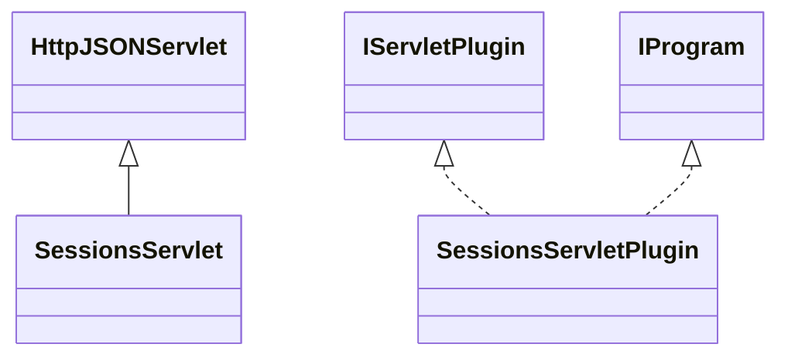

# DataManagerSessions.jar

[Group index](README.md) | [All archives](../README.md)

## Scope and provenance

- **Donor:** `SQX_145_REFERENCE_ROOT/internal/plugins/DataManagerSessions/DataManagerSessions.jar`.
- **SHA-256:** `3873aeab1b04f6beafaae0d1f99ae5ddf962651861cf0777e3aeb08d4414c4e3`; accessed 2026-10-06; captured `2026-10-06T18:54:51.906614+00:00`.
- **Classes:** 3 raw entries; 3 unique entry names. Duplicate occurrence indices are zero-based.
- **Inspection:** read-only ZIP hashing and class-file structural parsing; signatures/descriptors, modifiers, hierarchy and references only. Bytecode bodies are hashed, not published.
- **Allocation:** proposed `FEAT-DATA-DATA-MANAGER-SESSIONS`, P03; [roadmap](../../dev/sqx-full-application-roadmap.md). Domain README registration remains required.
- **Repository:** `01067f00031428613c6394064ca1bcadc1ba00ee`; review state unreviewed. Download label 145-dev1; installed build/activation and runtime equivalence unverified.
- **Limit:** every class/member is inventoried; declaration coverage does not establish consumed calls, defaults, formulas, failure semantics or algorithm parity.
- **Archive/resource index:** [172.json](../../dev/evidence/sqx145/archives/145/172.json).

## Complete member declarations

Member shards contain exact JVM names/descriptors, access flags, generic signatures, throws types, declared fields/methods, superclass/interfaces and referenced class names. All classes, nested/synthetic members and overloads are retained. Code length/hash is structural evidence, not a normalized algorithm comparison.

- [001.json](../../dev/evidence/sqx145/members/172/001.json) — SHA-256 `15478c65f73e86ab10b41c5fadde9d8bb8e167b38b90e54740a9e134907efd7d`.

## Focused structural diagram

Up to twelve non-nested classes; arrows show declared inheritance/interfaces only. External type names are not evidence of an available body or an executed dependency.

## Class inventory

| Archive entry | Occurrence | Class SHA-256 | Fields | Methods |
| --- | ---: | --- | ---: | ---: |
| `com/strategyquant/plugin/DataManager/impl/Sessions/SessionsServlet$1.class` | 0 | `3626dec06b412df03af8b39d0c4ca6a24525dc393e0706d40dcc4217c23adad4` | 3 | 2 |
| `com/strategyquant/plugin/DataManager/impl/Sessions/SessionsServlet.class` | 0 | `5dddbf1a4fbb9bc2b34c9407402e2298088fb5f2efd96e04527a1f3368868f5d` | 1 | 19 |
| `com/strategyquant/plugin/DataManager/impl/Sessions/SessionsServletPlugin.class` | 0 | `3a7468b6804509f2de49673001a66fbe0f9d217e8bce65572c362a9d3b831658` | 2 | 6 |
