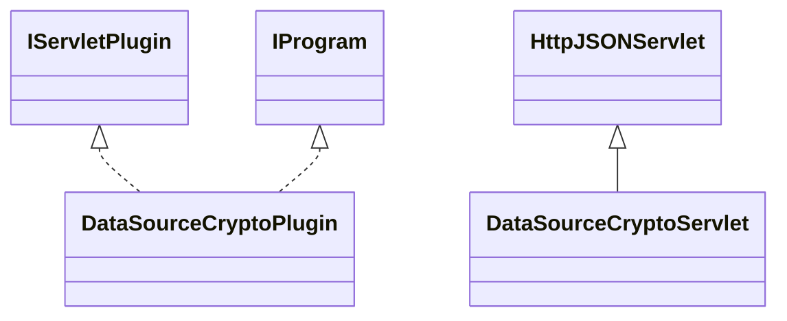

# DataSourceCrypto.jar

[Group index](README.md) | [All archives](../README.md)

## Scope and provenance

- **Donor:** `SQX_145_REFERENCE_ROOT/internal/plugins/DataSourceCrypto/DataSourceCrypto.jar`.
- **SHA-256:** `0fc7ef50935978a05bd392601a7a22eb1a1a67e541300eae56386acfb3790d79`; accessed 2026-10-06; captured `2026-10-06T18:54:51.906614+00:00`.
- **Classes:** 3 raw entries; 3 unique entry names. Duplicate occurrence indices are zero-based.
- **Inspection:** read-only ZIP hashing and class-file structural parsing; signatures/descriptors, modifiers, hierarchy and references only. Bytecode bodies are hashed, not published.
- **Allocation:** proposed `FEAT-DATA-SOURCE-DATA-SOURCE-CRYPTO`, P04; [roadmap](../../dev/sqx-full-application-roadmap.md). Domain README registration remains required.
- **Repository:** `01067f00031428613c6394064ca1bcadc1ba00ee`; review state unreviewed. Download label 145-dev1; installed build/activation and runtime equivalence unverified.
- **Limit:** every class/member is inventoried; declaration coverage does not establish consumed calls, defaults, formulas, failure semantics or algorithm parity.
- **Archive/resource index:** [173.json](../../dev/evidence/sqx145/archives/145/173.json).

## Complete member declarations

Member shards contain exact JVM names/descriptors, access flags, generic signatures, throws types, declared fields/methods, superclass/interfaces and referenced class names. All classes, nested/synthetic members and overloads are retained. Code length/hash is structural evidence, not a normalized algorithm comparison.

- [001.json](../../dev/evidence/sqx145/members/173/001.json) — SHA-256 `fc342096a76c70d304f25b87b6de380aa958820eb1fe44442bb48e92b93f1582`.

## Focused structural diagram

Up to twelve non-nested classes; arrows show declared inheritance/interfaces only. External type names are not evidence of an available body or an executed dependency.

## Class inventory

| Archive entry | Occurrence | Class SHA-256 | Fields | Methods |
| --- | ---: | --- | ---: | ---: |
| `com/strategyquant/plugin/DataSource/impl/Crypto/DataSourceCryptoPlugin.class` | 0 | `49537639ca9492b63aa3caf47fd8ef0bc39483772332013287aef91d47e30eff` | 2 | 6 |
| `com/strategyquant/plugin/DataSource/impl/Crypto/DataSourceCryptoServlet$1.class` | 0 | `91ff2d75570d49f5ade422ea3d83b581ec8a10f5160be759d414308bc61de760` | 2 | 2 |
| `com/strategyquant/plugin/DataSource/impl/Crypto/DataSourceCryptoServlet.class` | 0 | `c3b8314c8dcaefa1d19d2b79862eff45b12b6145765dc7dfc46968797e456a4c` | 3 | 15 |
