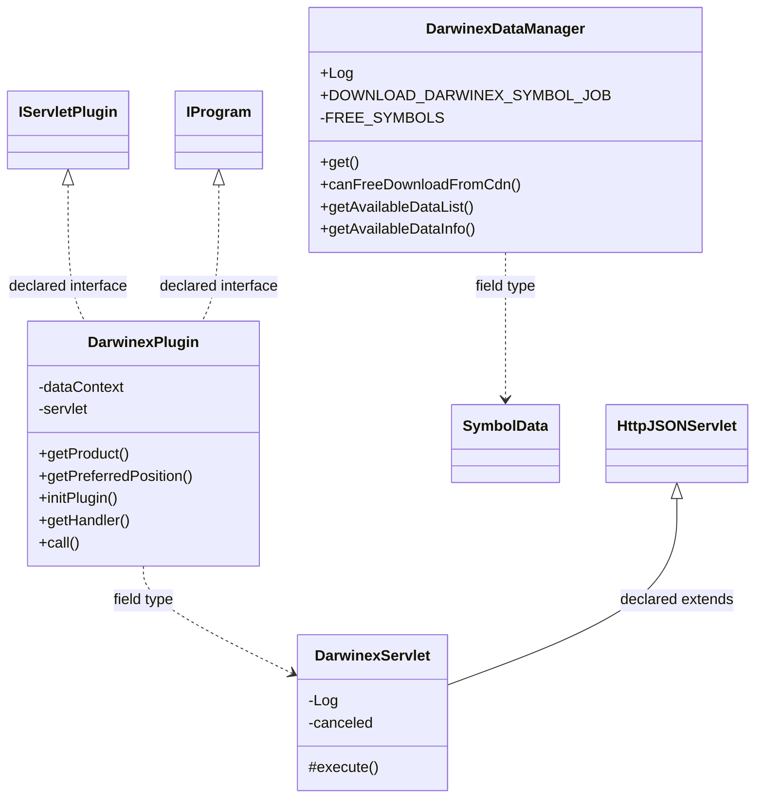
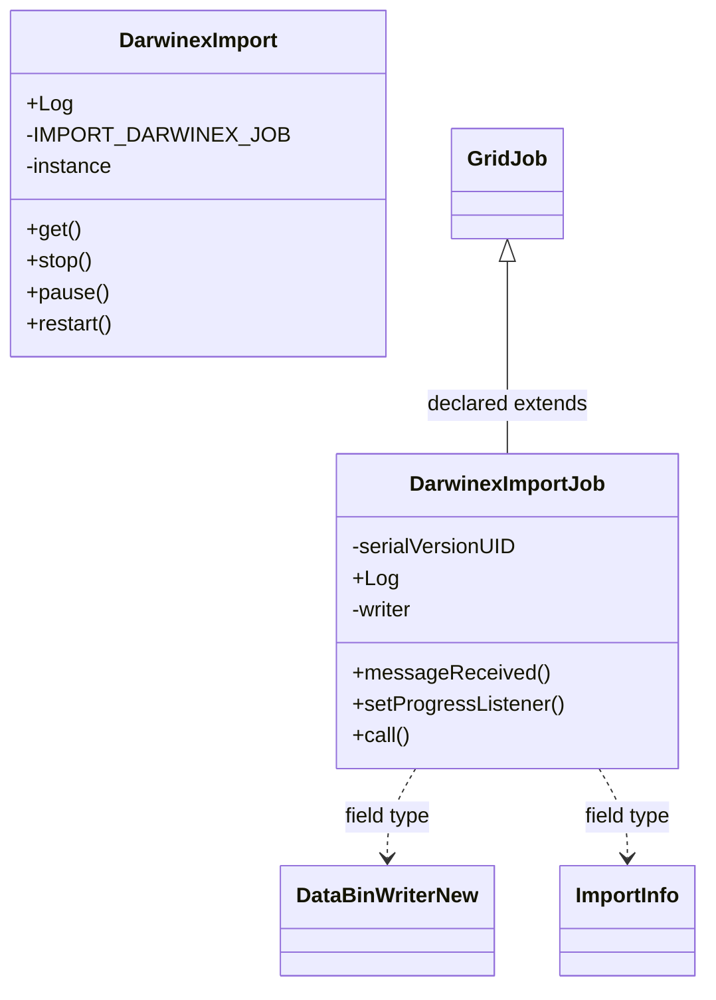

# DataSourceDarwinex.jar

[Workspace/group index](README.md)  |  [All workspaces](../README.md)

## Scope and provenance

- Artifact: `SQX_REFERENCE_ROOT/internal/plugins/DataSourceDarwinex/DataSourceDarwinex.jar`.
- SHA-256: `8c0440e30abd2e2478b39bd0525f82426a7d909135a782c21c22f8f3180c6c88`.
- Inspected: 2026-10-05; generation timestamp `2026-10-05T19:04:16.344170+00:00`.
- Archive class entries: **8**; non-nested: **5**; nested/anonymous: **3**.
- Inspection: ZIP entry/manifest enumeration and `javap -p` declarations for every listed class.
- Repository source HEAD: `8a92c705183a6702eaf62037ccb202ed028aa899`; review state: generated, pending owner review.
- Installed SQX build number is unverified. No method bodies are reproduced.
- Confidence: high for declared structure; workspace ownership inferred except where registration evidence is separately stated. Runtime reachability, call order, formulas and parity remain unverified.

The `DataManager` folder is a navigation/research grouping, not an exclusive backend owner. Shared consumers may use this JAR.

Target mapping: no verified owning HaruQuantAI feature/requirement/decision IDs are assigned by this document. Register or resolve ownership through the normal repository plan before implementation.

## Diagram reading guide

`Parent <|-- Child` means declared inheritance; `Interface <|.. Class` means declared implementation. Interface extension uses the inheritance arrow. `A ..> B : field type` is a declared type dependency, not composition, object ownership or a runtime call. External nodes are referenced types, not fabricated local implementations. Selected fields/method names aid navigation: `+` is public, `#` protected and `-` private. Diagram method names omit parameter/return types and collapse overloads; use the exact inspected declarations below before implementing an API.

Detailed graphs include non-nested classes in package-sized groups of at most 12. Nested/anonymous classes are inventoried and their declarations/relationships are retained below, but omitted from overview graphs. Relationships not drawn for readability remain in the complete declaration-relationship table. Constructors, synthetic bridges and overloads may be collapsed in diagram member lists only. Standard `java.lang.Object` inheritance is omitted from diagrams.

## UML class diagrams

### 1. `com.strategyquant.plugin.DataSource.impl.Darwinex`



| Diagram identifier | Exact type | Location |
| --- | --- | --- |
| `Cd6aa451b44cb` | [`com.strategyquant.datalib.SymbolData`](../Shared/SQDataLib.md) | referenced external type |
| `Ce09705d40432` | `com.strategyquant.plugin.DataSource.impl.Darwinex.DarwinexDataManager` (this JAR) | this diagram |
| `C13ecaa72e3e6` | `com.strategyquant.plugin.DataSource.impl.Darwinex.DarwinexPlugin` (this JAR) | this diagram |
| `C246bce101a20` | `com.strategyquant.plugin.DataSource.impl.Darwinex.DarwinexServlet` (this JAR) | this diagram |
| `C1b6b4448b67b` | [`com.strategyquant.pluginlib.program.IProgram`](../Shared/SQPluginLib.md) | referenced external type |
| `C249b5c671b1a` | [`com.strategyquant.tradinglib.servlet.IServletPlugin`](../Shared/SQTradingLib.md) | referenced external type |
| `C8900f90ae594` | [`com.strategyquant.webguilib.servlet.HttpJSONServlet`](../Shared/SQWebGUILib.md) | referenced external type |

### 2. `com.strategyquant.plugin.DataSource.impl.Darwinex.importdata`



| Diagram identifier | Exact type | Location |
| --- | --- | --- |
| `C988691ef2599` | [`com.strategyquant.datalib.data.io.newDataFormat.DataBinWriterNew`](../Shared/SQDataLib.md) | referenced external type |
| `C729a56512564` | [`com.strategyquant.gridlib.client.GridJob`](../Shared/SQGridLib2.md) | referenced external type |
| `Cea5480724f98` | `com.strategyquant.plugin.DataSource.impl.Darwinex.importdata.DarwinexImport` (this JAR) | this diagram |
| `Cb338e3c18e49` | `com.strategyquant.plugin.DataSource.impl.Darwinex.importdata.DarwinexImportJob` (this JAR) | this diagram |
| `Cd4cd5f86d5a2` | [`com.strategyquant.tradinglib.dukascopy.ImportInfo`](../Shared/SQTradingLib.md) | referenced external type |

## Complete class inventory

| Fully qualified class | Kind | Entry |
| --- | --- | --- |
| `com.strategyquant.plugin.DataSource.impl.Darwinex.DarwinexDataManager` | class | non-nested |
| `com.strategyquant.plugin.DataSource.impl.Darwinex.DarwinexPlugin` | class | non-nested |
| `com.strategyquant.plugin.DataSource.impl.Darwinex.DarwinexServlet` | class | non-nested |
| `com.strategyquant.plugin.DataSource.impl.Darwinex.DarwinexServlet$1` | class | nested/anonymous |
| `com.strategyquant.plugin.DataSource.impl.Darwinex.DarwinexServlet$2` | class | nested/anonymous |
| `com.strategyquant.plugin.DataSource.impl.Darwinex.DarwinexServlet$3` | class | nested/anonymous |
| `com.strategyquant.plugin.DataSource.impl.Darwinex.importdata.DarwinexImport` | class | non-nested |
| `com.strategyquant.plugin.DataSource.impl.Darwinex.importdata.DarwinexImportJob` | class | non-nested |

## Declared relationships and evidence locations

Every row is supported by the named class declaration/member in `javap -p`, inside the artifact recorded above. Signature dependencies may include return, parameter, generic-argument and throws types; they do not imply execution.

| Declaring class | Referenced type | Relationship | Narrow inspection location |
| --- | --- | --- | --- |
| `com.strategyquant.plugin.DataSource.impl.Darwinex.DarwinexDataManager` | `org.slf4j.Logger` (not resolved in scoped archives) | type dependency | `com.strategyquant.plugin.DataSource.impl.Darwinex.DarwinexDataManager` / field declaration: `public static final org.slf4j.Logger Log;` |
| `com.strategyquant.plugin.DataSource.impl.Darwinex.DarwinexDataManager` | `java.lang.String` (not resolved in scoped archives) | type dependency | `com.strategyquant.plugin.DataSource.impl.Darwinex.DarwinexDataManager` / field declaration: `public static final java.lang.String DOWNLOAD_DARWINEX_SYMBOL_JOB;`<br>`private static final java.util.Set<java.lang.String> FREE_SYMBOLS;`<br>`private static final java.lang.String dataListPath;`<br>`private static final java.lang.String dataListLineDelimiter;`<br>`private static final java.lang.String dataListValueDelimiter;`<br>`private static final java.lang.String dataListDateFormat;`<br>`private java.util.Map<java.lang.String, com.strategyquant.datalib.SymbolData> availableDataMap;` |
| `com.strategyquant.plugin.DataSource.impl.Darwinex.DarwinexDataManager` | `java.lang.String` (not resolved in scoped archives) | type dependency | `com.strategyquant.plugin.DataSource.impl.Darwinex.DarwinexDataManager` / method signature: `public boolean canFreeDownloadFromCdn(java.lang.String);`<br>`public com.strategyquant.datalib.SymbolData getAvailableDataInfo(java.lang.String);`<br>`public java.lang.String addData(java.lang.String, java.lang.String, int, java.lang.String) throws java.lang.Exception;`<br>`private java.lang.String generateName(java.lang.String);` |
| `com.strategyquant.plugin.DataSource.impl.Darwinex.DarwinexDataManager` | `java.util.Set` (not resolved in scoped archives) | type dependency | `com.strategyquant.plugin.DataSource.impl.Darwinex.DarwinexDataManager` / field declaration: `private static final java.util.Set<java.lang.String> FREE_SYMBOLS;` |
| `com.strategyquant.plugin.DataSource.impl.Darwinex.DarwinexDataManager` | `java.util.ArrayList` (not resolved in scoped archives) | type dependency | `com.strategyquant.plugin.DataSource.impl.Darwinex.DarwinexDataManager` / field declaration: `private java.util.ArrayList<com.strategyquant.datalib.SymbolData> availableData;` |
| `com.strategyquant.plugin.DataSource.impl.Darwinex.DarwinexDataManager` | `java.util.ArrayList` (not resolved in scoped archives) | type dependency | `com.strategyquant.plugin.DataSource.impl.Darwinex.DarwinexDataManager` / method signature: `public java.util.ArrayList<com.strategyquant.datalib.SymbolData> getAvailableDataList();` |
| `com.strategyquant.plugin.DataSource.impl.Darwinex.DarwinexDataManager` | [`com.strategyquant.datalib.SymbolData`](../Shared/SQDataLib.md) | type dependency | `com.strategyquant.plugin.DataSource.impl.Darwinex.DarwinexDataManager` / field declaration: `private java.util.ArrayList<com.strategyquant.datalib.SymbolData> availableData;`<br>`private java.util.Map<java.lang.String, com.strategyquant.datalib.SymbolData> availableDataMap;` |
| `com.strategyquant.plugin.DataSource.impl.Darwinex.DarwinexDataManager` | [`com.strategyquant.datalib.SymbolData`](../Shared/SQDataLib.md) | type dependency | `com.strategyquant.plugin.DataSource.impl.Darwinex.DarwinexDataManager` / method signature: `public java.util.ArrayList<com.strategyquant.datalib.SymbolData> getAvailableDataList();`<br>`public com.strategyquant.datalib.SymbolData getAvailableDataInfo(java.lang.String);` |
| `com.strategyquant.plugin.DataSource.impl.Darwinex.DarwinexDataManager` | `java.util.Map` (not resolved in scoped archives) | type dependency | `com.strategyquant.plugin.DataSource.impl.Darwinex.DarwinexDataManager` / field declaration: `private java.util.Map<java.lang.String, com.strategyquant.datalib.SymbolData> availableDataMap;` |
| `com.strategyquant.plugin.DataSource.impl.Darwinex.DarwinexDataManager` | `java.util.concurrent.locks.ReentrantLock` (not resolved in scoped archives) | type dependency | `com.strategyquant.plugin.DataSource.impl.Darwinex.DarwinexDataManager` / field declaration: `private static java.util.concurrent.locks.ReentrantLock lock;` |
| `com.strategyquant.plugin.DataSource.impl.Darwinex.DarwinexDataManager` | `java.lang.Exception` (not resolved in scoped archives) | type dependency | `com.strategyquant.plugin.DataSource.impl.Darwinex.DarwinexDataManager` / method signature: `public java.lang.String addData(java.lang.String, java.lang.String, int, java.lang.String) throws java.lang.Exception;` |
| `com.strategyquant.plugin.DataSource.impl.Darwinex.DarwinexPlugin` | [`com.strategyquant.tradinglib.servlet.IServletPlugin`](../Shared/SQTradingLib.md) | implements | `com.strategyquant.plugin.DataSource.impl.Darwinex.DarwinexPlugin` / class declaration: `public class com.strategyquant.plugin.DataSource.impl.Darwinex.DarwinexPlugin implements com.strategyquant.tradinglib.servlet.IServletPlugin,com.strategyquant.pluginlib.program.IProgram` |
| `com.strategyquant.plugin.DataSource.impl.Darwinex.DarwinexPlugin` | [`com.strategyquant.pluginlib.program.IProgram`](../Shared/SQPluginLib.md) | implements | `com.strategyquant.plugin.DataSource.impl.Darwinex.DarwinexPlugin` / class declaration: `public class com.strategyquant.plugin.DataSource.impl.Darwinex.DarwinexPlugin implements com.strategyquant.tradinglib.servlet.IServletPlugin,com.strategyquant.pluginlib.program.IProgram` |
| `com.strategyquant.plugin.DataSource.impl.Darwinex.DarwinexPlugin` | `org.eclipse.jetty.servlet.ServletContextHandler` (not resolved in scoped archives) | type dependency | `com.strategyquant.plugin.DataSource.impl.Darwinex.DarwinexPlugin` / field declaration: `private org.eclipse.jetty.servlet.ServletContextHandler dataContext;` |
| `com.strategyquant.plugin.DataSource.impl.Darwinex.DarwinexPlugin` | `com.strategyquant.plugin.DataSource.impl.Darwinex.DarwinexServlet` (this JAR) | type dependency | `com.strategyquant.plugin.DataSource.impl.Darwinex.DarwinexPlugin` / field declaration: `private com.strategyquant.plugin.DataSource.impl.Darwinex.DarwinexServlet servlet;` |
| `com.strategyquant.plugin.DataSource.impl.Darwinex.DarwinexPlugin` | `java.lang.String` (not resolved in scoped archives) | type dependency | `com.strategyquant.plugin.DataSource.impl.Darwinex.DarwinexPlugin` / method signature: `public java.lang.String getProduct();`<br>`public java.lang.Object call(java.lang.String, java.lang.Object...) throws java.lang.Exception;` |
| `com.strategyquant.plugin.DataSource.impl.Darwinex.DarwinexPlugin` | `java.lang.Exception` (not resolved in scoped archives) | type dependency | `com.strategyquant.plugin.DataSource.impl.Darwinex.DarwinexPlugin` / method signature: `public void initPlugin() throws java.lang.Exception;`<br>`public java.lang.Object call(java.lang.String, java.lang.Object...) throws java.lang.Exception;` |
| `com.strategyquant.plugin.DataSource.impl.Darwinex.DarwinexPlugin` | `org.eclipse.jetty.server.Handler` (not resolved in scoped archives) | type dependency | `com.strategyquant.plugin.DataSource.impl.Darwinex.DarwinexPlugin` / method signature: `public org.eclipse.jetty.server.Handler getHandler();` |
| `com.strategyquant.plugin.DataSource.impl.Darwinex.DarwinexPlugin` | `java.lang.Object` (not resolved in scoped archives) | type dependency | `com.strategyquant.plugin.DataSource.impl.Darwinex.DarwinexPlugin` / method signature: `public java.lang.Object call(java.lang.String, java.lang.Object...) throws java.lang.Exception;` |
| `com.strategyquant.plugin.DataSource.impl.Darwinex.DarwinexServlet` | [`com.strategyquant.webguilib.servlet.HttpJSONServlet`](../Shared/SQWebGUILib.md) | extends | `com.strategyquant.plugin.DataSource.impl.Darwinex.DarwinexServlet` / class declaration: `public class com.strategyquant.plugin.DataSource.impl.Darwinex.DarwinexServlet extends com.strategyquant.webguilib.servlet.HttpJSONServlet` |
| `com.strategyquant.plugin.DataSource.impl.Darwinex.DarwinexServlet` | `org.slf4j.Logger` (not resolved in scoped archives) | type dependency | `com.strategyquant.plugin.DataSource.impl.Darwinex.DarwinexServlet` / field declaration: `private static final org.slf4j.Logger Log;` |
| `com.strategyquant.plugin.DataSource.impl.Darwinex.DarwinexServlet` | `java.lang.String` (not resolved in scoped archives) | type dependency | `com.strategyquant.plugin.DataSource.impl.Darwinex.DarwinexServlet` / method signature: `protected java.lang.String execute(java.lang.String, java.util.Map<java.lang.String, java.lang.String[]>, java.lang.String) throws java.lang.Exception;`<br>`private java.lang.String onAddCancel() throws java.lang.Exception;`<br>`private java.lang.String onAddData(java.util.Map<java.lang.String, java.lang.String[]>) throws java.lang.Exception;`<br>`private void _onAdd(java.util.Map<java.lang.String, java.lang.String[]>);`<br>`private java.lang.String onImportLoadAvailableSymbols(java.util.Map<java.lang.String, java.lang.String[]>) throws java.lang.Exception;`<br>`private java.lang.String onImportData(java.util.Map<java.lang.String, java.lang.String[]>) throws java.lang.Exception;`<br>`private java.lang.String onImportDataCancel() throws java.lang.Exception;`<br>`private void _onImportData(java.util.Map<java.lang.String, java.lang.String[]>);`<br>`private java.lang.String onImportAction(java.util.Map<java.lang.String, java.lang.String[]>) throws java.lang.Exception;`<br>`private java.lang.String onDownloadGetDataList();`<br>`private java.lang.String onDownloadAddData(java.util.Map<java.lang.String, java.lang.String[]>);`<br>`private java.lang.String _onDownloadAddData(java.util.Map<java.lang.String, java.lang.String[]>);`<br>`private java.lang.String onDownloadData(java.util.Map<java.lang.String, java.lang.String[]>);`<br>`private java.lang.String onDownloadDataAction(java.util.Map<java.lang.String, java.lang.String[]>) throws java.lang.Exception;`<br>`private java.lang.String onUpdateAll();`<br>`private java.lang.String onUpdateSelected(java.util.Map<java.lang.String, java.lang.String[]>);`<br>`static java.lang.String access$200(com.strategyquant.plugin.DataSource.impl.Darwinex.DarwinexServlet, java.util.Map);` |
| `com.strategyquant.plugin.DataSource.impl.Darwinex.DarwinexServlet` | `java.util.Map` (not resolved in scoped archives) | type dependency | `com.strategyquant.plugin.DataSource.impl.Darwinex.DarwinexServlet` / method signature: `protected java.lang.String execute(java.lang.String, java.util.Map<java.lang.String, java.lang.String[]>, java.lang.String) throws java.lang.Exception;`<br>`private java.lang.String onAddData(java.util.Map<java.lang.String, java.lang.String[]>) throws java.lang.Exception;`<br>`private void _onAdd(java.util.Map<java.lang.String, java.lang.String[]>);`<br>`private java.lang.String onImportLoadAvailableSymbols(java.util.Map<java.lang.String, java.lang.String[]>) throws java.lang.Exception;`<br>`private java.lang.String onImportData(java.util.Map<java.lang.String, java.lang.String[]>) throws java.lang.Exception;`<br>`private void _onImportData(java.util.Map<java.lang.String, java.lang.String[]>);`<br>`private java.lang.String onImportAction(java.util.Map<java.lang.String, java.lang.String[]>) throws java.lang.Exception;`<br>`private java.lang.String onDownloadAddData(java.util.Map<java.lang.String, java.lang.String[]>);`<br>`private java.lang.String _onDownloadAddData(java.util.Map<java.lang.String, java.lang.String[]>);`<br>`private java.lang.String onDownloadData(java.util.Map<java.lang.String, java.lang.String[]>);`<br>`private java.lang.String onDownloadDataAction(java.util.Map<java.lang.String, java.lang.String[]>) throws java.lang.Exception;`<br>`private java.lang.String onUpdateSelected(java.util.Map<java.lang.String, java.lang.String[]>);`<br>`static void access$000(com.strategyquant.plugin.DataSource.impl.Darwinex.DarwinexServlet, java.util.Map);`<br>`static void access$100(com.strategyquant.plugin.DataSource.impl.Darwinex.DarwinexServlet, java.util.Map);`<br>`static java.lang.String access$200(com.strategyquant.plugin.DataSource.impl.Darwinex.DarwinexServlet, java.util.Map);` |
| `com.strategyquant.plugin.DataSource.impl.Darwinex.DarwinexServlet` | `java.lang.Exception` (not resolved in scoped archives) | type dependency | `com.strategyquant.plugin.DataSource.impl.Darwinex.DarwinexServlet` / method signature: `protected java.lang.String execute(java.lang.String, java.util.Map<java.lang.String, java.lang.String[]>, java.lang.String) throws java.lang.Exception;`<br>`private java.lang.String onAddCancel() throws java.lang.Exception;`<br>`private java.lang.String onAddData(java.util.Map<java.lang.String, java.lang.String[]>) throws java.lang.Exception;`<br>`private java.lang.String onImportLoadAvailableSymbols(java.util.Map<java.lang.String, java.lang.String[]>) throws java.lang.Exception;`<br>`private java.lang.String onImportData(java.util.Map<java.lang.String, java.lang.String[]>) throws java.lang.Exception;`<br>`private java.lang.String onImportDataCancel() throws java.lang.Exception;`<br>`private java.lang.String onImportAction(java.util.Map<java.lang.String, java.lang.String[]>) throws java.lang.Exception;`<br>`private java.lang.String onDownloadDataAction(java.util.Map<java.lang.String, java.lang.String[]>) throws java.lang.Exception;` |
| `com.strategyquant.plugin.DataSource.impl.Darwinex.DarwinexServlet$1` | `java.lang.Thread` (not resolved in scoped archives) | extends | `com.strategyquant.plugin.DataSource.impl.Darwinex.DarwinexServlet$1` / class declaration: `class com.strategyquant.plugin.DataSource.impl.Darwinex.DarwinexServlet$1 extends java.lang.Thread` |
| `com.strategyquant.plugin.DataSource.impl.Darwinex.DarwinexServlet$1` | `java.util.Map` (not resolved in scoped archives) | type dependency | `com.strategyquant.plugin.DataSource.impl.Darwinex.DarwinexServlet$1` / field declaration: `final java.util.Map val$args;` |
| `com.strategyquant.plugin.DataSource.impl.Darwinex.DarwinexServlet$1` | `java.util.Map` (not resolved in scoped archives) | type dependency | `com.strategyquant.plugin.DataSource.impl.Darwinex.DarwinexServlet$1` / method signature: `com.strategyquant.plugin.DataSource.impl.Darwinex.DarwinexServlet$1(com.strategyquant.plugin.DataSource.impl.Darwinex.DarwinexServlet, java.util.Map);` |
| `com.strategyquant.plugin.DataSource.impl.Darwinex.DarwinexServlet$1` | `com.strategyquant.plugin.DataSource.impl.Darwinex.DarwinexServlet` (this JAR) | type dependency | `com.strategyquant.plugin.DataSource.impl.Darwinex.DarwinexServlet$1` / field declaration: `final com.strategyquant.plugin.DataSource.impl.Darwinex.DarwinexServlet this$0;` |
| `com.strategyquant.plugin.DataSource.impl.Darwinex.DarwinexServlet$1` | `com.strategyquant.plugin.DataSource.impl.Darwinex.DarwinexServlet` (this JAR) | type dependency | `com.strategyquant.plugin.DataSource.impl.Darwinex.DarwinexServlet$1` / method signature: `com.strategyquant.plugin.DataSource.impl.Darwinex.DarwinexServlet$1(com.strategyquant.plugin.DataSource.impl.Darwinex.DarwinexServlet, java.util.Map);` |
| `com.strategyquant.plugin.DataSource.impl.Darwinex.DarwinexServlet$2` | `java.lang.Thread` (not resolved in scoped archives) | extends | `com.strategyquant.plugin.DataSource.impl.Darwinex.DarwinexServlet$2` / class declaration: `class com.strategyquant.plugin.DataSource.impl.Darwinex.DarwinexServlet$2 extends java.lang.Thread` |
| `com.strategyquant.plugin.DataSource.impl.Darwinex.DarwinexServlet$2` | `java.util.Map` (not resolved in scoped archives) | type dependency | `com.strategyquant.plugin.DataSource.impl.Darwinex.DarwinexServlet$2` / field declaration: `final java.util.Map val$args;` |
| `com.strategyquant.plugin.DataSource.impl.Darwinex.DarwinexServlet$2` | `java.util.Map` (not resolved in scoped archives) | type dependency | `com.strategyquant.plugin.DataSource.impl.Darwinex.DarwinexServlet$2` / method signature: `com.strategyquant.plugin.DataSource.impl.Darwinex.DarwinexServlet$2(com.strategyquant.plugin.DataSource.impl.Darwinex.DarwinexServlet, java.util.Map);` |
| `com.strategyquant.plugin.DataSource.impl.Darwinex.DarwinexServlet$2` | `com.strategyquant.plugin.DataSource.impl.Darwinex.DarwinexServlet` (this JAR) | type dependency | `com.strategyquant.plugin.DataSource.impl.Darwinex.DarwinexServlet$2` / field declaration: `final com.strategyquant.plugin.DataSource.impl.Darwinex.DarwinexServlet this$0;` |
| `com.strategyquant.plugin.DataSource.impl.Darwinex.DarwinexServlet$2` | `com.strategyquant.plugin.DataSource.impl.Darwinex.DarwinexServlet` (this JAR) | type dependency | `com.strategyquant.plugin.DataSource.impl.Darwinex.DarwinexServlet$2` / method signature: `com.strategyquant.plugin.DataSource.impl.Darwinex.DarwinexServlet$2(com.strategyquant.plugin.DataSource.impl.Darwinex.DarwinexServlet, java.util.Map);` |
| `com.strategyquant.plugin.DataSource.impl.Darwinex.DarwinexServlet$3` | `java.lang.Thread` (not resolved in scoped archives) | extends | `com.strategyquant.plugin.DataSource.impl.Darwinex.DarwinexServlet$3` / class declaration: `class com.strategyquant.plugin.DataSource.impl.Darwinex.DarwinexServlet$3 extends java.lang.Thread` |
| `com.strategyquant.plugin.DataSource.impl.Darwinex.DarwinexServlet$3` | `java.util.Map` (not resolved in scoped archives) | type dependency | `com.strategyquant.plugin.DataSource.impl.Darwinex.DarwinexServlet$3` / field declaration: `final java.util.Map val$args;` |
| `com.strategyquant.plugin.DataSource.impl.Darwinex.DarwinexServlet$3` | `java.util.Map` (not resolved in scoped archives) | type dependency | `com.strategyquant.plugin.DataSource.impl.Darwinex.DarwinexServlet$3` / method signature: `com.strategyquant.plugin.DataSource.impl.Darwinex.DarwinexServlet$3(com.strategyquant.plugin.DataSource.impl.Darwinex.DarwinexServlet, java.util.Map);` |
| `com.strategyquant.plugin.DataSource.impl.Darwinex.DarwinexServlet$3` | `com.strategyquant.plugin.DataSource.impl.Darwinex.DarwinexServlet` (this JAR) | type dependency | `com.strategyquant.plugin.DataSource.impl.Darwinex.DarwinexServlet$3` / field declaration: `final com.strategyquant.plugin.DataSource.impl.Darwinex.DarwinexServlet this$0;` |
| `com.strategyquant.plugin.DataSource.impl.Darwinex.DarwinexServlet$3` | `com.strategyquant.plugin.DataSource.impl.Darwinex.DarwinexServlet` (this JAR) | type dependency | `com.strategyquant.plugin.DataSource.impl.Darwinex.DarwinexServlet$3` / method signature: `com.strategyquant.plugin.DataSource.impl.Darwinex.DarwinexServlet$3(com.strategyquant.plugin.DataSource.impl.Darwinex.DarwinexServlet, java.util.Map);` |
| `com.strategyquant.plugin.DataSource.impl.Darwinex.importdata.DarwinexImport` | `org.slf4j.Logger` (not resolved in scoped archives) | type dependency | `com.strategyquant.plugin.DataSource.impl.Darwinex.importdata.DarwinexImport` / field declaration: `public static final org.slf4j.Logger Log;` |
| `com.strategyquant.plugin.DataSource.impl.Darwinex.importdata.DarwinexImport` | `java.lang.String` (not resolved in scoped archives) | type dependency | `com.strategyquant.plugin.DataSource.impl.Darwinex.importdata.DarwinexImport` / field declaration: `private static final java.lang.String IMPORT_DARWINEX_JOB;` |
| `com.strategyquant.plugin.DataSource.impl.Darwinex.importdata.DarwinexImport` | `java.lang.String` (not resolved in scoped archives) | type dependency | `com.strategyquant.plugin.DataSource.impl.Darwinex.importdata.DarwinexImport` / method signature: `public void stop(java.lang.String);`<br>`public void pause(java.lang.String);`<br>`public void restart(java.lang.String);`<br>`public void importData(com.strategyquant.tradinglib.dukascopy.ImportInfo, java.lang.String, com.strategyquant.tradinglib.project.websocket.DataManagerProgressListener);` |
| `com.strategyquant.plugin.DataSource.impl.Darwinex.importdata.DarwinexImport` | [`com.strategyquant.tradinglib.dukascopy.ImportInfo`](../Shared/SQTradingLib.md) | type dependency | `com.strategyquant.plugin.DataSource.impl.Darwinex.importdata.DarwinexImport` / method signature: `public void importData(com.strategyquant.tradinglib.dukascopy.ImportInfo, java.lang.String, com.strategyquant.tradinglib.project.websocket.DataManagerProgressListener);` |
| `com.strategyquant.plugin.DataSource.impl.Darwinex.importdata.DarwinexImport` | [`com.strategyquant.tradinglib.project.websocket.DataManagerProgressListener`](../Shared/SQTradingLib.md) | type dependency | `com.strategyquant.plugin.DataSource.impl.Darwinex.importdata.DarwinexImport` / method signature: `public void importData(com.strategyquant.tradinglib.dukascopy.ImportInfo, java.lang.String, com.strategyquant.tradinglib.project.websocket.DataManagerProgressListener);` |
| `com.strategyquant.plugin.DataSource.impl.Darwinex.importdata.DarwinexImportJob` | [`com.strategyquant.gridlib.client.GridJob`](../Shared/SQGridLib2.md) | extends | `com.strategyquant.plugin.DataSource.impl.Darwinex.importdata.DarwinexImportJob` / class declaration: `public class com.strategyquant.plugin.DataSource.impl.Darwinex.importdata.DarwinexImportJob extends com.strategyquant.gridlib.client.GridJob<java.lang.Void>` |
| `com.strategyquant.plugin.DataSource.impl.Darwinex.importdata.DarwinexImportJob` | `org.slf4j.Logger` (not resolved in scoped archives) | type dependency | `com.strategyquant.plugin.DataSource.impl.Darwinex.importdata.DarwinexImportJob` / field declaration: `public static final org.slf4j.Logger Log;` |
| `com.strategyquant.plugin.DataSource.impl.Darwinex.importdata.DarwinexImportJob` | [`com.strategyquant.datalib.data.io.newDataFormat.DataBinWriterNew`](../Shared/SQDataLib.md) | type dependency | `com.strategyquant.plugin.DataSource.impl.Darwinex.importdata.DarwinexImportJob` / field declaration: `com.strategyquant.datalib.data.io.newDataFormat.DataBinWriterNew writer;` |
| `com.strategyquant.plugin.DataSource.impl.Darwinex.importdata.DarwinexImportJob` | `java.lang.String` (not resolved in scoped archives) | type dependency | `com.strategyquant.plugin.DataSource.impl.Darwinex.importdata.DarwinexImportJob` / field declaration: `java.lang.String fileName;`<br>`java.lang.String tempFileName;`<br>`private java.lang.String path;` |
| `com.strategyquant.plugin.DataSource.impl.Darwinex.importdata.DarwinexImportJob` | `java.lang.String` (not resolved in scoped archives) | type dependency | `com.strategyquant.plugin.DataSource.impl.Darwinex.importdata.DarwinexImportJob` / method signature: `public com.strategyquant.plugin.DataSource.impl.Darwinex.importdata.DarwinexImportJob(com.strategyquant.tradinglib.dukascopy.ImportInfo, java.lang.String, java.lang.String) throws java.lang.Exception;`<br>`private java.lang.Long getMinMaxDate(java.lang.String, boolean);` |
| `com.strategyquant.plugin.DataSource.impl.Darwinex.importdata.DarwinexImportJob` | [`com.strategyquant.tradinglib.dukascopy.ImportInfo`](../Shared/SQTradingLib.md) | type dependency | `com.strategyquant.plugin.DataSource.impl.Darwinex.importdata.DarwinexImportJob` / field declaration: `private com.strategyquant.tradinglib.dukascopy.ImportInfo importInfo;` |
| `com.strategyquant.plugin.DataSource.impl.Darwinex.importdata.DarwinexImportJob` | [`com.strategyquant.tradinglib.dukascopy.ImportInfo`](../Shared/SQTradingLib.md) | type dependency | `com.strategyquant.plugin.DataSource.impl.Darwinex.importdata.DarwinexImportJob` / method signature: `public com.strategyquant.plugin.DataSource.impl.Darwinex.importdata.DarwinexImportJob(com.strategyquant.tradinglib.dukascopy.ImportInfo, java.lang.String, java.lang.String) throws java.lang.Exception;` |
| `com.strategyquant.plugin.DataSource.impl.Darwinex.importdata.DarwinexImportJob` | [`com.strategyquant.tradinglib.project.websocket.DataManagerProgressListener`](../Shared/SQTradingLib.md) | type dependency | `com.strategyquant.plugin.DataSource.impl.Darwinex.importdata.DarwinexImportJob` / field declaration: `private com.strategyquant.tradinglib.project.websocket.DataManagerProgressListener listener;` |
| `com.strategyquant.plugin.DataSource.impl.Darwinex.importdata.DarwinexImportJob` | [`com.strategyquant.tradinglib.project.websocket.DataManagerProgressListener`](../Shared/SQTradingLib.md) | type dependency | `com.strategyquant.plugin.DataSource.impl.Darwinex.importdata.DarwinexImportJob` / method signature: `public void setProgressListener(com.strategyquant.tradinglib.project.websocket.DataManagerProgressListener);` |
| `com.strategyquant.plugin.DataSource.impl.Darwinex.importdata.DarwinexImportJob` | `org.joda.time.format.DateTimeFormatter` (not resolved in scoped archives) | type dependency | `com.strategyquant.plugin.DataSource.impl.Darwinex.importdata.DarwinexImportJob` / field declaration: `private org.joda.time.format.DateTimeFormatter dateFormatter;` |
| `com.strategyquant.plugin.DataSource.impl.Darwinex.importdata.DarwinexImportJob` | `java.text.DecimalFormat` (not resolved in scoped archives) | type dependency | `com.strategyquant.plugin.DataSource.impl.Darwinex.importdata.DarwinexImportJob` / field declaration: `private static java.text.DecimalFormat int2Form;` |
| `com.strategyquant.plugin.DataSource.impl.Darwinex.importdata.DarwinexImportJob` | `java.lang.Exception` (not resolved in scoped archives) | type dependency | `com.strategyquant.plugin.DataSource.impl.Darwinex.importdata.DarwinexImportJob` / method signature: `public com.strategyquant.plugin.DataSource.impl.Darwinex.importdata.DarwinexImportJob(com.strategyquant.tradinglib.dukascopy.ImportInfo, java.lang.String, java.lang.String) throws java.lang.Exception;`<br>`private void initWriter() throws java.lang.Exception;`<br>`public java.lang.Void call() throws java.lang.Exception;`<br>`private void writeData(java.io.File, java.io.File, it.unimi.dsi.fastutil.longs.Long2ObjectAVLTreeMap<com.strategyquant.datalib.data.io.VersatileData>) throws java.lang.Exception;`<br>`public java.lang.Object call() throws java.lang.Exception;` |
| `com.strategyquant.plugin.DataSource.impl.Darwinex.importdata.DarwinexImportJob` | `java.io.File` (not resolved in scoped archives) | type dependency | `com.strategyquant.plugin.DataSource.impl.Darwinex.importdata.DarwinexImportJob` / method signature: `private void evalFromTo(java.io.File);`<br>`private long parseTime(java.io.File);`<br>`private void writeData(java.io.File, java.io.File, it.unimi.dsi.fastutil.longs.Long2ObjectAVLTreeMap<com.strategyquant.datalib.data.io.VersatileData>) throws java.lang.Exception;` |
| `com.strategyquant.plugin.DataSource.impl.Darwinex.importdata.DarwinexImportJob` | `java.lang.Long` (not resolved in scoped archives) | type dependency | `com.strategyquant.plugin.DataSource.impl.Darwinex.importdata.DarwinexImportJob` / method signature: `private java.lang.Long getMinMaxDate(java.lang.String, boolean);` |
| `com.strategyquant.plugin.DataSource.impl.Darwinex.importdata.DarwinexImportJob` | [`com.strategyquant.gridlib.client.GridMessage`](../Shared/SQGridLib2.md) | type dependency | `com.strategyquant.plugin.DataSource.impl.Darwinex.importdata.DarwinexImportJob` / method signature: `public void messageReceived(com.strategyquant.gridlib.client.GridMessage);` |
| `com.strategyquant.plugin.DataSource.impl.Darwinex.importdata.DarwinexImportJob` | `java.lang.Void` (not resolved in scoped archives) | type dependency | `com.strategyquant.plugin.DataSource.impl.Darwinex.importdata.DarwinexImportJob` / method signature: `public java.lang.Void call() throws java.lang.Exception;` |
| `com.strategyquant.plugin.DataSource.impl.Darwinex.importdata.DarwinexImportJob` | `it.unimi.dsi.fastutil.longs.Long2ObjectAVLTreeMap` (not resolved in scoped archives) | type dependency | `com.strategyquant.plugin.DataSource.impl.Darwinex.importdata.DarwinexImportJob` / method signature: `private void writeData(java.io.File, java.io.File, it.unimi.dsi.fastutil.longs.Long2ObjectAVLTreeMap<com.strategyquant.datalib.data.io.VersatileData>) throws java.lang.Exception;` |
| `com.strategyquant.plugin.DataSource.impl.Darwinex.importdata.DarwinexImportJob` | [`com.strategyquant.datalib.data.io.VersatileData`](../Shared/SQDataLib.md) | type dependency | `com.strategyquant.plugin.DataSource.impl.Darwinex.importdata.DarwinexImportJob` / method signature: `private void writeData(java.io.File, java.io.File, it.unimi.dsi.fastutil.longs.Long2ObjectAVLTreeMap<com.strategyquant.datalib.data.io.VersatileData>) throws java.lang.Exception;` |
| `com.strategyquant.plugin.DataSource.impl.Darwinex.importdata.DarwinexImportJob` | `java.lang.InterruptedException` (not resolved in scoped archives) | type dependency | `com.strategyquant.plugin.DataSource.impl.Darwinex.importdata.DarwinexImportJob` / method signature: `private void checkPaused() throws java.lang.InterruptedException;` |
| `com.strategyquant.plugin.DataSource.impl.Darwinex.importdata.DarwinexImportJob` | `java.lang.Object` (not resolved in scoped archives) | type dependency | `com.strategyquant.plugin.DataSource.impl.Darwinex.importdata.DarwinexImportJob` / method signature: `public java.lang.Object call() throws java.lang.Exception;` |

## Inspected declaration reference

These are structural API/member declarations, not proprietary implementation bodies. Private members and nested classes are retained to make diagram omissions explicit; declarations do not prove behavior.

<details>
<summary>com.strategyquant.plugin.DataSource.impl.Darwinex.DarwinexDataManager</summary>

```text
public class com.strategyquant.plugin.DataSource.impl.Darwinex.DarwinexDataManager
    public static final org.slf4j.Logger Log;
    public static final java.lang.String DOWNLOAD_DARWINEX_SYMBOL_JOB;
    private static final java.util.Set<java.lang.String> FREE_SYMBOLS;
    private static final java.lang.String dataListPath;
    private static final java.lang.String dataListLineDelimiter;
    private static final java.lang.String dataListValueDelimiter;
    private static final java.lang.String dataListDateFormat;
    private java.util.ArrayList<com.strategyquant.datalib.SymbolData> availableData;
    private java.util.Map<java.lang.String, com.strategyquant.datalib.SymbolData> availableDataMap;
    private static java.util.concurrent.locks.ReentrantLock lock;
    private static com.strategyquant.plugin.DataSource.impl.Darwinex.DarwinexDataManager instance;
    public static synchronized com.strategyquant.plugin.DataSource.impl.Darwinex.DarwinexDataManager get();
    private com.strategyquant.plugin.DataSource.impl.Darwinex.DarwinexDataManager();
    public boolean canFreeDownloadFromCdn(java.lang.String);
    private void loadSettings();
    private void loadAvailableData();
    public java.util.ArrayList<com.strategyquant.datalib.SymbolData> getAvailableDataList();
    public com.strategyquant.datalib.SymbolData getAvailableDataInfo(java.lang.String);
    public java.lang.String addData(java.lang.String, java.lang.String, int, java.lang.String) throws java.lang.Exception;
    private java.lang.String generateName(java.lang.String);
```

</details>

<details>
<summary>com.strategyquant.plugin.DataSource.impl.Darwinex.DarwinexPlugin</summary>

```text
public class com.strategyquant.plugin.DataSource.impl.Darwinex.DarwinexPlugin implements com.strategyquant.tradinglib.servlet.IServletPlugin,com.strategyquant.pluginlib.program.IProgram
    private org.eclipse.jetty.servlet.ServletContextHandler dataContext;
    private com.strategyquant.plugin.DataSource.impl.Darwinex.DarwinexServlet servlet;
    public com.strategyquant.plugin.DataSource.impl.Darwinex.DarwinexPlugin();
    public java.lang.String getProduct();
    public int getPreferredPosition();
    public void initPlugin() throws java.lang.Exception;
    public org.eclipse.jetty.server.Handler getHandler();
    public java.lang.Object call(java.lang.String, java.lang.Object...) throws java.lang.Exception;
```

</details>

<details>
<summary>com.strategyquant.plugin.DataSource.impl.Darwinex.DarwinexServlet</summary>

```text
public class com.strategyquant.plugin.DataSource.impl.Darwinex.DarwinexServlet extends com.strategyquant.webguilib.servlet.HttpJSONServlet
    private static final org.slf4j.Logger Log;
    private boolean canceled;
    public com.strategyquant.plugin.DataSource.impl.Darwinex.DarwinexServlet();
    protected java.lang.String execute(java.lang.String, java.util.Map<java.lang.String, java.lang.String[]>, java.lang.String) throws java.lang.Exception;
    private java.lang.String onAddCancel() throws java.lang.Exception;
    private java.lang.String onAddData(java.util.Map<java.lang.String, java.lang.String[]>) throws java.lang.Exception;
    private void _onAdd(java.util.Map<java.lang.String, java.lang.String[]>);
    private java.lang.String onImportLoadAvailableSymbols(java.util.Map<java.lang.String, java.lang.String[]>) throws java.lang.Exception;
    private java.lang.String onImportData(java.util.Map<java.lang.String, java.lang.String[]>) throws java.lang.Exception;
    private java.lang.String onImportDataCancel() throws java.lang.Exception;
    private void _onImportData(java.util.Map<java.lang.String, java.lang.String[]>);
    private java.lang.String onImportAction(java.util.Map<java.lang.String, java.lang.String[]>) throws java.lang.Exception;
    private java.lang.String onDownloadGetDataList();
    private java.lang.String onDownloadAddData(java.util.Map<java.lang.String, java.lang.String[]>);
    private java.lang.String _onDownloadAddData(java.util.Map<java.lang.String, java.lang.String[]>);
    private java.lang.String onDownloadData(java.util.Map<java.lang.String, java.lang.String[]>);
    private java.lang.String onDownloadDataAction(java.util.Map<java.lang.String, java.lang.String[]>) throws java.lang.Exception;
    private java.lang.String onUpdateAll();
    private java.lang.String onUpdateSelected(java.util.Map<java.lang.String, java.lang.String[]>);
    static void access$000(com.strategyquant.plugin.DataSource.impl.Darwinex.DarwinexServlet, java.util.Map);
    static void access$100(com.strategyquant.plugin.DataSource.impl.Darwinex.DarwinexServlet, java.util.Map);
    static java.lang.String access$200(com.strategyquant.plugin.DataSource.impl.Darwinex.DarwinexServlet, java.util.Map);
```

</details>

<details>
<summary>com.strategyquant.plugin.DataSource.impl.Darwinex.DarwinexServlet$1</summary>

```text
class com.strategyquant.plugin.DataSource.impl.Darwinex.DarwinexServlet$1 extends java.lang.Thread
    final java.util.Map val$args;
    final com.strategyquant.plugin.DataSource.impl.Darwinex.DarwinexServlet this$0;
    com.strategyquant.plugin.DataSource.impl.Darwinex.DarwinexServlet$1(com.strategyquant.plugin.DataSource.impl.Darwinex.DarwinexServlet, java.util.Map);
    public void run();
```

</details>

<details>
<summary>com.strategyquant.plugin.DataSource.impl.Darwinex.DarwinexServlet$2</summary>

```text
class com.strategyquant.plugin.DataSource.impl.Darwinex.DarwinexServlet$2 extends java.lang.Thread
    final java.util.Map val$args;
    final com.strategyquant.plugin.DataSource.impl.Darwinex.DarwinexServlet this$0;
    com.strategyquant.plugin.DataSource.impl.Darwinex.DarwinexServlet$2(com.strategyquant.plugin.DataSource.impl.Darwinex.DarwinexServlet, java.util.Map);
    public void run();
```

</details>

<details>
<summary>com.strategyquant.plugin.DataSource.impl.Darwinex.DarwinexServlet$3</summary>

```text
class com.strategyquant.plugin.DataSource.impl.Darwinex.DarwinexServlet$3 extends java.lang.Thread
    final java.util.Map val$args;
    final com.strategyquant.plugin.DataSource.impl.Darwinex.DarwinexServlet this$0;
    com.strategyquant.plugin.DataSource.impl.Darwinex.DarwinexServlet$3(com.strategyquant.plugin.DataSource.impl.Darwinex.DarwinexServlet, java.util.Map);
    public void run();
```

</details>

<details>
<summary>com.strategyquant.plugin.DataSource.impl.Darwinex.importdata.DarwinexImport</summary>

```text
public class com.strategyquant.plugin.DataSource.impl.Darwinex.importdata.DarwinexImport
    public static final org.slf4j.Logger Log;
    private static final java.lang.String IMPORT_DARWINEX_JOB;
    private static com.strategyquant.plugin.DataSource.impl.Darwinex.importdata.DarwinexImport instance;
    public com.strategyquant.plugin.DataSource.impl.Darwinex.importdata.DarwinexImport();
    public static synchronized com.strategyquant.plugin.DataSource.impl.Darwinex.importdata.DarwinexImport get();
    public void stop(java.lang.String);
    public void pause(java.lang.String);
    public void restart(java.lang.String);
    public void importData(com.strategyquant.tradinglib.dukascopy.ImportInfo, java.lang.String, com.strategyquant.tradinglib.project.websocket.DataManagerProgressListener);
```

</details>

<details>
<summary>com.strategyquant.plugin.DataSource.impl.Darwinex.importdata.DarwinexImportJob</summary>

```text
public class com.strategyquant.plugin.DataSource.impl.Darwinex.importdata.DarwinexImportJob extends com.strategyquant.gridlib.client.GridJob<java.lang.Void>
    private static final long serialVersionUID;
    public static final org.slf4j.Logger Log;
    com.strategyquant.datalib.data.io.newDataFormat.DataBinWriterNew writer;
    java.lang.String fileName;
    java.lang.String tempFileName;
    private com.strategyquant.tradinglib.dukascopy.ImportInfo importInfo;
    private java.lang.String path;
    private volatile boolean stopped;
    private volatile boolean paused;
    private com.strategyquant.tradinglib.project.websocket.DataManagerProgressListener listener;
    private org.joda.time.format.DateTimeFormatter dateFormatter;
    private static java.text.DecimalFormat int2Form;
    double lastAsk;
    double lastBid;
    double lastVolume;
    public com.strategyquant.plugin.DataSource.impl.Darwinex.importdata.DarwinexImportJob(com.strategyquant.tradinglib.dukascopy.ImportInfo, java.lang.String, java.lang.String) throws java.lang.Exception;
    private void evalFromTo(java.io.File);
    private java.lang.Long getMinMaxDate(java.lang.String, boolean);
    private long parseTime(java.io.File);
    public void messageReceived(com.strategyquant.gridlib.client.GridMessage);
    private void finish();
    private void initWriter() throws java.lang.Exception;
    public void setProgressListener(com.strategyquant.tradinglib.project.websocket.DataManagerProgressListener);
    public java.lang.Void call() throws java.lang.Exception;
    private void writeData(java.io.File, java.io.File, it.unimi.dsi.fastutil.longs.Long2ObjectAVLTreeMap<com.strategyquant.datalib.data.io.VersatileData>) throws java.lang.Exception;
    private void checkPaused() throws java.lang.InterruptedException;
    private void sendRefreshMessage();
    public java.lang.Object call() throws java.lang.Exception;
```

</details>

## Validation and unresolved gaps

Archive hash and complete class inventory were checked against the inspected local artifact. Declaration extraction accounts for every inventoried class. Documentation/link/diagram structural verification is recorded in the master index and task walkthrough; no SQX runtime validation was performed.

The canonical reimplementation ledger/schema are absent, so no evidence IDs or validation-passed ledger claims are created. This is a donor structural reference. Exact behavior, default values, failure semantics, algorithms, runtime calls and target architectural choices require separate research. No aggregation/composition or cardinalities are inferred.
