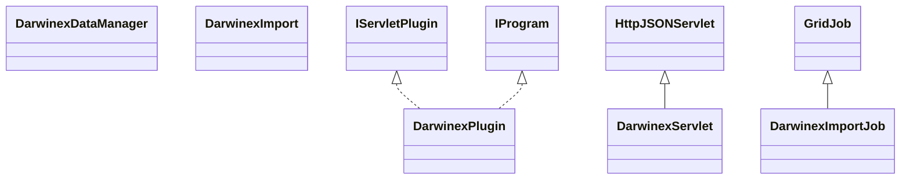

# DataSourceDarwinex.jar

[Group index](README.md) | [All archives](../README.md)

## Scope and provenance

- **Donor:** `SQX_145_REFERENCE_ROOT/internal/plugins/DataSourceDarwinex/DataSourceDarwinex.jar`.
- **SHA-256:** `572bfd20f193133a71cd02ffffccaaa69d9b46ca0463dfc4ce8b74fb911b8e3a`; accessed 2026-10-06; captured `2026-10-06T18:54:51.906614+00:00`.
- **Classes:** 8 raw entries; 8 unique entry names. Duplicate occurrence indices are zero-based.
- **Inspection:** read-only ZIP hashing and class-file structural parsing; signatures/descriptors, modifiers, hierarchy and references only. Bytecode bodies are hashed, not published.
- **Allocation:** proposed `FEAT-DATA-SOURCE-DATA-SOURCE-DARWINEX`, P04; [roadmap](../../dev/sqx-full-application-roadmap.md). Domain README registration remains required.
- **Repository:** `01067f00031428613c6394064ca1bcadc1ba00ee`; review state unreviewed. Download label 145-dev1; installed build/activation and runtime equivalence unverified.
- **Limit:** every class/member is inventoried; declaration coverage does not establish consumed calls, defaults, formulas, failure semantics or algorithm parity.
- **Archive/resource index:** [174.json](../../dev/evidence/sqx145/archives/145/174.json).

## Complete member declarations

Member shards contain exact JVM names/descriptors, access flags, generic signatures, throws types, declared fields/methods, superclass/interfaces and referenced class names. All classes, nested/synthetic members and overloads are retained. Code length/hash is structural evidence, not a normalized algorithm comparison.

- [001.json](../../dev/evidence/sqx145/members/174/001.json) — SHA-256 `3b40be0706a651802e30811eb82ed20c657807ad78879a4118a7ed03362bf25c`.

## Focused structural diagram

Up to twelve non-nested classes; arrows show declared inheritance/interfaces only. External type names are not evidence of an available body or an executed dependency.

## Class inventory

| Archive entry | Occurrence | Class SHA-256 | Fields | Methods |
| --- | ---: | --- | ---: | ---: |
| `com/strategyquant/plugin/DataSource/impl/Darwinex/DarwinexDataManager.class` | 0 | `97470a2a453608579d7a9ec459982e388c8ebf0a9e971a5211930514f6565cc9` | 10 | 10 |
| `com/strategyquant/plugin/DataSource/impl/Darwinex/DarwinexPlugin.class` | 0 | `41192c4977d340fa6f76470d586363fa1f32e004e6d2f41cb98ac676acf1a59a` | 2 | 6 |
| `com/strategyquant/plugin/DataSource/impl/Darwinex/DarwinexServlet$1.class` | 0 | `144d51a61a284ed1182e1fd968ff94fa894a65de8b38e876eb41fc0bceb37116` | 2 | 2 |
| `com/strategyquant/plugin/DataSource/impl/Darwinex/DarwinexServlet$2.class` | 0 | `73d1a06e3b6983b7a1eeaddf36a610f99b7fca93c0f784eecb210c858013bbd3` | 2 | 2 |
| `com/strategyquant/plugin/DataSource/impl/Darwinex/DarwinexServlet$3.class` | 0 | `3250c96d9be64712f94e475365e252cc0bca4bd74c4c60f365cec25af721e68a` | 2 | 2 |
| `com/strategyquant/plugin/DataSource/impl/Darwinex/DarwinexServlet.class` | 0 | `6f948c5c19f4807b4dd8d1c74a1745db063b0ee6eaf98294633275801b949d82` | 2 | 21 |
| `com/strategyquant/plugin/DataSource/impl/Darwinex/importdata/DarwinexImport.class` | 0 | `1577c9e0e3e077d7aadad4f558936e2753be69d91d8d2bc148bc8ce7e336a838` | 3 | 7 |
| `com/strategyquant/plugin/DataSource/impl/Darwinex/importdata/DarwinexImportJob.class` | 0 | `c1035fce0d7b9a5610dbe4293236910c991914cc9f6845d2e5ccb5a9bb059652` | 15 | 14 |
