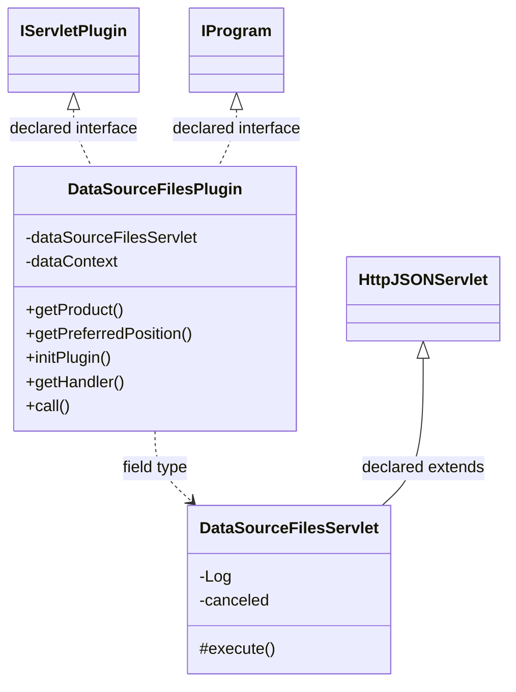
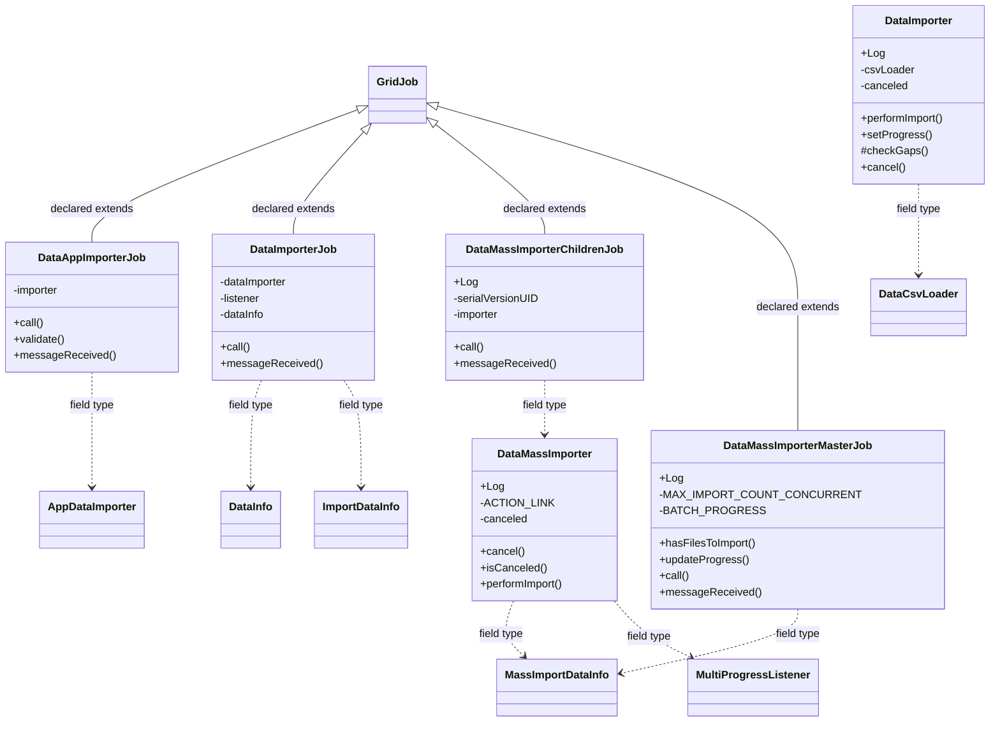

# DataSourceFiles.jar

[Workspace/group index](README.md)  |  [All workspaces](../README.md)

## Scope and provenance

- Artifact: `SQX_REFERENCE_ROOT/internal/plugins/DataSourceFiles/DataSourceFiles.jar`.
- SHA-256: `9a92311be05e36e7cdf68dfc0b916751e0ed2bac7302c465db60d2d75eaaf686`.
- Inspected: 2026-10-05; generation timestamp `2026-10-05T19:04:16.344170+00:00`.
- Archive class entries: **10**; non-nested: **8**; nested/anonymous: **2**.
- Inspection: ZIP entry/manifest enumeration and `javap -p` declarations for every listed class.
- Repository source HEAD: `8a92c705183a6702eaf62037ccb202ed028aa899`; review state: generated, pending owner review.
- Installed SQX build number is unverified. No method bodies are reproduced.
- Confidence: high for declared structure; workspace ownership inferred except where registration evidence is separately stated. Runtime reachability, call order, formulas and parity remain unverified.

The `DataManager` folder is a navigation/research grouping, not an exclusive backend owner. Shared consumers may use this JAR.

Target mapping: no verified owning HaruQuantAI feature/requirement/decision IDs are assigned by this document. Register or resolve ownership through the normal repository plan before implementation.

## Diagram reading guide

`Parent <|-- Child` means declared inheritance; `Interface <|.. Class` means declared implementation. Interface extension uses the inheritance arrow. `A ..> B : field type` is a declared type dependency, not composition, object ownership or a runtime call. External nodes are referenced types, not fabricated local implementations. Selected fields/method names aid navigation: `+` is public, `#` protected and `-` private. Diagram method names omit parameter/return types and collapse overloads; use the exact inspected declarations below before implementing an API.

Detailed graphs include non-nested classes in package-sized groups of at most 12. Nested/anonymous classes are inventoried and their declarations/relationships are retained below, but omitted from overview graphs. Relationships not drawn for readability remain in the complete declaration-relationship table. Constructors, synthetic bridges and overloads may be collapsed in diagram member lists only. Standard `java.lang.Object` inheritance is omitted from diagrams.

## UML class diagrams

### 1. `com.strategyquant.plugin.DataSource.impl.Files`



| Diagram identifier | Exact type | Location |
| --- | --- | --- |
| `Cd5c58f78cbd8` | `com.strategyquant.plugin.DataSource.impl.Files.DataSourceFilesPlugin` (this JAR) | this diagram |
| `C90c31eff6a6e` | `com.strategyquant.plugin.DataSource.impl.Files.DataSourceFilesServlet` (this JAR) | this diagram |
| `C1b6b4448b67b` | [`com.strategyquant.pluginlib.program.IProgram`](../Shared/SQPluginLib.md) | referenced external type |
| `C249b5c671b1a` | [`com.strategyquant.tradinglib.servlet.IServletPlugin`](../Shared/SQTradingLib.md) | referenced external type |
| `C8900f90ae594` | [`com.strategyquant.webguilib.servlet.HttpJSONServlet`](../Shared/SQWebGUILib.md) | referenced external type |

### 2. `com.strategyquant.plugin.DataSource.impl.Files.job`



| Diagram identifier | Exact type | Location |
| --- | --- | --- |
| `C507ddf99c601` | [`com.strategyquant.datalib.DataInfo`](../Shared/SQDataLib.md) | referenced external type |
| `C7cf31f197b65` | [`com.strategyquant.datalib.data.io.DataCsvLoader`](../Shared/SQDataLib.md) | referenced external type |
| `C1241a9ebc3a6` | [`com.strategyquant.datalib.data.io.ImportDataInfo`](../Shared/SQDataLib.md) | referenced external type |
| `C6eb76fb85891` | [`com.strategyquant.datalib.data.io.MassImportDataInfo`](../Shared/SQDataLib.md) | referenced external type |
| `C729a56512564` | [`com.strategyquant.gridlib.client.GridJob`](../Shared/SQGridLib2.md) | referenced external type |
| `Ce102f39a32f7` | `com.strategyquant.plugin.DataSource.impl.Files.job.DataAppImporterJob` (this JAR) | this diagram |
| `C4c0c56a7c7ba` | `com.strategyquant.plugin.DataSource.impl.Files.job.DataImporter` (this JAR) | this diagram |
| `C919d0d2ac5ee` | `com.strategyquant.plugin.DataSource.impl.Files.job.DataImporterJob` (this JAR) | this diagram |
| `Ce02d19854922` | `com.strategyquant.plugin.DataSource.impl.Files.job.DataMassImporter` (this JAR) | this diagram |
| `C5b8d0fe9840a` | `com.strategyquant.plugin.DataSource.impl.Files.job.DataMassImporterChildrenJob` (this JAR) | this diagram |
| `Ce1798178062e` | `com.strategyquant.plugin.DataSource.impl.Files.job.DataMassImporterMasterJob` (this JAR) | this diagram |
| `C88bb19195758` | [`com.strategyquant.tradinglib.data.AppDataImporter`](../Shared/SQTradingLib.md) | referenced external type |
| `C476c089340a8` | [`com.strategyquant.tradinglib.project.websocket.MultiProgressListener`](../Shared/SQTradingLib.md) | referenced external type |

## Complete class inventory

| Fully qualified class | Kind | Entry |
| --- | --- | --- |
| `com.strategyquant.plugin.DataSource.impl.Files.DataSourceFilesPlugin` | class | non-nested |
| `com.strategyquant.plugin.DataSource.impl.Files.DataSourceFilesServlet` | class | non-nested |
| `com.strategyquant.plugin.DataSource.impl.Files.job.DataAppImporterJob` | class | non-nested |
| `com.strategyquant.plugin.DataSource.impl.Files.job.DataImporter` | class | non-nested |
| `com.strategyquant.plugin.DataSource.impl.Files.job.DataImporterJob` | class | non-nested |
| `com.strategyquant.plugin.DataSource.impl.Files.job.DataMassImporter` | class | non-nested |
| `com.strategyquant.plugin.DataSource.impl.Files.job.DataMassImporterChildrenJob` | class | non-nested |
| `com.strategyquant.plugin.DataSource.impl.Files.job.DataMassImporterMasterJob` | class | non-nested |
| `com.strategyquant.plugin.DataSource.impl.Files.job.DataMassImporterMasterJob$1` | class | nested/anonymous |
| `com.strategyquant.plugin.DataSource.impl.Files.job.DataMassImporterMasterJob$2` | class | nested/anonymous |

## Declared relationships and evidence locations

Every row is supported by the named class declaration/member in `javap -p`, inside the artifact recorded above. Signature dependencies may include return, parameter, generic-argument and throws types; they do not imply execution.

| Declaring class | Referenced type | Relationship | Narrow inspection location |
| --- | --- | --- | --- |
| `com.strategyquant.plugin.DataSource.impl.Files.DataSourceFilesPlugin` | [`com.strategyquant.tradinglib.servlet.IServletPlugin`](../Shared/SQTradingLib.md) | implements | `com.strategyquant.plugin.DataSource.impl.Files.DataSourceFilesPlugin` / class declaration: `public class com.strategyquant.plugin.DataSource.impl.Files.DataSourceFilesPlugin implements com.strategyquant.tradinglib.servlet.IServletPlugin,com.strategyquant.pluginlib.program.IProgram` |
| `com.strategyquant.plugin.DataSource.impl.Files.DataSourceFilesPlugin` | [`com.strategyquant.pluginlib.program.IProgram`](../Shared/SQPluginLib.md) | implements | `com.strategyquant.plugin.DataSource.impl.Files.DataSourceFilesPlugin` / class declaration: `public class com.strategyquant.plugin.DataSource.impl.Files.DataSourceFilesPlugin implements com.strategyquant.tradinglib.servlet.IServletPlugin,com.strategyquant.pluginlib.program.IProgram` |
| `com.strategyquant.plugin.DataSource.impl.Files.DataSourceFilesPlugin` | `com.strategyquant.plugin.DataSource.impl.Files.DataSourceFilesServlet` (this JAR) | type dependency | `com.strategyquant.plugin.DataSource.impl.Files.DataSourceFilesPlugin` / field declaration: `private com.strategyquant.plugin.DataSource.impl.Files.DataSourceFilesServlet dataSourceFilesServlet;` |
| `com.strategyquant.plugin.DataSource.impl.Files.DataSourceFilesPlugin` | `org.eclipse.jetty.servlet.ServletContextHandler` (not resolved in scoped archives) | type dependency | `com.strategyquant.plugin.DataSource.impl.Files.DataSourceFilesPlugin` / field declaration: `private org.eclipse.jetty.servlet.ServletContextHandler dataContext;` |
| `com.strategyquant.plugin.DataSource.impl.Files.DataSourceFilesPlugin` | `java.lang.String` (not resolved in scoped archives) | type dependency | `com.strategyquant.plugin.DataSource.impl.Files.DataSourceFilesPlugin` / method signature: `public java.lang.String getProduct();`<br>`public java.lang.Object call(java.lang.String, java.lang.Object...) throws java.lang.Exception;` |
| `com.strategyquant.plugin.DataSource.impl.Files.DataSourceFilesPlugin` | `java.lang.Exception` (not resolved in scoped archives) | type dependency | `com.strategyquant.plugin.DataSource.impl.Files.DataSourceFilesPlugin` / method signature: `public void initPlugin() throws java.lang.Exception;`<br>`public java.lang.Object call(java.lang.String, java.lang.Object...) throws java.lang.Exception;` |
| `com.strategyquant.plugin.DataSource.impl.Files.DataSourceFilesPlugin` | `org.eclipse.jetty.server.Handler` (not resolved in scoped archives) | type dependency | `com.strategyquant.plugin.DataSource.impl.Files.DataSourceFilesPlugin` / method signature: `public org.eclipse.jetty.server.Handler getHandler();` |
| `com.strategyquant.plugin.DataSource.impl.Files.DataSourceFilesPlugin` | `java.lang.Object` (not resolved in scoped archives) | type dependency | `com.strategyquant.plugin.DataSource.impl.Files.DataSourceFilesPlugin` / method signature: `public java.lang.Object call(java.lang.String, java.lang.Object...) throws java.lang.Exception;` |
| `com.strategyquant.plugin.DataSource.impl.Files.DataSourceFilesServlet` | [`com.strategyquant.webguilib.servlet.HttpJSONServlet`](../Shared/SQWebGUILib.md) | extends | `com.strategyquant.plugin.DataSource.impl.Files.DataSourceFilesServlet` / class declaration: `public class com.strategyquant.plugin.DataSource.impl.Files.DataSourceFilesServlet extends com.strategyquant.webguilib.servlet.HttpJSONServlet` |
| `com.strategyquant.plugin.DataSource.impl.Files.DataSourceFilesServlet` | `org.slf4j.Logger` (not resolved in scoped archives) | type dependency | `com.strategyquant.plugin.DataSource.impl.Files.DataSourceFilesServlet` / field declaration: `private static final org.slf4j.Logger Log;` |
| `com.strategyquant.plugin.DataSource.impl.Files.DataSourceFilesServlet` | `java.lang.String` (not resolved in scoped archives) | type dependency | `com.strategyquant.plugin.DataSource.impl.Files.DataSourceFilesServlet` / method signature: `protected java.lang.String execute(java.lang.String, java.util.Map<java.lang.String, java.lang.String[]>, java.lang.String) throws java.lang.Exception;`<br>`private java.lang.String onAppImport(java.util.Map<java.lang.String, java.lang.String[]>) throws java.lang.Exception;`<br>`private java.lang.String onCancelAppImportAction(java.util.Map<java.lang.String, java.lang.String[]>) throws java.lang.Exception;`<br>`private java.lang.String onMassImport(java.util.Map<java.lang.String, java.lang.String[]>) throws java.lang.Exception;`<br>`private java.lang.String onCancelMassImportAction(java.util.Map<java.lang.String, java.lang.String[]>) throws java.lang.Exception;`<br>`private java.lang.String onAdd(java.util.Map<java.lang.String, java.lang.String[]>);`<br>`private java.lang.String onImportGetInfo();`<br>`private java.lang.String onImportGetOverview(java.util.Map<java.lang.String, java.lang.String[]>);`<br>`private java.lang.String onImportData(java.util.Map<java.lang.String, java.lang.String[]>);`<br>`private java.lang.String onImportAction(java.util.Map<java.lang.String, java.lang.String[]>) throws java.lang.Exception;`<br>`private java.lang.String onImportSaveNewDataFormat(java.util.Map<java.lang.String, java.lang.String[]>);`<br>`private java.lang.String onImportDeleteDataFormat(java.util.Map<java.lang.String, java.lang.String[]>);`<br>`private java.lang.String onImportUpdateDataFormat(java.util.Map<java.lang.String, java.lang.String[]>);`<br>`private com.strategyquant.datalib.data.imports.CustomDataFormat getFileFormat(java.util.Map<java.lang.String, java.lang.String[]>) throws java.lang.Exception;`<br>`private void sendDataUpdate(java.lang.String, java.lang.String);` |
| `com.strategyquant.plugin.DataSource.impl.Files.DataSourceFilesServlet` | `java.util.Map` (not resolved in scoped archives) | type dependency | `com.strategyquant.plugin.DataSource.impl.Files.DataSourceFilesServlet` / method signature: `protected java.lang.String execute(java.lang.String, java.util.Map<java.lang.String, java.lang.String[]>, java.lang.String) throws java.lang.Exception;`<br>`private java.lang.String onAppImport(java.util.Map<java.lang.String, java.lang.String[]>) throws java.lang.Exception;`<br>`private java.lang.String onCancelAppImportAction(java.util.Map<java.lang.String, java.lang.String[]>) throws java.lang.Exception;`<br>`private java.lang.String onMassImport(java.util.Map<java.lang.String, java.lang.String[]>) throws java.lang.Exception;`<br>`private java.lang.String onCancelMassImportAction(java.util.Map<java.lang.String, java.lang.String[]>) throws java.lang.Exception;`<br>`private java.lang.String onAdd(java.util.Map<java.lang.String, java.lang.String[]>);`<br>`private java.lang.String onImportGetOverview(java.util.Map<java.lang.String, java.lang.String[]>);`<br>`private java.lang.String onImportData(java.util.Map<java.lang.String, java.lang.String[]>);`<br>`private java.lang.String onImportAction(java.util.Map<java.lang.String, java.lang.String[]>) throws java.lang.Exception;`<br>`private java.lang.String onImportSaveNewDataFormat(java.util.Map<java.lang.String, java.lang.String[]>);`<br>`private java.lang.String onImportDeleteDataFormat(java.util.Map<java.lang.String, java.lang.String[]>);`<br>`private java.lang.String onImportUpdateDataFormat(java.util.Map<java.lang.String, java.lang.String[]>);`<br>`private com.strategyquant.datalib.data.imports.CustomDataFormat getFileFormat(java.util.Map<java.lang.String, java.lang.String[]>) throws java.lang.Exception;` |
| `com.strategyquant.plugin.DataSource.impl.Files.DataSourceFilesServlet` | `java.lang.Exception` (not resolved in scoped archives) | type dependency | `com.strategyquant.plugin.DataSource.impl.Files.DataSourceFilesServlet` / method signature: `protected java.lang.String execute(java.lang.String, java.util.Map<java.lang.String, java.lang.String[]>, java.lang.String) throws java.lang.Exception;`<br>`private java.lang.String onAppImport(java.util.Map<java.lang.String, java.lang.String[]>) throws java.lang.Exception;`<br>`private java.lang.String onCancelAppImportAction(java.util.Map<java.lang.String, java.lang.String[]>) throws java.lang.Exception;`<br>`private java.lang.String onMassImport(java.util.Map<java.lang.String, java.lang.String[]>) throws java.lang.Exception;`<br>`private java.lang.String onCancelMassImportAction(java.util.Map<java.lang.String, java.lang.String[]>) throws java.lang.Exception;`<br>`private java.lang.String onImportAction(java.util.Map<java.lang.String, java.lang.String[]>) throws java.lang.Exception;`<br>`private com.strategyquant.datalib.data.imports.CustomDataFormat getFileFormat(java.util.Map<java.lang.String, java.lang.String[]>) throws java.lang.Exception;` |
| `com.strategyquant.plugin.DataSource.impl.Files.DataSourceFilesServlet` | `org.json.JSONArray` (not resolved in scoped archives) | type dependency | `com.strategyquant.plugin.DataSource.impl.Files.DataSourceFilesServlet` / method signature: `private org.json.JSONArray fillMissingValues(com.strategyquant.datalib.data.imports.CustomDataFormat, org.json.JSONArray);`<br>`private org.json.JSONArray listColumnTypes(java.util.HashMap<java.lang.Integer, com.strategyquant.datalib.data.io.columns.DefaultCol>);` |
| `com.strategyquant.plugin.DataSource.impl.Files.DataSourceFilesServlet` | [`com.strategyquant.datalib.data.imports.CustomDataFormat`](../Shared/SQDataLib.md) | type dependency | `com.strategyquant.plugin.DataSource.impl.Files.DataSourceFilesServlet` / method signature: `private org.json.JSONArray fillMissingValues(com.strategyquant.datalib.data.imports.CustomDataFormat, org.json.JSONArray);`<br>`private com.strategyquant.datalib.data.imports.CustomDataFormat getFileFormat(java.util.Map<java.lang.String, java.lang.String[]>) throws java.lang.Exception;` |
| `com.strategyquant.plugin.DataSource.impl.Files.DataSourceFilesServlet` | `java.util.HashMap` (not resolved in scoped archives) | type dependency | `com.strategyquant.plugin.DataSource.impl.Files.DataSourceFilesServlet` / method signature: `private org.json.JSONArray listColumnTypes(java.util.HashMap<java.lang.Integer, com.strategyquant.datalib.data.io.columns.DefaultCol>);` |
| `com.strategyquant.plugin.DataSource.impl.Files.DataSourceFilesServlet` | `java.lang.Integer` (not resolved in scoped archives) | type dependency | `com.strategyquant.plugin.DataSource.impl.Files.DataSourceFilesServlet` / method signature: `private org.json.JSONArray listColumnTypes(java.util.HashMap<java.lang.Integer, com.strategyquant.datalib.data.io.columns.DefaultCol>);` |
| `com.strategyquant.plugin.DataSource.impl.Files.DataSourceFilesServlet` | [`com.strategyquant.datalib.data.io.columns.DefaultCol`](../Shared/SQDataLib.md) | type dependency | `com.strategyquant.plugin.DataSource.impl.Files.DataSourceFilesServlet` / method signature: `private org.json.JSONArray listColumnTypes(java.util.HashMap<java.lang.Integer, com.strategyquant.datalib.data.io.columns.DefaultCol>);` |
| `com.strategyquant.plugin.DataSource.impl.Files.job.DataAppImporterJob` | [`com.strategyquant.gridlib.client.GridJob`](../Shared/SQGridLib2.md) | extends | `com.strategyquant.plugin.DataSource.impl.Files.job.DataAppImporterJob` / class declaration: `public class com.strategyquant.plugin.DataSource.impl.Files.job.DataAppImporterJob extends com.strategyquant.gridlib.client.GridJob<java.lang.Void>` |
| `com.strategyquant.plugin.DataSource.impl.Files.job.DataAppImporterJob` | [`com.strategyquant.tradinglib.data.AppDataImporter`](../Shared/SQTradingLib.md) | type dependency | `com.strategyquant.plugin.DataSource.impl.Files.job.DataAppImporterJob` / field declaration: `private com.strategyquant.tradinglib.data.AppDataImporter importer;` |
| `com.strategyquant.plugin.DataSource.impl.Files.job.DataAppImporterJob` | `java.lang.String` (not resolved in scoped archives) | type dependency | `com.strategyquant.plugin.DataSource.impl.Files.job.DataAppImporterJob` / method signature: `public com.strategyquant.plugin.DataSource.impl.Files.job.DataAppImporterJob(java.lang.String, java.lang.String, java.lang.String);`<br>`public java.lang.String validate();` |
| `com.strategyquant.plugin.DataSource.impl.Files.job.DataAppImporterJob` | `java.lang.Void` (not resolved in scoped archives) | type dependency | `com.strategyquant.plugin.DataSource.impl.Files.job.DataAppImporterJob` / method signature: `public java.lang.Void call() throws java.lang.Exception;` |
| `com.strategyquant.plugin.DataSource.impl.Files.job.DataAppImporterJob` | `java.lang.Exception` (not resolved in scoped archives) | type dependency | `com.strategyquant.plugin.DataSource.impl.Files.job.DataAppImporterJob` / method signature: `public java.lang.Void call() throws java.lang.Exception;`<br>`public java.lang.Object call() throws java.lang.Exception;` |
| `com.strategyquant.plugin.DataSource.impl.Files.job.DataAppImporterJob` | [`com.strategyquant.gridlib.client.GridMessage`](../Shared/SQGridLib2.md) | type dependency | `com.strategyquant.plugin.DataSource.impl.Files.job.DataAppImporterJob` / method signature: `public void messageReceived(com.strategyquant.gridlib.client.GridMessage);` |
| `com.strategyquant.plugin.DataSource.impl.Files.job.DataAppImporterJob` | `java.lang.Object` (not resolved in scoped archives) | type dependency | `com.strategyquant.plugin.DataSource.impl.Files.job.DataAppImporterJob` / method signature: `public java.lang.Object call() throws java.lang.Exception;` |
| `com.strategyquant.plugin.DataSource.impl.Files.job.DataImporter` | `org.slf4j.Logger` (not resolved in scoped archives) | type dependency | `com.strategyquant.plugin.DataSource.impl.Files.job.DataImporter` / field declaration: `public static final org.slf4j.Logger Log;` |
| `com.strategyquant.plugin.DataSource.impl.Files.job.DataImporter` | [`com.strategyquant.datalib.data.io.DataCsvLoader`](../Shared/SQDataLib.md) | type dependency | `com.strategyquant.plugin.DataSource.impl.Files.job.DataImporter` / field declaration: `private com.strategyquant.datalib.data.io.DataCsvLoader csvLoader;` |
| `com.strategyquant.plugin.DataSource.impl.Files.job.DataImporter` | `com.strategyquant.lib.utils.IProgressListener` (not resolved in scoped archives) | type dependency | `com.strategyquant.plugin.DataSource.impl.Files.job.DataImporter` / field declaration: `private com.strategyquant.lib.utils.IProgressListener listener;` |
| `com.strategyquant.plugin.DataSource.impl.Files.job.DataImporter` | `com.strategyquant.lib.utils.IProgressListener` (not resolved in scoped archives) | type dependency | `com.strategyquant.plugin.DataSource.impl.Files.job.DataImporter` / method signature: `public void performImport(com.strategyquant.lib.utils.IProgressListener, com.strategyquant.datalib.DataInfo, com.strategyquant.datalib.data.io.ImportDataInfo) throws java.lang.Exception;`<br>`private void checkDataFile(com.strategyquant.lib.utils.IProgressListener, com.strategyquant.datalib.DataInfo, com.strategyquant.datalib.data.io.ImportDataInfo) throws java.lang.Exception;`<br>`protected void checkGaps(com.strategyquant.lib.utils.IProgressListener, com.strategyquant.datalib.DataInfo, com.strategyquant.datalib.data.io.ImportDataInfo) throws java.lang.Exception;`<br>`private void checkTimeframe(com.strategyquant.lib.utils.IProgressListener, com.strategyquant.datalib.DataInfo, com.strategyquant.datalib.data.io.ImportDataInfo) throws java.lang.Exception;` |
| `com.strategyquant.plugin.DataSource.impl.Files.job.DataImporter` | [`com.strategyquant.datalib.DataInfo`](../Shared/SQDataLib.md) | type dependency | `com.strategyquant.plugin.DataSource.impl.Files.job.DataImporter` / method signature: `public void performImport(com.strategyquant.lib.utils.IProgressListener, com.strategyquant.datalib.DataInfo, com.strategyquant.datalib.data.io.ImportDataInfo) throws java.lang.Exception;`<br>`private void recomputeClonedData(com.strategyquant.datalib.DataInfo) throws java.lang.Exception;`<br>`private void checkDataFile(com.strategyquant.lib.utils.IProgressListener, com.strategyquant.datalib.DataInfo, com.strategyquant.datalib.data.io.ImportDataInfo) throws java.lang.Exception;`<br>`protected void checkGaps(com.strategyquant.lib.utils.IProgressListener, com.strategyquant.datalib.DataInfo, com.strategyquant.datalib.data.io.ImportDataInfo) throws java.lang.Exception;`<br>`private void checkTimeframe(com.strategyquant.lib.utils.IProgressListener, com.strategyquant.datalib.DataInfo, com.strategyquant.datalib.data.io.ImportDataInfo) throws java.lang.Exception;` |
| `com.strategyquant.plugin.DataSource.impl.Files.job.DataImporter` | [`com.strategyquant.datalib.data.io.ImportDataInfo`](../Shared/SQDataLib.md) | type dependency | `com.strategyquant.plugin.DataSource.impl.Files.job.DataImporter` / method signature: `public void performImport(com.strategyquant.lib.utils.IProgressListener, com.strategyquant.datalib.DataInfo, com.strategyquant.datalib.data.io.ImportDataInfo) throws java.lang.Exception;`<br>`private void checkDataFile(com.strategyquant.lib.utils.IProgressListener, com.strategyquant.datalib.DataInfo, com.strategyquant.datalib.data.io.ImportDataInfo) throws java.lang.Exception;`<br>`protected void checkGaps(com.strategyquant.lib.utils.IProgressListener, com.strategyquant.datalib.DataInfo, com.strategyquant.datalib.data.io.ImportDataInfo) throws java.lang.Exception;`<br>`private void checkTimeframe(com.strategyquant.lib.utils.IProgressListener, com.strategyquant.datalib.DataInfo, com.strategyquant.datalib.data.io.ImportDataInfo) throws java.lang.Exception;`<br>`private boolean importFormatContainsBid(com.strategyquant.datalib.data.io.ImportDataInfo);` |
| `com.strategyquant.plugin.DataSource.impl.Files.job.DataImporter` | `java.lang.Exception` (not resolved in scoped archives) | type dependency | `com.strategyquant.plugin.DataSource.impl.Files.job.DataImporter` / method signature: `public void performImport(com.strategyquant.lib.utils.IProgressListener, com.strategyquant.datalib.DataInfo, com.strategyquant.datalib.data.io.ImportDataInfo) throws java.lang.Exception;`<br>`private void recomputeClonedData(com.strategyquant.datalib.DataInfo) throws java.lang.Exception;`<br>`private void checkDataFile(com.strategyquant.lib.utils.IProgressListener, com.strategyquant.datalib.DataInfo, com.strategyquant.datalib.data.io.ImportDataInfo) throws java.lang.Exception;`<br>`protected void checkGaps(com.strategyquant.lib.utils.IProgressListener, com.strategyquant.datalib.DataInfo, com.strategyquant.datalib.data.io.ImportDataInfo) throws java.lang.Exception;`<br>`private void checkTimeframe(com.strategyquant.lib.utils.IProgressListener, com.strategyquant.datalib.DataInfo, com.strategyquant.datalib.data.io.ImportDataInfo) throws java.lang.Exception;` |
| `com.strategyquant.plugin.DataSource.impl.Files.job.DataImporter` | [`com.strategyquant.datalib.data.io.VersatileData`](../Shared/SQDataLib.md) | type dependency | `com.strategyquant.plugin.DataSource.impl.Files.job.DataImporter` / method signature: `private void convertToOriginalTimezone(com.strategyquant.datalib.data.io.VersatileData);` |
| `com.strategyquant.plugin.DataSource.impl.Files.job.DataImporter` | `java.lang.InterruptedException` (not resolved in scoped archives) | type dependency | `com.strategyquant.plugin.DataSource.impl.Files.job.DataImporter` / method signature: `private void checkPaused() throws java.lang.InterruptedException;` |
| `com.strategyquant.plugin.DataSource.impl.Files.job.DataImporterJob` | [`com.strategyquant.gridlib.client.GridJob`](../Shared/SQGridLib2.md) | extends | `com.strategyquant.plugin.DataSource.impl.Files.job.DataImporterJob` / class declaration: `public class com.strategyquant.plugin.DataSource.impl.Files.job.DataImporterJob extends com.strategyquant.gridlib.client.GridJob<java.lang.Void>` |
| `com.strategyquant.plugin.DataSource.impl.Files.job.DataImporterJob` | `com.strategyquant.plugin.DataSource.impl.Files.job.DataImporter` (this JAR) | type dependency | `com.strategyquant.plugin.DataSource.impl.Files.job.DataImporterJob` / field declaration: `private com.strategyquant.plugin.DataSource.impl.Files.job.DataImporter dataImporter;` |
| `com.strategyquant.plugin.DataSource.impl.Files.job.DataImporterJob` | `com.strategyquant.lib.utils.IProgressListener` (not resolved in scoped archives) | type dependency | `com.strategyquant.plugin.DataSource.impl.Files.job.DataImporterJob` / field declaration: `private com.strategyquant.lib.utils.IProgressListener listener;` |
| `com.strategyquant.plugin.DataSource.impl.Files.job.DataImporterJob` | `com.strategyquant.lib.utils.IProgressListener` (not resolved in scoped archives) | type dependency | `com.strategyquant.plugin.DataSource.impl.Files.job.DataImporterJob` / method signature: `public com.strategyquant.plugin.DataSource.impl.Files.job.DataImporterJob(java.lang.String, java.lang.String, com.strategyquant.lib.utils.IProgressListener, com.strategyquant.datalib.DataInfo, com.strategyquant.datalib.data.io.ImportDataInfo);` |
| `com.strategyquant.plugin.DataSource.impl.Files.job.DataImporterJob` | [`com.strategyquant.datalib.DataInfo`](../Shared/SQDataLib.md) | type dependency | `com.strategyquant.plugin.DataSource.impl.Files.job.DataImporterJob` / field declaration: `private com.strategyquant.datalib.DataInfo dataInfo;` |
| `com.strategyquant.plugin.DataSource.impl.Files.job.DataImporterJob` | [`com.strategyquant.datalib.DataInfo`](../Shared/SQDataLib.md) | type dependency | `com.strategyquant.plugin.DataSource.impl.Files.job.DataImporterJob` / method signature: `public com.strategyquant.plugin.DataSource.impl.Files.job.DataImporterJob(java.lang.String, java.lang.String, com.strategyquant.lib.utils.IProgressListener, com.strategyquant.datalib.DataInfo, com.strategyquant.datalib.data.io.ImportDataInfo);` |
| `com.strategyquant.plugin.DataSource.impl.Files.job.DataImporterJob` | [`com.strategyquant.datalib.data.io.ImportDataInfo`](../Shared/SQDataLib.md) | type dependency | `com.strategyquant.plugin.DataSource.impl.Files.job.DataImporterJob` / field declaration: `private com.strategyquant.datalib.data.io.ImportDataInfo importInfo;` |
| `com.strategyquant.plugin.DataSource.impl.Files.job.DataImporterJob` | [`com.strategyquant.datalib.data.io.ImportDataInfo`](../Shared/SQDataLib.md) | type dependency | `com.strategyquant.plugin.DataSource.impl.Files.job.DataImporterJob` / method signature: `public com.strategyquant.plugin.DataSource.impl.Files.job.DataImporterJob(java.lang.String, java.lang.String, com.strategyquant.lib.utils.IProgressListener, com.strategyquant.datalib.DataInfo, com.strategyquant.datalib.data.io.ImportDataInfo);` |
| `com.strategyquant.plugin.DataSource.impl.Files.job.DataImporterJob` | `java.lang.String` (not resolved in scoped archives) | type dependency | `com.strategyquant.plugin.DataSource.impl.Files.job.DataImporterJob` / field declaration: `private java.lang.String symbol;` |
| `com.strategyquant.plugin.DataSource.impl.Files.job.DataImporterJob` | `java.lang.String` (not resolved in scoped archives) | type dependency | `com.strategyquant.plugin.DataSource.impl.Files.job.DataImporterJob` / method signature: `public com.strategyquant.plugin.DataSource.impl.Files.job.DataImporterJob(java.lang.String, java.lang.String, com.strategyquant.lib.utils.IProgressListener, com.strategyquant.datalib.DataInfo, com.strategyquant.datalib.data.io.ImportDataInfo);` |
| `com.strategyquant.plugin.DataSource.impl.Files.job.DataImporterJob` | `java.lang.Void` (not resolved in scoped archives) | type dependency | `com.strategyquant.plugin.DataSource.impl.Files.job.DataImporterJob` / method signature: `public java.lang.Void call() throws java.lang.Exception;` |
| `com.strategyquant.plugin.DataSource.impl.Files.job.DataImporterJob` | `java.lang.Exception` (not resolved in scoped archives) | type dependency | `com.strategyquant.plugin.DataSource.impl.Files.job.DataImporterJob` / method signature: `public java.lang.Void call() throws java.lang.Exception;`<br>`public java.lang.Object call() throws java.lang.Exception;` |
| `com.strategyquant.plugin.DataSource.impl.Files.job.DataImporterJob` | [`com.strategyquant.gridlib.client.GridMessage`](../Shared/SQGridLib2.md) | type dependency | `com.strategyquant.plugin.DataSource.impl.Files.job.DataImporterJob` / method signature: `public void messageReceived(com.strategyquant.gridlib.client.GridMessage);` |
| `com.strategyquant.plugin.DataSource.impl.Files.job.DataImporterJob` | `java.lang.Object` (not resolved in scoped archives) | type dependency | `com.strategyquant.plugin.DataSource.impl.Files.job.DataImporterJob` / method signature: `public java.lang.Object call() throws java.lang.Exception;` |
| `com.strategyquant.plugin.DataSource.impl.Files.job.DataMassImporter` | `org.slf4j.Logger` (not resolved in scoped archives) | type dependency | `com.strategyquant.plugin.DataSource.impl.Files.job.DataMassImporter` / field declaration: `public static final org.slf4j.Logger Log;` |
| `com.strategyquant.plugin.DataSource.impl.Files.job.DataMassImporter` | `java.lang.String` (not resolved in scoped archives) | type dependency | `com.strategyquant.plugin.DataSource.impl.Files.job.DataMassImporter` / field declaration: `private static final java.lang.String ACTION_LINK;`<br>`private java.util.Set<java.lang.String> existingSymbols;` |
| `com.strategyquant.plugin.DataSource.impl.Files.job.DataMassImporter` | `java.lang.String` (not resolved in scoped archives) | type dependency | `com.strategyquant.plugin.DataSource.impl.Files.job.DataMassImporter` / method signature: `public com.strategyquant.plugin.DataSource.impl.Files.job.DataMassImporter(com.strategyquant.datalib.data.io.MassImportDataInfo, java.io.File, java.util.Set<java.lang.String>);`<br>`public java.lang.String performImport() throws java.lang.Exception;`<br>`private void doImportFile(java.io.File, java.lang.String, com.strategyquant.datalib.data.io.MassImportDataInfo) throws java.lang.Exception;`<br>`private void writeData(java.lang.String, java.util.List<com.strategyquant.datalib.data.io.VersatileData>) throws java.lang.Exception;`<br>`private java.lang.String generateTickerName(java.io.File) throws java.lang.Exception;` |
| `com.strategyquant.plugin.DataSource.impl.Files.job.DataMassImporter` | [`com.strategyquant.datalib.data.io.MassImportDataInfo`](../Shared/SQDataLib.md) | type dependency | `com.strategyquant.plugin.DataSource.impl.Files.job.DataMassImporter` / field declaration: `private com.strategyquant.datalib.data.io.MassImportDataInfo importInfo;` |
| `com.strategyquant.plugin.DataSource.impl.Files.job.DataMassImporter` | [`com.strategyquant.datalib.data.io.MassImportDataInfo`](../Shared/SQDataLib.md) | type dependency | `com.strategyquant.plugin.DataSource.impl.Files.job.DataMassImporter` / method signature: `public com.strategyquant.plugin.DataSource.impl.Files.job.DataMassImporter(com.strategyquant.datalib.data.io.MassImportDataInfo, java.io.File, java.util.Set<java.lang.String>);`<br>`private void doImportFile(java.io.File, java.lang.String, com.strategyquant.datalib.data.io.MassImportDataInfo) throws java.lang.Exception;`<br>`private java.util.List<com.strategyquant.datalib.data.io.VersatileData> loadData(java.io.File, com.strategyquant.datalib.data.io.MassImportDataInfo) throws java.io.IOException;` |
| `com.strategyquant.plugin.DataSource.impl.Files.job.DataMassImporter` | `java.io.File` (not resolved in scoped archives) | type dependency | `com.strategyquant.plugin.DataSource.impl.Files.job.DataMassImporter` / field declaration: `private java.io.File file;` |
| `com.strategyquant.plugin.DataSource.impl.Files.job.DataMassImporter` | `java.io.File` (not resolved in scoped archives) | type dependency | `com.strategyquant.plugin.DataSource.impl.Files.job.DataMassImporter` / method signature: `public com.strategyquant.plugin.DataSource.impl.Files.job.DataMassImporter(com.strategyquant.datalib.data.io.MassImportDataInfo, java.io.File, java.util.Set<java.lang.String>);`<br>`private void doImportFile(java.io.File, java.lang.String, com.strategyquant.datalib.data.io.MassImportDataInfo) throws java.lang.Exception;`<br>`private java.lang.String generateTickerName(java.io.File) throws java.lang.Exception;`<br>`private java.util.List<com.strategyquant.datalib.data.io.VersatileData> loadData(java.io.File, com.strategyquant.datalib.data.io.MassImportDataInfo) throws java.io.IOException;` |
| `com.strategyquant.plugin.DataSource.impl.Files.job.DataMassImporter` | `java.util.Set` (not resolved in scoped archives) | type dependency | `com.strategyquant.plugin.DataSource.impl.Files.job.DataMassImporter` / field declaration: `private java.util.Set<java.lang.String> existingSymbols;` |
| `com.strategyquant.plugin.DataSource.impl.Files.job.DataMassImporter` | `java.util.Set` (not resolved in scoped archives) | type dependency | `com.strategyquant.plugin.DataSource.impl.Files.job.DataMassImporter` / method signature: `public com.strategyquant.plugin.DataSource.impl.Files.job.DataMassImporter(com.strategyquant.datalib.data.io.MassImportDataInfo, java.io.File, java.util.Set<java.lang.String>);` |
| `com.strategyquant.plugin.DataSource.impl.Files.job.DataMassImporter` | [`com.strategyquant.tradinglib.project.websocket.MultiProgressListener`](../Shared/SQTradingLib.md) | type dependency | `com.strategyquant.plugin.DataSource.impl.Files.job.DataMassImporter` / field declaration: `private com.strategyquant.tradinglib.project.websocket.MultiProgressListener progressListener;` |
| `com.strategyquant.plugin.DataSource.impl.Files.job.DataMassImporter` | `java.lang.Exception` (not resolved in scoped archives) | type dependency | `com.strategyquant.plugin.DataSource.impl.Files.job.DataMassImporter` / method signature: `public java.lang.String performImport() throws java.lang.Exception;`<br>`private void doImportFile(java.io.File, java.lang.String, com.strategyquant.datalib.data.io.MassImportDataInfo) throws java.lang.Exception;`<br>`private void writeData(java.lang.String, java.util.List<com.strategyquant.datalib.data.io.VersatileData>) throws java.lang.Exception;`<br>`private java.lang.String generateTickerName(java.io.File) throws java.lang.Exception;` |
| `com.strategyquant.plugin.DataSource.impl.Files.job.DataMassImporter` | `java.util.List` (not resolved in scoped archives) | type dependency | `com.strategyquant.plugin.DataSource.impl.Files.job.DataMassImporter` / method signature: `private void writeData(java.lang.String, java.util.List<com.strategyquant.datalib.data.io.VersatileData>) throws java.lang.Exception;`<br>`private java.util.List<com.strategyquant.datalib.data.io.VersatileData> loadData(java.io.File, com.strategyquant.datalib.data.io.MassImportDataInfo) throws java.io.IOException;` |
| `com.strategyquant.plugin.DataSource.impl.Files.job.DataMassImporter` | [`com.strategyquant.datalib.data.io.VersatileData`](../Shared/SQDataLib.md) | type dependency | `com.strategyquant.plugin.DataSource.impl.Files.job.DataMassImporter` / method signature: `private void writeData(java.lang.String, java.util.List<com.strategyquant.datalib.data.io.VersatileData>) throws java.lang.Exception;`<br>`private java.util.List<com.strategyquant.datalib.data.io.VersatileData> loadData(java.io.File, com.strategyquant.datalib.data.io.MassImportDataInfo) throws java.io.IOException;` |
| `com.strategyquant.plugin.DataSource.impl.Files.job.DataMassImporter` | `java.io.IOException` (not resolved in scoped archives) | type dependency | `com.strategyquant.plugin.DataSource.impl.Files.job.DataMassImporter` / method signature: `private java.util.List<com.strategyquant.datalib.data.io.VersatileData> loadData(java.io.File, com.strategyquant.datalib.data.io.MassImportDataInfo) throws java.io.IOException;` |
| `com.strategyquant.plugin.DataSource.impl.Files.job.DataMassImporterChildrenJob` | [`com.strategyquant.gridlib.client.GridJob`](../Shared/SQGridLib2.md) | extends | `com.strategyquant.plugin.DataSource.impl.Files.job.DataMassImporterChildrenJob` / class declaration: `public class com.strategyquant.plugin.DataSource.impl.Files.job.DataMassImporterChildrenJob extends com.strategyquant.gridlib.client.GridJob<java.lang.String>` |
| `com.strategyquant.plugin.DataSource.impl.Files.job.DataMassImporterChildrenJob` | `org.slf4j.Logger` (not resolved in scoped archives) | type dependency | `com.strategyquant.plugin.DataSource.impl.Files.job.DataMassImporterChildrenJob` / field declaration: `public static final org.slf4j.Logger Log;` |
| `com.strategyquant.plugin.DataSource.impl.Files.job.DataMassImporterChildrenJob` | `com.strategyquant.plugin.DataSource.impl.Files.job.DataMassImporter` (this JAR) | type dependency | `com.strategyquant.plugin.DataSource.impl.Files.job.DataMassImporterChildrenJob` / field declaration: `private com.strategyquant.plugin.DataSource.impl.Files.job.DataMassImporter importer;` |
| `com.strategyquant.plugin.DataSource.impl.Files.job.DataMassImporterChildrenJob` | `java.io.File` (not resolved in scoped archives) | type dependency | `com.strategyquant.plugin.DataSource.impl.Files.job.DataMassImporterChildrenJob` / field declaration: `private java.io.File file;` |
| `com.strategyquant.plugin.DataSource.impl.Files.job.DataMassImporterChildrenJob` | `java.io.File` (not resolved in scoped archives) | type dependency | `com.strategyquant.plugin.DataSource.impl.Files.job.DataMassImporterChildrenJob` / method signature: `public com.strategyquant.plugin.DataSource.impl.Files.job.DataMassImporterChildrenJob(java.lang.String, java.io.File, com.strategyquant.datalib.data.io.MassImportDataInfo, java.util.Set<java.lang.String>);` |
| `com.strategyquant.plugin.DataSource.impl.Files.job.DataMassImporterChildrenJob` | `java.lang.String` (not resolved in scoped archives) | type dependency | `com.strategyquant.plugin.DataSource.impl.Files.job.DataMassImporterChildrenJob` / method signature: `public com.strategyquant.plugin.DataSource.impl.Files.job.DataMassImporterChildrenJob(java.lang.String, java.io.File, com.strategyquant.datalib.data.io.MassImportDataInfo, java.util.Set<java.lang.String>);`<br>`public java.lang.String call() throws java.lang.Exception;` |
| `com.strategyquant.plugin.DataSource.impl.Files.job.DataMassImporterChildrenJob` | [`com.strategyquant.datalib.data.io.MassImportDataInfo`](../Shared/SQDataLib.md) | type dependency | `com.strategyquant.plugin.DataSource.impl.Files.job.DataMassImporterChildrenJob` / method signature: `public com.strategyquant.plugin.DataSource.impl.Files.job.DataMassImporterChildrenJob(java.lang.String, java.io.File, com.strategyquant.datalib.data.io.MassImportDataInfo, java.util.Set<java.lang.String>);` |
| `com.strategyquant.plugin.DataSource.impl.Files.job.DataMassImporterChildrenJob` | `java.util.Set` (not resolved in scoped archives) | type dependency | `com.strategyquant.plugin.DataSource.impl.Files.job.DataMassImporterChildrenJob` / method signature: `public com.strategyquant.plugin.DataSource.impl.Files.job.DataMassImporterChildrenJob(java.lang.String, java.io.File, com.strategyquant.datalib.data.io.MassImportDataInfo, java.util.Set<java.lang.String>);` |
| `com.strategyquant.plugin.DataSource.impl.Files.job.DataMassImporterChildrenJob` | `java.lang.Exception` (not resolved in scoped archives) | type dependency | `com.strategyquant.plugin.DataSource.impl.Files.job.DataMassImporterChildrenJob` / method signature: `public java.lang.String call() throws java.lang.Exception;`<br>`public java.lang.Object call() throws java.lang.Exception;` |
| `com.strategyquant.plugin.DataSource.impl.Files.job.DataMassImporterChildrenJob` | [`com.strategyquant.gridlib.client.GridMessage`](../Shared/SQGridLib2.md) | type dependency | `com.strategyquant.plugin.DataSource.impl.Files.job.DataMassImporterChildrenJob` / method signature: `public void messageReceived(com.strategyquant.gridlib.client.GridMessage);` |
| `com.strategyquant.plugin.DataSource.impl.Files.job.DataMassImporterChildrenJob` | `java.lang.Object` (not resolved in scoped archives) | type dependency | `com.strategyquant.plugin.DataSource.impl.Files.job.DataMassImporterChildrenJob` / method signature: `public java.lang.Object call() throws java.lang.Exception;` |
| `com.strategyquant.plugin.DataSource.impl.Files.job.DataMassImporterMasterJob` | [`com.strategyquant.gridlib.client.GridJob`](../Shared/SQGridLib2.md) | extends | `com.strategyquant.plugin.DataSource.impl.Files.job.DataMassImporterMasterJob` / class declaration: `public class com.strategyquant.plugin.DataSource.impl.Files.job.DataMassImporterMasterJob extends com.strategyquant.gridlib.client.GridJob<java.lang.Void>` |
| `com.strategyquant.plugin.DataSource.impl.Files.job.DataMassImporterMasterJob` | `org.slf4j.Logger` (not resolved in scoped archives) | type dependency | `com.strategyquant.plugin.DataSource.impl.Files.job.DataMassImporterMasterJob` / field declaration: `public static final org.slf4j.Logger Log;` |
| `com.strategyquant.plugin.DataSource.impl.Files.job.DataMassImporterMasterJob` | [`com.strategyquant.datalib.data.io.MassImportDataInfo`](../Shared/SQDataLib.md) | type dependency | `com.strategyquant.plugin.DataSource.impl.Files.job.DataMassImporterMasterJob` / field declaration: `private com.strategyquant.datalib.data.io.MassImportDataInfo importInfo;` |
| `com.strategyquant.plugin.DataSource.impl.Files.job.DataMassImporterMasterJob` | [`com.strategyquant.datalib.data.io.MassImportDataInfo`](../Shared/SQDataLib.md) | type dependency | `com.strategyquant.plugin.DataSource.impl.Files.job.DataMassImporterMasterJob` / method signature: `public com.strategyquant.plugin.DataSource.impl.Files.job.DataMassImporterMasterJob(java.lang.String, com.strategyquant.datalib.data.io.MassImportDataInfo);` |
| `com.strategyquant.plugin.DataSource.impl.Files.job.DataMassImporterMasterJob` | `java.util.concurrent.atomic.AtomicInteger` (not resolved in scoped archives) | type dependency | `com.strategyquant.plugin.DataSource.impl.Files.job.DataMassImporterMasterJob` / field declaration: `private java.util.concurrent.atomic.AtomicInteger finished;` |
| `com.strategyquant.plugin.DataSource.impl.Files.job.DataMassImporterMasterJob` | `org.json.JSONObject` (not resolved in scoped archives) | type dependency | `com.strategyquant.plugin.DataSource.impl.Files.job.DataMassImporterMasterJob` / field declaration: `private org.json.JSONObject progressJson;` |
| `com.strategyquant.plugin.DataSource.impl.Files.job.DataMassImporterMasterJob` | `java.lang.String` (not resolved in scoped archives) | type dependency | `com.strategyquant.plugin.DataSource.impl.Files.job.DataMassImporterMasterJob` / field declaration: `public static final java.lang.String IMPORT_GROUP;`<br>`private static final java.lang.String CHILD_JOB_PREFIX;`<br>`private java.util.List<java.lang.String> symbols;` |
| `com.strategyquant.plugin.DataSource.impl.Files.job.DataMassImporterMasterJob` | `java.lang.String` (not resolved in scoped archives) | type dependency | `com.strategyquant.plugin.DataSource.impl.Files.job.DataMassImporterMasterJob` / method signature: `public com.strategyquant.plugin.DataSource.impl.Files.job.DataMassImporterMasterJob(java.lang.String, com.strategyquant.datalib.data.io.MassImportDataInfo);`<br>`private synchronized void importFinished(java.lang.String);`<br>`public void updateProgress(java.lang.String);`<br>`private java.io.File[] readFiles(java.lang.String);`<br>`private java.lang.String createStockGroup() throws java.lang.Exception;`<br>`private java.lang.String getGroupName();`<br>`private static java.lang.String lambda$call$0(com.strategyquant.datalib.DataInfo);`<br>`static void access$200(com.strategyquant.plugin.DataSource.impl.Files.job.DataMassImporterMasterJob, java.lang.String);` |
| `com.strategyquant.plugin.DataSource.impl.Files.job.DataMassImporterMasterJob` | `java.util.List` (not resolved in scoped archives) | type dependency | `com.strategyquant.plugin.DataSource.impl.Files.job.DataMassImporterMasterJob` / field declaration: `private java.util.List<java.lang.String> symbols;` |
| `com.strategyquant.plugin.DataSource.impl.Files.job.DataMassImporterMasterJob` | `java.io.File` (not resolved in scoped archives) | type dependency | `com.strategyquant.plugin.DataSource.impl.Files.job.DataMassImporterMasterJob` / field declaration: `private java.io.File[] filesForImport;` |
| `com.strategyquant.plugin.DataSource.impl.Files.job.DataMassImporterMasterJob` | `java.io.File` (not resolved in scoped archives) | type dependency | `com.strategyquant.plugin.DataSource.impl.Files.job.DataMassImporterMasterJob` / method signature: `private java.io.File[] readFiles(java.lang.String);` |
| `com.strategyquant.plugin.DataSource.impl.Files.job.DataMassImporterMasterJob` | `java.lang.Void` (not resolved in scoped archives) | type dependency | `com.strategyquant.plugin.DataSource.impl.Files.job.DataMassImporterMasterJob` / method signature: `public java.lang.Void call() throws java.lang.Exception;` |
| `com.strategyquant.plugin.DataSource.impl.Files.job.DataMassImporterMasterJob` | `java.lang.Exception` (not resolved in scoped archives) | type dependency | `com.strategyquant.plugin.DataSource.impl.Files.job.DataMassImporterMasterJob` / method signature: `public java.lang.Void call() throws java.lang.Exception;`<br>`private java.lang.String createStockGroup() throws java.lang.Exception;`<br>`public java.lang.Object call() throws java.lang.Exception;` |
| `com.strategyquant.plugin.DataSource.impl.Files.job.DataMassImporterMasterJob` | [`com.strategyquant.gridlib.client.GridMessage`](../Shared/SQGridLib2.md) | type dependency | `com.strategyquant.plugin.DataSource.impl.Files.job.DataMassImporterMasterJob` / method signature: `public void messageReceived(com.strategyquant.gridlib.client.GridMessage);` |
| `com.strategyquant.plugin.DataSource.impl.Files.job.DataMassImporterMasterJob` | `java.lang.Object` (not resolved in scoped archives) | type dependency | `com.strategyquant.plugin.DataSource.impl.Files.job.DataMassImporterMasterJob` / method signature: `public java.lang.Object call() throws java.lang.Exception;` |
| `com.strategyquant.plugin.DataSource.impl.Files.job.DataMassImporterMasterJob` | [`com.strategyquant.datalib.DataInfo`](../Shared/SQDataLib.md) | type dependency | `com.strategyquant.plugin.DataSource.impl.Files.job.DataMassImporterMasterJob` / method signature: `private static java.lang.String lambda$call$0(com.strategyquant.datalib.DataInfo);` |
| `com.strategyquant.plugin.DataSource.impl.Files.job.DataMassImporterMasterJob$1` | `java.io.FileFilter` (not resolved in scoped archives) | implements | `com.strategyquant.plugin.DataSource.impl.Files.job.DataMassImporterMasterJob$1` / class declaration: `class com.strategyquant.plugin.DataSource.impl.Files.job.DataMassImporterMasterJob$1 implements java.io.FileFilter` |
| `com.strategyquant.plugin.DataSource.impl.Files.job.DataMassImporterMasterJob$1` | `com.strategyquant.plugin.DataSource.impl.Files.job.DataMassImporterMasterJob` (this JAR) | type dependency | `com.strategyquant.plugin.DataSource.impl.Files.job.DataMassImporterMasterJob$1` / field declaration: `final com.strategyquant.plugin.DataSource.impl.Files.job.DataMassImporterMasterJob this$0;` |
| `com.strategyquant.plugin.DataSource.impl.Files.job.DataMassImporterMasterJob$1` | `com.strategyquant.plugin.DataSource.impl.Files.job.DataMassImporterMasterJob` (this JAR) | type dependency | `com.strategyquant.plugin.DataSource.impl.Files.job.DataMassImporterMasterJob$1` / method signature: `com.strategyquant.plugin.DataSource.impl.Files.job.DataMassImporterMasterJob$1(com.strategyquant.plugin.DataSource.impl.Files.job.DataMassImporterMasterJob);` |
| `com.strategyquant.plugin.DataSource.impl.Files.job.DataMassImporterMasterJob$1` | `java.io.File` (not resolved in scoped archives) | type dependency | `com.strategyquant.plugin.DataSource.impl.Files.job.DataMassImporterMasterJob$1` / method signature: `public boolean accept(java.io.File);` |
| `com.strategyquant.plugin.DataSource.impl.Files.job.DataMassImporterMasterJob$2` | [`com.strategyquant.gridlib.client.IGridMessageListener`](../Shared/SQGridLib2.md) | implements | `com.strategyquant.plugin.DataSource.impl.Files.job.DataMassImporterMasterJob$2` / class declaration: `class com.strategyquant.plugin.DataSource.impl.Files.job.DataMassImporterMasterJob$2 implements com.strategyquant.gridlib.client.IGridMessageListener` |
| `com.strategyquant.plugin.DataSource.impl.Files.job.DataMassImporterMasterJob$2` | `com.strategyquant.plugin.DataSource.impl.Files.job.DataMassImporterMasterJob` (this JAR) | type dependency | `com.strategyquant.plugin.DataSource.impl.Files.job.DataMassImporterMasterJob$2` / field declaration: `final com.strategyquant.plugin.DataSource.impl.Files.job.DataMassImporterMasterJob this$0;` |
| `com.strategyquant.plugin.DataSource.impl.Files.job.DataMassImporterMasterJob$2` | `com.strategyquant.plugin.DataSource.impl.Files.job.DataMassImporterMasterJob` (this JAR) | type dependency | `com.strategyquant.plugin.DataSource.impl.Files.job.DataMassImporterMasterJob$2` / method signature: `com.strategyquant.plugin.DataSource.impl.Files.job.DataMassImporterMasterJob$2(com.strategyquant.plugin.DataSource.impl.Files.job.DataMassImporterMasterJob);` |
| `com.strategyquant.plugin.DataSource.impl.Files.job.DataMassImporterMasterJob$2` | [`com.strategyquant.gridlib.client.GridMessage`](../Shared/SQGridLib2.md) | type dependency | `com.strategyquant.plugin.DataSource.impl.Files.job.DataMassImporterMasterJob$2` / method signature: `public void messageReceived(com.strategyquant.gridlib.client.GridMessage);` |

## Inspected declaration reference

These are structural API/member declarations, not proprietary implementation bodies. Private members and nested classes are retained to make diagram omissions explicit; declarations do not prove behavior.

<details>
<summary>com.strategyquant.plugin.DataSource.impl.Files.DataSourceFilesPlugin</summary>

```text
public class com.strategyquant.plugin.DataSource.impl.Files.DataSourceFilesPlugin implements com.strategyquant.tradinglib.servlet.IServletPlugin,com.strategyquant.pluginlib.program.IProgram
    private com.strategyquant.plugin.DataSource.impl.Files.DataSourceFilesServlet dataSourceFilesServlet;
    private org.eclipse.jetty.servlet.ServletContextHandler dataContext;
    public com.strategyquant.plugin.DataSource.impl.Files.DataSourceFilesPlugin();
    public java.lang.String getProduct();
    public int getPreferredPosition();
    public void initPlugin() throws java.lang.Exception;
    public org.eclipse.jetty.server.Handler getHandler();
    public java.lang.Object call(java.lang.String, java.lang.Object...) throws java.lang.Exception;
```

</details>

<details>
<summary>com.strategyquant.plugin.DataSource.impl.Files.DataSourceFilesServlet</summary>

```text
public class com.strategyquant.plugin.DataSource.impl.Files.DataSourceFilesServlet extends com.strategyquant.webguilib.servlet.HttpJSONServlet
    private static final org.slf4j.Logger Log;
    private boolean canceled;
    public com.strategyquant.plugin.DataSource.impl.Files.DataSourceFilesServlet();
    protected java.lang.String execute(java.lang.String, java.util.Map<java.lang.String, java.lang.String[]>, java.lang.String) throws java.lang.Exception;
    private java.lang.String onAppImport(java.util.Map<java.lang.String, java.lang.String[]>) throws java.lang.Exception;
    private java.lang.String onCancelAppImportAction(java.util.Map<java.lang.String, java.lang.String[]>) throws java.lang.Exception;
    private java.lang.String onMassImport(java.util.Map<java.lang.String, java.lang.String[]>) throws java.lang.Exception;
    private java.lang.String onCancelMassImportAction(java.util.Map<java.lang.String, java.lang.String[]>) throws java.lang.Exception;
    private java.lang.String onAdd(java.util.Map<java.lang.String, java.lang.String[]>);
    private java.lang.String onImportGetInfo();
    private java.lang.String onImportGetOverview(java.util.Map<java.lang.String, java.lang.String[]>);
    private org.json.JSONArray fillMissingValues(com.strategyquant.datalib.data.imports.CustomDataFormat, org.json.JSONArray);
    private java.lang.String onImportData(java.util.Map<java.lang.String, java.lang.String[]>);
    private java.lang.String onImportAction(java.util.Map<java.lang.String, java.lang.String[]>) throws java.lang.Exception;
    private java.lang.String onImportSaveNewDataFormat(java.util.Map<java.lang.String, java.lang.String[]>);
    private java.lang.String onImportDeleteDataFormat(java.util.Map<java.lang.String, java.lang.String[]>);
    private java.lang.String onImportUpdateDataFormat(java.util.Map<java.lang.String, java.lang.String[]>);
    private com.strategyquant.datalib.data.imports.CustomDataFormat getFileFormat(java.util.Map<java.lang.String, java.lang.String[]>) throws java.lang.Exception;
    private org.json.JSONArray listColumnTypes(java.util.HashMap<java.lang.Integer, com.strategyquant.datalib.data.io.columns.DefaultCol>);
    private void sendDataUpdate(java.lang.String, java.lang.String);
```

</details>

<details>
<summary>com.strategyquant.plugin.DataSource.impl.Files.job.DataAppImporterJob</summary>

```text
public class com.strategyquant.plugin.DataSource.impl.Files.job.DataAppImporterJob extends com.strategyquant.gridlib.client.GridJob<java.lang.Void>
    private com.strategyquant.tradinglib.data.AppDataImporter importer;
    public com.strategyquant.plugin.DataSource.impl.Files.job.DataAppImporterJob(java.lang.String, java.lang.String, java.lang.String);
    public java.lang.Void call() throws java.lang.Exception;
    public java.lang.String validate();
    public void messageReceived(com.strategyquant.gridlib.client.GridMessage);
    public java.lang.Object call() throws java.lang.Exception;
```

</details>

<details>
<summary>com.strategyquant.plugin.DataSource.impl.Files.job.DataImporter</summary>

```text
public class com.strategyquant.plugin.DataSource.impl.Files.job.DataImporter
    public static final org.slf4j.Logger Log;
    private com.strategyquant.datalib.data.io.DataCsvLoader csvLoader;
    private volatile boolean canceled;
    private volatile boolean paused;
    private com.strategyquant.lib.utils.IProgressListener listener;
    private boolean skipInvalidRows;
    public com.strategyquant.plugin.DataSource.impl.Files.job.DataImporter();
    public void performImport(com.strategyquant.lib.utils.IProgressListener, com.strategyquant.datalib.DataInfo, com.strategyquant.datalib.data.io.ImportDataInfo) throws java.lang.Exception;
    public void setProgress(int, int);
    private void recomputeClonedData(com.strategyquant.datalib.DataInfo) throws java.lang.Exception;
    private void convertToOriginalTimezone(com.strategyquant.datalib.data.io.VersatileData);
    private void checkDataFile(com.strategyquant.lib.utils.IProgressListener, com.strategyquant.datalib.DataInfo, com.strategyquant.datalib.data.io.ImportDataInfo) throws java.lang.Exception;
    protected void checkGaps(com.strategyquant.lib.utils.IProgressListener, com.strategyquant.datalib.DataInfo, com.strategyquant.datalib.data.io.ImportDataInfo) throws java.lang.Exception;
    private void checkTimeframe(com.strategyquant.lib.utils.IProgressListener, com.strategyquant.datalib.DataInfo, com.strategyquant.datalib.data.io.ImportDataInfo) throws java.lang.Exception;
    private boolean importFormatContainsBid(com.strategyquant.datalib.data.io.ImportDataInfo);
    private void checkPaused() throws java.lang.InterruptedException;
    public void cancel();
    public boolean isCanceled();
    public void pause();
    public void restart();
```

</details>

<details>
<summary>com.strategyquant.plugin.DataSource.impl.Files.job.DataImporterJob</summary>

```text
public class com.strategyquant.plugin.DataSource.impl.Files.job.DataImporterJob extends com.strategyquant.gridlib.client.GridJob<java.lang.Void>
    private com.strategyquant.plugin.DataSource.impl.Files.job.DataImporter dataImporter;
    private com.strategyquant.lib.utils.IProgressListener listener;
    private com.strategyquant.datalib.DataInfo dataInfo;
    private com.strategyquant.datalib.data.io.ImportDataInfo importInfo;
    private java.lang.String symbol;
    public com.strategyquant.plugin.DataSource.impl.Files.job.DataImporterJob(java.lang.String, java.lang.String, com.strategyquant.lib.utils.IProgressListener, com.strategyquant.datalib.DataInfo, com.strategyquant.datalib.data.io.ImportDataInfo);
    public java.lang.Void call() throws java.lang.Exception;
    private void sendRefreshMessage();
    public void messageReceived(com.strategyquant.gridlib.client.GridMessage);
    public java.lang.Object call() throws java.lang.Exception;
```

</details>

<details>
<summary>com.strategyquant.plugin.DataSource.impl.Files.job.DataMassImporter</summary>

```text
public class com.strategyquant.plugin.DataSource.impl.Files.job.DataMassImporter
    public static final org.slf4j.Logger Log;
    private static final java.lang.String ACTION_LINK;
    private volatile boolean canceled;
    private com.strategyquant.datalib.data.io.MassImportDataInfo importInfo;
    private java.io.File file;
    private java.util.Set<java.lang.String> existingSymbols;
    private com.strategyquant.tradinglib.project.websocket.MultiProgressListener progressListener;
    public com.strategyquant.plugin.DataSource.impl.Files.job.DataMassImporter(com.strategyquant.datalib.data.io.MassImportDataInfo, java.io.File, java.util.Set<java.lang.String>);
    public void cancel();
    public boolean isCanceled();
    public java.lang.String performImport() throws java.lang.Exception;
    private void doImportFile(java.io.File, java.lang.String, com.strategyquant.datalib.data.io.MassImportDataInfo) throws java.lang.Exception;
    private void writeData(java.lang.String, java.util.List<com.strategyquant.datalib.data.io.VersatileData>) throws java.lang.Exception;
    private java.lang.String generateTickerName(java.io.File) throws java.lang.Exception;
    private java.util.List<com.strategyquant.datalib.data.io.VersatileData> loadData(java.io.File, com.strategyquant.datalib.data.io.MassImportDataInfo) throws java.io.IOException;
```

</details>

<details>
<summary>com.strategyquant.plugin.DataSource.impl.Files.job.DataMassImporterChildrenJob</summary>

```text
public class com.strategyquant.plugin.DataSource.impl.Files.job.DataMassImporterChildrenJob extends com.strategyquant.gridlib.client.GridJob<java.lang.String>
    public static final org.slf4j.Logger Log;
    private static final long serialVersionUID;
    private com.strategyquant.plugin.DataSource.impl.Files.job.DataMassImporter importer;
    private java.io.File file;
    public com.strategyquant.plugin.DataSource.impl.Files.job.DataMassImporterChildrenJob(java.lang.String, java.io.File, com.strategyquant.datalib.data.io.MassImportDataInfo, java.util.Set<java.lang.String>);
    public java.lang.String call() throws java.lang.Exception;
    public void messageReceived(com.strategyquant.gridlib.client.GridMessage);
    public java.lang.Object call() throws java.lang.Exception;
```

</details>

<details>
<summary>com.strategyquant.plugin.DataSource.impl.Files.job.DataMassImporterMasterJob</summary>

```text
public class com.strategyquant.plugin.DataSource.impl.Files.job.DataMassImporterMasterJob extends com.strategyquant.gridlib.client.GridJob<java.lang.Void>
    public static final org.slf4j.Logger Log;
    private static final int MAX_IMPORT_COUNT_CONCURRENT;
    private static final int BATCH_PROGRESS;
    private com.strategyquant.datalib.data.io.MassImportDataInfo importInfo;
    private java.util.concurrent.atomic.AtomicInteger finished;
    private org.json.JSONObject progressJson;
    private volatile boolean error;
    private int totalFiles;
    private boolean canceled;
    public static final java.lang.String IMPORT_GROUP;
    private static final java.lang.String CHILD_JOB_PREFIX;
    private java.util.List<java.lang.String> symbols;
    private java.io.File[] filesForImport;
    public com.strategyquant.plugin.DataSource.impl.Files.job.DataMassImporterMasterJob(java.lang.String, com.strategyquant.datalib.data.io.MassImportDataInfo);
    private synchronized void importFinished(java.lang.String);
    public boolean hasFilesToImport();
    public void updateProgress(java.lang.String);
    private java.io.File[] readFiles(java.lang.String);
    public java.lang.Void call() throws java.lang.Exception;
    private java.lang.String createStockGroup() throws java.lang.Exception;
    private java.lang.String getGroupName();
    private void unregisterListener();
    private void registerListener();
    public void messageReceived(com.strategyquant.gridlib.client.GridMessage);
    public java.lang.Object call() throws java.lang.Exception;
    private static java.lang.String lambda$call$0(com.strategyquant.datalib.DataInfo);
    static boolean access$000(com.strategyquant.plugin.DataSource.impl.Files.job.DataMassImporterMasterJob);
    static boolean access$102(com.strategyquant.plugin.DataSource.impl.Files.job.DataMassImporterMasterJob, boolean);
    static void access$200(com.strategyquant.plugin.DataSource.impl.Files.job.DataMassImporterMasterJob, java.lang.String);
```

</details>

<details>
<summary>com.strategyquant.plugin.DataSource.impl.Files.job.DataMassImporterMasterJob$1</summary>

```text
class com.strategyquant.plugin.DataSource.impl.Files.job.DataMassImporterMasterJob$1 implements java.io.FileFilter
    final com.strategyquant.plugin.DataSource.impl.Files.job.DataMassImporterMasterJob this$0;
    com.strategyquant.plugin.DataSource.impl.Files.job.DataMassImporterMasterJob$1(com.strategyquant.plugin.DataSource.impl.Files.job.DataMassImporterMasterJob);
    public boolean accept(java.io.File);
```

</details>

<details>
<summary>com.strategyquant.plugin.DataSource.impl.Files.job.DataMassImporterMasterJob$2</summary>

```text
class com.strategyquant.plugin.DataSource.impl.Files.job.DataMassImporterMasterJob$2 implements com.strategyquant.gridlib.client.IGridMessageListener
    final com.strategyquant.plugin.DataSource.impl.Files.job.DataMassImporterMasterJob this$0;
    com.strategyquant.plugin.DataSource.impl.Files.job.DataMassImporterMasterJob$2(com.strategyquant.plugin.DataSource.impl.Files.job.DataMassImporterMasterJob);
    public void messageReceived(com.strategyquant.gridlib.client.GridMessage);
```

</details>

## Validation and unresolved gaps

Archive hash and complete class inventory were checked against the inspected local artifact. Declaration extraction accounts for every inventoried class. Documentation/link/diagram structural verification is recorded in the master index and task walkthrough; no SQX runtime validation was performed.

The canonical reimplementation ledger/schema are absent, so no evidence IDs or validation-passed ledger claims are created. This is a donor structural reference. Exact behavior, default values, failure semantics, algorithms, runtime calls and target architectural choices require separate research. No aggregation/composition or cardinalities are inferred.
