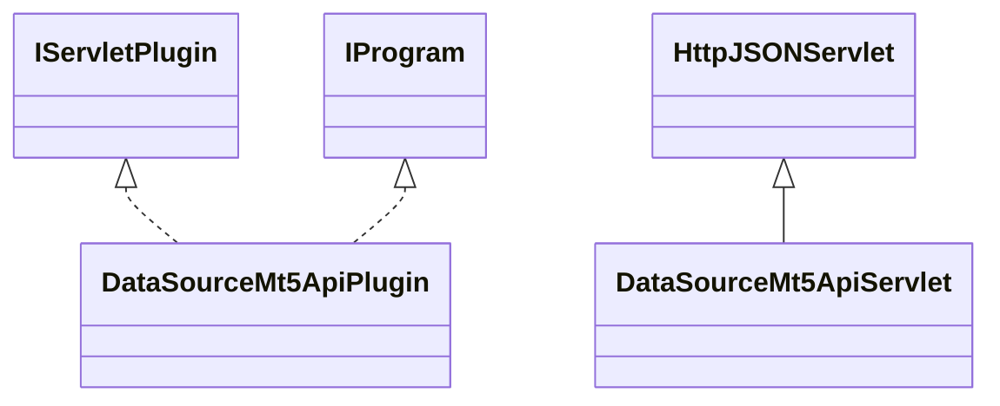

# DataSourceMt5Api.jar

[Group index](README.md) | [All archives](../README.md)

## Scope and provenance

- **Donor:** `SQX_145_REFERENCE_ROOT/internal/plugins/DataSourceMt5Api/DataSourceMt5Api.jar`.
- **SHA-256:** `0e9a2fcba6c8457afbf3412a09c50572f207d04290e96469cefa9858f33aaf64`; accessed 2026-10-06; captured `2026-10-06T18:54:51.906614+00:00`.
- **Classes:** 4 raw entries; 4 unique entry names. Duplicate occurrence indices are zero-based.
- **Inspection:** read-only ZIP hashing and class-file structural parsing; signatures/descriptors, modifiers, hierarchy and references only. Bytecode bodies are hashed, not published.
- **Allocation:** proposed `FEAT-DATA-SOURCE-DATA-SOURCE-MT5-API`, P04; [roadmap](../../dev/sqx-full-application-roadmap.md). Domain README registration remains required.
- **Repository:** `01067f00031428613c6394064ca1bcadc1ba00ee`; review state unreviewed. Download label 145-dev1; installed build/activation and runtime equivalence unverified.
- **Limit:** every class/member is inventoried; declaration coverage does not establish consumed calls, defaults, formulas, failure semantics or algorithm parity.
- **Archive/resource index:** [177.json](../../dev/evidence/sqx145/archives/145/177.json).

## Complete member declarations

Member shards contain exact JVM names/descriptors, access flags, generic signatures, throws types, declared fields/methods, superclass/interfaces and referenced class names. All classes, nested/synthetic members and overloads are retained. Code length/hash is structural evidence, not a normalized algorithm comparison.

- [001.json](../../dev/evidence/sqx145/members/177/001.json) — SHA-256 `15c29bf35bb20fa8cca8153030a66b427c156290f5caca2fdc6dd08fe549b354`.

## Focused structural diagram

Up to twelve non-nested classes; arrows show declared inheritance/interfaces only. External type names are not evidence of an available body or an executed dependency.

## Class inventory

| Archive entry | Occurrence | Class SHA-256 | Fields | Methods |
| --- | ---: | --- | ---: | ---: |
| `com/strategyquant/plugin/DataSource/impl/Mt5Api/DataSourceMt5ApiPlugin.class` | 0 | `1b6c09b0bab1c74749e0b0334cfb82bb81b5894730b3b402dd270570344f2af9` | 2 | 6 |
| `com/strategyquant/plugin/DataSource/impl/Mt5Api/DataSourceMt5ApiServlet$1.class` | 0 | `38412b5c7bbdb9b7ed601b8673619014187cfe951a2884757e93e047465c3816` | 1 | 3 |
| `com/strategyquant/plugin/DataSource/impl/Mt5Api/DataSourceMt5ApiServlet$2.class` | 0 | `6e8364d89b847dc0e26eab94c672673d386c874d1d0c61e67263e92eefdd1e02` | 2 | 2 |
| `com/strategyquant/plugin/DataSource/impl/Mt5Api/DataSourceMt5ApiServlet.class` | 0 | `c95f1a84d82f2685d6cf9c40ceb5d233be9ee3698cbfc5dfdc40b6687c82d80e` | 3 | 10 |
