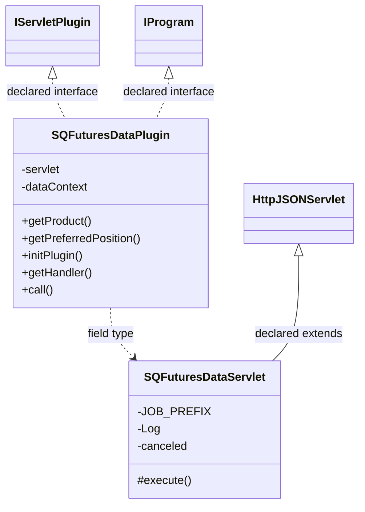

# DataSourceSQFuturesData.jar

[Workspace/group index](README.md)  |  [All workspaces](../README.md)

## Scope and provenance

- Artifact: `SQX_REFERENCE_ROOT/internal/plugins/DataSourceSQFuturesData/DataSourceSQFuturesData.jar`.
- SHA-256: `8c56d64a1dab0739f077faa1fc960c9c7bbacb514a9229afdcba698549704809`.
- Inspected: 2026-10-05; generation timestamp `2026-10-05T19:04:16.344170+00:00`.
- Archive class entries: **5**; non-nested: **2**; nested/anonymous: **3**.
- Inspection: ZIP entry/manifest enumeration and `javap -p` declarations for every listed class.
- Repository source HEAD: `8a92c705183a6702eaf62037ccb202ed028aa899`; review state: generated, pending owner review.
- Installed SQX build number is unverified. No method bodies are reproduced.
- Confidence: high for declared structure; workspace ownership inferred except where registration evidence is separately stated. Runtime reachability, call order, formulas and parity remain unverified.

The `DataManager` folder is a navigation/research grouping, not an exclusive backend owner. Shared consumers may use this JAR.

Target mapping: no verified owning HaruQuantAI feature/requirement/decision IDs are assigned by this document. Register or resolve ownership through the normal repository plan before implementation.

## Diagram reading guide

`Parent <|-- Child` means declared inheritance; `Interface <|.. Class` means declared implementation. Interface extension uses the inheritance arrow. `A ..> B : field type` is a declared type dependency, not composition, object ownership or a runtime call. External nodes are referenced types, not fabricated local implementations. Selected fields/method names aid navigation: `+` is public, `#` protected and `-` private. Diagram method names omit parameter/return types and collapse overloads; use the exact inspected declarations below before implementing an API.

Detailed graphs include non-nested classes in package-sized groups of at most 12. Nested/anonymous classes are inventoried and their declarations/relationships are retained below, but omitted from overview graphs. Relationships not drawn for readability remain in the complete declaration-relationship table. Constructors, synthetic bridges and overloads may be collapsed in diagram member lists only. Standard `java.lang.Object` inheritance is omitted from diagrams.

## UML class diagrams

### 1. `com.strategyquant.plugin.DataSource.impl.SQFuturesData`



| Diagram identifier | Exact type | Location |
| --- | --- | --- |
| `C9ea43520d454` | `com.strategyquant.plugin.DataSource.impl.SQFuturesData.SQFuturesDataPlugin` (this JAR) | this diagram |
| `Cbf8ec116357e` | `com.strategyquant.plugin.DataSource.impl.SQFuturesData.SQFuturesDataServlet` (this JAR) | this diagram |
| `C1b6b4448b67b` | [`com.strategyquant.pluginlib.program.IProgram`](../Shared/SQPluginLib.md) | referenced external type |
| `C249b5c671b1a` | [`com.strategyquant.tradinglib.servlet.IServletPlugin`](../Shared/SQTradingLib.md) | referenced external type |
| `C8900f90ae594` | [`com.strategyquant.webguilib.servlet.HttpJSONServlet`](../Shared/SQWebGUILib.md) | referenced external type |

## Complete class inventory

| Fully qualified class | Kind | Entry |
| --- | --- | --- |
| `com.strategyquant.plugin.DataSource.impl.SQFuturesData.SQFuturesDataPlugin` | class | non-nested |
| `com.strategyquant.plugin.DataSource.impl.SQFuturesData.SQFuturesDataServlet` | class | non-nested |
| `com.strategyquant.plugin.DataSource.impl.SQFuturesData.SQFuturesDataServlet$1` | class | nested/anonymous |
| `com.strategyquant.plugin.DataSource.impl.SQFuturesData.SQFuturesDataServlet$2` | class | nested/anonymous |
| `com.strategyquant.plugin.DataSource.impl.SQFuturesData.SQFuturesDataServlet$3` | class | nested/anonymous |

## Declared relationships and evidence locations

Every row is supported by the named class declaration/member in `javap -p`, inside the artifact recorded above. Signature dependencies may include return, parameter, generic-argument and throws types; they do not imply execution.

| Declaring class | Referenced type | Relationship | Narrow inspection location |
| --- | --- | --- | --- |
| `com.strategyquant.plugin.DataSource.impl.SQFuturesData.SQFuturesDataPlugin` | [`com.strategyquant.tradinglib.servlet.IServletPlugin`](../Shared/SQTradingLib.md) | implements | `com.strategyquant.plugin.DataSource.impl.SQFuturesData.SQFuturesDataPlugin` / class declaration: `public class com.strategyquant.plugin.DataSource.impl.SQFuturesData.SQFuturesDataPlugin implements com.strategyquant.tradinglib.servlet.IServletPlugin,com.strategyquant.pluginlib.program.IProgram` |
| `com.strategyquant.plugin.DataSource.impl.SQFuturesData.SQFuturesDataPlugin` | [`com.strategyquant.pluginlib.program.IProgram`](../Shared/SQPluginLib.md) | implements | `com.strategyquant.plugin.DataSource.impl.SQFuturesData.SQFuturesDataPlugin` / class declaration: `public class com.strategyquant.plugin.DataSource.impl.SQFuturesData.SQFuturesDataPlugin implements com.strategyquant.tradinglib.servlet.IServletPlugin,com.strategyquant.pluginlib.program.IProgram` |
| `com.strategyquant.plugin.DataSource.impl.SQFuturesData.SQFuturesDataPlugin` | `com.strategyquant.plugin.DataSource.impl.SQFuturesData.SQFuturesDataServlet` (this JAR) | type dependency | `com.strategyquant.plugin.DataSource.impl.SQFuturesData.SQFuturesDataPlugin` / field declaration: `private com.strategyquant.plugin.DataSource.impl.SQFuturesData.SQFuturesDataServlet servlet;` |
| `com.strategyquant.plugin.DataSource.impl.SQFuturesData.SQFuturesDataPlugin` | `org.eclipse.jetty.servlet.ServletContextHandler` (not resolved in scoped archives) | type dependency | `com.strategyquant.plugin.DataSource.impl.SQFuturesData.SQFuturesDataPlugin` / field declaration: `private org.eclipse.jetty.servlet.ServletContextHandler dataContext;` |
| `com.strategyquant.plugin.DataSource.impl.SQFuturesData.SQFuturesDataPlugin` | `java.lang.String` (not resolved in scoped archives) | type dependency | `com.strategyquant.plugin.DataSource.impl.SQFuturesData.SQFuturesDataPlugin` / method signature: `public java.lang.String getProduct();`<br>`public java.lang.Object call(java.lang.String, java.lang.Object...) throws java.lang.Exception;` |
| `com.strategyquant.plugin.DataSource.impl.SQFuturesData.SQFuturesDataPlugin` | `java.lang.Exception` (not resolved in scoped archives) | type dependency | `com.strategyquant.plugin.DataSource.impl.SQFuturesData.SQFuturesDataPlugin` / method signature: `public void initPlugin() throws java.lang.Exception;`<br>`public java.lang.Object call(java.lang.String, java.lang.Object...) throws java.lang.Exception;` |
| `com.strategyquant.plugin.DataSource.impl.SQFuturesData.SQFuturesDataPlugin` | `org.eclipse.jetty.server.Handler` (not resolved in scoped archives) | type dependency | `com.strategyquant.plugin.DataSource.impl.SQFuturesData.SQFuturesDataPlugin` / method signature: `public org.eclipse.jetty.server.Handler getHandler();` |
| `com.strategyquant.plugin.DataSource.impl.SQFuturesData.SQFuturesDataPlugin` | `java.lang.Object` (not resolved in scoped archives) | type dependency | `com.strategyquant.plugin.DataSource.impl.SQFuturesData.SQFuturesDataPlugin` / method signature: `public java.lang.Object call(java.lang.String, java.lang.Object...) throws java.lang.Exception;` |
| `com.strategyquant.plugin.DataSource.impl.SQFuturesData.SQFuturesDataServlet` | [`com.strategyquant.webguilib.servlet.HttpJSONServlet`](../Shared/SQWebGUILib.md) | extends | `com.strategyquant.plugin.DataSource.impl.SQFuturesData.SQFuturesDataServlet` / class declaration: `public class com.strategyquant.plugin.DataSource.impl.SQFuturesData.SQFuturesDataServlet extends com.strategyquant.webguilib.servlet.HttpJSONServlet` |
| `com.strategyquant.plugin.DataSource.impl.SQFuturesData.SQFuturesDataServlet` | `java.lang.String` (not resolved in scoped archives) | type dependency | `com.strategyquant.plugin.DataSource.impl.SQFuturesData.SQFuturesDataServlet` / field declaration: `private static final java.lang.String JOB_PREFIX;`<br>`private java.lang.String exchangesResponse;` |
| `com.strategyquant.plugin.DataSource.impl.SQFuturesData.SQFuturesDataServlet` | `java.lang.String` (not resolved in scoped archives) | type dependency | `com.strategyquant.plugin.DataSource.impl.SQFuturesData.SQFuturesDataServlet` / method signature: `protected java.lang.String execute(java.lang.String, java.util.Map<java.lang.String, java.lang.String[]>, java.lang.String) throws java.lang.Exception;`<br>`private java.lang.String onGetExchanges() throws java.lang.Exception;`<br>`private java.lang.String onAdd(java.util.Map<java.lang.String, java.lang.String[]>) throws java.lang.Exception;`<br>`private void _onAdd(java.util.Map<java.lang.String, java.lang.String[]>);`<br>`private java.lang.String onAddCancel() throws java.lang.Exception;`<br>`private void subscriptionCheck(java.lang.String[], java.util.Map<java.lang.String, com.strategyquant.datalib.historyData.dto.TickerDto>, boolean) throws java.lang.Exception;`<br>`private java.lang.String onLookup(java.util.Map<java.lang.String, java.lang.String[]>) throws java.lang.Exception;`<br>`private java.lang.String onUpdate() throws java.lang.Exception;`<br>`private java.lang.String onUpdateBr() throws java.lang.Exception;`<br>`private java.lang.String performUpdate(java.util.List<com.strategyquant.datalib.DataInfo>) throws java.lang.Exception;`<br>`private boolean isDownloadAllowed(com.strategyquant.datalib.DataInfo, java.util.Map<java.lang.String, com.strategyquant.datalib.historyData.dto.TickerDto>) throws org.apache.http.client.ClientProtocolException, java.lang.IllegalStateException, java.security.NoSuchAlgorithmException, java.io.IOException, org.jdom2.JDOMException, java.sql.SQLException;`<br>`private java.lang.String onVerifySubscription(java.util.Map<java.lang.String, java.lang.String[]>) throws java.lang.Exception;`<br>`private java.lang.String onUpdateDataAction(java.util.Map<java.lang.String, java.lang.String[]>) throws java.lang.Exception;`<br>`private java.lang.String onUpdateAll() throws java.lang.Exception;`<br>`private java.lang.String onUpdateSelected(java.util.Map<java.lang.String, java.lang.String[]>) throws java.lang.Exception;`<br>`private static java.lang.String lambda$performUpdate$3(com.strategyquant.datalib.DataInfo);` |
| `com.strategyquant.plugin.DataSource.impl.SQFuturesData.SQFuturesDataServlet` | `org.slf4j.Logger` (not resolved in scoped archives) | type dependency | `com.strategyquant.plugin.DataSource.impl.SQFuturesData.SQFuturesDataServlet` / field declaration: `private static final org.slf4j.Logger Log;` |
| `com.strategyquant.plugin.DataSource.impl.SQFuturesData.SQFuturesDataServlet` | `java.util.Map` (not resolved in scoped archives) | type dependency | `com.strategyquant.plugin.DataSource.impl.SQFuturesData.SQFuturesDataServlet` / method signature: `protected java.lang.String execute(java.lang.String, java.util.Map<java.lang.String, java.lang.String[]>, java.lang.String) throws java.lang.Exception;`<br>`private java.lang.String onAdd(java.util.Map<java.lang.String, java.lang.String[]>) throws java.lang.Exception;`<br>`private void _onAdd(java.util.Map<java.lang.String, java.lang.String[]>);`<br>`private void subscriptionCheck(java.lang.String[], java.util.Map<java.lang.String, com.strategyquant.datalib.historyData.dto.TickerDto>, boolean) throws java.lang.Exception;`<br>`private java.lang.String onLookup(java.util.Map<java.lang.String, java.lang.String[]>) throws java.lang.Exception;`<br>`private boolean isDownloadAllowed(com.strategyquant.datalib.DataInfo, java.util.Map<java.lang.String, com.strategyquant.datalib.historyData.dto.TickerDto>) throws org.apache.http.client.ClientProtocolException, java.lang.IllegalStateException, java.security.NoSuchAlgorithmException, java.io.IOException, org.jdom2.JDOMException, java.sql.SQLException;`<br>`private java.lang.String onVerifySubscription(java.util.Map<java.lang.String, java.lang.String[]>) throws java.lang.Exception;`<br>`private java.lang.String onUpdateDataAction(java.util.Map<java.lang.String, java.lang.String[]>) throws java.lang.Exception;`<br>`private java.lang.String onUpdateSelected(java.util.Map<java.lang.String, java.lang.String[]>) throws java.lang.Exception;`<br>`static void access$000(com.strategyquant.plugin.DataSource.impl.SQFuturesData.SQFuturesDataServlet, java.util.Map);` |
| `com.strategyquant.plugin.DataSource.impl.SQFuturesData.SQFuturesDataServlet` | `java.lang.Exception` (not resolved in scoped archives) | type dependency | `com.strategyquant.plugin.DataSource.impl.SQFuturesData.SQFuturesDataServlet` / method signature: `protected java.lang.String execute(java.lang.String, java.util.Map<java.lang.String, java.lang.String[]>, java.lang.String) throws java.lang.Exception;`<br>`private java.lang.String onGetExchanges() throws java.lang.Exception;`<br>`private java.lang.String onAdd(java.util.Map<java.lang.String, java.lang.String[]>) throws java.lang.Exception;`<br>`private java.lang.String onAddCancel() throws java.lang.Exception;`<br>`private void subscriptionCheck(java.lang.String[], java.util.Map<java.lang.String, com.strategyquant.datalib.historyData.dto.TickerDto>, boolean) throws java.lang.Exception;`<br>`private java.lang.String onLookup(java.util.Map<java.lang.String, java.lang.String[]>) throws java.lang.Exception;`<br>`private java.lang.String onUpdate() throws java.lang.Exception;`<br>`private java.lang.String onUpdateBr() throws java.lang.Exception;`<br>`private java.lang.String performUpdate(java.util.List<com.strategyquant.datalib.DataInfo>) throws java.lang.Exception;`<br>`private java.lang.String onVerifySubscription(java.util.Map<java.lang.String, java.lang.String[]>) throws java.lang.Exception;`<br>`private java.lang.String onUpdateDataAction(java.util.Map<java.lang.String, java.lang.String[]>) throws java.lang.Exception;`<br>`private java.lang.String onUpdateAll() throws java.lang.Exception;`<br>`private java.lang.String onUpdateSelected(java.util.Map<java.lang.String, java.lang.String[]>) throws java.lang.Exception;` |
| `com.strategyquant.plugin.DataSource.impl.SQFuturesData.SQFuturesDataServlet` | [`com.strategyquant.datalib.historyData.dto.TickerDto`](../Shared/SQDataLib.md) | type dependency | `com.strategyquant.plugin.DataSource.impl.SQFuturesData.SQFuturesDataServlet` / method signature: `private void subscriptionCheck(java.lang.String[], java.util.Map<java.lang.String, com.strategyquant.datalib.historyData.dto.TickerDto>, boolean) throws java.lang.Exception;`<br>`private boolean isDownloadAllowed(com.strategyquant.datalib.DataInfo, java.util.Map<java.lang.String, com.strategyquant.datalib.historyData.dto.TickerDto>) throws org.apache.http.client.ClientProtocolException, java.lang.IllegalStateException, java.security.NoSuchAlgorithmException, java.io.IOException, org.jdom2.JDOMException, java.sql.SQLException;`<br>`private static boolean lambda$onLookup$2(com.strategyquant.datalib.historyData.dto.TickerDto);`<br>`private static com.strategyquant.datalib.historyData.dto.TickerDto lambda$_onAdd$1(com.strategyquant.datalib.historyData.dto.TickerDto);` |
| `com.strategyquant.plugin.DataSource.impl.SQFuturesData.SQFuturesDataServlet` | `java.util.List` (not resolved in scoped archives) | type dependency | `com.strategyquant.plugin.DataSource.impl.SQFuturesData.SQFuturesDataServlet` / method signature: `private java.lang.String performUpdate(java.util.List<com.strategyquant.datalib.DataInfo>) throws java.lang.Exception;` |
| `com.strategyquant.plugin.DataSource.impl.SQFuturesData.SQFuturesDataServlet` | [`com.strategyquant.datalib.DataInfo`](../Shared/SQDataLib.md) | type dependency | `com.strategyquant.plugin.DataSource.impl.SQFuturesData.SQFuturesDataServlet` / method signature: `private java.lang.String performUpdate(java.util.List<com.strategyquant.datalib.DataInfo>) throws java.lang.Exception;`<br>`private boolean isDownloadAllowed(com.strategyquant.datalib.DataInfo, java.util.Map<java.lang.String, com.strategyquant.datalib.historyData.dto.TickerDto>) throws org.apache.http.client.ClientProtocolException, java.lang.IllegalStateException, java.security.NoSuchAlgorithmException, java.io.IOException, org.jdom2.JDOMException, java.sql.SQLException;`<br>`private static java.lang.String lambda$performUpdate$3(com.strategyquant.datalib.DataInfo);` |
| `com.strategyquant.plugin.DataSource.impl.SQFuturesData.SQFuturesDataServlet` | `org.apache.http.client.ClientProtocolException` (not resolved in scoped archives) | type dependency | `com.strategyquant.plugin.DataSource.impl.SQFuturesData.SQFuturesDataServlet` / method signature: `private boolean isDownloadAllowed(com.strategyquant.datalib.DataInfo, java.util.Map<java.lang.String, com.strategyquant.datalib.historyData.dto.TickerDto>) throws org.apache.http.client.ClientProtocolException, java.lang.IllegalStateException, java.security.NoSuchAlgorithmException, java.io.IOException, org.jdom2.JDOMException, java.sql.SQLException;` |
| `com.strategyquant.plugin.DataSource.impl.SQFuturesData.SQFuturesDataServlet` | `java.lang.IllegalStateException` (not resolved in scoped archives) | type dependency | `com.strategyquant.plugin.DataSource.impl.SQFuturesData.SQFuturesDataServlet` / method signature: `private boolean isDownloadAllowed(com.strategyquant.datalib.DataInfo, java.util.Map<java.lang.String, com.strategyquant.datalib.historyData.dto.TickerDto>) throws org.apache.http.client.ClientProtocolException, java.lang.IllegalStateException, java.security.NoSuchAlgorithmException, java.io.IOException, org.jdom2.JDOMException, java.sql.SQLException;` |
| `com.strategyquant.plugin.DataSource.impl.SQFuturesData.SQFuturesDataServlet` | `java.security.NoSuchAlgorithmException` (not resolved in scoped archives) | type dependency | `com.strategyquant.plugin.DataSource.impl.SQFuturesData.SQFuturesDataServlet` / method signature: `private boolean isDownloadAllowed(com.strategyquant.datalib.DataInfo, java.util.Map<java.lang.String, com.strategyquant.datalib.historyData.dto.TickerDto>) throws org.apache.http.client.ClientProtocolException, java.lang.IllegalStateException, java.security.NoSuchAlgorithmException, java.io.IOException, org.jdom2.JDOMException, java.sql.SQLException;` |
| `com.strategyquant.plugin.DataSource.impl.SQFuturesData.SQFuturesDataServlet` | `java.io.IOException` (not resolved in scoped archives) | type dependency | `com.strategyquant.plugin.DataSource.impl.SQFuturesData.SQFuturesDataServlet` / method signature: `private boolean isDownloadAllowed(com.strategyquant.datalib.DataInfo, java.util.Map<java.lang.String, com.strategyquant.datalib.historyData.dto.TickerDto>) throws org.apache.http.client.ClientProtocolException, java.lang.IllegalStateException, java.security.NoSuchAlgorithmException, java.io.IOException, org.jdom2.JDOMException, java.sql.SQLException;` |
| `com.strategyquant.plugin.DataSource.impl.SQFuturesData.SQFuturesDataServlet` | `org.jdom2.JDOMException` (not resolved in scoped archives) | type dependency | `com.strategyquant.plugin.DataSource.impl.SQFuturesData.SQFuturesDataServlet` / method signature: `private boolean isDownloadAllowed(com.strategyquant.datalib.DataInfo, java.util.Map<java.lang.String, com.strategyquant.datalib.historyData.dto.TickerDto>) throws org.apache.http.client.ClientProtocolException, java.lang.IllegalStateException, java.security.NoSuchAlgorithmException, java.io.IOException, org.jdom2.JDOMException, java.sql.SQLException;` |
| `com.strategyquant.plugin.DataSource.impl.SQFuturesData.SQFuturesDataServlet` | `java.sql.SQLException` (not resolved in scoped archives) | type dependency | `com.strategyquant.plugin.DataSource.impl.SQFuturesData.SQFuturesDataServlet` / method signature: `private boolean isDownloadAllowed(com.strategyquant.datalib.DataInfo, java.util.Map<java.lang.String, com.strategyquant.datalib.historyData.dto.TickerDto>) throws org.apache.http.client.ClientProtocolException, java.lang.IllegalStateException, java.security.NoSuchAlgorithmException, java.io.IOException, org.jdom2.JDOMException, java.sql.SQLException;` |
| `com.strategyquant.plugin.DataSource.impl.SQFuturesData.SQFuturesDataServlet` | [`com.strategyquant.datalib.historyData.dto.CommodityDto`](../Shared/SQDataLib.md) | type dependency | `com.strategyquant.plugin.DataSource.impl.SQFuturesData.SQFuturesDataServlet` / method signature: `private static com.strategyquant.datalib.historyData.dto.CommodityDto lambda$_onAdd$0(com.strategyquant.datalib.historyData.dto.CommodityDto);` |
| `com.strategyquant.plugin.DataSource.impl.SQFuturesData.SQFuturesDataServlet$1` | `java.lang.Thread` (not resolved in scoped archives) | extends | `com.strategyquant.plugin.DataSource.impl.SQFuturesData.SQFuturesDataServlet$1` / class declaration: `class com.strategyquant.plugin.DataSource.impl.SQFuturesData.SQFuturesDataServlet$1 extends java.lang.Thread` |
| `com.strategyquant.plugin.DataSource.impl.SQFuturesData.SQFuturesDataServlet$1` | `java.util.Map` (not resolved in scoped archives) | type dependency | `com.strategyquant.plugin.DataSource.impl.SQFuturesData.SQFuturesDataServlet$1` / field declaration: `final java.util.Map val$args;` |
| `com.strategyquant.plugin.DataSource.impl.SQFuturesData.SQFuturesDataServlet$1` | `java.util.Map` (not resolved in scoped archives) | type dependency | `com.strategyquant.plugin.DataSource.impl.SQFuturesData.SQFuturesDataServlet$1` / method signature: `com.strategyquant.plugin.DataSource.impl.SQFuturesData.SQFuturesDataServlet$1(com.strategyquant.plugin.DataSource.impl.SQFuturesData.SQFuturesDataServlet, java.util.Map);` |
| `com.strategyquant.plugin.DataSource.impl.SQFuturesData.SQFuturesDataServlet$1` | `com.strategyquant.plugin.DataSource.impl.SQFuturesData.SQFuturesDataServlet` (this JAR) | type dependency | `com.strategyquant.plugin.DataSource.impl.SQFuturesData.SQFuturesDataServlet$1` / field declaration: `final com.strategyquant.plugin.DataSource.impl.SQFuturesData.SQFuturesDataServlet this$0;` |
| `com.strategyquant.plugin.DataSource.impl.SQFuturesData.SQFuturesDataServlet$1` | `com.strategyquant.plugin.DataSource.impl.SQFuturesData.SQFuturesDataServlet` (this JAR) | type dependency | `com.strategyquant.plugin.DataSource.impl.SQFuturesData.SQFuturesDataServlet$1` / method signature: `com.strategyquant.plugin.DataSource.impl.SQFuturesData.SQFuturesDataServlet$1(com.strategyquant.plugin.DataSource.impl.SQFuturesData.SQFuturesDataServlet, java.util.Map);` |
| `com.strategyquant.plugin.DataSource.impl.SQFuturesData.SQFuturesDataServlet$2` | [`com.strategyquant.datalib.data.InstrumentValueEvaluator`](../Shared/SQDataLib.md) | implements | `com.strategyquant.plugin.DataSource.impl.SQFuturesData.SQFuturesDataServlet$2` / class declaration: `class com.strategyquant.plugin.DataSource.impl.SQFuturesData.SQFuturesDataServlet$2 implements com.strategyquant.datalib.data.InstrumentValueEvaluator` |
| `com.strategyquant.plugin.DataSource.impl.SQFuturesData.SQFuturesDataServlet$2` | `java.util.Map` (not resolved in scoped archives) | type dependency | `com.strategyquant.plugin.DataSource.impl.SQFuturesData.SQFuturesDataServlet$2` / field declaration: `final java.util.Map val$commodityMap;` |
| `com.strategyquant.plugin.DataSource.impl.SQFuturesData.SQFuturesDataServlet$2` | `com.strategyquant.plugin.DataSource.impl.SQFuturesData.SQFuturesDataServlet` (this JAR) | type dependency | `com.strategyquant.plugin.DataSource.impl.SQFuturesData.SQFuturesDataServlet$2` / field declaration: `final com.strategyquant.plugin.DataSource.impl.SQFuturesData.SQFuturesDataServlet this$0;` |
| `com.strategyquant.plugin.DataSource.impl.SQFuturesData.SQFuturesDataServlet$2` | [`com.strategyquant.datalib.historyData.dto.TickerDto`](../Shared/SQDataLib.md) | type dependency | `com.strategyquant.plugin.DataSource.impl.SQFuturesData.SQFuturesDataServlet$2` / method signature: `public double getTickStep(com.strategyquant.datalib.historyData.dto.TickerDto);`<br>`public double getTickSize(com.strategyquant.datalib.historyData.dto.TickerDto);`<br>`public double getPointValue(com.strategyquant.datalib.historyData.dto.TickerDto);`<br>`public byte getInstrumentType(com.strategyquant.datalib.historyData.dto.TickerDto);`<br>`public java.lang.String getDescriptions(com.strategyquant.datalib.historyData.dto.TickerDto);`<br>`public double getOrderSizeMultiplier(com.strategyquant.datalib.historyData.dto.TickerDto);`<br>`public double getOrderSizeStep(com.strategyquant.datalib.historyData.dto.TickerDto);` |
| `com.strategyquant.plugin.DataSource.impl.SQFuturesData.SQFuturesDataServlet$2` | `java.lang.String` (not resolved in scoped archives) | type dependency | `com.strategyquant.plugin.DataSource.impl.SQFuturesData.SQFuturesDataServlet$2` / method signature: `public java.lang.String getDescriptions(com.strategyquant.datalib.historyData.dto.TickerDto);` |
| `com.strategyquant.plugin.DataSource.impl.SQFuturesData.SQFuturesDataServlet$3` | [`com.strategyquant.datalib.data.BatchProgressController`](../Shared/SQDataLib.md) | implements | `com.strategyquant.plugin.DataSource.impl.SQFuturesData.SQFuturesDataServlet$3` / class declaration: `class com.strategyquant.plugin.DataSource.impl.SQFuturesData.SQFuturesDataServlet$3 implements com.strategyquant.datalib.data.BatchProgressController` |
| `com.strategyquant.plugin.DataSource.impl.SQFuturesData.SQFuturesDataServlet$3` | `org.json.JSONObject` (not resolved in scoped archives) | type dependency | `com.strategyquant.plugin.DataSource.impl.SQFuturesData.SQFuturesDataServlet$3` / field declaration: `final org.json.JSONObject val$progress;` |
| `com.strategyquant.plugin.DataSource.impl.SQFuturesData.SQFuturesDataServlet$3` | `java.util.Set` (not resolved in scoped archives) | type dependency | `com.strategyquant.plugin.DataSource.impl.SQFuturesData.SQFuturesDataServlet$3` / field declaration: `final java.util.Set val$symbolsSet;` |
| `com.strategyquant.plugin.DataSource.impl.SQFuturesData.SQFuturesDataServlet$3` | `java.lang.String` (not resolved in scoped archives) | type dependency | `com.strategyquant.plugin.DataSource.impl.SQFuturesData.SQFuturesDataServlet$3` / field declaration: `final java.lang.String[] val$symbols;` |
| `com.strategyquant.plugin.DataSource.impl.SQFuturesData.SQFuturesDataServlet$3` | `java.lang.String` (not resolved in scoped archives) | type dependency | `com.strategyquant.plugin.DataSource.impl.SQFuturesData.SQFuturesDataServlet$3` / method signature: `public void updateProgress(int, int, java.lang.String) throws java.lang.Exception;` |
| `com.strategyquant.plugin.DataSource.impl.SQFuturesData.SQFuturesDataServlet$3` | `com.strategyquant.plugin.DataSource.impl.SQFuturesData.SQFuturesDataServlet` (this JAR) | type dependency | `com.strategyquant.plugin.DataSource.impl.SQFuturesData.SQFuturesDataServlet$3` / field declaration: `final com.strategyquant.plugin.DataSource.impl.SQFuturesData.SQFuturesDataServlet this$0;` |
| `com.strategyquant.plugin.DataSource.impl.SQFuturesData.SQFuturesDataServlet$3` | `java.lang.Exception` (not resolved in scoped archives) | type dependency | `com.strategyquant.plugin.DataSource.impl.SQFuturesData.SQFuturesDataServlet$3` / method signature: `public void updateProgress(int, int, java.lang.String) throws java.lang.Exception;` |

## Inspected declaration reference

These are structural API/member declarations, not proprietary implementation bodies. Private members and nested classes are retained to make diagram omissions explicit; declarations do not prove behavior.

<details>
<summary>com.strategyquant.plugin.DataSource.impl.SQFuturesData.SQFuturesDataPlugin</summary>

```text
public class com.strategyquant.plugin.DataSource.impl.SQFuturesData.SQFuturesDataPlugin implements com.strategyquant.tradinglib.servlet.IServletPlugin,com.strategyquant.pluginlib.program.IProgram
    private com.strategyquant.plugin.DataSource.impl.SQFuturesData.SQFuturesDataServlet servlet;
    private org.eclipse.jetty.servlet.ServletContextHandler dataContext;
    public com.strategyquant.plugin.DataSource.impl.SQFuturesData.SQFuturesDataPlugin();
    public java.lang.String getProduct();
    public int getPreferredPosition();
    public void initPlugin() throws java.lang.Exception;
    public org.eclipse.jetty.server.Handler getHandler();
    public java.lang.Object call(java.lang.String, java.lang.Object...) throws java.lang.Exception;
```

</details>

<details>
<summary>com.strategyquant.plugin.DataSource.impl.SQFuturesData.SQFuturesDataServlet</summary>

```text
public class com.strategyquant.plugin.DataSource.impl.SQFuturesData.SQFuturesDataServlet extends com.strategyquant.webguilib.servlet.HttpJSONServlet
    private static final java.lang.String JOB_PREFIX;
    private static final org.slf4j.Logger Log;
    private boolean canceled;
    private java.lang.String exchangesResponse;
    public com.strategyquant.plugin.DataSource.impl.SQFuturesData.SQFuturesDataServlet();
    protected java.lang.String execute(java.lang.String, java.util.Map<java.lang.String, java.lang.String[]>, java.lang.String) throws java.lang.Exception;
    private java.lang.String onGetExchanges() throws java.lang.Exception;
    private java.lang.String onAdd(java.util.Map<java.lang.String, java.lang.String[]>) throws java.lang.Exception;
    private void _onAdd(java.util.Map<java.lang.String, java.lang.String[]>);
    private java.lang.String onAddCancel() throws java.lang.Exception;
    private void subscriptionCheck(java.lang.String[], java.util.Map<java.lang.String, com.strategyquant.datalib.historyData.dto.TickerDto>, boolean) throws java.lang.Exception;
    private java.lang.String onLookup(java.util.Map<java.lang.String, java.lang.String[]>) throws java.lang.Exception;
    private java.lang.String onUpdate() throws java.lang.Exception;
    private java.lang.String onUpdateBr() throws java.lang.Exception;
    private java.lang.String performUpdate(java.util.List<com.strategyquant.datalib.DataInfo>) throws java.lang.Exception;
    private boolean isDownloadAllowed(com.strategyquant.datalib.DataInfo, java.util.Map<java.lang.String, com.strategyquant.datalib.historyData.dto.TickerDto>) throws org.apache.http.client.ClientProtocolException, java.lang.IllegalStateException, java.security.NoSuchAlgorithmException, java.io.IOException, org.jdom2.JDOMException, java.sql.SQLException;
    private java.lang.String onVerifySubscription(java.util.Map<java.lang.String, java.lang.String[]>) throws java.lang.Exception;
    private java.lang.String onUpdateDataAction(java.util.Map<java.lang.String, java.lang.String[]>) throws java.lang.Exception;
    private java.lang.String onUpdateAll() throws java.lang.Exception;
    private java.lang.String onUpdateSelected(java.util.Map<java.lang.String, java.lang.String[]>) throws java.lang.Exception;
    private static java.lang.String lambda$performUpdate$3(com.strategyquant.datalib.DataInfo);
    private static boolean lambda$onLookup$2(com.strategyquant.datalib.historyData.dto.TickerDto);
    private static com.strategyquant.datalib.historyData.dto.TickerDto lambda$_onAdd$1(com.strategyquant.datalib.historyData.dto.TickerDto);
    private static com.strategyquant.datalib.historyData.dto.CommodityDto lambda$_onAdd$0(com.strategyquant.datalib.historyData.dto.CommodityDto);
    static void access$000(com.strategyquant.plugin.DataSource.impl.SQFuturesData.SQFuturesDataServlet, java.util.Map);
    static boolean access$100(com.strategyquant.plugin.DataSource.impl.SQFuturesData.SQFuturesDataServlet);
```

</details>

<details>
<summary>com.strategyquant.plugin.DataSource.impl.SQFuturesData.SQFuturesDataServlet$1</summary>

```text
class com.strategyquant.plugin.DataSource.impl.SQFuturesData.SQFuturesDataServlet$1 extends java.lang.Thread
    final java.util.Map val$args;
    final com.strategyquant.plugin.DataSource.impl.SQFuturesData.SQFuturesDataServlet this$0;
    com.strategyquant.plugin.DataSource.impl.SQFuturesData.SQFuturesDataServlet$1(com.strategyquant.plugin.DataSource.impl.SQFuturesData.SQFuturesDataServlet, java.util.Map);
    public void run();
```

</details>

<details>
<summary>com.strategyquant.plugin.DataSource.impl.SQFuturesData.SQFuturesDataServlet$2</summary>

```text
class com.strategyquant.plugin.DataSource.impl.SQFuturesData.SQFuturesDataServlet$2 implements com.strategyquant.datalib.data.InstrumentValueEvaluator
    final java.util.Map val$commodityMap;
    final com.strategyquant.plugin.DataSource.impl.SQFuturesData.SQFuturesDataServlet this$0;
    com.strategyquant.plugin.DataSource.impl.SQFuturesData.SQFuturesDataServlet$2();
    public double getTickStep(com.strategyquant.datalib.historyData.dto.TickerDto);
    public double getTickSize(com.strategyquant.datalib.historyData.dto.TickerDto);
    public double getPointValue(com.strategyquant.datalib.historyData.dto.TickerDto);
    public byte getInstrumentType(com.strategyquant.datalib.historyData.dto.TickerDto);
    public java.lang.String getDescriptions(com.strategyquant.datalib.historyData.dto.TickerDto);
    public double getOrderSizeMultiplier(com.strategyquant.datalib.historyData.dto.TickerDto);
    public double getOrderSizeStep(com.strategyquant.datalib.historyData.dto.TickerDto);
```

</details>

<details>
<summary>com.strategyquant.plugin.DataSource.impl.SQFuturesData.SQFuturesDataServlet$3</summary>

```text
class com.strategyquant.plugin.DataSource.impl.SQFuturesData.SQFuturesDataServlet$3 implements com.strategyquant.datalib.data.BatchProgressController
    final int val$batchSizeForUse;
    final org.json.JSONObject val$progress;
    final java.util.Set val$symbolsSet;
    final java.lang.String[] val$symbols;
    final com.strategyquant.plugin.DataSource.impl.SQFuturesData.SQFuturesDataServlet this$0;
    com.strategyquant.plugin.DataSource.impl.SQFuturesData.SQFuturesDataServlet$3();
    public void updateProgress(int, int, java.lang.String) throws java.lang.Exception;
    public boolean isCancel();
    public void finished();
```

</details>

## Validation and unresolved gaps

Archive hash and complete class inventory were checked against the inspected local artifact. Declaration extraction accounts for every inventoried class. Documentation/link/diagram structural verification is recorded in the master index and task walkthrough; no SQX runtime validation was performed.

The canonical reimplementation ledger/schema are absent, so no evidence IDs or validation-passed ledger claims are created. This is a donor structural reference. Exact behavior, default values, failure semantics, algorithms, runtime calls and target architectural choices require separate research. No aggregation/composition or cardinalities are inferred.
