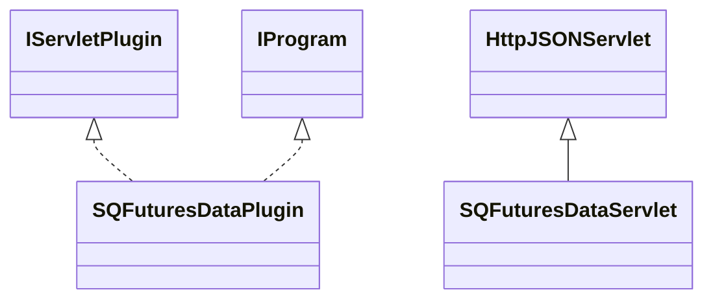

# DataSourceSQFuturesData.jar

[Group index](README.md) | [All archives](../README.md)

## Scope and provenance

- **Donor:** `SQX_145_REFERENCE_ROOT/internal/plugins/DataSourceSQFuturesData/DataSourceSQFuturesData.jar`.
- **SHA-256:** `ae170dfb47e1a0b7bacebb47b8575ac7a33976d613784c84a96abf5507a38a3f`; accessed 2026-10-06; captured `2026-10-06T18:54:51.906614+00:00`.
- **Classes:** 5 raw entries; 5 unique entry names. Duplicate occurrence indices are zero-based.
- **Inspection:** read-only ZIP hashing and class-file structural parsing; signatures/descriptors, modifiers, hierarchy and references only. Bytecode bodies are hashed, not published.
- **Allocation:** proposed `FEAT-DATA-SOURCE-DATA-SOURCE-SQ-FUTURES-DATA`, P04; [roadmap](../../dev/sqx-full-application-roadmap.md). Domain README registration remains required.
- **Repository:** `01067f00031428613c6394064ca1bcadc1ba00ee`; review state unreviewed. Download label 145-dev1; installed build/activation and runtime equivalence unverified.
- **Limit:** every class/member is inventoried; declaration coverage does not establish consumed calls, defaults, formulas, failure semantics or algorithm parity.
- **Archive/resource index:** [179.json](../../dev/evidence/sqx145/archives/145/179.json).

## Complete member declarations

Member shards contain exact JVM names/descriptors, access flags, generic signatures, throws types, declared fields/methods, superclass/interfaces and referenced class names. All classes, nested/synthetic members and overloads are retained. Code length/hash is structural evidence, not a normalized algorithm comparison.

- [001.json](../../dev/evidence/sqx145/members/179/001.json) — SHA-256 `e3a686db57ef70c3ec467f7de37ea2f00132a436e04bfdb58686887e0dd96b71`.

## Focused structural diagram

Up to twelve non-nested classes; arrows show declared inheritance/interfaces only. External type names are not evidence of an available body or an executed dependency.

## Class inventory

| Archive entry | Occurrence | Class SHA-256 | Fields | Methods |
| --- | ---: | --- | ---: | ---: |
| `com/strategyquant/plugin/DataSource/impl/SQFuturesData/SQFuturesDataPlugin.class` | 0 | `94df4557a43ca39b691a1bd644383abaf2d866a7e28a8358fa79cc2fafed6f63` | 2 | 6 |
| `com/strategyquant/plugin/DataSource/impl/SQFuturesData/SQFuturesDataServlet$1.class` | 0 | `5f57b3c00371829d61715de615ca79326137136439b33085a02743b21dd774bb` | 2 | 2 |
| `com/strategyquant/plugin/DataSource/impl/SQFuturesData/SQFuturesDataServlet$2.class` | 0 | `8bc4d85547b88ca6862a402383dfc9489c2562f073d3fb6821ded94fb1089f9b` | 2 | 8 |
| `com/strategyquant/plugin/DataSource/impl/SQFuturesData/SQFuturesDataServlet$3.class` | 0 | `d26f1f1486cbe9b724a6b684cc3e1418efc75f955dc4811c796ed817e6d46f83` | 5 | 4 |
| `com/strategyquant/plugin/DataSource/impl/SQFuturesData/SQFuturesDataServlet.class` | 0 | `91ca356c42989923e2b1830ada1db91aa606e150bb35dd57698da1cd16f15f15` | 4 | 24 |
