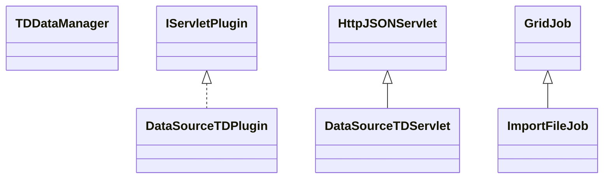

# DataSourceTD.jar

[Group index](README.md) | [All archives](../README.md)

## Scope and provenance

- **Donor:** `SQX_145_REFERENCE_ROOT/internal/plugins/DataSourceTD/DataSourceTD.jar`.
- **SHA-256:** `b3a965b9aed288cf77ff6c30c6a7a60719bae6593e65e415a8b8ac59691e9ea1`; accessed 2026-10-06; captured `2026-10-06T18:54:51.906614+00:00`.
- **Classes:** 5 raw entries; 5 unique entry names. Duplicate occurrence indices are zero-based.
- **Inspection:** read-only ZIP hashing and class-file structural parsing; signatures/descriptors, modifiers, hierarchy and references only. Bytecode bodies are hashed, not published.
- **Allocation:** proposed `FEAT-DATA-SOURCE-DATA-SOURCE-TD`, P04; [roadmap](../../dev/sqx-full-application-roadmap.md). Domain README registration remains required.
- **Repository:** `01067f00031428613c6394064ca1bcadc1ba00ee`; review state unreviewed. Download label 145-dev1; installed build/activation and runtime equivalence unverified.
- **Limit:** every class/member is inventoried; declaration coverage does not establish consumed calls, defaults, formulas, failure semantics or algorithm parity.
- **Archive/resource index:** [180.json](../../dev/evidence/sqx145/archives/145/180.json).

## Complete member declarations

Member shards contain exact JVM names/descriptors, access flags, generic signatures, throws types, declared fields/methods, superclass/interfaces and referenced class names. All classes, nested/synthetic members and overloads are retained. Code length/hash is structural evidence, not a normalized algorithm comparison.

- [001.json](../../dev/evidence/sqx145/members/180/001.json) — SHA-256 `b525833ee8a74585fcc9578147f8722c83934a6d1060c4b8e63fd999f598d3dd`.

## Focused structural diagram

Up to twelve non-nested classes; arrows show declared inheritance/interfaces only. External type names are not evidence of an available body or an executed dependency.

## Class inventory

| Archive entry | Occurrence | Class SHA-256 | Fields | Methods |
| --- | ---: | --- | ---: | ---: |
| `com/strategyquant/plugin/DataSource/impl/TD/DataSourceTDPlugin.class` | 0 | `1f66f7bf664c54bfc5480045762aae7a791749d4a778e0f0d143122e04cd2b12` | 1 | 5 |
| `com/strategyquant/plugin/DataSource/impl/TD/DataSourceTDServlet.class` | 0 | `b3cba15f2d5af286d178cf577febde78923a9b1254c2e956a76d6a62fc74983c` | 2 | 6 |
| `com/strategyquant/plugin/DataSource/impl/TD/TDDataManager.class` | 0 | `676fc6b4cd2d19f71cd68b836b7294af838e76e0ed33f866531b5e34cb42f638` | 3 | 7 |
| `com/strategyquant/plugin/DataSource/impl/TD/job/ImportFileJob$1.class` | 0 | `da75bf5b8da2953f15fb67cc10546e308a51b400ab731d883a125c8b78a0b185` | 1 | 2 |
| `com/strategyquant/plugin/DataSource/impl/TD/job/ImportFileJob.class` | 0 | `03ddddff6b8e5096e936823a08d8735d0b13ca2df069e07924c6bcb82318c807` | 11 | 15 |
