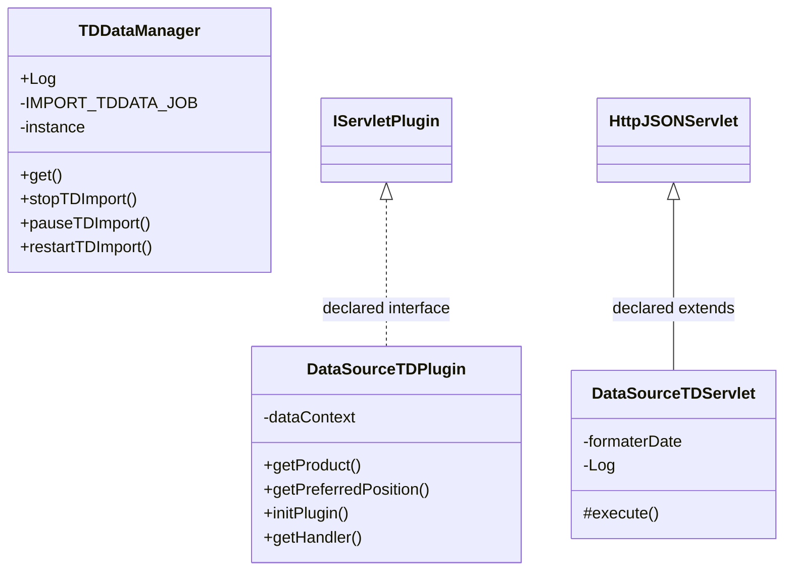
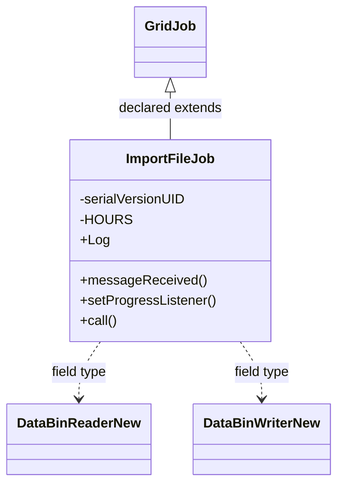

# DataSourceTD.jar

[Workspace/group index](README.md)  |  [All workspaces](../README.md)

## Scope and provenance

- Artifact: `SQX_REFERENCE_ROOT/internal/plugins/DataSourceTD/DataSourceTD.jar`.
- SHA-256: `8db468d20ca5644cdec4aaa637be00542b2809298b3bd1e378d1e7e3b5d63496`.
- Inspected: 2026-10-05; generation timestamp `2026-10-05T19:04:16.344170+00:00`.
- Archive class entries: **5**; non-nested: **4**; nested/anonymous: **1**.
- Inspection: ZIP entry/manifest enumeration and `javap -p` declarations for every listed class.
- Repository source HEAD: `8a92c705183a6702eaf62037ccb202ed028aa899`; review state: generated, pending owner review.
- Installed SQX build number is unverified. No method bodies are reproduced.
- Confidence: high for declared structure; workspace ownership inferred except where registration evidence is separately stated. Runtime reachability, call order, formulas and parity remain unverified.

The `DataManager` folder is a navigation/research grouping, not an exclusive backend owner. Shared consumers may use this JAR.

Target mapping: no verified owning HaruQuantAI feature/requirement/decision IDs are assigned by this document. Register or resolve ownership through the normal repository plan before implementation.

## Diagram reading guide

`Parent <|-- Child` means declared inheritance; `Interface <|.. Class` means declared implementation. Interface extension uses the inheritance arrow. `A ..> B : field type` is a declared type dependency, not composition, object ownership or a runtime call. External nodes are referenced types, not fabricated local implementations. Selected fields/method names aid navigation: `+` is public, `#` protected and `-` private. Diagram method names omit parameter/return types and collapse overloads; use the exact inspected declarations below before implementing an API.

Detailed graphs include non-nested classes in package-sized groups of at most 12. Nested/anonymous classes are inventoried and their declarations/relationships are retained below, but omitted from overview graphs. Relationships not drawn for readability remain in the complete declaration-relationship table. Constructors, synthetic bridges and overloads may be collapsed in diagram member lists only. Standard `java.lang.Object` inheritance is omitted from diagrams.

## UML class diagrams

### 1. `com.strategyquant.plugin.DataSource.impl.TD`



| Diagram identifier | Exact type | Location |
| --- | --- | --- |
| `C4d70948193d1` | `com.strategyquant.plugin.DataSource.impl.TD.DataSourceTDPlugin` (this JAR) | this diagram |
| `C871e7009ad8f` | `com.strategyquant.plugin.DataSource.impl.TD.DataSourceTDServlet` (this JAR) | this diagram |
| `C8b43bce9f96e` | `com.strategyquant.plugin.DataSource.impl.TD.TDDataManager` (this JAR) | this diagram |
| `C249b5c671b1a` | [`com.strategyquant.tradinglib.servlet.IServletPlugin`](../Shared/SQTradingLib.md) | referenced external type |
| `C8900f90ae594` | [`com.strategyquant.webguilib.servlet.HttpJSONServlet`](../Shared/SQWebGUILib.md) | referenced external type |

### 2. `com.strategyquant.plugin.DataSource.impl.TD.job`



| Diagram identifier | Exact type | Location |
| --- | --- | --- |
| `C78c37fb94cdd` | [`com.strategyquant.datalib.data.io.newDataFormat.DataBinReaderNew`](../Shared/SQDataLib.md) | referenced external type |
| `C988691ef2599` | [`com.strategyquant.datalib.data.io.newDataFormat.DataBinWriterNew`](../Shared/SQDataLib.md) | referenced external type |
| `C729a56512564` | [`com.strategyquant.gridlib.client.GridJob`](../Shared/SQGridLib2.md) | referenced external type |
| `C89834de4332a` | `com.strategyquant.plugin.DataSource.impl.TD.job.ImportFileJob` (this JAR) | this diagram |

## Complete class inventory

| Fully qualified class | Kind | Entry |
| --- | --- | --- |
| `com.strategyquant.plugin.DataSource.impl.TD.DataSourceTDPlugin` | class | non-nested |
| `com.strategyquant.plugin.DataSource.impl.TD.DataSourceTDServlet` | class | non-nested |
| `com.strategyquant.plugin.DataSource.impl.TD.TDDataManager` | class | non-nested |
| `com.strategyquant.plugin.DataSource.impl.TD.job.ImportFileJob` | class | non-nested |
| `com.strategyquant.plugin.DataSource.impl.TD.job.ImportFileJob$1` | class | nested/anonymous |

## Declared relationships and evidence locations

Every row is supported by the named class declaration/member in `javap -p`, inside the artifact recorded above. Signature dependencies may include return, parameter, generic-argument and throws types; they do not imply execution.

| Declaring class | Referenced type | Relationship | Narrow inspection location |
| --- | --- | --- | --- |
| `com.strategyquant.plugin.DataSource.impl.TD.DataSourceTDPlugin` | [`com.strategyquant.tradinglib.servlet.IServletPlugin`](../Shared/SQTradingLib.md) | implements | `com.strategyquant.plugin.DataSource.impl.TD.DataSourceTDPlugin` / class declaration: `public class com.strategyquant.plugin.DataSource.impl.TD.DataSourceTDPlugin implements com.strategyquant.tradinglib.servlet.IServletPlugin` |
| `com.strategyquant.plugin.DataSource.impl.TD.DataSourceTDPlugin` | `org.eclipse.jetty.servlet.ServletContextHandler` (not resolved in scoped archives) | type dependency | `com.strategyquant.plugin.DataSource.impl.TD.DataSourceTDPlugin` / field declaration: `private org.eclipse.jetty.servlet.ServletContextHandler dataContext;` |
| `com.strategyquant.plugin.DataSource.impl.TD.DataSourceTDPlugin` | `java.lang.String` (not resolved in scoped archives) | type dependency | `com.strategyquant.plugin.DataSource.impl.TD.DataSourceTDPlugin` / method signature: `public java.lang.String getProduct();` |
| `com.strategyquant.plugin.DataSource.impl.TD.DataSourceTDPlugin` | `java.lang.Exception` (not resolved in scoped archives) | type dependency | `com.strategyquant.plugin.DataSource.impl.TD.DataSourceTDPlugin` / method signature: `public void initPlugin() throws java.lang.Exception;` |
| `com.strategyquant.plugin.DataSource.impl.TD.DataSourceTDPlugin` | `org.eclipse.jetty.server.Handler` (not resolved in scoped archives) | type dependency | `com.strategyquant.plugin.DataSource.impl.TD.DataSourceTDPlugin` / method signature: `public org.eclipse.jetty.server.Handler getHandler();` |
| `com.strategyquant.plugin.DataSource.impl.TD.DataSourceTDServlet` | [`com.strategyquant.webguilib.servlet.HttpJSONServlet`](../Shared/SQWebGUILib.md) | extends | `com.strategyquant.plugin.DataSource.impl.TD.DataSourceTDServlet` / class declaration: `public class com.strategyquant.plugin.DataSource.impl.TD.DataSourceTDServlet extends com.strategyquant.webguilib.servlet.HttpJSONServlet` |
| `com.strategyquant.plugin.DataSource.impl.TD.DataSourceTDServlet` | `org.joda.time.format.DateTimeFormatter` (not resolved in scoped archives) | type dependency | `com.strategyquant.plugin.DataSource.impl.TD.DataSourceTDServlet` / field declaration: `org.joda.time.format.DateTimeFormatter formaterDate;` |
| `com.strategyquant.plugin.DataSource.impl.TD.DataSourceTDServlet` | `org.slf4j.Logger` (not resolved in scoped archives) | type dependency | `com.strategyquant.plugin.DataSource.impl.TD.DataSourceTDServlet` / field declaration: `private static final org.slf4j.Logger Log;` |
| `com.strategyquant.plugin.DataSource.impl.TD.DataSourceTDServlet` | `java.lang.String` (not resolved in scoped archives) | type dependency | `com.strategyquant.plugin.DataSource.impl.TD.DataSourceTDServlet` / method signature: `protected java.lang.String execute(java.lang.String, java.util.Map<java.lang.String, java.lang.String[]>, java.lang.String) throws java.lang.Exception;`<br>`private java.lang.String onLoadAvailableSymbols(java.util.Map<java.lang.String, java.lang.String[]>) throws java.lang.Exception;`<br>`private java.lang.String onImportData(java.util.Map<java.lang.String, java.lang.String[]>) throws java.lang.Exception;`<br>`private java.lang.String onImportAction(java.util.Map<java.lang.String, java.lang.String[]>) throws java.lang.Exception;` |
| `com.strategyquant.plugin.DataSource.impl.TD.DataSourceTDServlet` | `java.util.Map` (not resolved in scoped archives) | type dependency | `com.strategyquant.plugin.DataSource.impl.TD.DataSourceTDServlet` / method signature: `protected java.lang.String execute(java.lang.String, java.util.Map<java.lang.String, java.lang.String[]>, java.lang.String) throws java.lang.Exception;`<br>`private java.lang.String onLoadAvailableSymbols(java.util.Map<java.lang.String, java.lang.String[]>) throws java.lang.Exception;`<br>`private java.lang.String onImportData(java.util.Map<java.lang.String, java.lang.String[]>) throws java.lang.Exception;`<br>`private java.lang.String onImportAction(java.util.Map<java.lang.String, java.lang.String[]>) throws java.lang.Exception;` |
| `com.strategyquant.plugin.DataSource.impl.TD.DataSourceTDServlet` | `java.lang.Exception` (not resolved in scoped archives) | type dependency | `com.strategyquant.plugin.DataSource.impl.TD.DataSourceTDServlet` / method signature: `protected java.lang.String execute(java.lang.String, java.util.Map<java.lang.String, java.lang.String[]>, java.lang.String) throws java.lang.Exception;`<br>`private java.lang.String onLoadAvailableSymbols(java.util.Map<java.lang.String, java.lang.String[]>) throws java.lang.Exception;`<br>`private java.lang.String onImportData(java.util.Map<java.lang.String, java.lang.String[]>) throws java.lang.Exception;`<br>`private java.lang.String onImportAction(java.util.Map<java.lang.String, java.lang.String[]>) throws java.lang.Exception;` |
| `com.strategyquant.plugin.DataSource.impl.TD.TDDataManager` | `org.slf4j.Logger` (not resolved in scoped archives) | type dependency | `com.strategyquant.plugin.DataSource.impl.TD.TDDataManager` / field declaration: `public static final org.slf4j.Logger Log;` |
| `com.strategyquant.plugin.DataSource.impl.TD.TDDataManager` | `java.lang.String` (not resolved in scoped archives) | type dependency | `com.strategyquant.plugin.DataSource.impl.TD.TDDataManager` / field declaration: `private static final java.lang.String IMPORT_TDDATA_JOB;` |
| `com.strategyquant.plugin.DataSource.impl.TD.TDDataManager` | `java.lang.String` (not resolved in scoped archives) | type dependency | `com.strategyquant.plugin.DataSource.impl.TD.TDDataManager` / method signature: `public void stopTDImport(java.lang.String);`<br>`public void pauseTDImport(java.lang.String);`<br>`public void restartTDImport(java.lang.String);`<br>`public void importTDData(com.strategyquant.tradinglib.dukascopy.ImportInfo, java.lang.String, com.strategyquant.tradinglib.project.websocket.DataManagerProgressListener);` |
| `com.strategyquant.plugin.DataSource.impl.TD.TDDataManager` | [`com.strategyquant.tradinglib.dukascopy.ImportInfo`](../Shared/SQTradingLib.md) | type dependency | `com.strategyquant.plugin.DataSource.impl.TD.TDDataManager` / method signature: `public void importTDData(com.strategyquant.tradinglib.dukascopy.ImportInfo, java.lang.String, com.strategyquant.tradinglib.project.websocket.DataManagerProgressListener);` |
| `com.strategyquant.plugin.DataSource.impl.TD.TDDataManager` | [`com.strategyquant.tradinglib.project.websocket.DataManagerProgressListener`](../Shared/SQTradingLib.md) | type dependency | `com.strategyquant.plugin.DataSource.impl.TD.TDDataManager` / method signature: `public void importTDData(com.strategyquant.tradinglib.dukascopy.ImportInfo, java.lang.String, com.strategyquant.tradinglib.project.websocket.DataManagerProgressListener);` |
| `com.strategyquant.plugin.DataSource.impl.TD.job.ImportFileJob` | [`com.strategyquant.gridlib.client.GridJob`](../Shared/SQGridLib2.md) | extends | `com.strategyquant.plugin.DataSource.impl.TD.job.ImportFileJob` / class declaration: `public class com.strategyquant.plugin.DataSource.impl.TD.job.ImportFileJob extends com.strategyquant.gridlib.client.GridJob<java.lang.Void>` |
| `com.strategyquant.plugin.DataSource.impl.TD.job.ImportFileJob` | `org.slf4j.Logger` (not resolved in scoped archives) | type dependency | `com.strategyquant.plugin.DataSource.impl.TD.job.ImportFileJob` / field declaration: `public static final org.slf4j.Logger Log;` |
| `com.strategyquant.plugin.DataSource.impl.TD.job.ImportFileJob` | [`com.strategyquant.datalib.data.io.newDataFormat.DataBinReaderNew`](../Shared/SQDataLib.md) | type dependency | `com.strategyquant.plugin.DataSource.impl.TD.job.ImportFileJob` / field declaration: `private com.strategyquant.datalib.data.io.newDataFormat.DataBinReaderNew reader;` |
| `com.strategyquant.plugin.DataSource.impl.TD.job.ImportFileJob` | [`com.strategyquant.datalib.data.io.newDataFormat.DataBinWriterNew`](../Shared/SQDataLib.md) | type dependency | `com.strategyquant.plugin.DataSource.impl.TD.job.ImportFileJob` / field declaration: `private com.strategyquant.datalib.data.io.newDataFormat.DataBinWriterNew writer;` |
| `com.strategyquant.plugin.DataSource.impl.TD.job.ImportFileJob` | [`com.strategyquant.tradinglib.dukascopy.DukascopyBinaryMerger`](../Shared/SQTradingLib.md) | type dependency | `com.strategyquant.plugin.DataSource.impl.TD.job.ImportFileJob` / field declaration: `private com.strategyquant.tradinglib.dukascopy.DukascopyBinaryMerger merger;` |
| `com.strategyquant.plugin.DataSource.impl.TD.job.ImportFileJob` | [`com.strategyquant.tradinglib.dukascopy.ImportInfo`](../Shared/SQTradingLib.md) | type dependency | `com.strategyquant.plugin.DataSource.impl.TD.job.ImportFileJob` / field declaration: `private com.strategyquant.tradinglib.dukascopy.ImportInfo importInfo;` |
| `com.strategyquant.plugin.DataSource.impl.TD.job.ImportFileJob` | [`com.strategyquant.tradinglib.dukascopy.ImportInfo`](../Shared/SQTradingLib.md) | type dependency | `com.strategyquant.plugin.DataSource.impl.TD.job.ImportFileJob` / method signature: `public com.strategyquant.plugin.DataSource.impl.TD.job.ImportFileJob(com.strategyquant.tradinglib.dukascopy.ImportInfo, java.lang.String, java.lang.String) throws java.lang.Exception;` |
| `com.strategyquant.plugin.DataSource.impl.TD.job.ImportFileJob` | `java.lang.String` (not resolved in scoped archives) | type dependency | `com.strategyquant.plugin.DataSource.impl.TD.job.ImportFileJob` / field declaration: `private java.lang.String path;` |
| `com.strategyquant.plugin.DataSource.impl.TD.job.ImportFileJob` | `java.lang.String` (not resolved in scoped archives) | type dependency | `com.strategyquant.plugin.DataSource.impl.TD.job.ImportFileJob` / method signature: `public com.strategyquant.plugin.DataSource.impl.TD.job.ImportFileJob(com.strategyquant.tradinglib.dukascopy.ImportInfo, java.lang.String, java.lang.String) throws java.lang.Exception;`<br>`private java.lang.Long getFolderDate(java.lang.String, boolean);`<br>`private java.lang.String[] getSortedFolders(java.lang.String);`<br>`private com.strategyquant.lib.utils.Pair<java.lang.Integer, java.lang.Integer> getMinMaxFromFolder(java.lang.String);`<br>`private void handleBinaryFile(java.lang.String, java.lang.String, long);` |
| `com.strategyquant.plugin.DataSource.impl.TD.job.ImportFileJob` | [`com.strategyquant.tradinglib.project.websocket.DataManagerProgressListener`](../Shared/SQTradingLib.md) | type dependency | `com.strategyquant.plugin.DataSource.impl.TD.job.ImportFileJob` / field declaration: `private com.strategyquant.tradinglib.project.websocket.DataManagerProgressListener listener;` |
| `com.strategyquant.plugin.DataSource.impl.TD.job.ImportFileJob` | [`com.strategyquant.tradinglib.project.websocket.DataManagerProgressListener`](../Shared/SQTradingLib.md) | type dependency | `com.strategyquant.plugin.DataSource.impl.TD.job.ImportFileJob` / method signature: `public void setProgressListener(com.strategyquant.tradinglib.project.websocket.DataManagerProgressListener);` |
| `com.strategyquant.plugin.DataSource.impl.TD.job.ImportFileJob` | `java.lang.Exception` (not resolved in scoped archives) | type dependency | `com.strategyquant.plugin.DataSource.impl.TD.job.ImportFileJob` / method signature: `public com.strategyquant.plugin.DataSource.impl.TD.job.ImportFileJob(com.strategyquant.tradinglib.dukascopy.ImportInfo, java.lang.String, java.lang.String) throws java.lang.Exception;`<br>`private void prepareFiles() throws java.lang.Exception;`<br>`public java.lang.Void call() throws java.lang.Exception;`<br>`public java.lang.Object call() throws java.lang.Exception;` |
| `com.strategyquant.plugin.DataSource.impl.TD.job.ImportFileJob` | `java.io.File` (not resolved in scoped archives) | type dependency | `com.strategyquant.plugin.DataSource.impl.TD.job.ImportFileJob` / method signature: `private void evalFromTo(java.io.File);` |
| `com.strategyquant.plugin.DataSource.impl.TD.job.ImportFileJob` | `java.lang.Long` (not resolved in scoped archives) | type dependency | `com.strategyquant.plugin.DataSource.impl.TD.job.ImportFileJob` / method signature: `private java.lang.Long getFolderDate(java.lang.String, boolean);` |
| `com.strategyquant.plugin.DataSource.impl.TD.job.ImportFileJob` | [`com.strategyquant.gridlib.client.GridMessage`](../Shared/SQGridLib2.md) | type dependency | `com.strategyquant.plugin.DataSource.impl.TD.job.ImportFileJob` / method signature: `public void messageReceived(com.strategyquant.gridlib.client.GridMessage);` |
| `com.strategyquant.plugin.DataSource.impl.TD.job.ImportFileJob` | `com.strategyquant.lib.utils.Pair` (not resolved in scoped archives) | type dependency | `com.strategyquant.plugin.DataSource.impl.TD.job.ImportFileJob` / method signature: `private com.strategyquant.lib.utils.Pair<java.lang.Integer, java.lang.Integer> getMinMaxFromFolder(java.lang.String);` |
| `com.strategyquant.plugin.DataSource.impl.TD.job.ImportFileJob` | `java.lang.Integer` (not resolved in scoped archives) | type dependency | `com.strategyquant.plugin.DataSource.impl.TD.job.ImportFileJob` / method signature: `private com.strategyquant.lib.utils.Pair<java.lang.Integer, java.lang.Integer> getMinMaxFromFolder(java.lang.String);` |
| `com.strategyquant.plugin.DataSource.impl.TD.job.ImportFileJob` | `java.lang.Void` (not resolved in scoped archives) | type dependency | `com.strategyquant.plugin.DataSource.impl.TD.job.ImportFileJob` / method signature: `public java.lang.Void call() throws java.lang.Exception;` |
| `com.strategyquant.plugin.DataSource.impl.TD.job.ImportFileJob` | `java.lang.InterruptedException` (not resolved in scoped archives) | type dependency | `com.strategyquant.plugin.DataSource.impl.TD.job.ImportFileJob` / method signature: `private void checkPaused() throws java.lang.InterruptedException;` |
| `com.strategyquant.plugin.DataSource.impl.TD.job.ImportFileJob` | `java.lang.Object` (not resolved in scoped archives) | type dependency | `com.strategyquant.plugin.DataSource.impl.TD.job.ImportFileJob` / method signature: `public java.lang.Object call() throws java.lang.Exception;` |
| `com.strategyquant.plugin.DataSource.impl.TD.job.ImportFileJob$1` | `java.io.FilenameFilter` (not resolved in scoped archives) | implements | `com.strategyquant.plugin.DataSource.impl.TD.job.ImportFileJob$1` / class declaration: `class com.strategyquant.plugin.DataSource.impl.TD.job.ImportFileJob$1 implements java.io.FilenameFilter` |
| `com.strategyquant.plugin.DataSource.impl.TD.job.ImportFileJob$1` | `com.strategyquant.plugin.DataSource.impl.TD.job.ImportFileJob` (this JAR) | type dependency | `com.strategyquant.plugin.DataSource.impl.TD.job.ImportFileJob$1` / field declaration: `final com.strategyquant.plugin.DataSource.impl.TD.job.ImportFileJob this$0;` |
| `com.strategyquant.plugin.DataSource.impl.TD.job.ImportFileJob$1` | `com.strategyquant.plugin.DataSource.impl.TD.job.ImportFileJob` (this JAR) | type dependency | `com.strategyquant.plugin.DataSource.impl.TD.job.ImportFileJob$1` / method signature: `com.strategyquant.plugin.DataSource.impl.TD.job.ImportFileJob$1(com.strategyquant.plugin.DataSource.impl.TD.job.ImportFileJob);` |
| `com.strategyquant.plugin.DataSource.impl.TD.job.ImportFileJob$1` | `java.io.File` (not resolved in scoped archives) | type dependency | `com.strategyquant.plugin.DataSource.impl.TD.job.ImportFileJob$1` / method signature: `public boolean accept(java.io.File, java.lang.String);` |
| `com.strategyquant.plugin.DataSource.impl.TD.job.ImportFileJob$1` | `java.lang.String` (not resolved in scoped archives) | type dependency | `com.strategyquant.plugin.DataSource.impl.TD.job.ImportFileJob$1` / method signature: `public boolean accept(java.io.File, java.lang.String);` |

## Inspected declaration reference

These are structural API/member declarations, not proprietary implementation bodies. Private members and nested classes are retained to make diagram omissions explicit; declarations do not prove behavior.

<details>
<summary>com.strategyquant.plugin.DataSource.impl.TD.DataSourceTDPlugin</summary>

```text
public class com.strategyquant.plugin.DataSource.impl.TD.DataSourceTDPlugin implements com.strategyquant.tradinglib.servlet.IServletPlugin
    private org.eclipse.jetty.servlet.ServletContextHandler dataContext;
    public com.strategyquant.plugin.DataSource.impl.TD.DataSourceTDPlugin();
    public java.lang.String getProduct();
    public int getPreferredPosition();
    public void initPlugin() throws java.lang.Exception;
    public org.eclipse.jetty.server.Handler getHandler();
```

</details>

<details>
<summary>com.strategyquant.plugin.DataSource.impl.TD.DataSourceTDServlet</summary>

```text
public class com.strategyquant.plugin.DataSource.impl.TD.DataSourceTDServlet extends com.strategyquant.webguilib.servlet.HttpJSONServlet
    org.joda.time.format.DateTimeFormatter formaterDate;
    private static final org.slf4j.Logger Log;
    public com.strategyquant.plugin.DataSource.impl.TD.DataSourceTDServlet();
    protected java.lang.String execute(java.lang.String, java.util.Map<java.lang.String, java.lang.String[]>, java.lang.String) throws java.lang.Exception;
    private java.lang.String onLoadAvailableSymbols(java.util.Map<java.lang.String, java.lang.String[]>) throws java.lang.Exception;
    private java.lang.String onImportData(java.util.Map<java.lang.String, java.lang.String[]>) throws java.lang.Exception;
    private java.lang.String onImportAction(java.util.Map<java.lang.String, java.lang.String[]>) throws java.lang.Exception;
```

</details>

<details>
<summary>com.strategyquant.plugin.DataSource.impl.TD.TDDataManager</summary>

```text
public class com.strategyquant.plugin.DataSource.impl.TD.TDDataManager
    public static final org.slf4j.Logger Log;
    private static final java.lang.String IMPORT_TDDATA_JOB;
    private static com.strategyquant.plugin.DataSource.impl.TD.TDDataManager instance;
    public com.strategyquant.plugin.DataSource.impl.TD.TDDataManager();
    public static synchronized com.strategyquant.plugin.DataSource.impl.TD.TDDataManager get();
    public void stopTDImport(java.lang.String);
    public void pauseTDImport(java.lang.String);
    public void restartTDImport(java.lang.String);
    public void importTDData(com.strategyquant.tradinglib.dukascopy.ImportInfo, java.lang.String, com.strategyquant.tradinglib.project.websocket.DataManagerProgressListener);
```

</details>

<details>
<summary>com.strategyquant.plugin.DataSource.impl.TD.job.ImportFileJob</summary>

```text
public class com.strategyquant.plugin.DataSource.impl.TD.job.ImportFileJob extends com.strategyquant.gridlib.client.GridJob<java.lang.Void>
    private static final long serialVersionUID;
    private static final int HOURS;
    public static final org.slf4j.Logger Log;
    private com.strategyquant.datalib.data.io.newDataFormat.DataBinReaderNew reader;
    private com.strategyquant.datalib.data.io.newDataFormat.DataBinWriterNew writer;
    private com.strategyquant.tradinglib.dukascopy.DukascopyBinaryMerger merger;
    private com.strategyquant.tradinglib.dukascopy.ImportInfo importInfo;
    private java.lang.String path;
    private volatile boolean stopped;
    private volatile boolean paused;
    private com.strategyquant.tradinglib.project.websocket.DataManagerProgressListener listener;
    public com.strategyquant.plugin.DataSource.impl.TD.job.ImportFileJob(com.strategyquant.tradinglib.dukascopy.ImportInfo, java.lang.String, java.lang.String) throws java.lang.Exception;
    private void evalFromTo(java.io.File);
    private java.lang.Long getFolderDate(java.lang.String, boolean);
    public void messageReceived(com.strategyquant.gridlib.client.GridMessage);
    private void finish();
    private java.lang.String[] getSortedFolders(java.lang.String);
    private com.strategyquant.lib.utils.Pair<java.lang.Integer, java.lang.Integer> getMinMaxFromFolder(java.lang.String);
    private void prepareFiles() throws java.lang.Exception;
    public void setProgressListener(com.strategyquant.tradinglib.project.websocket.DataManagerProgressListener);
    public java.lang.Void call() throws java.lang.Exception;
    private void checkPaused() throws java.lang.InterruptedException;
    private void sendRefreshMessage();
    private void handleBinaryFile(java.lang.String, java.lang.String, long);
    public java.lang.Object call() throws java.lang.Exception;
```

</details>

<details>
<summary>com.strategyquant.plugin.DataSource.impl.TD.job.ImportFileJob$1</summary>

```text
class com.strategyquant.plugin.DataSource.impl.TD.job.ImportFileJob$1 implements java.io.FilenameFilter
    final com.strategyquant.plugin.DataSource.impl.TD.job.ImportFileJob this$0;
    com.strategyquant.plugin.DataSource.impl.TD.job.ImportFileJob$1(com.strategyquant.plugin.DataSource.impl.TD.job.ImportFileJob);
    public boolean accept(java.io.File, java.lang.String);
```

</details>

## Validation and unresolved gaps

Archive hash and complete class inventory were checked against the inspected local artifact. Declaration extraction accounts for every inventoried class. Documentation/link/diagram structural verification is recorded in the master index and task walkthrough; no SQX runtime validation was performed.

The canonical reimplementation ledger/schema are absent, so no evidence IDs or validation-passed ledger claims are created. This is a donor structural reference. Exact behavior, default values, failure semantics, algorithms, runtime calls and target architectural choices require separate research. No aggregation/composition or cardinalities are inferred.
