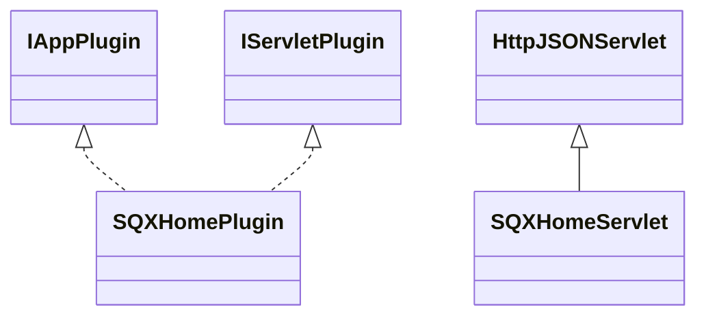

# AppSQXHome.jar

[Group index](README.md) | [All archives](../README.md)

## Scope and provenance

- **Donor:** `SQX_145_REFERENCE_ROOT/internal/plugins/AppSQXHome/AppSQXHome.jar`.
- **SHA-256:** `5bedd8ddbf4c457a5f9512d721092fa1f79cb16ac9d302cec46a055fb6339f52`; accessed 2026-10-06; captured `2026-10-06T18:54:51.906614+00:00`.
- **Classes:** 2 raw entries; 2 unique entry names. Duplicate occurrence indices are zero-based.
- **Inspection:** read-only ZIP hashing and class-file structural parsing; signatures/descriptors, modifiers, hierarchy and references only. Bytecode bodies are hashed, not published.
- **Allocation:** proposed `FEAT-PRODUCT-APP-SQX-HOME`, P17; [roadmap](../../dev/sqx-full-application-roadmap.md). Domain README registration remains required.
- **Repository:** `01067f00031428613c6394064ca1bcadc1ba00ee`; review state unreviewed. Download label 145-dev1; installed build/activation and runtime equivalence unverified.
- **Limit:** every class/member is inventoried; declaration coverage does not establish consumed calls, defaults, formulas, failure semantics or algorithm parity.
- **Archive/resource index:** [138.json](../../dev/evidence/sqx145/archives/145/138.json).

## Complete member declarations

Member shards contain exact JVM names/descriptors, access flags, generic signatures, throws types, declared fields/methods, superclass/interfaces and referenced class names. All classes, nested/synthetic members and overloads are retained. Code length/hash is structural evidence, not a normalized algorithm comparison.

- [001.json](../../dev/evidence/sqx145/members/138/001.json) — SHA-256 `a8f3232eb6c66cca53a47392bfd7717b511fcc3b8f46d1dbb4ee04e76755853f`.

## Focused structural diagram

Up to twelve non-nested classes; arrows show declared inheritance/interfaces only. External type names are not evidence of an available body or an executed dependency.

## Class inventory

| Archive entry | Occurrence | Class SHA-256 | Fields | Methods |
| --- | ---: | --- | ---: | ---: |
| `com/strategyquant/plugin/App/impl/SQXHome/SQXHomePlugin.class` | 0 | `ead8c9bca3545fa69fea255fc8ecac452866c8b042a1f93b6d47f3cae112b17c` | 2 | 13 |
| `com/strategyquant/plugin/App/impl/SQXHome/SQXHomeServlet.class` | 0 | `fc5910aa99c58b4a502b2a1c75d3ecc604750b96599ee11fa6a86dff8269cedb` | 1 | 3 |
