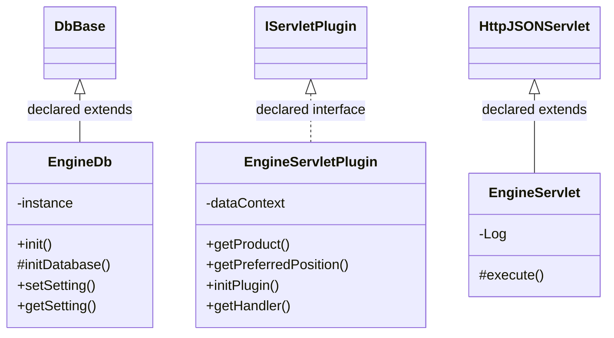

# EnginePanel.jar

[Workspace/group index](README.md)  |  [All workspaces](../README.md)

## Scope and provenance

- Artifact: `SQX_REFERENCE_ROOT/internal/plugins/EnginePanel/EnginePanel.jar`.
- SHA-256: `e10c17face0f953e75b3e36bdbc23c81941592665b0c7329eb9494bb1f2f45e1`.
- Inspected: 2026-10-05; generation timestamp `2026-10-05T19:04:16.344170+00:00`.
- Archive class entries: **4**; non-nested: **3**; nested/anonymous: **1**.
- Inspection: ZIP entry/manifest enumeration and `javap -p` declarations for every listed class.
- Repository source HEAD: `8a92c705183a6702eaf62037ccb202ed028aa899`; review state: generated, pending owner review.
- Installed SQX build number is unverified. No method bodies are reproduced.
- Confidence: high for declared structure; workspace ownership inferred except where registration evidence is separately stated. Runtime reachability, call order, formulas and parity remain unverified.

The `GridControl` folder is a navigation/research grouping, not an exclusive backend owner. Shared consumers may use this JAR.

Target mapping: no verified owning HaruQuantAI feature/requirement/decision IDs are assigned by this document. Register or resolve ownership through the normal repository plan before implementation.

## Diagram reading guide

`Parent <|-- Child` means declared inheritance; `Interface <|.. Class` means declared implementation. Interface extension uses the inheritance arrow. `A ..> B : field type` is a declared type dependency, not composition, object ownership or a runtime call. External nodes are referenced types, not fabricated local implementations. Selected fields/method names aid navigation: `+` is public, `#` protected and `-` private. Diagram method names omit parameter/return types and collapse overloads; use the exact inspected declarations below before implementing an API.

Detailed graphs include non-nested classes in package-sized groups of at most 12. Nested/anonymous classes are inventoried and their declarations/relationships are retained below, but omitted from overview graphs. Relationships not drawn for readability remain in the complete declaration-relationship table. Constructors, synthetic bridges and overloads may be collapsed in diagram member lists only. Standard `java.lang.Object` inheritance is omitted from diagrams.

## UML class diagrams

### 1. `com.strategyquant.plugin.Engine.impl.Panel`



| Diagram identifier | Exact type | Location |
| --- | --- | --- |
| `C0232d7b8bc0f` | `com.strategyquant.lib.db.DbBase` (not resolved in scoped archives) | referenced external type |
| `C675887102cfb` | `com.strategyquant.plugin.Engine.impl.Panel.EngineDb` (this JAR) | this diagram |
| `C885842583b8b` | `com.strategyquant.plugin.Engine.impl.Panel.EngineServlet` (this JAR) | this diagram |
| `Cc7d4e7ad62df` | `com.strategyquant.plugin.Engine.impl.Panel.EngineServletPlugin` (this JAR) | this diagram |
| `C249b5c671b1a` | [`com.strategyquant.tradinglib.servlet.IServletPlugin`](../Shared/SQTradingLib.md) | referenced external type |
| `C8900f90ae594` | [`com.strategyquant.webguilib.servlet.HttpJSONServlet`](../Shared/SQWebGUILib.md) | referenced external type |

## Complete class inventory

| Fully qualified class | Kind | Entry |
| --- | --- | --- |
| `com.strategyquant.plugin.Engine.impl.Panel.EngineDb` | class | non-nested |
| `com.strategyquant.plugin.Engine.impl.Panel.EngineServlet` | class | non-nested |
| `com.strategyquant.plugin.Engine.impl.Panel.EngineServlet$1` | class | nested/anonymous |
| `com.strategyquant.plugin.Engine.impl.Panel.EngineServletPlugin` | class | non-nested |

## Declared relationships and evidence locations

Every row is supported by the named class declaration/member in `javap -p`, inside the artifact recorded above. Signature dependencies may include return, parameter, generic-argument and throws types; they do not imply execution.

| Declaring class | Referenced type | Relationship | Narrow inspection location |
| --- | --- | --- | --- |
| `com.strategyquant.plugin.Engine.impl.Panel.EngineDb` | `com.strategyquant.lib.db.DbBase` (not resolved in scoped archives) | extends | `com.strategyquant.plugin.Engine.impl.Panel.EngineDb` / class declaration: `public class com.strategyquant.plugin.Engine.impl.Panel.EngineDb extends com.strategyquant.lib.db.DbBase` |
| `com.strategyquant.plugin.Engine.impl.Panel.EngineDb` | `java.lang.String` (not resolved in scoped archives) | type dependency | `com.strategyquant.plugin.Engine.impl.Panel.EngineDb` / method signature: `public static void init(java.lang.String);`<br>`private com.strategyquant.plugin.Engine.impl.Panel.EngineDb(java.lang.String);`<br>`public static void setSetting(java.lang.String, java.lang.String);`<br>`public static java.lang.String getSetting(java.lang.String, java.lang.String);`<br>`private void _setSetting(java.lang.String, java.lang.String);`<br>`private java.lang.String _getSetting(java.lang.String);` |
| `com.strategyquant.plugin.Engine.impl.Panel.EngineServlet` | [`com.strategyquant.webguilib.servlet.HttpJSONServlet`](../Shared/SQWebGUILib.md) | extends | `com.strategyquant.plugin.Engine.impl.Panel.EngineServlet` / class declaration: `public class com.strategyquant.plugin.Engine.impl.Panel.EngineServlet extends com.strategyquant.webguilib.servlet.HttpJSONServlet` |
| `com.strategyquant.plugin.Engine.impl.Panel.EngineServlet` | `org.slf4j.Logger` (not resolved in scoped archives) | type dependency | `com.strategyquant.plugin.Engine.impl.Panel.EngineServlet` / field declaration: `private static final org.slf4j.Logger Log;` |
| `com.strategyquant.plugin.Engine.impl.Panel.EngineServlet` | `java.lang.String` (not resolved in scoped archives) | type dependency | `com.strategyquant.plugin.Engine.impl.Panel.EngineServlet` / method signature: `protected java.lang.String execute(java.lang.String, java.util.Map<java.lang.String, java.lang.String[]>, java.lang.String) throws java.lang.Exception;`<br>`private java.lang.String onGetFitnessEvolutionStats(java.util.Map<java.lang.String, java.lang.String[]>);`<br>`private java.lang.String onLoadTextLog(java.util.Map<java.lang.String, java.lang.String[]>) throws java.lang.Exception;`<br>`private java.lang.String onLoadVisualLog(java.util.Map<java.lang.String, java.lang.String[]>) throws java.lang.Exception;`<br>`private java.lang.String onLoadSettings(java.util.Map<java.lang.String, java.lang.String[]>) throws java.lang.Exception;`<br>`private java.lang.String onSaveSettings(java.util.Map<java.lang.String, java.lang.String[]>) throws java.lang.Exception;`<br>`private java.lang.String onGetTypes(java.util.Map<java.lang.String, java.lang.String[]>) throws java.lang.Exception;`<br>`private org.json.JSONArray getSettings(java.lang.String) throws java.lang.Exception;`<br>`private java.lang.String getKey(java.lang.String, int);`<br>`private java.lang.String onSaveSelection(java.util.Map<java.lang.String, java.lang.String[]>) throws java.lang.Exception;`<br>`private java.lang.String onGetInfo(java.util.Map<java.lang.String, java.lang.String[]>) throws java.lang.Exception;`<br>`private java.lang.String onCleanupMemory(java.util.Map<java.lang.String, java.lang.String[]>) throws java.lang.Exception;`<br>`private java.lang.String onClearLog(java.util.Map<java.lang.String, java.lang.String[]>) throws java.lang.Exception;` |
| `com.strategyquant.plugin.Engine.impl.Panel.EngineServlet` | `java.util.Map` (not resolved in scoped archives) | type dependency | `com.strategyquant.plugin.Engine.impl.Panel.EngineServlet` / method signature: `protected java.lang.String execute(java.lang.String, java.util.Map<java.lang.String, java.lang.String[]>, java.lang.String) throws java.lang.Exception;`<br>`private java.lang.String onGetFitnessEvolutionStats(java.util.Map<java.lang.String, java.lang.String[]>);`<br>`private java.lang.String onLoadTextLog(java.util.Map<java.lang.String, java.lang.String[]>) throws java.lang.Exception;`<br>`private java.lang.String onLoadVisualLog(java.util.Map<java.lang.String, java.lang.String[]>) throws java.lang.Exception;`<br>`private java.lang.String onLoadSettings(java.util.Map<java.lang.String, java.lang.String[]>) throws java.lang.Exception;`<br>`private java.lang.String onSaveSettings(java.util.Map<java.lang.String, java.lang.String[]>) throws java.lang.Exception;`<br>`private java.lang.String onGetTypes(java.util.Map<java.lang.String, java.lang.String[]>) throws java.lang.Exception;`<br>`private java.lang.String onSaveSelection(java.util.Map<java.lang.String, java.lang.String[]>) throws java.lang.Exception;`<br>`private java.lang.String onGetInfo(java.util.Map<java.lang.String, java.lang.String[]>) throws java.lang.Exception;`<br>`private java.lang.String onCleanupMemory(java.util.Map<java.lang.String, java.lang.String[]>) throws java.lang.Exception;`<br>`private java.lang.String onClearLog(java.util.Map<java.lang.String, java.lang.String[]>) throws java.lang.Exception;` |
| `com.strategyquant.plugin.Engine.impl.Panel.EngineServlet` | `java.lang.Exception` (not resolved in scoped archives) | type dependency | `com.strategyquant.plugin.Engine.impl.Panel.EngineServlet` / method signature: `protected java.lang.String execute(java.lang.String, java.util.Map<java.lang.String, java.lang.String[]>, java.lang.String) throws java.lang.Exception;`<br>`private java.lang.String onLoadTextLog(java.util.Map<java.lang.String, java.lang.String[]>) throws java.lang.Exception;`<br>`private java.lang.String onLoadVisualLog(java.util.Map<java.lang.String, java.lang.String[]>) throws java.lang.Exception;`<br>`private java.lang.String onLoadSettings(java.util.Map<java.lang.String, java.lang.String[]>) throws java.lang.Exception;`<br>`private java.lang.String onSaveSettings(java.util.Map<java.lang.String, java.lang.String[]>) throws java.lang.Exception;`<br>`private java.lang.String onGetTypes(java.util.Map<java.lang.String, java.lang.String[]>) throws java.lang.Exception;`<br>`private org.json.JSONArray getSettings(java.lang.String) throws java.lang.Exception;`<br>`private java.lang.String onSaveSelection(java.util.Map<java.lang.String, java.lang.String[]>) throws java.lang.Exception;`<br>`private java.lang.String onGetInfo(java.util.Map<java.lang.String, java.lang.String[]>) throws java.lang.Exception;`<br>`private java.lang.String onCleanupMemory(java.util.Map<java.lang.String, java.lang.String[]>) throws java.lang.Exception;`<br>`private java.lang.String onClearLog(java.util.Map<java.lang.String, java.lang.String[]>) throws java.lang.Exception;` |
| `com.strategyquant.plugin.Engine.impl.Panel.EngineServlet` | `org.json.JSONArray` (not resolved in scoped archives) | type dependency | `com.strategyquant.plugin.Engine.impl.Panel.EngineServlet` / method signature: `private org.json.JSONArray getSettings(java.lang.String) throws java.lang.Exception;` |
| `com.strategyquant.plugin.Engine.impl.Panel.EngineServlet$1` | `java.lang.Thread` (not resolved in scoped archives) | extends | `com.strategyquant.plugin.Engine.impl.Panel.EngineServlet$1` / class declaration: `class com.strategyquant.plugin.Engine.impl.Panel.EngineServlet$1 extends java.lang.Thread` |
| `com.strategyquant.plugin.Engine.impl.Panel.EngineServlet$1` | `com.strategyquant.plugin.Engine.impl.Panel.EngineServlet` (this JAR) | type dependency | `com.strategyquant.plugin.Engine.impl.Panel.EngineServlet$1` / field declaration: `final com.strategyquant.plugin.Engine.impl.Panel.EngineServlet this$0;` |
| `com.strategyquant.plugin.Engine.impl.Panel.EngineServlet$1` | `com.strategyquant.plugin.Engine.impl.Panel.EngineServlet` (this JAR) | type dependency | `com.strategyquant.plugin.Engine.impl.Panel.EngineServlet$1` / method signature: `com.strategyquant.plugin.Engine.impl.Panel.EngineServlet$1(com.strategyquant.plugin.Engine.impl.Panel.EngineServlet);` |
| `com.strategyquant.plugin.Engine.impl.Panel.EngineServletPlugin` | [`com.strategyquant.tradinglib.servlet.IServletPlugin`](../Shared/SQTradingLib.md) | implements | `com.strategyquant.plugin.Engine.impl.Panel.EngineServletPlugin` / class declaration: `public class com.strategyquant.plugin.Engine.impl.Panel.EngineServletPlugin implements com.strategyquant.tradinglib.servlet.IServletPlugin` |
| `com.strategyquant.plugin.Engine.impl.Panel.EngineServletPlugin` | `org.eclipse.jetty.servlet.ServletContextHandler` (not resolved in scoped archives) | type dependency | `com.strategyquant.plugin.Engine.impl.Panel.EngineServletPlugin` / field declaration: `private org.eclipse.jetty.servlet.ServletContextHandler dataContext;` |
| `com.strategyquant.plugin.Engine.impl.Panel.EngineServletPlugin` | `java.lang.String` (not resolved in scoped archives) | type dependency | `com.strategyquant.plugin.Engine.impl.Panel.EngineServletPlugin` / method signature: `public java.lang.String getProduct();` |
| `com.strategyquant.plugin.Engine.impl.Panel.EngineServletPlugin` | `java.lang.Exception` (not resolved in scoped archives) | type dependency | `com.strategyquant.plugin.Engine.impl.Panel.EngineServletPlugin` / method signature: `public void initPlugin() throws java.lang.Exception;` |
| `com.strategyquant.plugin.Engine.impl.Panel.EngineServletPlugin` | `org.eclipse.jetty.server.Handler` (not resolved in scoped archives) | type dependency | `com.strategyquant.plugin.Engine.impl.Panel.EngineServletPlugin` / method signature: `public org.eclipse.jetty.server.Handler getHandler();` |

## Inspected declaration reference

These are structural API/member declarations, not proprietary implementation bodies. Private members and nested classes are retained to make diagram omissions explicit; declarations do not prove behavior.

<details>
<summary>com.strategyquant.plugin.Engine.impl.Panel.EngineDb</summary>

```text
public class com.strategyquant.plugin.Engine.impl.Panel.EngineDb extends com.strategyquant.lib.db.DbBase
    private static com.strategyquant.plugin.Engine.impl.Panel.EngineDb instance;
    public static void init(java.lang.String);
    private com.strategyquant.plugin.Engine.impl.Panel.EngineDb(java.lang.String);
    private static com.strategyquant.plugin.Engine.impl.Panel.EngineDb get();
    protected void initDatabase();
    public static void setSetting(java.lang.String, java.lang.String);
    public static java.lang.String getSetting(java.lang.String, java.lang.String);
    private void _setSetting(java.lang.String, java.lang.String);
    private java.lang.String _getSetting(java.lang.String);
```

</details>

<details>
<summary>com.strategyquant.plugin.Engine.impl.Panel.EngineServlet</summary>

```text
public class com.strategyquant.plugin.Engine.impl.Panel.EngineServlet extends com.strategyquant.webguilib.servlet.HttpJSONServlet
    private static final org.slf4j.Logger Log;
    public com.strategyquant.plugin.Engine.impl.Panel.EngineServlet();
    protected java.lang.String execute(java.lang.String, java.util.Map<java.lang.String, java.lang.String[]>, java.lang.String) throws java.lang.Exception;
    private java.lang.String onGetFitnessEvolutionStats(java.util.Map<java.lang.String, java.lang.String[]>);
    private java.lang.String onLoadTextLog(java.util.Map<java.lang.String, java.lang.String[]>) throws java.lang.Exception;
    private java.lang.String onLoadVisualLog(java.util.Map<java.lang.String, java.lang.String[]>) throws java.lang.Exception;
    private java.lang.String onLoadSettings(java.util.Map<java.lang.String, java.lang.String[]>) throws java.lang.Exception;
    private java.lang.String onSaveSettings(java.util.Map<java.lang.String, java.lang.String[]>) throws java.lang.Exception;
    private java.lang.String onGetTypes(java.util.Map<java.lang.String, java.lang.String[]>) throws java.lang.Exception;
    private org.json.JSONArray getSettings(java.lang.String) throws java.lang.Exception;
    private java.lang.String getKey(java.lang.String, int);
    private java.lang.String onSaveSelection(java.util.Map<java.lang.String, java.lang.String[]>) throws java.lang.Exception;
    private java.lang.String onGetInfo(java.util.Map<java.lang.String, java.lang.String[]>) throws java.lang.Exception;
    private java.lang.String onCleanupMemory(java.util.Map<java.lang.String, java.lang.String[]>) throws java.lang.Exception;
    private java.lang.String onClearLog(java.util.Map<java.lang.String, java.lang.String[]>) throws java.lang.Exception;
    private void generate();
    private void generateCharts();
    static void access$000(com.strategyquant.plugin.Engine.impl.Panel.EngineServlet);
```

</details>

<details>
<summary>com.strategyquant.plugin.Engine.impl.Panel.EngineServlet$1</summary>

```text
class com.strategyquant.plugin.Engine.impl.Panel.EngineServlet$1 extends java.lang.Thread
    final com.strategyquant.plugin.Engine.impl.Panel.EngineServlet this$0;
    com.strategyquant.plugin.Engine.impl.Panel.EngineServlet$1(com.strategyquant.plugin.Engine.impl.Panel.EngineServlet);
    public void run();
```

</details>

<details>
<summary>com.strategyquant.plugin.Engine.impl.Panel.EngineServletPlugin</summary>

```text
public class com.strategyquant.plugin.Engine.impl.Panel.EngineServletPlugin implements com.strategyquant.tradinglib.servlet.IServletPlugin
    private org.eclipse.jetty.servlet.ServletContextHandler dataContext;
    public com.strategyquant.plugin.Engine.impl.Panel.EngineServletPlugin();
    public java.lang.String getProduct();
    public int getPreferredPosition();
    public void initPlugin() throws java.lang.Exception;
    public org.eclipse.jetty.server.Handler getHandler();
```

</details>

## Validation and unresolved gaps

Archive hash and complete class inventory were checked against the inspected local artifact. Declaration extraction accounts for every inventoried class. Documentation/link/diagram structural verification is recorded in the master index and task walkthrough; no SQX runtime validation was performed.

The canonical reimplementation ledger/schema are absent, so no evidence IDs or validation-passed ledger claims are created. This is a donor structural reference. Exact behavior, default values, failure semantics, algorithms, runtime calls and target architectural choices require separate research. No aggregation/composition or cardinalities are inferred.
