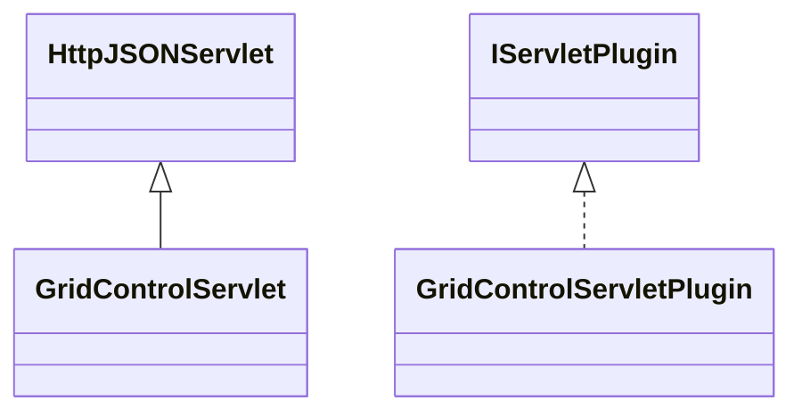

# ServletGridControl.jar

[Group index](README.md) | [All archives](../README.md)

## Scope and provenance

- **Donor:** `SQX_145_REFERENCE_ROOT/internal/plugins/ServletGridControl/ServletGridControl.jar`.
- **SHA-256:** `eb88c3bfc9a8fd1fc45f3556431d5161b48e3a23c29b23150adb02299d320f0d`; accessed 2026-10-06; captured `2026-10-06T18:54:51.906614+00:00`.
- **Classes:** 2 raw entries; 2 unique entry names. Duplicate occurrence indices are zero-based.
- **Inspection:** read-only ZIP hashing and class-file structural parsing; signatures/descriptors, modifiers, hierarchy and references only. Bytecode bodies are hashed, not published.
- **Allocation:** proposed `FEAT-COMPUTE-SERVLET-GRID-CONTROL`, P14; [roadmap](../../dev/sqx-full-application-roadmap.md). Domain README registration remains required.
- **Repository:** `01067f00031428613c6394064ca1bcadc1ba00ee`; review state unreviewed. Download label 145-dev1; installed build/activation and runtime equivalence unverified.
- **Limit:** every class/member is inventoried; declaration coverage does not establish consumed calls, defaults, formulas, failure semantics or algorithm parity.
- **Archive/resource index:** [233.json](../../dev/evidence/sqx145/archives/145/233.json).

## Complete member declarations

Member shards contain exact JVM names/descriptors, access flags, generic signatures, throws types, declared fields/methods, superclass/interfaces and referenced class names. All classes, nested/synthetic members and overloads are retained. Code length/hash is structural evidence, not a normalized algorithm comparison.

- [001.json](../../dev/evidence/sqx145/members/233/001.json) — SHA-256 `993aca217759f172bf2ba116e23688a660e1b2228286e0608ad50f49c518cdb6`.

## Focused structural diagram

Up to twelve non-nested classes; arrows show declared inheritance/interfaces only. External type names are not evidence of an available body or an executed dependency.

## Class inventory

| Archive entry | Occurrence | Class SHA-256 | Fields | Methods |
| --- | ---: | --- | ---: | ---: |
| `com/strategyquant/plugin/Servlet/impl/GridControl/GridControlServlet.class` | 0 | `1c73a33de3fd436de19622c99e3c8bc0425ac212decfab79e02e0084fc6fa637` | 1 | 4 |
| `com/strategyquant/plugin/Servlet/impl/GridControl/GridControlServletPlugin.class` | 0 | `398191dcebd9bc655682c81d857d612d4d3a4fa710b0241722e21b850c4af0dd` | 1 | 5 |
