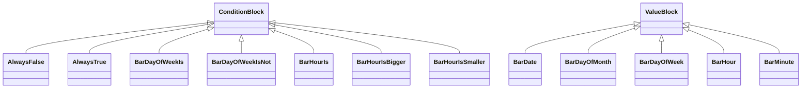

# Snippets.jar

[Group index](README.md) | [All archives](../README.md)

## Scope and provenance

- **Donor:** `SQX_145_REFERENCE_ROOT/internal/libs/Snippets.jar`.
- **SHA-256:** `6815d5acd6e411d078a423f80b605940e2778736d901cade987ea3f421d52924`; accessed 2026-10-06; captured `2026-10-06T18:54:51.906614+00:00`.
- **Classes:** 1069 raw entries; 1069 unique entry names. Duplicate occurrence indices are zero-based.
- **Inspection:** read-only ZIP hashing and class-file structural parsing; signatures/descriptors, modifiers, hierarchy and references only. Bytecode bodies are hashed, not published.
- **Allocation:** proposed `FEAT-SHARED-SNIPPETS`, P05; [roadmap](../../dev/sqx-full-application-roadmap.md). Domain README registration remains required.
- **Repository:** `01067f00031428613c6394064ca1bcadc1ba00ee`; review state unreviewed. Download label 145-dev1; installed build/activation and runtime equivalence unverified.
- **Limit:** every class/member is inventoried; declaration coverage does not establish consumed calls, defaults, formulas, failure semantics or algorithm parity.
- **Archive/resource index:** [108.json](../../dev/evidence/sqx145/archives/145/108.json).

## Complete member declarations

Member shards contain exact JVM names/descriptors, access flags, generic signatures, throws types, declared fields/methods, superclass/interfaces and referenced class names. All classes, nested/synthetic members and overloads are retained. Code length/hash is structural evidence, not a normalized algorithm comparison.

- [001.json](../../dev/evidence/sqx145/members/108/001.json) — SHA-256 `23cfaa2c8a458d8522259e54127be360b316b07ab11e892dae5cf143efc3970f`.
- [002.json](../../dev/evidence/sqx145/members/108/002.json) — SHA-256 `b011d8a2c2655d51f1025bd88db2061a271e88024acb319e728f583f1165973c`.
- [003.json](../../dev/evidence/sqx145/members/108/003.json) — SHA-256 `88efe2b2331283c8e0bf4448265596c2c5d893e00cd6a445a28b6ad2043ebb0c`.
- [004.json](../../dev/evidence/sqx145/members/108/004.json) — SHA-256 `6a0f1ae89c9d17db0f42d85c605d31ba881bd8a8cd504db711acccff58b3099f`.
- [005.json](../../dev/evidence/sqx145/members/108/005.json) — SHA-256 `df18430d784430c2e5d6f4e7f4029158a465b35b1d0568962ea853e0f959def4`.
- [006.json](../../dev/evidence/sqx145/members/108/006.json) — SHA-256 `515bc591759659d87325680d6d3527122e0da679fc28c463fcc2be1ac711da8a`.
- [007.json](../../dev/evidence/sqx145/members/108/007.json) — SHA-256 `f57935b02f4b00015d8ca25f06dbf7f402ecb1f2b93900077ee4b721001ba18e`.
- [008.json](../../dev/evidence/sqx145/members/108/008.json) — SHA-256 `97b226922051b2ceb9f79e297fe9ca6cb0cb6ef37c9570f01c0afa7a7180186b`.
- [009.json](../../dev/evidence/sqx145/members/108/009.json) — SHA-256 `9ac60db8678788c02904b3a61338b0f9c76ee7dcb4dd7006a0fc2e7a30ec9d02`.
- [010.json](../../dev/evidence/sqx145/members/108/010.json) — SHA-256 `da9fcb8f84a4098d1cc4f07579b20eefdf56cadab9ba3e714344f54b1791c835`.
- [011.json](../../dev/evidence/sqx145/members/108/011.json) — SHA-256 `5c32006d250840ff532e54d6674ca1d39e76c889185984e9096830eb1f25239c`.
- [012.json](../../dev/evidence/sqx145/members/108/012.json) — SHA-256 `cc6cb46fb6750b2ec7332a1bda5124b5ccdb47c4659782348f90afc890a21aaf`.
- [013.json](../../dev/evidence/sqx145/members/108/013.json) — SHA-256 `18ec188dab821b241dac10f90630c0849c02d19f4b7bb8e2721f7f2a97e7f108`.
- [014.json](../../dev/evidence/sqx145/members/108/014.json) — SHA-256 `01f41dbdfe82b7d52ae030641899a63d2e0b1541c6160ecf6dfb88a1efb8036b`.

## Focused structural diagram

Up to twelve non-nested classes; arrows show declared inheritance/interfaces only. External type names are not evidence of an available body or an executed dependency.

## Class inventory

| Archive entry | Occurrence | Class SHA-256 | Fields | Methods |
| --- | ---: | --- | ---: | ---: |
| `SQ/Blocks/BarAndTime/AlwaysFalse.class` | 0 | `5972da854ffcc6829a4142943998d8d490b688d539195eff7fee727c21c94842` | 0 | 2 |
| `SQ/Blocks/BarAndTime/AlwaysTrue.class` | 0 | `b94c2606bbf3c6dbf313b38366da494176a6dbb00d80cb870bffa9ceaf6f7976` | 0 | 2 |
| `SQ/Blocks/BarAndTime/BarDate.class` | 0 | `443bf4f98324258c20470706e3356f7d83e93aa5f09adc45c84499759289ed88` | 2 | 2 |
| `SQ/Blocks/BarAndTime/BarDayOfMonth.class` | 0 | `296053eff72806e14827971a556557e566e010e0a28b95d31fb7441e760575df` | 2 | 2 |
| `SQ/Blocks/BarAndTime/BarDayOfWeek.class` | 0 | `576bdd3fead70b550a06bee0d10345ab97d1063ffa1b6b5c3e4089624c2db164` | 2 | 2 |
| `SQ/Blocks/BarAndTime/BarDayOfWeekIs.class` | 0 | `51f892b387ecd2a073bf935745031cfc8240ea94e9b364d4bcbc07d05306846f` | 3 | 2 |
| `SQ/Blocks/BarAndTime/BarDayOfWeekIsNot.class` | 0 | `95429420f7bee3c18e98bd6a9dee2c1c8b8bb49b10c933a2dccc6ebfafe83841` | 3 | 2 |
| `SQ/Blocks/BarAndTime/BarHour.class` | 0 | `126c1155c4c75bf570f60eeea65330c347f66a86ef4fc7b80758fea549dd4fcf` | 2 | 2 |
| `SQ/Blocks/BarAndTime/BarHourIs.class` | 0 | `f4b64d23b281178f48d4719e1a0fa7438002e8998108827c203e186b86599a6e` | 3 | 2 |
| `SQ/Blocks/BarAndTime/BarHourIsBigger.class` | 0 | `5476d3c55ba76558edc8cc27db45f2c29ca99c3830293ee1fa6c87a22293a534` | 3 | 2 |
| `SQ/Blocks/BarAndTime/BarHourIsSmaller.class` | 0 | `9f9f979866e12304ea16ba71da666137bee12f0052ad40485a7dcdd70861b11d` | 3 | 2 |
| `SQ/Blocks/BarAndTime/BarMinute.class` | 0 | `38bd0bb4c01b5dd6428dfa7f72207275f27ea3699ede8eb1f22502c855d13f5e` | 2 | 2 |
| `SQ/Blocks/BarAndTime/BarMinuteIs.class` | 0 | `ca84ec78a3adab695ff825eb1f592da8e2393df3575df3e10f02b53490199c9c` | 3 | 2 |
| `SQ/Blocks/BarAndTime/BarMonth.class` | 0 | `ea4b3d1e983184eb79ee041fb6879e8bd5210095e628a0a9e3a8129ec71d1d48` | 2 | 2 |
| `SQ/Blocks/BarAndTime/BarMonthIs.class` | 0 | `c7a2dea91c4fd45bb94769daa62cfccbf8909524b7eca360e6b4ae9f9afd6245` | 3 | 2 |
| `SQ/Blocks/BarAndTime/BarMonthIsNot.class` | 0 | `c27e6d5bbfe72019ccaac88508b1588d093f36742ba7a48ccdd9c07c02505473` | 3 | 2 |
| `SQ/Blocks/BarAndTime/BarTime.class` | 0 | `6560786d1d7a275525a3e87204a3585fa5a4020bc8a5baafbbd77f66d9812da3` | 2 | 2 |
| `SQ/Blocks/BarAndTime/BarTimeIs.class` | 0 | `94f6bf6794fdb931a58e812f6a9d2fb4e44ad11b96747187aba4261f9b7a7084` | 4 | 2 |
| `SQ/Blocks/BarAndTime/BarWeekOfMonth.class` | 0 | `4cbeaad76d8f30daf8cbae92a7347ac36f72f577ab6a717e472d31d549cd7b3f` | 2 | 2 |
| `SQ/Blocks/BarAndTime/CurrentBar.class` | 0 | `0ebce2b0901668d711139bdc1e6ca766bfedb5c909cf479d9e1b460e4a34417e` | 1 | 2 |
| `SQ/Blocks/BarAndTime/CurrentDate.class` | 0 | `c3672bfe5697f61181eea830308b8180f71cb459d465397098bcc0d2891fb1ca` | 0 | 2 |
| `SQ/Blocks/BarAndTime/CurrentDayOfWeek.class` | 0 | `af0fcaf65dd1fd54edd24d165f3240de0a44fbd2ae777603ebb3ba73871c4918` | 0 | 2 |
| `SQ/Blocks/BarAndTime/CurrentDayOfWeekIs.class` | 0 | `6a1036f80891dd534d19caf1dc8b1cdf18aef15290692b114e244e0bebbadc83` | 1 | 2 |
| `SQ/Blocks/BarAndTime/CurrentHour.class` | 0 | `0240158e2c53645afc558cfe102c4ebe50d2a78b4a7718ca511e1937f7e3cd96` | 0 | 2 |
| `SQ/Blocks/BarAndTime/CurrentHourIs.class` | 0 | `6eadc8c35c30200803f9dae5074de8e34e15764e1f5b9edbd80428c412344043` | 1 | 2 |
| `SQ/Blocks/BarAndTime/CurrentMinute.class` | 0 | `7de7b18fb54cbe473583c277c99cd5304ba5665272834fb6bd91ae57351cbe44` | 0 | 2 |
| `SQ/Blocks/BarAndTime/CurrentMinuteIs.class` | 0 | `928d2c9c20a80449982d26423d0ecb0690d4673feb6fa83d34e1a0bb81a8373f` | 1 | 2 |
| `SQ/Blocks/BarAndTime/CurrentMonth.class` | 0 | `de24b35e760eb3e037f3082bcde97c7ee9b8b949b7aabc8778c365512b460486` | 0 | 2 |
| `SQ/Blocks/BarAndTime/CurrentMonthIs.class` | 0 | `6579131a83fadf867a1be88558b8eb9cdaa6560c01ea15936c1c7beca1e9fe6c` | 1 | 2 |
| `SQ/Blocks/BarAndTime/CurrentTime.class` | 0 | `e8dca4e26366f814e67dcc1221ed1d158fceb3ad20377d63577e43a7d4762b53` | 0 | 2 |
| `SQ/Blocks/BarAndTime/CurrentTimeIs.class` | 0 | `f6c6d81a8d15401ae0fdd2d394755d4b8db8aa30a27bf4fcf0a3c55cc14f9862` | 2 | 2 |
| `SQ/Blocks/BarAndTime/CurrentWeekOfMonth.class` | 0 | `29313daa7d22f4aa53450d41589152856ee8446e809ffc2e42a462ed311c903a` | 0 | 2 |
| `SQ/Blocks/BarAndTime/FirstWeekOfMonth.class` | 0 | `9b07a66eaf37d1f0a70cf8743094f8f9c26b48ec3d492eca50dbf6e7e1603014` | 1 | 2 |
| `SQ/Blocks/BarAndTime/IsBarOpen.class` | 0 | `d8eb31b84be74a0b4f8a341132c63b0fc3b83490d3ee54fb390726299c696465` | 0 | 2 |
| `SQ/Blocks/BarAndTime/IsMonthFirstTradingDay.class` | 0 | `432f41e0b245da9f622fd3843e45d33405c477addcc35d7c1398f423d9602e1c` | 3 | 2 |
| `SQ/Blocks/BarAndTime/IsMonthLastTradingDay.class` | 0 | `cde1bc6635dfb2e59049f0e4f22961d7b971ac3a2efd4989973acf1f77bfa824` | 2 | 2 |
| `SQ/Blocks/BarAndTime/LastWeekOfMonth.class` | 0 | `7b6824d21ff67e7b7d3eadc1b9247512d8fd07dfadff05790975917816a1ccac` | 1 | 2 |
| `SQ/Blocks/CandlePatterns/BearishEngulfing.class` | 0 | `d05abcd4d2c98d3287f9b3b22526d579ef1577d71e863be283184f0cf3582b5b` | 2 | 2 |
| `SQ/Blocks/CandlePatterns/BullishEngulfing.class` | 0 | `1d7a4998f5e6de86361cbbb72d0f1b4cbb4cf342fca511f553ca8755efabd0c5` | 2 | 2 |
| `SQ/Blocks/CandlePatterns/DarkCloud.class` | 0 | `b8144111d95b97440733a3951e1b9d414528eb0d2530c5b19beb26785e05fc2d` | 2 | 2 |
| `SQ/Blocks/CandlePatterns/Doji.class` | 0 | `531db99145a64e56922c75eb6753a061e09c71ef451efa864c8336acd0e7ac92` | 2 | 2 |
| `SQ/Blocks/CandlePatterns/Hammer.class` | 0 | `9225e4ba3909ff3e081677af72a30072f6ac67b505c01a4dd4be093adc7e5c20` | 2 | 2 |
| `SQ/Blocks/CandlePatterns/PiercingLine.class` | 0 | `25ae9f06ce0da26ce3995389c539f28def75f2da7bb48cd421031af3b0e177a5` | 2 | 2 |
| `SQ/Blocks/CandlePatterns/ShootingStar.class` | 0 | `4060b6f792dd9e8b4b10858165599373d40e1f472f578446c0bd0de803148806` | 2 | 2 |
| `SQ/Blocks/Comparisons/AND.class` | 0 | `b86bd9d8da7102f4de03c6abf73f184a9741833c738c82e1bbfe0995e482f9b7` | 1 | 2 |
| `SQ/Blocks/Comparisons/CountComparisonBlockAbstract.class` | 0 | `18eea4e1f36c7a1c78b7f850547dcf50237a3a94130ac84db85d30a5ae3b0abb` | 5 | 1 |
| `SQ/Blocks/Comparisons/CountComparisonBlockAbstractPercentile.class` | 0 | `c97de3773431d5bd5701f19ea8928858a9683bcb1e39e0c4bef6355fcb96f0dc` | 4 | 1 |
| `SQ/Blocks/Comparisons/CrossesAbove.class` | 0 | `89849d2735c6c84554f8ba5ef5187132b97777acfda1046269d5845c6cc8b1ec` | 0 | 2 |
| `SQ/Blocks/Comparisons/CrossesBelow.class` | 0 | `a59f727eb58ef69090cabdd14d2582859325591d34e0865427c0f5bb63e0a12a` | 0 | 2 |
| `SQ/Blocks/Comparisons/Equals.class` | 0 | `843bc57a49a7f04373d0857f02a5e94af7c09157ef0969057b757054905d3711` | 0 | 2 |
| `SQ/Blocks/Comparisons/IndicatorAboveMA.class` | 0 | `9548dc908bdb1768aabc0e26815a343b0f46b9da88f93fe25d5c4565dcd9ccfe` | 0 | 2 |
| `SQ/Blocks/Comparisons/IndicatorBelowMA.class` | 0 | `8a21a5e55be7f5079d809518e4405cb2ec969be15268ef18b3bd079d1a2ad7fc` | 0 | 2 |
| `SQ/Blocks/Comparisons/IndicatorCrossesAboveMA.class` | 0 | `1b680e0c5cf9ba65b34c49b156464f1964c64020ecc7b8bdd8ec5d7934318e10` | 0 | 2 |
| `SQ/Blocks/Comparisons/IndicatorCrossesBelowMA.class` | 0 | `8133f85e70887bbfac55426c8838fd194628d08d3351f7e5932cacfa29c0ca46` | 0 | 2 |
| `SQ/Blocks/Comparisons/IndicatorMAComparisonBlockAbstract.class` | 0 | `b66d4839fe4ce7f2113fa914c8c723df27aae94215b3d7ba8f87cea8ddb86938` | 4 | 3 |
| `SQ/Blocks/Comparisons/IsFalling.class` | 0 | `2b2f5b4d79005b46fbbbe159d70230e71be17ba9dc3df95d983a0ea90f6574e7` | 2 | 2 |
| `SQ/Blocks/Comparisons/IsGreater.class` | 0 | `96d7ddeb4725dfdd36e6310a85f35c93e9256d42092386be036ad397b9bb4335` | 0 | 2 |
| `SQ/Blocks/Comparisons/IsGreaterCount.class` | 0 | `b8bc29b46af7f92b5e15a17f29dc9a6202de9fde91fb18fc544ee635fb9d06c4` | 0 | 2 |
| `SQ/Blocks/Comparisons/IsGreaterOrEqual.class` | 0 | `40b4d4ac3bee78e1cb7171457b0f68de8b01bee13d853c36f9eb796c56cdd945` | 0 | 2 |
| `SQ/Blocks/Comparisons/IsGreaterPercentil.class` | 0 | `5693bb3a7591fe503dc0b517ed59136bc376f4a22cf566402f98ba8009bbc523` | 0 | 2 |
| `SQ/Blocks/Comparisons/IsLower.class` | 0 | `a31ab682687bec12dcb7d706734535103a5d6b5dc7b260ed61cd0371cf315086` | 0 | 2 |
| `SQ/Blocks/Comparisons/IsLowerCount.class` | 0 | `f78d427ab9d79a3049908f0036886aafb219aaaab4ce5b7cca09263ccfa5cc0d` | 0 | 2 |
| `SQ/Blocks/Comparisons/IsLowerOrEqual.class` | 0 | `34ef5bb2dec7c0e79643f34a8cbbe1f0f57f805390c7e6f94f72d47c8cd4b83b` | 0 | 2 |
| `SQ/Blocks/Comparisons/IsLowerPercentil.class` | 0 | `59303dd4f2323c9326b0af6046fb52c863393cc7340e2720359a411b03c108be` | 0 | 2 |
| `SQ/Blocks/Comparisons/IsOneComparisonBlockAbstract.class` | 0 | `b23a3e0a9c169203e673df64a2ca89b205c406b30130430baa2552850e0a8a12` | 2 | 1 |
| `SQ/Blocks/Comparisons/IsOneComparisonBlockAbstractPercentil.class` | 0 | `a830e98f8db98b7db6407b622012870812365ecfd506ffc01566094ec4f15e33` | 4 | 1 |
| `SQ/Blocks/Comparisons/IsRising.class` | 0 | `ed9f9e1d4991ea3582e822febc7f8b09b11a16eaa03bde37f98b430786eea14e` | 2 | 2 |
| `SQ/Blocks/Comparisons/LeftRightComparisonBlockAbstract.class` | 0 | `25ee49b5b721ede33624aea89722d59a8f41e4718dc9421177a6f7e2f2569c63` | 2 | 1 |
| `SQ/Blocks/Comparisons/Not.class` | 0 | `01e5e417ca01d5632c0b02e30eca72f406bac0c822ccbdd34d0d652de47197e5` | 1 | 2 |
| `SQ/Blocks/Comparisons/NotEquals.class` | 0 | `386150eca4304d79564aa477ed4ec4d6a1df11987f89155d3e51a457089e2734` | 0 | 2 |
| `SQ/Blocks/Comparisons/OR.class` | 0 | `97a58433f9a9718f29c5e5181dfde96260e875d8038df0530a2bf9cefda2a5df` | 1 | 2 |
| `SQ/Blocks/Functions/Abs.class` | 0 | `d32314aaeb4562cc525657febb529c978a594408500274d4745abdd15adcff4b` | 1 | 2 |
| `SQ/Blocks/Functions/ConvertToPips.class` | 0 | `24f76f0f86b82f08a6df58cde321a0d7cd63bf03f63ef528d5da7809cff5bed8` | 2 | 2 |
| `SQ/Blocks/Functions/ConvertToRealPips.class` | 0 | `60a3e8fbd5b1d0412762bb7709f2759520ea62d8c1c03b8c91b552441d7819b1` | 2 | 2 |
| `SQ/Blocks/Functions/CustomFunction.class` | 0 | `2a0263d187916fed1766c1f785acd9e00d63be0d27f04eb6b9ed2fb8640132e5` | 1 | 2 |
| `SQ/Blocks/Functions/Division.class` | 0 | `74c8e22fd31b7c55ec9272351d9e20b0cd5c10a7be129ad1a0705d27ab2503db` | 2 | 2 |
| `SQ/Blocks/Functions/Exponential.class` | 0 | `807929dc3313ea253f9d4b7fdb10e0268eefcc8caf762a459a52b392273d179d` | 1 | 2 |
| `SQ/Blocks/Functions/GetDate.class` | 0 | `d06d35b004751b27f631359ffe58b3e1175f1d0cfb3df16549afe160f54c24ac` | 3 | 2 |
| `SQ/Blocks/Functions/GetTime.class` | 0 | `e286712c7a4739c9a52bc38a28b4980d97059f18d9db3d31426ff9b21358fd28` | 3 | 2 |
| `SQ/Blocks/Functions/IndicatorHighest.class` | 0 | `68f67b8b01e87d0ac0bac479ab28d061172b1e38cc00a580cac4adc98f465a40` | 4 | 2 |
| `SQ/Blocks/Functions/IndicatorLowest.class` | 0 | `799bacf5e671c66a75ba944e23042b6c494367bf830a8874446f1e37c391ce2a` | 4 | 2 |
| `SQ/Blocks/Functions/Logarithm.class` | 0 | `71ffadd2117cbfc35943f8609685b3a0b60c14b95af887bf4cfa86a78d4178cd` | 1 | 2 |
| `SQ/Blocks/Functions/Maximum.class` | 0 | `86e9e0453f30a278eeab93803c498421901376d1f7be060076464c617555a397` | 2 | 2 |
| `SQ/Blocks/Functions/Minimum.class` | 0 | `8db36879edb1179c7de070aa5abb1e80580966d579778ce0d5e3ad440268ecc0` | 2 | 2 |
| `SQ/Blocks/Functions/Minus.class` | 0 | `ae19c2477aa594a12f017393353ae3f818ab68fc443e996b3e3b621904c2fba1` | 2 | 2 |
| `SQ/Blocks/Functions/Multiplication.class` | 0 | `ac89b053f5f570f749f59b3bb7a3c2ad0debdbe27aec6e1742296c4be2c61e8c` | 2 | 2 |
| `SQ/Blocks/Functions/Plus.class` | 0 | `4ad7334af03a54575ab5f4a675a3b31b850366d1e562d8ced8191d732130570c` | 2 | 2 |
| `SQ/Blocks/Functions/Round.class` | 0 | `62a85ab085c1944e6d8e00c7f6d2eb1c58134ebafef20bfa4f835b12d6bd311b` | 2 | 2 |
| `SQ/Blocks/Functions/SquareRoot.class` | 0 | `4a6589261d872d1b3f1b73e67c3522f2a701b987022fcbc85634c1fcf6d5d7ab` | 1 | 2 |
| `SQ/Blocks/Indicators/ADX/ADX.class` | 0 | `b771006a258fcd935d4fcde2425c3e054743e6758d5f9344182903870b5f5679` | 8 | 4 |
| `SQ/Blocks/Indicators/ADX/ADXChangesDown.class` | 0 | `b9cb48d47c99ee8378b8ef05b86a3b5dc2896ac914b43adc6769cbce933dbf10` | 3 | 2 |
| `SQ/Blocks/Indicators/ADX/ADXChangesUp.class` | 0 | `6f4f36da79745e7016a3886b649b201abd2e0c589d6b79145499c69bc981b1d8` | 3 | 2 |
| `SQ/Blocks/Indicators/ADX/ADXCrossDown.class` | 0 | `b0d8bf45a5ef15f1cc38531480af39657c1ffaf12df64dce50493d49ec08b8d7` | 4 | 2 |
| `SQ/Blocks/Indicators/ADX/ADXCrossUp.class` | 0 | `db2025eecf2e12403e5e97d64bb0e22132fdbbf1c8c7aab3ab71291ee7a00802` | 4 | 2 |
| `SQ/Blocks/Indicators/ADX/ADXFalling.class` | 0 | `d7402368091a3340f17d306eb363a8d8fc80d366c135d01bc21f9d1c54544baa` | 3 | 2 |
| `SQ/Blocks/Indicators/ADX/ADXHigher.class` | 0 | `986cdfeba1092953f6d5f12998af747306bd8e0751b67f203e598c4b8579c940` | 4 | 2 |
| `SQ/Blocks/Indicators/ADX/ADXLower.class` | 0 | `bbcbcc4307b8b42980253f5b1d985e98e4d9782dbafa1ab9a4aa36a239dbed6e` | 4 | 2 |
| `SQ/Blocks/Indicators/ADX/ADXRising.class` | 0 | `322cf41c98fe83864bbc431c460af5e7b84e28a940952dc2a54655ac6b2facaf` | 3 | 2 |
| `SQ/Blocks/Indicators/AnchoredVWAP/AnchoredVWAP.class` | 0 | `ef4a0d126a533fa24f4eebef9ee9d40f9942fea670b0dec4ae219822b22213df` | 10 | 3 |
| `SQ/Blocks/Indicators/AnchoredVWAP/AnchoredVWAPFalling.class` | 0 | `b3250cd37c202baa285ac99146ef03a39d3e225b25ab7a7fdd8147791a27dfce` | 4 | 2 |
| `SQ/Blocks/Indicators/AnchoredVWAP/AnchoredVWAPRising.class` | 0 | `f64ffa5fbd4276c979fa68f15be165748b7cf4745277709c0adf6b5793e1f36e` | 4 | 2 |
| `SQ/Blocks/Indicators/AnchoredVWAP/AVWAPCloseAboveAnchoredVWAP.class` | 0 | `53fa77a5ea765bcb97218a86ebf2d4fa58f1671922b8250453be6fc6e6dc517a` | 4 | 2 |
| `SQ/Blocks/Indicators/AnchoredVWAP/AVWAPCloseAboveAnchoredVWAPUpper.class` | 0 | `7c6f8144540b49ef498d8161c8841dac91aa10ac36ee6f6f0f005f6679acb70a` | 4 | 2 |
| `SQ/Blocks/Indicators/AnchoredVWAP/AVWAPCloseBelowAnchoredVWAP.class` | 0 | `6ef3b423faa5c4d636d54a844af59c5926fec4fc121b312aea165a42c8be7602` | 4 | 2 |
| `SQ/Blocks/Indicators/AnchoredVWAP/AVWAPCloseBelowAnchoredVWAPLower.class` | 0 | `466aea5875c03bd01e3f6795ddc7cb072d80df2c96fbbbaa8dc6b527530f8f43` | 4 | 2 |
| `SQ/Blocks/Indicators/AnchoredVWAP/AVWAPCloseCrossesAboveAnchoredVWAPLower.class` | 0 | `a46febdf895f0e97ff3160bebfda82ac759ad61dd8c43089633e844d3c2084d9` | 4 | 2 |
| `SQ/Blocks/Indicators/AnchoredVWAP/AVWAPCloseCrossesAboveAnchoredVWAPUpper.class` | 0 | `25285a9f000ec3e7d4c52c9714894078a8ad502ff524e895124f329e91821de8` | 4 | 2 |
| `SQ/Blocks/Indicators/AnchoredVWAP/AVWAPCloseCrossesBelowAnchoredVWAPLower.class` | 0 | `05eed4d440c59666e370c770780250fc6d5eb6d4ab10c2da0e86ca2462a9fc31` | 4 | 2 |
| `SQ/Blocks/Indicators/AnchoredVWAP/AVWAPCloseCrossesBelowAnchoredVWAPUpper.class` | 0 | `92ac449e023461f43ea9a66ec75307c6cc0ea47624c51c059761afdd687de34d` | 4 | 2 |
| `SQ/Blocks/Indicators/AnchoredVWAP/AVWAPFastAnchoredVWAPAboveSlowAnchoredVWAP.class` | 0 | `b2a2d2469ad763abb1cc60e0c8f96fc6adb553974f40f5b0c2d5867a58c469f9` | 6 | 2 |
| `SQ/Blocks/Indicators/AnchoredVWAP/AVWAPFastAnchoredVWAPBelowSlowAnchoredVWAP.class` | 0 | `34473ccd35c9592342f0ecec469c99bd153963ae1a4b58608367b57e4958755a` | 6 | 2 |
| `SQ/Blocks/Indicators/Aroon/Aroon.class` | 0 | `01333d12b8149d2fc23092ee85f3e428d4945534cb2231ce919e5cb09513c28b` | 6 | 3 |
| `SQ/Blocks/Indicators/Aroon/AroonCrossesAbove.class` | 0 | `aed6f3e9b17f25287562283e293a70f58cb68ab280f54ae179b788861bdfc8ae` | 3 | 2 |
| `SQ/Blocks/Indicators/Aroon/AroonCrossesBelow.class` | 0 | `3acbe0898cd20aa0055606b4d97cbe8ff078d3c446d6c9a3f120c5ee2fed6c59` | 3 | 2 |
| `SQ/Blocks/Indicators/Aroon/AroonDownRiseFromBottom.class` | 0 | `aa74f03ec30fe210b331841ac3f2d09f7145f60b459cba1dfd0d4ae19e3eed64` | 3 | 2 |
| `SQ/Blocks/Indicators/Aroon/AroonFallFromTop.class` | 0 | `883f7c2d2252458d7dbda460c38b1e00bcf43d8c363a79f307ff5fe5f9a2dba6` | 3 | 2 |
| `SQ/Blocks/Indicators/Aroon/AroonRiseFromBottom.class` | 0 | `c185235ea2cc1d971c259cc19bf0770afb711f9ba5711284cd040f9fd62ca669` | 3 | 2 |
| `SQ/Blocks/Indicators/Aroon/AroonUpFallFromTop.class` | 0 | `7fb61b0a323d3068b353bbefc98d32529366bb2f025ab6489747bf24dba1c7a3` | 3 | 2 |
| `SQ/Blocks/Indicators/ATR/ATR.class` | 0 | `321c0a1f2b580df812b67ae519f8fed200a0ef220ff4ae4b56402885feea1ea2` | 3 | 2 |
| `SQ/Blocks/Indicators/ATR/ATRChangesDown.class` | 0 | `261fe832fab850ed8b7244cc06b4773e6d0dd89e0a5db955bb33bc90b550c170` | 3 | 2 |
| `SQ/Blocks/Indicators/ATR/ATRChangesUp.class` | 0 | `d2cf7309676d4e2678393afb0d0c2dadfa65c316d7187edcead6d04e26548fc2` | 3 | 2 |
| `SQ/Blocks/Indicators/ATR/ATRCrossDown.class` | 0 | `8968cbbdc8d4c0be2720887e9e4f0a0f126d1b294368811fd24db566d630e5c3` | 4 | 2 |
| `SQ/Blocks/Indicators/ATR/ATRCrossUp.class` | 0 | `170e5332d11fa8b746d8e03e31cd19ea941a65d73a89f884431b0fb7c3cb4ca2` | 4 | 2 |
| `SQ/Blocks/Indicators/ATR/ATRFalling.class` | 0 | `6f0f879d533feeb3407c839861d5f0eb7382d4346fc83845d64eb4cf632a74d1` | 3 | 2 |
| `SQ/Blocks/Indicators/ATR/ATRHigher.class` | 0 | `c125946e7e34ff96419017f1882f86f87363c70f286669e25b22b7356ea498d6` | 4 | 2 |
| `SQ/Blocks/Indicators/ATR/ATRLower.class` | 0 | `dae121e1c23a8f7b7de92d28ca8c5e68d820dc5388ffb46bc6cfb162bfc4b507` | 4 | 2 |
| `SQ/Blocks/Indicators/ATR/ATRRising.class` | 0 | `6fefaa812dfa3fc3e812e94aac6c6118707c49d33b4eaaab772eec23ad573db5` | 3 | 2 |
| `SQ/Blocks/Indicators/AvgVolume/AvgVolume.class` | 0 | `570a53c30866aacbc629ab6032d5e263d5dd6164007691cc46a73bea5424ff1e` | 4 | 3 |
| `SQ/Blocks/Indicators/AvgVolume/AvgVolumeFalling.class` | 0 | `9b8a158202035410cd3f13a52615442c78c7284cdf6c014a0fec2a577dc9ae4a` | 3 | 2 |
| `SQ/Blocks/Indicators/AvgVolume/AvgVolumeRising.class` | 0 | `97a7b1df4022f78f77fca5264bb654fe04d3d7e19425662efbce1928689ef887` | 3 | 2 |
| `SQ/Blocks/Indicators/AvgVolume/VolumeFalling.class` | 0 | `56c0dff9d114f55d0483e932b7d0c0fe003438518fc367f69d37fb8e6d3cc1e5` | 2 | 2 |
| `SQ/Blocks/Indicators/AvgVolume/VolumeRising.class` | 0 | `3e10861462c63160f9009d3f904307548062d51c9b9bfe7cc9348c42901fb441` | 2 | 2 |
| `SQ/Blocks/Indicators/AwesomeOscillator/AwesomeOscillator.class` | 0 | `b74c26f3d17acbbb6bf9b773fdec51d3677f4c04287e37979ad616a93bde6ad1` | 6 | 3 |
| `SQ/Blocks/Indicators/AwesomeOscillator/AWOChangesDown.class` | 0 | `284bb6e6872fe00626f857f24e90b47616351a61fb5e9c366f72c3b7d2d0de76` | 2 | 2 |
| `SQ/Blocks/Indicators/AwesomeOscillator/AWOChangesUp.class` | 0 | `efb78ccffd88eec66d2a2a64551eb1ce7dad8b6bd44e26fe9a751da32584e4fe` | 2 | 2 |
| `SQ/Blocks/Indicators/AwesomeOscillator/AWOCrossDown.class` | 0 | `a4bc8533044808169131dc8d32dcf2e492128413cedc721c9e8afb9d2f957275` | 3 | 2 |
| `SQ/Blocks/Indicators/AwesomeOscillator/AWOCrossUp.class` | 0 | `d1ca74733e9997cc0b0e3610d987bd27c30254e2e185e14abd5cf3a2a0fa6441` | 3 | 2 |
| `SQ/Blocks/Indicators/AwesomeOscillator/AWOFalling.class` | 0 | `e64e86538d9da81b4c4d64bcbe87f52776e3926164a33bf7f516fd47ade863fb` | 2 | 2 |
| `SQ/Blocks/Indicators/AwesomeOscillator/AWOHigher.class` | 0 | `1330fac506fb9ed745198edc1a8bd0d1148ec68b71395c1c0074dfb7174839f2` | 3 | 2 |
| `SQ/Blocks/Indicators/AwesomeOscillator/AWOLower.class` | 0 | `5d79babc9cb9e4d7902dae0152e70f589241d611bbfa18998274be194c4d5091` | 3 | 2 |
| `SQ/Blocks/Indicators/AwesomeOscillator/AWORising.class` | 0 | `f33f9374f82137dd578cadd7daf1c400ec1d575f0207a726b4db53ddde0beb70` | 2 | 2 |
| `SQ/Blocks/Indicators/BarRange/BarRange.class` | 0 | `51da75c42b5fbf11eee435a5f0fcebfda8c3ae75539a039972002c46e357e692` | 2 | 2 |
| `SQ/Blocks/Indicators/BarRange/BiggestRange.class` | 0 | `f2e378ae3c055db095f89fd67f109e425d2f81f981e26ce541b859738c439eda` | 3 | 2 |
| `SQ/Blocks/Indicators/BarRange/FixedPips.class` | 0 | `4e41f9a22d9a905a1c2c31b9f95265c391fbdac9eafb8ff7e107dc9873d56c08` | 1 | 2 |
| `SQ/Blocks/Indicators/BarRange/HighestInRange.class` | 0 | `8e6848f5b19b9f8fd6b01c632bd250996729bec7485b2ff6ce93d1cb842b9646` | 12 | 2 |
| `SQ/Blocks/Indicators/BarRange/LowestInRange.class` | 0 | `60b433b08251979f0c4940638bbb0ef246d2000d2a1168cbb779b078b91ebc40` | 12 | 2 |
| `SQ/Blocks/Indicators/BarRange/SmallestRange.class` | 0 | `68a06ec39cab302c92f0f5aced9e6e319c07ce8891a37c71e12cb5c749ba97b2` | 3 | 2 |
| `SQ/Blocks/Indicators/BearsPower/BearsPower.class` | 0 | `ea5c747a610d7c4ab6baaf037d7d71e6330b0360e8828c60c4fdd7a0183a04fe` | 5 | 3 |
| `SQ/Blocks/Indicators/BearsPower/BEPChangesDown.class` | 0 | `b30bd6a5454bdc5003bf6421ed6f26ca1e8548f89f4430a3905ba036d7f62484` | 4 | 2 |
| `SQ/Blocks/Indicators/BearsPower/BEPChangesUp.class` | 0 | `34741f33384b479383ba912f40f2ec681f1837945e19004762a3cd5653c79353` | 4 | 2 |
| `SQ/Blocks/Indicators/BearsPower/BEPCrossDown.class` | 0 | `ba9806cfe0f928aeea79085994267e8f8fecebcdcd8207cfa681dc1fdf2bfd71` | 5 | 2 |
| `SQ/Blocks/Indicators/BearsPower/BEPCrossUp.class` | 0 | `aa14e1d2b2eebbaf77934ddf19751f9f1a5ef10301279576d1642b41da8ce59a` | 5 | 2 |
| `SQ/Blocks/Indicators/BearsPower/BEPFalling.class` | 0 | `ed47e5e6b2978bbf17a8fb45589cca87f386113aedd9be29aa4746cbb508fa9d` | 4 | 2 |
| `SQ/Blocks/Indicators/BearsPower/BEPHigher.class` | 0 | `156840aba04579ca48286d41f28dea1b0a8063b78e49219040af0d995d170e43` | 5 | 2 |
| `SQ/Blocks/Indicators/BearsPower/BEPLower.class` | 0 | `18081e1b1e8375fa72eac60a9b15413cbaffcd530ed1da8a7d4ac6c8f4bcd5bd` | 5 | 2 |
| `SQ/Blocks/Indicators/BearsPower/BEPRising.class` | 0 | `fe57510cdd17c3d92cb0bbd90d1072b6a8bd3fd31436e8a0b1aa5eccd76e0682` | 4 | 2 |
| `SQ/Blocks/Indicators/BollingerBands/BBBarClosesAboveDown.class` | 0 | `efec3e4995e2b3a01187606fcbc770fabbb0549c341f66f0af50eeba0538de22` | 5 | 2 |
| `SQ/Blocks/Indicators/BollingerBands/BBBarClosesAboveUp.class` | 0 | `1d03ff8c1151dce5915e6521864661f05d929c8f4dd92a9d99c875c9fa5172a3` | 5 | 2 |
| `SQ/Blocks/Indicators/BollingerBands/BBBarClosesBelowDown.class` | 0 | `1b2a93e9eeef097dcee15384c29c3ae36f7eb36fb452e06619997747d213d2d9` | 5 | 2 |
| `SQ/Blocks/Indicators/BollingerBands/BBBarClosesBelowUp.class` | 0 | `8433fa09435f5c389653a1e7ed920d960ea135c6325e53b4bd7515fb7d9643f0` | 5 | 2 |
| `SQ/Blocks/Indicators/BollingerBands/BBBarOpensAboveDown.class` | 0 | `26c006730414ebe32c1d4a8a750ad9c0ed765affaf729086104e16819b6b80b5` | 5 | 2 |
| `SQ/Blocks/Indicators/BollingerBands/BBBarOpensAboveDownAfterOpenBelow.class` | 0 | `08474e9f15308aa42e41c0388140880640b6d00d089416f4ca340c6928c197d9` | 5 | 2 |
| `SQ/Blocks/Indicators/BollingerBands/BBBarOpensAboveUp.class` | 0 | `a6a4ee49c689ac49903ab4446d7cb88388e2231b6c4ef19822c7d7f2b1a5fdbb` | 5 | 2 |
| `SQ/Blocks/Indicators/BollingerBands/BBBarOpensAboveUpAfterOpenBelow.class` | 0 | `b95fb55eaf9098f63366517431c86074e4392a38e62d7281078db7d9019dd211` | 5 | 2 |
| `SQ/Blocks/Indicators/BollingerBands/BBBarOpensBelowDown.class` | 0 | `1c9ab6dae88f1ad916e146a4a6886e59019f0b0a989749abcae9e23597ef4998` | 5 | 2 |
| `SQ/Blocks/Indicators/BollingerBands/BBBarOpensBelowDownAfterOpenAbove.class` | 0 | `6ee3e7b0bbee51d9e653ddcd7b68fa79b350be8290718e0675dd9a68c977e1bc` | 5 | 2 |
| `SQ/Blocks/Indicators/BollingerBands/BBBarOpensBelowUp.class` | 0 | `d8cf4dd674724c3003767aadab4d467caeb0fced8401f93a7c95189b3c849d2d` | 5 | 2 |
| `SQ/Blocks/Indicators/BollingerBands/BBBarOpensBelowUpAfterOpenAbove.class` | 0 | `35576e81cdd087b032a82c9c2f1c5cb3138e01fa999c40d14bad123bff92ab0c` | 5 | 2 |
| `SQ/Blocks/Indicators/BollingerBands/BBLowerFalling.class` | 0 | `a477317ee9dda2b9e8b60fe16143456ace1dc230ff65d80e13f5da98b5284faf` | 4 | 2 |
| `SQ/Blocks/Indicators/BollingerBands/BBLowerRising.class` | 0 | `b03cbaeb7aeb28a0f7f49554ec26065c46a3a8172f597792d7b339cc389aa065` | 4 | 2 |
| `SQ/Blocks/Indicators/BollingerBands/BBRange.class` | 0 | `f7ea0c47a343c129f3e33711461a618225607f02c3ae47131e7027c4b5d4bcdb` | 6 | 3 |
| `SQ/Blocks/Indicators/BollingerBands/BBUpperFalling.class` | 0 | `f2787362093319eaa61c55a535f6edc8e67599e9395026b1c19e46437f8a8159` | 4 | 2 |
| `SQ/Blocks/Indicators/BollingerBands/BBUpperRising.class` | 0 | `c1e5076bc30e7f025bf6365384241b0c696268488d50ed6b7a4b7beb88743409` | 4 | 2 |
| `SQ/Blocks/Indicators/BollingerBands/BBWidthRatio.class` | 0 | `28a3b92fe01b74515e8e402ab53c769a8846efc250ea0b076524d36fe1d9a76a` | 6 | 3 |
| `SQ/Blocks/Indicators/BollingerBands/BollingerBands.class` | 0 | `8c5fbf24335d05388c4ab9917f2334ca2239f467ff913b86afc5804ba2213dde` | 7 | 3 |
| `SQ/Blocks/Indicators/BullsPower/BullsPower.class` | 0 | `dd0d3e61439965dacd6e80077d6be1a4e171612b1128df563aae39fe33d93823` | 5 | 3 |
| `SQ/Blocks/Indicators/BullsPower/BUPChangesDown.class` | 0 | `9e60409865b0adefccf909c3587148ef451f8358e2b43ffc81e99ee8210c4acb` | 4 | 2 |
| `SQ/Blocks/Indicators/BullsPower/BUPChangesUp.class` | 0 | `0f59223259c67d4c32407e4821ef16f887df9b5ce41d11be36e98a176de4638b` | 4 | 2 |
| `SQ/Blocks/Indicators/BullsPower/BUPCrossDown.class` | 0 | `b39da6e7784c2f672544d4488238380b00f48cde1bd2b1b37c13da1aafae3438` | 5 | 2 |
| `SQ/Blocks/Indicators/BullsPower/BUPCrossUp.class` | 0 | `9935eea81362cdfb7d3ac07790d62731b54f26cf9bf8686de971937acc9507b6` | 5 | 2 |
| `SQ/Blocks/Indicators/BullsPower/BUPFalling.class` | 0 | `6fb7ba61a2118d37485fe3d3edee00f455ea43d2ad5a1355cdecdf321258db1c` | 4 | 2 |
| `SQ/Blocks/Indicators/BullsPower/BUPHigher.class` | 0 | `bb6a5aa5917218ef5acf66305fe0e386c601b6ea402cd2eb42fbfa706cb0c99b` | 5 | 2 |
| `SQ/Blocks/Indicators/BullsPower/BUPLower.class` | 0 | `1aa5a470fa4db73bba15cb920fb59280c64b4da042eed528e805c9cd9433aa65` | 5 | 2 |
| `SQ/Blocks/Indicators/BullsPower/BUPRising.class` | 0 | `27863be1f1ef4050d5316c0792ebbd8039b92931e190c721febc0a3c71082a27` | 4 | 2 |
| `SQ/Blocks/Indicators/CCI/CCI.class` | 0 | `a7b3763a09724e9778305de07d1d1bb7dbf58d444b9de18e592a2ab46fac1474` | 4 | 3 |
| `SQ/Blocks/Indicators/CCI/CCIChangesDown.class` | 0 | `7b58d9fd25a774abff2981212a9efdbef64158014563c46cc66d1869d37c8870` | 3 | 2 |
| `SQ/Blocks/Indicators/CCI/CCIChangesUp.class` | 0 | `38a05f67703e7b87050aeee6e3606d16283c85ef3b6e0e62c24fbd7a94e9b61a` | 3 | 2 |
| `SQ/Blocks/Indicators/CCI/CCICrossDown.class` | 0 | `357637a911b4c196f8664104a0fb51b78b145ead69fc5d6f7705379b3df2ae35` | 4 | 2 |
| `SQ/Blocks/Indicators/CCI/CCICrossUp.class` | 0 | `e84193a37dae67692a89b9df142cf6685748a4934106b59836da2372c9d4ab6c` | 4 | 2 |
| `SQ/Blocks/Indicators/CCI/CCIFalling.class` | 0 | `8103812bcfaf105b919ebe8d4837f1813902b62e80d01613beca2181e4a79fc5` | 3 | 2 |
| `SQ/Blocks/Indicators/CCI/CCIHigher.class` | 0 | `636819a63a749ca6eddcd73645960b75c68a837585401fa52762c00cbc25cbb2` | 4 | 2 |
| `SQ/Blocks/Indicators/CCI/CCILower.class` | 0 | `29b3a5338f2ba780228c243e2c95628d7326b086605f60e5061be3d44697cd9c` | 4 | 2 |
| `SQ/Blocks/Indicators/CCI/CCIRising.class` | 0 | `ef3fef025ca34a7d448e272d82db164675fae686b5decc76241fee13748eb3a5` | 3 | 2 |
| `SQ/Blocks/Indicators/CCI/WoodiesCCIZeroLineBreakDown.class` | 0 | `be44c82dbdd7b43ed24d4aee7441565f73cca702560d9117433c76f59dd19ca5` | 3 | 2 |
| `SQ/Blocks/Indicators/CCI/WoodiesCCIZeroLineBreakUP.class` | 0 | `70b9188a19abc5d48ab097f6bf26d030d1f78e001c69e791957325cfea1bcff8` | 3 | 2 |
| `SQ/Blocks/Indicators/CCI/WoodiesFamirDown.class` | 0 | `8295f8d48e1796fc53ddabddb33a8af59514aece84d680b3496c866fb17fdfd4` | 4 | 2 |
| `SQ/Blocks/Indicators/CCI/WoodiesFamirUP.class` | 0 | `09a4b0a1d401939c46235e7b53f2f966d636e2ed2cb91245f93093f5eda82550` | 4 | 2 |
| `SQ/Blocks/Indicators/CCI/WoodiesTrendDown.class` | 0 | `057c2484b3183fab70cb8d74300a3f4f322d0149fd44a8d4154d54648dd0eb5b` | 3 | 2 |
| `SQ/Blocks/Indicators/CCI/WoodiesTrendUP.class` | 0 | `9df2dc5e3d3ca98274d4ecc7ed22e26b427f1e4315410db17f8f37096e5d8783` | 3 | 2 |
| `SQ/Blocks/Indicators/CCI/WoodiesVegasTradeDown.class` | 0 | `7f10370653b712f110c5949b927f01c496f355096a6e65306ef7d4c3058a6afd` | 4 | 2 |
| `SQ/Blocks/Indicators/CCI/WoodiesVegasTradeUP.class` | 0 | `8674eb45b8ccb37a1a36337bc088bd39be2f5a69d746d8468bae269de7e533c6` | 4 | 2 |
| `SQ/Blocks/Indicators/CCI/WoodiesZLRDown.class` | 0 | `c3063bcc383d1752084251bb87f99c830a99b1da7318a0284531a7a53b6e627c` | 4 | 2 |
| `SQ/Blocks/Indicators/CCI/WoodiesZLRUP.class` | 0 | `fd25a24b7ab4e6d71fcf8b789278f952afb36d8a40406566ad9c2e8ae8c52ade` | 4 | 2 |
| `SQ/Blocks/Indicators/COT/COT52vs156ShiftBearish.class` | 0 | `7e7a3fdacefc259531ddc7259a2751e1563ec925200ab5bb3d6b97c9743d8c8f` | 9 | 4 |
| `SQ/Blocks/Indicators/COT/COT52vs156ShiftBullish.class` | 0 | `ff7896f6028c3dc6aabdc8c2457d58378a87c621e3ccba70e7baa913d7f14485` | 9 | 4 |
| `SQ/Blocks/Indicators/COT/COTAccumulationBearish.class` | 0 | `f0a799cfaa38fbe4da6383e2e80466e3e845f2f5d29076c352b7a4a28b7c41f7` | 7 | 4 |
| `SQ/Blocks/Indicators/COT/COTAccumulationBullish.class` | 0 | `75f861d3695ce8916893969bc9b3c63276baa3ce47b4765b665d0e42cd11806f` | 7 | 4 |
| `SQ/Blocks/Indicators/COT/COTBearishExtreme.class` | 0 | `2d4f83c4882c99e8434ff01bd05440283d9f567e4565a6f613594483956e2f79` | 13 | 4 |
| `SQ/Blocks/Indicators/COT/COTBullishExtreme.class` | 0 | `3d63bfcc62dd6a937614b41d268f998571e7031408232849630323ad0e8e27a3` | 13 | 4 |
| `SQ/Blocks/Indicators/COT/COTCompositeScore.class` | 0 | `5a6cf9a34646d34defa3c53cb4a669376a56a08d64d7072d93b9c4f47d8800da` | 9 | 15 |
| `SQ/Blocks/Indicators/COT/COTConvergence.class` | 0 | `d156753c2da55465c6f73c78ace1af2d8756edae252ec1f9bf185c290bd3caea` | 7 | 4 |
| `SQ/Blocks/Indicators/COT/COTCpihedg.class` | 0 | `699534712e8c1d24e71147d23c628cb1e3ecd1aa1fcb4a87db8081f7981de342` | 6 | 5 |
| `SQ/Blocks/Indicators/COT/COTCpismall.class` | 0 | `de0ef9961b54eefe8919d0e8de1ee71d32f6aa5050a709f5cc59636e473feab8` | 6 | 5 |
| `SQ/Blocks/Indicators/COT/COTCpispec.class` | 0 | `ff04db36f64817068b4b016a6475ccb49cdf36fbabb13ae3f85e1336d57df2f4` | 6 | 5 |
| `SQ/Blocks/Indicators/COT/COTCrossFieldSpread.class` | 0 | `1a1e24e1ce477931ae1adb48fb9a2235f0b570a7fc354134f38a2c41a55c5701` | 9 | 5 |
| `SQ/Blocks/Indicators/COT/COTCrowdingUnwind.class` | 0 | `a411a164320f7131e48c632b7ff6eeb28cf765f4690233ee4ffa8725a406ebc9` | 9 | 4 |
| `SQ/Blocks/Indicators/COT/COTCtihedg.class` | 0 | `1562809ea45055b1c064fabc30d7837eaa8c2d0f586c2e3176263b58734b9e4d` | 6 | 5 |
| `SQ/Blocks/Indicators/COT/COTCtispec.class` | 0 | `58573bb0321ee84d6c8aa18617a6a604ac32c8caa5534b63a29104f1c24ab7cc` | 6 | 5 |
| `SQ/Blocks/Indicators/COT/COTExtremeExitBearish.class` | 0 | `345ce052abb4f50b34ffb0210a2d6774f80f91fa94287f8cd3e3fceaf3d68897` | 8 | 4 |
| `SQ/Blocks/Indicators/COT/COTExtremeExitBullish.class` | 0 | `c1d263480296591893b474731d956f26660f5ef609af6248a5d46c119b0a8dc5` | 8 | 4 |
| `SQ/Blocks/Indicators/COT/COTExtremePersistence.class` | 0 | `24963f986e6bc6fbd454ad67527c60650ccc8e4cea7081250f84ec03f28a0387` | 9 | 4 |
| `SQ/Blocks/Indicators/COT/COTExtremeUnwindBearish.class` | 0 | `6804ebabb52c551db77beb62df5a57a908e0d5fbf23b22fff09d4a380ac5850d` | 8 | 4 |
| `SQ/Blocks/Indicators/COT/COTExtremeUnwindBullish.class` | 0 | `b72de8d59a58172382bf03c6c58d6eaaf4b9460c7be2a40c5737cd43d1a96e4f` | 8 | 4 |
| `SQ/Blocks/Indicators/COT/COTFieldValue.class` | 0 | `652904da49427900eb5b6148a6f0d52f7e68b681920c3620b63d9c7d4ab4724e` | 7 | 5 |
| `SQ/Blocks/Indicators/COT/COTFullCycleExitLong.class` | 0 | `0b654a397d90b796d67c4913d7846f736db05d0d5f12f05ed3a80d2e094e96cd` | 7 | 4 |
| `SQ/Blocks/Indicators/COT/COTFullCycleExitShort.class` | 0 | `ae0bd226b368c881f92ff21a33e987d4ad35c1dd836ff2ae977520eca118fa4f` | 7 | 4 |
| `SQ/Blocks/Indicators/COT/COTFullCycleLong.class` | 0 | `7efe553d2c3b33e9894852b31ee9e268a620e971b8b21d87d2c632010582d28b` | 7 | 4 |
| `SQ/Blocks/Indicators/COT/COTFullCycleShort.class` | 0 | `e14b6f960101c8378ce09e0f09da96cce5381d3c8eeab738a07555a2008b52ea` | 7 | 4 |
| `SQ/Blocks/Indicators/COT/COTHedgerAccelBearish.class` | 0 | `24a768142435307ba8fe789673b989ed1ee3bd46418bab235e4f4879565f3757` | 9 | 4 |
| `SQ/Blocks/Indicators/COT/COTHedgerAccelBullish.class` | 0 | `d41da5244092444ab03b7af002414b0c0037a5df9b6fd2b0ee461f67c28946a0` | 9 | 4 |
| `SQ/Blocks/Indicators/COT/COTHedgerDivConfBearish.class` | 0 | `596c6f5eda5fdfd6a8cdba8bd195a0dd8721a90a153ecbc06d2634de6869a261` | 9 | 4 |
| `SQ/Blocks/Indicators/COT/COTHedgerDivConfBullish.class` | 0 | `18c3ddb083dce0393bf9fb34db65f34f952cf3db3df18ff8c449fd67862454a9` | 9 | 4 |
| `SQ/Blocks/Indicators/COT/COTHedgerSpecSpread.class` | 0 | `a96af4ec42333ebccd57fe389d646f267c5a6d5549e548eaec8f76fa0f8302b8` | 7 | 5 |
| `SQ/Blocks/Indicators/COT/COTHigherLow.class` | 0 | `121246f8c8adf6fa0892c382e09d57acc4507cd86c4689ba2a484668aa61b929` | 10 | 5 |
| `SQ/Blocks/Indicators/COT/COTLowerHigh.class` | 0 | `acbe6a37a03b620f06ade10b062c97ebc776203e2f5f77e90d075765b0e1f6cb` | 10 | 5 |
| `SQ/Blocks/Indicators/COT/COTMomentum.class` | 0 | `14cff796508ad97f4260d397644fcafde30467f55079469c6d0f6e31be635833` | 8 | 5 |
| `SQ/Blocks/Indicators/COT/COTMomentumRevBearish.class` | 0 | `22a9cca9dbf2b397fd8e1159516bb5cb41b88c77c2f95d22f286d05c3b452703` | 9 | 5 |
| `SQ/Blocks/Indicators/COT/COTMomentumRevBullish.class` | 0 | `57fcc221f47507b786716352dc28f029033a9829883af31d620bed86ea799f67` | 9 | 5 |
| `SQ/Blocks/Indicators/COT/COTMultiFieldCombo.class` | 0 | `5d2d6020888d2b0855fe896fa55cc0c988ec61639f592d1cd0e77b5728c2d047` | 14 | 5 |
| `SQ/Blocks/Indicators/COT/COTMultiWindowBearish.class` | 0 | `bc494868f6210220c1311d68a111097d158a979cd2a44b91b898361821ea3c9e` | 12 | 4 |
| `SQ/Blocks/Indicators/COT/COTMultiWindowBullish.class` | 0 | `897e8e1fcd7538f1fdacb4e515e0b3ef99259fd01c541ecce8d2e6e95df0d5c8` | 12 | 4 |
| `SQ/Blocks/Indicators/COT/COTNeutralZone.class` | 0 | `de4e64355fa2bf35bb13ba0e240d1ec5f891a356de491703011144f64f5b2527` | 9 | 4 |
| `SQ/Blocks/Indicators/COT/COTRegimeShiftBearish.class` | 0 | `376bb771e6c5e9a781c225da19a584f2fccb865eb0c86264a0763aba28057c27` | 10 | 5 |
| `SQ/Blocks/Indicators/COT/COTRegimeShiftBullish.class` | 0 | `2f23e8954d7ef49df72aac490e3bab41160295807cbc018a999b06adcce42a96` | 10 | 5 |
| `SQ/Blocks/Indicators/COT/COTRocBearish.class` | 0 | `e25bd4744b60e7628fe792b56fff7057539d0df42010a3339fc772e8b03e4b37` | 10 | 5 |
| `SQ/Blocks/Indicators/COT/COTRocBullish.class` | 0 | `0132eba60efeede9df387f6583be12535f6ab3e304276c0ccf2d4d49999c3329` | 10 | 5 |
| `SQ/Blocks/Indicators/COT/COTScoreAbove.class` | 0 | `f8f49c3d5fdff3047ce6a4c61682133d206fb0e236b450b412fd1d642772aca5` | 9 | 4 |
| `SQ/Blocks/Indicators/COT/COTScoreAccelBearish.class` | 0 | `f61c85e3af04ba02ba772dcee40a9d90bddeb05155ff76d13ca57aa0486f883b` | 10 | 5 |
| `SQ/Blocks/Indicators/COT/COTScoreAccelBullish.class` | 0 | `b910df74e9eeeb59016478d2d7c74a55aee8dd62f191b2a898c59aedf44fafe5` | 10 | 5 |
| `SQ/Blocks/Indicators/COT/COTScoreBelow.class` | 0 | `f15e59557c70fd8bd6361d9a77fb97ca34f8d2fe0faf7a5885a96782422ef953` | 9 | 4 |
| `SQ/Blocks/Indicators/COT/COTScoreMomentumAbove.class` | 0 | `5579c693a599aab5c0086047df6705b49841a343533375d8e9307742023c7200` | 11 | 5 |
| `SQ/Blocks/Indicators/COT/COTScoreMomentumBelow.class` | 0 | `16f6d54e389947e37f41351ba9a0ac45698f8d92aecd75324f2e1d6eda194962` | 11 | 5 |
| `SQ/Blocks/Indicators/COT/COTScoreZeroCrossDown.class` | 0 | `db5792102e7b7c6bc65a615191dcfe2a126ef9c645f766ca61f860e9e73f39ef` | 8 | 5 |
| `SQ/Blocks/Indicators/COT/COTScoreZeroCrossUp.class` | 0 | `b027f3dc16f06649d7e41987593cbddc4e188d0b2981d818e06be2c12af369c4` | 8 | 5 |
| `SQ/Blocks/Indicators/COT/COTSeasonalBearish.class` | 0 | `c813e03df7bdc2ff2a4952585a85000349608f90681e41a6480e63109f157afe` | 7 | 4 |
| `SQ/Blocks/Indicators/COT/COTSeasonalBullish.class` | 0 | `4026ca6ba2716d3474f57f1bf76e0c9b1794e4a152bc17fb84b1f78cd9dc54fb` | 7 | 4 |
| `SQ/Blocks/Indicators/COT/COTSmallFadeBearish.class` | 0 | `73b75b65f049eee263f480770314f4140857138f92dabc202f24ef54af011bd9` | 6 | 4 |
| `SQ/Blocks/Indicators/COT/COTSmallFadeBullish.class` | 0 | `3c66fd65170d9eead78e4f8497df35abfdc77e1826b5e2b9af67ffc3cb58d9c8` | 6 | 4 |
| `SQ/Blocks/Indicators/COT/COTSmartDumbBearish.class` | 0 | `1dc743be112f0f9c0645c5b93dd8e64a90bc2a8e289433f095f611d3f728786d` | 8 | 4 |
| `SQ/Blocks/Indicators/COT/COTSmartDumbBullish.class` | 0 | `c35bdc287f6bef1a84aecc90bb39cb455b7825f9070460f0f0acb1520bfebf83` | 8 | 4 |
| `SQ/Blocks/Indicators/COT/COTSpecExhaustionLong.class` | 0 | `e7045465287537450c7411098c5583026005749f789d4b352b26c4f77a276901` | 9 | 4 |
| `SQ/Blocks/Indicators/COT/COTSpecExhaustionShort.class` | 0 | `595abb42813b3f102f4fa31394cc1533adf2e5acece8b19d18150bc6e8f45683` | 9 | 4 |
| `SQ/Blocks/Indicators/COT/COTSpecTrendLong.class` | 0 | `2245890c34f45f1fd3199b45dc43b781bacc887cef985b8824449fe167760961` | 10 | 4 |
| `SQ/Blocks/Indicators/COT/COTSpecTrendShort.class` | 0 | `05d182ae5e4212f97c5baad1029ecc80a4e7b82ca32938da8b1b03cc7dd31a2c` | 10 | 4 |
| `SQ/Blocks/Indicators/COT/COTSpreadZScoreBearish.class` | 0 | `a3242a84c3edfbae594de54006654b41f5bedaeb108f6f1ce2bf4e0753355323` | 8 | 4 |
| `SQ/Blocks/Indicators/COT/COTSpreadZScoreBullish.class` | 0 | `511b378b594fd096280f601fd857522902844ad87fb803b0db6583b516760bec` | 8 | 4 |
| `SQ/Blocks/Indicators/COT/COTTripleDivBearish.class` | 0 | `4b465830363d68a181960f7ad3cefb1ac7e2e4d66832fa50a4a87f7f45ecb0f1` | 10 | 4 |
| `SQ/Blocks/Indicators/COT/COTTripleDivBullish.class` | 0 | `472e627cc150104b95bfdc5441cdf2fdfa9fc199ac49f32bfc4231d023531709` | 10 | 4 |
| `SQ/Blocks/Indicators/COT/COTVixProxyBearish.class` | 0 | `f5b318420c4d99dc3ab3d9a4d9bc5c12179fb6ef5d0c2b0e2ad2795b1c0c6cd7` | 8 | 3 |
| `SQ/Blocks/Indicators/COT/COTVixProxyBullish.class` | 0 | `0c3d966701b37643773434ed948abbd6f0ff41ebb830bd3a118ee55b20f05306` | 8 | 3 |
| `SQ/Blocks/Indicators/DeMarker/DeMarker.class` | 0 | `b938a18fbd97db7aead740a2263d9559e231cb0fb2697515211a1f2690826ae0` | 7 | 3 |
| `SQ/Blocks/Indicators/DeMarker/DEMChangesDown.class` | 0 | `79b830bd7b9316184a6ce86976400da6c828fc59aac50ffc00e9a918f0932f61` | 3 | 2 |
| `SQ/Blocks/Indicators/DeMarker/DEMChangesUp.class` | 0 | `9bdc31d13b3c0eda9998e0dac28651841ec016ec1970a0de1f8551dba31e0941` | 3 | 2 |
| `SQ/Blocks/Indicators/DeMarker/DEMCrossDown.class` | 0 | `1735d79d2e31bb47456a33082b5c79415461ea46d8ddbacfdebb7581520d28df` | 4 | 2 |
| `SQ/Blocks/Indicators/DeMarker/DEMCrossUp.class` | 0 | `5dbb04c261f830db65f32f84123cded52eabaad9257e1e9ad9a07673a6800b93` | 4 | 2 |
| `SQ/Blocks/Indicators/DeMarker/DEMFalling.class` | 0 | `d1f767a8d41aa01ee69451e76ded37c8811112a8bd19fff80412d6643faca379` | 3 | 2 |
| `SQ/Blocks/Indicators/DeMarker/DEMHigher.class` | 0 | `af5198776e7f67bb65b845e26b0eeabf3d93b592fb8eca4e9f7ddcb798003081` | 4 | 2 |
| `SQ/Blocks/Indicators/DeMarker/DEMLower.class` | 0 | `8af754d857d3ba48d19b1fe6310b1d10d3d08747b06f6e5b3f9f230aaf57bcdf` | 4 | 2 |
| `SQ/Blocks/Indicators/DeMarker/DEMRising.class` | 0 | `5d89f02019defd98d44dfcfbe682bf17b30f2bdb13b2c6c088206b248a454b21` | 3 | 2 |
| `SQ/Blocks/Indicators/DirectionalIndex/DICrossDown.class` | 0 | `d4f4cc050857b304dd59f232fe15dcdaa0592bf675082e7428902ffa5fb4593d` | 3 | 2 |
| `SQ/Blocks/Indicators/DirectionalIndex/DICrossUp.class` | 0 | `6a1deed581de8dd30d922e5f492a8651da3476071c4145ccee9676e8d1b74969` | 3 | 2 |
| `SQ/Blocks/Indicators/DirectionalIndex/DIMinusChangesDown.class` | 0 | `bba2d2f670e921fb5d7c4ab6f76fd03f229770c490ab678ddebbf0ca30b096ca` | 3 | 2 |
| `SQ/Blocks/Indicators/DirectionalIndex/DIMinusChangesUp.class` | 0 | `a1b988d52b8a11c9c48cf5d92ececdb7a49c3170349fb11133a77cd6293c6142` | 3 | 2 |
| `SQ/Blocks/Indicators/DirectionalIndex/DIMinusFalling.class` | 0 | `cfb85c72a41129b03e1dc93712a5d1d3d0b1c9074220db34755ae3e5a98a57be` | 3 | 2 |
| `SQ/Blocks/Indicators/DirectionalIndex/DIMinusRising.class` | 0 | `b31d24225790ea56739cc37de27cf840ea8f53a814b2075d91789d1b4d697d2a` | 3 | 2 |
| `SQ/Blocks/Indicators/DirectionalIndex/DIPlusChangesDown.class` | 0 | `16fddd592b42a822f151901b22e23ecd14e51d00807a507bcbbcde4812ffa3ef` | 3 | 2 |
| `SQ/Blocks/Indicators/DirectionalIndex/DIPlusChangesUp.class` | 0 | `41db062ebaef7caa8d057ac6f34cfa400795cd70fb1a8482bb1ec7bb8af53a3d` | 3 | 2 |
| `SQ/Blocks/Indicators/DirectionalIndex/DIPlusFalling.class` | 0 | `c0e0be049940ac484e1af06b5009102de2abda6c49bdd5d4fe4f9c391e70a274` | 3 | 2 |
| `SQ/Blocks/Indicators/DirectionalIndex/DIPlusHigher.class` | 0 | `4307d4791cd49759aee10d8e646ece05443be2d672eb64a2cfb4045d209b2748` | 3 | 2 |
| `SQ/Blocks/Indicators/DirectionalIndex/DIPlusLower.class` | 0 | `168a726041cbeebd37e5b23bb366fcd19302afd6a4dd1100a3ce3f7a0556e126` | 3 | 2 |
| `SQ/Blocks/Indicators/DirectionalIndex/DIPlusRising.class` | 0 | `68e084d461c55bd867fd11db85bf607184e525658181fe1199e5cf68d28a889b` | 3 | 2 |
| `SQ/Blocks/Indicators/Fibo/Fibo.class` | 0 | `b5a7af0c7a27d710045c1d989d56bb2b0083f9723ed3d81c69fbd4068b169a1b` | 11 | 4 |
| `SQ/Blocks/Indicators/Fractal/Fractal.class` | 0 | `18a305d7b70a928e262bd38701a30b27e70ce4777ed98c4718d6db77da4d1092` | 6 | 3 |
| `SQ/Blocks/Indicators/Fractal/IsBearishFractal.class` | 0 | `84fcf93f90df217dac8bc2118094763b53e80054045013298f1222abeda0caa3` | 3 | 2 |
| `SQ/Blocks/Indicators/Fractal/IsBullishFractal.class` | 0 | `8d6d83a3b9b399a855b769a80fcf60f5825341bdb89b0e07e3a5b218ddc9b0a0` | 3 | 2 |
| `SQ/Blocks/Indicators/GannHiLo/GannHiLo.class` | 0 | `20398a0592dea6e86af90d3a32ee96134bd179ce93c116102c0c575706298062` | 9 | 3 |
| `SQ/Blocks/Indicators/GannHiLo/GannHiLoDownTrend.class` | 0 | `5570f618efc7524d86818048a172e2ee83fcb4aa9e1aa8544b00f623cb2b3539` | 3 | 2 |
| `SQ/Blocks/Indicators/GannHiLo/GannHiLoUPTrend.class` | 0 | `2149ed0af60cd4194a7d524061abd853edc5abc2efa74124297fc47afb0ba12e` | 3 | 2 |
| `SQ/Blocks/Indicators/HeikenAshi/HeikenAshi.class` | 0 | `cd200d2a6001f1d11c19ed4b1b0724f5d2cbc8d8e02f4a4c91237b470bd9d939` | 3 | 2 |
| `SQ/Blocks/Indicators/HighestLowest/BarOpensAboveHighestAfterOpenBelow.class` | 0 | `92a1693d6229246ea464da696500e9fa80bc96c0d3d045448ee7f93571e1003d` | 4 | 2 |
| `SQ/Blocks/Indicators/HighestLowest/BarOpensAboveLowestAfterOpenBelow.class` | 0 | `c70598bc3cd02398bd89c71f421639e70adee6fb16f99e7faf1b5ef4f3458c97` | 4 | 2 |
| `SQ/Blocks/Indicators/HighestLowest/BarOpensBelowHighestAfterOpenAbove.class` | 0 | `4dcdb21b73e98156aa8f9285f0453c302ff767d492ad2521052b5ad5ab5bc919` | 4 | 2 |
| `SQ/Blocks/Indicators/HighestLowest/BarOpensBelowLowestAfterOpenAbove.class` | 0 | `fb1a6e1355c5d9c54a72582822d2fa6e7fa1a9d306fd8f051bd940290ac47a6d` | 4 | 2 |
| `SQ/Blocks/Indicators/HighestLowest/COTEmergencyExitLong.class` | 0 | `16df9627047d219a6d35f40e5e9a2fe94ef1782c793db8a7f8aa29e7860e3636` | 2 | 2 |
| `SQ/Blocks/Indicators/HighestLowest/COTEmergencyExitShort.class` | 0 | `cb6ecbbe2478967050890bf400c7b7985a996a09b50e5e444a9cd3a483561511` | 2 | 2 |
| `SQ/Blocks/Indicators/HighestLowest/Highest.class` | 0 | `5359c6907f856b08382cd4d01d7b025d9421c8cf96269d512c970c6aa21536d3` | 4 | 3 |
| `SQ/Blocks/Indicators/HighestLowest/HighestIndex.class` | 0 | `9cca17cee4e33b0e539f52d9a00bb5d44287d9cd16439493a4af1c3207c990ed` | 4 | 3 |
| `SQ/Blocks/Indicators/HighestLowest/Lowest.class` | 0 | `595915686a051b1bc4bf8e14f3e39f0aa36e56b8cb4b90097384f76a62e90e3f` | 4 | 3 |
| `SQ/Blocks/Indicators/HighestLowest/LowestIndex.class` | 0 | `bb596ec6d8524affa38b3b4ead35bc182d6c8ba68f23ac8f51b4702505d8c38e` | 4 | 3 |
| `SQ/Blocks/Indicators/HullMovingAverage/FasterHMAIsAboveSlowerHMA.class` | 0 | `741b0ad0d796d2071689831f94581138f94acacb66eabaefe401a0aa4fa0765e` | 4 | 2 |
| `SQ/Blocks/Indicators/HullMovingAverage/FasterHMAIsBelowSlowerHMA.class` | 0 | `e763651ab50a29f8f4cea5b3e60c056dbe569148cfafafd0d30a9e89ed027177` | 4 | 2 |
| `SQ/Blocks/Indicators/HullMovingAverage/HMAChangesDown.class` | 0 | `f8070ad94d68458103b9e40641b01083ad933d96518a0135ef2ebc907d046974` | 3 | 2 |
| `SQ/Blocks/Indicators/HullMovingAverage/HMAChangesUP.class` | 0 | `feacb3764dbdfecc958c6aa2729cf034f03118267ae68f687b2406064afe2d5f` | 3 | 2 |
| `SQ/Blocks/Indicators/HullMovingAverage/HMAFalling.class` | 0 | `f457d9ac823cc75f40611b29479eecbc34998e4d5753c537859d9b96108e24ea` | 3 | 2 |
| `SQ/Blocks/Indicators/HullMovingAverage/HMARising.class` | 0 | `0a01c6bd29ec7f98400f12284ea27fe929ad5d626ba0076ae0d5de63b8263cb0` | 3 | 2 |
| `SQ/Blocks/Indicators/HullMovingAverage/HullMovingAverage.class` | 0 | `a63e08708f10acdb97aaa524f2b9c0b60ba74e36277b764f69270accf67d71aa` | 8 | 3 |
| `SQ/Blocks/Indicators/Ichimoku/Ichimoku.class` | 0 | `9b1c4b5e5f6f9f83ccc7aa12bc48f92f70b5892bcfd217fd6148675b0b950823` | 16 | 3 |
| `SQ/Blocks/Indicators/Ichimoku/IchimokuKijunSenCrossBearish.class` | 0 | `86112e3c563835e67ba0d88660e28cfb537a97e6427088999a443df6e3149f29` | 6 | 2 |
| `SQ/Blocks/Indicators/Ichimoku/IchimokuKijunSenCrossBullish.class` | 0 | `601fc26379602feb91be012c7f03152d7bd07fde3d967f1e4260fb9e032d82ea` | 6 | 2 |
| `SQ/Blocks/Indicators/Ichimoku/IchimokuKumoBreakoutBearish.class` | 0 | `18118c1b92ddb76d7c38f18c30b6b796aba4feed2274ad688a593d1515da631e` | 5 | 2 |
| `SQ/Blocks/Indicators/Ichimoku/IchimokuKumoBreakoutBullish.class` | 0 | `a2fe871fe7fb99d97e7b0ee58d6e670878861c0c4af01dcb0ce1e7adb0a37597` | 5 | 2 |
| `SQ/Blocks/Indicators/Ichimoku/IchimokuSenkouSpanCrossBearish.class` | 0 | `d5407598b8b7a555a31a323b3504dfe399f238a184698ef9215acf393ea4ef3a` | 6 | 2 |
| `SQ/Blocks/Indicators/Ichimoku/IchimokuSenkouSpanCrossBullish.class` | 0 | `fd01bb80be5b0f9c884b2f1d459732f03351924b3ca7af0562295f2b5214830c` | 6 | 2 |
| `SQ/Blocks/Indicators/Ichimoku/IchimokuTenkanKijunCrossBearish.class` | 0 | `78b49f1c12f120791ce8f62e638dba4ac547ae04b35b4bb17110244221c5eed2` | 6 | 2 |
| `SQ/Blocks/Indicators/Ichimoku/IchimokuTenkanKijunCrossBullish.class` | 0 | `b143052d09287d92482387b119b8a99110c634e612fb88823b388171c78152a7` | 6 | 2 |
| `SQ/Blocks/Indicators/KAMA/BarClosesAboveKAMA.class` | 0 | `682a78f56b4dc7f27c352dab350e35ef793224091edb978a5e27186dae68a9b6` | 5 | 2 |
| `SQ/Blocks/Indicators/KAMA/BarClosesBelowKAMA.class` | 0 | `1d1c4ee80b31df6f1d7af3a8dd46d59135307085125614d5043e5671946b2550` | 5 | 2 |
| `SQ/Blocks/Indicators/KAMA/FastKAMAAboveSlowKAMA.class` | 0 | `ab80be8a0604382e0e74086adce0aba01a698bf2b794e62f0d78657363a4b6ce` | 8 | 2 |
| `SQ/Blocks/Indicators/KAMA/FastKAMABelowSlowKAMA.class` | 0 | `a8a11e7583a272a31b8fa27d9b614f39400e8fcdc9c92d08165d42e77eb84f54` | 8 | 2 |
| `SQ/Blocks/Indicators/KAMA/KAMA.class` | 0 | `65fb8444ef8d388ed5edc341faba83a0cff418e83be665eaed84d1366420b8f2` | 8 | 4 |
| `SQ/Blocks/Indicators/KAMA/KAMAFalling.class` | 0 | `9f4014980b21b42bc411cdbe24fc2957c94e0b52ed20a2ef97ca505588201141` | 5 | 2 |
| `SQ/Blocks/Indicators/KAMA/KAMARising.class` | 0 | `eaafb4057f9ea316b57bd27604d62bb958b1ad3ad653c7e0a3fdb3292884ba10` | 5 | 2 |
| `SQ/Blocks/Indicators/KaufmanEfficiencyRatio/KaufmanEfficiencyRatio.class` | 0 | `66653f55bd9b79035543092867a4b170c5a19affe4024d918e618bd7b0dee46b` | 4 | 3 |
| `SQ/Blocks/Indicators/KaufmanEfficiencyRatio/KERaboveLevel.class` | 0 | `0f299237c6904dd0eafd88317e6f69066569165b50aa67b0095d78dd0e6510a0` | 4 | 2 |
| `SQ/Blocks/Indicators/KaufmanEfficiencyRatio/KERbelowLevel.class` | 0 | `66ea931a280710837acbd12c53cd4820f17f68708b9c2d8296cce981e7e9ce1d` | 4 | 2 |
| `SQ/Blocks/Indicators/KeltnerChannel/KCBarClosesAboveLower.class` | 0 | `1ba8732cf183e8c4519b44931fd1cb1c7b8610729a811a866d7cc548318e985d` | 4 | 2 |
| `SQ/Blocks/Indicators/KeltnerChannel/KCBarClosesAboveUpper.class` | 0 | `e258ed6ced5854a4e8e70ced8d8ea47fb0d82f71d607a481858239f064473970` | 4 | 2 |
| `SQ/Blocks/Indicators/KeltnerChannel/KCBarClosesBelowLower.class` | 0 | `ef3a5e62ce048d8335edfb202877f1f5833fe019580c267188c134ab22825edf` | 4 | 2 |
| `SQ/Blocks/Indicators/KeltnerChannel/KCBarClosesBelowUpper.class` | 0 | `f68706443f6e3e3f83d8204e9cf6f1a76eaea6be7edc70b7386ab9ddb042f881` | 4 | 2 |
| `SQ/Blocks/Indicators/KeltnerChannel/KCBarOpensAboveLower.class` | 0 | `d47cff2657fbcb29b73e94ffa9e02eba5f2ed1f17ebdfc79e4b5ce1620a6e0d2` | 4 | 2 |
| `SQ/Blocks/Indicators/KeltnerChannel/KCBarOpensAboveLowerAfterOpenBelow.class` | 0 | `b32b83b9371b2d971e238414eca438d26474e56bc802f7a50339e6c753cfe82a` | 4 | 2 |
| `SQ/Blocks/Indicators/KeltnerChannel/KCBarOpensAboveUpper.class` | 0 | `ce9cb939a759c1e11cc2d13921902a03cf70d474d2d5642e7d137647fc7c2f2e` | 4 | 2 |
| `SQ/Blocks/Indicators/KeltnerChannel/KCBarOpensAboveUpperAfterOpenBelow.class` | 0 | `f61d1029a2d3d0615fc224b337eea4d2672932cae9d1331455643dec8a577855` | 4 | 2 |
| `SQ/Blocks/Indicators/KeltnerChannel/KCBarOpensBelowLower.class` | 0 | `9a3a60c396495654a84633b87b84b1105a2303fe81fb72a3f7390e896b7c58d4` | 4 | 2 |
| `SQ/Blocks/Indicators/KeltnerChannel/KCBarOpensBelowLowerAfterOpenAbove.class` | 0 | `968611e5be616cfb3684d99e9a72a8957b68f1814d7fe46cb368360299dde8cb` | 4 | 2 |
| `SQ/Blocks/Indicators/KeltnerChannel/KCBarOpensBelowUpper.class` | 0 | `afdf049066fe4425cdbd56e5593edd5ea890840cb82980429aa0c45397fc4e14` | 4 | 2 |
| `SQ/Blocks/Indicators/KeltnerChannel/KCBarOpensBelowUpperAfterOpenAbove.class` | 0 | `45dd0108bd6267d5158dce0599726b2a7e9714c9372a0a76ec1060da55234c80` | 4 | 2 |
| `SQ/Blocks/Indicators/KeltnerChannel/KCLowerFalling.class` | 0 | `3617ca190162f95a860e900cb1ff8c2b5f3028f40144898031c360decf4a1807` | 4 | 2 |
| `SQ/Blocks/Indicators/KeltnerChannel/KCLowerRising.class` | 0 | `b34322997c73386ac32432e126cc78767f1213e56e303ddf37d63578ad010bdd` | 4 | 2 |
| `SQ/Blocks/Indicators/KeltnerChannel/KCUpperFalling.class` | 0 | `224660e8e926b3c749cc46b99cea6a8cde4f8f24a47bc5b01ed0d4aea236914d` | 4 | 2 |
| `SQ/Blocks/Indicators/KeltnerChannel/KCUpperRising.class` | 0 | `314b13255609ae6c67f23d82389c50b8e743ef7c5bd09b60a47b441ee993a6d9` | 4 | 2 |
| `SQ/Blocks/Indicators/KeltnerChannel/KeltnerChannel.class` | 0 | `c5d9e99e1e2c3077e6055f50882161e121dde98b804c1804805ed4cc2b02f412` | 9 | 3 |
| `SQ/Blocks/Indicators/LaguerreRSI/LaguerreRSI.class` | 0 | `a3816acfc1c64e8d2b377583349abeabff7baca3987a1489a5e776c573352733` | 7 | 2 |
| `SQ/Blocks/Indicators/LaguerreRSI/LaguerreRSIChangesDown.class` | 0 | `575e12d628391a1a6da2a984e41a8d109dec73f71c7e1bcd75df70bb323f6cd0` | 3 | 2 |
| `SQ/Blocks/Indicators/LaguerreRSI/LaguerreRSIChangesUP.class` | 0 | `70d70bec97905981ad4e509b3e427cf2db5ee806131597c51d22c3879cb6fa7e` | 3 | 2 |
| `SQ/Blocks/Indicators/LaguerreRSI/LaguerreRSICrossDown.class` | 0 | `3653596369c22876c143f5a553ec7c6850d8e05f00e876ad096843a1e82960a5` | 4 | 2 |
| `SQ/Blocks/Indicators/LaguerreRSI/LaguerreRSICrossUP.class` | 0 | `953d338b8a779f2f83813cb64136ad1df3a840025c12216a1b7fb10cb9637d77` | 4 | 2 |
| `SQ/Blocks/Indicators/LaguerreRSI/LaguerreRSIFalling.class` | 0 | `7f89e2f3f201bf2e4e2d838c8237d53b6c0d39cd53ea6c01a8a2bf1dc46309d3` | 3 | 2 |
| `SQ/Blocks/Indicators/LaguerreRSI/LaguerreRSIRising.class` | 0 | `ca5fbee71cd3158eaec865943219219fe53def21b0fed3b21131bc5d7c4e867c` | 3 | 2 |
| `SQ/Blocks/Indicators/LinReg/LinearRegression.class` | 0 | `4a97ea974f6612ed421d531c2b38d9157533de27baef23217a9155cf67de80eb` | 3 | 2 |
| `SQ/Blocks/Indicators/LinReg/LinRegBarClosesAbove.class` | 0 | `4718acd98d78e76763836f74403f1305debe338a79999f3797d0d0a7fce67ef2` | 4 | 2 |
| `SQ/Blocks/Indicators/LinReg/LinRegBarClosesBelow.class` | 0 | `015efd745d37aaf3418490bb04214da94c2e9c410b9bdeaf5b3e9d90d9420419` | 4 | 2 |
| `SQ/Blocks/Indicators/LinReg/LinRegBarOpensAbove.class` | 0 | `68e9a7fa0325bf47aa599fd4108638337e900e457501e93a174553f28bd093e3` | 4 | 2 |
| `SQ/Blocks/Indicators/LinReg/LinRegBarOpensAboveAfterOpenBelow.class` | 0 | `db71cffb148d8aa34d03fbfb4390386ad7c6eb456c08a6a8f95eb781ad0b1fb7` | 4 | 2 |
| `SQ/Blocks/Indicators/LinReg/LinRegBarOpensBelow.class` | 0 | `b52c1feb46e90176162d67d0cd9ebea9bd67d8e945f20e13418634ffa095066f` | 4 | 2 |
| `SQ/Blocks/Indicators/LinReg/LinRegBarOpensBelowAfterOpenAbove.class` | 0 | `7c45e2102e3f4d07236c7e1ac726bf70361a1cf61ebc9185f43f35bbc5ea1d3e` | 4 | 2 |
| `SQ/Blocks/Indicators/LinReg/LinRegFalling.class` | 0 | `6346a4cbd0e31c9d3d5d2257dadcb0d6c0368e883b419eb93df9a91d99e748c7` | 3 | 2 |
| `SQ/Blocks/Indicators/LinReg/LinRegRising.class` | 0 | `72ad75d06092c471c077848d2868df83e3a8b8a0615ae4aabf5d5beecf505f1d` | 3 | 2 |
| `SQ/Blocks/Indicators/MACD/MACD.class` | 0 | `8a8cd57e5b36377585f486d5af2b652e5da4c568d85e0eddcf23a76f345eb5ed` | 9 | 3 |
| `SQ/Blocks/Indicators/MACD/MACDMainChangesDown.class` | 0 | `532b0c22e4d121ee06ea0f545b662587beae4c627cacacb8124b37c4d694f28b` | 5 | 2 |
| `SQ/Blocks/Indicators/MACD/MACDMainChangesUp.class` | 0 | `33739fb7da6533bebc731f5afda26b56403902cce6e03f3636e66ef55b91feb2` | 5 | 2 |
| `SQ/Blocks/Indicators/MACD/MACDMainCrossAbove.class` | 0 | `a8fc03f265c05fcdda4976f27cbb7fb5ef3dce8e1339e0ccd5d7d062de0bc430` | 6 | 2 |
| `SQ/Blocks/Indicators/MACD/MACDMainCrossAboveSignal.class` | 0 | `e5236dfba02c84edfe1700e913d346a0435bd005c69fa4c065239b9d4bc3a838` | 5 | 2 |
| `SQ/Blocks/Indicators/MACD/MACDMainCrossAboveZero.class` | 0 | `3cb5713f6fd940c432700786433b331d50a4f1766e6281da35fb659ba5cb382a` | 5 | 2 |
| `SQ/Blocks/Indicators/MACD/MACDMainCrossBelow.class` | 0 | `02d6db84b3c832fec51c13a5fad2b1542a1a43acba2cf012302d11001c7a9cc0` | 6 | 2 |
| `SQ/Blocks/Indicators/MACD/MACDMainCrossBelowSignal.class` | 0 | `83fe1a86592b84d806602813dcc4c455b1593870dea2f16481517251c8026254` | 5 | 2 |
| `SQ/Blocks/Indicators/MACD/MACDMainCrossBelowZero.class` | 0 | `25dcd281cf8fa4b5585f4de5146ff26e64b0979265b0881e3bcd6927ba706833` | 5 | 2 |
| `SQ/Blocks/Indicators/MACD/MACDMainFalling.class` | 0 | `3ec85d82f62a7f7d04c66be210863ce0bf77326695e8c2572cdb2a07788bfe69` | 5 | 2 |
| `SQ/Blocks/Indicators/MACD/MACDMainHigher.class` | 0 | `c60307531be5e38cdd97ed1293e986b7042a0a252792e7bfbd0c3154cd834bc6` | 6 | 2 |
| `SQ/Blocks/Indicators/MACD/MACDMainHigherSignal.class` | 0 | `ea0a4b724b5d1a4ba5bd03d79b818601663b5c7dd4cb09e50903b51d4d451752` | 5 | 2 |
| `SQ/Blocks/Indicators/MACD/MACDMainHigherZero.class` | 0 | `1e0378c27fdb3ace910d0007b1c9f2edc8960b8d2a44c5de05512653b8a48e39` | 5 | 2 |
| `SQ/Blocks/Indicators/MACD/MACDMainLower.class` | 0 | `f7f02580f5aa75e181110e0fe3df4e37e87ed8247c07c2bc1419bfb4cef990d5` | 6 | 2 |
| `SQ/Blocks/Indicators/MACD/MACDMainLowerSignal.class` | 0 | `84a5039dd0b232f885bdc7f3fce14c79994236b5c233a0df5a2d56f3ef61881f` | 5 | 2 |
| `SQ/Blocks/Indicators/MACD/MACDMainLowerZero.class` | 0 | `ba40d4f989c45dc0a834d27f5654802c096af7612dbff09c6ce734b5e12d3ce9` | 5 | 2 |
| `SQ/Blocks/Indicators/MACD/MACDMainRising.class` | 0 | `59b7b523405c88bfd244d13995d73f90f18edfc0bf6526b2334dad90cd2695dd` | 5 | 2 |
| `SQ/Blocks/Indicators/MACD/MACDSignalFalling.class` | 0 | `e93b1d6197d78267e4f7af572109386a2d35de235dde49e7081322b43c54bc58` | 5 | 2 |
| `SQ/Blocks/Indicators/MACD/MACDSignalRising.class` | 0 | `53eaf86d471f5558c057a5c70c41e3b52d5c47864b1d3bd44153006d887fa7fa` | 5 | 2 |
| `SQ/Blocks/Indicators/Momentum/MomChangesDown.class` | 0 | `0630ee9be5bb14811043ca5e4d2dd1f6f8cb71a08bf0c6f60e17c99465586cfc` | 3 | 2 |
| `SQ/Blocks/Indicators/Momentum/MomChangesUp.class` | 0 | `65b715d3b225cf2c58ba4ba780b4cc8a3959aaf0c89802bd2376098e2af1268d` | 3 | 2 |
| `SQ/Blocks/Indicators/Momentum/MomCrossDown.class` | 0 | `c0938775ae69c206428c741046efad50fdb66f4a131e6ab445752cb2fc85f55f` | 4 | 2 |
| `SQ/Blocks/Indicators/Momentum/MomCrossUp.class` | 0 | `692a3451ae1a9e97c6f3c34905f4b8c1406fc6d3fe1e08c7472e8b8e3e949d0b` | 4 | 2 |
| `SQ/Blocks/Indicators/Momentum/Momentum.class` | 0 | `b76ae577dbc41e7322491214d80a16207cb75c8ded20f5b547f9aecf38ee153f` | 3 | 2 |
| `SQ/Blocks/Indicators/Momentum/MomFalling.class` | 0 | `6aa6004cb6ba1368dc201eaf3d3f81f8cbb4a53798f1226b728f9613b22416bb` | 3 | 2 |
| `SQ/Blocks/Indicators/Momentum/MomHigher.class` | 0 | `e8776488693d1c85af8d39d87d3ab306fff052bdbfab49311bf7088636fe086e` | 4 | 2 |
| `SQ/Blocks/Indicators/Momentum/MomLower.class` | 0 | `211dcde1ef2fdf6a4c83af77cad634bf94f23cb6a24318b7eb838f535b70947a` | 4 | 2 |
| `SQ/Blocks/Indicators/Momentum/MomRising.class` | 0 | `ed4a091c3788b840590bba1925ed9fe8c50ef0e448f50cd4fb4b04653625220c` | 3 | 2 |
| `SQ/Blocks/Indicators/MovingAverage/EMA.class` | 0 | `44f4b4ffea17badd99602ec73ae0fab301b446a6feae381028861789a43689c2` | 4 | 3 |
| `SQ/Blocks/Indicators/MovingAverage/LWMA.class` | 0 | `1e56033f52532f22454c182f77cef55ca6053afcfbd13ac08a497ee0f56381ec` | 4 | 3 |
| `SQ/Blocks/Indicators/MovingAverage/MABarClosesAbove.class` | 0 | `52bd93392c410f30747b307d38bae27b0dd40138af443f98eee8a52b19af1dad` | 5 | 2 |
| `SQ/Blocks/Indicators/MovingAverage/MABarClosesBelow.class` | 0 | `0da823c059c31c65ff8c05f1c24746772489f3f3b6df4a07e6d8ed8f8e1780d6` | 5 | 2 |
| `SQ/Blocks/Indicators/MovingAverage/MABarOpensAbove.class` | 0 | `c871c777f74e61ac94ec66f1fb0745bbb71b201fcb999ec87c8a7867cf3703fa` | 5 | 2 |
| `SQ/Blocks/Indicators/MovingAverage/MABarOpensAboveAfterOpenBelow.class` | 0 | `9554842825ba4a9bd01730f8ff0b97c117bc945ae738175f2b1576df4312f210` | 5 | 2 |
| `SQ/Blocks/Indicators/MovingAverage/MABarOpensBelow.class` | 0 | `a52a88dc58742d1976e584f0af1e185f66befc59214b77f5209969feec44e577` | 5 | 2 |
| `SQ/Blocks/Indicators/MovingAverage/MABarOpensBelowAfterOpenAbove.class` | 0 | `92141a995f00057566368cd2160e389c4713b88ebe2e356d57a6260b44dc3af9` | 5 | 2 |
| `SQ/Blocks/Indicators/MovingAverage/MAFalling.class` | 0 | `38d023d96c7998c46bc8f426dc8520093e4557999f9300b883a17a46d6f140ea` | 4 | 2 |
| `SQ/Blocks/Indicators/MovingAverage/MARising.class` | 0 | `0d6b0c4e6d54061e5fd078ba3fa78c7095db67d1f8e0212d2f0471328f6923da` | 4 | 2 |
| `SQ/Blocks/Indicators/MovingAverage/MovingAverage.class` | 0 | `5ff54af0729a3f2cb12fc0487b12897688534d4c5bd8770ff9e995f38dae3735` | 5 | 3 |
| `SQ/Blocks/Indicators/MovingAverage/SMA.class` | 0 | `30a957c7af0b3ce686bf6ab8d03071650c54eeb6da14f5883acd8cbaa9a4b12d` | 4 | 3 |
| `SQ/Blocks/Indicators/MovingAverage/SMMA.class` | 0 | `7c833e30112ab09acbae7d492b6eacf6db402703b99a29467168caf1079ac559` | 4 | 3 |
| `SQ/Blocks/Indicators/MovingAverage/TEMA.class` | 0 | `42fe128bb66f52c701010a899c4b03d23eba0d76933777e8b07128b1ac0782b1` | 6 | 3 |
| `SQ/Blocks/Indicators/MTATR/MTATR.class` | 0 | `24df7168e7c56289c8cb7f0fc23a86c1d38fa3738c0ebc46ad0f0161eed8fc88` | 3 | 2 |
| `SQ/Blocks/Indicators/MTKeltnerChannel/MTKeltnerChannel.class` | 0 | `3acb7912b8e4d1aebad23b6c4a746a716363f03c1d7e49509b19ae63b34b316f` | 7 | 3 |
| `SQ/Blocks/Indicators/OSMA/OSMA.class` | 0 | `cb2556f3e2c4a3db4d0351e9223de76cfe030b104c89175723a6430751a09857` | 8 | 3 |
| `SQ/Blocks/Indicators/OSMA/OSMAChangesDown.class` | 0 | `f118432b84fb74e5629239f9f584b6243369a979c055d6b82910388220e510f3` | 5 | 2 |
| `SQ/Blocks/Indicators/OSMA/OSMAChangesUp.class` | 0 | `309f56445a0d25f2ef60192db484f958146debccd788fb48ba0ffda28a2a08f9` | 5 | 2 |
| `SQ/Blocks/Indicators/OSMA/OSMACrossZeroDown.class` | 0 | `b171c0ad929a8c22244eb76bfec398f3cfa447f8ff98620357f96d304a54fd90` | 5 | 2 |
| `SQ/Blocks/Indicators/OSMA/OSMACrossZeroUp.class` | 0 | `be468fd335b271c326aa65f6fc67f56de719bf98da61a3d24700400a1b8d033d` | 5 | 2 |
| `SQ/Blocks/Indicators/OSMA/OSMAFalling.class` | 0 | `6de47ead6e2d9ad3bd67682efa66e8fb9a921311c40c9528240bfd754c8fa5b1` | 5 | 2 |
| `SQ/Blocks/Indicators/OSMA/OSMAHigherZero.class` | 0 | `4d623dcbffa8de41e153ab44e9ce026c00d4cc5fe308ff6bf32bea39758dbea4` | 5 | 2 |
| `SQ/Blocks/Indicators/OSMA/OSMALowerZero.class` | 0 | `38f5b73459058588f0867d16a4872473f73500314e7d6735af0f0c225caa3dde` | 5 | 2 |
| `SQ/Blocks/Indicators/OSMA/OSMARising.class` | 0 | `051592a66fa0417e9edc566cfed5a3eb71f02abaf59530adab98ed407bb2d5ad` | 5 | 2 |
| `SQ/Blocks/Indicators/Other/DataLoggingIndy.class` | 0 | `8f858dab7a2269a580eb0122caed4663a1eb38d1feff461c5b7b8ab68ae53579` | 11 | 4 |
| `SQ/Blocks/Indicators/ParabolicSAR/ParabolicSAR.class` | 0 | `5451d2e04fa0715771993aeec8555b87bf2a17e584e299814c9a5ba6f0eb8fff` | 15 | 6 |
| `SQ/Blocks/Indicators/ParabolicSAR/PSARBarHigher.class` | 0 | `6ab3a2ee01a53cd0faaa38fb3f3000e18648f39bf5d91d4529d82577a49e2265` | 4 | 2 |
| `SQ/Blocks/Indicators/ParabolicSAR/PSARBarLower.class` | 0 | `dfa2f9c8671be0a5c1e5b066796b12024e563f13cfe9156bce87ca1d618ae240` | 4 | 2 |
| `SQ/Blocks/Indicators/Pivots/Pivots.class` | 0 | `81786c6c61cb38b01aa23abf781b902c70a9cc21e017e158fd322de18ea8fb5c` | 18 | 5 |
| `SQ/Blocks/Indicators/QQE/QQE.class` | 0 | `903fdaa4e7bec1d1280a560025289f436c2f9980283341dc55e8a33bb9f597b4` | 11 | 3 |
| `SQ/Blocks/Indicators/QQE/QQEValue1ChangesDown.class` | 0 | `875ab8b71920b4f673391e0d9c5c4ccde76e0175d23d25c075b8314b4ce5db78` | 5 | 2 |
| `SQ/Blocks/Indicators/QQE/QQEValue1ChangesUp.class` | 0 | `f47f65fb8209383cf950cb485192a83241b938e728df039fbf8f958a1c0f23a1` | 5 | 2 |
| `SQ/Blocks/Indicators/QQE/QQEValue1CrossAbove.class` | 0 | `fb4c544763bf53a13c64add0d1405ba76ce05860c4bc072e2e65abe244eb0adc` | 6 | 2 |
| `SQ/Blocks/Indicators/QQE/QQEValue1CrossAboveValue2.class` | 0 | `d43c2e6daeffd6230cfa803a6bfbdf885024e020914042a138fbdcba5e49a3f5` | 5 | 2 |
| `SQ/Blocks/Indicators/QQE/QQEValue1CrossBelow.class` | 0 | `c3a028eb27ff2d1c2e1ab12c6467c93783aecd0d9df346b238948e089f4b0eab` | 6 | 2 |
| `SQ/Blocks/Indicators/QQE/QQEValue1CrossBelowValue2.class` | 0 | `4938dd31149636a5894ba91b7494157fadde5bb41e44f26f89bcc2bd17d9f309` | 5 | 2 |
| `SQ/Blocks/Indicators/QQE/QQEValue1Falling.class` | 0 | `a76592fcc3e43ca3f388d1fc3a8e9358d3f2f63478dbef521e0cc853e18abb5b` | 5 | 2 |
| `SQ/Blocks/Indicators/QQE/QQEValue1Higher.class` | 0 | `3bf448b428d810e6b3be24ed0b748462db827b08710ec4253b529caf8a7dd29c` | 6 | 2 |
| `SQ/Blocks/Indicators/QQE/QQEValue1HigherValue2.class` | 0 | `00e4e26573d28a32c9057cf518c3e1f816fee459a202574923f75aff5b07be9f` | 5 | 2 |
| `SQ/Blocks/Indicators/QQE/QQEValue1Lower.class` | 0 | `f0fbb83e83e1d5265a77ed7c8a5a620a465365dde73be60989dd6b0342245c81` | 6 | 2 |
| `SQ/Blocks/Indicators/QQE/QQEValue1LowerValue2.class` | 0 | `49ba3892eaf2ef1079422ca59c8733092106191506bded5d5a6d980b58b2556b` | 5 | 2 |
| `SQ/Blocks/Indicators/QQE/QQEValue1Rising.class` | 0 | `dcf01a8d9f886f9a475060396e4724752f3701508aa1e69e70156ae50f3fdca5` | 5 | 2 |
| `SQ/Blocks/Indicators/QQE/QQEValue2Falling.class` | 0 | `862e21c156d86ad03adafdbc4ffcfd8f5220d9b94c64420c7931727d59ccdd18` | 5 | 2 |
| `SQ/Blocks/Indicators/QQE/QQEValue2Rising.class` | 0 | `18e1096f91dc60eca99746b3d016fe2a195216137b717c45472e6243693ad76a` | 5 | 2 |
| `SQ/Blocks/Indicators/Reflex/FastReflexCrossDownSlowReflex.class` | 0 | `10300e4e257c738681182939b20f4e2b495727acf6640acf42b265addd73330b` | 4 | 2 |
| `SQ/Blocks/Indicators/Reflex/FastReflexCrossUPSlowReflex.class` | 0 | `1dfaa2d85cb84e69a7916335d0571793baa122c653b2cc7d6e4a80c79fdc41b3` | 4 | 2 |
| `SQ/Blocks/Indicators/Reflex/Reflex.class` | 0 | `5d68e98f65f99d85f3c97f5b022db8dda57087ffbb6cceaf96b053a11c8cb192` | 6 | 5 |
| `SQ/Blocks/Indicators/Reflex/ReflexChangesDirectionDown.class` | 0 | `9e1c0d15240e1114f80774d551b5baf18672d2469364ea155b8759807f8ccda0` | 3 | 2 |
| `SQ/Blocks/Indicators/Reflex/ReflexChangesDirectionUP.class` | 0 | `fcc2d1248dff4c39f19084524f853b72f4c14dc1ea0990d82c09ea4d6d98167c` | 3 | 2 |
| `SQ/Blocks/Indicators/Reflex/ReflexFalling.class` | 0 | `6c0252e29579d07a9e83a4e00146e5d64f798a5701c38b185d439d504067b2a6` | 3 | 2 |
| `SQ/Blocks/Indicators/Reflex/ReflexRising.class` | 0 | `939c91450d557f5b1d1438d7769b4397989b69f9dbfb4ca88fad33116ec08add` | 3 | 2 |
| `SQ/Blocks/Indicators/ROC/ROC.class` | 0 | `8a390b71701aab3a56e792a6d7b5caf60b831a270a2c9496a0ad15a1cc1b8429` | 3 | 2 |
| `SQ/Blocks/Indicators/ROC/ROCAboveLevel.class` | 0 | `edfc6dc8ba52c9ad978dcfc1844c9c1e991500a9c045a08d33a82cbcea92aa57` | 4 | 2 |
| `SQ/Blocks/Indicators/ROC/ROCBelowLevel.class` | 0 | `4a4c9c933e4ee3dbfb7b70cf3b3a6bd6d27ddcbf348fa34d135aedd89bcc792d` | 4 | 2 |
| `SQ/Blocks/Indicators/ROC/ROCCrossesAboveLevel.class` | 0 | `d23c8d55bd1d6ea48f2ffe45c9fbc587d1c05e980031e043db3f9a2b56998673` | 4 | 2 |
| `SQ/Blocks/Indicators/ROC/ROCCrossesBelowLevel.class` | 0 | `33a14ec6f5c5da7ca9319883385e7981c6836732aa4d28e1048b63a4b24a3178` | 4 | 2 |
| `SQ/Blocks/Indicators/ROC/ROCFalling.class` | 0 | `f7a277fed53e746a00960de7ae6b1d5c76b22a2273edf6c3853899d282b4487c` | 3 | 2 |
| `SQ/Blocks/Indicators/ROC/ROCRising.class` | 0 | `9738a8edeb65c326c0894c9c4743b132df8350490cf7bd944fa72ec18a96b419` | 3 | 2 |
| `SQ/Blocks/Indicators/RSI/RSI.class` | 0 | `fb6ed160f41c4d02c92b674928ac56db68f1ba3394c10b5331435905d1e283a7` | 4 | 3 |
| `SQ/Blocks/Indicators/RSI/RSIChangesDown.class` | 0 | `d1df49e9b111a5457304bd118a57ceadcbf5b4213561598428ae4447c99b82f9` | 3 | 2 |
| `SQ/Blocks/Indicators/RSI/RSIChangesUp.class` | 0 | `d94ffb01973489b94eba146cdd7618f46d07c0bd4e8a79ccb933bc97995eb9d0` | 3 | 2 |
| `SQ/Blocks/Indicators/RSI/RSICrossDown.class` | 0 | `1605c4af55b60c2a2bc4be357198cc0527d9e42195b323ec5c8230b5780abead` | 4 | 2 |
| `SQ/Blocks/Indicators/RSI/RSICrossUp.class` | 0 | `265f8b96d2324749242e094181a7d5bf84f470e0e9d80b3782e8585b73624042` | 4 | 2 |
| `SQ/Blocks/Indicators/RSI/RSIFalling.class` | 0 | `b949336208f018a862775f72c96c8555406ce979eb6fda3334cc389037023594` | 3 | 2 |
| `SQ/Blocks/Indicators/RSI/RSIHigher.class` | 0 | `eed7be9461d93bc7f9d3bdc93fd72108122e8554c669bfc037b4f9e6cf429632` | 4 | 2 |
| `SQ/Blocks/Indicators/RSI/RSILower.class` | 0 | `819486f0f8a8ec78549cffa524bed560c911f3bb54917f7f118bcc96e73f4eec` | 4 | 2 |
| `SQ/Blocks/Indicators/RSI/RSIRising.class` | 0 | `a620514b32247d873cafdf28b5fefe84313f93a7e7688ba9162758e327789a68` | 3 | 2 |
| `SQ/Blocks/Indicators/SchaffTrendCycle/SchaffTrendCycle.class` | 0 | `daef61546184b7babfa2b1843b01cf7584645bc7cfc1fce420b91a6b74a0227f` | 14 | 3 |
| `SQ/Blocks/Indicators/SchaffTrendCycle/SchaffTrendCycleAboveLevel.class` | 0 | `b27628531a608b93d40460192ee5df89f6e439263f8629eed6db09d27939b0d2` | 6 | 2 |
| `SQ/Blocks/Indicators/SchaffTrendCycle/SchaffTrendCycleBelowLevel.class` | 0 | `667b4d167e14c2b87b2eb6255dccab4d6ee4b31b32c8310be8f314d2bc48488e` | 6 | 2 |
| `SQ/Blocks/Indicators/SchaffTrendCycle/SchaffTrendCycleCrossesAboveLevel.class` | 0 | `723e9af7353e763d313baf2d6dd3448813cef7c409b913de44170c4cbc930bb6` | 6 | 2 |
| `SQ/Blocks/Indicators/SchaffTrendCycle/SchaffTrendCycleCrossesBelowLevel.class` | 0 | `89cb6bacd77f1f6f507f0fbcfe7748dc57be2fb11cee1ac0e080e643ccb38f90` | 6 | 2 |
| `SQ/Blocks/Indicators/SRPercentRank/SRPercentRank.class` | 0 | `a39b57378c886a575b9efd39c8cd372cccb5b4bbe78bed1464a72b5316854b8b` | 5 | 2 |
| `SQ/Blocks/Indicators/SRPercentRank/SRPercRankAboveLevel.class` | 0 | `d85584b3b34154e62cb1bbea47770bbbe3970f9012a0c24aea29afae897c4fce` | 6 | 2 |
| `SQ/Blocks/Indicators/SRPercentRank/SRPercRankAboveLevelXBars.class` | 0 | `f7fcb36c6c6627b7107d7d01a64856c64b93b41c84498ffb2430b1e632ee2d97` | 7 | 2 |
| `SQ/Blocks/Indicators/SRPercentRank/SRPercRankBelowLevel.class` | 0 | `4f6d79af1810d76cd01e9388fb33c59894429cb1aa994f0d17cef1b86755c600` | 6 | 2 |
| `SQ/Blocks/Indicators/SRPercentRank/SRPercRankBelowLevelXBars.class` | 0 | `7ba0230f793f9f2ac4e5a7923e74892e29aeebd7cea540fb6a8b556627615124` | 7 | 2 |
| `SQ/Blocks/Indicators/StdDev/StdDev.class` | 0 | `73d1edd6ccf14f403da772839bbd0263f97c77aedf0f56d159328ab701592d9f` | 4 | 3 |
| `SQ/Blocks/Indicators/StdDev/StdDevChangesDown.class` | 0 | `5f373ea9ee19817ee333e2bfdef7087567c548f20e16567dd0d7523593495f5f` | 3 | 2 |
| `SQ/Blocks/Indicators/StdDev/StdDevChangesUp.class` | 0 | `33092f7e167a8c0dce3a68e3bfade425453f29167a8b2bfc0f81f8945fb5bcdf` | 3 | 2 |
| `SQ/Blocks/Indicators/StdDev/StdDevCrossDown.class` | 0 | `050e69fe967d2a17b3212874a30d69b76d57b2c17ffbcded60e50325105382c3` | 4 | 2 |
| `SQ/Blocks/Indicators/StdDev/StdDevCrossUp.class` | 0 | `ad710b4d436e9779a67a42c8adf7d8cca2083a432861f40262481a3097e8ba63` | 4 | 2 |
| `SQ/Blocks/Indicators/StdDev/StdDevFalling.class` | 0 | `01a5e8af5da30a9cec64d2b7d7861569fe46499f9f8532026f20266eaf0d0668` | 3 | 2 |
| `SQ/Blocks/Indicators/StdDev/StdDevHigher.class` | 0 | `8627fbe4745ae678f9923e5967d1da9a580f414d3626ac7efb2a6b87d1c1ed54` | 4 | 2 |
| `SQ/Blocks/Indicators/StdDev/StdDevLower.class` | 0 | `f4322ee8eadecf63b3b4b31bbde103a89ee445ee89d1cdcbd6c949d659cb985b` | 4 | 2 |
| `SQ/Blocks/Indicators/StdDev/StdDevRising.class` | 0 | `24400d220906f79563183da98dcf92ef99d8021d859d66c8bcf6e7e46752e7ed` | 3 | 2 |
| `SQ/Blocks/Indicators/Stochastic/Stochastic.class` | 0 | `bfdf2d82a7f0b3607a2360a72f8f7ccefb3ccc1ee4838ef4a989617448d5a121` | 14 | 4 |
| `SQ/Blocks/Indicators/Stochastic/StochFastKCrossDown.class` | 0 | `05f25a632f1dd43a327ce8af93eba7e1af66f58009d1c4d9c0520c2781b7f864` | 8 | 2 |
| `SQ/Blocks/Indicators/Stochastic/StochFastKCrossUp.class` | 0 | `e142a93937922a243a0813b62bedfd659033a0a2871a4295c773e4a021e0e2dd` | 8 | 2 |
| `SQ/Blocks/Indicators/Stochastic/StochFastKDown.class` | 0 | `0dc2b7d978c046ac5029676753a33685780611b6876f5c2f47dbf5ce00089c9f` | 7 | 2 |
| `SQ/Blocks/Indicators/Stochastic/StochFastKUp.class` | 0 | `fc4d5e0c2b56a24a2d0ee79c8746f7756fa06b7796b62e0f8fdcf6ef295cda17` | 7 | 2 |
| `SQ/Blocks/Indicators/Stochastic/StochSlowDChangesDown.class` | 0 | `9ba5c96f7d178cd8f006183a4f511a3054b9cda19a301c41cef80a3d16c3fc0d` | 7 | 2 |
| `SQ/Blocks/Indicators/Stochastic/StochSlowDChangesUp.class` | 0 | `be6be8e811d10c83caa348b55b6c12dd9a7ae3305069bffb83272cc2bfdb7314` | 7 | 2 |
| `SQ/Blocks/Indicators/Stochastic/StochSlowDCrossDown.class` | 0 | `4a89932d8e8b340cac036cb02563ed7a9697b7d0038c3aecaf232bacf6874b24` | 8 | 2 |
| `SQ/Blocks/Indicators/Stochastic/StochSlowDCrossUp.class` | 0 | `51fb32d813689839b21f8bb9923118a830539cca23b7ca055cf158e07a0d3b39` | 8 | 2 |
| `SQ/Blocks/Indicators/Stochastic/StochSlowDFalling.class` | 0 | `81beee23c702d5ced5993c3e1b1d3ab00115dc10958768d20aaf4e6def822794` | 7 | 2 |
| `SQ/Blocks/Indicators/Stochastic/StochSlowDHigher.class` | 0 | `553e8b18e3446f8ac96d866021f242f6b3ea2e600f662872e301b7e3318a1e9f` | 8 | 2 |
| `SQ/Blocks/Indicators/Stochastic/StochSlowDLower.class` | 0 | `968da36e339120291643fd6d2b3aa571a2d547179d7f50d1b6c75fcc9a8dbffe` | 8 | 2 |
| `SQ/Blocks/Indicators/Stochastic/StochSlowDRising.class` | 0 | `f56e514795bc3cc1b1ad7ac43508af370336198253ddc67d0924550280c3136f` | 7 | 2 |
| `SQ/Blocks/Indicators/SuperTrend/BarClosesAboveSuperTrend.class` | 0 | `c4267ef84e1eeac6e0cc91bdfd947bb717ddd9bfb5fa752cff520fd4423533cf` | 5 | 2 |
| `SQ/Blocks/Indicators/SuperTrend/BarClosesBelowSuperTrend.class` | 0 | `b5331f903515362e83f8f4fb7845e604c8e10b55c134493d6162f90e9b5937f0` | 5 | 2 |
| `SQ/Blocks/Indicators/SuperTrend/SuperTrend.class` | 0 | `090c7e3daff4285acb367ffa7d6d19d54c9490042160a25419cc3d6312986ad1` | 5 | 4 |
| `SQ/Blocks/Indicators/SuperTrend/SuperTrendDownTrend.class` | 0 | `360dea9b3f610768d8a1294e826d7ad3e219aae0d2bb331487411c4c73668fed` | 5 | 2 |
| `SQ/Blocks/Indicators/SuperTrend/SuperTrendInRange.class` | 0 | `3f359235c54f73a87f9ad5272a3f48d030f0e716cd3ce77f154f97725dbc82ff` | 5 | 2 |
| `SQ/Blocks/Indicators/SuperTrend/SuperTrendUPTrend.class` | 0 | `a6902c906953ee95cd6077c050d70a9ded901fc73c504e638c5490d0818cd143` | 5 | 2 |
| `SQ/Blocks/Indicators/TPOProfile/TPOProfile.class` | 0 | `c3023cda83d130a7b6d059df5ef9febd9e0554d9f36a905d6f263eb9b75cab20` | 42 | 23 |
| `SQ/Blocks/Indicators/Trend/IsDowntrend.class` | 0 | `1d8fb6ed2145f775b1c0c346bc04f6bc967010b3c8711d72056242fac32c2e9e` | 2 | 2 |
| `SQ/Blocks/Indicators/Trend/IsUptrend.class` | 0 | `543442058132ad183e9ad3f058f0e3251f088f82d921ba1ea197ecd3c835ad17` | 2 | 2 |
| `SQ/Blocks/Indicators/TrueRange/TrueRange.class` | 0 | `d9fe8167e4c398a13e32e076492fbf6213458c109198a42bbafb0870326ffb12` | 2 | 2 |
| `SQ/Blocks/Indicators/UlcerIndex/UlcerIndex.class` | 0 | `96f30c875b83376eb4f20ba21446446ab6908568fda2463462f89bb49e14add6` | 7 | 3 |
| `SQ/Blocks/Indicators/UlcerIndex/UlcerIndexDownBelowSafeLevel.class` | 0 | `700069c3065dff5b32668a1107fcb44ef4ecba95b360996a0d849266ffd17bd7` | 5 | 2 |
| `SQ/Blocks/Indicators/UlcerIndex/UlcerIndexDownRising.class` | 0 | `a4327cd2cdfa756506e804ce39c47a9cae3fd0b2aa154a5fcaf56ffc18e8849e` | 4 | 2 |
| `SQ/Blocks/Indicators/UlcerIndex/UlcerIndexUPBelowSafeLevel.class` | 0 | `690b4ea276a05b1cfd547e29ddcbbf9b086c8a425bebfcd022c642f31ec6c83e` | 5 | 2 |
| `SQ/Blocks/Indicators/UlcerIndex/UlcerIndexUPRising.class` | 0 | `295dc3c29d988b32228de55292914f38b16ea3c4ae729c1e72978de3b6c12473` | 4 | 2 |
| `SQ/Blocks/Indicators/VolumeProfile/VolumeProfile.class` | 0 | `6532ec31b425dbb33a1da7fd29672d9ef48c2c05ee366484d87043e9407a2d77` | 58 | 31 |
| `SQ/Blocks/Indicators/VolumeProfile/VolumeProfileCustomHours.class` | 0 | `d37f038ebeda8f026425a577d8ba24547779dd9972363f09e94ef082f8414686` | 56 | 32 |
| `SQ/Blocks/Indicators/VolumeProfile/VolumeProfileCustomHoursMultiSession.class` | 0 | `a634c4750776984b65f6a3edcc675c400040746d42f8ecb3778b98b2b7fc136a` | 143 | 38 |
| `SQ/Blocks/Indicators/VolumeProfile/VPBearAboveBull.class` | 0 | `03f69d22bc42e9e8a58a3e89a2e3fec1dd5f9cc583649f46f97311a4d2e1d1c6` | 6 | 3 |
| `SQ/Blocks/Indicators/VolumeProfile/VPBottomHeavyPOC.class` | 0 | `846fe647a42381ceefccc23e48098f0c605b41a7f14cd7b4f2665303a2d3a74d` | 7 | 3 |
| `SQ/Blocks/Indicators/VolumeProfile/VPBullAboveBear.class` | 0 | `ca87da41c3000eaea7d1a74a00675f83a3eb3c162a42ea3d43ea5cbb61624f79` | 6 | 3 |
| `SQ/Blocks/Indicators/VolumeProfile/VPExcessReversalLong.class` | 0 | `a1f659fdaa5c3bf276abf440e0da2289d57d593895429f5fdd84f2f99d861a16` | 8 | 4 |
| `SQ/Blocks/Indicators/VolumeProfile/VPExcessReversalShort.class` | 0 | `af06cb02be5ca81d69fd7ff4d9134662f066177831a92868782df8ca9dd027fb` | 8 | 4 |
| `SQ/Blocks/Indicators/VolumeProfile/VPFallingPOC.class` | 0 | `acfc8cb4d6d381ca8df757b2f94536ac089eb817e128e766d9f2a157c2720c51` | 8 | 4 |
| `SQ/Blocks/Indicators/VolumeProfile/VPHighDelta.class` | 0 | `03a5e5a0b5723664acfbc1378f0050a55b58aa14dc0cba31154a8c83f8858bae` | 7 | 3 |
| `SQ/Blocks/Indicators/VolumeProfile/VPHighNegDelta.class` | 0 | `b4d3079f2fd8be2e9921d503d35fb88f9ea97ceec511a6ce3f8269f0ac005f23` | 7 | 3 |
| `SQ/Blocks/Indicators/VolumeProfile/VPIBBreakoutDown.class` | 0 | `db4823522c07eae6716801b7ef15b2c2a7f1aa2abf5c258a1bed38dd0ad524f1` | 7 | 3 |
| `SQ/Blocks/Indicators/VolumeProfile/VPIBBreakoutUp.class` | 0 | `5f199dc60ec34ece86bb669252edd65f640856e00c177bcc094caab882fc5cbd` | 7 | 3 |
| `SQ/Blocks/Indicators/VolumeProfile/VPIBRejectionLong.class` | 0 | `85280fe63b6de92d842404e82f920607a07ce4095ac94a4c74ca49550c00ba3f` | 8 | 4 |
| `SQ/Blocks/Indicators/VolumeProfile/VPIBRejectionShort.class` | 0 | `d895c7438225b1194016bf2979edeb3685f5093071de39fbfe2fc0a5376dfd4e` | 8 | 4 |
| `SQ/Blocks/Indicators/VolumeProfile/VPLateAcceptanceFailureLong.class` | 0 | `4cfe2df9dc4ae2c12b4debb734a3f29b4e8c4fb4b978a5618de2550bd7185c3d` | 7 | 4 |
| `SQ/Blocks/Indicators/VolumeProfile/VPLateAcceptanceFailureShort.class` | 0 | `93019d84cb2d233a1d61ec0d4329d46bd20899d0abe61f85baa7d312e72f095d` | 7 | 4 |
| `SQ/Blocks/Indicators/VolumeProfile/VPNarrowValueArea.class` | 0 | `e79cc18fe4a4cf5b61fac56ebc4fc4df60314f47d8c00d4aa52a6fe8e5f21e21` | 7 | 3 |
| `SQ/Blocks/Indicators/VolumeProfile/VPOpenDriveLong.class` | 0 | `ad518aaccb1fab6c532abf23e62905bb6103745bf98d5517748ae6640e68a3d6` | 10 | 3 |
| `SQ/Blocks/Indicators/VolumeProfile/VPOpenDriveShort.class` | 0 | `4ebad7ac33441b369247cfc4e38536432d46f087646bac3c558597f5eca342db` | 10 | 3 |
| `SQ/Blocks/Indicators/VolumeProfile/VPPOCAtEdgeLong.class` | 0 | `14c97d786a9a5d3a77ae20fc9839137e7e4acbf9c4da9f03c9fb29719b4d45d1` | 7 | 4 |
| `SQ/Blocks/Indicators/VolumeProfile/VPPOCAtEdgeShort.class` | 0 | `507d3079d56949dacc1ef1f177f2bb36ddb88feb8cc75685e5004afc91ae5b40` | 7 | 4 |
| `SQ/Blocks/Indicators/VolumeProfile/VPPOCMagnetLong.class` | 0 | `03070d93c1b652481ad28cae02e7bdf5d03861c1d30ac2f78dffa4e75937e224` | 7 | 4 |
| `SQ/Blocks/Indicators/VolumeProfile/VPPOCMagnetShort.class` | 0 | `9f70b59d0a47396f487b2792cc9d8a7d8c9c23f3e00c2508218db359c6bf18fa` | 7 | 4 |
| `SQ/Blocks/Indicators/VolumeProfile/VPPriceAbovePOC.class` | 0 | `7ecfa2eb2a2a0d7063701c3ece12bd1b5b0d95b79cb04f1103d4c7759f510b06` | 6 | 3 |
| `SQ/Blocks/Indicators/VolumeProfile/VPPriceBelowPOC.class` | 0 | `6e9fee7c7d73047874a563bb88b6ef7f6558ab2c6165be93d916d89aef772bb2` | 6 | 3 |
| `SQ/Blocks/Indicators/VolumeProfile/VPPriceInsideVA.class` | 0 | `2cd40a0464bb58e906e6456c42c6ab93a8c8c1a1486f401475271e9deb60b27c` | 6 | 3 |
| `SQ/Blocks/Indicators/VolumeProfile/VPPriceOutsideVA.class` | 0 | `5bde2a59123ec20f2a0354ba671e658c945249612bb372bcbd564d29e8cc2ea3` | 6 | 3 |
| `SQ/Blocks/Indicators/VolumeProfile/VPRisingPOC.class` | 0 | `83cb57e6e5daf7eab510ee1b2c2ff52be4d904b8a15ce37fd941fb12b74ace21` | 8 | 4 |
| `SQ/Blocks/Indicators/VolumeProfile/VPTopHeavyPOC.class` | 0 | `e49381185b7539bd40d1b602e147f0ebd2bff1607c632b8c306e68613ee27094` | 7 | 3 |
| `SQ/Blocks/Indicators/VolumeProfile/VPVAHTestRejection.class` | 0 | `c7a1b03d392cdcd550cdd596219e9fc7222b63ae88c1c1e9e753820eff51469b` | 8 | 4 |
| `SQ/Blocks/Indicators/VolumeProfile/VPVALTestRejection.class` | 0 | `05b6340b9957d843a9d0ec402e073d6385a2a27fe9687a16f0da4c06d7e016bd` | 8 | 4 |
| `SQ/Blocks/Indicators/VolumeProfile/VPValueReturnLong.class` | 0 | `bd30d9fbf4067c750164ec171aeac790b1573d5a0fa761c06fb6d6f041098294` | 7 | 4 |
| `SQ/Blocks/Indicators/VolumeProfile/VPValueReturnShort.class` | 0 | `e23878767edeb0b8537f3d27d6ccfa264afc2e7c164d58a8da6e09ac875ccea7` | 7 | 4 |
| `SQ/Blocks/Indicators/VolumeProfile/VPValueShiftDown.class` | 0 | `fa42e90b3fa3b637dc38468fe0766fd61c143da7ffeb02093f1436d9bb48dd1d` | 8 | 4 |
| `SQ/Blocks/Indicators/VolumeProfile/VPValueShiftUp.class` | 0 | `e7c577465f664cd7b25ced6e147072774062b1e80ab1eba747d76d7e8241a6f8` | 8 | 4 |
| `SQ/Blocks/Indicators/VolumeProfile/VPVWAPCrossDown.class` | 0 | `40aba94b3606377597d88dd2c237ca383d69b3e0203e70ff624fbecd799c9dbf` | 4 | 3 |
| `SQ/Blocks/Indicators/VolumeProfile/VPVWAPCrossUp.class` | 0 | `67866b2fa81c999592da9685d39944afd7acf4b4d4ff6cb1886fa41b43101630` | 4 | 3 |
| `SQ/Blocks/Indicators/VolumeProfile/VPWideValueArea.class` | 0 | `95095dba2b3e143a231f10d1a624d6353ff5939bcbd05f4dbd11c5ba7c51859c` | 7 | 3 |
| `SQ/Blocks/Indicators/Vortex/Vortex.class` | 0 | `6f20d8f37fc5c53b91688e61d943d8b5dd4e0507d37cc6aa219d809a723ca1c1` | 7 | 3 |
| `SQ/Blocks/Indicators/Vortex/VortexChangesTrendDown.class` | 0 | `c52b2140e0242487366290b5f75f384a327ea27f3973d27609fc369899aa488e` | 3 | 2 |
| `SQ/Blocks/Indicators/Vortex/VortexChangesTrendUP.class` | 0 | `7bac68e8ebb1ad23d6c48b0e60bab8a8e2b40732559dbe3c9aa1cd276b9cf34d` | 3 | 2 |
| `SQ/Blocks/Indicators/Vortex/VortexDowntrend.class` | 0 | `3dd0f54edbcbab062fea9aedd48da37a9c569c03e515928ebfc770a107fee118` | 3 | 2 |
| `SQ/Blocks/Indicators/Vortex/VortexUptrend.class` | 0 | `3b7dfff500716f9e65fb1494e8ec8c5f3b7f26c4b765311856adae0b00d0ec45` | 3 | 2 |
| `SQ/Blocks/Indicators/VWAP/CloseAboveVWAP.class` | 0 | `a84279e526a74d0ae3ebc75cefacf5977766bde846fd3175ff9505237aeaa014` | 3 | 2 |
| `SQ/Blocks/Indicators/VWAP/CloseBelowVWAP.class` | 0 | `fc4285050d78b49ae7eb2b89145b1132c24220c9c8e92987aab6bbe4e4c6bf02` | 3 | 2 |
| `SQ/Blocks/Indicators/VWAP/FastVWAPAboveSlowVWAP.class` | 0 | `6a4b8729340388d7710bb032c2e6e35beec746d241d4af2af038e2cc9a07a276` | 4 | 2 |
| `SQ/Blocks/Indicators/VWAP/FastVWAPBelowSlowVWAP.class` | 0 | `239f88047c3a240f65721fb47fedcdcebc1669ae3401cbe162f665ecba8bed49` | 4 | 2 |
| `SQ/Blocks/Indicators/VWAP/VWAP.class` | 0 | `90a9bd6bd52377d3271a20d81dfb683947f3320704ddf5e7f3dfe9d406f75792` | 3 | 2 |
| `SQ/Blocks/Indicators/VWAP/VWAPFalling.class` | 0 | `71f2095aa35a0f6a6827009433d90590a41f760554a21e32c8f78e24d98f4399` | 3 | 2 |
| `SQ/Blocks/Indicators/VWAP/VWAPRising.class` | 0 | `4e92581c8abab3698af9f6416e455ef6c78fdc1a4cd3dec0231ebd9da1ee7e80` | 3 | 2 |
| `SQ/Blocks/Indicators/WaveTrend/WaveTrend.class` | 0 | `e71fa40c751ece198e12a0e22856912fe90b986d8d80480e062f19b9dfa4ab0b` | 13 | 3 |
| `SQ/Blocks/Indicators/WaveTrend/WaveTrendMainChangesDown.class` | 0 | `9d7ad01eb2fcbd0787fb3752c8e40ad12f4479df33fb67247694f1e686d5a572` | 4 | 2 |
| `SQ/Blocks/Indicators/WaveTrend/WaveTrendMainChangesUp.class` | 0 | `28ead3052688196e6d2f06b52fc8fcdf6a6ca1737342a6e17d8a293cfdd1454f` | 4 | 2 |
| `SQ/Blocks/Indicators/WaveTrend/WaveTrendMainCrossAbove.class` | 0 | `794c94cd45454e268a18ab7a990fbc861302cc23d27d226e0dc277aa7895e7b6` | 5 | 2 |
| `SQ/Blocks/Indicators/WaveTrend/WaveTrendMainCrossAboveSignal.class` | 0 | `f0b3a9a3b18c7b0557b384f9cd5d83b5d36c300511a0975ab8869634d1ead971` | 4 | 2 |
| `SQ/Blocks/Indicators/WaveTrend/WaveTrendMainCrossAboveZero.class` | 0 | `a2d695c2952f3330960dc27ffd7cd1747229ef3133158bfb4ad2498828926c78` | 4 | 2 |
| `SQ/Blocks/Indicators/WaveTrend/WaveTrendMainCrossBelow.class` | 0 | `7cedc9f0230783bdb25bc6dafa14744814b305ff9d2d7d2ac885b0672c1e4cad` | 5 | 2 |
| `SQ/Blocks/Indicators/WaveTrend/WaveTrendMainCrossBelowSignal.class` | 0 | `03a96829bd5d11c3e20adcc0086d2cb33453d5983cd55a5c3852369ef98badf1` | 4 | 2 |
| `SQ/Blocks/Indicators/WaveTrend/WaveTrendMainCrossBelowZero.class` | 0 | `243a87ac5f8ba8eed9276ddfd9aa8db1de077e6c2247f33383b245ad1dc732a2` | 4 | 2 |
| `SQ/Blocks/Indicators/WaveTrend/WaveTrendMainFalling.class` | 0 | `f5fa8219d2a6c93ea24171722b4de9398e7f04c9bbc44012875b6360a32218d4` | 4 | 2 |
| `SQ/Blocks/Indicators/WaveTrend/WaveTrendMainHigher.class` | 0 | `eee314381e345bd0cf05000b6e3b9099dec62593c0589313d4ce8d0d586a17c8` | 5 | 2 |
| `SQ/Blocks/Indicators/WaveTrend/WaveTrendMainHigherSignal.class` | 0 | `b49c24c2e3672f62d5698dc1f59fd2ddf26cb0f044aa0b1cdd13df81592fcd21` | 4 | 2 |
| `SQ/Blocks/Indicators/WaveTrend/WaveTrendMainHigherZero.class` | 0 | `0fbac393b4b55070b6ce1f8147bcf88f9cc7c4da8d643385135c67b4687696aa` | 4 | 2 |
| `SQ/Blocks/Indicators/WaveTrend/WaveTrendMainLower.class` | 0 | `f3e1ed739948897cdfcf4b20302f0c13acc74d799546916ecfc3e138f919a66e` | 5 | 2 |
| `SQ/Blocks/Indicators/WaveTrend/WaveTrendMainLowerSignal.class` | 0 | `0490faf0e0090324c84f47f46dbda5bff6028503410b580eb2f1e33d389e25ba` | 4 | 2 |
| `SQ/Blocks/Indicators/WaveTrend/WaveTrendMainLowerZero.class` | 0 | `f2f8d07670c1ca0f495f843566db551280a716bf5846ea335ce6f361ccba468c` | 4 | 2 |
| `SQ/Blocks/Indicators/WaveTrend/WaveTrendMainRising.class` | 0 | `7f25d8939c0b5a9cdb9998e8f8152b6c29649868d1c8cfe1aa2739d225a1f37c` | 4 | 2 |
| `SQ/Blocks/Indicators/WaveTrend/WaveTrendSignalFalling.class` | 0 | `39b501fe58a15bed830bad2c1f9bfe20a39b8305b70a000b4554c6cff3840192` | 4 | 2 |
| `SQ/Blocks/Indicators/WaveTrend/WaveTrendSignalRising.class` | 0 | `98c9e8264252cda04a984f7b7d45dd7a16a105d3900c58a9437c78c8328e0534` | 4 | 2 |
| `SQ/Blocks/Indicators/WilliamsPR/WilliamsPR.class` | 0 | `b3d3c54afa7b8764951ab55cdbab727a1a731e24df83ae55057585c85d3d8f61` | 5 | 3 |
| `SQ/Blocks/Indicators/WilliamsPR/WPRChangesDown.class` | 0 | `d3cf8834726d12e27405aaceb9de6bbb0fc9ea9c955e5f18cff46989b04adcbb` | 3 | 2 |
| `SQ/Blocks/Indicators/WilliamsPR/WPRChangesUp.class` | 0 | `51217de169f12ebe456df53f55a65289694ad1c28fd63a12020a6a1311d3bb44` | 3 | 2 |
| `SQ/Blocks/Indicators/WilliamsPR/WPRCrossDown.class` | 0 | `e162e1e05e156960dde8b17d390f67e5a8f6e20fbce117e69ea634d86fe3b4a2` | 4 | 2 |
| `SQ/Blocks/Indicators/WilliamsPR/WPRCrossUp.class` | 0 | `87c721c61ea92b9bb3e68142588a739e66f363c2136fbed0dd736e4c80897e7a` | 4 | 2 |
| `SQ/Blocks/Indicators/WilliamsPR/WPRFalling.class` | 0 | `2833af89906ad9b16d9f73c81ef69735784445247c9972d1ef6bc33971602207` | 3 | 2 |
| `SQ/Blocks/Indicators/WilliamsPR/WPRHigher.class` | 0 | `55ead577717253d8850e6e0c0cbf17673fa5a9ae84d0cd130407c167c9b9acc7` | 4 | 2 |
| `SQ/Blocks/Indicators/WilliamsPR/WPRLower.class` | 0 | `e523998a73dfd1c4b9dee20f5f2e5248dcb4c9435ceedf7f2eb7b22e35b02344` | 4 | 2 |
| `SQ/Blocks/Indicators/WilliamsPR/WPRRising.class` | 0 | `fe7f81a7baa369f67e4a5077b1cff028e14de45d02a3b94aaeecd5bc49b9985f` | 3 | 2 |
| `SQ/Blocks/Order/Close/CloseAllPendingOrders.class` | 0 | `5c79749ee69751c1fc1741736fe13345c253703b13fe2630190e37dd976e2cf8` | 4 | 2 |
| `SQ/Blocks/Order/Close/CloseAllPositions.class` | 0 | `dd17ca706f8a8dd04e90da7dd73d0e72227f2487ddfed3065e63bcd392c95e6c` | 4 | 2 |
| `SQ/Blocks/Order/Close/CloseBestPosition.class` | 0 | `964995a625d586e1377b15b8b716b5225a6cf3e8986404033064c4f7c4a6d66a` | 4 | 2 |
| `SQ/Blocks/Order/Close/ClosePendingOrder.class` | 0 | `8c751a0f751e6ff6e3c4afc225565e8989bfe360e354e12605feb5141732172c` | 4 | 2 |
| `SQ/Blocks/Order/Close/ClosePosition.class` | 0 | `d989a2661962fa9c18e473d07aaddce18a3b8394334734130eafa4409d73f0c8` | 5 | 2 |
| `SQ/Blocks/Order/Close/CloseWorstPosition.class` | 0 | `6360dfe6084ce8973994baefe9bb597e1dc4831ae6e73d9a1729e8469989e9f6` | 4 | 2 |
| `SQ/Blocks/Order/Modify/SetProfitTarget.class` | 0 | `221cb63d1b4e3008fc0708b2ac21452e5a2b5153f75aaa293971b9c25118e9ce` | 5 | 2 |
| `SQ/Blocks/Order/Modify/SetStopLoss.class` | 0 | `959e120ed3725e5350e2770736f980a74e9178cfa4894ef4dc24b9eb1391a61f` | 5 | 2 |
| `SQ/Blocks/Order/Open/EnterAtLimit.class` | 0 | `182513a3f5d1468d0e2accc1be0b248b8b87bd7eea4c820d12955c33f186f4a1` | 0 | 2 |
| `SQ/Blocks/Order/Open/EnterAtMarket$1$1.class` | 0 | `bddeb448de588073c6961a92764cffe182b19a70fcf576c1f21bcc10512c6322` | 1 | 2 |
| `SQ/Blocks/Order/Open/EnterAtMarket$1$2.class` | 0 | `942b514d00ec24bf7f556c30ed112ab37bcb029f54063ca3338725313d344801` | 2 | 2 |
| `SQ/Blocks/Order/Open/EnterAtMarket$1$3.class` | 0 | `2ba0120e218af21affbba904bf5a3198240cb948ba5d209239259ab1a4657f3e` | 1 | 2 |
| `SQ/Blocks/Order/Open/EnterAtMarket$1.class` | 0 | `7df86de935ea68efef3d7855e5ef405d39ac09dae25cb8eda6c25c3c9925dc3e` | 10 | 2 |
| `SQ/Blocks/Order/Open/EnterAtMarket$2.class` | 0 | `4b674d41a97f9e74143d271384653c6a547d05d149fa2b9bb477a458855477a7` | 5 | 2 |
| `SQ/Blocks/Order/Open/EnterAtMarket$3$1.class` | 0 | `4433b4ba6b1549dd0b3a5f9ccd3125e687ec1504e56bd4ca23773d13fc89696c` | 1 | 2 |
| `SQ/Blocks/Order/Open/EnterAtMarket$3.class` | 0 | `66fd6faf8b510e73a9eb90f9580a07fd652cc3c8c4cdc768220af15ec9b2528c` | 8 | 2 |
| `SQ/Blocks/Order/Open/EnterAtMarket$4.class` | 0 | `9d5e7c0dc7ea9315159714b0a5b49e4eff379edfc627e6f89e02d056b99e2326` | 3 | 2 |
| `SQ/Blocks/Order/Open/EnterAtMarket$5.class` | 0 | `4b0c3430997898febf0f77bf7ad447eac1b0a522dfab6c172060f650648e7223` | 2 | 2 |
| `SQ/Blocks/Order/Open/EnterAtMarket$6.class` | 0 | `7eed64761e5ea9c4bbf61442420892cbbe2ed883f2ec1e14e5829316eaa17110` | 2 | 2 |
| `SQ/Blocks/Order/Open/EnterAtMarket$7.class` | 0 | `093ac82505d6aea0412c58ae52e35c61626f46aed7fefc1751d9ef4ab8797bfb` | 3 | 2 |
| `SQ/Blocks/Order/Open/EnterAtMarket.class` | 0 | `20f714604c54bff424bac2d636ef390359ea73e0c24715b0f1887421fb541912` | 10 | 27 |
| `SQ/Blocks/Order/Open/EnterAtStop.class` | 0 | `384b2d8acb714de261c44c690e0dd68bc6a0d8224b861ea415052bea7d1554ae` | 3 | 4 |
| `SQ/Blocks/Order/Open/EnterReverseAtMarket.class` | 0 | `859fa7cb94748d1303ad28558e62764befc96b1e00d18c3c4e92d734503721cd` | 0 | 2 |
| `SQ/Blocks/Other/Boolean.class` | 0 | `2df6404355d5cae603bcfe846242e311661f4363fe2ffbd5a29c7dd3bc5040f3` | 1 | 3 |
| `SQ/Blocks/Other/BooleanVariable.class` | 0 | `b489d5cad2ec7a048a1bee8994064469d7f4a3731b6097a9a69f54d6fc510b55` | 1 | 2 |
| `SQ/Blocks/Other/DoubleVariable.class` | 0 | `d9b675cc3d964c9e58eadcfdcf5a29b5fc2e87dbedd05b0fa99c99f492294cde` | 1 | 2 |
| `SQ/Blocks/Other/IntVariable.class` | 0 | `9ab36915ac2b314e6582b84ce65d54875e52007d1bb8b93d7b8500867ac41803` | 1 | 2 |
| `SQ/Blocks/Other/Number.class` | 0 | `6438cd3f9620147b6e502d4d8db03610aede108a104e46752e620119e6c7f603` | 1 | 2 |
| `SQ/Blocks/OtherActions/AssignVariable.class` | 0 | `4a1919786f146b567fc34d15eaefa445a03f11d7987793a13cc94f234b057b4c` | 2 | 2 |
| `SQ/Blocks/OtherActions/CustomAction.class` | 0 | `3c81cbd436cca5b799f21f0096534998bd7c1ff5e2d4756a0b127f8526c5275d` | 1 | 2 |
| `SQ/Blocks/OtherActions/DrawDownArrow.class` | 0 | `434de95fb9b6b7649e4b2cf0c2bc56e869e3206f77c130b9082fb4d51b60bf0e` | 1 | 2 |
| `SQ/Blocks/OtherActions/DrawUpArrow.class` | 0 | `2febaf63d93d1fb582bf64be0bd5ab641780ab518acbb970752896520604ec05` | 1 | 2 |
| `SQ/Blocks/OtherActions/DrawVerticalLine.class` | 0 | `815f385ae049371ea2c2924c95f07c6da408384478ae284df22bc20d73191d69` | 1 | 2 |
| `SQ/Blocks/OtherActions/LogToFile.class` | 0 | `1454503e260c2d1b071b2248e1516022d87dbb5899095fafc90464f92a6caac6` | 2 | 2 |
| `SQ/Blocks/OtherActions/LogToJournal.class` | 0 | `8bd5f8794399791820a6c7bdc15f70dd911a4fb2c9939a17b8ca792965d9d12b` | 1 | 2 |
| `SQ/Blocks/OtherActions/SendEmail.class` | 0 | `e48a046abba74c727c41ab4388996dab81e6b8c0727116222281736dcb1b4952` | 2 | 2 |
| `SQ/Blocks/Price/Ask.class` | 0 | `1383b41675dd8dd10f2539c01a8ff6c1e14717b172f5320685377a1e63e234d8` | 1 | 2 |
| `SQ/Blocks/Price/Bid.class` | 0 | `5a8a15574d19ab3f3b5edb2882b46969bc36e31d231115a03f47dc629633f1a2` | 1 | 2 |
| `SQ/Blocks/Price/Close.class` | 0 | `471fcedcd49913207f8b37c9ffb2423110f4db90660336e72772ed92bffec8cd` | 2 | 2 |
| `SQ/Blocks/Price/CloseD.class` | 0 | `64d949e516ae5ce598b99e444ae7870aa65c62b881645e045f7c46a5a829bf92` | 2 | 4 |
| `SQ/Blocks/Price/CloseM.class` | 0 | `59661cb35b65bbad844c02d5d166b03d380abed33328537ab9b36b3e6bb32c86` | 2 | 4 |
| `SQ/Blocks/Price/CloseW.class` | 0 | `ac387a37f996a6668027da808e84dc5484ae3cf19dac8f8d59fd4c5321077712` | 2 | 4 |
| `SQ/Blocks/Price/HeikenAshiClose.class` | 0 | `6974d8d019b0be303b1b91021943e043d4f27551ed846bb09ed0630fee242410` | 2 | 2 |
| `SQ/Blocks/Price/HeikenAshiHigh.class` | 0 | `1f7b6fe7237ce5f9fd4157f0d80ede44eff78eaacf54741660b070ff7f654e79` | 2 | 2 |
| `SQ/Blocks/Price/HeikenAshiLow.class` | 0 | `625796914cec8469a694ab6a81525dac12eed02d3020a8dbc9c41f92466e6a41` | 2 | 2 |
| `SQ/Blocks/Price/HeikenAshiOpen.class` | 0 | `76fb9c6596631498e71915e239d3b638c161c18e94c5d61674321df1bf242e16` | 2 | 2 |
| `SQ/Blocks/Price/High.class` | 0 | `da5af4725278b51b03e4a0dc3066940d9da0cda6af58fe283c3c6e95d79578b3` | 2 | 2 |
| `SQ/Blocks/Price/HighD.class` | 0 | `57b717546747f34a91cfce5e2da7f07e8676d8b364cb12c5cb996ea00520b839` | 2 | 5 |
| `SQ/Blocks/Price/HighM.class` | 0 | `d92c7a640dd6d90f6e663db5e7369001a82350b300afa7a37b9d9b45d5d07031` | 2 | 5 |
| `SQ/Blocks/Price/HighW.class` | 0 | `118cf1885a4d353cf157c359e814c75fa9f78950904bde199a11f9b420a8917d` | 2 | 5 |
| `SQ/Blocks/Price/Low.class` | 0 | `1539d4f33a8e36974e5b370821ba087c1db112e07adcd021fb38761c8b62a395` | 2 | 2 |
| `SQ/Blocks/Price/LowD.class` | 0 | `1574ca752ee0a5de0053e4b78b0d0a8f7f46e9a202f8fc326ce0c1bba506f1ae` | 2 | 5 |
| `SQ/Blocks/Price/LowM.class` | 0 | `1897de55c7132a42b00dc29e0d6673c7035d755df35cfc03f0d7e95d4a64211a` | 2 | 5 |
| `SQ/Blocks/Price/LowW.class` | 0 | `77d86911e17e6c864df68f45a3aee72ed6373effa0838f79c9803c18b3d94490` | 2 | 5 |
| `SQ/Blocks/Price/Open.class` | 0 | `881555a4ea85b5936ed65ac577041c2579eb3685d50326b5561849cf66a295d1` | 2 | 2 |
| `SQ/Blocks/Price/OpenD.class` | 0 | `d59bc1ebca9e58ebbfa899e68205536aa6b44061763527fe2dee6e6f8b2e2de2` | 2 | 2 |
| `SQ/Blocks/Price/OpenM.class` | 0 | `ee6a2a472e28967f3872e828a78983d214dc92f6dcdf8650502b7cab0cd164c7` | 2 | 2 |
| `SQ/Blocks/Price/OpenW.class` | 0 | `be46b86984f0dcc380e1269906418ff482f2a4f650eff207c59f6d2e5cf3ed62` | 2 | 2 |
| `SQ/Blocks/Price/SessionClose.class` | 0 | `f0d3741030e4b9af793be03a9f0d962893394079778bbb7f962ba6007f22acd4` | 5 | 3 |
| `SQ/Blocks/Price/SessionHigh.class` | 0 | `97ea1b8c737e894f14b6e2a4728dd6ce055a9f450a7039360f9424900e639d90` | 7 | 3 |
| `SQ/Blocks/Price/SessionLow.class` | 0 | `f422525ed151f7eec38ebb8cef054464bc8e1b88c985fa2a4d77e849bdfb41a1` | 7 | 3 |
| `SQ/Blocks/Price/SessionOHLCCalculator.class` | 0 | `fdb895193faeff673dd5dae854de242c692e4c5c92b768b24aebc69190e30a97` | 24 | 7 |
| `SQ/Blocks/Price/SessionOpen.class` | 0 | `f2e6f6a234fa98c172b015c2698d11f0a0b83bf0479f6e93e8de8156ad54cf27` | 5 | 3 |
| `SQ/Blocks/Price/Spread.class` | 0 | `04041a532842cbc94e05f74f7ecc84afda91115c429214ae97739cd0fc6f6d18` | 1 | 2 |
| `SQ/Blocks/Price/SpreadInPips.class` | 0 | `84dd60626255d52e6cfa726b45dd5091c81e2b4ea65b6b5aabc60126b4fdf5fb` | 1 | 2 |
| `SQ/Blocks/Price/Volume.class` | 0 | `75900736e50a201c4437f0ddbc7fb34c378631b3dcd21076ffa96dbc3bd4580a` | 2 | 2 |
| `SQ/Blocks/StrategyControl/AccountBalance.class` | 0 | `e9621d5201dd6b97e38ea61c7313eef5c8874d87c5d548566ec11a4ecc78cc5b` | 0 | 2 |
| `SQ/Blocks/StrategyControl/AccountEquity.class` | 0 | `ce56c0394975f77de2f6d5273ed69bf5b765c8582f83282c82e698447a007765` | 0 | 2 |
| `SQ/Blocks/StrategyControl/BarsSinceOrderClosed.class` | 0 | `5549bbaffd696a9ee65e99068e0d277742013ab3a21103a037f162f5fa675373` | 4 | 2 |
| `SQ/Blocks/StrategyControl/BarsSinceOrderOpen.class` | 0 | `3d1b0dfe4a5ddb6c2947fa2377c2f85b1e0867aeab1af05af28e9df356b39d32` | 4 | 2 |
| `SQ/Blocks/StrategyControl/ClosedPLInMoney.class` | 0 | `4d3fa7ba8408d0affdd14c89354c974d4a9d70b2a0c37003bb2bade2d48459fc` | 5 | 3 |
| `SQ/Blocks/StrategyControl/ClosedPLInPips.class` | 0 | `26901714958c8199a6df2efb3b838a1f14c7084ee0e99d2f3fe452cda31b79ac` | 5 | 3 |
| `SQ/Blocks/StrategyControl/LastOrderWas.class` | 0 | `1db61fdf5affa81d999a57c851784341f91d281d73a5297d3b39ace35ef91e59` | 4 | 2 |
| `SQ/Blocks/StrategyControl/LastOrderWasNot.class` | 0 | `b3cb32f11ea60dc26e4605f7100e4f24499a3e80dca4dbfae74877a783e9c775` | 4 | 2 |
| `SQ/Blocks/StrategyControl/MarketPosition.class` | 0 | `f4441e782f706fc8675d7bb1fa583889b9c64c90e9d97835bb061846ded0da95` | 3 | 2 |
| `SQ/Blocks/StrategyControl/MarketPositionIsFlat.class` | 0 | `acb5065aa227d7ab6c2e541dc55377e6ad658b0f9538b532058c0b9fb3dc0e8c` | 3 | 2 |
| `SQ/Blocks/StrategyControl/MarketPositionIsLong.class` | 0 | `42037b2e20b3ea9854fa3c6724c2397c1c67c36e70c26a9b47ba9ea8888b271e` | 3 | 2 |
| `SQ/Blocks/StrategyControl/MarketPositionIsNotLong.class` | 0 | `dd4aa356b4453b0e0b34fde8d4432ea5007886eee4656eeba6b0ff4c84985bba` | 3 | 2 |
| `SQ/Blocks/StrategyControl/MarketPositionIsNotShort.class` | 0 | `7941123f33c917a56687217467e8d3246f3ea89880f6e0b56cda1604a8ce8dbd` | 3 | 2 |
| `SQ/Blocks/StrategyControl/MarketPositionIsShort.class` | 0 | `ac1cf891a826126d4541c68fe483bda56d11e6f4c98b0a55887b8cbb9993acac` | 3 | 2 |
| `SQ/Blocks/StrategyControl/MarketPositionsCount.class` | 0 | `c12c1441fe34c8a032ca2c8293e113bf4f2978384c0635cb5d3135a630553521` | 4 | 2 |
| `SQ/Blocks/StrategyControl/MarketPositionSize.class` | 0 | `0d3620f3f7b67a87daaaa0193dd4616a5aebf35591ffc91c26fe15547e2d7e61` | 4 | 2 |
| `SQ/Blocks/StrategyControl/NoTradeRecentlyClosed.class` | 0 | `262c2e3483b8452d5e5ed6576a632262506f70b7c794eaf9927799f02401d6c5` | 0 | 2 |
| `SQ/Blocks/StrategyControl/OpenPLInMoney.class` | 0 | `0cad6de62394a1721b1d26f8436ae27709314908d71cb5cd90cb965d2eda17a9` | 4 | 2 |
| `SQ/Blocks/StrategyControl/OpenPLInPips.class` | 0 | `6ef8cc2a7e281b744c19115b32f79934b77f3e12bcd796e8d855ff34eb7de31b` | 4 | 2 |
| `SQ/Blocks/StrategyControl/OrderOpenPrice.class` | 0 | `4c749d2e8f4aeff78a3ee5920e7132b0a7851fdf3932c3e562d5df072421567c` | 4 | 2 |
| `SQ/Blocks/StrategyControl/OrderPT.class` | 0 | `a28e37a4b91b4623136ba6d81979bc33d14e956257bb4a521e01add8d9397e5d` | 4 | 2 |
| `SQ/Blocks/StrategyControl/OrderSL.class` | 0 | `233f26df1161e1dc3409be7eb8b5ba874db4ebe9b27f1b1ba2853f7d82ca6a06` | 4 | 2 |
| `SQ/Blocks/StrategyControl/PendingOrderDoesntExist.class` | 0 | `6e84916120eb7a98b5081817ae2d3bcb9717dd8efe6889480085a76197603a0b` | 4 | 2 |
| `SQ/Blocks/StrategyControl/PendingOrderExists.class` | 0 | `5f14589aa68bc31c21af75f91da4168989eb7667d1664cb3ed596a08c0a29246` | 4 | 2 |
| `SQ/Blocks/StrategyControl/TradeRecentlyClosed.class` | 0 | `8c9ab1cfa8870aa1e09e30ad5375521eb133eee9617c8997e047a043599964e0` | 5 | 3 |
| `SQ/Calculators/AbstractCalculator.class` | 0 | `7b7283a312319d6671952e09ac586c13f751a42b836b2221ad5662917438e7d2` | 7 | 11 |
| `SQ/Calculators/AverageCalculator.class` | 0 | `e28f000eec7a4b07e09e10777d95b506b430d8964d6f54540ea391739d2da022` | 9 | 8 |
| `SQ/Calculators/HighestCalculator.class` | 0 | `1f13a42e88c06750e307fb5931116853aec370e477d821b58ee51c74641f2005` | 2 | 5 |
| `SQ/Calculators/LowestCalculator.class` | 0 | `fea3b3c776f504983ffd792073254d43ccac4d2e31dbad756cef326e2a29f2bc` | 2 | 5 |
| `SQ/Calculators/RSICalculator.class` | 0 | `368fda6191944c0aa4f06455ec33fb7b352252aa465d115a1631c46a1c8a7e08` | 7 | 3 |
| `SQ/Calculators/StdDevCalculator.class` | 0 | `2e542751faf8c63d89a14eaae3d4e71a6e3f46de5fbac01a8afcedf25bc2a48b` | 3 | 3 |
| `SQ/Calculators/SumCalculator.class` | 0 | `5d04848766ab9b1e29570ec949d8c21a1de65a245f6c46c99f843491c350eba8` | 2 | 3 |
| `SQ/Checker/ComparisonChecker.class` | 0 | `7441b977efd40c28a4beb8a88fd545f6babcdeeb2bda04f256c41910f0896aca` | 1 | 10 |
| `SQ/Checker/IndicatorFastSlowChecker.class` | 0 | `c68721d142d304e696728da920bbcc4c393fb56874d96c391fbc9fa6f2697fd2` | 1 | 7 |
| `SQ/Checker/PropertyChecker.class` | 0 | `d8f1d8932c3c7da5dc17f1978d17394641f41dc8b66b227cbcebb56a8b6c1bda` | 0 | 4 |
| `SQ/Columns/Databanks/ActualDD.class` | 0 | `5a3b64647a70eb0a1a0d2fce21c8f7617d461ba86f00dfbd3f070b9b1aba6cca` | 0 | 2 |
| `SQ/Columns/Databanks/ActualDrawdownPct.class` | 0 | `d549a7393a08c4d0a2d65455d555774fff8f3d7f198ec8d5ad1ac95406085e70` | 0 | 2 |
| `SQ/Columns/Databanks/AHPR$TempData.class` | 0 | `6ceac2c1526684bc488fa89f2d8a659a9e9ea2c121c31d6a6100ef73b351ba04` | 3 | 1 |
| `SQ/Columns/Databanks/AHPR.class` | 0 | `2891b6343a1b336ecb297800be7cd3e6214fca14f4feffa26b6147b6773d6e4c` | 0 | 3 |
| `SQ/Columns/Databanks/AmbiguousTrades.class` | 0 | `2240afedc753d8a0c15a5677f154d8efbd32f8635f1a6b412a31681cc3428fdc` | 0 | 2 |
| `SQ/Columns/Databanks/AmbiguousTradesPct.class` | 0 | `260bcd04858b1fac48ec9adb61eb1ca44c9bdd9ab8d17a54815d7f836468282b` | 0 | 2 |
| `SQ/Columns/Databanks/AnnualPctReturn.class` | 0 | `20803173e58a46e816c09090791d3f5d96b056aa6b6efc516644a485f19da83b` | 0 | 2 |
| `SQ/Columns/Databanks/AnnualPctReturnDDRatio.class` | 0 | `34fef6208bce8b5b6e0f24321562716069128696c9eaf24e97a595cb1f38bf55` | 0 | 2 |
| `SQ/Columns/Databanks/AvgAbsTrade.class` | 0 | `bec28e159a471584ba4c99632043206dccea4125a0a0ef2ccbbcf0dae6cfd9a9` | 0 | 2 |
| `SQ/Columns/Databanks/AvgBarsInTrade.class` | 0 | `4db6ebe53a145a0e03b577d882cc3d521cf0cad95d6087533c9804bfcad9f380` | 0 | 2 |
| `SQ/Columns/Databanks/AvgBarsLoss.class` | 0 | `d983ab9e1023156fdaee11f62b5ef009fb47c126b5d711cc9b142ba0c9298d24` | 0 | 2 |
| `SQ/Columns/Databanks/AvgBarsWin.class` | 0 | `bd2a05b9f199ae8f157f69918316b4e0f77e8e770d851f7c7689e62645aae201` | 0 | 2 |
| `SQ/Columns/Databanks/AvgConsecLosses.class` | 0 | `7383da9f28603c8047573af32bb749dfbdc24f1f3d0300e7289689632b9229d9` | 0 | 2 |
| `SQ/Columns/Databanks/AvgConsecWins.class` | 0 | `2c39d527466353d59e68bfec667e9ae4d789484d216495efa65b8beebf1032f2` | 0 | 2 |
| `SQ/Columns/Databanks/AvgDrawdown.class` | 0 | `2f0ecd1b6d3f7914b680420c18c9f948eeaf0742f54308ac3ccd1eb77220ed23` | 0 | 2 |
| `SQ/Columns/Databanks/AvgLoss.class` | 0 | `bee8940a73b2222c8f8878d2f3a5a53a89151b272227753a29b2502fec2c21f8` | 0 | 2 |
| `SQ/Columns/Databanks/AvgParametersStability.class` | 0 | `b4886667265231db130d805bf62f124219962f8f274d649e8d90ba4da65c95c3` | 1 | 3 |
| `SQ/Columns/Databanks/AvgPctDrawdown.class` | 0 | `8ada1d8c01915e2bbf3642ed8a4259b3591af9dffb7e9169ffe93ce9ff984f51` | 0 | 2 |
| `SQ/Columns/Databanks/AvgPctProfitPerYear.class` | 0 | `580aa96f4dbd99162575a222ddd2eed2a27784aca669f850740ea67ead580ea1` | 0 | 2 |
| `SQ/Columns/Databanks/AvgProfitPerDay.class` | 0 | `1d404047a93605f8fc6098ade9fd9b77be14999aa32a87f0dee3487c42eb3357` | 0 | 2 |
| `SQ/Columns/Databanks/AvgProfitPerMonth.class` | 0 | `e99cc842c39bf8970ad1aebbbdbc435ef8002357954444cf8e6727bb73dca07f` | 0 | 2 |
| `SQ/Columns/Databanks/AvgProfitPerYear.class` | 0 | `2940427a81c51c8d9e66ea63b80a56e3a054bb7839e8e3fa8105939816807391` | 0 | 2 |
| `SQ/Columns/Databanks/AvgTrade.class` | 0 | `7ca3cdc1ecc6441c867c82b16ba55ca16a09d05ba32214dc472e676a20f56fab` | 0 | 2 |
| `SQ/Columns/Databanks/AvgTradesPerDay.class` | 0 | `6303e450592c1526bf48f140bc6c735e0ef1faa837f916e7f4d1de98076137af` | 0 | 2 |
| `SQ/Columns/Databanks/AvgTradesPerMonth.class` | 0 | `c8ec1cf9bafb62738b9e34bec2be4db752ba695d32edac4e8d90b8f21899ef92` | 0 | 2 |
| `SQ/Columns/Databanks/AvgTradesPerYear.class` | 0 | `174289edae571c9f13b2628d9d761ace8e410e9a34ef8be8ce682018640249fd` | 0 | 2 |
| `SQ/Columns/Databanks/AvgTrStddevRatio.class` | 0 | `41b21dd30539dbb30e4540b00ff65cd93327e5be628f9ad273da38bc4cca467f` | 0 | 2 |
| `SQ/Columns/Databanks/AvgWin.class` | 0 | `b28f0d88241f0fdaff26891a0be0d52fa17f802054d453fd80631de47ee2f12e` | 0 | 2 |
| `SQ/Columns/Databanks/BacktestDuration.class` | 0 | `b6fa749a5619172ffafadaa1841174f11e07c55eebfeb606b979c5571effa23e` | 0 | 2 |
| `SQ/Columns/Databanks/BestWF.class` | 0 | `b808fd665e7055beb2900d5076e1a9192fefb2497a41faa7fec3520cd2bf8a95` | 0 | 3 |
| `SQ/Columns/Databanks/BiggestMAE.class` | 0 | `a51edb74c3e9ac263eed73c6854e289b9c2742e9c3516da8f668d144b31416fc` | 0 | 3 |
| `SQ/Columns/Databanks/CAGR.class` | 0 | `b61b6a38f25390e84ae2c097f3a9a22f30b92a4abe8c09257de98286c6f3cff3` | 0 | 2 |
| `SQ/Columns/Databanks/CalmarRatio.class` | 0 | `aa94bcddc126cdaca35b8777f912e4d351f4988026827041e823aab61335f0a5` | 0 | 2 |
| `SQ/Columns/Databanks/Commission.class` | 0 | `efe65190ec10bcc78939d4ad31921b960a8a881612c182ee8d37ae1301d9d400` | 0 | 2 |
| `SQ/Columns/Databanks/Complexity.class` | 0 | `4cc49fe2a2dc60f546c6d160e400f6deb8549593e16a10d1818713d5c1c21c42` | 0 | 2 |
| `SQ/Columns/Databanks/DateGenerated.class` | 0 | `e1b6f1d49fdd32d5033084482cc406143e9689866a8e7d3e235b44ca3f0ad737` | 0 | 4 |
| `SQ/Columns/Databanks/DateLastModified.class` | 0 | `a6773a2deca6a339b7e77500c795103c084a06f913f93a816460073742f24111` | 0 | 4 |
| `SQ/Columns/Databanks/DegreesOfFreedom.class` | 0 | `fe3a70579e480bca4047207c1af9830d6dd1a65de7d2006cb3f1c7f64db2c281` | 0 | 2 |
| `SQ/Columns/Databanks/Drawdown.class` | 0 | `f1f19bb23cc540195de1ef09d2e3ae0f003401ba9199329545cced8dc61748e7` | 0 | 3 |
| `SQ/Columns/Databanks/DrawdownPct.class` | 0 | `dcd675ab73a1e26d076ccaf4cb391e1825d1ffdf59410cdd8ea3102fd159e6d7` | 0 | 4 |
| `SQ/Columns/Databanks/DrawdownPips.class` | 0 | `883edd135ae760b0b24a32d144fae717a66b5a64b8ea91fafa50db15982d8bc5` | 0 | 3 |
| `SQ/Columns/Databanks/EdgeRatioInPips.class` | 0 | `01406317d6df5fbced0b6707514e2d9a9ba8e1707a842a1470268291b3593acc` | 0 | 2 |
| `SQ/Columns/Databanks/Efficiency.class` | 0 | `3b18c525e5d57d353764311e36f4af10d47bf81f3efa15f7973128e99a462cd6` | 0 | 2 |
| `SQ/Columns/Databanks/EntryIndicators.class` | 0 | `d78de5ca81656424738fc5502c6fec2702f37d978589fb0086e63f1d9578c295` | 0 | 6 |
| `SQ/Columns/Databanks/EquityAngle.class` | 0 | `7f22bb62067cba890f04c0ce54ec36fffdf773451dd786904448f9acc4daa704` | 1 | 3 |
| `SQ/Columns/Databanks/EquitySlope.class` | 0 | `7b69303d74dc77b2422b20a3ef441968ecf9ba91032a64667051290610a9bb4f` | 1 | 3 |
| `SQ/Columns/Databanks/ExitIndicators.class` | 0 | `ec8acb861f296c8fc7701e21f2b475363a8be84f06f0ff45f8c35efd13f349fc` | 0 | 8 |
| `SQ/Columns/Databanks/ExitQuality.class` | 0 | `75363017f7ecf5f84ed3c0ab72033265890b718eac16054d7b9a7ed05a136441` | 0 | 2 |
| `SQ/Columns/Databanks/Expectancy.class` | 0 | `aabf81d56e1e3d732aac046413a84095b4b3d69ecd323b599ad0074a7e1149dc` | 0 | 2 |
| `SQ/Columns/Databanks/Exposure.class` | 0 | `08a6990bd160d6d8067caa079d6874658010dec6e84a93ff7355e4fc2593b498` | 2 | 3 |
| `SQ/Columns/Databanks/ExposurePosition.class` | 0 | `01c19cbd5ffdcd045ad875e47766b585f42e71c1d82b4bf354cd7202708aea93` | 2 | 5 |
| `SQ/Columns/Databanks/FiltersResult.class` | 0 | `bfc45e180375c91a5c334d8922b7c97b124dfb5752624163263e51b800fb04f3` | 0 | 3 |
| `SQ/Columns/Databanks/Fitness.class` | 0 | `77b902c68d1d16c39f98d620438f607461ac42fb9aaa6f10f34e6c56e00a122a` | 0 | 3 |
| `SQ/Columns/Databanks/GrossLoss.class` | 0 | `2dbc3098ff9e01da5b6be113f80472d446509f07bb28be1e0dbfad1a121b949f` | 0 | 2 |
| `SQ/Columns/Databanks/GrossProfit.class` | 0 | `3889327f6e2455cca2166f2fe7e3f71f7677c1a1663257ae0cd1cf90d2666635` | 0 | 2 |
| `SQ/Columns/Databanks/InitialDeposit.class` | 0 | `431c7efe66502465343c895ea9bedf63c392563593c26701f229453e74f618f3` | 0 | 3 |
| `SQ/Columns/Databanks/KellyFormula.class` | 0 | `44f88f53c2dce9f46f7538324a67fd47563b8c0186e142c2a3802193fa1d858a` | 0 | 2 |
| `SQ/Columns/Databanks/LongestTrade.class` | 0 | `e072b001a9805e07a27abc6ab50ac7e9a074730de0ec07ff7ff8c5ff6af01764` | 0 | 2 |
| `SQ/Columns/Databanks/MagicNumber.class` | 0 | `f8f528fc64df11c52214cee2361d7b602b23c1ffe0638aaa8fb226233317558a` | 0 | 5 |
| `SQ/Columns/Databanks/MaxConsecLosses.class` | 0 | `a979a4355cfc7f41412cf1015ab42723c41162b1336a745ca3eaa1a2f65e2989` | 0 | 2 |
| `SQ/Columns/Databanks/MaxConsecWins.class` | 0 | `9c3d4447c34b51aa3082557a9a4f9c1a1b074052e4f91f8098d161d8da4c464c` | 0 | 2 |
| `SQ/Columns/Databanks/MaxIntradayDrawdown.class` | 0 | `881e6e7b5d6f5cc6f09ff73d5b3c75310d1ce753fd37a72adeae202a3681d24a` | 1 | 2 |
| `SQ/Columns/Databanks/MaxLoss.class` | 0 | `39b5c2f34e6aaafad47782d89801a2c5fe5d260d08d93c93642fafbaecb8ad9a` | 0 | 2 |
| `SQ/Columns/Databanks/MaxNewHighDuration.class` | 0 | `241a87ccd773a6f5cda38e8cc271959b91af3ac5f42f1d58cb77ed6b55a722f9` | 0 | 3 |
| `SQ/Columns/Databanks/MaxProfit.class` | 0 | `0562a8f459d3d6bb3516f28bb67947a40e1c5d88bcd815f559eded77ac6a1e27` | 0 | 2 |
| `SQ/Columns/Databanks/MaxTSIntradayDrawdown.class` | 0 | `dc82586f6c8b535bb23e74fa19903c8bec7c03a07236f8b1cd33e32928531809` | 1 | 2 |
| `SQ/Columns/Databanks/MiniEquityChart.class` | 0 | `9265c8b9043a8ced67484ac8d255b7823ccbb59a32583ace5ae0b5c048e1ea19` | 0 | 3 |
| `SQ/Columns/Databanks/NetProfit.class` | 0 | `54f2fff30c631d47e206135289d55603daac35beb8770d16a8f29c9c28cd48b4` | 0 | 2 |
| `SQ/Columns/Databanks/NetProfitInPct.class` | 0 | `49c3041bfa4eaa2ed3dc3f4539c2420160dd73ad3ecb56abbd8ac157ce253eb2` | 0 | 2 |
| `SQ/Columns/Databanks/NetProfitInPips.class` | 0 | `918e7bc571c302b6f54f3e71d4fc035bc238e711d49dbb6f4b19a0b53407dcd2` | 0 | 2 |
| `SQ/Columns/Databanks/Note.class` | 0 | `4f0a4ba3b8932166f3489f210e308c0981bd6484db97ab4067a66ca7f487e918` | 0 | 4 |
| `SQ/Columns/Databanks/NSymmetry.class` | 0 | `b3b4290b562ba823dd60d960fc5fef8c619d8d979b5c03162df239630b7a907e` | 0 | 3 |
| `SQ/Columns/Databanks/NumberOfCanceled.class` | 0 | `7c0e4b46db0e156f68be741bb1061d7dc620057e86d06de838e8b18b4d1aa38e` | 0 | 2 |
| `SQ/Columns/Databanks/NumberOfLosses.class` | 0 | `c8da5605260f7a94629fddf8cef4c156e25632ac7c9d1ce8cc57077fce7fec68` | 0 | 2 |
| `SQ/Columns/Databanks/NumberOfProfits.class` | 0 | `55630835f16f6ea9c46f79a8a6e3e11886a6856bcfe547553509ef331653d4d8` | 0 | 2 |
| `SQ/Columns/Databanks/NumberOfTrades.class` | 0 | `2df7ac279a44d80fc9bac2cac448ce6a5c22cd8f5e14e827efd1b96a30161cd9` | 0 | 2 |
| `SQ/Columns/Databanks/OpenDrawdown.class` | 0 | `e45efae649e75f017f8070462deae09c803adb84d6823470a803fb91d08090aa` | 0 | 3 |
| `SQ/Columns/Databanks/OpenDrawdownPct.class` | 0 | `a13466e2a9582fd4f35faa9da95aeb2e4e7b2c21c1d43cb79df1c35d6f958d4d` | 0 | 4 |
| `SQ/Columns/Databanks/Outlier2.class` | 0 | `2c835ba25ed717a085c1079a4c28867722aec86144b41754bcd63f12e5cb7935` | 0 | 2 |
| `SQ/Columns/Databanks/Parameters.class` | 0 | `e29f25f9b837e075cc7283afc61d14c060fa7134409d4f3e80cc879aaf7801bd` | 0 | 3 |
| `SQ/Columns/Databanks/PayoutRatio.class` | 0 | `fdbfa421d3191629f2fe45e134cd14a4202a2096aba50ca4511c2301243b861c` | 0 | 2 |
| `SQ/Columns/Databanks/PriceIndicators.class` | 0 | `15e75dfd79afd8eeed91cfe9aecccfce2fc0f1bd1028452c030372baac638e27` | 0 | 6 |
| `SQ/Columns/Databanks/ProfitableMonths.class` | 0 | `5ed1f945a95df64c23e0b06cfa30df6e20e7763b539eaea34fb28e7ad936be6f` | 0 | 2 |
| `SQ/Columns/Databanks/ProfitableMonthsPct.class` | 0 | `05b535913027a3f44a9a5c717fd61a69f65813ac312a9ee5e73dd0e07209a87d` | 0 | 2 |
| `SQ/Columns/Databanks/ProfitFactor.class` | 0 | `80df82f222c5d856dbc93f661352c63647ee22afeb975fe7e44066da1333d4f7` | 0 | 2 |
| `SQ/Columns/Databanks/RecoveryFactor.class` | 0 | `8d073ccbfcbe4edd32c04e1c728b5191f88a771d11553d53e4d57a3412576748` | 0 | 2 |
| `SQ/Columns/Databanks/ResultsName.class` | 0 | `b6047dd4befd9b5c1e643c5de483408c990a0319e07fa8ee87631d6d513e6de2` | 0 | 2 |
| `SQ/Columns/Databanks/ReturnDDRatio.class` | 0 | `1ed01d2f4cc03586e0beb1bbcd53e9da9f929f919b00bd77637c39deea6568a4` | 0 | 2 |
| `SQ/Columns/Databanks/ReturnOpenDDRatio.class` | 0 | `4d50e127a841e2a32783fba6bcb7c9a0f37f7b74822bc35941ee8331ae48faf3` | 0 | 2 |
| `SQ/Columns/Databanks/RExpectancy.class` | 0 | `e8989830da8b6cd9ed4ecac5b8dcde54cce26e1f513cdaad9c6ff099fd51b655` | 0 | 2 |
| `SQ/Columns/Databanks/RExpectancyScore.class` | 0 | `a5d5451fa1872260711a232d0429a3b1519965d0884e4df775dddb98eaadcc17` | 0 | 2 |
| `SQ/Columns/Databanks/RSquared.class` | 0 | `4cb0b1b48a27ee8a891460c7e98830293ea2517c4970185419bb55552b37e1ea` | 1 | 5 |
| `SQ/Columns/Databanks/SharpeRatio.class` | 0 | `b45874f15518e11826d6412e0e65b57bfb767644c64e325eae3d609492797e2b` | 2 | 4 |
| `SQ/Columns/Databanks/SlippageInMoney.class` | 0 | `bd5331a725462bd2a1ae8867339728fb989cfa0452df98ff13f5bbed7b3852f5` | 0 | 2 |
| `SQ/Columns/Databanks/SQN.class` | 0 | `c4ca1eb080762616f3f3c51824306a06b1eaa619b0de47392630debeb271e9ba` | 0 | 7 |
| `SQ/Columns/Databanks/SQNScore.class` | 0 | `581a862d9bd0f9caed163d10a95df76af413a5ce6d8a8f974faf985fa29e2649` | 0 | 2 |
| `SQ/Columns/Databanks/Stability.class` | 0 | `49553319bb527dfc341d745b6e30c7ca59827f92e0d8aa2c43b6eebd592a9a95` | 1 | 5 |
| `SQ/Columns/Databanks/StabilitySQ3.class` | 0 | `4d16de0024d6fa0d68061bfc2725aa160357a8b6b8ec9ceae200d605b2926c3b` | 1 | 3 |
| `SQ/Columns/Databanks/Stagnation.class` | 0 | `2918d8b3a032322bc7a219ca178ccdcfcb5a5cab71a9257ac98ebb8211e76dc1` | 0 | 3 |
| `SQ/Columns/Databanks/StagnationPct.class` | 0 | `75b84b5e03f4d801230f64e8bf76a8d72ae6a8145908fb757331e94df5408e05` | 0 | 2 |
| `SQ/Columns/Databanks/StandardDev.class` | 0 | `5065c0062e7800bfd066b31f7bf978fd6946c8295045434cf7639c1527e9dd72` | 0 | 3 |
| `SQ/Columns/Databanks/Symbol.class` | 0 | `a7d91da6972d36432909262ed037edffb071323b6987ba62443cac4fb8431a9f` | 0 | 2 |
| `SQ/Columns/Databanks/Symmetry.class` | 0 | `f06ab1639278a7852927071ea079fd209687996773a833685c6ccfcb67bc5b2a` | 0 | 3 |
| `SQ/Columns/Databanks/TimeFrame.class` | 0 | `02778e4e0275b9f5b741021501d53d06719f0ec8bfc3a1b4bb0a7c58cd382f99` | 0 | 2 |
| `SQ/Columns/Databanks/TotalDataDays.class` | 0 | `3b511028ca47db69b9d0da61451fd05302ed5055ea06cba325bea59cd03f5efd` | 0 | 3 |
| `SQ/Columns/Databanks/TotalDataMonths.class` | 0 | `3d4731260d517542c096dae550ff046915506830586f6db6ab694aab8e68c668` | 0 | 2 |
| `SQ/Columns/Databanks/TotalDataYears.class` | 0 | `322fb6b5e065f610b0d7486b6e4ed551d06e221b367392c14223d64b7a3b3b81` | 0 | 2 |
| `SQ/Columns/Databanks/TotalMFE.class` | 0 | `1a40817a58664506b8dceb5a0dfd14e573ac3d594828e47477a158a6956a3134` | 0 | 2 |
| `SQ/Columns/Databanks/TotalTradingDays$TempData.class` | 0 | `71611b121d8289e1c75ab846c8edcd74345b0ee9713e99a44aeb1a4b9890bd15` | 6 | 1 |
| `SQ/Columns/Databanks/TotalTradingDays.class` | 0 | `d980a17804e9581dca5024fdfb3e67770c6f4e33bbbfd3b4f08d105c53e14960` | 1 | 5 |
| `SQ/Columns/Databanks/TotalTradingMonths.class` | 0 | `5ca804cf56e836ff5a687feae57cdddbfb84db0f0c1c4bffb8a349a4d2f4ded1` | 0 | 2 |
| `SQ/Columns/Databanks/TotalTradingYears.class` | 0 | `c4e3d7a1b39bf3d30fe27f774a54044180dfcb681bc74a00d0366a9759356e04` | 0 | 2 |
| `SQ/Columns/Databanks/TradesSymmetry.class` | 0 | `07293a493e9d7c918984b379f88b9c2605a73867549594b62f55b9b98da823a0` | 0 | 3 |
| `SQ/Columns/Databanks/TSIndex.class` | 0 | `370bbd7b802b016c554ac98f89cdcdc6c8ad1e46fd9d0716bcd43ab04a325d25` | 1 | 3 |
| `SQ/Columns/Databanks/TSWinLossRatio.class` | 0 | `e2b88c627a78393e25599e6091f64f8bc26c672af2e3d48f44ed54201a3470b1` | 0 | 2 |
| `SQ/Columns/Databanks/UlcerIndex.class` | 0 | `a2f48750754b8106e83071a94608d2531c1acb53afe93804b8b7ffc604247fed` | 0 | 2 |
| `SQ/Columns/Databanks/UlcerPerformanceIndex.class` | 0 | `27b0664b148e04c00b0df8dfe7d4c48193e65d75195abd01401eb125d93f26d9` | 2 | 4 |
| `SQ/Columns/Databanks/WinLossRatio.class` | 0 | `a2777ee52c64e304f1cea85219ce2a4f1c7177eb31a4266289e01b062197a4ca` | 0 | 2 |
| `SQ/Columns/Databanks/WinningPct.class` | 0 | `61c38065f9455e436a30f30191e6019e3ebc570db92a17cfe04e925a73ef6e26` | 0 | 2 |
| `SQ/Columns/Databanks/WorstParametersStability.class` | 0 | `fc43663d7bec81ee0164f36e5e7e692fdac52fef68ab8c7ffbb501b991630916` | 1 | 3 |
| `SQ/Columns/Databanks/WorstYearProfit.class` | 0 | `50a9543e1f359764619c6995dbb48585254c1ffdafa50cb181ba21092e3b8fee` | 0 | 2 |
| `SQ/Columns/Databanks/ZProbability.class` | 0 | `69e5b41b6f36040af8db94fbe3051fd902fe3a0b61ea26a1909e1d67edbddc80` | 0 | 4 |
| `SQ/Columns/Databanks/ZScore.class` | 0 | `85e9ea7380d2902459244b41e1156cc5384077dff88a26e9f023b0c62f391c37` | 0 | 4 |
| `SQ/Columns/Trades/Balance.class` | 0 | `907e7352615cfc5acfe19d37a7e379ff81736b9e2ac38bf542403f51fbe2d61b` | 0 | 2 |
| `SQ/Columns/Trades/BarsInTrade.class` | 0 | `4c5fce60f99e8376a04b6eff9fb71138068eacc21262cfa367ab4557e4b57d57` | 0 | 2 |
| `SQ/Columns/Trades/ClosePrice.class` | 0 | `0f6aa5dd81a5b1e34d6bff01790ad264ada4b4eb8f129876dbf711c3d3a7407d` | 0 | 2 |
| `SQ/Columns/Trades/CloseTime.class` | 0 | `d29d19a1581e59418d815c429e624959e922f8bc89ad1c3a82c9f1bfc8c9b043` | 0 | 3 |
| `SQ/Columns/Trades/CloseType.class` | 0 | `82c92d45aeceadd9fca96fe9b538f971a88b9926bb2082631a8ac5bd78e110d5` | 0 | 2 |
| `SQ/Columns/Trades/Comment.class` | 0 | `d8efb71a316de0cc045b730b3dff187637d90dda0b509a4b533ee836bc1dd0fb` | 0 | 3 |
| `SQ/Columns/Trades/CommSwap.class` | 0 | `e3ee3454c83f4a500a1ba85bbf4b3cf3ef50214677a58d2922def226e3798a01` | 0 | 2 |
| `SQ/Columns/Trades/Drawdown.class` | 0 | `8cb42600c0817deb43ec06ea04e9bf04a0e65ef404d985c1dd8a0cc07c464d68` | 0 | 2 |
| `SQ/Columns/Trades/MAE.class` | 0 | `b9fea28bb3487bbdb5c7c86eecc0f62ed767d4cc5b536dc2630d5adf2613d23a` | 0 | 2 |
| `SQ/Columns/Trades/MAEPips.class` | 0 | `7f3a5c0f191a7f5bb82c3e7529bb6d147a87aa7a2fe2efd70c124f64d1beee1a` | 0 | 2 |
| `SQ/Columns/Trades/MFE.class` | 0 | `cbfe2721baf890772e3e0987aa59034c179fd95a059c2b4d613ffcbdc7e86f49` | 0 | 2 |
| `SQ/Columns/Trades/MFEPips.class` | 0 | `4faf80440dcb91c279f1373a7761cba73cc5fea423cbd505e30264c8d061482a` | 0 | 2 |
| `SQ/Columns/Trades/NumberOfTrade.class` | 0 | `34871b5f06b0a99ad946dc882fd15a787c5b049b0eab2fb39c58afde2f161b05` | 0 | 2 |
| `SQ/Columns/Trades/OpenPrice.class` | 0 | `8f2c663da0110b2aeb57166e8018c1dfb9a940d3d24bae317ec0d5a66a25b3c7` | 0 | 2 |
| `SQ/Columns/Trades/OpenTime.class` | 0 | `3e3d117bce8220b7319b19f326aeea9aec5197956ea3916a825d93e81d424cea` | 0 | 3 |
| `SQ/Columns/Trades/OriginalOpenPrice.class` | 0 | `781211e60a4d89288f17248a266621517f7ad40bcde22ad165ea77dfb9e0a819` | 0 | 2 |
| `SQ/Columns/Trades/OriginalOpenTime.class` | 0 | `fb6c5a1c62b77c06ff3416223946448c05009b1c1752ef12dab1bf42aded6ec5` | 0 | 3 |
| `SQ/Columns/Trades/PctDrawdown.class` | 0 | `083b3fac9788e1035d28de61cd784ec21940115f17483999046322a8bce77934` | 0 | 2 |
| `SQ/Columns/Trades/ProfitLoss.class` | 0 | `a7d89360beb4ff60e8d9a27d05f017dc228dbd62bbce8cc7e7481fbfb6249801` | 0 | 2 |
| `SQ/Columns/Trades/ProfitLossPct.class` | 0 | `e31e6f3eba6e50f11ec5892ae60103079744bfc9c143b8058a852f4440cc6f4a` | 0 | 2 |
| `SQ/Columns/Trades/ProfitLossPips.class` | 0 | `3c25f167aff0d37631445674c9da4d87eea0abf06e726e22008c064986b461f8` | 0 | 2 |
| `SQ/Columns/Trades/PTLevel.class` | 0 | `74ef0f8b3f3e790a96297eac6e1879855331b58fad2bac7178d1f94bb21d6be7` | 0 | 2 |
| `SQ/Columns/Trades/ResultName.class` | 0 | `c21242540a29717c73884a4eb07b8c12ede5d44a386c138debc1d02488fa9fc7` | 0 | 3 |
| `SQ/Columns/Trades/SampleType.class` | 0 | `f1a26ebd79f29cc7371f091a1a455a0b69eb9b73a6f45b9462fc48f7e11906c8` | 0 | 3 |
| `SQ/Columns/Trades/Size.class` | 0 | `83745beef542b1be06ebba0a36a53a66c7341192ed083aaa6242e45aeb7478d5` | 0 | 2 |
| `SQ/Columns/Trades/SlippageInMoney.class` | 0 | `d269f7ea82e13eab20fc3848f040c6db03737b4fd134e79ea2f601f50ccdbd6a` | 0 | 2 |
| `SQ/Columns/Trades/SLLevel.class` | 0 | `604f32afa02dd19133271f2d7ad254e9f671fdf81cc5f8ab1cb8ad83084a13ab` | 0 | 2 |
| `SQ/Columns/Trades/Symbol.class` | 0 | `2d617d183cdcd057cbc2dd943ddb17a7925f92f7d26206fb0be6940cab6abd91` | 0 | 3 |
| `SQ/Columns/Trades/Ticket.class` | 0 | `38878cd1b5c9519400a18cf2e3c8b3858a53ef85ac2f1a1bfc3e651ddd602f8e` | 0 | 2 |
| `SQ/Columns/Trades/TimeInTrade.class` | 0 | `062134a572256a506aff409839f2360b81a8c954bcd5b4bc95c0caf7ef615d4e` | 0 | 3 |
| `SQ/Columns/Trades/Type.class` | 0 | `ad9aee616e35e09982aae3942886692f643e57fe183b2eb2b71520072d63ca51` | 0 | 3 |
| `SQ/Columns/WalkForward/WFMaxDDbyRun.class` | 0 | `391c9e78f21b9aea1f2398b48e01adbd4b0b220163e0f900d71dbe72c2306a2d` | 0 | 2 |
| `SQ/Columns/WalkForward/WFMaxPctDDbyRun.class` | 0 | `29290ac03f1014d34d14714484271f14fe8ff4e2a9b34d9839402f4425f095a0` | 0 | 2 |
| `SQ/Columns/WalkForward/WFMaxProfitByRun.class` | 0 | `018ef158b33664157970e2387bfe6ab9ebbb3ffdd18620ddfa9b1e91cc5e17a8` | 0 | 2 |
| `SQ/Columns/WalkForward/WFMaxProfitByRunInPct.class` | 0 | `1691725b0548b15761cd1c5753717c7e204c2f64433b9a9d4f52a43e62aec795` | 0 | 2 |
| `SQ/Columns/WalkForward/WFMaxStagnationInPct.class` | 0 | `b0d962f5c25af8b29ae14579eaabe12cc35b3e18c7cb3cf119ac1103bbf0d38b` | 0 | 2 |
| `SQ/Columns/WalkForward/WFMinTradesInRun.class` | 0 | `1a865aaa80cee60dceefa5f7ae129edd54e98ae1e3ec456bcdc8f70848ce6fce` | 0 | 2 |
| `SQ/Columns/WalkForward/WFPctOfProfitableRuns.class` | 0 | `74341840e3ac4bcd0adaf658b15dc6ca7ca409328205d9b51aad2c6fabe750e9` | 0 | 2 |
| `SQ/Columns/WalkForward/WFScore.class` | 0 | `7bdd2081eb43d3521b73fd2dd72e9ec1f7a4b87c971f225a5cd676ad357be021` | 0 | 2 |
| `SQ/CorrelationOf/Loss.class` | 0 | `21a17e606437359a7f87919feba356de977491613679e28a1b52e372dad77c01` | 0 | 3 |
| `SQ/CorrelationOf/NumberOfClosedPositions.class` | 0 | `b664f66eaeb156809861502b4720e9e8e7935942126f18455059c1522987cb3f` | 0 | 2 |
| `SQ/CorrelationOf/NumberOfClosedTrades.class` | 0 | `84f12609cec53572a74ac7e858cf37b64cdb4c1a367805c1a97c4349dd78b413` | 0 | 2 |
| `SQ/CorrelationOf/NumberOfOpenPositions.class` | 0 | `12748d437b3ee50b4274967a6cd7e8de306b81bdec8bff9175073f3edd653854` | 0 | 2 |
| `SQ/CorrelationOf/NumberOfOpenTrades.class` | 0 | `e11df1999bda855dfead7faa1b9386f1485628400f4ccb9fa2b265cb67ef17c4` | 0 | 2 |
| `SQ/CorrelationOf/ProfitLoss.class` | 0 | `0df9abfcdf3287dc1fbc8608dc327adc0a77673605bee511864ed339a36cecf7` | 0 | 2 |
| `SQ/CustomAnalysis/CorrelationFilter.class` | 0 | `e6300d75b55115cc11a3981a55494ed7130b9edb2d50d49ed8cff03b1683f76e` | 0 | 5 |
| `SQ/CustomAnalysis/OutlierTrade.class` | 0 | `1f1f7b9a600612589d3b21ab9b3ff74f3840d955a7f8f6beb278e63867d7cb3e` | 1 | 3 |
| `SQ/EngineCharts/AcceptedStrategiesPerHour.class` | 0 | `707b7f225cb22bf301d91c36f2eddf146ad7daea5c81a3291e8b01714462084e` | 5 | 3 |
| `SQ/EngineCharts/AverageStrategiesPerHourChart.class` | 0 | `62bba8b23b9e506af6f46516406564eecd69dccdc89556745cc14b5f603b197e` | 5 | 3 |
| `SQ/EngineCharts/DatabankFitnessIS.class` | 0 | `a36a4cbfc000c79cd2bfb743d74465e5e5df9efbe71b7876e525ee271538014c` | 4 | 5 |
| `SQ/EngineCharts/DatabankFitnessIST.class` | 0 | `4a434216ffa3a69148a6f92d67acb58d5f625d6266699033f4a940e12a8ea790` | 4 | 5 |
| `SQ/EngineCharts/DatabankFitnessISV.class` | 0 | `7e9f7f3dd083d8b5cc7e8dc96c4d1a24b96188f22c2072c65e60f44bd00ed81b` | 4 | 5 |
| `SQ/EngineCharts/DatabankFitnessOOS.class` | 0 | `f7a63175ecb22c8e2dcc9b6e0639f9f344caef832274f9e816805f0c80b1de16` | 4 | 5 |
| `SQ/EngineCharts/GeneticEvolutionInfo.class` | 0 | `973e437c269d91ae5e3e45d5f6180ae53acf0b5476267e9a44b8224874011277` | 0 | 3 |
| `SQ/EngineCharts/GenEvoFitnessIS.class` | 0 | `c69cc736d68154be4a6a653b0b09857c9acbaaafc6e9841196680138e218e592` | 4 | 5 |
| `SQ/EngineCharts/GenEvoFitnessIST.class` | 0 | `0cc82f222b5232009212dd1aea23b9858a8d82497035d69d7659206e2d8c268b` | 4 | 5 |
| `SQ/EngineCharts/GenEvoFitnessISV.class` | 0 | `f9d988a30270cd4b843617fb14b1505fd20af3a3e464e1b885a2a3898bddb573` | 4 | 5 |
| `SQ/EngineCharts/GenEvoFitnessOOS.class` | 0 | `c589c1c474b1c02be827d1b3c3db5b4f6ea6abac79d882e1dd67519fdb422437` | 4 | 5 |
| `SQ/EngineCharts/HeapMemoryChart.class` | 0 | `a43056ddd00967549f7fdf35b038d30b566df25ba6989b2cde355d4c51fc842b` | 4 | 3 |
| `SQ/EngineCharts/OffHeapMemoryChart.class` | 0 | `c4a239a2ef47eea809b447675cbef522a7942dbbe35baf3f1be4bec6de3684ac` | 3 | 3 |
| `SQ/EngineCharts/OffHeapMemoryInfoChart.class` | 0 | `826eba79a88ebcac134f7865dc6659b00c9c7319f8813af4b3ffd4a7e5e0c8d3` | 1 | 3 |
| `SQ/ExitMethods/ExitAfterBars$1.class` | 0 | `afd8ce813bd56bf0ee927420411e2ad299db19b8d3b12d4170e04d8e95c9611c` | 2 | 2 |
| `SQ/ExitMethods/ExitAfterBars.class` | 0 | `1635004d1294de2ca960ec5732e1132284ff5cbbd88fb4952aa926cb667c6468` | 1 | 5 |
| `SQ/ExitMethods/MoveSL2BE$1.class` | 0 | `f570a8f2460d2856347f60a054db48adbf09a5919bfaf7c952c31e857af3f4f6` | 3 | 2 |
| `SQ/ExitMethods/MoveSL2BE.class` | 0 | `c1beec6c3cfbfb0d3b025d576bd8562bce2865752336de43cb0ed9dd2151c3e3` | 4 | 6 |
| `SQ/ExitMethods/ProfitTarget.class` | 0 | `d2c21f19f93dac5e8f280776103e8c31ddbcd20ca36cd4fabaaef9a1032b4606` | 1 | 8 |
| `SQ/ExitMethods/StopLoss.class` | 0 | `f82f5111d51c814c580617d7078941a4d908dd54d67acd68f83f265f455e34e3` | 3 | 11 |
| `SQ/ExitMethods/TrailingStop$1.class` | 0 | `5dd0983598d56f8a063bd4c66d0c43f25a3ef1ec072b0eb3a882f586ed0d82d6` | 3 | 2 |
| `SQ/ExitMethods/TrailingStop.class` | 0 | `82d8a458d14992eaa6db0eb57641c2f7aea771952d622acdf9b8fc46809121db` | 6 | 7 |
| `SQ/Formulas/CloseSize/FullPosition.class` | 0 | `f89280241139462ed763d1926519cd692aed8b53736fdff919a27d21b90941aa` | 0 | 2 |
| `SQ/Formulas/Price/UseFormula.class` | 0 | `aecb528f7866b37314f7674cfb35a686d27e36d2bc5acb51a31344fdc515d7cf` | 2 | 4 |
| `SQ/Formulas/Range/ATRBasedValue.class` | 0 | `d8bea5335714a21a3086f6cf855303d12248796014b6930d15ef052316ed707e` | 6 | 3 |
| `SQ/Formulas/Range/FixedValue.class` | 0 | `93c7d8e1ab4397701ac1d538a42ad0bfa64b928a78d726f9374de35b8d09170f` | 1 | 2 |
| `SQ/Formulas/Range/None.class` | 0 | `fa058444f6cbf83225cc935502cb225b54085dfc2926f0222e853738f5caef84` | 0 | 2 |
| `SQ/Formulas/Range/PriceRange.class` | 0 | `d9c6a9e19d53f5c19f36b645f52b22f49f1922b268a39d9a660f898345a78ee1` | 1 | 2 |
| `SQ/Formulas/RangeLevel/ATRBasedValue.class` | 0 | `d0311bde0a7d5dd8dc38058bab2935e47969c41f5b1ff427fc13759914a5fc35` | 5 | 3 |
| `SQ/Formulas/RangeLevel/FixedValue.class` | 0 | `9200a216c89ce810ad7d067aa8842c750c9b04ea85aec0336453e6abf731db31` | 1 | 2 |
| `SQ/Formulas/RangeLevel/None.class` | 0 | `1c75ffff0a2fec6214ba4fdab45069665409545ed33c6514b81a210b999b91b3` | 0 | 2 |
| `SQ/Formulas/RangeLevel/PriceLevel.class` | 0 | `aea027bff92a090e2017c6216ce98db284ac39d08a4319f0b70f94cbe6a3c824` | 1 | 2 |
| `SQ/Formulas/RangeLevel/PriceRange.class` | 0 | `537e5dca43958790483296b80464c52bf8e9babf0b9cfa907502303e0f346398` | 1 | 3 |
| `SQ/Formulas/Size/DefineOwnSize.class` | 0 | `9f6e3b6cda09f2e8d2d910bf7eccc836b399068f71471ff6c40ac92ba5e366d8` | 1 | 2 |
| `SQ/Formulas/Size/UseGlobalMM.class` | 0 | `7fd33af2d87ec255d2a2902794a319ab439ace322b2fa2caa5dc0ba46645aca5` | 2 | 2 |
| `SQ/Formulas/SLPT/ATRBasedValue.class` | 0 | `7bacf3c2e21b3067c7ee2ff96d2d8fed39910703b7614329c47162861e6b661c` | 3 | 2 |
| `SQ/Formulas/SLPT/FixedValue.class` | 0 | `ecc4720f6cde1e982eb114db1806324b0c5b86de9f924a9882a9a20204b5e646` | 1 | 2 |
| `SQ/Formulas/SLPT/None.class` | 0 | `5ca7a2470e8fc150189d673ffb3d9971ca29587478ff26c1ee3e1eaabf6f10ea` | 0 | 2 |
| `SQ/Formulas/SLPT/PctValue.class` | 0 | `f01927ac74940bf5902da54c5e0ffd799dcebb6e31bbd2eb95bd2df6aa3073da` | 1 | 2 |
| `SQ/Formulas/SLPT/PriceLevel.class` | 0 | `e1b2f06dca6f01f97ee853284cdac80cc57c959f01f2a8863c1e6ddbbaadd1e1` | 1 | 2 |
| `SQ/Formulas/SLPT/ValueFromFormula.class` | 0 | `372194291d3c789c408f9d02146b9856e7fd558e8865cff83ad2ef017fbb5fd7` | 1 | 3 |
| `SQ/Functions/ComparatorByProfit.class` | 0 | `41f0d5449797a44162d55ebcd5283e2bb702a5f9d66b5d1fe7fa65e71e0bab51` | 1 | 3 |
| `SQ/Functions/DailyEquityComputer.class` | 0 | `5b4b04cd0e9146a38aa0bab174dcc658f804ab0653f82a7cf28c2af70ef97dbf` | 1 | 3 |
| `SQ/Functions/OrderFunctions.class` | 0 | `61323c794f380fee0cb7edabc0651fdffb4130da2b68a2cb455b8403c656a60c` | 0 | 6 |
| `SQ/Functions/StatFunctions.class` | 0 | `76bfbf29c3fcc2ce9605217659c65569ad2a061d0bc7d87ab4913e89d4ecf0cd` | 0 | 5 |
| `SQ/Internal/AbstractChart.class` | 0 | `ee0768e2b707d80b21c3a6a2771af391012327a76f872e9957e97082abfdc038` | 30 | 25 |
| `SQ/Internal/ActionBlock.class` | 0 | `fd231dc10075fc5652b566b87c874cf73425cd0728d17d05c50dc973ed98c20a` | 1 | 19 |
| `SQ/Internal/BlockUtils.class` | 0 | `f5372465a9cedffca43572215ddb6c1a5262ac5e1254ac94e75de1446a1665a4` | 0 | 4 |
| `SQ/Internal/CBlock$CParamType.class` | 0 | `3ef4db0ae624059c4a9f813b9c6bf79bbc3e398fbe88c035ef8087ab20af4976` | 3 | 1 |
| `SQ/Internal/CBlock.class` | 0 | `ae0e7fa6d3cddc8b85969bdec4928a6600eba683cfed57937d3ccb03002be74e` | 4 | 24 |
| `SQ/Internal/CDataIndy.class` | 0 | `394000dd84ddd61926f1055797d17a993a220747e8fa570f507b73069b538271` | 6 | 7 |
| `SQ/Internal/Combination.class` | 0 | `b7f279cc4fa45d040595935d7cacf2c9d76f401adf74f5cccc2ae9868f64f2bc` | 0 | 1 |
| `SQ/Internal/ComparisonBlock.class` | 0 | `5651b769e1a4ca711fe4feb1a910cb75822d7b2112fc1a278ce91493371c1439` | 1 | 17 |
| `SQ/Internal/ConditionBlock.class` | 0 | `af269dad1d24931df64e3a0c66a747b03b5ee01cbc877e7a7c44da0ee71b4d55` | 1 | 17 |
| `SQ/Internal/Context.class` | 0 | `5b5e285deceb7092f59cef836c419464a98c006523e24e496a6fb1214f8acf9d` | 3 | 3 |
| `SQ/Internal/EvaluateEvents.class` | 0 | `f8086685c9f53a9fcd13fdfb4ddc8086956282f1e204c7c88c7bc7b8f8f8ac66` | 4 | 1 |
| `SQ/Internal/FormulaBlock$1.class` | 0 | `d73c475202d8ca2ad4e7ff98d0ea46cc37351b67f49b48f03ab65c6efbb2dca0` | 1 | 2 |
| `SQ/Internal/FormulaBlock.class` | 0 | `105fc8f53e82aef04312cd8966bf51186d8ce6481e62d3cdabd6a8fed2c37957` | 1 | 21 |
| `SQ/Internal/Indicator.class` | 0 | `9493ae6ca331aec32dfad635a0e45581b563175c65ff86e5729f03a13219c958` | 1 | 2 |
| `SQ/Internal/IndicatorBlock$1.class` | 0 | `90ceacb0ea3f13969dceb0c47ddf5de6d5b902b236e46c0e5ec8d970aec29bbe` | 1 | 2 |
| `SQ/Internal/IndicatorBlock.class` | 0 | `e6b214702cbd70483ecfaaf8724a4528d59cf0f02fb6b3a6969dd2361dd29246` | 10 | 24 |
| `SQ/Internal/Indicators.class` | 0 | `7b4e933a9d3ab8fa709c5afe1fcee46eee0cb7f31102c8e8649567335e77d3c4` | 2 | 79 |
| `SQ/Internal/ITradingOptionsEvaluator.class` | 0 | `6dcdc3c024f43e3bade98bb6a8727ed5c9b038ad9a69496ad2ee3aeca5f72089` | 0 | 1 |
| `SQ/Internal/MMFormulaBlock.class` | 0 | `fb0b44649cd18ca04e4ab58e45873983c52f9c555b7b5e90b18094c9e27cca42` | 1 | 4 |
| `SQ/Internal/Rule.class` | 0 | `baa21d7e1f3604c00163ca18405cf1103ce3c411aab9d5c3aa36902ec3abdc8f` | 3 | 10 |
| `SQ/Internal/Rules.class` | 0 | `cda943c20d55e57987a57df39268c993182b5679239a42d2a1dd6183772a2298` | 3 | 7 |
| `SQ/Internal/RulesImpl/ActionOnly.class` | 0 | `c7671b85620a2b247b6caad766ccf2076ccd51fc8c3ab45ce7c64faa4a5a37bb` | 1 | 3 |
| `SQ/Internal/RulesImpl/Explore.class` | 0 | `adac2237daa139f22146c001ec1743bc0cf75e153f0f4ed7a453428d84b33003` | 3 | 4 |
| `SQ/Internal/RulesImpl/IfThen.class` | 0 | `199477e0ce1ac314217e32072b274dfc7bec5ca5ebb81c95ab1aa9d0bec6db52` | 3 | 4 |
| `SQ/Internal/RulesImpl/IfThenElse.class` | 0 | `f46f8ce1e2ab91441ccdcec386c09e369bd97f32c58fe1ce54464115c90fa0fc` | 4 | 3 |
| `SQ/Internal/RulesImpl/Signal.class` | 0 | `e01757252a180eb109f72e5cd60cec213fc80632dd88f55b0588d4f798a0b578` | 5 | 5 |
| `SQ/Internal/RulesImpl/SignalFuzzy.class` | 0 | `0eab8f672b4b692629b24d3abb2c2861d207de109ae0a4b90d33015437dcef6a` | 4 | 4 |
| `SQ/Internal/RulesImpl/StockpickerEntryExit.class` | 0 | `c1ebe92166735b3e577f0e719e58c032b3d484a609d275724fcf5f4a0808ccbd` | 8 | 8 |
| `SQ/Internal/RulesImpl/StockpickerPS.class` | 0 | `536e9577d112572a229b32b03829fe95ac48e2d243bf803d9a5bf36340b61e76` | 3 | 3 |
| `SQ/Internal/StandardBlock.class` | 0 | `e44901096621ed32cd2274dafc319eb1cfb5682d3d48085e5da43bf94c029efd` | 9 | 20 |
| `SQ/Internal/Strategy.class` | 0 | `6074665e0b88beccab32e7beaf89af565f117df158e63eb1d984497587135dcc` | 1 | 5 |
| `SQ/Internal/StrategyEvent.class` | 0 | `02067fc5613e7b46bd2625d8f542e435710b332e67b90c8a2aa6c2abd9d5082c` | 3 | 5 |
| `SQ/Internal/TPOProfileIndicatorChart.class` | 0 | `764b8c2991cb951cdf08e6c4b453cca4f0f21b90e4343cae0735df8d85cc1c66` | 54 | 41 |
| `SQ/Internal/ValueBlock.class` | 0 | `94c9da028343ebb20b995cdb06a0a62278417d1843944b4572510a783b95020b` | 1 | 17 |
| `SQ/Internal/VariablesTransformer$RuleType.class` | 0 | `dcadc302678180e040b1a4a1b76670e4977fac4491d32269d4f06b3c6393c87a` | 6 | 5 |
| `SQ/Internal/VariablesTransformer.class` | 0 | `886cb277e717a3f22bac2962b85f831c1dc12eb7a43fb6fa4abed9a0fc57c219` | 9 | 32 |
| `SQ/Internal/VolumeProfileIndicatorChart.class` | 0 | `0e3aaa005eea81bb34acc1bbb0a2472d56823af4eae4449d5a839deef1db9c1f` | 53 | 49 |
| `SQ/Internal/XmlStrategy.class` | 0 | `0fb9cc536ca0d9e2bad44b8bdb45705dd426c702595595797540b0de136a7273` | 6 | 36 |
| `SQ/Internal/XmlStrategyModifier.class` | 0 | `a72430cd0646d97e1baed24e61190492401b447614c8fa62592a7d8638bd2508` | 0 | 5 |
| `SQ/MoneyManagement/ATRRiskBasedSizing.class` | 0 | `f9bf147b0bf9bd08e4448de29410b87ca3057758f54c9f5295a68d56a6156096` | 7 | 3 |
| `SQ/MoneyManagement/CryptoFixedAmount.class` | 0 | `31c85a41263d2ff39d47e2405dfe152dccceefcaca69ab6aad84b5af4b3ff7ee` | 2 | 2 |
| `SQ/MoneyManagement/CryptoFixedBalancePct.class` | 0 | `e8128b2d96725d5de04d4b7b00cfe6cfe9f68c062811f2f45e5d7fac4fe2318e` | 3 | 3 |
| `SQ/MoneyManagement/CryptoSizeByPrice.class` | 0 | `3704ac2bfceb231d239fc377c919e432489fc5b097f5d5816480c3ac123d071d` | 4 | 3 |
| `SQ/MoneyManagement/FixedAmount.class` | 0 | `4c33a7a799125ea46377bc763756b66a080df78c27a22115200936b214daeb85` | 4 | 2 |
| `SQ/MoneyManagement/FixedSize.class` | 0 | `b92a04a80bd755a32267aa98a4e89456ae5ecb5162ac0e295a94d71874026445` | 1 | 2 |
| `SQ/MoneyManagement/PickerFixedAmount.class` | 0 | `dddd70c4f72ce0b5180efe952ea66a981fb5ba53773c4787a77997bb0f1b69e1` | 4 | 2 |
| `SQ/MoneyManagement/PickerRiskFixedPctOfAccount.class` | 0 | `1653f81fabcaf4d43c2049c23f097fe2a884dac481e35f06632ac8a4cd085a6c` | 5 | 3 |
| `SQ/MoneyManagement/RiskFixedBalancePct.class` | 0 | `18bd16b9fc3ea617296ca7fe5776f32fc632e84d8499048adcec71f7e7fb516a` | 5 | 3 |
| `SQ/MoneyManagement/RiskFixedPctOfAccount.class` | 0 | `1407265ba9c609c7fda01d1c62a1122627c53eac6b8a678ca722ab269f05c9fe` | 6 | 3 |
| `SQ/MoneyManagement/SimpleMartingaleMM.class` | 0 | `bb0e5ba1cf0e40131a88997e1af813bb2867e9124e5739ecdbafe1419fb49898` | 6 | 5 |
| `SQ/MoneyManagement/StocksSizeByPrice.class` | 0 | `f2aba75d3b6621d048e1ab415e3c0448b967bbb658a29369fe5fa59a77035817` | 3 | 3 |
| `SQ/MonteCarlo/Manipulation/MACHRBlockRandomization.class` | 0 | `ede574631743adb0cbfe5e12d82e9fc3d3a569755dcc057e5864397c4b45f6b7` | 3 | 7 |
| `SQ/MonteCarlo/Manipulation/RandomizeTradesOrder.class` | 0 | `511b3fabcf8f7ff51bd7435f72c4eeacc5c875255ecc0362a01c5e6301f9c669` | 2 | 4 |
| `SQ/MonteCarlo/Manipulation/RandomlyDegradeExecution.class` | 0 | `33d925d103d07f79bf593c46b103d1b72e15c3d0845ad8b83d0fb3cf775aa750` | 3 | 3 |
| `SQ/MonteCarlo/Manipulation/RandomlySkipTrades.class` | 0 | `dafa21a0b34bea0066a0c297d4f60c7de66a8c29a8b04575232c0e2a19ee91d8` | 2 | 3 |
| `SQ/MonteCarlo/Manipulation/SimulateParameterJitter.class` | 0 | `6573c6e8d0b9585f0600b4c22f237172ce6b7f40132842c8eda589730b5ae5b2` | 4 | 3 |
| `SQ/MonteCarlo/Retest/RandomizeHistoryData.class` | 0 | `30f88762b2ad584d1e1d9a942638787794af490b9d046aaef43b0c578ad18ad7` | 11 | 8 |
| `SQ/MonteCarlo/Retest/RandomizeHistoryDataFixedRange.class` | 0 | `a61d9b195216f9ef103a57182e39740bf07f153d9d1ed00572736d2e96f3d168` | 6 | 8 |
| `SQ/MonteCarlo/Retest/RandomizeHistoryDataOHLC.class` | 0 | `5c6a43095240235ce287702a1167f6b242e6d99671529751b1f24bac8994bd78` | 16 | 10 |
| `SQ/MonteCarlo/Retest/RandomizeMinDistance.class` | 0 | `1182ec33c450eb3e818328b4c173fef60a712c2e5ba94ff85e1b53237493178f` | 3 | 7 |
| `SQ/MonteCarlo/Retest/RandomizeSlippage.class` | 0 | `7e5c0aec8446145eadbc060231adca4c863e6dca4e8e3da5d4143205a54e1d31` | 3 | 7 |
| `SQ/MonteCarlo/Retest/RandomizeSpread.class` | 0 | `1255e397784dec7b1382e3f7d840b8120880ef12f14a941487fb1890fb5814f4` | 3 | 8 |
| `SQ/MonteCarlo/Retest/RandomizeStartingBar.class` | 0 | `ba7e43531013cd0823fb575e6229942ba44283a246bf251bfa53abebe8a9405a` | 2 | 7 |
| `SQ/MonteCarlo/Retest/RandomizeStrategyParameters.class` | 0 | `5d4262a0364d2b62ce9424efbd702b52329ff0b4a167e2667f84b20ab5ef31b1` | 5 | 11 |
| `SQ/MonteCarlo/Retest/RandomizeStrategyParametersCustomizable.class` | 0 | `85d30b2c44a24aa9aa3a4f2dea914a8d45a52ca58a89beb443d65a483a8a2f3e` | 13 | 11 |
| `SQ/Negater/ActionsNegater.class` | 0 | `0503d56bcc949ecf3c1942c7fd1fe162d2b686d451ee62a0cd74a883a888af75` | 0 | 2 |
| `SQ/Negater/AndOrNegater.class` | 0 | `9f84a96c4c0ec825ef3a5e55b6905d45ff32a8be98155013e85ea1592554babd` | 0 | 2 |
| `SQ/Negater/CBlockNegater.class` | 0 | `2964727b73bd5c86e744a229c78240336bf9a1427b25476e2398c8dacc25dbdb` | 1 | 6 |
| `SQ/Negater/CDataIndyNegater.class` | 0 | `0d09db682e8e4bb612efe7eb8e1f0faac333d423bb82665f3cfad41464a93f4b` | 0 | 2 |
| `SQ/Negater/ComparisonsNegater.class` | 0 | `2610e19c85937f73dcfb906ff0facec8ac004d6387a56023c89a28327aa371ae` | 0 | 2 |
| `SQ/Negater/ConditionsNegater.class` | 0 | `7e4b73f50b2f59272689e569f9de2d43fc347609996b8cdfc84fee71c3a85a2c` | 1 | 3 |
| `SQ/Negater/DefaultNegater.class` | 0 | `9cb26f2bd0a4033d568a02482b116c7fe1cbbb6de9db2dc1f09bfd0e66cbdb28` | 1 | 3 |
| `SQ/Negater/FiboNegater.class` | 0 | `47ddb176167f3bca1abc34df512013be31531fcd8ef6f44df31842135ba96d54` | 1 | 3 |
| `SQ/Negater/FormulaNegater.class` | 0 | `40ae39b1edef6ae2e7e5a0e93815d1bbebb1f125175dac471482a14f2a8faa94` | 0 | 2 |
| `SQ/Negater/FractalNegater.class` | 0 | `0eb28303159789c73e2374ee9adf02e6d98bdcaaca1ae48a042bb63314d8a77d` | 1 | 3 |
| `SQ/Negater/FunctionsNegater.class` | 0 | `021d8ae57ae0b5fbc0a727f246e156705c9ba36952cb5e39ff8e32ce4ae6d08f` | 0 | 2 |
| `SQ/Negater/OscillatorComparisonsNegater.class` | 0 | `7dd74b868d8d7a830634e9db95bacd22db247a8f355799020ee40fa5ebe2824d` | 0 | 2 |
| `SQ/Negater/PivotsNegater.class` | 0 | `e030a6e6f3f324a9f0495d7f7c1257594b92ead8a5ed954e74f69e22b5dc2565` | 1 | 3 |
| `SQ/Negater/UlcerNegater.class` | 0 | `72e92daf75a36c95cdacb02e694412059bae6a939bb6e7ddd9cec90b79722b7b` | 1 | 3 |
| `SQ/Negater/UpperLowerNegater.class` | 0 | `f6ac11d7d1de36f271903939b1da9509fff473a8285915fb92718133e7553e6c` | 0 | 3 |
| `SQ/PortfolioMasterFitness/NetProfit.class` | 0 | `c0347f440356aa25e6719342db8c78daf384d8ec0108c8f8aea3469c5c7e31fe` | 0 | 3 |
| `SQ/PortfolioMasterFitness/PctStagnation.class` | 0 | `90e041251ebe44640aae3dd304cb467530495d8d9ec63912f4ef4f82620321db` | 0 | 3 |
| `SQ/PortfolioMasterFitness/ReturnDD.class` | 0 | `2a2fd75ebd032179b735a06e576418a621536dbf95ad4d878c7ad64519e00001` | 0 | 3 |
| `SQ/RiskManagement/AllowAllTrades.class` | 0 | `644ea38d4d07bef5dffa1ab3da8da983653733a70719e6cb896742a4763c881b` | 0 | 2 |
| `SQ/Stats/Overview/AWSharedDefault.class` | 0 | `fde24ef6347bfde301c7958a9a129042f16b9eec139de3b673c7f7d161b9c5b7` | 0 | 9 |
| `SQ/Stats/Overview/DefaultOpenDD.class` | 0 | `d17d81f9ece8d78d9eef4c0174722f2c0d044687633474fb7b756f08892927ab` | 0 | 9 |
| `SQ/Stats/Overview/SQDefault.class` | 0 | `09495bf120de40f8b0242b2e5dda8d2ff215c427b7e59c8af9435a84a34e3ab6` | 0 | 9 |
| `SQ/Stats/Overview/SQDefaultPct.class` | 0 | `34e29fa55deb8b5bfd2ba8673359db86c493cc624334e23cc1fdc402fd6ceda6` | 6 | 12 |
| `SQ/Stats/Overview/SQDefaultWithPortfolio.class` | 0 | `0220033158960217bbf2a8124d3f2e444d89ee433808edcc75f8a780f55910be` | 0 | 6 |
| `SQ/Stats/Overview/SQDefaultWithPortfolioPct.class` | 0 | `f0b62c1fdbe0c041cfa779889f2ec498b8f25f97a08bd23cbae9eab72493bf02` | 0 | 6 |
| `SQ/Stats/Overview/TSOverview.class` | 0 | `0b1eb1c1943c15fc40c8f0412f59e01aca2e5fd449a5d500fc39346c863139b4` | 0 | 3 |
| `SQ/Strategies/CCIReverse.class` | 0 | `a8f45bc147e5eb69c0bcf8822c403ca0eac67c4aace9bd64ec44a386fadb5ad1` | 0 | 4 |
| `SQ/Strategies/CompleteStrategySample.class` | 0 | `17c41816ce61ddf61fdba999d6267b681ee143da2b1b13346bc4cc2bb6c13916` | 0 | 3 |
| `SQ/Strategies/LiveTestStrategy1.class` | 0 | `29669a4ca5bb7d5fd74209b63b801dbc87ddcc4aa72ca646f483100137dd2747` | 1 | 3 |
| `SQ/Strategies/MarketDataChartData1TestStrategy1.class` | 0 | `f3f21da30fc19a3d7531720e03b7758eb50500ff403125b669110b1db435af34` | 2 | 3 |
| `SQ/Strategies/MarketDataTestStrategy.class` | 0 | `535a3f78319e82f27224dbbb6273e0215a493db7e9cabdf160fbf219a69ed314` | 0 | 3 |
| `SQ/Strategies/RobustnessTestStrategy.class` | 0 | `697878cfe1b2b78e0d5a2ac3bbda8c4274cbcdb47ef26a7150335a54e19ce919` | 3 | 5 |
| `SQ/Strategies/TestIndyStrategy.class` | 0 | `9c6f1619ceb0c1fad11847c80cfd94716e28b4a6085e4e170c9b4ad1e3889d44` | 5 | 8 |
| `SQ/Strategies/TestOHLCDailyStrategy.class` | 0 | `b3dd6221dc4005acff0fb4fa0e447ba76bc6f407e31df5df8415c7e35dec72e9` | 3 | 4 |
| `SQ/Strategies/TestSpecialStrategy.class` | 0 | `3c762354f4ed39e4ccb8861662221aba2545ab319176db4ac74efc1ac9411b4f` | 5 | 3 |
| `SQ/Strategies/TestStrategy.class` | 0 | `488228c26e8fd7777d82b8da061ca6374d2d86a3df5aad68c5d0a4378c165c05` | 0 | 3 |
| `SQ/Strategies/TestStrategy1.class` | 0 | `6d70900e0050a2e01aee4dcc5835471d8b809ba7c2bc8746205f8b51f418e004` | 3 | 5 |
| `SQ/Strategies/TestStrategyAskBid.class` | 0 | `e6bb2f8d10b73c62b9220caf8295d53887343089b8580327a0f0ae1721a251c9` | 1 | 4 |
| `SQ/Strategies/VariablesStrategyTest.class` | 0 | `e4223ceb4293a21a3c6b8741ddb22ccd42362845ce79a351b420c1964dbe0b48` | 5 | 4 |
| `SQ/TALibIndicators/PercentRank/PercentRank.class` | 0 | `2dff3e17134340ef8b3f81706ab24f0e21c6b38a13b8a7bde80ebd157275377a` | 4 | 3 |
| `SQ/TradeAnalysis/LongShortProfitLossChart.class` | 0 | `c67d39f2e5d6388805f1e99e2a98efbaec4920caf79fdb1c1f971c23033d513a` | 0 | 3 |
| `SQ/TradeAnalysis/LongShortTradesChart.class` | 0 | `a105346b25a51b18f8e975312c6ef60d11978da68ebb601027ad700174114abd` | 0 | 3 |
| `SQ/TradeAnalysis/PLbyDayChart.class` | 0 | `6abfd96e0c05224dd419af2dc0bd0550bc15793e0e534a4b9a67931c89bfef6a` | 0 | 3 |
| `SQ/TradeAnalysis/PLbyHourChart.class` | 0 | `f40e77c03adaaded7709cf48ea9cd6db6f07ef66bdc46a6763fd56cb1f26fdbe` | 0 | 3 |
| `SQ/TradeAnalysis/PLbyMonthChart.class` | 0 | `9958d7e0f381354e5a41164e9dba912058aaaceda4f58377d52d1a3a976df025` | 0 | 3 |
| `SQ/TradeAnalysis/PLbyTradeDurationChart.class` | 0 | `c9e017127e75b1375f69e663a32f69fdd92b14b23b633d4d7dd7b9fc70c3fb8d` | 1 | 3 |
| `SQ/TradeAnalysis/PLbyWeekdayChart.class` | 0 | `fc845d7a392c6f24e2449b1361a200bbeefccbf79332521136b83fae94b3c5fe` | 0 | 3 |
| `SQ/TradeAnalysis/PLbyYearChart.class` | 0 | `83b24579b46efdd79a43cdb37a98e60917204ebe7bd3ec5fc1cc1936075d57c2` | 0 | 3 |
| `SQ/TradeAnalysis/PLChart.class` | 0 | `ba40b32fdfd15e2e2bbbd72d9c211fdf6bde2bfa92e4049aaacf7a627ed020f9` | 0 | 3 |
| `SQ/TradeAnalysis/PLGrowthByDurationChart.class` | 0 | `f1b38e67bab9d68b24d5199d88b6ba3521a976295424cc0fe8768c32de14b43b` | 3 | 3 |
| `SQ/TradeAnalysis/PLLongChart.class` | 0 | `61782b49e0a8e47d52af78994abfeca52a6e682d09267084ae1100b1723453d0` | 0 | 3 |
| `SQ/TradeAnalysis/PLShortChart.class` | 0 | `95fd2f7134c338f837664e16c51e837997d5048ee709cbf1ecc07fc28718f555` | 0 | 3 |
| `SQ/TradeAnalysis/TradesByCloseTypeChart$CloseTypeStats.class` | 0 | `b24b5f40dd62bd83d544fd333922405b81f1b3d9acd306ed6b82b7c1d9d40808` | 1 | 1 |
| `SQ/TradeAnalysis/TradesByCloseTypeChart.class` | 0 | `2e934c0faaef9e849aba39b1b110fd12ff40bea5215d2bb19a7bde524aae1b53` | 0 | 5 |
| `SQ/TradeAnalysis/TradesByDayChart.class` | 0 | `75f9c235c9f7c475d44aaabf9baaab84661430431ea43f9f34b0a9256afe327e` | 0 | 3 |
| `SQ/TradeAnalysis/TradesByDurationChart.class` | 0 | `b498dc89856cd6cd3cc34055d0f74a67b8407975958ddae4bbcdd7c52c4c51d0` | 1 | 3 |
| `SQ/TradeAnalysis/TradesByHourChart.class` | 0 | `1bc01b6f73d6ebdf08d896876e548cce2eb5bff4c051f26cbc923687878715f3` | 0 | 3 |
| `SQ/TradeAnalysis/TradesByMonthChart.class` | 0 | `afc81c8cdea4750d19a58f9af724dbf2c4fed3e9a7b2847a59031673d970a13d` | 0 | 3 |
| `SQ/TradeAnalysis/TradesByWeekdayChart.class` | 0 | `55a92d9b4735a36d9462f1f3f4c3c884d7de77ea38882a18cb3c7d9d054e6755` | 0 | 3 |
| `SQ/TradeAnalysis/TradesByYearChart.class` | 0 | `b94a168d5fc0ffa8d06bbdd94e1cfc9e463279ef7575304c41105ea9cb8e513f` | 0 | 3 |
| `SQ/TradeAnalysis/WinLossCountByDayChart.class` | 0 | `522a66793a1f38499530430268d5bf520760cc9df71236fc4bee89a6ddc747e4` | 0 | 3 |
| `SQ/TradeAnalysis/WinLossCountByHourChart.class` | 0 | `5a242646f2a7b402f7647509ed22b47aac89891c5569042e042a6bdef867db98` | 0 | 3 |
| `SQ/TradeAnalysis/WinLossCountByMonthChart.class` | 0 | `93de365e25a379d26fc168f6e8df5632ef2ee713fc146780f7e771f0daa8d1fa` | 0 | 3 |
| `SQ/TradeAnalysis/WinLossCountByWeekdayChart.class` | 0 | `5e9d31dc1537548361e5fd7e57d28012471bb1af5be51ba52dcbecf550554706` | 0 | 3 |
| `SQ/TradeAnalysis/WinLossPLByDayChart.class` | 0 | `63ad50cf40fc0d13a3481895048d11dc0866e59204f7dcd5adb1464c64dfb0f5` | 0 | 3 |
| `SQ/TradeAnalysis/WinLossPLByHourChart.class` | 0 | `9ae92ec2007e0eb1b373ae7fc2de3af8d7fdc053cad6084c64141a3a0f7e10e8` | 0 | 3 |
| `SQ/TradeAnalysis/WinLossPLByMonthChart.class` | 0 | `28ca47d720e6118f0f2c788f6e159926c82530a7e587a1f13f1d6542f87b4456` | 0 | 3 |
| `SQ/TradeAnalysis/WinLossPLByWeekdayChart.class` | 0 | `8dfd93b87456c40cb330bbaa04fa20ad845e6bf7caba9ef0bc7372b1fcf38d4b` | 0 | 3 |
| `SQ/Trading/Commissions/None.class` | 0 | `03e07916c87977d11921aab299cb8d82c8925b448464dce81442ab6c7b5aae14` | 0 | 3 |
| `SQ/Trading/Commissions/PercentageBased.class` | 0 | `fbcecd37a82479a153fe3abdcce4790efe14ea533c7fe0e3d473deed467673a0` | 1 | 3 |
| `SQ/Trading/Commissions/PerTrade.class` | 0 | `5769b65fe8fe1563fdf93d317d11bdfeb5bb05ba0188ea69f94aebf57b418b35` | 1 | 3 |
| `SQ/Trading/Commissions/SizeBased.class` | 0 | `388950b10db5c028ec70cd2168152cd813bf10a319bfe03a9761635d130d2815` | 1 | 3 |
| `SQ/Trading/Commissions/Stockpicker.class` | 0 | `3ca7fc0a7496386d7720cea5231a82c950e1f1edbca69cec57f946d51f259e00` | 6 | 3 |
| `SQ/Trading/Scaling/NoScaling.class` | 0 | `076d7cafcaa0ba780bc01e1f77d3d30ba2f4478addf2359ef3df9a0b538e36da` | 0 | 1 |
| `SQ/TradingOptions/DontTradeOnWeekends.class` | 0 | `a0fd746e810d181411bcc9a86c1e2bc77f7744d623f9d9e924d29b1c599199e5` | 5 | 8 |
| `SQ/TradingOptions/ExitAtEndOfDay.class` | 0 | `33823f3ae52e76e01d5ef23d83cc168ce91bd08e8b11aef8ceeb1c9321d963f9` | 12 | 10 |
| `SQ/TradingOptions/ExitOnFriday.class` | 0 | `b683cd8382319a937495c67969e8358dcfd2aa2a25d62c006143f7d594195297` | 7 | 9 |
| `SQ/TradingOptions/LimitTimeRange.class` | 0 | `12b72a6315585b10456034e84bdc4484fe9f77daa076b3e9506c205e316246ca` | 8 | 9 |
| `SQ/TradingOptions/MaxDistanceFromMarket.class` | 0 | `37ab63ecbb744eb9ca54753059d51dfae68c9755530dbf7d6d034e5b036802fe` | 2 | 6 |
| `SQ/TradingOptions/MaxTradesPerDay.class` | 0 | `3b674e807be0b90edffbd237c093dc5972242218c826e0f846aeb07d92dbb645` | 5 | 8 |
| `SQ/TradingOptions/MinMaxSLPT.class` | 0 | `33cbe7ddaf61c65d375d5868f089af08949536254aeb30ac900a07eaf16c021a` | 4 | 7 |
| `SQ/TradingOptions/UseInitialSLPT.class` | 0 | `dbaff106288c2b8d194ec1c55079442b8d8953db6236808eec7407174f1a168b` | 1 | 7 |
| `SQ/Utils/TimeDiffUtil.class` | 0 | `1a9959d84056c0f30ef5e8690a8db8dbec18f5c16588b6e3ddd1871aa8c5c742` | 1 | 4 |
| `SQ/WhatIf/ByDays.class` | 0 | `34afb736c4d72e1739fa45c7842a743bc140410702f387c353279187790c2da0` | 8 | 3 |
| `SQ/WhatIf/ByHours.class` | 0 | `d3285118f402fe6827eab51588053073c8a8d508971c680a1355d6ae846bae20` | 25 | 3 |
| `SQ/WhatIf/ByMonths.class` | 0 | `de9395c897385d007b3e0fefd473df866529c6d83e9409c1cb20a8f72700d08c` | 13 | 3 |
| `SQ/WhatIf/ExcludePctTradesWithBiggestPl.class` | 0 | `6954ec303f9a24e22d2d4b2c25b084abfc84ce5d0eca2667c8af436830699b5d` | 2 | 3 |
| `SQ/WhatIf/ExcludePctTradesWithLowestPl.class` | 0 | `62d4d3d941c03175417b5748aa369855c1f546ead5b136902d486d833553a89b` | 2 | 3 |
| `SQ/WhatIf/ExcludeShortTrades.class` | 0 | `865d84181ad1ff2a1f0b3887a7ae6167afa8db7674ad751d7501798656ad4f73` | 3 | 3 |
| `SQ/WhatIf/ExcludeTradesWithBiggestPl.class` | 0 | `84f1ab3d0f73a5174fbadabd46a44c5ef43ab9db6dea4e8c9456b037f23bd807` | 2 | 3 |
| `SQ/WhatIf/ExcludeTradesWithLowestPl.class` | 0 | `74fd15ba22c49d49eadd7684c0ceaa59be016de7b57a6be31bce3795eca37ad4` | 2 | 3 |
| `SQ/WhatIf/ExludeOverlappingTrades.class` | 0 | `e5935dc9e94d0323f413f6742e42bac0110de7f2b9c6f73808ef1653f34577d8` | 1 | 3 |
| `SQ/WhatIf/RemoveBalanceTransactions.class` | 0 | `d4d7cd10fcdb65bd5c69c35fcc5297740e559517e3ad8bdedf7fc4d73111bc07` | 1 | 3 |
| `SQ/WhatIf/RemovePendingTrades.class` | 0 | `1e616cd5e9f6b74b18d2c34914720d31bd658c990f597f32305de33cc34195ad` | 1 | 3 |
| `SQ/WhatIf/Swap.class` | 0 | `19a09ca8d4ca3630b46764f5aeae7a6c9c3f7f909c7a3749de5744f90cc4ac4f` | 4 | 3 |
| `SQ/WhatIf/TakeEverySecondTrade.class` | 0 | `11ab98a804ff13872292f60bae11d9fb1f839e6a7492718cc145419069c6d11d` | 1 | 3 |
| `SQ/WhatIf/TakeMaxTradesPerDay.class` | 0 | `5d8683cfe0fca3196903e68e549a61118bd6abe1bce149f8b18ee467c8c59f06` | 2 | 3 |
| `SQ/WhatIf/UseFixedLots.class` | 0 | `c53ac2a45808863e7ed0fc0b1aab8a6fa4d33594bf6174065c50cdb0b38c5e9e` | 2 | 3 |
