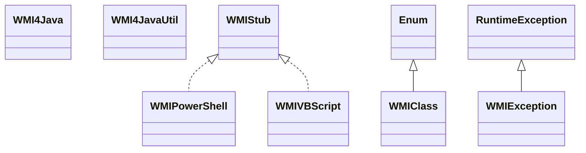

# WMI4Java-1.6.3.jar

[Group index](README.md) | [All archives](../README.md)

## Scope and provenance

- **Donor:** `SQX_145_REFERENCE_ROOT/internal/libs/WMI4Java-1.6.3.jar`.
- **SHA-256:** `7b9955ac56dcef6731961588f037b56d3e27f36222a3ec4ead2cd315059eea72`; accessed 2026-10-06; captured `2026-10-06T18:54:51.906614+00:00`.
- **Classes:** 7 raw entries; 7 unique entry names. Duplicate occurrence indices are zero-based.
- **Inspection:** read-only ZIP hashing and class-file structural parsing; signatures/descriptors, modifiers, hierarchy and references only. Bytecode bodies are hashed, not published.
- **Allocation:** proposed `FEAT-HOST-WMI4JAVA`, P01; [roadmap](../../dev/sqx-full-application-roadmap.md). Domain README registration remains required.
- **Repository:** `01067f00031428613c6394064ca1bcadc1ba00ee`; review state unreviewed. Download label 145-dev1; installed build/activation and runtime equivalence unverified.
- **Limit:** every class/member is inventoried; declaration coverage does not establish consumed calls, defaults, formulas, failure semantics or algorithm parity.
- **Archive/resource index:** [119.json](../../dev/evidence/sqx145/archives/145/119.json).

## Complete member declarations

Member shards contain exact JVM names/descriptors, access flags, generic signatures, throws types, declared fields/methods, superclass/interfaces and referenced class names. All classes, nested/synthetic members and overloads are retained. Code length/hash is structural evidence, not a normalized algorithm comparison.

- [001.json](../../dev/evidence/sqx145/members/119/001.json) — SHA-256 `3c4e5330344b6de168efbee654ecd3cd82c50c38bb9a10192529dddfb8470a11`.

## Focused structural diagram

Up to twelve non-nested classes; arrows show declared inheritance/interfaces only. External type names are not evidence of an available body or an executed dependency.

## Class inventory

| Archive entry | Occurrence | Class SHA-256 | Fields | Methods |
| --- | ---: | --- | ---: | ---: |
| `com/profesorfalken/wmi4java/WMI4Java.class` | 0 | `e5758501c9683f62e6db3f675d7192cb119fc4bc9446fcb03222f607c0c16f8b` | 8 | 17 |
| `com/profesorfalken/wmi4java/WMI4JavaUtil.class` | 0 | `06c61d30f3ba2f940a98663547d505d89dd9955918e752376bc2fd05dac84dcd` | 0 | 2 |
| `com/profesorfalken/wmi4java/WMIClass.class` | 0 | `2c1cec64a8a575b7162cde51c6a303ebdfb8240311f0f9e97760950ce8b5b8c8` | 885 | 5 |
| `com/profesorfalken/wmi4java/WMIException.class` | 0 | `c46d6583f8f5d36cb3cf1927b443b69be1c209f7512ba9af2e6a75d4d060b39d` | 1 | 3 |
| `com/profesorfalken/wmi4java/WMIPowerShell.class` | 0 | `d4cfd5b8d68cf429fae67b9e71493dab9f76c0761e4eef2ea7167604c577d052` | 3 | 7 |
| `com/profesorfalken/wmi4java/WMIStub.class` | 0 | `f8c25030661f6cfa2f9828cbfd0211cdb92d1a06d6a822b447988bf0fb7680ae` | 0 | 4 |
| `com/profesorfalken/wmi4java/WMIVBScript.class` | 0 | `41c0d2046c0735b12fbe99789b55f434e669de1d25d58e55badc51b20e0c42dd` | 3 | 6 |
