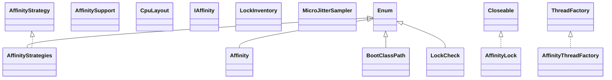

# affinity-3.23.3.jar

[Group index](README.md) | [All archives](../README.md)

## Scope and provenance

- **Donor:** `SQX_145_REFERENCE_ROOT/internal/libs/affinity-3.23.3.jar`.
- **SHA-256:** `969e4b4ad761e34f3c5d59fe173bba08623bbf4e9002bc567665626886f01928`; accessed 2026-10-06; captured `2026-10-06T18:54:51.906614+00:00`.
- **Classes:** 49 raw entries; 49 unique entry names. Duplicate occurrence indices are zero-based.
- **Inspection:** read-only ZIP hashing and class-file structural parsing; signatures/descriptors, modifiers, hierarchy and references only. Bytecode bodies are hashed, not published.
- **Allocation:** proposed `FEAT-COMPUTE-AFFINITY`, P14; [roadmap](../../dev/sqx-full-application-roadmap.md). Domain README registration remains required.
- **Repository:** `01067f00031428613c6394064ca1bcadc1ba00ee`; review state unreviewed. Download label 145-dev1; installed build/activation and runtime equivalence unverified.
- **Limit:** every class/member is inventoried; declaration coverage does not establish consumed calls, defaults, formulas, failure semantics or algorithm parity.
- **Archive/resource index:** [002.json](../../dev/evidence/sqx145/archives/145/002.json).

## Complete member declarations

Member shards contain exact JVM names/descriptors, access flags, generic signatures, throws types, declared fields/methods, superclass/interfaces and referenced class names. All classes, nested/synthetic members and overloads are retained. Code length/hash is structural evidence, not a normalized algorithm comparison.

- [001.json](../../dev/evidence/sqx145/members/002/001.json) — SHA-256 `5b8b418c1b02c21700b9472db9787c81944fba26287213e080aac7c3c5a7656b`.

## Focused structural diagram

Up to twelve non-nested classes; arrows show declared inheritance/interfaces only. External type names are not evidence of an available body or an executed dependency.

## Class inventory

| Archive entry | Occurrence | Class SHA-256 | Fields | Methods |
| --- | ---: | --- | ---: | ---: |
| `net/openhft/affinity/Affinity.class` | 0 | `620962bd2d0c8e36da8dd0c538011562dda96ae7517b6c88d9f6ad52f9385fd2` | 4 | 23 |
| `net/openhft/affinity/AffinityLock$Warnings.class` | 0 | `cf513c4240e53f826adcbcc9e718fe4024776b8928b8551a1dc05563376641a6` | 0 | 2 |
| `net/openhft/affinity/AffinityLock.class` | 0 | `93d558bef407113dd1f1199fd9d88c798d5a93605c03dfd4af960ef9ca533589` | 16 | 32 |
| `net/openhft/affinity/AffinityStrategies$1.class` | 0 | `86b5772b632a851241083e44754344fc781a00efcd3cde909cbc60d691fb6004` | 0 | 2 |
| `net/openhft/affinity/AffinityStrategies$2.class` | 0 | `fbe4d7276ca2055f5e1d5558f095a9d586068c62a2f1a39bab4f2e7bae0818e9` | 0 | 2 |
| `net/openhft/affinity/AffinityStrategies$3.class` | 0 | `34fe3cff60cf12fb1a3a30428e9fff9a8b4124796ee43fab71278f7a37308766` | 0 | 2 |
| `net/openhft/affinity/AffinityStrategies$4.class` | 0 | `67fdde634cb8d907c59e54d20264dd883d0e3c127e17909387641f5fced9949a` | 0 | 2 |
| `net/openhft/affinity/AffinityStrategies$5.class` | 0 | `62ccd59b714595889c2f3e4219cbb344337819afc1c1f78974660b83115182a2` | 0 | 2 |
| `net/openhft/affinity/AffinityStrategies.class` | 0 | `6c02b5abdb52ba345423e9670dd2c1498c772d2c0894a5fc2cceac94d204c462` | 6 | 5 |
| `net/openhft/affinity/AffinityStrategy.class` | 0 | `9db2db3815ac708c999b13fdd72003068ec1c4d2f4af0af2568e6cac9ff5fa88` | 0 | 1 |
| `net/openhft/affinity/AffinitySupport.class` | 0 | `d8612c4ca57540bd699121473e7f577b2100296da346d713de8f94af37c2ce78` | 0 | 3 |
| `net/openhft/affinity/AffinityThreadFactory$1.class` | 0 | `67b85fd24cdab34ddf47dc59e3ff61d7ea5eac67d317bc527a7a3236e023636c` | 2 | 2 |
| `net/openhft/affinity/AffinityThreadFactory.class` | 0 | `ca1856b75d24466b7ef889bc735233df1145dd3bafb131375584689079596968` | 5 | 5 |
| `net/openhft/affinity/BootClassPath$1.class` | 0 | `963adc817fc7476b71f34ded899613261e95b7b8330d18c1db5dd6b317ed43e9` | 2 | 3 |
| `net/openhft/affinity/BootClassPath.class` | 0 | `b855c0bd6e6578fd829e04851771b307752bc94af6847bcfff7446d57b111800` | 3 | 9 |
| `net/openhft/affinity/CpuLayout.class` | 0 | `4cd426a6bd299c356c956bc7e6fdbf718a6b39d85be17b48f2800160df48162f` | 0 | 7 |
| `net/openhft/affinity/IAffinity.class` | 0 | `a150cafe1e988a0a653e67118485eee8f21915e97820943b99cfb9d470979bfa` | 0 | 5 |
| `net/openhft/affinity/LockCheck.class` | 0 | `6a6c56df6df2728fa33cdfed8c9bf8582c04c11f997eb7bdac6d5af37a0704b5` | 6 | 14 |
| `net/openhft/affinity/LockInventory.class` | 0 | `f10bc42c6aeaceea1c848f50b41fc71f63004e2eb8b16e6712bb88fe20493b42` | 4 | 19 |
| `net/openhft/affinity/MicroJitterSampler.class` | 0 | `4d00b7dbffb4c945aa288c1786606c35c903766acb8f06845b9afb08516a15e8` | 6 | 10 |
| `net/openhft/affinity/impl/LinuxHelper$CLibrary.class` | 0 | `ded82e24fbb0cbcc45458e60d43b9f3b297b566e4791a92075333fb0966b8aec` | 1 | 7 |
| `net/openhft/affinity/impl/LinuxHelper$cpu_set_t.class` | 0 | `b2a817096b6f331b314f0137ee0d323bdaaf83a400812b128ecc4e73baf4b798` | 5 | 9 |
| `net/openhft/affinity/impl/LinuxHelper$utsname.class` | 0 | `ef6888c50b6109b713fb6763a4d270a87786738da61480238e03e8a678bfe8fd` | 8 | 12 |
| `net/openhft/affinity/impl/LinuxHelper.class` | 0 | `6e6b30f3ece5a541cdb870372516885d54695e028655829ec7348e92fcbdddf6` | 4 | 8 |
| `net/openhft/affinity/impl/LinuxJNAAffinity.class` | 0 | `7648fdbf368c4c4b33973aa4e24d13a030f43eba9ccc5ca0f36fc993d93b4b71` | 10 | 9 |
| `net/openhft/affinity/impl/NoCpuLayout.class` | 0 | `b346237fac35e884a2858f168259ce78cd7200dfba4d8a27221a9f1f2e20eb71` | 1 | 8 |
| `net/openhft/affinity/impl/NullAffinity.class` | 0 | `3997ed676949da4eec7a6a15e173c06f99d8d277f740c1008835e11246d13e67` | 3 | 9 |
| `net/openhft/affinity/impl/OSXJNAAffinity$CLibrary.class` | 0 | `0ebc0d048d66b241077980f8bcb888a6cc649bff1c76ea40ae824b34ba40f7ef` | 1 | 2 |
| `net/openhft/affinity/impl/OSXJNAAffinity.class` | 0 | `e12bd4eb9828af5487062668b6785fd4f49554d951709495ee0c2b0257294014` | 4 | 9 |
| `net/openhft/affinity/impl/PosixJNAAffinity$CLibrary.class` | 0 | `6b39c3ead701050865dca46ab6bef606869528d4ea2129ae2921f523f5aeccb9` | 1 | 7 |
| `net/openhft/affinity/impl/PosixJNAAffinity.class` | 0 | `9111790f1e8ba615c03599ac56b6a8bfe79b3181e664d995c2f6922cba14aca8` | 9 | 10 |
| `net/openhft/affinity/impl/SolarisJNAAffinity$CLibrary.class` | 0 | `2c86dac77c53696f4ed03ecf49bee2ccb9bd3844eaa4256ef6d888bcb1da574b` | 1 | 2 |
| `net/openhft/affinity/impl/SolarisJNAAffinity.class` | 0 | `dfbc01c9c8dc704489f03e18faa90ed45819d1f9ccb853481c17aa7d03e73282` | 4 | 9 |
| `net/openhft/affinity/impl/Utilities.class` | 0 | `c256c45d29691744f5f76207747f2755d522d54c52ee4f6ba602651876eb69f2` | 2 | 6 |
| `net/openhft/affinity/impl/VanillaCpuLayout$CpuInfo.class` | 0 | `be197171562c055d49d23ac16f5f5900fa38293afa3e9bb24649c3ac266d752f` | 3 | 5 |
| `net/openhft/affinity/impl/VanillaCpuLayout.class` | 0 | `5ecc5c7c204851c80dd42269c7975cb9970e9aa1f557886e8878e8a137fd3861` | 5 | 18 |
| `net/openhft/affinity/impl/VersionHelper.class` | 0 | `4f72034ebd57e96b173065605e2b87f114ba8f65f3e89ae763a0074b9df66fce` | 4 | 7 |
| `net/openhft/affinity/impl/WindowsJNAAffinity$CLibrary.class` | 0 | `7fb4bbe74534b8e15e3e9a5a2dfac836db573c42e667700e80c6379a44ebb725` | 1 | 4 |
| `net/openhft/affinity/impl/WindowsJNAAffinity.class` | 0 | `6c9f2ff19d2b10fbf5c174a1ad3f95bc88cec1d393bfd38fe16c9fdf7477dbba` | 6 | 12 |
| `net/openhft/affinity/lockchecker/FileLockBasedLockChecker$ConcurrentLockFileDeletionException.class` | 0 | `ab88df989bed42a13bb9fbbbddd43857d55d199be5777a65745ecf760830656a` | 1 | 1 |
| `net/openhft/affinity/lockchecker/FileLockBasedLockChecker.class` | 0 | `81ec98b98048bc64231b56af3d5b0927ff9a68c4b4f213f72c783bdb2b8e13f5` | 8 | 14 |
| `net/openhft/affinity/lockchecker/LockChecker.class` | 0 | `60234ec3aa9b691c55719d03cc3823f8d934f324e37337494d894ff5ab8cf41c` | 0 | 4 |
| `net/openhft/affinity/lockchecker/LockReference.class` | 0 | `62918357c9aa05273168d4fc1f3df3c563addf9ac53de55abf97d44ccedaeae5` | 2 | 2 |
| `net/openhft/affinity/main/AffinityTestMain.class` | 0 | `3722537df558299b0732d67c456d30d3fcd4b6f29a40a9e69615c1d67a383b1a` | 0 | 4 |
| `net/openhft/ticker/ITicker.class` | 0 | `16d42dae40115e911a012c350a2e1e80e889dd9db7a5a01bcdc8427d653360a8` | 0 | 4 |
| `net/openhft/ticker/Ticker.class` | 0 | `b5038bbe88042082b99d3cff8032cc291a5eb6061896aee1d463754a45c1eefd` | 1 | 6 |
| `net/openhft/ticker/impl/JNIClock.class` | 0 | `3dd2253c667938cb227f5ec7ef3351faa0d80d3e0a8c392469a978a4305a74b9` | 9 | 11 |
| `net/openhft/ticker/impl/SystemClock.class` | 0 | `c03810e1e8459b4c12d7bd8da904a7ecc840c8c5868e09ca06efe1f638fe0ae5` | 2 | 8 |
| `software/chronicle/enterprise/internals/impl/NativeAffinity.class` | 0 | `18ef1c9b011b0ab436e3f6299b0e4a7aa39b1c7253317b780d72d54d12760d2f` | 3 | 16 |
