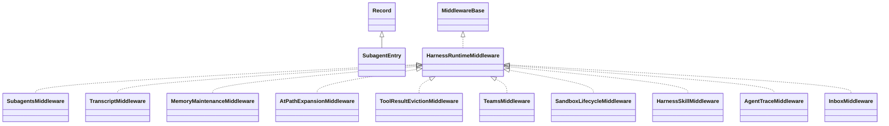

# agentscope-harness-2.0.3.jar

[Group index](README.md) | [All archives](../README.md)

## Scope and provenance

- **Donor:** `SQX_145_REFERENCE_ROOT/internal/libs/agentscope-harness-2.0.3.jar`.
- **SHA-256:** `e6f6f5c39d8e16ca5c2ea3727b56dbcfa8fd408ef54a0018c0c9416251beb1a0`; accessed 2026-10-06; captured `2026-10-06T18:54:51.906614+00:00`.
- **Classes:** 393 raw entries; 393 unique entry names. Duplicate occurrence indices are zero-based.
- **Inspection:** read-only ZIP hashing and class-file structural parsing; signatures/descriptors, modifiers, hierarchy and references only. Bytecode bodies are hashed, not published.
- **Allocation:** proposed `FEAT-AGENTIC-AGENTSCOPE-HARNESS`, P19; [roadmap](../../dev/sqx-full-application-roadmap.md). Domain README registration remains required.
- **Repository:** `01067f00031428613c6394064ca1bcadc1ba00ee`; review state unreviewed. Download label 145-dev1; installed build/activation and runtime equivalence unverified.
- **Limit:** every class/member is inventoried; declaration coverage does not establish consumed calls, defaults, formulas, failure semantics or algorithm parity.
- **Archive/resource index:** [004.json](../../dev/evidence/sqx145/archives/145/004.json).

## Complete member declarations

Member shards contain exact JVM names/descriptors, access flags, generic signatures, throws types, declared fields/methods, superclass/interfaces and referenced class names. All classes, nested/synthetic members and overloads are retained. Code length/hash is structural evidence, not a normalized algorithm comparison.

- [001.json](../../dev/evidence/sqx145/members/004/001.json) — SHA-256 `9bf054f52c427911c8ae4fcd692faa2b303a22373fb7f9bb953feafbc7b4f21e`.
- [002.json](../../dev/evidence/sqx145/members/004/002.json) — SHA-256 `39dd2d39985a8c1d36d7efeb0eb5215041ea05315d457fe76c29d0782fee5ff5`.
- [003.json](../../dev/evidence/sqx145/members/004/003.json) — SHA-256 `a0c447a823ab24902dfe6ed78205b4deffdf406b5e5128615ce81ee415ac0bf6`.
- [004.json](../../dev/evidence/sqx145/members/004/004.json) — SHA-256 `0236775cc5eab9873e5e0aa06bac1b66a6b076580b3e6db409165aa4bc9c712a`.
- [005.json](../../dev/evidence/sqx145/members/004/005.json) — SHA-256 `cbd86a6df366876d2beaa4269e51e84950fa0119a8699c8213da2caa3730363b`.

## Focused structural diagram

Up to twelve non-nested classes; arrows show declared inheritance/interfaces only. External type names are not evidence of an available body or an executed dependency.

## Class inventory

| Archive entry | Occurrence | Class SHA-256 | Fields | Methods |
| --- | ---: | --- | ---: | ---: |
| `io/agentscope/harness/agent/middleware/WorkspaceContextMiddleware$1.class` | 0 | `134e9833a2f67d02020c2bbc4b4b59f962c79ab10d26522119e31e817858c4e2` | 1 | 1 |
| `io/agentscope/harness/agent/middleware/MemoryFlushMiddleware$ConversationKey.class` | 0 | `f14a732d71a9bc84e087e979ba09643433a5c843cca2d948b5b2c4beb48aa49f` | 3 | 7 |
| `io/agentscope/harness/agent/middleware/SubagentsMiddleware.class` | 0 | `1a41e2a4146715108c0d9c70c3bffff8e427442cbbef28f1404246b1cf3010ff` | 16 | 27 |
| `io/agentscope/harness/agent/middleware/TranscriptMiddleware.class` | 0 | `052d1b0fa6d5506f300257dadd3e8b21035612b4bdf49bc827cbe4ce2d87a273` | 4 | 10 |
| `io/agentscope/harness/agent/middleware/SubagentEntry.class` | 0 | `30ea8f720869b841658e5361a4384499bfc4a5123681ea27d8b9f38711e09779` | 4 | 9 |
| `io/agentscope/harness/agent/middleware/MemoryMaintenanceMiddleware.class` | 0 | `2958ff40e069454f4d26c1a5664af3b4bdb79e3512707fe49fa1460dc685c0c3` | 9 | 19 |
| `io/agentscope/harness/agent/middleware/AtPathExpansionMiddleware.class` | 0 | `dd104c74ff16e442768cb902aefd7a99aed45d0b58da6cf0ca667eac42476503` | 4 | 7 |
| `io/agentscope/harness/agent/middleware/ToolResultEvictionMiddleware.class` | 0 | `0f9beb9b3db58e20228863f8e988f1e1cf7d419e86053ed8bc06f9c7c89cd3be` | 4 | 14 |
| `io/agentscope/harness/agent/middleware/TeamsMiddleware.class` | 0 | `5980fe5930a725de7e6757d03be036bed5769143f5f0a28a2d427b49df59b66b` | 15 | 40 |
| `io/agentscope/harness/agent/middleware/SandboxLifecycleMiddleware.class` | 0 | `9044228f6980dfa04ced0054ef0755610b04778c599eff0528a4f21ad7a6f8b2` | 4 | 5 |
| `io/agentscope/harness/agent/middleware/HarnessSkillMiddleware.class` | 0 | `5cf399c1adfa09c2fbdc33edb5384cd3ba0e8e32b48936779c42c56f9f359bf8` | 10 | 18 |
| `io/agentscope/harness/agent/middleware/AgentTraceMiddleware.class` | 0 | `59ac18d75fea7edda71790119797822c5a211aea068cfbf4338589d149380d3c` | 1 | 16 |
| `io/agentscope/harness/agent/middleware/MemoryMaintenanceMiddleware$1.class` | 0 | `6816a265c2780d1d73a1c47e805793f95c726db431cd7c7e1b9f97d519a31ef6` | 1 | 1 |
| `io/agentscope/harness/agent/middleware/InboxMiddleware.class` | 0 | `e3c665e393e9350116efbca17c1092450cb4dd5568a1b35929b52246d41d1144` | 6 | 11 |
| `io/agentscope/harness/agent/middleware/HarnessRuntimeMiddleware.class` | 0 | `dd9310b7badf31dbfe9d4a1ba5a3094db66a76b76d0f08fe68d80a5ee55d9cd5` | 0 | 0 |
| `io/agentscope/harness/agent/middleware/WorkspaceContextMiddleware.class` | 0 | `e516cab3fdcd1e8fcc29abe928cc18add41a48426e7e7835393cfe2e574fde14` | 21 | 31 |
| `io/agentscope/harness/agent/middleware/ToolResultEvictionMiddleware$ToolResultFingerprint.class` | 0 | `3eda633ce0979d936f48819889544ddde594fa7b1c018177250a0cd2708ee0b3` | 3 | 7 |
| `io/agentscope/harness/agent/middleware/AsyncToolMiddleware.class` | 0 | `8ee6df6f7bb65ce13cf70f6d23ae750912649ce0187b3af98b36116be8f1ca2a` | 5 | 15 |
| `io/agentscope/harness/agent/middleware/SubagentsMiddleware$1.class` | 0 | `956928cc9b52ab9b653dc701256a86b415c3fe6e7c0431757fffb1aefe8f16d4` | 1 | 1 |
| `io/agentscope/harness/agent/middleware/PlanModeMiddleware.class` | 0 | `20ae22caa633feac86b94954378c4adc44a62b5ec43305e174688c88eba54b6d` | 8 | 8 |
| `io/agentscope/harness/agent/middleware/SkillUsageMiddleware.class` | 0 | `ccb7b154d7e60da98a9418a028312b477519746580bee707d43e5987f9284517` | 4 | 6 |
| `io/agentscope/harness/agent/middleware/MemoryFlushMiddleware$FlushQueue.class` | 0 | `4d64ad03e2c945de4a82bdd5417f4eb16881e3c25eab9d6f95f0e85f80896c92` | 2 | 1 |
| `io/agentscope/harness/agent/middleware/SubagentsMiddleware$SubagentSnapshot.class` | 0 | `4459ea7c264df1037e0a93922046f8a05db84c6e9045824b4d14aec194d35687` | 2 | 6 |
| `io/agentscope/harness/agent/middleware/HarnessSkillMiddleware$1.class` | 0 | `a46aea0a3953db4b3fc89deddf8c802f9638b6de455d3c73e413f7592769f0b4` | 1 | 1 |
| `io/agentscope/harness/agent/middleware/MemoryFlushMiddleware.class` | 0 | `cc8303066e656082fcb80dbb55524c03f2fd2603e1866bf425a3606625aefde8` | 8 | 23 |
| `io/agentscope/harness/agent/middleware/SkillCuratorMiddleware.class` | 0 | `406544bf14c7b24c8fb8e0d171fad263a28589efd9f39c9bd3d7553233f0a3a6` | 4 | 8 |
| `io/agentscope/harness/agent/middleware/DynamicSubagentsMiddleware.class` | 0 | `c04b1fc74ac21bb33a5eb6fe8ea5387de060914b296ccc8e53ce26363f61ca92` | 11 | 10 |
| `io/agentscope/harness/agent/middleware/CompactionMiddleware.class` | 0 | `0bd443aa195edeebd7ff5380f8e0968faee5901fed26b89e8e17545b09938788` | 4 | 8 |
| `io/agentscope/harness/agent/middleware/ToolResultEvictionMiddleware$EvictionResult.class` | 0 | `72a920efea86876db65af0e9dab58819f1e83f450fb34f2a1c3c32bba7e2dbd1` | 2 | 6 |
| `io/agentscope/harness/agent/middleware/MemoryFlushMiddleware$1.class` | 0 | `dfc7d6cddc110636a1a0bc5e1a99be4c8279b82081643368f404295a1fc5a6be` | 2 | 1 |
| `io/agentscope/harness/agent/HarnessAgentBuilderSupport.class` | 0 | `52318a524f450064fe81b12281ffd52529373ea84983fe8334e08f7f1844e959` | 3 | 29 |
| `io/agentscope/harness/agent/HarnessAgent.class` | 0 | `6a6e3ff2db5401fc7bdb795a903c1ae6a65c3ee17c79e9884419dfc8c2b720ff` | 21 | 111 |
| `io/agentscope/harness/agent/tools/McpServerRegistrationListener.class` | 0 | `aa248b4fe8ad8894967da68095f819fd617c5811a64fc22739553c5314591c65` | 0 | 1 |
| `io/agentscope/harness/agent/tools/ToolsConfigLoader.class` | 0 | `558ac123d1cb03d7833599312db06d3496ef18df45d937c1e2059ca35fc7451d` | 3 | 4 |
| `io/agentscope/harness/agent/tools/McpServerRegistrar.class` | 0 | `3c9271a96290b9be37e797577c04bc1d7edeb064ec8d20575a82f60e9f1ac5f8` | 1 | 11 |
| `io/agentscope/harness/agent/tools/ToolsConfig.class` | 0 | `4817f834dcc873c3d2a0641ceae8b3fbfd4e0df9e73c8078e7272a0f5902408f` | 3 | 7 |
| `io/agentscope/harness/agent/tools/McpServerRegistrationResult$Status.class` | 0 | `5803d6e4e26cb52f96375341fc9b06a6571ebea71aa0751ad302622150d05b12` | 4 | 5 |
| `io/agentscope/harness/agent/tools/ToolFilter.class` | 0 | `ed4b048c5d1de954fb18a6d57f74fac4e94154e05e80c14ca1a5a5c9c06227b3` | 1 | 4 |
| `io/agentscope/harness/agent/tools/McpServerConfig.class` | 0 | `0b95dbdb9c3543c2f61d27bb8e03be8cb1ce2014522075b1720b15370bf2e684` | 10 | 21 |
| `io/agentscope/harness/agent/tools/McpServerRegistrationResult.class` | 0 | `be598241a2d40ddeffc0264ddccc0a0bec16be43a1afded6132031e0c440f35c` | 5 | 12 |
| `io/agentscope/harness/agent/tools/HarnessPlatformTools.class` | 0 | `193beefb59243de1effde56e9f03bc16ec3aae021549eb4e9d8f1f4b0a4b3391` | 1 | 3 |
| `io/agentscope/harness/agent/DistributedStore$Builder.class` | 0 | `97446c7b2138f6c71c9f5b8176e2197ff0a7bc6d18d205c64cf9363e967aee72` | 9 | 11 |
| `io/agentscope/harness/agent/coordination/LocalPeriodicGate.class` | 0 | `69508b2f1630e77874c1a143307c1fa2d325be66677ac68a635afe1e81099be5` | 2 | 10 |
| `io/agentscope/harness/agent/coordination/PeriodicGate.class` | 0 | `30951d47a6113169d5b7b514d8d39d7cb4d3160f24e0b634d510079df43c0126` | 0 | 1 |
| `io/agentscope/harness/agent/coordination/StoreBackedPeriodicGate.class` | 0 | `adc8c4a735f8c154912c02883e78a4a71fea7167f4ef9957541f558848f1a21f` | 5 | 4 |
| `io/agentscope/harness/agent/memory/MemoryFlushManager.class` | 0 | `a41af968a297625c79647a8c9335d977f062efdc8d1f4d12a7b2895f39521df8` | 6 | 21 |
| `io/agentscope/harness/agent/memory/MemoryConsolidator.class` | 0 | `0c586f4a443c42436bbc2731de7c08e71777a060e350eadd119f1d3936f41ec0` | 12 | 18 |
| `io/agentscope/harness/agent/memory/MemoryConfig$FlushTrigger.class` | 0 | `520a8593e6b84dcf5d396c41d7daad5b1b7e4871cd583d1772036ce91d1ded8e` | 4 | 10 |
| `io/agentscope/harness/agent/memory/compaction/CompactionConfig$TruncateArgsConfig$TruncateArgsBuilder.class` | 0 | `d3055d8e2cc501020a10fd89b1fd87c14bf1feb2059799d2e98683b4ecfd3845` | 6 | 8 |
| `io/agentscope/harness/agent/memory/compaction/CompactionConfig$PruneConfig$PruneBuilder.class` | 0 | `4c2e1914faba187ad7116450116f4d69f46b5c683080e88b6515e3947e13b4a6` | 4 | 6 |
| `io/agentscope/harness/agent/memory/compaction/ToolResultEvictionConfig.class` | 0 | `1eb63268567b6a9fede06c82d9c868d511d6090ac1e9e7199d7242c8f45f906f` | 8 | 8 |
| `io/agentscope/harness/agent/memory/compaction/CompactionConfig$TruncateArgsConfig.class` | 0 | `c70d86369e8a3a13d2fc4e2c3c120701381ff8ff444854de7385263a8e722e10` | 6 | 8 |
| `io/agentscope/harness/agent/memory/compaction/TokenCounterUtil.class` | 0 | `88ecedb3a04e6b82629f370810c593c49185902309ef0b8a06c7e835e975f5d2` | 4 | 8 |
| `io/agentscope/harness/agent/memory/compaction/CompactionConfig$PruneConfig.class` | 0 | `e57f0bda79b2c3e65dd6a546643439eaa044032d4569a50e4f6fd1e3879b2a02` | 4 | 7 |
| `io/agentscope/harness/agent/memory/compaction/CompactionConfig$Builder.class` | 0 | `64d660054ded54b7a9225010d3d58710ec573e489c19ca79f4dd6cf0a25ebc06` | 14 | 17 |
| `io/agentscope/harness/agent/memory/compaction/ConversationCompactor.class` | 0 | `953b8b0f940bab9731af4b818447124343f414929cab3786384b61203650b278` | 4 | 38 |
| `io/agentscope/harness/agent/memory/compaction/CompactionConfig.class` | 0 | `636e057b404d561c946d313af57767061d340e72b375f49b3c270bcef69b2983` | 16 | 17 |
| `io/agentscope/harness/agent/memory/compaction/ToolResultEvictionConfig$Builder.class` | 0 | `0902538632c4e1374510c627c45b0ba83b3570ce092726cef218fa798adee966` | 4 | 6 |
| `io/agentscope/harness/agent/memory/compaction/ConversationCompactor$1.class` | 0 | `4ea15ff11c08936d0f073ed19c9f392bef7a661485f63ce8203ab1f2aafc13a1` | 1 | 1 |
| `io/agentscope/harness/agent/memory/MemoryConfig.class` | 0 | `75918621736bd25863dfd34db0bcfe19072c7b7cfbd155b7de64ea0568cbae4e` | 12 | 12 |
| `io/agentscope/harness/agent/memory/MemoryBackgroundTasks.class` | 0 | `62664445f5c353f0ad3a29e0e0216b48c890cabc39646edd088a3b454a0c5331` | 3 | 5 |
| `io/agentscope/harness/agent/memory/MemoryConfig$FlushMode.class` | 0 | `3933ee851f533e35e3539422fdf785cece44cf8a6cb3f254ca7f5b71a209a0b8` | 4 | 5 |
| `io/agentscope/harness/agent/memory/MemoryConfig$Builder.class` | 0 | `8fc3154e909adf87c501809170b386a50b09ff613da44ad4be21421d08d6d354` | 8 | 12 |
| `io/agentscope/harness/agent/memory/session/SessionEntry$ToolUseEntry.class` | 0 | `45eea74d77b98c92984204b7e4e5ca4136721425492de759215433d903957556` | 5 | 6 |
| `io/agentscope/harness/agent/memory/session/SessionTranscriptWriter.class` | 0 | `be509a952f3251dbfd6bd8230f641bf8b393b0f221cf1a56bc9d65f78bf0a30b` | 7 | 11 |
| `io/agentscope/harness/agent/memory/session/SessionFreshnessEvaluator.class` | 0 | `e8e48d2441c989eeb8808a3b605755a001408eb694221300db108a1b8f0ae47e` | 3 | 5 |
| `io/agentscope/harness/agent/memory/session/SessionEntry$MessageEntry.class` | 0 | `745227379733b12198de52e8694d977ef99c02ac1e1471459c3d63a39ff2e366` | 4 | 7 |
| `io/agentscope/harness/agent/memory/session/SessionEntry$ToolResultEntry.class` | 0 | `b4902bd0551704a68044539fcbe844e10689d026b74ee65f9e1bb820f065c6fa` | 6 | 7 |
| `io/agentscope/harness/agent/memory/session/SessionTree.class` | 0 | `ba0e5ae17b3d881c622491e990b50ebf5d31e193a6dd056eb640faae35d991cf` | 20 | 41 |
| `io/agentscope/harness/agent/memory/session/SessionEntry$CompactionEntry.class` | 0 | `36431ee61ef81bfbee59e9f7f7ec25d9aef2e6f81217e22980b67273472a5471` | 2 | 3 |
| `io/agentscope/harness/agent/memory/session/SessionTranscriptWriter$TruncatedOutput.class` | 0 | `d0fe99678075f3e914af9482ab14e698da76fca035a9da97608cf35c2b248410` | 4 | 8 |
| `io/agentscope/harness/agent/memory/session/SessionEntry$SummaryEntry.class` | 0 | `b9cff61b71b7b7afaf87e81cc24251a4cdfb2ea1d930694bcfdab0b070b203cb` | 2 | 4 |
| `io/agentscope/harness/agent/memory/session/SessionEntry.class` | 0 | `a8b36f56c4d3ab17622b42aabd699ec6c3088c3f9d501f6e74eb714498c0dad6` | 3 | 4 |
| `io/agentscope/harness/agent/memory/session/SessionTranscriptWriter$TruncatedMap.class` | 0 | `0583b1d8708b964b1db1862d93b9ada403449cd0e2da97889caf93702ef75b33` | 3 | 7 |
| `io/agentscope/harness/agent/skill/RuntimeContextSkillRepository.class` | 0 | `513a3435f19b903bc7838ef395a2b2ee4b162b8550ac4027953b07964f731915` | 0 | 2 |
| `io/agentscope/harness/agent/skill/SkillResources.class` | 0 | `9ce99e10ca586c4255a0f00509e6996efbc85ddff193b1aaedc7f01c452f9541` | 0 | 4 |
| `io/agentscope/harness/agent/skill/runtime/ShellPathPolicy$Mode.class` | 0 | `bb36e901640174d729a6fbcd3860393475017216837e4a5715e4dbd6cb95668c` | 4 | 5 |
| `io/agentscope/harness/agent/skill/runtime/MarketplaceStager$StageResult$None.class` | 0 | `032b758dcbe5e70a181e998ceddb31c977975ca63cb42466e45252b5c7d8311f` | 0 | 4 |
| `io/agentscope/harness/agent/skill/runtime/MarketplaceStager$StageResult$Cached.class` | 0 | `4d7af4bdd80f8622d39b31c6511590d89a322012c70e9512af7ad82c8d0d0ad1` | 3 | 7 |
| `io/agentscope/harness/agent/skill/runtime/ShellPathPolicy.class` | 0 | `7244c5234d343e07f5c0775112f4e3e0ff5cd5b13767da9affa3c28c64735ee2` | 4 | 10 |
| `io/agentscope/harness/agent/skill/runtime/MarketplaceStager$1.class` | 0 | `41f92f5f65cc727756cd0495a15e110c0f14d72ed6bf4a804a333dc5907fd5fd` | 1 | 7 |
| `io/agentscope/harness/agent/skill/runtime/SkillPromptBuilder.class` | 0 | `3c4e7e4846fb71d6a6ff1fc35bda5fd205b41845a2a9e407b10760bef2862734` | 7 | 11 |
| `io/agentscope/harness/agent/skill/runtime/MarketplaceStager$StageResult.class` | 0 | `538a147cd028d23afb75178efb62a39d2ad417bd508cb82087f4fc87ed6472e1` | 1 | 1 |
| `io/agentscope/harness/agent/skill/runtime/SkillRuntime.class` | 0 | `c08744b72173e8a2f0a3def939dd5758c480aeacaa01dd3873ba70685c5339b2` | 5 | 11 |
| `io/agentscope/harness/agent/skill/runtime/MarketplaceStager$RepoBound.class` | 0 | `4031fa57dae3f7afa0d5716f22512d1e854088ccd72a8cc95fa7938da79f1b31` | 2 | 6 |
| `io/agentscope/harness/agent/skill/runtime/SkillCatalog.class` | 0 | `7bfee5a41b0d0519220fd30dbdfb7592528bc5820d4e85717b7c1a2900b468a5` | 1 | 8 |
| `io/agentscope/harness/agent/skill/runtime/HarnessSkillEntry.class` | 0 | `36c505c734e79dd5de1d0b32a6b2e2fef6019ab7daad8a4cd460fff827c3077a` | 3 | 8 |
| `io/agentscope/harness/agent/skill/runtime/MarketplaceStager$StageResult$WorkspaceNative.class` | 0 | `4d9c81a3c64c749b3a0719351d02e4200d509d12de162cc580c062e849b9d07a` | 0 | 4 |
| `io/agentscope/harness/agent/skill/runtime/MarketplaceStager.class` | 0 | `92fb011a20f398e6ef0e371e7f73eb4ea8da484fc0fdcf30c49503ee6fd6a413` | 9 | 29 |
| `io/agentscope/harness/agent/skill/runtime/SkillLoadTool.class` | 0 | `a11706f5a11beeda59e8bf3516a8f704baf70591df9cab469f144f6fef10e4c9` | 6 | 15 |
| `io/agentscope/harness/agent/skill/curator/LocalApprovalGate$Prompter.class` | 0 | `b3fc9cdbdb4eb54c664481b2047a782fa777c7c8495b0a1147e8ef2f1dc48768` | 0 | 0 |
| `io/agentscope/harness/agent/skill/curator/AllowListFilter.class` | 0 | `7c87f147bb6bf7fe68455105f2576bb4df36bde1128f0c6e8abac0e3c6ed2775` | 1 | 2 |
| `io/agentscope/harness/agent/skill/curator/EnvironmentFilter.class` | 0 | `88d4e4d14aa95dc7b77c1a18c7e3f2e02b9b1d7ad8fb7620dd730d5737d821d5` | 2 | 2 |
| `io/agentscope/harness/agent/skill/curator/SkillSecurityScanner$Rule.class` | 0 | `c1d5643da0b0fb6b85c6e6eb25ef40793fbd8ce48639007fad1bce72321725df` | 5 | 9 |
| `io/agentscope/harness/agent/skill/curator/SkillVisibilityFilter.class` | 0 | `a264559bd88686f82aa7aebe72f1d1886c3ba548619966e3389304f079904bab` | 0 | 1 |
| `io/agentscope/harness/agent/skill/curator/LocalApprovalGate.class` | 0 | `690d55eecb2d7db73cedba92cc45a46312fe4102125cb4174e489b75c35e9021` | 4 | 12 |
| `io/agentscope/harness/agent/skill/curator/FilesystemSkillUsageBackend$1.class` | 0 | `92a334a32eea365e27d8a9728e61fb6c4912cf8643b753fca1ca0a80a091284c` | 1 | 1 |
| `io/agentscope/harness/agent/skill/curator/SkillPromotionGate$PromotionDecision.class` | 0 | `75a1a9788bd168e4449fd73140ddde9cb582a2acfb70fd8349eddc657cd5ac66` | 0 | 0 |
| `io/agentscope/harness/agent/skill/curator/SkillSecurityScanner$ScanResult.class` | 0 | `bc2487695731318b50f20bc80738c15f049102801b27a566cd98de7ae09f1039` | 3 | 7 |
| `io/agentscope/harness/agent/skill/curator/SkillAuditLog$Entry.class` | 0 | `0c874bac58e141d65dbd4d0cd15903a4f6a7cd1b26addf39f964be38fcb993cb` | 10 | 14 |
| `io/agentscope/harness/agent/skill/curator/AbstractAgentCreatedFilter.class` | 0 | `c54699171d3a9d599afda9ce3301ec57d12e118681bdbf9bdc5f28968920d060` | 1 | 3 |
| `io/agentscope/harness/agent/skill/curator/SkillUsageRecord.class` | 0 | `2b552b82cba382182977c928d848eccdf371be07259c0de62cb6a57c9581675a` | 15 | 25 |
| `io/agentscope/harness/agent/skill/curator/SkillSecurityScanner$Severity.class` | 0 | `4d0eb4ba88a20c525a72eeaca06732f5433b9f8acaf496715bd4a9eb03100d03` | 5 | 5 |
| `io/agentscope/harness/agent/skill/curator/SkillCuratorState.class` | 0 | `ce5dfc4d19ef73310b4a98df46fb8a68ca68cd25e3d20c0b0e0e8b0cb97a78c5` | 6 | 12 |
| `io/agentscope/harness/agent/skill/curator/SkillUsageRecord$State.class` | 0 | `77e4b2fc73a2d919284be289c1f77af168ad860b236fd7db6c8d54bb63e0e251` | 5 | 5 |
| `io/agentscope/harness/agent/skill/curator/SkillAuditLog.class` | 0 | `37364d0d8c6dde7e3094d0078cbf18da212db18465533b97379680e5f1c7dbdf` | 7 | 6 |
| `io/agentscope/harness/agent/skill/curator/SkillCurator$CuratorRunReport.class` | 0 | `b5ded72cfc8c4f88b4a727fd59cd5e54bca9b96b270f99ee8d261d79635a6300` | 4 | 8 |
| `io/agentscope/harness/agent/skill/curator/FilesystemSkillUsageBackend.class` | 0 | `81801511dbc70be6648249eb79ae51187128516e1d78c38134173f7eb5c5872c` | 5 | 7 |
| `io/agentscope/harness/agent/skill/curator/SkillSecurityScanner$Verdict.class` | 0 | `aef5342db63b2f281f3d923a5af057ac204b723fade71d8ef3617e3d03d687a5` | 4 | 5 |
| `io/agentscope/harness/agent/skill/curator/SkillSecurityScanner$Finding.class` | 0 | `9552ecb5738d89d19f0acd3f614e9862db080a2daea1aa07d50c24bd1b989fda` | 7 | 11 |
| `io/agentscope/harness/agent/skill/curator/SkillCuratorConfig$Builder.class` | 0 | `7943858f3feeaa2a3e1097766693e5d1f850ec009a8c5cc256786e8e705e8989` | 5 | 7 |
| `io/agentscope/harness/agent/skill/curator/SkillCuratorConfig$UmbrellaPassMode.class` | 0 | `4ec3953d7a3a73c2bc92bb8e2272416c9f191b481277cd4349a63cd1225e9961` | 3 | 5 |
| `io/agentscope/harness/agent/skill/curator/SkillPromotionGate$PromotionDecision$Reject.class` | 0 | `2106cf38507bc12d4e83e661483e887612c637380d53be63045556d0ccdcfcfb` | 2 | 6 |
| `io/agentscope/harness/agent/skill/curator/RejectAllGate.class` | 0 | `9a49ee5270d758af4dafab4e5a088da837e8e1ab43dd785e5bf55132ea2e01bb` | 1 | 3 |
| `io/agentscope/harness/agent/skill/curator/SkillCurator$TransitionCounts.class` | 0 | `baa82d518bf8de056d7bba343320dae75cd64ed684c24bbb3da923feb4aebfbc` | 4 | 8 |
| `io/agentscope/harness/agent/skill/curator/SkillCandidate$ScriptFilePreview.class` | 0 | `628c5da40a5de4efbd0c6acf79e710a9637867337c096a9cef1a01351b24a36c` | 4 | 8 |
| `io/agentscope/harness/agent/skill/curator/BaseStoreSkillUsageBackend.class` | 0 | `4c2b7b236ac564726b02cbf1f23be1552d818832385c7313e9ece524bcb4f9dc` | 6 | 10 |
| `io/agentscope/harness/agent/skill/curator/CanaryFilter.class` | 0 | `1f3357403af4357c7cd0281d5ea10ec3b7484d01ccdf813df098c306a9e24da5` | 2 | 6 |
| `io/agentscope/harness/agent/skill/curator/SkillPromoter$PromotionResult$Status.class` | 0 | `7286cb02a5b23dac1e5c44bf7a107cdfbcc36c110f1c4f680012400e187f6df1` | 5 | 5 |
| `io/agentscope/harness/agent/skill/curator/CompositeFilter.class` | 0 | `1144dde37e454ca999e6fc3494752ba343a642ceeb4c19d6b609a10a33620709` | 1 | 3 |
| `io/agentscope/harness/agent/skill/curator/SkillUsageStore.class` | 0 | `c164e87f2c61c3ad7148fd66fdc44e115f083710c34c6734ab59b0e268064082` | 3 | 28 |
| `io/agentscope/harness/agent/skill/curator/SkillSecurityScanner.class` | 0 | `e3013c40e27fc589685d007424a31d648338a0197dade774d3bbae4915f3854b` | 1 | 10 |
| `io/agentscope/harness/agent/skill/curator/SkillPromotionGate$PromotionDecision$Defer.class` | 0 | `4ad52d2672af021ad6c8774c6556925d86e92cda93da54d75fa5eb14ddd7c9ed` | 2 | 6 |
| `io/agentscope/harness/agent/skill/curator/SkillUsageBackend.class` | 0 | `6cc46ddd99454c073037f589339be881050b1aa48b024bd5308ea6a512f6cd94` | 0 | 4 |
| `io/agentscope/harness/agent/skill/curator/SkillSecurityScanner$Category.class` | 0 | `70c9c7a53674c98b7d3247d707eb07a51ab51ff96494f64395a5ac833b636c77` | 7 | 5 |
| `io/agentscope/harness/agent/skill/curator/NotifyAndWaitGate.class` | 0 | `73d907f1227dd66717e86b77605e7253e266c5a7edd15ba9c3259ec44d293486` | 6 | 8 |
| `io/agentscope/harness/agent/skill/curator/SkillCuratorConfig.class` | 0 | `46fddda8b80e16e5d6037e1fedf826f636cadc5a036fe039892bdbd31f4b58eb` | 5 | 8 |
| `io/agentscope/harness/agent/skill/curator/SkillSecurityScanner$TrustLevel.class` | 0 | `42e6d5ffd2b05f180d44cbadf66bbd75eed2c63ff13cab904ae4ae6452fce3a1` | 5 | 5 |
| `io/agentscope/harness/agent/skill/curator/SkillPromoter$PromotionResult.class` | 0 | `2411cc7f631f4e2e11b6bcd79781805839e54baea5ca602f7e4722ea5e662f71` | 5 | 13 |
| `io/agentscope/harness/agent/skill/curator/NotificationSink.class` | 0 | `d529e5d4ca09b6009afceacf36d25667c017ac88d17cbc7947dcc3082d3ea2e6` | 0 | 5 |
| `io/agentscope/harness/agent/skill/curator/SkillCurator.class` | 0 | `ada23576577236f793732c81ba25e5aa2e2b6e95c9465b4851ed671c8b49b1ec` | 9 | 13 |
| `io/agentscope/harness/agent/skill/curator/SkillPromotionGate$PromotionDecision$Approve.class` | 0 | `0e3643d6177e08c95fb9957c357f9821e066adf874a5010c5a2799a49e8d2178` | 3 | 7 |
| `io/agentscope/harness/agent/skill/curator/SkillPromoter.class` | 0 | `9f1349d3b2e8505f9779056c7f75b761d5afc99f03b1a2c7d8d312182a615ef1` | 9 | 10 |
| `io/agentscope/harness/agent/skill/curator/SkillCandidate.class` | 0 | `a407d5e39c4a16d57265ff5aaaabd199329989bb9d627ad9b3e0228e8be56903` | 7 | 11 |
| `io/agentscope/harness/agent/skill/curator/SkillPromotionGate.class` | 0 | `bb1b1ad063a9ef23b1da5dcd0c4afce2a8c4efce57448d70d163438114c15d6d` | 0 | 1 |
| `io/agentscope/harness/agent/skill/curator/BaseStoreSkillUsageBackend$1.class` | 0 | `f699b3a2d0b2956debfdd33e377a483a80c7cf4fd97ea57409ccf98480cbc8f0` | 0 | 1 |
| `io/agentscope/harness/agent/skill/WorkspaceSkillRepository.class` | 0 | `c3bda9946239c7e75a87321bf5fb237f8bcbde07f19f7db9c9af6b78afe88450` | 9 | 29 |
| `io/agentscope/harness/agent/skill/EmptySkillResources.class` | 0 | `08038655ad3b5b4fd52b177cc7a05947da1dd8d14f5486f0fdb6bc60eeaf1885` | 1 | 5 |
| `io/agentscope/harness/agent/skill/LazyResourceCapable.class` | 0 | `1dd729fdf62af46a64cdc8a95b16c3171a2ad4fa1419d4b908cd52223a599d04` | 0 | 1 |
| `io/agentscope/harness/agent/skill/WorkspaceSkillRepository$FilesystemSkillResources.class` | 0 | `90e2f7963b886e147a617e0919b4a24ed703ef250bc0c8f1d17176629d60eeb0` | 3 | 6 |
| `io/agentscope/harness/agent/transcript/FilesystemTranscriptStore.class` | 0 | `abb86882622aa2c457d6c5d3f05a67ace5777c70ae8cfb857c6d0c8f52d7e77a` | 3 | 10 |
| `io/agentscope/harness/agent/transcript/TranscriptStore.class` | 0 | `c3ca5d77ddfdc66b9c0b8a63ffd76004b1d335aab0004d88573faca0591909fd` | 0 | 6 |
| `io/agentscope/harness/agent/transcript/ObjectStoreTranscriptStore.class` | 0 | `650079baf047be1995dbd3fd831086d838d0ce3687151181087258e067ca58b5` | 5 | 11 |
| `io/agentscope/harness/agent/transcript/TranscriptStore$SegmentInfo.class` | 0 | `68d2a9462a764701479c8d0e4dc0eb0e2c876cdd0fea82c6f25b5676cf1ddb50` | 5 | 9 |
| `io/agentscope/harness/agent/transcript/TranscriptRef.class` | 0 | `06ba56474f93b64694b0eb4ac51f75c9d41a65ec45b24d6327e9fa3582e49d59` | 3 | 8 |
| `io/agentscope/harness/agent/workspace/PathPolicy.class` | 0 | `122e2e79a84aa0225b288b0252cf70b980e72c71e815d361e676b3926416b394` | 2 | 12 |
| `io/agentscope/harness/agent/workspace/WorkspaceIndex.class` | 0 | `30a88b4afddc50b79932325343056e1a5f59134608adc9ace7bdc036f9f41c48` | 6 | 16 |
| `io/agentscope/harness/agent/workspace/WorkspaceManager$1.class` | 0 | `7979e46b8a1aef0baef1137aa449c20d8d855ba2c00de3cfc998361095673d79` | 0 | 1 |
| `io/agentscope/harness/agent/workspace/plan/PlanModeManager.class` | 0 | `b430293904e50ca08434b10da3287dfbd0593744d25b83b04ccd38e36cf92c3a` | 3 | 7 |
| `io/agentscope/harness/agent/workspace/WorkspacePathNormalizer.class` | 0 | `dac17d1a9956c70a1e0833ba1e6bf9899cc437eb1fbfb29e4bf43e529cfadac8` | 1 | 6 |
| `io/agentscope/harness/agent/workspace/WorkspaceConstants.class` | 0 | `7a99e006482d031eaeec28019e9d96daafee6e8c5707bd6f633d5d0bbbc14a38` | 15 | 1 |
| `io/agentscope/harness/agent/workspace/LocalFsMode.class` | 0 | `56bc81ee4a3168cec2c68c8bf936e2c3d45fe4b1aed49fc65ffe2391d992c1c3` | 4 | 5 |
| `io/agentscope/harness/agent/workspace/WorkspaceManager.class` | 0 | `f031a686a08d5fb4db4692b9b6ba12385dbb70add8e031e3aef9464dba51ed47` | 10 | 70 |
| `io/agentscope/harness/agent/DistributedStore$CompositeDistributedStore.class` | 0 | `90022de4c4ec1eefd2172193e0ba3622061187c7bd0724df42814894c7599dc9` | 9 | 22 |
| `io/agentscope/harness/agent/bus/BusEntry.class` | 0 | `2a46149946b8e63698a0f8dea011711934375567df3a30c432468e7eaf7d7c6b` | 2 | 6 |
| `io/agentscope/harness/agent/bus/AsyncToolRegistry.class` | 0 | `d47f34ee12c1429dee57ef67cc41dc6407f10fb4676970b9996c92c93b2fbc80` | 0 | 5 |
| `io/agentscope/harness/agent/bus/WorkspaceMessageBus.class` | 0 | `438f5e6dfd45db0f40038a48c45417fd9d0256d5f5c296e9e739564917bcdf2f` | 6 | 28 |
| `io/agentscope/harness/agent/bus/WorkspaceAsyncToolRegistry.class` | 0 | `80f58631d47fc55b6006b080f7e34d6ceebfe866d3dd21b4c2ed89d198065b7f` | 4 | 17 |
| `io/agentscope/harness/agent/bus/MessageBus.class` | 0 | `7a43fa018a7a3196f5cca42164e09d904bb0e691b62e30dfb9da123851277c6e` | 2 | 21 |
| `io/agentscope/harness/agent/bus/AsyncToolRecord.class` | 0 | `d1643383f9fbfa8e0be5536dc1d3afd59c8e62ed42006f8ca54024d507f4f49b` | 10 | 10 |
| `io/agentscope/harness/agent/filesystem/util/FilesystemUtils.class` | 0 | `c4cd64c000d5ce9c21da478b41645a63e9a2ff5c9a3c0d4edee73beb56d04bed` | 1 | 6 |
| `io/agentscope/harness/agent/filesystem/spec/RemoteFilesystemSpec.class` | 0 | `75f0ede0da2691d3e55c8e1ab81d445cc1f4473b33c612fe91461d461d78912d` | 5 | 19 |
| `io/agentscope/harness/agent/filesystem/spec/LocalFilesystemSpec.class` | 0 | `5dfa6cc3e47321a15faa8dd301cbcacd26e458986356531c6a94ece702be5253` | 9 | 18 |
| `io/agentscope/harness/agent/filesystem/spec/SandboxFilesystemSpec.class` | 0 | `253ed84982f11bd99e97046c4181039dc7c5846ecfc4e7650b0279eb0eaf24c6` | 6 | 17 |
| `io/agentscope/harness/agent/filesystem/spec/RemoteFilesystemSpec$1.class` | 0 | `3ff6f986082edd342eebefffd3fb59b5ef4fb477efe74a30cdc36fde04fa9da3` | 1 | 1 |
| `io/agentscope/harness/agent/filesystem/OverlayFilesystem.class` | 0 | `04bcae3c4efc0c5c892845f91a086b89954944d6ef659d6d820305a575f2d290` | 2 | 17 |
| `io/agentscope/harness/agent/filesystem/CompositeFilesystem.class` | 0 | `5cbffe7eef151d0b02bcc34f500779c2c6ad4ef4b3a2c78e42cc4ed2ef88e987` | 2 | 24 |
| `io/agentscope/harness/agent/filesystem/CompositeFilesystem$RouteEntry.class` | 0 | `9ed50efff305e6b099797d19b38973d8257658a9ff92f3e6c188eca99faf96db` | 2 | 6 |
| `io/agentscope/harness/agent/filesystem/OverlayFilesystem$ShellAwareOverlay.class` | 0 | `0c0130432ea1bcc8c1303fe1372e45e91a7e9f53381a5c1331f199bcddb53a1c` | 1 | 3 |
| `io/agentscope/harness/agent/filesystem/local/LocalFilesystem.class` | 0 | `0e3142424f2278922e069c03cb454d3b38ddfd76fd9704d8411246b6eedb3fa2` | 8 | 49 |
| `io/agentscope/harness/agent/filesystem/local/LocalFilesystem$1.class` | 0 | `4ccaeca03d2a7e0e53dc75cb17439c90512a651deca2e855026606f106752302` | 6 | 5 |
| `io/agentscope/harness/agent/filesystem/local/LocalFilesystemWithShell.class` | 0 | `77b2077c3ba9290f33089e5c6826d209154f8ed18cd4556292c9d85bae788d08` | 9 | 20 |
| `io/agentscope/harness/agent/filesystem/local/LocalFilesystem$2.class` | 0 | `c635cea3b6bc053bc662e31d620e64f779518c8ee6cd6b4b5bed91979f202204` | 1 | 1 |
| `io/agentscope/harness/agent/filesystem/ProjectAwareOverlay.class` | 0 | `84d33a2f7efadbf66acdd1215f5b9785b5b6855ffb148827f27056bc887deb88` | 5 | 23 |
| `io/agentscope/harness/agent/filesystem/sandbox/SandboxBackedFilesystem.class` | 0 | `af2a993fbcb3d12a148eac1391d9558c514f98010e1d6657851b4011ab08fe2e` | 3 | 16 |
| `io/agentscope/harness/agent/filesystem/sandbox/BaseSandboxFilesystem.class` | 0 | `e368b0bb1096c82687d8a4b99ac8d0fb345d7d882676c5d291a0071cce97356c` | 0 | 19 |
| `io/agentscope/harness/agent/filesystem/sandbox/PinnedSandboxFilesystem.class` | 0 | `bc3c5e88ca4dedea493c7a311f577b065f38cfea1baba885bb276f1f1af41a9a` | 0 | 2 |
| `io/agentscope/harness/agent/filesystem/sandbox/AbstractSandboxFilesystem.class` | 0 | `1c0a4383c135267a3026b03dcd577c2790d5019a415221f49cb1b2c2d65a995a` | 0 | 2 |
| `io/agentscope/harness/agent/filesystem/BakedContextFilesystem.class` | 0 | `51b188d45ac40bdefaa513ce41a90f1d309f67f61278741683f024858aade616` | 2 | 12 |
| `io/agentscope/harness/agent/filesystem/model/FileData.class` | 0 | `c2462aae3853d7af0eb91553402858786185a3fc3dca339f647c6d2c22d5ff68` | 4 | 12 |
| `io/agentscope/harness/agent/filesystem/model/LsResult.class` | 0 | `e6c29cbdb3f9c6dcaa9011b8e79646fbc7b79ecf22dc636daad8f496d32e9840` | 2 | 9 |
| `io/agentscope/harness/agent/filesystem/model/ReadResult.class` | 0 | `2ec00c8048b905180255aa0e1f091eba8ce10be5ca229b29ac1be5482348b69c` | 2 | 9 |
| `io/agentscope/harness/agent/filesystem/model/FileDownloadResponse.class` | 0 | `c5c93ca26d4b4b59ae1115cf1f16412b82a1a0c019b8699acb29e31abe3d02b8` | 3 | 10 |
| `io/agentscope/harness/agent/filesystem/model/GrepResult.class` | 0 | `181e7fa086caafa070853367d2b7638f8c8b25d141d020e3acbadba7df339687` | 2 | 9 |
| `io/agentscope/harness/agent/filesystem/model/ExecuteResponse.class` | 0 | `a13b7458eddacdcbbff613b28c36d95845e3c66efcdc82c85104058e3f052652` | 3 | 8 |
| `io/agentscope/harness/agent/filesystem/model/FileUploadResponse.class` | 0 | `0ad3271ef86c72d0043a1e558034fc36b1968504e83255ba0bdb27ac7804bf59` | 2 | 9 |
| `io/agentscope/harness/agent/filesystem/model/GlobResult.class` | 0 | `d4b0e3bf6e28333ff7b71b9e23ac2c86f37b9625ac773239ad7476a3ba65314a` | 2 | 9 |
| `io/agentscope/harness/agent/filesystem/model/FileInfo.class` | 0 | `8cfbdd5445006fe5a5091ff58d0d2067f3a1fe19f4a39fc60b9983740a7cc073` | 4 | 12 |
| `io/agentscope/harness/agent/filesystem/model/GrepMatch.class` | 0 | `d6d3e9e7c927eb5be1c087c10c80971eb4ab6d5dd852ce50a428744226be3fa4` | 3 | 7 |
| `io/agentscope/harness/agent/filesystem/model/EditResult.class` | 0 | `614eda22ba95ab611dc549ab19f8f46e3462b160d1fef2e9e05a05e86cf4d5d6` | 3 | 10 |
| `io/agentscope/harness/agent/filesystem/model/WriteResult.class` | 0 | `c4cdb127bde9cb410300f7f23a970a4e1081ed3ad99b7b3e3d72cf946b0f7350` | 2 | 9 |
| `io/agentscope/harness/agent/filesystem/RoutedSandboxFilesystem.class` | 0 | `1cc0b575b751731e0546a7daa3eb8a4dd79baf9fd5f107483623991f19077a8e` | 2 | 16 |
| `io/agentscope/harness/agent/filesystem/AbstractFilesystem.class` | 0 | `6ff5c6f1d4620c7a3052ea823b935746447df7997399bcc06c745f1ba923c99f` | 0 | 12 |
| `io/agentscope/harness/agent/filesystem/CompositeFilesystem$IndexedFile.class` | 0 | `37574ae028239b6baad2e8dc8e972951cd42f71083508619557ccc708ebb0bcf` | 4 | 8 |
| `io/agentscope/harness/agent/filesystem/CompositeFilesystem$RouteResult.class` | 0 | `9bfce094fff75e7cea752afff23e055a382376276355f30a872d2bc923911d43` | 3 | 7 |
| `io/agentscope/harness/agent/filesystem/remote/RemoteFilesystem.class` | 0 | `dcfd80d291f1914542b32edfb80c6568fd4f4cd5bc9a8526834f947254628756` | 4 | 24 |
| `io/agentscope/harness/agent/filesystem/remote/store/StoreItem.class` | 0 | `0089bd532fb45c478ed75e6dcc3aa548a4d448453982c9673591b08a4ab60022` | 3 | 8 |
| `io/agentscope/harness/agent/filesystem/remote/store/NamespaceFactory.class` | 0 | `d196eed15a45fb7df9f4e86957e9f12cbc2e35ac5314d4226dedbde99ae0e79c` | 0 | 1 |
| `io/agentscope/harness/agent/filesystem/remote/store/BaseStore.class` | 0 | `16f51417937b5692e306bebf59d1eb93787bb715d99d2dc195dd119e77cdfa90` | 0 | 5 |
| `io/agentscope/harness/agent/filesystem/remote/store/InMemoryStore.class` | 0 | `088bbf8eaa015f587402bdae0707a21b1fa344e992224fec732602ce0aa51c16` | 1 | 13 |
| `io/agentscope/harness/agent/HarnessAgentBuilderSupport$SubagentFactoryEntry.class` | 0 | `edd03e0cb480dddfad11e9a4b12fdaa8ac65566d8009f6078143ea849773a6a5` | 3 | 8 |
| `io/agentscope/harness/agent/DistributedStore.class` | 0 | `f92b4ed85fab0fd8127ffb82aa568c20e7cbb213861719e7cc08cb474c8e4328` | 0 | 10 |
| `io/agentscope/harness/agent/team/TeamMemberSpec.class` | 0 | `2cb51601a347bb251dfcc3cb72d59494eb12049fc2791a67b596236c2873d1da` | 4 | 8 |
| `io/agentscope/harness/agent/team/TeamConflictException.class` | 0 | `a4150cc81e5978951d5f5a17514fb30b00cc486a44557c47779e2adb54aa38bb` | 0 | 1 |
| `io/agentscope/harness/agent/team/TeamContext$InterruptedTask.class` | 0 | `ee760b1e9b2db68195517549b3abffd21a48084b7d2c5467eec4a6246e35c758` | 3 | 7 |
| `io/agentscope/harness/agent/team/TeamContext$CompletedTask.class` | 0 | `53fb591d17d23dcbf851964b5cf4601dd358a711a42b71ca0a8f2b8a151253ba` | 3 | 7 |
| `io/agentscope/harness/agent/team/TeamTask.class` | 0 | `33ec2a11fad67f0d18773608809458f7af74237bbea5d5d2046718239e074cae` | 14 | 21 |
| `io/agentscope/harness/agent/team/TeamWakeups$Hook.class` | 0 | `1e40d26c9880dfee58e285e95e38cedf278eecdb7d15aac927e88a8eaf7a6747` | 0 | 1 |
| `io/agentscope/harness/agent/team/TeamContext.class` | 0 | `11e75c974ffe6f9288c774e0289bd7e54a52927c20216e6524266c639bf7d3c7` | 8 | 14 |
| `io/agentscope/harness/agent/team/TeamContext$RecentMessage.class` | 0 | `ef96ea4c563085d793864c53fde99fb2706c264d0bb82ec1a50dbc0479853ec1` | 3 | 7 |
| `io/agentscope/harness/agent/team/TeamContext$RecoveryContext.class` | 0 | `1c4e61c05c27f4213c1d6ca54a52efbdef65ff6fa69c91f9765ace3aef8da1dd` | 5 | 9 |
| `io/agentscope/harness/agent/team/TeamWakeups.class` | 0 | `2874b63f89f78ed1340e2f2f3d964f625741cba3c96f770323704ceded56dd41` | 1 | 4 |
| `io/agentscope/harness/agent/team/TeamMessage.class` | 0 | `77eeee538135a4e40d1c61c5fed5d5cf3422bd4ce0638c7ebed39e1930d8a8c0` | 4 | 9 |
| `io/agentscope/harness/agent/team/TeamMemberInfo.class` | 0 | `10e073622e082681a855316f296b23712dd1bd415bb0bdb453d059040d6d4c16` | 6 | 14 |
| `io/agentscope/harness/agent/team/TeamInfo.class` | 0 | `ac8a9fab0cf04a71169a806ef49a3374573e3abbb280b29f95e501cfb22b64fe` | 5 | 9 |
| `io/agentscope/harness/agent/team/TeamClient.class` | 0 | `0015e557d4d06416b230c7af56720d02ffc1b02d595bed14478b2ea79d3d0d42` | 0 | 20 |
| `io/agentscope/harness/agent/team/LocalTeamClient.class` | 0 | `fdb7c2ea582cd7b98d440b3c0a945030fd9f586b1eba0239af872b2118f0bd2e` | 3 | 47 |
| `io/agentscope/harness/agent/team/TeamCreateSpec.class` | 0 | `4136f849922d6658a5a659bada01c7a02eda695496b2b93d94689b5a761f07a8` | 6 | 10 |
| `io/agentscope/harness/agent/team/TeamContext$MemberSnapshot.class` | 0 | `b696dd18e4811325a3e60bce8c47484ecd3d20d11b9e08160525cb9cc07c1259` | 3 | 7 |
| `io/agentscope/harness/agent/team/LocalTeamClient$VersionedTask.class` | 0 | `78583cff4ff96bf5cadaecab25658c18b804b82486e7689f18dba90254039c45` | 2 | 6 |
| `io/agentscope/harness/agent/sandbox/impl/docker/DockerSandbox.class` | 0 | `afe0d2dd5ba3237fed1ebcfef738e0aae0b3ce0c5328a22000f968a905094383` | 6 | 32 |
| `io/agentscope/harness/agent/sandbox/impl/docker/DockerSandbox$ContainerState.class` | 0 | `d1ba4eae29580899a7c24095f45a1e320aa89028aaa9f666d258620381ba945a` | 4 | 5 |
| `io/agentscope/harness/agent/sandbox/impl/docker/DockerFilesystemSpec.class` | 0 | `083077bb265375cb2796e40ea59010986bd11ad1db4d7c0a76464abb11588499` | 4 | 18 |
| `io/agentscope/harness/agent/sandbox/impl/docker/DockerSandboxClient.class` | 0 | `2e6aafcdd2e1125d778e0b5896294c9be437680f6bfde978ed3c72b1134d1781` | 2 | 11 |
| `io/agentscope/harness/agent/sandbox/impl/docker/DockerSandboxState.class` | 0 | `94cedcc2403ce34f7bcbc805706e887d28618ee95ecaa957321ffb76b7528d8d` | 10 | 21 |
| `io/agentscope/harness/agent/sandbox/impl/docker/DockerSandboxClientOptions.class` | 0 | `a5d9f951b6e9fa766d4c4a31ca7f125beb36a102d387175febfba3b799b64ca2` | 8 | 27 |
| `io/agentscope/harness/agent/sandbox/SandboxFileTransfer.class` | 0 | `b08af022db6e87893a80a868b707e855fdbdda333ee833f1b0fd6e5fa4bcb621` | 0 | 3 |
| `io/agentscope/harness/agent/sandbox/WorkspaceSpec.class` | 0 | `6cd5a4710be82cf7e52574e244d0a94e2cacae97af607df1e5db42f5ccc73a3b` | 3 | 8 |
| `io/agentscope/harness/agent/sandbox/SandboxException$SandboxConfigurationException.class` | 0 | `afba58b1f47edc1f77973e6a3d51ecea25a12694dd3c30289498e7d58df9b5fd` | 0 | 2 |
| `io/agentscope/harness/agent/sandbox/SandboxState.class` | 0 | `313971a3a2383083afe0cba1f006ddd6d0c1ba343a07dc33040b2dc9e38c3d3e` | 5 | 11 |
| `io/agentscope/harness/agent/sandbox/WorkspaceProjectionApplier.class` | 0 | `91c904e4533403261ff9411e02c4e66dec2ad43d56665ac35f13270a54601a90` | 0 | 8 |
| `io/agentscope/harness/agent/sandbox/SandboxIsolationKey$1.class` | 0 | `0060d4018fc21c6e85f17c5891e0f03e6f218390c51895dc09e8dc1821f5b9c9` | 1 | 1 |
| `io/agentscope/harness/agent/sandbox/snapshot/NoopSandboxSnapshot.class` | 0 | `e2343811a7f2532773c093e0a112688adf3728925040051dc41520da8560ace8` | 1 | 7 |
| `io/agentscope/harness/agent/sandbox/snapshot/SandboxSnapshot.class` | 0 | `ec5da2bb8db6e7c595f5cb176503655108a55137caed5af5293ada5dfedd2ffa` | 0 | 6 |
| `io/agentscope/harness/agent/sandbox/snapshot/LocalSandboxSnapshot.class` | 0 | `c29c0fd06c43997ab661e6e92b242b74fee9d45461bd19c8febc2e7783d932cc` | 2 | 8 |
| `io/agentscope/harness/agent/sandbox/snapshot/NoopSnapshotSpec.class` | 0 | `e2c8d50f34e1c69b27d90a7a8b62d762380f30098e8a0e54308ed3a48ae36caa` | 0 | 2 |
| `io/agentscope/harness/agent/sandbox/snapshot/RemoteSandboxSnapshot.class` | 0 | `1f3b05b3a7e2aa93758ecf9db535515b6dfe89e10c1a538a3a33a8d9668bda91` | 2 | 8 |
| `io/agentscope/harness/agent/sandbox/snapshot/RemoteSnapshotSpec.class` | 0 | `03d6f40d308f23fb2af5f3c744b518e8af8ba5709b3b7757f9496cc6c130db10` | 1 | 3 |
| `io/agentscope/harness/agent/sandbox/snapshot/SandboxSnapshotSpec.class` | 0 | `f34b22a005ab655175fefdd35a2423d51d49676743cc237f3176aa29adbccd1e` | 0 | 1 |
| `io/agentscope/harness/agent/sandbox/snapshot/LocalSnapshotSpec.class` | 0 | `8bbe42610920b4bc0b889603cae3635fbba09ac32369c2f6604805d9f636e199` | 1 | 4 |
| `io/agentscope/harness/agent/sandbox/snapshot/RemoteSnapshotClient.class` | 0 | `57a0faea39900f1fa067393a3af62f562e47c4c2b821816f19536fe5ef73a852` | 0 | 3 |
| `io/agentscope/harness/agent/sandbox/ExecResult.class` | 0 | `24e273704531fe2cbd3a36684f4ace49c4bd3e4aa95a57df1a40b95fdd4c533b` | 4 | 10 |
| `io/agentscope/harness/agent/sandbox/Sandbox.class` | 0 | `8f04b42569db913b8e4a4a026a7da596f756cbf25f7e1f38d43f9c3ff055085e` | 0 | 9 |
| `io/agentscope/harness/agent/sandbox/SandboxClient.class` | 0 | `6cf5021cd16acbc944c0226fdd04dd6deb10f7e8bf1e3e9c89049b6fcf3be610` | 0 | 6 |
| `io/agentscope/harness/agent/sandbox/SandboxExecutionGuard.class` | 0 | `239d25c0f1616ac53685daea812fb131f7b16994f62e126ed1851d1aef27bb2b` | 0 | 2 |
| `io/agentscope/harness/agent/sandbox/SessionSandboxStateStore$1.class` | 0 | `e6309b74689334fae7072c30b1e4985d282c2b484bdea4baf5185d3b5a2fb237` | 1 | 1 |
| `io/agentscope/harness/agent/sandbox/SandboxManager.class` | 0 | `42b4d90309412cc325e413283025409a02375d47768840a3290341fe2c003aca` | 5 | 8 |
| `io/agentscope/harness/agent/sandbox/SandboxLease.class` | 0 | `6c2de3261d1e7837006fe39741d8c96866956ed0006ac0c9d5537e917b56efb1` | 0 | 2 |
| `io/agentscope/harness/agent/sandbox/layout/BindMountEntry.class` | 0 | `63c788002266a3c3202bf0f1580528e337afd5742eaacfb8029c1ea121b91708` | 2 | 5 |
| `io/agentscope/harness/agent/sandbox/layout/GitRepoEntry.class` | 0 | `a2866182d8017dccebbe1639fb8aea17b5633af9bacb92b94e89b470a99fddd8` | 2 | 6 |
| `io/agentscope/harness/agent/sandbox/layout/WorkspaceEntry.class` | 0 | `d25e2feaaaf955a54b3df477d293d6678e2de474e4b24fac4b98f728246743af` | 1 | 3 |
| `io/agentscope/harness/agent/sandbox/layout/FileEntry.class` | 0 | `cb0d1c504ef72ec2df6e7da4fc142ccedd75905ae0b611c8c58fcc03e511a8b0` | 2 | 7 |
| `io/agentscope/harness/agent/sandbox/layout/LocalFileEntry.class` | 0 | `6d0b30bfa8190b238bbd8fe7e04ea8b728895064d7aabd20c75af183daeb9dbe` | 1 | 4 |
| `io/agentscope/harness/agent/sandbox/layout/LocalDirEntry.class` | 0 | `a760fdc6edb50367ed47803ece0e8e004044e897edf0dc3f64e6e20f965ecdca` | 1 | 4 |
| `io/agentscope/harness/agent/sandbox/layout/WorkspaceProjectionEntry.class` | 0 | `26390be5d49725aa32f2ca81eef8a8dce74aec6403bcd2db1e4b9c5535632a72` | 2 | 5 |
| `io/agentscope/harness/agent/sandbox/layout/DirEntry.class` | 0 | `5381549aab8be4fd5f1c13d8d50f44dca98e1c255397618ee35d5099547871fb` | 1 | 5 |
| `io/agentscope/harness/agent/sandbox/WorkspaceSpecApplier.class` | 0 | `5c6f57cfce46a57ec9fc67db11977fcceb59edad6b859fd25dd5e8be4d592194` | 2 | 9 |
| `io/agentscope/harness/agent/sandbox/SandboxException$ExecException.class` | 0 | `bc3e5fb8afde7f0816efe526b93bc71d46b783121974134af674991b80b85b4a` | 3 | 4 |
| `io/agentscope/harness/agent/sandbox/SandboxException$SandboxRuntimeException.class` | 0 | `6cfd3f750649581d070fd4a03864001b305b5f7900fa7c68289abfb168d53e6b` | 0 | 3 |
| `io/agentscope/harness/agent/sandbox/SandboxException$ExecTimeoutException.class` | 0 | `1b1676b134d98d5507a2be408722f92e3e18f83d44e313f6ebe8c3fe1dc81269` | 0 | 1 |
| `io/agentscope/harness/agent/sandbox/SandboxLease$NoopSandboxLease.class` | 0 | `7ba738d5c829e17d1fb46ac99e57f50506627654e3c536d86a6908adb85750a9` | 1 | 3 |
| `io/agentscope/harness/agent/sandbox/WorkspaceProjectionApplier$ProjectionPayload.class` | 0 | `884d79e1f864608612b1e1925b9d97b494a92fa920180141249f8ceb72371b06` | 3 | 7 |
| `io/agentscope/harness/agent/sandbox/SandboxClientOptions.class` | 0 | `ed2a705a19d0ff12c565158a7e4d50d30ab79f5c3b2cf14a3bfb14e8c7a37914` | 0 | 4 |
| `io/agentscope/harness/agent/sandbox/WorkspaceArchiveExtractor.class` | 0 | `07d713bbc0002e17413c8d5dfc936aec119b71248874546542ee2fb67ef525a9` | 0 | 3 |
| `io/agentscope/harness/agent/sandbox/SandboxException$SnapshotException.class` | 0 | `de3fcfbb8f5555621449d949b0e6a3c61da36463f0c41d3d463cdf044740b187` | 1 | 3 |
| `io/agentscope/harness/agent/sandbox/SandboxExecutionGuard$NoopSandboxExecutionGuard.class` | 0 | `06fba011e25db0f7f3b176acf3d586fc9590f8d47fadeee2a9212e1fc0b94ae3` | 1 | 3 |
| `io/agentscope/harness/agent/sandbox/SandboxAware.class` | 0 | `efb69d912c5a2dd344616fb3406477cba72757c00550a4fc146acfc2492a38a1` | 0 | 2 |
| `io/agentscope/harness/agent/sandbox/json/HarnessSandboxJacksonModule.class` | 0 | `2b3ed33ef2edcce3e25cedf04368d40b3939cf18f10bb5b60a7c1b813e5740b2` | 0 | 1 |
| `io/agentscope/harness/agent/sandbox/SessionSandboxStateStore.class` | 0 | `ba0319589ca534b722f5e75ea5f85bb6bb9e11ebfa75269b15c5ece00ad361b3` | 3 | 6 |
| `io/agentscope/harness/agent/sandbox/SandboxException$WorkspaceStartException.class` | 0 | `814c4f1faf6e5deb854e06dcbbc6beeb976eec96e825400631d9ecdcf7399d3f` | 1 | 2 |
| `io/agentscope/harness/agent/sandbox/SandboxIsolationKey.class` | 0 | `314030dec30de8f957bd46a0e70fdc6a5525b78db84d2e4f29abf00d1ca736e2` | 4 | 8 |
| `io/agentscope/harness/agent/sandbox/WorkspaceMountSupport.class` | 0 | `0a1a240b85d5ace9edfc8cd5504c2c3a317624afa90ee823fa16365029b4c135` | 0 | 8 |
| `io/agentscope/harness/agent/sandbox/SandboxException.class` | 0 | `a587d8ca0681e7ae1c9f83a5d80d2e91e05ab8f6a54e29a44f87ee7ecb482c5c` | 2 | 5 |
| `io/agentscope/harness/agent/sandbox/SandboxErrorCode.class` | 0 | `fff74d33426e149044ea9a54003930beb36106964f6e41a64f1d6c03fad97206` | 12 | 5 |
| `io/agentscope/harness/agent/sandbox/SandboxContext.class` | 0 | `1403cb034bcfab0ccfc9b20ea440bb9d8a2416f214812ebb27e233b1ab4fa406` | 7 | 9 |
| `io/agentscope/harness/agent/sandbox/SandboxException$WorkspaceStopException.class` | 0 | `7fdbd2e9b2f30ff16c27f395d65e967286cedc2aec5b63d42558f4b65caa6038` | 1 | 2 |
| `io/agentscope/harness/agent/sandbox/AbstractBaseSandbox.class` | 0 | `2196c7bdd8b000af52a88603b451163c0e845af4d0aa4fde4010c80cc9e0d72f` | 5 | 19 |
| `io/agentscope/harness/agent/sandbox/SandboxContext$Builder.class` | 0 | `e4ac1b68d2acf745c4029471bf8866a42b49dca93fa7346c238dce01d14d899b` | 7 | 9 |
| `io/agentscope/harness/agent/sandbox/SessionSandboxStateStore$SandboxStateSlot.class` | 0 | `f0605ea77024e246b8051d5a714a69de8be307e9a15463a58d0487cdaef05e19` | 2 | 7 |
| `io/agentscope/harness/agent/sandbox/SandboxAcquireResult.class` | 0 | `dafe9f7837adbe10f781240b2a6c7c8c29a81554c31334ef424f62b0478a6396` | 3 | 7 |
| `io/agentscope/harness/agent/HarnessAgent$Builder.class` | 0 | `98aa8eee6e4e75276eede3efa1fa607878d87b867f17d22715b15bada3f71107` | 75 | 108 |
| `io/agentscope/harness/agent/artifact/ArtifactDeliveryTarget.class` | 0 | `f2d3453ae8e4dadfdeb0ac7ff83e7211f580587b31f13a6729fbe08d3b45f626` | 0 | 1 |
| `io/agentscope/harness/agent/artifact/ArtifactDeliveryResult.class` | 0 | `d99b3dacf9c0b4e2877394d9fd2769ab3951afefccee48ca96e05abb8cfd12e5` | 4 | 12 |
| `io/agentscope/harness/agent/artifact/ArtifactDeliveryRequest.class` | 0 | `d07cf698b037c2244bccd9791ea742b0c9c8c51abb9e378fe938084d2a124aca` | 5 | 9 |
| `io/agentscope/harness/agent/IsolationScope.class` | 0 | `a8768e0c5d6498f8832e7f2e55b48ba5c4f5ab1903b06f4a782d413e5aaf857e` | 5 | 9 |
| `io/agentscope/harness/agent/subagent/SubagentSpecGenerator$GeneratedSpec.class` | 0 | `d2cdb97ff8f76304876a2c12637ce4b90343a86019839d5370fb041a50cf1b08` | 2 | 6 |
| `io/agentscope/harness/agent/subagent/SubagentSpecGenerator.class` | 0 | `4099e4ed8ece99e71faf43a317dd4f2e021ac4bbaec9b0f0019c3aaf560434a3` | 2 | 5 |
| `io/agentscope/harness/agent/subagent/SubagentDeclaration.class` | 0 | `130cc011ba2967e689f57a4e930811f2f3300403020e89d0e292835fc58eed5b` | 23 | 28 |
| `io/agentscope/harness/agent/subagent/RemoteAskPolicy.class` | 0 | `9b1db2d09facaf239e0bbac7f781362b30e237a99392a668a5ea1664b90aa418` | 3 | 5 |
| `io/agentscope/harness/agent/subagent/RemoteSubagentStub.class` | 0 | `fbd868d5f2eeaf8cb71b85f5ca3ec04065b2641bb5042a15dae4b00b80e63958` | 0 | 3 |
| `io/agentscope/harness/agent/subagent/DefaultAgentManager.class` | 0 | `3773cee213082c00cdbaa2a1188e77e627f980515c9cf6974333e9b94b3ff20c` | 3 | 16 |
| `io/agentscope/harness/agent/subagent/protocol/RemoteStreamDetail.class` | 0 | `8a7d92a29d844f04cabb8501d897a1fb7501a5d2555eccfd55f29b642b953598` | 4 | 8 |
| `io/agentscope/harness/agent/subagent/protocol/RemoteConfirmDecision.class` | 0 | `0d633a40e70be67e260b092ff8a40c7826ca2b99d012631ff6670fba9daeec17` | 2 | 6 |
| `io/agentscope/harness/agent/subagent/protocol/RemoteEventCodec$1.class` | 0 | `a4ea95994c39c3406c15cb002e8b3cb48ac7bc6d8f17ed27658db76247c1a015` | 1 | 1 |
| `io/agentscope/harness/agent/subagent/protocol/RemotePendingConfirm.class` | 0 | `2f5ada37331b896298ff99df4722cb144cf6f9c13799235636641af90b475e9d` | 3 | 10 |
| `io/agentscope/harness/agent/subagent/protocol/RemoteEventCodec.class` | 0 | `5f27f9923132cd1ae6f0c8e1b4cadfe211c90fb6afcb78d32d39f07c266083d0` | 2 | 16 |
| `io/agentscope/harness/agent/subagent/protocol/RemoteEventType.class` | 0 | `4a202545087f310cca9ab2a07e040052d7772225f52b859e417b52c86011a7ab` | 12 | 5 |
| `io/agentscope/harness/agent/subagent/protocol/RemoteAgentEvent.class` | 0 | `1f41fcbcd930c20e4b04749a7b7177721768310f7b92c5eaf7970481ca1d9977` | 14 | 29 |
| `io/agentscope/harness/agent/subagent/SubagentFactory.class` | 0 | `98f8cbc69de1b8fd8db2084cd04df32e1028593f5c99c65715d8faf4e6ec8b85` | 0 | 1 |
| `io/agentscope/harness/agent/subagent/SubagentDeclaration$Mode.class` | 0 | `9c40d9357efbf2d0dbac7826a81a35506aa3dfcf276c65688a39b8d260260396` | 4 | 5 |
| `io/agentscope/harness/agent/subagent/AgentSpecLoader.class` | 0 | `ab5e45ba46c9bf6b27664cf8883313e09ead3c5d172d662666dfc6cb803a9dab` | 2 | 20 |
| `io/agentscope/harness/agent/subagent/task/TaskRepository$TaskCompletionCallback.class` | 0 | `71388bad9e5351b7110a75e7f9b29e5cada62e10138ca8b5787e4cbe0bece5a3` | 0 | 1 |
| `io/agentscope/harness/agent/subagent/task/TaskRunSpec$LocalTaskRunSpec.class` | 0 | `6e2e4870527a617543cd12bcc83d3cbf070e29f23b2bd22927e51b0af6f2a114` | 1 | 5 |
| `io/agentscope/harness/agent/subagent/task/RemoteSubmitContext$Builder.class` | 0 | `5167b3032fcc90cf56fc0da7e38e6d5c5eadda9ab9e40477f224c39aa5fd50e7` | 6 | 8 |
| `io/agentscope/harness/agent/subagent/task/WorkspaceTaskRepository.class` | 0 | `e852ab1848dc929c1c77fd3dae927d34b9cea3079dcd33b90a585e56a9902072` | 17 | 46 |
| `io/agentscope/harness/agent/subagent/task/TaskRepository.class` | 0 | `63c59601d520084f16d1500857513ce7f64d72e8f9d970d544d04cfb692b1b45` | 0 | 9 |
| `io/agentscope/harness/agent/subagent/task/TaskRunSpec.class` | 0 | `c9fe4074e55a01779613daf8918f85b56f8418770220957a4092481d748a021b` | 0 | 0 |
| `io/agentscope/harness/agent/subagent/task/TaskDelivery.class` | 0 | `3807893696f4790a2e910e013fbc138ba9b98588a06f4c18dece0b368a41fe13` | 6 | 10 |
| `io/agentscope/harness/agent/subagent/task/WorkspaceTaskRepository$1.class` | 0 | `0d45a27d2ffbf8fdcc7a7f6e6cabd89880ff9631794428399d943708b999cdf8` | 1 | 1 |
| `io/agentscope/harness/agent/subagent/task/RemoteSubmitContext.class` | 0 | `b62b7328f3ef63f960781f94e88b80ed0b1060ce8974bf5d972d7fd588ea1137` | 6 | 10 |
| `io/agentscope/harness/agent/subagent/task/RemoteTaskStatus.class` | 0 | `1ab8e455311803443d2dab34044234c045fd0457db68b4d40e2fd16af08278ca` | 3 | 12 |
| `io/agentscope/harness/agent/subagent/task/RemoteSubagentTransport.class` | 0 | `aadfb976e8ace00ecb8cfdfb3a5c8c64aee875f50112b3674960b6bb11bdebc6` | 0 | 8 |
| `io/agentscope/harness/agent/subagent/task/TaskRecord.class` | 0 | `43201292dd1b6541c374ac88ffc072799beeac72aa373a318508ef117bdc41c2` | 19 | 44 |
| `io/agentscope/harness/agent/subagent/task/TaskStatus.class` | 0 | `1dce58d4ac2e7ff1bf2c241090aef6c4b84f51f0d8351c47ea9d829ac6275740` | 6 | 6 |
| `io/agentscope/harness/agent/subagent/task/BackgroundTask.class` | 0 | `059b16e3ae48696d6b1d2985f7cdd0ab5e8e25267bfd3e04c4221542f07dbf5c` | 6 | 13 |
| `io/agentscope/harness/agent/subagent/task/AgentProtocolTaskClient.class` | 0 | `b6dab3522fcc571e46c9f054a83751f2b820cbcb3e43e10967092f7df16a8c37` | 3 | 20 |
| `io/agentscope/harness/agent/subagent/task/TaskRunSpec$AdoptedTaskRunSpec.class` | 0 | `ee445b18c0d9a028a63af5286a5632c63d6def9718797a712e9d38219793bc21` | 1 | 5 |
| `io/agentscope/harness/agent/subagent/task/TaskRunSpec$RemoteTaskRunSpec.class` | 0 | `375c30d37198664d44659f8494da97147d19a43d2fc1988f16a57461c6311fb8` | 5 | 10 |
| `io/agentscope/harness/agent/subagent/task/RemoteTarget.class` | 0 | `c25d5922cfecedc9f017359579eb2e0e37917e320dba06780bbcce75f6b216e4` | 2 | 3 |
| `io/agentscope/harness/agent/subagent/task/AgentProtocolTransport.class` | 0 | `f8e7ee8185e7c8fa9a4e72f1a5882ebfc5247d9280b0d340494f9e41f54d42cc` | 3 | 11 |
| `io/agentscope/harness/agent/subagent/SubagentDeclaration$Builder.class` | 0 | `9f29941a1717fecc5885f800f0b81e78f2c5c3619b44be80e670faf534063dd2` | 23 | 26 |
| `io/agentscope/harness/agent/subagent/WorkspaceMode.class` | 0 | `fd969f21a3b685ba04d97dafe4439a0016eb9bdc86db3a9cfcf8ff4a7ac5eb41` | 3 | 5 |
| `io/agentscope/harness/agent/tool/FuzzyTextMatcher$SearchResult.class` | 0 | `638478f87a65fb28f2a48d26c9b5e47a2fc0327918c0a7d43e7f087fbd95cd02` | 2 | 7 |
| `io/agentscope/harness/agent/tool/MemorySearchTool.class` | 0 | `d9a149c16c868465754fb46824f61630f46ef8638facf49661204e03679d56dd` | 2 | 4 |
| `io/agentscope/harness/agent/tool/AgentSpawnTool$SpawnedAgent.class` | 0 | `7ff3bfa1cd1ae2060515d35563afeba4fefc0a5c0ad51c6ca022836734f0c964` | 6 | 10 |
| `io/agentscope/harness/agent/tool/SkillManageTool.class` | 0 | `481bd369177f794db561356a647fb88230a091ed3dd71e2566140b2e0f2ac07c` | 13 | 25 |
| `io/agentscope/harness/agent/tool/WaitAsyncResultsTool.class` | 0 | `65a7222f65a26ba2a739d3c2b6e02a8b844ec5eec315f9e11a3c9e243ccd13d1` | 9 | 20 |
| `io/agentscope/harness/agent/tool/PlanModeTools$PlanExitTool.class` | 0 | `38d1bfc451b33b45c1deb7f719104ac04165d41bacfd713e94b9b9426ad26a98` | 1 | 3 |
| `io/agentscope/harness/agent/tool/PlanModeTools$PlanEnterTool.class` | 0 | `ed1ad4ac67e317de306b75908b94772a0f66df34ccba8b8ca8f0f53fb621ae0f` | 1 | 2 |
| `io/agentscope/harness/agent/tool/SessionSearchTool.class` | 0 | `38c213a0b32ed4ed27d743c9bfbfd44c060dc2a4c82a5f7ce78a86afb42e3cbd` | 2 | 16 |
| `io/agentscope/harness/agent/tool/FuzzyTextMatcher$MatchRange.class` | 0 | `11df2798c937848accb87a31ef304189d124431efcae51e20940bbe354b70185` | 3 | 8 |
| `io/agentscope/harness/agent/tool/FilesystemTool.class` | 0 | `25ac0ed4a28b9c87d28d9f2ca6a1a6cb7be609b853dc4f0580c8d91d5f8d187e` | 5 | 16 |
| `io/agentscope/harness/agent/tool/WebTools$WebSearchTool.class` | 0 | `d6be37e76f897f7f47e41d624137c468cf824619f706994110b2fd102764a38f` | 3 | 2 |
| `io/agentscope/harness/agent/tool/MemoryGetTool.class` | 0 | `7d026a901faf61af2e9d0c5a61c406432f4da84495ad46c65b9c7b9e9c2d2cca` | 1 | 2 |
| `io/agentscope/harness/agent/tool/FuzzyTextMatcher.class` | 0 | `56b63a38920918e3ab5936f2624bb6890d41bfeb39f315eee1a4dc59a98bcb40` | 0 | 6 |
| `io/agentscope/harness/agent/tool/ShellExecuteTool.class` | 0 | `94a4acf7b06c44fae262b925f9ae5a709ee7e319c1d00a5ad322176cef22c86a` | 2 | 3 |
| `io/agentscope/harness/agent/tool/SkillManageConfig.class` | 0 | `d64384d53c52f62f3dd782dd2e51543e502ba8d9357a1464fb69cf387dbdb8cc` | 6 | 7 |
| `io/agentscope/harness/agent/tool/PlanModeTools$PlanWriteTool.class` | 0 | `fe4c0408c353c2054c07bb02ad2194cb8661381bf774400c73019404c288f1eb` | 1 | 2 |
| `io/agentscope/harness/agent/tool/ArtifactDeliveryTool.class` | 0 | `2170baacc2255724056e782017cea050a3c10cfcb87a4c616661b6ff4797bbd8` | 3 | 6 |
| `io/agentscope/harness/agent/tool/SkillManageConfig$Builder.class` | 0 | `a3096a17d36011ca03f2888b4fd0c10c1ba5dd711acc72ff47604e7e8dcc7b7b` | 4 | 6 |
| `io/agentscope/harness/agent/tool/TeamTool.class` | 0 | `ea5943af092d8fad34cddf849d12bd309c9899899d726dccd80b80bbb3c77d2b` | 3 | 27 |
| `io/agentscope/harness/agent/tool/WebTools.class` | 0 | `3644013764d1bedd64b68f331548cfb4aea4319c230be9df9da5a7e7a7477290` | 0 | 1 |
| `io/agentscope/harness/agent/tool/PlanModeTools.class` | 0 | `5185a34364a17ab8a3cf62afb679b691cf131bc25468ee1089f0fc15c4b5ee74` | 3 | 3 |
| `io/agentscope/harness/agent/tool/TaskTool.class` | 0 | `a2ff9dbd8e10e579ab4212fb93d445c52dff03443550ed47283825ef23f46526` | 2 | 7 |
| `io/agentscope/harness/agent/tool/FuzzyTextMatcher$Normalized.class` | 0 | `506827ed76da001896207bccc7776a8f7fb10a78650112b3070ccb1b631786e5` | 3 | 7 |
| `io/agentscope/harness/agent/tool/ProposeSkillTool.class` | 0 | `6ee325da9b3eca0b2e5369ca8d92c7161976a310746d12ab37e19767d27ed9e1` | 3 | 12 |
| `io/agentscope/harness/agent/tool/AgentGenerateTool.class` | 0 | `f5633e6577cd98edb469b476b14b0b6ebe84c6605adf0d4386525d78f147aabe` | 5 | 5 |
| `io/agentscope/harness/agent/tool/MemorySaveTool.class` | 0 | `c452f320ddb2d24941fb71e94ce7fa104a89a841651e18dbd010220a86d7eef2` | 1 | 3 |
| `io/agentscope/harness/agent/tool/FuzzyTextMatcher$Level.class` | 0 | `16780d339a4e0a05c2f332c328109b0248ac971b8f5516ebba0f6fd4b7310057` | 4 | 5 |
| `io/agentscope/harness/agent/tool/AgentSpawnTool.class` | 0 | `1a9b46693dea60d8841161540463bd10fd9674165abf84a5482e0864836ce757` | 18 | 81 |
| `io/agentscope/harness/agent/tool/WebTools$WebFetchTool.class` | 0 | `18f76416b756623a1cc740587d6a3cf0b0dfbdbcfd75cc7baa754bbdfe99501b` | 1 | 2 |
| `io/agentscope/harness/agent/gateway/SessionTurnGate.class` | 0 | `1aecd4693e7d7b558cd1e6a82d6c3a443d12c7935b432704d6a48e6fbfb4daef` | 0 | 2 |
| `io/agentscope/harness/agent/gateway/GatewayBootstrap.class` | 0 | `866069690fdf28f6f6fdb104c74e1ed940cb30a153b75540ac37b39a43df83c3` | 4 | 12 |
| `io/agentscope/harness/agent/gateway/MsgContext.class` | 0 | `37463b330fab41e369c8cc4964f21b338ce4497343d0157bb9f7c93910f22b9c` | 7 | 16 |
| `io/agentscope/harness/agent/gateway/WakeupDispatcher$WakeupTarget.class` | 0 | `4876154277d40e8384c8942d212f25d2b451b652f368a83663415c54483c6de9` | 0 | 3 |
| `io/agentscope/harness/agent/gateway/SubagentGatewayBridge$ExposeResult.class` | 0 | `ad0723a5993669a89c781e0ebd9aa7bb328b0cfa4bcb4223f3a52cf3be6d1b35` | 1 | 5 |
| `io/agentscope/harness/agent/gateway/Gateway.class` | 0 | `a024f1ef19790ca2f7d806b659aca4195dc3de64b5a035ad0b95d119247c3540` | 0 | 13 |
| `io/agentscope/harness/agent/gateway/WakeupDispatcher.class` | 0 | `78308c23f337aca95b24e79f2fcccbdd10563fdc331801bf0eb6e268782b55e5` | 5 | 11 |
| `io/agentscope/harness/agent/gateway/GatewayBootstrap$Builder.class` | 0 | `0b6594cd989e901303e29de601670c8ebf8303baa6d5bb4b831518c814c40d70` | 6 | 10 |
| `io/agentscope/harness/agent/gateway/SubagentGatewayBridge.class` | 0 | `f5d455ba3d94aebd2c2bf7adcf49e2048a4a306067b5b333b6d42249a5a3b441` | 0 | 1 |
| `io/agentscope/harness/agent/gateway/TurnBusyException.class` | 0 | `6209fa04fd704573b1b322649811a9f2e507bc228a1bb8c6f568681e29f9b97c` | 1 | 2 |
| `io/agentscope/harness/agent/gateway/SubagentRegistry.class` | 0 | `030fc78a5453f4997e0440f1e87ad78e5967e71683c0f29349cf95f5d4bde1ad` | 0 | 4 |
| `io/agentscope/harness/agent/gateway/ChannelManager.class` | 0 | `a3c18c203f57ff0a3a2a9331469e8af2ae4f2f1dd76fc6a08fc1e35062511ff0` | 3 | 12 |
| `io/agentscope/harness/agent/gateway/HarnessGateway$1.class` | 0 | `d543164b97f8e065c4bda6c5f36a7ea1bff219acf39d460a8f5bfd5c47eb8501` | 1 | 1 |
| `io/agentscope/harness/agent/gateway/channel/chatui/OutboundEnvelope.class` | 0 | `a24729abd6ec15fd138e0775b1d4c466ece0c1c370f0435af34c8496431f1697` | 3 | 8 |
| `io/agentscope/harness/agent/gateway/channel/chatui/ChatUiRequest.class` | 0 | `035d078209728f340e29f27e3c9accc5bee5746c756b5a95063dbdc364ec5e0e` | 4 | 15 |
| `io/agentscope/harness/agent/gateway/channel/chatui/ChatUiChannel.class` | 0 | `fe0c0a70a5ee62286e4d1800a5656c7799dbd902aa65f69dca91d64e350667ee` | 5 | 51 |
| `io/agentscope/harness/agent/gateway/channel/chatui/SendOptions.class` | 0 | `dce892495d75394459e61f81fd7f45b0a8831e2b3decf0111bb39647bcc91cdc` | 4 | 15 |
| `io/agentscope/harness/agent/gateway/channel/PeerKind.class` | 0 | `0f5dd5f7e1094fec9b7e579f0a6ce2db0f15ebc854d2406e7fb7d6c306168fb0` | 6 | 8 |
| `io/agentscope/harness/agent/gateway/channel/ChannelRuntimeContextResolver.class` | 0 | `97e790a698357ed50b63c24133baecbbc862a0142fef5680fa6d664dd9cdf350` | 0 | 1 |
| `io/agentscope/harness/agent/gateway/channel/Channel.class` | 0 | `352531bbeaf11e2625f25b71b0539d7c7a885e0f9d606f8498292ae848eba78d` | 0 | 9 |
| `io/agentscope/harness/agent/gateway/channel/InboundMessage$Builder.class` | 0 | `7a6d2faf6c313cfb86cd14ea2f9497258f5843629d10efc0d9948843b7ebe3f8` | 11 | 10 |
| `io/agentscope/harness/agent/gateway/channel/ChannelRouter.class` | 0 | `b85340845f292e787d1b49b8d689f2300267ef6374837250615eefdedb5942f8` | 2 | 10 |
| `io/agentscope/harness/agent/gateway/channel/ChannelFactory.class` | 0 | `5db750775a10172f4ef8533641e442592f17d8498f09a4ec47de56c5fd13aa42` | 0 | 1 |
| `io/agentscope/harness/agent/gateway/channel/InboundMessage.class` | 0 | `289e1be3d5ab6af4ff3599d969a7cdb955959972f60069e4f262e37b57565832` | 11 | 23 |
| `io/agentscope/harness/agent/gateway/channel/ChannelBinding.class` | 0 | `e30b8e36229143a6e48e96cc3e942579f7b0cecfb30f4797b5e0e27487cc3d09` | 9 | 21 |
| `io/agentscope/harness/agent/gateway/channel/ChannelConfig$Builder.class` | 0 | `c3d58a7b62260d0f5c7acfcf6ebfd309455161490deaa2ac87b587a5819351ef` | 4 | 6 |
| `io/agentscope/harness/agent/gateway/channel/RouteResult.class` | 0 | `3fe6f482860f1a5d6b5d97b7a02b9d2f2f37497f2dd9a7353d2bb1aa1af9787f` | 4 | 8 |
| `io/agentscope/harness/agent/gateway/channel/ChannelConfig.class` | 0 | `481f5564945e9c3c5390108fe32076d65244853db3a58ef694903a0b089f69aa` | 4 | 11 |
| `io/agentscope/harness/agent/gateway/channel/DmScope.class` | 0 | `632e004af787ed58671e378baafa42509fe683a5298df78deb10b0f56433b1a8` | 5 | 6 |
| `io/agentscope/harness/agent/gateway/channel/ChannelRouter$1.class` | 0 | `f04e89fd60b78c543c2c013cfad34d1bfd76f6cabe98c032b6838eeb7fc24a05` | 1 | 1 |
| `io/agentscope/harness/agent/gateway/channel/OutboundAddress.class` | 0 | `a26a10c4d4732f1de7c4d745c5297fec16a908f31df8b6dda54a2539dedca278` | 4 | 12 |
| `io/agentscope/harness/agent/gateway/channel/ChannelRuntimeContextRequest.class` | 0 | `18d2990c1f7b5de652ccbc2396557a7aaaf283a52315680bf7cdb5773b7701c8` | 5 | 9 |
| `io/agentscope/harness/agent/gateway/channel/Peer.class` | 0 | `bef1eabfa9962bc84cba8a7523b049dbbf0eca0f9feb0a711659a0c9cbb4e464` | 2 | 11 |
| `io/agentscope/harness/agent/gateway/InMemorySubagentRegistry.class` | 0 | `718a02cf68b44a4a6137f98c009702846fac7b16c12cb53bc06c5f630d27f0e1` | 1 | 6 |
| `io/agentscope/harness/agent/gateway/SubagentRecord.class` | 0 | `9016ef0ff24cdf795c7af931890edc517af58ae3b3dd027831fe52eef2c7b0e8` | 7 | 16 |
| `io/agentscope/harness/agent/gateway/HarnessGateway$ExposedSession.class` | 0 | `149972b15600eb0f00958205296ea79ba6eec374e8c3091aeb1068925c23f238` | 5 | 9 |
| `io/agentscope/harness/agent/gateway/HarnessGateway.class` | 0 | `846524e374fc113dd4b271fbdf633179d4850c8358a12bf8061917165b2f3d51` | 16 | 60 |
| `io/agentscope/harness/agent/gateway/TurnLease.class` | 0 | `8a8b0946276cde8eebaa5cd7330ca55a823e9919be04f82b6cf0916619ae8b61` | 0 | 1 |
| `io/agentscope/harness/agent/gateway/SessionIdUtils.class` | 0 | `8823b504820c6a0054e376b0c42084ef87c64cba5a69c8b5ceda08621ccd4a65` | 0 | 2 |
| `io/agentscope/harness/agent/gateway/SubagentMaterializer.class` | 0 | `63b209da0bddf50e20363436c99ab11d55157b11bb0dc3daf14e1ad8c41f99b1` | 0 | 1 |
| `io/agentscope/harness/agent/gateway/StoreBackedSubagentRegistry.class` | 0 | `5c223d00e8f9d1f6dffdeea286c05ba9bf907621f97342f75f7c22ef7a9dc2cb` | 4 | 6 |
| `io/agentscope/harness/agent/gateway/LocalSessionTurnGate.class` | 0 | `38a42427ec776d27f4a647ac28d27966eb9559761c78e36f0f2048b3b9eef98f` | 1 | 4 |
