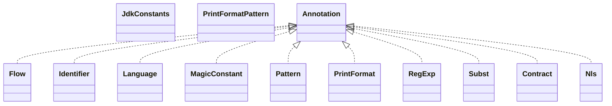

# annotations-13.0.jar

[Group index](README.md) | [All archives](../README.md)

## Scope and provenance

- **Donor:** `SQX_145_REFERENCE_ROOT/internal/libs/annotations-13.0.jar`.
- **SHA-256:** `ace2a10dc8e2d5fd34925ecac03e4988b2c0f851650c94b8cef49ba1bd111478`; accessed 2026-10-06; captured `2026-10-06T18:54:51.906614+00:00`.
- **Classes:** 32 raw entries; 32 unique entry names. Duplicate occurrence indices are zero-based.
- **Inspection:** read-only ZIP hashing and class-file structural parsing; signatures/descriptors, modifiers, hierarchy and references only. Bytecode bodies are hashed, not published.
- **Allocation:** proposed `FEAT-HOST-ANNOTATIONS`, P01; [roadmap](../../dev/sqx-full-application-roadmap.md). Domain README registration remains required.
- **Repository:** `01067f00031428613c6394064ca1bcadc1ba00ee`; review state unreviewed. Download label 145-dev1; installed build/activation and runtime equivalence unverified.
- **Limit:** every class/member is inventoried; declaration coverage does not establish consumed calls, defaults, formulas, failure semantics or algorithm parity.
- **Archive/resource index:** [006.json](../../dev/evidence/sqx145/archives/145/006.json).

## Complete member declarations

Member shards contain exact JVM names/descriptors, access flags, generic signatures, throws types, declared fields/methods, superclass/interfaces and referenced class names. All classes, nested/synthetic members and overloads are retained. Code length/hash is structural evidence, not a normalized algorithm comparison.

- [001.json](../../dev/evidence/sqx145/members/006/001.json) — SHA-256 `5d1ae0d1ff3c1f5e3d93eff2e4cccc1f00a23ab9b42c7b72823b26c7cbdc16c7`.

## Focused structural diagram

Up to twelve non-nested classes; arrows show declared inheritance/interfaces only. External type names are not evidence of an available body or an executed dependency.

## Class inventory

| Archive entry | Occurrence | Class SHA-256 | Fields | Methods |
| --- | ---: | --- | ---: | ---: |
| `org/intellij/lang/annotations/Flow.class` | 0 | `6bed154e890d0c0ab14c866df04f563277f8fceb3252286b0449bb566e0d1f66` | 5 | 4 |
| `org/intellij/lang/annotations/Identifier.class` | 0 | `f4641623a9765ebf0dc97e06c22a73f0a1fbae1fceb8a71f2857b80606dc1058` | 0 | 0 |
| `org/intellij/lang/annotations/JdkConstants$AdjustableOrientation.class` | 0 | `f788466732a81cb02c966b7ef2b53ff0acfe6f7173d217bdc2b23b334c0309c6` | 0 | 0 |
| `org/intellij/lang/annotations/JdkConstants$BoxLayoutAxis.class` | 0 | `6ac3a9ee01fe5f683fc79b70191ebb817eb1a64e28a579a51122d89209b5b6b1` | 0 | 0 |
| `org/intellij/lang/annotations/JdkConstants$CalendarMonth.class` | 0 | `db3c9d8c5b09ad6cb58cd140a68bfeed46e821dd7b7d3dadb214e863c685f7ca` | 0 | 0 |
| `org/intellij/lang/annotations/JdkConstants$CursorType.class` | 0 | `c132957566947f3e4806b1eedcbeefef7f49c789f16b028274e1868e143e7ee0` | 0 | 0 |
| `org/intellij/lang/annotations/JdkConstants$FlowLayoutAlignment.class` | 0 | `d78282822a2e8a13e2ae46660f3bb912ef4156c920bcd65dcfbef4c54603a783` | 0 | 0 |
| `org/intellij/lang/annotations/JdkConstants$FontStyle.class` | 0 | `bd5ca2aaf6cb9027285c99b9e8a786d58e41602c780a4b58056c4e8b2d0b410d` | 0 | 0 |
| `org/intellij/lang/annotations/JdkConstants$HorizontalAlignment.class` | 0 | `64d9d9c7957d395293b8eac5c6cdd52c5874d5fd9be4f9233e628a14b8186b35` | 0 | 0 |
| `org/intellij/lang/annotations/JdkConstants$InputEventMask.class` | 0 | `65aeaa699c8869e8a9750cf683e6ca49d6134aa1e4c83d156785cdd8cc6788d5` | 0 | 0 |
| `org/intellij/lang/annotations/JdkConstants$ListSelectionMode.class` | 0 | `1a0b52e841b71296156b4b0782f30bf72f78291ecad4c7a1aa27870e95a6c51c` | 0 | 0 |
| `org/intellij/lang/annotations/JdkConstants$PatternFlags.class` | 0 | `1b8f9f78eea8362b931820e192e673b22c909dae06af00560d6a686d434d59f9` | 0 | 0 |
| `org/intellij/lang/annotations/JdkConstants$TabLayoutPolicy.class` | 0 | `621e7b7d3e9b3a8c1c1a934d695f4fcde38ef3e6f38f1e246440a6574d5cbd43` | 0 | 0 |
| `org/intellij/lang/annotations/JdkConstants$TabPlacement.class` | 0 | `1fc14eef7825d5316286e7f826230f2b412c8173dc7f936d54fe1b0788a9b5c7` | 0 | 0 |
| `org/intellij/lang/annotations/JdkConstants$TitledBorderJustification.class` | 0 | `7567f08765ce51beb4025f2ac51b5b343c4c3d0b7b8ca915d031a01889be990e` | 0 | 0 |
| `org/intellij/lang/annotations/JdkConstants$TitledBorderTitlePosition.class` | 0 | `a76e938cc4197bf83b9703ae4b4f0226248c62e812d76cb1840e3bad892ec38f` | 0 | 0 |
| `org/intellij/lang/annotations/JdkConstants$TreeSelectionMode.class` | 0 | `64fc106a773f8b876e40649998dddfb1539a4450ff046e5a08f54f1b47dca26b` | 0 | 0 |
| `org/intellij/lang/annotations/JdkConstants.class` | 0 | `819aa64d367eb6cc89f8a17fb734a7332c7c8562179bc65ff548c67aac655f9f` | 0 | 1 |
| `org/intellij/lang/annotations/Language.class` | 0 | `18171c4a93113bfb76062103254b12bbbe8858d89fa30bd8c5cd2aae7b62286e` | 0 | 3 |
| `org/intellij/lang/annotations/MagicConstant.class` | 0 | `93ead505bddff12b56d91725cbccf45bbf7624f39592cbc6a1aeb9dafd10c565` | 0 | 5 |
| `org/intellij/lang/annotations/Pattern.class` | 0 | `7d28e4779f19fbfc3f761e16dda5f13186e5c9a4413b26bf8a124a86356a6c4b` | 0 | 1 |
| `org/intellij/lang/annotations/PrintFormat.class` | 0 | `dc267fc07ccb8f582e9559a34c73f1906ea86b97aaa4141311f681ea8c0a16ac` | 0 | 0 |
| `org/intellij/lang/annotations/PrintFormatPattern.class` | 0 | `d8a538bf6a06d08d5d3ab75718c028c7684020deed038380afd865d7762e22ce` | 7 | 1 |
| `org/intellij/lang/annotations/RegExp.class` | 0 | `8d72f76315e845d0102e39045ed0d77c2d6e153f71e1756cb16c466fbb2a1cdd` | 0 | 2 |
| `org/intellij/lang/annotations/Subst.class` | 0 | `4d5d2546e666127c794c49c3ae139150763ead0ceda7f35914b4fbf288e3aeee` | 0 | 1 |
| `org/jetbrains/annotations/Contract.class` | 0 | `a2f657ee04396d772e952f029f94ca2ecbd7fecea2775951bdf943cd0f977a6e` | 0 | 2 |
| `org/jetbrains/annotations/Nls.class` | 0 | `345bdc8d75afaf7f616427818a3bf368bdf8d556dbde4845f848184636d49a5d` | 0 | 0 |
| `org/jetbrains/annotations/NonNls.class` | 0 | `9254b03d08d5c8bc5c427156e3714ec38757dc0d51a119bd8105a5801f096fde` | 0 | 0 |
| `org/jetbrains/annotations/NotNull.class` | 0 | `ccb3e7459563a2848133d492686c95225386c1b60f9924df19af9ffaed0c2ad9` | 0 | 1 |
| `org/jetbrains/annotations/Nullable.class` | 0 | `08b37abf1d8cd9cb7555f711eb2b774ba71b74a87518bd09dd6ae859812f374a` | 0 | 1 |
| `org/jetbrains/annotations/PropertyKey.class` | 0 | `b74ab74c50db0a5defe2bb77e03ee5caf7987d33efe676bf705812bc71d8adfb` | 0 | 1 |
| `org/jetbrains/annotations/TestOnly.class` | 0 | `4a2ba5dade7060da0b6231c5fbed5afe5240e45d36d8f42a6ca6d15462847580` | 0 | 0 |
