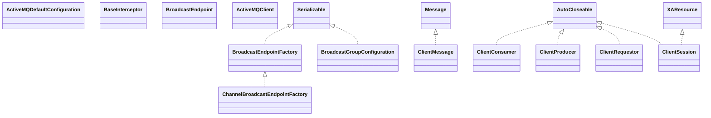

# artemis-core-client-1.5.0.jar

[Group index](README.md) | [All archives](../README.md)

## Scope and provenance

- **Donor:** `SQX_145_REFERENCE_ROOT/internal/libs/artemis-core-client-1.5.0.jar`.
- **SHA-256:** `14d38e4e405f3b597dfa23a82544664140dcd67e86bbc174e2b7d1c59770087f`; accessed 2026-10-06; captured `2026-10-06T18:54:51.906614+00:00`.
- **Classes:** 359 raw entries; 359 unique entry names. Duplicate occurrence indices are zero-based.
- **Inspection:** read-only ZIP hashing and class-file structural parsing; signatures/descriptors, modifiers, hierarchy and references only. Bytecode bodies are hashed, not published.
- **Allocation:** proposed `FEAT-COMPUTE-ARTEMIS-CORE-CLIENT`, P14; [roadmap](../../dev/sqx-full-application-roadmap.md). Domain README registration remains required.
- **Repository:** `01067f00031428613c6394064ca1bcadc1ba00ee`; review state unreviewed. Download label 145-dev1; installed build/activation and runtime equivalence unverified.
- **Limit:** every class/member is inventoried; declaration coverage does not establish consumed calls, defaults, formulas, failure semantics or algorithm parity.
- **Archive/resource index:** [008.json](../../dev/evidence/sqx145/archives/145/008.json).

## Complete member declarations

Member shards contain exact JVM names/descriptors, access flags, generic signatures, throws types, declared fields/methods, superclass/interfaces and referenced class names. All classes, nested/synthetic members and overloads are retained. Code length/hash is structural evidence, not a normalized algorithm comparison.

- [001.json](../../dev/evidence/sqx145/members/008/001.json) — SHA-256 `cc260c7d86fbbec2ed9f1fe5e42b594b1ced3cf32623db77d9d5653c05157d74`.
- [002.json](../../dev/evidence/sqx145/members/008/002.json) — SHA-256 `dbfdd85141aeda4b060ee474da7e128afd51a3125b2e2b897d3f2860b51cb144`.
- [003.json](../../dev/evidence/sqx145/members/008/003.json) — SHA-256 `a3340afc61e1d3924894d70a24a91fdf61350b75cd4880a495d733e6a13a7843`.
- [004.json](../../dev/evidence/sqx145/members/008/004.json) — SHA-256 `7781af7e118eeae05c37afeb72ccc813c7ab8223de8197d5682935fb4670bfbb`.
- [005.json](../../dev/evidence/sqx145/members/008/005.json) — SHA-256 `90b885e23d800ca37acd8cd1bc533a21b193e7b2525b36f641933fcb1a4b38cb`.

## Focused structural diagram

Up to twelve non-nested classes; arrows show declared inheritance/interfaces only. External type names are not evidence of an available body or an executed dependency.

## Class inventory

| Archive entry | Occurrence | Class SHA-256 | Fields | Methods |
| --- | ---: | --- | ---: | ---: |
| `org/apache/activemq/artemis/api/config/ActiveMQDefaultConfiguration.class` | 0 | `48b49038ca9fa9d27e0ac549bba59f77d488a03b12f9358f8cdde46d88bac9d9` | 120 | 123 |
| `org/apache/activemq/artemis/api/core/BaseInterceptor.class` | 0 | `0ec4b55916b6facab2b2c511cfb74dca0e980729b5f7edb59686930ffc51d126` | 0 | 1 |
| `org/apache/activemq/artemis/api/core/BroadcastEndpoint.class` | 0 | `57b8b469abb8d472f133d396ee43504ff1b773afde578ff6be60b8deaea436f6` | 0 | 6 |
| `org/apache/activemq/artemis/api/core/BroadcastEndpointFactory.class` | 0 | `6e572e9fefdd0fc75fcbb4591a81bff168b4215daa9e20f5488dff95276c1188` | 0 | 1 |
| `org/apache/activemq/artemis/api/core/BroadcastGroupConfiguration.class` | 0 | `885ddc38de31050c3971ca277b286c129d734dc9ccdf931788b88d5ca35b17a3` | 5 | 11 |
| `org/apache/activemq/artemis/api/core/ChannelBroadcastEndpointFactory.class` | 0 | `21c1de9b58f3f63b110ae9950ff612392369071c517f6f869edf90f97cef779c` | 5 | 7 |
| `org/apache/activemq/artemis/api/core/client/ActiveMQClient$1.class` | 0 | `be8d77b8eab471cbd8ccf1b4c65537ce39a5daad5207f9c6045a6dbaef7fca25` | 0 | 3 |
| `org/apache/activemq/artemis/api/core/client/ActiveMQClient$2.class` | 0 | `47a023a96b64b5d026f6501dfb034c300a603b04b6ad74f5f2b766596cefbef9` | 0 | 3 |
| `org/apache/activemq/artemis/api/core/client/ActiveMQClient.class` | 0 | `8ca67a4058079f847a3cc76d677b5daaa0b43fdd0da7b092a4b12a344e7a8006` | 46 | 18 |
| `org/apache/activemq/artemis/api/core/client/ClientConsumer.class` | 0 | `6b0951e94e8ad5b882df2e63c794a20be65b4e6120e01c9bb03ad402bc02f1e1` | 0 | 9 |
| `org/apache/activemq/artemis/api/core/client/ClientMessage.class` | 0 | `bdd32838204b6383f325d8f476e0baa338203a0e738f2ab2e71e244e25548b7e` | 0 | 54 |
| `org/apache/activemq/artemis/api/core/client/ClientProducer.class` | 0 | `16535d19e8001410d00edbf93d50b5e572d70c743ed5790f461bcfa8227092b9` | 0 | 11 |
| `org/apache/activemq/artemis/api/core/client/ClientRequestor.class` | 0 | `4a4c247fea8f43576ef678b75a3f06bc91d8a8b0f9e3a2cad3bcfbee09ecfc04` | 4 | 5 |
| `org/apache/activemq/artemis/api/core/client/ClientSession$AddressQuery.class` | 0 | `15bcbab4b804bcd3ae6df4eaf7e4cb93cc5cb0051f7787da73f5597678138702` | 0 | 4 |
| `org/apache/activemq/artemis/api/core/client/ClientSession$QueueQuery.class` | 0 | `736ed28070c4b9c4a26fa1d41e4c46499cfa3d087a0e3ca7c1de0f381542ac57` | 0 | 9 |
| `org/apache/activemq/artemis/api/core/client/ClientSession.class` | 0 | `160f6a89d78b2cb95b26ca7ac122c511954cf53729f069d95d7eda1131fc01e0` | 2 | 55 |
| `org/apache/activemq/artemis/api/core/client/ClientSessionFactory.class` | 0 | `3813ca2d84d9fc0212559bdc8324c1b7d43564a3f77db2c165ff1cb651353490` | 0 | 16 |
| `org/apache/activemq/artemis/api/core/client/ClusterTopologyListener.class` | 0 | `c34783e2bc5588cd8f3442c1a846ed9003f4c91b3e1d6f2809c3100fa185b7da` | 0 | 2 |
| `org/apache/activemq/artemis/api/core/client/FailoverEventListener.class` | 0 | `a5093fbb4b3ee623c3c5e47402ab5ca1a2b663e19a44ba3da174a5a5b88654a1` | 0 | 1 |
| `org/apache/activemq/artemis/api/core/client/FailoverEventType.class` | 0 | `3195e41cfeed06708930af8c895b31d429612021d9fc199c9f4a88b1c0ad344e` | 4 | 4 |
| `org/apache/activemq/artemis/api/core/client/loadbalance/ConnectionLoadBalancingPolicy.class` | 0 | `2cfbb64232959907fba704b99474eb8c914eca22ef07c24e2390a2330e09810f` | 0 | 1 |
| `org/apache/activemq/artemis/api/core/client/loadbalance/FirstElementConnectionLoadBalancingPolicy.class` | 0 | `295e3e67c8e559c8ada3a8e57cab2fa6c12884456a9e20015ba4592d43abae9f` | 0 | 2 |
| `org/apache/activemq/artemis/api/core/client/loadbalance/RandomConnectionLoadBalancingPolicy.class` | 0 | `f8c43a9c84e2e3489d5ad88066c9ef8090fc90fab53d13ba4b7e43c7e5ad7537` | 0 | 2 |
| `org/apache/activemq/artemis/api/core/client/loadbalance/RandomStickyConnectionLoadBalancingPolicy.class` | 0 | `0bda4aafc64f9b026acbc0c63343da9853730e3fb26e4372a4eeddac6369622c` | 1 | 2 |
| `org/apache/activemq/artemis/api/core/client/loadbalance/RoundRobinConnectionLoadBalancingPolicy.class` | 0 | `24bf5d95ae60fff6a7c6e302b5a499f46752ae308ce612762cc48c7a2d8e7236` | 3 | 2 |
| `org/apache/activemq/artemis/api/core/client/MessageHandler.class` | 0 | `43df07c89ed906f788238a8586710a89e0c35e8f0837c1463e507ce614c5e402` | 0 | 1 |
| `org/apache/activemq/artemis/api/core/client/SendAcknowledgementHandler.class` | 0 | `038b0cf637b3c6ec4202446f94d2d2532657f4e6a8e942d8a816b5dc9235e5c6` | 0 | 1 |
| `org/apache/activemq/artemis/api/core/client/ServerLocator.class` | 0 | `d2c03b12147c506e09a51ea56991153cb2f91184df535188943a869c8275f82a` | 0 | 85 |
| `org/apache/activemq/artemis/api/core/client/SessionFailureListener.class` | 0 | `6b805a063539bef36709729fb3025ef3997ccf9f76e2d45fa0f6f935e95e0907` | 0 | 1 |
| `org/apache/activemq/artemis/api/core/client/TopologyMember.class` | 0 | `db9cd8c7ed4789f5c3e9b975af4e5b28297e80acda5533e27dc54878249abbdf` | 0 | 9 |
| `org/apache/activemq/artemis/api/core/DiscoveryGroupConfiguration.class` | 0 | `d458aa4a99f89d9d72ad2ac5abdd0fc3f0edebc513c85a16b226067b4a270f62` | 5 | 12 |
| `org/apache/activemq/artemis/api/core/FilterConstants.class` | 0 | `72ab6c4d60b23176286daf02667435b28ea79fef10d8919754d151b785e66ac1` | 10 | 2 |
| `org/apache/activemq/artemis/api/core/Interceptor.class` | 0 | `541310a64165ecd57c41426f12e48b369f65b52ab4da1bc42d71559d47997081` | 0 | 0 |
| `org/apache/activemq/artemis/api/core/jgroups/JChannelManager.class` | 0 | `547cf068cd8cb77b5bc8d1a0ea4fadc7ff26545338e69cf90230afa52a94dad5` | 4 | 8 |
| `org/apache/activemq/artemis/api/core/jgroups/JChannelWrapper$1.class` | 0 | `28cf34f7004edc2440e3fb12769a66812f46852f943d0240d7276d3eeba1de7d` | 2 | 3 |
| `org/apache/activemq/artemis/api/core/jgroups/JChannelWrapper.class` | 0 | `b24a1db34005f628618c48bedcf0dd4e882fe1b1b510329265ad85a3ab5458de` | 7 | 13 |
| `org/apache/activemq/artemis/api/core/jgroups/JGroupsReceiver.class` | 0 | `a6d908367a579ad7b7744275f5bf336c45c6a22a8c421fb178560974e015e822` | 2 | 6 |
| `org/apache/activemq/artemis/api/core/JGroupsBroadcastEndpoint.class` | 0 | `0510861914dbec245fc9f8d877b3118917896b222feebb25bdabfc4f5755ad63` | 7 | 12 |
| `org/apache/activemq/artemis/api/core/JGroupsChannelBroadcastEndpoint.class` | 0 | `3dfb77fb77f7edda6e35f0d8812fbe376502b83b380e5c28c0508f106de59fab` | 1 | 3 |
| `org/apache/activemq/artemis/api/core/JGroupsFileBroadcastEndpoint.class` | 0 | `523543a951beef271c06ec4400f53c796fb37d8c72961961a2a83dd1ef9399c3` | 1 | 2 |
| `org/apache/activemq/artemis/api/core/JGroupsFileBroadcastEndpointFactory.class` | 0 | `37bb4ea15aaa517e922720bc204c8b613e9c1891c8c03de22ad000c2b8968853` | 3 | 6 |
| `org/apache/activemq/artemis/api/core/JGroupsPropertiesBroadcastEndpoint.class` | 0 | `0a0880df05c5a711b2bd8dcd7daf8dabfe5a99101c31d46297e44e6fd2b3218a` | 1 | 2 |
| `org/apache/activemq/artemis/api/core/JGroupsPropertiesBroadcastEndpointFactory.class` | 0 | `2c7e58ef8e99013629457e00d3984d8c37edd51429ec71e6fc672e7e97fef5ae` | 3 | 6 |
| `org/apache/activemq/artemis/api/core/JsonUtil$NullableJsonString.class` | 0 | `a47167dbb8acd911591758e27b92c8a17d2ddbfe1872fde0b97228b1bed9358c` | 2 | 5 |
| `org/apache/activemq/artemis/api/core/JsonUtil.class` | 0 | `d94127e221626fb9eee257be8e41b6081f4afa1695472c9aa2dd30b4d65edbe4` | 0 | 11 |
| `org/apache/activemq/artemis/api/core/management/AcceptorControl.class` | 0 | `f6dea4422b673c99b366b8a0f6bcd3fcf048b64d786da41aeaf4234e568ac79a` | 0 | 4 |
| `org/apache/activemq/artemis/api/core/management/ActiveMQComponentControl.class` | 0 | `0fe49c8d0d325cc71387e15c39caad5607a0b047f841dca01ee75562d0caf35c` | 0 | 3 |
| `org/apache/activemq/artemis/api/core/management/ActiveMQServerControl.class` | 0 | `37f3bf077ebdf4c8693fdc30c58419c1611f0db0208952494967257d00ce6244` | 0 | 115 |
| `org/apache/activemq/artemis/api/core/management/AddressControl.class` | 0 | `3f9ab5123d752a3b90a173a0241807b7c7ee1a95e64fab514ba8b253b3dea95f` | 0 | 10 |
| `org/apache/activemq/artemis/api/core/management/AddressSettingsInfo.class` | 0 | `5e672d937b5c972bd8e506edc46b6783435b60982b38fc161ee7e3b7a2143e0e` | 20 | 23 |
| `org/apache/activemq/artemis/api/core/management/Attribute.class` | 0 | `5b224d22184672d1cac3627455c554e48da48a8471b0f31a7854f6c477a7f5e4` | 0 | 1 |
| `org/apache/activemq/artemis/api/core/management/BridgeControl.class` | 0 | `a1badd82f9a8da3895144e8922f94727c654035818c98ca135ee491e12a7549f` | 0 | 12 |
| `org/apache/activemq/artemis/api/core/management/BroadcastGroupControl.class` | 0 | `84b0d7777b5f737995522d5cae96c0bdba20a819909c6998d2bced9ff65d934a` | 0 | 7 |
| `org/apache/activemq/artemis/api/core/management/ClusterConnectionControl.class` | 0 | `32bcbe00aecf69cae602fa5f3580fde5abcc12aace247a4162b98ad3645db8c6` | 0 | 12 |
| `org/apache/activemq/artemis/api/core/management/CoreNotificationType.class` | 0 | `ff303b59fdc5adaf6b1071a29c81a120b9b41aa689c8e15fc65ed812285afa7a` | 22 | 5 |
| `org/apache/activemq/artemis/api/core/management/DayCounterInfo.class` | 0 | `01a90afaa5627589d0f1e33afd9b11c0c12b101a82122aac92b430601039bf82` | 2 | 5 |
| `org/apache/activemq/artemis/api/core/management/DivertControl.class` | 0 | `e4441f7989335739df41791e9d1fb78fb7e49ab243d891ddc4f8b86ba1d23fae` | 0 | 7 |
| `org/apache/activemq/artemis/api/core/management/ManagementHelper.class` | 0 | `c355f73f01ed25729811dde30f3004862940dd673277b3f6ebf2c0e72bdca9ee` | 23 | 13 |
| `org/apache/activemq/artemis/api/core/management/NotificationType.class` | 0 | `0d66d9eb28b784665d9e1ae1e0b09860fd37e09d21a2ded9c42ee564a1222608` | 0 | 1 |
| `org/apache/activemq/artemis/api/core/management/ObjectNameBuilder.class` | 0 | `8a24b54ae452375702d6995780c822b7a31cbc38826cb6dd60a3c544d374620b` | 6 | 21 |
| `org/apache/activemq/artemis/api/core/management/Operation.class` | 0 | `0ee2c8b31ad0599f11f81b6cfefba4b48f5d07d41c4c83ac0faf8f6cc31d9ae2` | 0 | 2 |
| `org/apache/activemq/artemis/api/core/management/Parameter.class` | 0 | `4af683b39dea0b705a44da22d0ada881e702671b352384ba56b5364c1bab6cf1` | 0 | 2 |
| `org/apache/activemq/artemis/api/core/management/QueueControl.class` | 0 | `92bb3883db084064ced5af8bfbd1aa8e182e0ef3bda1f6556145c61c4fac3ce9` | 0 | 59 |
| `org/apache/activemq/artemis/api/core/management/ResourceNames.class` | 0 | `f956f143e4e652dd1941af347701e4be8831e1fe6bf7b2b2d4ae5240f29b5c85` | 13 | 1 |
| `org/apache/activemq/artemis/api/core/management/RoleInfo.class` | 0 | `11e2679ea99a47672934c549bf90cef9a6218489e602e69fe32ebbebc6aa617e` | 9 | 11 |
| `org/apache/activemq/artemis/api/core/Message.class` | 0 | `e071cf4d6e88850f42d5ec11caf67bccad2308d98e5c3ce2ec81d4855624c084` | 18 | 73 |
| `org/apache/activemq/artemis/api/core/TransportConfiguration.class` | 0 | `60b64aee290889d1b25aefdcc163b48b2d88be1c88a4d10b8b3d5c14308c46d8` | 9 | 21 |
| `org/apache/activemq/artemis/api/core/TransportConfigurationHelper.class` | 0 | `d35233c504b65ee502749fdbc83ae8c480999cbb3486b3b913ae9e5844025fe3` | 0 | 1 |
| `org/apache/activemq/artemis/api/core/UDPBroadcastEndpointFactory$1.class` | 0 | `a1490851b64c48bf7294cc67e8fb721e6829ce4d74d360c6a61299c4aa94aed6` | 0 | 0 |
| `org/apache/activemq/artemis/api/core/UDPBroadcastEndpointFactory$UDPBroadcastEndpoint.class` | 0 | `0db05a88b1748fbb4cb59af0d3f18c1647a1a2da29b2fe97d599e331345378d9` | 8 | 16 |
| `org/apache/activemq/artemis/api/core/UDPBroadcastEndpointFactory.class` | 0 | `992e79ba447a23d4c85a309a873826e61e2e3a82e4cf84b54e728cbec5c86635` | 4 | 15 |
| `org/apache/activemq/artemis/core/buffers/impl/ResetLimitWrappedActiveMQBuffer.class` | 0 | `0d3e72a14afc06ea791fa5b2016ed09c75f0f36119cb10a1ea3d3d3c7cf7806e` | 2 | 42 |
| `org/apache/activemq/artemis/core/client/ActiveMQClientLogger.class` | 0 | `0dbdae32ef792c6ce3db007034965590fbb2df53bc9aa7ca20bde3885d82c1a4` | 1 | 86 |
| `org/apache/activemq/artemis/core/client/ActiveMQClientLogger_$logger.class` | 0 | `0b6be2d93d2f93204e94341986bbb3997100c2aa73bd622fabb891777cf6609e` | 87 | 172 |
| `org/apache/activemq/artemis/core/client/ActiveMQClientMessageBundle.class` | 0 | `2aade242e880b48f7ea5d1c01309e7858f3e75b7b1bdfb92f370f82d7b605c91` | 1 | 62 |
| `org/apache/activemq/artemis/core/client/ActiveMQClientMessageBundle_$bundle.class` | 0 | `49677e2e3baccd1856b8ba5912b2c96cc85e40af197be0b1c259ca3311f5c59e` | 63 | 125 |
| `org/apache/activemq/artemis/core/client/impl/ActiveMQXAResource.class` | 0 | `69551966fc28b7b47a908aa63c6a704fc62aca9426c32e8ea79cf56efc4aa395` | 0 | 1 |
| `org/apache/activemq/artemis/core/client/impl/AddressQueryImpl.class` | 0 | `935c5482595004b982d3b2f85554a61954eabf74801142e82bbe10707df22eb0` | 4 | 5 |
| `org/apache/activemq/artemis/core/client/impl/AfterConnectInternalListener.class` | 0 | `1b370638537f1127422e07d7f0fac7adfab6ff47c81ef928b17cdfffa1ced389` | 0 | 1 |
| `org/apache/activemq/artemis/core/client/impl/ClientConsumerImpl$1.class` | 0 | `f9d8feec3aea23df840c0963f1f121448a38afc95cdab90a8409885954927761` | 2 | 2 |
| `org/apache/activemq/artemis/core/client/impl/ClientConsumerImpl$2.class` | 0 | `3f3a9b130bb8aa080a1b03ac0f07faf0eaa57b3e48d85ee8d7238662eb17f55b` | 2 | 2 |
| `org/apache/activemq/artemis/core/client/impl/ClientConsumerImpl$3.class` | 0 | `143eec890227afc58ed2a2c53129bb7cd11948634d0e1724011840f08347ce86` | 2 | 2 |
| `org/apache/activemq/artemis/core/client/impl/ClientConsumerImpl$4.class` | 0 | `9047a263ca9c23acd94918ca3605ee7478d875818740e383efea7e446e1a074d` | 1 | 3 |
| `org/apache/activemq/artemis/core/client/impl/ClientConsumerImpl$5.class` | 0 | `296fd95cf4d38c53562039bc4166bf4d9d119ef6edb8a6ea5be268054a65ab43` | 2 | 2 |
| `org/apache/activemq/artemis/core/client/impl/ClientConsumerImpl$Runner.class` | 0 | `55db65118a3c8c308acea8a0f5977923274a8e532012d4b00c5ae6499c565fce` | 1 | 3 |
| `org/apache/activemq/artemis/core/client/impl/ClientConsumerImpl.class` | 0 | `0bed8b5421d26ac42a6e3cc12f54c1a528111b465669cb3a5b03d853d023a3ac` | 35 | 53 |
| `org/apache/activemq/artemis/core/client/impl/ClientConsumerInternal.class` | 0 | `c106bbd692c135814a49c1a2c72647f47b038501d638957908a2fc8c0bcfd550` | 0 | 19 |
| `org/apache/activemq/artemis/core/client/impl/ClientLargeMessageImpl$ActiveMQOutputStream.class` | 0 | `a9dd696fd1ff9f7e8aa6834310788a44e6b2bd3f11b955abad3cb0eda2969763` | 1 | 2 |
| `org/apache/activemq/artemis/core/client/impl/ClientLargeMessageImpl.class` | 0 | `7c2f4c3f7c73f2951bc107e405b734b7eba0c92106cef1554d6c24913ef843cf` | 2 | 18 |
| `org/apache/activemq/artemis/core/client/impl/ClientLargeMessageInternal.class` | 0 | `eb29a3bfb629aebe26091b40ac5674d53cef819e6a6871e9fe8c5d133f8d2290` | 0 | 3 |
| `org/apache/activemq/artemis/core/client/impl/ClientMessageImpl$1.class` | 0 | `e7555dea3c8b6344024ca424bc43a2939608f3878b1a2eaacc2538d0e9330ad6` | 0 | 0 |
| `org/apache/activemq/artemis/core/client/impl/ClientMessageImpl$DecodingContext.class` | 0 | `da529005bac30ba12e9b58c03d1168fe9b9473dd133ee474e2f083de7257b36a` | 1 | 7 |
| `org/apache/activemq/artemis/core/client/impl/ClientMessageImpl.class` | 0 | `95ab5099970c8b0a3c6c58a9aa8a1de4dfadab5bd29d44a97efa0647abbe53e9` | 5 | 97 |
| `org/apache/activemq/artemis/core/client/impl/ClientMessageInternal.class` | 0 | `1192bd94a091dbf7c5efda16e5d2915668058ecfb2283ce3d347fc046530ffa6` | 0 | 7 |
| `org/apache/activemq/artemis/core/client/impl/ClientProducerCreditManager.class` | 0 | `dd8a2a26a014cf433bb8cf3fef1f04d7641d93cf6a7d5ce628c63d7938da5858` | 0 | 8 |
| `org/apache/activemq/artemis/core/client/impl/ClientProducerCreditManagerImpl$ClientProducerCreditsNoFlowControl.class` | 0 | `0a0af9e588cf82c84359bb3ab26968a2da9ae045ac270e5a6d240cb17cce57fc` | 1 | 12 |
| `org/apache/activemq/artemis/core/client/impl/ClientProducerCreditManagerImpl.class` | 0 | `778012110d274b85de91777627c607c7b79c16fcefabce7228330bea6c4261d0` | 5 | 11 |
| `org/apache/activemq/artemis/core/client/impl/ClientProducerCredits.class` | 0 | `76b0e245d262fea9e60c2f829995f3b34897c9c82a93c64d7de3db4688ccae60` | 0 | 10 |
| `org/apache/activemq/artemis/core/client/impl/ClientProducerCreditsImpl.class` | 0 | `8bc1b823cf80adc0cb4bc526b7d1a0f65ac77e6a85be5df51e584fd6b871de63` | 11 | 14 |
| `org/apache/activemq/artemis/core/client/impl/ClientProducerImpl.class` | 0 | `9a488265a2b7fe3e6998ea6d2cf373363f11c611ae8d4f029b7f329a14f36594` | 11 | 24 |
| `org/apache/activemq/artemis/core/client/impl/ClientProducerInternal.class` | 0 | `504b29be8a4fa1e827a6a796cb5f25308fc96e1172156eb2c9ce2aea056ddb2d` | 0 | 2 |
| `org/apache/activemq/artemis/core/client/impl/ClientSessionFactoryImpl$1.class` | 0 | `75e5744e0515e22c805d2a91ff0f04a4bc548d7fd2e1e48184749f09dd6d753c` | 3 | 2 |
| `org/apache/activemq/artemis/core/client/impl/ClientSessionFactoryImpl$2.class` | 0 | `185d863ea61c79c444b723eb6d87bdda95abf3b11820e5c25257eae0872f4271` | 2 | 3 |
| `org/apache/activemq/artemis/core/client/impl/ClientSessionFactoryImpl$ActualScheduledPinger.class` | 0 | `eaf7f91dc16c21248840c638d988dcf6af4de6f1c5d4e78f90c6a99dda8bf13c` | 1 | 2 |
| `org/apache/activemq/artemis/core/client/impl/ClientSessionFactoryImpl$CloseRunnable.class` | 0 | `682ec2db66f1e20ba1f5759c6cf48fa5326882a5f5de22225d3901ae9141ec9f` | 3 | 3 |
| `org/apache/activemq/artemis/core/client/impl/ClientSessionFactoryImpl$DelegatingBufferHandler.class` | 0 | `d01d547f519e956ae6126fd44db720d9607594c25f752f3c0df0033bca52e07f` | 1 | 3 |
| `org/apache/activemq/artemis/core/client/impl/ClientSessionFactoryImpl$DelegatingFailureListener.class` | 0 | `851f3a45483c4841ac419a27ca68fd78d1e0cdb6677b727064bbbb10d9c331d2` | 2 | 4 |
| `org/apache/activemq/artemis/core/client/impl/ClientSessionFactoryImpl$PingRunnable$1.class` | 0 | `c9b0deb184ed56b41433acfb39ecc94869fa17b98ec8173c6cf3f5281d0ebc32` | 3 | 2 |
| `org/apache/activemq/artemis/core/client/impl/ClientSessionFactoryImpl$PingRunnable.class` | 0 | `0b15dbf08b7828bd0668fa7e7ea667cf8f123d0fc60d480c1e56942a7d9d0374` | 4 | 5 |
| `org/apache/activemq/artemis/core/client/impl/ClientSessionFactoryImpl$SessionFactoryTopologyHandler.class` | 0 | `dc777880646c39be1b843cd7e34c5f46ea48e5ddafeb6097b5b8bd47c0ec153d` | 1 | 4 |
| `org/apache/activemq/artemis/core/client/impl/ClientSessionFactoryImpl.class` | 0 | `0122ae1071dc7a01e17b95b29a6cacd4a035cd0331101232e5e11c3c57297382` | 40 | 78 |
| `org/apache/activemq/artemis/core/client/impl/ClientSessionFactoryInternal.class` | 0 | `43d4d1718c8297a2715998325ff2261e609fbc9eae81b12bf3733054ce0ef090` | 0 | 16 |
| `org/apache/activemq/artemis/core/client/impl/ClientSessionImpl$1.class` | 0 | `fbcde89fa823699442cf7065e75795bc18637002882b0a7d90f0122aadbc1b6a` | 2 | 2 |
| `org/apache/activemq/artemis/core/client/impl/ClientSessionImpl$2.class` | 0 | `706d264e5ab5ab12593e9c4d6783c4427430c667ca2c7dbac5ef3b27ad539864` | 3 | 2 |
| `org/apache/activemq/artemis/core/client/impl/ClientSessionImpl.class` | 0 | `7c73829fa1a063691a3abb297a781b2c595bb8c540c072453477525998a5324e` | 41 | 131 |
| `org/apache/activemq/artemis/core/client/impl/ClientSessionInternal.class` | 0 | `0f8bd96d1bdc25ccc49251db3bcbb14a538460b7b3e1cfb2a4449b2dc87075ed` | 0 | 40 |
| `org/apache/activemq/artemis/core/client/impl/CompressedLargeMessageControllerImpl.class` | 0 | `bf4d4da71e5736399305d99905ca453b2c69039f0c124d987a25cbecd5de99b7` | 3 | 111 |
| `org/apache/activemq/artemis/core/client/impl/LargeMessageController.class` | 0 | `646fd8fd3eb81038bd51dec15184c3fcaa750439efbbdfa48aed4002db5e8c45` | 0 | 8 |
| `org/apache/activemq/artemis/core/client/impl/LargeMessageControllerImpl$1.class` | 0 | `88e5f1c48bcc629056858f780810bade5054562b2dab8bc7f6bb20ea22e8669f` | 0 | 0 |
| `org/apache/activemq/artemis/core/client/impl/LargeMessageControllerImpl$FileCache.class` | 0 | `aecc664a2433d93fb8f3912e2c5c4f78eb612eeb28150accaefa7dc2c8c53115` | 7 | 8 |
| `org/apache/activemq/artemis/core/client/impl/LargeMessageControllerImpl$LargeData.class` | 0 | `c9c6c802e333bf65c64101548bad9c402b95f00aea2db9bbd295bb3d07758255` | 3 | 7 |
| `org/apache/activemq/artemis/core/client/impl/LargeMessageControllerImpl.class` | 0 | `d135aea787266d9d8905266f4bdced5033a44b419d9ec73f6bb7ed5848a1d837` | 18 | 145 |
| `org/apache/activemq/artemis/core/client/impl/QueueQueryImpl.class` | 0 | `241a9774c6227fc14c290cbc73181e8fc9462c7d840ef9daea9b51634a47b2ae` | 9 | 11 |
| `org/apache/activemq/artemis/core/client/impl/ServerLocatorImpl$1.class` | 0 | `74016bc2fe7b514d652fd73303a91ca0bffb9c892c9060e0eb1ff89b0455c432` | 1 | 3 |
| `org/apache/activemq/artemis/core/client/impl/ServerLocatorImpl$2.class` | 0 | `3c903281077126f27593067ed667bed784a0b8e8291b1da562f366c08e2970e0` | 1 | 3 |
| `org/apache/activemq/artemis/core/client/impl/ServerLocatorImpl$3.class` | 0 | `a22850413eefd9853b4ef79eff9e933979948ce6e20cc7f3d8230bac559a7954` | 1 | 2 |
| `org/apache/activemq/artemis/core/client/impl/ServerLocatorImpl$4.class` | 0 | `b5c6cfba1a55eca06af3366a728ea4ed1f01b5848bcf61fa373048d82e1dd20c` | 1 | 2 |
| `org/apache/activemq/artemis/core/client/impl/ServerLocatorImpl$5.class` | 0 | `f67730b450a0364db387e2d5e8ec5a064e9befe679092a564123f0bb6e181f87` | 1 | 2 |
| `org/apache/activemq/artemis/core/client/impl/ServerLocatorImpl$6.class` | 0 | `49b4d24a65c4e90f8a0a0245919452da2d858c4b1630fd2c516fa033d9050a95` | 3 | 2 |
| `org/apache/activemq/artemis/core/client/impl/ServerLocatorImpl$STATE.class` | 0 | `f28523bfe1c1576d9c33d68b32879f2f068693f4df654e0c785e35f2ea5b6bdb` | 4 | 4 |
| `org/apache/activemq/artemis/core/client/impl/ServerLocatorImpl$StaticConnector$1.class` | 0 | `e56f63fdd8239daac9b11c2720482a8e6a31bec2a71786e8a81d90c4c046936d` | 1 | 4 |
| `org/apache/activemq/artemis/core/client/impl/ServerLocatorImpl$StaticConnector$Connector.class` | 0 | `a94eb0665d9c9b5036d9294dd9adcf46f96719146403161845d17b7c5d8e1ac8` | 3 | 5 |
| `org/apache/activemq/artemis/core/client/impl/ServerLocatorImpl$StaticConnector.class` | 0 | `deb03837700d5a05b427659df238cbcb38c46bba1b3fd626ac1264dc3d9e5dcd` | 3 | 6 |
| `org/apache/activemq/artemis/core/client/impl/ServerLocatorImpl.class` | 0 | `360d76a88b83a90863d53002f28790e7109d4aa6b8b71d194dfbefa46d60f3fe` | 62 | 200 |
| `org/apache/activemq/artemis/core/client/impl/ServerLocatorInternal.class` | 0 | `693b30349815579991ad5fa6d9a3f8c993db763baa2d809af2f2b9e3f2bd4859` | 0 | 20 |
| `org/apache/activemq/artemis/core/client/impl/Topology$1.class` | 0 | `8c566b334d277b69abbbf50fc40e03e9bdd728f969c3d4a7886ca69c98c460e1` | 4 | 2 |
| `org/apache/activemq/artemis/core/client/impl/Topology$2.class` | 0 | `2466df27a1789ff962b0c08a6dff1a9676aa3f318c6351ea403f53d4ee6b706f` | 4 | 2 |
| `org/apache/activemq/artemis/core/client/impl/Topology$3.class` | 0 | `38d32e976e4884523bf844c2e2796c167e09e8885566ee742ab3665b499fbd8e` | 2 | 2 |
| `org/apache/activemq/artemis/core/client/impl/Topology$DirectExecutor.class` | 0 | `561cd3b71aef6390d97b488918c7c80988c1d795a7b71c12496314ad8fc2abe2` | 0 | 3 |
| `org/apache/activemq/artemis/core/client/impl/Topology.class` | 0 | `3b92217772883ab5d952bc9d52f90cfc2531e05343d46324b2536c6c1ac77064` | 6 | 28 |
| `org/apache/activemq/artemis/core/client/impl/TopologyMemberImpl.class` | 0 | `55f2ffa2ed9bc60509cc28450959aec09afca7400942865217e76195ac3dc68f` | 6 | 15 |
| `org/apache/activemq/artemis/core/cluster/DiscoveryEntry.class` | 0 | `3a5adf284e4cbaea2cdb38578aeedb1bb7d1ac18ac9f04b43fe788d067d7badd` | 3 | 5 |
| `org/apache/activemq/artemis/core/cluster/DiscoveryGroup$DiscoveryRunnable.class` | 0 | `6d67954b8bb0842ccd8f58bddeab3ea76912647530ac4ee8a7302a2bf3adc238` | 1 | 2 |
| `org/apache/activemq/artemis/core/cluster/DiscoveryGroup.class` | 0 | `fef6523bc38bb788547e9555e78e16e4c3b05d2be19a6214087a542e9a923015` | 13 | 24 |
| `org/apache/activemq/artemis/core/cluster/DiscoveryListener.class` | 0 | `aee4354ee167a96307c749b0d0ee3b864e5c285f1f9cb8c7057f9c26f6102362` | 0 | 1 |
| `org/apache/activemq/artemis/core/exception/ActiveMQXAException.class` | 0 | `1273203f5da26f6e0a4030f93f8724d4d8958c4d565cab6e54714d37c1fb1f8d` | 1 | 2 |
| `org/apache/activemq/artemis/core/message/BodyEncoder.class` | 0 | `a347bbd278e1e184d5642ff350dccb42cc3499adff124d782c437e5b5ca46c8f` | 0 | 5 |
| `org/apache/activemq/artemis/core/message/impl/MessageImpl$1.class` | 0 | `f0276d4ab9111b13b5d3e2114abdcfca65780671a1dc881156a81231e83cdbcb` | 0 | 0 |
| `org/apache/activemq/artemis/core/message/impl/MessageImpl$DecodingContext.class` | 0 | `fc74b129039a724174dd3797f9908de816e2638692a6282c35e80f0adb11fcc7` | 2 | 7 |
| `org/apache/activemq/artemis/core/message/impl/MessageImpl.class` | 0 | `2321123974ef0a19826fd2f88aa07a1b0909ee2a4ed2464823ddf97a3953269a` | 20 | 108 |
| `org/apache/activemq/artemis/core/message/impl/MessageInternal.class` | 0 | `0d83bfe1c7fb14a29488e7b85becf10fdcbb7f684ccdc67f82d74513634d811e` | 0 | 14 |
| `org/apache/activemq/artemis/core/protocol/ClientPacketDecoder.class` | 0 | `825303fca9d0c0674713a4cad370d11a26a35e4147dc85b11eba6e7db16fc2bd` | 2 | 4 |
| `org/apache/activemq/artemis/core/protocol/core/Channel.class` | 0 | `a2f2ea84a8c6f1563234e3da601665b2185fff8adc1cbd09c920c3b881b3ce0e` | 0 | 29 |
| `org/apache/activemq/artemis/core/protocol/core/ChannelHandler.class` | 0 | `68d08c93210bc1b1a12a9b7a12846220b64ca41d5fa1dc9ad84d68100f1244c8` | 0 | 1 |
| `org/apache/activemq/artemis/core/protocol/core/CommandConfirmationHandler.class` | 0 | `bdda0fc722b7d6c1ba58c6effcc74cf51f56daec2d80363c29d485ff17d7845c` | 0 | 1 |
| `org/apache/activemq/artemis/core/protocol/core/CoreRemotingConnection.class` | 0 | `36790bb525f9b97dd6823b03e6121f64313794331aa82bf9e466399d6ac2c9ae` | 0 | 12 |
| `org/apache/activemq/artemis/core/protocol/core/impl/ActiveMQClientProtocolManager$1.class` | 0 | `38b32dd2f47aa74f9daf9a91f4db068fb2c20cfbbc0dab9279e9b27c70c4d685` | 0 | 0 |
| `org/apache/activemq/artemis/core/protocol/core/impl/ActiveMQClientProtocolManager$Channel0Handler.class` | 0 | `13b03cd3105f6b71733b6d23893eeddc14940a92ae26b5dc557604783b13cb30` | 2 | 4 |
| `org/apache/activemq/artemis/core/protocol/core/impl/ActiveMQClientProtocolManager.class` | 0 | `86f970ec7ddf69870e43744c96e86f7f48b1772d83548280fcde2152a33f0f49` | 11 | 26 |
| `org/apache/activemq/artemis/core/protocol/core/impl/ActiveMQClientProtocolManagerFactory.class` | 0 | `01fb0f9c486c1d8c7b02a2961d56b3701db95683844018aaa559feef58097925` | 2 | 5 |
| `org/apache/activemq/artemis/core/protocol/core/impl/ActiveMQConsumerContext.class` | 0 | `8b115d31113aba9cb7921eb7c6df1e680019377e1775abe4e9957ac7542cef4f` | 1 | 5 |
| `org/apache/activemq/artemis/core/protocol/core/impl/ActiveMQSessionContext$1.class` | 0 | `7b174968eeb3663856a70a0506e6371eb3a7a4bc132ac2c27f736e9278455d26` | 1 | 3 |
| `org/apache/activemq/artemis/core/protocol/core/impl/ActiveMQSessionContext$2.class` | 0 | `14ab955acc97077263a6c16217d5ae980ed253c27b13c0d9d9a0d2e6cea70c8e` | 1 | 3 |
| `org/apache/activemq/artemis/core/protocol/core/impl/ActiveMQSessionContext$ClientSessionPacketHandler.class` | 0 | `bb85262b6d564f75556126d8eb65c8435996b1819ced882a230eac5c7abeae11` | 1 | 2 |
| `org/apache/activemq/artemis/core/protocol/core/impl/ActiveMQSessionContext.class` | 0 | `d754f80360480ce19dc59d9a6a8b313c997065f41a6bb89529e2d5056c5a6c4a` | 7 | 78 |
| `org/apache/activemq/artemis/core/protocol/core/impl/BackwardsCompatibilityUtils.class` | 0 | `1763ce4ee101ad450256a268c1ebb43f666e38b036b0d726c2d6829f6ebb5782` | 1 | 4 |
| `org/apache/activemq/artemis/core/protocol/core/impl/ChannelImpl$CHANNEL_ID.class` | 0 | `cc3709195589761086cbed0daf3548b18b5ce62016c3bdf7eadfdac91034cefc` | 7 | 5 |
| `org/apache/activemq/artemis/core/protocol/core/impl/ChannelImpl.class` | 0 | `b0667fc7a4f7ed25e4806326f70988d2496effbb8141dbdcb536345f6c7aba26` | 21 | 39 |
| `org/apache/activemq/artemis/core/protocol/core/impl/PacketDecoder.class` | 0 | `1f32266c0152d99117a50512850794156496c1b2ac27e9e805ebed793d4ab7f5` | 0 | 3 |
| `org/apache/activemq/artemis/core/protocol/core/impl/PacketImpl.class` | 0 | `60ea2dcbbf9a883c476eeaf381f7a1a8bc9361dae6e7e6d42de3df6465e27b66` | 101 | 17 |
| `org/apache/activemq/artemis/core/protocol/core/impl/RemotingConnectionImpl.class` | 0 | `e9df9d8cc9cd6c0ae1167631253cfeefe067eec8a4fed0cf685b7595bfb3b729` | 16 | 32 |
| `org/apache/activemq/artemis/core/protocol/core/impl/wireformat/ActiveMQExceptionMessage.class` | 0 | `2ebb5d9e678400be3be659356e4b361e5b55f0ee684940cca205148f114fb394` | 1 | 9 |
| `org/apache/activemq/artemis/core/protocol/core/impl/wireformat/CheckFailoverMessage.class` | 0 | `625ad6d137158dfcae13c5e0c6dd9a8209eaba9132842c7c6f6d62088d5c61c7` | 1 | 6 |
| `org/apache/activemq/artemis/core/protocol/core/impl/wireformat/CheckFailoverReplyMessage.class` | 0 | `56fce20419943b4303cf2fc5bbd438b11aed09797c7b084b47d6168b1783c605` | 1 | 7 |
| `org/apache/activemq/artemis/core/protocol/core/impl/wireformat/ClusterTopologyChangeMessage.class` | 0 | `9dad89d8dc4c1c7142cf47956f1c4d3b42efbdda307b8755479b8eae86a6800b` | 4 | 13 |
| `org/apache/activemq/artemis/core/protocol/core/impl/wireformat/ClusterTopologyChangeMessage_V2.class` | 0 | `8f8b18c42052f783e4f5a4e6d4a9fa550a94591ad981a7e27317d2677d890687` | 2 | 11 |
| `org/apache/activemq/artemis/core/protocol/core/impl/wireformat/ClusterTopologyChangeMessage_V3.class` | 0 | `82121e1156aff793373f415353aab7027bb620ecada2f565e130031912ed9ac5` | 1 | 8 |
| `org/apache/activemq/artemis/core/protocol/core/impl/wireformat/CreateQueueMessage.class` | 0 | `fe9c07b001947a637c1b92a433db20c6899bf2db12cccd150975bc9735e8e6cd` | 6 | 18 |
| `org/apache/activemq/artemis/core/protocol/core/impl/wireformat/CreateSessionMessage.class` | 0 | `d8ac91d0904b4c963c8c7910ddb686d969177366b2c39de1f2dddc2283684be0` | 12 | 20 |
| `org/apache/activemq/artemis/core/protocol/core/impl/wireformat/CreateSessionResponseMessage.class` | 0 | `e2ad3963ce422a90c5d2b1e454bc739373681fb566edef882a801bdfacf705cf` | 1 | 10 |
| `org/apache/activemq/artemis/core/protocol/core/impl/wireformat/CreateSharedQueueMessage.class` | 0 | `5b509c4856a9049cff2a1052c3d503f8b13591b90da3516f41f8295c7147686a` | 5 | 15 |
| `org/apache/activemq/artemis/core/protocol/core/impl/wireformat/DisconnectConsumerMessage.class` | 0 | `aa61ba32e01c467c6abe5a5590067a20202dd963a78d793d51c3d4414bc9f806` | 1 | 6 |
| `org/apache/activemq/artemis/core/protocol/core/impl/wireformat/DisconnectConsumerWithKillMessage.class` | 0 | `012be1332427e6e240dad3d12383c18d75835cb085bfafcc73af9fce72a53525` | 2 | 6 |
| `org/apache/activemq/artemis/core/protocol/core/impl/wireformat/DisconnectMessage.class` | 0 | `e8194849c04869b6001f9c1f0edc5b144c70033c931b7e0db2f27da13b8b170e` | 1 | 10 |
| `org/apache/activemq/artemis/core/protocol/core/impl/wireformat/DisconnectMessage_V2.class` | 0 | `db0bde04dbb6cb8f394d55afda3be8093b822a77d45579316a0f9323c4ac5854` | 1 | 8 |
| `org/apache/activemq/artemis/core/protocol/core/impl/wireformat/MessagePacket.class` | 0 | `978efde056bd37205df815665c69a901486880f1eabe3f5da57e05d2393a091c` | 1 | 3 |
| `org/apache/activemq/artemis/core/protocol/core/impl/wireformat/MessagePacketI.class` | 0 | `3ffc7f21cda4d016e5d60c20cf66419aed53e4c4b52415c2e6da2cf1e3add9ed` | 0 | 1 |
| `org/apache/activemq/artemis/core/protocol/core/impl/wireformat/NullResponseMessage.class` | 0 | `3d93a9bbd16f0cee4b5cdfeeb764875061a238dbf2ff7eb05dc8d7ba69cb19af` | 0 | 2 |
| `org/apache/activemq/artemis/core/protocol/core/impl/wireformat/PacketsConfirmedMessage.class` | 0 | `542efe270648eb4b58a5c706d05205279c75a2bf0902cabe335462076e5b2a0c` | 1 | 9 |
| `org/apache/activemq/artemis/core/protocol/core/impl/wireformat/Ping.class` | 0 | `e25ac94375d03093d7b77374a555aa74d46ee9ace61d757966ad11bd84014cff` | 1 | 9 |
| `org/apache/activemq/artemis/core/protocol/core/impl/wireformat/ReattachSessionMessage.class` | 0 | `ed1379711072a837c3a519cd420195ff00f7b970091ad3557293b853cb3619a7` | 2 | 10 |
| `org/apache/activemq/artemis/core/protocol/core/impl/wireformat/ReattachSessionResponseMessage.class` | 0 | `b343d6b60af8dc366df273e0d8aec11544ecd54cb1051dcfe647210a4b88ca86` | 2 | 11 |
| `org/apache/activemq/artemis/core/protocol/core/impl/wireformat/RollbackMessage.class` | 0 | `2c0326909e511157264235de3a2ee13c2fae5c1dacbddf3da661d8e42db0200a` | 1 | 9 |
| `org/apache/activemq/artemis/core/protocol/core/impl/wireformat/SessionAcknowledgeMessage.class` | 0 | `ab70fdbeca4f2b2b2e0252da2fac3b35c9b79f83b55d9bc8d60e4c100afef212` | 3 | 10 |
| `org/apache/activemq/artemis/core/protocol/core/impl/wireformat/SessionAddMetaDataMessage.class` | 0 | `5e68a7245d143b0a338b175a4cbb42e86a7b01f27363bd7092c87fcc9e802f75` | 2 | 10 |
| `org/apache/activemq/artemis/core/protocol/core/impl/wireformat/SessionAddMetaDataMessageV2.class` | 0 | `27562f801e949f61023f0636e6eee0af70eb011bb3b96ed2391fb19102de2b98` | 3 | 13 |
| `org/apache/activemq/artemis/core/protocol/core/impl/wireformat/SessionBindingQueryMessage.class` | 0 | `022eeb817ab9b46a229af3c84d60c1744a29bc3a4d2d79070226731bc9531b40` | 1 | 8 |
| `org/apache/activemq/artemis/core/protocol/core/impl/wireformat/SessionBindingQueryResponseMessage.class` | 0 | `7721044ad0261d12e93a2760f57d76b13fec13fc8ea2ee8883bd5f290b6e8107` | 2 | 11 |
| `org/apache/activemq/artemis/core/protocol/core/impl/wireformat/SessionBindingQueryResponseMessage_V2.class` | 0 | `61206f26a6a18afc50001824a292802ad27eea61b8651a6fb6fd4df1733e15ca` | 1 | 9 |
| `org/apache/activemq/artemis/core/protocol/core/impl/wireformat/SessionBindingQueryResponseMessage_V3.class` | 0 | `0a9a35b38dd33581c25a0ce45e78444b36b4f37d8d86013cdb4aaeb73b8f0026` | 1 | 8 |
| `org/apache/activemq/artemis/core/protocol/core/impl/wireformat/SessionCloseMessage.class` | 0 | `7500f1843b600be22bc173a628aa55fba1a43dacdb64b8937c3a9a36754880e1` | 0 | 3 |
| `org/apache/activemq/artemis/core/protocol/core/impl/wireformat/SessionCommitMessage.class` | 0 | `34033b9947ec4e6110ef64e916450f7707ee81f6a16bd0a0aaaf6f3a14084958` | 0 | 1 |
| `org/apache/activemq/artemis/core/protocol/core/impl/wireformat/SessionConsumerCloseMessage.class` | 0 | `7a1f4c823dd211e82f1657707a62495d531ed285015c23458f04fec94a8e60fb` | 1 | 8 |
| `org/apache/activemq/artemis/core/protocol/core/impl/wireformat/SessionConsumerFlowCreditMessage.class` | 0 | `3c4b49a36a178612a647cbb5f13d9b148d0affb3146d9bd6c1a3f7ab7e6055e0` | 2 | 9 |
| `org/apache/activemq/artemis/core/protocol/core/impl/wireformat/SessionContinuationMessage.class` | 0 | `0d0f6a51732d8f20277d2eb3b3180646d13126273aca6a96822e881bcce982f8` | 3 | 9 |
| `org/apache/activemq/artemis/core/protocol/core/impl/wireformat/SessionCreateConsumerMessage.class` | 0 | `a978bb0cd96ba0d71dffb0df6502f1d680d303dacaa9ceb5e2e24b1bac553d46` | 5 | 15 |
| `org/apache/activemq/artemis/core/protocol/core/impl/wireformat/SessionDeleteQueueMessage.class` | 0 | `fc8b88638ba7d53ba6d56bf822be0539adda75dc68669f93151d2745e37f579d` | 1 | 8 |
| `org/apache/activemq/artemis/core/protocol/core/impl/wireformat/SessionExpireMessage.class` | 0 | `20080b766a4920408350d064d08b79fb50f5c80c5150ca3e55111f5a845e21e9` | 2 | 9 |
| `org/apache/activemq/artemis/core/protocol/core/impl/wireformat/SessionForceConsumerDelivery.class` | 0 | `66eb7c99a8422bfe407572dce304361c7c122c345a8318cfdf08fcfb063ec2ab` | 2 | 9 |
| `org/apache/activemq/artemis/core/protocol/core/impl/wireformat/SessionIndividualAcknowledgeMessage.class` | 0 | `dc19478c99172069290482422c5ef9b9731c7e3e1f60d08c8883d9c59395ea1e` | 3 | 10 |
| `org/apache/activemq/artemis/core/protocol/core/impl/wireformat/SessionProducerCreditsFailMessage.class` | 0 | `54db7def00c1c0fa8214d9a696ec37b66aaa737de189633696f183f4af3b15ee` | 2 | 9 |
| `org/apache/activemq/artemis/core/protocol/core/impl/wireformat/SessionProducerCreditsMessage.class` | 0 | `f89d722a0ca13a4c717c24aafbd1b6a4400faf8114f752e735608b08d6c2a92c` | 2 | 9 |
| `org/apache/activemq/artemis/core/protocol/core/impl/wireformat/SessionQueueQueryMessage.class` | 0 | `fef3671e8de8fc604456caee29f554a435dea4a73b73b067a5de2e47fa64cc68` | 1 | 8 |
| `org/apache/activemq/artemis/core/protocol/core/impl/wireformat/SessionQueueQueryResponseMessage.class` | 0 | `375889f2d75fb0c270023b3f5974e7354278a4d2fe205172acd4ee53f493c739` | 8 | 19 |
| `org/apache/activemq/artemis/core/protocol/core/impl/wireformat/SessionQueueQueryResponseMessage_V2.class` | 0 | `37e41406fb852237c6dc72ca4451baab1f166676a06f9759e385c770c912909d` | 1 | 10 |
| `org/apache/activemq/artemis/core/protocol/core/impl/wireformat/SessionReceiveClientLargeMessage.class` | 0 | `39538e475c7eb8348d49c750b8d912779c170493ab9ebd9240da8d3998c9e715` | 0 | 2 |
| `org/apache/activemq/artemis/core/protocol/core/impl/wireformat/SessionReceiveContinuationMessage.class` | 0 | `48533f5b46e82667c20b9415366a76271f4e2cf084caf59aa3e3c44d50a87117` | 2 | 10 |
| `org/apache/activemq/artemis/core/protocol/core/impl/wireformat/SessionReceiveLargeMessage.class` | 0 | `a238a9b277b8f2829aecc4ea001610ce7063326fd4264b7406d7c44fb64542b6` | 4 | 12 |
| `org/apache/activemq/artemis/core/protocol/core/impl/wireformat/SessionReceiveMessage.class` | 0 | `7f494629dd5730c7c01e03d91e6e8c2ed190f1c568f049da73769e3c8d30e6b5` | 2 | 9 |
| `org/apache/activemq/artemis/core/protocol/core/impl/wireformat/SessionRequestProducerCreditsMessage.class` | 0 | `18bc4bad21248e4f211069e3a66c1e4f5c51b7c3cb70078e07fb5d6e01fa04a7` | 2 | 9 |
| `org/apache/activemq/artemis/core/protocol/core/impl/wireformat/SessionSendContinuationMessage.class` | 0 | `6c0af26f15450b917ddc28fc7e86bf1aec42846fc8cb41cd815f3f8c2b50ea4c` | 4 | 11 |
| `org/apache/activemq/artemis/core/protocol/core/impl/wireformat/SessionSendLargeMessage.class` | 0 | `6e897df96cd711d4fd74a7dc80673b798efcdf1f5f50b3f0fc93b031ecaadf60` | 1 | 8 |
| `org/apache/activemq/artemis/core/protocol/core/impl/wireformat/SessionSendMessage.class` | 0 | `e6d5f360b68af436216d8d446ec96c86c5d4e1c6974c0bb427a348ff0021bac7` | 2 | 9 |
| `org/apache/activemq/artemis/core/protocol/core/impl/wireformat/SessionUniqueAddMetaDataMessage.class` | 0 | `7c334c98363efb21cdb622ca01aa09e5f4802369d3b9b5f1610977636590dbae` | 0 | 2 |
| `org/apache/activemq/artemis/core/protocol/core/impl/wireformat/SessionXAAfterFailedMessage.class` | 0 | `a2f0cc3fb62b18084e028ec4f5b6be2ffffd23c6fc90fe6c740fdd4dd20015c3` | 1 | 8 |
| `org/apache/activemq/artemis/core/protocol/core/impl/wireformat/SessionXACommitMessage.class` | 0 | `6fa80d5ad363c057e190c58a956340d0ee543aa3e77af897d4647dda0b0a9771` | 2 | 9 |
| `org/apache/activemq/artemis/core/protocol/core/impl/wireformat/SessionXAEndMessage.class` | 0 | `33b553fef428a6ec1661444292b13c12fcb2eba5e49b921e0bacb66620afe606` | 2 | 9 |
| `org/apache/activemq/artemis/core/protocol/core/impl/wireformat/SessionXAForgetMessage.class` | 0 | `29def866a8b0e19d07ac30bdb345804c056b677790a67b98f8ae97e5b3369b10` | 1 | 8 |
| `org/apache/activemq/artemis/core/protocol/core/impl/wireformat/SessionXAGetInDoubtXidsResponseMessage.class` | 0 | `763b7b05172f3f8e3f4a467fb368f1b24bb33fc53907c754902dbb0cc3fb5963` | 1 | 9 |
| `org/apache/activemq/artemis/core/protocol/core/impl/wireformat/SessionXAGetTimeoutResponseMessage.class` | 0 | `7792b44881f3b5ab1c6de67522d53fd4149fd42ebec5d88e706028db02fb8eb0` | 1 | 9 |
| `org/apache/activemq/artemis/core/protocol/core/impl/wireformat/SessionXAJoinMessage.class` | 0 | `64a18db02080c2fdc387c36dd7ef491b68ad2ccd0f6b812c5593eff3802bde9e` | 1 | 8 |
| `org/apache/activemq/artemis/core/protocol/core/impl/wireformat/SessionXAPrepareMessage.class` | 0 | `ff955158403ba3459fcea0861fd19fd330433de2eda3ae23d25883be4603a351` | 1 | 8 |
| `org/apache/activemq/artemis/core/protocol/core/impl/wireformat/SessionXAResponseMessage.class` | 0 | `071c34e20b5c546a0d97aa84b35d82af95a80ffdd4733395f4567ef624b18e83` | 3 | 11 |
| `org/apache/activemq/artemis/core/protocol/core/impl/wireformat/SessionXAResumeMessage.class` | 0 | `57b54c34e61dad1d5c273a7b870865921267721550b271787487a61a2c6433fb` | 1 | 8 |
| `org/apache/activemq/artemis/core/protocol/core/impl/wireformat/SessionXARollbackMessage.class` | 0 | `e3c927df4ab87c9aac6ac5544168d7a65690da4552e8df4e82353fcdef5ac317` | 1 | 8 |
| `org/apache/activemq/artemis/core/protocol/core/impl/wireformat/SessionXASetTimeoutMessage.class` | 0 | `32983e80a2bbd23cfe895562f2843f459f22da4de83849680c4cead78ae41f07` | 1 | 8 |
| `org/apache/activemq/artemis/core/protocol/core/impl/wireformat/SessionXASetTimeoutResponseMessage.class` | 0 | `f0caf36426a5961c7f6a5d4f95b177779ad0a4938713870fe6ba53c911591268` | 1 | 9 |
| `org/apache/activemq/artemis/core/protocol/core/impl/wireformat/SessionXAStartMessage.class` | 0 | `c7dd4cb881d4b2caaeb1a1f04d7e34c272c8628f19d67866092b5fe70607c4ba` | 1 | 8 |
| `org/apache/activemq/artemis/core/protocol/core/impl/wireformat/SubscribeClusterTopologyUpdatesMessage.class` | 0 | `d4b45bcf8d9d058cc50a0456549407439d49ccaaccadbf3e783e3d694483c4d6` | 1 | 10 |
| `org/apache/activemq/artemis/core/protocol/core/impl/wireformat/SubscribeClusterTopologyUpdatesMessageV2.class` | 0 | `37ce2bf4935a0c6eb4bd749a0d31f83bd43258f49c32ce41c09becaca6a7a1a2` | 1 | 8 |
| `org/apache/activemq/artemis/core/protocol/core/Packet.class` | 0 | `28b09a52f214e734b9ef437069d7f4e1cb7515635c2441dc96fbf5516d4cb820` | 0 | 8 |
| `org/apache/activemq/artemis/core/remoting/CloseListener.class` | 0 | `4be60f86d18aa886a945e66c5edf17957137b5e4d7d29766dbcf7196f9273e94` | 0 | 1 |
| `org/apache/activemq/artemis/core/remoting/FailureListener.class` | 0 | `2a3915d2bee72f26e51999870ccaefe4209565d0682226050dd5e22ebfae7755` | 0 | 2 |
| `org/apache/activemq/artemis/core/remoting/impl/netty/ActiveMQAMQPFrameDecoder.class` | 0 | `dc9d2e0973bd81361e40fb85cabec6f12483c0f25c1616a5480d1d3ead753058` | 0 | 2 |
| `org/apache/activemq/artemis/core/remoting/impl/netty/ActiveMQChannelHandler.class` | 0 | `0b863175728e7d702918add4b2aaa1d9f2c5ca6e7a48454bef172da02a9d0234` | 4 | 7 |
| `org/apache/activemq/artemis/core/remoting/impl/netty/ActiveMQFrameDecoder2.class` | 0 | `d72427fc7f97a403e6f65b3dd8445440e6af3b6606e274d43a67db872dbb0be3` | 0 | 2 |
| `org/apache/activemq/artemis/core/remoting/impl/netty/NettyConnection$1.class` | 0 | `1172ae805dcc80343b828ad4f9843861984d6bfa215cdbf7393332b112b1353b` | 2 | 2 |
| `org/apache/activemq/artemis/core/remoting/impl/netty/NettyConnection$2.class` | 0 | `bb708b0d0e80431075c3b3aa3e754246eb5e0c20a18b4eec055c186b00b0fe73` | 4 | 2 |
| `org/apache/activemq/artemis/core/remoting/impl/netty/NettyConnection$3.class` | 0 | `6f9f8300e74f91e3e452088a007ae8721bbe9e9bde8ba51e97f245cb3a56635b` | 2 | 3 |
| `org/apache/activemq/artemis/core/remoting/impl/netty/NettyConnection.class` | 0 | `b20eb6d7a8cf525c42bd405c77d3576e1ffe76825f48efa8488e7a8956521e5a` | 12 | 25 |
| `org/apache/activemq/artemis/core/remoting/impl/netty/NettyConnector$1.class` | 0 | `40c8e30372d2c9adacba73818f875a66fb9d02350375864457e65fd5db81d8b0` | 2 | 2 |
| `org/apache/activemq/artemis/core/remoting/impl/netty/NettyConnector$2.class` | 0 | `74de45a8562ed3f4eb4a7056f3e7f6ff2984293e2c96d92f4e3057f9e5eb9964` | 0 | 3 |
| `org/apache/activemq/artemis/core/remoting/impl/netty/NettyConnector$ActiveMQClientChannelHandler.class` | 0 | `9bf8783a03fb3e275b743361f6eaba6854a133593246039da4d2ef111b4b82db` | 0 | 1 |
| `org/apache/activemq/artemis/core/remoting/impl/netty/NettyConnector$BatchFlusher.class` | 0 | `3980af944f24657f7693041b49058c220a43182e55a1692c4c4dc87f7745af14` | 2 | 4 |
| `org/apache/activemq/artemis/core/remoting/impl/netty/NettyConnector$HttpHandler$HttpIdleTimer.class` | 0 | `4568761d1832081369b65073823e316a36b3c390f7e1d27ba70d037c028d68ee` | 3 | 5 |
| `org/apache/activemq/artemis/core/remoting/impl/netty/NettyConnector$HttpHandler.class` | 0 | `49cec0dd71a88a21dce7f9f14c714ab73f8a8741726d283e0527ea7070fe114d` | 10 | 10 |
| `org/apache/activemq/artemis/core/remoting/impl/netty/NettyConnector$HttpUpgradeHandler.class` | 0 | `0015a0d6eb227e3f064be9cad8ef6f2912fb11c8ebf8fd1ff63d1999829fbc32` | 4 | 6 |
| `org/apache/activemq/artemis/core/remoting/impl/netty/NettyConnector$Listener$1.class` | 0 | `73220cd866a1074b604fb1be63b76a4455d5cbe240e069f3de047be8ce348ed5` | 2 | 2 |
| `org/apache/activemq/artemis/core/remoting/impl/netty/NettyConnector$Listener$2.class` | 0 | `d571573549130e506170ed8de8623c1d7437008ff7b5679ecb8e56fdd61e6691` | 3 | 2 |
| `org/apache/activemq/artemis/core/remoting/impl/netty/NettyConnector$Listener.class` | 0 | `ffacd1cd563efe6f74f02cc60efad913a8183979c19f507090228eebbfe922af` | 1 | 7 |
| `org/apache/activemq/artemis/core/remoting/impl/netty/NettyConnector.class` | 0 | `ff7f5021346dd925f747d219159fc75c5eb5bde0a39c21b62329d963557d3bf9` | 57 | 38 |
| `org/apache/activemq/artemis/core/remoting/impl/netty/NettyConnectorFactory.class` | 0 | `e632fc1df12089f8234033fe6849a86354f1f0e335f3890cd317c5f51c12daef` | 0 | 4 |
| `org/apache/activemq/artemis/core/remoting/impl/netty/PartialPooledByteBufAllocator.class` | 0 | `9c0e3b9dcb3042d6857dfcd3cc9489909c68fca8050e41dabbed802a0577eb19` | 3 | 22 |
| `org/apache/activemq/artemis/core/remoting/impl/netty/SharedNioEventLoopGroup$1.class` | 0 | `4fae458771b80ca018cab03b1973f60531b27dc0cc209984e244b290c449302c` | 0 | 3 |
| `org/apache/activemq/artemis/core/remoting/impl/netty/SharedNioEventLoopGroup$2$1.class` | 0 | `93a73fbe319c8f593f0d17479b9a83fb324c19173d3131dbef92fd6620a22e9a` | 1 | 2 |
| `org/apache/activemq/artemis/core/remoting/impl/netty/SharedNioEventLoopGroup$2.class` | 0 | `2bc147d7d20d11210f3971a3d3eafdedba4c048e2fd5038a378b45f468dfe64d` | 4 | 2 |
| `org/apache/activemq/artemis/core/remoting/impl/netty/SharedNioEventLoopGroup.class` | 0 | `f2d44e9a881316c20e24be85abd6d7aae0df82f34fe8bbe737d35458b3cf1391` | 4 | 10 |
| `org/apache/activemq/artemis/core/remoting/impl/netty/TransportConstants.class` | 0 | `5f537e3e650673e8b6250a5158707be8602db2c1f90ac94a4555ef95542c0e18` | 86 | 2 |
| `org/apache/activemq/artemis/core/remoting/impl/ssl/SSLSupport$1.class` | 0 | `b1aaa26d593403848316635da811f28c65f2bc50a7f0ff2111f5608d6c754e40` | 1 | 3 |
| `org/apache/activemq/artemis/core/remoting/impl/ssl/SSLSupport.class` | 0 | `b22354c07a800db60aaed1c0f9b3c442591f75f1180c404adb04c5f7b6dcb345` | 1 | 10 |
| `org/apache/activemq/artemis/core/remoting/impl/TransportConfigurationUtil$1.class` | 0 | `56399bba4ebcf45a58eac1676c30d90773ab675f7791a8651c09db8aab238578` | 1 | 2 |
| `org/apache/activemq/artemis/core/remoting/impl/TransportConfigurationUtil.class` | 0 | `5adac4b04309290b96c3c6a627614a7ca21be20977090e724995c3bb84d93bc5` | 2 | 6 |
| `org/apache/activemq/artemis/core/security/ActiveMQPrincipal.class` | 0 | `872787ac747dcf76c4bf2cc58e5c596258005ed8801fca40f3143d7592d1bc00` | 2 | 3 |
| `org/apache/activemq/artemis/core/security/Role.class` | 0 | `259921241f1feaadfe4581701adc5a91da975480d0778974bb07e52c75858d91` | 10 | 15 |
| `org/apache/activemq/artemis/core/server/management/Notification.class` | 0 | `8189f59444b121727ecbbf45bee66d13ff3df362eb34d6da50d8d30affd4f08a` | 3 | 5 |
| `org/apache/activemq/artemis/core/server/management/NotificationListener.class` | 0 | `10720109d2c3c4b3d0948677bc5805fefbc4a21580a92294fda68832e1545434` | 0 | 1 |
| `org/apache/activemq/artemis/core/server/management/NotificationService.class` | 0 | `c1eef90d926fa7f0a7c3ef83e41fe0df072d5e5c1d86b146eec89d01f7b44af9` | 0 | 4 |
| `org/apache/activemq/artemis/core/server/QueueQueryResult.class` | 0 | `dea6ab7a74cdfe3a8719506bb4f5d37010e43cbb80ced3c03a0b0ae0ca2c04ec` | 9 | 11 |
| `org/apache/activemq/artemis/core/settings/impl/AddressFullMessagePolicy.class` | 0 | `1d51d01d44c865e895459ce3278d2598889ea88f0eaf760fe9bf9cfee98e248d` | 5 | 4 |
| `org/apache/activemq/artemis/core/transaction/impl/XidImpl.class` | 0 | `ffc7355b74c47acc782a0e2143adba9cb61f5a5e70c9d647d3a9bbeb6078b3a4` | 6 | 13 |
| `org/apache/activemq/artemis/core/version/impl/VersionImpl.class` | 0 | `56a721a050fdafe9c2cb48538eed70c27649045ac2a3252cb56d04e3cdd971a3` | 7 | 10 |
| `org/apache/activemq/artemis/core/version/Version.class` | 0 | `25c24c7767614605f32e7f1bf5de0f6fde89f913a55685bdd94cae976b403ef3` | 0 | 7 |
| `org/apache/activemq/artemis/reader/BytesMessageUtil.class` | 0 | `a40cebb995ddc66fd2ee1bd5f274c1766565f4008500d43e3029c158a2a2834a` | 0 | 27 |
| `org/apache/activemq/artemis/reader/MapMessageUtil.class` | 0 | `6d550931f30211295ced5d69770bf262a82bdcd618db6c688a0867f00842240c` | 0 | 4 |
| `org/apache/activemq/artemis/reader/MessageUtil.class` | 0 | `41b97eb879990745b72298906a1bea2eec703587b681d49b445a2e27597c91d7` | 10 | 13 |
| `org/apache/activemq/artemis/reader/StreamMessageUtil.class` | 0 | `7a8fdcd7d92bfa2491f1d5fe44dbe03e84f8a7e820585d5b231714d424639a5f` | 0 | 12 |
| `org/apache/activemq/artemis/reader/TextMessageUtil.class` | 0 | `efac0569ba28ff5332b5406c15393a6203e13f2bcf631ffaf1a8b68cc3b2f083` | 0 | 3 |
| `org/apache/activemq/artemis/spi/core/protocol/AbstractRemotingConnection.class` | 0 | `dcf1602b31bfb3be452d4e2c43aa6541152cd621ace4ac622df0a39557cbf326` | 7 | 25 |
| `org/apache/activemq/artemis/spi/core/protocol/ConnectionEntry.class` | 0 | `a907271601ffad62c36103d36d3551f222beddfac4e652ccb9a28674af87daf9` | 4 | 2 |
| `org/apache/activemq/artemis/spi/core/protocol/RemotingConnection.class` | 0 | `01e5ede63baecd53200bf2a0ae646850b1dd827e36e64813ec1a32577639a7ab` | 0 | 27 |
| `org/apache/activemq/artemis/spi/core/remoting/AbstractConnector.class` | 0 | `0d0b3f4ba0bdfb646df63b395024ed62a085b3f621bb41bca71ede13be75b1e3` | 1 | 1 |
| `org/apache/activemq/artemis/spi/core/remoting/BaseConnectionLifeCycleListener.class` | 0 | `913fe21e6dad46df362dbd7742f974a3c6e583e7387ef785af41b349fe99a160` | 0 | 4 |
| `org/apache/activemq/artemis/spi/core/remoting/BufferDecoder.class` | 0 | `0b9b3d6440f9897ebd5ffd445c7ee471d415f34a10a1cc822e157a8dda6b91c5` | 0 | 1 |
| `org/apache/activemq/artemis/spi/core/remoting/BufferHandler.class` | 0 | `6334425c1707c0908104d91f2c10c1b32e8d978456be6201246f095b7fd9055e` | 0 | 1 |
| `org/apache/activemq/artemis/spi/core/remoting/ClientConnectionLifeCycleListener.class` | 0 | `a40d7e179c93ff4cf3e5332fbaebf6d39966374fc0e37b0248480aab1bf54f0b` | 0 | 0 |
| `org/apache/activemq/artemis/spi/core/remoting/ClientProtocolManager.class` | 0 | `b53a579f970ed06dfa20ea4bc8a5a14ae117d34aa144d7e6886d63970a3030e6` | 0 | 15 |
| `org/apache/activemq/artemis/spi/core/remoting/ClientProtocolManagerFactory.class` | 0 | `09239f3ac5ebb2606141493de07d8d9178b894b395b728597ceb764570f3b563` | 0 | 3 |
| `org/apache/activemq/artemis/spi/core/remoting/Connection.class` | 0 | `1a358ffaca9ec78a0af9006937c2a4075b5969cda3b93759d8a7a83e68fcb616` | 0 | 18 |
| `org/apache/activemq/artemis/spi/core/remoting/ConnectionLifeCycleListener.class` | 0 | `14934dfcbe1deebbe3080014e15170d42005d5cb7cf507d233885eca989d370e` | 0 | 0 |
| `org/apache/activemq/artemis/spi/core/remoting/Connector.class` | 0 | `f9766ae1ee98f72d1ce980e64b781dcca9032d691a624ff63629d20909c014d1` | 0 | 5 |
| `org/apache/activemq/artemis/spi/core/remoting/ConnectorFactory.class` | 0 | `4ba34a6d6f8b52272b4752f16d0b6d8dce07d5e7f805c034c2d4e16aa149a04f` | 0 | 2 |
| `org/apache/activemq/artemis/spi/core/remoting/ConsumerContext.class` | 0 | `249aed0cca707188c2353a49ce419e8838501cad19b1cf624968f9727bcd995e` | 0 | 1 |
| `org/apache/activemq/artemis/spi/core/remoting/ReadyListener.class` | 0 | `70ff9b2f41f576f9a0c25f799720107ebccfe7563d565503c9383c48ff3f26f0` | 0 | 1 |
| `org/apache/activemq/artemis/spi/core/remoting/SessionContext.class` | 0 | `9c1cd9af214da7c48b3d6f939648889d5404705172d264f9731469081444e51e` | 4 | 59 |
| `org/apache/activemq/artemis/spi/core/remoting/TopologyResponseHandler.class` | 0 | `56770748497b43e4f3986dc3319d56d8b8e00cc9f47325c027c0b1b1acf05d75` | 0 | 3 |
| `org/apache/activemq/artemis/uri/ConnectorTransportConfigurationParser.class` | 0 | `a8b9c13d0aa8f4800c4a88f7f507ead6414c59095ea51d853de0164e68492558` | 0 | 1 |
| `org/apache/activemq/artemis/uri/schema/connector/AbstractTransportConfigurationSchema.class` | 0 | `5ef820a37c1a12668b2eb6786af93988e5848adc59672cece753314602b9ddeb` | 0 | 1 |
| `org/apache/activemq/artemis/uri/schema/connector/InVMTransportConfigurationSchema.class` | 0 | `f50d2b70423637057d8d1e72fcdfeee4a9901df5fd6717a86bed1328fff4559a` | 1 | 8 |
| `org/apache/activemq/artemis/uri/schema/connector/TCPTransportConfigurationSchema.class` | 0 | `4dd055c5526fae56fa7ad5b11896b600c08251c14d7e286361afc23c018cdbcf` | 1 | 8 |
| `org/apache/activemq/artemis/uri/schema/serverLocator/AbstractServerLocatorSchema.class` | 0 | `a9a71f14c3158c633a3661d3cc98981c3ebc4ef298551d2d3c4955d0ecc65b32` | 0 | 2 |
| `org/apache/activemq/artemis/uri/schema/serverLocator/ConnectionOptions.class` | 0 | `76e8e4440d676ffa1166342c097efe45d92d7a894f2c8927d49f1052577c499c` | 3 | 10 |
| `org/apache/activemq/artemis/uri/schema/serverLocator/InVMServerLocatorSchema.class` | 0 | `a2cd945b70289ee36e385f2bc1effe50e87709ab622e24cd0c33afc7af0e48a2` | 0 | 7 |
| `org/apache/activemq/artemis/uri/schema/serverLocator/JGroupsServerLocatorSchema.class` | 0 | `d45d6b80a271fb9f7e129ec69dcddca0f9805c120e947bc001456b1bb93faf15` | 0 | 7 |
| `org/apache/activemq/artemis/uri/schema/serverLocator/TCPServerLocatorSchema.class` | 0 | `974817465113a1da7397bfb4fa7eba8d8f9606659576c3af1a97b944a5ca5780` | 0 | 11 |
| `org/apache/activemq/artemis/uri/schema/serverLocator/UDPServerLocatorSchema.class` | 0 | `e130f149e0dffc8c8a492ccd758eeec2318a5b5926e5995ea7b04a87a79e4916` | 1 | 8 |
| `org/apache/activemq/artemis/uri/ServerLocatorParser.class` | 0 | `bcba02c0c5905c79ba6750ad21791322f5579afb205be3b1ffaf38d82e9d125c` | 0 | 1 |
| `org/apache/activemq/artemis/utils/ActiveMQBufferInputStream.class` | 0 | `e13ca3ed95f86ddd32c4c40f902f1d157228c510c854076cd99306aa3d85323e` | 1 | 11 |
| `org/apache/activemq/artemis/utils/BufferHelper.class` | 0 | `aaa62db16484085d58f54019d148567e63ae24b236f883561e52c52114308c17` | 0 | 18 |
| `org/apache/activemq/artemis/utils/ConfigurationHelper.class` | 0 | `d53ab938e4a4dd1a79727048854dfcf2ca1fc37468ba1898d3cb9e773ad1a84d` | 0 | 10 |
| `org/apache/activemq/artemis/utils/ConfirmationWindowWarning.class` | 0 | `28ddf421b9281f0ea34905bef1da749e9e60fed614a580edd59f024e29a64c64` | 2 | 1 |
| `org/apache/activemq/artemis/utils/DeflaterReader.class` | 0 | `8b2da1b1a0ae7ecc40fd1f44214174b304470fd6019899de73b8d3b5dacf1073` | 5 | 5 |
| `org/apache/activemq/artemis/utils/FutureLatch.class` | 0 | `e051377a58a51cf5d90f3eff978c30418de25081a23378b96446fb481d67cefc` | 1 | 5 |
| `org/apache/activemq/artemis/utils/IDGenerator.class` | 0 | `96a92f005954d8666eef8ba28e541ce20c91b661322a3c6f2e84d29a2a1a5610` | 0 | 2 |
| `org/apache/activemq/artemis/utils/InflaterReader.class` | 0 | `7c705a15d160e9547773af90d9b6efac61559d9775fc924582a77906733e1269` | 5 | 4 |
| `org/apache/activemq/artemis/utils/InflaterWriter.class` | 0 | `6857695d5ff06623fb764171770cd4cbf03e954ac24f22451a05b7100f7fab9b` | 5 | 4 |
| `org/apache/activemq/artemis/utils/JNDIUtil.class` | 0 | `3ff9c5c88c6fa54909cc20f224cc6180ae46cb7444b47fd4c8009ecedbfc0a5f` | 0 | 4 |
| `org/apache/activemq/artemis/utils/JsonLoader$1.class` | 0 | `3aac9977a847d7188c7ead632b653d283092d859ddefb18279f6507f31486992` | 0 | 3 |
| `org/apache/activemq/artemis/utils/JsonLoader.class` | 0 | `4415c18dcb0655ef610b9f8466234021aeb1067cdeec5ed4f8b2ddedbd25f1c1` | 1 | 18 |
| `org/apache/activemq/artemis/utils/LinkedList.class` | 0 | `aaec95fa4ab818f4403271fca58e409b8f16880f742e0abb1ce91e62491d9c91` | 0 | 6 |
| `org/apache/activemq/artemis/utils/LinkedListImpl$Iterator.class` | 0 | `284e8c21279384de663d7a5c5f18b73c68fb783225f874ff26f95ed1f51c702b` | 4 | 10 |
| `org/apache/activemq/artemis/utils/LinkedListImpl$Node.class` | 0 | `82e1fc73cb4e56ae1f23a6e51faf416e7c1e153ef560bbd1538dcfccfb6340b9` | 4 | 2 |
| `org/apache/activemq/artemis/utils/LinkedListImpl.class` | 0 | `dad97ebe786786ec0ea016d1fe277111a7480c9d9bad856cbf332b8a67d9aad2` | 7 | 19 |
| `org/apache/activemq/artemis/utils/LinkedListIterator.class` | 0 | `763367bfedc095caa88ffb56b8cb93454388cb4de18fa377dd43f48d4803495a` | 0 | 2 |
| `org/apache/activemq/artemis/utils/MemorySize$ObjectFactory.class` | 0 | `53169fdf9cbc1428853e00bee268145f553eea3b02d302a1a8a3e247a20cdf89` | 0 | 1 |
| `org/apache/activemq/artemis/utils/MemorySize.class` | 0 | `6770f5b7383c8457a5f5f7b13a01ef3afa131255bc8b5bc06298b662c26d184e` | 1 | 6 |
| `org/apache/activemq/artemis/utils/ObjectInputStreamWithClassLoader$1.class` | 0 | `c2e9858bbe9f6fdb7bfb7b2d540a3e70c50c17d4de0fe456fa031a8e518aa86d` | 2 | 3 |
| `org/apache/activemq/artemis/utils/ObjectInputStreamWithClassLoader$2.class` | 0 | `084e5aa87489ea4e8dd3384d03164df3c90f45bcfa5078f4130e94264201560b` | 2 | 3 |
| `org/apache/activemq/artemis/utils/ObjectInputStreamWithClassLoader.class` | 0 | `512873a2d9d467b4656f3091fe7b9d1df84fc4919d7458e47765267a22dc9dbb` | 5 | 15 |
| `org/apache/activemq/artemis/utils/PriorityLinkedList.class` | 0 | `c956ac81e09546eeae693eb57a3252c9c7b3db7381598f22a8496eb8af8c2296` | 0 | 7 |
| `org/apache/activemq/artemis/utils/PriorityLinkedListImpl$PriorityLinkedListIterator.class` | 0 | `75572ad5defb2950a5e202d11b73621e7a2e65ef09280fdc1cda97d626108634` | 6 | 8 |
| `org/apache/activemq/artemis/utils/PriorityLinkedListImpl.class` | 0 | `c782ad95641f2996d3d2b0e3b63fecd431d8c25380db0c5c277bbfff02bfc394` | 5 | 13 |
| `org/apache/activemq/artemis/utils/SecurityFormatter.class` | 0 | `316406d294ccdc6ef9b752295129fda69b4e5f7df3932031954b3c2d00a6214f` | 0 | 3 |
| `org/apache/activemq/artemis/utils/SimpleIDGenerator.class` | 0 | `b948e82cf74379d5b12e0e3147fc3e484aa7de9405f5275ceb46d6392d1ace18` | 2 | 3 |
| `org/apache/activemq/artemis/utils/SizeFormatterUtil.class` | 0 | `a46fc0b2ed13cf894fd5af5c4e7fdd5a3ae0181915dc7cad6947cc94ae59a0ee` | 3 | 3 |
| `org/apache/activemq/artemis/utils/SoftValueHashMap$AggregatedSoftReference.class` | 0 | `42841caab45ca10989ca498ebc9c51316428c157ede6dbe797ad6afd9335f0fe` | 3 | 4 |
| `org/apache/activemq/artemis/utils/SoftValueHashMap$ComparatorAgregated.class` | 0 | `fb50373324cb784eb7429ee3de39d9782585068f002bca1e3fb583380633e6c8` | 1 | 3 |
| `org/apache/activemq/artemis/utils/SoftValueHashMap$EntryElement.class` | 0 | `8fde408ab0fdb432898b854c0de4d90fe5ab9ec2c57bcdd25b340b029ef6dc20` | 2 | 4 |
| `org/apache/activemq/artemis/utils/SoftValueHashMap$ValueCache.class` | 0 | `6f1240d3880e1522102f8f8a9c3db6b196ecca264cee518568fcc9e33e682b4e` | 0 | 1 |
| `org/apache/activemq/artemis/utils/SoftValueHashMap.class` | 0 | `bded08d9fafdb36c80dc638e2760e32af66cb307247ee3c4cb8150adc53722b0` | 5 | 26 |
| `org/apache/activemq/artemis/utils/StringUtil.class` | 0 | `5c14cece5b03fbed2a5e29bfa2c30ca45ba1fcc06104f930dcbd6bdbe6a71f50` | 0 | 3 |
| `org/apache/activemq/artemis/utils/TimeAndCounterIDGenerator.class` | 0 | `d815df3e153bb1fc522ccc9bc35920bd7d7a8570027646da177bcd8b95108971` | 7 | 10 |
| `org/apache/activemq/artemis/utils/TokenBucketLimiter.class` | 0 | `14d5fda934075c34a9c07b41033649f2350d0a40a159b336ba6ba885d619f0f3` | 0 | 3 |
| `org/apache/activemq/artemis/utils/TokenBucketLimiterImpl.class` | 0 | `085521fed8acc0e470ff7b7e241a930c18ac8a7654ee2bd285b8d259ab6cdeb4` | 5 | 6 |
| `org/apache/activemq/artemis/utils/VersionLoader$1.class` | 0 | `5d4f8c2b15f1acf86e7c54d0c109b5e99817fad48ee699146f3116b7a4bb1edf` | 0 | 3 |
| `org/apache/activemq/artemis/utils/VersionLoader$2.class` | 0 | `efecb8760858d8ccc888e44f9002ec8a00dfbb06514d9a20c5cf16704de88d27` | 0 | 3 |
| `org/apache/activemq/artemis/utils/VersionLoader.class` | 0 | `6bdd03358768147c101045eee111b9b93bf6de449d64b3e3e882347ec907047f` | 4 | 7 |
| `org/apache/activemq/artemis/utils/XidCodecSupport.class` | 0 | `745f8cd970cafd4e8b5bd611d07880fd8b22564dc276c82201456ecb43502d38` | 0 | 4 |
| `org/apache/activemq/artemis/utils/XMLUtil$1.class` | 0 | `3edbeabd17f452d38aa22bf7cdd45cfd9c03c66c06cee3bcd06170658f87412d` | 1 | 3 |
| `org/apache/activemq/artemis/utils/XMLUtil.class` | 0 | `028a7792c9088ed48a37870381078d6d8022b0a89c5e746ada6e8b122856accd` | 1 | 18 |
