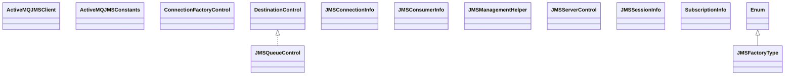

# artemis-jms-client-1.5.0.jar

[Group index](README.md) | [All archives](../README.md)

## Scope and provenance

- **Donor:** `SQX_145_REFERENCE_ROOT/internal/libs/artemis-jms-client-1.5.0.jar`.
- **SHA-256:** `4222e99981a27e0d096b3f27433b0e4149a01c45fc0ddd8251aa0f7ed5c21bec`; accessed 2026-10-06; captured `2026-10-06T18:54:51.906614+00:00`.
- **Classes:** 92 raw entries; 92 unique entry names. Duplicate occurrence indices are zero-based.
- **Inspection:** read-only ZIP hashing and class-file structural parsing; signatures/descriptors, modifiers, hierarchy and references only. Bytecode bodies are hashed, not published.
- **Allocation:** proposed `FEAT-COMPUTE-ARTEMIS-JMS-CLIENT`, P14; [roadmap](../../dev/sqx-full-application-roadmap.md). Domain README registration remains required.
- **Repository:** `01067f00031428613c6394064ca1bcadc1ba00ee`; review state unreviewed. Download label 145-dev1; installed build/activation and runtime equivalence unverified.
- **Limit:** every class/member is inventoried; declaration coverage does not establish consumed calls, defaults, formulas, failure semantics or algorithm parity.
- **Archive/resource index:** [009.json](../../dev/evidence/sqx145/archives/145/009.json).

## Complete member declarations

Member shards contain exact JVM names/descriptors, access flags, generic signatures, throws types, declared fields/methods, superclass/interfaces and referenced class names. All classes, nested/synthetic members and overloads are retained. Code length/hash is structural evidence, not a normalized algorithm comparison.

- [001.json](../../dev/evidence/sqx145/members/009/001.json) — SHA-256 `868ea22cb2cc52ee7f43235093f849fd2bafe2c6d0be1356e76981f1bf198793`.
- [002.json](../../dev/evidence/sqx145/members/009/002.json) — SHA-256 `b0f94adf379c1284a151e14b97b64d4dac51d964327c4fe4f556e6ed22a20949`.

## Focused structural diagram

Up to twelve non-nested classes; arrows show declared inheritance/interfaces only. External type names are not evidence of an available body or an executed dependency.

## Class inventory

| Archive entry | Occurrence | Class SHA-256 | Fields | Methods |
| --- | ---: | --- | ---: | ---: |
| `org/apache/activemq/artemis/api/jms/ActiveMQJMSClient.class` | 0 | `3352ad43e5cad00375101143c6ffc3cf77d1c72901d0a9cf7f6ca85901ba25b8` | 0 | 8 |
| `org/apache/activemq/artemis/api/jms/ActiveMQJMSConstants.class` | 0 | `34b11201ee7b9dfc5412be5c1db3869bb24f73565f3b104d0f95fd9a4bab6abf` | 7 | 1 |
| `org/apache/activemq/artemis/api/jms/JMSFactoryType$1.class` | 0 | `7dab387744f3f4bac466ead9cebe5f70790f022778118956d671f215e234aef8` | 1 | 1 |
| `org/apache/activemq/artemis/api/jms/JMSFactoryType.class` | 0 | `1a0493afc2b2790ca739678106cf9829268016c00363242ac0589b5995db4fb7` | 7 | 6 |
| `org/apache/activemq/artemis/api/jms/management/ConnectionFactoryControl.class` | 0 | `9e85df49aa307d9759456b7a44551d304c2da832ca707a082d22300792a02828` | 0 | 71 |
| `org/apache/activemq/artemis/api/jms/management/DestinationControl.class` | 0 | `29d2f6ca3d45ed4d251406f380903da4707ed4ee104ba0f4e828b7c83251aa17` | 0 | 7 |
| `org/apache/activemq/artemis/api/jms/management/JMSConnectionInfo.class` | 0 | `88c4fc6e21d46ebc9c4d5c3c9e219e9ef751568e111e6a8da4d4c2259442c2d4` | 5 | 7 |
| `org/apache/activemq/artemis/api/jms/management/JMSConsumerInfo.class` | 0 | `dafe2e916d95b7bd4ed49018dad1791dc3ee952505d158462d3121467e5e06e7` | 8 | 10 |
| `org/apache/activemq/artemis/api/jms/management/JMSManagementHelper.class` | 0 | `6fd4f6f8b693b5e111b15b6e3c6212ab4e43592b773d71eb729b052cd4ddc2ec` | 0 | 12 |
| `org/apache/activemq/artemis/api/jms/management/JMSQueueControl.class` | 0 | `87aed76e373d561f7006023a454498dc20e690343034e7fd7429d8d353f45b09` | 0 | 51 |
| `org/apache/activemq/artemis/api/jms/management/JMSServerControl.class` | 0 | `823697a8b880eb85516251e8f35d7dc7a2f4e14814a9c875fdb64ccd3f0125f8` | 0 | 39 |
| `org/apache/activemq/artemis/api/jms/management/JMSSessionInfo.class` | 0 | `5243716bb024e527067ee19cacbe63122e679d3bfa41462d6ce06763207bc7ba` | 2 | 4 |
| `org/apache/activemq/artemis/api/jms/management/SubscriptionInfo.class` | 0 | `65ca2720dfe0c2ba27966c192990c899ef92308196917358a849876f38f4d4e2` | 7 | 9 |
| `org/apache/activemq/artemis/api/jms/management/TopicControl.class` | 0 | `e143086a7cbf161ede20cc0e735c7bbf04f5c5555375a64d3d0517cd5a0dd825` | 0 | 18 |
| `org/apache/activemq/artemis/jms/client/ActiveMQBytesMessage.class` | 0 | `61a1c7b51685c71ea12e90b9f7c710dde0ac700914248295fbd71b442abc3987` | 2 | 37 |
| `org/apache/activemq/artemis/jms/client/ActiveMQConnection$1.class` | 0 | `0f27a360fafbfe2541b82078a78a135fd427b6fd945da0ca9773e56e8251f8d1` | 1 | 2 |
| `org/apache/activemq/artemis/jms/client/ActiveMQConnection$FailoverEventListenerImpl$1.class` | 0 | `b9743115ed7cfd2c03e0a67b218b0d9bff5ffe78aa9fde4cbad26d8e7e4f4490` | 3 | 2 |
| `org/apache/activemq/artemis/jms/client/ActiveMQConnection$FailoverEventListenerImpl.class` | 0 | `0cfe1f38c6c78b4208bf4b03df1863ae23789bc47fd5a21e01fae8346f4349e3` | 1 | 2 |
| `org/apache/activemq/artemis/jms/client/ActiveMQConnection$JMSFailureListener$1.class` | 0 | `5c0c166e0b8c4ecce529a6605b8112f91ee2c84364dc5d01f5260258ba112c66` | 3 | 2 |
| `org/apache/activemq/artemis/jms/client/ActiveMQConnection$JMSFailureListener.class` | 0 | `2324a5bb3220189e7b2aa5c0e1b6c0f7ba966e6905c8338e226f85d041259597` | 1 | 4 |
| `org/apache/activemq/artemis/jms/client/ActiveMQConnection.class` | 0 | `f906f702fcd70d43244766245f6704c14347cf292da273939682da150c75cf9b` | 32 | 53 |
| `org/apache/activemq/artemis/jms/client/ActiveMQConnectionFactory$1.class` | 0 | `560070e2d8f3b15711269d15612e3001649b30eff3587446356925e555b199cb` | 2 | 2 |
| `org/apache/activemq/artemis/jms/client/ActiveMQConnectionFactory.class` | 0 | `d51b3bf226c5dfa8266c3790789531e380b0163de745a308b73bb9b39e8a9566` | 11 | 120 |
| `org/apache/activemq/artemis/jms/client/ActiveMQConnectionForContext.class` | 0 | `6c02f847561df4f8a942c5c588e905bdedafd276d01ab68fd9bc89b4da714890` | 0 | 3 |
| `org/apache/activemq/artemis/jms/client/ActiveMQConnectionForContextImpl$1.class` | 0 | `1f28633e777ca948ca73d262d77f7e77e80fe059dcf7ea6fc20da50084c2650e` | 1 | 2 |
| `org/apache/activemq/artemis/jms/client/ActiveMQConnectionForContextImpl.class` | 0 | `7d40696a5b39ad764e764ef57d6d617fe3c58d2cc46936fd0334d62fd81e1c83` | 3 | 6 |
| `org/apache/activemq/artemis/jms/client/ActiveMQConnectionMetaData.class` | 0 | `aa5324c950dbb6158f37395161d1a051470e7b84c7bf8f5c21b935904fe4aa1b` | 2 | 9 |
| `org/apache/activemq/artemis/jms/client/ActiveMQDestination.class` | 0 | `fbe8e2cfebd6141472ffaf8a12dfe4f8d23d45c729cc703b70a98685e683c4d4` | 21 | 26 |
| `org/apache/activemq/artemis/jms/client/ActiveMQJMSClientBundle.class` | 0 | `85858e5d382bd2e8203f14d06012b200ca582f42b116426b164887b33662349c` | 1 | 17 |
| `org/apache/activemq/artemis/jms/client/ActiveMQJMSClientBundle_$bundle.class` | 0 | `b2ecc5e5ff6fd3452024e06856a744acf12339472519578e922f6186d6f1bf3d` | 18 | 35 |
| `org/apache/activemq/artemis/jms/client/ActiveMQJMSClientLogger.class` | 0 | `03d328eef1b00f424b682367a3350aba88038d73e8559f59306ad78927c4c59b` | 1 | 9 |
| `org/apache/activemq/artemis/jms/client/ActiveMQJMSClientLogger_$logger.class` | 0 | `15c0b7923c37d9405c645fdd902e88a3eadd0a412703f736795d2bb348810df1` | 10 | 18 |
| `org/apache/activemq/artemis/jms/client/ActiveMQJMSConnectionFactory.class` | 0 | `97e4eaeb0714982c16ffed051d543c9b05dd48cb1b43d4c14f47d4d09f7729e4` | 1 | 6 |
| `org/apache/activemq/artemis/jms/client/ActiveMQJMSConsumer$MessageListenerWrapper.class` | 0 | `58be01437b6153f5cfcd1bd3419d5112692b3e23d1593ceba68cece5a2e62ef9` | 2 | 2 |
| `org/apache/activemq/artemis/jms/client/ActiveMQJMSConsumer.class` | 0 | `0ac7d220ce0d7950cf187f75bd5861172a66c88d50426a20f5462c5044e90091` | 2 | 12 |
| `org/apache/activemq/artemis/jms/client/ActiveMQJMSContext.class` | 0 | `20e9a52d037c508d7264856147a79a0104e8823ebdadd09954c789161996337c` | 10 | 54 |
| `org/apache/activemq/artemis/jms/client/ActiveMQJMSProducer$CompletionListenerWrapper.class` | 0 | `021a8f1b5f648386e6905b00824ad55d4d5964a7f0a14e2bdb99d2a83a5351b8` | 2 | 3 |
| `org/apache/activemq/artemis/jms/client/ActiveMQJMSProducer.class` | 0 | `fcc3181fa808adfe763ce7ddcb562af7cad63eb911a3d4222f760024bf12e567` | 9 | 52 |
| `org/apache/activemq/artemis/jms/client/ActiveMQMapMessage.class` | 0 | `2a28fc1c4dc424777f25f73d11c398a9a210aac2cb4b139c2148cba6be4dff39` | 3 | 37 |
| `org/apache/activemq/artemis/jms/client/ActiveMQMessage.class` | 0 | `f41fc08a7d84719c937b354389ce27c138adde4aa82dbcbfe7480537848ce98d` | 13 | 81 |
| `org/apache/activemq/artemis/jms/client/ActiveMQMessageConsumer.class` | 0 | `5495ea5f262b35375dd5a87e2af077c8c22df2809b764d9e3e6e03243f41b547` | 11 | 15 |
| `org/apache/activemq/artemis/jms/client/ActiveMQMessageProducer$1.class` | 0 | `54b1d307819cac256c7b9e1afe844e172f0cd9d647eb8ed4aead54a882416d72` | 0 | 0 |
| `org/apache/activemq/artemis/jms/client/ActiveMQMessageProducer$CompletionListenerWrapper.class` | 0 | `ed50057953cea2562713bf031d3154d0d973cd12a5f804de0aeaa704a3adaab2` | 3 | 4 |
| `org/apache/activemq/artemis/jms/client/ActiveMQMessageProducer.class` | 0 | `06e452633467867cf913af4c6ccdc0f7f6814fba5b701baccc195eaf85bd73c1` | 12 | 38 |
| `org/apache/activemq/artemis/jms/client/ActiveMQObjectMessage.class` | 0 | `e313a32473c119c456486c9ebb3334ee4fe725f5daa3c38224a0e39b5b9a454f` | 3 | 13 |
| `org/apache/activemq/artemis/jms/client/ActiveMQQueue.class` | 0 | `4c463caf61d933a9e96bb6ea234858bfc0f4c3cdfbeda142c8d45e177e38f2d6` | 1 | 7 |
| `org/apache/activemq/artemis/jms/client/ActiveMQQueueBrowser$1.class` | 0 | `9559b31afcce700da4cfa7b7a6fc7999ce6c528dd3797a62a337e4b1b823f8f6` | 0 | 0 |
| `org/apache/activemq/artemis/jms/client/ActiveMQQueueBrowser$BrowserEnumeration.class` | 0 | `0569f800568041cd60c777a8504e1122c0c453d398b494a2bcf9d891842cc893` | 2 | 5 |
| `org/apache/activemq/artemis/jms/client/ActiveMQQueueBrowser.class` | 0 | `120ad4879e81af953b99d52d57f6d2dda281bf28865e6a849a27b5088ab243a6` | 5 | 9 |
| `org/apache/activemq/artemis/jms/client/ActiveMQQueueConnectionFactory.class` | 0 | `52d337bfbeb1a44f24292d31ced09ce2cbc41051bc221ad4f30ea70858c9a4cd` | 1 | 7 |
| `org/apache/activemq/artemis/jms/client/ActiveMQSession$ConsumerDurability.class` | 0 | `05a5d96b1a16d8239d11e059610c66039b9f8555c7a2b0ea07d053173a3b456e` | 3 | 4 |
| `org/apache/activemq/artemis/jms/client/ActiveMQSession.class` | 0 | `218ba82772dfa7284443ff2d359e58288161198ff22f1ac1f258688425859f3c` | 13 | 68 |
| `org/apache/activemq/artemis/jms/client/ActiveMQStreamMessage.class` | 0 | `46e67a17171f71a9a20307a4f57f211f036a84d5ed30ddacbcf9a555f25b616a` | 2 | 33 |
| `org/apache/activemq/artemis/jms/client/ActiveMQTemporaryQueue.class` | 0 | `75cb09b4ec06582c30145586e594490f790dc36364c975d82b499e0b27f1d0d1` | 1 | 2 |
| `org/apache/activemq/artemis/jms/client/ActiveMQTemporaryTopic.class` | 0 | `874e27ad654244409e97e0606fb4e468ec37ee2813c23c7fdeb561cf2300f9e6` | 1 | 1 |
| `org/apache/activemq/artemis/jms/client/ActiveMQTextMessage.class` | 0 | `47c09a1fd64af76a8ddc060b9630003be8b51e86d0c2d09035895773069e47ee` | 2 | 10 |
| `org/apache/activemq/artemis/jms/client/ActiveMQTopic.class` | 0 | `a5f2a4edfa5a8e8d19f3b6575351d8d16335e1f040bceeafd4336b974fdb3c56` | 1 | 6 |
| `org/apache/activemq/artemis/jms/client/ActiveMQTopicConnectionFactory.class` | 0 | `7d9d8625bbbf7c7e04fef7c792b872baba761fae3393af2f68c4d64a8534e053` | 1 | 7 |
| `org/apache/activemq/artemis/jms/client/ActiveMQXAConnection.class` | 0 | `7364000bd958ef09aa557ef8b7ba5fbb9f1d1b9d37c9042ff678b99fdd074920` | 0 | 5 |
| `org/apache/activemq/artemis/jms/client/ActiveMQXAConnectionFactory.class` | 0 | `231be8598d63db3e4d1aedc493c532aed575f31bc0fa146ca828dae234751589` | 1 | 7 |
| `org/apache/activemq/artemis/jms/client/ActiveMQXAJMSContext.class` | 0 | `7d363c63d0f15073527fecf52583e2fbf68dc18a1837f3218b8b862115e42015` | 0 | 1 |
| `org/apache/activemq/artemis/jms/client/ActiveMQXAQueueConnectionFactory.class` | 0 | `bd19bacd59df9c7e74da843bedd5f41247908be4415f91cb6d366e3c75b72fe3` | 1 | 7 |
| `org/apache/activemq/artemis/jms/client/ActiveMQXASession.class` | 0 | `f9df911650032dcf6d221f3fc0750c6d57e33619783b5cf9c75592eb8e38f646` | 0 | 1 |
| `org/apache/activemq/artemis/jms/client/ActiveMQXATopicConnectionFactory.class` | 0 | `53577c65d106124c8a46baf5f2436e24a4d0d18bbe8b8b5818a5b312ed0e5650` | 1 | 7 |
| `org/apache/activemq/artemis/jms/client/ConnectionFactoryOptions.class` | 0 | `172439cbbeb610a56a58abdc0cef9624b3be449ad9b36e84d23b2b2823869d33` | 0 | 4 |
| `org/apache/activemq/artemis/jms/client/DefaultConnectionProperties$1.class` | 0 | `50ad77c03905fe9197b06e1d57e3beed897406298b9c0a849eb29387de0a3f03` | 2 | 3 |
| `org/apache/activemq/artemis/jms/client/DefaultConnectionProperties.class` | 0 | `ff44aa819b245388d59b789e10ede7da11903fc116d5145f8b2624ea09a84729` | 6 | 3 |
| `org/apache/activemq/artemis/jms/client/JMSExceptionHelper$1.class` | 0 | `c22d5da78b8559a587a5045c98f30b0223ccdf8125dfd5d44cf227d36838013e` | 1 | 1 |
| `org/apache/activemq/artemis/jms/client/JMSExceptionHelper.class` | 0 | `e8e62fc2705e23e3e3b05789ec3262421507a35bfbd81ca19c3401b77636fb21` | 0 | 3 |
| `org/apache/activemq/artemis/jms/client/JmsExceptionUtils.class` | 0 | `a03ec1a88c27fddee565887308014c16b01f1b71d5ed94a1813506ac151ce9a8` | 0 | 2 |
| `org/apache/activemq/artemis/jms/client/JMSMessageListenerWrapper.class` | 0 | `57f2efce00b3927b2bf964bc8afb91e644aea2ff4b3638fb7d2bce0559161b4f` | 7 | 2 |
| `org/apache/activemq/artemis/jms/client/ThreadAwareContext.class` | 0 | `fe7aee3c055f8b880b7315d1bba6df5e0ca1ae8d13f25f381a618c1eeb839a3e` | 2 | 7 |
| `org/apache/activemq/artemis/jms/referenceable/ConnectionFactoryObjectFactory.class` | 0 | `f191b915d10989264e6888e694c2844d4aa40e6af73217e9adc7e4fb0871bb8b` | 0 | 2 |
| `org/apache/activemq/artemis/jms/referenceable/DestinationObjectFactory.class` | 0 | `ffa2bfb6332c1e7122fc450a3146d86ae595bb54f3c5025ea723192ed8918f00` | 0 | 2 |
| `org/apache/activemq/artemis/jms/referenceable/SerializableObjectRefAddr.class` | 0 | `fcc64793f48f395f39c15f74ff1b1c38ec77172148e73921a91f4676236b9425` | 2 | 3 |
| `org/apache/activemq/artemis/jndi/ActiveMQInitialContextFactory$1.class` | 0 | `7410756e42a4771d0c864a09bdff15bb591d6d7c458cb22f510209d9c30883f7` | 2 | 2 |
| `org/apache/activemq/artemis/jndi/ActiveMQInitialContextFactory$2.class` | 0 | `bb05fb096c3ad9944e3d3b8bf33775005fcaf526c6fb83e9e56500bc4c590e6d` | 2 | 2 |
| `org/apache/activemq/artemis/jndi/ActiveMQInitialContextFactory.class` | 0 | `d0184ee8e0ddba9079eeba62af8d2eb184fb6b80cd460eaa9db18dee2d1e82d1` | 7 | 12 |
| `org/apache/activemq/artemis/jndi/LazyCreateContext.class` | 0 | `571a10641a3e0d1d3a38037dc62c45f9a6c4c1bc8ee478d0a1e19ee152f826f2` | 0 | 3 |
| `org/apache/activemq/artemis/jndi/NameParserImpl.class` | 0 | `eb4273fbcf40837e67e809e8380cb06a404cc744e69e0d08ef4afc16c4f410d4` | 0 | 2 |
| `org/apache/activemq/artemis/jndi/ReadOnlyContext$1.class` | 0 | `e215988ca5f84ba1831fec448a7601b36cef5e5f5f079100b79f8db22469049e` | 0 | 0 |
| `org/apache/activemq/artemis/jndi/ReadOnlyContext$ListBindingEnumeration.class` | 0 | `07660a32724168cb3c72a658a4f8c08f3c3902b7194fe47877f877322bfd590d` | 1 | 3 |
| `org/apache/activemq/artemis/jndi/ReadOnlyContext$ListEnumeration.class` | 0 | `3724c8db91f7355c4c923d48536b44b526abf6756c205e428808782a039f7f25` | 1 | 3 |
| `org/apache/activemq/artemis/jndi/ReadOnlyContext$LocalNamingEnumeration.class` | 0 | `c8fa16d128e24ee4200771d490f754de1f21a114cdae759a9eabc4c619bb1527` | 2 | 6 |
| `org/apache/activemq/artemis/jndi/ReadOnlyContext.class` | 0 | `4c2b62b8ba260fdb2fde20586432ee16302d571a9697e2a1329ff57201070560` | 9 | 40 |
| `org/apache/activemq/artemis/uri/AbstractCFSchema.class` | 0 | `f67e482218f4470f3a0884d13dc74cf44d8b4da8659ea63d418ac0ae1426ad1f` | 0 | 2 |
| `org/apache/activemq/artemis/uri/ConnectionFactoryParser.class` | 0 | `2b54742864b4164c696884bb8148c5722c23b119c7c1b48eec24f40fc942ed1c` | 0 | 1 |
| `org/apache/activemq/artemis/uri/InVMSchema.class` | 0 | `08e7f35554815208b4265bb628d3265db31c2bc33203f4ad750f24a95b3e7558` | 0 | 6 |
| `org/apache/activemq/artemis/uri/JGroupsSchema.class` | 0 | `803cd4f9669c49a7677b932c6b329c45cd9a0ed1516c2b4c4bbb5a0579b95840` | 0 | 6 |
| `org/apache/activemq/artemis/uri/JMSConnectionOptions.class` | 0 | `5e4f2ff7d00bc11e0ba512725c5941d54f5ea83a51d47dddd8a9ce0ea4e4c9ce` | 1 | 6 |
| `org/apache/activemq/artemis/uri/TCPSchema.class` | 0 | `4e17e0d861c69273891f59c6b41e64298a9da2c0f7376aa514cc093a05799ba7` | 0 | 6 |
| `org/apache/activemq/artemis/uri/UDPSchema.class` | 0 | `691e597eb8c8ab6dc6250f2d863cb434dd5b48092964aa6b95bdfd457b61ffab` | 0 | 6 |
