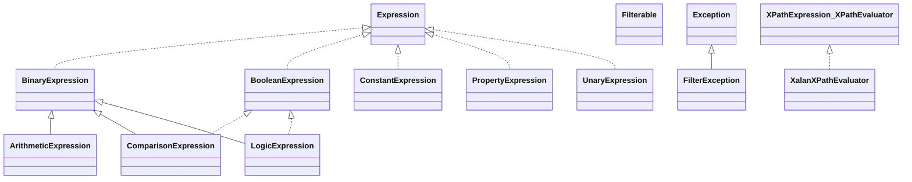

# artemis-selector-1.5.0.jar

[Group index](README.md) | [All archives](../README.md)

## Scope and provenance

- **Donor:** `SQX_145_REFERENCE_ROOT/internal/libs/artemis-selector-1.5.0.jar`.
- **SHA-256:** `e078da2c298014b047e963c5ae88cb885ba9092deb141e55e8fefb2b25edca17`; accessed 2026-10-06; captured `2026-10-06T18:54:51.906614+00:00`.
- **Classes:** 56 raw entries; 56 unique entry names. Duplicate occurrence indices are zero-based.
- **Inspection:** read-only ZIP hashing and class-file structural parsing; signatures/descriptors, modifiers, hierarchy and references only. Bytecode bodies are hashed, not published.
- **Allocation:** proposed `FEAT-COMPUTE-ARTEMIS-SELECTOR`, P14; [roadmap](../../dev/sqx-full-application-roadmap.md). Domain README registration remains required.
- **Repository:** `01067f00031428613c6394064ca1bcadc1ba00ee`; review state unreviewed. Download label 145-dev1; installed build/activation and runtime equivalence unverified.
- **Limit:** every class/member is inventoried; declaration coverage does not establish consumed calls, defaults, formulas, failure semantics or algorithm parity.
- **Archive/resource index:** [010.json](../../dev/evidence/sqx145/archives/145/010.json).

## Complete member declarations

Member shards contain exact JVM names/descriptors, access flags, generic signatures, throws types, declared fields/methods, superclass/interfaces and referenced class names. All classes, nested/synthetic members and overloads are retained. Code length/hash is structural evidence, not a normalized algorithm comparison.

- [001.json](../../dev/evidence/sqx145/members/010/001.json) — SHA-256 `97f41ff7e120ee35afcebacb8fa695e75e326a2ca33afc280886cbce2453db3f`.

## Focused structural diagram

Up to twelve non-nested classes; arrows show declared inheritance/interfaces only. External type names are not evidence of an available body or an executed dependency.

## Class inventory

| Archive entry | Occurrence | Class SHA-256 | Fields | Methods |
| --- | ---: | --- | ---: | ---: |
| `org/apache/activemq/artemis/selector/filter/ArithmeticExpression$1.class` | 0 | `a4a21b308d666c20281a6cf1ff8e7f64706fd95b7d3470beed5726115c8c26a7` | 0 | 3 |
| `org/apache/activemq/artemis/selector/filter/ArithmeticExpression$2.class` | 0 | `87c617e797b870a98125c3271ab4acddb34412125c448cb37215e01ac9190a57` | 0 | 3 |
| `org/apache/activemq/artemis/selector/filter/ArithmeticExpression$3.class` | 0 | `cbd6ca7c42315361b204c79a56e9a3b9fad9a15b5e94e5a88ff26dd1dbe11527` | 0 | 3 |
| `org/apache/activemq/artemis/selector/filter/ArithmeticExpression$4.class` | 0 | `77764fab737b47265c95ff605c52d310e32a883c91ad9f2ed327cfdf173e2ea8` | 0 | 3 |
| `org/apache/activemq/artemis/selector/filter/ArithmeticExpression$5.class` | 0 | `70451ddfbb6284ff1e1a83e016788e0baf3744e190da52020571335ff8ec632e` | 0 | 3 |
| `org/apache/activemq/artemis/selector/filter/ArithmeticExpression.class` | 0 | `6d481deae2dcef55ee5de82b8dd92f59cfe7c57df3e7f21e2f05e25b6a137a97` | 4 | 16 |
| `org/apache/activemq/artemis/selector/filter/BinaryExpression.class` | 0 | `8b62138d909ec5e4422323a1460a8caa0001f34fc37c09479adc8275c1f50bc8` | 2 | 9 |
| `org/apache/activemq/artemis/selector/filter/BooleanExpression.class` | 0 | `b87eb997446bba5d87199f8064e953b2c9c363d3f6e837ccff957ab024521cc6` | 0 | 1 |
| `org/apache/activemq/artemis/selector/filter/ComparisonExpression$1.class` | 0 | `c09d8140da36662b784528af30569e4051bae1458b0ce47a29ed6d79b419a6f9` | 0 | 4 |
| `org/apache/activemq/artemis/selector/filter/ComparisonExpression$2.class` | 0 | `21d73c5dc11e5e97d69e7adddf400243bd2f71760191de2449b85961f0728199` | 0 | 3 |
| `org/apache/activemq/artemis/selector/filter/ComparisonExpression$3.class` | 0 | `8835fd051bffe03da6d0d3fe1aa63371f26cfbae22cc704add2bed6f41b40f51` | 0 | 3 |
| `org/apache/activemq/artemis/selector/filter/ComparisonExpression$4.class` | 0 | `5ec08c295b1ca9855107a399bcf82b60c1d88cb1c22f1b9226469b5549bb7881` | 0 | 3 |
| `org/apache/activemq/artemis/selector/filter/ComparisonExpression$5.class` | 0 | `d51ad09232e7fd3431dca12b36389b55b3564b879f961a74bb1cc0cd36ad9347` | 0 | 3 |
| `org/apache/activemq/artemis/selector/filter/ComparisonExpression$LikeExpression.class` | 0 | `28f8022b78f6ba3db0c29fe3053556695d2047253d697a345ef9e6912afe15be` | 1 | 6 |
| `org/apache/activemq/artemis/selector/filter/ComparisonExpression.class` | 0 | `37124219c6f7255b1158a9bd50a6059f5ec0936be51f2be8d24ba3b5f3902d4f` | 3 | 25 |
| `org/apache/activemq/artemis/selector/filter/ConstantExpression$BooleanConstantExpression.class` | 0 | `c565ca3a1282754a7e70a1557200095827fd9e5c54ac23188f7f752a35933531` | 0 | 2 |
| `org/apache/activemq/artemis/selector/filter/ConstantExpression.class` | 0 | `984c323da98cd495d098d41e2edc76b9de6294ba6a925e66f46a6c783fb31aa6` | 4 | 12 |
| `org/apache/activemq/artemis/selector/filter/Expression.class` | 0 | `a14d6fc530f9a91f7a5e5207cf1dddc80dfeb1f37464d574fd571f657dbf5541` | 0 | 1 |
| `org/apache/activemq/artemis/selector/filter/Filterable.class` | 0 | `9ea8bf43c0a62dcdb938dc43993ffaab520ee770e3b2fad97341222c3276ac4e` | 0 | 3 |
| `org/apache/activemq/artemis/selector/filter/FilterException.class` | 0 | `6204dcd105c678f7691b43d8e7e643df427e15c693ffb3ca1378d969dcd137d3` | 1 | 4 |
| `org/apache/activemq/artemis/selector/filter/LogicExpression$1.class` | 0 | `a0ff01be93f0559abe8bdb4f2c24e3ba8e3efb5ca6bc06432fcc2406f6304cd6` | 0 | 3 |
| `org/apache/activemq/artemis/selector/filter/LogicExpression$2.class` | 0 | `9471484c42ac7f7599d1cb116961329802fdd01a657a00ef82d5a8be6813c12b` | 0 | 3 |
| `org/apache/activemq/artemis/selector/filter/LogicExpression.class` | 0 | `4285f1c33032d5532f289d90b8cdcd56aa98acae8adfdf3a3e089c2344d364ac` | 0 | 5 |
| `org/apache/activemq/artemis/selector/filter/PropertyExpression.class` | 0 | `36c2abbae2fcbabf306953d92e7c5b1f6bbb362f48f655f30d00e82e22bedbee` | 1 | 6 |
| `org/apache/activemq/artemis/selector/filter/UnaryExpression$1.class` | 0 | `7b67253cf7e2fc2071d749151c7ca160aa3efcf5765606d515cb18fab4fca985` | 0 | 3 |
| `org/apache/activemq/artemis/selector/filter/UnaryExpression$2.class` | 0 | `5359903cb8d04edfc67b7fb6b9230b821afbf9f89ddcb17a18e4d0cdb074c3cc` | 2 | 4 |
| `org/apache/activemq/artemis/selector/filter/UnaryExpression$3.class` | 0 | `864b43e40dfea12fc34b2ecbce99010dfeb3c0938b102f5846f0204aed77ac87` | 0 | 3 |
| `org/apache/activemq/artemis/selector/filter/UnaryExpression$4.class` | 0 | `e6e732153ceca9359c80274be7d1cb70d18adfb4b3aab24455ffa07a2d3036e7` | 0 | 4 |
| `org/apache/activemq/artemis/selector/filter/UnaryExpression$BooleanUnaryExpression.class` | 0 | `51a9a50ab1ddede24e5b67d4821b8ec0b3d1ba7184d1b0e4b7020b861e595294` | 0 | 2 |
| `org/apache/activemq/artemis/selector/filter/UnaryExpression.class` | 0 | `dc758b89ae82725811e8e3437b49e03e9d20a018e0181fc5e6f3373b2eaa10b3` | 2 | 16 |
| `org/apache/activemq/artemis/selector/filter/XalanXPathEvaluator.class` | 0 | `7b52e0c6b4278533e451f32aa86861cc45f8af7c90a9a88a90a74c7260373fc0` | 1 | 5 |
| `org/apache/activemq/artemis/selector/filter/XPathExpression$1.class` | 0 | `d4c5cdd8822e878f369c3928cce7bc7642c345d7e58837b6042ce813f43ddc92` | 0 | 2 |
| `org/apache/activemq/artemis/selector/filter/XPathExpression$XPathEvaluator.class` | 0 | `659f3c46b3d2e3be927b99b52e8ef1c11800b8a9c3712b11a3f374a83e177394` | 0 | 1 |
| `org/apache/activemq/artemis/selector/filter/XPathExpression$XPathEvaluatorFactory.class` | 0 | `d30304d2c632aa9cfafa67598f631b880c5566d430bfc8affe379603e50b63d5` | 0 | 1 |
| `org/apache/activemq/artemis/selector/filter/XPathExpression.class` | 0 | `dc1c1b53686ff6466c0bf580e0b22392054c5005e862b6e208ebc6f14dcdbb16` | 3 | 5 |
| `org/apache/activemq/artemis/selector/filter/XQueryExpression.class` | 0 | `a7f5ad2195e4a1d1e0c60d154ed794e5775cdd50f7d1df85ea8490caca08a628` | 1 | 4 |
| `org/apache/activemq/artemis/selector/hyphenated/HyphenatedParser$1.class` | 0 | `64008f42bed4ec1ce2b183866a818b5b91f84b110ecdff46031e7fd3d81c98f4` | 0 | 0 |
| `org/apache/activemq/artemis/selector/hyphenated/HyphenatedParser$LookaheadSuccess.class` | 0 | `c9bd2c76f795f2fcb40a71c760dd1fd13f0149998fe6f78e8767ad1e15bd0f5a` | 0 | 2 |
| `org/apache/activemq/artemis/selector/hyphenated/HyphenatedParser.class` | 0 | `16f72806cfaf26edac0cda3eba40b6633565daaf1b6f339e20087faf88c4a8e1` | 9 | 94 |
| `org/apache/activemq/artemis/selector/hyphenated/HyphenatedParserConstants.class` | 0 | `370a650a82a1a5bb363886849cee787cc6ea43accf3c28fe5ca1c7ad13231ce4` | 25 | 1 |
| `org/apache/activemq/artemis/selector/hyphenated/HyphenatedParserTokenManager.class` | 0 | `f5deb27864c0fe6bb7face59ff6a1cf19a7df88f156e3299afe1435d2ac3a59a` | 19 | 24 |
| `org/apache/activemq/artemis/selector/hyphenated/ParseException.class` | 0 | `d491a5cdf576ba4561727a1569acb34160e2b871fdc665f6bae2f0a390bc7178` | 5 | 5 |
| `org/apache/activemq/artemis/selector/hyphenated/SimpleCharStream.class` | 0 | `e1485f78fb5aa35464d53e8f0e4f81c8e4d82b14b4aad4aa032b6dcb75af79aa` | 16 | 36 |
| `org/apache/activemq/artemis/selector/hyphenated/Token.class` | 0 | `a80766ad1594723163c51afd9cf5b2a83947e25128aa558e875ebc06e316cdb8` | 9 | 7 |
| `org/apache/activemq/artemis/selector/hyphenated/TokenMgrError.class` | 0 | `0a41034b333f7e39d48a51792e3bfd75a1858dbf9fc14fd9d8d6ed965414cf48` | 6 | 6 |
| `org/apache/activemq/artemis/selector/impl/LRUCache.class` | 0 | `b682684ed04029262cf21bd01c8bd7a72158b1ef0131775df3d71ee329c64904` | 2 | 7 |
| `org/apache/activemq/artemis/selector/impl/SelectorParser.class` | 0 | `061b6bcffa1899ddfb501793632d60b40c32ba4b3864327203a211829afdd8d1` | 5 | 4 |
| `org/apache/activemq/artemis/selector/strict/ParseException.class` | 0 | `2e1ee851db46d24cbfb50023b8b752d06d557a294d3a5686ca5d4071ef178f05` | 5 | 5 |
| `org/apache/activemq/artemis/selector/strict/SimpleCharStream.class` | 0 | `683fe27a5d6629149a4eb75bff81e34e6bb1ce718eea994583ea3539598801e4` | 16 | 36 |
| `org/apache/activemq/artemis/selector/strict/StrictParser$1.class` | 0 | `6081b34fdddb6f3a3cfe33b93b8535408007a29d24ece8e70357ca8a978f96ac` | 0 | 0 |
| `org/apache/activemq/artemis/selector/strict/StrictParser$LookaheadSuccess.class` | 0 | `13350b5ea12c957ac265feefebc08459d46ce5cdfefaf45f1edc87e2e29e7063` | 0 | 2 |
| `org/apache/activemq/artemis/selector/strict/StrictParser.class` | 0 | `206a7295ac6a743128884db45ecd00a0a31ff4fbc32ad6cb56b6ba255d6f8d49` | 9 | 94 |
| `org/apache/activemq/artemis/selector/strict/StrictParserConstants.class` | 0 | `17ec81cc3ce1a2f3e1e3e7991133c1c8d0f169968c0b241d35a05086086d7c09` | 25 | 1 |
| `org/apache/activemq/artemis/selector/strict/StrictParserTokenManager.class` | 0 | `0c559f03f9fb4850994028ded4dbf1e816067c06d3c1c88c65c178ea885f7c4a` | 19 | 24 |
| `org/apache/activemq/artemis/selector/strict/Token.class` | 0 | `f97e0294eae74d48c90f4094f2f19332d054202dd5c9248aed46e4a573fdf73c` | 9 | 7 |
| `org/apache/activemq/artemis/selector/strict/TokenMgrError.class` | 0 | `1f0f699877d44d6149d4f01a1de998251fa7afa3ea68755f8efcbc069ab95a61` | 6 | 6 |
